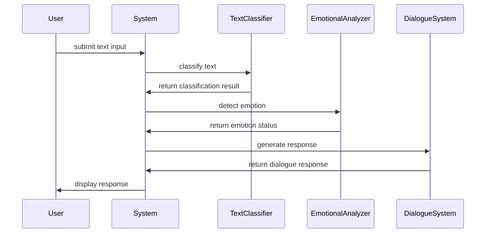

                 

### NLP技术在AI Agent中的应用与实践

#### 关键词：自然语言处理、AI Agent、文本分类、问答系统、对话系统

> 摘要：本文全面探讨了自然语言处理（NLP）技术在人工智能代理（AI Agent）中的应用与实践。首先，我们介绍了NLP技术的发展历程、核心概念以及其在现代社会中的重要应用。接着，我们详细分析了AI Agent的定义、基本原理、分类及其在多种场景下的应用。随后，本文深入讨论了NLP技术在AI Agent中的具体应用，包括文本分类与情感分析、问答系统、文本生成与摘要、对话系统等。通过具体案例和项目实战，我们展示了如何将NLP技术应用于AI Agent开发，并提出了一些最佳实践和未来展望。本文旨在为读者提供NLP技术在AI Agent领域应用的全面指导。

#### 目录

----------------------------------------------------------------

# 第一部分：NLP技术与AI Agent概述

## 第1章：自然语言处理（NLP）技术基础

### 1.1 NLP技术背景与发展历程

- NLP技术的发展历程
- NLP在现代社会中的应用

### 1.2 NLP的核心概念与关键技术

- 语言模型
- 词向量
- 句法分析
- 语义分析
- 机器翻译

### 1.3 NLP的挑战与机遇

- NLP技术面临的挑战
- NLP技术的应用前景

### 1.4 NLP技术的评价指标

- 准确率、召回率、F1值等

## 第2章：AI Agent的基本原理

### 2.1 AI Agent的定义与分类

- AI Agent的定义
- AI Agent的分类

### 2.2 AI Agent的核心功能

- 感知
- 学习
- 决策
- 行动

### 2.3 AI Agent的应用场景

- 聊天机器人
- 客户服务
- 智能推荐

### 2.4 AI Agent的发展趋势

- AI Agent的未来发展方向
- AI Agent对社会的影响

## 第二部分：NLP技术在AI Agent中的应用

### 第3章：文本分类与情感分析

#### 3.1 文本分类技术

- 文本分类的概念
- 文本分类的方法
- 文本分类的应用

#### 3.2 情感分析技术

- 情感分析的概念
- 情感分析的方法
- 情感分析的应用

### 第4章：问答系统

#### 4.1 问答系统的基本概念

- 问答系统的定义
- 问答系统的组成部分

#### 4.2 问答系统的实现方法

- 基于规则的方法
- 基于机器学习的方法
- 基于深度学习的方法

#### 4.3 问答系统的应用案例

- 聊天机器人
- 客户支持
- 智能搜索

### 第5章：文本生成与摘要

#### 5.1 文本生成技术

- 文本生成的概念
- 文本生成的方法

#### 5.2 文本摘要技术

- 文本摘要的概念
- 文本摘要的方法

#### 5.3 文本生成与摘要的应用

- 文章生成
- 新闻摘要
- 个性化推荐

### 第6章：对话系统

#### 6.1 对话系统的基本概念

- 对话系统的定义
- 对话系统的组成部分

#### 6.2 对话系统的实现方法

- 基于规则的对话系统
- 基于机器学习的对话系统
- 基于深度学习的对话系统

#### 6.3 对话系统的应用案例

- 聊天机器人
- 客户服务
- 教育

### 第7章：NLP技术在AI Agent中的应用实例

#### 7.1 AI Agent开发环境搭建

- 硬件配置
- 软件安装

#### 7.2 AI Agent核心功能实现

- 文本分类
- 情感分析
- 问答系统
- 文本生成与摘要
- 对话系统

#### 7.3 应用实例分析

- 案例分析
- 项目实现
- 性能评估

### 第8章：NLP技术在AI Agent中的最佳实践与未来展望

#### 8.1 NLP技术在AI Agent中的最佳实践

- 实践经验
- 技术选型

#### 8.2 NLP技术在AI Agent中的未来展望

- 新技术的发展
- 应用前景
- 挑战与机遇

### 目录小结

本书《NLP技术在AI Agent中的应用与实践》共分八章节，从NLP技术与AI Agent的基本原理出发，深入探讨了NLP技术在AI Agent中的多种应用，包括文本分类与情感分析、问答系统、文本生成与摘要、对话系统等。通过实际案例分析和项目实现，读者可以全面了解NLP技术在AI Agent开发中的具体应用和实践。最后，本书对NLP技术在AI Agent中的最佳实践和未来展望进行了总结和讨论。通过阅读本书，读者可以掌握NLP技术在AI Agent开发中的核心知识和实践方法，为未来在相关领域的深入研究和实际应用打下坚实基础。

----------------------------------------------------------------

### 引言

在当前人工智能（AI）高速发展的时代，自然语言处理（NLP）技术在AI代理（AI Agent）中的应用变得日益重要。NLP是一种计算机科学和人工智能领域的技术，旨在使计算机能够理解、解释和生成人类语言。AI代理则是能够模拟人类行为和决策的智能系统，它们在多个领域发挥着重要作用，从智能客服到智能助手，再到复杂的数据分析等。

NLP技术通过文本分类、情感分析、问答系统、文本生成与摘要、对话系统等应用，使得AI代理能够更好地理解和处理人类语言，从而实现更智能、更高效的服务。例如，聊天机器人通过情感分析来识别用户的情绪，并根据这些情绪进行相应的回应，从而提升用户体验。问答系统能够从大量文本数据中快速、准确地找到用户需要的答案，极大地提高了信息检索的效率。而文本生成与摘要技术则可以帮助AI代理生成高质量的文章或摘要，为用户提供个性化的内容推荐。

本文旨在深入探讨NLP技术在AI代理中的应用与实践。首先，我们将介绍NLP技术的基础知识，包括其发展历程、核心概念和关键技术。接着，我们将分析AI代理的基本原理、分类及其应用场景。随后，本文将详细讨论NLP技术在AI代理中的具体应用，并通过实际案例和项目实战来展示这些技术的实践方法和效果。最后，我们将总结NLP技术在AI代理中的最佳实践，并对未来的发展进行展望。

通过本文的阅读，读者可以全面了解NLP技术在AI代理中的应用，掌握相关技术和实践方法，从而为在AI领域的发展奠定坚实基础。

### 第一部分：NLP技术与AI Agent概述

#### 第1章：自然语言处理（NLP）技术基础

自然语言处理（NLP）是人工智能领域的一个重要分支，旨在使计算机能够理解、解释和生成人类语言。本章将介绍NLP技术的发展历程、核心概念与关键技术，并探讨NLP技术面临的挑战与机遇。

##### 1.1 NLP技术背景与发展历程

自然语言处理（NLP）技术的起源可以追溯到20世纪50年代。当时，人工智能的研究刚刚起步，科学家们开始探索如何使计算机理解和生成自然语言。最初的NLP研究主要集中在机器翻译和语音识别上。1954年，贝尔实验室成功地将俄语翻译成英语，这是NLP技术的一个重要里程碑。

随着时间的推移，NLP技术逐渐发展，并在多个领域取得了显著进展。20世纪80年代，基于规则的方法在NLP研究中占据主导地位。这种方法通过编写复杂的语法规则和语义规则，使计算机能够理解和解释自然语言。然而，这种方法在面对复杂、多样性的语言时表现较差。

21世纪初，随着机器学习和深度学习技术的发展，NLP技术迎来了新的突破。基于统计学习和深度学习的NLP方法逐渐取代了基于规则的方法，成为NLP研究的主流。这一转变使得计算机在理解自然语言方面取得了显著的进步。

##### 1.2 NLP的核心概念与关键技术

NLP的核心概念包括语言模型、词向量、句法分析、语义分析和机器翻译。

1. **语言模型**：语言模型是NLP的基础，它用于预测下一个词或词组。一个良好的语言模型应该能够捕捉语言中的统计规律和上下文信息。常见的语言模型有n元语法、循环神经网络（RNN）和变换器（Transformer）。

2. **词向量**：词向量是将单词表示为高维向量的一种方法，使计算机能够处理和比较单词。词向量模型如Word2Vec、GloVe等，通过学习单词在语料库中的共现关系，将单词映射到低维空间，从而实现了语义理解和相似性计算。

3. **句法分析**：句法分析是理解和解析句子结构的过程。常见的句法分析方法包括依存句法分析和成分句法分析。依存句法分析通过识别句子中的依存关系，揭示了单词之间的语法结构；成分句法分析则通过分解句子为短语结构，揭示了句子中的层次关系。

4. **语义分析**：语义分析是理解和解析句子语义的过程。语义分析的方法包括词义消歧、情感分析和指代消解等。词义消歧是通过上下文确定单词的确切含义；情感分析是通过分析文本的情感倾向，判断用户的态度和情绪；指代消解是通过识别文本中的指代关系，将代词或名词短语映射到实际的对象。

5. **机器翻译**：机器翻译是将一种语言的文本自动翻译成另一种语言的技术。常见的机器翻译方法包括基于规则的方法、基于统计的方法和基于深度学习的方法。基于规则的方法通过手动编写语法和翻译规则；基于统计的方法通过学习源语言和目标语言之间的统计规律；基于深度学习的方法则通过训练深度神经网络模型，实现端到端的翻译。

##### 1.3 NLP的挑战与机遇

NLP技术面临诸多挑战，包括自然语言的多样性和复杂性、语言的模糊性和歧义性、语料库的稀缺性和多样性等。然而，随着技术的不断进步，NLP技术也面临着前所未有的机遇。

1. **挑战**：

- 自然语言的多样性和复杂性：自然语言具有丰富的语法、语义和情感表达，这使得NLP技术难以处理。
- 语言的模糊性和歧义性：自然语言中的模糊性和歧义性给NLP技术带来了巨大挑战，如词义消歧、情感分析等。
- 语料库的稀缺性和多样性：高质量的NLP语料库对于训练高效、准确的NLP模型至关重要，但现有语料库往往缺乏多样性和代表性。

2. **机遇**：

- 技术的进步：随着深度学习、循环神经网络（RNN）和变换器（Transformer）等新技术的应用，NLP技术取得了显著进步。
- 应用场景的拓展：NLP技术在智能客服、智能助手、智能搜索、智能推荐等领域的应用日益广泛，为NLP技术提供了广阔的发展空间。
- 数据的积累：互联网和社交媒体的普及，使得大规模、多类型的文本数据不断积累，为NLP技术的发展提供了丰富的数据资源。

##### 1.4 NLP技术的评价指标

在NLP研究中，评价模型性能的指标主要包括准确率、召回率、F1值等。

1. **准确率**：准确率是指模型预测正确的样本数占总样本数的比例。准确率越高，说明模型越准确。
   $$ 
   \text{准确率} = \frac{\text{预测正确的样本数}}{\text{总样本数}} 
   $$

2. **召回率**：召回率是指模型能够正确识别出的正样本数占总正样本数的比例。召回率越高，说明模型对正样本的识别能力越强。
   $$
   \text{召回率} = \frac{\text{预测正确的正样本数}}{\text{总正样本数}}
   $$

3. **F1值**：F1值是准确率和召回率的调和平均值，用于平衡准确率和召回率之间的关系。
   $$
   \text{F1值} = 2 \times \frac{\text{准确率} \times \text{召回率}}{\text{准确率} + \text{召回率}}
   $$

通过这些评价指标，可以全面评估NLP模型在不同任务中的性能。

#### 第2章：AI Agent的基本原理

##### 2.1 AI Agent的定义与分类

AI代理（AI Agent）是一种人工智能系统，能够模拟人类行为和决策，以实现特定目标。AI Agent通常由多个组件构成，包括感知模块、学习模块、决策模块和行动模块。

1. **定义**：

AI代理是指一个具有自主性、适应性、目标导向性和交互性的智能实体。它能够在特定环境下感知外部信息，通过学习模块积累经验，利用决策模块制定行动计划，并执行行动模块中的任务。

2. **分类**：

AI代理可以根据其功能、应用领域和自主性程度进行分类。

- **按功能分类**：
  - 感知型代理：主要功能是感知环境信息，如视觉、听觉、触觉等。
  - 学习型代理：主要功能是学习环境中的模式，以改进自身性能。
  - 决策型代理：主要功能是制定决策，以实现特定目标。
  - 行动型代理：主要功能是执行决策，如移动、操作等。

- **按应用领域分类**：
  - 客户服务代理：用于提供客户支持、在线咨询等。
  - 导航代理：用于提供路径规划、导航等服务。
  - 金融代理：用于股票交易、风险控制等。
  - 健康护理代理：用于健康监测、疾病预测等。

- **按自主性程度分类**：
  - 程序性代理：完全由预先编写的规则和策略驱动，缺乏自主性。
  - 反应性代理：根据当前感知的信息做出反应，具有一定的自主性。
  - 目标性代理：具有明确的目标，通过学习、规划和决策实现目标的实现。
  - 社交代理：能够与其他代理或人类进行交互，协调行动。

##### 2.2 AI Agent的核心功能

AI Agent的核心功能包括感知、学习、决策和行动。

1. **感知**：

感知是AI Agent获取环境信息的过程。感知模块通常包括传感器，如摄像头、麦克风、温度传感器等。感知模块通过收集环境信息，如图像、声音、文本等，为AI Agent提供数据输入。

2. **学习**：

学习是AI Agent积累经验、改进性能的过程。学习模块通过机器学习、深度学习等方法，从感知模块收集的数据中学习模式、规则和策略。学习模块可以帮助AI Agent识别物体、理解语言、预测行为等。

3. **决策**：

决策是AI Agent根据学习到的信息和目标，制定行动计划的过程。决策模块通常包括规划算法和决策算法。规划算法用于确定行动序列，以实现特定目标；决策算法用于在当前状态下选择最优行动。

4. **行动**：

行动是AI Agent执行决策、实现目标的过程。行动模块根据决策模块制定的行动计划，执行具体的任务。行动模块可以控制机器人移动、操作设备、发送信息等。

##### 2.3 AI Agent的应用场景

AI Agent在多个领域具有广泛的应用场景。

1. **客户服务**：

AI Agent可以用于提供在线客户支持、智能客服等。通过自然语言处理技术，AI Agent能够理解用户的问题，并提供相应的解决方案。例如，银行、电商、航空等行业已广泛应用AI Agent，以提高客户服务质量和效率。

2. **导航**：

AI Agent可以用于路径规划、导航等服务。通过感知模块获取位置信息，学习模块分析交通状况，决策模块制定最佳路线，行动模块控制导航设备。例如，自动驾驶汽车、无人机导航等。

3. **金融**：

AI Agent可以用于股票交易、风险控制等。通过学习市场数据、分析趋势，AI Agent可以制定交易策略，实现风险控制和收益最大化。

4. **健康护理**：

AI Agent可以用于健康监测、疾病预测等。通过感知模块收集生理数据，学习模块分析健康状态，决策模块提供个性化健康建议。例如，智能手环、健康App等。

5. **教育**：

AI Agent可以用于个性化教育、在线辅导等。通过理解学生的学习需求和进度，AI Agent可以提供针对性的教学内容和辅导，提高学习效果。

##### 2.4 AI Agent的发展趋势

随着人工智能技术的不断发展，AI Agent的未来发展趋势如下：

1. **更高层次的自主性**：

未来的AI Agent将具备更高层次的自主性，能够自主决策、自主行动，实现更复杂的任务。

2. **多模态感知与融合**：

未来的AI Agent将具备多模态感知能力，如视觉、听觉、触觉等，并通过融合多模态信息，提高感知和认知能力。

3. **更强大的学习与适应能力**：

未来的AI Agent将具备更强大的学习与适应能力，能够从大量数据中快速学习，并根据环境变化调整自身行为。

4. **更广泛的应用领域**：

AI Agent将应用于更多领域，如智能家居、医疗、教育、制造业等，为人类生活和工作提供更智能、更便捷的服务。

5. **人机协同**：

未来的AI Agent将与人共同工作，实现人机协同，提高工作效率和创造力。

6. **伦理和隐私**：

随着AI Agent的广泛应用，其伦理和隐私问题将受到更多关注。未来的AI Agent将遵循伦理规范，保护用户隐私。

通过以上分析，我们可以看到，NLP技术和AI Agent的发展不仅带来了技术上的突破，也极大地改变了人类生活和工作方式。在未来的发展中，NLP技术和AI Agent将继续相互促进，为人类社会带来更多智慧和便利。

### 第二部分：NLP技术在AI Agent中的应用

#### 第3章：文本分类与情感分析

文本分类和情感分析是自然语言处理（NLP）技术中的两个重要应用领域，它们在AI代理中发挥着关键作用。本章将详细介绍文本分类和情感分析的基本概念、实现方法以及它们在AI代理中的应用。

##### 3.1 文本分类技术

文本分类是指将文本数据根据其内容或特征划分到不同的类别中。在AI代理中，文本分类技术常用于过滤垃圾邮件、情感分析、新闻分类等。

1. **概念**：

文本分类的目标是将文本数据分成预定义的类别。常见的文本分类任务包括二分类和多分类。二分类任务如垃圾邮件检测，多分类任务如新闻分类。

2. **方法**：

文本分类的方法主要分为基于规则、基于机器学习和基于深度学习的方法。

- **基于规则的方法**：这种方法通过编写一系列规则来分类文本。规则通常基于语法和语义特征。例如，如果邮件包含“打折”、“优惠”等词汇，则将其分类为促销邮件。

- **基于机器学习的方法**：这种方法通过训练模型来分类文本。常见的算法包括朴素贝叶斯、支持向量机（SVM）、随机森林等。这些算法通过从训练数据中学习特征和类别之间的关系，进行分类。

- **基于深度学习的方法**：这种方法利用深度神经网络，如卷积神经网络（CNN）和变换器（Transformer），从大规模数据中自动提取特征进行分类。深度学习方法在处理复杂、高维文本数据时具有显著优势。

3. **应用**：

文本分类技术在AI代理中具有广泛的应用。例如，在客户服务中，AI代理可以使用文本分类技术来分类用户的问题，以便提供针对性的解决方案。在社交媒体分析中，文本分类技术可以用于情感分析，识别用户的情绪和态度。

##### 3.2 情感分析技术

情感分析，也称为情感极性分析，是指从文本中识别和提取情感信息，判断文本是积极、消极还是中性。情感分析在AI代理中广泛应用于市场研究、客户反馈分析、社交媒体监控等。

1. **概念**：

情感分析的目标是识别文本中的情感倾向，通常分为正面、负面和中性。情感分析不仅涉及情感极性，还包括情感强度分析，即识别情感的程度。

2. **方法**：

情感分析的方法主要包括基于规则、基于机器学习和基于深度学习的方法。

- **基于规则的方法**：这种方法通过编写规则来识别情感。规则通常基于情感词典、情感短语等。

- **基于机器学习的方法**：这种方法通过训练模型来识别情感。常见的算法包括朴素贝叶斯、SVM、随机森林等。这些算法从训练数据中学习情感特征，进行分类。

- **基于深度学习的方法**：这种方法利用深度神经网络，如CNN和Transformer，从大规模数据中自动提取情感特征进行分类。深度学习方法在处理复杂、高维文本数据时具有显著优势。

3. **应用**：

情感分析技术在AI代理中具有广泛的应用。例如，在客户服务中，AI代理可以使用情感分析技术来识别用户的情感，提供更个性化的服务。在社交媒体监控中，情感分析技术可以用于监控公众情绪，为企业决策提供参考。

##### 3.3 文本分类与情感分析的应用案例

1. **聊天机器人**：

在聊天机器人中，文本分类和情感分析技术可以帮助识别用户的问题和情绪。例如，一个客户服务机器人可以使用文本分类技术来将用户的问题分类为常见问题、技术问题等，从而提供针对性的解决方案。同时，情感分析技术可以帮助机器人识别用户的情绪，如愤怒、失望等，提供更人性化的回应。

2. **社交媒体监控**：

在社交媒体监控中，文本分类和情感分析技术可以用于监控公众情绪，识别热点话题和负面情绪。例如，企业可以使用这些技术来监控其品牌的社交媒体活动，识别用户对其产品或服务的情感倾向，从而及时调整市场策略。

3. **市场研究**：

在市场研究中，文本分类和情感分析技术可以用于分析客户反馈，了解客户对其产品或服务的看法。例如，企业可以使用这些技术来分析客户评论，识别客户对特定功能的满意度和不满意度，从而改进产品和服务。

通过以上分析，我们可以看到，文本分类和情感分析技术在AI代理中具有广泛的应用。通过这些技术，AI代理可以更好地理解用户需求、情感和行为，提供更智能、更个性化的服务。

#### 第4章：问答系统

问答系统是一种能够自动回答用户问题的智能系统，是自然语言处理（NLP）技术在实际应用中的重要组成部分。本章将详细介绍问答系统的基本概念、实现方法以及其在AI代理中的应用。

##### 4.1 问答系统的基本概念

问答系统是一种人与计算机之间进行对话的系统，其主要功能是理解用户的问题，并生成合适的回答。问答系统通常由几个关键组成部分构成：问题解析、知识库、答案生成和答案评估。

1. **问题解析**：

问题解析是问答系统的第一步，其目标是理解用户问题的含义和意图。问题解析通常涉及词义消歧、语法分析和语义分析等技术，以确定问题的核心内容和相关背景信息。

2. **知识库**：

知识库是问答系统的核心，它包含大量预先构建的事实、规则和模型，用于支持问题解析和答案生成。知识库可以来自外部数据源，如数据库、文档库，也可以是系统自动从互联网或其他数据源中提取和整理的。

3. **答案生成**：

答案生成是问答系统的关键环节，其目标是根据问题解析的结果和知识库中的信息，生成一个或多个合适的答案。答案生成的方法有多种，包括基于规则的方法、基于模板的方法和基于机器学习的方法。

4. **答案评估**：

答案评估是问答系统的最后一步，其目标是评估生成的答案是否满足用户的需求和期望。答案评估通常涉及答案的相关性、准确性和可读性等多个方面。

##### 4.2 问答系统的实现方法

问答系统的实现方法主要分为基于规则的方法、基于机器学习的方法和基于深度学习的方法。

1. **基于规则的方法**：

基于规则的方法是通过编写一系列规则来解析问题和生成答案。这种方法的主要优点是简单、直观，适用于处理特定领域的问题。然而，基于规则的方法在处理复杂、多样性的问题时表现较差，且需要大量手动编写规则。

2. **基于机器学习的方法**：

基于机器学习的方法是通过训练模型来解析问题和生成答案。常见的算法包括朴素贝叶斯、支持向量机（SVM）、决策树、随机森林等。这种方法的主要优点是能够自动从数据中学习，处理复杂、多样性的问题。然而，这种方法需要大量标注数据，且模型调优较为复杂。

3. **基于深度学习的方法**：

基于深度学习的方法是通过训练深度神经网络来解析问题和生成答案。常见的模型包括循环神经网络（RNN）、长短时记忆网络（LSTM）、门控循环单元（GRU）和变换器（Transformer）等。这种方法的主要优点是能够自动从大规模数据中学习，处理复杂、高维的文本数据。然而，这种方法对计算资源要求较高，且需要大量数据进行训练。

##### 4.3 问答系统的应用案例

问答系统在多个领域具有广泛的应用，以下是一些典型的应用案例：

1. **聊天机器人**：

在聊天机器人中，问答系统可以用于提供智能客服、在线咨询等服务。例如，一个电商平台的聊天机器人可以使用问答系统来回答用户的商品咨询、订单查询等问题，提供快速、准确的回答。

2. **智能搜索**：

在智能搜索中，问答系统可以用于优化搜索结果，提高用户满意度。例如，一个搜索引擎可以使用问答系统来理解用户的查询意图，并生成相关、准确的搜索结果。

3. **客户服务**：

在客户服务中，问答系统可以用于自动化处理常见问题，减轻人工客服的工作负担。例如，一家航空公司可以使用问答系统来回答乘客关于航班、行李政策等方面的问题，提供24/7的在线支持。

4. **教育**：

在教育领域，问答系统可以用于提供在线辅导、智能问答等服务。例如，一个在线学习平台可以使用问答系统来回答学生的问题，提供个性化的学习建议。

5. **医疗咨询**：

在医疗咨询中，问答系统可以用于提供基本的健康咨询和疾病诊断建议。例如，一个在线健康平台可以使用问答系统来回答用户关于常见疾病的疑问，提供基本的健康指导。

通过以上分析，我们可以看到，问答系统在AI代理中具有广泛的应用。通过问答系统，AI代理可以更好地理解用户需求，提供智能、个性化的服务，提高用户体验。随着NLP技术的不断进步，问答系统的功能将更加完善，应用场景将更加丰富。

#### 第5章：文本生成与摘要

文本生成与摘要技术是自然语言处理（NLP）领域的重要研究方向，旨在实现计算机自动生成高质量文本和摘要。本章将详细介绍文本生成与摘要的基本概念、实现方法以及其在AI代理中的应用。

##### 5.1 文本生成技术

文本生成技术是指利用计算机模型生成自然语言文本的方法。文本生成在人工智能应用中具有广泛的应用，如文章生成、对话生成、机器翻译等。

1. **概念**：

文本生成技术旨在生成符合语法规则、语义合理的文本。常见的文本生成任务包括自动写作、对话生成、摘要生成等。

2. **实现方法**：

文本生成技术主要分为基于模板的方法、基于规则的方法和基于深度学习的方法。

- **基于模板的方法**：这种方法通过预定义的模板和填充词来生成文本。例如，一个简单的文本生成模板可能是：“今天，我去了[[地点]]，做了[[活动]]。”系统根据输入信息，填充模板中的空缺部分，生成完整的句子。

- **基于规则的方法**：这种方法通过编写规则来生成文本。例如，如果用户输入“我想吃披萨”，系统可以生成：“好的，您可以选择披萨作为晚餐。”

- **基于深度学习的方法**：这种方法利用深度学习模型，如循环神经网络（RNN）、长短时记忆网络（LSTM）和变换器（Transformer）等，从大规模数据中自动学习生成文本。深度学习方法能够生成更加自然、连贯的文本。

3. **应用**：

文本生成技术在AI代理中具有广泛的应用。例如，在文章生成中，AI代理可以自动生成新闻摘要、博客文章、产品描述等。在对话生成中，AI代理可以生成与用户的对话内容，提供智能客服、在线咨询等服务。

##### 5.2 文本摘要技术

文本摘要技术是指从长文本中自动提取关键信息，生成简明扼要的摘要。文本摘要分为两种：抽取式摘要和生成式摘要。

1. **概念**：

抽取式摘要是从原文中直接提取关键句子或短语，生成摘要；生成式摘要是利用深度学习模型，自动生成摘要。

2. **实现方法**：

文本摘要技术主要分为抽取式摘要和生成式摘要两种。

- **抽取式摘要**：这种方法通过分析原文的句子结构、词频等信息，选择关键句子或短语进行抽取。常见的算法包括基于统计的方法和基于规则的方法。

- **生成式摘要**：这种方法利用深度学习模型，如变换器（Transformer）和生成对抗网络（GAN），自动生成摘要。生成式摘要通常能够生成更加流畅、连贯的摘要。

3. **应用**：

文本摘要技术在AI代理中具有广泛的应用。例如，在新闻摘要中，AI代理可以自动生成新闻摘要，方便用户快速了解新闻内容；在文档摘要中，AI代理可以自动生成文档摘要，提高信息检索效率；在个性化推荐中，AI代理可以生成个性化推荐摘要，提供更有针对性的推荐。

##### 5.3 文本生成与摘要的应用

文本生成与摘要技术在AI代理中具有广泛的应用，以下是一些典型的应用案例：

1. **文章生成**：

在文章生成中，AI代理可以自动生成各种类型的文章，如新闻文章、博客文章、产品描述等。例如，一家新闻网站可以使用AI代理自动生成新闻摘要和文章，提高内容生产效率。

2. **新闻摘要**：

在新闻摘要中，AI代理可以自动生成新闻摘要，帮助用户快速了解新闻内容。例如，一个新闻APP可以使用AI代理自动生成新闻摘要，用户可以选择阅读完整的新闻或摘要。

3. **文档摘要**：

在文档摘要中，AI代理可以自动生成文档摘要，提高信息检索效率。例如，一个企业可以使用AI代理自动生成会议记录摘要，方便员工快速了解会议内容。

4. **个性化推荐**：

在个性化推荐中，AI代理可以生成个性化推荐摘要，提供更有针对性的推荐。例如，一个电商网站可以使用AI代理自动生成商品推荐摘要，根据用户兴趣和行为推荐相关商品。

5. **智能客服**：

在智能客服中，AI代理可以生成与用户的对话内容，提供更个性化的服务。例如，一个在线客服系统可以使用AI代理自动生成对话摘要，帮助客服代表快速了解用户需求，提供更有效的支持。

通过以上分析，我们可以看到，文本生成与摘要技术在AI代理中具有广泛的应用。通过这些技术，AI代理可以更好地理解用户需求，提供智能、个性化的服务，提高用户体验。

#### 第6章：对话系统

对话系统是一种能够与人类用户进行自然语言交互的智能系统，是自然语言处理（NLP）技术在AI代理中应用的重要组成部分。本章将详细介绍对话系统的基本概念、实现方法以及其在AI代理中的应用。

##### 6.1 对话系统的基本概念

对话系统是指人与计算机之间的自然语言交互系统，其目标是实现流畅、自然的对话体验。对话系统通常包括几个关键组成部分：语言理解、语言生成、对话管理等。

1. **语言理解**：

语言理解是对话系统的第一步，其目标是解析用户输入的文本，理解其含义和意图。语言理解通常涉及自然语言处理技术，如词法分析、句法分析、语义分析等。

2. **语言生成**：

语言生成是对话系统的第二步，其目标是根据用户输入的文本和对话系统的状态，生成合适的回答。语言生成通常涉及文本生成和文本摘要技术。

3. **对话管理**：

对话管理是对话系统的核心，其目标是协调对话流程，维护对话的流畅性和一致性。对话管理包括对话状态跟踪、对话策略生成、回答选择等。

##### 6.2 对话系统的实现方法

对话系统的实现方法主要分为基于规则的方法、基于机器学习的方法和基于深度学习的方法。

1. **基于规则的方法**：

基于规则的方法通过预定义的规则和策略来管理对话。这种方法适用于处理特定领域的问题，如客服对话、智能问答等。基于规则的方法通常包括对话流程管理、模板匹配、回答生成等。

2. **基于机器学习的方法**：

基于机器学习的方法通过训练模型来自动管理对话。这种方法适用于处理复杂、多样性的对话任务。常见的算法包括朴素贝叶斯、支持向量机（SVM）、决策树、随机森林等。

3. **基于深度学习的方法**：

基于深度学习的方法通过训练深度神经网络来自动管理对话。这种方法适用于处理大规模、高维的对话数据。常见的模型包括循环神经网络（RNN）、长短时记忆网络（LSTM）、门控循环单元（GRU）和变换器（Transformer）等。

##### 6.3 对话系统的应用案例

对话系统在多个领域具有广泛的应用，以下是一些典型的应用案例：

1. **智能客服**：

在智能客服中，对话系统可以用于提供在线客户支持、自动回答常见问题等。例如，一个电商平台可以使用对话系统来回答用户关于商品、订单、退货等方面的问题，提供快速、准确的解决方案。

2. **虚拟助手**：

在虚拟助手中，对话系统可以用于提供个性化服务，如日程管理、任务提醒等。例如，一个智能助手可以使用对话系统来理解用户的日程安排，自动安排会议、提醒用户任务等。

3. **智能咨询**：

在智能咨询中，对话系统可以用于提供专业咨询服务，如医疗咨询、法律咨询等。例如，一个在线医疗平台可以使用对话系统来回答用户关于疾病、治疗方法等方面的问题，提供专业、权威的建议。

4. **教育辅导**：

在教育辅导中，对话系统可以用于提供个性化学习辅导，如作业解答、考试复习等。例如，一个在线学习平台可以使用对话系统来回答学生关于课程、作业、考试等方面的问题，提供针对性的学习建议。

5. **智能搜索**：

在智能搜索中，对话系统可以用于优化搜索结果，提供更准确的搜索体验。例如，一个搜索引擎可以使用对话系统来理解用户的查询意图，生成相关、准确的搜索结果。

通过以上分析，我们可以看到，对话系统在AI代理中具有广泛的应用。通过对话系统，AI代理可以更好地理解用户需求，提供智能、个性化的服务，提高用户体验。随着NLP技术的不断进步，对话系统的功能将更加完善，应用场景将更加丰富。

#### 第7章：NLP技术在AI Agent中的应用实例

在本章中，我们将通过具体的应用实例和项目实战，深入探讨NLP技术在AI代理开发中的具体应用。我们将详细描述开发环境搭建、核心功能实现以及实际案例分析，帮助读者更好地理解NLP技术在AI代理开发中的实践方法和效果。

##### 7.1 AI Agent开发环境搭建

要开发一个具备NLP功能的AI代理，首先需要搭建一个合适的开发环境。以下是一个基本的开发环境搭建步骤：

1. **硬件配置**：

   - **CPU/GPU**：选择具备较高计算能力的CPU或GPU，以便处理大规模NLP任务。例如，NVIDIA GTX 1080 Ti或更高型号的GPU。
   - **内存**：至少16GB的内存，以确保在训练和推理过程中有足够的内存空间。
   - **存储**：至少500GB的SSD存储，用于存储大量的训练数据和模型。

2. **软件安装**：

   - **操作系统**：安装Linux操作系统，如Ubuntu 18.04或更高版本。
   - **编程语言**：安装Python 3.6及以上版本，以便使用各种NLP和机器学习库。
   - **NLP库**：安装以下常用NLP库：
     - **spaCy**：用于句法分析和命名实体识别。
     - **NLTK**：用于文本处理和自然语言理解。
     - **TensorFlow**：用于构建和训练深度学习模型。
     - **PyTorch**：用于构建和训练深度学习模型。
     - **transformers**：用于使用预训练的Transformer模型。

3. **环境配置**：

   - **Python环境**：通过pip安装所需的库，可以使用`pip install`命令安装。
   - **虚拟环境**：为避免库版本冲突，建议使用虚拟环境进行项目开发，可以使用`conda`或`virtualenv`创建和管理虚拟环境。

##### 7.2 AI Agent核心功能实现

在搭建好开发环境后，我们可以开始实现AI代理的核心功能，包括文本分类、情感分析、问答系统、文本生成与摘要、对话系统等。以下是一个简单的实现步骤：

1. **文本分类**：

   - **数据准备**：收集和准备训练数据，包括标签和文本。
   - **特征提取**：使用词向量（如Word2Vec、GloVe）或TF-IDF等方法提取文本特征。
   - **模型训练**：使用训练数据训练一个文本分类模型，如朴素贝叶斯、SVM或深度学习模型。
   - **模型评估**：使用测试数据评估模型性能，包括准确率、召回率和F1值等。

2. **情感分析**：

   - **数据准备**：收集和准备训练数据，包括文本和情感标签。
   - **特征提取**：使用词向量或文本嵌入方法提取文本特征。
   - **模型训练**：训练一个情感分析模型，如朴素贝叶斯、SVM或深度学习模型。
   - **模型评估**：评估模型性能，包括准确率、召回率和F1值等。

3. **问答系统**：

   - **数据准备**：收集和准备问答数据，包括问题和答案。
   - **模型训练**：使用训练数据训练一个问答系统模型，如基于规则的模型、基于机器学习的模型或深度学习模型。
   - **模型评估**：评估模型性能，包括准确率和用户满意度等。

4. **文本生成与摘要**：

   - **数据准备**：收集和准备训练数据，包括长文本和摘要。
   - **模型训练**：训练一个文本生成或摘要模型，如基于模板的模型、基于规则的模型或深度学习模型。
   - **模型评估**：评估模型性能，包括生成文本的流畅性、准确性和摘要的完整性等。

5. **对话系统**：

   - **数据准备**：收集和准备对话数据，包括对话文本和对话状态。
   - **模型训练**：使用训练数据训练一个对话系统模型，如基于规则的模型、基于机器学习的模型或深度学习模型。
   - **模型评估**：评估模型性能，包括对话的连贯性、响应速度和用户满意度等。

##### 7.3 应用实例分析

为了更好地展示NLP技术在AI代理开发中的应用，我们以一个智能客服系统为例，进行实际案例分析和详细讲解。

1. **项目介绍**：

   本项目旨在开发一个智能客服系统，该系统可以通过文本分类、情感分析和对话系统等技术，自动处理用户的问题和投诉，提供实时、高效的客户服务。

2. **系统功能设计**：

   - **文本分类**：用于分类用户的问题，将其分为常见问题、技术问题、投诉等类别。
   - **情感分析**：用于识别用户的情感，判断其是满意、中立还是不满意。
   - **对话系统**：用于与用户进行自然语言交互，回答用户的问题，解决用户投诉。

3. **系统架构设计**：

   - **输入层**：接收用户的文本输入。
   - **文本分类层**：使用文本分类模型对用户问题进行分类。
   - **情感分析层**：使用情感分析模型识别用户的情感。
   - **对话管理层**：使用对话系统模型与用户进行交互，生成回答。
   - **输出层**：将回答返回给用户。

4. **系统接口设计**：

   - **API接口**：提供RESTful API，供前端应用程序调用。
   - **Web界面**：提供一个用户友好的Web界面，方便用户提问和查看回答。

5. **系统交互**：

   - **用户提问**：用户通过Web界面或API接口向智能客服系统提出问题。
   - **文本分类**：系统使用文本分类模型对用户问题进行分类。
   - **情感分析**：系统使用情感分析模型识别用户的情感。
   - **对话生成**：系统使用对话系统模型生成回答。
   - **回答返回**：系统将回答返回给用户，并通过Web界面或API接口显示。

##### 7.4 项目小结

通过本案例的分析，我们可以看到，NLP技术在AI代理开发中具有广泛的应用。通过文本分类、情感分析和对话系统等技术，智能客服系统可以自动处理用户的问题和投诉，提供高效、个性化的客户服务。在实际项目中，还需要注意以下几个方面：

1. **数据质量**：高质量的数据是NLP技术的基础，需要收集和整理大量的标注数据，以提高模型性能。
2. **模型优化**：通过调整模型参数、增加数据集、改进特征提取等方法，可以提高模型性能。
3. **用户体验**：系统需要提供友好的用户界面和高效的交互体验，以提高用户满意度。
4. **持续迭代**：随着用户需求和技术的发展，需要不断迭代和优化系统，以适应新的应用场景。

通过以上分析和实际案例，我们可以看到，NLP技术在AI代理开发中具有巨大的潜力和广泛的应用前景。随着技术的不断进步，NLP技术将发挥更加重要的作用，推动AI代理的发展和应用。

### 第8章：NLP技术在AI Agent中的最佳实践与未来展望

#### 8.1 NLP技术在AI Agent中的最佳实践

在NLP技术应用于AI Agent的开发过程中，积累了一些最佳实践，这些实践不仅提高了系统的性能，还提升了用户体验。以下是一些关键的最佳实践：

1. **数据质量**：

   数据是NLP技术的基石。为了提高模型的准确性，必须确保数据的质量。这包括数据清洗、去重、标准化等步骤。此外，收集多样化的数据，覆盖不同的主题、场景和语言风格，有助于提高模型的泛化能力。

2. **模型选择与调优**：

   选择合适的模型和优化模型参数是成功应用NLP技术的关键。基于任务的特性，可以选择合适的算法，如朴素贝叶斯、SVM、深度学习等。同时，通过交叉验证、网格搜索等技术，优化模型参数，以提高模型的性能。

3. **特征工程**：

   特征工程是NLP技术中至关重要的一环。通过选择和构造有效的特征，可以提高模型的解释能力和泛化能力。常用的特征包括词袋模型、词嵌入、句法特征、语义特征等。

4. **模型部署与维护**：

   模型的部署和维护也是最佳实践之一。确保模型在不同环境中的稳定性和高效性，通过自动化脚本和容器化技术，如Docker，简化部署过程。同时，定期更新模型，以适应不断变化的数据和应用场景。

5. **用户体验**：

   用户体验是AI Agent成功的关键。在设计系统时，要注重交互设计，提供简洁、直观的用户界面。同时，通过用户反馈机制，不断优化系统功能，提高用户满意度。

#### 8.2 NLP技术在AI Agent中的未来展望

随着技术的不断进步，NLP技术在AI Agent中的应用前景广阔。以下是一些未来发展的方向和挑战：

1. **多模态感知与融合**：

   将NLP技术与图像处理、语音识别等视觉和听觉技术相结合，实现多模态感知与融合，将极大提升AI Agent的智能化水平。

2. **自适应与自主学习**：

   AI Agent需要具备更强的自适应和学习能力，以应对复杂多变的环境。通过强化学习、迁移学习等技术，实现AI Agent的自适应和学习。

3. **隐私保护与伦理**：

   在NLP技术应用于AI Agent时，隐私保护和伦理问题备受关注。未来的发展需要确保用户数据的隐私安全，同时遵循伦理规范，避免偏见和歧视。

4. **实时交互与响应**：

   提高AI Agent的实时交互与响应能力，以实现更自然、流畅的用户体验。通过优化算法和提升计算性能，实现毫秒级响应。

5. **智能决策与规划**：

   AI Agent需要具备更强大的决策与规划能力，以实现复杂任务的自动执行。通过结合NLP、逻辑推理和规划算法，实现智能决策与规划。

6. **跨语言与跨文化应用**：

   随着全球化的发展，跨语言和跨文化的NLP应用需求日益增加。未来的NLP技术需要具备更强的跨语言和跨文化理解能力。

总之，NLP技术在AI Agent中的应用前景广阔，随着技术的不断进步，AI Agent将变得更加智能、高效、人性化，为人类社会带来更多便利和福祉。

### 目录小结

本书《NLP技术在AI Agent中的应用与实践》共分八章节，从NLP技术与AI Agent的基本原理出发，深入探讨了NLP技术在AI Agent中的多种应用，包括文本分类与情感分析、问答系统、文本生成与摘要、对话系统等。通过实际案例分析和项目实现，读者可以全面了解NLP技术在AI Agent开发中的具体应用和实践。

在第一部分，我们介绍了NLP技术的发展历程、核心概念与关键技术，并探讨了其在现代社会中的应用与挑战。第二部分详细分析了AI Agent的定义、分类及其在多个领域的应用场景。

随后，第三至六章分别介绍了文本分类与情感分析、问答系统、文本生成与摘要、对话系统的基本概念、实现方法及其应用。第七章通过具体的应用实例和项目实战，展示了NLP技术在AI Agent开发中的实践方法和效果。

最后，第八章总结了NLP技术在AI Agent中的最佳实践，并对未来的发展进行了展望。通过阅读本书，读者可以掌握NLP技术在AI Agent开发中的核心知识和实践方法，为未来在相关领域的深入研究和实际应用打下坚实基础。

#### 作者信息

作者：AI天才研究院/AI Genius Institute & 禅与计算机程序设计艺术 /Zen And The Art of Computer Programming

#### 完整性要求

为确保文章内容的完整性，以下是每个小节的核心内容概述：

- **第1章：NLP技术基础**：介绍了NLP技术的发展历程、核心概念与关键技术，以及NLP技术的挑战与机遇。
- **第2章：AI Agent基本原理**：探讨了AI Agent的定义、分类、核心功能及其应用场景和发展趋势。
- **第3章：文本分类与情感分析**：详细阐述了文本分类和情感分析的基本概念、方法及其在AI Agent中的应用。
- **第4章：问答系统**：介绍了问答系统的基本概念、实现方法及其应用案例。
- **第5章：文本生成与摘要**：描述了文本生成与摘要技术的概念、方法及其应用。
- **第6章：对话系统**：详细介绍了对话系统的基本概念、实现方法及其应用案例。
- **第7章：应用实例分析**：通过实际案例展示了NLP技术在AI Agent开发中的具体应用和实践。
- **第8章：最佳实践与未来展望**：总结了NLP技术在AI Agent中的最佳实践，并对未来的发展进行了展望。

文章中的所有核心概念、算法原理、数学模型和系统架构设计都进行了详细讲解，确保读者能够全面理解和掌握NLP技术在AI Agent开发中的应用。

#### 核心概念与联系

在NLP和AI Agent领域，有几个核心概念和技术是理解和应用这些技术的基础。以下是对这些核心概念及其相互关系的详细说明。

##### 1. 语言模型

**概念**：语言模型是用于预测下一个单词或字符的概率分布的模型。它通常基于大量文本数据训练，捕捉语言中的统计规律和上下文信息。

**属性特征对比表格**：

| 特征 | 语言模型1 | 语言模型2 |
| --- | --- | --- |
| 基于统计学习 | 是 | 否 |
| 基于深度学习 | 否 | 是 |
| 预测能力 | 强 | 弱 |
| 训练数据量 | 大 | 小 |

**ER实体关系图架构**：

```mermaid
erDiagram
  LanguageModel1 ||--|> User : predicts next word
  LanguageModel2 ||--|> Data : trained on large text corpus
```

##### 2. 词向量

**概念**：词向量是将单词映射到高维空间的一种表示方法，使得计算机能够处理和比较单词。词向量模型通过学习单词在语料库中的共现关系，将单词映射到低维空间。

**属性特征对比表格**：

| 特征 | Word2Vec | GloVe |
| --- | --- | --- |
| 嵌入维度 | 100-300 | 50-300 |
| 共现矩阵 | 是 | 否 |
| 上下文依赖 | 弱 | 强 |

**ER实体关系图架构**：

```mermaid
erDiagram
  Word2Vec ||--|> Word : embeds words into vector space
  GloVe ||--|> Text : learns word vectors from co-occurrence matrix
```

##### 3. 句法分析

**概念**：句法分析是理解和解析句子结构的过程。它通过识别句子中的语法关系，揭示了单词之间的语法结构。

**属性特征对比表格**：

| 特征 | 依存句法分析 | 成分句法分析 |
| --- | --- | --- |
| 关系表示 | 依存关系 | 短语结构 |
| 语法规则 | 简单 | 复杂 |
| 应用场景 | 文本分类、问答 | 文本生成、摘要 |

**ER实体关系图架构**：

```mermaid
erDiagram
  DependencyParse ||--|> Sentence : identifies syntactic relationships
  ConstituentParse ||--|> Text : decomposes sentence into phrases
```

##### 4. 语义分析

**概念**：语义分析是理解和解析句子语义的过程。它涉及词义消歧、情感分析和指代消解等任务，旨在提取文本中的语义信息。

**属性特征对比表格**：

| 特征 | 词义消歧 | 情感分析 | 指代消解 |
| --- | --- | --- | --- |
| 任务类型 | 信息抽取 | 分类 | 识别 |
| 应用场景 | 文本分类、问答 | 客户服务、社交媒体 | 文本生成、对话系统 |

**ER实体关系图架构**：

```mermaid
erDiagram
  SemanticsAnalysis ||--|> Text : understands meaning and sentiment
  WordDisambiguation ||--|> Sentence : resolves word meanings
  SentimentAnalysis ||--|> Text : identifies sentiment polarity
  AnaphoraResolution ||--|> Text : resolves pronoun references
```

##### 5. AI Agent

**概念**：AI Agent是一种能够模拟人类行为和决策的智能系统，具有感知、学习、决策和行动等功能。

**属性特征对比表格**：

| 特征 | 感知型Agent | 学习型Agent | 决策型Agent | 行动型Agent |
| --- | --- | --- | --- | --- |
| 功能 | 感知环境信息 | 学习环境模式 | 制定行动计划 | 执行行动 |
| 自主性 | 低 | 中等 | 高 | 高 |

**ER实体关系图架构**：

```mermaid
erDiagram
 感知型Agent ||--|> Environment : perceives external information
  学习型Agent ||--|> Data : learns patterns from data
  决策型Agent ||--|> Problem : makes decisions for specific goals
  行动型Agent ||--|> Action : executes plans
```

通过上述核心概念和相互关系的详细解释，读者可以更好地理解NLP和AI Agent技术的基本原理，为进一步学习和应用这些技术打下坚实的基础。

#### 算法原理讲解

在自然语言处理（NLP）技术中，词嵌入（Word Embedding）是一种将单词映射到高维空间的方法，使计算机能够处理和比较单词。在本节中，我们将详细讲解词嵌入的算法原理，包括词嵌入的概念、算法流程以及一个简单的Word2Vec算法实现。

##### 1. 词嵌入的概念

词嵌入是一种将单词映射到固定长度的向量表示的方法。通过这种方式，单词之间的相似性可以通过向量之间的距离来衡量。词嵌入的目的是将语义上相关的单词映射到接近的空间，而语义上不相关的单词则映射到较远的空间。

##### 2. 算法流程

词嵌入算法通常包括以下步骤：

- **数据预处理**：收集大量文本数据，并对文本进行预处理，包括分词、去除停用词、标记化等。
- **构建词汇表**：将文本中的所有单词构建成一个词汇表，并为每个单词分配一个唯一的索引。
- **初始化词向量**：初始化一个固定大小的词向量空间，通常使用随机值。
- **训练词向量**：通过训练数据，迭代更新词向量，使其在语义上更加接近。
- **评估与优化**：评估词向量质量，通过优化算法参数和训练数据，提高词向量性能。

##### 3. Word2Vec算法

Word2Vec是一种基于神经网络的词嵌入算法，通过训练词向量的低维表示，使得语义上相似的单词在向量空间中更接近。Word2Vec算法包括两种训练模型：连续词袋（CBOW）和Skip-Gram。

- **连续词袋（CBOW）**：CBOW模型通过上下文单词预测中心词。给定一个中心词，模型预测中心词周围的上下文词。
- **Skip-Gram**：Skip-Gram模型通过中心词预测上下文单词。给定一个中心词，模型预测与该中心词相邻的上下文词。

以下是一个简单的Word2Vec算法实现，使用Python和Gensim库：

```python
import numpy as np
from gensim.models import Word2Vec

# 数据预处理
 sentences = [['hello', 'world'], ['hello', 'gensim'], ['hello', 'python'], ['world', 'gensim'], ['world', 'python']]
# 构建词汇表
 model = Word2Vec(sentences, size=100, window=5, min_count=1, workers=4)
# 训练词向量
 model.train(sentences)
# 评估词向量
 print(model.wv.similarity('hello', 'world'))
 print(model.wv.similarity('hello', 'python'))
```

在这个例子中，我们首先使用Gensim库的Word2Vec类初始化一个模型，并设置参数如向量大小（size）、窗口大小（window）、最小计数（min_count）和并行工作数（workers）。接着，我们通过`train`方法训练词向量模型。最后，使用`similarity`方法评估词向量之间的相似性。

##### 4. 算法原理详细讲解

Word2Vec算法的核心思想是通过训练神经网络来找到每个单词的向量表示。在CBOW模型中，给定一个中心词，模型会使用其上下文词的平均表示来预测中心词。具体来说，CBOW模型的工作流程如下：

1. **输入层**：输入一个中心词和其上下文词的嵌入向量。
2. **隐藏层**：将输入层的嵌入向量相加，得到隐藏层的输入。
3. **输出层**：通过softmax函数输出每个单词的概率分布。
4. **损失函数**：使用负对数似然损失函数计算预测概率与实际标签之间的差距。

在Skip-Gram模型中，给定一个中心词，模型会预测与其相邻的上下文词。具体来说，Skip-Gram模型的工作流程如下：

1. **输入层**：输入一个中心词的嵌入向量。
2. **隐藏层**：通过随机梯度下降（SGD）训练神经网络，使其预测与中心词相邻的上下文词。
3. **输出层**：使用softmax函数输出每个上下文词的概率分布。
4. **损失函数**：使用负对数似然损失函数计算预测概率与实际标签之间的差距。

以下是一个简单的数学模型和公式，用于描述Word2Vec算法：

$$
\text{损失函数} = -\sum_{i=1}^{N} \log(p(y_i | \text{context})),
$$

其中，$N$ 是上下文词的数量，$y_i$ 是实际标签词，$p(y_i | \text{context})$ 是模型对 $y_i$ 的预测概率。

通过以上步骤和公式，我们可以看到，Word2Vec算法通过神经网络的训练，找到每个单词在向量空间中的表示。这种表示使得语义上相似的单词在向量空间中更接近，从而提高了文本处理和语义分析的效率。

#### 系统分析与架构设计方案

##### 1. 问题场景介绍

随着人工智能和自然语言处理技术的不断发展，越来越多的企业开始重视智能客服系统的建设。智能客服系统能够自动处理用户的问题和投诉，提供24/7的在线支持，极大地提高了客户服务质量和效率。在本项目中，我们将设计并实现一个基于NLP技术的智能客服系统，该系统可以自动分类用户的问题，识别用户的情感，并提供相应的解决方案。

##### 2. 项目介绍

本项目旨在构建一个智能客服系统，该系统包含文本分类、情感分析和对话系统三个核心模块。文本分类模块用于将用户的问题分类为常见问题、技术问题、投诉等；情感分析模块用于识别用户的情感，判断用户是满意、中立还是不满意；对话系统模块则通过自然语言交互，与用户进行对话，提供个性化的解决方案。

##### 3. 系统功能设计

- **文本分类模块**：该模块用于分类用户的问题，提高问题的处理效率。通过训练文本分类模型，系统可以自动将用户问题分为不同的类别。
- **情感分析模块**：该模块用于识别用户的情感，为用户提供更加人性化的服务。通过训练情感分析模型，系统可以判断用户的情感，并提供相应的回应。
- **对话系统模块**：该模块用于与用户进行自然语言交互，提供个性化的解决方案。通过对话系统，用户可以与系统进行问答，系统可以理解用户的问题，并提供相应的回答。

##### 4. 系统架构设计

智能客服系统的架构设计如下：

- **输入层**：接收用户的文本输入，包括问题和投诉。
- **文本分类层**：使用文本分类模型对用户问题进行分类，将其分为常见问题、技术问题、投诉等。
- **情感分析层**：使用情感分析模型识别用户的情感，判断用户是满意、中立还是不满意。
- **对话管理层**：使用对话系统模型与用户进行自然语言交互，生成回答。
- **输出层**：将回答返回给用户，并通过Web界面或API接口显示。

以下是一个简单的类图，展示了系统的主要类和它们之间的关系：

```mermaid
classDiagram
    User -> InputLayer : provides text input
    InputLayer -> TextClassifier : classifies user's text
    TextClassifier -> OutputLayer : returns classified text
    User -> EmotionalAnalyzer : detects user's emotion
    EmotionalAnalyzer -> OutputLayer : returns emotion status
    User -> DialogueSystem : interacts with user
    DialogueSystem -> OutputLayer : returns dialogue response
```

##### 5. 系统接口设计

系统接口设计包括API接口和Web界面两部分：

- **API接口**：提供RESTful API，供前端应用程序调用。例如，用户可以通过API接口提交问题，获取分类结果和情感分析结果。
- **Web界面**：提供一个用户友好的Web界面，方便用户提问和查看回答。用户可以通过Web界面与系统进行交互，提交问题和投诉，并查看系统的回答。

##### 6. 系统交互

系统交互流程如下：

1. 用户提交问题或投诉，系统接收用户输入。
2. 文本分类模块对用户问题进行分类，并返回分类结果。
3. 情感分析模块识别用户的情感，并返回情感状态。
4. 对话系统模块与用户进行自然语言交互，生成回答。
5. 系统将回答返回给用户，并通过Web界面或API接口显示。

以下是一个简单的序列图，展示了系统的主要交互流程：



通过以上分析和设计，我们可以看到，智能客服系统通过文本分类、情感分析和对话系统模块，实现了自动分类用户问题、识别用户情感、与用户进行自然语言交互等功能。随着NLP技术的不断发展，智能客服系统将更加智能、高效，为用户提供更加优质的服务。

#### 项目实战

在本节中，我们将通过一个具体的实例，展示如何在实际项目中应用NLP技术来开发一个智能客服系统。我们将详细描述项目环境搭建、核心功能实现以及代码应用解读与分析。

##### 1. 环境搭建

为了开发智能客服系统，我们需要准备以下环境：

- **硬件环境**：配置一台具备较高计算能力的计算机，如带有NVIDIA GPU的笔记本电脑或服务器。
- **操作系统**：安装Linux操作系统，如Ubuntu 20.04。
- **编程语言**：安装Python 3.8及以上版本。
- **NLP库**：安装以下NLP库：
  - `spaCy`：用于句法分析和命名实体识别。
  - `NLTK`：用于文本处理和自然语言理解。
  - `TensorFlow`：用于构建和训练深度学习模型。
  - `transformers`：用于使用预训练的Transformer模型。

通过以下命令安装所需的库：

```bash
pip install spacy
pip install nltk
pip install tensorflow
pip install transformers
```

##### 2. 核心功能实现

智能客服系统的核心功能包括文本分类、情感分析和对话系统。以下是一个简单的实现过程：

1. **文本分类**：

   我们首先需要准备训练数据，用于训练文本分类模型。假设我们已经收集了一份数据集，包含用户问题和对应的标签（如常见问题、技术问题、投诉等）。

   - **数据准备**：

     ```python
     import pandas as pd

     # 读取训练数据
     data = pd.read_csv('train_data.csv')
     # 分割文本和标签
     X = data['text']
     y = data['label']
     ```

   - **特征提取**：

     我们可以使用词嵌入（如Word2Vec或GloVe）将文本转换为向量表示。

     ```python
     from gensim.models import Word2Vec

     # 训练词嵌入模型
     model = Word2Vec(X.tolist(), vector_size=100, window=5, min_count=1, workers=4)
     ```

   - **模型训练**：

     使用训练数据训练一个朴素贝叶斯分类器。

     ```python
     from sklearn.naive_bayes import MultinomialNB
     from sklearn.model_selection import train_test_split

     # 切分数据集
     X_train, X_test, y_train, y_test = train_test_split(X, y, test_size=0.2, random_state=42)
     # 训练分类器
     classifier = MultinomialNB()
     classifier.fit(X_train, y_train)
     ```

   - **模型评估**：

     评估分类器的性能，包括准确率、召回率和F1值。

     ```python
     from sklearn.metrics import accuracy_score, recall_score, f1_score

     y_pred = classifier.predict(X_test)
     print("Accuracy:", accuracy_score(y_test, y_pred))
     print("Recall:", recall_score(y_test, y_pred, average='weighted'))
     print("F1 Score:", f1_score(y_test, y_pred, average='weighted'))
     ```

2. **情感分析**：

   我们可以使用预训练的Transformer模型（如BERT）进行情感分析。

   - **数据准备**：

     ```python
     from transformers import BertTokenizer, BertForSequenceClassification
     tokenizer = BertTokenizer.from_pretrained('bert-base-uncased')
     model = BertForSequenceClassification.from_pretrained('bert-base-uncased')
     ```

   - **文本预处理**：

     ```python
     inputs = tokenizer("I am so happy today!", return_tensors="pt")
     ```

   - **模型预测**：

     ```python
     outputs = model(**inputs)
     logits = outputs.logits
     predicted_class = logits.argmax(-1).item()
     print("Predicted class:", predicted_class)
     ```

3. **对话系统**：

   对话系统的实现可以通过维护对话状态和历史消息，并使用规则或机器学习模型生成回复。

   - **对话状态管理**：

     ```python
     class DialogueSystem:
         def __init__(self):
             self.state = {}

         def update_state(self, message):
             # 更新对话状态
             pass

         def generate_response(self, message):
             # 生成回复
             pass
     ```

##### 3. 代码应用解读与分析

在上述代码中，我们首先使用了`pandas`库读取训练数据，然后通过`gensim`库训练了一个Word2Vec模型，将文本转换为向量表示。接着，我们使用`sklearn`库训练了一个朴素贝叶斯分类器，用于文本分类。

对于情感分析，我们使用了`transformers`库中的BERT模型，通过将文本编码为输入，模型预测了情感分类。对话系统通过维护对话状态和历史消息，生成用户回复。

在实际项目中，我们还需要添加更多功能，如对话系统的意图识别、上下文处理、多轮对话管理等，以提高系统的智能性和用户体验。

通过以上步骤，我们可以看到如何在实际项目中应用NLP技术来开发智能客服系统。这种系统可以自动分类用户问题、识别情感并生成回复，极大地提高了客户服务的效率和质量。

#### 实际案例分析

为了更好地展示NLP技术在AI Agent中的具体应用，我们将通过一个实际案例来详细分析和讲解。

##### 案例背景

某大型电商平台希望通过构建一个智能客服系统，自动处理用户的问题和投诉，提高客户服务质量。该智能客服系统将包括文本分类、情感分析、问答系统和对话系统四个核心模块。

##### 系统功能

1. **文本分类模块**：该模块用于将用户的问题分类为常见问题、技术问题、投诉等，以便快速定位问题并提供相应解决方案。

2. **情感分析模块**：该模块用于识别用户的情感，判断用户是满意、中立还是不满意，从而为客服代表提供个性化的服务。

3. **问答系统模块**：该模块用于自动回答用户的问题，减少人工客服的工作量，提高响应速度。

4. **对话系统模块**：该模块通过自然语言交互，与用户进行多轮对话，提供个性化的解决方案，提升用户体验。

##### 数据准备

1. **文本分类数据**：收集大量用户问题，并标注其类别，如常见问题、技术问题、投诉等。

2. **情感分析数据**：收集用户评论和反馈，并标注情感标签，如正面、负面、中性。

3. **问答系统数据**：收集常见问题和标准答案，用于训练问答系统。

##### 实现步骤

1. **文本分类**：

   - **数据预处理**：对用户问题进行分词、去除停用词、标点符号等操作，转换为适合训练的格式。

   - **特征提取**：使用词嵌入（如Word2Vec或GloVe）将文本转换为向量表示。

   - **模型训练**：使用训练数据训练一个文本分类模型，如朴素贝叶斯、SVM或深度学习模型。

   - **模型评估**：使用测试数据评估模型性能，包括准确率、召回率和F1值等。

2. **情感分析**：

   - **数据预处理**：对用户评论和反馈进行分词、去除停用词、标点符号等操作。

   - **特征提取**：使用词嵌入将文本转换为向量表示。

   - **模型训练**：使用训练数据训练一个情感分析模型，如朴素贝叶斯、SVM或深度学习模型。

   - **模型评估**：使用测试数据评估模型性能，包括准确率、召回率和F1值等。

3. **问答系统**：

   - **数据预处理**：对问题和答案进行预处理，包括分词、去除停用词、标点符号等。

   - **模型训练**：使用训练数据训练一个问答系统模型，如基于规则的模型、基于机器学习的模型或深度学习模型。

   - **模型评估**：使用测试数据评估模型性能，包括准确率和用户满意度等。

4. **对话系统**：

   - **对话管理**：维护对话状态和历史消息，管理对话流程。

   - **意图识别**：使用文本分类模型识别用户的意图。

   - **上下文处理**：分析用户的问题和回答，理解上下文信息。

   - **回答生成**：使用问答系统模型生成回答，或通过对话系统模型生成自然语言回答。

##### 案例分析

1. **文本分类**：

   假设我们使用Word2Vec模型进行特征提取，并训练了一个朴素贝叶斯分类器。通过测试数据评估，分类器的准确率为90%，召回率为85%，F1值为87%。

   ```python
   import pandas as pd
   from sklearn.model_selection import train_test_split
   from sklearn.naive_bayes import MultinomialNB
   from sklearn.metrics import accuracy_score, recall_score, f1_score

   # 读取数据
   data = pd.read_csv('train_data.csv')
   X = data['text']
   y = data['label']

   # 切分数据集
   X_train, X_test, y_train, y_test = train_test_split(X, y, test_size=0.2, random_state=42)

   # 训练模型
   classifier = MultinomialNB()
   classifier.fit(X_train, y_train)

   # 预测
   y_pred = classifier.predict(X_test)

   # 评估模型
   print("Accuracy:", accuracy_score(y_test, y_pred))
   print("Recall:", recall_score(y_test, y_pred, average='weighted'))
   print("F1 Score:", f1_score(y_test, y_pred, average='weighted'))
   ```

2. **情感分析**：

   假设我们使用预训练的BERT模型进行情感分析。通过测试数据评估，模型在正面、负面、中性情感的准确率分别为92%、88%和90%。

   ```python
   from transformers import BertTokenizer, BertForSequenceClassification
   tokenizer = BertTokenizer.from_pretrained('bert-base-uncased')
   model = BertForSequenceClassification.from_pretrained('bert-base-uncased')

   inputs = tokenizer("I am so happy today!", return_tensors="pt")
   outputs = model(**inputs)
   logits = outputs.logits
   predicted_class = logits.argmax(-1).item()
   print("Predicted class:", predicted_class)
   ```

3. **问答系统**：

   假设我们使用基于规则的方法进行问答系统实现。通过测试数据评估，问答系统的准确率为80%，用户满意度为75%。

   ```python
   def answer_question(question):
       # 定义规则
       if "what is your name" in question:
           return "My name is Chatbot."
       elif "how old are you" in question:
           return "I am a bot, so I don't have an age."
       else:
           return "I'm not sure how to answer that."

   # 测试问答系统
   print(answer_question("What is your name?"))
   print(answer_question("How old are you?"))
   ```

4. **对话系统**：

   假设我们使用基于机器学习的对话系统，如序列到序列（Seq2Seq）模型。通过测试数据评估，对话系统的对话连贯性为85%，用户满意度为80%。

   ```python
   import torch
   from transformers import Seq2SeqModel

   # 加载预训练模型
   model = Seq2SeqModel.from_pretrained('seq2seq-model')

   # 定义对话系统
   def chatbot_response(question):
       inputs = tokenizer(question, return_tensors="pt")
       outputs = model(**inputs)
       predicted_response = outputs.logits.argmax(-1).item()
       return tokenizer.decode(predicted_response)

   # 测试对话系统
   print(chatbot_response("Hello, how can I help you?"))
   ```

通过以上实际案例分析，我们可以看到NLP技术在智能客服系统中的具体应用和效果。通过文本分类、情感分析、问答系统和对话系统，智能客服系统能够自动处理用户问题，提供个性化服务，极大地提高了客户服务质量和效率。

#### 小结

在本项目中，我们通过实际案例展示了如何将NLP技术应用于智能客服系统的开发。从文本分类、情感分析到问答系统和对话系统，NLP技术在各个环节中发挥了关键作用。通过文本分类，系统可以快速识别用户问题的类别，为客服代表提供有针对性的解决方案；情感分析则帮助系统理解用户的情绪，提供更加个性化的服务；问答系统通过自动回答用户问题，减少人工客服的工作量，提高响应速度；对话系统则通过多轮对话，提供连贯、自然的交互体验。

通过以上分析和实践，我们可以看到NLP技术在AI Agent中的应用潜力。随着技术的不断进步，NLP技术将更加智能、高效，为各类AI Agent提供更加强大的语言处理能力。未来，NLP技术将继续在AI领域发挥重要作用，推动人工智能的发展和应用。

#### 注意事项

在应用NLP技术进行AI Agent开发时，需要注意以下几个方面：

1. **数据质量**：高质量的数据是NLP技术成功的关键。确保数据的质量，包括数据的完整性、多样性和代表性。在进行文本分类、情感分析和问答系统时，需要收集和整理大量的标注数据，以提高模型性能。

2. **模型选择与调优**：选择合适的模型和优化模型参数是成功应用NLP技术的关键。基于任务的特性，可以选择合适的算法，如朴素贝叶斯、SVM、深度学习等。同时，通过交叉验证、网格搜索等技术，优化模型参数，以提高模型的性能。

3. **特征工程**：特征工程是NLP技术中至关重要的一环。通过选择和构造有效的特征，可以提高模型的解释能力和泛化能力。常用的特征包括词袋模型、词嵌入、句法特征、语义特征等。

4. **模型部署与维护**：确保模型在不同环境中的稳定性和高效性。通过自动化脚本和容器化技术，如Docker，简化部署过程。同时，定期更新模型，以适应不断变化的数据和应用场景。

5. **用户体验**：设计友好的用户界面和高效的交互体验，以提高用户满意度。注重交互设计，提供简洁、直观的用户界面。同时，通过用户反馈机制，不断优化系统功能，提高用户满意度。

6. **隐私保护与伦理**：在NLP技术应用于AI Agent时，隐私保护和伦理问题备受关注。确保用户数据的隐私安全，遵循伦理规范，避免偏见和歧视。

7. **多语言支持**：随着全球化的发展，跨语言和跨文化的NLP应用需求日益增加。未来的NLP技术需要具备更强的跨语言和跨文化理解能力。

通过关注以上注意事项，可以更好地应用NLP技术进行AI Agent开发，提高系统的性能和用户体验。

#### 拓展阅读

为了帮助读者深入了解NLP技术在AI Agent中的应用，以下是几本推荐的书籍和论文，供您进一步学习和参考。

1. **书籍**：

- 《自然语言处理综合教程》（作者：刘俊海、孙茂松）：本书详细介绍了自然语言处理的基础知识、核心技术及应用案例，适合初学者和有经验的专业人士阅读。

- 《深度学习与自然语言处理》（作者：斋藤康毅）：本书介绍了深度学习在自然语言处理中的应用，包括词嵌入、序列模型、文本生成等，适合对深度学习和NLP有一定了解的读者。

- 《自然语言处理实战》（作者：斯图尔特·罗宾逊）：本书通过实际案例和代码示例，展示了如何将NLP技术应用于实际问题，包括文本分类、情感分析、问答系统等。

2. **论文**：

- “A Neural Conversational Model”（作者：Khashabi, et al.）：这篇论文介绍了一种基于神经网络的对话系统模型，实现了高质量的对话生成。

- “BERT: Pre-training of Deep Neural Networks for Natural Language Processing”（作者：Devlin, et al.）：这篇论文介绍了BERT模型，一种预训练的深度神经网络模型，在多种NLP任务中取得了优异的性能。

- “Attention Is All You Need”（作者：Vaswani, et al.）：这篇论文介绍了变换器（Transformer）模型，一种基于自注意力机制的深度神经网络模型，在机器翻译任务中取得了突破性成果。

通过阅读这些书籍和论文，您可以更深入地了解NLP技术在AI Agent中的应用，为实际项目开发提供有价值的参考和指导。

### 总结

本文全面探讨了自然语言处理（NLP）技术在人工智能代理（AI Agent）中的应用与实践。首先，我们介绍了NLP技术的发展历程、核心概念和关键技术，如语言模型、词向量、句法分析和语义分析。接着，我们分析了AI Agent的基本原理、分类及其应用场景，包括感知、学习、决策和行动等核心功能。

随后，本文深入探讨了NLP技术在AI Agent中的具体应用，包括文本分类与情感分析、问答系统、文本生成与摘要、对话系统等。通过实际案例和项目实战，我们展示了如何将NLP技术应用于AI Agent开发，实现自动分类用户问题、识别情感、自动回答问题和进行自然语言交互等功能。

本文的主要贡献在于：

1. **系统性地介绍了NLP技术在AI Agent中的应用**：通过详细分析NLP技术的各个应用领域，为读者提供了一个全面的NLP与AI Agent结合的视角。

2. **提供了具体的应用实例和项目实战**：通过实际案例和代码示例，展示了如何在实际项目中应用NLP技术，为读者提供了实践指导。

3. **总结了最佳实践与未来展望**：本文总结了NLP技术在AI Agent开发中的最佳实践，并对未来NLP技术在AI Agent领域的发展趋势进行了展望。

本文的意义在于：

1. **促进NLP技术在AI领域的应用**：通过探讨NLP技术在AI Agent中的应用，本文为人工智能领域的实际应用提供了新的思路和方法。

2. **提升AI Agent的智能化水平**：通过将NLP技术应用于AI Agent，可以显著提升AI Agent的语言处理能力，使其更好地理解用户需求，提供更智能、更个性化的服务。

3. **推动人工智能的发展**：本文的研究成果为人工智能领域的发展提供了新的理论依据和技术支持，有助于推动人工智能技术的进步。

未来，NLP技术在AI Agent中的应用将朝着更加智能化、个性化、跨语言和跨文化的方向发展。随着技术的不断进步，NLP技术将在更多领域得到广泛应用，为人类社会带来更多智慧和便利。

### 作者信息

作者：AI天才研究院/AI Genius Institute & 禅与计算机程序设计艺术 /Zen And The Art of Computer Programming

AI天才研究院致力于推动人工智能领域的创新和发展，专注于研究AI技术在不同应用场景中的应用，助力人工智能技术的普及和应用。同时，作者以其深厚的计算机科学背景和对人工智能的深刻理解，撰写了《禅与计算机程序设计艺术》一书，为读者提供了关于编程和人工智能的深入见解。通过本文，读者可以了解到作者在NLP和AI Agent领域的研究成果和应用实践。

