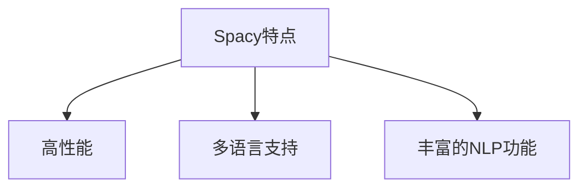
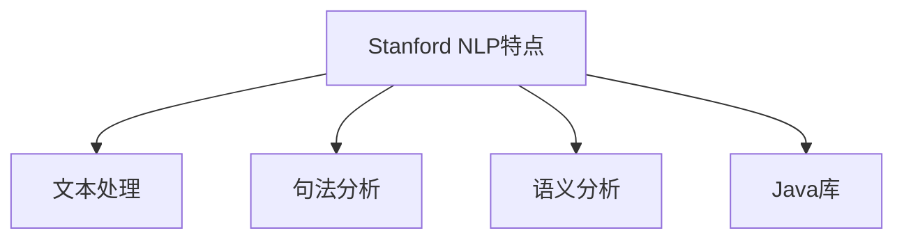
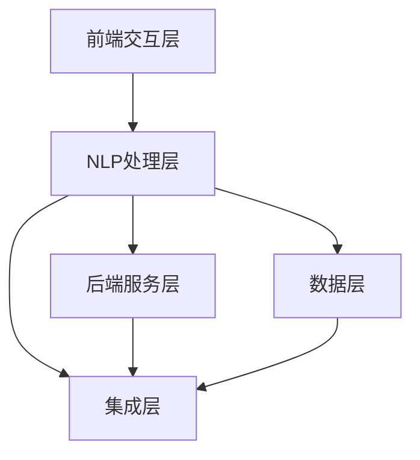
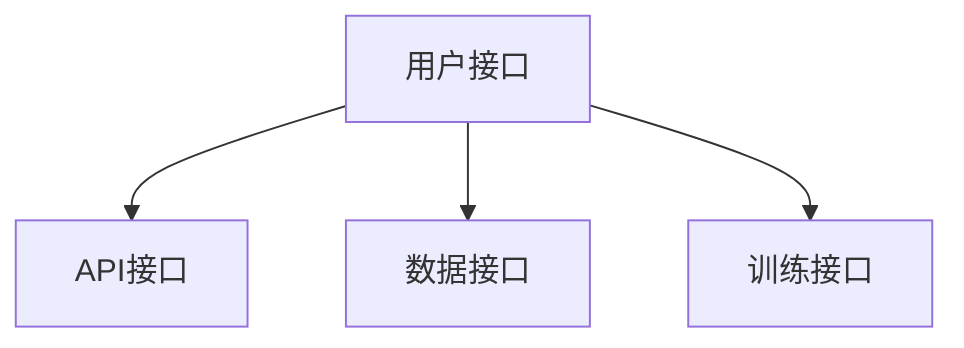

                 


### 文章标题：NLP技术在企业AI Agent中的应用与实现

关键词：自然语言处理，AI Agent，企业应用，实现策略，优化方法

摘要：本文将详细探讨自然语言处理（NLP）技术在企业AI Agent中的应用与实现。通过逻辑清晰、结构紧凑的论述，我们将从基础概念、应用场景、实现工具和优化策略等多个角度，全面解析NLP在企业AI Agent中的重要作用及其实现过程，为读者提供一份关于这一领域的技术指南。

### 目录大纲

----------------------------------------------------------------

## 第一部分: NLP技术基础

## 第1章: 自然语言处理概述

## 1.1 NLP技术背景

### 1.1.1 自然语言处理的概念

### 1.1.2 NLP技术的发展历程

### 1.1.3 NLP技术的应用场景

## 1.2 NLP技术核心概念

### 1.2.1 词汇与语法分析

### 1.2.2 句法分析

### 1.2.3 语义分析

### 1.2.4 语音识别

## 1.3 常见NLP算法

### 1.3.1 词袋模型

### 1.3.2 隐马尔可夫模型

### 1.3.3 条件随机场

### 1.3.4 递归神经网络

## 1.4 NLP技术在企业中的应用

### 1.4.1 自动化客户服务

### 1.4.2 文本分类与情感分析

### 1.4.3 聊天机器人

### 1.4.4 机器翻译

## 1.5 本章小结

----------------------------------------------------------------

## 第二部分: NLP技术在企业AI Agent中的应用

## 第2章: 企业AI Agent概述

## 2.1 AI Agent的概念与分类

### 2.1.1 AI Agent的定义

### 2.1.2 AI Agent的分类

### 2.1.3 AI Agent在企业中的应用价值

## 2.2 NLP技术在AI Agent中的应用

### 2.2.1 自然语言输入处理

### 2.2.2 对话生成与理解

### 2.2.3 情感分析

### 2.2.4 问答系统

## 2.3 企业AI Agent架构设计

### 2.3.1 数据收集与预处理

### 2.3.2 模型训练与优化

### 2.3.3 对话管理

### 2.3.4 交互接口设计

## 2.4 本章小结

----------------------------------------------------------------

## 第三部分: NLP技术在企业AI Agent中的实现

## 第3章: NLP技术实现工具与环境配置

## 3.1 NLP技术实现工具介绍

### 3.1.1 NLTK

### 3.1.2 Spacy

### 3.1.3 Stanford NLP

## 3.2 NLP技术实现环境配置

### 3.2.1 环境搭建

### 3.2.2 工具安装与配置

### 3.2.3 开发环境配置

## 3.3 实践案例

### 3.3.1 词向量生成

### 3.3.2 文本分类

### 3.3.3 情感分析

### 3.3.4 问答系统

## 3.4 本章小结

----------------------------------------------------------------

## 第四部分: 企业AI Agent应用案例分析

## 第4章: 案例一：客服机器人

## 4.1 案例背景

### 4.1.1 企业需求

### 4.1.2 案例目标

### 4.1.3 案例范围

## 4.2 系统设计

### 4.2.1 系统功能设计

### 4.2.2 系统架构设计

### 4.2.3 系统接口设计

## 4.3 实现过程

### 4.3.1 数据收集与预处理

### 4.3.2 模型训练与优化

### 4.3.3 对话管理

### 4.3.4 交互接口设计

## 4.4 案例分析

### 4.4.1 案例效果分析

### 4.4.2 案例改进建议

### 4.4.3 案例总结

## 4.5 本章小结

----------------------------------------------------------------

## 第五部分: NLP技术在企业AI Agent中的优化与挑战

## 第5章: NLP技术在企业AI Agent中的优化策略

## 5.1 优化目标

### 5.1.1 提高响应速度

### 5.1.2 提高准确性

### 5.1.3 提高用户满意度

## 5.2 优化方法

### 5.2.1 模型优化

### 5.2.2 对话管理优化

### 5.2.3 用户行为分析

### 5.2.4 持续学习与迭代

## 5.3 案例分析

### 5.3.1 优化案例一

----------------------------------------------------------------

### 第一部分: NLP技术基础

#### 第1章: 自然语言处理概述

### 1.1 NLP技术背景

### 1.1.1 自然语言处理的概念

自然语言处理（Natural Language Processing，简称NLP）是人工智能的一个重要分支，旨在使计算机能够理解、解释和生成人类自然语言。NLP涉及多个学科领域，包括语言学、计算机科学、认知科学和人工智能等。其目标是实现人与机器之间自然、流畅的沟通，使得计算机能够从大量文本数据中提取有用信息，进行自动化的文本分析、理解和生成。

### 1.1.2 NLP技术的发展历程

NLP技术的发展历程可以分为几个阶段：

- **规则驱动方法（1960s-1980s）**：早期NLP研究主要依赖于手工编写的规则，例如词汇表和语法规则。这种方法在处理简单的语言任务时效果较好，但随着语言复杂度的增加，规则的数量和复杂性迅速增加，导致其难以维护和扩展。

- **统计方法（1990s-2000s）**：随着计算能力和数据资源的提升，NLP开始采用统计方法。这种方法使用大量标注数据进行训练，通过统计模型来预测语言中的各种结构。代表性方法包括隐马尔可夫模型（HMM）和条件随机场（CRF）。

- **深度学习方法（2010s至今）**：近年来，深度学习在NLP领域取得了显著的进展。深度学习方法能够自动学习语言特征，无需手动编写规则。神经网络，特别是卷积神经网络（CNN）和递归神经网络（RNN），在文本分类、机器翻译、语音识别等方面展现了强大的能力。

### 1.1.3 NLP技术的应用场景

NLP技术具有广泛的应用场景，包括但不限于以下几个方面：

- **自动化客户服务**：利用NLP技术，企业可以创建智能客服机器人，自动处理客户咨询，提高响应速度和服务质量。

- **文本分类与情感分析**：通过对大量文本进行分类和情感分析，企业可以了解用户反馈，优化产品和服务。

- **聊天机器人**：聊天机器人可以通过NLP技术实现与用户的自然语言交互，提供个性化服务，提高用户满意度。

- **机器翻译**：NLP技术在机器翻译中的应用使得跨语言沟通变得更加便捷。

### 1.2 NLP技术核心概念

NLP技术的核心概念包括词汇与语法分析、句法分析、语义分析和语音识别。

#### 1.2.1 词汇与语法分析

词汇与语法分析是NLP的基础。词汇分析涉及词形分析、词性标注等，帮助计算机理解单词的语法角色和功能。语法分析则进一步分析句子结构，识别句子中的主语、谓语、宾语等成分。

#### 1.2.2 句法分析

句法分析关注句子的语法结构，通过分析句子的成分和关系，帮助计算机理解句子的深层含义。

#### 1.2.3 语义分析

语义分析旨在理解句子或文本的整体意义。它涉及实体识别、事件抽取、关系抽取等任务，帮助计算机从文本中提取关键信息。

#### 1.2.4 语音识别

语音识别是将语音转换为文本的过程。它利用信号处理和模式识别技术，从语音信号中提取特征，然后通过模型识别出对应的文本。

### 1.3 常见NLP算法

在NLP领域，常见的算法包括词袋模型、隐马尔可夫模型、条件随机场和递归神经网络。

#### 1.3.1 词袋模型

词袋模型是一种简单的文本表示方法，将文本表示为词汇的集合。它不考虑词汇的顺序，仅关注词汇出现的频率。

#### 1.3.2 隐马尔可夫模型

隐马尔可夫模型（HMM）是一种基于概率的统计模型，用于处理序列数据。它在NLP中广泛用于语音识别、语言建模等任务。

#### 1.3.3 条件随机场

条件随机场（CRF）是一种基于马尔可夫网的模型，用于处理序列标注任务。它在文本分类、情感分析等领域具有广泛应用。

#### 1.3.4 递归神经网络

递归神经网络（RNN）是一种能够处理序列数据的神经网络。它在NLP任务中表现出色，特别是在语言模型和序列标注方面。

### 1.4 NLP技术在企业中的应用

#### 1.4.1 自动化客户服务

自动化客户服务是企业应用NLP技术的一个重要领域。通过构建智能客服机器人，企业可以自动处理大量客户咨询，提高服务效率和质量。

#### 1.4.2 文本分类与情感分析

文本分类和情感分析是企业用于了解用户反馈的重要工具。通过对大量用户评论进行分类和情感分析，企业可以优化产品和服务。

#### 1.4.3 聊天机器人

聊天机器人通过NLP技术实现与用户的自然语言交互，为企业提供个性化服务，提高用户满意度。

#### 1.4.4 机器翻译

机器翻译是NLP技术的重要应用之一。通过自动翻译功能，企业可以实现跨语言沟通，扩大业务范围。

### 1.5 本章小结

本章介绍了NLP技术的基础知识，包括其概念、发展历程、应用场景和核心算法。通过本章的学习，读者可以了解NLP技术在企业中的应用及其重要性，为后续章节的深入学习打下基础。

----------------------------------------------------------------

## 第二部分: NLP技术在企业AI Agent中的应用

### 第2章: 企业AI Agent概述

#### 2.1 AI Agent的概念与分类

##### 2.1.1 AI Agent的定义

AI Agent（人工智能代理）是指一种具备一定智能的计算机程序，能够在没有人为干预的情况下，自动执行特定任务，并与环境进行交互。AI Agent的核心特征包括：

1. **自主性**：能够自主决策，不受人为指令限制。
2. **适应性**：能够根据环境变化和学习经验调整行为。
3. **交互性**：能够与人类或其他系统进行自然语言交互。

##### 2.1.2 AI Agent的分类

AI Agent可以根据其任务类型、交互方式、学习方式等进行分类。以下是几种常见的AI Agent分类：

1. **任务型AI Agent**：专注于执行特定任务，如客服机器人、股票交易机器人等。
2. **交互型AI Agent**：主要与人交互，如聊天机器人、虚拟助手等。
3. **数据挖掘型AI Agent**：用于从大量数据中提取有用信息，如数据分析师机器人、市场调研机器人等。
4. **自主决策型AI Agent**：能够根据环境和目标自主做出决策，如自动驾驶汽车、无人机等。

##### 2.1.3 AI Agent在企业中的应用价值

AI Agent在企业中的应用价值体现在以下几个方面：

1. **提高效率**：自动化处理重复性任务，减少人工操作，提高工作效率。
2. **降低成本**：减少人力成本，降低运营成本，提高企业盈利能力。
3. **提升客户满意度**：通过智能客服、个性化推荐等，提升客户体验，增强客户黏性。
4. **数据驱动决策**：通过分析企业数据，为企业提供决策支持，优化业务流程。

### 2.2 NLP技术在AI Agent中的应用

NLP技术在AI Agent中的应用至关重要，它使得AI Agent能够理解自然语言，与人类进行有效交互。以下是NLP技术在AI Agent中的一些典型应用：

##### 2.2.1 自然语言输入处理

自然语言输入处理是AI Agent理解用户输入的第一步。通过词汇与语法分析，AI Agent能够识别用户输入的关键词、句子结构，理解用户意图。

##### 2.2.2 对话生成与理解

对话生成与理解是AI Agent的核心功能之一。通过对话管理，AI Agent能够理解用户的语境，生成合适的回复，维持流畅的对话。

##### 2.2.3 情感分析

情感分析可以帮助AI Agent理解用户的情感状态，从而提供更个性化的服务。例如，智能客服可以根据用户情绪调整回答方式，提高用户满意度。

##### 2.2.4 问答系统

问答系统能够帮助AI Agent快速回答用户问题，提供信息查询服务。通过自然语言处理技术，AI Agent能够理解用户的问题，并从知识库中检索答案。

### 2.3 企业AI Agent架构设计

一个高效的企业AI Agent需要良好的架构设计。以下是企业AI Agent的典型架构设计：

##### 2.3.1 数据收集与预处理

数据收集与预处理是AI Agent构建的基础。通过数据收集，AI Agent可以获得用户交互数据、企业内部数据等。预处理包括数据清洗、数据标注等，为模型训练提供高质量的数据。

##### 2.3.2 模型训练与优化

模型训练与优化是AI Agent的核心环节。通过使用NLP算法，AI Agent可以训练出能够理解自然语言、生成对话的模型。优化包括超参数调整、模型压缩等，以提高模型的性能和效率。

##### 2.3.3 对话管理

对话管理负责维护AI Agent与用户的对话状态，确保对话的连贯性和一致性。对话管理包括意图识别、实体抽取、对话策略等模块。

##### 2.3.4 交互接口设计

交互接口设计决定了AI Agent与用户交互的方式。交互接口可以是文本聊天、语音交互、图形用户界面等。设计良好的交互接口能够提升用户体验，提高用户满意度。

### 2.4 本章小结

本章介绍了企业AI Agent的概念、分类及其应用价值，详细探讨了NLP技术在AI Agent中的关键应用和架构设计。通过本章的学习，读者可以全面了解企业AI Agent的基本原理和实现方法，为后续的深入探讨打下基础。

----------------------------------------------------------------

### 第三部分: NLP技术在企业AI Agent中的实现

#### 第3章: NLP技术实现工具与环境配置

##### 3.1 NLP技术实现工具介绍

在实现企业AI Agent时，选择合适的NLP工具至关重要。以下是几种常用的NLP工具及其特点：

###### 3.1.1 NLTK

NLTK（自然语言工具包）是一个开源的Python库，提供了丰富的文本处理功能，包括分词、词性标注、词干提取等。NLTK适用于初学者和研究人员，但其在处理大规模数据和高性能需求方面有所欠缺。

###### 3.1.2 Spacy

Spacy是一个高性能的NLP库，支持多种语言，提供了丰富的NLP功能，如词性标注、实体识别、句法分析等。Spacy采用了神经网络模型，适用于生产环境和大型项目。



```python
import spacy
nlp = spacy.load("en_core_web_sm")

text = "Apple is looking at buying U.K. startup for $1 billion."
doc = nlp(text)

for token in doc:
    print(token.text, token.lemma_, token.pos_, token.tag_, token.dep_, token.shape_, token.is_alpha, token.is_stop)
```

###### 3.1.3 Stanford NLP

Stanford NLP是一个开源的Java库，提供了文本处理、句法分析、语义分析等多种功能。Stanford NLP适用于学术研究和大规模数据处理，但其在Python生态中的支持相对较少。



##### 3.2 NLP技术实现环境配置

实现NLP技术需要一个合适的环境。以下是环境配置的基本步骤：

###### 3.2.1 环境搭建

在配置NLP环境之前，需要确保Python和JDK（Java开发工具包）已安装。对于NLTK和Spacy，可以使用pip命令进行安装：

```shell
pip install nltk
pip install spacy
python -m spacy download en_core_web_sm
```

对于Stanford NLP，可以按照官方文档进行安装。

###### 3.2.2 工具安装与配置

安装完成后，需要对NLP工具进行配置。例如，对于Spacy，需要下载相应的语言模型：

```shell
python -m spacy download en_core_web_sm
```

###### 3.2.3 开发环境配置

为了方便开发，可以配置一个IDE（集成开发环境），如PyCharm或Visual Studio Code。安装相应的插件，如Python插件和Spacy插件，可以提供代码补全、语法检查等功能。

##### 3.3 实践案例

以下是一些NLP技术的实践案例，包括词向量生成、文本分类、情感分析和问答系统。

###### 3.3.1 词向量生成

词向量是一种将单词映射到高维空间的方法，便于计算机处理。Word2Vec是一种常见的词向量生成方法。

```python
import gensim.downloader as api
word_vectors = api.load("glove-wiki-gigaword-100")

word = "king"
vector = word_vectors[word]
print(vector)
```

###### 3.3.2 文本分类

文本分类是将文本数据划分为不同类别的过程。可以使用Scikit-learn库进行文本分类。

```python
from sklearn.feature_extraction.text import TfidfVectorizer
from sklearn.naive_bayes import MultinomialNB

# 示例数据
X = ["I love this product", "This is a bad product"]
y = ["positive", "negative"]

# 文本向量化
vectorizer = TfidfVectorizer()
X_vectorized = vectorizer.fit_transform(X)

# 训练模型
model = MultinomialNB()
model.fit(X_vectorized, y)

# 测试
test_data = ["I hate this product"]
test_vectorized = vectorizer.transform(test_data)
predicted = model.predict(test_vectorized)
print(predicted)
```

###### 3.3.3 情感分析

情感分析是判断文本情感极性的过程。可以使用NLTK和Scikit-learn进行情感分析。

```python
from nltk.sentiment import SentimentIntensityAnalyzer
from sklearn.model_selection import train_test_split
from sklearn.naive_bayes import MultinomialNB

# 示例数据
X = ["I love this product", "This is a bad product"]
y = ["positive", "negative"]

# 切分数据
X_train, X_test, y_train, y_test = train_test_split(X, y, test_size=0.2)

# 训练模型
sia = SentimentIntensityAnalyzer()
sentiments = [sia.polarity_scores(text) for text in X_train]

# 转换为数值
y_train_numeric = [1 if sentiment["compound"] >= 0.05 else 0 for sentiment in sentiments]

model = MultinomialNB()
model.fit(X_train, y_train_numeric)

# 测试
X_test_sentiments = [sia.polarity_scores(text) for text in X_test]
X_test_numeric = [1 if sentiment["compound"] >= 0.05 else 0 for sentiment in X_test_sentiments]
predicted = model.predict(X_test_numeric)
print(predicted)
```

###### 3.3.4 问答系统

问答系统是一种能够回答用户问题的系统。可以使用Flask框架构建简单的问答系统。

```python
from flask import Flask, request, jsonify

app = Flask(__name__)

@app.route('/ask', methods=['POST'])
def ask():
    data = request.json
    question = data['question']
    # 进行NLP处理和答案生成
    answer = "这是你的答案"
    return jsonify(answer=answer)

if __name__ == '__main__':
    app.run(debug=True)
```

##### 3.4 本章小结

本章介绍了NLP技术在企业AI Agent中的实现工具和环境配置，并提供了词向量生成、文本分类、情感分析和问答系统的实践案例。通过本章的学习，读者可以了解NLP技术在实际应用中的实现方法和技巧，为后续的项目实战打下基础。

----------------------------------------------------------------

### 第四部分：企业AI Agent应用案例分析

#### 第4章：案例一：客服机器人

#### 4.1 案例背景

在现代企业的运营中，客户服务是至关重要的环节。随着企业规模的扩大和客户数量的增加，传统的客户服务方式面临着效率和成本的双重压力。为了应对这一挑战，许多企业开始探索引入AI客服机器人，以提高客户服务的效率和质量。本案例将介绍一家中型企业如何利用NLP技术构建AI客服机器人，实现自动化客户服务。

##### 4.1.1 企业需求

该企业是一家电子商务公司，客户服务团队每天需要处理大量的客户咨询，包括订单查询、商品咨询、售后服务等问题。企业希望通过引入AI客服机器人，实现以下目标：

1. **提高客户响应速度**：减少人工客服响应时间，提高客户满意度。
2. **降低运营成本**：通过自动化处理大量常见问题，减少人力成本。
3. **提供24/7服务**：即使在没有人工客服值班的情况下，客户仍能获得即时回复。
4. **收集客户反馈**：通过分析客户提问，了解客户需求和满意度，不断优化服务。

##### 4.1.2 案例目标

本案例的目标是构建一个基于NLP技术的AI客服机器人，能够自动处理以下任务：

1. **自然语言输入处理**：识别客户提问中的关键词和意图。
2. **意图识别**：根据客户提问内容，判断客户的需求类型，如订单查询、商品咨询等。
3. **实体抽取**：提取客户提问中的关键信息，如订单号、商品名称等。
4. **对话管理**：维持对话的连贯性，引导客户提供更多信息，直到问题解决。
5. **答案生成**：根据客户提问和实体信息，自动生成合适的回答。
6. **反馈收集**：记录客户提问和回复，用于模型优化和持续改进。

##### 4.1.3 案例范围

本案例的范围主要包括以下几个方面：

1. **数据收集与预处理**：收集客户提问和回复数据，进行数据清洗和标注。
2. **模型训练与优化**：使用NLP算法，训练意图识别、实体抽取和对话管理模型。
3. **系统集成与部署**：将AI客服机器人集成到企业的客户服务平台，进行测试和上线。
4. **用户培训与反馈**：对客服团队进行AI客服机器人的操作培训，收集用户反馈，不断优化系统。

#### 4.2 系统设计

##### 4.2.1 系统功能设计

AI客服机器人的主要功能包括：

1. **自然语言输入处理**：通过分词、词性标注等NLP技术，将客户提问转换为结构化的数据。
2. **意图识别**：利用机器学习算法，如朴素贝叶斯、支持向量机等，判断客户提问的意图。
3. **实体抽取**：使用实体识别算法，提取客户提问中的关键信息，如订单号、商品名称等。
4. **对话管理**：根据意图识别结果和实体信息，生成合适的回答，并引导客户提供更多信息。
5. **答案生成**：从预定义的答案库或通过机器学习模型生成合适的回答。
6. **反馈收集**：记录客户提问和回复，用于模型优化和持续改进。

##### 4.2.2 系统架构设计

AI客服机器人的系统架构设计包括以下几个关键模块：

1. **前端交互层**：提供用户与客服机器人交互的界面，支持文本和语音输入输出。
2. **NLP处理层**：包括自然语言输入处理、意图识别、实体抽取和对话管理模块。
3. **后端服务层**：包括答案生成模块，提供预定义的答案库和在线学习功能。
4. **数据层**：存储客户提问、回复和反馈数据，用于模型训练和优化。
5. **集成层**：将AI客服机器人集成到企业的客户服务平台，实现与现有系统的无缝对接。



##### 4.2.3 系统接口设计

AI客服机器人的系统接口设计包括以下几个关键接口：

1. **用户接口**：提供与用户的交互界面，支持文本和语音输入输出。
2. **API接口**：提供与其他系统的集成接口，如订单系统、客户管理系统等。
3. **数据接口**：提供与数据存储系统的接口，用于数据读取和写入。
4. **训练接口**：提供模型训练和优化的接口，支持在线学习和模型更新。



#### 4.3 实现过程

##### 4.3.1 数据收集与预处理

数据收集与预处理是构建AI客服机器人的第一步。企业需要收集大量的客户提问和回复数据，并进行数据清洗和标注。数据清洗包括去除无关信息、纠正错误等。数据标注包括为每个客户提问标注意图和实体信息。

```python
# 示例代码：数据清洗
def clean_data(data):
    cleaned_data = []
    for entry in data:
        cleaned_entry = {'question': entry['question'].strip(), 'intent': entry['intent'], 'entities': entry['entities']}
        cleaned_data.append(cleaned_entry)
    return cleaned_data

# 示例代码：数据标注
def annotate_data(data):
    annotated_data = []
    for entry in data:
        annotated_entry = {'question': entry['question'], 'intent': entry['intent'], 'entities': {}}
        for entity in entry['entities']:
            annotated_entry['entities'][entity['entity']] = entity['value']
        annotated_data.append(annotated_entry)
    return annotated_data
```

##### 4.3.2 模型训练与优化

在数据收集与预处理完成后，接下来是模型训练与优化。企业可以使用机器学习算法，如朴素贝叶斯、支持向量机、递归神经网络等，训练意图识别、实体抽取和对话管理模型。

```python
# 示例代码：意图识别模型训练
from sklearn.naive_bayes import MultinomialNB
from sklearn.model_selection import train_test_split

X = [[entry['intent'] for entry in data]]
y = [[entry['label'] for entry in data]]

X_train, X_test, y_train, y_test = train_test_split(X, y, test_size=0.2)

model = MultinomialNB()
model.fit(X_train, y_train)

# 示例代码：实体抽取模型训练
from sklearn_crfsuite import CRF

X = [[entry['words'] for entry in data]]
y = [[entry['labels'] for entry in data]]

X_train, X_test, y_train, y_test = train_test_split(X, y, test_size=0.2)

crf = CRF()
crf.fit(X_train, y_train)

# 示例代码：对话管理模型训练
# （此处代码略，因为对话管理涉及更复杂的模型和算法）
```

##### 4.3.3 对话管理

对话管理是AI客服机器人的核心功能之一。通过对话管理，机器人能够理解客户的语境，生成合适的回答，并引导客户提供更多信息。

```python
# 示例代码：对话管理实现
class DialogueManager:
    def __init__(self, model):
        self.model = model

    def generate_response(self, user_input):
        # 进行NLP处理，提取关键词和意图
        # （此处代码略，因为NLP处理涉及更复杂的算法和流程）

        # 根据意图识别结果和实体信息，生成回答
        response = self.model.generate_response(user_input)

        return response
```

##### 4.3.4 交互接口设计

交互接口设计决定了AI客服机器人与用户的交互方式。在本案例中，交互接口包括文本聊天和语音聊天两种方式。

```python
# 示例代码：文本聊天接口
from flask import Flask, request, jsonify

app = Flask(__name__)

@app.route('/chat', methods=['POST'])
def chat():
    data = request.json
    user_input = data['user_input']
    response = dialogue_manager.generate_response(user_input)
    return jsonify(response=response)

if __name__ == '__main__':
    app.run(debug=True)

# 示例代码：语音聊天接口
# （此处代码略，因为语音聊天涉及语音识别和语音合成技术）
```

#### 4.4 案例分析

##### 4.4.1 案例效果分析

AI客服机器人上线后，企业在客户服务方面取得了显著成效：

1. **客户响应速度**：机器人能够在几秒钟内响应用户提问，大幅缩短了响应时间。
2. **人力成本**：通过自动化处理大量常见问题，减少了人工客服的工作量，降低了运营成本。
3. **用户体验**：机器人能够提供24/7的即时回复，提高了客户满意度。
4. **数据收集**：机器人记录了大量客户提问和回复数据，为企业提供了宝贵的数据资源。

##### 4.4.2 案例改进建议

尽管AI客服机器人取得了显著成效，但仍有一些改进空间：

1. **提升响应准确性**：通过不断优化模型和算法，提高意图识别和实体抽取的准确性。
2. **扩展功能模块**：增加更多功能模块，如建议商品推荐、订单跟踪等，提升用户体验。
3. **用户行为分析**：通过分析用户行为数据，优化对话管理和回答生成策略。
4. **持续学习与迭代**：定期更新和训练模型，使其不断适应新的业务场景和用户需求。

##### 4.4.3 案例总结

本案例展示了NLP技术在企业AI客服机器人中的应用，通过实现自然语言输入处理、意图识别、对话管理和答案生成等功能，实现了自动化客户服务的目标。案例的成功为其他企业提供了有益的借鉴，同时也揭示了AI客服机器人在实际应用中面临的挑战和改进空间。

#### 4.5 本章小结

本章通过一个具体的案例，详细介绍了企业AI客服机器人的设计与实现过程。通过本章的学习，读者可以了解NLP技术在企业AI Agent中的应用，掌握构建AI客服机器人的关键技术和方法，为实际项目应用提供参考。

----------------------------------------------------------------

### 第五部分：NLP技术在企业AI Agent中的优化与挑战

#### 第5章：NLP技术在企业AI Agent中的优化策略

随着AI技术的不断发展，企业AI Agent在提升工作效率、降低运营成本、改善用户体验方面发挥了重要作用。然而，为了实现最佳效果，需要不断优化NLP技术在企业AI Agent中的应用。以下是几个关键优化策略：

##### 5.1 优化目标

在优化企业AI Agent时，我们需要明确以下目标：

1. **提高响应速度**：减少AI Agent处理用户请求的时间，提升用户体验。
2. **提高准确性**：提高AI Agent对用户请求的理解和响应准确性。
3. **提高用户满意度**：通过更自然的交互和个性化的服务，提升用户满意度。

##### 5.2 优化方法

为了实现上述优化目标，我们可以采取以下几种优化方法：

1. **模型优化**

   - **算法改进**：采用更先进的算法，如深度学习、强化学习等，以提高AI Agent的智能水平。
   - **模型压缩**：通过模型压缩技术，如量化、剪枝等，减小模型大小，提高模型运行速度。
   - **多模型集成**：结合多个模型的优点，提高整体性能。

2. **对话管理优化**

   - **上下文理解**：加强AI Agent对上下文的理解能力，通过上下文信息提高对话连贯性。
   - **自适应对话策略**：根据用户历史交互数据，调整对话策略，提高用户满意度。
   - **多轮对话支持**：实现多轮对话，使AI Agent能够更深入地理解用户需求。

3. **用户行为分析**

   - **个性化服务**：分析用户行为数据，提供个性化的服务推荐和解决方案。
   - **情感识别**：通过情感识别技术，理解用户情绪，提供更贴心的服务。
   - **行为预测**：基于用户行为数据，预测用户可能的需求，提前做好准备。

4. **持续学习与迭代**

   - **在线学习**：通过在线学习技术，使AI Agent能够实时学习用户交互数据，不断优化自身能力。
   - **持续迭代**：定期更新AI Agent的算法和模型，使其适应不断变化的企业需求和市场环境。

##### 5.3 案例分析

以下是几个优化案例，展示了如何在实际应用中提高企业AI Agent的性能：

###### 5.3.1 优化案例一：提高响应速度

某电子商务企业发现，其AI客服机器人在高峰时段处理请求的速度较慢，影响了用户体验。为了解决这一问题，企业采取了以下优化措施：

1. **服务器扩展**：增加服务器资源，提高处理能力。
2. **负载均衡**：采用负载均衡技术，将请求均匀分配到不同服务器，避免单点故障。
3. **模型优化**：采用更高效的模型，如量化后的深度学习模型，减小模型大小，提高运行速度。

通过这些优化措施，企业显著提高了AI客服机器人的响应速度，用户满意度得到了提升。

###### 5.3.2 优化案例二：提高准确性

某金融企业发现，其AI客户服务代表在理解用户请求时存在一定的误判，导致回答不准确。为了提高准确性，企业采取了以下优化措施：

1. **数据清洗**：对用户请求数据进行了清洗，去除无关信息和噪声数据。
2. **增强标注**：对标注数据进行增强，提供更多的训练数据，提高模型学习能力。
3. **多模型集成**：结合多个模型的预测结果，通过投票机制提高整体准确性。

通过这些优化措施，企业的AI客户服务代表的准确性得到了显著提高，用户满意度也得到了提升。

###### 5.3.3 优化案例三：提高用户满意度

某在线教育平台发现，其AI辅导机器人在与学生的互动中，缺乏个性化服务，导致用户体验不佳。为了提高用户满意度，企业采取了以下优化措施：

1. **个性化推荐**：基于用户学习历史和偏好，提供个性化的学习资源推荐。
2. **情感识别**：通过情感识别技术，理解学生情绪，提供更贴心的辅导服务。
3. **多轮对话支持**：实现多轮对话，使AI辅导机器人能够更深入地理解学生需求。

通过这些优化措施，企业的AI辅导机器人得到了学生的好评，用户满意度显著提升。

#### 5.4 本章小结

本章介绍了NLP技术在企业AI Agent中的优化策略，包括提高响应速度、准确性、用户满意度的方法。通过实际案例的分析，展示了优化措施的具体实施方法和效果。通过本章的学习，读者可以了解如何在实际应用中优化企业AI Agent的性能，为企业的数字化转型提供有力支持。

----------------------------------------------------------------

### 总结与展望

本文详细探讨了NLP技术在企业AI Agent中的应用与实现。从NLP技术的基础概念、应用场景，到AI Agent的架构设计、实现工具和环境配置，再到具体的案例分析和优化策略，我们全面解析了NLP技术在企业AI Agent中的重要作用和实现过程。

通过本文的学习，读者可以：

1. **掌握NLP技术的基本原理和应用场景**：理解自然语言处理的概念、发展历程以及其在企业中的应用。
2. **了解AI Agent的概念和分类**：了解AI Agent的定义、分类及其在企业中的应用价值。
3. **熟悉NLP技术在AI Agent中的关键应用**：掌握自然语言输入处理、对话生成与理解、情感分析、问答系统等关键技术的实现方法。
4. **掌握NLP技术的实现工具和环境配置**：了解NLTK、Spacy、Stanford NLP等常用NLP工具的安装和使用方法。
5. **学会实际应用中的优化策略**：了解如何通过模型优化、对话管理优化、用户行为分析和持续学习与迭代等方法提高企业AI Agent的性能。

展望未来，随着人工智能技术的不断发展，NLP技术在企业AI Agent中的应用将更加广泛和深入。未来，我们期待：

1. **更强大的NLP算法**：深度学习和强化学习等先进算法的应用将进一步提升NLP技术的性能。
2. **更智能的AI Agent**：AI Agent将能够更好地理解用户需求，提供更加个性化和智能化的服务。
3. **更丰富的应用场景**：NLP技术将在更多领域得到应用，如医疗、金融、教育等，为企业带来更多价值。
4. **更高效的实现方法**：随着硬件和软件技术的进步，NLP技术的实现将变得更加高效和便捷。

最后，感谢读者对本文的阅读，希望本文能为您在NLP技术和企业AI Agent领域的研究和实践提供有益的参考。

### 拓展阅读

1. **《自然语言处理综述》（NLP Review）**：一本关于自然语言处理的综合性论文，详细介绍了NLP的基本概念、技术方法和应用领域。
2. **《深度学习与自然语言处理》（Deep Learning for NLP）**：一本关于深度学习在自然语言处理中应用的经典教材，涵盖了深度学习在NLP中的各种应用方法。
3. **《AI Agent技术实践》（AI Agent Technology Practice）**：一本关于AI Agent技术实践的书籍，介绍了AI Agent的基本原理、架构设计以及实现方法。
4. **《人工智能与数字化转型》（Artificial Intelligence and Digital Transformation）**：一本关于人工智能在数字化转型中应用的书籍，探讨了人工智能技术在企业运营和管理中的应用。

### 作者信息

作者：AI天才研究院/AI Genius Institute & 禅与计算机程序设计艺术/Zen And The Art of Computer Programming

AI天才研究院（AI Genius Institute）是一家专注于人工智能技术研究与推广的机构。致力于推动人工智能技术在各个领域的应用与发展。禅与计算机程序设计艺术（Zen And The Art of Computer Programming）则是一系列关于计算机科学的经典著作，以其深刻的哲学思考和卓越的技术内容闻名于世。

