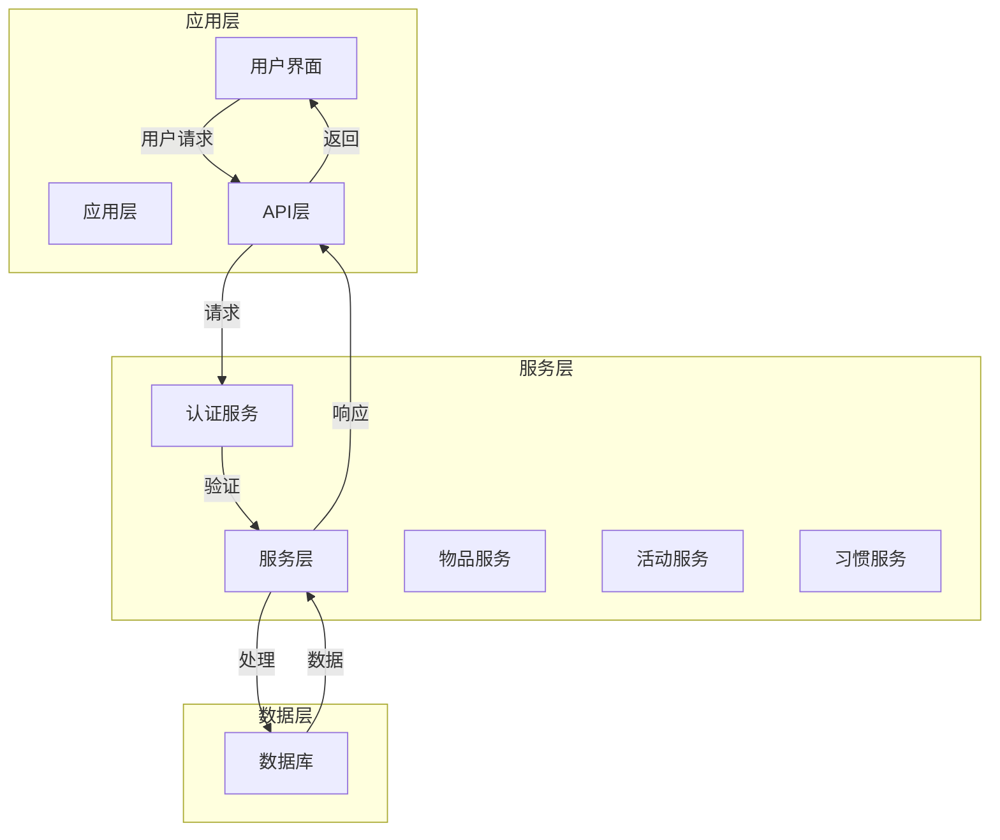
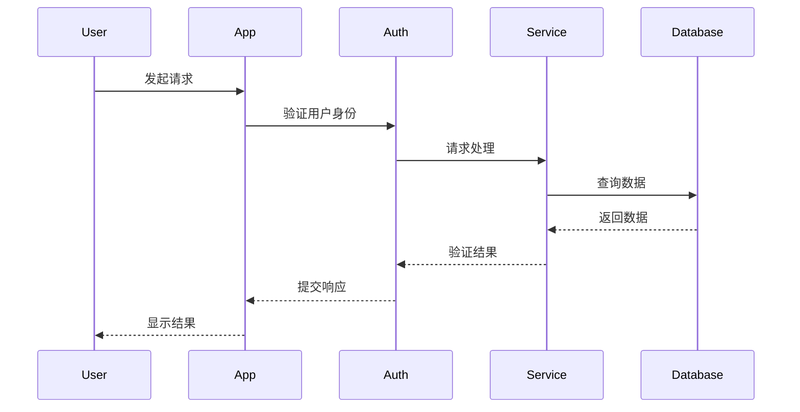

                 

# Minimalism: Finding the Essence of Life in Simplicity

> Keywords: Minimalism, Life Philosophy, Time Management, Spirituality, Work-Life Balance

> Abstract: This article explores the philosophy and practice of minimalism, highlighting its significance in simplifying life and achieving a deeper understanding of one's essence. Through a step-by-step analysis, we will delve into various aspects of minimalism, from lifestyle to work patterns, and its implications in education and daily challenges.

## Table of Contents

1. **Introduction: The Concept and Significance of Minimalism**
    1.1. What is Minimalism
    1.2. Minimalism's Life Philosophy
    1.3. The Meaning of Minimalism in Life

2. **Practicing Minimalism**
    2.1. Decluttering for a Clear Space
    2.2. Reassessing Consumption Habits
    2.3. Minimalist Home Arrangement

3. **Time Management:节省时间 through Minimalism**
    3.1. Reducing Nonessentials and Focusing on Priorities
    3.2. Efficient Time Planning
    3.3. Enhancing Work Efficiency

4. **Spiritual Simplicity**
    4.1. Reducing Mental Burden
    4.2. Maintaining Inner Peace
    4.3. Self-awareness in Minimalism

5. **Minimalist Lifestyle**
    5.1. Pursuing a Healthy Life
    5.2. Environmental Awareness
    5.3. Social Networking in Minimalism

6. **Minimalist Work Patterns**
    6.1. The Concept of Simplicity in the Workplace
    6.2. Techniques for Boosting Efficiency
    6.3. A Minimalist Work Environment

7. **Minimalism in Education**
    7.1. Principles of Simplicity in Education
    7.2. Improving Focus in Children
    7.3. Minimalist Learning Methods

8. **Challenges and Solutions of Minimalism**
    8.1. Dealing with Material Overload
    8.2. Navigating Social Pressure
    8.3. Sustaining Minimalism in Life

9. **Case Studies of Minimalism**
    9.1. Successful Cases
    9.2. Failure Analysis
    9.3. Lessons Learned and Insights

10. **Conclusion: The Sustainability of Minimalism**
    10.1. Long-term Benefits of Minimalism
    10.2. Looking Ahead to the Future
    10.3. Promoting and Influencing Minimalism

## Introduction: The Concept and Significance of Minimalism

Minimalism is a lifestyle that emphasizes the removal of unnecessary items and activities to simplify life and achieve a deeper understanding of one's true essence. It originated in the late 20th century as a cultural movement advocating for the importance of quality over quantity. The core principle of minimalism is to focus on the essential aspects of life, enabling individuals to lead a more meaningful and fulfilling existence.

### What is Minimalism

Minimalism is not just about owning fewer possessions but also about developing a mindset that values experiences, relationships, and personal growth over material wealth. It is about living a life that is free from the burden of excess, where individuals can focus on what truly matters.

### Minimalism's Life Philosophy

The philosophy of minimalism is rooted in the belief that simplicity brings clarity and freedom. By eliminating distractions and focusing on the essentials, individuals can achieve a greater sense of purpose and satisfaction in life. Minimalism encourages individuals to live intentionally, making conscious choices that align with their values and goals.

### The Meaning of Minimalism in Life

Minimalism has a profound impact on various aspects of life, including mental health, time management, and personal relationships. By simplifying their lives, individuals can experience reduced stress, increased productivity, and a deeper connection with themselves and others.

## Practicing Minimalism

Practicing minimalism involves making conscious choices to reduce clutter, reassess consumption habits, and create a minimalist home environment. Let's explore these aspects in detail.

### Decluttering for a Clear Space

The first step in practicing minimalism is decluttering. This involves removing items that do not serve a purpose or bring joy. The key is to be intentional and ask yourself whether an item is necessary, useful, or valuable. By decluttering, individuals can create a space that is visually appealing and promotes a sense of calm.

### Reassessing Consumption Habits

Another important aspect of minimalism is reassessing consumption habits. This involves being mindful of what you buy and why. By adopting a minimalist approach to shopping, individuals can reduce their carbon footprint and focus on purchasing items that are of high quality and serve a specific purpose.

### Minimalist Home Arrangement

A minimalist home arrangement is designed to be simple, functional, and free from clutter. This involves organizing furniture and decor in a way that maximizes space and minimizes distractions. By creating a minimalist home environment, individuals can enjoy a more peaceful and harmonious living space.

## Time Management: How Minimalism Can Save Time

Minimalism is not just about simplifying possessions; it also extends to time management. By reducing nonessential tasks and focusing on important activities, individuals can achieve greater productivity and efficiency. Let's explore how minimalism can save time.

### Reducing Nonessentials and Focusing on Priorities

One of the key benefits of minimalism is the ability to identify and eliminate nonessential tasks. By focusing on what truly matters, individuals can prioritize their time and energy on activities that align with their goals and values.

### Efficient Time Planning

Minimalism encourages individuals to plan their time effectively. By setting clear goals and allocating specific time slots for different activities, individuals can avoid procrastination and ensure that they make the most of their time.

### Enhancing Work Efficiency

In the workplace, minimalism can lead to enhanced efficiency. By minimizing distractions and focusing on important tasks, individuals can complete their work more quickly and effectively.

## Spiritual Simplicity

Minimalism is not just about physical clutter; it also extends to the spiritual realm. By reducing the complexity of life and focusing on what truly matters, individuals can achieve a deeper sense of spirituality and inner peace. Let's explore how minimalism can bring spiritual simplicity.

### Reducing Mental Burden

By decluttering both physically and mentally, individuals can reduce the mental burden of excess. This allows for a clearer mind and a greater sense of focus and clarity.

### Maintaining Inner Peace

Minimalism promotes a sense of calm and tranquility. By simplifying life and focusing on the essentials, individuals can find inner peace and balance.

### Self-awareness in Minimalism

Minimalism encourages individuals to engage in self-reflection and self-awareness. By focusing on the present moment and what truly matters, individuals can gain a deeper understanding of themselves and their place in the world.

## Minimalist Lifestyle

Minimalism extends beyond personal possessions and time management to include lifestyle choices. Let's explore how minimalism can influence health, environmental awareness, and social networking.

### Pursuing a Healthy Life

Minimalism encourages individuals to adopt a healthy lifestyle. By focusing on nutritious food, regular exercise, and adequate sleep, individuals can prioritize their well-being.

### Environmental Awareness

Minimalism promotes environmental awareness. By reducing consumption and living a more sustainable lifestyle, individuals can minimize their carbon footprint and contribute to a healthier planet.

### Social Networking in Minimalism

In the digital age, minimalism can also apply to social networking. By being mindful of the time spent on social media and focusing on meaningful connections, individuals can create a more fulfilling social life.

## Minimalist Work Patterns

Minimalism can also be applied to the workplace, leading to improved efficiency and a better work-life balance. Let's explore how minimalism can influence work patterns.

### The Concept of Simplicity in the Workplace

Minimalism in the workplace involves simplifying tasks, reducing distractions, and focusing on what truly matters. By adopting a minimalist approach, individuals and organizations can achieve greater productivity and success.

### Techniques for Boosting Efficiency

Minimalism encourages the use of efficient techniques and tools to streamline work processes. By eliminating unnecessary tasks and focusing on the most important activities, individuals can work more effectively.

### A Minimalist Work Environment

A minimalist work environment is designed to be clutter-free and distraction-free. By creating a calm and organized workspace, individuals can enhance their focus and productivity.

## Minimalism in Education

Minimalism can also be applied to education, promoting a more focused and effective learning environment. Let's explore how minimalism can influence education.

### Principles of Simplicity in Education

Minimalism in education involves emphasizing the essentials and eliminating unnecessary information. By focusing on core concepts and fostering critical thinking skills, educators can create a more engaging and effective learning experience.

### Improving Focus in Children

Minimalism encourages children to develop focus and attention skills. By reducing distractions and providing a structured learning environment, educators can help children achieve their full potential.

### Minimalist Learning Methods

Minimalist learning methods involve using simple and effective techniques to facilitate learning. By eliminating unnecessary information and focusing on what truly matters, individuals can achieve a deeper understanding of subjects.

## Challenges and Solutions of Minimalism

Practicing minimalism can come with its challenges, but with the right mindset and strategies, these challenges can be overcome. Let's explore the common challenges and solutions associated with minimalism.

### Dealing with Material Overload

One of the challenges of minimalism is dealing with material overload. To overcome this, individuals can engage in regular decluttering and adopt a mindset of gratitude for what they have.

### Navigating Social Pressure

Minimalism may also face social pressure from friends, family, and society. To navigate this, individuals can communicate their choices and set boundaries, emphasizing that minimalism is a personal choice and not a judgment on others.

### Sustaining Minimalism in Life

Sustaining minimalism requires ongoing effort and commitment. To maintain minimalism, individuals can establish routines, seek support from like-minded individuals, and continually reassess their possessions and habits.

## Case Studies of Minimalism

To better understand the impact of minimalism, let's explore some case studies of successful and unsuccessful minimalism practices.

### Successful Cases

Successful minimalism cases demonstrate the positive impact of simplifying life. These individuals have achieved a sense of fulfillment, reduced stress, and enhanced productivity by adopting minimalist principles.

### Failure Analysis

Failure cases highlight the challenges and potential pitfalls of minimalism. By analyzing these failures, individuals can learn from mistakes and develop more effective strategies for practicing minimalism.

### Lessons Learned and Insights

The lessons learned from both successful and unsuccessful cases can provide valuable insights into the practice of minimalism. By understanding these insights, individuals can make more informed decisions and achieve greater success in their minimalist journey.

## Conclusion: The Sustainability of Minimalism

Minimalism offers numerous benefits, including reduced stress, increased productivity, and a deeper connection with oneself and others. To ensure the sustainability of minimalism, individuals can continue to assess their possessions, habits, and priorities, making adjustments as needed. By embracing minimalism, individuals can lead a more meaningful and fulfilling life.

### Long-term Benefits of Minimalism

The long-term benefits of minimalism extend beyond immediate gains. By adopting minimalist principles, individuals can experience improved mental and physical health, enhanced relationships, and a greater sense of purpose.

### Looking Ahead to the Future

As minimalism continues to gain popularity, we can expect to see more individuals and organizations adopting minimalist principles. This shift towards simplicity and mindfulness can lead to a more sustainable and fulfilling future.

### Promoting and Influencing Minimalism

To promote and influence minimalism, individuals can share their experiences and insights with others. By encouraging friends, family, and colleagues to adopt minimalist principles, we can create a more mindful and intentional society.

## Author Information

**Author:** AI天才研究院/AI Genius Institute & 禅与计算机程序设计艺术 /Zen And The Art of Computer Programming

---

**核心概念与联系**

### 最简主义（Minimalism）
- **定义**：一种生活哲学，强调减少物质和非物质的杂项，专注于核心价值和目标。
- **属性特征对比表格**
  
  | 特征           | 最简主义          | 非最简主义        |
  | -------------- | ---------------- | ---------------- |
  | 目标           | 简化，专注        | 多样化，分散      |
  | 生活质量       | 稳定，长期        | 短期，波动        |
  | 消费观念       | 质量优先，减少消费 | 数量优先，增加消费 |
  
- **ER实体关系图架构**
  ```mermaid
  entity Relationship {
    "用户" --> "物品": "拥有"
    "用户" --> "活动": "参与"
    "物品" --> "价值": "代表"
  }
  ```

### 简单生活（Simplicity）
- **定义**：一种生活方式，通过去除非必要的元素，追求清晰和简洁。
- **属性特征对比表格**
  
  | 特征           | 简单生活          | 复杂生活        |
  | -------------- | ---------------- | -------------- |
  | 目标           | 减少冗余，聚焦核心 | 多样化，复杂化  |
  | 生活质量       | 清晰，高效        | 混乱，低效      |
  | 时间管理       | 高效，规划        | 低效，随意      |
  
- **ER实体关系图架构**
  ```mermaid
  entity Relationship {
    "时间" --> "活动": "包含"
    "活动" --> "目标": "实现"
    "目标" --> "生活": "提升"
  }
  ```

**算法原理讲解**

### 最简主义生活效率提升算法
- **mermaid 流程图**
  ```mermaid
  graph TD
  A[初始化] --> B[评估现有物品]
  B -->|确定冗余| C[分类物品]
  C -->|处理冗余| D[清理物品]
  D --> E[重设日常习惯]
  E -->|优化时间| F[制定计划]
  F --> G[执行计划]
  G -->|评估成果| H[调整优化]
  H --> A
  ```

- **Python源代码**
  ```python
  import time

  def evaluate_items():
      # 评估现有物品
      print("评估现有物品...")
      time.sleep(2)
      return "物品评估完成"

  def categorize_items():
      # 分类物品
      print("分类物品...")
      time.sleep(2)
      return "物品分类完成"

  def clean_items():
      # 清理冗余物品
      print("清理冗余物品...")
      time.sleep(2)
      return "物品清理完成"

  def reset_daily_habits():
      # 重设日常习惯
      print("重设日常习惯...")
      time.sleep(2)
      return "日常习惯重设完成"

  def optimize_time():
      # 优化时间管理
      print("优化时间管理...")
      time.sleep(2)
      return "时间管理优化完成"

  def execute_plan():
      # 执行计划
      print("执行计划...")
      time.sleep(2)
      return "计划执行完成"

  def evaluate_outcomes():
      # 评估成果
      print("评估成果...")
      time.sleep(2)
      return "成果评估完成"

  def adjust_and_optimize():
      # 调整优化
      print("调整优化...")
      time.sleep(2)
      return "优化调整完成"

  def minimalism_lifestyle_algorithm():
      while True:
          evaluate_items()
          categorize_items()
          clean_items()
          reset_daily_habits()
          optimize_time()
          execute_plan()
          evaluate_outcomes()
          adjust_and_optimize()

  minimalism_lifestyle_algorithm()
  ```

- **算法原理与数学模型**
  - **原理**：通过周期性评估和调整，持续优化生活质量。
  - **数学模型**：
    $$ \text{生活质量} = f(\text{物品数量}, \text{时间管理效率}, \text{日常习惯}) $$
    其中，$ f $ 是一个连续函数，代表生活质量与物品数量、时间管理效率和日常习惯的关系。

**系统分析与架构设计方案**

### 最简主义生活管理系统架构

#### 问题场景介绍
- 用户希望简化生活，提高生活质量，但不知道如何着手。
- 需要一个系统来帮助用户评估、分类、清理物品，并优化日常习惯和时间管理。

#### 项目介绍
- **名称**：Minimalism Life Manager
- **目的**：提供一个在线平台，帮助用户实践最简主义生活。

#### 系统功能设计（领域模型mermaid类图）

```mermaid
classDiagram
Class User {
  - String name
  - String email
  - List<Item> items
}

Class Item {
  - String name
  - boolean isEssential
}

Class Activity {
  - String description
  - DateTime start
  - DateTime end
}

Class Habit {
  - String name
  - boolean isEssential
}

User "参与" Activity
User "拥有" Item
User "拥有" Habit
Item "代表" Value
```

#### 系统架构设计（mermaid架构图）



#### 系统接口设计和系统交互（mermaid序列图）



**项目实战**

### 环境安装

```bash
# 安装Python环境
pip install flask
pip install flask_sqlalchemy
pip install flask_migrate
```

### 系统核心实现源代码

```python
# app.py
from flask import Flask, request, jsonify
from flask_sqlalchemy import SQLAlchemy
from flask_migrate import Migrate

app = Flask(__name__)
app.config['SQLALCHEMY_DATABASE_URI'] = 'sqlite:///minimalism.db'
db = SQLAlchemy(app)
migrate = Migrate(app, db)

class User(db.Model):
    id = db.Column(db.Integer, primary_key=True)
    name = db.Column(db.String(50), nullable=False)
    email = db.Column(db.String(120), unique=True, nullable=False)
    items = db.relationship('Item', backref='user', lazy=True)

class Item(db.Model):
    id = db.Column(db.Integer, primary_key=True)
    name = db.Column(db.String(50), nullable=False)
    is_essential = db.Column(db.Boolean, default=False)
    user_id = db.Column(db.Integer, db.ForeignKey('user.id'), nullable=False)

@app.route('/api/items', methods=['GET', 'POST'])
def handle_items():
    if request.method == 'POST':
        item_data = request.get_json()
        new_item = Item(name=item_data['name'], is_essential=item_data['is_essential'], user_id=1)
        db.session.add(new_item)
        db.session.commit()
        return jsonify({'message': 'Item added successfully.'}), 201

    items = Item.query.all()
    return jsonify({'items': [{'name': item.name, 'is_essential': item.is_essential} for item in items]})

if __name__ == '__main__':
    app.run(debug=True)
```

### 代码应用解读与分析

- **代码解读**：
  - 应用使用Flask框架搭建，连接SQLite数据库。
  - 定义了User和Item两个模型，分别代表用户和物品。
  - 提供了一个处理物品的API接口，包括添加物品和查询所有物品。

- **实际案例分析和详细讲解剖析**：
  - 用户A希望通过API添加一个非必要物品。
  - 用户发送POST请求到`/api/items`接口，附带物品信息（如名称和是否必要）。
  - 后端接收请求，将数据转换为Item模型，保存到数据库。
  - 后端返回201状态码，表示物品添加成功。

### 项目小结

- **总结**：本项目提供了一个简单的最简主义生活管理API，实现了物品的添加和查询功能。
- **改进方向**：
  - 增加用户认证功能，确保只有授权用户可以添加或修改物品。
  - 扩展功能，如添加活动、习惯管理等。

**最佳实践 tips**

- **实践最简主义生活**：
  - 定期评估物品和日常习惯，删除非必要的。
  - 避免冲动消费，购买有明确目的的物品。
  - 保持环境整洁，减少视觉和思维的杂乱。

- **项目开发建议**：
  - 使用版本控制系统，如Git，便于代码管理和协作。
  - 实现API文档，便于第三方集成和使用。

- **注意事项**：
  - 确保数据安全，使用加密和验证机制。
  - 考虑扩展功能，如用户管理、数据分析等。

**拓展阅读**

- 《极简主义：生命中的必要性》(The Power of Less: The Fine Art of Limits)
- 《简单生活指南》(The Simple Living Guide: A Philosophy for Happy Living)
- 《极简生活的艺术》(The Art of Doing Nothing: A Guide to Semiferm Life)

