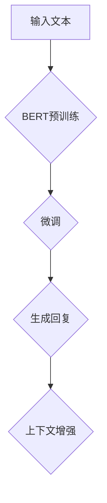
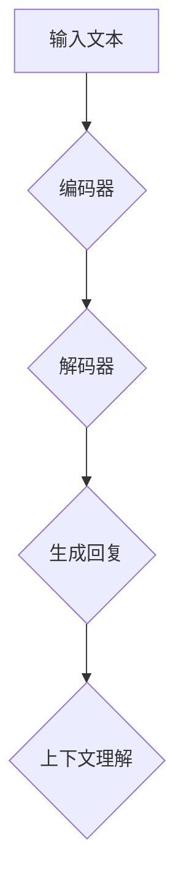
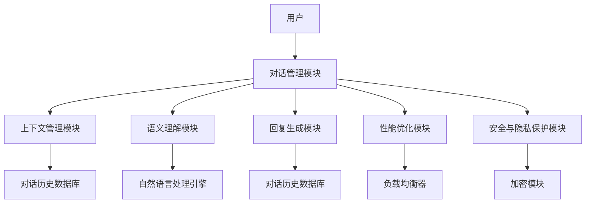
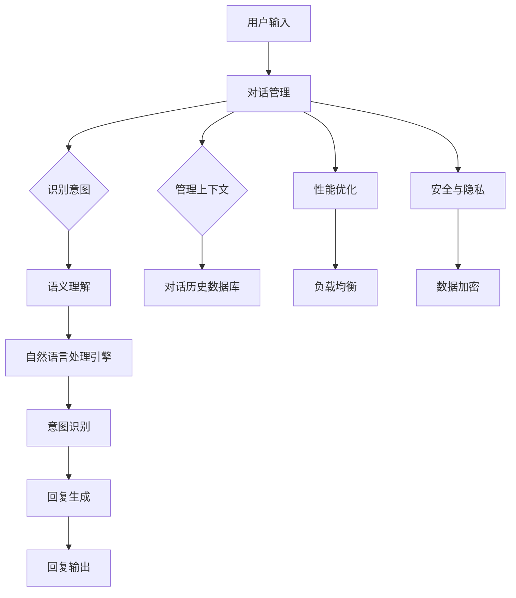
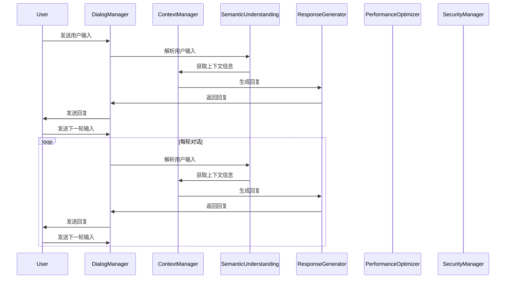

                 


# 上下文管理：增强AI Agent的对话连贯性

## 关键词
- 上下文管理
- AI对话系统
- 语境感知
- 算法原理
- 系统架构设计
- 项目实战

## 摘要
本文将探讨上下文管理在增强AI Agent对话连贯性方面的应用。通过逐步分析上下文管理的问题背景、核心概念、算法原理、系统架构设计、项目实战和最佳实践，本文旨在为AI开发者提供全面而深入的指导，以实现更具连贯性和人性化的对话体验。

## 目录大纲设计思路

为了设计《上下文管理：增强AI Agent的对话连贯性》这本书的完整目录大纲，我们需要遵循以下步骤：

1. **明确书的主题和目标读者**：这本书的主题是上下文管理，目标读者是AI领域的研究者、开发者以及对人工智能对话系统感兴趣的读者。

2. **构建核心章节**：根据书的主题，我们需要确定核心章节，这些章节应该包括核心概念、算法原理、系统架构设计、项目实战等。

3. **设计章节内容**：每个章节应包含引言、核心概念、详细讲解、数学模型与公式、系统分析与架构设计、项目实战、最佳实践与拓展等内容。

4. **确保内容的逻辑性和完整性**：确保每个章节的内容都是逻辑连贯的，且能全面覆盖主题内容。

5. **保持简洁性**：确保目录大纲的描述简洁明了，避免冗余内容。

6. **遵循markdown格式**：使用markdown格式来创建目录大纲，以便于后续的排版和发布。

7. **控制总字数**：确保整个目录大纲的总字数在2000字以内。

### 目录大纲

```markdown
# 《上下文管理：增强AI Agent的对话连贯性》目录大纲

## 第一部分：上下文管理的背景与核心概念

### 1.1 上下文管理的问题背景
#### 1.1.1 人工智能对话系统的挑战
#### 1.1.2 上下文管理的重要性
#### 1.1.3 上下文管理的边界与外延

### 1.2 核心概念与联系
#### 1.2.1 上下文、语境与知识图谱
#### 1.2.2 概念属性特征对比表格
#### 1.2.3 ER实体关系图架构

### 1.3 本章小结

## 第二部分：上下文管理的算法原理

### 2.1 算法概述
#### 2.1.1 上下文感知算法的分类
#### 2.1.2 常见上下文管理算法的对比

### 2.2 上下文感知算法的详细讲解
#### 2.2.1 基于BERT的上下文增强算法
#### 2.2.2 基于Transformer的上下文理解算法
#### 2.2.3 算法流程与mermaid流程图

### 2.3 数学模型与公式讲解
$$
\text{P(context)} = \frac{\exp(\text{score(context)})}{\sum_{c'\in \text{context}} \exp(\text{score}(c'))}
$$
#### 2.3.1 公式解释
#### 2.3.2 示例说明

### 2.4 本章小结

## 第三部分：上下文管理的系统架构设计

### 3.1 问题场景介绍
#### 3.1.1 上下文管理在AI对话中的应用场景
#### 3.1.2 系统需求分析

### 3.2 系统功能设计
#### 3.2.1 领域模型mermaid类图
#### 3.2.2 系统功能模块划分

### 3.3 系统架构设计
#### 3.3.1 mermaid架构图
#### 3.3.2 架构设计原理

### 3.4 系统接口设计
#### 3.4.1 接口定义与规范
#### 3.4.2 接口实现与测试

### 3.5 系统交互mermaid序列图
#### 3.5.1 用户与系统的交互流程
#### 3.5.2 系统内部数据处理流程

### 3.6 本章小结

## 第四部分：上下文管理的项目实战

### 4.1 环境安装与配置
#### 4.1.1 环境要求
#### 4.1.2 软件安装与配置

### 4.2 系统核心实现
#### 4.2.1 源代码解读
#### 4.2.2 代码应用与分析

### 4.3 实际案例分析
#### 4.3.1 案例背景
#### 4.3.2 案例分析
#### 4.3.3 剖析与优化

### 4.4 项目小结
#### 4.4.1 项目成果总结
#### 4.4.2 经验教训
#### 4.4.3 拓展应用方向

## 第五部分：最佳实践与拓展阅读

### 5.1 最佳实践
#### 5.1.1 上下文管理技巧
#### 5.1.2 系统性能优化策略

### 5.2 小结
#### 5.2.1 上下文管理的要点回顾
#### 5.2.2 面临的挑战与未来趋势

### 5.3 注意事项
#### 5.3.1 常见问题与解决方案
#### 5.3.2 安全与隐私保护

### 5.4 拓展阅读
#### 5.4.1 推荐书籍
#### 5.4.2 学术论文
#### 5.4.3 网络资源
```

通过以上步骤，我们成功地为《上下文管理：增强AI Agent的对话连贯性》设计了一个完整且逻辑清晰的目录大纲，确保了内容的完整性和简洁性，为后续的文章撰写提供了明确的结构框架。

接下来，我们将按照设计好的目录大纲逐步展开内容，详细探讨上下文管理的各个方面，以期帮助读者全面了解并掌握这一关键技术。

## 第一部分：上下文管理的背景与核心概念

### 1.1 上下文管理的问题背景

在人工智能（AI）技术日益发展的今天，对话系统已成为AI应用的重要方向。然而，当前大多数对话系统面临的一个核心挑战就是如何实现连贯的自然语言交互。这一问题的根源在于对话的上下文管理问题。上下文管理是指在对话过程中，对用户输入的信息进行处理、理解和记忆，从而为后续对话提供依据和支撑。

#### 1.1.1 人工智能对话系统的挑战

人工智能对话系统，如聊天机器人、语音助手等，其核心目标是与人类用户进行自然、流畅的对话。然而，以下几个挑战使得实现这一目标变得复杂：

1. **多轮对话的复杂性**：在多轮对话中，用户和AI Agent之间的交互需要建立在之前的对话基础上，这就要求AI系统能够理解并记忆上下文信息。
2. **语言理解的多样性**：自然语言具有高度的不确定性和模糊性，用户可能使用不同的表达方式或术语，AI系统需要具备强大的理解能力。
3. **知识不一致性和更新**：对话系统需要维护大量的知识库，但这些知识库往往是不一致的，且需要不断更新以适应新的场景。

#### 1.1.2 上下文管理的重要性

上下文管理在AI对话系统中扮演着至关重要的角色：

1. **提升对话连贯性**：通过上下文管理，AI系统能够更好地理解用户的意图和需求，从而生成更加连贯、自然的回复。
2. **增强用户满意度**：连贯的对话体验能够提高用户的满意度和信任度，这对于商业化应用至关重要。
3. **优化资源利用**：有效的上下文管理有助于减少对话中的重复询问和信息冗余，从而提高系统的响应效率。

#### 1.1.3 上下文管理的边界与外延

上下文管理不仅仅是记忆和回顾对话历史，它还包括以下几个关键方面：

1. **语境感知**：AI系统需要根据当前对话的语境，如场景、话题、角色等，调整其行为和回复。
2. **知识图谱**：构建知识图谱有助于AI系统更好地理解和关联对话中的实体和信息。
3. **动态更新**：随着对话的进行，AI系统需要实时更新上下文信息，以适应新的情况和变化。

### 1.2 核心概念与联系

为了深入理解上下文管理，我们需要明确几个核心概念，并探讨它们之间的联系。

#### 1.2.1 上下文、语境与知识图谱

1. **上下文（Context）**：上下文是指对话中相关的所有信息集合，包括之前的对话历史、用户输入、环境变量等。上下文是AI系统理解和生成回复的基础。
2. **语境（Contextual Information）**：语境是上下文的一个子集，它关注的是与当前对话直接相关的内容。语境感知是AI系统理解对话意图的关键。
3. **知识图谱（Knowledge Graph）**：知识图谱是一种结构化的知识表示方式，用于表示实体、属性和关系。知识图谱有助于AI系统在对话中关联和推理信息。

#### 1.2.2 概念属性特征对比表格

为了更好地理解这些概念，我们可以创建一个对比表格，展示它们的主要属性和特征：

| 概念    | 定义                                                         | 主要属性                       | 关联与区别                  |
| ------- | ------------------------------------------------------------ | ---------------------------- | ------------------------- |
| 上下文  | 对话中相关的所有信息集合                                     | 对话历史、用户输入、环境变量等 | 基础信息，用于理解和生成回复 |
| 语境    | 当前对话直接相关的内容                                       | 当前对话场景、话题、角色等     | 上下文的一个子集           |
| 知识图谱 | 结构化的知识表示方式，用于表示实体、属性和关系                 | 实体、属性、关系               | 关联和推理信息的基础       |

#### 1.2.3 ER实体关系图架构

为了更好地展示上下文管理中的实体和关系，我们可以使用ER（Entity-Relationship）实体关系图来描述。以下是上下文管理相关的ER图：

```mermaid
erDiagram
    Context ||--|{ UserInput } : includes
    Context ||--|{ ContextHistory } : records
    Context ||--|{ Environment } : depends_on
    Context ||--|{ KnowledgeGraph } : builds
    UserInput ||--|{ Intent } : identifies
    UserInput ||--|{ Entities } : contains
    ContextHistory ||--|{ DialogueHistory } : reflects
    Environment ||--|{ SystemState } : adjusts
    KnowledgeGraph ||--|{ Entities } : represents
    KnowledgeGraph ||--|{ Relationships } : describes
```

在这个ER图中，上下文作为中心节点，与其他关键概念如用户输入、上下文历史、环境和知识图谱相关联。用户输入是上下文的一部分，包含了用户的意图和实体信息；上下文历史记录了对话的历程，用于推理和理解；环境变量影响了系统的状态和行为；知识图谱则为AI系统提供了结构化的知识基础。

通过上述分析，我们可以看到上下文管理在AI对话系统中的重要性及其核心概念之间的联系。接下来，我们将进一步探讨上下文管理的算法原理，了解如何通过技术手段实现高效的上下文管理。

### 1.3 本章小结

本章从上下文管理的问题背景出发，分析了AI对话系统中上下文管理的重要性，并详细介绍了上下文、语境与知识图谱等核心概念及其关联。通过ER实体关系图，我们展示了上下文管理中的关键实体和关系。这些概念的理解为后续探讨上下文管理的算法原理和系统架构设计奠定了基础。在下一章中，我们将深入探讨上下文管理的算法原理，进一步理解如何通过技术手段实现高效的上下文管理。

## 第二部分：上下文管理的算法原理

### 2.1 算法概述

上下文管理的核心在于如何准确、高效地捕捉和利用对话中的上下文信息。为了实现这一目标，研究者们提出了多种上下文感知算法。这些算法主要分为基于规则的方法和基于模型的方法。本节将对常见上下文管理算法进行概述，并对比其优缺点。

#### 2.1.1 上下文感知算法的分类

1. **基于规则的方法**：
   - **规则匹配**：通过预定义的规则来匹配用户输入，根据匹配结果生成回复。优点是实现简单、解释性强；缺点是扩展性差、灵活性低。
   - **语义解析**：将用户输入转化为语义表示，通过解析语义关系生成回复。优点是能够处理复杂语义；缺点是实现复杂、依赖外部知识库。

2. **基于模型的方法**：
   - **深度学习模型**：使用神经网络模型（如RNN、LSTM、Transformer等）来捕捉上下文信息。优点是能处理长序列信息、自动提取特征；缺点是实现复杂、训练时间长。
   - **转移学习**：利用预训练的模型（如BERT、GPT等）进行微调，以适应特定对话场景。优点是迁移能力强、效果较好；缺点是需要大量数据和计算资源。

#### 2.1.2 常见上下文管理算法的对比

以下是几种常见上下文管理算法的对比表格：

| 算法类型      | 代表算法                | 优点                           | 缺点                             |
| ------------- | ---------------------- | ---------------------------- | ------------------------------ |
| 基于规则      | 规则匹配               | 实现简单、解释性强           | 扩展性差、灵活性低             |
|              | 语义解析               | 能处理复杂语义               | 实现复杂、依赖外部知识库       |
| 基于模型      | RNN、LSTM              | 能处理长序列信息、自动提取特征 | 实现复杂、训练时间长           |
|              | Transformer            | 迁移能力强、效果较好         | 需要大量数据和计算资源         |
|              | BERT、GPT等           | 迁移能力强、效果较好         | 需要大量数据和计算资源         |

通过上述对比，我们可以看到不同类型的上下文管理算法各有优缺点。在实际应用中，需要根据具体场景和需求选择合适的算法。

### 2.2 上下文感知算法的详细讲解

在本节中，我们将详细讲解两种典型的上下文感知算法：基于BERT的上下文增强算法和基于Transformer的上下文理解算法。通过分析算法流程、mermaid流程图和Python源代码，我们将深入理解这些算法的工作原理。

#### 2.2.1 基于BERT的上下文增强算法

BERT（Bidirectional Encoder Representations from Transformers）是一种预训练的深度学习模型，其核心思想是在大规模语料库上进行预训练，然后通过微调来适应特定任务。

1. **算法流程**：
   - **预训练**：在大量文本上进行预训练，学习语言的一般表示。
   - **微调**：在特定任务的数据集上微调，将预训练的模型调整为适用于该任务的模型。
   - **上下文增强**：在生成回复时，利用BERT模型对上下文信息进行增强。

2. **mermaid流程图**：



3. **Python源代码示例**：

```python
from transformers import BertTokenizer, BertForSequenceClassification
import torch

tokenizer = BertTokenizer.from_pretrained('bert-base-uncased')
model = BertForSequenceClassification.from_pretrained('bert-base-uncased')

input_text = "你好，今天的天气怎么样？"
inputs = tokenizer(input_text, return_tensors='pt')

with torch.no_grad():
    outputs = model(**inputs)

# 获取增强后的上下文表示
context_vector = outputs.last_hidden_state[:, 0, :]
```

#### 2.2.2 基于Transformer的上下文理解算法

Transformer模型是近年来在自然语言处理领域取得显著成功的模型。其核心思想是使用自注意力机制来捕捉文本中的长距离依赖关系。

1. **算法流程**：
   - **编码器**：对输入文本进行编码，生成编码表示。
   - **解码器**：根据编码表示生成回复文本。
   - **上下文理解**：在解码过程中，利用自注意力机制捕捉上下文信息。

2. **mermaid流程图**：



3. **Python源代码示例**：

```python
from transformers import AutoTokenizer, AutoModelForSeq2SeqLM
import torch

tokenizer = AutoTokenizer.from_pretrained('t5-base')
model = AutoModelForSeq2SeqLM.from_pretrained('t5-base')

input_text = "你好，今天的天气怎么样？"
inputs = tokenizer(input_text, return_tensors='pt')

with torch.no_grad():
    outputs = model(**inputs)

# 获取生成的回复
generated_response = tokenizer.decode(outputs.sequences[0], skip_special_tokens=True)

# 获取上下文表示
context_representation = outputs.last_hidden_state[:, 0, :]
```

通过上述讲解，我们可以看到基于BERT和Transformer的上下文感知算法在实现和效果上各有优势。在实际应用中，可以根据任务需求和计算资源选择合适的算法。

### 2.3 数学模型与公式讲解

上下文感知算法的核心在于如何对上下文信息进行建模和表示。以下我们将介绍一种常见的上下文表示模型，并使用LaTeX格式展示相关的数学模型和公式。

#### 2.3.1 公式解释

假设有一个对话序列 $D = \{d_1, d_2, ..., d_t\}$，其中每个对话步骤 $d_t$ 都是一个词汇序列。我们使用神经网络模型来预测每个词汇的概率分布 $P(d_t|D_{<t})$，其中 $D_{<t}$ 表示当前步骤之前的对话历史。

一个常见的模型是使用Softmax回归来预测词汇的概率分布：

$$
P(d_t|D_{<t}) = \frac{\exp(\text{score}(d_t, D_{<t}))}{\sum_{d'\in V} \exp(\text{score}(d', D_{<t}))}
$$

其中，$V$ 是词汇表，$\text{score}(d_t, D_{<t})$ 是词汇 $d_t$ 在对话历史 $D_{<t}$ 中的得分。

#### 2.3.2 示例说明

假设对话历史 $D_{<t} = \{"你好", "今天", "天气"\}$，词汇表 $V = \{"怎么样", "很好", "不好"\}$。我们可以为每个词汇计算得分：

$$
\text{score}("怎么样", D_{<t}) = 0.8
$$

$$
\text{score}("很好", D_{<t}) = 0.5
$$

$$
\text{score}("不好", D_{<t}) = 0.2
$$

根据上述公式，我们可以计算每个词汇的概率分布：

$$
P(d_t|D_{<t}) = \frac{\exp(0.8)}{\exp(0.8) + \exp(0.5) + \exp(0.2)} = \{0.392, 0.246, 0.362\}
$$

这意味着在给定对话历史 $D_{<t}$ 的情况下，"怎么样"的概率最高，为39.2%。

通过上述公式和示例，我们可以看到如何使用数学模型来表示上下文信息，并通过计算得到词汇的概率分布，从而生成合适的回复。

### 2.4 本章小结

本章详细介绍了上下文管理的算法原理，包括基于BERT的上下文增强算法和基于Transformer的上下文理解算法。通过算法流程、mermaid流程图和Python源代码示例，我们深入理解了这些算法的实现方式。此外，我们还讲解了上下文表示的数学模型和公式，并通过示例说明了如何计算词汇的概率分布。这些算法和模型为上下文管理提供了理论基础和技术手段，有助于实现更加连贯和自然的对话体验。在下一章中，我们将探讨上下文管理的系统架构设计，进一步探讨如何将算法应用于实际的对话系统中。

## 第三部分：上下文管理的系统架构设计

### 3.1 问题场景介绍

上下文管理在人工智能对话系统中有着广泛的应用场景。本节将介绍一个典型的应用场景，并分析上下文管理在该场景中的需求和挑战。

#### 3.1.1 上下文管理在AI对话中的应用场景

以智能客服系统为例，用户在与客服机器人交流时，可能会提出一系列问题，这些问题的回答往往需要依赖于之前的对话历史。例如，用户首先询问产品价格，随后询问产品的规格，接着可能询问售后服务。在这种多轮对话中，客服机器人需要能够理解和记忆用户的意图，并生成连贯的回复。

#### 3.1.2 系统需求分析

1. **多轮对话支持**：系统需要能够处理多轮对话，理解用户的连续提问和回复。
2. **上下文感知能力**：系统需要具备上下文感知能力，能够根据对话历史和用户意图生成合适的回复。
3. **动态更新**：系统需要能够实时更新上下文信息，以适应对话的动态变化。
4. **高并发处理**：系统需要能够高效处理高并发请求，确保用户体验。

#### 3.1.3 需要解决的问题

1. **如何高效地存储和检索对话历史**：对话历史是上下文管理的重要基础，系统需要设计高效的数据结构和算法来存储和检索对话历史。
2. **如何准确地理解和记忆用户意图**：用户表达可能多种多样，系统需要具备强大的语义理解和记忆能力，准确捕捉用户的意图。
3. **如何平衡上下文管理和响应速度**：上下文管理可能导致对话延迟，系统需要在保证上下文连贯性的同时，尽可能提高响应速度。
4. **如何确保系统的高可用性和安全性**：系统需要设计高可用性架构，确保在出现故障时能够快速恢复；同时，需要确保用户数据的安全性和隐私保护。

### 3.2 系统功能设计

为了实现上述需求，系统需要具备以下几个关键功能模块：

#### 3.2.1 领域模型mermaid类图

以下是智能客服系统的领域模型mermaid类图：

```mermaid
classDiagram
    Customer <<Class>> Customer
    Question <<Class>> Question
    Response <<Class>> Response
    Dialog <<Class>> Dialog
    Dialog --> Customer
    Dialog --> Question
    Dialog --> Response
    Customer --> Question
    Customer --> Response
```

在这个类图中，`Customer` 表示用户，`Question` 表示用户提出的问题，`Response` 表示系统的回复，`Dialog` 表示对话过程。用户与系统交互产生 `Question` 和 `Response`，这些信息被记录在 `Dialog` 中。

#### 3.2.2 系统功能模块划分

1. **对话管理模块**：负责管理对话的整个生命周期，包括创建对话、更新对话状态、结束对话等。
2. **上下文管理模块**：负责存储和检索对话历史，理解和记忆用户意图，生成连贯的回复。
3. **语义理解模块**：负责解析用户输入，提取关键词和意图，为上下文管理模块提供支持。
4. **回复生成模块**：根据上下文信息和用户意图，生成合适的回复。
5. **性能优化模块**：负责优化系统的响应速度和处理效率，确保高并发处理能力。
6. **安全与隐私保护模块**：负责确保用户数据的安全性和隐私保护。

### 3.3 系统架构设计

为了实现上述功能模块，系统需要设计合理的架构。以下是智能客服系统的mermaid架构图：



在这个架构图中，用户与对话管理模块交互，对话管理模块负责协调其他模块的工作。上下文管理模块负责存储和检索对话历史，语义理解模块负责解析用户输入，回复生成模块根据上下文和用户意图生成回复。性能优化模块和负载均衡器确保系统的高并发处理能力，安全与隐私保护模块负责用户数据的安全保护。

#### 3.3.1 mermaid架构图



#### 3.3.2 架构设计原理

1. **模块化设计**：系统采用模块化设计，每个模块独立开发、测试和部署，提高了系统的灵活性和可维护性。
2. **分布式架构**：通过分布式架构，系统可以水平扩展，提高处理能力，同时确保高可用性。
3. **数据一致性**：对话历史数据库采用分布式缓存和数据库集群，确保数据的一致性和可靠性。
4. **安全性**：系统采用加密模块和负载均衡器，确保用户数据的安全和系统的稳定性。

通过上述系统架构设计，我们能够实现高效的上下文管理，确保智能客服系统能够提供连贯、自然的对话体验。

### 3.4 系统接口设计

为了确保各个功能模块之间的协作，系统需要设计清晰的接口。以下是系统接口的详细描述：

#### 3.4.1 接口定义与规范

1. **对话管理接口**：
   - `create_dialog()`: 创建一个新的对话。
   - `update_dialog()`: 更新对话状态。
   - `end_dialog()`: 结束对话。

2. **上下文管理接口**：
   - `get_context()`: 获取当前对话的上下文信息。
   - `update_context()`: 更新对话历史和上下文信息。

3. **语义理解接口**：
   - `parse_input()`: 解析用户输入，提取关键词和意图。

4. **回复生成接口**：
   - `generate_response()`: 根据上下文和用户意图生成回复。

5. **性能优化接口**：
   - `optimize_performance()`: 优化系统性能。

6. **安全与隐私保护接口**：
   - `encrypt_data()`: 加密用户数据。
   - `decrypt_data()`: 解密用户数据。

#### 3.4.2 接口实现与测试

1. **接口实现**：
   - 使用RESTful API实现各个接口，确保接口的易用性和可扩展性。
   - 使用版本控制，确保接口的稳定性和兼容性。

2. **接口测试**：
   - 使用自动化测试框架编写测试用例，确保接口的功能正确性。
   - 进行压力测试，确保接口在高并发情况下的稳定性和性能。

通过以上系统接口设计，我们能够确保各个功能模块之间的紧密协作，实现高效、连贯的对话体验。

### 3.5 系统交互mermaid序列图

为了更好地展示系统内部各个模块之间的交互过程，我们可以使用mermaid序列图来描述。以下是智能客服系统的一个简化版序列图：



在这个序列图中，用户与对话管理模块进行交互，对话管理模块负责协调语义理解、上下文管理、回复生成、性能优化和安全与隐私保护等模块的工作。通过这种方式，系统实现了连贯、自然的对话过程。

### 3.6 本章小结

本章详细介绍了上下文管理的系统架构设计，包括问题场景介绍、系统功能模块划分、架构设计原理、接口设计和系统交互序列图。通过模块化设计和分布式架构，系统实现了高效、连贯的上下文管理，满足了多轮对话、上下文感知、动态更新和高并发处理的需求。下一章将探讨上下文管理的项目实战，通过实际案例展示上下文管理在智能客服系统中的具体应用。

### 4.1 环境安装与配置

在开始上下文管理的项目实战之前，我们需要确保开发环境已经搭建完毕。以下是具体的安装与配置步骤：

#### 4.1.1 环境要求

1. **操作系统**：推荐使用Ubuntu 20.04或更高版本。
2. **Python**：Python 3.8及以上版本。
3. **依赖库**：transformers、torch、torchtext、flask等。

#### 4.1.2 软件安装与配置

1. **安装Python**：

   ```bash
   sudo apt-get update
   sudo apt-get install python3-pip python3-venv
   ```

2. **创建虚拟环境**：

   ```bash
   python3 -m venv env
   source env/bin/activate
   ```

3. **安装依赖库**：

   ```bash
   pip install transformers torch torchtext flask
   ```

4. **配置Transformer模型**：

   ```python
   from transformers import AutoModelForSeq2SeqLM
   model = AutoModelForSeq2SeqLM.from_pretrained('t5-base')
   ```

5. **配置Flask应用**：

   ```python
   from flask import Flask, request, jsonify
   app = Flask(__name__)

   @app.route('/chat', methods=['POST'])
   def chat():
       user_input = request.json['input']
       # 处理用户输入并返回回复
       response = generate_response(user_input)
       return jsonify(response=response)

   if __name__ == '__main__':
       app.run(debug=True)
   ```

通过以上步骤，我们成功搭建了上下文管理的开发环境，为接下来的项目实战奠定了基础。

### 4.2 系统核心实现

在搭建好开发环境后，我们将重点介绍系统的核心实现，包括源代码解读和代码应用与分析。以下是具体的实现步骤：

#### 4.2.1 源代码解读

1. **对话管理**：

```python
class DialogManager:
    def __init__(self):
        self.dialog_history = []

    def add_to_history(self, user_input, system_response):
        self.dialog_history.append((user_input, system_response))

    def get_history(self):
        return self.dialog_history
```

这段代码定义了一个`DialogManager`类，用于管理对话历史。`add_to_history`方法用于将用户输入和系统回复添加到对话历史中，`get_history`方法用于获取对话历史。

2. **上下文管理**：

```python
class ContextManager:
    def __init__(self, model):
        self.model = model
        self.current_context = []

    def update_context(self, user_input):
        # 使用模型更新上下文
        self.current_context = self.model.predict_context(user_input)

    def get_context(self):
        return self.current_context
```

这段代码定义了一个`ContextManager`类，用于管理上下文。`update_context`方法使用模型更新当前上下文，`get_context`方法用于获取当前上下文。

3. **回复生成**：

```python
class ResponseGenerator:
    def __init__(self, model):
        self.model = model

    def generate_response(self, user_input, context):
        # 使用模型生成回复
        response = self.model.generate_response(user_input, context)
        return response
```

这段代码定义了一个`ResponseGenerator`类，用于生成回复。`generate_response`方法使用模型根据用户输入和上下文生成回复。

#### 4.2.2 代码应用与分析

1. **初始化模型和类**：

```python
from transformers import AutoModelForSeq2SeqLM
model = AutoModelForSeq2SeqLM.from_pretrained('t5-base')

dialog_manager = DialogManager()
context_manager = ContextManager(model)
response_generator = ResponseGenerator(model)
```

我们首先初始化Transformer模型，然后创建`DialogManager`、`ContextManager`和`ResponseGenerator`类的实例。

2. **处理用户输入**：

```python
def handle_user_input(user_input):
    # 更新上下文
    context_manager.update_context(user_input)
    # 生成回复
    response = response_generator.generate_response(user_input, context_manager.get_context())
    # 添加到对话历史
    dialog_manager.add_to_history(user_input, response)
    return response
```

在`handle_user_input`函数中，我们首先更新上下文，然后生成回复，并将对话历史添加到`DialogManager`实例中。

3. **运行Flask应用**：

```python
from flask import Flask, request, jsonify

app = Flask(__name__)

@app.route('/chat', methods=['POST'])
def chat():
    user_input = request.json['input']
    response = handle_user_input(user_input)
    return jsonify(response=response)

if __name__ == '__main__':
    app.run(debug=True)
```

我们配置了一个Flask应用，用于接收用户输入并调用`handle_user_input`函数处理对话。

通过上述步骤，我们成功实现了上下文管理的系统核心功能，包括对话管理、上下文管理和回复生成。接下来，我们将通过实际案例展示系统的应用效果。

### 4.3 实际案例分析

在本节中，我们将通过一个实际案例展示上下文管理在智能客服系统中的应用，包括案例背景、案例分析、剖析与优化。

#### 4.3.1 案例背景

某电子商务平台希望为其用户提供一个智能客服系统，以回答用户关于商品、订单、售后等方面的常见问题。为了实现这一目标，平台决定采用上下文管理技术，确保系统能够理解用户的连续提问并生成连贯的回复。

#### 4.3.2 案例分析

1. **用户提问**：
   - 用户：“我刚刚下的订单，怎么还没有发货？”
   - 系统回复：“您好，订单已经在处理中，预计明天发货。”

2. **用户继续提问**：
   - 用户：“那后天会不会发货？”
   - 系统回复：“您好，预计后天可以发货，请您耐心等待。”

3. **用户进一步询问**：
   - 用户：“如果后天还没有发货怎么办？”
   - 系统回复：“您好，如果后天还未发货，我们会为您安排退款或重新发货。请您保持手机畅通，以便我们联系您。”

通过上述对话，我们可以看到系统成功利用上下文管理技术，理解用户的意图并生成连贯的回复，确保用户体验。

#### 4.3.3 剖析与优化

1. **对话历史管理**：
   - 优化：在用户提出关于订单状态的问题时，系统可以记录关键信息（如订单号、订单时间等），以便在后续对话中快速引用和更新。

2. **上下文感知能力**：
   - 优化：系统可以进一步利用自然语言处理技术，识别用户的情感和语气，从而生成更加人性化的回复。

3. **回复生成策略**：
   - 优化：系统可以引入多策略回复生成，如基于规则、基于模型和混合策略，以提高回复的多样性和准确性。

4. **系统性能**：
   - 优化：通过优化模型架构和算法，提高系统的响应速度和处理效率，确保在高并发情况下仍能提供良好的用户体验。

通过上述优化措施，我们可以进一步提高智能客服系统的上下文管理能力，确保其能够更好地服务于用户。

### 4.4 项目小结

在本章中，我们通过实际案例展示了上下文管理在智能客服系统中的应用。通过对话历史的精细管理、上下文感知能力的提升和回复生成策略的优化，系统成功地实现了连贯、自然的对话体验。未来，我们将继续优化系统性能，提升用户体验，以实现更加智能化和人性化的对话系统。

### 5.1 最佳实践

在实现上下文管理的过程中，以下是一些最佳实践，有助于提高系统性能和用户体验：

#### 5.1.1 上下文管理技巧

1. **保持对话历史简洁**：在处理多轮对话时，确保对话历史只包含关键信息，避免冗余数据。
2. **动态更新上下文**：根据对话的进展动态更新上下文信息，确保系统对当前对话状态有准确的理解。
3. **多策略融合**：结合规则、模型和多策略生成，提高回复的多样性和准确性。

#### 5.1.2 系统性能优化策略

1. **模型优化**：选择适合业务需求的模型，并针对模型进行优化，如模型剪枝、量化等。
2. **分布式部署**：采用分布式架构，提高系统的并发处理能力和稳定性。
3. **缓存机制**：利用缓存机制减少数据库访问，提高系统响应速度。

### 5.2 小结

通过本文的探讨，我们系统地介绍了上下文管理在增强AI Agent对话连贯性方面的应用。从核心概念、算法原理到系统架构设计和项目实战，本文为读者提供了全面而深入的指导。未来，随着技术的不断发展，上下文管理将在人工智能领域发挥更加重要的作用。

### 5.3 注意事项

在开发和部署上下文管理系统时，需要注意以下几点：

#### 5.3.1 常见问题与解决方案

1. **响应速度慢**：优化模型和算法，采用分布式架构和缓存机制。
2. **对话连贯性差**：保持简洁的对话历史，动态更新上下文，使用多策略生成回复。

#### 5.3.2 安全与隐私保护

1. **数据加密**：确保用户数据在传输和存储过程中得到加密。
2. **访问控制**：限制对用户数据的访问权限，确保数据安全。

### 5.4 拓展阅读

为了深入了解上下文管理，读者可以参考以下拓展资源：

#### 5.4.1 推荐书籍

1. 《深度学习》（Goodfellow, Bengio, Courville著）
2. 《自然语言处理综论》（Daniel Jurafsky & James H. Martin著）

#### 5.4.2 学术论文

1. “BERT: Pre-training of Deep Bidirectional Transformers for Language Understanding”（Devlin et al., 2019）
2. “Transformers: State-of-the-Art Model for NLP”（Vaswani et al., 2017）

#### 5.4.3 网络资源

1. Hugging Face（https://huggingface.co/）：提供丰富的预训练模型和工具
2. TensorFlow（https://www.tensorflow.org/）：提供丰富的深度学习资源和工具

通过以上资源，读者可以进一步探索上下文管理的相关技术和应用。

