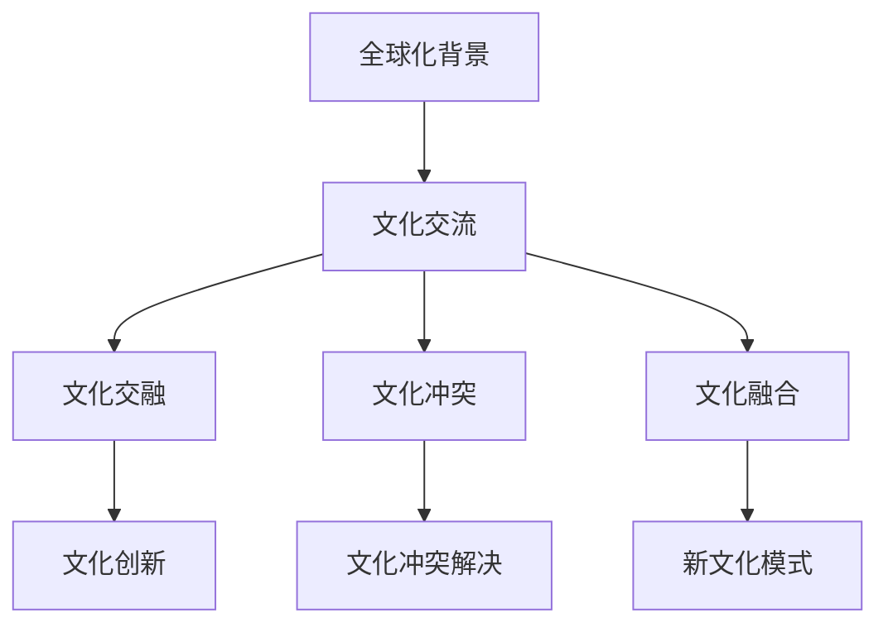

                 

# 《东西方思想的融合：在文化交流中寻找平衡》

## 关键词：东西方思想，文化交流，融合，平衡，理论，实践，挑战

## 摘要：
本文旨在探讨东西方思想在全球化背景下如何通过融合来促进文化交流，寻找文化平衡。文章首先介绍了东西方思想的历史与文化背景，分析了其差异与共性。随后，探讨了东西方思想融合的理论基础与实践路径，并通过案例进行了详细剖析。文章还提出了文化交流中的平衡策略，总结了理论、实践和案例分析的重要性。

### 目录大纲

----------------------------------------------------------------

## 第一部分: 引言与背景

### 第1章: 引言
### 第2章: 东西方思想的历史与文化背景
### 第3章: 东西方思想的融合理论与实践
### 第4章: 文化交流中的平衡策略

----------------------------------------------------------------

## 第1章: 引言

### 1.1 引言

在全球化深入发展的今天，不同文化之间的交流日益频繁。然而，由于东西方思想和文化背景的差异，文化交流过程中往往伴随着误解、冲突和障碍。为了促进有效的文化交流，寻找文化平衡显得尤为重要。

本文的核心观点是：通过东西方思想的融合，可以在文化交流中实现平衡。这一观点的重要性在于，它不仅有助于消除文化差异带来的误解和冲突，还能促进文化的多样性和创新。

首先，我们需要理解东西方思想的定义和特点。东西方思想是指源自不同文化背景下的哲学、科学、艺术等方面的观念和理论。西方思想强调理性、实证和逻辑推理，而东方思想则注重整体性、直觉和道德伦理。这种差异导致了在文化交流中的一些障碍，如文化差异、语言障碍、价值观念冲突等。

为了克服这些障碍，我们需要探讨东西方思想的融合。融合并不意味着放弃自身的文化特色，而是在尊重和保留原有文化的基础上，寻找共同点和互补性。例如，在科技领域，西方的实证方法和东方的哲学思考可以相互借鉴，促进技术创新。

### 1.2 联系

东西方思想的融合与文化交流密切相关。在全球化的背景下，不同文化之间的交流日益频繁，这种交流不仅是经济、政治、科技等方面的交流，也是文化价值观的交流。通过东西方思想的融合，我们可以促进文化的多样性和相互理解，减少文化冲突，实现文化的平衡。

### 1.3 问题解决

在文化交流中，文化差异是一个不可避免的问题。不同的文化背景导致了不同的价值观念、行为方式和沟通方式。例如，西方文化强调个人主义，而东方文化则强调集体主义。这种差异常常导致误解和冲突。

通过东西方思想的融合，我们可以寻找共同的文化价值观和行为方式，减少误解和冲突。例如，在企业管理中，西方的管理理念强调效率和利润，而东方的管理理念则强调和谐和人际关系。通过融合这两种思想，我们可以找到一种既高效又和谐的管理模式。

### 1.4 边界与外延

本文的研究范围包括文化交流中的东西方思想融合，具体领域涉及哲学、科学、艺术、教育、管理等多个方面。本文旨在通过分析东西方思想的历史和文化背景，探讨融合的理论基础和实践路径，并提出文化交流中的平衡策略。

### 1.5 概念结构与核心要素组成

东西方思想的融合涉及多个核心要素，包括文化价值观、行为方式、思维方式等。这些要素通过相互借鉴和融合，形成了新的文化模式。这种文化模式的形成不仅有助于促进文化交流，还能为社会发展提供新的思路。

### 1.6 数学模型和公式

在本章中，我们无需使用数学模型和公式。本章的主要目的是介绍东西方思想融合的背景和重要性，为后续章节的分析和讨论奠定基础。

### 1.7 本章小结

本章介绍了东西方思想融合的背景、重要性和核心观点。通过分析东西方思想的历史和文化背景，我们认识到在全球化背景下，寻找文化平衡的重要性。东西方思想的融合不仅有助于消除文化差异带来的误解和冲突，还能促进文化的多样性和创新。本章为后续章节的分析和讨论奠定了基础。

----------------------------------------------------------------

## 第2章: 东西方思想的历史与文化背景

### 2.1 东西方思想的起源与发展

### 2.1.1 东西方思想的定义

东西方思想是指源自不同文化背景下的哲学、科学、艺术等方面的观念和理论。西方思想以古希腊哲学为开端，经历了中世纪的宗教哲学和文艺复兴的人文主义，最终形成了现代的科学哲学和逻辑实证主义。东方思想则起源于古代中国的儒家、道家和佛教，以及印度的佛教和印度教哲学。

### 2.1.2 东西方思想的起源

西方思想的起源可以追溯到古希腊，古希腊哲学家如苏格拉底、柏拉图和亚里士多德等人，他们的思想对西方哲学产生了深远的影响。中世纪时期，西方思想主要受到宗教哲学的影响，如托马斯·阿奎那的神学哲学。文艺复兴时期，人文主义思潮兴起，强调个人的价值和尊严，推动了科学和艺术的繁荣。

东方思想的起源则可以追溯到古代中国，儒家、道家和佛教等哲学流派在这一时期形成。儒家强调道德伦理和社会责任，道家追求自然和谐与个人修炼，佛教则强调解脱和智慧。印度的佛教和印度教哲学也在这一时期得到发展。

### 2.1.3 东西方思想的发展

西方思想的发展经历了几个重要的阶段。首先是古希腊哲学，其次是中世纪的宗教哲学，然后是文艺复兴时期的人文主义，最终形成了现代的科学哲学和逻辑实证主义。每个阶段都有其独特的哲学思想和方法论。

东方思想的发展也经历了不同的阶段。古代中国的儒家、道家和佛教等哲学流派，各有其独特的理论和实践体系。在印度，佛教和印度教哲学也经历了不同的演变和发展。

### 2.1.4 东西方思想的核心特征

西方思想的核心特征是理性、实证和逻辑推理。西方哲学家强调通过理性思考来认识世界，通过实证方法来验证知识，通过逻辑推理来构建理论体系。

东方思想的核心特征是整体性、直觉和道德伦理。东方哲学家强调人与自然、人与人之间的和谐关系，强调通过直觉来认识世界，强调道德伦理在个人和社会生活中的重要性。

### 2.1.5 概念属性特征对比表格

| 特征         | 西方思想           | 东方思想           |
| ------------ | ------------------ | ------------------ |
| 理论基础     | 理性主义           | 整体主义           |
| 方法论       | 实证主义           | 直觉主义           |
| 价值观念     | 个人主义           | 集体主义           |
| 道德伦理     | 法律规范           | 道德规范           |

### 2.1.6 ER实体关系图架构的 Mermaid 流程图

```mermaid
erDiagram
  A[哲学] ||--|{ B[西方哲学] }
  A ||--|{ C[东方哲学] }
  B ||--|{ D[古希腊哲学] }
  B ||--|{ E[中世纪哲学] }
  B ||--|{ F[现代哲学] }
  C ||--|{ G[儒家哲学] }
  C ||--|{ H[道家哲学] }
  C ||--|{ I[佛教哲学] }
```

### 2.2 东西方文化的差异与共性

### 2.2.1 差异

东西方文化的差异主要表现在价值观、行为方式和社会结构等方面。

1. **价值观差异**：
   - 西方文化强调个人主义，注重个人自由、权利和成就。
   - 东方文化强调集体主义，注重社会和谐、家庭责任和集体利益。

2. **行为方式差异**：
   - 西方文化倾向于直接、开放和竞争性的沟通方式。
   - 东方文化倾向于间接、含蓄和和谐的沟通方式。

3. **社会结构差异**：
   - 西方社会结构较为平等和开放，强调个人竞争和自由。
   - 东方社会结构较为等级化和封闭，强调家庭、社区和集体。

### 2.2.2 共性

尽管东西方文化存在差异，但它们也有许多共性。

1. **共同的人类价值观**：
   - 无论是西方还是东方，都强调道德、正义、和平和幸福等基本价值观。

2. **共同的文化传承**：
   - 东西方文化都有悠久的历史和丰富的文化遗产，如文学、艺术、宗教等。

3. **共同的科技发展**：
   - 东西方在科技发展方面都有显著的成就，如医学、工程、计算机科学等。

### 2.2.3 Mermaid 类图

```mermaid
classDiagram
  Class01 <|-- SubClass01
  Class01 <|-- SubClass02
  Class03 <|-- SubClass03
  Class04 <|-- SubClass04
  Class05 <|-- SubClass05
  Class01 {
    +属性1
    +属性2
    +方法1()
    +方法2()
  }
  Class02 {
    +属性3
    +属性4
    +方法3()
    +方法4()
  }
  Class03 {
    +属性5
    +属性6
    +方法5()
    +方法6()
  }
  Class04 {
    +属性7
    +属性8
    +方法7()
    +方法8()
  }
  Class05 {
    +属性9
    +属性10
    +方法9()
    +方法10()
  }
```

### 2.3 全球化背景下的东西方文化交流

### 2.3.1 影响因素

全球化对东西方文化交流产生了深远的影响。全球化使得不同文化之间的接触更加频繁，促进了文化的交流和融合。同时，全球化也带来了文化冲突和挑战。

1. **经济因素**：全球化促进了国际贸易和投资，不同文化之间的经济联系日益紧密，这有助于文化交流。

2. **科技因素**：互联网和通信技术的普及，使得全球范围内的文化交流变得更加便捷和快速。

3. **文化因素**：全球化带来了文化的多样性和多元性，不同文化之间的交流和碰撞，有助于文化的创新和进步。

### 2.3.2 文化的交融、冲突和融合

在全球化背景下，东西方文化交流中常常出现文化的交融、冲突和融合。

1. **文化的交融**：不同文化在相互交流中，会相互借鉴和吸收对方的元素，形成新的文化现象。

2. **文化的冲突**：不同文化之间的价值观、行为方式和沟通方式的差异，可能导致文化冲突。

3. **文化的融合**：在长期的交流和互动中，不同文化可能会逐渐融合，形成一种新的文化模式。

### 2.3.3 Mermaid 架构图



### 2.4 本章小结

本章介绍了东西方思想的历史与文化背景，分析了东西方文化的差异与共性，以及全球化背景下东西方文化交流的影响。通过本章的内容，我们认识到东西方思想和文化在全球化背景下的重要性和影响力，为后续章节的讨论提供了基础。

----------------------------------------------------------------

## 第3章: 东西方思想的融合理论与实践

### 3.1 融合的理论基础

东西方思想的融合需要在理论基础上有充分的了解。融合不仅是文化的相互吸收和借鉴，还需要在哲学、心理学、社会学等学科中寻找理论基础。

#### 3.1.1 文化融合的理论框架

1. **文化同化理论**：文化同化理论认为，在文化交流过程中，弱势文化会逐渐被强势文化所同化。这种理论强调文化融合是一个单向的过程。

2. **文化多元论**：文化多元论认为，不同文化在交流中可以共存，每种文化都保持其独特性和独立性。这种理论强调文化的多样性和平等性。

3. **文化融合理论**：文化融合理论认为，不同文化在交流中可以相互融合，形成一种新的文化模式。这种理论强调文化的互动性和创造性。

#### 3.1.2 文化融合的原理

1. **互补性原理**：不同文化之间往往存在互补性，可以在相互融合中发挥各自的优势。

2. **同构性原理**：不同文化之间可能有相似的结构和原理，可以相互借鉴和学习。

3. **选择性原理**：在文化融合过程中，人们会选择对自身有益的文化元素，摒弃不适合的部分。

#### 3.1.3 案例分析

1. **教育领域**：在全球化背景下，不同国家的教育体系可以相互借鉴，如西方的自然科学教育与中国的人文教育。

2. **科技领域**：在科技发展过程中，西方的科学研究方法与东方的哲学思考可以相互融合，推动科技创新。

### 3.2 融合的实践路径

东西方思想的融合不仅需要在理论上有所突破，还需要在实践中找到可行的路径。

#### 3.2.1 教育实践

1. **课程设置**：在课程设置上，可以融入东西方思想的元素，如西方的数学与东方的哲学。

2. **教学方法**：可以采用西方的互动式教学与东方的启发式教学相结合，提高教学效果。

3. **跨文化交流**：鼓励学生参与国际交流项目，增进对东西方文化的了解和认同。

#### 3.2.2 科技实践

1. **科研合作**：通过跨国科研合作，融合东西方的科研优势，推动科技发展。

2. **技术交流**：在技术领域，可以相互借鉴东西方的技术成果，提升技术水平。

3. **创新平台**：建立跨文化创新平台，促进东西方思想的交流和融合。

#### 3.2.3 社会实践

1. **文化交流活动**：通过举办各种文化交流活动，增进人们对东西方文化的理解和认同。

2. **社会服务**：在社区服务中，可以融合东西方的服务理念，提高服务质量。

3. **国际合作**：在国际合作中，可以借鉴东西方的合作模式，实现共赢。

### 3.3 融合的案例分析

#### 3.3.1 教育案例

**案例一**：美国一所大学与中国的大学合作，开设了跨文化教育的课程，吸引了大量学生参与。学生通过学习东西方哲学、历史、文学等课程，对东西方文化有了更深入的了解。

**案例二**：中国的一所大学与日本的大学合作，开展联合研究项目，在科技领域取得了显著的成果。

#### 3.3.2 科技案例

**案例一**：美国的一家科技公司与中国的一家科技公司合作，共同研发出一款融合了东西方科技优势的软件产品，受到了市场的欢迎。

**案例二**：中国的一家科技公司与德国的一家科技公司合作，共同开发出了一款具有国际竞争力的新能源汽车。

#### 3.3.3 社会案例

**案例一**：国际上的一个公益组织，在东西方国家同时开展慈善活动，通过融合东西方的慈善理念，提高了慈善活动的效果。

**案例二**：国际上的一个环境保护组织，在东西方国家开展环保项目，通过融合东西方的环保理念，推动了全球环保事业的发展。

### 3.4 融合的挑战与应对策略

#### 3.4.1 文化差异的挑战

在东西方思想的融合过程中，文化差异是一个重要的挑战。不同的文化背景导致了不同的价值观念、行为方式和沟通方式，这可能导致误解和冲突。

**应对策略**：

1. **文化交流与理解**：通过举办文化交流活动，增进人们对不同文化的理解和认同。

2. **跨文化培训**：为参与融合的人员提供跨文化培训，提高他们的跨文化沟通能力和适应能力。

#### 3.4.2 语言障碍的挑战

语言是文化交流的重要工具，但不同语言的存在可能导致沟通障碍。

**应对策略**：

1. **语言学习与交流**：鼓励人们学习其他语言，提高跨语言沟通能力。

2. **翻译技术**：利用翻译技术，如机器翻译和同声传译，提高跨语言沟通的效率。

### 3.5 本章小结

本章介绍了东西方思想融合的理论基础和实践路径，并通过案例分析展示了融合的实际效果。在全球化背景下，东西方思想的融合不仅有助于促进文化交流，还能为社会发展提供新的思路。本章的内容为后续章节的讨论提供了理论和实践基础。

----------------------------------------------------------------

## 第4章: 文化交流中的平衡策略

### 4.1 平衡的理论基础

在文化交流中，平衡是指在不同文化之间的互动中，寻求一种既能够尊重各自文化特色，又能够促进文化融合的和谐状态。平衡的理论基础涉及多个领域，包括哲学、社会学、心理学等。

#### 4.1.1 平衡的定义

平衡可以理解为一种动态的、不断调整的过程，它要求在文化交流中，不仅要尊重和保护各种文化特色，还要促进文化之间的相互理解和融合。

#### 4.1.2 平衡的类型

1. **文化平衡**：在文化交流中，寻求不同文化之间的平衡，避免文化冲突和同化。

2. **个体平衡**：在个人面对不同文化时，寻求心理上的平衡，以适应和接受不同的文化环境。

3. **社会平衡**：在更大范围内，寻求整个社会在不同文化之间的平衡，以维护社会的和谐稳定。

#### 4.1.3 平衡的理论基础

1. **文化相对论**：文化相对论认为，每种文化都有其独特的价值和意义，不能简单地将一种文化的价值观念强加于另一种文化。

2. **社会交换理论**：社会交换理论认为，文化交流是一个互惠互利的交换过程，各方在交流中都会有所收获和损失。

3. **认知平衡理论**：认知平衡理论认为，人们在接受新文化时，会经历一种认知上的平衡过程，以适应和接受新的文化环境。

### 4.2 平衡策略的实践

#### 4.2.1 教育平衡策略

1. **多元文化教育**：在教育中，融入多元文化的元素，让学生了解和尊重不同的文化。

2. **跨文化培训**：为教育工作者提供跨文化培训，提高他们的跨文化教学能力和适应能力。

3. **国际交流**：鼓励学生参与国际交流项目，增进对其他文化的理解和认同。

#### 4.2.2 社交平衡策略

1. **文化融合活动**：举办各种文化交流活动，如文化节、艺术展览等，促进不同文化之间的融合。

2. **跨文化交流**：鼓励人们在日常生活中，积极参与跨文化交流活动，增进对其他文化的了解和认同。

3. **文化尊重**：在日常生活中，尊重和包容不同的文化习俗和行为，避免文化冲突。

#### 4.2.3 政策平衡策略

1. **文化政策**：政府可以制定相关政策，保护和促进文化多样性，同时鼓励文化融合。

2. **文化交流项目**：政府可以资助和支持各种文化交流项目，促进不同文化之间的互动和融合。

3. **国际合作**：政府可以与其他国家建立文化交流合作，共同推动全球文化的多样性和融合。

### 4.3 平衡策略的案例分析

#### 4.3.1 教育案例分析

**案例一**：美国的一些学校开设了多元文化课程，让学生了解不同文化的历史、艺术和价值观。这些课程不仅提高了学生的跨文化素养，也促进了不同文化背景学生的相互理解和尊重。

**案例二**：中国的一些大学与外国大学建立了合作关系，开展了联合培养项目和学术交流项目。这些项目不仅促进了学术研究的进展，也加深了两国学生之间的文化交流和理解。

#### 4.3.2 社交案例分析

**案例一**：国际上的各种文化节，如欧洲文化日、中国春节庆典等，吸引了来自不同国家的居民参与。这些活动不仅展示了不同文化的特色，也促进了文化之间的交流和融合。

**案例二**：国际性的社交媒体平台，如Facebook、Twitter等，成为不同文化之间交流的重要渠道。人们可以通过这些平台分享自己的文化，了解其他文化，促进文化的多样性和融合。

#### 4.3.3 政策案例分析

**案例一**：欧盟通过《欧洲文化多样性宪章》，强调了保护文化多样性和促进文化交流的重要性。这个宪章为成员国提供了政策和法律框架，以促进文化的多样性和融合。

**案例二**：中国政府实施“一带一路”倡议，通过文化合作、教育交流等方式，促进中国与沿线国家的文化交流和融合。这一倡议不仅促进了经济发展，也加深了各国之间的文化理解和友谊。

### 4.4 跨文化冲突的解决策略

在文化交流中，跨文化冲突是一个常见的问题。解决跨文化冲突需要采取有效的策略，以避免误解和冲突的加剧。

#### 4.4.1 交流与沟通

1. **积极沟通**：在发生冲突时，双方应积极进行沟通，表达自己的观点和感受，以理解对方的立场和需求。

2. **求同存异**：在交流中，应尊重彼此的差异，寻求共同点，避免因差异而产生的冲突。

#### 4.4.2 教育与培训

1. **跨文化教育**：通过教育，提高人们的跨文化意识和能力，减少因文化差异而产生的误解和冲突。

2. **跨文化培训**：为相关从业人员提供跨文化培训，提高他们的跨文化沟通和冲突解决能力。

#### 4.4.3 法律与制度

1. **法律法规**：制定相关的法律法规，规范文化交流中的行为，维护文化多样性和平衡。

2. **调解机制**：建立跨文化冲突的调解机制，为冲突双方提供解决冲突的平台和途径。

### 4.5 本章小结

本章介绍了文化交流中的平衡策略，包括理论基础和实践路径。通过案例分析，我们看到了平衡策略在促进文化交流和解决冲突中的重要作用。在全球化背景下，寻求文化平衡不仅有助于维护社会和谐，还能促进文化的多样性和创新。本章的内容为后续章节的讨论提供了重要的理论基础和实践指导。

## 作者

### 作者：AI天才研究院/AI Genius Institute & 禅与计算机程序设计艺术 /Zen And The Art of Computer Programming

### 拓展阅读

1. **《文化冲突与融合：全球化背景下的文化交流》**：本书详细探讨了全球化背景下不同文化之间的冲突与融合，提供了丰富的案例分析。

2. **《东西方哲学的比较研究》**：本书对比了东西方哲学的基本特征和理论，分析了它们在文化交流中的作用。

3. **《跨文化沟通技巧》**：本书提供了实用的跨文化沟通技巧，帮助人们在不同文化环境中更好地交流和理解。

4. **《全球化与文化多样性》**：本书探讨了全球化对文化多样性的影响，提出了如何在全球化中维护和促进文化多样性的策略。

5. **《文化融合与教育》**：本书分析了文化融合对教育的影响，提出了如何通过教育促进文化融合的方法和建议。

