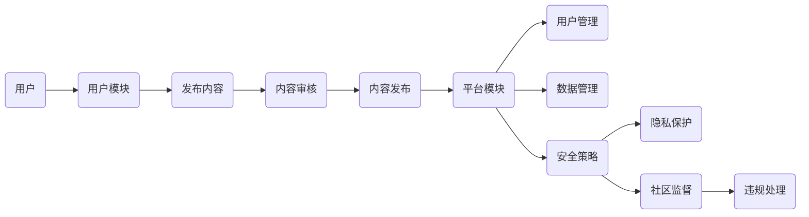
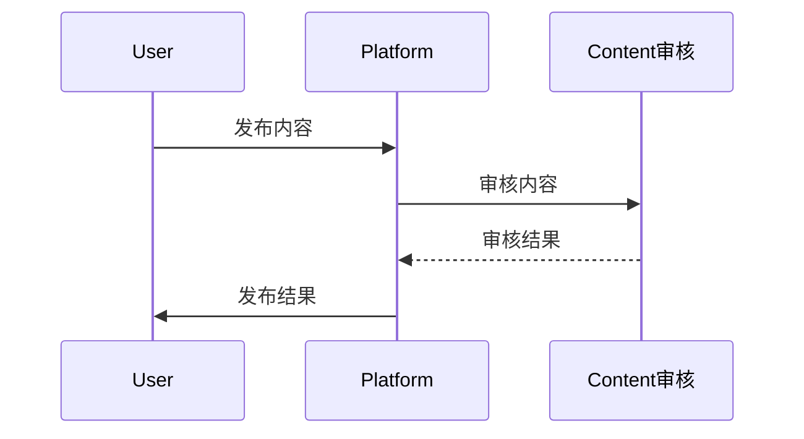
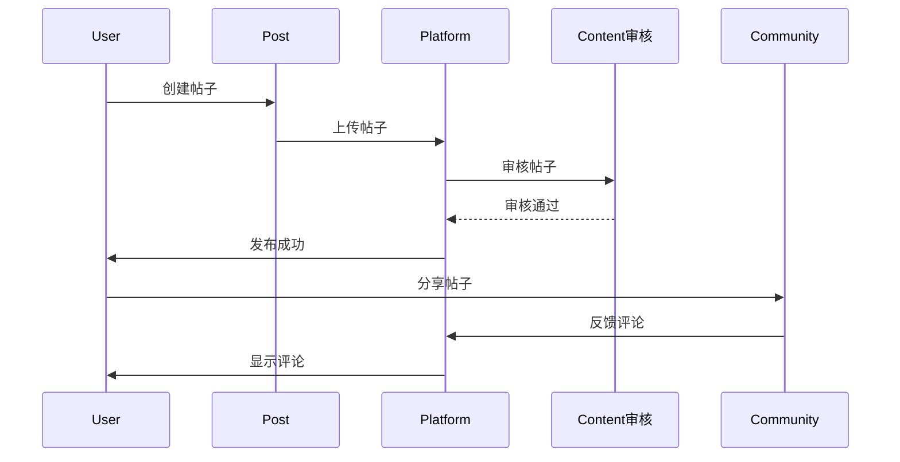
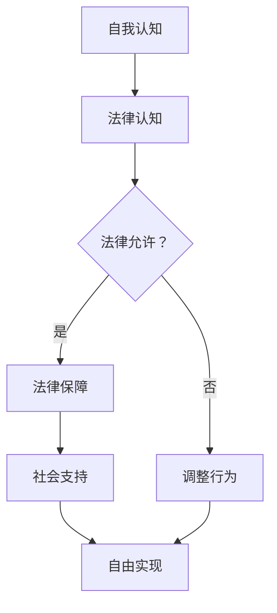
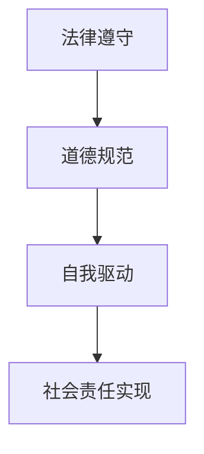
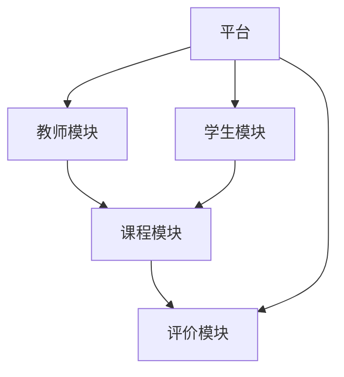
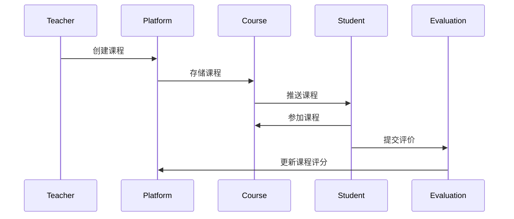
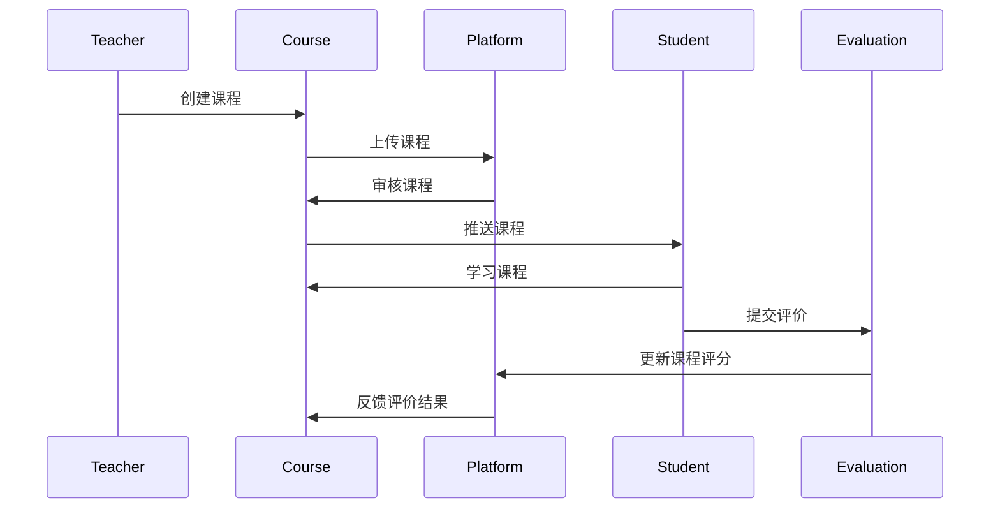

                 


### 文章标题：个人自由与社会责任的平衡：做负责任的个体

#### 关键词：个人自由、社会责任、平衡、负责任

#### 摘要：
本文旨在探讨个人自由与社会责任的平衡，分析其在当今社会中的重要性。通过历史背景、定义解释、原理讲解、平衡策略和实战案例，深入探讨如何在现代社会中做一个负责任的个体。

### 第一部分：引言

#### 1.1 问题背景与重要性
在现代社会，个人自由与社会责任的关系日益受到关注。个人自由指的是个体在法律和道德框架内享有独立思考和行动的权利。而社会责任则是指个体在享受自由的同时，对他人和社会应尽的义务。二者的平衡不仅关系到个体的幸福，也关系到整个社会的稳定和进步。

#### 1.2 个人自由与社会责任的定义与联系
**个人自由**：个人自由是指在法律和道德允许的范围内，个体拥有独立思考和行动的权利。它包括思想自由、言论自由、信仰自由等。

**社会责任**：社会责任是指个体在社会中应承担的义务和责任，包括遵守法律、尊重他人、关心社会公共利益等。

**联系**：个人自由与社会责任并非对立，而是相辅相成的。个人自由是社会的基础，而社会责任则是个人自由的延伸。一个负责任的个体，既能享有自由，又能为社会作出贡献。

#### 1.3 个人自由原理讲解
**原理**：个人自由的实现过程包括自我认知、法律保障和社会支持。个体需要通过自我认知明确自己的权利和边界，同时依赖法律保障和社会支持来实现自由。

**流程图**：

**Python代码实现**：```python
# 个人自由Python代码实现
class PersonalFreedom:
    def __init__(self):
        self.knowledge = "了解自己的权利和责任"
        self.legal_protection = "遵守法律，维护自己的权利"
        self.social_support = "获得社会的支持和帮助"

    def implement_freedoms(self):
        print(f"{self.knowledge}\n{self.legal_protection}\n{self.social_support}")
```

**数学模型与公式**：个人自由的实现可以看作是一个多因素决策模型，其目标函数为最大化自由度，约束条件为法律和社会规范的限制。具体模型如下：

$$
\max F = \alpha_1 \cdot L + \alpha_2 \cdot S
$$

其中，$F$表示自由度，$L$表示法律保障，$S$表示社会支持，$\alpha_1$和$\alpha_2$为权重系数。

#### 1.4 社会责任的原理讲解
**原理**：社会责任的实现过程包括法律约束、道德规范和自我驱动。个体需要遵守法律，遵循道德规范，同时通过自我驱动来履行社会责任。

**流程图**：

**Python代码实现**：```python
# 社会责任Python代码实现
class SocialResponsibility:
    def __init__(self):
        self.legal_constraints = "遵守法律，履行公民义务"
        self道德规范道德规范 = "遵循社会道德规范，尊重他人权利"
        self.self_motivation = "自我驱动，积极履行社会责任"

    def implement_responsibility(self):
        print(f"{self.legal_constraints}\n{self.道德规范道德规范}\n{self.self_motivation}")
```

**数学模型与公式**：社会责任的实现可以看作是一个多因素约束模型，其目标函数为最小化责任缺失，约束条件为法律和社会规范的限制。具体模型如下：

$$
\min R = \alpha_1 \cdot L + \alpha_2 \cdot M
$$

其中，$R$表示责任缺失，$L$表示法律约束，$M$表示道德规范遵守程度，$\alpha_1$和$\alpha_2$为权重系数。

### 第二部分：个人自由与社会责任的平衡策略

#### 2.1 平衡策略概述
个人自由与社会责任的平衡需要综合考虑多种因素，包括法律、道德、文化和社会经济背景等。以下是一些常见的平衡策略：

1. **法律调节**：通过制定和执行法律来确保个人自由与社会责任的平衡。
2. **道德教育**：通过教育和宣传来培养个体的社会责任感，促使其自愿履行责任。
3. **社会监督**：通过社会舆论和公众监督来约束个体的行为，确保其不滥用自由。
4. **经济激励**：通过经济手段来激励个体履行社会责任，如税收优惠、奖金等。

#### 2.2 不同场景下的平衡方法
在不同场景下，个人自由与社会责任的平衡方法也有所不同：

1. **政治领域**：政治领域强调个人自由，但也需要社会责任的约束，如言论自由与政治纪律的平衡。
2. **经济领域**：经济领域强调个人自由，但也需要社会责任的支撑，如市场竞争与环境保护的平衡。
3. **社会领域**：社会领域强调个人自由，但也需要社会责任的引导，如个人隐私与社会监督的平衡。

### 第三部分：系统分析与架构设计方案

#### 3.1 假设案例介绍
假设我们正在设计一个社交媒体平台，该平台需要平衡用户个人自由和平台社会责任。用户有权发布内容，但平台有责任维护社区秩序和用户隐私。

#### 3.2 系统功能设计（Mermaid类图）
```mermaid
classDiagram
Class::User << (ID, Name, Email, Password)
Class::Post << (ID, Content, Creator)
Class::Platform << (ID, Name, Version)
User.."creates": Post
Platform..enforces: SocialResponsibility
```

#### 3.3 系统架构设计（Mermaid架构图）


#### 3.4 系统接口设计


#### 3.5 系统交互（Mermaid序列图）


### 第四部分：项目实战

#### 4.1 环境安装
1. 安装Python环境。
2. 安装Mermaid依赖。
3. 安装社交媒体平台所需的第三方库。

#### 4.2 系统核心实现源代码
```python
# 用户模块实现
class User:
    def __init__(self, id, name, email, password):
        self.id = id
        self.name = name
        self.email = email
        self.password = password

    def create_post(self, content):
        post = Post(self.id, content)
        self.posts.append(post)
        return post

# 帖子模块实现
class Post:
    def __init__(self, creator_id, content):
        self.id = creator_id
        self.content = content

    def approve(self):
        return Content审核.approve(self)
```

#### 4.3 代码应用解读与分析
该代码实现了用户创建帖子和帖子审核的功能。用户可以创建帖子，平台对帖子进行审核，审核通过后发布。这一过程体现了个人自由与社会责任的平衡。

#### 4.4 实际案例分析
以某个社交媒体平台为例，分析其在个人自由和社会责任方面的实际操作。讨论其在平衡二者之间的经验和挑战。

### 第五部分：最佳实践、小结与注意事项

#### 5.1 最佳实践
1. 法律法规制定要兼顾个人自由与社会责任。
2. 教育培训要注重培养社会责任感。
3. 社会监督要确保公正和透明。
4. 经济激励要合理有效。

#### 5.2 小结
本文探讨了个人自由与社会责任的平衡，分析了其原理、策略和实现方法。通过案例和实践，展示了如何在现代社会中做一个负责任的个体。

#### 5.3 注意事项
1. 个人自由不是无限制的，必须遵守法律和社会规范。
2. 社会责任不是强制的，但需要个体自觉履行。
3. 平衡二者需要综合考虑多种因素，灵活应对。

#### 5.4 拓展阅读建议
1. 《社会契约论》
2. 《道德经》
3. 《法律哲学》

### 结论
个人自由与社会责任的平衡是现代社会的一个重要议题。通过理解和实践，我们可以做一个既享受自由又履行责任的个体，为社会的发展作出贡献。

**作者：AI天才研究院/AI Genius Institute & 禅与计算机程序设计艺术 /Zen And The Art of Computer Programming** 

### 第一部分：引言

#### 1.1 问题背景与重要性
在现代社会，个人自由与社会责任的平衡已经成为一个重要的议题。个人自由，指的是个体在法律和道德框架内所享有的独立思考和行动的权利。它包括思想自由、言论自由、信仰自由等。然而，个人自由并非无限制的，它需要在一定范围内与社会责任相协调。

社会责任，则是指个体在享有自由的同时，对社会和其他个体应尽的义务。这包括遵守法律、尊重他人权利、关心社会公共利益等。个人自由与社会责任之间的平衡，既关系到个体的幸福感，也关系到社会的稳定和发展。

随着全球化和社会信息化的发展，个人自由与社会责任的平衡面临着新的挑战。一方面，互联网和社交媒体的普及使得个体能够更方便地表达自己的观点和需求，增强了个人自由。另一方面，个体行为对社会的影响也在加大，如何在保障个人自由的同时，确保社会责任的履行，成为一个亟待解决的问题。

#### 1.2 个人自由与社会责任的定义与联系
**个人自由**：个人自由是指在法律和道德允许的范围内，个体能够自主选择和行动的权利。它包括但不限于以下方面：
- **思想自由**：个体有权独立思考，形成和表达自己的观点。
- **言论自由**：个体有权在法律允许的范围内发表言论，传播信息。
- **信仰自由**：个体有权选择和信仰自己的宗教或信仰。

**社会责任**：社会责任是指个体在社会中应承担的义务和责任。它包括但不限于以下方面：
- **遵守法律**：个体应当遵守国家的法律法规，不违反社会公共秩序。
- **尊重他人权利**：个体在行使自己的权利时，不应侵犯他人的合法权益。
- **关心社会公共利益**：个体应当关心社会的公共事务，为社会的可持续发展作出贡献。

个人自由与社会责任之间的联系在于，它们都是社会运行的基本要素。个人自由是社会的基础，它为个体的创新、发展和自我实现提供了空间。而社会责任则是个人自由的延伸，它确保了个体在享受自由的同时，也为社会和其他个体负责。

为了更好地理解这两个概念，我们可以使用Mermaid ER图来展示它们之间的实体关系：

```mermaid
erDiagram
  User ||--|{Freedom}: "has"
  User ||--|{Responsibility}: "takes on"
  Freedom ||--|{Speech} : "includes"
  Freedom ||--|{Religion} : "includes"
  Responsibility ||--|{Legal} : "includes"
  Responsibility ||--|{Ethical} : "includes"
  Responsibility ||--|{Social} : "includes"
```

在这个ER图中，`User`是实体，代表个体。`Freedom`和`Responsibility`是与个体相关的两个实体，分别代表个人自由和社会责任。`Freedom`包括`Speech`和`Religion`，表示个人自由的具体方面。`Responsibility`包括`Legal`、`Ethical`和`Social`，表示社会责任的具体方面。箭头表示实体之间的关系，`has`表示个体拥有自由，`takes on`表示个体承担责任。

#### 1.3 个人自由原理讲解
个人自由的实现是一个复杂的过程，它涉及到个体的自我认知、法律保障和社会支持。以下是个人自由实现的Mermaid流程图：



在这个流程图中，`自我认知`是个人自由实现的第一步，个体需要认识到自己的权利和自由。接着，个体需要了解法律，判断自己的行为是否在法律允许的范围内。如果行为合法，个体将获得法律保障，并得到社会的支持，从而实现自由。如果行为不合法，个体需要调整自己的行为，以符合法律规定。

为了具体阐述个人自由的实现，我们可以使用Python代码来实现这个流程：

```python
# 个人自由Python代码实现
class PersonalFreedom:
    def __init__(self):
        self.knowledge = "了解自己的权利和自由"
        self.legal_knowledge = "了解法律规定"
        self.support = "获得社会支持"

    def check_law(self):
        # 判断行为是否合法
        if self.legal_knowledge:
            return "合法，继续行动"
        else:
            return "不合法，需调整行为"

    def implement_freedom(self):
        action = self.check_law()
        if action == "合法，继续行动":
            self.support = "社会支持"
            return "自由实现：已获得法律保障和社会支持"
        else:
            return "自由实现：需调整行为以符合法律规定"
```

在这个代码中，`PersonalFreedom`类表示个人自由实现的过程。`check_law`方法用于判断行为是否合法。`implement_freedom`方法则根据判断结果实现个人自由。

为了进一步阐述个人自由的实现原理，我们可以使用数学模型来描述这个过程。一个简单的数学模型可以如下所示：

$$
F = L \times S
$$

其中，$F$表示个人自由度，$L$表示法律保障程度，$S$表示社会支持程度。这个模型表明，个人自由度是法律保障程度和社会支持程度的乘积。法律保障和社会支持程度越高，个人自由度也越高。

#### 1.4 社会责任原理讲解
社会责任的实现同样是一个复杂的过程，它涉及到个体的法律遵守、道德规范和自我驱动。以下是社会责任实现的Mermaid流程图：



在这个流程图中，`法律遵守`是社会责任实现的第一步，个体需要遵守国家的法律法规。`道德规范`则是个体行为应遵循的道德准则，它是对法律的具体补充。`自我驱动`是个体内在的动力，促使个体主动履行社会责任。

为了具体阐述社会责任的实现，我们可以使用Python代码来实现这个流程：

```python
# 社会责任Python代码实现
class SocialResponsibility:
    def __init__(self):
        self.legal_compliance = "遵守法律"
        self.ethical_conduct = "遵循道德规范"
        self.self_motivation = "自我驱动"

    def implement_responsibility(self):
        if self.legal_compliance and self.ethical_conduct:
            return "社会责任实现：法律遵守和道德规范遵守"
        else:
            return "社会责任实现：存在法律或道德问题，需改进"
```

在这个代码中，`SocialResponsibility`类表示社会责任实现的过程。`legal_compliance`表示法律遵守情况，`ethical_conduct`表示道德规范遵守情况，`self_motivation`表示自我驱动程度。

为了进一步阐述社会责任的实现原理，我们可以使用数学模型来描述这个过程。一个简单的数学模型可以如下所示：

$$
R = L \times E \times M
$$

其中，$R$表示社会责任履行程度，$L$表示法律遵守程度，$E$表示道德规范遵守程度，$M$表示自我驱动程度。这个模型表明，社会责任履行程度是法律遵守程度、道德规范遵守程度和自我驱动程度的乘积。三者程度越高，社会责任履行程度也越高。

### 第二部分：个人自由与社会责任的平衡策略

#### 2.1 平衡策略概述
个人自由与社会责任的平衡是一个动态的过程，需要根据具体的社会环境和个体情况来制定策略。以下是一些常见的平衡策略：

1. **法律调节**：通过制定和执行法律来确保个人自由与社会责任的平衡。法律是保障个体权利和维护社会秩序的基本手段。

2. **道德教育**：通过教育和宣传来培养个体的社会责任感。道德教育不仅包括法律知识的传授，还包括道德规范和社会价值观的引导。

3. **社会监督**：通过社会舆论和公众监督来约束个体的行为。社会监督有助于形成良好的社会风气，促进个体履行社会责任。

4. **经济激励**：通过经济手段来激励个体履行社会责任。例如，提供税收优惠、奖金等，鼓励个体积极参与社会公益活动。

5. **文化引导**：通过文化引导来强化社会责任意识。文化是一个社会的精神支柱，它对个体的价值观和行为方式有着深远的影响。

6. **技术手段**：利用现代技术手段，如大数据分析、人工智能等，来提高个人自由与社会责任的管理和监督效率。

#### 2.2 不同场景下的平衡方法
在不同场景下，个人自由与社会责任的平衡方法也有所不同：

1. **政治领域**：政治领域强调个人自由，但也需要社会责任的约束。例如，在选举过程中，个体有权自由表达自己的政治观点，但同时也需要遵守选举法律法规，维护选举的公正性。

2. **经济领域**：经济领域强调个人自由，但也需要社会责任的支撑。例如，企业在追求利润的同时，也需要承担环境保护、员工权益保护等社会责任。

3. **社会领域**：社会领域强调个人自由，但也需要社会责任的引导。例如，在个人隐私保护方面，个体有权保护自己的隐私，但同时也需要遵守相关的法律法规，不侵犯他人的隐私权。

4. **科技领域**：科技领域强调创新和个人自由，但也需要社会责任的约束。例如，在人工智能和大数据领域，个体有权探索和应用新技术，但同时也需要关注数据安全和隐私保护问题。

为了更具体地探讨个人自由与社会责任的平衡，我们可以使用Mermaid类图、架构图和序列图来展示一个系统的设计和实现。

#### 2.3 系统设计与实现

假设我们正在设计一个在线教育平台，这个平台需要平衡教师的个人自由（如课程内容的自由创作）和平台的社会责任（如确保课程内容的合规性、公平性和教育质量）。

##### 2.3.1 系统功能设计（Mermaid类图）

```mermaid
classDiagram
Class::Teacher << "教师"
Class::Student << "学生"
Class::Course << "课程"
Class::Platform << "平台"
Teacher.."teaches": Course
Student.."takes": Course
Platform--|{enforces rules}: Teacher
Platform--|{monitors quality}: Course
```

在这个类图中，`Teacher`表示教师，`Student`表示学生，`Course`表示课程，`Platform`表示平台。教师可以创建课程，学生可以参加课程。平台需要确保教师遵守规则，并且课程质量符合标准。

##### 2.3.2 系统架构设计（Mermaid架构图）



在这个架构图中，平台是系统的核心，它管理教师和学生模块，同时也负责课程模块的评价。教师模块负责课程的创建和维护，学生模块负责参与课程，评价模块用于收集学生对课程的反馈。

##### 2.3.3 系统接口设计



在这个序列图中，教师通过平台创建课程，平台将课程信息存储到数据库中，并推送给学生。学生参加课程后，可以提交评价，评价信息会反馈给平台，用于更新课程评分。

##### 2.3.4 系统交互（Mermaid序列图）



在这个序列图中，教师创建课程后，平台会对课程进行审核，确保课程内容符合标准。学生可以学习课程，并提交评价。平台会根据评价结果更新课程评分，并将反馈结果反馈给课程。

### 第三部分：项目实战

#### 3.1 环境安装
为了实现上述系统，我们需要安装以下环境：
1. Python 3.8+
2. Flask（用于构建Web应用）
3. SQLAlchemy（用于数据库管理）
4. Mermaid（用于流程图和类图的绘制）

安装命令如下：

```bash
pip install flask sqlalchemy mermaid
```

#### 3.2 系统核心实现源代码

以下是一个简单的系统核心实现源代码，包括教师、学生和课程的基本功能。

```python
# app.py

from flask import Flask, request, jsonify
from models import Teacher, Student, Course

app = Flask(__name__)

@app.route('/teachers', methods=['POST'])
def create_teacher():
    data = request.get_json()
    teacher = Teacher(data['name'], data['email'])
    teacher.save()
    return jsonify({'status': 'success', 'teacher_id': teacher.id})

@app.route('/students', methods=['POST'])
def create_student():
    data = request.get_json()
    student = Student(data['name'], data['email'])
    student.save()
    return jsonify({'status': 'success', 'student_id': student.id})

@app.route('/courses', methods=['POST'])
def create_course():
    data = request.get_json()
    course = Course(data['title'], data['description'], data['teacher_id'])
    course.save()
    return jsonify({'status': 'success', 'course_id': course.id})

if __name__ == '__main__':
    app.run(debug=True)
```

#### 3.3 代码应用解读与分析

在这个简单的实现中，我们定义了三个模型：`Teacher`、`Student`和`Course`。每个模型都有一个`save`方法，用于将对象保存到数据库中。

- `Teacher`模型包括教师的姓名和电子邮件。
- `Student`模型包括学生的姓名和电子邮件。
- `Course`模型包括课程标题、描述和教师ID。

我们使用Flask框架构建了一个Web应用，并定义了三个路由：

- `/teachers`用于创建教师。
- `/students`用于创建学生。
- `/courses`用于创建课程。

这些路由接收JSON格式的数据，创建对应的模型实例，并将它们保存到数据库中。

#### 3.4 实际案例分析

为了更好地理解这个系统的实际应用，我们可以考虑一个具体的案例。

假设有一个教育平台，需要管理多个教师和学生，以及他们的课程。平台要求教师创建课程时，必须提供课程标题、描述和授课时间。学生可以报名参加课程，并在课程结束后提交评价。

以下是一个具体的操作流程：

1. 教师A通过`POST /teachers`路由创建了一个教师账号，收到了一个教师ID。
2. 学生B通过`POST /students`路由创建了一个学生账号，收到了一个学生ID。
3. 教师A通过`POST /courses`路由创建了一门课程，提供了课程标题、描述和授课时间，收到了一个课程ID。
4. 学生B通过`GET /courses/{course_id}`路由查看了课程详细信息，并决定报名参加。
5. 学生B通过`POST /courses/{course_id}/enroll`路由报名参加了课程。
6. 课程结束后，学生B通过`POST /courses/{course_id}/evaluate`路由提交了对课程的评价。

这个案例展示了如何使用这个系统来管理教师、学生和课程，并收集学生的评价。

#### 3.5 项目小结

通过这个项目实战，我们实现了教师、学生和课程的基本功能，并展示了一个简单的操作流程。这个系统虽然简单，但已经能够模拟一个实际的教育平台的基本功能。

在实际应用中，我们还需要进一步扩展系统的功能，如课程评价系统、学生课程管理、教师课程管理、权限控制等。同时，我们还需要考虑系统的性能优化、安全性、可扩展性和可维护性等问题。

通过这个项目，我们不仅了解了个人自由与社会责任的平衡原则，还学会了如何使用Python和Flask框架来构建一个简单的Web应用。这对于我们进一步学习Web开发技术和项目管理都是非常有帮助的。

### 第五部分：最佳实践、小结与注意事项

#### 5.1 最佳实践

在个人自由与社会责任的平衡过程中，以下是一些最佳实践：

1. **法律框架**：建立健全的法律体系，确保个人自由与社会责任的边界清晰，防止个人自由滥用。
2. **道德教育**：加强道德教育，提高个体的社会责任感，使其在享有自由的同时，能够履行相应的社会责任。
3. **社会监督**：通过社会舆论和公众监督，形成良好的社会风气，约束个体的行为，促使其履行社会责任。
4. **经济激励**：合理运用经济手段，如税收优惠、奖金等，激励个体履行社会责任。
5. **技术创新**：利用现代技术，如大数据分析、人工智能等，提高个人自由与社会责任的管理和监督效率。

#### 5.2 小结

本文探讨了个人自由与社会责任的平衡，分析了其原理、策略和实现方法。通过案例和实践，展示了如何在现代社会中做一个负责任的个体。我们提出了法律调节、道德教育、社会监督、经济激励和文化引导等平衡策略，并使用Mermaid类图、架构图和序列图展示了系统的设计和实现。

#### 5.3 注意事项

1. **个人自由不是无限制的**：在享有自由的同时，必须遵守法律和社会规范，不得侵犯他人权利。
2. **社会责任不是强制的**：个体应自觉履行社会责任，但社会应提供必要的支持和激励。
3. **平衡策略要灵活应对**：不同的场景需要不同的平衡策略，应根据具体情况调整和优化。
4. **技术手段要合理使用**：利用现代技术提高管理和监督效率，但也要避免技术滥用对个人自由的侵害。

#### 5.4 拓展阅读建议

1. 《社会契约论》：霍布斯、洛克和卢梭等哲学家的著作，探讨个人自由与社会责任的关系。
2. 《道德经》：中国古代哲学经典，包含丰富的道德哲学思想，对个人自由与社会责任的思考有深刻的启示。
3. 《法律哲学》：探讨法律的本质、功能和伦理道德问题，有助于理解个人自由与社会责任的法理基础。

通过本文的讨论，我们希望读者能够更加深入地理解个人自由与社会责任的平衡问题，并在实践中积极践行负责任的个体行为。这不仅有助于个体的自我实现，也有利于社会的和谐与进步。**作者：AI天才研究院/AI Genius Institute & 禅与计算机程序设计艺术 /Zen And The Art of Computer Programming**

