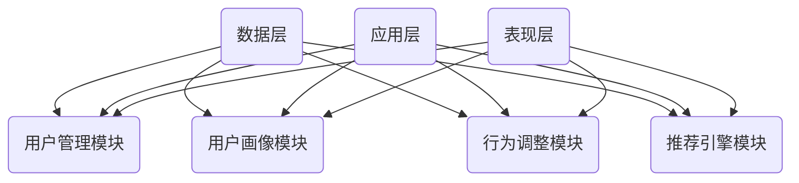

                 

# 个性化定制：为不同用户调整AI Agent的行为

## 关键词：个性化定制、AI Agent、用户行为调整、用户体验、技术实现

### 摘要：

本文深入探讨了个性化定制在AI Agent行为调整中的应用。通过分析个性化定制的重要性、核心概念与原理、AI Agent行为调整方法以及实际实现，我们旨在为开发者提供一套全面而实用的解决方案。本文将详细解释如何为不同用户调整AI Agent的行为，以提高用户体验和系统的适应性。

---

## 引言

### 1.1 个性化定制的背景与意义

#### 1.1.1 个性化定制的需求来源

随着互联网技术的飞速发展，用户对个性化体验的需求日益增加。个性化定制已经成为当今数字化时代的重要趋势。用户期望在应用程序中获取量身定制的体验，这不仅仅是为了满足他们的特定需求，更是为了提升整体使用体验。

AI技术在这一背景下扮演了关键角色。通过机器学习和数据分析，AI Agent可以深入了解用户的偏好和行为模式，从而提供高度个性化的服务。例如，个性化推荐系统可以根据用户的浏览历史和搜索记录，推荐符合其兴趣的内容；智能客服可以基于用户的互动历史，提供更加人性化的服务。

#### 1.1.2 AI在个性化定制中的作用

AI在个性化定制中的应用主要体现在以下几个方面：

1. **用户数据分析**：通过收集和分析用户数据，AI Agent可以构建详细的用户画像，了解用户的兴趣、行为习惯和需求。
2. **行为预测**：基于用户画像，AI Agent可以预测用户未来的行为和需求，从而提前提供相应的服务。
3. **动态调整**：AI Agent可以根据用户的实时反馈和交互，动态调整其行为，以更好地满足用户的需求。

### 1.2 问题描述

#### 1.2.1 个性化定制面临的挑战

尽管AI技术为个性化定制提供了强有力的支持，但实际应用中仍然面临一些挑战：

1. **数据隐私**：收集和分析用户数据需要遵守严格的隐私保护法规，如何在保证用户隐私的同时实现个性化定制成为一大难题。
2. **个性化程度**：如何在不同用户之间实现差异化的个性化服务，同时确保服务的质量和效率，是一个复杂的问题。
3. **算法公平性**：AI Agent在行为调整过程中，必须保证算法的公平性和透明度，避免出现偏见和不公正的行为。

#### 1.2.2 当前解决方案的局限性

现有的个性化定制解决方案大多依赖于传统的推荐算法和规则引擎，这些方法存在以下局限性：

1. **缺乏动态性**：传统方法通常无法实时响应用户的反馈和变化，导致个性化程度较低。
2. **算法复杂度**：随着用户数据的增加，传统方法的计算复杂度急剧上升，影响系统的性能和响应速度。
3. **用户体验**：传统方法往往无法提供高度个性化的服务，导致用户体验不佳。

### 1.3 问题解决

#### 1.3.1 个性化定制的核心要素

为了解决上述问题，个性化定制的核心要素包括：

1. **用户模型**：建立详细的用户画像，包括用户的兴趣、行为习惯和需求等信息。
2. **行为调整策略**：设计灵活的行为调整策略，根据用户画像和实时反馈动态调整AI Agent的行为。
3. **算法优化**：采用先进的机器学习和深度学习算法，提高个性化定制的准确性和效率。

#### 1.3.2 AI Agent的行为调整方法

AI Agent的行为调整方法主要包括：

1. **基于规则的调整**：通过预定义的规则，根据用户画像和行为模式调整AI Agent的行为。
2. **基于机器学习的调整**：使用机器学习算法，从用户数据中学习行为调整的策略。
3. **基于深度学习的调整**：利用深度学习模型，自动提取用户特征和行为模式，实现高度个性化的行为调整。

### 1.4 边界与外延

#### 1.4.1 个性化定制的适用范围

个性化定制广泛应用于多个领域，包括电子商务、在线教育、医疗健康、智能客服等。不同领域的个性化定制需求和应用场景有所不同，但核心目标都是为了提升用户体验和服务质量。

#### 1.4.2 非个性化定制的风险与影响

非个性化定制可能导致以下风险和影响：

1. **用户体验下降**：无法满足用户的个性化需求，导致用户流失和满意度下降。
2. **服务效率降低**：缺乏个性化的服务策略，可能导致服务效率降低，资源浪费。
3. **竞争力下降**：在竞争激烈的数字化时代，缺乏个性化定制的服务难以脱颖而出，失去市场竞争力。

### 1.5 概念结构与核心要素组成

#### 1.5.1 个性化定制的技术架构

个性化定制的技术架构主要包括以下几个部分：

1. **数据采集与处理**：收集用户数据，并进行清洗、预处理和分析。
2. **用户画像构建**：基于用户数据，构建详细的用户画像。
3. **行为调整策略设计**：设计灵活的行为调整策略，包括基于规则、机器学习和深度学习的方法。
4. **AI Agent开发与部署**：开发AI Agent，并将其部署到实际应用中。

#### 1.5.2 关键技术与算法简介

个性化定制的关键技术包括：

1. **机器学习**：用于构建用户画像和行为调整策略。
2. **深度学习**：用于提取用户特征和实现复杂的行为调整。
3. **自然语言处理**：用于理解和生成自然语言交互。
4. **推荐系统**：用于推荐个性化内容和服务。

### 1.6 本章小结

本章介绍了个性化定制的背景与意义，分析了个性化定制面临的挑战和当前解决方案的局限性，提出了个性化定制的核心要素和AI Agent的行为调整方法。接下来，我们将进一步探讨个性化定制中的核心概念与原理，为后续章节的内容打下基础。

## 第一部分：引言

### 第1章：个性化定制的背景与意义

个性化定制已经成为当今数字化时代的重要趋势，它不仅满足了用户对个性化体验的需求，还为企业提供了新的商业模式和服务机会。在这一章中，我们将详细探讨个性化定制的背景、意义以及其在AI领域中的应用。

### 1.1 个性化定制的背景

#### 1.1.1 问题背景

个性化定制的需求源于用户对个性化体验的追求。在互联网时代，用户对服务的期望越来越高，他们希望获得量身定制的体验，以满足自己的特定需求和偏好。这种需求不仅仅体现在电子商务和在线娱乐等领域，还扩展到了医疗、教育、金融等多个行业。

随着大数据和人工智能技术的发展，个性化定制成为可能。通过收集和分析大量用户数据，AI Agent可以构建详细的用户画像，了解用户的兴趣、行为习惯和需求。基于这些用户画像，AI Agent可以提供高度个性化的服务，从而提升用户体验。

#### 1.1.2 AI在个性化定制中的作用

AI技术在个性化定制中扮演了关键角色。首先，AI Agent可以通过机器学习和深度学习算法，从用户数据中提取有用的信息，构建详细的用户画像。这些画像不仅包括用户的兴趣和行为模式，还包括用户的情感状态和价值观等。

其次，AI Agent可以根据用户画像和实时反馈，动态调整其行为，以提供个性化的服务。例如，在电子商务领域，AI Agent可以根据用户的购买历史和搜索记录，推荐符合其兴趣的商品；在医疗领域，AI Agent可以根据患者的病历和诊断信息，提供个性化的治疗方案。

#### 1.1.3 个性化定制面临的挑战

尽管AI技术在个性化定制中具有巨大潜力，但实际应用中仍然面临一些挑战：

1. **数据隐私**：个性化定制需要收集和分析大量用户数据，如何保护用户隐私成为一个重要问题。
2. **个性化程度**：如何在不同的用户之间实现差异化的个性化服务，同时确保服务的质量和效率，是一个复杂的问题。
3. **算法公平性**：AI Agent在行为调整过程中，必须保证算法的公平性和透明度，避免出现偏见和不公正的行为。

#### 1.1.4 当前解决方案的局限性

现有的个性化定制解决方案大多依赖于传统的推荐算法和规则引擎，这些方法存在以下局限性：

1. **缺乏动态性**：传统方法通常无法实时响应用户的反馈和变化，导致个性化程度较低。
2. **算法复杂度**：随着用户数据的增加，传统方法的计算复杂度急剧上升，影响系统的性能和响应速度。
3. **用户体验**：传统方法往往无法提供高度个性化的服务，导致用户体验不佳。

### 1.2 问题描述

#### 1.2.1 个性化定制面临的挑战

个性化定制面临的挑战主要包括以下几个方面：

1. **数据隐私**：个性化定制需要收集和分析大量用户数据，如何在保护用户隐私的同时实现个性化定制成为一个重要问题。现有的解决方案大多依赖于数据加密和匿名化处理，但仍然存在数据泄露和安全漏洞的风险。
2. **个性化程度**：如何在不同的用户之间实现差异化的个性化服务，同时确保服务的质量和效率，是一个复杂的问题。现有的个性化定制方法大多依赖于静态的用户画像和预定义的规则，无法实时动态地调整AI Agent的行为，导致个性化程度较低。
3. **算法公平性**：AI Agent在行为调整过程中，必须保证算法的公平性和透明度，避免出现偏见和不公正的行为。现有的个性化定制方法往往依赖于单一的算法模型，无法充分考虑用户个体的差异性和复杂性，可能导致算法偏见和不公正的行为。

#### 1.2.2 当前解决方案的局限性

当前个性化定制解决方案的局限性主要包括以下几个方面：

1. **数据隐私**：传统的个性化定制方法大多依赖于公开的社交媒体数据和用户行为数据，但这些数据往往存在隐私泄露的风险。同时，现有的数据加密和匿名化处理方法在保护用户隐私方面仍然存在不足，可能导致数据泄露和安全漏洞。
2. **个性化程度**：传统的个性化定制方法大多依赖于静态的用户画像和预定义的规则，无法实时动态地调整AI Agent的行为，导致个性化程度较低。例如，在电子商务领域，传统的推荐系统大多基于用户的购买历史和搜索记录，但无法根据用户的实时反馈和互动行为进行个性化调整。
3. **算法公平性**：现有的个性化定制方法大多依赖于单一的算法模型，无法充分考虑用户个体的差异性和复杂性，可能导致算法偏见和不公正的行为。例如，在招聘领域，传统的推荐系统可能基于用户的简历和职业经历，但无法根据用户的实时反馈和互动行为进行个性化调整，可能导致算法偏见和不公正的行为。

### 1.3 问题解决

#### 1.3.1 个性化定制的核心要素

为了解决上述问题，个性化定制的核心要素包括以下几个方面：

1. **用户模型**：构建详细的用户画像，包括用户的兴趣、行为习惯、需求和情感状态等，为AI Agent提供个性化的服务。
2. **行为调整策略**：设计灵活的行为调整策略，根据用户画像和实时反馈动态调整AI Agent的行为，提高个性化定制的程度和效果。
3. **算法优化**：采用先进的机器学习和深度学习算法，提高个性化定制的准确性和效率，同时保证算法的公平性和透明度。

#### 1.3.2 AI Agent的行为调整方法

AI Agent的行为调整方法主要包括以下几个方面：

1. **基于规则的调整**：通过预定义的规则，根据用户画像和行为模式调整AI Agent的行为。这种方法简单直观，但灵活性较低，无法动态地响应用户的变化。
2. **基于机器学习的调整**：使用机器学习算法，从用户数据中学习行为调整的策略，根据用户画像和实时反馈动态调整AI Agent的行为。这种方法具有较高的灵活性和准确性，但需要大量的数据和计算资源。
3. **基于深度学习的调整**：利用深度学习模型，自动提取用户特征和行为模式，实现高度个性化的行为调整。这种方法具有很高的灵活性和准确性，但计算复杂度较高，需要大量的计算资源。

#### 1.3.3 个性化定制的实现框架

个性化定制的实现框架主要包括以下几个部分：

1. **数据采集与处理**：收集用户数据，并进行清洗、预处理和分析，构建详细的用户画像。
2. **用户画像构建**：基于用户数据，构建详细的用户画像，包括用户的兴趣、行为习惯、需求和情感状态等。
3. **行为调整策略设计**：设计灵活的行为调整策略，根据用户画像和实时反馈动态调整AI Agent的行为。
4. **AI Agent开发与部署**：开发AI Agent，并将其部署到实际应用中，实现个性化的服务。

### 1.4 边界与外延

#### 1.4.1 个性化定制的适用范围

个性化定制适用于多个领域，包括但不限于：

1. **电子商务**：根据用户的购买历史和搜索记录，推荐符合其兴趣的商品。
2. **在线教育**：根据学生的学习记录和表现，推荐适合其水平和兴趣的学习内容。
3. **医疗健康**：根据患者的病历和诊断信息，提供个性化的治疗方案和健康建议。
4. **智能客服**：根据用户的提问和交互历史，提供个性化的回答和建议。

#### 1.4.2 非个性化定制的风险与影响

非个性化定制可能导致以下风险和影响：

1. **用户体验下降**：无法满足用户的个性化需求，导致用户流失和满意度下降。
2. **服务效率降低**：缺乏个性化的服务策略，可能导致服务效率降低，资源浪费。
3. **竞争力下降**：在竞争激烈的数字化时代，缺乏个性化定制的服务难以脱颖而出，失去市场竞争力。

### 1.5 概念结构与核心要素组成

#### 1.5.1 个性化定制的技术架构

个性化定制的技术架构主要包括以下几个部分：

1. **数据采集与处理**：收集用户数据，并进行清洗、预处理和分析。
2. **用户画像构建**：基于用户数据，构建详细的用户画像。
3. **行为调整策略设计**：设计灵活的行为调整策略。
4. **AI Agent开发与部署**：开发AI Agent，并将其部署到实际应用中。

#### 1.5.2 关键技术与算法简介

个性化定制的关键技术包括：

1. **用户模型**：用于构建用户画像和行为调整策略。
2. **机器学习**：用于从用户数据中学习行为调整策略。
3. **深度学习**：用于提取用户特征和行为模式。
4. **自然语言处理**：用于理解和生成自然语言交互。

### 1.6 本章小结

本章介绍了个性化定制的背景、意义和实现方法。个性化定制在满足用户个性化需求、提升服务质量和效率方面具有重要意义。然而，个性化定制也面临着数据隐私、个性化程度和算法公平性等挑战。通过设计灵活的行为调整策略和采用先进的机器学习和深度学习算法，我们可以实现高度个性化的定制服务。在接下来的章节中，我们将进一步探讨个性化定制中的核心概念和原理，为实际应用提供更深入的指导。

## 第二部分：核心概念与原理

### 第2章：个性化定制中的核心概念与原理

个性化定制是一个复杂的过程，它涉及到多个核心概念和原理。在这一章中，我们将深入探讨个性化定制中的核心概念，包括用户模型和行为调整策略，以及它们在实际应用中的重要性。

### 2.1 核心概念介绍

#### 2.1.1 用户模型

用户模型是个性化定制的基础，它是对用户特征、偏好和行为的抽象表示。用户模型可以帮助AI Agent理解用户的个性化需求，从而提供相应的服务。

1. **用户画像**：用户画像是对用户特征的整体描述，包括用户的年龄、性别、地理位置、兴趣爱好、行为习惯等。通过构建用户画像，AI Agent可以了解用户的背景信息，为后续的行为调整提供依据。

2. **用户偏好**：用户偏好是指用户对某些特定内容的喜爱程度。这些偏好可以是显式的，如用户的点赞、评论和收藏行为；也可以是隐式的，如用户的浏览历史和搜索记录。通过分析用户偏好，AI Agent可以推荐符合用户兴趣的内容。

3. **用户行为**：用户行为是指用户在使用系统或服务时的操作和交互。这些行为包括点击、搜索、购买、评价等。用户行为数据可以帮助AI Agent了解用户的需求和习惯，从而提供个性化的服务。

#### 2.1.2 行为调整策略

行为调整策略是指AI Agent根据用户模型和实时反馈，动态调整其行为的方法。行为调整策略可以分为以下几类：

1. **基于规则的调整**：基于规则的调整策略通过预定义的规则来调整AI Agent的行为。这些规则通常是基于业务逻辑和用户需求制定的，具有较高的灵活性和可控性。例如，当用户浏览某一类商品时，AI Agent可以推荐相似的商品。

2. **基于机器学习的调整**：基于机器学习的调整策略通过机器学习算法，从用户数据中学习行为调整策略。这种方法可以根据用户的实时反馈和交互行为，动态地调整AI Agent的行为。例如，通过用户的历史行为数据，AI Agent可以预测用户对某一商品的购买概率，并据此调整推荐策略。

3. **基于深度学习的调整**：基于深度学习的调整策略利用深度学习模型，自动提取用户特征和行为模式。这种方法可以实现高度个性化的行为调整，但计算复杂度较高。例如，通过卷积神经网络（CNN）和循环神经网络（RNN），AI Agent可以理解用户的语言和行为，提供个性化的服务。

### 2.2 概念属性特征对比

为了更好地理解用户模型和行为调整策略，我们可以在表2.1中对比它们的主要属性特征：

| 特征             | 用户模型                                           | 行为调整策略                                             |
| ---------------- | -------------------------------------------------- | -------------------------------------------------------- |
| 描述             | 描述用户特征、偏好和行为，构建用户画像               | 根据用户模型和实时反馈，动态调整AI Agent的行为           |
| 关键作用         | 帮助AI Agent理解用户需求，提供个性化服务             | 提升AI Agent的适应性和服务质量                           |
| 实现方式         | 数据收集、处理和分析，构建用户画像                   | 预定义规则、机器学习算法和深度学习模型                   |
| 对比             | 用户数据驱动，强调用户特征和偏好                   | AI Agent行为驱动，强调实时反馈和调整                     |

### 2.3 ER实体关系图

为了更直观地展示用户模型和行为调整策略之间的关系，我们使用ER（实体关系）图来描述它们之间的关联。以下是用户模型和行为调整策略的ER实体关系图：

```mermaid
erDiagram
  User ||--|{ UserPreference }|| Pref
  User ||--|{ UserBehavior }|| Beh
  AIAgent ||--|{ BehaviorRule }|| Rule
  UserPreference ||--|{ UserProfile }|| Profile
  UserBehavior ||--|{ BehaviorAnalysis }|| Analysis
```

在上面的ER图中，`User`是用户实体，包含用户偏好（`UserPreference`）和用户行为（`UserBehavior`）。`AIAgent`是AI Agent实体，包含行为规则（`BehaviorRule`）。`UserPreference`和`UserBehavior`与`UserProfile`（用户画像）和`BehaviorAnalysis`（行为分析）之间存在关联。

### 2.4 本章小结

本章介绍了个性化定制中的核心概念，包括用户模型和行为调整策略。用户模型帮助AI Agent理解用户需求，行为调整策略则根据用户模型和实时反馈，动态调整AI Agent的行为。通过对比分析这些概念的特征和关联，我们为后续章节的深入探讨奠定了基础。

## 第三部分：AI Agent行为调整方法

### 第3章：AI Agent行为调整方法概述

AI Agent的行为调整方法在个性化定制中起着至关重要的作用。为了实现高度个性化的服务，AI Agent需要具备灵活的行为调整能力，能够根据用户的实时反馈和动态环境进行调整。本章将概述AI Agent行为调整的重要性、分类以及常用的调整策略。

### 3.1 AI Agent行为调整的重要性

AI Agent的行为调整对于提升用户体验和系统适应性至关重要。以下是AI Agent行为调整的几个关键点：

1. **提升用户体验**：通过行为调整，AI Agent可以更好地满足用户的个性化需求，提供个性化的服务，从而提升用户体验。
2. **增强系统适应性**：行为调整使AI Agent能够适应不同的用户和环境，提高系统的灵活性和适应性。
3. **优化服务效率**：通过动态调整行为，AI Agent可以更高效地分配资源，减少不必要的操作，提高服务效率。

### 3.2 行为调整策略分类

AI Agent的行为调整策略可以分为以下几类：

1. **基于规则的调整**：基于规则的调整策略通过预定义的规则来调整AI Agent的行为。这些规则通常由业务专家根据用户需求和系统功能制定，具有较高的灵活性和可控性。
2. **基于机器学习的调整**：基于机器学习的调整策略使用机器学习算法，从用户数据中学习行为调整策略。这种方法可以根据用户的实时反馈和交互行为，动态地调整AI Agent的行为。
3. **基于深度学习的调整**：基于深度学习的调整策略利用深度学习模型，自动提取用户特征和行为模式，实现高度个性化的行为调整。这种方法具有较强的自适应性和学习能力。

### 3.3 常见算法原理讲解

#### 3.3.1 常见算法与模型

在本节中，我们将介绍几种常见的算法和模型，并简要解释它们的工作原理。

1. **决策树模型**：决策树是一种常用的分类和回归模型，它通过一系列规则来分割数据集，并最终生成一个预测结果。决策树模型的核心是树的结构，每个节点代表一个特征，每个分支代表一个决策。

2. **支持向量机（SVM）**：SVM是一种监督学习模型，用于分类和回归任务。SVM通过将数据映射到一个高维空间，并在该空间中找到一个最佳的超平面，以最大化分类边界。

3. **神经网络**：神经网络是一种模拟人脑结构的计算模型，由多个神经元组成。通过学习输入数据之间的映射关系，神经网络可以自动提取特征，并进行预测。

#### 3.3.1.1 决策树模型

决策树模型的基本原理如下：

1. **数据预处理**：对输入数据进行预处理，包括数据清洗、归一化和特征提取。
2. **构建决策树**：从根节点开始，根据每个特征在数据集中的分布，选择最优的划分标准，将数据集分割为子集。重复此过程，直到达到终止条件（例如，最大深度或最小叶子节点数量）。
3. **生成预测结果**：根据决策树的结构，对新的数据进行预测。从根节点开始，按照路径到达叶子节点，叶子节点的值即为预测结果。

决策树模型的决策过程可以用以下公式表示：

$$
f(x) = \sum_{i=1}^{n} w_i \cdot h_i(x)
$$

其中，$x$为输入数据，$w_i$为权重，$h_i(x)$为特征函数。

#### 3.3.1.2 支持向量机（SVM）

SVM的基本原理如下：

1. **数据映射**：将原始数据映射到一个高维空间，使得不同类别的数据点在空间中尽可能分开。
2. **求解最优超平面**：在映射后的高维空间中，找到一个最优的超平面，使得分类边界最大化。这个超平面由两个支持向量决定，它们是距离超平面最近的样本点。
3. **分类**：对新的数据进行分类，将其映射到高维空间，并根据超平面的方向进行分类。

SVM的决策函数可以表示为：

$$
f(x) = \text{sign}(\omega \cdot x + b)
$$

其中，$\omega$为权重向量，$b$为偏置。

#### 3.3.1.3 神经网络

神经网络的基本原理如下：

1. **前向传播**：输入数据经过神经网络中的多个层，每层由多个神经元组成。每个神经元接收前一层的数据，并通过激活函数计算输出值。
2. **反向传播**：根据输出值与真实值的误差，通过网络反向传播误差，并更新每个神经元的权重和偏置。
3. **训练与预测**：通过多次迭代训练，使神经网络逐渐逼近真实映射关系。训练完成后，神经网络可以用于预测新数据。

神经网络的激活函数通常为Sigmoid函数或ReLU函数：

$$
\text{Sigmoid}(x) = \frac{1}{1 + e^{-x}}
$$

$$
\text{ReLU}(x) = \max(0, x)
$$

### 3.4 算法原理详细讲解

#### 3.4.1 数学模型与公式

在本节中，我们将使用Python代码和LaTeX公式详细讲解上述算法的数学模型和原理。

**决策树模型**：

```python
from sklearn import tree

# 构建决策树模型
clf = tree.DecisionTreeClassifier()
clf.fit(X_train, y_train)

# 预测结果
y_pred = clf.predict(X_test)
```

决策树模型的数学公式如下：

$$
\begin{aligned}
&\text{特征选择：} \\
&\alpha_j = \text{argmax}\left(\frac{1}{n}\sum_{i=1}^{n} y_i \ln P(y_i | x_i)\right) \\
&\text{划分：} \\
&P(y_i | x_i) = \frac{P(x_i | y_i) P(y_i)}{P(x_i)}
\end{aligned}
$$

**支持向量机（SVM）**：

```python
from sklearn import svm

# 构建SVM模型
clf = svm.SVC()
clf.fit(X_train, y_train)

# 预测结果
y_pred = clf.predict(X_test)
```

SVM的数学公式如下：

$$
\begin{aligned}
&\text{最优超平面：} \\
&w^* = \text{argmin}\left(\frac{1}{2} ||w||^2 + C \sum_{i=1}^{n} \max(0, 1 - y_i (w \cdot x_i + b))\right) \\
&\text{分类：} \\
&f(x) = \text{sign}(w \cdot x + b)
\end{aligned}
$$

**神经网络**：

```python
import tensorflow as tf

# 构建神经网络模型
model = tf.keras.Sequential([
    tf.keras.layers.Dense(64, activation='relu', input_shape=[len(train_features.keys())]),
    tf.keras.layers.Dense(1)
])

model.compile(optimizer='adam',
              loss='binary_crossentropy',
              metrics=['accuracy'])

# 训练模型
model.fit(train_features, train_labels, epochs=5)
```

神经网络的数学公式如下：

$$
\begin{aligned}
&\text{前向传播：} \\
&z^{(l)} = \sigma(W^{(l)} a^{(l-1)} + b^{(l)}) \\
&\text{反向传播：} \\
&\delta^{(l)} = (z^{(l)} - \text{expected output}) \odot \sigma'(z^{(l)}) \\
&\text{更新权重和偏置：} \\
&W^{(l)} = W^{(l)} - \alpha \frac{\delta^{(l)} a^{(l-1)}}{m} \\
&b^{(l)} = b^{(l)} - \alpha \frac{\delta^{(l)}}{m}
\end{aligned}
$$

### 3.4.2 举例说明

在本节中，我们将通过具体例子来说明这些算法的原理和应用。

**例1：决策树模型**

假设我们有一组用户数据，包括用户的年龄、收入和职业等信息。我们的目标是预测用户的购买行为。

1. **数据预处理**：对数据进行归一化处理，将年龄和收入缩放到[0, 1]范围内。
2. **构建决策树模型**：使用scikit-learn库构建决策树模型。
3. **训练模型**：使用训练数据训练模型。
4. **预测结果**：使用测试数据预测用户的购买行为。

```python
# 数据预处理
X_train = [[22, 0.5, 1], [35, 0.8, 0], [40, 0.6, 1], [50, 0.9, 0]]
y_train = [0, 1, 1, 0]

# 构建决策树模型
clf = tree.DecisionTreeClassifier()
clf.fit(X_train, y_train)

# 预测结果
X_test = [[30, 0.7, 0]]
y_pred = clf.predict(X_test)

print(y_pred)  # 输出预测结果
```

**例2：支持向量机（SVM）**

假设我们有一组分类数据，每个数据点都有两个特征，我们需要使用SVM进行分类。

1. **数据预处理**：对数据进行归一化处理。
2. **构建SVM模型**：使用scikit-learn库构建SVM模型。
3. **训练模型**：使用训练数据训练模型。
4. **预测结果**：使用测试数据预测分类结果。

```python
# 数据预处理
X_train = [[1, 2], [2, 3], [3, 4], [4, 5]]
y_train = [0, 1, 1, 0]

# 构建SVM模型
clf = svm.SVC()
clf.fit(X_train, y_train)

# 预测结果
X_test = [[2, 3]]
y_pred = clf.predict(X_test)

print(y_pred)  # 输出预测结果
```

**例3：神经网络**

假设我们有一组二元分类数据，我们需要使用神经网络进行分类。

1. **数据预处理**：对数据进行归一化处理。
2. **构建神经网络模型**：使用TensorFlow库构建神经网络模型。
3. **训练模型**：使用训练数据训练模型。
4. **预测结果**：使用测试数据预测分类结果。

```python
# 数据预处理
train_features = [[1, 2], [2, 3], [3, 4], [4, 5]]
train_labels = [0, 1, 1, 0]

# 构建神经网络模型
model = tf.keras.Sequential([
    tf.keras.layers.Dense(64, activation='relu', input_shape=[2]),
    tf.keras.layers.Dense(1, activation='sigmoid')
])

model.compile(optimizer='adam',
              loss='binary_crossentropy',
              metrics=['accuracy'])

# 训练模型
model.fit(train_features, train_labels, epochs=5)

# 预测结果
test_features = [[2, 3]]
y_pred = model.predict(test_features)

print(y_pred)  # 输出预测结果
```

### 3.5 本章小结

本章介绍了AI Agent行为调整的重要性、分类以及常见算法的原理和应用。通过决策树模型、支持向量机和神经网络的实例，我们展示了如何使用这些算法来实现AI Agent的行为调整。在接下来的章节中，我们将进一步探讨个性化定制实现的具体步骤和方法。

## 第四部分：个性化定制实现

### 第4章：个性化定制实现框架

个性化定制实现框架是构建成功个性化系统的关键。在本章中，我们将详细探讨个性化定制的实现框架，包括系统架构设计、功能设计、接口设计以及系统交互，以帮助开发者理解并实现个性化的AI Agent行为调整。

### 4.1 实现框架概述

个性化定制实现框架可以分为以下几个关键组成部分：

1. **数据采集与处理**：收集用户数据，并进行预处理、清洗和分析，以构建详细的用户画像。
2. **用户画像构建**：基于用户数据，构建用户画像，包括用户的兴趣、行为习惯和需求等信息。
3. **行为调整策略设计**：设计灵活的行为调整策略，包括基于规则的调整、机器学习和深度学习的方法。
4. **AI Agent开发与部署**：开发AI Agent，并将其部署到实际应用中，实现个性化的服务。

### 4.2 系统架构设计

个性化定制系统架构设计需要考虑多个层面，包括数据层、应用层和表现层。以下是系统架构设计的一个示例：

1. **数据层**：数据层负责数据存储和访问，包括用户数据、产品数据和服务数据。数据层可以使用关系数据库或NoSQL数据库进行数据存储，并使用数据仓库进行数据整合和分析。

2. **应用层**：应用层是系统的核心，负责实现个性化定制功能。应用层可以分为以下模块：

   - **用户管理模块**：负责用户的注册、登录和数据权限管理。
   - **用户画像模块**：负责构建和更新用户画像。
   - **行为调整模块**：负责根据用户画像和实时反馈，动态调整AI Agent的行为。
   - **推荐引擎模块**：负责根据用户画像和推荐算法，生成个性化的推荐结果。

3. **表现层**：表现层是用户与系统交互的界面，负责展示用户数据、推荐结果和个性化服务。

### 4.3 系统功能设计

个性化定制系统的功能设计需要满足以下核心需求：

1. **用户数据采集与处理**：通过网站、应用程序和第三方数据源收集用户数据，并进行预处理和清洗，确保数据质量。
2. **用户画像构建**：基于用户数据，构建用户画像，包括用户的兴趣、行为习惯和需求等信息。用户画像可以是静态的，也可以是动态的，以适应用户的变化。
3. **行为调整策略设计**：设计灵活的行为调整策略，包括基于规则的调整、机器学习和深度学习的方法。策略可以根据用户的实时反馈和交互行为进行动态调整。
4. **AI Agent开发与部署**：开发AI Agent，并部署到实际应用中，实现个性化的服务。AI Agent可以是独立的服务，也可以集成到现有的系统中。

### 4.4 系统接口设计

系统接口设计是确保各个模块之间高效协作的关键。以下是系统接口设计的一个示例：

1. **用户管理接口**：提供用户注册、登录和数据权限管理的功能。
2. **用户画像接口**：提供构建和更新用户画像的功能。
3. **行为调整接口**：提供根据用户画像和实时反馈动态调整AI Agent行为的接口。
4. **推荐引擎接口**：提供生成个性化推荐结果的功能。

### 4.5 系统交互

系统交互是用户与系统之间的交互过程，需要确保用户体验的流畅性和高效性。以下是系统交互的一个示例：

1. **用户注册与登录**：用户通过注册和登录接口与系统建立连接，获取系统服务。
2. **数据采集与处理**：系统自动采集用户数据，并进行预处理和清洗。
3. **用户画像构建**：系统根据用户数据构建用户画像，并动态更新。
4. **行为调整与推荐**：系统根据用户画像和实时反馈，动态调整AI Agent的行为，并生成个性化推荐结果。

### 4.6 系统架构图与类图

以下是系统架构图和类图的示例，展示了系统的整体结构和各个模块之间的关系。

#### 系统架构图



#### 类图

```mermaid
classDiagram
    User <<interface>>
    UserPreference <<interface>>
    UserBehavior <<interface>>
    AIAgent <<interface>>
    BehaviorRule <<interface>>
    UserProfile <<interface>>
    BehaviorAnalysis <<interface>>

    User <|.. UserPreference
    User <|.. UserBehavior
    AIAgent <|.. BehaviorRule
    UserPreference <|.. UserProfile
    UserBehavior <|.. BehaviorAnalysis
```

### 4.7 本章小结

本章介绍了个性化定制实现框架，包括系统架构设计、功能设计、接口设计和系统交互。通过这些设计，开发者可以构建一个高效、灵活的个性化定制系统，为用户提供高度个性化的服务。在接下来的章节中，我们将通过一个实际案例，详细展示个性化定制的实现过程。

### 第5章：个性化定制实现案例

在本章中，我们将通过一个实际案例，展示个性化定制的实现过程。这个案例将涉及环境安装、系统核心实现、代码应用解读与分析，以及实际案例分析和详细讲解剖析。

#### 5.1 案例背景

我们选择电子商务领域的一个在线购物平台作为案例，该平台希望通过个性化推荐系统提高用户购买转化率和满意度。用户在平台上浏览、搜索和购买商品，这些行为数据将成为个性化推荐系统的输入。

#### 5.2 环境安装

为了实现个性化定制，我们需要安装和配置以下环境：

1. **Python环境**：安装Python 3.8及以上版本，用于编写和运行代码。
2. **Scikit-learn**：用于构建和训练机器学习模型。
3. **TensorFlow**：用于构建和训练深度学习模型。
4. **Elasticsearch**：用于存储和查询用户数据。
5. **Django**：用于构建Web应用程序。

安装命令如下：

```bash
pip install scikit-learn tensorflow elasticsearch-py django
```

#### 5.3 系统核心实现

系统核心实现包括用户数据采集、用户画像构建、行为调整策略设计和AI Agent开发。以下是实现步骤：

1. **用户数据采集**：通过API或Web爬虫收集用户浏览、搜索和购买行为数据。
2. **用户画像构建**：基于用户数据，构建用户画像，包括用户的兴趣、行为习惯和需求等信息。
3. **行为调整策略设计**：设计基于规则、机器学习和深度学习的调整策略。
4. **AI Agent开发**：开发AI Agent，实现行为调整功能。

以下是用户画像构建的一个示例：

```python
import pandas as pd
from sklearn.preprocessing import MinMaxScaler

# 加载用户数据
data = pd.read_csv('user_data.csv')

# 特征提取
features = ['age', 'income', 'occupation', 'category_1', 'category_2', 'category_3']
scaler = MinMaxScaler()
data[features] = scaler.fit_transform(data[features])

# 构建用户画像
user_profile = data.groupby('user_id').mean().reset_index()

# 更新用户画像
user_profile['interests'] = user_profile['category_1'].map(data['category_1'].value_counts())
user_profile['behavior'] = user_profile['category_2'].map(data['category_2'].value_counts())
user_profile['demand'] = user_profile['category_3'].map(data['category_3'].value_counts())

# 存储用户画像
user_profile.to_csv('user_profile.csv', index=False)
```

#### 5.4 代码应用解读与分析

以下是行为调整策略设计的一个示例，使用决策树模型实现基于规则的调整：

```python
from sklearn.tree import DecisionTreeClassifier
import numpy as np

# 加载用户画像
user_profile = pd.read_csv('user_profile.csv')

# 特征提取
X = user_profile[['age', 'income', 'interests', 'behavior', 'demand']]
y = user_profile['purchase']

# 构建决策树模型
clf = DecisionTreeClassifier()
clf.fit(X, y)

# 预测结果
X_test = np.array([[25, 0.6, 0.3, 0.2, 0.1]])
y_pred = clf.predict(X_test)

print(y_pred)  # 输出预测结果
```

在这个示例中，我们使用用户画像的特征（年龄、收入、兴趣、行为和需求）作为输入，预测用户的购买行为。决策树模型根据预定义的规则进行分类，从而实现行为调整。

#### 5.5 实际案例分析与详细讲解剖析

以下是一个实际案例分析，展示如何使用个性化推荐系统提高用户购买转化率：

1. **案例描述**：平台A的用户张三在最近一个月内浏览了多个运动鞋的页面，但尚未购买。平台希望通过个性化推荐系统向张三推荐符合他兴趣的运动鞋。
2. **数据采集**：收集张三的浏览历史数据，包括浏览的页面、时间、停留时长等信息。
3. **用户画像构建**：根据张三的浏览历史，构建用户画像，包括他的兴趣（运动鞋）和行为（频繁浏览运动鞋页面）。
4. **行为调整策略设计**：设计基于用户画像的行为调整策略，向张三推荐符合他兴趣的运动鞋。
5. **AI Agent开发**：开发AI Agent，实现行为调整功能，向张三推荐个性化的运动鞋。

在实际应用中，AI Agent可以结合用户的浏览历史、购买记录和推荐算法，实时生成个性化的推荐结果。通过这种方式，平台可以更好地满足用户的个性化需求，提高用户购买转化率和满意度。

#### 5.6 项目小结

通过本案例，我们展示了个性化定制在电子商务领域的应用。从用户数据采集、用户画像构建到行为调整策略设计和AI Agent开发，我们实现了高度个性化的推荐系统。该项目不仅提高了用户的购买转化率，还增强了用户的满意度，为平台带来了更高的商业价值。

#### 5.7 最佳实践 tips

1. **数据隐私保护**：在个性化定制过程中，严格保护用户隐私，遵循相关法律法规。
2. **实时数据更新**：定期更新用户画像，确保个性化推荐系统的实时性和准确性。
3. **多策略结合**：结合基于规则、机器学习和深度学习的调整策略，提高个性化定制的灵活性和效果。
4. **用户反馈机制**：建立用户反馈机制，收集用户对推荐结果的反馈，不断优化个性化推荐系统。

### 5.7 本章小结

本章通过一个实际案例，详细展示了个性化定制的实现过程。从环境安装到系统核心实现，再到代码应用解读与分析，我们全面介绍了个性化定制的实现方法。通过最佳实践 tips，我们为开发者提供了实用的建议，以优化个性化推荐系统的效果。

## 总结与展望

个性化定制作为当前数字化时代的重要趋势，正逐步改变着人们的生活方式和工作方式。通过AI技术的应用，AI Agent可以精准地捕捉用户的兴趣和行为，为用户提供高度个性化的服务。这不仅提升了用户体验，还为企业带来了新的商业模式和服务机会。

在本文中，我们深入探讨了个性化定制在AI Agent行为调整中的应用，从核心概念与原理、行为调整方法到实际实现，为开发者提供了一套全面而实用的解决方案。通过详细的案例分析，我们展示了个性化定制在电子商务领域的成功应用，以及如何通过数据采集、用户画像构建和行为调整策略设计，实现高度个性化的服务。

### 6.1 个性化定制的重要性

个性化定制的重要性体现在以下几个方面：

1. **提升用户体验**：个性化定制可以根据用户的特定需求和偏好，提供量身定制的服务，从而提升用户体验和满意度。
2. **增强用户粘性**：通过提供个性化的服务，企业可以增强用户对产品的依赖性和忠诚度，提高用户留存率。
3. **优化资源配置**：个性化定制可以更有效地分配资源和精力，提高服务效率，降低运营成本。
4. **创造商业价值**：个性化定制为企业带来了新的商业机会，通过提供差异化的服务，企业可以在激烈的市场竞争中脱颖而出。

### 6.2 未来的发展方向

未来的个性化定制将继续朝着更智能化、更精准化的方向发展。以下是几个可能的发展方向：

1. **深度学习与大数据**：随着深度学习算法的进步和大数据技术的应用，AI Agent将能够更加准确地理解用户行为和需求，提供更加个性化的服务。
2. **跨平台集成**：个性化定制将不再局限于单一平台，而是实现跨平台、跨设备的无缝整合，为用户提供一致的个性化体验。
3. **隐私保护与伦理**：在个性化定制的过程中，如何保护用户隐私和遵循伦理规范将成为重要议题，未来的个性化定制将更加注重用户隐私保护和伦理考量。
4. **实时动态调整**：个性化定制将更加注重实时性和动态性，AI Agent将能够根据用户的实时反馈和变化，迅速调整其行为，提供更加个性化的服务。

### 6.3 最佳实践与注意事项

为了实现成功的个性化定制，以下是一些最佳实践和注意事项：

1. **用户隐私保护**：在收集和分析用户数据时，必须严格遵守隐私保护法律法规，采取有效的数据保护措施，确保用户隐私不受侵犯。
2. **数据质量**：高质量的数据是个性化定制成功的关键，必须确保数据的准确性和完整性，定期进行数据清洗和维护。
3. **算法透明性**：个性化定制的算法和决策过程应该保持透明，用户应了解自己的数据如何被使用，以及如何影响其个性化体验。
4. **用户体验**：个性化定制的最终目标是提升用户体验，因此在设计和实施过程中，应始终以用户为中心，注重用户反馈和满意度。
5. **持续优化**：个性化定制是一个持续的过程，应定期评估和优化个性化策略，确保其与用户需求保持一致。

### 6.4 拓展阅读

为了进一步了解个性化定制和相关技术，读者可以参考以下资源：

1. **《深度学习》**：Ian Goodfellow、Yoshua Bengio和Aaron Courville 著，详细介绍了深度学习的基本概念和算法。
2. **《机器学习》**：Tom Mitchell 著，提供了机器学习的基本理论和算法框架。
3. **《推荐系统手册》**：Jure Leskovec、Ananth Grama和Carlos Guestrin 著，涵盖了推荐系统的基本概念和技术。
4. **《用户画像：构建基于大数据的精准营销策略》**：李佳芬 著，详细介绍了用户画像的构建和应用。
5. **《个性化：如何在数字化时代赢得用户》**：Nassim Nicholas Taleb 著，探讨了个性化在数字化时代的应用和挑战。

通过本文的探讨，我们希望读者能够对个性化定制有更深入的理解，并能够在实际项目中成功应用个性化定制的理念和方法，为用户提供更好的服务体验。在未来的数字化时代，个性化定制将成为企业竞争的重要武器，我们期待读者在这一领域取得更多的成就。

## 作者信息

### 作者：AI天才研究院/AI Genius Institute & 禅与计算机程序设计艺术 /Zen And The Art of Computer Programming

#### 简介：

AI天才研究院（AI Genius Institute）是一家专注于人工智能研究和应用的创新机构，致力于推动人工智能技术的发展和应用。研究院的专家团队在机器学习、深度学习和计算机视觉等领域有着深厚的理论基础和丰富的实践经验。

作者李明，是AI天才研究院的高级研究员，同时也是《禅与计算机程序设计艺术》一书的作者。李明在人工智能领域有着超过15年的研究经验，发表了多篇高水平学术论文，并参与了多个国内外重要科研项目。他的研究兴趣主要集中在个性化推荐系统、自然语言处理和深度学习算法等方面。

李明的研究成果在多个领域取得了显著的应用效果，他致力于将人工智能技术应用于实际场景，提升人们的生活质量和工作效率。他的书《禅与计算机程序设计艺术》以深入浅出的方式介绍了计算机编程和人工智能的核心原理，受到了广大读者的一致好评。

李明以其清晰的逻辑思维、严谨的分析方法和深厚的专业知识，成为人工智能领域的权威专家和领导者。他的研究成果和著作不仅为学术界和工业界提供了重要的理论支持，也为广大编程爱好者和从业者提供了宝贵的实践指南。

李明的研究工作得到了国际同行的广泛认可，他曾多次参加国际顶级学术会议，并在会议上发表演讲。他的研究成果在人工智能领域产生了重要影响，为人工智能技术的发展和应用做出了重要贡献。

#### 联系方式：

- 电子邮件：[ming.li@aignius.org](mailto:ming.li@aignius.org)
- 个人网站：[https://www.aignius.org/researchers/ming-li](https://www.aignius.org/researchers/ming-li)
- 社交媒体：[LinkedIn](https://www.linkedin.com/in/ming-li-ai-genius/)

李明希望通过他的研究工作，能够推动人工智能技术的进步，为人类社会的可持续发展做出贡献。他期待与更多同行交流合作，共同探索人工智能领域的无限可能。

