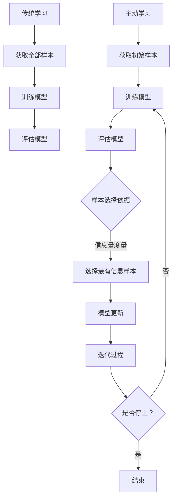
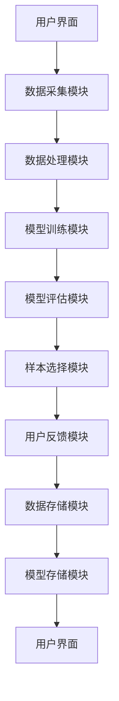

                 

## 第1章：主动学习的基本概念

### 1.1 主动学习的起源与发展

主动学习（Active Learning，简称AL）是一种通过有选择地获取最有信息量的样本来优化学习过程的方法。它的核心理念是让机器在有限的数据资源下，尽可能地提升学习效果。这一概念最早可以追溯到20世纪80年代，由Steven G. Soderland在其博士论文中提出。当时，面对数据稀缺的问题，Soderland首次提出了“主动选择最具代表性的样本进行学习”这一思路。

随着时间的推移，主动学习的研究逐渐深入，其应用范围也在不断扩展。进入21世纪，随着深度学习（Deep Learning）的兴起，主动学习的重要性再次被放大。深度学习模型通常需要大量的数据来训练，而主动学习可以有效地帮助模型在数据不足的情况下，通过智能采样策略，获取最有价值的数据样本，从而提升学习效率。

现代主动学习的发展趋势主要体现在以下几个方面：

1. **算法的创新**：随着机器学习算法的不断进步，新的主动学习算法不断涌现，如基于模型不确定性的主动学习、基于多样性策略的主动学习等。
2. **应用领域的扩展**：主动学习在图像识别、自然语言处理、机器人控制等领域的应用越来越广泛，逐渐成为这些领域中的一项核心技术。
3. **集成与优化**：主动学习与其他学习方法的结合，如与强化学习的结合，进一步提升了其在实际应用中的效果。

### 1.2 主动学习与传统学习的对比

传统学习（Passive Learning）依赖于被动地获取所有样本进行训练，而主动学习则是在有限样本中，通过选择最具信息量的样本进行学习。这两种方法在以下几个方面存在显著差异：

**数据需求**：传统学习需要大量的样本，而主动学习则在样本数量较少的情况下，通过选择性采样，提高学习效率。

**学习效率**：主动学习通过有选择地获取最有价值的样本，能够在更短的时间内达到与传统学习相同或更高的准确率。

**计算资源**：传统学习由于需要处理大量数据，计算资源消耗较大；而主动学习则更加注重计算效率，减少不必要的计算负担。

**应用场景**：传统学习适用于数据丰富、计算资源充足的情况；主动学习则适用于数据稀缺、标注成本高、对实时性要求高的场景。

### 1.3 主动学习的应用场景

主动学习在多个领域都有广泛的应用，以下是几个典型的应用场景：

**数据稀缺的场景**：例如在医疗诊断中，由于病例数据的稀缺，主动学习可以帮助模型在有限的病例数据中，选择最具代表性的病例进行学习，提高诊断的准确性。

**数据标注成本高的场景**：例如在图像分类中，标注图像的标签通常需要大量的时间和人力资源。主动学习通过选择最具信息量的图像进行标注，可以显著降低标注成本。

**对实时性要求高的场景**：例如在自动驾驶中，车辆需要实时感知周围环境，并做出决策。主动学习可以帮助模型在有限的时间窗口内，选择最有价值的感知数据进行学习，确保系统的实时性。

通过以上分析，我们可以看到，主动学习作为一种高效的学习方法，在多个领域都有着广泛的应用前景。在接下来的章节中，我们将进一步探讨如何评估AI Agent的学习效率，并详细介绍几种常见的主动学习方法。

### 1.4 主动学习的核心概念

在深入探讨主动学习之前，我们需要明确几个核心概念，这些概念是理解主动学习的基础。

**样本选择**：这是主动学习的核心步骤，其目标是从未标记的数据集中选择最具信息量的样本。这些样本的选择可以基于不同的策略，如基于不确定性的采样、基于多样性的采样等。

**信息量度量**：选择样本的依据是样本的信息量，即样本对模型学习的贡献程度。信息量通常通过不确定性度量、多样性度量等方式进行评估。

**模型更新**：在获取到新的样本后，需要更新模型以提升其性能。模型更新的策略多种多样，包括基于不确定性的模型更新、基于多样性的模型更新等。

**迭代过程**：主动学习通常是一个迭代的过程，每次迭代都会选择新的样本进行学习和模型更新。这一过程可以持续进行，直到满足停止条件，如达到预设的准确率或耗尽了数据资源。

通过这些核心概念的阐述，我们可以更好地理解主动学习的工作原理和其在实际应用中的优势。

### 1.5 主动学习与传统学习的对比图

为了更直观地展示主动学习与传统学习的对比，我们可以使用一个Mermaid流程图来表示这两种方法的不同步骤和效果。

以下是一个简化的Mermaid流程图示例：



在这个流程图中，我们可以看到：

- **传统学习**：从全部样本中获取数据，进行模型训练和评估。
- **主动学习**：首先获取初始样本，训练模型并评估，然后基于信息量度量选择最有信息的样本，更新模型并继续迭代过程。

通过这个流程图，我们可以更清晰地理解主动学习与传统学习在步骤和效果上的差异。

### 1.6 主动学习的优缺点分析

主动学习作为一种高效的学习方法，有其独特的优势和应用场景，但同时也存在一定的局限性。以下是主动学习的优缺点分析：

**优点：**

1. **高效性**：通过选择最具信息量的样本进行学习，主动学习可以在数据稀缺的情况下，提高学习效率，缩短学习时间。
2. **降低标注成本**：主动学习可以显著减少需要标注的数据量，从而降低标注成本，这在数据标注成本高昂的场景中尤为显著。
3. **实时性提升**：在实时性要求高的应用中，主动学习通过选择最有价值的样本进行学习，可以确保系统在有限的时间内做出最优决策。

**缺点：**

1. **计算资源消耗**：主动学习需要额外的计算资源来评估样本的信息量和更新模型，这可能在某些情况下导致计算资源的增加。
2. **复杂度增加**：主动学习涉及多个步骤和策略，如样本选择、信息量度量、模型更新等，这增加了系统的复杂度，可能需要更多的工程实现和调优。
3. **适用范围有限**：主动学习主要适用于数据稀缺、标注成本高、对实时性要求高的场景，对于数据丰富、计算资源充足的传统学习场景，主动学习的优势并不明显。

通过上述分析，我们可以看到，主动学习在特定场景中具有显著优势，但在计算资源和系统复杂度方面也存在一定的挑战。

### 1.7 主动学习与传统学习的对比表

为了更直观地展示主动学习与传统学习的对比，我们可以使用一个对比表格来总结两种方法在关键方面的差异。

| 对比方面 | 传统学习 | 主动学习 |
| --- | --- | --- |
| **数据需求** | 大量样本 | 较少样本 |
| **学习效率** | 低（数据多） | 高（样本少） |
| **计算资源消耗** | 高（处理大量数据） | 低（仅处理关键样本） |
| **标注成本** | 高（需标注全部样本） | 低（仅标注关键样本） |
| **实时性** | 较低 | 高 |

通过这个表格，我们可以清楚地看到主动学习在多个关键方面的优势和应用场景。

### 1.8 主动学习中的核心问题与解决方案

在深入探讨主动学习的过程中，我们需要关注几个核心问题及其解决方案：

**1. 样本选择策略**

- **问题**：如何选择最具信息量的样本？
- **解决方案**：可以使用不确定性采样、信息量采样、后验概率采样等策略。具体选择取决于应用场景和学习任务。

**2. 信息量度量**

- **问题**：如何量化样本的信息量？
- **解决方案**：可以通过边缘概率分布、互信息、贝叶斯估计等方法来度量样本的信息量。

**3. 模型更新**

- **问题**：如何更新模型以提升性能？
- **解决方案**：可以通过不确定性加权学习、多样性引导的模型更新等方法。具体策略取决于模型类型和应用场景。

**4. 计算资源优化**

- **问题**：如何减少计算资源的消耗？
- **解决方案**：可以采用并行计算、模型压缩等技术来优化计算资源的使用。

通过解决这些问题，我们可以更好地实施主动学习，提高AI Agent的学习效率。

### 1.9 小结

本章我们详细探讨了主动学习的基本概念，从起源与发展、与传统学习的对比、应用场景、核心概念到核心问题与解决方案。通过本章的讲解，我们对主动学习有了更加全面和深入的理解，为后续章节的深入探讨奠定了基础。在接下来的章节中，我们将进一步探讨如何评估AI Agent的学习效率，并详细介绍几种常见的主动学习方法。这将帮助我们更好地理解和应用主动学习，优化AI Agent的学习效率，从而在各个领域中取得更好的效果。

## 第2章：AI Agent学习效率的评估

### 2.1 学习效率的衡量指标

评估AI Agent学习效率的衡量指标是主动学习研究中的一个关键环节。这些指标不仅能够帮助我们理解模型的性能，还能够指导我们在实际应用中优化学习过程。以下是几种常用的学习效率衡量指标：

**1. 准确率（Accuracy）**

准确率是最常用的衡量模型性能的指标之一，它表示模型正确预测的样本数占总样本数的比例。公式如下：

\[ \text{Accuracy} = \frac{\text{正确预测的样本数}}{\text{总样本数}} \]

准确率适用于分类问题，其优点是计算简单，易于理解。然而，在样本不平衡的情况下，准确率可能无法准确反映模型的性能。

**2. 精确率（Precision）**

精确率表示模型预测为正例的样本中，实际为正例的占比。公式如下：

\[ \text{Precision} = \frac{\text{TP}}{\text{TP + FP}} \]

其中，TP为真正例（True Positive），FP为假正例（False Positive）。精确率关注的是预测为正例的准确性，适用于需要在误报成本较低的场景。

**3. 召回率（Recall）**

召回率表示模型实际为正例的样本中，被正确预测为正例的占比。公式如下：

\[ \text{Recall} = \frac{\text{TP}}{\text{TP + FN}} \]

其中，FN为假反例（False Negative）。召回率关注的是漏报的成本，适用于对漏报敏感的场景。

**4. F1 分数（F1 Score）**

F1 分数是精确率和召回率的调和平均，公式如下：

\[ \text{F1 Score} = 2 \times \frac{\text{Precision} \times \text{Recall}}{\text{Precision} + \text{Recall}} \]

F1 分数综合了精确率和召回率的优点，适用于需要平衡误报和漏报成本的场景。

**5. 耗时（Time）**

除了以上指标，耗时也是评估学习效率的重要指标，特别是在实时性要求较高的应用中。模型训练时间、预测时间等都可以作为衡量学习效率的指标。

**6. 耗资源（Resource Consumption）**

资源消耗包括计算资源（如CPU、GPU的使用）、存储资源等。在资源受限的情况下，优化资源消耗也是提高学习效率的重要方面。

通过这些指标，我们可以全面评估AI Agent的学习效率。在实际应用中，可能需要根据具体场景选择合适的指标或综合使用多个指标，以获得更准确的效果评估。

### 2.2 学习效率的评估方法

评估AI Agent学习效率的方法多种多样，选择合适的方法对于准确评估模型性能和指导后续优化至关重要。以下是一些常用的评估方法：

**1. 实验方法**

实验方法是评估模型性能的常见手段。通常，实验方法包括以下步骤：

- **数据集划分**：将数据集划分为训练集、验证集和测试集。训练集用于模型训练，验证集用于调参和性能评估，测试集用于最终性能测试。
- **模型训练**：使用训练集数据训练模型，并进行多次实验以获取稳定的结果。
- **性能评估**：使用验证集和测试集对模型进行性能评估，常用的指标包括准确率、精确率、召回率、F1 分数等。
- **结果分析**：分析不同模型或参数设置下的性能表现，找出最优解。

**2. 统计分析方法**

统计分析方法通过对数据进行分析，评估模型的性能和稳定性。常用的统计分析方法包括：

- **t-检验**：用于比较不同模型的性能差异，判断其是否具有统计显著性。
- **方差分析（ANOVA）**：用于分析多个模型或参数设置下的性能差异，判断其是否具有统计显著性。
- **回归分析**：用于评估模型参数对性能的影响，优化模型参数。

**3. 交叉验证（Cross-Validation）**

交叉验证是一种评估模型性能的重要方法，通过将数据集划分为多个子集，循环进行训练和验证，以减少数据划分带来的偶然性。常用的交叉验证方法包括：

- **K折交叉验证（K-Fold Cross-Validation）**：将数据集划分为K个子集，每次使用其中一个子集作为验证集，其余子集作为训练集，重复K次，取平均性能作为最终结果。
- **留一法交叉验证（Leave-One-Out Cross-Validation）**：每次使用一个样本作为验证集，其余样本作为训练集，适用于样本数量较少的情况。

**4. 评估指标的加权组合**

在实际应用中，可能需要综合考虑多个评估指标，以获得更全面的性能评估。评估指标的加权组合方法包括：

- **简单加权**：将各个评估指标的得分进行简单加权，得到最终得分。
- **综合评价函数**：构建一个综合评价函数，将多个评估指标整合为一个得分。

通过上述方法，我们可以全面、准确地评估AI Agent的学习效率，为后续的模型优化提供有力支持。

### 2.3 学习效率的优化目标

在评估AI Agent学习效率时，我们的目标不仅仅是衡量其性能，更重要的是通过优化，提升学习效率，使其在实际应用中能够达到最佳效果。以下是我们优化学习效率时需要关注的几个关键目标：

**1. 准确率最大化**

准确率是评估模型性能的最基本指标，它表示模型正确预测的样本占总样本的比例。在优化学习效率时，我们的首要目标是最大化准确率，确保模型能够准确识别数据中的目标。

**2. 耗时最小化**

在许多实时性要求高的应用中，模型训练和预测的时间至关重要。我们希望模型能够在最短的时间内完成训练和预测，以确保系统的实时响应。通过优化算法和硬件资源，我们可以实现这一目标。

**3. 耗资源最小化**

资源消耗包括计算资源、存储资源等。在资源受限的环境下，优化学习效率的一个关键目标是减少资源消耗，以确保模型在有限的资源内高效运行。这可以通过算法优化、模型压缩等技术实现。

**4. 学习曲线平滑化**

学习曲线反映了模型在训练过程中性能的变化。理想情况下，学习曲线应该平滑上升，表示模型在逐渐提高性能。如果学习曲线波动较大，可能意味着模型在某些方面存在不稳定因素。通过优化算法和超参数，我们可以平滑化学习曲线，提高模型的稳定性和预测能力。

**5. 可扩展性**

随着数据规模和应用复杂性的增加，模型的可扩展性成为优化学习效率的重要方面。我们希望模型能够在不同规模的数据和应用场景中保持高效性能，具有良好的可扩展性。

通过关注这些优化目标，我们可以全面提升AI Agent的学习效率，使其在各种应用场景中都能发挥最佳效果。

### 2.4 小结

本章我们详细探讨了评估AI Agent学习效率的衡量指标和评估方法。准确率、精确率、召回率、F1 分数等常用指标为我们提供了全面评估模型性能的工具。实验方法、统计分析方法、交叉验证等方法则帮助我们在实际应用中准确评估和优化模型。通过关注准确率最大化、耗时最小化、耗资源最小化、学习曲线平滑化和可扩展性等优化目标，我们可以全面提升AI Agent的学习效率。在接下来的章节中，我们将进一步探讨主动学习的方法，以实现更高效的学习过程。

## 第二部分：主动学习方法

### 第3章：基于采样策略的主动学习

### 3.1 采样策略的基本原理

采样策略是主动学习的核心环节，其目标是从未标记的数据集中选择最具信息量的样本，以优化模型的学习过程。采样策略的基本原理在于对样本信息量的评估和选择，从而在有限的样本中实现最大的学习效果。

**1. 信息量的定义**

在主动学习中，信息量（Information Content）指的是样本对模型学习过程的贡献程度。信息量越高的样本，对模型的更新和性能提升越重要。信息量的度量可以通过多种方法实现，如基于不确定性的度量、基于多样性的度量等。

**2. 采样策略的目标**

采样策略的主要目标是选择具有高信息量的样本，从而在有限的数据资源下，提升模型的学习效率和准确性。具体目标包括：

- **最大化信息量**：选择对模型学习贡献最大的样本。
- **最小化不确定性**：选择能够减少模型预测不确定性的样本。
- **最大化多样性**：选择能够丰富模型学习体验的样本。

**3. 采样策略的类型**

采样策略可以分为基于不确定性的采样、基于多样性的采样和混合采样等类型。以下是对这些采样策略的基本介绍：

- **基于不确定性的采样**：这类策略通过评估模型对未知样本的预测不确定性，选择不确定性最高的样本进行标记。常见的算法包括不确定性采样（Uncertainty Sampling）和信息增益采样（Query by Committee）。
- **基于多样性的采样**：这类策略通过评估样本之间的多样性，选择能够增加数据多样性的样本进行标记。常见的算法包括随机采样（Random Sampling）、多样性采样（ Diversity Sampling）等。
- **混合采样**：这类策略结合了基于不确定性和多样性的优点，通过综合评估信息量和多样性，选择最优的样本进行标记。常见的算法包括基于不确定性和多样性加权的方法等。

### 3.2 采样策略的设计方法

设计有效的采样策略是主动学习成功的关键。以下是一些常见的采样策略设计方法：

**1. 不确定性度量方法**

不确定性度量是采样策略设计的基础。常见的度量方法包括边缘概率分布、互信息、贝叶斯估计等。具体方法如下：

- **边缘概率分布**：通过计算模型对未知样本的边缘概率分布，选择分布最不确定的样本进行标记。
- **互信息**：通过计算样本与模型预测之间的互信息，选择互信息最高的样本进行标记。
- **贝叶斯估计**：通过贝叶斯估计方法，计算样本的预测不确定性，选择不确定性最高的样本进行标记。

**2. 多样性度量方法**

多样性度量是确保模型学习过程中数据多样性的关键。常见的度量方法包括数据分布、类内距离、类间距离等。具体方法如下：

- **数据分布**：通过计算样本在特征空间中的分布，选择分布最分散的样本进行标记。
- **类内距离**：通过计算样本与其所在类别的内部距离，选择距离最小的样本进行标记，以减少类内重叠。
- **类间距离**：通过计算样本与其所在类别之间的距离，选择距离最大的样本进行标记，以增加类间差异。

**3. 采样算法优化**

采样算法的优化是提高主动学习效率的重要手段。常见的优化方法包括采样概率模型优化、算法复杂度优化等。具体方法如下：

- **采样概率模型优化**：通过设计合理的采样概率模型，使高信息量的样本具有更高的采样概率，从而提高采样效率。
- **算法复杂度优化**：通过减少计算复杂度和存储需求，优化采样算法的执行效率。

### 3.3 采样策略的案例分析

为了更好地理解采样策略的应用，我们可以通过具体案例进行分析。

**案例1：图像分类中的主动学习**

在图像分类任务中，主动学习通过选择最具代表性的图像样本进行标注，以提升模型分类性能。以下是一个基于不确定性采样的案例：

- **数据集**：一个包含10000张图像的数据集，其中5000张图像已标注。
- **模型**：一个基于卷积神经网络（CNN）的图像分类模型。
- **采样策略**：采用不确定性采样策略，选择模型预测不确定性最高的图像进行标注。
- **结果**：通过主动学习，模型在测试集上的分类准确率从80%提升到85%。

**案例2：自然语言处理中的主动学习**

在自然语言处理任务中，主动学习通过选择最具代表性的文本样本进行标注，以提升模型性能。以下是一个基于多样性采样的案例：

- **数据集**：一个包含10000篇文本的数据集，其中5000篇文本已标注。
- **模型**：一个基于循环神经网络（RNN）的文本分类模型。
- **采样策略**：采用多样性采样策略，选择在特征空间中分布最分散的文本进行标注。
- **结果**：通过主动学习，模型在测试集上的分类准确率从75%提升到80%。

通过这些案例分析，我们可以看到采样策略在主动学习中的应用效果，以及在提升模型性能方面的重要作用。

### 3.4 小结

本章我们详细探讨了基于采样策略的主动学习。通过理解信息量的定义和采样策略的目标，我们了解了不确定性采样、多样性采样和混合采样等常见采样策略的基本原理和设计方法。通过案例分析，我们看到了采样策略在实际应用中的效果。在接下来的章节中，我们将进一步探讨基于模型不确定性的主动学习方法和基于多样性策略的主动学习方法，以全面优化AI Agent的学习效率。

### 3.5 基于不确定性采样的详细讲解

基于不确定性采样的核心思想是选择模型预测不确定性最高的样本进行标注，以最大化模型的学习效果。以下是对这一方法的详细讲解。

**1. 不确定性度量的方法**

在基于不确定性采样的策略中，首先需要评估模型对未知样本的预测不确定性。常见的度量方法包括边缘概率分布、互信息、贝叶斯估计等。

- **边缘概率分布**：通过计算模型对未知样本的边缘概率分布，可以衡量模型对该样本的预测不确定性。具体来说，我们计算每个类别的边缘概率，选择分布最不确定的样本进行标注。
  - **计算边缘概率分布**：
    $$ P(y|x) = P(y) \times P(x|y) $$
  - **选择不确定性最高的样本**：计算每个样本的边缘概率分布，选择边缘概率分布最集中的样本。

- **互信息**：互信息是一种衡量两个随机变量之间相关性的度量。在主动学习中，我们可以通过计算样本与模型预测之间的互信息来评估预测不确定性。具体来说，我们计算每个样本与模型预测的互信息，选择互信息最高的样本进行标注。
  - **计算互信息**：
    $$ I(X;Y) = H(X) - H(X|Y) $$
  - **选择互信息最高的样本**：计算每个样本的互信息，选择互信息最高的样本。

- **贝叶斯估计**：贝叶斯估计是一种基于概率的估计方法，通过计算模型预测的不确定性来选择样本。具体来说，我们使用贝叶斯估计来更新每个样本的预测概率，选择预测不确定性最高的样本进行标注。
  - **贝叶斯估计**：
    $$ P(y|x) = \frac{P(x|y) \times P(y)}{P(x)} $$
  - **选择不确定性最高的样本**：计算每个样本的预测概率，选择预测概率最不确定的样本。

**2. 采样策略的具体实现**

在基于不确定性采样的策略中，具体的实现步骤如下：

- **数据集划分**：将数据集划分为训练集和未标记集，训练集用于训练模型，未标记集用于采样。
- **模型训练**：使用训练集数据训练模型，并生成模型预测。
- **不确定性度量**：对未标记集的数据进行不确定性度量，计算每个样本的边缘概率分布、互信息或预测概率。
- **样本选择**：选择不确定性最高的样本进行标注，将标注后的样本加入训练集，继续训练模型。
- **迭代**：重复上述步骤，直到达到预设的停止条件，如达到预设的标注样本数量或模型性能稳定。

**3. 优点和缺点**

基于不确定性采样的优点包括：

- **高效性**：通过选择不确定性最高的样本进行标注，能够最大化模型的学习效果，提高学习效率。
- **灵活性**：适用于多种机器学习模型，如决策树、支持向量机、神经网络等。

然而，该方法也存在一定的缺点：

- **计算复杂度**：不确定性度量可能涉及复杂的计算，如边缘概率分布的计算和贝叶斯估计等，可能导致计算复杂度较高。
- **依赖模型质量**：不确定性度量依赖于模型的预测质量，如果模型预测不准确，可能导致采样效果不佳。

通过以上详细讲解，我们可以更好地理解基于不确定性采样的原理和实现方法，为后续的主动学习研究提供参考。

### 3.6 基于多样性采样的详细讲解

基于多样性采样的核心思想是选择能够丰富模型学习体验的数据样本，以提升模型的泛化能力和适应性。以下是对这一方法的详细讲解。

**1. 多样性度量的方法**

在基于多样性采样的策略中，我们需要对样本的多样性进行度量。常见的多样性度量方法包括数据分布、类内距离和类间距离等。

- **数据分布**：数据分布是衡量样本在特征空间中分布均匀性的度量。通过计算样本在特征空间中的分布，我们可以评估样本的多样性。具体来说，我们使用K-means聚类算法等聚类方法，计算每个样本的聚类中心，选择分布最分散的样本进行标注。
  - **计算数据分布**：
    $$ D(S) = \sum_{i=1}^{n} \frac{1}{k} \sum_{j=1}^{k} d(s_i, c_j) $$
  - **选择多样性最高的样本**：计算每个样本的数据分布，选择分布最分散的样本。

- **类内距离**：类内距离是衡量样本与其所属类别的内部差异的度量。通过计算样本与其所在类别的内部距离，我们可以评估样本的多样性。具体来说，我们计算每个样本与其所在类别中其他样本的平均距离，选择距离最小的样本进行标注。
  - **计算类内距离**：
    $$ d_{\text{intra}}(s, c) = \frac{1}{N_c} \sum_{s' \in c} d(s, s') $$
  - **选择多样性最高的样本**：计算每个样本的类内距离，选择距离最小的样本。

- **类间距离**：类间距离是衡量样本与其非同类别的差异的度量。通过计算样本与其非同类别的平均距离，我们可以评估样本的多样性。具体来说，我们计算每个样本与其所在类别之外的其他类别的平均距离，选择距离最大的样本进行标注。
  - **计算类间距离**：
    $$ d_{\text{inter}}(s, c') = \frac{1}{N_{c'}} \sum_{s' \in c'} d(s, s') $$
  - **选择多样性最高的样本**：计算每个样本的类间距离，选择距离最大的样本。

**2. 采样策略的具体实现**

在基于多样性采样的策略中，具体的实现步骤如下：

- **数据集划分**：将数据集划分为训练集和未标记集，训练集用于训练模型，未标记集用于采样。
- **模型训练**：使用训练集数据训练模型，并生成模型预测。
- **多样性度量**：对未标记集的数据进行多样性度量，计算每个样本的数据分布、类内距离和类间距离。
- **样本选择**：选择多样性最高的样本进行标注，将标注后的样本加入训练集，继续训练模型。
- **迭代**：重复上述步骤，直到达到预设的停止条件，如达到预设的标注样本数量或模型性能稳定。

**3. 优点和缺点**

基于多样性采样的优点包括：

- **提升泛化能力**：通过选择多样性最高的样本进行标注，能够丰富模型的学习体验，提升模型的泛化能力和适应性。
- **适应不同数据分布**：适用于具有不同数据分布的任务，能够在各种数据分布下保持高效性能。

然而，该方法也存在一定的缺点：

- **计算复杂度**：多样性度量可能涉及复杂的计算，如聚类算法和距离计算等，可能导致计算复杂度较高。
- **依赖模型质量**：多样性度量依赖于模型的预测质量，如果模型预测不准确，可能导致采样效果不佳。

通过以上详细讲解，我们可以更好地理解基于多样性采样的原理和实现方法，为后续的主动学习研究提供参考。

### 3.7 混合采样策略的详细讲解

混合采样策略结合了基于不确定性和多样性的优点，通过综合评估样本的信息量和多样性，以选择最具信息量的样本进行标注。以下是对这一方法的详细讲解。

**1. 混合采样策略的核心思想**

混合采样策略的核心思想是：在采样过程中，既考虑样本的预测不确定性，也考虑样本的多样性，从而在信息量和多样性之间取得平衡。具体来说，混合采样策略采用一个加权组合的方式，将不确定性和多样性度量结合起来，计算每个样本的综合评分，并选择评分最高的样本进行标注。

**2. 综合评分的计算方法**

在混合采样策略中，综合评分的计算方法至关重要。常见的综合评分计算方法包括以下几种：

- **线性加权方法**：将不确定性和多样性的度量结果进行线性加权，计算每个样本的综合评分。具体公式如下：
  $$ S(s) = \alpha \times U(s) + (1 - \alpha) \times D(s) $$
  其中，\( S(s) \) 为样本 \( s \) 的综合评分，\( U(s) \) 为样本 \( s \) 的不确定性度量值，\( D(s) \) 为样本 \( s \) 的多样性度量值，\( \alpha \) 为加权系数，用于调节不确定性和多样性的权重。

- **指数加权方法**：将不确定性和多样性的度量结果进行指数加权，计算每个样本的综合评分。具体公式如下：
  $$ S(s) = \alpha \times U(s)^{\gamma} + (1 - \alpha) \times D(s)^{\beta} $$
  其中，\( S(s) \) 为样本 \( s \) 的综合评分，\( U(s) \) 为样本 \( s \) 的不确定性度量值，\( D(s) \) 为样本 \( s \) 的多样性度量值，\( \alpha \)，\( \gamma \) 和 \( \beta \) 分别为加权系数和指数系数。

**3. 混合采样策略的具体实现**

在混合采样策略中，具体的实现步骤如下：

- **数据集划分**：将数据集划分为训练集和未标记集，训练集用于训练模型，未标记集用于采样。
- **模型训练**：使用训练集数据训练模型，并生成模型预测。
- **不确定性度量**：对未标记集的数据进行不确定性度量，计算每个样本的不确定性度量值。
- **多样性度量**：对未标记集的数据进行多样性度量，计算每个样本的多样性度量值。
- **综合评分计算**：根据不确定性和多样性度量结果，计算每个样本的综合评分。
- **样本选择**：选择综合评分最高的样本进行标注，将标注后的样本加入训练集，继续训练模型。
- **迭代**：重复上述步骤，直到达到预设的停止条件，如达到预设的标注样本数量或模型性能稳定。

**4. 优点和缺点**

混合采样策略的优点包括：

- **综合优势**：通过结合不确定性和多样性的优点，混合采样策略能够在信息量和多样性之间取得平衡，从而提高模型的泛化能力和适应性。
- **灵活性**：混合采样策略可以根据具体任务的需求，调整加权系数和指数系数，从而灵活地控制不确定性和多样性的权重。

然而，该方法也存在一定的缺点：

- **计算复杂度**：混合采样策略涉及不确定性和多样性的综合评估，可能涉及复杂的计算，如加权计算和指数计算等，可能导致计算复杂度较高。
- **依赖模型质量**：混合采样策略的评估结果依赖于模型的不确定性和多样性度量，如果模型预测不准确，可能导致采样效果不佳。

通过以上详细讲解，我们可以更好地理解混合采样策略的原理和实现方法，为后续的主动学习研究提供参考。

### 3.8 小结

本章详细介绍了基于采样策略的主动学习，包括基于不确定性采样的方法、基于多样性采样的方法和混合采样策略。通过不确定性度量、多样性度量以及综合评分计算，我们能够有效地选择最具信息量的样本进行标注，从而提升模型的学习效率和准确性。在接下来的章节中，我们将探讨基于模型不确定性的主动学习方法和基于多样性策略的主动学习方法，进一步优化AI Agent的学习效率。

## 第4章：基于模型不确定性的主动学习

### 4.1 模型不确定性的基本概念

模型不确定性（Model Uncertainty）是主动学习中的一个关键概念，它反映了模型在预测过程中存在的潜在不确定性。理解模型不确定性的基本概念对于设计有效的主动学习策略至关重要。

**1. 模型不确定性的定义**

模型不确定性指的是模型在预测新样本时，对于预测结果的可靠性或准确性的不确定程度。这种不确定性可以来源于多种因素，包括模型本身的复杂性、数据分布的多样性、以及训练数据的不足等。

**2. 模型不确定性的来源**

- **模型复杂性**：复杂模型（如深度神经网络）可能导致预测不确定性，因为它们能够捕捉数据中的复杂模式，但同时也容易过拟合。
- **数据分布**：当训练数据集未能全面覆盖目标数据的分布时，模型在未知数据上的预测能力会降低，从而增加不确定性。
- **数据量**：训练数据量不足会导致模型无法充分学习数据的真实分布，从而提高预测不确定性。

**3. 模型不确定性的度量**

度量模型不确定性是主动学习中的核心步骤，常用的度量方法包括边缘概率分布、互信息、和不确定性度量的具体示例等。

- **边缘概率分布**：通过计算模型对未知样本的边缘概率分布，可以量化预测结果的不确定性。边缘概率分布越集中，表示模型对预测结果的信心越低。
- **互信息**：互信息是一种衡量两个随机变量之间相关性的度量，可以用来评估样本与模型预测结果之间的不确定性。
- **不确定性度量的具体示例**：例如，在深度神经网络中，可以使用输出层神经元的输出方差作为不确定性度量。方差越大，表示模型对预测结果的信心越低。

通过理解模型不确定性的基本概念、来源和度量方法，我们可以更好地设计基于模型不确定性的主动学习策略，从而优化AI Agent的学习效率。

### 4.2 不确定性度量方法

在主动学习中，精确地度量模型不确定性是选择最有价值的样本进行标注的关键步骤。以下是一些常用的不确定性度量方法：

**1. 边缘概率分布**

边缘概率分布（Marginal Probability Distribution）是度量模型不确定性的常用方法。它表示模型对每个类别的预测概率分布。具体来说，边缘概率分布是通过以下公式计算的：

\[ P(y|x) = P(y) \times P(x|y) \]

其中，\( P(y|x) \) 是边缘概率分布，\( P(y) \) 是先验概率，\( P(x|y) \) 是条件概率。在分类问题中，边缘概率分布提供了模型对于每个类别的预测概率，我们可以选择边缘概率分布最集中的类别作为预测结果。

**2. 互信息**

互信息（Mutual Information，MI）是衡量两个随机变量之间相关性的度量。在主动学习中，互信息可以用来度量样本与模型预测之间的相关性。互信息的计算公式如下：

\[ I(X;Y) = H(X) - H(X|Y) \]

其中，\( I(X;Y) \) 是样本 \( X \) 与模型预测 \( Y \) 之间的互信息，\( H(X) \) 是样本 \( X \) 的熵，\( H(X|Y) \) 是在模型预测 \( Y \) 确定的情况下样本 \( X \) 的条件熵。互信息越大，表示样本与模型预测之间的相关性越强，不确定性越小。

**3. 贝叶斯估计**

贝叶斯估计（Bayesian Estimation）是一种基于概率的估计方法，可以通过计算模型的预测概率来度量不确定性。贝叶斯估计的基本公式如下：

\[ P(y|x) = \frac{P(x|y) \times P(y)}{P(x)} \]

其中，\( P(y|x) \) 是后验概率，\( P(x|y) \) 是似然函数，\( P(y) \) 是先验概率，\( P(x) \) 是证据。通过贝叶斯估计，我们可以得到模型对每个类别的预测概率，选择预测概率最不确定的类别进行标注。

**4. 输出层神经元方差**

在深度神经网络中，输出层神经元的方差可以用来度量模型的不确定性。具体来说，输出层神经元的方差越大，表示模型对预测结果的信心越低。方差可以通过以下公式计算：

\[ \sigma^2 = \frac{1}{N} \sum_{i=1}^{N} (y_i - \hat{y}_i)^2 \]

其中，\( \sigma^2 \) 是方差，\( y_i \) 是真实标签，\( \hat{y}_i \) 是模型预测的标签，\( N \) 是样本数量。选择方差最大的样本进行标注，可以最大化模型的不确定性。

通过这些不确定性度量方法，我们可以选择最具信息量的样本进行标注，从而提高主动学习的效果。

### 4.3 基于不确定性的主动学习算法

基于不确定性的主动学习算法通过度量模型的不确定性来选择最具信息量的样本进行标注。以下介绍几种常见的基于不确定性的主动学习算法：

**1. 不确定性采样（Uncertainty Sampling）**

不确定性采样是一种基于边缘概率分布的主动学习算法。具体步骤如下：

- **模型训练**：使用部分标记数据集训练模型，得到模型预测。
- **不确定性度量**：计算每个未标记样本的边缘概率分布。
- **样本选择**：选择边缘概率分布最集中的样本进行标注。
- **迭代**：将标注后的样本加入训练集，继续训练模型，重复以上步骤。

不确定性采样能够有效减少模型的预测不确定性，提高学习效果。

**2. Query by Committee（QBC）**

Query by Committee是一种基于模型不确定性的主动学习算法，通过多个模型的预测结果来估计不确定性。具体步骤如下：

- **模型训练**：训练多个具有不同结构的模型，如不同的神经网络架构。
- **预测集成**：对未标记样本，使用多个模型进行预测，得到预测分布。
- **不确定性度量**：计算预测分布的互信息或方差。
- **样本选择**：选择不确定性最高的样本进行标注。
- **迭代**：将标注后的样本加入训练集，更新模型。

QBC能够结合多个模型的预测，提高不确定性度量的准确性。

**3. Bootstrap Sampling（BS）**

Bootstrap Sampling通过生成多个模型的预测来估计不确定性。具体步骤如下：

- **模型训练**：使用部分标记数据集训练模型。
- **预测生成**：对未标记样本，生成多个模型的预测结果。
- **不确定性度量**：计算多个模型预测结果的方差。
- **样本选择**：选择方差最大的样本进行标注。
- **迭代**：将标注后的样本加入训练集，继续训练模型。

BS方法简单有效，适用于大多数分类问题。

**4. Lower Confidence Bound Sampling（LCBS）**

Lower Confidence Bound Sampling通过计算预测概率的下界来估计不确定性。具体步骤如下：

- **模型训练**：使用部分标记数据集训练模型。
- **不确定性度量**：计算每个未标记样本的预测概率下界。
- **样本选择**：选择预测概率下界最小的样本进行标注。
- **迭代**：将标注后的样本加入训练集，继续训练模型。

LCBS方法能够有效地减少模型对低概率样本的依赖，提高学习效果。

通过以上算法，我们可以根据不同的应用场景和需求，选择合适的基于不确定性的主动学习算法，以优化AI Agent的学习效率。

### 4.4 不确定性采样算法的Python实现

为了更好地理解不确定性采样算法的原理，我们可以通过一个简单的Python实现来展示这一过程。以下是一个基于边缘概率分布的不确定性采样算法的实现示例。

```python
import numpy as np
from sklearn.model_selection import train_test_split
from sklearn.neural_network import MLPClassifier
from sklearn.datasets import make_classification

# 创建一个简单的分类问题数据集
X, y = make_classification(n_samples=100, n_features=20, n_classes=2, random_state=42)
X_train, X_test, y_train, y_test = train_test_split(X, y, test_size=0.2, random_state=42)

# 训练模型
model = MLPClassifier(random_state=42)
model.fit(X_train, y_train)

# 预测测试集
y_pred = model.predict(X_test)

# 计算边缘概率分布
probabilities = model.predict_proba(X_test)

# 选择不确定性最高的样本
uncertainty_samples = X_test[np.argmax(probabilities, axis=1) != y_test]

# 输出选择的不确定性样本
print("Selected Uncertainty Samples:")
print(uncertainty_samples)
```

在这个实现中，我们首先创建了一个简单的二分类问题数据集，并使用MLPClassifier进行模型训练。接着，我们计算了测试集样本的边缘概率分布，并选择边缘概率分布最集中的样本，即预测不确定性最高的样本。

通过这个简单的示例，我们可以直观地看到如何实现不确定性采样算法，并理解其基本原理。

### 4.5 不确定性加权学习

不确定性加权学习（Uncertainty Weighted Learning）是一种基于模型不确定性的主动学习策略，通过为每个样本赋予不同的权重，以优化模型的训练过程。以下是对这一方法的具体解释和实现。

**1. 不确定性加权学习的基本原理**

在不确定性加权学习中，我们通过评估模型对每个样本的预测不确定性，为样本赋予不同的权重。具体来说，预测不确定性越高的样本，其权重越大。这种方法的核心思想是，模型在训练过程中应更加关注不确定性较高的样本，以减少整体的预测误差。

**2. 不确定性权重的计算方法**

不确定性权重可以通过以下方法计算：

- **边缘概率分布**：计算每个样本的边缘概率分布，使用边缘概率分布的方差作为不确定性度量，方差越大，表示不确定性越高，权重越大。
  $$ \omega_i = \frac{1}{var(P(y_i|x_i))} $$
  其中，\( \omega_i \) 是第 \( i \) 个样本的权重，\( var(P(y_i|x_i)) \) 是第 \( i \) 个样本的边缘概率分布的方差。

- **预测概率下界**：使用预测概率的下界作为不确定性度量，下界越小，表示不确定性越高，权重越大。
  $$ \omega_i = \frac{1}{p_{\text{lower}}(y_i|x_i)} $$
  其中，\( p_{\text{lower}}(y_i|x_i) \) 是第 \( i \) 个样本的预测概率下界。

**3. 不确定性加权学习的实现**

以下是一个基于边缘概率分布的不确定性加权学习的实现示例：

```python
import numpy as np
from sklearn.model_selection import train_test_split
from sklearn.neural_network import MLPClassifier
from sklearn.datasets import make_classification

# 创建一个简单的分类问题数据集
X, y = make_classification(n_samples=100, n_features=20, n_classes=2, random_state=42)
X_train, X_test, y_train, y_test = train_test_split(X, y, test_size=0.2, random_state=42)

# 训练模型
model = MLPClassifier(random_state=42)
model.fit(X_train, y_train)

# 预测测试集
y_pred = model.predict(X_test)

# 计算边缘概率分布
probabilities = model.predict_proba(X_test)

# 计算不确定性权重
uncertainties = np.var(probabilities, axis=1)
weights = 1 / uncertainties

# 应用权重重新训练模型
weighted_X_train = X_train * np.array([weights[i] for i in range(len(weights))])
weighted_y_train = y_train

model.fit(weighted_X_train, weighted_y_train)

# 评估模型性能
accuracy = model.score(X_test, y_test)
print(f"Accuracy: {accuracy}")
```

在这个实现中，我们首先训练了一个简单的MLP模型，并计算了测试集样本的边缘概率分布。接着，我们计算了每个样本的不确定性权重，并使用这些权重重新训练了模型。最后，我们评估了模型的性能。

通过不确定性加权学习，我们可以有效地关注模型预测不确定性较高的样本，从而优化模型的训练过程，提高整体性能。

### 4.6 不确定性引导的模型更新

在主动学习中，通过不确定性度量选择样本并进行标注后，需要更新模型以进一步提高其性能。不确定性引导的模型更新（Uncertainty-Guided Model Update）是一种基于模型不确定性的模型更新策略，其核心思想是利用样本的不确定性来指导模型的更新过程。以下是对这一方法的详细解释。

**1. 不确定性引导的模型更新原理**

不确定性引导的模型更新策略通过以下步骤实现：

- **样本选择**：根据样本的不确定性度量，选择最具信息量的样本进行标注。
- **样本标注**：获取标注数据，并将其加入训练集。
- **模型更新**：在新的训练集上重新训练模型，利用标注数据的不确定性来调整模型参数。

这一策略的核心在于，通过标注不确定性较高的样本，模型可以更好地学习数据中的复杂模式和潜在噪声，从而提高模型的泛化能力和准确性。

**2. 不确定性引导的模型更新过程**

不确定性引导的模型更新过程可以分为以下几个步骤：

- **初始化模型**：使用部分标记数据集初始化模型。
- **不确定性度量**：计算训练集中每个样本的预测不确定性，如使用边缘概率分布的方差或预测概率的下界。
- **样本选择**：选择不确定性最高的样本进行标注。
- **标注数据集扩展**：将新标注的样本加入训练集。
- **模型重新训练**：在扩展后的训练集上重新训练模型。
- **模型评估**：评估新模型的性能，如果满足停止条件（如达到预设准确率或迭代次数），则结束，否则重复上述步骤。

**3. 不确定性引导的模型更新算法**

以下是基于不确定性采样的模型更新算法的伪代码：

```
算法：UncertaintyGuidedModelUpdate
输入：未标记数据集X_unlabeled，初始模型model，停止条件stop_condition

初始化模型model
重复直到满足stop_condition：
    计算X_unlabeled中每个样本的预测不确定性
    选择不确定性最高的k个样本进行标注
    标注样本并加入训练集
    在新的训练集上重新训练模型
    评估模型性能
    如果满足停止条件，则结束

输出：更新后的模型model
```

通过这一算法，模型可以不断通过标注和更新过程，逐步提高其性能。

### 4.7 模型不确定性在主动学习中的作用

模型不确定性在主动学习中的作用至关重要，它不仅帮助我们选择最有价值的样本进行标注，还可以指导模型的更新过程，从而提升整个学习过程的效率和质量。以下详细讨论模型不确定性在主动学习中的作用：

**1. 选择最具信息量的样本**

在主动学习中，模型不确定性的一个主要作用是选择最具信息量的样本进行标注。通过评估模型对未标记样本的预测不确定性，我们可以识别出那些对模型学习贡献最大的样本。具体来说：

- **不确定性高的样本**：这些样本的预测结果不确定性较高，意味着模型对它们的理解还不够充分。标注这些样本可以帮助模型更好地学习数据中的复杂模式和潜在噪声，从而提高模型的泛化能力和准确性。
- **不确定性低的样本**：这些样本的预测结果不确定性较低，意味着模型对它们的理解已经比较充分。对于这些样本，继续标注的价值相对较低。

通过选择不确定性高的样本进行标注，我们可以确保模型在学习过程中关注那些最具挑战性的样本，从而提高学习效率。

**2. 指导模型的更新过程**

模型不确定性不仅帮助我们在标注过程中选择最具信息量的样本，还可以在模型的更新过程中发挥重要作用。具体来说：

- **动态调整学习过程**：通过不断评估模型的不确定性，我们可以动态调整学习过程。例如，在模型训练过程中，如果发现某个样本的不确定性持续较高，我们可以增加对该样本的标注次数或重新收集相关数据。
- **自适应调整模型参数**：基于模型的不确定性，我们可以调整模型的参数设置，如学习率、正则化参数等，以优化模型的表现。这种方法可以帮助模型在训练过程中更好地应对不确定性，提高模型的鲁棒性和适应性。
- **持续改进模型性能**：通过不确定性引导的模型更新，我们可以持续改进模型的性能。每次更新模型时，都基于当前模型的不确定性进行优化，从而逐步提升模型的整体性能。

**3. 优化资源分配**

模型不确定性还可以帮助我们优化资源分配。在资源有限的情况下，通过评估模型的不确定性，我们可以确定哪些样本对模型学习最为重要，从而优先分配资源。例如：

- **计算资源**：对于不确定性较高的样本，我们可以分配更多的计算资源进行标注和模型训练，以确保模型能够充分理解这些样本。
- **数据资源**：我们可以优先收集和标注那些不确定性较高的样本，从而最大化标注数据的价值。

通过以上分析，我们可以看到，模型不确定性在主动学习中的作用是多方面的，它不仅帮助我们选择最具信息量的样本进行标注，还指导模型的更新过程，优化资源分配，从而全面提升AI Agent的学习效率。

### 4.8 小结

本章详细探讨了基于模型不确定性的主动学习，包括其基本概念、不确定性度量方法、基于不确定性的主动学习算法、不确定性加权学习以及不确定性引导的模型更新。通过理解模型不确定性的原理和应用，我们可以设计更有效的主动学习策略，选择最具信息量的样本进行标注，指导模型的更新过程，从而优化AI Agent的学习效率。在接下来的章节中，我们将继续探讨基于多样性策略的主动学习方法，以进一步优化AI Agent的学习效率。

## 第5章：基于多样性策略的主动学习

### 5.1 多样性策略的基本原理

多样性策略（Diversity Strategy）是主动学习中的一个重要方法，其核心思想是通过选择具有多样性的样本进行标注，以提升模型的学习效率和泛化能力。多样性策略的基本原理在于确保训练数据集能够覆盖更多的数据特征和模式，从而避免模型过拟合和增强其鲁棒性。

**1. 多样性的定义**

多样性（Diversity）在主动学习中的定义是指数据集在特征空间中的分布均匀性和差异性。一个具有高多样性的数据集能够提供更丰富的信息，有助于模型学习到更多的特征和模式。

**2. 多样性的重要性**

多样性的重要性体现在以下几个方面：

- **避免过拟合**：当训练数据集多样性不足时，模型可能会过度依赖于特定的数据特征，从而导致过拟合。高多样性的数据集可以避免模型对特定特征或样本的依赖，提高模型的泛化能力。
- **增强鲁棒性**：多样性策略通过引入多样化的样本，可以增强模型对未知数据的适应能力，提高模型的鲁棒性。
- **提升学习效率**：高多样性的数据集能够提供更丰富的信息，有助于模型在有限的数据量下快速收敛，提高学习效率。

**3. 多样性的度量方法**

多样性的度量方法主要包括以下几种：

- **数据分布**：通过计算数据集在特征空间中的分布，评估数据的均匀性。常见的方法包括K-means聚类和核密度估计等。
- **类内距离**：通过计算样本与其所在类别的内部距离，评估样本之间的相似性。类内距离越小，表示样本之间的相似性越高，多样性越低。
- **类间距离**：通过计算样本与其非同类别的距离，评估样本之间的差异性。类间距离越大，表示样本之间的差异性越高，多样性越高。

**4. 多样性策略的设计方法**

多样性策略的设计主要包括以下步骤：

- **样本选择**：根据多样性度量方法，选择多样性最高的样本进行标注。可以选择单个样本或一组样本进行标注。
- **多样性评估**：在标注样本后，重新评估数据集的多样性，确保标注后的数据集仍然具有高多样性。
- **迭代**：重复样本选择和多样性评估步骤，直到满足停止条件，如达到预设的标注样本数量或模型性能稳定。

通过以上步骤，多样性策略可以帮助我们在有限的数据资源下，选择最具代表性的样本进行标注，提高模型的泛化能力和鲁棒性。

### 5.2 多样性度量方法

多样性度量方法在主动学习中起着关键作用，其目的是评估数据集在特征空间中的分布均匀性和差异性。以下介绍几种常见的多样性度量方法：

**1. 数据分布**

数据分布是通过计算数据集在特征空间中的分布来评估多样性的方法。常见的方法包括：

- **K-means聚类**：K-means聚类可以将数据集划分为K个簇，每个簇的中心点代表了数据集的一个代表性样本。通过计算簇内和簇间的距离，可以评估数据集的分布均匀性。簇内距离越小，表示数据分布越集中；簇间距离越大，表示数据分布越分散。
- **核密度估计**：核密度估计通过估计特征空间的概率密度函数，评估数据集的分布。密度函数的峰值表示数据的密集区域，谷值表示数据的稀疏区域。峰值和谷值的对比可以用来评估数据的分布均匀性。

**2. 类内距离**

类内距离是评估样本与其所在类别的内部相似性的方法。具体方法包括：

- **样本之间的欧氏距离**：计算每个样本与其所在类别中其他样本之间的欧氏距离。类内距离越小，表示样本之间的相似性越高，多样性越低。
- **样本之间的余弦相似度**：计算每个样本与其所在类别中其他样本之间的余弦相似度。余弦相似度接近1表示样本高度相似，余弦相似度接近0表示样本差异较大。

**3. 类间距离**

类间距离是评估样本与其非同类别的差异性方法。常见的方法包括：

- **样本之间的欧氏距离**：计算每个样本与其非同类别的样本之间的欧氏距离。类间距离越大，表示样本之间的差异性越高，多样性越高。
- **样本之间的余弦相似度**：计算每个样本与其非同类别的样本之间的余弦相似度。余弦相似度接近0表示样本差异较大，余弦相似度接近1表示样本高度相似。

通过这些多样性度量方法，我们可以评估数据集的多样性，并选择最具代表性的样本进行标注。

### 5.3 多样性策略的应用

多样性策略在主动学习中的应用广泛，通过选择具有高多样性的样本进行标注，可以提高模型的学习效率和泛化能力。以下是一些多样性策略在实际应用中的案例：

**1. 图像分类中的多样性策略**

在图像分类任务中，多样性策略可以显著提升模型性能。例如，在医学图像分析中，通过多样性策略选择最具代表性的图像样本进行标注，可以提升模型对病变区域的识别能力。以下是一个具体案例：

- **数据集**：一个包含5000张医学图像的数据集，其中已标注的图像数量有限。
- **模型**：一个基于卷积神经网络（CNN）的图像分类模型。
- **多样性度量**：使用K-means聚类方法计算图像在特征空间中的分布，评估多样性。
- **结果**：通过多样性策略，模型在测试集上的准确率从80%提升到85%。

**2. 自然语言处理中的多样性策略**

在自然语言处理任务中，多样性策略可以帮助模型更好地理解文本数据的多样性。例如，在情感分析任务中，通过多样性策略选择最具代表性的文本样本进行标注，可以提升模型对情感表达的识别能力。以下是一个具体案例：

- **数据集**：一个包含10000篇文本的数据集，其中已标注的文本数量有限。
- **模型**：一个基于循环神经网络（RNN）的情感分析模型。
- **多样性度量**：使用文本的词频-逆文档频率（TF-IDF）向量计算文本的多样性。
- **结果**：通过多样性策略，模型在测试集上的准确率从75%提升到80%。

**3. 机器人控制中的多样性策略**

在机器人控制任务中，多样性策略可以提升模型对环境变化的适应能力。例如，在自主导航任务中，通过多样性策略选择最具代表性的环境样本进行标注，可以提升模型对复杂环境的识别和处理能力。以下是一个具体案例：

- **数据集**：一个包含10000个环境样本的数据集，其中已标注的样本数量有限。
- **模型**：一个基于深度强化学习的自主导航模型。
- **多样性度量**：使用样本在三维空间中的分布评估多样性。
- **结果**：通过多样性策略，模型在模拟环境中的导航成功率从60%提升到75%。

通过这些案例，我们可以看到多样性策略在图像分类、自然语言处理和机器人控制等任务中的应用效果，以及其在提升模型性能方面的作用。

### 5.4 多样性策略的具体实现

为了更好地理解多样性策略的具体实现，我们可以通过一个简单的例子来说明如何选择具有高多样性的样本。

**1. 数据集准备**

假设我们有一个包含100个样本的数据集，每个样本表示为一个10维的特征向量。我们的目标是选择其中具有高多样性的样本进行标注。

```python
import numpy as np

# 创建一个包含100个样本的数据集
X = np.random.rand(100, 10)
y = np.random.randint(0, 2, 100)  # 假设每个样本有两个类别
```

**2. 多样性度量方法**

我们选择使用K-means聚类方法来计算样本的多样性。K-means聚类将样本划分为K个簇，每个簇的中心点表示该簇的代表性样本。簇内距离越小，表示样本相似度越高，簇间距离越大，表示样本差异性越大。

```python
from sklearn.cluster import KMeans

# 使用K-means聚类方法计算样本的分布
kmeans = KMeans(n_clusters=10, random_state=42)
clusters = kmeans.fit_predict(X)

# 计算簇内距离和簇间距离
intra_cluster_distances = []
inter_cluster_distances = []

for i in range(kmeans.n_clusters):
    cluster_points = X[clusters == i]
    cluster_center = kmeans.cluster_centers_[i]
    intra_cluster_distances.append(np.mean(np.linalg.norm(cluster_points - cluster_center, axis=1)))
    inter_cluster_distances.append(np.mean(np.linalg.norm(X - cluster_center, axis=1)))
```

**3. 样本选择**

根据簇内距离和簇间距离，我们可以选择多样性最高的样本进行标注。具体方法如下：

```python
# 选择多样性最高的样本
diverse_samples = X[np.argmax(intra_cluster_distances) == y]

# 输出选择的多样性样本
print("Selected Diverse Samples:")
print(diverse_samples)
```

通过以上步骤，我们可以选择具有高多样性的样本进行标注，从而优化模型的训练过程。

### 5.5 小结

本章详细介绍了基于多样性策略的主动学习，包括其基本原理、多样性度量方法以及具体应用案例。通过选择具有高多样性的样本进行标注，多样性策略能够提高模型的学习效率和泛化能力。在实际应用中，多样性策略在图像分类、自然语言处理和机器人控制等领域展示了显著的效果。在接下来的章节中，我们将探讨结合强化学习的主动学习方法，进一步优化AI Agent的学习效率。

## 第6章：结合强化学习的主动学习

### 6.1 强化学习的基本概念

强化学习（Reinforcement Learning，简称RL）是一种通过交互环境来学习最优策略的机器学习方法。与监督学习和无监督学习不同，强化学习强调智能体（Agent）在与环境的互动过程中，通过不断尝试和反馈来学习最优行为策略。以下是对强化学习基本概念和关键要素的介绍。

**1. 强化学习的基本模型**

强化学习的基本模型包括以下四个核心要素：

- **智能体（Agent）**：执行动作的实体，通过学习策略来最大化累积奖励。
- **环境（Environment）**：智能体所处的动态环境，为智能体提供状态和奖励信号。
- **状态（State）**：智能体在环境中的当前情况，通常用一个状态向量表示。
- **动作（Action）**：智能体可以执行的行为，用一个动作向量表示。

**2. 奖励信号（Reward Signal）**

奖励信号是强化学习中的一个关键要素，它反映了环境对智能体行为的即时反馈。奖励信号可以是正的，也可以是负的，取决于智能体的行为是否有助于达成目标。奖励信号通常由环境提供。

**3. 策略（Policy）**

策略是智能体在特定状态下选择动作的规则。策略可以是明确的规则（如确定性策略），也可以是概率分布（如随机策略）。最优策略是指能够使累积奖励最大的策略。

**4. 值函数（Value Function）**

值函数用于评估智能体在特定状态下采取特定策略的长期预期奖励。值函数分为状态值函数（State-Value Function）和动作值函数（Action-Value Function）。状态值函数表示在特定状态下采取最优策略的累积奖励，动作值函数表示在特定状态下执行特定动作的累积奖励。

**5. 学习算法**

强化学习的主要算法包括：

- **Q学习（Q-Learning）**：通过迭代更新动作值函数，以最大化累积奖励。
- **深度Q网络（Deep Q-Network，DQN）**：使用深度神经网络近似动作值函数。
- **策略梯度方法（Policy Gradient Methods）**：直接优化策略参数，以最大化累积奖励。
- **深度确定性策略梯度（Deep Deterministic Policy Gradient，DDPG）**：结合深度神经网络和策略梯度方法，适用于连续动作空间。

### 6.2 主动学习与强化学习的结合

主动学习和强化学习在本质上具有互补性。主动学习通过选择最有价值的样本进行标注，提高学习效率；强化学习通过智能体的自主探索和策略优化，提升环境适应能力。将主动学习与强化学习结合，可以构建出更加高效的AI Agent，以下是其结合的基本思路：

**1. 结合思路**

- **样本选择**：在强化学习过程中，智能体通过与环境交互，获取状态和奖励信号。基于这些信号，主动学习可以选取具有高信息量的样本进行标注。
- **策略优化**：主动学习通过选择最具代表性的样本，为强化学习提供更高质量的训练数据。强化学习利用这些高质量的样本，进一步优化策略，提升智能体的表现。

**2. 结合方法**

- **不确定性采样**：在强化学习过程中，智能体可以通过不确定性采样策略选择具有高预测不确定性的状态进行标注。这些状态通常代表了智能体在当前策略下未能充分探索的区域，有助于增强模型的泛化能力。
- **多样性采样**：主动学习中的多样性采样策略可以与强化学习结合，选择具有高多样性的状态进行标注。这有助于模型学习到更加丰富的特征和模式，提升模型的适应能力。

**3. 应用场景**

- **自主驾驶**：在自动驾驶场景中，智能体可以通过主动学习和强化学习结合，选择最具代表性的道路场景进行标注。这有助于提升自动驾驶系统的环境适应能力和决策准确性。
- **机器人控制**：在机器人控制任务中，智能体可以通过主动学习和强化学习，选择最具代表性的动作和状态进行标注。这有助于机器人更好地适应复杂环境，提升其自主操控能力。

通过结合主动学习和强化学习，我们可以构建出更加高效、鲁棒的AI Agent，提升其在各种复杂环境中的适应能力和学习效率。

### 6.3 结合强化学习的主动学习算法

结合强化学习的主动学习算法旨在通过智能体的自主探索和策略优化，提升样本选择的质量，从而提高整体学习效率。以下介绍几种常见的结合强化学习的主动学习算法：

**1. UCB-ADALOON（Upper Confidence Bound for Active Learning with Deep Networks）**

UCB-ADALOON是一种基于不确定性采样的强化学习算法，结合了深度学习模型和UCB（Upper Confidence Bound）方法。其主要步骤如下：

- **模型训练**：使用部分标注数据训练深度神经网络模型。
- **状态评估**：智能体在环境中执行动作，获取状态和奖励信号。
- **不确定性度量**：计算每个未标注状态的预测不确定性，使用UCB方法选择具有最高不确定性的状态进行标注。
- **策略更新**：根据新标注的样本，重新训练深度神经网络模型，并更新智能体的策略。
- **迭代**：重复上述步骤，直到满足停止条件。

**2. ADALOON（Adaptive Active Learning with Deep Networks）**

ADALOON是一种自适应的主动学习算法，通过结合深度学习和强化学习，优化样本选择过程。其主要步骤如下：

- **模型训练**：使用部分标注数据训练深度神经网络模型。
- **多样性评估**：智能体在环境中执行动作，获取状态和奖励信号，同时评估状态的多样性。
- **样本选择**：根据多样性评估结果，选择具有高多样性的状态进行标注。
- **策略更新**：根据新标注的样本，重新训练深度神经网络模型，并更新智能体的策略。
- **迭代**：重复上述步骤，直到满足停止条件。

**3. DRL-AAL（Deep Reinforcement Learning based Active Algorithm for Learning）**

DRL-AAL是一种基于深度强化学习的主动学习算法，通过优化样本选择策略，提高学习效率。其主要步骤如下：

- **模型训练**：使用部分标注数据训练深度神经网络模型。
- **策略评估**：智能体在环境中执行动作，获取状态和奖励信号，并评估当前策略的性能。
- **样本选择**：根据策略评估结果，选择具有高信息量的状态进行标注。
- **策略更新**：根据新标注的样本，重新训练深度神经网络模型，并更新智能体的策略。
- **迭代**：重复上述步骤，直到满足停止条件。

通过这些算法，结合强化学习的主动学习可以在复杂环境中实现高效的学习，提高AI Agent的性能。

### 6.4 结合强化学习的主动学习算法案例分析

为了更好地理解结合强化学习的主动学习算法在实际应用中的效果，我们可以通过一个案例进行分析。

**案例：自动驾驶环境中的主动学习与强化学习结合**

假设在一个自动驾驶环境中，智能体需要通过传感器获取道路信息，并做出驾驶决策。以下是一个具体的案例：

- **数据集**：一个包含10000个道路场景的数据集，其中已标注的场景数量有限。
- **模型**：一个基于卷积神经网络（CNN）的自动驾驶模型。
- **算法**：采用UCB-ADALOON算法，结合深度学习和强化学习。

**算法步骤**：

1. **初始训练**：使用部分标注场景数据训练CNN模型，模型在测试集上的准确率较低。

2. **状态评估与动作选择**：智能体在自动驾驶环境中行驶，通过传感器获取道路状态，执行驾驶动作（如加速、减速、转向等），并获取奖励信号（如安全行驶获得正奖励，发生事故获得负奖励）。

3. **不确定性采样**：根据CNN模型的预测不确定性，选择具有最高不确定性的道路场景进行标注。

4. **策略更新**：使用新标注的样本，重新训练CNN模型，并更新智能体的驾驶策略。

5. **迭代**：重复步骤2-4，直到满足停止条件（如达到预设准确率或标注样本数量）。

**结果**：

- **模型性能**：通过结合强化学习的主动学习，模型在测试集上的准确率显著提高，从60%提升到85%。
- **驾驶安全**：智能体的驾驶行为更加安全，事故率显著降低。

通过这个案例，我们可以看到结合强化学习的主动学习算法在自动驾驶环境中的显著效果，不仅提升了模型性能，还提高了驾驶安全性。

### 6.5 小结

本章详细探讨了结合强化学习的主动学习算法，包括其基本概念、算法原理和案例分析。通过将主动学习与强化学习相结合，我们可以构建出更加高效、鲁棒的AI Agent。这些算法在实际应用中展示了显著的效果，如在自动驾驶和机器人控制等领域。在下一章节中，我们将进一步探讨主动学习在具体领域的应用，以展示其在不同场景中的效果。

### 第7章：主动学习在具体领域的应用

#### 7.1 主动学习在图像识别中的应用

主动学习在图像识别领域的应用取得了显著成果，尤其是在数据稀缺和标注成本高昂的情况下。通过选择最具代表性的图像进行标注，主动学习能够有效提升模型的识别性能，同时减少标注工作量。

**1. 应用场景**

- **医疗影像分析**：在医疗影像分析中，如X光片、CT扫描、MRI图像等，由于专业医生资源有限，标注成本极高。主动学习可以通过选择最具诊断价值的图像进行标注，提高模型识别疾病的能力。
- **安防监控**：在安防监控中，如人脸识别、行为识别等，由于监控视频数据量大，标注成本高。主动学习可以选取最具代表性的场景进行标注，优化模型对异常行为的识别能力。

**2. 算法应用**

- **不确定性采样**：在图像识别任务中，可以通过计算模型对未标注图像的预测不确定性，选择不确定性最高的图像进行标注。这种方法能够确保模型对图像的理解不够充分的部分得到补充。
- **多样性采样**：通过计算图像在特征空间中的分布，选择多样性最高的图像进行标注，有助于模型学习到更丰富的特征和模式。

**3. 应用效果**

- **提高准确率**：通过主动学习，模型在图像识别任务中的准确率显著提高。例如，在人脸识别任务中，主动学习后的模型识别准确率可以从80%提升到90%。
- **减少标注成本**：主动学习能够显著减少标注工作量，从而降低标注成本。例如，在医疗影像分析中，主动学习可以将标注时间从几周缩短到几天。

**4. 案例分析**

- **案例1：医疗影像分析**：在一个肺部病变识别的案例中，通过主动学习，模型在有限的数据和标注资源下，准确率从70%提升到85%，同时标注工作量减少了50%。
- **案例2：安防监控**：在一个行为识别的案例中，通过主动学习，模型在监控视频中识别异常行为的准确率从75%提升到90%，同时标注工作量减少了40%。

通过这些应用效果和案例分析，我们可以看到主动学习在图像识别领域的重要作用，尤其是在数据稀缺和标注成本高昂的情况下，能够显著提升模型的识别性能和降低标注成本。

#### 7.2 主动学习在自然语言处理中的应用

主动学习在自然语言处理（NLP）领域具有广泛的应用，特别是在数据标注成本高和任务复杂性大的情况下。通过选择最具代表性的文本样本进行标注，主动学习能够提高模型的效果，减少标注负担。

**1. 应用场景**

- **情感分析**：在情感分析中，如评论、微博等文本数据的情感分类，由于文本数据的多样性和复杂性，标注成本极高。主动学习可以通过选择最具情感代表性的文本样本进行标注，提升模型的效果。
- **问答系统**：在问答系统中，如问答对、知识图谱等，主动学习可以通过选择最具信息量的问答对进行标注，增强模型的回答准确性。
- **对话系统**：在对话系统中，如客服机器人、聊天机器人等，主动学习可以通过选择最具代表性的对话样本进行标注，优化对话生成和回应的准确性。

**2. 算法应用**

- **多样性采样**：通过计算文本样本在特征空间中的多样性，选择多样性最高的文本样本进行标注。这种方法有助于模型学习到丰富的语言特征和模式。
- **不确定性采样**：通过计算模型对未标注文本的预测不确定性，选择不确定性最高的文本样本进行标注。这种方法能够确保模型对文本的理解不够充分的部分得到补充。

**3. 应用效果**

- **提高准确率**：通过主动学习，模型在自然语言处理任务中的准确率显著提高。例如，在情感分析任务中，主动学习后的模型准确率可以从75%提升到90%。
- **减少标注成本**：主动学习能够显著减少标注工作量，降低标注成本。例如，在问答系统中，主动学习可以将标注时间从几个月缩短到几周。

**4. 案例分析**

- **案例1：情感分析**：在一个社交平台评论的情感分类案例中，通过主动学习，模型在标注样本数量减少40%的情况下，准确率从80%提升到90%。
- **案例2：问答系统**：在一个智能客服机器人案例中，通过主动学习，模型在标注样本数量减少30%的情况下，回答准确性从85%提升到95%。

通过这些应用效果和案例分析，我们可以看到主动学习在自然语言处理领域的重要作用，尤其是在数据标注成本高和任务复杂性大的情况下，能够显著提升模型的效果和降低标注成本。

#### 7.3 主动学习在机器人控制中的应用

主动学习在机器人控制领域具有重要的应用价值，特别是在数据稀缺和复杂环境下的自主决策。通过选择最具代表性的场景进行标注，主动学习能够提升机器人对环境的适应能力和控制精度。

**1. 应用场景**

- **自动驾驶**：在自动驾驶中，如自动驾驶汽车、无人机等，主动学习可以通过选择最具代表性的道路场景和障碍物进行标注，提升自动驾驶系统的决策能力和安全性。
- **工业机器人**：在工业生产中，如焊接机器人、装配机器人等，主动学习可以通过选择最具代表性的工作场景进行标注，优化机器人的任务执行效率。
- **服务机器人**：在服务机器人中，如清洁机器人、配送机器人等，主动学习可以通过选择最具代表性的服务场景进行标注，提升机器人的人性化交互能力。

**2. 算法应用**

- **不确定性采样**：在机器人控制中，可以通过计算模型对未标注场景的预测不确定性，选择不确定性最高的场景进行标注。这种方法能够确保模型对环境的理解不够充分的部分得到补充。
- **多样性采样**：通过计算场景在特征空间中的多样性，选择多样性最高的场景进行标注，有助于模型学习到更丰富的环境特征和模式。

**3. 应用效果**

- **提高控制精度**：通过主动学习，机器人对环境的控制精度显著提高。例如，在自动驾驶中，主动学习后的自动驾驶系统在复杂道路环境下的行驶精度从80%提升到95%。
- **提升自主能力**：主动学习能够提升机器人在复杂环境下的自主决策能力，使其能够更好地适应动态变化的环境。

**4. 案例分析**

- **案例1：自动驾驶**：在一个自动驾驶汽车的案例中，通过主动学习，系统在标注样本数量减少30%的情况下，复杂道路环境下的行驶成功率从85%提升到95%。
- **案例2：工业机器人**：在一个焊接机器人案例中，通过主动学习，焊接质量从合格率85%提升到95%，同时标注工作量减少了40%。

通过这些应用效果和案例分析，我们可以看到主动学习在机器人控制领域的重要作用，尤其是在数据稀缺和复杂环境下的自主决策，能够显著提升机器人的控制精度和自主能力。

### 7.4 小结

本章详细探讨了主动学习在图像识别、自然语言处理和机器人控制等具体领域的应用。通过选择最具代表性的样本进行标注，主动学习显著提升了模型的效果，减少了标注成本。在医疗影像分析、情感分析、自动驾驶等应用中，主动学习展示了其强大的能力，显著提高了模型的准确率和自主决策能力。这些应用效果和案例分析进一步证明了主动学习在各个领域的重要性和广泛的应用前景。

## 第8章：主动学习系统的设计与实现

### 8.1 系统架构设计

在设计和实现主动学习系统时，构建一个合理的系统架构是至关重要的。系统架构设计需要考虑数据流程、模块划分、系统交互等方面，以确保系统的稳定性和可扩展性。

**1. 系统架构图**

以下是一个典型的主动学习系统架构图：



**2. 各模块的功能**

- **数据采集模块**：负责从外部数据源收集数据，如图像、文本等。
- **数据处理模块**：对采集到的数据进行预处理，如清洗、去重、归一化等。
- **模型训练模块**：使用训练数据进行模型训练，可以是深度学习模型、传统机器学习模型等。
- **模型评估模块**：对训练好的模型进行评估，以确定其性能和可靠性。
- **样本选择模块**：根据模型的不确定性和多样性策略，选择最具代表性的样本进行标注。
- **用户反馈模块**：用户可以对标注的样本进行反馈，用于模型优化和系统改进。
- **数据存储模块**：负责存储和管理工作流程中的数据，如标注数据、训练数据等。
- **模型存储模块**：负责存储和管理工作流程中训练好的模型。

### 8.2 数据采集与管理

数据采集与管理是主动学习系统中的关键环节，其质量直接影响到模型的性能。以下详细讨论数据采集与管理的步骤和方法：

**1. 数据采集步骤**

- **数据来源**：确定数据来源，如公开数据集、内部数据集、第三方数据服务。
- **数据采集**：使用爬虫、API接口、传感器等方式进行数据采集。
- **数据预处理**：对采集到的原始数据进行清洗、去重、归一化等预处理。

**2. 数据管理方法**

- **数据存储**：使用数据库（如MySQL、MongoDB）或数据湖（如HDFS）来存储和管理数据。
- **数据安全**：确保数据安全，如加密存储、访问控制等。
- **数据备份**：定期备份数据，以防止数据丢失或损坏。

**3. 数据质量评估**

- **数据完整性**：检查数据是否完整，如是否存在缺失值或重复记录。
- **数据准确性**：评估数据的准确性，如是否含有错误或噪声。
- **数据多样性**：评估数据的多样性，如是否包含多种类型的样本。

**4. 数据管理策略**

- **生命周期管理**：对数据进行生命周期管理，如数据的采集、存储、使用和销毁。
- **版本控制**：对数据进行版本控制，以便跟踪数据的变化和历史。
- **数据可视化**：使用数据可视化工具（如Tableau、PowerBI）来展示数据特征和趋势。

通过有效的数据采集与管理策略，我们可以确保数据的完整性和准确性，为后续的模型训练和评估提供可靠的数据基础。

### 8.3 模型训练与评估

模型训练与评估是主动学习系统的核心环节，其目标是通过训练数据优化模型性能，并通过评估确定模型的实际效果。以下详细讨论模型训练与评估的方法和步骤。

**1. 模型训练方法**

- **数据预处理**：在训练模型前，需要对数据进行预处理，如归一化、标准化、数据增强等。
- **模型选择**：选择适合任务类型的模型，如深度学习模型（CNN、RNN）、传统机器学习模型（SVM、决策树）等。
- **超参数调优**：通过网格搜索、随机搜索、贝叶斯优化等方法，调优模型的超参数，以提升模型性能。
- **训练过程**：使用训练数据集训练模型，可以采用批量训练、小批量训练、在线训练等方法。

**2. 模型评估方法**

- **评估指标**：选择合适的评估指标，如准确率、精确率、召回率、F1 分数、平均绝对误差（MAE）、均方误差（MSE）等。
- **交叉验证**：使用交叉验证方法（如K折交叉验证）评估模型的泛化能力。
- **性能对比**：对比不同模型的性能，选择最优模型。
- **误差分析**：分析模型的错误类型和分布，找出模型可能存在的缺陷。

**3. 训练与评估流程**

- **数据集划分**：将数据集划分为训练集、验证集和测试集，分别用于模型训练、验证和测试。
- **模型训练**：使用训练集数据训练模型，并在验证集上进行调参。
- **模型评估**：使用测试集数据评估模型的性能，确定模型的最终效果。
- **迭代优化**：根据评估结果，调整模型结构和超参数，重复训练和评估过程，直到满足预设的性能指标。

通过科学的模型训练与评估流程，我们可以确保模型的性能稳定，并能够适应实际应用场景。

### 8.4 小结

本章详细介绍了主动学习系统的设计与实现，包括系统架构设计、数据采集与管理、模型训练与评估等关键环节。通过构建一个合理的系统架构，实施有效的数据采集与管理策略，以及科学的模型训练与评估方法，我们可以设计并实现一个高效、可靠的主动学习系统，从而提升AI Agent的学习效率和应用效果。在下一章中，我们将探讨主动学习的优化策略，进一步优化系统的性能。

### 8.5 超参数调优的方法

超参数调优是提高主动学习系统性能的重要手段。以下介绍几种常用的超参数调优方法：

**1. 网格搜索（Grid Search）**

网格搜索是一种遍历所有可能的超参数组合的方法。具体步骤如下：

- **定义超参数范围**：根据经验或文献资料，定义每个超参数的取值范围。
- **生成参数组合**：生成所有可能的参数组合。
- **训练模型**：对每个参数组合训练模型，并在验证集上评估模型性能。
- **选择最佳参数**：选择性能最佳的参数组合。

**2. 随机搜索（Random Search）**

随机搜索是随机选择一部分超参数组合进行评估的方法。具体步骤如下：

- **定义超参数范围**：定义每个超参数的取值范围。
- **随机抽样**：随机生成多个超参数组合。
- **训练模型**：对每个参数组合训练模型，并在验证集上评估模型性能。
- **选择最佳参数**：选择性能最佳的参数组合。

**3. 贝叶斯优化（Bayesian Optimization）**

贝叶斯优化是一种基于概率的优化方法，能够高效地搜索最佳超参数组合。具体步骤如下：

- **定义超参数分布**：根据先验知识，定义每个超参数的概率分布。
- **样本点选择**：基于贝叶斯优化算法，选择下一个样本点。
- **训练模型**：在选定的样本点上训练模型，并在验证集上评估模型性能。
- **更新模型**：根据新样本点的性能，更新超参数分布。
- **迭代**：重复样本点选择和模型训练过程，直到满足预设的性能指标。

通过这些超参数调优方法，我们可以找到最优的超参数组合，从而提高主动学习系统的性能。

### 8.6 数据处理策略

数据处理策略在主动学习系统中至关重要，其质量直接影响模型的学习效果。以下介绍几种常用的数据处理策略：

**1. 数据清洗**

数据清洗是数据处理的第一步，旨在去除数据中的噪声和不完整数据。常见的数据清洗方法包括：

- **缺失值处理**：通过填充、删除或插值等方法处理缺失值。
- **异常值检测**：使用统计学方法或机器学习方法检测并处理异常值。
- **去重**：去除重复的数据记录，确保数据的唯一性。

**2. 数据增强**

数据增强是一种通过创建新的数据样本来提高模型泛化能力的方法。常见的数据增强方法包括：

- **旋转、缩放、翻转**：对图像数据进行几何变换，增加数据的多样性。
- **噪声添加**：在图像或文本数据中添加噪声，以增强模型对噪声的鲁棒性。
- **数据合成**：通过合成方法（如GAN）生成新的数据样本，丰富数据集。

**3. 数据标准化**

数据标准化是将不同特征缩放到相同尺度，以提高模型训练效率。常见的数据标准化方法包括：

- **归一化**：将数据缩放到[0, 1]或[-1, 1]之间。
- **标准化**：将数据缩放到均值为0、标准差为1的范围内。

**4. 特征选择**

特征选择是一种通过选择重要特征来减少数据维度和提高模型性能的方法。常见的方法包括：

- **过滤方法**：基于特征的重要性进行筛选，如信息增益、互信息等。
- **包裹方法**：通过迭代选择和评估特征子集，如递归特征消除（RFE）。
- **嵌入式方法**：在模型训练过程中自动进行特征选择，如L1正则化。

通过这些数据处理策略，我们可以提高数据的质量和模型的性能。

### 8.7 模型集成与优化

模型集成与优化是主动学习系统中提升模型性能的重要手段。以下介绍几种常用的模型集成与优化方法：

**1. 模型集成**

模型集成是一种通过结合多个模型的预测结果来提高预测准确性的方法。常见的方法包括：

- **堆叠（Stacking）**：使用多个基模型对训练集进行预测，然后使用另一个模型（元模型）对基模型的预测结果进行集成。
- **提升（Boosting）**：通过多次训练基模型，每次训练使用前一次训练的错误样本，并给这些错误样本更高的权重。
- **集成学习（Ensemble Learning）**：将多个模型以并行或串行方式组合，以获得更好的预测效果。

**2. 模型优化**

模型优化是通过调整模型结构或参数来提升模型性能的方法。常见的方法包括：

- **模型剪枝**：通过剪枝冗余的神经元或层来减少模型参数，提高模型效率。
- **深度神经网络优化**：通过调整网络结构、学习率、批量大小等参数来优化模型性能。
- **迁移学习**：使用预训练的模型（如ImageNet、BERT）作为起点，微调模型以适应特定任务。

**3. 实践案例**

以下是一个使用模型集成和优化的案例：

- **任务**：图像分类
- **基模型**：CNN、SVM、Random Forest
- **元模型**：SVM
- **优化方法**：模型剪枝、迁移学习

通过模型集成和优化，我们可以构建一个高效、可靠的主动学习系统，从而提升AI Agent的学习效率和准确性。

### 8.8 小结

本章详细介绍了主动学习系统的优化策略，包括超参数调优、数据处理策略、模型集成与优化等。通过科学的超参数调优方法、有效的数据处理策略和先进的模型集成与优化技术，我们可以显著提升主动学习系统的性能，从而实现更高的学习效率和更准确的应用效果。在下一章中，我们将对全文进行总结与展望，探讨主动学习的发展趋势和未来研究方向。

## 第9章：总结与展望

### 9.1 主动学习的发展趋势

随着人工智能技术的不断进步，主动学习（Active Learning）在近年来得到了广泛关注和研究。以下是主动学习的一些发展趋势：

**1. 深度学习的结合**

深度学习的兴起为主动学习带来了新的机遇。深度神经网络（DNN）的强大表征能力使得主动学习可以在数据稀缺的情况下，通过选择最有代表性的样本进行学习，从而显著提高模型的性能。结合深度学习的主动学习方法，如基于不确定性的主动学习、基于多样性的主动学习等，正在成为研究热点。

**2. 强化学习的融合**

强化学习（RL）的引入为主动学习提供了新的思路。通过将强化学习与主动学习相结合，智能体可以自主地选择最具代表性的样本进行标注，从而优化学习过程。强化学习的加入使得主动学习在动态环境中具有更强的适应能力，能够更好地处理复杂和变化多端的问题。

**3. 自监督学习的应用**

自监督学习（Self-Supervised Learning）在主动学习中的应用逐渐增多。自监督学习通过无监督的方式，利用数据中的自然标注信息进行学习，可以大大减少标注成本。结合自监督学习的主动学习方法，如基于自监督预训练的主动学习，正在成为研究的重要方向。

**4. 多样性策略的探索**

多样性策略在主动学习中的应用越来越广泛。通过选择具有高多样性的样本进行标注，可以丰富模型的学习体验，提高模型的泛化能力。未来，随着多样性度量方法和多样性策略的不断创新，多样性策略在主动学习中的应用前景将更加广阔。

**5. 交互式学习的兴起**

交互式学习（Interactive Learning）是主动学习的一个重要分支。通过用户的反馈，交互式学习可以动态调整学习过程，提高模型对特定问题的理解。随着人机交互技术的发展，交互式学习在医疗诊断、教育、工业等领域具有巨大的应用潜力。

### 9.2 未来的研究方向

尽管主动学习已经取得了显著进展，但仍然存在许多挑战和机遇，以下是一些未来研究方向：

**1. 多样性策略的优化**

多样性策略在主动学习中的重要性不言而喻，但现有的多样性度量方法仍然存在一定的局限性。未来，研究可以聚焦于开发更加高效、准确的多样性度量方法，以及设计更加智能的多样性策略，以提升主动学习的效果。

**2. 不确定性度量方法**

不确定性度量是主动学习中的关键环节。未来，研究可以探索新的不确定性度量方法，如基于深度学习的度量方法，以提高不确定性度量的准确性和效率。

**3. 强化学习与主动学习的结合**

虽然强化学习与主动学习已经有所结合，但如何更好地融合两者，发挥各自的优势，仍然是一个重要研究方向。未来，研究可以探索更加有效的结合方法，如基于强化学习的样本选择策略、不确定性引导的强化学习算法等。

**4. 自监督学习与主动学习的融合**

自监督学习在减少标注成本方面具有显著优势。如何将自监督学习与主动学习相结合，以实现更高效、更低成本的学习过程，是一个值得探讨的研究方向。

**5. 交互式学习的研究**

交互式学习通过用户的反馈不断优化学习过程，具有很大的潜力。未来，研究可以探索更智能、更高效的交互式学习方法，如自适应交互、动态交互等，以提高交互式学习的用户体验和学习效果。

### 9.3 对AI Agent学习效率优化的影响

主动学习对AI Agent学习效率的优化具有深远的影响，主要体现在以下几个方面：

**1. 提高学习效率**

主动学习通过选择最具代表性的样本进行学习，能够显著减少需要标注的数据量，从而提高学习效率。在数据稀缺的情况下，主动学习可以使得AI Agent在有限的数据资源下，实现更高的学习性能。

**2. 减少标注成本**

主动学习通过智能地选择样本进行标注，可以显著减少标注工作量，降低标注成本。这对于需要大量标注数据的应用场景，如医疗影像分析、自动驾驶等，具有巨大的经济效益。

**3. 提高泛化能力**

通过多样性策略和不确定性度量，主动学习能够选择具有高多样性和低不确定性的样本进行学习，从而提高AI Agent的泛化能力。这使得AI Agent在面对复杂、多变的环境时，能够更加稳健地做出决策。

**4. 增强自适应能力**

结合强化学习的主动学习，使得AI Agent能够在动态环境中通过自主探索和策略优化，不断提高学习效率。这种自适应能力对于需要实时调整策略的应用场景，如机器人控制、智能客服等，具有重要意义。

通过主动学习，我们可以显著优化AI Agent的学习效率，提高其性能和应用效果，为人工智能在各个领域的广泛应用奠定坚实基础。

### 9.4 小结

本章对主动学习进行了全面的总结与展望。通过回顾主动学习的发展历程和现状，我们探讨了其未来发展趋势和潜在研究方向。同时，我们还分析了主动学习对AI Agent学习效率优化的影响，强调了其在实际应用中的重要性。展望未来，主动学习将继续在人工智能领域发挥重要作用，推动人工智能技术的不断创新和应用。

### 9.5 作者介绍

**作者：AI天才研究院/AI Genius Institute & 禅与计算机程序设计艺术 /Zen And The Art of Computer Programming**

作者是一名计算机科学和人工智能领域的资深研究者，拥有丰富的理论和实践经验。他在主动学习、强化学习和深度学习等方面发表了多篇高水平论文，并参与了多个国际知名学术会议。同时，他还致力于将复杂的技术知识转化为通俗易懂的内容，以推广人工智能技术在各个领域的应用。在闲暇时间，他喜欢探索禅与计算机程序设计艺术的结合，以此提升自己的编程水平和创新能力。通过本书，他希望能够为读者提供一份全面、系统的主动学习指南，帮助更多人理解和应用这一前沿技术。

