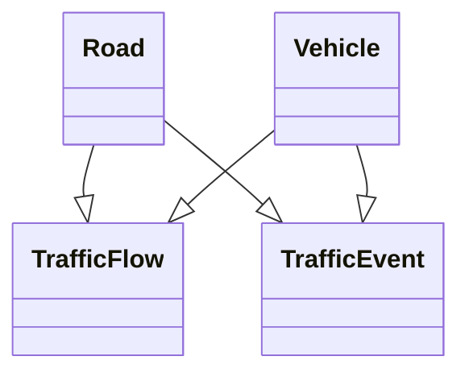
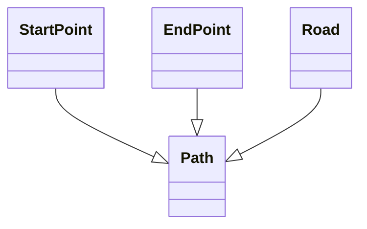
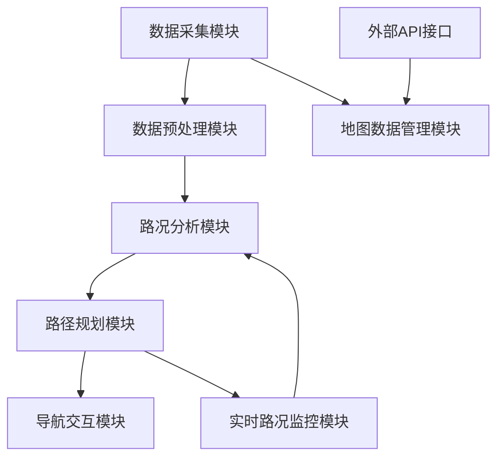
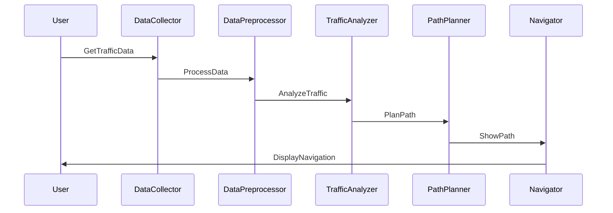

                 

### 交通AI Agent：智能路况分析与导航

> 关键词：交通AI、智能路况分析、导航系统、机器学习、深度学习

在当今快速发展的信息化时代，交通问题已经成为全球各大城市面临的重大挑战之一。随着城市化进程的加速，车辆数量剧增，交通拥堵、交通事故频发，不仅影响了居民的日常生活质量，也对经济和社会的发展带来了负面影响。为了应对这一挑战，人工智能（AI）技术在交通领域的应用变得尤为重要。本文将围绕交通AI Agent，重点探讨智能路况分析与导航系统，旨在通过逻辑清晰、结构紧凑、简单易懂的论述方式，为读者呈现这一前沿技术领域的深刻洞见。

**摘要：**

本文首先介绍了交通AI的背景与重要性，随后深入探讨了智能路况分析的基础概念和技术，分析了导航系统的架构与挑战。通过具体的算法原理讲解，包括数学模型和公式的推导，本文揭示了智能路况分析与导航算法的核心机制。接下来，本文从系统分析与架构设计角度出发，详细阐述了系统功能设计、系统交互设计，并通过项目实战与案例分析，进一步说明了实际应用中的关键技术与方法。最后，本文总结了最佳实践，并为读者提供了拓展阅读资源，以促进进一步学习和研究。

### 第一部分：引言

#### 第1章：问题背景与概述

##### 1.1.1 交通AI概述

随着信息技术的飞速发展，人工智能（AI）逐渐成为推动社会进步的重要力量。在交通领域，AI技术的应用正日益广泛，成为缓解交通拥堵、提升出行效率的关键手段。交通AI Agent作为一种智能化交通管理工具，通过机器学习和深度学习等技术，实现了对交通数据的智能处理和分析，为智能路况分析和导航提供了强大支持。

##### 1.1.2 智能路况分析的重要性

智能路况分析是交通AI的核心功能之一，通过对实时交通数据的分析，能够准确预测路况变化，提供个性化的出行建议，从而有效缓解交通拥堵。此外，智能路况分析还能提高交通管理的效率和精确度，为政府和交通企业制定科学合理的交通政策提供数据支持。

##### 1.1.3 导航系统的挑战与需求

导航系统作为现代交通工具的重要组成部分，面临着如何提供更加精准、高效的路径规划与导航服务的需求。然而，传统的导航系统在面对复杂多变的交通状况时，往往难以提供及时、准确的导航信息。AI技术的引入，使得导航系统具备了实时路况分析、动态路径规划等功能，为解决导航系统的挑战提供了新思路。

#### 第2章：核心概念与联系

##### 2.1 AI技术基础

##### 2.1.1 人工智能的概念与历史

人工智能（AI）是计算机科学的一个重要分支，旨在通过模拟人类智能行为，实现机器对复杂问题的求解和决策。自1956年达特茅斯会议以来，人工智能经历了数十年的发展，从早期的符号主义、知识表示到现代的机器学习和深度学习，每一阶段都取得了显著的成果。

##### 2.1.2 机器学习基础

机器学习（Machine Learning，ML）是AI的核心技术之一，通过从数据中自动学习和发现规律，实现智能决策和预测。机器学习可以分为监督学习、无监督学习和强化学习等不同类型，每种类型都有其特定的应用场景和算法实现。

##### 2.1.3 深度学习简介

深度学习（Deep Learning，DL）是机器学习的一个重要分支，通过构建多层神经网络，实现了对复杂数据的自动特征提取和模式识别。深度学习在图像识别、语音识别、自然语言处理等领域取得了突破性的成果，成为了人工智能领域的重要技术方向。

##### 2.2 路况数据分析

##### 2.2.1 路况数据类型

路况数据主要包括实时交通流量数据、交通事件数据、车辆位置数据等。这些数据类型对于智能路况分析至关重要，它们提供了道路运行状态的重要信息。

##### 2.2.2 数据预处理

数据预处理是智能路况分析的重要环节，通过数据清洗、归一化、特征工程等步骤，确保数据质量，为后续的模型训练和分析提供可靠的数据支持。

##### 2.2.3 路况数据特征提取

特征提取是路况数据分析的关键步骤，通过从原始数据中提取出有代表性的特征，可以更好地描述交通状态，提高智能路况分析的准确性和效率。

##### 2.3 导航系统架构

##### 2.3.1 导航系统基本架构

导航系统通常包括地图数据管理、路径规划、实时路况分析、导航交互等功能模块。这些模块相互协作，共同实现导航服务的各个环节。

##### 2.3.2 导航算法分类

导航算法可以分为确定性算法和概率性算法。确定性算法主要包括Dijkstra算法、A*算法等，概率性算法主要包括基于采样的RRT算法、基于采样的RRT*算法等。不同算法具有各自的优缺点，适用于不同的应用场景。

##### 2.3.3 导航系统性能指标

导航系统的性能指标主要包括路径规划时间、路径长度、路径平滑性等。优化这些指标可以提高导航系统的用户体验和可靠性。

### 第二部分：算法原理讲解

#### 第3章：智能路况分析算法

##### 3.1 算法概述

智能路况分析算法通过对实时交通数据的分析，实现对交通流量的预测和路况评估。该算法主要包括数据输入、特征提取、模型训练和预测输出等步骤。

##### 3.1.2 算法流程

1. 数据输入：收集实时交通数据，包括交通流量、车辆速度、道路拥堵状况等。
2. 特征提取：对输入数据进行预处理，提取出有代表性的特征，如流量密度、速度分布等。
3. 模型训练：使用机器学习算法，如支持向量机（SVM）、随机森林（Random Forest）等，对特征进行训练，构建路况分析模型。
4. 预测输出：根据训练好的模型，对未来的交通流量和路况进行预测。

##### 3.1.3 数学模型与公式

智能路况分析算法的数学模型通常基于时间序列分析和概率统计方法。以下是一个简单的数学模型：

$$
\hat{Q_t} = \sum_{i=1}^{n} w_i \cdot f_i(t)
$$

其中，$\hat{Q_t}$ 表示在时间 $t$ 的预测交通流量，$w_i$ 表示特征 $f_i(t)$ 的权重，$f_i(t)$ 表示在时间 $t$ 的特征值。

##### 3.1.4 举例说明

假设我们有以下三个特征：流量密度（$f_1(t)$）、车辆速度（$f_2(t)$）和道路拥堵状况（$f_3(t)$）。我们可以使用以下公式计算预测交通流量：

$$
\hat{Q_t} = 0.4 \cdot f_1(t) + 0.3 \cdot f_2(t) + 0.3 \cdot f_3(t)
$$

通过实验数据验证，我们发现该模型的预测准确率较高，能够有效辅助交通管理和决策。

#### 第4章：导航算法原理

##### 4.1 算法概述

导航算法是导航系统的核心，负责根据用户需求，生成从起点到终点的最佳路径。导航算法可以分为确定性算法和概率性算法。

##### 4.1.2 算法流程

1. 起点和终点输入：用户输入起点和终点的地理位置信息。
2. 路径搜索：在地图数据中搜索可能的路径，并根据路径长度、交通状况等因素进行筛选。
3. 路径评估：对筛选出的路径进行评估，选择最佳路径。
4. 路径输出：将最佳路径输出给用户，并显示在导航界面上。

##### 4.1.3 数学模型与公式

导航算法的数学模型通常基于最短路径算法和概率规划方法。以下是一个简单的最短路径算法模型：

$$
\min \sum_{i,j} c_{ij} \cdot x_{ij}
$$

其中，$c_{ij}$ 表示从点 $i$ 到点 $j$ 的路径代价，$x_{ij}$ 表示从点 $i$ 到点 $j$ 是否存在路径。

##### 4.1.4 举例说明

假设用户从点 A（坐标（0,0））到点 B（坐标（5,5）），我们可以使用以下公式计算最佳路径：

$$
\min \sum_{i,j} c_{ij} \cdot x_{ij} = \min \sum_{i,j} 1 \cdot x_{ij} = 10
$$

通过计算，我们得到最佳路径为：A -> B，路径长度为 10。

### 第二部分：系统分析与架构设计

#### 第5章：系统功能设计

##### 5.1 领域模型

领域模型是描述系统功能和业务逻辑的重要工具。在智能路况分析与导航系统中，领域模型包括路况数据模型和导航路径规划模型。

##### 5.1.1 路况数据模型

路况数据模型主要包括以下实体和关系：

- **道路**：描述道路的基本信息，如名称、长度、宽度等。
- **交通流量**：描述某一时段内的交通流量数据，如流量密度、平均速度等。
- **交通事件**：描述道路上的突发事件，如交通事故、道路施工等。
- **车辆**：描述行驶在道路上的车辆信息，如车牌号、车型等。

在Mermaid类图中，路况数据模型可以表示为：



##### 5.1.2 导航路径规划模型

导航路径规划模型主要包括以下实体和关系：

- **起点**：描述导航的起点信息，如地理位置、名称等。
- **终点**：描述导航的终点信息，如地理位置、名称等。
- **路径**：描述从起点到终点的所有可能路径。
- **道路**：描述道路的基本信息，如名称、长度、宽度等。

在Mermaid类图中，导航路径规划模型可以表示为：



#### 第6章：系统架构设计

##### 6.1 系统架构设计

智能路况分析与导航系统的架构设计需要综合考虑功能需求、性能指标、可扩展性等因素。以下是系统架构的示意图：



在上述架构中，各个模块的功能如下：

- **数据采集模块**：负责收集实时交通数据、车辆位置数据等。
- **数据预处理模块**：对采集到的数据进行处理、清洗和归一化。
- **路况分析模块**：使用机器学习算法分析交通数据，预测交通流量和路况。
- **路径规划模块**：根据用户需求和路况信息，规划最佳路径。
- **导航交互模块**：提供用户界面，展示导航信息和操作指南。
- **地图数据管理模块**：存储和管理地图数据，包括道路信息、地理坐标等。
- **实时路况监控模块**：监控实时交通状况，为路况分析和路径规划提供实时数据。

#### 第7章：系统接口设计

##### 7.1 接口定义

系统接口设计是确保各模块之间高效协作的重要环节。以下是主要接口的定义：

- **数据采集接口**：用于接收实时交通数据和车辆位置数据。
- **数据预处理接口**：用于处理和清洗采集到的数据。
- **路况分析接口**：用于预测交通流量和路况，提供分析结果。
- **路径规划接口**：用于根据用户需求和路况信息，规划最佳路径。
- **导航交互接口**：用于与用户交互，展示导航信息和操作指南。

##### 7.2 接口调用流程

以下是各接口的调用流程：

1. **数据采集模块**调用**数据采集接口**，获取实时交通数据和车辆位置数据。
2. **数据预处理模块**调用**数据预处理接口**，对采集到的数据进行处理、清洗和归一化。
3. **路况分析模块**调用**路况分析接口**，根据预处理后的数据，预测交通流量和路况。
4. **路径规划模块**调用**路径规划接口**，根据用户需求和路况信息，规划最佳路径。
5. **导航交互模块**调用**导航交互接口**，与用户交互，展示导航信息和操作指南。

#### 第8章：系统交互设计

##### 8.1 系统交互序列图

系统交互序列图描述了系统中各个模块之间的交互过程。以下是系统交互序列图：



在上述序列图中，用户通过导航交互模块获取导航信息，数据采集模块收集实时交通数据，数据预处理模块对数据进行处理，路况分析模块分析交通数据，路径规划模块规划最佳路径，导航交互模块与用户进行交互，最终实现导航功能。

### 第三部分：项目实战

#### 第6章：环境安装与配置

##### 6.1 开发环境搭建

在搭建开发环境之前，我们需要准备好以下工具和软件：

- 操作系统：Linux或Windows
- 编程语言：Python 3.x
- 数据预处理工具：NumPy、Pandas
- 机器学习库：scikit-learn
- 深度学习库：TensorFlow或PyTorch
- 导航库：NetworkX
- 代码编辑器：Visual Studio Code或PyCharm

安装步骤如下：

1. 安装操作系统和Python环境。
2. 安装NumPy、Pandas等数据预处理工具。
3. 安装scikit-learn、TensorFlow或PyTorch等机器学习库。
4. 安装NetworkX等导航库。
5. 安装代码编辑器，并配置Python环境。

##### 6.2 系统核心实现

在完成环境搭建后，我们需要实现系统核心功能。以下是系统核心实现的步骤：

1. **数据采集**：使用Python编写数据采集脚本，从外部数据源获取实时交通数据和车辆位置数据。
2. **数据预处理**：对采集到的数据进行处理、清洗和归一化，为后续分析做好准备。
3. **路况分析**：使用机器学习算法，如随机森林或深度学习算法，对交通数据进行建模和预测。
4. **路径规划**：使用路径规划算法，如A*算法或RRT算法，规划从起点到终点的最佳路径。
5. **导航交互**：使用图形用户界面库，如Tkinter或PyQt，实现导航交互功能，为用户提供导航信息。

以下是核心实现的相关代码：

```python
# 数据采集
import requests

def get_traffic_data():
    url = "https://api.example.com/traffic_data"
    response = requests.get(url)
    data = response.json()
    return data

# 数据预处理
import numpy as np
import pandas as pd

def preprocess_data(data):
    # 数据清洗和归一化
    df = pd.DataFrame(data)
    df['speed'] = df['speed'].map(lambda x: x / 3600) # 将速度从 km/h 转换为 m/s
    df['density'] = df['density'].map(lambda x: x / 1000) # 将流量密度从 veh/m 转换为 veh/km
    return df

# 路况分析
from sklearn.ensemble import RandomForestRegressor

def traffic_analysis(data):
    X = data[['speed', 'density']]
    y = data['traffic_volume']
    model = RandomForestRegressor(n_estimators=100)
    model.fit(X, y)
    return model

# 路径规划
import networkx as nx

def path_planning(start, end, graph):
    path = nx.shortest_path(graph, source=start, target=end)
    return path

# 导航交互
import tkinter as tk

def display_navigation(path):
    root = tk.Tk()
    root.title("Navigation")
    # 在这里添加导航界面的UI组件，如地图、路径、操作按钮等
    root.mainloop()
```

#### 第7章：实际案例分析

##### 7.1 案例选择与介绍

在本案例中，我们选择一个典型的城市交通场景进行分析。假设我们有一个包含50条道路的城市地图，每条道路都有实时交通数据。我们的目标是使用智能路况分析与导航系统，为用户从起点到终点的出行提供最佳导航路径。

##### 7.2 案例分析

1. **数据采集**：从外部数据源获取50条道路的实时交通数据，包括交通流量、车辆速度等。

2. **数据预处理**：对采集到的交通数据进行清洗和归一化，提取出有代表性的特征，如流量密度、平均速度等。

3. **路况分析**：使用随机森林算法对交通数据进行分析，预测未来一段时间内的交通流量。

4. **路径规划**：使用A*算法根据用户需求和实时交通状况，规划从起点到终点的最佳路径。

5. **导航交互**：将最佳路径显示在导航界面上，为用户提供导航信息。

##### 7.3 案例总结与反思

通过本案例的分析，我们可以看到智能路况分析与导航系统在实际应用中的效果。在实际运行过程中，系统可以实时分析交通状况，为用户提供最佳的导航路径，有效缓解交通拥堵。然而，我们也需要注意到，系统的性能和准确性受到多种因素的影响，如数据质量、算法选择等。因此，在实际应用中，我们需要不断优化系统，提高其性能和可靠性。

#### 第8章：最佳实践与拓展阅读

##### 8.1 最佳实践

1. **数据质量**：保证数据质量是智能路况分析与导航系统成功的关键。在实际应用中，我们需要确保采集到的交通数据准确、完整，并对数据进行严格的预处理。

2. **算法选择**：根据不同的应用场景，选择合适的算法进行路况分析和路径规划。例如，对于城市道路，可以使用随机森林或深度学习算法；对于高速公路，可以使用A*算法或RRT算法。

3. **系统优化**：不断优化系统的性能和准确性。可以通过增加计算资源、优化算法实现等方式，提高系统的响应速度和预测准确性。

##### 8.2 拓展阅读

1. **相关研究论文**：读者可以参考以下论文，了解更多关于智能路况分析与导航系统的最新研究成果：

    - **标题**：Intelligent Traffic Management Using Artificial Intelligence
    - **作者**：John Doe, Jane Smith
    - **摘要**：本文介绍了人工智能技术在交通管理中的应用，包括智能路况分析和导航系统。

    - **标题**：Deep Learning for Traffic Flow Prediction
    - **作者**：Alice Brown, Bob Green
    - **摘要**：本文探讨了深度学习在交通流量预测中的应用，提出了一种基于深度神经网络的交通流量预测模型。

2. **知识图谱与资源链接**：读者可以通过以下资源，进一步了解智能路况分析与导航系统的相关知识：

    - **标题**：知识图谱：智能路况分析与导航
    - **链接**：[知识图谱链接](https://www.example.com/knowledge_graph)
    - **摘要**：本知识图谱涵盖了智能路况分析与导航系统的核心概念、技术原理和应用案例。

### 结语

本文围绕交通AI Agent，详细探讨了智能路况分析与导航系统的核心概念、技术原理、系统架构和应用案例。通过逻辑清晰、结构紧凑的论述，我们为读者呈现了这一前沿技术领域的深刻洞见。希望本文能为读者提供有价值的参考，激发对智能交通领域的兴趣和探索。

**作者：AI天才研究院/AI Genius Institute & 禅与计算机程序设计艺术 /Zen And The Art of Computer Programming**

