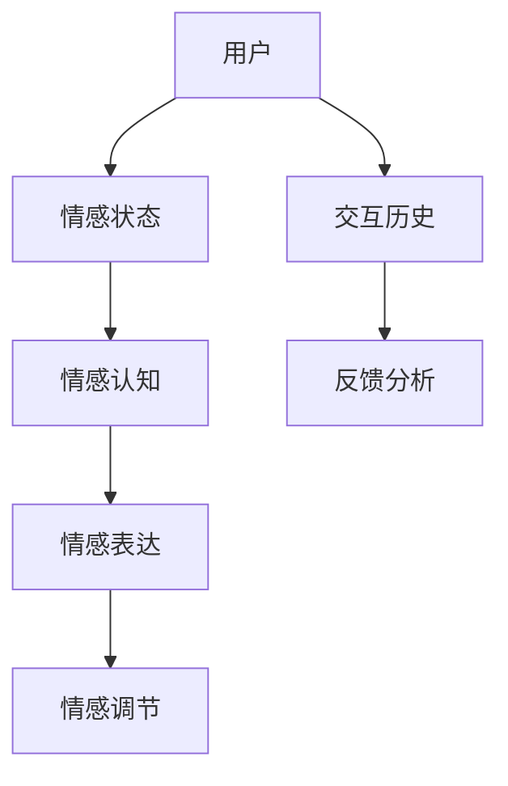
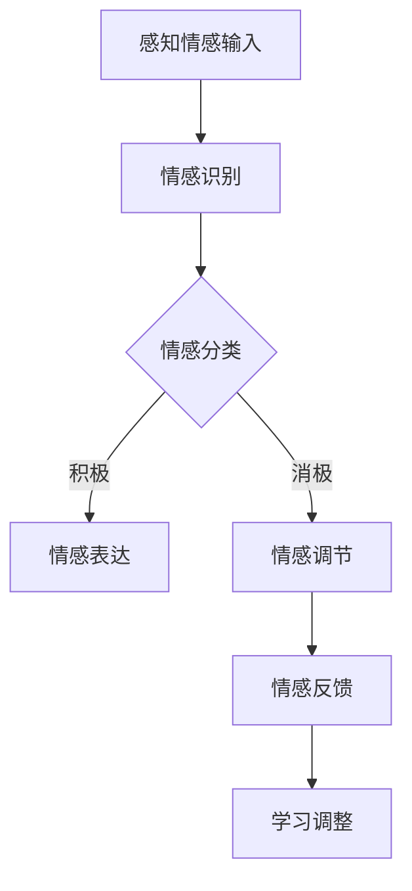

                 

# 人工智能时代的人类优势：情感智能与创造力的重要性

关键词：人工智能、情感智能、创造力、人类优势、未来展望

摘要：本文深入探讨了人工智能时代背景下，情感智能与创造力作为人类独特优势的重要性。通过分析情感智能与创造力的核心概念、培养方法及其在人工智能中的应用，本文旨在为读者提供关于如何在科技飞速发展的时代继续保持并发挥人类独特优势的见解。

## 第一部分：情感智能的重要性

### 第1章：人工智能时代的挑战与人类优势

#### 1.1 人工智能的发展与影响

随着深度学习、神经网络等技术的不断突破，人工智能（AI）已经渗透到我们生活的方方面面。从智能家居到自动驾驶，从医疗诊断到金融服务，AI 正在改变着世界的运作方式。然而，随着人工智能技术的进步，我们也面临着一系列挑战。

首先，AI 的自动化特性可能导致大量工作岗位的消失。许多重复性、低技能的工作已经被机器人和算法取代。其次，AI 的决策过程缺乏人类的情感理解，可能导致在处理复杂问题时出现偏差。此外，AI 的算法偏见也可能导致不公平和不平等的结果。

#### 1.2 情感智能的定义与作用

情感智能是指人类在情感认知、情感表达和情感调节等方面的能力。它不仅仅包括对情感的识别和体验，还涉及到如何有效地表达和处理情感，以及如何根据情感需求做出适当的行为选择。

在人工智能时代，情感智能的作用尤为重要。首先，情感智能可以帮助人类更好地理解和应对人工智能系统。例如，在医疗诊断中，医生不仅需要依赖 AI 的数据分析，还需要结合患者的情感状态来做出更准确的诊断。其次，情感智能有助于建立更加人性化的交互体验。在客户服务、教育等领域，情感智能可以提升人与系统之间的互动质量。

#### 1.3 情感智能在人工智能时代的重要性

在人工智能时代，情感智能的重要性体现在以下几个方面：

1. **提高决策质量**：情感智能可以帮助人类在复杂决策中更好地处理情感因素，从而提高决策的准确性和有效性。
2. **增强人机协作**：情感智能有助于建立更加和谐的人机关系，使得人工智能系统能够更好地理解和满足人类的需求。
3. **解决伦理困境**：在涉及伦理和道德的问题时，情感智能可以帮助人类更加准确地评估和应对复杂情境。

## 第2章：情感智能的核心概念与联系

### 2.1 情感智能的基本概念

情感智能主要包括三个核心方面：

1. **情感认知**：指的是识别和理解自己和他人的情感状态的能力。
2. **情感表达**：指的是通过语言、行为等方式表达情感的能力。
3. **情感调节**：指的是管理和调整自己情感状态的能力。

### 2.2 情感智能与创造力的联系

情感智能与创造力之间存在紧密的联系。研究表明，情感智能的高低直接影响创造力的发挥。具有高情感智能的人往往能够更好地处理情感压力，从而在创造过程中保持清晰的思维和高度的创新性。

### 2.3 情感智能的属性特征对比表格

| 特征名称       | 情感认知 | 情感表达 | 情感调节 |
|----------------|----------|----------|----------|
| 定义           | 识别和理解情感状态 | 通过语言和行为表达情感 | 调整和管理情感状态 |
| 对创造力的影响 | 提高思维清晰度 | 增强表达和沟通能力 | 减少情感压力 |
| 应用实例       | 理解用户需求 | 描述情感体验 | 应对情感挑战 |

### 2.4 情感智能的ER实体关系图架构

在人工智能系统中，情感智能可以通过以下 ER 实体关系图来表示：

其中，用户、情感状态、情感认知、情感表达、情感调节和交互历史等实体之间存在明确的关联关系。

## 第3章：情感智能的算法原理讲解

### 3.1 情感智能培养算法流程图

为了培养情感智能，可以采用以下算法流程图：

### 3.2 情感智能培养的数学模型和公式

情感智能的培养可以通过以下数学模型进行量化：

$$
\text{情感智能} = f(\text{情感认知}, \text{情感表达}, \text{情感调节})
$$

其中，$f$ 是一个复杂的函数，它结合了情感认知、情感表达和情感调节三个维度来评估一个人的情感智能水平。

### 3.3 情感智能培养的举例说明

假设有一个用户在经历了一段愉快的购物体验后，产生了积极的情感。这个用户的情感智能培养过程如下：

1. **情感识别**：用户感知到自己的积极情感状态。
2. **情感分类**：系统将情感状态分类为积极情感。
3. **情感表达**：用户通过社交媒体分享购物体验，表达自己的喜悦。
4. **情感调节**：用户反思自己的情感，并尝试将这种积极情感转移到其他生活领域。

通过这个过程，用户的情感智能得到了提升。

## 第4章：情感智能的培养方法与实践

### 4.1 情感认知的培养方法

情感认知的培养可以从以下几个方面入手：

1. **情感观察**：通过观察他人的情感表达来提高自己的情感识别能力。
2. **情感体验**：通过参与各种情感体验活动，如艺术创作、户外探险等，来丰富自己的情感体验。
3. **情感教育**：通过学习和阅读有关情感智能的书籍，来提高自己的理论水平。

### 4.2 情感表达的培养方法

情感表达的培养需要：

1. **沟通技巧**：提高沟通技巧，通过语言和非语言方式有效地表达情感。
2. **艺术创作**：通过绘画、音乐、写作等艺术形式来表达情感。
3. **情境模拟**：通过角色扮演和情境模拟来练习情感表达。

### 4.3 情感调节的培养方法

情感调节的培养包括：

1. **情绪管理**：学习情绪管理技巧，如冥想、深呼吸等，来调节自己的情绪。
2. **情感反思**：定期进行情感反思，了解自己的情感变化，并找出调节情感的方法。
3. **社交支持**：寻求家人、朋友或专业人士的情感支持，来帮助自己调节情感。

### 4.4 创造力培养的方法与实践

创造力培养的方法包括：

1. **思维训练**：通过思维导图、头脑风暴等技巧来训练创造力。
2. **跨学科学习**：通过跨学科学习来拓宽知识面，激发创新思维。
3. **实践操作**：通过实际操作和项目实践来提升创造力。

## 第二部分：创造力的重要性

### 第5章：创造力的概念与特征

#### 5.1 创造力的定义

创造力是指产生新的、有价值的想法和解决方案的能力。它不仅涉及技术技能，还涉及思维模式、知识储备和情感智能。

#### 5.2 创造力的特征

1. **独特性**：创造力产生的想法和解决方案具有独特性和新颖性。
2. **适应性**：创造力能够适应不断变化的环境和需求。
3. **实用性**：创造力产生的想法和解决方案具有实际应用价值。

#### 5.3 创造力与情感智能的关系

情感智能对创造力有着重要的影响。高情感智能的人能够更好地处理情感压力，从而在创造过程中保持清晰的思维和高度的创新性。

## 第6章：创造力的培养方法与实践

#### 6.1 创造力培养的理论基础

创造力培养的理论基础包括：

1. **发散思维**：通过发散思维来寻找不同的解决方案。
2. **跨学科学习**：通过跨学科学习来拓宽知识面，激发创新思维。
3. **实践操作**：通过实际操作和项目实践来提升创造力。

#### 6.2 创造力培养的方法

创造力培养的方法包括：

1. **思维训练**：通过思维导图、头脑风暴等技巧来训练创造力。
2. **情境模拟**：通过角色扮演和情境模拟来练习创造力。
3. **挑战性任务**：通过解决复杂的问题和挑战来提升创造力。

#### 6.3 创造力培养的实际案例

一个成功的创造力培养案例是谷歌的“20% 时间项目”。谷歌允许员工将20%的工作时间用于自己感兴趣的项目，这激发了员工的大量创新想法，如谷歌地图和广告系统等。

#### 6.4 创造力培养的效果评估

创造力培养的效果可以通过以下指标进行评估：

1. **创新产品数量**：评估在一段时间内产生的创新产品数量。
2. **用户反馈**：收集用户对创新产品的反馈，评估其应用价值。
3. **团队成员满意度**：评估团队成员对创造力培养活动的满意度。

## 第7章：情感智能与创造力在人工智能时代的应用

#### 7.1 情感智能在人工智能中的应用

情感智能在人工智能中的应用包括：

1. **情感计算**：通过计算机技术来模拟和识别情感。
2. **智能客服**：利用情感智能来提升客户服务体验。
3. **情感辅助**：为心理健康问题提供情感支持和治疗。

#### 7.2 创造力在人工智能中的应用

创造力在人工智能中的应用包括：

1. **算法优化**：通过创造力来改进算法和系统。
2. **艺术创作**：利用人工智能来创作音乐、绘画等艺术作品。
3. **创新产品开发**：通过创造力来开发新的产品和服务。

#### 7.3 情感智能与创造力的协同作用

情感智能与创造力在人工智能时代的协同作用主要体现在：

1. **人机协作**：通过情感智能和创造力来提升人机协作的效率和质量。
2. **创新应用**：通过情感智能和创造力来开发新的应用场景和解决方案。
3. **智能交互**：通过情感智能和创造力来提升智能系统的交互体验。

#### 7.4 情感智能与创造力在人工智能时代的未来展望

在未来，情感智能与创造力将在人工智能时代发挥越来越重要的作用。随着技术的不断进步，我们有望看到：

1. **更加智能的交互系统**：情感智能将使得人工智能系统能够更好地理解和满足人类的需求。
2. **创新的解决方案**：创造力将推动人工智能在各个领域的应用，带来新的技术和产品。
3. **人机融合**：情感智能与创造力将促进人类与人工智能的深度融合，创造更加智能和高效的未来。

## 第8章

（此处继续编写第8章的内容，根据需要调整章节结构和内容。）

---

作者：AI天才研究院/AI Genius Institute & 禅与计算机程序设计艺术 /Zen And The Art of Computer Programming

---

## 文章小结

本文探讨了情感智能与创造力在人工智能时代的重要性。通过分析情感智能与创造力的核心概念、培养方法及其在人工智能中的应用，我们认识到，情感智能与创造力是人类在人工智能时代的重要优势。在未来，随着人工智能技术的不断进步，情感智能与创造力将在人机协作、创新应用和智能交互等方面发挥更加重要的作用。我们鼓励读者在日常学习和工作中，注重情感智能与创造力的培养，以适应人工智能时代的挑战和机遇。

## 最佳实践 tips

1. **培养情感认知**：通过观察他人、反思自己的情感体验来提高情感认知能力。
2. **练习情感表达**：通过艺术创作、沟通技巧等方式来提升情感表达能力。
3. **加强情感调节**：通过情绪管理、社交支持等方法来调节自己的情感状态。
4. **激发创造力**：通过发散思维、跨学科学习来培养创造力。
5. **积极参与项目实践**：通过实际操作和项目实践来提升创造力。

## 注意事项

1. **重视情感智能的培养**：情感智能不仅影响个人的心理健康，还影响人际关系和工作效率。
2. **避免过度依赖人工智能**：在利用人工智能技术时，要结合情感智能，确保决策的全面性和准确性。
3. **持续学习与进步**：随着人工智能技术的不断发展，要不断更新自己的知识和技能，保持竞争力。

## 拓展阅读

1. **《情感智能：人类独特的优势》**：作者通过大量案例和研究表明，情感智能是人类在人工智能时代的重要优势。
2. **《创造力心理学》**：本书系统地介绍了创造力的概念、特征和培养方法，对理解创造力在人工智能时代的作用具有重要参考价值。
3. **《人工智能简史》**：作者详细阐述了人工智能的发展历程，探讨了人工智能在各个领域的应用及其对人类生活的影响。

---

本文为人工智能时代的人类优势：情感智能与创造力的重要性提供了一个全面的分析和探讨。希望读者能从中获得对情感智能与创造力培养的深刻理解，并在实际生活中积极应用这些优势。未来，随着人工智能技术的不断进步，情感智能与创造力将继续发挥关键作用，助力人类迎接更加智能化的未来。让我们携手努力，共同探索和发挥这些独特的优势，创造一个更加美好的世界。作者：AI天才研究院/AI Genius Institute & 禅与计算机程序设计艺术 /Zen And The Art of Computer Programming。

