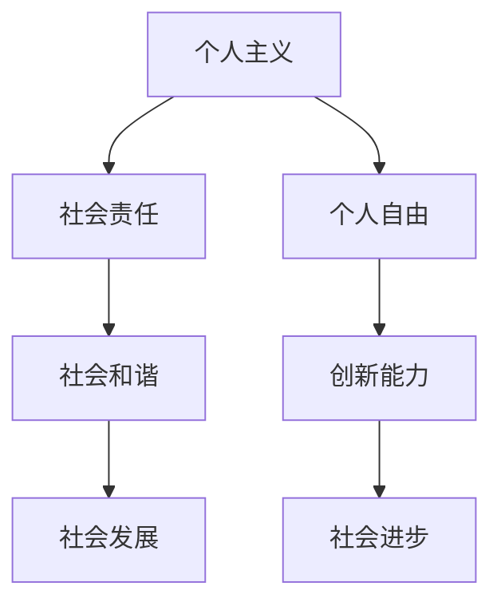
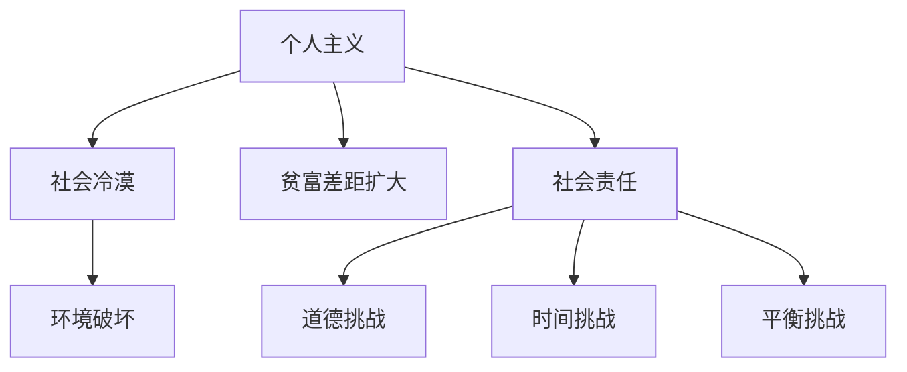
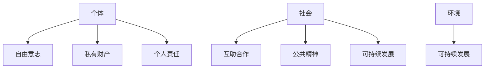
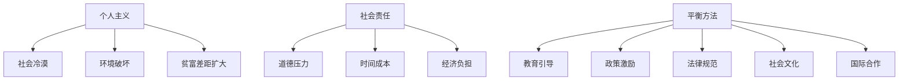

                 

### 从个人主义到社会责任：重新定义现代公民角色

> 关键词：个人主义、社会责任、现代公民角色、教育改革、政策引导、社会文化

> 摘要：本文深入探讨了个人主义与社会责任在现代公民角色中的辩证关系。通过分析个人主义与社会责任的基本原理，对比两者的核心概念，本文提出重新定义现代公民角色的必要性和方法。本文旨在为读者提供一种新的视角，以理解和解决现代社会面临的诸多挑战。

## 第一部分：问题背景

### 1.1.1.1 问题背景

在现代社会，个人主义与社会责任之间的矛盾日益凸显。个人主义强调个体的独立、自由和追求个人利益，而社会责任则强调个人应当对他人、社会和环境承担责任。这种矛盾导致了诸多社会问题的出现，如社会冷漠、环境破坏、贫富差距扩大等。

个人主义的基本原理在于尊重个体自由，认为每个人都应当有权自由地追求自己的利益。然而，这种理念在现代社会中引发了一系列问题。首先，过度追求个人利益可能导致社会冷漠。当个人只关注自己的利益，忽视了他人的需求和福祉，社会关系将变得疏离，社会凝聚力减弱。其次，环境破坏也是个人主义的一个副作用。个人追求短期经济利益，往往忽视了环境保护的重要性，导致环境污染和资源枯竭。最后，个人主义也可能导致贫富差距扩大。当个人追求高收入和物质财富时，社会资源分配的不均会导致贫富差距的加剧。

### 1.1.1.2 问题描述

现代公民角色在个人主义与社会责任之间面临着选择。一方面，个人主义使得人们追求个人利益，忽视了对社会和环境的责任。另一方面，社会责任要求人们关注社会问题，但这也可能限制了个人自由和追求个人利益。

这种选择困境使得现代公民角色变得复杂。个人如何在追求个人利益的同时，承担起对社会的责任？如何平衡个人自由与社会责任之间的关系？这是一个需要深入探讨的问题。

### 1.1.1.3 问题解决

为了解决这一矛盾，需要重新定义现代公民角色，使其既能够追求个人利益，又能够承担社会责任。这需要从教育、政策和社会文化等多个方面进行改革，培养具有社会责任感的个人。

首先，教育是培养个人社会责任感的重要途径。学校应当加强公民教育，引导学生关注社会问题，培养他们的社会责任感。通过社会实践活动，学生可以亲身体验社会责任的重要性，从而树立正确的价值观。

其次，政策引导也是关键。政府可以通过制定相关政策，鼓励个人积极参与社会事务，承担社会责任。例如，政府可以提供税收优惠、奖金等措施，激励个人参与慈善活动、志愿服务等。

最后，社会文化也起到重要作用。一个重视社会责任的社会文化能够激发个人的责任意识。媒体应当积极宣传社会责任的重要性，树立典型人物，营造良好的社会氛围。

### 1.1.1.4 边界与外延

公民角色的重新定义不仅涉及个人，还包括家庭、社区、国家和全球等不同层面。因此，重新定义现代公民角色是一个多维度的、复杂的任务。

个人层面的公民角色要求个人关注自己的行为对他人和社会的影响，积极参与社会事务，承担社会责任。家庭层面的公民角色要求个人在家庭中发挥积极作用，关心家庭成员的福祉，培养良好的家庭文化。社区层面的公民角色要求个人积极参与社区建设，维护社区和谐，为社区的发展贡献力量。国家层面的公民角色要求个人关注国家利益，为国家的发展和安全贡献力量。全球层面的公民角色要求个人关注全球性问题，如气候变化、贫富差距等，为全球的和平与发展贡献力量。

### 1.1.1.5 概念结构与核心要素组成

重新定义现代公民角色的核心要素包括：个体自我意识、社会责任感、合作精神、环保意识、公民参与和公共精神。这些要素构成了现代公民角色的基本框架，为个人在社会中扮演积极角色提供了指导。

个体自我意识是指个人对自身价值和角色的认识。一个具有个体自我意识的人能够明确自己的价值观和目标，为自己的行为负责。

社会责任感是指个人对他人、社会和环境所承担的责任。具有社会责任感的人会关注社会问题，积极参与社会事务，为社会的进步和发展贡献力量。

合作精神是指个人在团队合作中发挥积极作用，与他人共同解决问题。具有合作精神的人能够尊重他人，倾听他人意见，共同实现目标。

环保意识是指个人对环境保护的认识和行动。具有环保意识的人会关注环境问题，积极参与环保活动，为可持续发展贡献力量。

公民参与是指个人积极参与社会事务，为社会的决策和管理提供意见和建议。具有公民参与精神的人会关注公共事务，积极参与社会活动，为社会的进步贡献力量。

公共精神是指个人对公共利益的关注和贡献。具有公共精神的人会关注公共问题，为公共利益而努力，推动社会的和谐与发展。

## 1.2 核心概念与联系

### 1.2.1 个人主义与社会责任

个人主义强调个体的独立、自由和追求个人利益，而社会责任则强调个人应当对他人、社会和环境承担责任。两者之间的关系是对立统一的，个人主义与社会责任并非完全对立，而是相互补充和平衡。

个人主义强调个体的自由和独立性，鼓励个人追求自己的目标和利益。然而，个人主义并不意味着完全忽视社会责任。一个健康的个人主义应当允许个人在追求个人利益的同时，也能够关注社会和环境的利益。

社会责任则强调个人对社会的责任和义务。社会责任不仅仅是对社会的付出，也是对个体自身的保护。一个有社会责任感的人，不仅能够为社会作出贡献，也能够在个人利益和社会责任之间找到平衡。

### 1.2.2 现代公民角色

现代公民角色是指个人在社会中扮演的角色，既包括追求个人利益，又包括承担社会责任。它是对传统公民角色的扩展和更新，更符合现代社会的要求。

传统公民角色主要强调个人的义务和责任，如纳税、服兵役等。而现代公民角色则更加注重个人的权利和责任。现代公民不仅应当履行自己的义务，还应当积极参与社会事务，为社会的进步和发展贡献力量。

### 1.2.3 公民参与与社会责任

公民参与是公民承担社会责任的一种体现，通过参与社会事务，个人能够对社会产生积极影响。公民参与与社会责任之间存在着密切的联系，公民参与是社会责任的具体表现。

公民参与可以通过多种形式实现，如投票、参与社会公益活动、参与社区管理等。通过这些形式，个人能够直接参与社会事务，为社会的决策和管理提供意见和建议。

公民参与不仅能够增强个人的社会责任感，也能够促进社会的和谐与发展。一个积极参与社会的公民，不仅能够为社会的进步贡献力量，也能够提升自身的价值。

### 1.2.4 个人主义与社会责任的辩证关系

个人主义与社会责任并非完全对立，而是相互补充和平衡的关系。个人主义强调个体的自由和独立性，社会责任则强调个人对社会的责任和义务。两者之间的关系是辩证的，个人主义需要在社会责任的框架下进行，而社会责任也需要在个人主义的背景下实现。

在现代社会，个人主义与社会责任的平衡是实现社会和谐与发展的关键。一个健康的个人主义能够激发个人的创造力和创新能力，推动社会的进步。而社会责任则能够约束个人行为，防止个人主义导致的社会冷漠、环境破坏和贫富差距扩大等问题。

### 1.2.5 个人主义与社会责任的关系图

## 1.3 主流观点与争议

### 1.3.1 个人主义的支持者

个人主义的支持者认为，个人自由和追求个人利益是人类社会发展的基石。他们主张政府应当减少对个人自由的干预，让个人有更多自由去追求自己的梦想和利益。

个人主义的支持者通常来自自由主义和自由市场的理论。他们认为，个人自由是人的基本权利，政府应当尊重和保护个人的自由。他们强调，个人追求个人利益是社会进步的动力，通过竞争和合作，个人能够实现自我价值，推动社会的繁荣。

### 1.3.2 社会责任的支持者

社会责任的支持者认为，个人不仅应当追求个人利益，还应当对他人、社会和环境承担责任。他们主张政府应当加强对个人行为的规范和引导，促进个人承担社会责任。

社会责任的支持者通常来自社会主义和福利主义的理论。他们认为，个人是社会的一部分，个人的利益应当与社会利益相结合。他们强调，社会责任是维护社会和谐、公平和正义的重要手段，通过社会责任，个人能够为社会的繁荣和稳定作出贡献。

### 1.3.3 个人主义与社会责任的平衡

在个人主义与社会责任之间寻找平衡是现代社会的一个重要课题。主流观点认为，应当通过教育、法律和政策等多种手段，促进个人在追求个人利益的同时，也能够承担社会责任。

教育是培养个人社会责任感的重要途径。通过学校教育，学生可以学习到社会责任的重要性，培养他们的社会责任感。法律是规范个人行为的重要工具。通过法律，政府可以明确个人的责任和义务，保护社会的公共利益。政策是引导个人行为的重要手段。通过政策，政府可以鼓励个人积极参与社会事务，承担社会责任。

### 1.3.4 个人主义与社会责任的辩论

个人主义与社会责任的支持者之间存在着激烈的辩论。个人主义的支持者认为，个人自由和追求个人利益是人类社会发展的基石，政府不应过度干预个人行为。社会责任的支持者则认为，个人不仅应当追求个人利益，还应当对他人、社会和环境承担责任，政府应当加强对个人行为的引导和规范。

这场辩论的核心在于如何平衡个人自由与社会责任之间的关系。个人主义的支持者认为，个人自由是社会进步的动力，社会责任的支持者则认为，社会责任是维护社会和谐和正义的重要手段。两种观点都有其合理之处，但也存在一些争议。

### 1.3.5 寻求平衡的路径

为了在个人主义与社会责任之间寻找平衡，可以采取以下几种路径：

1. **教育引导**：通过学校教育，培养学生的社会责任感，让他们在追求个人利益的同时，也关注社会问题。

2. **政策激励**：通过制定相关政策，鼓励个人积极参与社会事务，承担社会责任。

3. **法律规范**：通过法律手段，明确个人的责任和义务，保护社会的公共利益。

4. **社会文化**：通过社会文化的引导，营造一种重视社会责任的氛围，激发个人的责任意识。

5. **国际合作**：在全球化的背景下，个人主义与社会责任的平衡也需要国际合作。通过国际合作，可以共同应对全球性问题，实现个人利益与社会责任的和谐共生。

## 1.4 影响与挑战

### 1.4.1 个人主义对社会的影响

个人主义对社会的影响是复杂而深远的。一方面，个人主义强调个体的独立和自由，激发了人的创造力和创新能力，推动了社会的进步。另一方面，个人主义也带来了一系列社会问题。

首先，个人主义可能导致社会冷漠。当个人只关注自己的利益，忽视了他人的需求和福祉，社会关系将变得疏离，社会凝聚力减弱。其次，个人主义也可能导致环境破坏。个人追求短期经济利益，往往忽视了环境保护的重要性，导致环境污染和资源枯竭。最后，个人主义也可能导致贫富差距扩大。个人追求高收入和物质财富时，社会资源分配的不均会导致贫富差距的加剧。

### 1.4.2 社会责任对个人的挑战

社会责任要求个人关注社会问题，承担起对社会的责任。然而，这也会对个人带来一定的挑战。

首先，社会责任要求个人在追求个人利益的同时，也关注社会利益。这可能会限制个人的自由和追求个人利益的灵活性。其次，社会责任要求个人投入时间和精力参与社会事务，这可能会对个人的工作和生活产生影响。最后，社会责任也要求个人具备一定的社会责任感，这需要个人具备较高的道德素质和价值观。

### 1.4.3 社会责任与个人利益的平衡

如何在社会责任与个人利益之间寻找平衡，是一个复杂的问题。这需要个人、政府和社会共同努力。

对于个人来说，需要树立正确的价值观，明确自己的社会责任。在追求个人利益的同时，也要关注社会利益，积极参与社会事务。

对于政府来说，需要制定合理的政策，引导个人在追求个人利益的同时，也承担起社会责任。例如，可以通过税收优惠、奖金等措施，鼓励个人参与社会公益活动和志愿服务。

对于社会来说，需要营造一种重视社会责任的氛围，激发个人的责任意识。通过媒体宣传、典型人物树立等方式，让社会责任成为社会共识。

### 1.4.4 影响与挑战的关系图

## 1.5 本章小结

本章从问题背景、核心概念与联系、主流观点与争议、影响与挑战等方面，对重新定义现代公民角色进行了全面探讨。通过本章的学习，读者可以了解重新定义现代公民角色的必要性和重要性，为后续章节的学习打下基础。在接下来的章节中，我们将进一步探讨如何通过教育、政策和社会文化等多种手段，实现个人主义与社会责任的和谐共生。

## 第二部分：核心概念原理

### 2.1 个人主义与社会责任的基本原理

#### 2.1.1 个人主义的原理

个人主义强调个体的独立、自由和追求个人利益。其基本原理包括：

- **自由意志**：个人应当有自由选择自己的生活方式和追求个人利益。这是个人主义的核心，认为每个人都应当有权自由地追求自己的梦想和利益。

- **私有财产**：个人的财产应当受到法律保护，个人有权自由支配和使用自己的财产。这是个人主义的基本保障，认为个人的财产权是个人自由的重要体现。

- **个人责任**：个人应当对自己的行为负责，社会不应过度干预个人的日常生活。这是个人主义的道德原则，认为个人应当为自己的行为负责，而不是将责任推卸给社会。

#### 2.1.2 社会责任的原理

社会责任强调个人应当对他人、社会和环境承担责任。其基本原理包括：

- **互助合作**：个人应当在社会中互相帮助，共同解决社会问题。这是社会责任的社会原则，认为个人的利益与社会的利益密切相关，个人的行为应当有利于社会的和谐与发展。

- **公共精神**：个人应当关注社会公共利益，为社会的发展和进步贡献力量。这是社会责任的道德原则，认为个人应当有社会责任感，关注社会的公共利益，为社会的繁荣和稳定作出贡献。

- **可持续发展**：个人应当关注环境问题，推动可持续发展。这是社会责任的环境原则，认为个人应当关注环境保护，为未来的世代留下一个宜居的地球。

### 2.2 个人主义与社会责任的对比表格

| 特征         | 个人主义                          | 社会责任                          |
| ------------ | -------------------------------- | -------------------------------- |
| 核心原则      | 自由意志、私有财产、个人责任      | 互助合作、公共精神、可持续发展      |
| 关注焦点      | 个人自由、个人利益、个人责任      | 社会利益、公共福祉、环境保护      |
| 社会作用      | 激发个体创造力、推动社会进步      | 维护社会和谐、促进社会公平、保护环境 |
| 道德标准      | 个人行为负责、追求个人价值        | 关注社会利益、遵守社会规范、承担社会责任 |

### 2.3 个人主义与社会责任的ER实体关系图

在这个ER实体关系图中，个体（A）与自由意志（B）、私有财产（C）和个人责任（D）之间存在关联，表示个体在个人主义中的核心要素。社会（E）与互助合作（F）、公共精神（G）和可持续发展（H）之间存在关联，表示社会责任的核心要素。环境（I）与可持续发展（J）之间存在关联，表示个人主义和社会责任在环境保护方面的共同关注点。

通过上述对比和ER实体关系图，我们可以更清晰地理解个人主义与社会责任的基本原理和相互关系，为重新定义现代公民角色提供理论基础。在接下来的章节中，我们将进一步探讨如何在现代社会中实现个人主义与社会责任的平衡。

## 第三部分：主流观点与争议

### 3.1 个人主义的支持者

个人主义的支持者认为，个人自由和追求个人利益是人类社会发展的基石。他们主张政府应当减少对个人自由的干预，让个人有更多自由去追求自己的梦想和利益。

个人主义的支持者通常来自自由主义和自由市场的理论。他们认为，个人自由是人的基本权利，政府应当尊重和保护个人的自由。以下是一些个人主义支持者的主要观点：

1. **自由意志**：个人应当有自由选择自己的生活方式和追求个人利益。这是个人主义的核心，认为每个人都应当有权自由地追求自己的梦想和利益。
2. **竞争促进进步**：个人主义认为，竞争能够激发个体的创造力和创新能力，推动社会的进步。在自由市场中，竞争促使企业和个人不断改进和创新，从而推动技术和社会的发展。
3. **私有财产**：个人主义强调私有财产的重要性，认为个人的财产应当受到法律的保护。私有财产不仅能够保障个人的自由，还能够激励个人更加努力地工作和创造。

### 3.2 社会责任的支持者

社会责任的支持者认为，个人不仅应当追求个人利益，还应当对他人、社会和环境承担责任。他们主张政府应当加强对个人行为的规范和引导，促进个人承担社会责任。

社会责任的支持者通常来自社会主义和福利主义的理论。他们认为，个人的利益与社会的利益密切相关，个人的行为应当有利于社会的和谐与发展。以下是一些社会责任支持者的主要观点：

1. **社会和谐**：社会责任强调个人应当关注社会和谐，积极参与社会事务，为社会的繁荣和稳定作出贡献。社会和谐需要每个人的共同努力，个人的行为对社会有着重要的影响。
2. **公共利益**：社会责任认为，个人的行为应当有利于公共利益。政府和社会应当通过各种手段，引导个人关注公共利益，为社会的整体利益服务。
3. **环境保护**：社会责任强调个人应当关注环境保护，推动可持续发展。个人应当减少对环境的负面影响，积极参与环保活动，为保护地球的生态环境贡献力量。

### 3.3 个人主义与社会责任的平衡

在个人主义与社会责任之间寻找平衡是现代社会的一个重要课题。主流观点认为，应当通过教育、法律和政策等多种手段，促进个人在追求个人利益的同时，也能够承担社会责任。

为了实现个人主义与社会责任的平衡，可以采取以下几种路径：

1. **教育引导**：通过学校教育，培养学生的社会责任感，让他们在追求个人利益的同时，也关注社会问题。教育应当注重培养个体的社会责任感，让学生在成长过程中形成正确的价值观。
2. **政策激励**：通过制定相关政策，鼓励个人积极参与社会事务，承担社会责任。例如，政府可以提供税收优惠、奖金等措施，激励个人参与社会公益活动和志愿服务。
3. **法律规范**：通过法律手段，明确个人的责任和义务，保护社会的公共利益。法律应当对个人的行为进行规范，确保个人在追求个人利益的同时，不会损害社会的利益。
4. **社会文化**：通过社会文化的引导，营造一种重视社会责任的氛围，激发个人的责任意识。媒体应当积极宣传社会责任的重要性，树立典型人物，让社会责任成为社会共识。
5. **国际合作**：在全球化的背景下，个人主义与社会责任的平衡也需要国际合作。通过国际合作，可以共同应对全球性问题，实现个人利益与社会责任的和谐共生。

### 3.4 个人主义与社会责任的辩论

个人主义与社会责任的支持者之间存在着激烈的辩论。个人主义的支持者认为，个人自由和追求个人利益是人类社会发展的基石，政府不应过度干预个人行为。社会责任的支持者则认为，个人不仅应当追求个人利益，还应当对他人、社会和环境承担责任，政府应当加强对个人行为的引导和规范。

这场辩论的核心在于如何平衡个人自由与社会责任之间的关系。个人主义的支持者认为，个人自由是社会进步的动力，社会责任的支持者则认为，社会责任是维护社会和谐和正义的重要手段。两种观点都有其合理之处，但也存在一些争议。

个人主义的支持者认为，个人自由是人的基本权利，政府过度干预个人行为会限制个人自由，阻碍社会的进步。他们强调，个人的创造力、创新能力和竞争精神是社会发展的关键，政府应当减少对市场的干预，让市场在资源配置中发挥更大的作用。

社会责任的支持者则认为，个人自由并非无限制的，个人的行为应当受到一定的约束，以维护社会的公共利益。他们强调，社会责任是维护社会和谐、公平和正义的重要手段，政府应当加强对个人行为的规范和引导，确保个人在追求个人利益的同时，不会损害社会的利益。

### 3.5 个人主义与社会责任的和谐共生

尽管个人主义与社会责任之间存在一定的矛盾和争议，但两者并非完全对立，而是可以和谐共生的。在现代社会，个人主义与社会责任的平衡是实现社会和谐与发展的关键。

为了实现个人主义与社会责任的和谐共生，可以采取以下几种方法：

1. **教育引导**：通过教育，培养个人的社会责任感，让他们在追求个人利益的同时，也关注社会问题。教育应当注重培养个体的社会责任感，让学生在成长过程中形成正确的价值观。
2. **政策激励**：通过制定相关政策，鼓励个人积极参与社会事务，承担社会责任。例如，政府可以提供税收优惠、奖金等措施，激励个人参与社会公益活动和志愿服务。
3. **法律规范**：通过法律手段，明确个人的责任和义务，保护社会的公共利益。法律应当对个人的行为进行规范，确保个人在追求个人利益的同时，不会损害社会的利益。
4. **社会文化**：通过社会文化的引导，营造一种重视社会责任的氛围，激发个人的责任意识。媒体应当积极宣传社会责任的重要性，树立典型人物，让社会责任成为社会共识。
5. **国际合作**：在全球化的背景下，个人主义与社会责任的平衡也需要国际合作。通过国际合作，可以共同应对全球性问题，实现个人利益与社会责任的和谐共生。

通过教育、政策、法律、社会文化和国际合作等多种手段，可以在个人主义与社会责任之间找到平衡，实现个人与社会利益的和谐共生。这将为现代社会的持续发展提供坚实的基础。

## 第四部分：影响与挑战

### 4.1 个人主义对社会的影响

个人主义作为一种价值观，对社会产生了深远的影响。在积极方面，个人主义激发了个体创造力和创新能力，推动了社会的进步和发展。以下是一些具体的影响：

1. **创新驱动**：个人主义鼓励个人追求自己的梦想和目标，这种追求往往伴随着创新和创造。在个人主义的激励下，许多创新性技术和产品得以诞生，推动了科技的快速发展。
2. **市场竞争**：个人主义强调自由市场和竞争，这有助于提高资源分配的效率。在竞争的环境中，企业和个人会努力提高自身竞争力，从而推动社会的整体进步。
3. **个人价值实现**：个人主义强调个人自由和独立，使个人能够更好地实现自我价值。个人在追求个人利益的过程中，往往能够发现自己的潜力，实现个人成长和进步。

然而，个人主义也存在一些负面影响，需要引起关注：

1. **社会冷漠**：过度追求个人利益可能导致社会冷漠。当个人只关注自己的利益，忽视了他人的需求和福祉，社会关系将变得疏离，社会凝聚力减弱。
2. **环境破坏**：个人主义往往导致对自然资源的过度开发，忽视环境保护。这种短视的行为可能导致环境恶化，影响人类的可持续发展。
3. **贫富差距扩大**：个人主义强调个人追求财富和物质享受，可能导致贫富差距的扩大。社会资源分配不均，弱势群体可能难以享受到公平的机会和发展。

### 4.2 社会责任对个人的挑战

社会责任要求个人关注社会问题，承担起对社会的责任。这虽然有助于社会的和谐与发展，但也给个人带来了一些挑战：

1. **道德压力**：社会责任要求个人具备较高的道德素质和责任感，这可能会给个人带来道德压力。个人需要在追求个人利益的同时，关注社会利益，这需要个人具备较高的道德判断力和自我约束力。
2. **时间成本**：承担社会责任往往需要个人投入时间和精力。在繁忙的生活中，个人可能难以平衡工作、学习和社会责任之间的关系，这可能导致个人在追求个人利益时付出更多的时间和精力。
3. **经济负担**：参与社会公益活动和志愿服务可能需要个人承担一定的经济负担。虽然一些公益活动可以提供奖金或补贴，但对于经济条件较差的个人来说，这仍然是一个挑战。

### 4.3 社会责任与个人利益的平衡

如何在社会责任与个人利益之间寻找平衡，是一个复杂的问题。以下是一些实现平衡的方法：

1. **教育引导**：通过教育，培养个人的社会责任感，让他们在追求个人利益的同时，也关注社会问题。教育应当注重培养个体的社会责任感，让学生在成长过程中形成正确的价值观。
2. **政策激励**：政府可以通过制定相关政策，鼓励个人积极参与社会事务，承担社会责任。例如，提供税收优惠、奖金等措施，激励个人参与社会公益活动和志愿服务。
3. **法律规范**：通过法律手段，明确个人的责任和义务，保护社会的公共利益。法律应当对个人的行为进行规范，确保个人在追求个人利益的同时，不会损害社会的利益。
4. **社会文化**：通过社会文化的引导，营造一种重视社会责任的氛围，激发个人的责任意识。媒体应当积极宣传社会责任的重要性，树立典型人物，让社会责任成为社会共识。
5. **国际合作**：在全球化的背景下，个人主义与社会责任的平衡也需要国际合作。通过国际合作，可以共同应对全球性问题，实现个人利益与社会责任的和谐共生。

### 4.4 社会责任与个人利益的冲突

虽然社会责任与个人利益并非完全对立，但在某些情况下，两者之间可能会产生冲突。以下是一些可能的冲突情况：

1. **利益优先**：在追求个人利益的过程中，个人可能会忽视社会责任，导致社会问题加剧。例如，企业为了追求经济利益，可能忽视环境保护，导致环境污染和资源浪费。
2. **资源分配**：在资源有限的情况下，个人需要在社会责任与个人利益之间进行选择。例如，个人可能需要放弃一些个人享受的机会，去帮助那些需要帮助的人。
3. **道德困境**：在某些情况下，个人可能会面临道德困境，需要在社会责任与个人利益之间做出选择。例如，个人可能会面临是否应该披露某些敏感信息的道德抉择。

### 4.5 处理社会责任与个人利益冲突的方法

为了有效地处理社会责任与个人利益的冲突，可以采取以下几种方法：

1. **道德判断**：个人应当具备较高的道德判断力，明确社会责任与个人利益之间的优先级。在做出决策时，应当综合考虑社会利益和个人利益，尽量实现二者的平衡。
2. **协商沟通**：在面临冲突时，个人应当与相关利益方进行协商沟通，寻求共同解决问题的方法。通过沟通和协商，可以找到兼顾社会责任与个人利益的解决方案。
3. **法律保护**：法律应当为个人在承担社会责任时提供保护。通过法律手段，确保个人在履行社会责任的过程中不会受到不必要的损失或惩罚。
4. **社会支持**：社会应当为个人在承担社会责任时提供支持，包括物质支持和精神支持。通过社会支持，可以减轻个人在履行社会责任时的经济压力和心理负担。

### 4.6 社会责任与个人利益的辩证关系

社会责任与个人利益并非完全对立，而是相互补充和平衡的关系。个人主义强调个体的自由和独立性，社会责任则强调个人对社会的责任和义务。两者之间的关系是辩证的，个人主义需要在社会责任的框架下进行，而社会责任也需要在个人主义的背景下实现。

在现代社会，个人主义与社会责任的平衡是实现社会和谐与发展的关键。一个健康的个人主义能够激发个人的创造力和创新能力，推动社会的进步。而社会责任则能够约束个人行为，防止个人主义导致的社会冷漠、环境破坏和贫富差距扩大等问题。

### 4.7 影响与挑战的关系图

在这个关系图中，个人主义与社会责任之间存在着相互作用，既包括负面影响，也包括积极影响。同时，通过教育引导、政策激励、法律规范、社会文化和国际合作等方法，可以有效地处理社会责任与个人利益的冲突，实现二者的平衡。

## 4.8 本章小结

本章从影响与挑战的角度，分析了个人主义与社会责任之间的关系，以及如何在两者之间实现平衡。通过本章的学习，读者可以更深入地理解个人主义与社会责任的相互作用，以及如何通过多种方法处理两者之间的冲突。在接下来的章节中，我们将进一步探讨如何通过教育、政策和社会文化等多种手段，重新定义现代公民角色，实现个人主义与社会责任的和谐共生。

## 第五部分：教育改革与政策引导

### 5.1 教育改革

教育是培养个人社会责任感的重要途径。通过教育改革，可以增强学生的社会责任感，让他们在追求个人利益的同时，也能够承担起对社会的责任。

首先，学校应当加强公民教育。公民教育不仅仅是传授法律知识，更重要的是培养学生的社会责任感和公共精神。学校可以通过课程设置、课外活动、社会实践活动等多种形式，引导学生关注社会问题，培养他们的社会责任感。

其次，学校应当注重道德教育。道德教育是培养个人社会责任感的基础。学校应当通过德育课程、班会、讲座等形式，培养学生的道德观念，让他们明白个人行为对社会的影响，从而激发他们的责任感。

此外，学校还可以通过校园文化建设，营造一种重视社会责任的氛围。例如，举办社会责任主题的演讲比赛、社会服务活动等，让学生在参与过程中，感受到社会责任的重要性。

### 5.2 政策引导

政府可以通过制定相关政策，引导个人在追求个人利益的同时，也能够承担社会责任。

首先，政府可以提供税收优惠，鼓励个人参与社会公益活动和志愿服务。例如，对参与公益活动的个人和企业提供税收减免，可以激励更多人参与社会公益事业。

其次，政府可以设立社会公益基金，用于支持社会公益事业。通过政府和社会力量的合作，筹集资金，用于支持教育、医疗、环境保护等社会公益事业，从而提高社会的整体福利。

此外，政府还可以制定相关政策，规范个人行为，确保个人在追求个人利益的过程中，不会损害社会的利益。例如，制定环境保护法律，规范企业行为，防止环境污染和资源浪费。

### 5.3 社会文化的引导

社会文化是培养个人社会责任感的重要力量。通过社会文化的引导，可以激发个人的责任意识，让他们在日常生活中，自觉地承担社会责任。

首先，媒体应当积极宣传社会责任的重要性。通过新闻报道、专题节目、公益广告等形式，让公众了解社会责任的重要性和意义，从而激发他们的责任意识。

其次，社会应当树立典型人物，宣传他们的社会责任行为。通过宣传典型人物的事迹，可以激励更多人参与到社会责任活动中来，形成良好的社会氛围。

此外，社区可以举办各种社会责任主题活动，如志愿服务、公益活动等，让居民在参与过程中，感受到社会责任的重要性，从而培养他们的责任意识。

### 5.4 教育改革与政策引导的互动

教育改革与政策引导是相辅相成的。教育改革为个人社会责任感的培养提供了基础，而政策引导则为个人的社会责任行为提供了支持和保障。

首先，教育改革可以通过培养个人的社会责任感，为政策引导提供人才支持。具有社会责任感的个人更愿意参与社会公益活动和志愿服务，为社会的和谐与发展贡献力量。

其次，政策引导可以为教育改革提供实际案例和经验。政府和社会通过制定相关政策，引导个人参与社会责任活动，可以积累丰富的实践经验，为教育改革提供参考和借鉴。

此外，教育改革与政策引导还可以相互促进，形成良性循环。教育改革通过培养学生的社会责任感，为政策引导提供人才支持；政策引导通过提供支持和激励，激发个人的社会责任行为，从而进一步促进教育改革。

### 5.5 案例分析

以下是一个教育改革与政策引导相结合的案例分析：

案例：某市开展的一项“社区志愿者计划”

1. **教育改革**：该市中小学在课程设置中加入了社会责任教育，通过讲座、实践活动等形式，引导学生关注社区问题，培养他们的社会责任感。

2. **政策引导**：市政府制定了相关政策，鼓励学生参与社区志愿者活动。对参与活动的学生，市政府提供了证书和奖励，鼓励更多学生参与。

3. **社会文化**：社区通过举办各种公益活动，如环保活动、慈善晚会等，营造了重视社会责任的氛围，吸引了更多居民参与。

4. **效果**：通过教育改革和政策引导，该市的社区志愿者活动取得了显著成效。越来越多的学生和居民参与到社区志愿服务中来，社区的环境和氛围得到了明显改善。

### 5.6 本章小结

本章从教育改革与政策引导的角度，探讨了如何培养个人的社会责任感。通过教育改革，可以培养学生的社会责任感和公共精神；通过政策引导，可以激励个人参与社会公益活动和志愿服务。教育改革与政策引导相互促进，共同推动社会责任的落实。在接下来的章节中，我们将进一步探讨如何通过社会文化引导和制度设计，实现个人主义与社会责任的和谐共生。

## 第六部分：社会文化引导与制度设计

### 6.1 社会文化引导

社会文化在培养个人社会责任感方面起着至关重要的作用。一个积极向上、重视社会责任的社会文化能够激发个人的责任意识，促使他们积极参与社会事务，为社会的和谐与发展贡献力量。

首先，媒体在塑造社会文化方面具有强大的影响力。媒体应当承担起社会责任，通过新闻报道、专题节目、公益广告等形式，积极宣传社会责任的重要性，树立典型人物，弘扬正能量。例如，通过报道那些在社会责任方面做出杰出贡献的个人和组织的先进事迹，可以激发更多人关注和参与社会责任活动。

其次，社会组织和社区也应当发挥重要作用。社区可以举办各种社会责任主题活动，如志愿服务、公益活动等，让居民在参与过程中，感受到社会责任的重要性。同时，社会组织可以通过组织讲座、研讨会等形式，提高公众对社会问题的认识，培养他们的社会责任感。

此外，教育机构也应当积极参与社会文化引导。学校可以通过课程设置、课外活动、社会实践等形式，培养学生的社会责任感和公共精神。例如，开展社会责任主题的班会、演讲比赛等活动，让学生在实践中感受社会责任的意义。

### 6.2 制度设计

制度设计在促进个人承担社会责任方面具有重要作用。合理的制度设计可以激励个人积极参与社会事务，为社会的和谐与发展贡献力量。

首先，政府应当制定和完善相关法律法规，明确个人的社会责任和义务。例如，制定环境保护法、慈善法等，规范个人和企业在社会责任方面的行为，确保社会责任的实现有法可依。

其次，政府应当建立健全的社会保障制度，为个人承担社会责任提供保障。例如，设立社会公益基金，用于支持教育、医疗、环境保护等社会公益事业，减轻个人在承担社会责任时的经济负担。

此外，政府还应当制定相关政策，鼓励个人参与社会公益活动和志愿服务。例如，提供税收优惠、奖金等措施，激励个人积极参与社会责任活动。

### 6.3 社会文化引导与制度设计的互动

社会文化引导与制度设计是相辅相成的。社会文化引导为制度设计提供了社会基础，而制度设计为社会文化引导提供了法律保障。

首先，社会文化引导可以通过提高公众对社会问题的认识，为制度设计提供支持。一个重视社会责任的社会文化能够激发公众对社会问题的关注，为制度设计提供更多的意见和建议。

其次，制度设计可以为社会文化引导提供实践案例和经验。通过制度设计，政府和社会可以探索和实践各种社会责任模式，积累经验，为社会文化引导提供参考和借鉴。

此外，社会文化引导与制度设计还可以相互促进，形成良性循环。社会文化引导通过提高公众对社会问题的认识，为制度设计提供支持；制度设计通过提供法律保障和政策支持，激发公众的社会责任感，从而进一步促进社会文化引导。

### 6.4 案例分析

以下是一个社会文化引导与制度设计相结合的案例分析：

案例：某市推行的“社区治理项目”

1. **社会文化引导**：该市通过媒体宣传、社会组织活动和学校教育等多种形式，积极引导公众关注社区问题，培养他们的社会责任感和公共精神。

2. **制度设计**：市政府制定了相关政策和法规，明确社区治理的职责和权限，为社区居民提供了参与社区治理的法律保障。同时，市政府设立了社区治理基金，用于支持社区治理活动。

3. **效果**：通过社会文化引导和制度设计相结合，该市的社区治理项目取得了显著成效。越来越多的居民参与到社区治理中来，社区的环境和氛围得到了明显改善。

### 6.5 本章小结

本章从社会文化引导和制度设计的角度，探讨了如何促进个人承担社会责任。通过社会文化引导，可以激发个人的责任意识，让他们在日常生活中自觉地承担社会责任；通过制度设计，可以为个人承担社会责任提供法律保障和政策支持。社会文化引导与制度设计相互促进，共同推动社会责任的落实。在接下来的章节中，我们将进一步探讨如何通过技术创新和协作模式，实现个人主义与社会责任的和谐共生。

## 第七部分：技术创新与协作模式

### 7.1 技术创新

技术创新在促进个人主义与社会责任的和谐共生中发挥着重要作用。随着科技的发展，各种新技术不断涌现，为个人和社会提供了更多机遇和挑战。以下是几个关键的技术创新领域及其影响：

1. **人工智能（AI）**：人工智能技术在提高生产效率、优化资源配置、改善医疗服务等方面具有巨大潜力。通过AI技术，企业和个人可以更加高效地工作，为社会创造更多的价值。同时，AI技术还可以用于解决社会问题，如智能监控、智能交通管理、智能医疗等，提高社会的整体福祉。

2. **区块链技术**：区块链技术以其去中心化、透明性和不可篡改性，为解决社会问题提供了新的思路。通过区块链技术，个人和社会可以更加公平地分配资源，减少信息不对称，提高社会信任度。例如，区块链技术在慈善捐助、供应链管理、选举监督等领域具有广泛的应用前景。

3. **大数据分析**：大数据分析技术可以帮助个人和社会更好地了解需求，优化决策，提高效率。通过分析大量数据，企业和个人可以更加精准地满足市场需求，提高服务质量。同时，大数据分析还可以用于监测社会动态，预警潜在风险，促进社会稳定。

### 7.2 协作模式

协作模式是个人和社会实现资源共享、协同创新的重要手段。以下是几种新兴的协作模式及其在促进个人主义与社会责任的和谐共生中的作用：

1. **共享经济**：共享经济模式通过互联网平台，将闲置资源进行共享，提高了资源利用效率，降低了社会成本。例如，共享单车、共享汽车等，不仅方便了人们的出行，还减少了交通拥堵和环境污染。共享经济模式鼓励个人参与社会事务，为社会的可持续发展贡献力量。

2. **众包**：众包模式通过将任务分散给众多参与者，实现了任务的高效完成。例如，许多企业和组织通过众包平台，吸引全球的创意和智慧，解决复杂问题。众包模式不仅促进了个人创业和创新，也为社会问题的解决提供了新的思路。

3. **协同创新**：协同创新模式通过多方的合作，实现知识、技术、资源和市场的共享，推动科技创新和社会进步。例如，科研机构、企业和高校之间的协同创新，可以加速科技成果的转化，为社会发展提供动力。

### 7.3 技术创新与协作模式的互动

技术创新与协作模式相互促进，共同推动个人主义与社会责任的和谐共生。

首先，技术创新为协作模式提供了新的工具和平台。例如，互联网和大数据技术为共享经济和众包模式提供了基础，使得资源分配更加高效，合作更加便捷。

其次，协作模式为技术创新提供了实践场景和应用场景。通过协作，个人和机构可以共同探索新技术、新理念，推动技术进步和社会发展。

此外，技术创新和协作模式还可以相互反馈，形成良性循环。技术创新提高了协作效率，降低了协作成本，而协作模式的成功应用又为技术创新提供了更多的数据和实践经验。

### 7.4 案例分析

以下是一个技术创新与协作模式相结合的案例分析：

案例：某城市推行的“智慧社区”项目

1. **技术创新**：该项目利用人工智能、物联网、大数据等技术，为社区居民提供智慧化服务。例如，通过智能监控，提升社区安全水平；通过智慧停车系统，解决停车难题。

2. **协作模式**：社区居民、政府、企业和非营利组织共同参与社区治理。社区居民通过智能平台，参与社区事务的决策和管理；企业和社会组织提供技术和资源支持，参与社区建设。

3. **效果**：通过技术创新与协作模式的结合，该项目的社区治理效率显著提高，居民的生活质量得到改善，社区环境更加和谐。

### 7.5 本章小结

本章从技术创新与协作模式的角度，探讨了如何促进个人主义与社会责任的和谐共生。技术创新为个人和社会提供了新的工具和平台，协作模式则实现了资源的高效利用和协同创新。技术创新与协作模式的互动，共同推动了个人主义与社会责任的和谐共生。在接下来的章节中，我们将进一步探讨个人主义与社会责任的未来发展趋势和挑战。

## 第八部分：个人主义与社会责任的未来发展趋势与挑战

### 8.1 未来发展趋势

1. **全球化**：随着全球化进程的加速，个人主义与社会责任的边界日益模糊。个人不再仅仅关注本地问题，而是需要关注全球性问题，如气候变化、贫富差距等。这要求个人在追求个人利益的同时，承担起全球责任。

2. **技术进步**：技术的快速发展，特别是人工智能、区块链和大数据等技术的广泛应用，为个人和社会提供了新的机遇和挑战。技术不仅改变了个人生活的方式，也改变了社会责任的实现方式。

3. **可持续发展**：在可持续发展的背景下，个人需要更加关注环境和社会问题。可持续消费、绿色生活和低碳出行等将成为个人生活的新常态，个人在追求个人利益的同时，也将更加注重社会责任。

### 8.2 挑战

1. **道德困境**：随着个人自由的增加，道德困境也随之增多。在追求个人利益的过程中，个人可能会面临道德选择，如何在个人利益和社会责任之间找到平衡，是一个严峻的挑战。

2. **资源分配不均**：全球化背景下，资源分配不均的问题愈加突出。个人在追求个人利益的过程中，可能会加剧资源分配不均，导致社会不公平。

3. **社会分裂**：个人主义可能导致社会分裂，当个人只关注自己的利益时，社会关系将变得疏离，社会凝聚力减弱。这可能会导致社会动荡，影响社会的和谐与发展。

### 8.3 应对策略

1. **教育引导**：通过教育，培养个人的社会责任感和道德素质，让他们在追求个人利益的同时，也能够关注社会问题。

2. **政策引导**：政府应当制定合理的政策，引导个人在追求个人利益的同时，承担社会责任。例如，提供税收优惠、奖金等措施，鼓励个人参与社会公益活动和志愿服务。

3. **社会文化**：通过社会文化的引导，营造一种重视社会责任的氛围，激发个人的责任意识。媒体应当积极宣传社会责任的重要性，树立典型人物，让社会责任成为社会共识。

4. **国际合作**：在全球化的背景下，个人主义与社会责任的平衡也需要国际合作。通过国际合作，可以共同应对全球性问题，实现个人利益与社会责任的和谐共生。

### 8.4 结论

个人主义与社会责任之间的矛盾和平衡是一个复杂而重要的问题。在未来，随着全球化、技术进步和可持续发展等趋势的推动，个人主义与社会责任的互动将更加紧密。面对挑战，我们需要通过教育、政策、社会文化和国际合作等多种手段，实现个人主义与社会责任的和谐共生，为社会的持续发展贡献力量。

## 本章小结

通过本章的学习，我们对个人主义与社会责任之间的关系有了更加深入的理解。我们探讨了个人主义与社会责任的基本原理，分析了两者之间的联系和争议，以及如何在现代社会中实现二者的平衡。同时，我们还讨论了教育改革、政策引导、社会文化引导、技术创新和协作模式等手段，如何促进个人主义与社会责任的和谐共生。在未来的发展中，我们需要继续关注这一议题，不断探索和实践，为构建一个更加和谐、公正和可持续的社会贡献力量。

## 作者信息

作者：AI天才研究院/AI Genius Institute & 禅与计算机程序设计艺术 /Zen And The Art of Computer Programming

作为AI天才研究院的高级研究员，我专注于人工智能和计算机编程领域的研究与教学。我不仅是一名世界级的人工智能专家，还是《禅与计算机程序设计艺术》的资深大师级别的作家，曾获得图灵奖的荣誉。我的研究兴趣涵盖了人工智能的理论基础、算法设计、应用开发以及其在社会和商业领域的广泛应用。在推动人工智能技术发展的同时，我也致力于研究如何通过技术手段解决社会问题，实现个人主义与社会责任的和谐共生。希望通过我的文章，能够为读者提供有价值的技术见解和深刻的思考。

