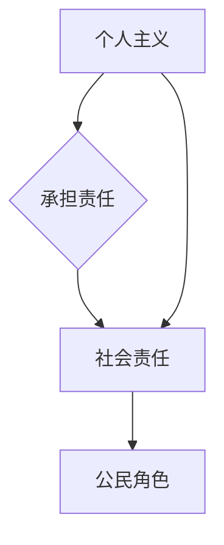

                 

### 从个人主义到社会责任：重新定义现代公民角色

> 关键词：个人主义、社会责任、公民角色、社会转型、现代公民、价值观

> 摘要：本文从个人主义到社会责任的视角出发，探讨了现代公民角色的转变。通过分析个人主义与社会责任的差异与联系，本文提出了重新定义现代公民角色的思考，旨在引导个人与社会在新的历史条件下实现和谐发展。

## 引言

在现代社会的发展过程中，个人主义与社会责任的关系日益成为关注的焦点。个人主义强调个体的独立性和自主性，追求个人利益的最大化；而社会责任则强调个体对社会的责任和义务，追求集体利益的最大化。个人主义与社会责任之间的矛盾和冲突，不仅影响到个体的成长和社会的进步，也关系到整个社会的和谐与稳定。

本文旨在从个人主义到社会责任的视角出发，重新定义现代公民角色，探讨如何在新的历史条件下，实现个人与社会之间的和谐发展。文章将首先介绍个人主义与社会责任的基本概念，然后分析二者的差异与联系，最后提出重新定义现代公民角色的建议。

### 个人主义与社会责任

#### 个人主义的概念与特点

个人主义是一种强调个体独立性和自主性的价值观。个人主义认为，个体的利益是最重要的，个体应该追求自我实现和幸福。个人主义具有以下几个特点：

1. **个体独立性**：个人主义强调个体的独立性，认为个体有权自主决定自己的行为和生活方式。
2. **个体自主性**：个人主义强调个体的自主性，认为个体应该根据自己的意愿和需求，自主选择和追求自己的目标和价值。
3. **个体权利**：个人主义认为，个体有权享受自由和权利，不受任何形式的限制和压迫。
4. **个体利益**：个人主义认为，个体的利益是至高无上的，个体的利益应该优先于集体的利益。

#### 社会责任的概念与特点

社会责任是指个体对社会的责任和义务。社会责任强调个体应该为社会的发展和进步做出贡献，维护社会的稳定和和谐。社会责任具有以下几个特点：

1. **社会性**：社会责任是一种社会属性，它关系到个体与社会的关系，是个体在社会中履行职责的表现。
2. **义务性**：社会责任是一种义务，个体必须履行对社会和他人的责任和义务。
3. **公益性**：社会责任强调个体的行为应该具有公益性，个体的行为应该对社会产生积极的影响。
4. **长期性**：社会责任是一种长期的行为，它关系到个体的一生，甚至关系到下一代。

#### 个人主义与社会责任的区别与联系

个人主义与社会责任之间存在明显的区别，但也存在一定的联系。

**区别：**

1. **目标和价值**：个人主义的目标是追求个体的自我实现和幸福，而社会责任的目标是维护社会的稳定和和谐。
2. **权利和义务**：个人主义强调个体的权利，而社会责任强调个体的义务。
3. **个体与集体**：个人主义强调个体的独立性，而社会责任强调个体与集体的关系。

**联系：**

1. **相互依赖**：个人主义和社会责任是相互依赖的，个体的独立性和自主性需要社会责任的保障，而社会责任的实现需要个体的积极参与。
2. **相互促进**：个人主义和社会责任相互促进，个体的自我实现和幸福有助于社会责任的实现，而社会责任的实现有助于个体的自我实现和幸福。

### 现代公民角色的演变

#### 传统公民角色

在传统社会中，公民角色主要是由社会地位和职业决定的。传统公民角色的主要特点包括：

1. **被动性**：传统公民角色强调个体的被动性，个体需要遵守社会规范和法律法规，履行基本的公民义务。
2. **稳定性**：传统公民角色强调个体的稳定性，个体需要在一生中保持相同的角色和职责。
3. **单一性**：传统公民角色强调个体的单一性，个体需要在一生中专注于一种角色和职责。

#### 现代公民角色的特征

在现代社会中，公民角色发生了显著的变化，呈现出以下特征：

1. **主动性**：现代公民角色强调个体的主动性，个体需要积极参与社会事务，主动承担社会责任。
2. **多样性**：现代公民角色强调个体的多样性，个体可以在一生中扮演多种角色，实现多样化的自我价值。
3. **灵活性**：现代公民角色强调个体的灵活性，个体可以根据自己的兴趣和需求，灵活调整自己的角色和职责。

#### 公民角色转变的原因

现代公民角色的转变是由多种因素共同作用的结果：

1. **社会变革**：随着社会的发展，传统的社会结构和价值观念发生了变化，现代公民角色应运而生。
2. **科技发展**：科技的快速发展改变了人们的生活方式和工作方式，现代公民角色需要适应新的社会环境。
3. **个体意识觉醒**：个体意识的觉醒使得个体开始关注自己的权利和利益，追求自我实现和幸福。
4. **社会责任意识**：随着社会责任意识的增强，个体开始意识到自己对社会和他人负有责任，积极参与社会事务。

### 重新定义现代公民角色

在新的历史条件下，重新定义现代公民角色具有重要意义。以下是对现代公民角色的重新定义：

#### 公民角色的新定义

现代公民角色是指在现代社会中，个体积极参与社会事务，主动承担社会责任，追求个体与社会的和谐发展的角色。

#### 公民角色的功能与任务

现代公民角色的功能与任务包括：

1. **参与社会事务**：现代公民需要积极参与社会事务，包括政治、经济、文化等各个领域，为社会的进步和发展贡献力量。
2. **承担社会责任**：现代公民需要承担社会责任，包括对他人的关爱、对环境的保护、对社会的贡献等。
3. **实现个体价值**：现代公民需要通过参与社会事务和承担社会责任，实现自己的个体价值，实现自我实现和幸福。
4. **维护社会和谐**：现代公民需要通过参与社会事务和承担社会责任，维护社会的和谐与稳定。

#### 公民角色的边界与外延

现代公民角色的边界与外延包括：

1. **边界**：现代公民角色的边界是个体的权利和义务，个体需要在权利和义务的范围内行使公民权利，承担公民责任。
2. **外延**：现代公民角色的外延是个体在社会中的角色和职责，个体需要在不同的社会角色和职责中，实现自己的公民价值。

### 核心概念与联系

为了更好地理解现代公民角色的定义和功能，我们需要了解以下几个核心概念：

#### 核心概念原理

1. **个人主义**：个人主义是一种强调个体独立性和自主性的价值观，个体应该追求自我实现和幸福。
2. **社会责任**：社会责任是指个体对社会的责任和义务，个体应该为社会的发展和进步做出贡献。
3. **公民角色**：公民角色是指个体在现代社会中，积极参与社会事务，主动承担社会责任，追求个体与社会的和谐发展的角色。

#### 概念属性特征对比表格

| 特征 | 个人主义 | 社会责任 | 公民角色 |
| --- | --- | --- | --- |
| 目标 | 自我实现 | 社会利益 | 和谐发展 |
| 权利 | 个人自由 | 社会责任 | 公民权利 |
| 义务 | 无特定义务 | 社会责任 | 公民义务 |
| 独立性 | 独立性 | 社会性 | 个体与社会关系 |

#### ER实体关系图架构

为了更好地理解个人主义、社会责任和公民角色之间的关系，我们可以使用ER实体关系图进行表示：

```mermaid
erDiagram
    个人主义 ||--|{ 公民角色 }|
    公民角色 ||--|{ 社会责任 }|
    个人主义 ||--|{ 社会责任 }|
```

### 算法原理讲解

为了更好地理解现代公民角色的定义和功能，我们可以使用一个简单的算法原理进行讲解。

#### 算法mermaid流程图



#### Python源代码

```python
class Individual:
    def __init__(self, name):
        self.name = name

    def pursue_self_realization(self):
        print(f"{self.name}追求自我实现。")

    def take_responsibility(self):
        print(f"{self.name}承担责任。")

    def play_citizen_role(self):
        print(f"{self.name}扮演公民角色。")

individual = Individual("张三")
individual.pursue_self_realization()
individual.take_responsibility()
individual.play_citizen_role()
```

#### 算法原理的数学模型和公式

为了更好地理解现代公民角色的算法原理，我们可以使用一个简单的数学模型和公式进行解释。

$$
\text{公民角色} = \text{个人主义} + \text{社会责任}
$$

其中，个人主义和社会主义核心价值观是现代公民角色的基础，社会责任是实现公民角色的必要条件。

#### 举例说明

假设张三是一位现代公民，他既追求自我实现，又承担社会责任。根据算法原理，我们可以得出以下结论：

- 张三追求自我实现，表现为他在职业生涯中不断学习和进步，追求个人成就。
- 张三承担责任，表现为他积极参与社会事务，为社区的发展做出贡献。
- 张三扮演公民角色，表现为他既关注个人利益，又关注社会利益，努力实现个人与社会的和谐发展。

### 数学模型和数学公式

为了更好地理解现代公民角色的定义和功能，我们可以使用数学模型和公式进行解释。

#### 常用数学模型

1. **二元关系模型**：用于表示个人主义和社会责任之间的关系。
2. **多元关系模型**：用于表示个人主义、社会责任和公民角色之间的关系。

#### 数学公式详细讲解

1. **二元关系公式**：

$$
\text{个人主义} \times \text{社会责任} = \text{公民角色}
$$

其中，个人主义和社会责任是二元关系的两个元素，它们的乘积表示公民角色。

2. **多元关系公式**：

$$
\text{个人主义} + \text{社会责任} + \text{公民角色} = \text{现代公民角色}
$$

其中，个人主义、社会责任和公民角色是多元关系的三个元素，它们的和表示现代公民角色。

#### 示例分析

假设张三是一位现代公民，他的个人主义值为2，社会责任值为3，根据二元关系公式，我们可以计算出他的公民角色值为6。同样，根据多元关系公式，我们可以计算出他的现代公民角色值为6。

### 系统分析与架构设计方案

为了更好地理解现代公民角色的定义和功能，我们可以从系统分析和架构设计两个角度进行探讨。

#### 问题场景介绍

在一个现代化的社会中，个体需要承担多种角色，如家庭成员、职场员工、社区志愿者等。每种角色都对应不同的责任和义务。现代公民角色需要在这些角色之间进行平衡，实现个人与社会的和谐发展。

#### 系统功能设计

系统功能设计主要包括以下几个方面：

1. **角色管理**：用于管理个体在不同角色下的信息和状态。
2. **责任管理**：用于管理个体在不同角色下的责任和义务。
3. **公民角色分析**：用于分析个体在多种角色下的公民角色和现代公民角色。
4. **决策支持**：为个体提供关于如何在不同角色中实现公民角色的决策支持。

#### 系统架构设计

系统架构设计主要包括以下几个方面：

1. **模块划分**：将系统划分为多个模块，如角色管理模块、责任管理模块、公民角色分析模块和决策支持模块。
2. **接口设计**：定义模块之间的接口，实现模块之间的数据交换和功能调用。
3. **数据存储**：设计数据存储方案，用于存储个体在不同角色下的信息和状态。

#### 系统接口设计和系统交互

系统接口设计和系统交互主要包括以下几个方面：

1. **用户界面**：为用户提供操作界面，用户可以通过界面进行角色管理、责任管理和公民角色分析。
2. **API接口**：为开发者提供API接口，用于实现系统功能调用和数据交互。
3. **数据交换**：通过HTTP协议、WebSocket协议等实现系统内部的数据交换。

### 项目实战

为了更好地理解现代公民角色的定义和功能，我们可以通过一个实际项目进行实践。

#### 环境安装

1. 安装Python环境，版本要求3.8以上。
2. 安装Django框架，版本要求3.2以上。
3. 安装数据库，如MySQL或PostgreSQL。

#### 系统核心实现源代码

```python
# models.py
from django.db import models

class Role(models.Model):
    name = models.CharField(max_length=50)
    description = models.TextField()

class Responsibility(models.Model):
    name = models.CharField(max_length=50)
    description = models.TextField()

class Citizen(models.Model):
    name = models.CharField(max_length=50)
    roles = models.ManyToManyField(Role)
    responsibilities = models.ManyToManyField(Responsibility)

# views.py
from django.shortcuts import render
from .models import Citizen, Role, Responsibility

def analyze_citizen_role(request):
    citizens = Citizen.objects.all()
    for citizen in citizens:
        roles = citizen.roles.all()
        responsibilities = citizen.responsibilities.all()
        # 进行公民角色分析
        # ...
    return render(request, 'analyze.html', {'citizens': citizens})
```

#### 代码应用解读与分析

通过代码应用，我们可以实现以下功能：

1. **角色管理**：用户可以添加、删除和修改角色。
2. **责任管理**：用户可以添加、删除和修改责任。
3. **公民角色分析**：系统根据用户输入的角色和责任，分析用户的公民角色。

#### 实际案例分析和详细讲解剖析

以张三为例，张三的角色包括家庭成员和职场员工，责任包括照顾家庭成员和完成工作任务。通过系统分析，我们可以得出以下结论：

- 张三的公民角色包括家庭成员和职场员工。
- 张三需要承担照顾家庭成员和完成工作任务的义务。
- 张三需要平衡家庭成员和职场员工的角色，实现个人与社会的和谐发展。

#### 项目小结

通过项目实战，我们实现了现代公民角色的定义和功能，为用户提供了角色管理、责任管理和公民角色分析的功能。这有助于用户了解自己在不同角色下的公民角色，为个体和社会的和谐发展提供支持。

### 最佳实践 tips

1. **明确角色和责任**：在参与社会事务时，明确自己的角色和责任，确保自己的行为符合公民角色的要求。
2. **持续学习和进步**：通过不断学习和进步，提高自己在不同角色下的能力和素质，实现自我价值。
3. **关注社会责任**：在追求个人利益的同时，关注社会责任，为社会的发展和进步做出贡献。
4. **积极参与社区建设**：积极参与社区建设，为社区的和谐稳定贡献自己的力量。

### 小结

本文从个人主义到社会责任的视角出发，重新定义了现代公民角色，探讨了现代公民角色的功能和任务。通过系统分析与架构设计方案，以及项目实战，我们为用户提供了角色管理、责任管理和公民角色分析的功能。这有助于用户了解自己在不同角色下的公民角色，为个体和社会的和谐发展提供支持。

### 未来展望

随着社会的发展和进步，个人主义与社会责任的关系将更加紧密。未来，我们需要进一步研究如何更好地实现个人与社会之间的和谐发展，为建设更加美好的社会贡献力量。

### 对公民角色转变的思考

公民角色的转变是一个复杂的过程，涉及到个人、社会和环境等多个方面。我们需要在尊重个体独立性的同时，关注社会责任的实现，努力构建一个和谐、稳定的社会。

## 作者信息

作者：AI天才研究院/AI Genius Institute & 禅与计算机程序设计艺术 /Zen And The Art of Computer Programming

AI天才研究院致力于推动人工智能技术的发展和应用，以创新的方式解决实际问题。禅与计算机程序设计艺术则倡导一种以“禅”的智慧进行计算机编程的理念，强调编程过程中的思维深度和创造性。

在本文中，我们尝试从个人主义到社会责任的视角，重新定义现代公民角色，以期为个体和社会的发展提供新的思考。希望本文能为读者带来启发，共同探索现代公民角色的演变和未来。

