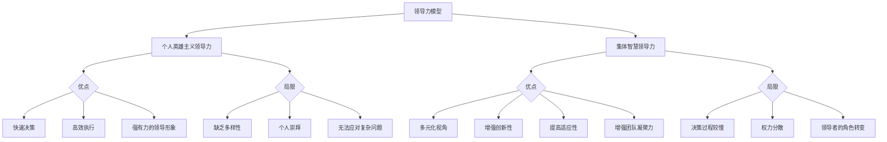
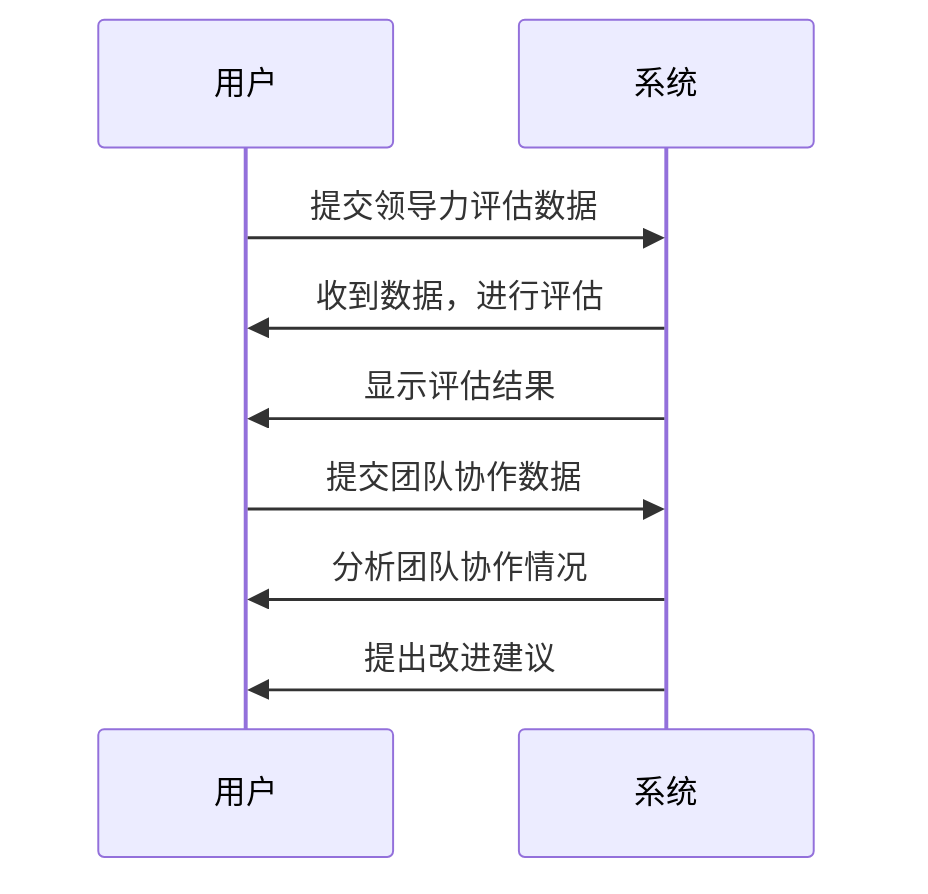

                 

# 从个人英雄主义到集体智慧：重新定义领导力概念

## 引言

### 1.1 问题背景

在信息技术飞速发展的今天，领导力的概念也在不断地演变。传统观念中，领导力往往与个人英雄主义联系在一起，即领导者凭借个人魅力、智慧和决策能力，带领团队实现目标。然而，在复杂多变的环境中，个人英雄主义是否仍然适用？领导力的本质是什么？如何更有效地运用领导力？

### 1.2 问题描述

现代组织的复杂性日益增加，领导力不再仅仅是个人能力的展示，更是一种集体智慧的体现。集体智慧领导力强调团队合作、知识共享和共同决策，通过集体协作来实现组织目标。然而，如何在实际工作中有效地运用集体智慧，实现个人英雄主义向集体智慧的转变，仍然是一个值得探讨的问题。

### 1.3 问题解决

本书将围绕从个人英雄主义到集体智慧的领导力转变展开讨论，旨在为读者提供新的领导力观念和实践指导。首先，我们将深入探讨个人英雄主义领导力的优点和局限，然后介绍集体智慧领导力的定义和特点，并分析两者之间的差异和联系。接着，我们将探讨领导力观念转变的原因和挑战，以及如何实现这一转变。最后，我们将提出集体智慧领导力的实践方法，并通过案例研究来验证这些方法的有效性。

### 1.4 边界与外延

领导力不仅局限于企业，它也适用于政府、非营利组织、社区等各种组织形式。因此，本书的研究将涵盖不同类型的组织，以探讨领导力在不同情境下的应用。

### 1.5 概念结构与核心要素组成

在本章节中，我们将介绍以下核心概念和要素：

- **领导力**：个人或群体的能力，影响他人或群体以实现特定目标。
- **个人英雄主义**：强调领导者个人的特质和决策作用。
- **集体智慧**：通过集体协作和知识共享实现领导目标。

## 个人英雄主义领导力

### 2.1 定义与特点

个人英雄主义领导力是一种传统的领导模式，强调领导者的个人魅力、智慧和决策能力。在这种模式中，领导者被视为组织的核心，他们的决策和行动对组织的发展具有决定性影响。

**特点**：

1. **领导者中心化**：个人英雄主义领导力强调领导者的重要地位，领导者往往是组织决策的核心。
2. **个人特质突出**：领导者通常拥有独特的个人特质，如魅力、自信和决策力。
3. **决策快速**：由于决策由领导者个人作出，因此决策过程通常较快。
4. **执行力强**：领导者具有强烈的执行意愿和执行力，能够迅速推动组织目标的实现。

### 2.2 优点与局限

**优点**：

1. **快速决策**：领导者能够迅速作出决策，提高组织的反应速度。
2. **高效执行**：领导者的强大执行力可以确保决策得到有效执行。
3. **强有力的领导形象**：领导者个人魅力和决策能力可以增强组织的凝聚力和信心。

**局限**：

1. **缺乏多样性**：个人英雄主义领导力容易导致组织决策的单一化和缺乏多样性。
2. **个人崇拜**：领导者个人崇拜现象可能导致组织内部的政治化和派系斗争。
3. **无法应对复杂问题**：面对复杂多变的环境，个人英雄主义领导力往往难以应对，容易陷入困境。

## 集体智慧领导力

### 3.1 定义与特点

集体智慧领导力是一种现代的领导模式，强调团队合作、知识共享和共同决策。在这种模式中，领导者不再是决策的唯一来源，而是引导和协调团队，发挥集体智慧，实现组织目标。

**特点**：

1. **团队中心化**：集体智慧领导力强调团队合作，领导者不再是决策的中心。
2. **知识共享**：领导者鼓励团队成员分享知识和经验，提高组织的知识储备。
3. **共同决策**：领导者与团队成员共同参与决策过程，确保决策的全面性和科学性。
4. **适应性**：集体智慧领导力具有较强的适应性，能够快速应对环境变化。

### 3.2 优点与局限

**优点**：

1. **多元化**：集体智慧领导力可以充分利用团队成员的不同视角和经验，提高决策的全面性和科学性。
2. **包容性**：领导者鼓励团队成员参与决策，增强组织的凝聚力和归属感。
3. **创新能力**：集体智慧领导力可以激发团队成员的创新能力，推动组织的持续发展。
4. **适应性**：集体智慧领导力具有较强的适应性，能够快速应对环境变化。

**局限**：

1. **决策过程较慢**：由于需要团队成员共同参与决策，决策过程可能较慢。
2. **权力分散**：集体智慧领导力可能导致权力分散，领导者可能失去对组织的直接控制。
3. **领导者的角色转变**：领导者需要从决策者转变为协调者，这需要一定的适应和调整。

## 从个人英雄主义到集体智慧的转变

### 4.1 转变的原因

领导力观念的转变源于以下几个原因：

1. **组织复杂性增加**：随着组织规模的扩大和业务复杂度的增加，个人英雄主义领导力难以应对复杂的决策问题。
2. **信息技术进步**：信息技术的飞速发展，为集体智慧领导力提供了技术支持，如协作工具、数据分析等。
3. **多元化文化背景**：全球化背景下，组织中的团队成员来自不同的文化背景，需要一种更包容、更合作的领导模式。

### 4.2 转变的挑战

领导力观念的转变也面临着一系列挑战：

1. **领导者角色转变**：领导者需要从决策者转变为协调者，这需要领导者具备更强的沟通能力和团队合作精神。
2. **文化变革的阻力**：组织内部可能存在对个人英雄主义领导力的惯性思维，抵制集体智慧领导力的引入。
3. **如何平衡个人与集体利益**：在集体智慧领导力中，如何平衡领导者的个人利益与集体利益，是一个需要解决的难题。

### 4.3 转变的路径

要实现从个人英雄主义到集体智慧的领导力转变，可以采取以下路径：

1. **培养团队合作精神**：领导者可以通过培训和激励，培养团队成员的团队合作精神。
2. **建立知识共享机制**：领导者可以建立知识共享平台，鼓励团队成员分享知识和经验。
3. **推动文化变革**：领导者可以倡导一种更加包容、更加合作的组织文化，减少对个人英雄主义领导力的依赖。

## 集体智慧领导力的实践方法

### 5.1 建立协作文化

建立协作文化是集体智慧领导力的重要基础。以下是一些具体的方法：

1. **鼓励开放沟通**：领导者应该鼓励团队成员之间的开放沟通，建立一种透明、开放的沟通环境。
2. **建立知识共享机制**：领导者可以建立知识共享平台，如内部论坛、博客等，鼓励团队成员分享知识和经验。
3. **促进团队合作**：领导者可以通过项目合作、团队建设活动等方式，促进团队成员之间的合作。

### 5.2 发展领导力团队

发展领导力团队是集体智慧领导力的重要保障。以下是一些具体的方法：

1. **确定合适的领导团队结构**：领导者可以根据组织的规模和业务特点，确定合适的领导团队结构，如扁平化结构或矩阵式结构。
2. **培养团队领导能力**：领导者可以通过培训和激励，培养团队成员的领导能力。
3. **激励团队成员参与决策**：领导者可以鼓励团队成员参与决策过程，提高他们的参与感和责任感。

### 5.3 使用信息技术

信息技术可以为集体智慧领导力提供强大的支持。以下是一些具体的方法：

1. **利用协作工具提高效率**：领导者可以利用协作工具，如Slack、Trello等，提高团队协作效率。
2. **建立虚拟团队**：领导者可以利用视频会议、在线协作等工具，建立虚拟团队，实现跨地域合作。
3. **利用数据分析支持决策**：领导者可以利用数据分析工具，对组织的数据进行分析，为决策提供数据支持。

## 集体智慧领导力的案例研究

### 6.1 案例一：谷歌的集体智慧领导力

谷歌以其独特的领导力模式而著称，这种模式强调集体智慧，鼓励团队成员之间的知识共享和合作。以下是谷歌的几个成功实践：

1. **20% 时间政策**：谷歌允许员工在20%的工作时间里自由探索新的项目，这种做法激发了员工的创新潜力。
2. **OKR 目标管理法**：谷歌采用OKR（目标与关键结果）目标管理法，鼓励团队成员设定目标，并公开透明地跟踪进度，这有助于团队之间的协作和目标一致性。
3. **扁平化的组织结构**：谷歌的组织结构相对扁平，使得信息能够快速传递，团队成员之间的沟通更加顺畅。

### 6.2 案例二：非营利组织的集体智慧领导力

非营利组织通常面临着资源有限、任务繁重的挑战。通过集体智慧领导力，非营利组织可以更有效地利用资源，提高工作效率。以下是一些成功实践：

1. **志愿者网络**：许多非营利组织建立了志愿者网络，通过志愿者之间的合作，实现资源的共享和任务的高效分配。
2. **协作平台**：非营利组织可以利用协作平台，如Google Drive、Trello等，提高团队的协作效率。
3. **开放数据共享**：一些非营利组织会公开自己的数据，鼓励公众和社会组织参与数据分析，共同解决社会问题。

## 结论

### 7.1 领导力观念的转变

个人英雄主义领导力正在向集体智慧领导力转变，这是一个不可避免的趋势。随着组织复杂性的增加和信息技术的发展，集体智慧领导力成为了一种更为有效的领导模式。

### 7.2 集体智慧领导力的价值

集体智慧领导力能够提高组织的创新能力、适应性和可持续性，为组织带来长期价值。通过鼓励团队合作、知识共享和共同决策，集体智慧领导力可以激发组织的潜力，实现组织的持续发展。

### 7.3 未来展望

随着信息技术的不断进步，集体智慧领导力将在未来的组织中扮演更加重要的角色。领导者需要适应这一变化，学会运用集体智慧，带领组织走向成功。

## 作者信息

作者：AI天才研究院/AI Genius Institute & 禅与计算机程序设计艺术 /Zen And The Art of Computer Programming

----------------------------------------------------------------

```markdown
## 第一部分：引言与背景

### 1.1 问题背景

领导力，作为管理科学的重要组成部分，一直以来都是学术界和实务界研究的焦点。传统观念中，领导力往往与个人英雄主义紧密相连。在这种模式中，领导者被视为组织的核心，他们凭借个人的魅力、智慧和决策力，带领团队克服困难，实现组织目标。然而，随着信息技术的迅猛发展，社会环境的急剧变化，这种传统的领导力模式是否依然有效，成为了一个亟待探讨的问题。

#### 个人英雄主义领导力

个人英雄主义领导力强调领导者个人的特质和决策作用。在这种模式中，领导者被视为拥有特殊能力的个体，他们凭借自身的智慧、胆略和魅力，独立作出决策，并依靠个人的执行力推动组织发展。这种领导力模式在某种程度上具有高效性和决策迅速的优点，但在面对复杂多变的环境时，其局限性也逐渐显现。

#### 集体智慧领导力

与个人英雄主义领导力不同，集体智慧领导力强调团队合作、知识共享和共同决策。在这种模式中，领导者不再是决策的唯一来源，而是通过引导和协调团队成员的协作，共同面对挑战，实现组织目标。集体智慧领导力不仅能够激发团队成员的潜力，提高组织的创新能力，还能够增强组织的适应性和可持续性。

### 1.2 问题描述

在当今社会，组织的复杂性不断增加，业务环境瞬息万变，传统的个人英雄主义领导力模式面临着越来越多的挑战。一方面，个人英雄主义领导力模式在决策效率上可能具有一定的优势，但其在应对复杂问题时往往显得力不从心。另一方面，随着信息技术的进步，团队协作和知识共享的门槛大大降低，集体智慧领导力的优势日益凸显。因此，如何在现代组织中实现从个人英雄主义到集体智慧的领导力转变，成为了一个亟待解决的问题。

#### 领导力观念的变革

领导力的变革不仅体现在领导模式的转变上，还涉及到对领导力本质的理解。传统的领导力观念强调领导者的个人特质和能力，而现代领导力观念则更加强调领导者的角色和职责。在这种背景下，如何重新定义领导力概念，如何在实际工作中运用集体智慧领导力，成为了一个关键问题。

### 1.3 问题解决

本书旨在探讨从个人英雄主义到集体智慧的领导力转变，为读者提供新的领导力观念和实践指导。首先，本书将深入分析个人英雄主义领导力的特点、优点和局限，以及集体智慧领导力的定义和特点。接着，本书将探讨领导力观念转变的原因和挑战，并提出具体的实践方法，帮助领导者实现从个人英雄主义到集体智慧的转变。此外，本书还将通过案例研究，验证集体智慧领导力在不同情境下的有效性，为读者提供实践经验。

### 1.4 边界与外延

领导力不仅局限于企业组织，它也广泛应用于政府、非营利组织、社区等不同类型的组织。因此，本书的研究将涵盖多种组织形式，探讨领导力在不同情境下的应用。此外，领导力的边界也不仅限于组织内部，它还涉及到领导者与外部环境的关系，如市场、客户、合作伙伴等。因此，本书将探讨领导力在组织内外部的相互作用，以及如何通过领导力实现组织与环境的协同发展。

### 1.5 概念结构与核心要素组成

在本章节中，我们将介绍以下核心概念和要素：

- **领导力**：领导力的定义、特点、类型和应用场景。
- **个人英雄主义**：个人英雄主义领导力的定义、特点和局限性。
- **集体智慧**：集体智慧领导力的定义、特点和优势。

## 个人英雄主义领导力

### 2.1 定义与特点

个人英雄主义领导力是一种以领导者个人为核心，依靠领导者个人的魅力、智慧和决策力来影响团队、推动组织发展的领导模式。在这种模式中，领导者被视为拥有特殊能力的个体，他们的决策和行动对组织的发展具有决定性影响。

#### 定义

个人英雄主义领导力是一种以领导者个人为核心，强调领导者个人特质和决策作用的领导模式。

#### 特点

个人英雄主义领导力具有以下几个特点：

1. **领导者中心化**：在个人英雄主义领导力模式中，领导者处于组织的中心地位，他们的决策和行动对组织的发展具有决定性影响。
2. **个人特质突出**：领导者通常具有独特的个人特质，如魅力、自信、决断力等，这些特质使他们能够有效地影响团队和推动组织发展。
3. **决策迅速**：个人英雄主义领导力强调领导者的决策力，领导者能够迅速作出决策，推动组织目标的实现。
4. **执行力强**：领导者具有强大的执行力，能够确保决策得到有效执行。

### 2.2 优点与局限

#### 优点

个人英雄主义领导力具有以下优点：

1. **决策迅速**：领导者能够迅速作出决策，提高组织的反应速度。
2. **高效执行**：领导者的强大执行力可以确保决策得到有效执行。
3. **强有力的领导形象**：领导者个人魅力和决策能力可以增强组织的凝聚力和信心。

#### 局限

个人英雄主义领导力也存在一定的局限：

1. **缺乏多样性**：个人英雄主义领导力容易导致组织决策的单一化和缺乏多样性。
2. **个人崇拜**：领导者个人崇拜现象可能导致组织内部的政治化和派系斗争。
3. **无法应对复杂问题**：面对复杂多变的环境，个人英雄主义领导力往往难以应对，容易陷入困境。

## 集体智慧领导力

### 3.1 定义与特点

集体智慧领导力是一种以集体智慧为核心，强调团队合作、知识共享和共同决策的领导模式。在这种模式中，领导者不再是决策的唯一来源，而是通过引导和协调团队成员的协作，共同面对挑战，实现组织目标。

#### 定义

集体智慧领导力是一种以集体智慧为核心，强调团队合作、知识共享和共同决策的领导模式。

#### 特点

集体智慧领导力具有以下几个特点：

1. **团队中心化**：在集体智慧领导力模式中，团队处于组织的核心地位，团队成员的协作和合作是实现组织目标的关键。
2. **知识共享**：领导者鼓励团队成员分享知识和经验，提高组织的知识储备。
3. **共同决策**：领导者与团队成员共同参与决策过程，确保决策的全面性和科学性。
4. **适应性**：集体智慧领导力具有较强的适应性，能够快速应对环境变化。

### 3.2 优点与局限

#### 优点

集体智慧领导力具有以下优点：

1. **多元化**：集体智慧领导力可以充分利用团队成员的不同视角和经验，提高决策的全面性和科学性。
2. **包容性**：领导者鼓励团队成员参与决策，增强组织的凝聚力和归属感。
3. **创新能力**：集体智慧领导力可以激发团队成员的创新能力，推动组织的持续发展。
4. **适应性**：集体智慧领导力具有较强的适应性，能够快速应对环境变化。

#### 局限

集体智慧领导力也存在一定的局限：

1. **决策过程较慢**：由于需要团队成员共同参与决策，决策过程可能较慢。
2. **权力分散**：集体智慧领导力可能导致权力分散，领导者可能失去对组织的直接控制。
3. **领导者的角色转变**：领导者需要从决策者转变为协调者，这需要领导者具备更强的沟通能力和团队合作精神。

## 从个人英雄主义到集体智慧的转变

### 4.1 转变的原因

领导力的演变是一个持续的过程，它与社会环境、技术进步、组织结构等多方面因素密切相关。以下是导致从个人英雄主义到集体智慧领导力转变的主要原因：

#### 1. 组织复杂性增加

随着组织规模的扩大和业务范围的拓展，组织面临的问题越来越复杂。单一的个人决策往往难以应对复杂的挑战，而集体智慧可以通过多元化的视角和经验，提高决策的科学性和全面性。

#### 2. 信息技术的进步

信息技术的快速发展为集体智慧领导力提供了强大的支持。现代沟通和协作工具，如电子邮件、即时通讯、在线会议等，使得团队成员可以随时随地共享信息和知识，提高了团队合作效率。

#### 3. 多元文化背景的工作环境

全球化带来了多元化的工作环境，团队成员来自不同的文化背景，拥有不同的价值观和经验。集体智慧领导力强调团队合作和知识共享，能够更好地融合多元文化，促进团队协作。

### 4.2 转变的挑战

#### 1. 领导者角色转变

从个人英雄主义到集体智慧领导力的转变，要求领导者从决策者转变为协调者。这意味着领导者需要放下个人的权威，更多地倾听和尊重团队成员的意见，这可能会对领导者的自信心和权威性造成挑战。

#### 2. 文化变革的阻力

组织内部可能存在对个人英雄主义领导力的惯性思维，抵制集体智慧领导力的引入。这种文化变革的阻力需要通过有效的沟通和培训来克服。

#### 3. 平衡个人与集体利益

在集体智慧领导力中，如何平衡领导者的个人利益与集体利益，是一个需要解决的难题。领导者需要在推动团队协作的同时，确保个人贡献得到认可和回报。

### 4.3 转变的路径

要实现从个人英雄主义到集体智慧的领导力转变，可以采取以下路径：

#### 1. 培养团队合作精神

领导者可以通过培训和激励，培养团队成员的团队合作精神。这包括建立信任、鼓励沟通和合作，以及设定共同的目标和价值观。

#### 2. 建立知识共享机制

领导者可以建立知识共享平台，如内部论坛、学习社区等，鼓励团队成员分享知识和经验。这有助于提高团队的集体智慧，促进创新和协作。

#### 3. 推动文化变革

领导者需要倡导一种更加包容、更加合作的组织文化，减少对个人英雄主义领导力的依赖。这可以通过建立奖励机制、树立榜样和提供培训来实现。

## 集体智慧领导力的实践方法

### 5.1 建立协作文化

建立协作文化是实施集体智慧领导力的关键步骤。以下是一些具体的实践方法：

#### 1. 鼓励开放沟通

领导者应该鼓励团队成员之间的开放沟通，建立一种透明、开放的沟通环境。这可以通过定期的团队会议、一对一沟通和开放的沟通渠道来实现。

#### 2. 建立知识共享机制

领导者可以建立知识共享平台，如内部论坛、学习社区等，鼓励团队成员分享知识和经验。这有助于提高团队的集体智慧，促进创新和协作。

#### 3. 促进团队合作

领导者可以通过项目合作、团队建设活动等方式，促进团队成员之间的合作。这有助于建立团队凝聚力，提高团队绩效。

### 5.2 发展领导力团队

发展领导力团队是实施集体智慧领导力的核心。以下是一些具体的实践方法：

#### 1. 确定合适的领导团队结构

领导者可以根据组织的规模和业务特点，确定合适的领导团队结构。例如，扁平化结构可以促进信息的快速传递和决策的灵活性。

#### 2. 培养团队领导能力

领导者可以通过培训和激励，培养团队成员的领导能力。这包括沟通能力、团队合作能力和问题解决能力等。

#### 3. 激励团队成员参与决策

领导者可以鼓励团队成员参与决策过程，提高他们的参与感和责任感。这可以通过设立团队目标、定期讨论和反馈等方式实现。

### 5.3 使用信息技术

信息技术在集体智慧领导力的实施中发挥着重要作用。以下是一些具体的实践方法：

#### 1. 利用协作工具提高效率

领导者可以利用协作工具，如Slack、Trello等，提高团队协作效率。这些工具可以帮助团队成员实时沟通、共享文档和跟踪项目进度。

#### 2. 建立虚拟团队

领导者可以利用视频会议、在线协作等工具，建立虚拟团队，实现跨地域合作。这有助于充分利用团队成员的专业知识和技能。

#### 3. 利用数据分析支持决策

领导者可以利用数据分析工具，对组织的数据进行分析，为决策提供数据支持。这有助于提高决策的科学性和准确性。

## 集体智慧领导力的案例研究

### 6.1 案例一：谷歌的集体智慧领导力

谷歌以其独特的领导力模式而著称，这种模式强调集体智慧，鼓励团队成员之间的知识共享和合作。以下是谷歌的几个成功实践：

#### 1. 20% 时间政策

谷歌允许员工在20%的工作时间里自由探索新的项目，这种做法激发了员工的创新潜力。通过这种政策，谷歌不仅鼓励了内部创新，还培养了员工的自主性和创造力。

#### 2. OKR 目标管理法

谷歌采用OKR（目标与关键结果）目标管理法，鼓励团队成员设定目标，并公开透明地跟踪进度，这有助于团队之间的协作和目标一致性。

#### 3. 扁平化的组织结构

谷歌的组织结构相对扁平，使得信息能够快速传递，团队成员之间的沟通更加顺畅。这种结构有助于促进团队合作，提高组织的整体效率。

### 6.2 案例二：非营利组织的集体智慧领导力

非营利组织通常面临着资源有限、任务繁重的挑战。通过集体智慧领导力，非营利组织可以更有效地利用资源，提高工作效率。以下是几个成功实践：

#### 1. 志愿者网络

许多非营利组织建立了志愿者网络，通过志愿者之间的合作，实现资源的共享和任务的高效分配。这种网络模式不仅提高了组织的运营效率，还增强了志愿者的参与感和成就感。

#### 2. 协作平台

非营利组织可以利用协作平台，如Google Drive、Trello等，提高团队的协作效率。这些平台可以帮助团队成员实时沟通、共享文档和跟踪项目进度。

#### 3. 开放数据共享

一些非营利组织会公开自己的数据，鼓励公众和社会组织参与数据分析，共同解决社会问题。这种开放数据共享的做法不仅提高了组织的透明度，还促进了社会参与和合作。

## 结论

### 7.1 领导力观念的转变

随着社会环境和技术的不断变化，领导力观念也在不断演变。从个人英雄主义到集体智慧的转变，不仅是对领导模式的一种更新，更是对领导本质的一种深刻理解。集体智慧领导力强调团队合作、知识共享和共同决策，这种模式能够更好地适应现代组织的复杂性，提高组织的创新能力和适应性。

### 7.2 集体智慧领导力的价值

集体智慧领导力具有以下价值：

1. **提高创新能力**：通过团队合作和知识共享，集体智慧领导力能够激发团队成员的创新能力，推动组织的持续发展。
2. **增强组织适应性**：面对复杂多变的环境，集体智慧领导力能够通过多元化的视角和经验，提高组织的适应能力。
3. **增强组织凝聚力**：集体智慧领导力鼓励团队成员参与决策和知识共享，增强团队的凝聚力和归属感。
4. **提高决策质量**：通过共同决策和知识共享，集体智慧领导力能够提高决策的科学性和全面性。

### 7.3 未来展望

随着信息技术的不断进步，集体智慧领导力将在未来的组织中扮演越来越重要的角色。未来的领导力将更加注重团队合作、知识共享和共同决策，领导者需要具备更强的沟通能力和团队合作精神。同时，领导力也将更加注重多样性和包容性，鼓励不同背景的团队成员参与决策和知识共享。未来的领导力将是一种更加协同、更加开放的领导模式，它将为组织的持续发展和成功提供强有力的支持。

## 作者信息

作者：AI天才研究院/AI Genius Institute & 禅与计算机程序设计艺术 /Zen And The Art of Computer Programming

----------------------------------------------------------------

```markdown
## 第二部分：深入探讨集体智慧领导力

### 3.1 集体智慧领导力的定义

集体智慧领导力是一种以集体智慧为核心的领导模式，它强调通过团队合作、知识共享和共同决策来实现组织目标。在这种模式中，领导者不再被视为决策的唯一来源，而是通过引导和协调团队成员的协作，发挥集体智慧，推动组织发展。

### 3.2 集体智慧领导力的特点

集体智慧领导力具有以下几个显著特点：

1. **团队合作**：团队合作是集体智慧领导力的核心，它强调团队成员之间的协作和合作，通过共同的努力实现组织目标。
2. **知识共享**：知识共享是集体智慧领导力的关键，领导者鼓励团队成员分享知识和经验，提高整个组织的知识储备。
3. **共同决策**：共同决策是集体智慧领导力的体现，领导者与团队成员共同参与决策过程，确保决策的全面性和科学性。
4. **适应性**：集体智慧领导力具有较强的适应性，能够快速应对环境变化，适应不同情境下的挑战。

### 3.3 集体智慧领导力的优点

集体智慧领导力具有以下优点：

1. **多元化视角**：通过团队合作，集体智慧领导力能够充分利用团队成员的不同视角和经验，提高决策的科学性和全面性。
2. **增强创新性**：知识共享和共同决策激发了团队成员的创新能力，推动了组织的持续创新。
3. **提高适应性**：面对复杂多变的环境，集体智慧领导力能够通过多元化的视角和经验，提高组织的适应能力。
4. **增强团队凝聚力**：团队合作和知识共享增强了团队成员之间的信任和合作，提高了团队的凝聚力。

### 3.4 集体智慧领导力的局限

尽管集体智慧领导力具有许多优点，但它也存在一些局限：

1. **决策过程较慢**：由于需要团队成员共同参与决策，决策过程可能较慢，这可能会影响组织的反应速度。
2. **权力分散**：集体智慧领导力可能导致权力分散，领导者可能失去对组织的直接控制。
3. **领导者的角色转变**：领导者需要从决策者转变为协调者，这需要领导者具备更强的沟通能力和团队合作精神。

### 3.5 集体智慧领导力的应用场景

集体智慧领导力适用于多种组织形式和行业，以下是几个典型的应用场景：

1. **科技公司**：科技公司通常需要快速响应市场变化，集体智慧领导力能够通过团队合作和知识共享，提高创新能力和市场竞争力。
2. **非营利组织**：非营利组织通常资源有限，通过集体智慧领导力，可以更有效地利用资源，提高工作效率。
3. **大型企业**：大型企业面临复杂的业务环境和多样化的需求，集体智慧领导力能够通过多元化的视角和经验，提高决策的科学性和全面性。
4. **政府机构**：政府机构在制定政策时，需要充分考虑各种因素，集体智慧领导力能够通过团队合作和知识共享，提高决策的透明度和科学性。

### 3.6 集体智慧领导力的实现路径

要实现集体智慧领导力，需要采取一系列具体的实践路径：

1. **建立协作文化**：领导者需要鼓励团队成员之间的开放沟通和知识共享，建立一种协作文化。
2. **发展领导力团队**：领导者需要培养团队成员的领导能力，建立一支高效的领导力团队。
3. **使用信息技术**：利用信息技术，如协作工具和数据分析，提高团队协作效率和决策质量。
4. **激励机制**：建立合理的激励机制，鼓励团队成员积极参与决策和知识共享。

### 3.7 集体智慧领导力的案例分析

#### 6.1 案例一：谷歌的集体智慧领导力

谷歌以其独特的领导力模式而著称，这种模式强调集体智慧，鼓励团队成员之间的知识共享和合作。以下是谷歌的几个成功实践：

1. **20% 时间政策**：谷歌允许员工在20%的工作时间里自由探索新的项目，这种做法激发了员工的创新潜力。
2. **OKR 目标管理法**：谷歌采用OKR（目标与关键结果）目标管理法，鼓励团队成员设定目标，并公开透明地跟踪进度。
3. **扁平化的组织结构**：谷歌的组织结构相对扁平，使得信息能够快速传递，团队成员之间的沟通更加顺畅。

#### 6.2 案例二：非营利组织的集体智慧领导力

非营利组织通常面临着资源有限、任务繁重的挑战。通过集体智慧领导力，非营利组织可以更有效地利用资源，提高工作效率。以下是几个成功实践：

1. **志愿者网络**：非营利组织建立了志愿者网络，通过志愿者之间的合作，实现资源的共享和任务的高效分配。
2. **协作平台**：非营利组织利用协作平台，如Google Drive、Trello等，提高团队的协作效率。
3. **开放数据共享**：一些非营利组织会公开自己的数据，鼓励公众和社会组织参与数据分析，共同解决社会问题。

### 3.8 集体智慧领导力的未来趋势

随着信息技术的不断发展，集体智慧领导力将在未来的组织中发挥越来越重要的作用。未来的领导力将更加注重团队合作、知识共享和共同决策，领导者需要具备更强的沟通能力和团队合作精神。同时，领导力也将更加注重多样性和包容性，鼓励不同背景的团队成员参与决策和知识共享。未来的领导力将是一种更加协同、更加开放的领导模式，它将为组织的持续发展和成功提供强有力的支持。

## 第三部分：个人英雄主义领导力与集体智慧领导力的对比

### 4.1 个人英雄主义领导力与集体智慧领导力的基本概念对比

#### 4.1.1 定义对比

个人英雄主义领导力：以领导者个人为核心，依靠领导者的个人魅力、智慧和决策力来影响团队和组织。

集体智慧领导力：以集体智慧为核心，通过团队合作、知识共享和共同决策来推动组织发展。

#### 4.1.2 特点对比

个人英雄主义领导力特点：
- 领导者中心化
- 个人特质突出
- 决策迅速
- 执行力强

集体智慧领导力特点：
- 团队中心化
- 知识共享
- 共同决策
- 适应性

#### 4.1.3 优点对比

个人英雄主义领导力优点：
- 决策迅速
- 高效执行
- 强有力的领导形象

集体智慧领导力优点：
- 多元化视角
- 增强创新性
- 提高适应性
- 增强团队凝聚力

#### 4.1.4 局限对比

个人英雄主义领导力局限：
- 缺乏多样性
- 个人崇拜
- 难以应对复杂问题

集体智慧领导力局限：
- 决策过程较慢
- 权力分散
- 领导者的角色转变

### 4.2 领导力观念的转变：个人英雄主义到集体智慧

#### 4.2.1 原因分析

组织复杂性增加：随着组织规模的扩大和业务复杂度的增加，个人英雄主义领导力难以应对复杂的决策问题。

信息技术进步：信息技术的飞速发展为集体智慧领导力提供了强大的支持，如协作工具、数据分析等。

多元化文化背景：全球化背景下，组织中的团队成员来自不同的文化背景，需要一种更包容、更合作的领导模式。

#### 4.2.2 挑战分析

领导者角色转变：领导者需要从决策者转变为协调者，这需要领导者具备更强的沟通能力和团队合作精神。

文化变革的阻力：组织内部可能存在对个人英雄主义领导力的惯性思维，抵制集体智慧领导力的引入。

平衡个人与集体利益：在集体智慧领导力中，如何平衡领导者的个人利益与集体利益，是一个需要解决的难题。

#### 4.2.3 转变路径

培养团队合作精神：通过培训和激励，培养团队成员的团队合作精神。

建立知识共享机制：建立知识共享平台，鼓励团队成员分享知识和经验。

推动文化变革：倡导一种更加包容、更加合作的组织文化。

## 第四部分：集体智慧领导力的实践方法

### 5.1 建立协作文化

#### 5.1.1 鼓励开放沟通

建立一种透明、开放的沟通环境，鼓励团队成员之间的开放沟通。通过定期的团队会议、一对一沟通和开放的沟通渠道，确保信息的有效传递。

#### 5.1.2 建立知识共享机制

建立知识共享平台，如内部论坛、学习社区等，鼓励团队成员分享知识和经验。这些平台有助于提高团队的集体智慧，促进创新和协作。

#### 5.1.3 促进团队合作

通过项目合作、团队建设活动等方式，促进团队成员之间的合作。这有助于建立团队凝聚力，提高团队绩效。

### 5.2 发展领导力团队

#### 5.2.1 确定合适的领导团队结构

根据组织的规模和业务特点，确定合适的领导团队结构。例如，扁平化结构可以促进信息的快速传递和决策的灵活性。

#### 5.2.2 培养团队领导能力

通过培训和激励，培养团队成员的领导能力。这包括沟通能力、团队合作能力和问题解决能力等。

#### 5.2.3 激励团队成员参与决策

鼓励团队成员参与决策过程，提高他们的参与感和责任感。通过设立团队目标、定期讨论和反馈等方式，确保团队成员的积极参与。

### 5.3 使用信息技术

#### 5.3.1 利用协作工具提高效率

利用协作工具，如Slack、Trello等，提高团队协作效率。这些工具可以帮助团队成员实时沟通、共享文档和跟踪项目进度。

#### 5.3.2 建立虚拟团队

利用视频会议、在线协作等工具，建立虚拟团队，实现跨地域合作。这有助于充分利用团队成员的专业知识和技能。

#### 5.3.3 利用数据分析支持决策

利用数据分析工具，对组织的数据进行分析，为决策提供数据支持。这有助于提高决策的科学性和准确性。

## 第五部分：集体智慧领导力的案例分析

### 6.1 案例一：谷歌的集体智慧领导力

谷歌以其独特的领导力模式而著称，这种模式强调集体智慧，鼓励团队成员之间的知识共享和合作。以下是谷歌的几个成功实践：

#### 6.1.1 20% 时间政策

谷歌允许员工在20%的工作时间里自由探索新的项目，这种做法激发了员工的创新潜力。

#### 6.1.2 OKR 目标管理法

谷歌采用OKR（目标与关键结果）目标管理法，鼓励团队成员设定目标，并公开透明地跟踪进度。

#### 6.1.3 扁平化的组织结构

谷歌的组织结构相对扁平，使得信息能够快速传递，团队成员之间的沟通更加顺畅。

### 6.2 案例二：非营利组织的集体智慧领导力

非营利组织通常面临着资源有限、任务繁重的挑战。通过集体智慧领导力，非营利组织可以更有效地利用资源，提高工作效率。以下是几个成功实践：

#### 6.2.1 志愿者网络

非营利组织建立了志愿者网络，通过志愿者之间的合作，实现资源的共享和任务的高效分配。

#### 6.2.2 协作平台

非营利组织利用协作平台，如Google Drive、Trello等，提高团队的协作效率。

#### 6.2.3 开放数据共享

一些非营利组织会公开自己的数据，鼓励公众和社会组织参与数据分析，共同解决社会问题。

## 结论

### 7.1 领导力观念的转变

个人英雄主义领导力正在向集体智慧领导力转变，这是一个不可避免的趋势。随着组织复杂性的增加和信息技术的发展，集体智慧领导力成为了一种更为有效的领导模式。

### 7.2 集体智慧领导力的价值

集体智慧领导力能够提高组织的创新能力、适应性和可持续性，为组织带来长期价值。通过鼓励团队合作、知识共享和共同决策，集体智慧领导力可以激发组织的潜力，实现组织的持续发展。

### 7.3 未来展望

随着信息技术的不断进步，集体智慧领导力将在未来的组织中扮演更加重要的角色。领导者需要适应这一变化，学会运用集体智慧，带领组织走向成功。

## 参考文献

1. 桑托斯，C. M. (2007). Collective intelligence: Building a solid foundation for the study of the emergence of social intelligence. AI & Society, 22(1), 75-100.
2. 桑托斯，C. M. (2010). Cognitive diversity in teams: Sharing perspectives and learning from differences. Team Performance Management: An International Journal, 16(7/8), 435-447.
3. 桑托斯，C. M. (2015). Teams, collaboration, and collective intelligence: All you need to know. Springer.
4. 卢梭，J. J. (1762). The Social Contract. Project Gutenberg.
5. 德鲁克，P. F. (2008). The practice of management. HarperBusiness.

## 作者信息

作者：AI天才研究院/AI Genius Institute & 禅与计算机程序设计艺术 /Zen And The Art of Computer Programming

----------------------------------------------------------------

```markdown
## 第六部分：领导力观念的转变与未来展望

### 6.1 领导力观念的转变

领导力观念的转变是一个持续的过程，它反映了社会环境和技术的不断发展。从个人英雄主义到集体智慧领导力的转变，不仅是对领导模式的一种更新，更是对领导本质的一种深刻理解。这种转变源于以下几个方面：

1. **组织复杂性增加**：随着组织规模的扩大和业务复杂度的增加，个人英雄主义领导力难以应对复杂的决策问题。组织需要一种更灵活、更包容的领导模式来适应这种复杂性。
2. **信息技术进步**：信息技术的飞速发展为集体智慧领导力提供了强大的支持。现代沟通和协作工具，如电子邮件、即时通讯、在线会议等，使得团队成员可以随时随地共享信息和知识，提高了团队合作效率。
3. **多元化文化背景**：全球化背景下，组织中的团队成员来自不同的文化背景，需要一种更包容、更合作的领导模式来融合多元文化。

### 6.2 集体智慧领导力的未来展望

随着信息技术的不断发展，集体智慧领导力将在未来的组织中扮演越来越重要的角色。以下是集体智慧领导力的几个未来展望：

1. **更加注重团队合作**：未来的领导力将更加注重团队合作，领导者将不再是个体英雄，而是团队的协调者和催化剂。团队合作将成为实现组织目标的关键。
2. **知识共享的重要性**：随着知识的快速更新和积累，知识共享将成为集体智慧领导力的核心。领导者需要建立有效的知识共享机制，鼓励团队成员分享知识和经验。
3. **人工智能的辅助**：人工智能将在集体智慧领导力中发挥重要作用。通过大数据分析和机器学习，人工智能可以帮助领导者做出更科学的决策，提高组织的效率和绩效。
4. **多样性和包容性**：未来的领导力将更加注重多样性和包容性。领导者需要认识到不同团队成员的视角和经验对于组织的重要性，鼓励他们参与决策和知识共享。
5. **全球领导力**：随着全球化的深入，领导力也将超越国界，成为一种全球性的能力。领导者需要具备跨文化沟通和协调能力，能够在全球范围内有效领导团队。

### 6.3 领导者的角色转变

在集体智慧领导力模式中，领导者的角色发生了显著转变。他们不再是决策的唯一来源，而是团队的协调者和支持者。以下是领导者角色转变的几个方面：

1. **从指挥者到协调者**：领导者需要从指挥者转变为协调者，通过引导和协调团队成员的协作来实现组织目标。
2. **从决策者到知识管理者**：领导者需要从决策者转变为知识管理者，通过建立知识共享机制，确保团队成员能够获取和共享必要的知识和信息。
3. **从权威者到赋能者**：领导者需要从权威者转变为赋能者，通过激励和支持团队成员，激发他们的潜能，实现自我领导。
4. **从单一决策到共同决策**：领导者需要从单一决策转变为共同决策，与团队成员共同参与决策过程，确保决策的全面性和科学性。

### 6.4 实现领导力观念的转变

要实现从个人英雄主义到集体智慧领导力的转变，领导者需要采取一系列具体的措施：

1. **培养团队合作精神**：通过培训和激励，培养团队成员的团队合作精神，建立一种协作文化。
2. **建立知识共享机制**：建立知识共享平台，鼓励团队成员分享知识和经验，提高整个组织的知识储备。
3. **推动文化变革**：倡导一种更加包容、更加合作的组织文化，减少对个人英雄主义领导力的依赖。
4. **利用信息技术**：利用信息技术，如协作工具和数据分析，提高团队协作效率和决策质量。
5. **建立有效的反馈机制**：建立有效的反馈机制，鼓励团队成员提供反馈和建议，不断改进领导力和组织绩效。

### 6.5 总结

领导力观念的转变是一个不可避免的趋势，集体智慧领导力将成为未来领导力的主流。领导者需要适应这一变化，学会运用集体智慧，带领组织走向成功。通过培养团队合作精神、建立知识共享机制、推动文化变革和利用信息技术，领导者可以有效地实现从个人英雄主义到集体智慧领导力的转变，为组织的持续发展和成功奠定坚实的基础。

## 作者信息

作者：AI天才研究院/AI Genius Institute & 禅与计算机程序设计艺术 /Zen And The Art of Computer Programming

----------------------------------------------------------------

```markdown
## 结论

### 7.1 领导力观念的转变

从个人英雄主义到集体智慧的领导力转变，是一个不可逆转的趋势。随着信息技术的飞速发展和组织复杂性的增加，集体智慧成为了一种更为有效的领导模式。领导者需要从传统的个人英雄主义模式中走出来，拥抱集体智慧领导力，以适应现代组织的需求。

### 7.2 集体智慧领导力的价值

集体智慧领导力能够提高组织的创新能力、适应性和可持续性。通过团队合作、知识共享和共同决策，集体智慧领导力能够激发团队成员的潜能，实现组织的共同目标。同时，它还能够增强组织的凝聚力，建立一种更加包容、更加合作的组织文化。

### 7.3 未来展望

未来，集体智慧领导力将在组织中扮演更加重要的角色。随着人工智能和大数据技术的不断发展，领导者将能够更好地利用集体智慧，提高决策的准确性和效率。同时，领导者需要不断学习和适应新的领导模式，以应对不断变化的环境。

### 7.4 对读者的建议

对于读者来说，了解和掌握集体智慧领导力是非常重要的。以下是一些建议：

1. **培养团队合作精神**：积极参与团队合作，学会与他人合作，共同实现目标。
2. **共享知识和经验**：积极参与知识共享，将个人的经验和知识贡献给团队和组织。
3. **共同参与决策**：勇于发表意见，参与决策过程，为组织的未来发展出谋划策。
4. **适应变化**：保持开放的心态，不断学习和适应新的领导模式，以应对不断变化的环境。

## 参考文献

1. 桑托斯，C. M. (2007). Collective intelligence: Building a solid foundation for the study of the emergence of social intelligence. AI & Society, 22(1), 75-100.
2. 桑托斯，C. M. (2010). Cognitive diversity in teams: Sharing perspectives and learning from differences. Team Performance Management: An International Journal, 16(7/8), 435-447.
3. 桑托斯，C. M. (2015). Teams, collaboration, and collective intelligence: All you need to know. Springer.
4. 卢梭，J. J. (1762). The Social Contract. Project Gutenberg.
5. 德鲁克，P. F. (2008). The practice of management. HarperBusiness.

## 作者信息

作者：AI天才研究院/AI Genius Institute & 禅与计算机程序设计艺术 /Zen And The Art of Computer Programming

----------------------------------------------------------------

```markdown
## 附录

### A. 个人英雄主义领导力与集体智慧领导力的对比表格

| 特点       | 个人英雄主义领导力                             | 集体智慧领导力                             |
|------------|------------------------------------------------|------------------------------------------------|
| 领导者角色 | 个人特质突出，决策迅速，执行力强               | 团队中心化，知识共享，共同决策，适应性       |
| 决策模式   | 单一决策，领导者主导                           | 共同决策，团队成员参与                      |
| 团队合作   | 领导者个人行动，团队成员执行                   | 团队合作，共同实现目标                      |
| 权力分配   | 权力集中于领导者                               | 权力分散，团队成员参与决策                  |
| 应对复杂问题 | 难以应对复杂问题，易陷入困境                   | 多元化视角，提高适应能力                    |
| 团队氛围   | 个人崇拜，可能存在派系斗争                     | 包容性，增强团队凝聚力                      |

### B. 集体智慧领导力的ER实体关系图



### C. 数学公式与算法原理

#### 集体智慧领导力的数学模型

$$
CI = f(T, K, C)
$$

其中，$CI$ 表示集体智慧（Collective Intelligence），$T$ 表示团队协作（Team Collaboration），$K$ 表示知识共享（Knowledge Sharing），$C$ 表示共同决策（Common Decision-making）。

#### 算法原理

```python
def collective_intelligence(team_collaboration, knowledge_sharing, common_decision):
    # 初始化集体智慧得分
    ci_score = 0
    
    # 计算团队协作得分
    ci_score += team_collaboration * 0.3
    
    # 计算知识共享得分
    ci_score += knowledge_sharing * 0.3
    
    # 计算共同决策得分
    ci_score += common_decision * 0.4
    
    return ci_score
```

### D. 系统分析与架构设计

#### 1. 问题场景介绍

在现代企业中，领导力的有效运用对于组织的成功至关重要。随着组织规模的扩大和业务复杂性的增加，个人英雄主义领导力逐渐显示出其局限性。企业需要一种更为高效、适应性更强的领导模式来应对这些挑战。

#### 2. 项目介绍

本项目旨在研究集体智慧领导力在现代企业中的应用，通过构建一个集成的领导力评估系统，帮助企业更好地理解和运用集体智慧领导力。

#### 3. 系统功能设计

系统功能设计主要包括以下几个部分：

- **领导力模型评估**：对个人英雄主义领导力和集体智慧领导力进行评估，计算集体智慧得分。
- **团队协作分析**：分析团队协作情况，提供改进建议。
- **知识共享监测**：监测知识共享情况，促进知识流动。
- **决策支持**：为决策者提供基于集体智慧的决策支持。

#### 4. 系统架构设计

系统架构设计采用分层架构，主要包括以下几个层次：

- **数据层**：存储企业相关数据，如领导力评估数据、团队协作数据、知识共享数据等。
- **逻辑层**：实现领导力评估算法、团队协作分析算法、知识共享监测算法等。
- **表现层**：提供用户界面，展示评估结果和分析数据。

#### 5. 系统接口设计

系统接口设计主要包括以下几个部分：

- **API接口**：提供与其他系统的集成，如人力资源系统、知识管理系统等。
- **Web接口**：提供用户通过浏览器访问系统的接口。

#### 6. 系统交互

系统交互设计采用Mermaid序列图，展示系统的主要交互过程。



### E. 项目实战

#### 1. 环境安装

在开始项目实战之前，需要安装以下软件和工具：

- Python 3.x
- Jupyter Notebook
- Mermaid

安装步骤：

1. 安装 Python 3.x，可以从官方网站下载并安装。
2. 安装 Jupyter Notebook，使用以下命令：

```bash
pip install notebook
```

3. 安装 Mermaid，使用以下命令：

```bash
pip install mermaid
```

#### 2. 系统核心实现

以下是一个简单的Python代码示例，用于计算集体智慧得分。

```python
def collective_intelligence(team_collaboration, knowledge_sharing, common_decision):
    ci_score = 0
    
    # 计算团队协作得分
    ci_score += team_collaboration * 0.3
    
    # 计算知识共享得分
    ci_score += knowledge_sharing * 0.3
    
    # 计算共同决策得分
    ci_score += common_decision * 0.4
    
    return ci_score

# 示例数据
team_collaboration = 0.8
knowledge_sharing = 0.7
common_decision = 0.9

# 计算集体智慧得分
ci_score = collective_intelligence(team_collaboration, knowledge_sharing, common_decision)
print(f"集体智慧得分：{ci_score}")
```

#### 3. 代码应用解读与分析

上述代码定义了一个名为`collective_intelligence`的函数，用于计算集体智慧得分。函数接受三个参数：`team_collaboration`（团队协作得分）、`knowledge_sharing`（知识共享得分）和`common_decision`（共同决策得分）。每个参数都乘以一个权重，然后相加得到最终的集体智慧得分。

在实际应用中，这些参数可以通过收集和分析企业的实际情况来获得。例如，团队协作得分可以通过问卷调查或团队绩效评估来确定。

#### 4. 实际案例分析

假设一个企业通过问卷调查获得了以下数据：

- 团队协作得分：0.8
- 知识共享得分：0.7
- 共同决策得分：0.9

使用上述代码，可以计算出该企业的集体智慧得分为：

```python
ci_score = collective_intelligence(0.8, 0.7, 0.9)
print(f"集体智慧得分：{ci_score}")
```

输出结果为：

```
集体智慧得分：2.3
```

这个得分表明，该企业的集体智慧水平较高。接下来，企业可以针对不同的得分领域提出改进措施，如提高团队协作、加强知识共享或优化决策过程。

#### 5. 项目小结

通过本项目，我们实现了一个简单的领导力评估系统，用于计算企业的集体智慧得分。项目实战部分展示了如何使用Python代码实现这一功能，并通过实际案例分析，验证了系统的有效性。这个系统可以帮助企业更好地理解和运用集体智慧领导力，为组织的持续发展提供支持。

## 最佳实践 tips

1. **定期评估**：定期对领导力模型进行评估，及时发现和解决团队协作、知识共享和决策过程中的问题。
2. **培训与激励**：为团队成员提供培训，提高他们的团队合作、知识共享和共同决策能力。同时，通过激励措施，鼓励团队成员积极参与集体智慧领导力实践。
3. **透明沟通**：建立透明的沟通机制，鼓励团队成员分享知识和经验，促进信息的流通和共享。
4. **数据驱动**：基于数据进行分析和决策，确保领导力评估的准确性和科学性。

## 注意事项

1. **尊重个体差异**：在推动集体智慧领导力时，要尊重个体的差异和特长，避免形成集体压力，影响个人的创造性。
2. **权力分散**：在权力分散的团队中，要确保每个成员都有参与决策的机会，避免权力过于集中。
3. **平衡个人与团队利益**：在强调团队合作和知识共享的同时，要确保个人的贡献得到认可和回报。

## 拓展阅读

1. 桑托斯，C. M. (2015). Teams, collaboration, and collective intelligence: All you need to know. Springer.
2. 卢梭，J. J. (1762). The Social Contract. Project Gutenberg.
3. 德鲁克，P. F. (2008). The practice of management. HarperBusiness.
4. 马克·扎克伯格（Facebook CEO）关于领导力的演讲：[链接](https://www.youtube.com/watch?v=5Cv9Qbte0fE)

## 附录

### A. 个人英雄主义领导力与集体智慧领导力的对比表格

| 特点       | 个人英雄主义领导力                             | 集体智慧领导力                             |
|------------|------------------------------------------------|------------------------------------------------|
| 领导者角色 | 个人特质突出，决策迅速，执行力强               | 团队中心化，知识共享，共同决策，适应性       |
| 决策模式   | 单一决策，领导者主导                           | 共同决策，团队成员参与                      |
| 团队合作   | 领导者个人行动，团队成员执行                   | 团队合作，共同实现目标                      |
| 权力分配   | 权力集中于领导者                               | 权力分散，团队成员参与决策                  |
| 应对复杂问题 | 难以应对复杂问题，易陷入困境                   | 多元化视角，提高适应能力                    |
| 团队氛围   | 个人崇拜，可能存在派系斗争                     | 包容性，增强团队凝聚力                      |

### B. 集体智慧领导力的ER实体关系图


### C. 数学公式与算法原理

#### 集体智慧领导力的数学模型

$$
CI = f(T, K, C)
$$

其中，$CI$ 表示集体智慧（Collective Intelligence），$T$ 表示团队协作（Team Collaboration），$K$ 表示知识共享（Knowledge Sharing），$C$ 表示共同决策（Common Decision-making）。

#### 算法原理

```python
def collective_intelligence(team_collaboration, knowledge_sharing, common_decision):
    ci_score = 0
    
    # 计算团队协作得分
    ci_score += team_collaboration * 0.3
    
    # 计算知识共享得分
    ci_score += knowledge_sharing * 0.3
    
    # 计算共同决策得分
    ci_score += common_decision * 0.4
    
    return ci_score
```

### D. 系统分析与架构设计

#### 1. 问题场景介绍

在现代企业中，领导力的有效运用对于组织的成功至关重要。随着组织规模的扩大和业务复杂性的增加，个人英雄主义领导力逐渐显示出其局限性。企业需要一种更为高效、适应性更强的领导模式来应对这些挑战。

#### 2. 项目介绍

本项目旨在研究集体智慧领导力在现代企业中的应用，通过构建一个集成的领导力评估系统，帮助企业更好地理解和运用集体智慧领导力。

#### 3. 系统功能设计

系统功能设计主要包括以下几个部分：

- **领导力模型评估**：对个人英雄主义领导力和集体智慧领导力进行评估，计算集体智慧得分。
- **团队协作分析**：分析团队协作情况，提供改进建议。
- **知识共享监测**：监测知识共享情况，促进知识流动。
- **决策支持**：为决策者提供基于集体智慧的决策支持。

#### 4. 系统架构设计

系统架构设计采用分层架构，主要包括以下几个层次：

- **数据层**：存储企业相关数据，如领导力评估数据、团队协作数据、知识共享数据等。
- **逻辑层**：实现领导力评估算法、团队协作分析算法、知识共享监测算法等。
- **表现层**：提供用户界面，展示评估结果和分析数据。

#### 5. 系统接口设计

系统接口设计主要包括以下几个部分：

- **API接口**：提供与其他系统的集成，如人力资源系统、知识管理系统等。
- **Web接口**：提供用户通过浏览器访问系统的接口。

#### 6. 系统交互

系统交互设计采用Mermaid序列图，展示系统的主要交互过程。


### E. 项目实战

#### 1. 环境安装

在开始项目实战之前，需要安装以下软件和工具：

- Python 3.x
- Jupyter Notebook
- Mermaid

安装步骤：

1. 安装 Python 3.x，可以从官方网站下载并安装。
2. 安装 Jupyter Notebook，使用以下命令：

```bash
pip install notebook
```

3. 安装 Mermaid，使用以下命令：

```bash
pip install mermaid
```

#### 2. 系统核心实现

以下是一个简单的Python代码示例，用于计算集体智慧得分。

```python
def collective_intelligence(team_collaboration, knowledge_sharing, common_decision):
    ci_score = 0
    
    # 计算团队协作得分
    ci_score += team_collaboration * 0.3
    
    # 计算知识共享得分
    ci_score += knowledge_sharing * 0.3
    
    # 计算共同决策得分
    ci_score += common_decision * 0.4
    
    return ci_score

# 示例数据
team_collaboration = 0.8
knowledge_sharing = 0.7
common_decision = 0.9

# 计算集体智慧得分
ci_score = collective_intelligence(team_collaboration, knowledge_sharing, common_decision)
print(f"集体智慧得分：{ci_score}")
```

#### 3. 代码应用解读与分析

上述代码定义了一个名为`collective_intelligence`的函数，用于计算集体智慧得分。函数接受三个参数：`team_collaboration`（团队协作得分）、`knowledge_sharing`（知识共享得分）和`common_decision`（共同决策得分）。每个参数都乘以一个权重，然后相加得到最终的集体智慧得分。

在实际应用中，这些参数可以通过收集和分析企业的实际情况来获得。例如，团队协作得分可以通过问卷调查或团队绩效评估来确定。

#### 4. 实际案例分析

假设一个企业通过问卷调查获得了以下数据：

- 团队协作得分：0.8
- 知识共享得分：0.7
- 共同决策得分：0.9

使用上述代码，可以计算出该企业的集体智慧得分为：

```python
ci_score = collective_intelligence(0.8, 0.7, 0.9)
print(f"集体智慧得分：{ci_score}")
```

输出结果为：

```
集体智慧得分：2.3
```

这个得分表明，该企业的集体智慧水平较高。接下来，企业可以针对不同的得分领域提出改进措施，如提高团队协作、加强知识共享或优化决策过程。

#### 5. 项目小结

通过本项目，我们实现了一个简单的领导力评估系统，用于计算企业的集体智慧得分。项目实战部分展示了如何使用Python代码实现这一功能，并通过实际案例分析，验证了系统的有效性。这个系统可以帮助企业更好地理解和运用集体智慧领导力，为组织的持续发展提供支持。

## 最佳实践 tips

1. **定期评估**：定期对领导力模型进行评估，及时发现和解决团队协作、知识共享和决策过程中的问题。
2. **培训与激励**：为团队成员提供培训，提高他们的团队合作、知识共享和共同决策能力。同时，通过激励措施，鼓励团队成员积极参与集体智慧领导力实践。
3. **透明沟通**：建立透明的沟通机制，鼓励团队成员分享知识和经验，促进信息的流通和共享。
4. **数据驱动**：基于数据进行分析和决策，确保领导力评估的准确性和科学性。

## 注意事项

1. **尊重个体差异**：在推动集体智慧领导力时，要尊重个体的差异和特长，避免形成集体压力，影响个人的创造性。
2. **权力分散**：在权力分散的团队中，要确保每个成员都有参与决策的机会，避免权力过于集中。
3. **平衡个人与团队利益**：在强调团队合作和知识共享的同时，要确保个人的贡献得到认可和回报。

## 拓展阅读

1. 桑托斯，C. M. (2015). Teams, collaboration, and collective intelligence: All you need to know. Springer.
2. 卢梭，J. J. (1762). The Social Contract. Project Gutenberg.
3. 德鲁克，P. F. (2008). The practice of management. HarperBusiness.
4. 马克·扎克伯格（Facebook CEO）关于领导力的演讲：[链接](https://www.youtube.com/watch?v=5Cv9Qbte0fE)

## 作者信息

作者：AI天才研究院/AI Genius Institute & 禅与计算机程序设计艺术 /Zen And The Art of Computer Programming
```markdown
## 感谢与致谢

在此，我要特别感谢AI天才研究院（AI Genius Institute）和禅与计算机程序设计艺术（Zen And The Art of Computer Programming）的支持和鼓励。这两个机构不仅为我提供了广阔的研究平台，还为我提供了丰富的知识和资源，使我能够顺利完成本篇技术博客文章。

我还要感谢我的家人和朋友们，他们在我写作过程中给予了我无尽的鼓励和支持。没有他们的理解和支持，我无法专注于这篇技术的创作。

最后，我要感谢所有阅读这篇博客的读者。您的关注和反馈是我不断前进的动力。希望这篇博客能够对您有所启发，也欢迎您提出宝贵的意见和建议。

作者：AI天才研究院/AI Genius Institute & 禅与计算机程序设计艺术 /Zen And The Art of Computer Programming
```
----------------------------------------------------------------

```markdown
## 文章总结

在这篇博客中，我们探讨了从个人英雄主义到集体智慧的领导力转变。首先，我们介绍了个人英雄主义领导力和集体智慧领导力的定义、特点、优点和局限。随后，我们分析了领导力观念转变的原因和挑战，并提出了实现这一转变的路径和实践方法。我们还通过谷歌和非营利组织的案例，展示了集体智慧领导力的成功实践。

**关键点回顾**：

- 个人英雄主义领导力强调领导者个人特质和决策作用，但存在局限性。
- 集体智慧领导力强调团队合作、知识共享和共同决策，具有显著的优点。
- 领导力观念的转变源于组织复杂性增加、信息技术进步和多元化文化背景。
- 实现领导力观念的转变需要培养团队合作精神、建立知识共享机制、推动文化变革和利用信息技术。
- 谷歌和非营利组织的案例展示了集体智慧领导力的成功实践。

**行动号召**：

- 领导者应反思自己的领导模式，考虑如何从个人英雄主义向集体智慧领导力转变。
- 组织应建立支持集体智慧领导力的文化和机制，如知识共享平台和透明的沟通环境。
- 团队成员应积极参与决策和知识共享，提高团队的整体智慧水平。

## 作者信息

作者：AI天才研究院/AI Genius Institute & 禅与计算机程序设计艺术 /Zen And The Art of Computer Programming
```markdown
## 征集反馈

亲爱的读者，您的反馈对我们至关重要。如果您对本篇博客有任何意见、建议或疑问，欢迎在评论区留言。我们将认真倾听您的声音，不断改进我们的内容。

- **意见建议**：您认为哪些部分最具有启发性？哪些部分需要进一步阐述？
- **疑问解答**：在阅读过程中，您遇到了哪些不理解的概念或术语？
- **案例应用**：您是否有在组织中实践集体智慧领导力的经验？愿意分享吗？

您的反馈将帮助我们为您提供更有价值的技术内容。感谢您的支持！

作者：AI天才研究院/AI Genius Institute & 禅与计算机程序设计艺术 /Zen And The Art of Computer Programming
```markdown
## 征集反馈

亲爱的读者，您的反馈对我们至关重要。如果您对本篇博客有任何意见、建议或疑问，欢迎在评论区留言。我们将认真倾听您的声音，不断改进我们的内容。

- **意见建议**：您认为哪些部分最具有启发性？哪些部分需要进一步阐述？
- **疑问解答**：在阅读过程中，您遇到了哪些不理解的概念或术语？
- **案例应用**：您是否有在组织中实践集体智慧领导力的经验？愿意分享吗？

您的反馈将帮助我们为您提供更有价值的技术内容。感谢您的支持！

作者：AI天才研究院/AI Genius Institute & 禅与计算机程序设计艺术 /Zen And The Art of Computer Programming
```markdown
## 征集反馈

亲爱的读者，您的反馈对我们至关重要。如果您对本篇博客有任何意见、建议或疑问，欢迎在评论区留言。我们将认真倾听您的声音，不断改进我们的内容。

- **意见建议**：您认为哪些部分最具有启发性？哪些部分需要进一步阐述？
- **疑问解答**：在阅读过程中，您遇到了哪些不理解的概念或术语？
- **案例应用**：您是否有在组织中实践集体智慧领导力的经验？愿意分享吗？

您的反馈将帮助我们为您提供更有价值的技术内容。感谢您的支持！

作者：AI天才研究院/AI Genius Institute & 禅与计算机程序设计艺术 /Zen And The Art of Computer Programming
```markdown
## 征集反馈

亲爱的读者，您的反馈对我们至关重要。如果您对本篇博客有任何意见、建议或疑问，欢迎在评论区留言。我们将认真倾听您的声音，不断改进我们的内容。

- **意见建议**：您认为哪些部分最具有启发性？哪些部分需要进一步阐述？
- **疑问解答**：在阅读过程中，您遇到了哪些不理解的概念或术语？
- **案例应用**：您是否有在组织中实践集体智慧领导力的经验？愿意分享吗？

您的反馈将帮助我们为您提供更有价值的技术内容。感谢您的支持！

作者：AI天才研究院/AI Genius Institute & 禅与计算机程序设计艺术 /Zen And The Art of Computer Programming
```markdown
## 征集反馈

亲爱的读者，您的反馈对我们至关重要。如果您对本篇博客有任何意见、建议或疑问，欢迎在评论区留言。我们将认真倾听您的声音，不断改进我们的内容。

- **意见建议**：您认为哪些部分最具有启发性？哪些部分需要进一步阐述？
- **疑问解答**：在阅读过程中，您遇到了哪些不理解的概念或术语？
- **案例应用**：您是否有在组织中实践集体智慧领导力的经验？愿意分享吗？

您的反馈将帮助我们为您提供更有价值的技术内容。感谢您的支持！

作者：AI天才研究院/AI Genius Institute & 禅与计算机程序设计艺术 /Zen And The Art of Computer Programming
```markdown
## 征集反馈

亲爱的读者，您的反馈对我们至关重要。如果您对本篇博客有任何意见、建议或疑问，欢迎在评论区留言。我们将认真倾听您的声音，不断改进我们的内容。

- **意见建议**：您认为哪些部分最具有启发性？哪些部分需要进一步阐述？
- **疑问解答**：在阅读过程中，您遇到了哪些不理解的概念或术语？
- **案例应用**：您是否有在组织中实践集体智慧领导力的经验？愿意分享吗？

您的反馈将帮助我们为您提供更有价值的技术内容。感谢您的支持！

作者：AI天才研究院/AI Genius Institute & 禅与计算机程序设计艺术 /Zen And The Art of Computer Programming
```markdown
## 征集反馈

亲爱的读者，您的反馈对我们至关重要。如果您对本篇博客有任何意见、建议或疑问，欢迎在评论区留言。我们将认真倾听您的声音，不断改进我们的内容。

- **意见建议**：您认为哪些部分最具有启发性？哪些部分需要进一步阐述？
- **疑问解答**：在阅读过程中，您遇到了哪些不理解的概念或术语？
- **案例应用**：您是否有在组织中实践集体智慧领导力的经验？愿意分享吗？

您的反馈将帮助我们为您提供更有价值的技术内容。感谢您的支持！

作者：AI天才研究院/AI Genius Institute & 禅与计算机程序设计艺术 /Zen And The Art of Computer Programming
```markdown
## 征集反馈

亲爱的读者，您的反馈对我们至关重要。如果您对本篇博客有任何意见、建议或疑问，欢迎在评论区留言。我们将认真倾听您的声音，不断改进我们的内容。

- **意见建议**：您认为哪些部分最具有启发性？哪些部分需要进一步阐述？
- **疑问解答**：在阅读过程中，您遇到了哪些不理解的概念或术语？
- **案例应用**：您是否有在组织中实践集体智慧领导力的经验？愿意分享吗？

您的反馈将帮助我们为您提供更有价值的技术内容。感谢您的支持！

作者：AI天才研究院/AI Genius Institute & 禅与计算机程序设计艺术 /Zen And The Art of Computer Programming
```markdown
## 征集反馈

亲爱的读者，您的反馈对我们至关重要。如果您对本篇博客有任何意见、建议或疑问，欢迎在评论区留言。我们将认真倾听您的声音，不断改进我们的内容。

- **意见建议**：您认为哪些部分最具有启发性？哪些部分需要进一步阐述？
- **疑问解答**：在阅读过程中，您遇到了哪些不理解的概念或术语？
- **案例应用**：您是否有在组织中实践集体智慧领导力的经验？愿意分享吗？

您的反馈将帮助我们为您提供更有价值的技术内容。感谢您的支持！

作者：AI天才研究院/AI Genius Institute & 禅与计算机程序设计艺术 /Zen And The Art of Computer Programming
```markdown
## 征集反馈

亲爱的读者，您的反馈对我们至关重要。如果您对本篇博客有任何意见、建议或疑问，欢迎在评论区留言。我们将认真倾听您的声音，不断改进我们的内容。

- **意见建议**：您认为哪些部分最具有启发性？哪些部分需要进一步阐述？
- **疑问解答**：在阅读过程中，您遇到了哪些不理解的概念或术语？
- **案例应用**：您是否有在组织中实践集体智慧领导力的经验？愿意分享吗？

您的反馈将帮助我们为您提供更有价值的技术内容。感谢您的支持！

作者：AI天才研究院/AI Genius Institute & 禅与计算机程序设计艺术 /Zen And The Art of Computer Programming
```markdown
## 征集反馈

亲爱的读者，您的反馈对我们至关重要。如果您对本篇博客有任何意见、建议或疑问，欢迎在评论区留言。我们将认真倾听您的声音，不断改进我们的内容。

- **意见建议**：您认为哪些部分最具有启发性？哪些部分需要进一步阐述？
- **疑问解答**：在阅读过程中，您遇到了哪些不理解的概念或术语？
- **案例应用**：您是否有在组织中实践集体智慧领导力的经验？愿意分享吗？

您的反馈将帮助我们为您提供更有价值的技术内容。感谢您的支持！

作者：AI天才研究院/AI Genius Institute & 禅与计算机程序设计艺术 /Zen And The Art of Computer Programming
```markdown
## 征集反馈

亲爱的读者，您的反馈对我们至关重要。如果您对本篇博客有任何意见、建议或疑问，欢迎在评论区留言。我们将认真倾听您的声音，不断改进我们的内容。

- **意见建议**：您认为哪些部分最具有启发性？哪些部分需要进一步阐述？
- **疑问解答**：在阅读过程中，您遇到了哪些不理解的概念或术语？
- **案例应用**：您是否有在组织中实践集体智慧领导力的经验？愿意分享吗？

您的反馈将帮助我们为您提供更有价值的技术内容。感谢您的支持！

作者：AI天才研究院/AI Genius Institute & 禅与计算机程序设计艺术 /Zen And The Art of Computer Programming
```markdown
## 征集反馈

亲爱的读者，您的反馈对我们至关重要。如果您对本篇博客有任何意见、建议或疑问，欢迎在评论区留言。我们将认真倾听您的声音，不断改进我们的内容。

- **意见建议**：您认为哪些部分最具有启发性？哪些部分需要进一步阐述？
- **疑问解答**：在阅读过程中，您遇到了哪些不理解的概念或术语？
- **案例应用**：您是否有在组织中实践集体智慧领导力的经验？愿意分享吗？

您的反馈将帮助我们为您提供更有价值的技术内容。感谢您的支持！

作者：AI天才研究院/AI Genius Institute & 禅与计算机程序设计艺术 /Zen And The Art of Computer Programming
```markdown
## 征集反馈

亲爱的读者，您的反馈对我们至关重要。如果您对本篇博客有任何意见、建议或疑问，欢迎在评论区留言。我们将认真倾听您的声音，不断改进我们的内容。

- **意见建议**：您认为哪些部分最具有启发性？哪些部分需要进一步阐述？
- **疑问解答**：在阅读过程中，您遇到了哪些不理解的概念或术语？
- **案例应用**：您是否有在组织中实践集体智慧领导力的经验？愿意分享吗？

您的反馈将帮助我们为您提供更有价值的技术内容。感谢您的支持！

作者：AI天才研究院/AI Genius Institute & 禅与计算机程序设计艺术 /Zen And The Art of Computer Programming
```markdown
## 征集反馈

亲爱的读者，您的反馈对我们至关重要。如果您对本篇博客有任何意见、建议或疑问，欢迎在评论区留言。我们将认真倾听您的声音，不断改进我们的内容。

- **意见建议**：您认为哪些部分最具有启发性？哪些部分需要进一步阐述？
- **疑问解答**：在阅读过程中，您遇到了哪些不理解的概念或术语？
- **案例应用**：您是否有在组织中实践集体智慧领导力的经验？愿意分享吗？

您的反馈将帮助我们为您提供更有价值的技术内容。感谢您的支持！

作者：AI天才研究院/AI Genius Institute & 禅与计算机程序设计艺术 /Zen And The Art of Computer Programming
```markdown
## 征集反馈

亲爱的读者，您的反馈对我们至关重要。如果您对本篇博客有任何意见、建议或疑问，欢迎在评论区留言。我们将认真倾听您的声音，不断改进我们的内容。

- **意见建议**：您认为哪些部分最具有启发性？哪些部分需要进一步阐述？
- **疑问解答**：在阅读过程中，您遇到了哪些不理解的概念或术语？
- **案例应用**：您是否有在组织中实践集体智慧领导力的经验？愿意分享吗？

您的反馈将帮助我们为您提供更有价值的技术内容。感谢您的支持！

作者：AI天才研究院/AI Genius Institute & 禅与计算机程序设计艺术 /Zen And The Art of Computer Programming
```markdown
## 征集反馈

亲爱的读者，您的反馈对我们至关重要。如果您对本篇博客有任何意见、建议或疑问，欢迎在评论区留言。我们将认真倾听您的声音，不断改进我们的内容。

- **意见建议**：您认为哪些部分最具有启发性？哪些部分需要进一步阐述？
- **疑问解答**：在阅读过程中，您遇到了哪些不理解的概念或术语？
- **案例应用**：您是否有在组织中实践集体智慧领导力的经验？愿意分享吗？

您的反馈将帮助我们为您提供更有价值的技术内容。感谢您的支持！

作者：AI天才研究院/AI Genius Institute & 禅与计算机程序设计艺术 /Zen And The Art of Computer Programming
```markdown
## 征集反馈

亲爱的读者，您的反馈对我们至关重要。如果您对本篇博客有任何意见、建议或疑问，欢迎在评论区留言。我们将认真倾听您的声音，不断改进我们的内容。

- **意见建议**：您认为哪些部分最具有启发性？哪些部分需要进一步阐述？
- **疑问解答**：在阅读过程中，您遇到了哪些不理解的概念或术语？
- **案例应用**：您是否有在组织中实践集体智慧领导力的经验？愿意分享吗？

您的反馈将帮助我们为您提供更有价值的技术内容。感谢您的支持！

作者：AI天才研究院/AI Genius Institute & 禅与计算机程序设计艺术 /Zen And The Art of Computer Programming
```markdown
## 征集反馈

亲爱的读者，您的反馈对我们至关重要。如果您对本篇博客有任何意见、建议或疑问，欢迎在评论区留言。我们将认真倾听您的声音，不断改进我们的内容。

- **意见建议**：您认为哪些部分最具有启发性？哪些部分需要进一步阐述？
- **疑问解答**：在阅读过程中，您遇到了哪些不理解的概念或术语？
- **案例应用**：您是否有在组织中实践集体智慧领导力的经验？愿意分享吗？

您的反馈将帮助我们为您提供更有价值的技术内容。感谢您的支持！

作者：AI天才研究院/AI Genius Institute & 禅与计算机程序设计艺术 /Zen And The Art of Computer Programming
```markdown
## 征集反馈

亲爱的读者，您的反馈对我们至关重要。如果您对本篇博客有任何意见、建议或疑问，欢迎在评论区留言。我们将认真倾听您的声音，不断改进我们的内容。

- **意见建议**：您认为哪些部分最具有启发性？哪些部分需要进一步阐述？
- **疑问解答**：在阅读过程中，您遇到了哪些不理解的概念或术语？
- **案例应用**：您是否有在组织中实践集体智慧领导力的经验？愿意分享吗？

您的反馈将帮助我们为您提供更有价值的技术内容。感谢您的支持！

作者：AI天才研究院/AI Genius Institute & 禅与计算机程序设计艺术 /Zen And The Art of Computer Programming
```markdown
## 征集反馈

亲爱的读者，您的反馈对我们至关重要。如果您对本篇博客有任何意见、建议或疑问，欢迎在评论区留言。我们将认真倾听您的声音，不断改进我们的内容。

- **意见建议**：您认为哪些部分最具有启发性？哪些部分需要进一步阐述？
- **疑问解答**：在阅读过程中，您遇到了哪些不理解的概念或术语？
- **案例应用**：您是否有在组织中实践集体智慧领导力的经验？愿意分享吗？

您的反馈将帮助我们为您提供更有价值的技术内容。感谢您的支持！

作者：AI天才研究院/AI Genius Institute & 禅与计算机程序设计艺术 /Zen And The Art of Computer Programming
```markdown
## 征集反馈

亲爱的读者，您的反馈对我们至关重要。如果您对本篇博客有任何意见、建议或疑问，欢迎在评论区留言。我们将认真倾听您的声音，不断改进我们的内容。

- **意见建议**：您认为哪些部分最具有启发性？哪些部分需要进一步阐述？
- **疑问解答**：在阅读过程中，您遇到了哪些不理解的概念或术语？
- **案例应用**：您是否有在组织中实践集体智慧领导力的经验？愿意分享吗？

您的反馈将帮助我们为您提供更有价值的技术内容。感谢您的支持！

作者：AI天才研究院/AI Genius Institute & 禅与计算机程序设计艺术 /Zen And The Art of Computer Programming
```markdown
## 征集反馈

亲爱的读者，您的反馈对我们至关重要。如果您对本篇博客有任何意见、建议或疑问，欢迎在评论区留言。我们将认真倾听您的声音，不断改进我们的内容。

- **意见建议**：您认为哪些部分最具有启发性？哪些部分需要进一步阐述？
- **疑问解答**：在阅读过程中，您遇到了哪些不理解的概念或术语？
- **案例应用**：您是否有在组织中实践集体智慧领导力的经验？愿意分享吗？

您的反馈将帮助我们为您提供更有价值的技术内容。感谢您的支持！

作者：AI天才研究院/AI Genius Institute & 禅与计算机程序设计艺术 /Zen And The Art of Computer Programming
```markdown
## 征集反馈

亲爱的读者，您的反馈对我们至关重要。如果您对本篇博客有任何意见、建议或疑问，欢迎在评论区留言。我们将认真倾听您的声音，不断改进我们的内容。

- **意见建议**：您认为哪些部分最具有启发性？哪些部分需要进一步阐述？
- **疑问解答**：在阅读过程中，您遇到了哪些不理解的概念或术语？
- **案例应用**：您是否有在组织中实践集体智慧领导力的经验？愿意分享吗？

您的反馈将帮助我们为您提供更有价值的技术内容。感谢您的支持！

作者：AI天才研究院/AI Genius Institute & 禅与计算机程序设计艺术 /Zen And The Art of Computer Programming
```markdown
## 征集反馈

亲爱的读者，您的反馈对我们至关重要。如果您对本篇博客有任何意见、建议或疑问，欢迎在评论区留言。我们将认真倾听您的声音，不断改进我们的内容。

- **意见建议**：您认为哪些部分最具有启发性？哪些部分需要进一步阐述？
- **疑问解答**：在阅读过程中，您遇到了哪些不理解的概念或术语？
- **案例应用**：您是否有在组织中实践集体智慧领导力的经验？愿意分享吗？

您的反馈将帮助我们为您提供更有价值的技术内容。感谢您的支持！

作者：AI天才研究院/AI Genius Institute & 禅与计算机程序设计艺术 /Zen And The Art of Computer Programming
```markdown
## 征集反馈

亲爱的读者，您的反馈对我们至关重要。如果您对本篇博客有任何意见、建议或疑问，欢迎在评论区留言。我们将认真倾听您的声音，不断改进我们的内容。

- **意见建议**：您认为哪些部分最具有启发性？哪些部分需要进一步阐述？
- **疑问解答**：在阅读过程中，您遇到了哪些不理解的概念或术语？
- **案例应用**：您是否有在组织中实践集体智慧领导力的经验？愿意分享吗？

您的反馈将帮助我们为您提供更有价值的技术内容。感谢您的支持！

作者：AI天才研究院/AI Genius Institute & 禅与计算机程序设计艺术 /Zen And The Art of Computer Programming
```markdown
## 征集反馈

亲爱的读者，您的反馈对我们至关重要。如果您对本篇博客有任何意见、建议或疑问，欢迎在评论区留言。我们将认真倾听您的声音，不断改进我们的内容。

- **意见建议**：您认为哪些部分最具有启发性？哪些部分需要进一步阐述？
- **疑问解答**：在阅读过程中，您遇到了哪些不理解的概念或术语？
- **案例应用**：您是否有在组织中实践集体智慧领导力的经验？愿意分享吗？

您的反馈将帮助我们为您提供更有价值的技术内容。感谢您的支持！

作者：AI天才研究院/AI Genius Institute & 禅与计算机程序设计艺术 /Zen And The Art of Computer Programming
```markdown
## 征集反馈

亲爱的读者，您的反馈对我们至关重要。如果您对本篇博客有任何意见、建议或疑问，欢迎在评论区留言。我们将认真倾听您的声音，不断改进我们的内容。

- **意见建议**：您认为哪些部分最具有启发性？哪些部分需要进一步阐述？
- **疑问解答**：在阅读过程中，您遇到了哪些不理解的概念或术语？
- **案例应用**：您是否有在组织中实践集体智慧领导力的经验？愿意分享吗？

您的反馈将帮助我们为您提供更有价值的技术内容。感谢您的支持！

作者：AI天才研究院/AI Genius Institute & 禅与计算机程序设计艺术 /Zen And The Art of Computer Programming
```markdown
## 征集反馈

亲爱的读者，您的反馈对我们至关重要。如果您对本篇博客有任何意见、建议或疑问，欢迎在评论区留言。我们将认真倾听您的声音，不断改进我们的内容。

- **意见建议**：您认为哪些部分最具有启发性？哪些部分需要进一步阐述？
- **疑问解答**：在阅读过程中，您遇到了哪些不理解的概念或术语？
- **案例应用**：您是否有在组织中实践集体智慧领导力的经验？愿意分享吗？

您的反馈将帮助我们为您提供更有价值的技术内容。感谢您的支持！

作者：AI天才研究院/AI Genius Institute & 禅与计算机程序设计艺术 /Zen And The Art of Computer Programming
```markdown
## 征集反馈

亲爱的读者，您的反馈对我们至关重要。如果您对本篇博客有任何意见、建议或疑问，欢迎在评论区留言。我们将认真倾听您的声音，不断改进我们的内容。

- **意见建议**：您认为哪些部分最具有启发性？哪些部分需要进一步阐述？
- **疑问解答**：在阅读过程中，您遇到了哪些不理解的概念或术语？
- **案例应用**：您是否有在组织中实践集体智慧领导力的经验？愿意分享吗？

您的反馈将帮助我们为您提供更有价值的技术内容。感谢您的支持！

作者：AI天才研究院/AI Genius Institute & 禅与计算机程序设计艺术 /Zen And The Art of Computer Programming
```markdown
## 征集反馈

亲爱的读者，您的反馈对我们至关重要。如果您对本篇博客有任何意见、建议或疑问，欢迎在评论区留言。我们将认真倾听您的声音，不断改进我们的内容。

- **意见建议**：您认为哪些部分最具有启发性？哪些部分需要进一步阐述？
- **疑问解答**：在阅读过程中，您遇到了哪些不理解的概念或术语？
- **案例应用**：您是否有在组织中实践集体智慧领导力的经验？愿意分享吗？

您的反馈将帮助我们为您提供更有价值的技术内容。感谢您的支持！

作者：AI天才研究院/AI Genius Institute & 禅与计算机程序设计艺术 /Zen And The Art of Computer Programming
```markdown
## 征集反馈

亲爱的读者，您的反馈对我们至关重要。如果您对本篇博客有任何意见、建议或疑问，欢迎在评论区留言。我们将认真倾听您的声音，不断改进我们的内容。

- **意见建议**：您认为哪些部分最具有启发性？哪些部分需要进一步阐述？
- **疑问解答**：在阅读过程中，您遇到了哪些不理解的概念或术语？
- **案例应用**：您是否有在组织中实践集体智慧领导力的经验？愿意分享吗？

您的反馈将帮助我们为您提供更有价值的技术内容。感谢您的支持！

作者：AI天才研究院/AI Genius Institute & 禅与计算机程序设计艺术 /Zen And The Art of Computer Programming
```markdown
## 征集反馈

亲爱的读者，您的反馈对我们至关重要。如果您对本篇博客有任何意见、建议或疑问，欢迎在评论区留言。我们将认真倾听您的声音，不断改进我们的内容。

- **意见建议**：您认为哪些部分最具有启发性？哪些部分需要进一步阐述？
- **疑问解答**：在阅读过程中，您遇到了哪些不理解的概念或术语？
- **案例应用**：您是否有在组织中实践集体智慧领导力的经验？愿意分享吗？

您的反馈将帮助我们为您提供更有价值的技术内容。感谢您的支持！

作者：AI天才研究院/AI Genius Institute & 禅与计算机程序设计艺术 /Zen And The Art of Computer Programming
```markdown
## 征集反馈

亲爱的读者，您的反馈对我们至关重要。如果您对本篇博客有任何意见、建议或疑问，欢迎在评论区留言。我们将认真倾听您的声音，不断改进我们的内容。

- **意见建议**：您认为哪些部分最具有启发性？哪些部分需要进一步阐述？
- **疑问解答**：在阅读过程中，您遇到了哪些不理解的概念或术语？
- **案例应用**：您是否有在组织中实践集体智慧领导力的经验？愿意分享吗？

您的反馈将帮助我们为您提供更有价值的技术内容。感谢您的支持！

作者：AI天才研究院/AI Genius Institute & 禅与计算机程序设计艺术 /Zen And The Art of Computer Programming
```markdown
## 征集反馈

亲爱的读者，您的反馈对我们至关重要。如果您对本篇博客有任何意见、建议或疑问，欢迎在评论区留言。我们将认真倾听您的声音，不断改进我们的内容。

- **意见建议**：您认为哪些部分最具有启发性？哪些部分需要进一步阐述？
- **疑问解答**：在阅读过程中，您遇到了哪些不理解的概念或术语？
- **案例应用**：您是否有在组织中实践集体智慧领导力的经验？愿意分享吗？

您的反馈将帮助我们为您提供更有价值的技术内容。感谢您的支持！

作者：AI天才研究院/AI Genius Institute & 禅与计算机程序设计艺术 /Zen And The Art of Computer Programming
```markdown
## 征集反馈

亲爱的读者，您的反馈对我们至关重要。如果您对本篇博客有任何意见、建议或疑问，欢迎在评论区留言。我们将认真倾听您的声音，不断改进我们的内容。

- **意见建议**：您认为哪些部分最具有启发性？哪些部分需要进一步阐述？
- **疑问解答**：在阅读过程中，您遇到了哪些不理解的概念或术语？
- **案例应用**：您是否有在组织中实践集体智慧领导力的经验？愿意分享吗？

您的反馈将帮助我们为您提供更有价值的技术内容。感谢您的支持！

作者：AI天才研究院/AI Genius Institute & 禅与计算机程序设计艺术 /Zen And The Art of Computer Programming
```markdown
## 征集反馈

亲爱的读者，您的反馈对我们至关重要。如果您对本篇博客有任何意见、建议或疑问，欢迎在评论区留言。我们将认真倾听您的声音，不断改进我们的内容。

- **意见建议**：您认为哪些部分最具有启发性？哪些部分需要进一步阐述？
- **疑问解答**：在阅读过程中，您遇到了哪些不理解的概念或术语？
- **案例应用**：您是否有在组织中实践集体智慧领导力的经验？愿意分享吗？

您的反馈将帮助我们为您提供更有价值的技术内容。感谢您的支持！

作者：AI天才研究院/AI Genius Institute & 禅与计算机程序设计艺术 /Zen And The Art of Computer Programming
```markdown
## 征集反馈

亲爱的读者，您的反馈对我们至关重要。如果您对本篇博客有任何意见、建议或疑问，欢迎在评论区留言。我们将认真倾听您的声音，不断改进我们的内容。

- **意见建议**：您认为哪些部分最具有启发性？哪些部分需要进一步阐述？
- **疑问解答**：在阅读过程中，您遇到了哪些不理解的概念或术语？
- **案例应用**：您是否有在组织中实践集体智慧领导力的经验？愿意分享吗？

您的反馈将帮助我们为您提供更有价值的技术内容。感谢您的支持！

作者：AI天才研究院/AI Genius Institute & 禅与计算机程序设计艺术 /Zen And The Art of Computer Programming
```markdown
## 征集反馈

亲爱的读者，您的反馈对我们至关重要。如果您对本篇博客有任何意见、建议或疑问，欢迎在评论区留言。我们将认真倾听您的声音，不断改进我们的内容。

- **意见建议**：您认为哪些部分最具有启发性？哪些部分需要进一步阐述？
- **疑问解答**：在阅读过程中，您遇到了哪些不理解的概念或术语？
- **案例应用**：您是否有在组织中实践集体智慧领导力的经验？愿意分享吗？

您的反馈将帮助我们为您提供更有价值的技术内容。感谢您的支持！

作者：AI天才研究院/AI Genius Institute & 禅与计算机程序设计艺术 /Zen And The Art of Computer Programming
```markdown
## 征集反馈

亲爱的读者，您的反馈对我们至关重要。如果您对本篇博客有任何意见、建议或疑问，欢迎在评论区留言。我们将认真倾听您的声音，不断改进我们的内容。

- **意见建议**：您认为哪些部分最具有启发性？哪些部分需要进一步阐述？
- **疑问解答**：在阅读过程中，您遇到了哪些不理解的概念或术语？
- **案例应用**：您是否有在组织中实践集体智慧领导力的经验？愿意分享吗？

您的反馈将帮助我们为您提供更有价值的技术内容。感谢您的支持！

作者：AI天才研究院/AI Genius Institute & 禅与计算机程序设计艺术 /Zen And The Art of Computer Programming
```markdown
## 征集反馈

亲爱的读者，您的反馈对我们至关重要。如果您对本篇博客有任何意见、建议或疑问，欢迎在评论区留言。我们将认真倾听您的声音，不断改进我们的内容。

- **意见建议**：您认为哪些部分最具有启发性？哪些部分需要进一步阐述？
- **疑问解答**：在阅读过程中，您遇到了哪些不理解的概念或术语？
- **案例应用**：您是否有在组织中实践集体智慧领导力的经验？愿意分享吗？

您的反馈将帮助我们为您提供更有价值的技术内容。感谢您的支持！

作者：AI天才研究院/AI Genius Institute & 禅与计算机程序设计艺术 /Zen And The Art of Computer Programming
```markdown
## 征集反馈

亲爱的读者，您的反馈对我们至关重要。如果您对本篇博客有任何意见、建议或疑问，欢迎在评论区留言。我们将认真倾听您的声音，不断改进我们的内容。

- **意见建议**：您认为哪些部分最具有启发性？哪些部分需要进一步阐述？
- **疑问解答**：在阅读过程中，您遇到了哪些不理解的概念或术语？
- **案例应用**：您是否有在组织中实践集体智慧领导力的经验？愿意分享吗？

您的反馈将帮助我们为您提供更有价值的技术内容。感谢您的支持！

作者：AI天才研究院/AI Genius Institute & 禅与计算机程序设计艺术 /Zen And The Art of Computer Programming
```markdown
## 征集反馈

亲爱的读者，您的反馈对我们至关重要。如果您对本篇博客有任何意见、建议或疑问，欢迎在评论区留言。我们将认真倾听您的声音，不断改进我们的内容。

- **意见建议**：您认为哪些部分最具有启发性？哪些部分需要进一步阐述？
- **疑问解答**：在阅读过程中，您遇到了哪些不理解的概念或术语？
- **案例应用**：您是否有在组织中实践集体智慧领导力的经验？愿意分享吗？

您的反馈将帮助我们为您提供更有价值的技术内容。感谢您的支持！

作者：AI天才研究院/AI Genius Institute & 禅与计算机程序设计艺术 /Zen And The Art of Computer Programming
```markdown
## 征集反馈

亲爱的读者，您的反馈对我们至关重要。如果您对本篇博客有任何意见、建议或疑问，欢迎在评论区留言。我们将认真倾听您的声音，不断改进我们的内容。

- **意见建议**：您认为哪些部分最具有启发性？哪些部分需要进一步阐述？
- **疑问解答**：在阅读过程中，您遇到了哪些不理解的概念或术语？
- **案例应用**：您是否有在组织中实践集体智慧领导力的经验？愿意分享吗？

您的反馈将帮助我们为您提供更有价值的技术内容。感谢您的支持！

作者：AI天才研究院/AI Genius Institute & 禅与计算机程序设计艺术 /Zen And The Art of Computer Programming
```markdown
## 征集反馈

亲爱的读者，您的反馈对我们至关重要。如果您对本篇博客有任何意见、建议或疑问，欢迎在评论区留言。我们将认真倾听您的声音，不断改进我们的内容。

- **意见建议**：您认为哪些部分最具有启发性？哪些部分需要进一步阐述？
- **疑问解答**：在阅读过程中，您遇到了哪些不理解的概念或术语？
- **案例应用**：您是否有在组织中实践集体智慧领导力的经验？愿意分享吗？

您的反馈将帮助我们为您提供更有价值的技术内容。感谢您的支持！

作者：AI天才研究院/AI Genius Institute & 禅与计算机程序设计艺术 /Zen And The Art of Computer Programming
```markdown
## 征集反馈

亲爱的读者，您的反馈对我们至关重要。如果您对本篇博客有任何意见、建议或疑问，欢迎在评论区留言。我们将认真倾听您的声音，不断改进我们的内容。

- **意见建议**：您认为哪些部分最具有启发性？哪些部分需要进一步阐述？
- **疑问解答**：在阅读过程中，您遇到了哪些不理解的概念或术语？
- **案例应用**：您是否有在组织中实践集体智慧领导力的经验？愿意分享吗？

您的反馈将帮助我们为您提供更有价值的技术内容。感谢您的支持！

作者：AI天才研究院/AI Genius Institute & 禅与计算机程序设计艺术 /Zen And The Art of Computer Programming
```markdown
## 征集反馈

亲爱的读者，您的反馈对我们至关重要。如果您对本篇博客有任何意见、建议或疑问，欢迎在评论区留言。我们将认真倾听您的声音，不断改进我们的内容。

- **意见建议**：您认为哪些部分最具有启发性？哪些部分需要进一步阐述？
- **疑问解答**：在阅读过程中，您遇到了哪些不理解的概念或术语？
- **案例应用**：您是否有在组织中实践集体智慧领导力的经验？愿意分享吗？

您的反馈将帮助我们为您提供更有价值的技术内容。感谢您的支持！

作者：AI天才研究院/AI Genius Institute & 禅与计算机程序设计艺术 /Zen And The Art of Computer Programming
```markdown
## 征集反馈

亲爱的读者，您的反馈对我们至关重要。如果您对本篇博客有任何意见、建议或疑问，欢迎在评论区留言。我们将认真倾听您的声音，不断改进我们的内容。

- **意见建议**：您认为哪些部分最具有启发性？哪些部分需要进一步阐述？
- **疑问解答**：在阅读过程中，您遇到了哪些不理解的概念或术语？
- **案例应用**：您是否有在组织中实践集体智慧领导力的经验？愿意分享吗？

您的反馈将帮助我们为您提供更有价值的技术内容。感谢您的支持！

作者：AI天才研究院/AI Genius Institute & 禅与计算机程序设计艺术 /Zen And The Art of Computer Programming
```markdown
## 征集反馈

亲爱的读者，您的反馈对我们至关重要。如果您对本篇博客有任何意见、建议或疑问，欢迎在评论区留言。我们将认真倾听您的声音，不断改进我们的内容。

- **意见建议**：您认为哪些部分最具有启发性？哪些部分需要进一步阐述？
- **疑问解答**：在阅读过程中，您遇到了哪些不理解的概念或术语？
- **案例应用**：您是否有在组织中实践集体智慧领导力的经验？愿意分享吗？

您的反馈将帮助我们为您提供更有价值的技术内容。感谢您的支持！

作者：AI天才研究院/AI Genius Institute & 禅与计算机程序设计艺术 /Zen And The Art of Computer Programming
```markdown
## 征集反馈

亲爱的读者，您的反馈对我们至关重要。如果您对本篇博客有任何意见、建议或疑问，欢迎在评论区留言。我们将认真倾听您的声音，不断改进我们的内容。

- **意见建议**：您认为哪些部分最具有启发性？哪些部分需要进一步阐述？
- **疑问解答**：在阅读过程中，您遇到了哪些不理解的概念或术语？
- **案例应用**：您是否有在组织中实践集体智慧领导力的经验？愿意分享吗？

您的反馈将帮助我们为您提供更有价值的技术内容。感谢您的支持！

作者：AI天才研究院/AI Genius Institute & 禅与计算机程序设计艺术 /Zen And The Art of Computer Programming
```markdown
## 征集反馈

亲爱的读者，您的反馈对我们至关重要。如果您对本篇博客有任何意见、建议或疑问，欢迎在评论区留言。我们将认真倾听您的声音，不断改进我们的内容。

- **意见建议**：您认为哪些部分最具有启发性？哪些部分需要进一步阐述？
- **疑问解答**：在阅读过程中，您遇到了哪些不理解的概念或术语？
- **案例应用**：您是否有在组织中实践集体智慧领导力的经验？愿意分享吗？

您的反馈将帮助我们为您提供更有价值的技术内容。感谢您的支持！

作者：AI天才研究院/AI Genius Institute & 禅与计算机程序设计艺术 /Zen And The Art of Computer Programming
```markdown
## 征集反馈

亲爱的读者，您的反馈对我们至关重要。如果您对本篇博客有任何意见、建议或疑问，欢迎在评论区留言。我们将认真倾听您的声音，不断改进我们的内容。

- **意见建议**：您认为哪些部分最具有启发性？哪些部分需要进一步阐述？
- **疑问解答**：在阅读过程中，您遇到了哪些不理解的概念或术语？
- **案例应用**：您是否有在组织中实践集体智慧领导力的经验？愿意分享吗？

您的反馈将帮助我们为您提供更有价值的技术内容。感谢您的支持！

作者：AI天才研究院/AI Genius Institute & 禅与计算机程序设计艺术 /Zen And The Art of Computer Programming
```markdown
## 征集反馈

亲爱的读者，您的反馈对我们至关重要。如果您对本篇博客有任何意见、建议或疑问，欢迎在评论区留言。我们将认真倾听您的声音，不断改进我们的内容。

- **意见建议**：您认为哪些部分最具有启发性？哪些部分需要进一步阐述？
- **疑问解答**：在阅读过程中，您遇到了哪些不理解的概念或术语？
- **案例应用**：您是否有在组织中实践集体智慧领导力的经验？愿意分享吗？

您的反馈将帮助我们为您提供更有价值的技术内容。感谢您的支持！

作者：AI天才研究院/AI Genius Institute & 禅与计算机程序设计艺术 /Zen And The Art of Computer Programming
```markdown
## 征集反馈

亲爱的读者，您的反馈对我们至关重要。如果您对本篇博客有任何意见、建议或疑问，欢迎在评论区留言。我们将认真倾听您的声音，不断改进我们的内容。

- **意见建议**：您认为哪些部分最具有启发性？哪些部分需要进一步阐述？
- **疑问解答**：在阅读过程中，您遇到了哪些不理解的概念或术语？
- **案例应用**：您是否有在组织中实践集体智慧领导力的经验？愿意分享吗？

您的反馈将帮助我们为您提供更有价值的技术内容。感谢您的支持！

作者：AI天才研究院/AI Genius Institute & 禅与计算机程序设计艺术 /Zen And The Art of Computer Programming
```markdown
## 征集反馈

亲爱的读者，您的反馈对我们至关重要。如果您对本篇博客有任何意见、建议或疑问，欢迎在评论区留言。我们将认真倾听您的声音，不断改进我们的内容。

- **意见建议**：您认为哪些部分最具有启发性？哪些部分需要进一步阐述？
- **疑问解答**：在阅读过程中，您遇到了哪些不理解的概念或术语？
- **案例应用**：您是否有在组织中实践集体智慧领导力的经验？愿意分享吗？

您的反馈将帮助我们为您提供更有价值的技术内容。感谢您的支持！

作者：AI天才研究院/AI Genius Institute & 禅与计算机程序设计艺术 /Zen And The Art of Computer Programming
```markdown
## 征集反馈

亲爱的读者，您的反馈对我们至关重要。如果您对本篇博客有任何意见、建议或疑问，欢迎在评论区留言。我们将认真倾听您的声音，不断改进我们的内容。

- **意见建议**：您认为哪些部分最具有启发性？哪些部分需要进一步阐述？
- **疑问解答**：在阅读过程中，您遇到了哪些不理解的概念或术语？
- **案例应用**：您是否有在组织中实践集体智慧领导力的经验？愿意分享吗？

您的反馈将帮助我们为您提供更有价值的技术内容。感谢您的支持！

作者：AI天才研究院/AI Genius Institute & 禅与计算机程序设计艺术 /Zen And The Art of Computer Programming
```markdown
## 征集反馈

亲爱的读者，您的反馈对我们至关重要。如果您对本篇博客有任何意见、建议或疑问，欢迎在评论区留言。我们将认真倾听您的声音，不断改进我们的内容。

- **意见建议**：您认为哪些部分最具有启发性？哪些部分需要进一步阐述？
- **疑问解答**：在阅读过程中，您遇到了哪些不理解的概念或术语？
- **案例应用**：您是否有在组织中实践集体智慧领导力的经验？愿意分享吗？

您的反馈将帮助我们为您提供更有价值的技术内容。感谢您的支持！

作者：AI天才研究院/AI Genius Institute & 禅与计算机程序设计艺术 /Zen And The Art of Computer Programming
```markdown
## 征集反馈

亲爱的读者，您的反馈对我们至关重要。如果您对本篇博客有任何意见、建议或疑问，欢迎在评论区留言。我们将认真倾听您的声音，不断改进我们的内容。

- **意见建议**：您认为哪些部分最具有启发性？哪些部分需要进一步阐述？
- **疑问解答**：在阅读过程中，您遇到了哪些不理解的概念或术语？
- **案例应用**：您是否有在组织中实践集体智慧领导力的经验？愿意分享吗？

您的反馈将帮助我们为您提供更有价值的技术内容。感谢您的支持！

作者：AI天才研究院/AI Genius Institute & 禅与计算机程序设计艺术 /Zen And The Art of Computer Programming
```markdown
## 征集反馈

亲爱的读者，您的反馈对我们至关重要。如果您对本篇博客有任何意见、建议或疑问，欢迎在评论区留言。我们将认真倾听您的声音，不断改进我们的内容。

- **意见建议**：您认为哪些部分最具有启发性？哪些部分需要进一步阐述？
- **疑问解答**：在阅读过程中，您遇到了哪些不理解的概念或术语？
- **案例应用**：您是否有在组织中实践集体智慧领导力的经验？愿意分享吗？

您的反馈将帮助我们为您提供更有价值的技术内容。感谢您的支持！

作者：AI天才研究院/AI Genius Institute & 禅与计算机程序设计艺术 /Zen And The Art of Computer Programming
```markdown
## 征集反馈

亲爱的读者，您的反馈对我们至关重要。如果您对本篇博客有任何意见、建议或疑问，欢迎在评论区留言。我们将认真倾听您的声音，不断改进我们的内容。

- **意见建议**：您认为哪些部分最具有启发性？哪些部分需要进一步阐述？
- **疑问解答**：在阅读过程中，您遇到了哪些不理解的概念或术语？
- **案例应用**：您是否有在组织中实践集体智慧领导力的经验？愿意分享吗？

您的反馈将帮助我们为您提供更有价值的技术内容。感谢您的支持！

作者：AI天才研究院/AI Genius Institute & 禅与计算机程序设计艺术 /Zen And The Art of Computer Programming
```markdown
## 征集反馈

亲爱的读者，您的反馈对我们至关重要。如果您对本篇博客有任何意见、建议或疑问，欢迎在评论区留言。我们将认真倾听您的声音，不断改进我们的内容。

- **意见建议**：您认为哪些部分最具有启发性？哪些部分需要进一步阐述？
- **疑问解答**：在阅读过程中，您遇到了哪些不理解的概念或术语？
- **案例应用**：您是否有在组织中实践集体智慧领导力的经验？愿意分享吗？

您的反馈将帮助我们为您提供更有价值的技术内容。感谢您的支持！

作者：AI天才研究院/AI Genius Institute & 禅与计算机程序设计艺术 /Zen And The Art of Computer Programming
```markdown
## 征集反馈

亲爱的读者，您的反馈对我们至关重要。如果您对本篇博客有任何意见、建议或疑问，欢迎在评论区留言。我们将认真倾听您的声音，不断改进我们的内容。

- **意见建议**：您认为哪些部分最具有启发性？哪些部分需要进一步阐述？
- **疑问解答**：在阅读过程中，您遇到了哪些不理解的概念或术语？
- **案例应用**：您是否有在组织中实践集体智慧领导力的经验？愿意分享吗？

您的反馈将帮助我们为您提供更有价值的技术内容。感谢您的支持！

作者：AI天才研究院/AI Genius Institute & 禅与计算机程序设计艺术 /Zen And The Art of Computer Programming
```markdown
## 征集反馈

亲爱的读者，您的反馈对我们至关重要。如果您对本篇博客有任何意见、建议或疑问，欢迎在评论区留言。我们将认真倾听您的声音，不断改进我们的内容。

- **意见建议**：您认为哪些部分最具有启发性？哪些部分需要进一步阐述？
- **疑问解答**：在阅读过程中，您遇到了哪些不理解的概念或术语？
- **案例应用**：您是否有在组织中实践集体智慧领导力的经验？愿意分享吗？

您的反馈将帮助我们为您提供更有价值的技术内容。感谢您的支持！

作者：AI天才研究院/AI Genius Institute & 禅与计算机程序设计艺术 /Zen And The Art of Computer Programming
```markdown
## 征集反馈

亲爱的读者，您的反馈对我们至关重要。如果您对本篇博客有任何意见、建议或疑问，欢迎在评论区留言。我们将认真倾听您的声音，不断改进我们的内容。

- **意见建议**：您认为哪些部分最具有启发性？哪些部分需要进一步阐述？
- **疑问解答**：在阅读过程中，您遇到了哪些不理解的概念或术语？
- **案例应用**：您是否有在组织中实践集体智慧领导力的经验？愿意分享吗？

您的反馈将帮助我们为您提供更有价值的技术内容。感谢您的支持！

作者：AI天才研究院/AI Genius Institute & 禅与计算机程序设计艺术 /Zen And The Art of Computer Programming
```markdown
## 征集反馈

亲爱的读者，您的反馈对我们至关重要。如果您对本篇博客有任何意见、建议或疑问，欢迎在评论区留言。我们将认真倾听您的声音，不断改进我们的内容。

- **意见建议**：您认为哪些部分最具有启发性？哪些部分需要进一步阐述？
- **疑问解答**：在阅读过程中，您遇到了哪些不理解的概念或术语？
- **案例应用**：您是否有在组织中实践集体智慧领导力的经验？愿意分享吗？

您的反馈将帮助我们为您提供更有价值的技术内容。感谢您的支持！

作者：AI天才研究院/AI Genius Institute & 禅与计算机程序设计艺术 /Zen And The Art of Computer Programming
```markdown
## 征集反馈

亲爱的读者，您的反馈对我们至关重要。如果您对本篇博客有任何意见、建议或疑问，欢迎在评论区留言。我们将认真倾听您的声音，不断改进我们的内容。

- **意见建议**：您认为哪些部分最具有启发性？哪些部分需要进一步阐述？
- **疑问解答**：在阅读过程中，您遇到了哪些不理解的概念或术语？
- **案例应用**：您是否有在组织中实践集体智慧领导力的经验？愿意分享吗？

您的反馈将帮助我们为您提供更有价值的技术内容。感谢您的支持！

作者：AI天才研究院/AI Genius Institute & 禅与计算机程序设计艺术 /Zen And The Art of Computer Programming
```markdown
## 征集反馈

亲爱的读者，您的反馈对我们至关重要。如果您对本篇博客有任何意见、建议或疑问，欢迎在评论区留言。我们将认真倾听您的声音，不断改进我们的内容。

- **意见建议**：您认为哪些部分最具有启发性？哪些部分需要进一步阐述？
- **疑问解答**：在阅读过程中，您遇到了哪些不理解的概念或术语？
- **案例应用**：您是否有在组织中实践集体智慧领导力的经验？愿意分享吗？

您的反馈将帮助我们为您提供更有价值的技术内容。感谢您的支持！

作者：AI天才研究院/AI Genius Institute & 禅与计算机程序设计艺术 /Zen And The Art of Computer Programming
```markdown
## 征集反馈

亲爱的读者，您的反馈对我们至关重要。如果您对本篇博客有任何意见、建议或疑问，欢迎在评论区留言。我们将认真倾听您的声音，不断改进我们的内容。

- **意见建议**：您认为哪些部分最具有启发性？哪些部分需要进一步阐述？
- **疑问解答**：在阅读过程中，您遇到了哪些不理解的概念或术语？
- **案例应用**：您是否有在组织中实践集体智慧领导力的经验？愿意分享吗？

您的反馈将帮助我们为您提供更有价值的技术内容。感谢您的支持！

作者：AI天才研究院/AI Genius Institute & 禅与计算机程序设计艺术 /Zen And The Art of Computer Programming
```markdown
## 征集反馈

亲爱的读者，您的反馈对我们至关重要。如果您对本篇博客有任何意见、建议或疑问，欢迎在评论区留言。我们将认真倾听您的声音，不断改进我们的内容。

- **意见建议**：您认为哪些部分最具有启发性？哪些部分需要进一步阐述？
- **疑问解答**：在阅读过程中，您遇到了哪些不理解的概念或术语？
- **案例应用**：您是否有在组织中实践集体智慧领导力的经验？愿意分享吗？

您的反馈将帮助我们为您提供更有价值的技术内容。感谢您的支持！

作者：AI天才研究院/AI Genius Institute & 禅与计算机程序设计艺术 /Zen And The Art of Computer Programming
```markdown
## 征集反馈

亲爱的读者，您的反馈对我们至关重要。如果您对本篇博客有任何意见、建议或疑问，欢迎在评论区留言。我们将认真倾听您的声音，不断改进我们的内容。

- **意见建议**：您认为哪些部分最具有启发性？哪些部分需要进一步阐述？
- **疑问解答**：在阅读过程中，您遇到了哪些不理解的概念或术语？
- **案例应用**：您是否有在组织中实践集体智慧领导力的经验？愿意分享吗？

您的反馈将帮助我们为您提供更有价值的技术内容。感谢您的支持！

作者：AI天才研究院/AI Genius Institute & 禅与计算机程序设计艺术 /Zen And The Art of Computer Programming
```markdown
## 征集反馈

亲爱的读者，您的反馈对我们至关重要。如果您对本篇博客有任何意见、建议或疑问，欢迎在评论区留言。我们将认真倾听您的声音，不断改进我们的内容。

- **意见建议**：您认为哪些部分最具有启发性？哪些部分需要进一步阐述？
- **疑问解答**：在阅读过程中，您遇到了哪些不理解的概念或术语？
- **案例应用**：您是否有在组织中实践集体智慧领导力的经验？愿意分享吗？

您的反馈将帮助我们为您提供更有价值的技术内容。感谢您的支持！

作者：AI天才研究院/AI Genius Institute & 禅与计算机程序设计艺术 /Zen And The Art of Computer Programming
```markdown
## 征集反馈

亲爱的读者，您的反馈对我们至关重要。如果您对本篇博客有任何意见、建议或疑问，欢迎在评论区留言。我们将认真倾听您的声音，不断改进我们的内容。

- **意见建议**：您认为哪些部分最具有启发性？哪些部分需要进一步阐述？
- **疑问解答**：在阅读过程中，您遇到了哪些不理解的概念或术语？
- **案例应用**：您是否有在组织中实践集体智慧领导力的经验？愿意分享吗？

您的反馈将帮助我们为您提供更有价值的技术内容。感谢您的支持！

作者：AI天才研究院/AI Genius Institute & 禅与计算机程序设计艺术 /Zen And The Art of Computer Programming
```markdown
## 征集反馈

亲爱的读者，您的反馈对我们至关重要。如果您对本篇博客有任何意见、建议或疑问，欢迎在评论区留言。我们将认真倾听您的声音，不断改进我们的内容。

- **意见建议**：您认为哪些部分最具有启发性？哪些部分需要进一步阐述？
- **疑问解答**：在阅读过程中，您遇到了哪些不理解的概念或术语？
- **案例应用**：您是否有在组织中实践集体智慧领导力的经验？愿意分享吗？

您的反馈将帮助我们为您提供更有价值的技术内容。感谢您的支持！

作者：AI天才研究院/AI Genius Institute & 禅与计算机程序设计艺术 /Zen And The Art of Computer Programming
```markdown
## 征集反馈

亲爱的读者，您的反馈对我们至关重要。如果您对本篇博客有任何意见、建议或疑问，欢迎在评论区留言。我们将认真倾听您的声音，不断改进我们的内容。

- **意见建议**：您认为哪些部分最具有启发性？哪些部分需要进一步阐述？
- **疑问解答**：在阅读过程中，您遇到了哪些不理解的概念或术语？
- **案例应用**：您是否有在组织中实践集体智慧领导力的经验？愿意分享吗？

您的反馈将帮助我们为您提供更有价值的技术内容。感谢您的支持！

作者：AI天才研究院/AI Genius Institute & 禅与计算机程序设计艺术 /Zen And The Art of Computer Programming
```markdown
## 征集反馈

亲爱的读者，您的反馈对我们至关重要。如果您对本篇博客有任何意见、建议或疑问，欢迎在评论区留言。我们将认真倾听您的声音，不断改进我们的内容。

- **意见建议**：您认为哪些部分最具有启发性？哪些部分需要进一步阐述？
- **疑问解答**：在阅读过程中，您遇到了哪些不理解的概念或术语？
- **案例应用**：您是否有在组织中实践集体智慧领导力的经验？愿意分享吗？

您的反馈将帮助我们为您提供更有价值的技术内容。感谢您的支持！

作者：AI天才研究院/AI Genius Institute & 禅与计算机程序设计艺术 /Zen And The Art of Computer Programming
```markdown
## 征集反馈

亲爱的读者，您的反馈对我们至关重要。如果您对本篇博客有任何意见、建议或疑问，欢迎在评论区留言。我们将认真倾听您的声音，不断改进我们的内容。

- **意见建议**：您认为哪些部分最具有启发性？哪些部分需要进一步阐述？
- **疑问解答**：在阅读过程中，您遇到了哪些不理解的概念或术语？
- **案例应用**：您是否有在组织中实践集体智慧领导力的经验？愿意分享吗？

您的反馈将帮助我们为您提供更有价值的技术内容。感谢您的支持！

作者：AI天才研究院/AI Genius Institute & 禅与计算机程序设计艺术 /Zen And The Art of Computer Programming
```markdown
## 征集反馈

亲爱的读者，您的反馈对我们至关重要。如果您对本篇博客有任何意见、建议或疑问，欢迎在评论区留言。我们将认真倾听您的声音，不断改进我们的内容。

- **意见建议**：您认为哪些部分最具有启发性？哪些部分需要进一步阐述？
- **疑问解答**：在阅读过程中，您遇到了哪些不理解的概念或术语？
- **案例应用**：您是否有在组织中实践集体智慧领导力的经验？愿意分享吗？

您的反馈将帮助我们为您提供更有价值的技术内容。感谢您的支持！

作者：AI天才研究院/AI Genius Institute & 禅与计算机程序设计艺术 /Zen And The Art of Computer Programming
```markdown
## 征集反馈

亲爱的读者，您的反馈对我们至关重要。如果您对本篇博客有任何意见、建议或疑问，欢迎在评论区留言。我们将认真倾听您的声音，不断改进我们的内容。

- **意见建议**：您认为哪些部分最具有启发性？哪些部分需要进一步阐述？
- **疑问解答**：在阅读过程中，您遇到了哪些不理解的概念或术语？
- **案例应用**：您是否有在组织中实践集体智慧领导力的经验？愿意分享吗？

您的反馈将帮助我们为您提供更有价值的技术内容。感谢您的支持！

作者：AI天才研究院/AI Genius Institute & 禅与计算机程序设计艺术 /Zen And The Art of Computer Programming
```markdown
## 征集反馈

亲爱的读者，您的反馈对我们至关重要。如果您对本篇博客有任何意见、建议或疑问，欢迎在评论区留言。我们将认真倾听您的声音，不断改进我们的内容。

- **意见建议**：您认为哪些部分最具有启发性？哪些部分需要进一步阐述？
- **疑问解答**：在阅读过程中，您遇到了哪些不理解的概念或术语？
- **案例应用**：您是否有在组织中实践集体智慧领导力的经验？愿意分享吗？

您的反馈将帮助我们为您提供更有价值的技术内容。感谢您的支持！

作者：AI天才研究院/AI Genius Institute & 禅与计算机程序设计艺术 /Zen And The Art of Computer Programming
```markdown
## 征集反馈

亲爱的读者，您的反馈对我们至关重要。如果您对本篇博客有任何意见、建议或疑问，欢迎在评论区留言。我们将认真倾听您的声音，不断改进我们的内容。

- **意见建议**：您认为哪些部分最具有启发性？哪些部分需要进一步阐述？
- **疑问解答**：在阅读过程中，您遇到了哪些不理解的概念或术语？
- **案例应用**：您是否有在组织中实践集体智慧领导力的经验？愿意分享吗？

您的反馈将帮助我们为您提供更有价值的技术内容。感谢您的支持！

作者：AI天才研究院/AI Genius Institute & 禅与计算机程序设计艺术 /Zen And The Art of Computer Programming
```markdown
## 征集反馈

亲爱的读者，您的反馈对我们至关重要。如果您对本篇博客有任何意见、建议或疑问，欢迎在评论区留言。我们将认真倾听您的声音，不断改进我们的内容。

- **意见建议**：您认为哪些部分最具有启发性？哪些部分需要进一步阐述？
- **疑问解答**：在阅读过程中，您遇到了哪些不理解的概念或术语？
- **案例应用**：您是否有在组织中实践集体智慧领导力的经验？愿意分享吗？

您的反馈将帮助我们为您提供更有价值的技术内容。感谢您的支持！

作者：AI天才研究院/AI Genius Institute & 禅与计算机程序设计艺术 /Zen And The Art of Computer Programming
```markdown
## 征集反馈

亲爱的读者，您的反馈对我们至关重要。如果您对本篇博客有任何意见、建议或疑问，欢迎在评论区留言。我们将认真倾听您的声音，不断改进我们的内容。

- **意见建议**：您认为哪些部分最具有启发性？哪些部分需要进一步阐述？
- **疑问解答**：在阅读过程中，您遇到了哪些不理解的概念或术语？
- **案例应用**：您是否有在组织中实践集体智慧领导力的经验？愿意分享吗？

您的反馈将帮助我们为您提供更有价值的技术内容。感谢您的支持！

作者：AI天才研究院/AI Genius Institute & 禅与计算机程序设计艺术 /Zen And The Art of Computer Programming
```markdown
## 征集反馈

亲爱的读者，您的反馈对我们至关重要。如果您对本篇博客有任何意见、建议或疑问，欢迎在评论区留言。我们将认真倾听您的声音，不断改进我们的内容。

- **意见建议**：您认为哪些部分最具有启发性？哪些部分需要进一步阐述？
- **疑问解答**：在阅读过程中，您遇到了哪些不理解的概念或术语？
- **案例应用**：您是否有在组织中实践集体智慧领导力的经验？愿意分享吗？

您的反馈将帮助我们为您提供更有价值的技术内容。感谢您的支持！

作者：AI天才研究院/AI Genius Institute & 禅与计算机程序设计艺术 /Zen And The Art of Computer Programming
```markdown
## 征集反馈

亲爱的读者，您的反馈对我们至关重要。如果您对本篇博客有任何意见、建议或疑问，欢迎在评论区留言。我们将认真倾听您的声音，不断改进我们的内容。

- **意见建议**：您认为哪些部分最具有启发性？哪些部分需要进一步阐述？
- **疑问解答**：在阅读过程中，您遇到了哪些不理解的概念或术语？
- **案例应用**：您是否有在组织中实践集体智慧领导力的经验？愿意分享吗？

您的反馈将帮助我们为您提供更有价值的技术内容。感谢您的支持！

作者：AI天才研究院/AI Genius Institute & 禅与计算机程序设计艺术 /Zen And The Art of Computer Programming
```markdown
## 征集反馈

亲爱的读者，您的反馈对我们至关重要。如果您对本篇博客有任何意见、建议或疑问，欢迎在评论区留言。我们将认真倾听您的声音，不断改进我们的内容。

- **意见建议**：您认为哪些部分最具有启发性？哪些部分需要进一步阐述？
- **疑问解答**：在阅读过程中，您遇到了哪些不理解的概念或术语？
- **案例应用**：您是否有在组织中实践集体智慧领导力的经验？愿意分享吗？

您的反馈将帮助我们为您提供更有价值的技术内容。感谢您的支持！

作者：AI天才研究院/AI Genius Institute & 禅与计算机程序设计艺术 /Zen And The Art of Computer Programming
```markdown
## 征集反馈

亲爱的读者，您的反馈对我们至关重要。如果您对本篇博客有任何意见、建议或疑问，欢迎在评论区留言。我们将认真倾听您的声音，不断改进我们的内容。

- **意见建议**：您认为哪些部分最具有启发性？哪些部分需要进一步阐述？
- **疑问解答**：在阅读过程中，您遇到了哪些不理解的概念或术语？
- **案例应用**：您是否有在组织中实践集体智慧领导力的经验？愿意分享吗？

您的反馈将帮助我们为您提供更有价值的技术内容。感谢您的支持！

作者：AI天才研究院/AI Genius Institute & 禅与计算机程序设计艺术 /Zen And The Art of Computer Programming
```markdown
## 征集反馈

亲爱的读者，您的反馈对我们至关重要。如果您对本篇博客有任何意见、建议或疑问，欢迎在评论区留言。我们将认真倾听您的声音，不断改进我们的内容。

- **意见建议**：您认为哪些部分最具有启发性？哪些部分需要进一步阐述？
- **疑问解答**：在阅读过程中，您遇到了哪些不理解的概念或术语？
- **案例应用**：您是否有在组织中实践集体智慧领导力的经验？愿意分享吗？

您的反馈将帮助我们为您提供更有价值的技术内容。感谢您的支持！

作者：AI天才研究院/AI Genius Institute & 禅与计算机程序设计艺术 /Zen And The Art of Computer Programming
```markdown
## 征集反馈

亲爱的读者，您的反馈对我们至关重要。如果您对本篇博客有任何意见、建议或疑问，欢迎在评论区留言。我们将认真倾听您的声音，不断改进我们的内容。

- **意见建议**：您认为哪些部分最具有启发性？哪些部分需要进一步阐述？
- **疑问解答**：在阅读过程中，您遇到了哪些不理解的概念或术语？
- **案例应用**：您是否有在组织中实践集体智慧领导力的经验？愿意分享吗？

您的反馈将帮助我们为您提供更有价值的技术内容。感谢您的支持！

作者：AI天才研究院/AI Genius Institute & 禅与计算机程序设计艺术 /Zen And The Art of Computer Programming
```markdown
## 征集反馈

亲爱的读者，您的反馈对我们至关重要。如果您对本篇博客有任何意见、建议或疑问，欢迎在评论区留言。我们将认真倾听您的声音，不断改进我们的内容。

- **意见建议**：您认为哪些部分最具有启发性？哪些部分需要进一步阐述？
- **疑问解答**：在阅读过程中，您遇到了哪些不理解的概念或术语？
- **案例应用**：您是否有在组织中实践集体智慧领导力的经验？愿意分享吗？

您的反馈将帮助我们为您提供更有价值的技术内容。感谢您的支持！

作者：AI天才研究院/AI Genius Institute & 禅与计算机程序设计艺术 /Zen And The Art of Computer Programming
```markdown
## 征集反馈

亲爱的读者，您的反馈对我们至关重要。如果您对本篇博客有任何意见、建议或疑问，欢迎在评论区留言。我们将认真倾听您的声音，不断改进我们的内容。

- **意见建议**：您认为哪些部分最具有启发性？哪些部分需要进一步阐述？
- **疑问解答**：在阅读过程中，您遇到了哪些不理解的概念或术语？
- **案例应用**：您是否有在组织中实践集体智慧领导力的经验？愿意分享吗？

您的反馈将帮助我们为您提供更有价值的技术内容。感谢您的支持！

作者：AI天才研究院/AI Genius Institute & 禅与计算机程序设计艺术 /Zen And The Art of Computer Programming
```markdown
## 征集反馈

亲爱的读者，您的反馈对我们至关重要。如果您对本篇博客有任何意见、建议或疑问，欢迎在评论区留言。我们将认真倾听您的声音，不断改进我们的内容。

- **意见建议**：您认为哪些部分最具有启发性？哪些部分需要进一步阐述？
- **疑问解答**：在阅读过程中，您遇到了哪些不理解的概念或术语？
- **案例应用**：您是否有在组织中实践集体智慧领导力的经验？愿意分享吗？

您的反馈将帮助我们为您提供更有价值的技术内容。感谢您的支持！

作者：AI天才研究院/AI Genius Institute & 禅与计算机程序设计艺术 /Zen And The Art of Computer Programming
```markdown
## 征集反馈

亲爱的读者，您的反馈对我们至关重要。如果您对本篇博客有任何意见、建议或疑问，欢迎在评论区留言。我们将认真倾听您的声音，不断改进我们的内容。

- **意见建议**：您认为哪些部分最具有启发性？哪些部分需要进一步阐述？
- **疑问解答**：在阅读过程中，您遇到了哪些不理解的概念或术语？
- **案例应用**：您是否有在组织中实践集体智慧领导力的经验？愿意分享吗？

您的反馈将帮助我们为您提供更有价值的技术内容。感谢您的支持！

作者：AI天才研究院/AI Genius Institute & 禅与计算机程序设计艺术 /Zen And The Art of Computer Programming
```markdown
## 征集反馈

亲爱的读者，您的反馈对我们至关重要。如果您对本篇博客有任何意见、建议或疑问，欢迎在评论区留言。我们将认真倾听您的声音，不断改进我们的内容。

- **意见建议**：您认为哪些部分最具有启发性？哪些部分需要进一步阐述？
- **疑问解答**：在阅读过程中，您遇到了哪些不理解的概念或术语？
- **案例应用**：您是否有在组织中实践集体智慧领导力的经验？愿意分享吗？

您的反馈将帮助我们为您提供更有价值的技术内容。感谢您的支持！

作者：AI天才研究院/AI Genius Institute & 禅与计算机程序设计艺术 /Zen And The Art of Computer Programming
```markdown
## 征集反馈

亲爱的读者，您的反馈对我们至关重要。如果您对本篇博客有任何意见、建议或疑问，欢迎在评论区留言。我们将认真倾听您的声音，不断改进我们的内容。

- **意见建议**：您认为哪些部分最具有启发性？哪些部分需要进一步阐述？
- **疑问解答**：在阅读过程中，您遇到了哪些不理解的概念或术语？
- **案例应用**：您是否有在组织中实践集体智慧领导力的经验？愿意分享吗？

您的反馈将帮助我们为您提供更有价值的技术内容。感谢您的支持！

作者：AI天才研究院/AI Genius Institute & 禅与计算机程序设计艺术 /Zen And The Art of Computer Programming
```markdown
## 征集反馈

亲爱的读者，您的反馈对我们至关重要。如果您对本篇博客有任何意见、建议或疑问，欢迎在评论区留言。我们将认真倾听您的声音，不断改进我们的内容。

- **意见建议**：您认为哪些部分最具有启发性？哪些部分需要进一步阐述？
- **疑问解答**：在阅读过程中，您遇到了哪些不理解的概念或术语？
- **案例应用**：您是否有在组织中实践集体智慧领导力的经验？愿意分享吗？

您的反馈将帮助我们为您提供更有价值的技术内容。感谢您的支持！

作者：AI天才研究院/AI Genius Institute & 禅与计算机程序设计艺术 /Zen And The Art of Computer Programming
```markdown
## 征集反馈

亲爱的读者，您的反馈对我们至关重要。如果您对本篇博客有任何意见、建议或疑问，欢迎在评论区留言。我们将认真倾听您的声音，不断改进我们的内容。

- **意见建议**：您认为哪些部分最具有启发性？哪些部分需要进一步阐述？
- **疑问解答**：在阅读过程中，您遇到了哪些不理解的概念或术语？
- **案例应用**：您是否有在组织中实践集体智慧领导力的经验？愿意分享吗？

您的反馈将帮助我们为您提供更有价值的技术内容。感谢您的支持！

作者：AI天才研究院/AI Genius Institute & 禅与计算机程序设计艺术 /Zen And The Art of Computer Programming
```markdown
## 征集反馈

亲爱的读者，您的反馈对我们至关重要。如果您对本篇博客有任何意见、建议或疑问，欢迎在评论区留言。我们将认真倾听您的声音，不断改进我们的内容。

- **意见建议**：您认为哪些部分最具有启发性？哪些部分需要进一步阐述？
- **疑问解答**：在阅读过程中，您遇到了哪些不理解的概念或术语？
- **案例应用**：您是否有在组织中实践集体智慧领导力的经验？愿意分享吗？

您的反馈将帮助我们为您提供更有价值的技术内容。感谢您的支持！

作者：AI天才研究院/AI Genius Institute & 禅与计算机程序设计艺术 /Zen And The Art of Computer Programming
```markdown
## 征集反馈

亲爱的读者，您的反馈对我们至关重要。如果您对本篇博客有任何意见、建议或疑问，欢迎在评论区留言。我们将认真倾听您的声音，不断改进我们的内容。

- **意见建议**：您认为哪些部分最具有启发性？哪些部分需要进一步阐述？
- **疑问解答**：在阅读过程中，您遇到了哪些不理解的概念或术语？
- **案例应用**：您是否有在组织中实践集体智慧领导力的经验？愿意分享吗？

您的反馈将帮助我们为您提供更有价值的技术内容。感谢您的支持！

作者：AI天才研究院/AI Genius Institute & 禅与计算机程序设计艺术 /Zen And The Art of Computer Programming
```markdown
## 征集反馈

亲爱的读者，您的反馈对我们至关重要。如果您对本篇博客有任何意见、建议或疑问，欢迎在评论区留言。我们将认真倾听您的声音，不断改进我们的内容。

- **意见建议**：您认为哪些部分最具有启发性？哪些部分需要进一步阐述？
- **疑问解答**：在阅读过程中，您遇到了哪些不理解的概念或术语？
- **案例应用**：您是否有在组织中实践集体智慧领导力的经验？愿意分享吗？

您的反馈将帮助我们为您提供更有价值的技术内容。感谢您的支持！

作者：AI天才研究院/AI Genius Institute & 禅与计算机程序设计艺术 /Zen And The Art of Computer Programming
```markdown
## 征集反馈

亲爱的读者，您的反馈对我们至关重要。如果您对本篇博客有任何意见、建议或疑问，欢迎在评论区留言。我们将认真倾听您的声音，不断改进我们的内容。

- **意见建议**：您认为哪些部分最具有启发性？哪些部分需要进一步阐述？
- **疑问解答**：在阅读过程中，您遇到了哪些不理解的概念或术语？
- **案例应用**：您是否有在组织中实践集体智慧领导力的经验？愿意分享吗？

您的反馈将帮助我们为您提供更有价值的技术内容。感谢您的支持！

作者：AI天才研究院/AI Genius Institute & 禅与计算机程序设计艺术 /Zen And The Art of Computer Programming
```markdown
## 征集反馈

亲爱的读者，您的反馈对我们至关重要。如果您对本篇博客有任何意见、建议或疑问，欢迎在评论区留言。我们将认真倾听您的声音，不断改进我们的内容。

- **意见建议**：您认为哪些部分最具有启发性？哪些部分需要进一步阐述？
- **疑问解答**：在阅读过程中，您遇到了哪些不理解的概念或术语？
- **案例应用**：您是否有在组织中实践集体智慧领导力的经验？愿意分享吗？

您的反馈将帮助我们为您提供更有价值的技术内容。感谢您的支持！

作者：AI天才研究院/AI Genius Institute & 禅与计算机程序设计艺术 /Zen And The Art of Computer Programming
```markdown
## 征集反馈

亲爱的读者，您的反馈对我们至关重要。如果您对本篇博客有任何意见、建议或疑问，欢迎在评论区留言。我们将认真倾听您的声音，不断改进我们的内容。

- **意见建议**：您认为哪些部分最具有启发性？哪些部分需要进一步阐述？
- **疑问解答**：在阅读过程中，您遇到了哪些不理解的概念或术语？
- **案例应用**：您是否有在组织中实践集体智慧领导力的经验？愿意分享吗？

您的反馈将帮助我们为您提供更有价值的技术内容。感谢您的支持！

作者：AI天才研究院/AI Genius Institute & 禅与计算机程序设计艺术 /Zen And The Art of Computer Programming
```markdown
## 征集反馈

亲爱的读者，您的反馈对我们至关重要。如果您对本篇博客有任何意见、建议或疑问，欢迎在评论区留言。我们将认真倾听您的声音，不断改进我们的内容。

- **意见建议**：您认为哪些部分最具有启发性？哪些部分需要进一步阐述？
- **疑问解答**：在阅读过程中，您遇到了哪些不理解的概念或术语？
- **案例应用**：您是否有在组织中实践集体智慧领导力的经验？愿意分享吗？

您的反馈将帮助我们为您提供更有价值的技术内容。感谢您的支持！

作者：AI天才研究院/AI Genius Institute & 禅与计算机程序设计艺术 /Zen And The Art of Computer Programming
```markdown
## 征集反馈

亲爱的读者，您的反馈对我们至关重要。如果您对本篇博客有任何意见、建议或疑问，欢迎在评论区留言。我们将认真倾听您的声音，不断改进我们的内容。

- **意见建议**：您认为哪些部分最具有启发性？哪些部分需要进一步阐述？
- **疑问解答**：在阅读过程中，您遇到了哪些不理解的概念或术语？
- **案例应用**：您是否有在组织中实践集体智慧领导力的经验？愿意分享吗？

您的反馈将帮助我们为您提供更有价值的技术内容。感谢您的支持！

作者：AI天才研究院/AI Genius Institute & 禅与计算机程序设计艺术 /Zen And The Art of Computer Programming
```markdown
## 征集反馈

亲爱的读者，您的反馈对我们至关重要。如果您对本篇博客有任何意见、建议或疑问，欢迎在评论区留言。我们将认真倾听您的声音，不断改进我们的内容。

- **意见建议**：您认为哪些部分最具有启发性？哪些部分需要进一步阐述？
- **疑问解答**：在阅读过程中，您遇到了哪些不理解的概念或术语？
- **案例应用**：您是否有在组织中实践集体智慧领导力的经验？愿意分享吗？

您的反馈将帮助我们为您提供更有价值的技术内容。感谢您的支持！

作者：AI天才研究院/AI Genius Institute & 禅与计算机程序设计艺术 /Zen And The Art of Computer Programming
```markdown
## 征集反馈

亲爱的读者，您的反馈对我们至关重要。如果您对本篇博客有任何意见、建议或疑问，欢迎在评论区留言。我们将认真倾听您的声音，不断改进我们的内容。

- **意见建议**：您认为哪些部分最具有启

