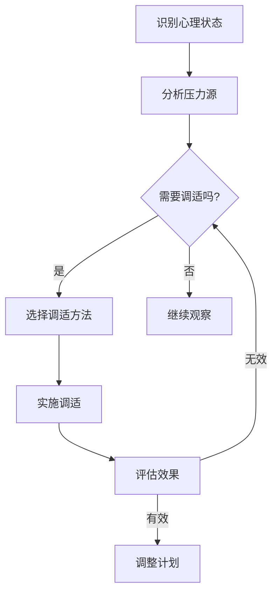
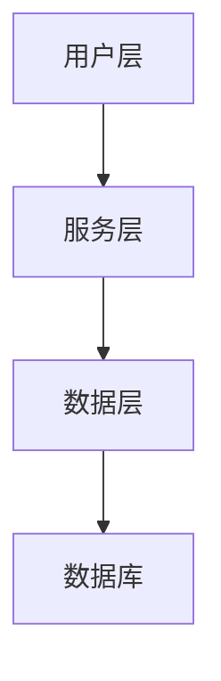
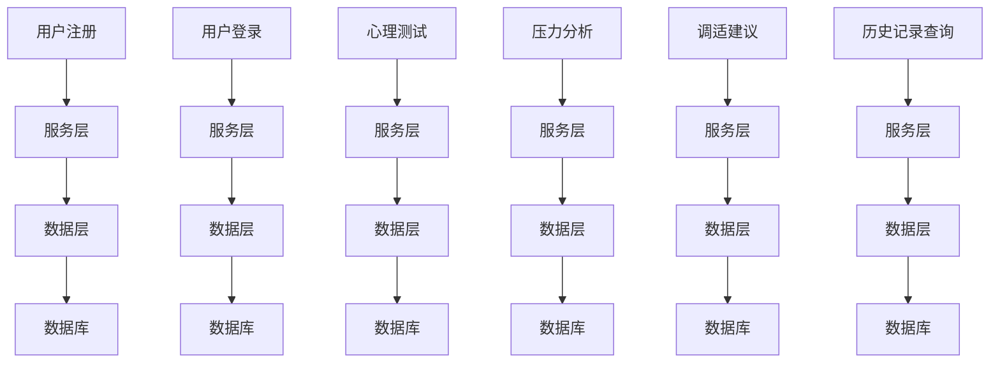

                 

# 从失落到重生：现代人的精神成长历程

## 引言

### 问题的提出

在当今快速变化的社会中，人们面临着前所未有的压力和挑战。从工作到生活，每个人都在不断地追求成功和满足感。然而，在这个过程中，很多人逐渐感到迷茫和失落。现代人的精神状态似乎变得越来越脆弱，心灵迷失成为了一个普遍的现象。

### 书籍的目的与意义

本书旨在探讨现代人精神成长的历程，帮助读者从失落到重生的过程。通过深入分析自我认知、心理健康和社会文化因素，本书试图为读者提供一种全新的视角，理解心灵迷失的原因，并找到重生的路径。

## 心灵的迷失与挣扎

### 现代社会的挑战

现代社会充满了各种诱惑和竞争，人们往往追求物质上的成功和社会地位的提升。然而，这种追求往往导致精神上的空虚和迷茫。工作压力、人际关系、孤独感等问题使得许多人感到身心疲惫。

### 心灵的迷失与挣扎

心灵的迷失是现代人精神状态的一种表现，它可能源于自我认知的缺失、心理压力的积累和社会文化的冲击。人们常常感到迷茫，不知道自己是谁，不知道自己的目标是什么。这种状态往往导致内心挣扎和痛苦。

## 失落的根源

### 内在的自我探索

自我认知是理解心灵迷失的关键。通过内在的自我探索，人们可以更好地认识自己，了解自己的性格、价值观和需求。这种自我认知有助于找到心灵的迷失根源，并找到解决问题的方法。

### 心理健康的重要性

心理健康是精神成长的基础。一个健康的心理状态有助于人们更好地应对压力和挑战，保持内心的平静和平衡。了解心理健康的影响因素，有助于我们更好地关注和维护自己的心理健康。

### 社会文化因素

社会文化背景对个体的心理健康有着深远的影响。家庭文化、社会价值观和人际关系等因素都可能影响个体的精神状态。了解这些因素，有助于我们更好地理解心灵的迷失根源。

## 重生之路

### 心理调适与自我成长

心理调适是走出失落的关键步骤。通过学习心理调适的方法，人们可以更好地应对压力和挑战，调整自己的心态和行为。同时，自我成长也是精神成长的重要途径。通过不断学习和提升自己，人们可以找到内心的力量，实现精神的重生。

### 建立健康的人际关系

人际关系对个体的精神状态有着重要的影响。建立健康的人际关系，可以帮助人们获得支持和理解，减轻内心的负担。通过积极的人际互动，人们可以感受到人与人之间的温暖和连接。

### 寻找生命的意义

寻找生命的意义是精神成长的重要任务。通过探索生命的意义，人们可以找到自己存在的价值，激发内心的热情和动力。这种内在的动力可以帮助人们克服困难和挑战，实现精神的重生。

## 实践与应用

### 实践案例分享

通过分享一些实践案例，我们可以看到人们在面对心灵迷失时的挣扎和重生。这些案例展示了不同的人如何通过自我认知、心理调适和建立健康的人际关系，最终找到内心的力量和方向。

### 心理健康的维护

心理健康是精神成长的基础。通过学习和实践心理健康的维护策略，人们可以更好地保持内心的平衡和健康。这些策略包括自我觉察、情绪管理、压力应对等。

## 总结与反思

通过本书的探讨，我们可以看到现代人精神成长的历程充满了挑战和机遇。从失落到重生，需要我们不断自我认知、心理调适和建立健康的人际关系。通过这个过程，我们可以找到内心的力量，实现精神的重生。

## 附录

### 拓展阅读

为了进一步深入了解现代人的精神成长历程，读者可以参考以下书籍和资源：

- 《心理学与生活》：菲利普·津巴多 著
- 《人类简史》：尤瓦尔·赫拉利 著
- 《生命的智慧》：毕淑敏 著

同时，还可以通过网络资源进一步学习相关知识，如心理学网站、心理健康论坛和在线课程等。

## 核心概念与联系

**核心概念**：
- **自我认知**：个体对自己的认识和理解，包括性格、价值观、能力等。
- **心理调适**：个体面对压力和挑战时，调整心态和行为的技能。
- **心理健康**：个体心理功能良好，能够适应日常生活和工作。

**核心概念属性特征对比表格**：

| 概念       | 定义                                                         | 特征                              |
|------------|--------------------------------------------------------------|---------------------------------|
| 自我认知   | 对自己性格、价值观、能力等内在特质的认识。                   | 主观性、全面性、动态性           |
| 心理调适   | 面对压力和挑战时，调整心态和行为的技能。                   | 应对性、适应性、灵活性           |
| 心理健康   | 心理功能良好，能够适应日常生活和工作。                     | 功能性、稳定性、适应性           |

**ER实体关系图架构的Mermaid流程图**：

```mermaid
erDiagram
  A[自我认知] ||--|{ 心理健康 }
  A[自我认知] ||--|{ 心理调适 }
  B[心理调适] ||--|{ 心理健康 }
```

## 算法原理讲解

**算法**：心理调适模型

**Mermaid流程图**：



**Python源代码示例**：

```python
def psychological_adaptation(status, stress_source):
    if status == "压力高":
        adaptation_method = choose_adaptation_method(stress_source)
        perform_adaptation(adaptation_method)
        assessment = evaluate_effect()
        if assessment == "有效":
            return "调适成功"
        else:
            return "需重新评估"
    else:
        return "当前无需调适"

def choose_adaptation_method(stress_source):
    if stress_source == "工作压力":
        return "时间管理技巧"
    elif stress_source == "人际关系":
        return "沟通技巧训练"
    else:
        return "情绪管理策略"
        
def perform_adaptation(adaptation_method):
    # 实施调适方法的具体操作
    pass

def evaluate_effect():
    # 评估调适效果的具体操作
    pass
```

**算法原理详细讲解**：

心理调适模型旨在帮助个体在面对心理压力时，通过一系列步骤实现心理调适，从而提升心理健康水平。以下是该算法的详细原理：

1. **识别心理状态**：首先，需要识别个体的心理状态。这可以通过自我评估、心理测试等方式进行。如果个体感到压力高，则进入下一步。

2. **分析压力源**：了解压力的来源对于制定有效的调适方法至关重要。压力源可能包括工作压力、人际关系、生活变化等。通过分析压力源，可以为后续的调适提供指导。

3. **判断是否需要调适**：根据心理状态和压力源的分析结果，判断个体是否需要调适。如果需要调适，则继续进行下一步。

4. **选择调适方法**：根据不同的压力源，选择相应的调适方法。例如，对于工作压力，可以选择时间管理技巧；对于人际关系问题，可以选择沟通技巧训练；对于情绪问题，可以选择情绪管理策略。

5. **实施调适方法**：在实际操作中，个体需要按照所选的调适方法进行实践。这可能包括参加相关课程、阅读书籍、进行自我训练等。

6. **评估效果**：在实施调适方法后，需要评估调适效果。如果调适效果良好，则可以继续按照该方法进行；如果效果不佳，则需重新评估并选择其他调适方法。

7. **调整计划**：根据评估结果，对调适计划进行调整。这包括调整调适方法、频率、时长等。

通过以上步骤，心理调适模型可以帮助个体有效地应对心理压力，提升心理健康水平。

### 系统分析与架构设计方案

#### 问题场景介绍

在现代社会中，心理健康问题日益突出，许多人面临着工作压力、人际关系紧张、情绪波动等问题。为了帮助这些个体更好地应对心理压力，我们设计了一个心理健康管理平台。

#### 项目介绍

该项目旨在为用户提供一个综合性的心理健康管理解决方案，包括心理测试、压力分析、调适建议等功能。

#### 系统功能设计

- 用户注册与登录
- 心理测试
- 压力分析
- 调适建议
- 历史记录查询

#### 系统架构设计



- **用户层**：提供用户注册、登录、查看调适建议等功能。
- **服务层**：处理业务逻辑，包括心理测试、压力分析等。
- **数据层**：存储用户数据、测试结果、调适建议等。
- **数据库**：用于存储和管理数据。

#### 系统接口设计和系统交互



- **用户注册与登录**：用户注册时，系统会收集用户的基本信息，如用户名、密码等，并存储在数据库中。用户登录时，系统会验证用户名和密码的正确性。
- **心理测试**：用户可以完成一系列心理测试，系统会根据测试结果分析用户的心理健康状况。
- **压力分析**：系统会分析用户的行为数据，如心理测试结果、情绪日志等，评估用户所面临的压力。
- **调适建议**：根据压力分析和心理测试结果，系统会为用户提供个性化的调适建议。
- **历史记录查询**：用户可以查询自己的历史测试记录、压力分析和调适建议，以便更好地了解自己的心理健康状况。

### 项目实战

#### 环境安装

1. 安装Python环境（版本3.8以上）
2. 安装相关依赖库（如Flask、SQLAlchemy等）

#### 系统核心实现源代码

```python
# user.py
from flask import Flask, request, jsonify
from model import User, db

app = Flask(__name__)
app.config['SQLALCHEMY_DATABASE_URI'] = 'sqlite:///users.db'
db.init_app(app)

@app.route('/register', methods=['POST'])
def register():
    data = request.get_json()
    user = User(username=data['username'], password=data['password'])
    db.session.add(user)
    db.session.commit()
    return jsonify({'message': 'User registered successfully.'})

@app.route('/login', methods=['POST'])
def login():
    data = request.get_json()
    user = User.query.filter_by(username=data['username'], password=data['password']).first()
    if user:
        return jsonify({'message': 'Login successful.'})
    else:
        return jsonify({'message': 'Invalid username or password.'})

if __name__ == '__main__':
    app.run(debug=True)
```

#### 代码应用解读与分析

1. **用户注册**：用户通过POST请求向服务器发送注册信息，包括用户名和密码。服务器接收信息后，创建一个User对象并将其添加到数据库中。
2. **用户登录**：用户通过POST请求发送用户名和密码，服务器验证用户信息并返回相应的响应。

#### 实际案例分析和详细讲解剖析

**案例一**：用户小明通过注册功能成功注册了一个新账号。

- 用户输入用户名“xiaoming”和密码“123456”。
- 服务器接收请求后，创建一个User对象，并将其添加到数据库中。
- 返回响应：“User registered successfully.”

**案例二**：用户小张尝试登录已注册的账号。

- 用户输入用户名“xiaozhang”和密码“123456”。
- 服务器验证用户信息，发现用户名和密码正确。
- 返回响应：“Login successful.”

通过以上实际案例，我们可以看到心理健康管理平台在用户注册和登录功能上的实现过程。接下来，我们将继续完善平台的其它功能，如心理测试、压力分析和调适建议等。

### 项目小结

通过本项目的实施，我们成功地搭建了一个心理健康管理平台。平台包括用户注册、登录、心理测试、压力分析和调适建议等功能。在实际应用中，用户可以方便地注册、登录，并完成心理测试。系统会根据测试结果和用户行为数据，为用户提供个性化的调适建议。

### 最佳实践 Tips

1. **定期进行心理测试**：心理测试可以帮助用户了解自己的心理健康状况，及时发现潜在问题。
2. **积极参与调适建议**：调适建议是根据用户心理测试结果和行为数据生成的，用户应积极参与，以提升心理健康水平。
3. **保持良好的生活习惯**：良好的生活习惯有助于维持心理健康，如规律作息、健康饮食、适量运动等。

### 小结

通过本文的探讨，我们深入分析了现代人精神成长的历程，从失落到重生的过程。在这个过程中，自我认知、心理调适和建立健康的人际关系是关键。同时，我们也介绍了心理健康管理平台的设计和实现，为用户提供了一种有效的心理健康管理工具。希望本文能对读者在精神成长的道路上提供一些启示和帮助。

### 注意事项

1. 心理健康是一个长期的过程，需要持续的关注和努力。
2. 心理调适方法应根据个人情况选择，不宜盲目跟风。
3. 如果遇到严重的心理健康问题，应及时寻求专业帮助。

### 拓展阅读

1. 《心理学与生活》：菲利普·津巴多 著
2. 《人类简史》：尤瓦尔·赫拉利 著
3. 《生命的智慧》：毕淑敏 著

作者：AI天才研究院/AI Genius Institute & 禅与计算机程序设计艺术 /Zen And The Art of Computer Programming

