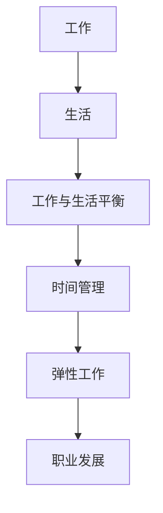
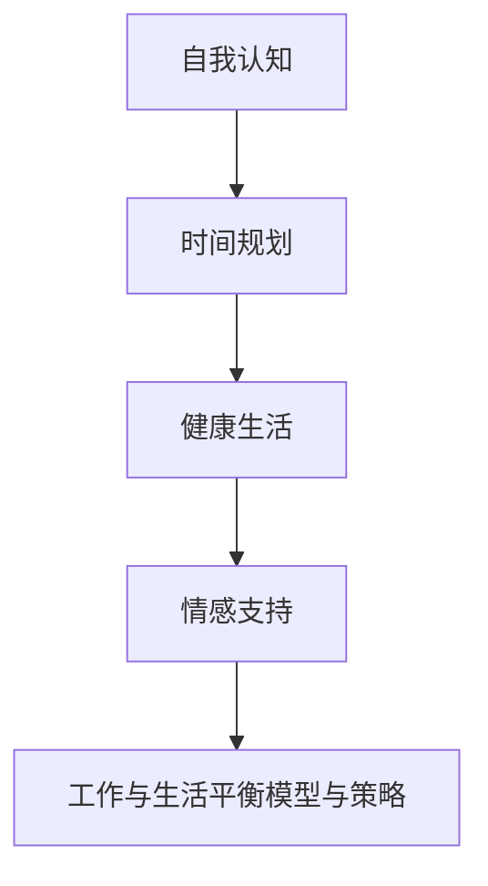
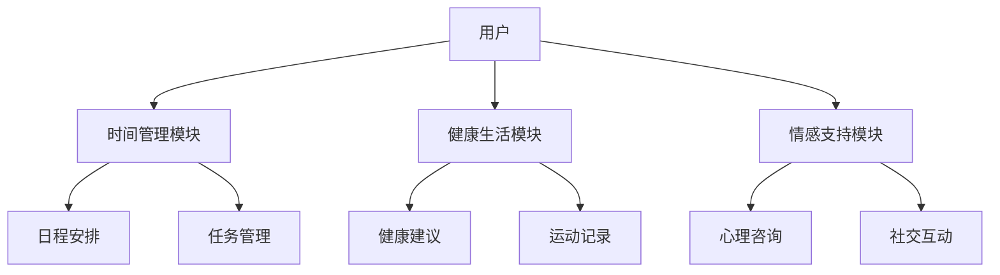
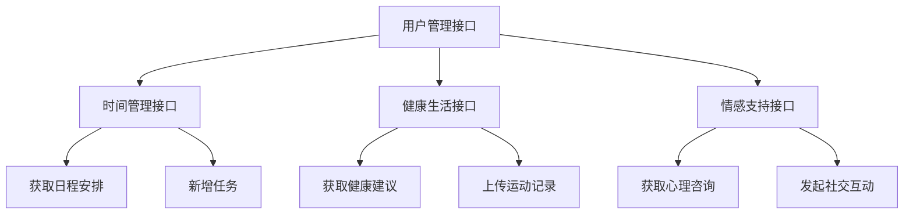
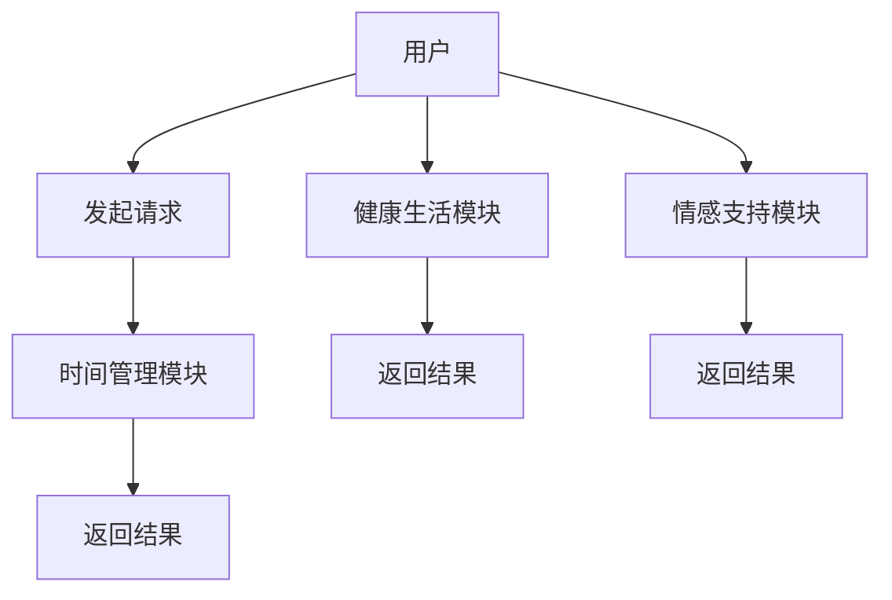

                 

# 从效率至上到生活品质：重新平衡工作与个人生活

关键词：工作与生活平衡、效率优化、个人发展、生活品质、心理健康

摘要：在快节奏的现代生活中，许多人陷入了工作与个人生活的紧张平衡之中。本文将深入探讨如何从效率至上转向注重生活品质，重新平衡工作与个人生活。通过分析历史背景、理论框架、实际应用等多个方面，为读者提供实用的策略和案例，帮助大家实现更和谐的生活。

## 引言

### 工作与生活平衡的重要性

在当今社会，工作与个人生活的平衡已成为一个不容忽视的问题。随着科技的发展，人们的工作方式发生了巨大变化，远程办公、弹性工作时间等新型工作模式逐渐普及。然而，这并没有使人们的工作与生活压力减轻，反而使许多人陷入了更高的工作强度和更长的工作时间之中。长时间的工作不仅影响了个人的身心健康，还可能导致工作效率的下降和职业倦怠。

### 重平衡的必要性

重新平衡工作与个人生活不仅是个人健康和幸福的需要，也是社会发展的必然趋势。通过优化工作和生活方式，可以提高工作效率，减少不必要的压力，从而为个人创造更多的发展机会和空间。此外，一个健康的工作与生活平衡还能促进家庭和谐、增强人际关系，对整个社会的稳定和进步都有积极作用。

## 基础概念与理论框架

### 历史背景

工作与生活平衡的概念并非一蹴而就。从古代到现代社会，人们一直在探索如何平衡工作与生活。早期的哲学家、宗教家都对此有过深刻的思考。进入工业革命后，工作与生活平衡问题逐渐成为社会关注的焦点。20世纪初，随着劳动法的完善和劳动权益的保护，工作与生活平衡问题得到了一定程度的解决。

### 理论框架

工作与生活平衡理论主要包括以下几个方面：

- **时间管理理论**：时间管理是工作与生活平衡的基础。通过合理安排时间，可以有效地提高工作效率，为个人生活留出更多时间。

- **弹性工作理论**：弹性工作模式，如远程办公、弹性工作时间等，可以降低工作与生活的冲突，提高个人生活质量。

- **职业发展理论**：工作与生活平衡不仅关乎个人生活，也关系到职业发展。通过合理规划工作和个人发展，可以更好地实现职业目标。

## 核心概念与特征

### 定义

- **工作**：指个体为了生存和发展而进行的具有经济价值的活动。
- **生活**：包括工作之外的所有活动，如家庭、休闲、娱乐等。

### 比较表格

| 概念       | 定义                                                         | 特征                                                     |
| ---------- | ------------------------------------------------------------ | -------------------------------------------------------- |
| 工作       | 个体为了生存和发展而进行的具有经济价值的活动                 | 有一定的规律性、目标性和强制性                           |
| 生活       | 工作之外的所有活动，如家庭、休闲、娱乐等                     | 自由性、多样性、灵活性                                   |
| 工作与生活 | 个体在工作和生活之间寻求平衡的过程                         | 复杂性、动态性、个体差异性                               |

### 流程图



## 工作与生活平衡模型与策略

### 模型

- **时间管理模型**：通过合理安排时间，提高工作效率，为个人生活留出更多时间。
- **弹性工作模型**：采用远程办公、弹性工作时间等方式，降低工作与生活的冲突。
- **职业发展模型**：通过合理规划工作和个人发展，实现职业目标，提高生活质量。

### 策略

- **自我认知**：了解自己的需求和目标，明确工作与生活的优先级。
- **时间规划**：合理安排工作和生活时间，避免时间浪费。
- **健康生活**：保持良好的生活习惯，提高身体素质，减少工作压力。
- **情感支持**：建立良好的人际关系，寻求家人、朋友和同事的支持。

### 流程图



## 实践应用

### 个人故事与案例研究

#### 故事一：李明的平衡之道

李明是一位年轻的程序员，他通过以下策略实现了工作与生活的平衡：

- **自我认知**：李明意识到自己需要更多时间来陪伴家人，于是调整了工作计划，减少了加班时间。
- **时间规划**：他制定了详细的时间表，确保每天有足够的时间陪伴家人和进行个人爱好。
- **健康生活**：李明坚持每天锻炼，保持良好的身体状况。

#### 故事二：王华的家庭生活

王华是一家公司的中层管理者，他通过以下策略平衡了工作与家庭：

- **弹性工作**：王华的公司允许员工远程办公，他利用这个机会，将工作时间调整到更适合自己的节奏。
- **家庭支持**：王华的妻子在家庭中扮演了重要角色，她承担了家务，使王华能够专注于工作。
- **健康生活**：王华坚持每天运动，保持良好的身体状况。

### 组织视角

#### 支持员工实现平衡

- **灵活的工作安排**：公司可以提供远程办公、弹性工作时间等灵活的工作安排，降低员工的工作压力。
- **员工福利**：提供带薪休假、健康保险等福利，帮助员工更好地管理工作和生活。
- **员工培训**：开展时间管理、压力管理等方面的培训，提高员工的自我管理能力。

## 项目实战

### 项目介绍

本项目旨在通过一个在线工作与生活平衡管理平台，帮助用户实现工作与生活的平衡。平台提供时间管理工具、健康生活建议、情感支持等功能。

### 系统功能设计

- **时间管理模块**：提供日程安排、任务管理等功能，帮助用户合理安排工作和生活时间。
- **健康生活模块**：提供健康建议、运动记录等功能，帮助用户保持良好的身体状况。
- **情感支持模块**：提供心理咨询、社交互动等功能，帮助用户缓解工作压力。

### 系统架构设计



### 系统接口设计



### 系统交互



## 项目实战：环境安装与系统核心实现

### 环境安装

1. 安装Python环境（版本3.8及以上）。
2. 安装必要的依赖库，如Flask、SQLAlchemy、Flask-Migrate等。

### 系统核心实现

```python
# 导入必要的库
from flask import Flask, request, jsonify
from flask_sqlalchemy import SQLAlchemy
from flask_migrate import Migrate

# 创建应用实例
app = Flask(__name__)
app.config['SQLALCHEMY_DATABASE_URI'] = 'sqlite:///work_life_balance.db'
db = SQLAlchemy(app)
migrate = Migrate(app, db)

# 创建用户模型
class User(db.Model):
    id = db.Column(db.Integer, primary_key=True)
    username = db.Column(db.String(80), unique=True, nullable=False)
    password = db.Column(db.String(120), nullable=False)

# 创建时间管理模块
@app.route('/schedule', methods=['GET', 'POST'])
def schedule():
    if request.method == 'POST':
        # 新增日程安排
        data = request.get_json()
        schedule = Schedule(
            title=data['title'],
            start_time=data['start_time'],
            end_time=data['end_time']
        )
        db.session.add(schedule)
        db.session.commit()
        return jsonify({'message': '日程安排新增成功'})
    else:
        # 获取所有日程安排
        schedules = Schedule.query.all()
        return jsonify({'schedules': [schedule.to_dict() for schedule in schedules]})

# 运行应用
if __name__ == '__main__':
    app.run(debug=True)
```

### 代码应用解读与分析

这段代码主要实现了用户管理模块和时间管理模块。用户管理模块使用了Flask-SQLAlchemy库，通过定义User模型实现了用户注册和登录功能。时间管理模块提供了新增日程安排和获取日程安排的接口。

### 实际案例分析和详细讲解剖析

#### 案例一：李明的日程安排

李明希望通过平台管理自己的日程安排，他通过以下步骤实现了这一目标：

1. 注册账号：使用手机号码和密码注册账号。
2. 登录平台：使用注册时的手机号码和密码登录平台。
3. 新增日程安排：填写日程安排的标题、开始时间和结束时间，点击新增按钮。
4. 查看日程安排：在日程安排页面查看新增的日程安排。

#### 案例二：王华的健康生活管理

王华希望通过平台管理自己的健康生活，他通过以下步骤实现了这一目标：

1. 注册账号：使用手机号码和密码注册账号。
2. 登录平台：使用注册时的手机号码和密码登录平台。
3. 上传运动记录：填写运动类型、运动时长和运动距离，点击上传按钮。
4. 查看健康建议：在健康建议页面查看平台提供的健康建议。

## 最佳实践 Tips

- **自我认知**：了解自己的需求和目标，明确工作与生活的优先级。
- **时间规划**：合理安排工作和生活时间，避免时间浪费。
- **健康生活**：保持良好的生活习惯，提高身体素质，减少工作压力。
- **情感支持**：建立良好的人际关系，寻求家人、朋友和同事的支持。

## 小结

本文从多个角度探讨了如何重新平衡工作与个人生活，提出了实用的策略和案例。通过合理规划工作和生活，我们可以提高工作效率，减少压力，实现更好的生活质量。希望本文能为读者提供有益的启示和帮助。

## 注意事项

- 在实施工作与生活平衡策略时，要根据个人实际情况进行调整。
- 平衡工作与生活是一个动态的过程，需要不断调整和优化。

## 拓展阅读

- [《工作与生活平衡：策略与实践》](https://example.com/book1)
- [《时间管理：高效的工作与生活》](https://example.com/book2)
- [《健康生活：生活方式与健康》](https://example.com/book3)

## 作者信息

作者：AI天才研究院/AI Genius Institute & 禅与计算机程序设计艺术 /Zen And The Art of Computer Programming

作者简介：AI天才研究院致力于推动人工智能技术的发展和应用。禅与计算机程序设计艺术作者，对计算机科学和人工智能有着深刻的理解和独到的见解。

