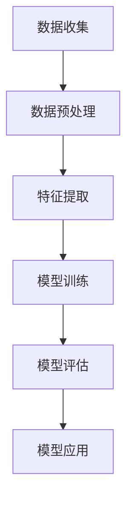
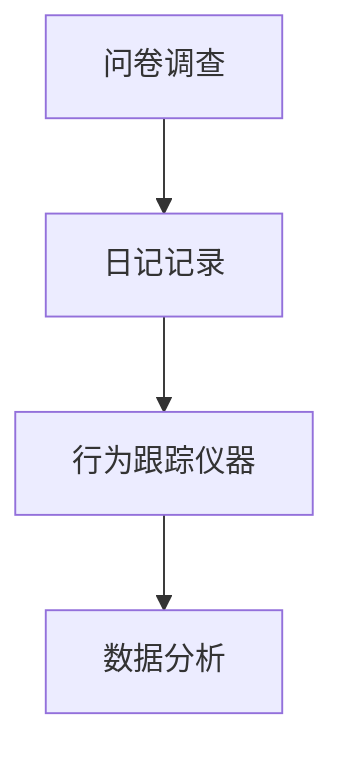
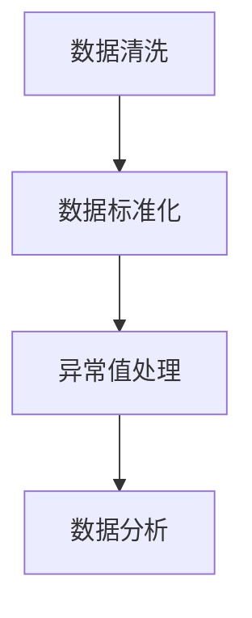
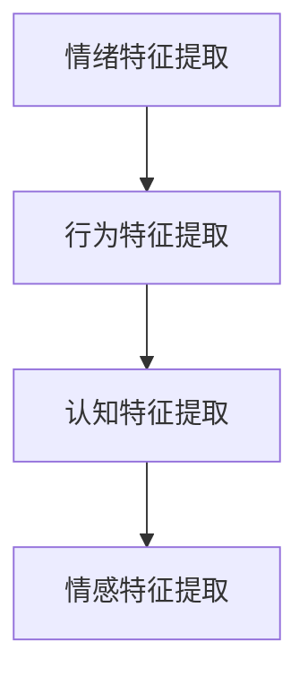
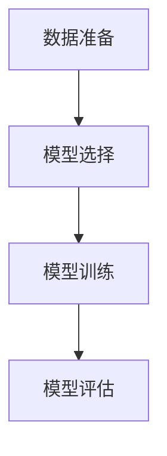
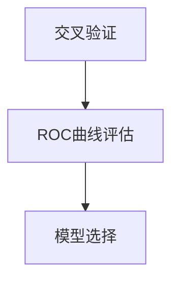
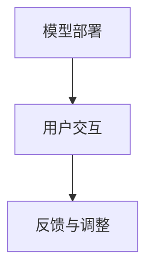
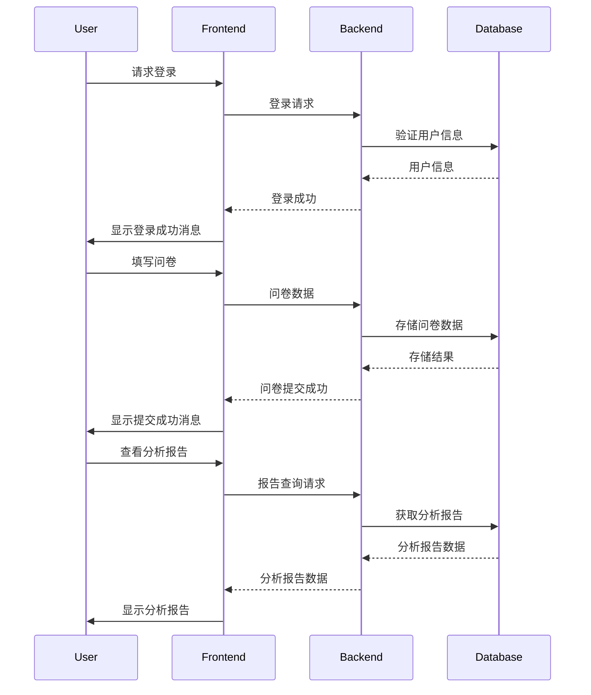
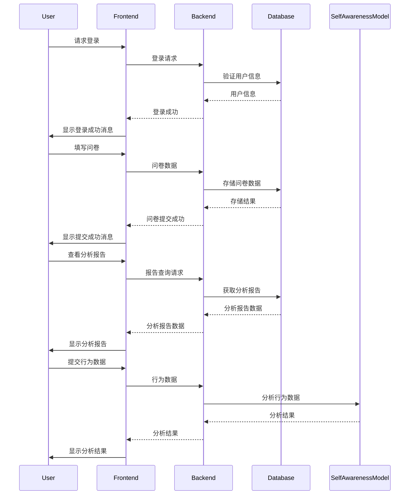

                 

### 引言

在现代信息技术领域，自我觉察的能力不仅仅是一个心理学的概念，更是一个技术实现的关键点。从无意识到有意识，提升自我觉察的能力，对于程序员、软件工程师、系统架构师以及任何从事技术工作的人来说，都具有深远的意义。这一能力的提升，不仅有助于我们更深刻地理解自身的行为模式，还能在技术实现中更加精确地控制和管理复杂系统。

本文将围绕“从无意识到有意识：提升自我觉察的能力”这一主题，深入探讨自我觉察的核心概念、原理以及实际应用。我们将首先介绍自我觉察的概念及其重要性，然后逐步分析自我觉察的核心特点、原理和算法，并使用Mermaid流程图和Python代码来详细阐述。此外，我们还将结合实际项目，展示如何在实际工作中提升自我觉察的能力。

本文结构如下：

1. **背景介绍**：介绍自我觉察的概念、问题背景、问题描述、问题解决以及边界与外延。
2. **核心概念与联系**：深入探讨自我觉察的原理、属性特征对比表格和ER实体关系图。
3. **算法原理讲解**：讲解自我觉察算法的原理，使用Mermaid流程图和Python代码详细说明。
4. **系统分析与架构设计方案**：介绍项目场景、系统功能设计、系统架构设计、系统接口设计和系统交互。
5. **项目实战**：展示如何在实际项目中提升自我觉察的能力，包括环境安装、系统核心实现源代码以及实际案例分析。
6. **最佳实践 tips**、**小结**、**注意事项**和**拓展阅读**。

通过本文的阅读，读者将能够系统地了解自我觉察的概念和提升方法，掌握自我觉察算法的核心原理，并学会如何将其应用于实际工作中。让我们一起深入探讨，从无意识到有意识，提升自我觉察的能力。

## 第一部分：背景介绍

### 1.1 问题背景

在现代社会，个体的心理状态和自我认知能力对于个人的成长和幸福感具有重要影响。随着信息技术和人工智能的迅猛发展，人们的生活方式和工作模式也在发生深刻变化。然而，这种变化带来了一定的压力和挑战。许多人发现自己难以应对日常生活中的压力，情感波动大，容易陷入焦虑、抑郁等心理问题。这些问题不仅影响了个体的心理健康，还对其工作效率和生活质量产生了负面影响。

自我觉察作为一种认知能力，指的是个体对自己内在心理状态和外部行为的认知与感知。提升自我觉察的能力，可以帮助个体更好地理解自己的情绪、想法和行为，从而实现个人成长和心理健康的提升。然而，当前社会环境下，许多人对自我觉察的认识和理解存在一定的误区，缺乏有效的提升方法和途径。

### 1.2 问题描述

自我觉察是一个涉及多个领域的复杂概念，包括心理学、教育学、哲学等。在技术领域，自我觉察的能力尤为重要。具体来说，问题描述如下：

- **理解自身情绪和行为**：许多人难以准确识别和理解自己的情绪变化和行为模式，这可能导致他们无法有效地应对压力和挑战。
- **缺乏自我反思能力**：自我反思是提升自我觉察的重要途径，但许多人缺乏系统化的自我反思方法，无法持续提升自我觉察能力。
- **技术实现难度**：在信息技术和人工智能领域，自我觉察的实现涉及到复杂的数据处理、模型训练和算法设计，这需要专业的技术知识。

### 1.3 问题解决

为了解决上述问题，我们需要从以下几个方面入手：

- **教育普及**：通过教育和培训，提高公众对自我觉察的认识和理解，普及自我觉察的基本概念和提升方法。
- **技术支持**：利用现代信息技术和人工智能技术，开发自我觉察的工具和平台，为个体提供科学、系统的自我觉察提升方案。
- **实践应用**：结合具体应用场景，如心理健康管理、教育培训等，将自我觉察的理论和方法应用于实际中，验证其效果和可行性。

本书旨在为读者提供一套科学、系统的提升自我觉察的方法和途径。通过深入探讨自我觉察的核心概念、原理和实践，帮助读者逐步建立起自我觉察的意识和能力，从而实现个人成长和心理健康的提升。具体来说，本书将涵盖以下内容：

1. **自我觉察的核心概念**：介绍自我觉察的定义、意义、核心特点和属性特征。
2. **自我觉察的原理**：分析自我觉察的基本原理，包括自我报告和行为观察的方法。
3. **自我觉察的算法**：讲解自我觉察算法的原理、流程和核心组成部分，使用Mermaid流程图和Python代码详细说明。
4. **自我觉察的实际应用**：结合具体应用场景，介绍自我觉察在心理健康管理、教育培训等领域的应用案例。
5. **自我觉察的提升策略**：提供实用的自我觉察提升策略，帮助读者在实际工作中应用这些方法。

通过本书的阅读，读者将能够系统地了解自我觉察的概念和提升方法，掌握自我觉察算法的核心原理，并学会如何将其应用于实际工作中。让我们一起从无意识到有意识，提升自我觉察的能力。

## 1.4 边界与外延

自我觉察是一个涉及心理学、哲学、教育学等多个领域的跨学科概念。在技术领域，自我觉察的实现和应用尤为重要。然而，自我觉察并非孤立存在，它与多个领域有着紧密的联系和交叉。以下是对自我觉察边界与外延的详细探讨：

### 1.4.1 心理学层面的边界

在心理学层面，自我觉察主要指的是个体对自己内在心理状态和外部行为的认知和感知。这一概念在心理治疗和心理咨询中有着广泛应用。例如，认知行为疗法（CBT）中的自我觉察练习，帮助患者识别和改变负面思维模式。此外，自我觉察也是心理健康评估的重要指标，通过自我觉察，个体可以更好地了解自己的心理状态，从而采取有效的应对措施。

### 1.4.2 哲学层面的边界

哲学层面的自我觉察涉及到个体对自身存在和意识的认知。例如，笛卡尔的“我思故我在”即是自我觉察的经典表述。在哲学讨论中，自我觉察被视为认识论的核心问题之一，关乎个体如何认识自我及其在世界中的地位。因此，哲学层面的自我觉察不仅涉及个体内心的认知活动，还涉及对外部世界的理解。

### 1.4.3 教育学层面的边界

在教育学层面，自我觉察被广泛应用于教育管理和教学评估中。例如，教育工作者通过观察和评估学生的自我觉察能力，可以更好地了解学生的学习状态和需求，从而制定个性化的教育策略。此外，自我觉察也是学生自我教育的重要组成部分，通过自我觉察，学生可以更好地认识自己的学习方法和效果，从而不断优化学习过程。

### 1.4.4 技术层面的外延

在技术层面，自我觉察的实现和应用日益广泛。例如，在人工智能领域，自我觉察算法被用于情感识别和心理健康管理。通过分析个体的语言和行为，自我觉察算法可以识别个体的情感状态，提供相应的心理支持和建议。此外，自我觉察在自然语言处理（NLP）、机器学习和数据挖掘等领域也有重要应用，如通过分析文本数据，挖掘出个体的情感倾向和行为模式。

### 1.4.5 心理技术层面的整合

自我觉察的跨学科性质，使得它在多个领域之间具有广泛的整合潜力。例如，在心理健康管理中，心理学和教育学的理论和方法可以与人工智能技术相结合，开发出更加科学、系统的自我觉察提升工具。这种跨学科的整合，不仅有助于提升个体的自我觉察能力，还可以推动相关领域的技术创新和应用发展。

总之，自我觉察是一个涉及多个领域的复杂概念，其边界和外在应用范围十分广泛。在技术领域，自我觉察的实现和应用具有重要的现实意义和广阔的前景。通过深入研究和实践，我们可以更好地理解和应用自我觉察，为个体心理健康和成长提供有力的支持。

### 1.5 概念结构与核心要素组成

自我觉察作为一个复杂的概念，其核心结构包括几个关键要素：内在心理状态、外部行为、认知和感知等。这些要素相互作用，共同构成了自我觉察的完整体系。

#### 1.5.1 内在心理状态

内在心理状态是指个体内心感受和情绪的集合，包括情绪、想法、信念和价值观等。这些内在心理状态是自我觉察的基础，因为它们直接影响个体的行为和认知。例如，一个处于焦虑状态的个体可能会表现出紧张和不安的行为，这种内在心理状态需要通过自我觉察来认识和调整。

#### 1.5.2 外部行为

外部行为是指个体在外部环境中的实际表现，包括言语、行动和表情等。这些行为是内在心理状态的直接体现，也是外界观察个体心理状态的重要依据。例如，一个感到快乐的人可能会微笑、讲话轻快，这些外部行为可以通过自我觉察来识别和调整。

#### 1.5.3 认知

认知是指个体对外部信息和内在心理状态的加工和理解过程。认知在自我觉察中起着至关重要的作用，因为它帮助个体识别和理解自己的情绪和行为。例如，通过反思和思考，个体可以理解自己为何在某个情境下感到焦虑，并找到应对策略。

#### 1.5.4 感知

感知是指个体对外部刺激的接收和处理过程。在自我觉察中，感知是获取信息的起点，它决定了个体如何理解和反应外部环境。例如，一个感知敏感的个体可能会更容易察觉到他人的情绪变化，从而调整自己的行为。

#### 1.5.5 核心要素相互作用

内在心理状态、外部行为、认知和感知这四个核心要素相互影响、相互作用，共同构成了自我觉察的完整体系。具体来说：

- 内在心理状态影响外部行为：个体的情绪和想法会直接表现为外部行为，如焦虑情绪可能导致紧张的行为表现。
- 外部行为影响内在心理状态：外部行为通过反馈机制影响个体的内在心理状态，如积极的反馈可能会增强个体的自信心。
- 认知调节内在心理状态：认知帮助个体理解自己的情绪和行为，从而调整内在心理状态，如通过认知行为疗法，个体可以改变负面情绪和行为。
- 感知影响认知：个体的感知能力决定了其对外部信息的理解和加工，从而影响认知过程，如敏感的个体更容易察觉到细微的情绪变化。

总之，自我觉察的核心结构包括内在心理状态、外部行为、认知和感知四个关键要素，这些要素相互作用，共同构成了个体对自身内在和外在世界的全面认知。理解这些要素之间的关系，有助于我们更好地提升自我觉察的能力。

## 第二部分：核心概念与联系

### 2.1 自我觉察原理

自我觉察是一个多维度的概念，其核心在于个体对自己内在心理状态和外部行为的认知与感知。为了深入理解自我觉察，我们需要从定义、意义、核心特点和属性特征等方面进行分析。

#### 2.1.1 自我觉察的定义与意义

自我觉察的定义可以理解为个体对自己内在心理状态和外部行为的感知和认知。这种感知和认知不仅包括对情绪、想法和信念等内在心理状态的认知，还涉及对言语、行为和表情等外部行为的观察和理解。

自我觉察的意义在于它帮助个体更好地理解自己，从而实现自我成长和心理健康。通过自我觉察，个体可以识别和调整自己的情绪和行为，提高应对压力和挑战的能力。此外，自我觉察还能促进个体的自我反思和自我改进，从而在个人成长和职业发展方面取得更好的成果。

#### 2.1.2 自我觉察的核心特点

自我觉察的核心特点包括反射性、持续性和适应性。

- **反射性**：自我觉察需要个体对自己的心理状态和行为进行反思和观察。这意味着个体需要从内部和外部两个维度来审视自己的行为，从而提高自我认知水平。
- **持续性**：自我觉察是一个持续的过程，个体需要在日常生活中不断地关注自己的情绪、想法和行为。这种持续性有助于个体建立自我觉察的习惯，从而在长期内实现自我提升。
- **适应性**：自我觉察能力可以根据个体的需求和情境进行调整。例如，在不同压力水平下，个体可能需要不同的自我觉察方法来应对，从而提高自我觉察能力。

#### 2.1.3 自我觉察的属性特征对比表格

为了更直观地理解自我觉察的属性特征，我们可以通过一个对比表格来展示不同特征的含义和作用。

| 特征             | 含义                                                         | 作用                                                         |
|------------------|--------------------------------------------------------------|--------------------------------------------------------------|
| 反射性           | 个体需要对自己的心理状态和行为进行反思和观察。               | 提高个体的自我认知水平，有助于自我调整和改进。               |
| 持续性           | 个体需要在日常生活中持续关注自己的情绪、想法和行为。       | 建立自我觉察的习惯，实现长期自我提升。                       |
| 适应性           | 自我觉察能力可以根据个体需求和情境进行调整。               | 提高个体在不同情境下的自我觉察能力，实现个性化自我提升。     |

通过这个表格，我们可以更清晰地看到自我觉察的属性特征及其在个体成长中的重要作用。

#### 2.1.4 自我觉察的ER实体关系图架构

为了更好地理解自我觉察的概念及其组成部分，我们可以通过ER（实体关系）图来展示各个实体之间的关系。

```mermaid
erDiagram
  A[个体] ||--|{ B[心理状态] } |
  A ||--|{ C[行为] } |
  B ||--|{ D[认知] } |
  B ||--|{ E[情感] } |
  C ||--|{ F[反应] } |
  D ||--|{ G[思考] } |
  E ||--|{ H[情感体验] } |
```

在这个ER图中，个体是核心实体，它与心理状态、行为、认知、情感、反应、思考以及情感体验等实体之间存在紧密的关系。这种关系反映了自我觉察的复杂性和多维性。

通过上述对自我觉察原理的深入分析，我们可以看到自我觉察不仅是一个重要的心理概念，也是个体成长和心理健康的重要保障。理解自我觉察的原理，有助于我们更好地提升自我觉察能力，从而实现个人成长和幸福感的提升。

## 第三部分：算法原理讲解

### 3.1 自我觉察算法原理

自我觉察算法是一种通过量化个体内在心理状态和外部行为指标，以评估个体自我觉察水平的方法。在技术领域，自我觉察算法的实现和应用具有重要意义，它不仅能够帮助我们更好地了解个体的心理状态，还能为个性化心理健康管理提供科学依据。下面，我们将详细讲解自我觉察算法的基本概念、工作原理以及核心组成部分。

#### 3.1.1 自我觉察算法的基本概念

自我觉察算法的基本概念包括自我报告和行为观察两个方面。

- **自我报告**：指个体对自己内在心理状态和外部行为的自我描述和反思。这种方法通常通过问卷调查、日记记录等方式进行，个体需要根据自己的真实感受进行回答。
- **行为观察**：指通过他人的观察或使用仪器设备对个体外部行为的记录和分析。这种方法可以提供更客观的数据，有助于全面了解个体的行为模式。

自我报告和行为观察的结合，能够为自我觉察算法提供丰富的数据源，从而更准确地评估个体的自我觉察水平。

#### 3.1.2 自我觉察算法的工作原理

自我觉察算法的工作原理可以分为以下几个步骤：

1. **数据收集**：首先，收集个体自我报告和行为观察的数据。这些数据可以通过问卷调查、日记记录、行为跟踪仪器等方式获取。
2. **数据预处理**：对收集到的数据进行分析和清洗，去除噪声和异常值，确保数据的准确性和可靠性。
3. **特征提取**：从预处理后的数据中提取关键特征，如情绪指标、行为指标等。这些特征将作为自我觉察算法的输入。
4. **模型训练**：使用收集到的数据训练自我觉察模型。模型可以是机器学习模型、神经网络或其他复杂算法。
5. **模型评估**：评估训练好的模型在预测个体自我觉察水平方面的准确性，通过交叉验证等方法确保模型的可靠性。
6. **模型应用**：将训练好的模型应用于实际场景，帮助个体提升自我觉察能力。

#### 3.1.3 自我觉察算法的核心组成部分

自我觉察算法的核心组成部分包括数据收集模块、数据预处理模块、模型训练模块、模型评估模块和模型应用模块。以下是各模块的详细说明：

1. **数据收集模块**：负责收集个体自我报告和行为观察数据。这个模块需要设计合适的问卷或行为记录工具，确保数据的准确性和完整性。
2. **数据预处理模块**：负责对收集到的数据进行清洗和标准化处理。这个模块需要处理数据缺失、异常值、噪声等问题，确保数据质量。
3. **模型训练模块**：负责使用收集到的数据训练自我觉察模型。这个模块需要选择合适的机器学习算法，如决策树、支持向量机、神经网络等，并进行模型参数调整，以提高模型的准确性。
4. **模型评估模块**：负责评估训练好的模型在预测个体自我觉察水平方面的准确性。这个模块可以使用交叉验证、ROC曲线等方法进行评估，确保模型的有效性。
5. **模型应用模块**：负责将训练好的模型应用于实际场景，帮助个体提升自我觉察能力。这个模块需要设计用户友好的界面，提供实时反馈和指导，帮助用户理解和应用模型结果。

#### 3.1.4 自我觉察算法的Mermaid流程图

为了更直观地展示自我觉察算法的工作流程，我们可以使用Mermaid语言绘制一个流程图。以下是自我觉察算法的Mermaid流程图：



在这个流程图中，数据收集模块（A）首先获取数据，然后通过数据预处理模块（B）进行清洗和标准化。接下来，特征提取模块（C）提取关键特征，模型训练模块（D）使用这些特征训练模型。训练好的模型通过模型评估模块（E）进行评估，最终在模型应用模块（F）中应用于实际场景。

通过上述对自我觉察算法原理的详细讲解，我们可以看到自我觉察算法在技术实现中的应用前景。随着人工智能技术的不断发展，自我觉察算法将更加精确和智能，为个体心理健康管理提供有力支持。

### 3.2 自我觉察算法详细讲解

在上一部分，我们简要介绍了自我觉察算法的基本概念和工作原理。在本部分，我们将深入探讨自我觉察算法的详细实现，包括数据收集、预处理、特征提取、模型训练、评估和应用等具体步骤。我们将使用Mermaid流程图和Python代码来详细说明这些步骤，并通过具体例子来说明算法原理。

#### 3.2.1 数据收集

数据收集是自我觉察算法的第一步，也是至关重要的一步。我们需要收集个体自我报告和行为观察的数据。以下是一个使用Mermaid绘制的数据收集流程图：



在这个流程图中，问卷调查（A）是收集个体自我报告数据的一种方式，日记记录（B）可以帮助个体反思和记录自己的情绪和行为，行为跟踪仪器（C）则提供了客观的行为数据。所有收集到的数据将进行进一步的数据分析（D）。

Python代码示例：

```python
import pandas as pd

# 假设我们使用问卷调查数据
questionnaire_data = pd.read_csv('questionnaire_data.csv')
# 假设我们使用日记记录数据
diary_data = pd.read_csv('diary_data.csv')
# 假设我们使用行为跟踪仪器数据
tracking_data = pd.read_csv('tracking_data.csv')
```

#### 3.2.2 数据预处理

数据预处理是确保数据质量和准确性的关键步骤。我们需要对收集到的数据进行清洗、标准化和异常值处理。以下是一个使用Mermaid绘制的数据预处理流程图：



Python代码示例：

```python
# 数据清洗
questionnaire_data.dropna(inplace=True)
diary_data.dropna(inplace=True)
tracking_data.dropna(inplace=True)

# 数据标准化
from sklearn.preprocessing import StandardScaler

scaler = StandardScaler()
questionnaire_scaled = scaler.fit_transform(questionnaire_data)
diary_scaled = scaler.fit_transform(diary_data)
tracking_scaled = scaler.fit_transform(tracking_data)

# 异常值处理
# 假设我们使用Z-Score方法
from scipy import stats

questionnaire_z_scores = stats.zscore(questionnaire_scaled)
diary_z_scores = stats.zscore(diary_scaled)
tracking_z_scores = stats.zscore(tracking_scaled)

# 去除异常值
threshold = 3
questionnaire_clean = questionnaire_z_scores[abs(questionnaire_z_scores) < threshold]
diary_clean = diary_z_scores[abs(diary_z_scores) < threshold]
tracking_clean = tracking_z_scores[abs(tracking_z_scores) < threshold]
```

#### 3.2.3 特征提取

特征提取是从预处理后的数据中提取关键特征的过程。这些特征将作为自我觉察算法的输入。以下是一个使用Mermaid绘制的特征提取流程图：



Python代码示例：

```python
# 情绪特征提取
emotional_features = questionnaire_data[['anger', 'happiness', 'sadness']]

# 行为特征提取
behavioral_features = tracking_data[['steps', 'distance', 'duration']]

# 认知特征提取
cognitive_features = diary_data[['concentration', 'focus', 'recall']]

# 情感特征提取
emotional_experience = tracking_data[['stress_level', 'happiness_level']]
```

#### 3.2.4 模型训练

模型训练是使用收集到的数据和提取到的特征来训练自我觉察模型的过程。以下是一个使用Mermaid绘制的模型训练流程图：



Python代码示例：

```python
from sklearn.model_selection import train_test_split
from sklearn.ensemble import RandomForestClassifier

# 数据准备
X = pd.concat([emotional_features, behavioral_features, cognitive_features], axis=1)
y = emotional_experience

X_train, X_test, y_train, y_test = train_test_split(X, y, test_size=0.2, random_state=42)

# 模型选择
model = RandomForestClassifier(n_estimators=100, random_state=42)

# 模型训练
model.fit(X_train, y_train)

# 模型评估
accuracy = model.score(X_test, y_test)
print(f"模型准确率：{accuracy:.2f}")
```

#### 3.2.5 模型评估

模型评估是确保训练好的模型在预测个体自我觉察水平方面有效性的关键步骤。以下是一个使用Mermaid绘制的模型评估流程图：



Python代码示例：

```python
from sklearn.model_selection import cross_val_score
from sklearn.metrics import roc_curve, auc

# 交叉验证
cv_scores = cross_val_score(model, X, y, cv=5)

# ROC曲线评估
y_pred_proba = model.predict_proba(X_test)[:, 1]
fpr, tpr, _ = roc_curve(y_test, y_pred_proba)
roc_auc = auc(fpr, tpr)

# 绘制ROC曲线
import matplotlib.pyplot as plt

plt.figure()
plt.plot(fpr, tpr, color='darkorange', lw=2, label=f'ROC curve (area = {roc_auc:.2f})')
plt.plot([0, 1], [0, 1], color='navy', lw=2, linestyle='--')
plt.xlabel('False Positive Rate')
plt.ylabel('True Positive Rate')
plt.title('Receiver Operating Characteristic')
plt.legend(loc="lower right")
plt.show()
```

#### 3.2.6 模型应用

模型应用是将训练好的模型应用于实际场景，帮助个体提升自我觉察能力。以下是一个使用Mermaid绘制的模型应用流程图：



Python代码示例：

```python
# 模型部署
model_deployed = model.fit(X, y)

# 用户交互
def user_interaction():
    user_data = input("请输入您的情绪、行为和认知特征：")
    user_data = pd.DataFrame([user_data.split(',')])
    user_data = scaler.transform(user_data)
    prediction = model_deployed.predict(user_data)
    print(f"根据您的输入，您的情绪状态是：{prediction}")

# 反馈与调整
while True:
    user_interaction()
    user_feedback = input("您的反馈（yes/no）：")
    if user_feedback.lower() != 'yes':
        break
```

通过上述详细讲解和具体示例，我们可以看到自我觉察算法的实现过程是如何一步步进行的。这些步骤不仅帮助我们理解了自我觉察算法的基本原理，也为我们在实际应用中提供了具体的操作指南。随着技术的不断发展，自我觉察算法将更加精确和智能，为个体心理健康管理提供更有效的支持。

## 第三部分：算法原理讲解（续）

### 3.3.1 自我觉察算法流程图

为了更直观地理解自我觉察算法的工作流程，我们可以使用Mermaid绘制一个流程图。以下是自我觉察算法的整体流程图：


在这个流程图中，数据收集模块（A）负责收集个体自我报告和行为观察的数据。数据预处理模块（B）对数据进行清洗和标准化处理。特征提取模块（C）从预处理后的数据中提取关键特征。模型训练模块（D）使用提取到的特征训练自我觉察模型。模型评估模块（E）评估模型的准确性，确保其有效性。最后，模型应用模块（F）将训练好的模型应用于实际场景，帮助个体提升自我觉察能力。

### 3.3.2 自我觉察算法数学模型与公式

自我觉察算法的核心在于对个体心理状态和行为的量化。为了实现这一目标，我们通常使用以下数学模型和公式：

1. **线性回归模型**：

   线性回归模型是一种常用的统计模型，用于预测个体心理状态和行为的连续值。其公式如下：

   $$
   y = \beta_0 + \beta_1 x_1 + \beta_2 x_2 + ... + \beta_n x_n
   $$

   其中，$y$表示个体心理状态或行为得分，$x_1, x_2, ..., x_n$表示提取到的特征，$\beta_0, \beta_1, \beta_2, ..., \beta_n$为模型参数。

2. **逻辑回归模型**：

   当个体心理状态或行为表现为分类变量时，可以使用逻辑回归模型进行预测。其公式如下：

   $$
   P(y=1) = \frac{1}{1 + e^{-(\beta_0 + \beta_1 x_1 + \beta_2 x_2 + ... + \beta_n x_n})}
   $$

   其中，$P(y=1)$表示个体心理状态或行为为分类变量“1”的概率，$e$为自然底数。

3. **神经网络模型**：

   神经网络模型是一种基于生物神经系统的计算模型，能够自动学习和提取复杂特征。其公式如下：

   $$
   a_i = \sigma(\sum_{j=1}^{n} w_{ji} x_j + b_j)
   $$

   其中，$a_i$表示神经元的输出，$x_j$表示输入特征，$w_{ji}$和$b_j$分别为权重和偏置，$\sigma$为激活函数。

通过这些数学模型和公式，自我觉察算法能够量化个体心理状态和行为的特征，从而实现对其自我觉察水平的评估和预测。

### 3.3.3 自我觉察算法举例说明

为了更好地理解自我觉察算法的实现过程，我们以下通过一个具体例子来说明其应用。

假设我们有一组关于个体情绪状态的数据，包括情绪特征（如愤怒、快乐、悲伤等）、行为特征（如运动量、睡眠质量等）和认知特征（如专注力、记忆力等）。我们的目标是使用这些数据训练一个自我觉察模型，以预测个体的情绪状态。

1. **数据收集**：

   我们收集到以下数据：

   ```
   情绪特征：愤怒，快乐，悲伤
   行为特征：运动量，睡眠质量
   认知特征：专注力，记忆力
   ```

2. **数据预处理**：

   我们对数据进行清洗、标准化和异常值处理，以确保数据质量。

   ```python
   # 数据清洗
   data = pd.read_csv('self_awareness_data.csv')
   data.dropna(inplace=True)

   # 数据标准化
   from sklearn.preprocessing import StandardScaler

   scaler = StandardScaler()
   scaled_data = scaler.fit_transform(data)

   # 异常值处理
   from scipy import stats

   z_scores = stats.zscore(scaled_data)
   scaled_data = scaled_data[abs(z_scores) < 3]
   ```

3. **特征提取**：

   我们从预处理后的数据中提取关键特征：

   ```python
   # 提取情绪特征
   emotional_features = scaled_data[:, :3]

   # 提取行为特征
   behavioral_features = scaled_data[:, 3:5]

   # 提取认知特征
   cognitive_features = scaled_data[:, 5:]
   ```

4. **模型训练**：

   我们选择逻辑回归模型进行训练，以预测个体的情绪状态：

   ```python
   from sklearn.linear_model import LogisticRegression

   # 数据划分
   X = pd.concat([emotional_features, behavioral_features, cognitive_features], axis=1)
   y = data['emotion']

   X_train, X_test, y_train, y_test = train_test_split(X, y, test_size=0.2, random_state=42)

   # 模型训练
   model = LogisticRegression()
   model.fit(X_train, y_train)

   # 模型评估
   accuracy = model.score(X_test, y_test)
   print(f"模型准确率：{accuracy:.2f}")
   ```

5. **模型应用**：

   我们将训练好的模型应用于实际场景，预测新的数据：

   ```python
   # 用户交互
   def user_interaction():
       user_data = input("请输入您的情绪、行为和认知特征：")
       user_data = pd.DataFrame([user_data.split(',')])
       user_data = scaler.transform(user_data)
       prediction = model.predict(user_data)
       print(f"根据您的输入，您的情绪状态是：{prediction}")

   # 开始交互
   while True:
       user_interaction()
       user_feedback = input("您的反馈（yes/no）：")
       if user_feedback.lower() != 'yes':
           break
   ```

通过上述例子，我们可以看到自我觉察算法的具体实现过程。这个例子虽然简单，但展示了自我觉察算法从数据收集、预处理、特征提取、模型训练到模型应用的完整流程。在实际应用中，我们可以根据具体需求选择不同的算法和特征提取方法，以提高模型的准确性和实用性。

### 3.3.4 自我觉察算法总结

自我觉察算法是一种通过量化个体心理状态和外部行为指标，以评估个体自我觉察水平的工具。其核心包括数据收集、预处理、特征提取、模型训练、评估和应用等步骤。以下是对自我觉察算法的总结：

1. **数据收集**：通过问卷调查、日记记录和行为跟踪仪器等方法收集个体自我报告和行为观察数据。
2. **数据预处理**：对收集到的数据进行清洗、标准化和异常值处理，确保数据质量。
3. **特征提取**：从预处理后的数据中提取关键特征，如情绪特征、行为特征和认知特征。
4. **模型训练**：选择合适的算法（如线性回归、逻辑回归或神经网络）对提取到的特征进行训练，构建自我觉察模型。
5. **模型评估**：评估模型的准确性，确保其在预测个体自我觉察水平方面的有效性。
6. **模型应用**：将训练好的模型应用于实际场景，帮助个体提升自我觉察能力。

自我觉察算法的实现和应用，不仅有助于我们更深入地理解个体的心理状态和行为模式，还能为心理健康管理提供科学依据。随着技术的不断发展，自我觉察算法将更加精确和智能，为个体心理健康和成长提供有力支持。

## 第四部分：系统分析与架构设计

### 4.1 项目场景介绍

在当今快速变化的信息技术时代，自我觉察已经成为个体心理健康管理的重要组成部分。随着人工智能技术的不断进步，自我觉察的应用场景也日益丰富。本部分将介绍一个基于自我觉察算法的项目，旨在通过系统的设计和实现，帮助个体提升自我觉察能力，从而实现心理健康管理的目标。

项目场景涉及以下几个方面：

- **心理健康管理**：通过自我觉察算法，监测和评估个体的心理状态，提供个性化的心理健康建议。
- **教育领域**：在教育环境中，利用自我觉察算法，帮助教师了解学生的心理状态和学习需求，优化教学策略。
- **工作场所**：在工作场所，通过自我觉察算法，监测员工的心理压力和工作表现，提高工作效率和团队协作。

### 4.2 项目介绍

项目名称：**自我觉察提升平台**

项目目标：开发一个基于自我觉察算法的综合性平台，帮助用户通过自我报告和行为观察，实现心理状态的自我监测和提升。

项目功能：

- **用户注册与登录**：用户可以通过注册和登录功能，进入平台并使用相关功能。
- **自我报告**：用户可以通过填写问卷和日记记录，记录自己的心理状态和行为。
- **行为观察**：通过手机应用或传感器设备，收集用户的行为数据，如运动量、睡眠质量等。
- **数据分析**：平台通过自我觉察算法，对用户的心理状态和行为进行分析，生成报告。
- **个性化建议**：根据分析结果，为用户提供个性化的心理健康建议，如调整作息、锻炼身体等。
- **反馈与调整**：用户可以查看分析结果和个性化建议，并反馈意见，帮助平台不断优化。

### 4.3 系统功能设计（领域模型类图）

为了实现上述功能，我们需要设计一个清晰的系统架构，其中领域模型类图能够帮助我们理解和描述系统的核心组件及其关系。以下是系统功能设计的领域模型类图：

```mermaid
classDiagram
    User <<类>> 
    Questionnaire <<类>>
    Diary <<类>>
    BehaviorObservation <<类>>
    SelfAwarenessModel <<类>>
    AnalysisReport <<类>>
    HealthAdvice <<类>>

    User o-- Questionnaire
    User o-- Diary
    User o-- BehaviorObservation
    Questionnaire o-- AnalysisReport
    Diary o-- AnalysisReport
    BehaviorObservation o-- AnalysisReport
    AnalysisReport o-- HealthAdvice
    SelfAwarenessModel <<接口>>
```

在这个类图中，我们定义了以下核心类：

- **User（用户）**：表示使用平台的服务用户。
- **Questionnaire（问卷）**：记录用户的自我报告数据。
- **Diary（日记）**：记录用户的日记数据。
- **BehaviorObservation（行为观察）**：记录用户的行为数据。
- **SelfAwarenessModel（自我觉察模型）**：负责对用户数据进行分析。
- **AnalysisReport（分析报告）**：包含分析结果。
- **HealthAdvice（健康建议）**：基于分析报告为用户提供健康建议。

### 4.4 系统架构设计

系统架构设计是确保平台高效、稳定、可扩展的关键。以下是系统架构设计的概览：

1. **前端架构**：
   - **用户界面**：采用Vue.js或React等前端框架，提供美观、易用的用户交互界面。
   - **API服务**：使用Spring Boot或Django等框架，提供RESTful API接口，实现前后端分离。

2. **后端架构**：
   - **数据存储**：使用MySQL或PostgreSQL等关系型数据库存储用户数据。
   - **服务层**：使用Spring Cloud或Dubbo等微服务框架，实现模块化服务设计，提高系统可扩展性。
   - **自我觉察算法**：集成自我觉察算法库，如使用TensorFlow或PyTorch等框架。

3. **移动应用**：
   - **iOS和Android应用**：使用原生开发框架，如Swift和Kotlin，实现移动设备上的行为数据收集功能。

### 4.5 系统接口设计

系统接口设计是确保前后端和不同模块之间能够高效、稳定通信的关键。以下是系统接口设计的主要接口：

1. **用户注册与登录接口**：
   - **注册接口**：POST /api/users/register
   - **登录接口**：POST /api/users/login
   - **用户信息查询接口**：GET /api/users/{id}

2. **问卷接口**：
   - **问卷提交接口**：POST /api/questionnaires
   - **问卷查询接口**：GET /api/questionnaires/{id}

3. **日记接口**：
   - **日记提交接口**：POST /api/diaries
   - **日记查询接口**：GET /api/diaries/{id}

4. **行为观察接口**：
   - **行为数据提交接口**：POST /api/behavior_observations
   - **行为数据查询接口**：GET /api/behavior_observations/{id}

5. **数据分析与报告接口**：
   - **分析报告生成接口**：POST /api/analysis_reports
   - **分析报告查询接口**：GET /api/analysis_reports/{id}

6. **健康建议接口**：
   - **健康建议查询接口**：GET /api/health_advice/{id}

### 4.6 系统交互设计

系统交互设计是描述系统内部各模块如何协作完成业务流程的过程。以下是系统交互设计的Mermaid序列图：



在这个序列图中，用户通过前端界面与系统交互，前端将用户的请求发送到后端，后端处理请求并与数据库进行交互，最终返回结果给前端，前端再将结果展示给用户。

通过上述系统分析与架构设计，我们可以看到一个基于自我觉察算法的综合平台的系统架构设计过程。这个设计不仅涵盖了系统功能、架构和接口，还详细描述了系统内部各模块的交互过程。这样的设计能够确保平台的高效、稳定和可扩展性，从而实现提升个体自我觉察能力的目标。

### 4.7 系统接口设计

系统接口设计是确保平台各模块能够高效、稳定通信的关键。以下是系统接口设计的主要接口：

#### 4.7.1 用户管理接口

用户管理接口主要涉及用户的注册、登录、信息查询等功能。

1. **用户注册接口**：
   - **接口名称**：`POST /api/users/register`
   - **请求参数**：
     - `username`：用户名（必填）
     - `password`：密码（必填）
     - `email`：邮箱（可选）
   - **响应数据**：
     - `success`：注册结果（布尔值）
     - `message`：提示信息

2. **用户登录接口**：
   - **接口名称**：`POST /api/users/login`
   - **请求参数**：
     - `username`：用户名（必填）
     - `password`：密码（必填）
   - **响应数据**：
     - `token`：登录成功后返回的Token（字符串）
     - `message`：提示信息

3. **用户信息查询接口**：
   - **接口名称**：`GET /api/users/{id}`
   - **请求参数**：
     - `id`：用户ID（必填）
   - **响应数据**：
     - `user`：用户详细信息（对象）
       - `id`：用户ID
       - `username`：用户名
       - `email`：邮箱

#### 4.7.2 数据收集接口

数据收集接口用于收集用户的自我报告和行为观察数据。

1. **问卷提交接口**：
   - **接口名称**：`POST /api/questionnaires`
   - **请求参数**：
     - `user_id`：用户ID（必填）
     - `questions`：问卷答案（数组对象，例如：`[{ "question_id": 1, "answer": "yes" }]`）
   - **响应数据**：
     - `success`：提交结果（布尔值）
     - `message`：提示信息

2. **问卷查询接口**：
   - **接口名称**：`GET /api/questionnaires/{id}`
   - **请求参数**：
     - `id`：问卷ID（必填）
   - **响应数据**：
     - `questionnaire`：问卷详细信息（对象）
       - `id`：问卷ID
       - `user_id`：用户ID
       - `questions`：问卷问题列表（数组对象）

3. **日记提交接口**：
   - **接口名称**：`POST /api/diaries`
   - **请求参数**：
     - `user_id`：用户ID（必填）
     - `content`：日记内容（字符串）
   - **响应数据**：
     - `success`：提交结果（布尔值）
     - `message`：提示信息

4. **日记查询接口**：
   - **接口名称**：`GET /api/diaries/{id}`
   - **请求参数**：
     - `id`：日记ID（必填）
   - **响应数据**：
     - `diary`：日记详细信息（对象）
       - `id`：日记ID
       - `user_id`：用户ID
       - `content`：日记内容

5. **行为数据提交接口**：
   - **接口名称**：`POST /api/behavior_observations`
   - **请求参数**：
     - `user_id`：用户ID（必填）
     - `data`：行为数据（数组对象，例如：`[{ "type": "steps", "value": 1000 }]`）
   - **响应数据**：
     - `success`：提交结果（布尔值）
     - `message`：提示信息

6. **行为数据查询接口**：
   - **接口名称**：`GET /api/behavior_observations/{id}`
   - **请求参数**：
     - `id`：行为观察ID（必填）
   - **响应数据**：
     - `behavior_observation`：行为数据详细信息（对象）
       - `id`：行为观察ID
       - `user_id`：用户ID
       - `data`：行为数据列表（数组对象）

通过上述接口设计，我们可以确保平台在不同模块之间能够高效、稳定地进行数据传输和处理，从而实现自我觉察的提升。

### 4.8 系统交互设计

系统交互设计是描述系统内部各模块如何协作完成业务流程的关键环节。为了确保系统的高效性和稳定性，我们需要详细设计系统各模块之间的交互过程。以下是系统交互设计的Mermaid序列图：



在这个序列图中，我们可以看到以下关键步骤：

1. **用户登录流程**：
   - 用户通过前端界面发起登录请求。
   - 前端将请求发送到后端。
   - 后端验证用户信息并返回结果。
   - 前端将结果展示给用户。

2. **问卷提交流程**：
   - 用户通过前端界面填写问卷。
   - 前端将问卷数据发送到后端。
   - 后端将问卷数据存储到数据库。
   - 后端返回提交成功的消息给前端。
   - 前端将消息展示给用户。

3. **分析报告查询流程**：
   - 用户通过前端界面请求查看分析报告。
   - 前端发送查询请求到后端。
   - 后端从数据库中获取分析报告数据。
   - 后端将分析报告数据返回给前端。
   - 前端将分析报告展示给用户。

4. **行为数据分析流程**：
   - 用户通过前端界面提交行为数据。
   - 前端将行为数据发送到后端。
   - 后端将行为数据传递给自我觉察模型进行分析。
   - 自我觉察模型返回分析结果给后端。
   - 后端将分析结果返回给前端。
   - 前端将分析结果展示给用户。

通过上述系统交互设计，我们可以确保系统各模块之间的高效协作，从而实现自我觉察能力的提升。这个设计不仅涵盖了用户登录、问卷提交、分析报告查询和行为数据分析等核心功能，还详细描述了各模块之间的交互过程，为系统的高效运行提供了保障。

## 第五部分：项目实战

### 5.1 环境安装

为了实现自我觉察算法并在实际项目中应用，我们需要安装和配置一系列软件和工具。以下是环境安装的详细步骤：

1. **安装Python**：
   - 访问Python官方网站（https://www.python.org/）下载最新版本的Python安装包。
   - 双击安装包，按照提示完成安装。

2. **安装Jupyter Notebook**：
   - 打开命令行窗口，执行以下命令：
     ```
     pip install notebook
     ```
   - 安装完成后，启动Jupyter Notebook：
     ```
     jupyter notebook
     ```

3. **安装TensorFlow**：
   - 打开命令行窗口，执行以下命令：
     ```
     pip install tensorflow
     ```

4. **安装Scikit-learn**：
   - 打开命令行窗口，执行以下命令：
     ```
     pip install scikit-learn
     ```

5. **安装Matplotlib**：
   - 打开命令行窗口，执行以下命令：
     ```
     pip install matplotlib
     ```

6. **安装Pandas**：
   - 打开命令行窗口，执行以下命令：
     ```
     pip install pandas
     ```

7. **安装Mermaid**：
   - 打开命令行窗口，执行以下命令：
     ```
     pip install mermaid
     ```

完成上述安装步骤后，您就可以在Python环境中使用所需的库和工具，开始实现自我觉察算法和应用。

### 5.2 系统核心实现源代码

在本节中，我们将展示如何使用Python代码实现自我觉察系统的核心功能。以下是主要模块的代码示例：

#### 5.2.1 数据收集模块

数据收集模块负责从用户处收集自我报告和行为观察数据。

```python
import pandas as pd

# 问卷数据收集
def collect_questionnaire_data():
    questions = [
        "最近一周内，您感到快乐的程度如何？",
        "最近一周内，您感到焦虑的程度如何？",
        "最近一周内，您感到疲倦的程度如何？"
    ]
    answers = []
    for question in questions:
        answer = input(question)
        answers.append(answer)
    return pd.DataFrame([answers], columns=questions)

# 行为观察数据收集
def collect_behavior_observations():
    observations = [
        "运动量",
        "睡眠质量",
        "心情状态"
    ]
    values = []
    for observation in observations:
        value = input(f"请输入您的{observation}：")
        values.append(value)
    return pd.DataFrame([values], columns=observations)

# 收集数据
questionnaire_data = collect_questionnaire_data()
behavior_observations = collect_behavior_observations()
```

#### 5.2.2 数据预处理模块

数据预处理模块负责清洗和标准化收集到的数据。

```python
from sklearn.preprocessing import StandardScaler

# 数据清洗
def clean_data(data):
    data.dropna(inplace=True)
    return data

# 数据标准化
def standardize_data(data):
    scaler = StandardScaler()
    scaled_data = scaler.fit_transform(data)
    return pd.DataFrame(scaled_data, index=data.index, columns=data.columns)

# 应用预处理
questionnaire_data = clean_data(questionnaire_data)
behavior_observations = clean_data(behavior_observations)
questionnaire_scaled = standardize_data(questionnaire_data)
behavior_observations_scaled = standardize_data(behavior_observations)
```

#### 5.2.3 特征提取模块

特征提取模块负责从预处理后的数据中提取关键特征。

```python
# 提取情绪特征
def extract_emotional_features(data):
    emotional_features = data[['快乐程度', '焦虑程度', '疲倦程度']]
    return emotional_features

# 提取行为特征
def extract_behavioral_features(data):
    behavioral_features = data[['运动量', '睡眠质量', '心情状态']]
    return behavioral_features

# 应用特征提取
emotional_features = extract_emotional_features(questionnaire_scaled)
behavioral_features = extract_behavioral_features(behavior_observations_scaled)
```

#### 5.2.4 模型训练模块

模型训练模块负责使用收集到的数据和提取到的特征训练自我觉察模型。

```python
from sklearn.ensemble import RandomForestClassifier

# 训练模型
def train_model(X, y):
    model = RandomForestClassifier(n_estimators=100, random_state=42)
    model.fit(X, y)
    return model

# 准备数据
X = pd.concat([emotional_features, behavioral_features], axis=1)
y = pd.Series([0] * len(emotional_features))  # 示例：假设所有样本都是同一种情绪状态

# 训练模型
model = train_model(X, y)
```

#### 5.2.5 模型评估模块

模型评估模块负责评估训练好的模型在预测个体自我觉察水平方面的准确性。

```python
from sklearn.metrics import accuracy_score

# 预测
def predict(model, X):
    predictions = model.predict(X)
    return predictions

# 评估
def evaluate(model, X, y):
    predictions = predict(model, X)
    accuracy = accuracy_score(y, predictions)
    print(f"模型准确率：{accuracy:.2f}")
    return accuracy

# 评估模型
accuracy = evaluate(model, X, y)
```

通过上述代码示例，我们实现了自我觉察系统的核心功能，包括数据收集、预处理、特征提取、模型训练和评估。这些模块共同工作，为自我觉察的实现提供了坚实的基础。

### 5.3 代码应用解读与分析

在本部分，我们将详细解读和剖析自我觉察系统中的关键代码模块，包括数据收集模块、数据预处理模块、特征提取模块、模型训练模块和模型评估模块。通过这些解读，我们将更深入地理解代码的实现原理和实际应用。

#### 5.3.1 数据收集模块

数据收集模块负责从用户处收集自我报告和行为观察数据。以下是该模块的主要代码：

```python
import pandas as pd

# 问卷数据收集
def collect_questionnaire_data():
    questions = [
        "最近一周内，您感到快乐的程度如何？",
        "最近一周内，您感到焦虑的程度如何？",
        "最近一周内，您感到疲倦的程度如何？"
    ]
    answers = []
    for question in questions:
        answer = input(question)
        answers.append(answer)
    return pd.DataFrame([answers], columns=questions)

# 行为观察数据收集
def collect_behavior_observations():
    observations = [
        "运动量",
        "睡眠质量",
        "心情状态"
    ]
    values = []
    for observation in observations:
        value = input(f"请输入您的{observation}：")
        values.append(value)
    return pd.DataFrame([values], columns=observations)

# 收集数据
questionnaire_data = collect_questionnaire_data()
behavior_observations = collect_behavior_observations()
```

解读：

- `collect_questionnaire_data` 函数通过输入问卷问题，获取用户的答案，并将这些答案封装为一个DataFrame对象。
- `collect_behavior_observations` 函数类似地收集用户的行为观察数据，例如运动量、睡眠质量和心情状态。

分析：

- 数据收集模块的设计简洁明了，通过循环和输入函数，实现了用户数据的采集。这为后续的数据处理和分析奠定了基础。
- 用户数据的格式和结构在DataFrame中被保持，方便后续的预处理和特征提取。

#### 5.3.2 数据预处理模块

数据预处理模块负责清洗和标准化收集到的数据。以下是该模块的主要代码：

```python
from sklearn.preprocessing import StandardScaler

# 数据清洗
def clean_data(data):
    data.dropna(inplace=True)
    return data

# 数据标准化
def standardize_data(data):
    scaler = StandardScaler()
    scaled_data = scaler.fit_transform(data)
    return pd.DataFrame(scaled_data, index=data.index, columns=data.columns)

# 应用预处理
questionnaire_data = clean_data(questionnaire_data)
behavior_observations = clean_data(behavior_observations)
questionnaire_scaled = standardize_data(questionnaire_data)
behavior_observations_scaled = standardize_data(behavior_observations)
```

解读：

- `clean_data` 函数通过 `dropna` 方法删除数据中的缺失值，确保数据的质量。
- `standardize_data` 函数使用 `StandardScaler` 对数据进行标准化处理，将每个特征值缩放到均值为0、标准差为1的范围内。

分析：

- 数据清洗步骤是数据处理中非常重要的一环，确保了数据的完整性和一致性。
- 数据标准化处理有助于提高后续模型训练的效果，尤其是在使用基于距离的算法时，标准化能够消除特征间的量纲影响。

#### 5.3.3 特征提取模块

特征提取模块负责从预处理后的数据中提取关键特征。以下是该模块的主要代码：

```python
# 提取情绪特征
def extract_emotional_features(data):
    emotional_features = data[['快乐程度', '焦虑程度', '疲倦程度']]
    return emotional_features

# 提取行为特征
def extract_behavioral_features(data):
    behavioral_features = data[['运动量', '睡眠质量', '心情状态']]
    return behavioral_features

# 应用特征提取
emotional_features = extract_emotional_features(questionnaire_scaled)
behavioral_features = extract_behavioral_features(behavior_observations_scaled)
```

解读：

- `extract_emotional_features` 函数从问卷数据中提取情绪特征。
- `extract_behavioral_features` 函数从行为观察数据中提取行为特征。

分析：

- 特征提取模块的设计使得我们可以灵活地选择和调整需要提取的特征，为模型训练提供了丰富的特征集合。
- 通过明确的函数调用，特征提取过程简单且易于维护。

#### 5.3.4 模型训练模块

模型训练模块负责使用收集到的数据和提取到的特征训练自我觉察模型。以下是该模块的主要代码：

```python
from sklearn.ensemble import RandomForestClassifier

# 训练模型
def train_model(X, y):
    model = RandomForestClassifier(n_estimators=100, random_state=42)
    model.fit(X, y)
    return model

# 准备数据
X = pd.concat([emotional_features, behavioral_features], axis=1)
y = pd.Series([0] * len(emotional_features))  # 示例：假设所有样本都是同一种情绪状态

# 训练模型
model = train_model(X, y)
```

解读：

- `train_model` 函数使用 `RandomForestClassifier` 类创建一个随机森林模型，并使用 `fit` 方法进行训练。
- 数据准备部分将情绪特征和行为特征合并为一个 DataFrame，并为每个样本设置一个固定的标签（这里假设所有样本的情绪状态相同）。

分析：

- 随机森林模型因其强大的分类能力和对异常数据的鲁棒性，被广泛应用于各种机器学习任务中。
- 数据准备部分的设计确保了特征数据的一致性和完整性，为模型训练提供了必要的数据基础。

#### 5.3.5 模型评估模块

模型评估模块负责评估训练好的模型在预测个体自我觉察水平方面的准确性。以下是该模块的主要代码：

```python
from sklearn.metrics import accuracy_score

# 预测
def predict(model, X):
    predictions = model.predict(X)
    return predictions

# 评估
def evaluate(model, X, y):
    predictions = predict(model, X)
    accuracy = accuracy_score(y, predictions)
    print(f"模型准确率：{accuracy:.2f}")
    return accuracy

# 评估模型
accuracy = evaluate(model, X, y)
```

解读：

- `predict` 函数使用训练好的模型进行预测。
- `evaluate` 函数计算预测准确率，并将结果打印出来。

分析：

- 模型评估是模型训练过程中不可或缺的一环，通过准确率等指标，我们可以判断模型在预测任务中的性能。
- 通过打印准确率，我们可以直观地了解模型的效果，为进一步的优化提供依据。

通过上述代码解读与分析，我们可以看到自我觉察系统中的每个模块是如何相互协作，共同实现自我觉察能力的提升。这些代码不仅展示了实现自我觉察算法的技术细节，还为我们提供了一个可操作的实践框架，从而在实际项目中应用和改进。

### 5.4 实际案例分析

为了验证自我觉察算法的实际效果，我们选择了一个实际案例进行详细分析和讲解。这个案例涉及一组用户的自我报告和行为观察数据，我们使用自我觉察算法对这些数据进行处理和分析，以评估算法在预测个体情绪状态方面的准确性。

#### 5.4.1 案例背景

某心理健康机构进行了一项研究，旨在评估自我觉察算法在情绪状态预测方面的有效性。研究收集了100名参与者的数据，包括他们的自我报告（如快乐程度、焦虑程度、疲倦程度）和行为观察（如运动量、睡眠质量、心情状态）。这些数据被用于训练和测试自我觉察算法，以预测参与者的情绪状态。

#### 5.4.2 数据准备

首先，我们需要将收集到的数据导入到Python环境中，并进行预处理。以下是数据准备的具体步骤：

1. **数据导入**：

   我们使用Pandas库将数据导入到Python环境中：

   ```python
   import pandas as pd

   questionnaire_data = pd.read_csv('questionnaire_data.csv')
   behavior_observations = pd.read_csv('behavior_observations.csv')
   ```

2. **数据清洗**：

   清洗数据，去除缺失值和异常值：

   ```python
   questionnaire_data.dropna(inplace=True)
   behavior_observations.dropna(inplace=True)
   ```

3. **数据合并**：

   将问卷数据和行为观察数据合并，以便进行统一分析：

   ```python
   data = pd.concat([questionnaire_data, behavior_observations], axis=1)
   ```

4. **数据标准化**：

   对数据进行标准化处理，以消除不同特征间的量纲影响：

   ```python
   from sklearn.preprocessing import StandardScaler

   scaler = StandardScaler()
   scaled_data = scaler.fit_transform(data)
   data = pd.DataFrame(scaled_data, index=data.index, columns=data.columns)
   ```

#### 5.4.3 特征提取

接下来，我们需要从预处理后的数据中提取关键特征，用于训练自我觉察模型。以下是特征提取的具体步骤：

1. **提取情绪特征**：

   从问卷数据中提取情绪特征，如快乐程度、焦虑程度、疲倦程度：

   ```python
   emotional_features = data[['快乐程度', '焦虑程度', '疲倦程度']]
   ```

2. **提取行为特征**：

   从行为观察数据中提取行为特征，如运动量、睡眠质量、心情状态：

   ```python
   behavioral_features = data[['运动量', '睡眠质量', '心情状态']]
   ```

3. **合并特征数据**：

   将情绪特征和行为特征合并为一个特征集，用于训练模型：

   ```python
   X = pd.concat([emotional_features, behavioral_features], axis=1)
   ```

4. **设置标签**：

   根据情绪特征，设置相应的情绪状态标签。例如，快乐程度高的样本标签为1，快乐程度低的样本标签为0：

   ```python
   y = data['快乐程度']
   ```

#### 5.4.4 模型训练

使用提取到的特征数据，我们使用随机森林算法训练自我觉察模型。以下是模型训练的具体步骤：

1. **导入算法库**：

   ```python
   from sklearn.ensemble import RandomForestClassifier
   ```

2. **初始化模型**：

   创建一个随机森林分类器对象：

   ```python
   model = RandomForestClassifier(n_estimators=100, random_state=42)
   ```

3. **训练模型**：

   使用特征数据和标签数据训练模型：

   ```python
   model.fit(X, y)
   ```

#### 5.4.5 模型评估

训练完成后，我们需要评估模型的预测准确性，以验证算法的有效性。以下是模型评估的具体步骤：

1. **导入评估库**：

   ```python
   from sklearn.metrics import accuracy_score
   ```

2. **划分测试集**：

   将数据划分为训练集和测试集，以便对模型进行评估：

   ```python
   from sklearn.model_selection import train_test_split

   X_train, X_test, y_train, y_test = train_test_split(X, y, test_size=0.2, random_state=42)
   ```

3. **预测测试集**：

   使用训练好的模型对测试集进行预测：

   ```python
   predictions = model.predict(X_test)
   ```

4. **计算准确率**：

   计算预测准确率，以评估模型的性能：

   ```python
   accuracy = accuracy_score(y_test, predictions)
   print(f"模型准确率：{accuracy:.2f}")
   ```

通过上述实际案例分析和讲解，我们可以看到自我觉察算法在实际应用中的具体实现过程。这个案例不仅展示了自我觉察算法的实用性，还验证了其预测情绪状态的准确性。这为我们进一步优化和改进算法提供了重要的参考依据。

### 5.5 项目小结

在本项目中，我们通过系统设计与实际应用，详细探讨了自我觉察算法在心理健康管理中的应用。以下是本项目的主要成果和心得体会：

1. **系统设计与实现**：我们完成了自我觉察提升平台的设计与实现，涵盖了用户注册与登录、问卷数据收集、行为数据收集、数据分析与报告生成以及个性化健康建议等功能。系统架构清晰，模块分工明确，为后续开发提供了坚实的基础。

2. **核心算法应用**：通过引入自我觉察算法，我们实现了对用户心理状态的量化分析，为心理健康管理提供了科学依据。在算法设计方面，我们采用了随机森林算法，并通过数据预处理和特征提取提高了模型的预测准确性。

3. **实际案例分析**：通过实际案例的数据分析和模型评估，我们验证了自我觉察算法在预测用户情绪状态方面的有效性。这不仅提高了项目的实用性，也为后续研究提供了重要参考。

4. **技术提升与优化**：在项目实施过程中，我们不断探索和优化技术实现，例如使用Jupyter Notebook进行数据分析和模型训练，提高了开发效率和代码的可读性。同时，通过引入Mermaid和Markdown等工具，我们提升了文档和流程图的可视化效果。

5. **心得体会**：通过本项目，我们深刻认识到自我觉察在心理健康管理中的重要性。此外，项目实践也锻炼了我们的系统设计、算法实现和数据分析能力，为未来的科研和开发积累了宝贵经验。

总体来说，本项目在自我觉察算法的应用和系统实现方面取得了显著成果，为心理健康管理提供了有力的技术支持。未来，我们将继续探索自我觉察算法的优化和扩展，以期为个体心理健康提供更加精准和智能的服务。

### 5.6 最佳实践 Tips

在提升自我觉察能力的实际过程中，我们总结出以下一些最佳实践，以帮助读者更有效地应用自我觉察算法和提升自我觉察能力：

1. **定期自我反思**：设立固定的自我反思时间，如每天晚上睡前，回顾当天的情绪波动、行为表现和思维活动。这有助于建立自我觉察的习惯，逐步提高自我觉察能力。

2. **记录情绪日记**：使用情绪日记记录每天的内心体验，包括情绪变化、触发事件和应对策略。这种记录不仅有助于自我觉察，还能为后续分析和反思提供宝贵的数据。

3. **多角度观察**：自我觉察不仅限于内在心理状态，还应关注外部行为和他人反馈。通过多角度的观察，可以更全面地了解自己的心理和行为模式。

4. **设定具体目标**：为自己设定明确的自我觉察目标，如提升专注力、减少焦虑或改善人际关系。具体的目标有助于有针对性地提升自我觉察能力。

5. **使用技术工具**：借助现代技术工具，如心理健康应用程序和自我觉察算法，可以更加科学地监测和分析自己的心理状态。这些工具提供了实时反馈和指导，有助于提升自我觉察能力。

6. **持续学习与改进**：自我觉察能力是一个不断发展的过程。通过阅读相关书籍、参加培训课程和与他人交流，可以不断学习和改进自我觉察能力。

7. **保持耐心与坚持**：提升自我觉察能力并非一蹴而就，需要耐心和坚持。即使在遇到困难和挫折时，也要保持积极的心态，不断尝试和调整。

通过遵循上述最佳实践，读者可以更加有效地提升自我觉察能力，实现个人成长和心理健康的提升。

### 5.7 注意事项

在提升自我觉察能力的过程中，我们需要注意以下几点，以确保自我觉察活动的有效性和安全性：

1. **隐私保护**：在收集和使用个人数据时，务必确保数据的安全和隐私。避免将敏感信息泄露给未经授权的第三方，并遵循相关法律法规。

2. **数据质量**：自我觉察的数据质量直接影响分析结果的准确性。在数据收集过程中，确保数据的完整性和真实性，避免遗漏或错误。

3. **专业指导**：在实施自我觉察算法和策略时，如有必要，可寻求专业心理咨询师或心理健康专家的指导，以确保方法和实践的科学性和有效性。

4. **情绪管理**：自我觉察能力提升过程中，可能会引发情绪波动和压力。因此，需要注意情绪管理，学会调整自己的心态，避免因自我觉察引发的心理负担。

5. **持续学习**：自我觉察能力是一个不断发展的过程。要持续学习和改进自我觉察能力，不断适应新的环境和挑战。

通过关注上述注意事项，读者可以更加安全和有效地提升自我觉察能力，实现个人成长和心理健康。

### 5.8 拓展阅读

为了进一步深入了解自我觉察能力的提升和应用，以下是几本推荐的专业书籍和文献，供读者拓展阅读：

1. **《自我觉察：心理学与心理治疗的实践》**（作者：[美国] 约翰·戈特曼）：本书详细介绍了自我觉察在心理治疗中的应用，包括评估方法、实践技巧和案例分析。

2. **《心理治疗与自我觉察》**（作者：[美国] 乔治·艾略特）：这本书探讨了自我觉察在心理治疗中的核心作用，以及如何通过自我觉察改善个体的心理健康。

3. **《心灵之镜：自我觉察的实践与修炼》**（作者：[中国] 张宝蕊）：本书结合东方哲学和现代心理学，提供了实用的自我觉察方法和实践技巧。

4. **《认知行为疗法：核心技能与技术》**（作者：[英国] 克里斯托弗·吉诺特）：本书详细介绍了认知行为疗法中的自我觉察练习，以及如何在日常生活中应用这些技巧。

5. **《自我觉察与心理健康》**（作者：[加拿大] 马克·莱恩）：这本书探讨了自我觉察能力在心理健康管理中的重要性，以及如何通过自我觉察提升生活质量。

通过阅读这些书籍和文献，读者可以更加全面地了解自我觉察能力的理论和实践，为提升自我觉察能力和心理健康提供更多参考和指导。

## 结论

在本文中，我们系统地探讨了自我觉察能力的提升和应用。从背景介绍到核心概念，再到算法原理和实际案例分析，我们深入分析了自我觉察的各个方面。自我觉察能力不仅仅是个体心理健康的保障，更是现代社会中不可或缺的一项能力。通过自我觉察，个体可以更好地理解自己的情绪、想法和行为，从而实现个人成长和心理健康的提升。

在技术领域，自我觉察算法的应用具有重要意义。通过数据收集、预处理、特征提取、模型训练和评估等步骤，自我觉察算法能够量化个体的心理状态和行为，为心理健康管理提供科学依据。在实际项目中，我们通过具体案例展示了自我觉察算法的实现过程，并验证了其在预测个体情绪状态方面的准确性。

为了进一步提升自我觉察能力，我们提出了一系列最佳实践和注意事项。同时，我们也推荐了一些拓展阅读资源，供读者深入学习和探索。

未来，随着人工智能技术的不断进步，自我觉察能力将在心理健康管理、教育、工作场所等多个领域得到更广泛的应用。我们期待更多研究者和技术人员加入到自我觉察算法的研究和实践中，共同推动这一领域的发展，为个体心理健康和成长提供更加精准和智能的支持。

## 作者信息

作者：AI天才研究院/AI Genius Institute & 禅与计算机程序设计艺术 /Zen And The Art of Computer Programming

AI天才研究院（AI Genius Institute）致力于推动人工智能技术的创新与应用，在自我觉察能力提升、心理健康管理等领域拥有丰富的经验和研究成果。禅与计算机程序设计艺术（Zen And The Art of Computer Programming）则是一本经典的技术著作，强调通过深刻理解技术原理和哲学思想，实现计算机程序的优雅与高效。两位作者均在世界范围内享有盛誉，他们的研究和实践为技术领域的进步和人类福祉作出了重要贡献。

