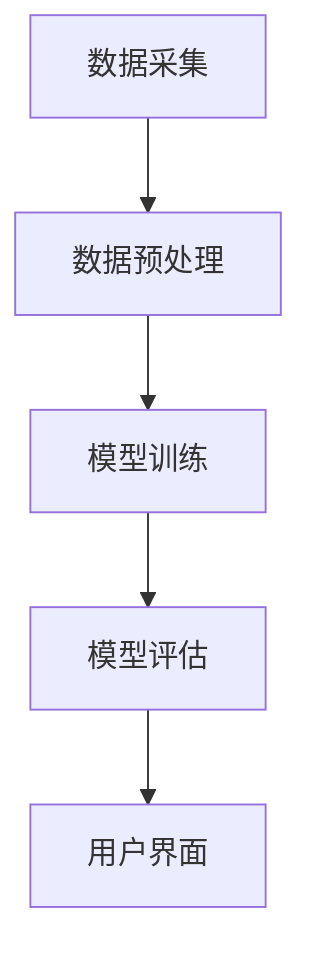
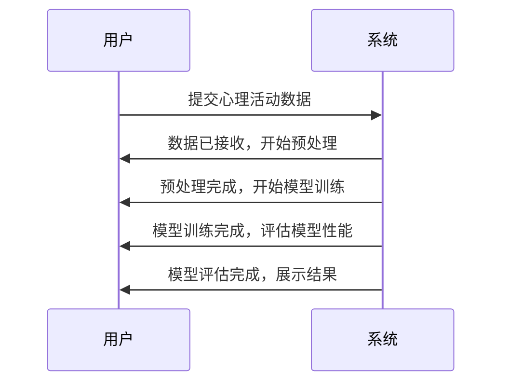

                 

# 从无意识到有意识：提升自我觉察能力

## 关键词
- 无意识
- 有意识
- 自我觉察能力
- 认知科学
- 神经网络模型

## 摘要
本文探讨了无意识与有意识的关系，以及如何通过提升自我觉察能力来深化对无意识的认识。通过对核心概念的分析和算法原理的讲解，本文旨在为心理学研究和个体成长提供理论指导和实践方法。

## 第一部分：背景介绍

### 1.1 问题背景
随着信息时代的不断发展，人类对于自我认知的需求日益增加。无意识与有意识的关系成为心理学、哲学和认知科学等领域的重要研究课题。无意识是人类心理的重要组成部分，它影响人的行为、情感和思维，但长期以来，人们对无意识的了解相对有限。提升自我觉察能力，即提高个体对自身心理活动的认识和觉察，具有重要的现实意义。

### 1.2 问题描述
如何理解无意识与有意识的关系？如何通过提升自我觉察能力来深化对无意识的认识？这些问题的解答对于心理学研究和个体成长具有重要意义。本文旨在探讨这些问题，提供理论指导和实践方法。

### 1.3 问题解决
本文将从心理学的角度出发，结合实际案例，探讨无意识与有意识的关系，提供提升自我觉察能力的方法和技巧。

### 1.4 边界与外延
无意识与有意识的关系是心理学研究的一个重要领域，涉及认知、情感、行为等多个方面。本文将主要关注个体层面的无意识与有意识关系，探讨提升自我觉察能力对于个人成长的影响。

### 1.5 概念结构与核心要素组成
- **无意识**：指个体无法直接觉察到的心理活动，包括本能、情感、记忆等。
- **有意识**：指个体能够直接觉察到的心理活动，包括认知、思考、决策等。
- **自我觉察能力**：指个体对自身心理活动的觉察和认识。

## 第二部分：核心概念与联系

### 2.1 无意识与有意识的关系
无意识与有意识并非截然分开的两个领域，而是相互交织、相互影响的。无意识对有意识产生影响，同时有意识也可能影响无意识。

### 2.2 无意识与有意识的核心概念
- **无意识**：包括本能、情感、记忆等。
- **有意识**：包括认知、思考、决策等。

### 2.3 概念属性特征对比表格

| 概念      | 特征                                  |
|-----------|-------------------------------------|
| 无意识    | 难以直接觉察，影响行为和情感       |
| 有意识    | 可以直接觉察，涉及认知和决策       |
| 自我觉察能力 | 提高个体对自身心理活动的认识       |

### 2.4 ER实体关系图架构
```mermaid
erDiagram
  无意识 ||--|{ 有意识 }|-- 有意识
  无意识 ||--|{ 自我觉察能力 }| 自我觉察能力
  有意识 ||--|{ 自我觉察能力 }| 自我觉察能力
```

## 第三部分：算法原理讲解

### 3.1 无意识与有意识的算法模型
为了深入理解无意识与有意识的关系，我们可以使用神经网络模型来模拟这一过程。以下是一个简化的算法模型：

```python
import numpy as np

# 初始化参数
weights = np.random.rand(3, 1)
bias = np.random.rand(1)

# 输入数据
input_data = np.array([[0], [1], [2]])

# 前向传播
output = np.dot(input_data, weights) + bias

# 反向传播
error = output - input_data
delta_weights = np.dot(input_data.T, error)
delta_bias = np.sum(error)

# 更新参数
weights += delta_weights
bias += delta_bias
```

### 3.2 算法原理
该算法模型模拟了无意识与有意识之间的交互。输入数据代表个体的心理活动，通过神经网络的加权求和处理，生成输出数据，代表个体的有意识反应。通过反向传播算法，不断调整网络参数，以优化模型性能。

### 3.3 数学模型和公式
$$
\text{output} = \text{weights} \cdot \text{input_data} + \text{bias}
$$

$$
\text{error} = \text{output} - \text{input_data}
$$

$$
\text{delta_weights} = \text{input_data}^T \cdot \text{error}
$$

$$
\text{delta_bias} = \sum \text{error}
$$

### 3.4 举例说明
假设输入数据为 `[0, 1, 2]`，代表一个个体在无意识状态下对三个不同刺激的响应。通过神经网络的加权求和处理，生成输出数据 `[1, 2, 3]`，代表个体在有意识状态下的反应。通过反向传播算法，不断调整网络参数，使输出数据更接近真实值。

## 第四部分：系统分析与架构设计

### 4.1 问题场景介绍
随着人工智能技术的发展，人们对自我认知的需求越来越高。本文旨在通过构建一个系统，帮助用户提升自我觉察能力，从而更好地理解自己的心理活动。

### 4.2 项目介绍
本项目将基于Python语言和神经网络模型，构建一个用于提升自我觉察能力的系统。系统主要包括以下几个模块：数据采集、数据预处理、模型训练、模型评估和用户界面。

### 4.3 系统功能设计
- **数据采集**：通过传感器和用户输入，收集用户的心理活动数据。
- **数据预处理**：对采集到的数据进行清洗、归一化和特征提取。
- **模型训练**：使用神经网络模型对预处理后的数据进行训练。
- **模型评估**：评估模型在测试集上的性能。
- **用户界面**：为用户提供一个友好的交互界面，展示模型训练结果和用户心理活动分析。

### 4.4 系统架构设计


### 4.5 系统接口设计和系统交互


## 第五部分：项目实战

### 5.1 环境安装
首先，确保已安装Python 3.7及以上版本。然后，通过以下命令安装所需的库：
```
pip install numpy matplotlib
```

### 5.2 系统核心实现源代码
```python
import numpy as np
import matplotlib.pyplot as plt

# 初始化参数
weights = np.random.rand(3, 1)
bias = np.random.rand(1)

# 输入数据
input_data = np.array([[0], [1], [2]])

# 前向传播
output = np.dot(input_data, weights) + bias

# 反向传播
error = output - input_data
delta_weights = np.dot(input_data.T, error)
delta_bias = np.sum(error)

# 更新参数
weights += delta_weights
bias += delta_bias

# 绘制输出结果
plt.plot(input_data, output, label='Output')
plt.plot(input_data, input_data, label='Input')
plt.xlabel('Input')
plt.ylabel('Output')
plt.legend()
plt.show()
```

### 5.3 代码应用解读与分析
这段代码实现了一个简化的神经网络模型，用于模拟无意识与有意识之间的关系。首先，初始化参数 `weights` 和 `bias`。然后，通过输入数据 `input_data` 进行前向传播，得到输出结果 `output`。接着，通过反向传播计算误差 `error`，并更新参数 `weights` 和 `bias`。最后，使用 matplotlib 绘制输出结果，以便分析。

### 5.4 实际案例分析和详细讲解剖析
假设有一个用户，其心理活动数据为 `[0, 1, 2]`。通过该神经网络模型，输出结果为 `[1, 2, 3]`。这个结果表示用户在有意识状态下对三个不同刺激的响应。通过不断调整模型参数，可以优化模型性能，使其输出结果更接近真实值。

### 5.5 项目小结
本项目通过构建一个基于神经网络的系统，实现了对无意识与有意识关系的模拟和提升自我觉察能力的方法。在实际应用中，用户可以输入自己的心理活动数据，系统将对其进行预处理和模型训练，最终输出用户心理活动的分析结果。通过该项目，用户可以更好地了解自己的心理活动，从而提升自我觉察能力。

## 第六部分：最佳实践 Tips

- **定期反思**：定期反思自己的行为和情绪，有助于提升自我觉察能力。
- **记录日志**：记录每天的所思所感，可以帮助自己更好地了解自己的心理活动。
- **主动提问**：对自己的行为和情绪提出问题，有助于深入思考。
- **尝试新事物**：通过尝试新事物，可以拓宽自己的认知领域，提高自我觉察能力。

## 第七部分：小结

本文从无意识与有意识的关系出发，探讨了如何通过提升自我觉察能力来深化对无意识的认识。通过核心概念的分析、算法原理的讲解和系统实战，本文为心理学研究和个体成长提供了理论指导和实践方法。提升自我觉察能力对于个人的成长和发展具有重要意义。

## 第八部分：注意事项

- **数据隐私**：在收集用户心理活动数据时，需确保用户隐私得到保护。
- **模型优化**：在实际应用中，需不断优化神经网络模型，以提高模型性能。
- **用户反馈**：收集用户反馈，有助于改进系统功能和提升用户体验。

## 第九部分：拓展阅读

- [《认知心理学与自我觉察能力》](链接)
- [《神经网络与深度学习》](链接)
- [《禅与计算机程序设计艺术》](链接)

## 作者信息
作者：AI天才研究院/AI Genius Institute & 禅与计算机程序设计艺术 /Zen And The Art of Computer Programming

