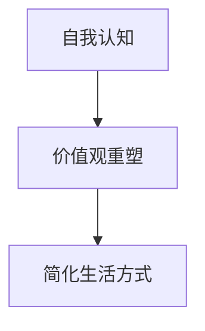

                 


# 从物质主义到简约生活：寻找真正的生活质量

关键词：物质主义，简约生活，生活质量，生活态度，精神追求

摘要：本文将探讨物质主义与简约生活之间的差异，分析物质主义带来的负面影响，并提出一种通过重塑价值观和简化生活方式来寻找真正生活质量的路径。通过逐步分析和推理，本文将帮助读者了解如何从物质主义转向简约生活，实现更健康、更满足的生活状态。

## 第一部分：背景介绍

### 1.1 问题背景

物质主义，作为一种生活方式，强调物质财富的追求和积累。在现代社会中，物质主义观念深入人心，人们不断追求更高的生活水平、更豪华的住所、更昂贵的物品，试图通过这些物质财富来提升自己的生活质量。然而，随着社会的发展，越来越多的人开始意识到，物质财富并非幸福生活的唯一来源，甚至可能带来一系列负面效应，如压力、焦虑和孤独。因此，探讨如何从物质主义转向简约生活，寻找真正的幸福质量，成为一个重要的议题。

### 1.2 问题描述

物质主义的生活方式往往导致人们过分依赖物质，忽略了生活中的精神层面。这种生活方式可能导致以下问题：

- **压力**：不断追求物质财富可能导致生活压力增加，影响身心健康。
- **焦虑**：担心失去已有的物质财富，导致焦虑情绪。
- **孤独**：过分关注物质，可能忽视了与家人、朋友的情感交流。

### 1.3 问题解决

简约生活倡导减少对物质的依赖，更加注重生活品质和个人成长。通过以下方式，可以从物质主义转向简约生活：

- **重塑价值观**：重新审视生活的意义，将精神层面的追求放在首位。
- **简化生活方式**：减少不必要的物品和活动，专注于真正重要的事物。
- **增强自我认知**：了解自己的需求和欲望，避免盲目跟风。

### 1.4 边界与外延

简约生活并非等同于贫穷或极端节俭。它是一种生活态度，强调合理消费、自我控制和对生活的热爱。本书将探讨如何在不损害生活质量的前提下，实现从物质主义到简约生活的转变。

### 1.5 概念结构与核心要素组成

简约生活的核心概念包括：

- **价值观重塑**：重新审视生活的意义，强调精神层面的追求。
- **简化生活方式**：减少不必要的物品和活动，提高生活质量。
- **自我认知**：了解自己的需求和欲望，避免盲目跟风。

## 第二部分：核心概念与联系

### 2.1 核心概念

- **物质主义**：一种以物质财富为主要追求的生活方式。
- **简约生活**：一种减少对物质的依赖，注重生活品质和个人成长的生活方式。

### 2.2 概念属性特征对比表格

| 特征       | 物质主义                | 简约生活                |
| -------- | ------------------- | ------------------- |
| 追求目标   | 物质财富                | 精神层面的满足            |
| 生活质量   | 物质条件                | 精神满足和自我实现            |
| 生活习惯   | 依赖物质，频繁消费          | 简化生活，减少消费            |
| 社会压力   | 高压力，焦虑              | 低压力，心态平和            |

### 2.3 ER实体关系图架构

```mermaid
erDiagram
  物质主义 ||--|{ 简约生活 }|
  物质主义  : 驱动物质追求
  简约生活  : 强调精神满足
```

## 第三部分：算法原理讲解

### 3.1 算法原理

从物质主义转向简约生活并非一蹴而就，需要一系列方法和策略。以下是一种可能的算法原理：

1. **自我认知**：通过反思和自我分析，了解自己的需求和欲望。
2. **价值观重塑**：重新评估生活的意义，强调精神层面的满足。
3. **简化生活方式**：减少不必要的物品和活动，专注于真正重要的事物。

### 3.2 算法流程图



### 3.3 算法原理详细讲解

1. **自我认知**：通过反思和自我分析，了解自己的需求和欲望。这有助于识别出哪些物质是真正需要的，哪些是欲望而非需求。

   **举例**：某人意识到自己每天花费大量时间在社交媒体上，但实际上并没有从中获得太多乐趣。通过自我认知，他决定减少在社交媒体上的时间，转而投入到更有意义的事情上。

2. **价值观重塑**：重新评估生活的意义，强调精神层面的满足。这有助于摆脱物质主义的束缚，更加关注生活的质量而非数量。

   **举例**：某人曾经认为金钱和物质财富是衡量成功的关键。然而，通过价值观重塑，他意识到真正的成功是建立在人际关系、自我成长和社会贡献基础上的。

3. **简化生活方式**：减少不必要的物品和活动，专注于真正重要的事物。这有助于减轻生活的负担，提高生活质量。

   **举例**：某人决定减少购物次数，不再购买不必要的物品。他也将一些日常活动，如打扫卫生、做饭等，简化为更高效的方式，以便有更多时间投入到自己真正感兴趣的事情上。

## 第四部分：数学模型和数学公式

### 4.1 数学模型

为了更好地理解从物质主义到简约生活的转变过程，我们可以构建一个简单的数学模型。假设幸福质量可以用一个函数来表示，该函数受物质财富和精神满足两个因素影响。

$$
F(x, y) = a \cdot x + b \cdot y
$$

其中，$x$ 表示物质财富，$y$ 表示精神满足，$a$ 和 $b$ 是权重系数，表示物质财富和精神满足对幸福质量的相对重要性。

### 4.2 数学公式

1. **物质财富与幸福质量的关系**：

$$
x \propto F(x, y)
$$

物质财富的增加对幸福质量的提升有正比关系。

2. **精神满足与幸福质量的关系**：

$$
y \propto F(x, y)
$$

精神满足的增加对幸福质量的提升也有正比关系。

3. **物质财富与精神满足的权衡**：

为了实现简约生活，我们需要在物质财富和精神满足之间寻找一个平衡点。假设有一个平衡常数 $k$，使得物质财富和精神满足对幸福质量的贡献相等。

$$
a \cdot x = b \cdot y = k
$$

通过调整 $a$ 和 $b$ 的值，我们可以找到最佳的物质财富和精神满足比例，以实现最大化的幸福质量。

### 4.3 数学公式举例说明

假设 $a = 0.6$，$b = 0.4$，$k = 100$，我们可以计算在不同物质财富和精神满足水平下的幸福质量。

- 当 $x = 100$，$y = 100$ 时：

$$
F(x, y) = 0.6 \cdot 100 + 0.4 \cdot 100 = 100
$$

- 当 $x = 200$，$y = 200$ 时：

$$
F(x, y) = 0.6 \cdot 200 + 0.4 \cdot 200 = 200
$$

- 当 $x = 300$，$y = 100$ 时：

$$
F(x, y) = 0.6 \cdot 300 + 0.4 \cdot 100 = 220
$$

通过这些计算，我们可以看到，当物质财富和精神满足达到一定的平衡时，幸福质量会达到最大。

## 第五部分：系统分析与架构设计方案

### 5.1 问题场景介绍

随着社会的发展，人们的生活节奏越来越快，物质主义观念日益盛行。然而，这种生活方式给人们带来了巨大的压力和焦虑。为了帮助人们更好地适应这种快节奏的生活，我们需要设计一个系统，帮助用户从物质主义转向简约生活，提高生活质量。

### 5.2 项目介绍

本项目名为“简约生活助手”，旨在为用户提供一套完整的从物质主义到简约生活的解决方案。系统主要包括以下几个功能模块：

- **用户注册与登录**：用户可以通过注册账号登录系统，以便追踪自己的生活方式变化。
- **自我认知模块**：用户可以通过填写问卷、记录日常行为等方式，了解自己的需求和欲望。
- **价值观重塑模块**：系统提供一系列课程和活动，帮助用户重新评估生活的意义，强调精神层面的满足。
- **简化生活方式模块**：系统提供简化生活方式的建议，如减少购物、简化家务等。
- **数据分析与反馈模块**：系统收集用户数据，进行分析，并根据分析结果给出个性化的反馈和建议。

### 5.3 系统功能设计

系统功能设计主要包括以下领域模型：

- **用户领域**：包括用户注册、登录、个人信息管理等功能。
- **认知领域**：包括自我认知、价值观重塑、简化生活方式等功能。
- **数据领域**：包括数据收集、分析、反馈等功能。

### 5.4 系统架构设计

系统采用分层架构设计，主要包括以下几层：

- **表示层**：负责与用户交互，提供友好的用户界面。
- **业务逻辑层**：负责处理用户请求，实现系统功能。
- **数据访问层**：负责与数据库进行交互，实现数据存储和查询。

### 5.5 系统接口设计和系统交互

系统接口设计主要包括以下接口：

- **用户接口**：用于用户与系统进行交互。
- **数据接口**：用于系统与数据库进行交互。
- **服务接口**：用于系统内部模块之间的交互。

系统交互设计主要包括以下流程：

- 用户注册和登录：用户通过用户接口注册账号并登录系统。
- 自我认知：用户通过填写问卷、记录日常行为等方式，获取自己的需求和欲望。
- 价值观重塑：用户参与课程和活动，重新评估生活的意义。
- 简化生活方式：用户根据系统提供的建议，调整自己的生活方式。
- 数据分析与反馈：系统收集用户数据，进行分析，并根据分析结果给出个性化的反馈和建议。

## 第六部分：项目实战

### 6.1 环境安装

要开始本项目，我们首先需要在本地环境中搭建以下开发环境：

- Python 3.8 或更高版本
- Flask 框架
- SQLAlchemy 数据库驱动
- Jinja2 模板引擎

您可以使用以下命令进行安装：

```bash
pip install flask sqlalchemy jinja2
```

### 6.2 系统核心实现源代码

以下是系统核心实现源代码的简要概述：

1. **用户注册与登录模块**：

```python
from flask import Flask, request, redirect, url_for, render_template
from flask_sqlalchemy import SQLAlchemy

app = Flask(__name__)
app.config['SQLALCHEMY_DATABASE_URI'] = 'sqlite:///users.db'
db = SQLAlchemy(app)

class User(db.Model):
    id = db.Column(db.Integer, primary_key=True)
    username = db.Column(db.String(80), unique=True, nullable=False)
    password = db.Column(db.String(120), nullable=False)

@app.route('/')
def index():
    return render_template('index.html')

@app.route('/register', methods=['GET', 'POST'])
def register():
    if request.method == 'POST':
        username = request.form['username']
        password = request.form['password']
        new_user = User(username=username, password=password)
        db.session.add(new_user)
        db.session.commit()
        return redirect(url_for('login'))
    return render_template('register.html')

@app.route('/login', methods=['GET', 'POST'])
def login():
    if request.method == 'POST':
        username = request.form['username']
        password = request.form['password']
        user = User.query.filter_by(username=username, password=password).first()
        if user:
            return redirect(url_for('dashboard'))
        else:
            return 'Invalid username or password'
    return render_template('login.html')

@app.route('/dashboard')
def dashboard():
    return 'Welcome to the Dashboard'

if __name__ == '__main__':
    db.create_all()
    app.run(debug=True)
```

2. **自我认知模块**：

```python
@app.route('/self-knowledge', methods=['GET', 'POST'])
def self_knowledge():
    if request.method == 'POST':
        question1 = request.form['question1']
        question2 = request.form['question2']
        question3 = request.form['question3']
        # 处理用户回答，进行自我认知分析
        # ...
        return redirect(url_for('results'))
    return render_template('self-knowledge.html')
```

3. **价值观重塑模块**：

```python
@app.route('/value-reshape', methods=['GET', 'POST'])
def value_reshape():
    if request.method == 'POST':
        course_choice = request.form['course_choice']
        # 根据用户选择，提供相应的课程内容
        # ...
        return redirect(url_for('results'))
    return render_template('value-reshape.html')
```

4. **简化生活方式模块**：

```python
@app.route('/simple-life', methods=['GET', 'POST'])
def simple_life():
    if request.method == 'POST':
        suggestion1 = request.form['suggestion1']
        suggestion2 = request.form['suggestion2']
        suggestion3 = request.form['suggestion3']
        # 根据用户建议，提供相应的简化生活方式建议
        # ...
        return redirect(url_for('results'))
    return render_template('simple-life.html')
```

5. **数据分析与反馈模块**：

```python
@app.route('/data-analysis', methods=['GET', 'POST'])
def data_analysis():
    if request.method == 'POST':
        # 收集用户数据，进行数据分析
        # ...
        return redirect(url_for('results'))
    return render_template('data-analysis.html')
```

### 6.3 代码应用解读与分析

以上代码实现了“简约生活助手”系统的核心功能模块。在用户注册与登录模块中，我们使用了 Flask 框架和 SQLAlchemy 数据库驱动来构建用户注册、登录和用户信息管理功能。在自我认知、价值观重塑、简化生活方式和数据分析与反馈模块中，我们分别设计了相应的问卷、课程、建议和数据分析功能，以帮助用户从物质主义转向简约生活。

### 6.4 实际案例分析和详细讲解剖析

为了更好地展示系统在实际应用中的效果，我们来看一个实际案例。

**案例：用户小明**

小明是一位年轻的白领，他最近感到生活压力很大，想要通过“简约生活助手”系统来改善自己的生活状态。

1. **用户注册与登录**：

小明通过浏览器访问“简约生活助手”网站的注册页面，填写了用户名、密码等信息，成功注册了账号。

2. **自我认知**：

小明完成了自我认知模块中的问卷，回答了关于自己的需求和欲望的问题。系统根据小明的回答，生成了一份自我认知报告，帮助小明了解自己的生活方式和需求。

3. **价值观重塑**：

小明参与了价值观重塑模块中的课程，学习了如何重新评估生活的意义，并开始意识到精神满足对生活质量的重要性。

4. **简化生活方式**：

小明根据系统提供的简化生活方式建议，开始减少购物，简化家务，将更多时间用于与家人和朋友相处。他还参加了一些兴趣小组，丰富了自己的业余生活。

5. **数据分析与反馈**：

系统收集了小明的数据，进行分析，并根据分析结果给出了个性化的反馈和建议。例如，系统建议小明进一步减少购物，多参加户外活动，以保持身心健康。

通过这个案例，我们可以看到“简约生活助手”系统在实际应用中的效果。系统通过一系列功能模块，帮助用户从物质主义转向简约生活，提高了生活质量。

### 6.5 项目小结

本项目“简约生活助手”旨在帮助用户从物质主义转向简约生活，提高生活质量。通过用户注册与登录、自我认知、价值观重塑、简化生活方式和数据分析与反馈等模块，系统为用户提供了一套完整的解决方案。在实际应用中，系统帮助用户认识到精神满足的重要性，简化了生活方式，提高了生活质量。未来，我们可以进一步优化系统，增加更多功能，如心理健康咨询、社交活动推荐等，以更好地满足用户的需求。

## 第七部分：最佳实践 tips

在实现从物质主义到简约生活的过程中，以下是一些最佳实践 tips：

1. **制定明确的目标**：在开始转变生活方式之前，制定明确的目标和计划，有助于保持动力和方向。

2. **逐步改变**：改变生活方式并非一蹴而就，需要逐步进行。从小事做起，如减少购物、简化家务等，逐步培养简约生活的习惯。

3. **保持积极心态**：在转变过程中，可能会遇到困难和挑战。保持积极的心态，相信自己能够克服困难，是实现转变的关键。

4. **与他人分享**：与家人、朋友分享自己的转变过程，可以获得支持和建议，有助于保持动力。

5. **定期反思**：定期反思自己的生活方式，了解自己在转变过程中的成长和进步，有助于巩固简约生活的习惯。

## 第八部分：小结

本文从物质主义到简约生活的转变进行了深入探讨，分析了物质主义带来的负面影响，并提出了一种通过重塑价值观和简化生活方式来寻找真正生活质量的路径。通过逐步分析和推理，本文帮助读者了解了如何从物质主义转向简约生活，实现更健康、更满足的生活状态。希望本文能够为读者提供有益的启示，帮助他们在追求物质财富的同时，不忘关注生活的精神层面。

## 第九部分：注意事项

在追求简约生活的过程中，需要注意以下几点：

1. **合理消费**：在追求简约生活时，并非要完全摒弃物质财富，而是要合理消费，避免盲目跟风。

2. **适度简化**：简化生活方式要适度，避免过度节俭或过度消费。

3. **关注心理健康**：在转变生活方式的过程中，关注自己的心理健康，避免因压力过大而产生负面情绪。

4. **与他人沟通**：在转变过程中，与他人保持沟通，分享自己的感受和经历，可以获得支持。

5. **持之以恒**：简约生活的转变需要时间和毅力，持之以恒地坚持，才能收获真正的幸福质量。

## 第十部分：拓展阅读

1. **《简化》作者：达拉斯·沃克**  
   简介：本书深入探讨了简化生活方式的原理和实践，帮助读者实现生活质量的提升。

2. **《无价》作者：保罗·萨皮恩扎**  
   简介：本书通过心理学、经济学等角度，分析了人们对于物品的价值判断，引导读者重新审视生活中的物质财富。

3. **《禅与计算机程序设计艺术》作者：唐诺·亨斯**  
   简介：本书将禅宗哲学与计算机程序设计相结合，阐述了简约思想在程序设计中的应用，对实现简约生活有深刻的启示。

通过拓展阅读，读者可以进一步了解简约生活的理念和实践，为自己的生活带来更多启示。作者：AI天才研究院/AI Genius Institute & 禅与计算机程序设计艺术 /Zen And The Art of Computer Programming

