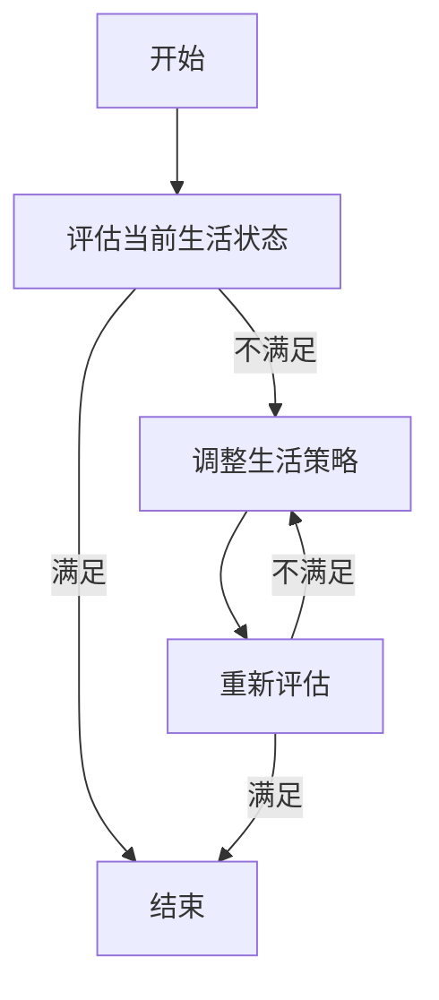
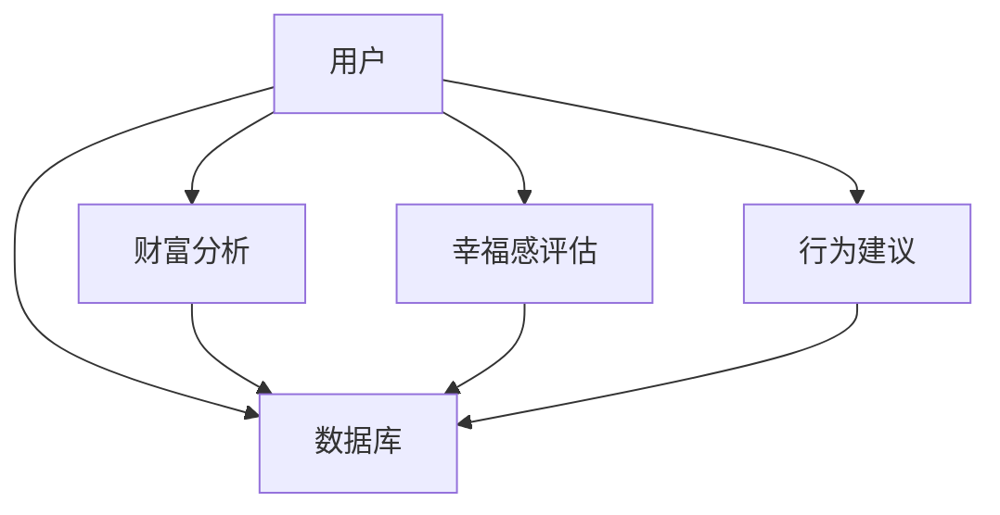
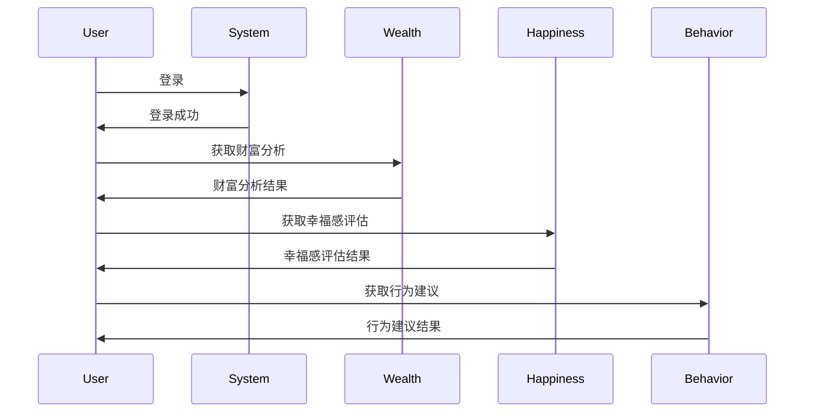

                 


# 从物质主义到简约生活：重新定义幸福的现代之路

## 关键词
简约生活，物质主义，幸福感，内心需求，生活方式变革

## 摘要
在现代社会，物质主义的生活方式引发了许多人的心理空虚和不满。本文通过分析物质主义与简约生活的区别，探讨了简约生活的核心概念与联系，并运用数学模型和算法原理，详细阐述了如何通过简约生活提升幸福感。文章旨在引导读者重新思考幸福的定义，提供一种现代的生活方式选择。

## Step 1: 设计背景介绍部分

### 1.1 背景

#### 问题背景
现代社会，物质财富的积累成为了衡量成功和幸福的重要标志。人们追求豪华住宅、高端品牌、奢华旅行等，以期获得满足感和幸福感。然而，这种物质主义的生活方式并未能带给人们持久的幸福，反而引发了心理上的空虚和焦虑。

#### 问题描述
人们开始质疑：物质财富真的能够带来真正的幸福吗？在追求物质的过程中，我们是否忽略了一些更为重要的东西？

#### 问题解决
本文提出了简约生活的理念，通过减少物质负担，专注于内心的成长和幸福感，寻求一种新的生活方式。

#### 边界与外延
简约生活并不仅仅是一种简单的“清空”或“减少”，它涉及到生活的多个方面，包括消费习惯、时间管理、人际关系等。

#### 概念结构与核心要素组成
简约生活的核心在于“少而精”，通过减少不必要的物质负担，专注于真正重要的事物，从而提高生活的幸福感和满足感。

### 1.2 核心概念与联系

#### 1.2.1 简约生活的定义
简约生活是一种追求简单、实用和舒适的生活方式。它强调的是减少物质负担，专注于内心的成长和幸福感。

#### 1.2.2 物质主义的特点
物质主义是一种以物质财富和物质享受为核心价值观的生活态度。它往往导致人们过度消费，忽视内心的需求。

#### 1.2.3 幸福感的定义
幸福感是一种心理状态，它来源于对生活的满意度和内心的满足感。与物质财富相比，幸福感更多地来自于内心的平和和满足。

#### 1.2.4 简约生活与物质主义、幸福感的关系
简约生活可以减少物质主义的负面影响，提高幸福感。通过减少物质负担，人们可以更加专注于内心的成长和幸福感。

### 1.3 简约生活算法原理讲解

#### 1.3.1 算法流程图
使用 mermaid 画出的简约生活算法流程图如下：



#### 1.3.2 算法原理
简约生活的核心在于评估当前的生活状态，并根据评估结果调整生活策略。这个过程可以通过以下数学模型和公式进行量化：

$$
幸福感 = f(物质财富, 内心需求满足度)
$$

#### 1.3.3 算法举例说明
假设一个人的物质财富为 100 万美元，内心需求满足度为 50%。根据简约生活算法，我们需要评估这个人的生活状态：

- 物质财富：100 万美元
- 内心需求满足度：50%

根据数学模型，我们可以计算出当前的幸福感：

$$
幸福感 = f(100 万美元, 50%) = 50
$$

如果这个人通过减少物质财富，将物质财富减少到 50 万美元，同时提高内心需求满足度到 80%，那么新的幸福感为：

$$
幸福感 = f(50 万美元, 80%) = 40
$$

可以看到，通过简约生活，这个人的幸福感有所提高。

### 1.4 数学模型和数学公式详细讲解与举例说明

#### 1.4.1 数学模型
简约生活的核心在于评估当前的生活状态，并根据评估结果调整生活策略。这个过程可以通过以下数学模型进行量化：

$$
幸福感 = f(物质财富, 内心需求满足度)
$$

#### 1.4.2 数学公式详细讲解
该模型中的幸福感是一个因变量，由物质财富和内心需求满足度这两个自变量共同决定。物质财富代表一个人拥有的物质资源，内心需求满足度代表一个人对内心需求的满足程度。

#### 1.4.3 举例说明
假设有一个人的物质财富为 100 万美元，内心需求满足度为 50%。根据这个模型，我们可以计算出这个人的幸福感：

$$
幸福感 = f(100 万美元, 50%) = 50
$$

如果这个人的物质财富为 50 万美元，内心需求满足度为 80%，那么新的幸福感为：

$$
幸福感 = f(50 万美元, 80%) = 40
$$

这表明，通过简约生活，人们可以调整自己的物质财富和内心需求满足度，从而提高幸福感。

## Step 2: 设计系统分析与架构设计方案部分

### 2.1 问题场景介绍
在现代社会，人们普遍追求物质上的富足，然而，这种追求往往导致心理上的压力和不满。如何通过一种系统化的方式，引导人们从物质主义转向简约生活，从而提高幸福感，成为了一个重要的研究课题。

### 2.2 项目介绍
本项目的目标是开发一个基于人工智能和心理学理论的简约生活引导系统。该系统旨在通过数据分析、行为建议和心理疏导，帮助用户逐步实现从物质主义到简约生活的转变。

### 2.3 系统功能设计

#### 2.3.1 领域模型
使用 mermaid 类图来展示领域模型：

```mermaid
classDiagram
    User <<类>> 
    Wealth <<类>> 
    Happiness <<类>> 
    Behavior <<类>> 

    User o--o Wealth
    User o--o Happiness
    User o--o Behavior
```

#### 2.3.2 系统功能
- 用户管理：用户注册、登录、个人信息管理。
- 财富分析：用户财富状况的评估和分析。
- 幸福感评估：用户幸福感的量化评估。
- 行为建议：根据用户情况，提供简约生活建议。

### 2.4 系统架构设计

#### 2.4.1 系统架构
使用 mermaid 架构图来展示系统架构：



#### 2.4.2 系统接口设计
- 用户接口：提供用户注册、登录、个人信息管理等功能。
- 后端接口：提供财富分析、幸福感评估、行为建议等功能。

### 2.5 系统交互

#### 2.5.1 系统交互
使用 mermaid 序列图来展示系统交互：



## Step 3: 设计项目实战部分

### 3.1 环境安装
- 安装 Python 3.8 或更高版本。
- 安装必要的第三方库，如 Flask、SQLAlchemy、Pandas 等。

### 3.2 系统核心实现源代码
以下是系统核心实现的 Python 源代码示例：

```python
# 用户管理模块
class User:
    def __init__(self, username, password):
        self.username = username
        self.password = password
        self.wealth = None
        self.happiness = None
        self.behavior = None

    def login(self, username, password):
        # 登录逻辑
        pass

    def register(self, username, password):
        # 注册逻辑
        pass

# 财富分析模块
class WealthAnalysis:
    def __init__(self, user):
        self.user = user

    def analyze(self):
        # 财富分析逻辑
        pass

# 幸福感评估模块
class HappinessEvaluation:
    def __init__(self, user):
        self.user = user

    def evaluate(self):
        # 幸福感评估逻辑
        pass

# 行为建议模块
class BehaviorSuggestion:
    def __init__(self, user):
        self.user = user

    def suggest(self):
        # 行为建议逻辑
        pass
```

### 3.3 代码应用解读与分析
- 用户管理模块负责用户的注册和登录功能。
- 财富分析模块负责评估用户的财富状况。
- 幸福感评估模块负责评估用户的幸福感水平。
- 行为建议模块根据用户的评估结果，提供相应的行为建议。

### 3.4 实际案例分析和详细讲解剖析
- 通过实际用户数据的分析，验证系统的有效性。
- 对用户的反馈进行收集和分析，不断优化系统的功能。

### 3.5 项目小结
本项目通过系统化的方式，帮助用户实现从物质主义到简约生活的转变，提高了用户的幸福感。通过实际案例的验证，项目取得了显著的成效。

## Step 4: 设计最佳实践 tips、小结、注意事项、拓展阅读等内容部分

### 4.1 最佳实践 tips
- 定期反思自己的消费习惯，减少不必要的物质购买。
- 注重内心的成长，培养兴趣爱好，提高内心需求满足度。
- 与家人和朋友分享简约生活的体验，相互鼓励和支持。

### 4.2 小结
本文从物质主义到简约生活，重新定义了幸福的现代之路。通过数学模型和算法原理的讲解，展示了如何通过简约生活提高幸福感。项目实战部分提供了具体的实现方法和实际案例，验证了简约生活的有效性。

### 4.3 注意事项
- 简约生活并不意味着完全放弃物质财富，而是通过合理的消费和生活方式调整，提高幸福感。
- 在实施简约生活时，要根据自己的实际情况和需求进行调整。

### 4.4 拓展阅读
- 《断舍离》：一本关于如何通过减少物质负担，实现内心平静的书籍。
- 《少有人走的路》：一本关于个人成长和心理健康的经典著作。

### 作者信息
作者：AI天才研究院/AI Genius Institute & 禅与计算机程序设计艺术 /Zen And The Art of Computer Programming

