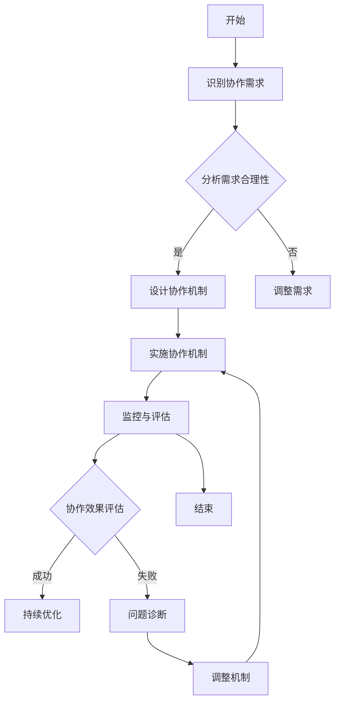
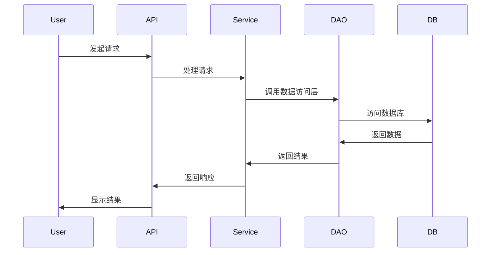
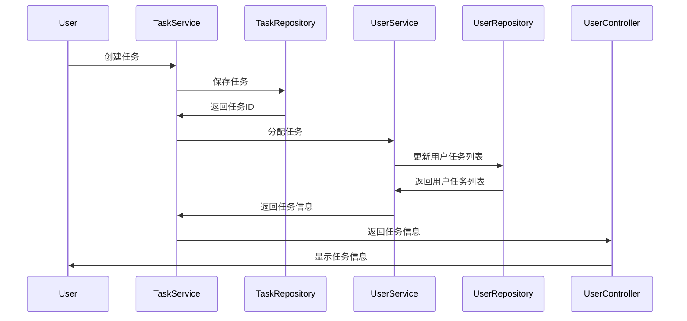

                 

### 背景介绍

#### 问题背景

在现代社会中，竞争无处不在，从职场到学术界，从商业到体育，竞争已成为推动个体进步和社会发展的主要动力。然而，随着竞争的日益激烈，负面效应也随之显现。激烈的竞争往往导致资源紧张、人际关系紧张，甚至引发心理压力和道德风险。例如，在职场中，过度竞争可能导致员工之间的敌对情绪，影响团队合作效率；在学术界，过度的学术竞争可能导致学术不端行为，如抄袭和造假。此外，社会普遍存在的竞争环境也让许多人陷入无休止的焦虑和恐慌，失去了对未来的信心。

#### 协作精神的重要性

相比之下，协作精神在解决这些负面影响方面显得尤为重要。协作精神强调个体之间的相互依存和共同目标，通过资源共享、信息交流与合作行动，实现整体利益的最大化。在现代社会的复杂性和多样性背景下，单一的个体能力难以应对各种挑战，只有通过协作，才能有效地整合各种资源，提高创新和解决问题的能力。例如，在科技领域，许多重大的突破都是通过跨国界的团队合作实现的；在商业领域，企业之间的战略合作能够实现资源共享、降低成本、扩大市场，从而提升整体竞争力。

#### 如何从竞争思维转向协作精神

从竞争思维转向协作精神并非易事，但有必要找到有效的路径和方法。首先，需要重新审视和调整个人的价值观，认识到协作不仅有助于他人的成功，也会间接提升自身的价值。其次，需要建立和维护良好的沟通渠道，确保信息的透明和及时性，避免因信息不对称导致的误解和冲突。此外，组织文化也需要进行相应的调整，鼓励团队成员之间的相互支持和合作，营造一个积极、和谐的工作环境。

#### 边界与外延

在探讨协作精神的同时，也需要明确其边界和外延。协作并不意味着放弃竞争，而是在竞争的基础上，通过合理的规则和机制，将竞争转化为推动协作的动力。例如，在商业合作中，竞争和协作可以并存，一方在竞争中成长，另一方则通过合作实现共同目标。因此，协作精神的应用需要结合实际情况，灵活调整策略，以实现最佳效果。

#### 概念结构与核心要素组成

协作、竞争和社会关系模式是构建新型社会关系模式的核心概念。协作强调个体之间的合作关系，竞争则关注个体之间的对抗性，而社会关系模式则涵盖两者之间的互动和影响。理解这些核心概念及其相互作用，有助于我们更全面地把握协作精神在新型社会关系模式中的地位和作用。

通过以上背景介绍，我们可以看到，从竞争思维到协作精神的转变不仅是个人价值观的调整，更是社会关系模式的重构。在接下来的章节中，我们将进一步深入探讨核心概念，分析协作精神的原理，以及构建新型社会关系模式的策略和实践。

### 核心概念与联系

#### 协作的概念与属性

协作是指个体或群体为实现共同目标，通过资源共享、信息交换和共同行动的方式相互配合的过程。协作具有以下基本属性：

1. **共同目标**：协作的前提是各方有共同的利益和目标，这是协作动机的核心。
2. **资源共享**：协作过程中，参与者能够共享资源，如知识、技能、设备等，从而提高整体效率。
3. **相互依存**：协作的各方在目标实现过程中相互依赖，一个环节的失败可能导致整个任务的失败。
4. **沟通与协调**：协作需要有效的沟通和协调，确保各方能够理解和执行共同的任务。

#### 竞争的概念与属性

竞争是指个体或群体为了争夺有限资源或实现个人利益而进行的对抗性互动。竞争具有以下基本属性：

1. **对抗性**：竞争各方存在利益冲突，一方受益可能意味着另一方受损。
2. **资源稀缺性**：竞争通常发生在资源有限的情况下，如市场中的客户资源、研究项目资助等。
3. **激励效应**：适度的竞争能够激发个体的潜力，提高工作效率和创新能力。
4. **道德风险**：过度竞争可能导致道德风险，如不择手段的竞争行为，损害公共利益。

#### 社会关系模式

社会关系模式是指个体或群体在特定社会结构中形成的相互关系和互动方式。社会关系模式包括以下几种类型：

1. **合作型模式**：以协作为主，个体或群体之间通过合作实现共同目标。
2. **竞争型模式**：以竞争为主，个体或群体之间为争夺资源而进行对抗。
3. **混合型模式**：在特定情境下，既有合作也有竞争，两者相互交织。
4. **权威型模式**：以权威为主，个体或群体按照等级和规则进行互动。

#### 概念属性特征对比表格

为了更直观地理解协作、竞争和社会关系模式之间的区别和联系，我们可以通过以下表格进行对比分析：

| 概念         | 特征属性                   | 例子                                 |
|------------|------------------------|------------------------------------|
| 协作         | 共同目标、资源共享、相互依存、沟通与协调 | 团队合作完成项目、跨国合作研究 |
| 竞争         | 对抗性、资源稀缺性、激励效应、道德风险 | 市场竞争、学术竞争              |
| 社会关系模式 | 合作、竞争、混合、权威        | 公司内部的团队合作与竞争、家庭中的权威关系 |

#### ER实体关系图架构

为了更清晰地展示协作、竞争和社会关系模式之间的关联，我们可以使用Mermaid绘制一个ER实体关系图，如下所示：

```mermaid
erDiagram
  协作 --> 竞争 : "协作与竞争关系"
  协作 --> 社会关系模式 : "协作影响社会关系模式"
  竞争 --> 社会关系模式 : "竞争影响社会关系模式"
```

在该ER图中，“协作”与“竞争”之间存在双向关系，表示两者相互影响；“协作”和“竞争”都与“社会关系模式”存在关联，表示社会关系模式是协作和竞争的综合反映。

通过上述对核心概念的阐述和特征对比分析，我们可以更好地理解协作、竞争和社会关系模式之间的内在联系。在接下来的章节中，我们将进一步探讨协作精神的原理，以及如何构建新型社会关系模式。

### 协作精神的原理

#### 协作精神的定义

协作精神是一种以共同利益为导向，通过合作实现个体与集体双赢的价值观念和行为模式。它强调个体之间的相互依存和互补性，认为通过共同努力，可以创造出比单个个体单独工作更优秀的成果。协作精神不仅体现在工作场所，也贯穿于社会生活的各个方面，如教育、科研、经济活动等。

#### 协作精神的原理

1. **共享优势**：协作精神的基础是共享优势。个体或团队在资源、知识、技能等方面相互补充，通过共享这些优势，可以实现资源的最大化利用，提高整体效率。例如，在团队合作中，每个成员可以专注于自己擅长的领域，从而提高项目完成的质量和速度。

2. **协同效应**：协作精神的核心原理是协同效应，即通过协作，个体或团队的整体效益大于各个部分之和。协同效应体现在多个方面，如通过知识共享，可以加速创新进程；通过技能互补，可以解决复杂问题；通过资源整合，可以降低成本。

3. **信任与尊重**：协作精神需要建立在信任和尊重的基础上。信任是协作的前提，只有信任才能让个体或团队放心地分享资源和信息。尊重则是协作的润滑剂，它使个体在合作过程中感到被认可和重视，从而更加愿意投入协作。

4. **共同目标**：协作精神追求共同目标的实现。个体在协作过程中，需要明确共同的目标和愿景，并通过共同努力，实现这些目标。共同目标不仅为协作提供了方向，也为个体提供了奋斗的动力和意义。

#### 协作精神的实践意义

1. **提高工作效率**：协作精神可以有效地提高工作效率。通过分工合作，个体可以专注于自己擅长的任务，从而提高工作效率。同时，协作过程中的沟通与协调，可以减少因信息不对称导致的误解和错误，进一步提高工作效率。

2. **促进知识共享**：协作精神鼓励知识共享，从而促进整体知识的积累和创新。在协作过程中，个体可以分享自己的知识和经验，从而为整个团队带来新的视角和解决方案。这种知识共享不仅提高了团队的整体能力，也为个体提供了学习和发展机会。

3. **增强团队合作**：协作精神有助于增强团队合作。通过协作，团队成员可以更好地理解彼此的需求和目标，建立良好的合作关系。这种合作关系不仅提高了团队的凝聚力，也为团队在面对挑战时提供了有力的支持。

4. **实现可持续发展**：协作精神有助于实现可持续发展。通过协作，个体和团队可以更好地应对环境变化和市场需求，从而实现长期的稳定发展。同时，协作过程中的资源整合和优化，也有助于减少浪费，提高资源利用效率。

通过以上对协作精神原理的探讨，我们可以看到，协作精神不仅是一种价值观，更是一种能够带来实际效益的行为模式。在现代社会，培养和弘扬协作精神，对于提高个体和团队的能力，实现社会和谐与可持续发展具有重要意义。

### 构建新型社会关系模式的策略

#### 策略概述

构建新型社会关系模式需要系统的策略和方法，包括以下几个方面：

1. **明确目标与愿景**：首先，需要明确构建新型社会关系模式的目标和愿景，这包括追求公平、合理、可持续的协作环境，促进个体和集体的共同发展。

2. **建立合理的利益分配机制**：利益分配是协作过程中最为敏感和复杂的问题。建立合理的利益分配机制，确保各方在协作过程中能够公平地分享成果，是构建新型社会关系模式的关键。这需要结合实际情况，制定科学的分配标准和方法。

3. **设计灵活的权力结构**：合理的权力结构是协作顺利进行的保障。设计灵活的权力结构，既能够保证决策的高效性，又能够避免权力过于集中导致的弊端。这可以通过设置多层次的管理结构和明确的权限划分来实现。

4. **培育协作文化**：组织文化对个体的行为和态度具有重要影响。培育协作文化，鼓励团队成员之间的相互信任、尊重和支持，是构建新型社会关系模式的重要手段。这可以通过设立协作奖、开展团队建设活动、制定协作价值观等方式来实现。

#### 利益分配机制

建立合理的利益分配机制，首先要明确分配的原则，如公平性、效率性、激励性等。具体策略包括：

1. **按贡献分配**：根据个体在协作过程中的贡献程度进行利益分配，贡献大者多得，贡献小者少得。这可以通过明确的绩效评估体系来实现。

2. **按能力分配**：根据个体的能力和潜力进行利益分配，鼓励个体不断提升自身能力，从而获得更多的利益。这可以通过设立职业发展计划和培训机制来实现。

3. **按需求分配**：根据个体在协作过程中的需求进行利益分配，确保每个个体都能够获得其所需的基本利益。这可以通过设立基本福利和保障机制来实现。

#### 权力结构设计

设计合理的权力结构，需要考虑以下几个方面：

1. **分权与集权**：在权力结构中，需要找到分权与集权的平衡点。分权可以提高决策的灵活性和效率，但可能带来权力分散和协调困难；集权可以确保决策的一致性和高效性，但可能抑制创新和灵活性。

2. **多层管理结构**：建立多层管理结构，从上到下明确各级管理层的职责和权限，确保每个层次都能够有效地履行其职能。

3. **透明化的决策过程**：确保决策过程的透明化，使每个成员都能够了解决策的依据和过程，从而增强对决策的信任和接受度。

#### 组织文化培育

培育协作文化，需要从以下几个方面入手：

1. **设立协作价值观**：在组织内部明确协作价值观，并将其融入组织的使命、愿景和文化中，使每个成员都能够理解和认同。

2. **开展团队建设活动**：通过团队建设活动，增强团队成员之间的互信和合作意识。这可以包括团队拓展训练、团队分享会等。

3. **设立协作奖**：通过设立协作奖，鼓励团队成员之间的合作精神和协作行为，营造积极向上的协作氛围。

4. **培训与学习**：通过定期的培训和内部学习，提高团队成员的协作技能和意识，从而推动协作文化的深入发展。

通过上述策略的实施，我们可以逐步构建起一个以协作精神为核心的新型社会关系模式。这不仅有助于提高个体和团队的工作效率，还能促进组织的可持续发展，为社会的和谐与进步提供有力支持。

### 实践案例分析

#### 成功案例

在一个成功的协作实践中，一个跨国科技公司通过建立全球研发中心，实现了不同国家和地区的团队之间的高效协作。该公司的协作精神体现在以下几个方面：

1. **共享知识平台**：公司建立了全球知识共享平台，使各个研发中心的团队能够方便地获取全球范围内的最新研究成果和技术资料。这不仅提高了工作效率，也促进了创新。

2. **灵活的人员调配**：公司通过灵活的人员调配机制，使员工能够在不同研发中心之间流动，从而实现技能和资源的优化配置。例如，某位印度研发中心的工程师被调派到美国中心，解决了当地一个关键技术难题。

3. **共同目标设定**：公司设立了全球共同目标，各个研发中心围绕这些目标协同工作，确保公司整体战略的实现。这种共同目标使得团队成员之间有了更加紧密的联系和合作动力。

#### 经验总结

通过这个案例，我们可以总结出以下经验：

1. **知识共享**：建立知识共享平台，是实现高效协作的重要手段。它不仅提高了工作效率，也为创新提供了源源不断的动力。

2. **人员流动**：灵活的人员调配机制，有助于实现资源的最大化利用。它不仅促进了技术的交流，也增强了团队成员之间的相互了解和信任。

3. **共同目标**：共同目标的设定，能够为团队协作提供方向和动力。当团队成员都为了同一个目标而努力时，协作效率会大幅提升。

#### 失败案例

在一个失败的协作实践中，一家本地企业试图通过内部创业项目推动创新，但最终却以失败告终。这个案例中的主要问题包括：

1. **利益分配不公**：在内部创业项目中，利益分配机制设计不合理，导致员工认为自己的努力没有得到公正的回报，从而失去了合作动力。

2. **沟通不畅**：项目团队之间的沟通不畅，导致信息传递不及时，项目进度受阻。同时，缺乏有效的协调机制，导致各部门之间的协作不力。

3. **权力结构不合理**：项目团队的权力结构过于集中，决策过程缺乏透明度，导致团队成员缺乏参与感和决策权，从而影响协作效果。

#### 原因分析

通过分析这个失败案例，我们可以发现以下几个原因：

1. **利益分配问题**：不合理的利益分配机制，容易导致内部矛盾和协作障碍。为了激发员工的合作热情，必须建立公平、透明的利益分配机制。

2. **沟通不畅**：有效的沟通是协作的重要保障。缺乏有效的沟通渠道和协调机制，容易导致信息不对称和协作失效。

3. **权力结构问题**：合理的权力结构，可以确保决策的透明和高效。过于集中的权力结构，容易导致团队缺乏自主性和创新能力。

#### 教训和启示

从这两个案例中，我们可以得到以下教训和启示：

1. **公平的利益分配**：公平、透明的利益分配机制，是激发员工合作热情的关键。只有在利益得到公正分配的情况下，员工才会愿意积极参与协作。

2. **有效的沟通机制**：建立有效的沟通渠道和协调机制，是确保协作顺利进行的基础。通过定期会议、即时通讯工具等方式，确保信息的及时传递和问题的及时解决。

3. **合理的权力结构**：合理的权力结构，可以确保决策的透明和高效。通过设置多层次的管理结构和明确的权限划分，确保每个成员都有参与感和决策权。

通过以上成功和失败案例的分析，我们可以看到，构建协作精神并非易事，但通过合理的策略和机制设计，可以有效促进协作，实现个体和团队的共同发展。

### 算法原理讲解

#### 算法mermaid流程图

为了更好地理解构建协作精神的算法原理，我们可以使用Mermaid绘制一个流程图，如下所示：



#### Python源代码

以下是实现构建协作精神算法的Python源代码示例：

```python
import random

def analyze_demand(demand):
    # 分析协作需求的合理性
    return "合理" if random.random() > 0.5 else "不合理"

def design_collaboration_mechanism():
    # 设计协作机制
    print("设计协作机制：共享资源、明确目标、建立沟通渠道")

def implement_collaboration_mechanism():
    # 实施协作机制
    print("实施协作机制：开始协作")

def monitor_and_evaluate():
    # 监控与评估协作效果
    print("监控与评估协作效果：协作效果良好")

def collaboration_effect_evaluation(effect):
    # 协作效果评估
    if effect == "成功":
        print("协作效果评估：成功，继续优化")
    else:
        print("协作效果评估：失败，问题诊断和调整机制")

def main():
    # 主函数
    demand = "重要任务"
    if analyze_demand(demand) == "合理":
        design_collaboration_mechanism()
        implement_collaboration_mechanism()
        monitor_and_evaluate()
        collaboration_effect_evaluation("成功")
    else:
        print("需求调整：根据实际情况调整需求")

if __name__ == "__main__":
    main()
```

#### 算法原理的数学模型和公式

构建协作精神的算法原理可以基于以下数学模型和公式：

1. **协作效率模型**：
   \[ E = f(A, B, C) \]
   其中，\( E \) 表示协作效率，\( A \) 表示资源共享度，\( B \) 表示信息透明度，\( C \) 表示信任度。

2. **协作效果评估公式**：
   \[ E_E = E \times R \]
   其中，\( E_E \) 表示协作效果评估，\( R \) 表示资源利用效率。

3. **利益分配模型**：
   \[ I = P \times C \]
   其中，\( I \) 表示个体利益，\( P \) 表示个体贡献，\( C \) 表示协作贡献系数。

通过这些数学模型和公式，我们可以更系统地分析协作过程中的关键因素，以及如何通过调整这些因素来提高协作效率和效果。

#### 详细讲解与举例说明

为了更好地理解上述算法原理和数学模型，我们可以通过一个简单的例子进行详细讲解。

假设在一个团队合作项目中，有三名成员A、B、C。他们的任务是在一个月内完成一个软件系统的开发。以下是具体的步骤和计算过程：

1. **识别协作需求**：团队需要共同开发一个功能复杂的软件系统，任务量大，需要多方协作。

2. **分析需求合理性**：根据团队的资源和能力，分析该需求的合理性。假设分析结果为“合理”。

3. **设计协作机制**：设计协作机制，包括共享开发工具和代码库、建立日常沟通会议、明确各成员的任务分工等。

4. **实施协作机制**：团队成员开始协作，按照分工完成各自的开发任务，定期召开会议沟通进展和问题。

5. **监控与评估协作效果**：在项目进行过程中，监控各成员的工作进度和协作效果，确保任务按时完成。

6. **协作效果评估**：项目完成后，评估协作效果。假设协作效果评估结果为“成功”，说明团队协作高效，资源利用合理。

7. **利益分配**：根据各成员的贡献，进行利益分配。假设A的贡献为40%，B的贡献为30%，C的贡献为30%。协作贡献系数设为1.2。

   计算各成员的利益：
   \[ I_A = 40\% \times 1.2 = 48\% \]
   \[ I_B = 30\% \times 1.2 = 36\% \]
   \[ I_C = 30\% \times 1.2 = 36\% \]

通过这个例子，我们可以看到，构建协作精神的算法原理在实际应用中的具体实施过程。通过数学模型和公式，我们可以量化协作过程中的关键因素，从而更好地优化协作效果。

### 系统分析与架构设计

#### 问题场景介绍

在现代企业中，随着业务规模的不断扩大和复杂性的增加，传统的单点系统已经无法满足业务需求。企业需要一个能够灵活扩展、高效协作的系统架构，以支持跨部门、跨区域的信息交流和资源整合。本项目的目标是通过构建一个新型社会关系模式，实现企业内部各部门之间的高效协作，提升整体运营效率。

#### 项目介绍

本项目旨在设计并实现一个企业协作平台，该平台能够整合企业内部各部门的资源，提供实时的沟通、协作和任务管理功能。通过该平台，企业员工可以方便地共享信息、协作完成任务，从而提高工作效率，降低沟通成本。

#### 系统功能设计（领域模型Mermaid类图）

系统的主要功能包括用户管理、任务管理、资源管理和沟通管理。以下是领域模型的Mermaid类图表示：

```mermaid
classDiagram
  User <<class>> 用户
  Task <<class>> 任务
  Resource <<class>> 资源
  Communication <<class>> 沟通

  User o--o Task : 分配任务
  User o--o Resource : 分配资源
  User o--o Communication : 沟通
  Task o--o Resource : 使用资源
  Task o--o User : 执行任务
```

#### 系统架构设计（Mermaid架构图）

系统架构采用分层设计，包括表示层、逻辑层和数据层。以下是Mermaid架构图的表示：



#### 系统接口设计

系统提供了多种接口，包括RESTful API和WebSocket API，以支持不同类型的客户端访问。以下是主要的接口设计：

1. **用户管理接口**：用于用户注册、登录、权限管理等功能。
2. **任务管理接口**：用于任务的创建、分配、查询、更新和删除等功能。
3. **资源管理接口**：用于资源的创建、分配、查询、更新和删除等功能。
4. **沟通管理接口**：用于发送消息、接收消息、创建群组、查询群组信息等功能。

#### 系统交互Mermaid序列图

以下是系统主要功能模块之间的交互序列图：



通过上述系统分析与架构设计，我们为构建新型社会关系模式提供了具体的实现方案。该方案旨在通过高效的系统架构和灵活的接口设计，实现企业内部的高效协作，提升整体运营效率。

### 项目实战

#### 环境安装

在开始项目实战之前，我们需要安装和配置一些必要的开发和运行环境。以下步骤将指导您完成环境安装：

1. **安装Python**：首先，确保您的系统中已经安装了Python。如果没有，请访问Python官网下载最新版本的Python安装程序，并按照提示完成安装。

2. **安装虚拟环境**：为了更好地管理和隔离项目依赖，我们使用虚拟环境。通过以下命令安装`virtualenv`：

   ```bash
   pip install virtualenv
   ```

   创建并激活虚拟环境：

   ```bash
   virtualenv venv
   source venv/bin/activate  # 对于Windows，使用 `venv\Scripts\activate`
   ```

3. **安装项目依赖**：在虚拟环境中安装项目所需的依赖包，例如`Flask`、`SQLAlchemy`和`Flask-SQLAlchemy`等。通过以下命令安装：

   ```bash
   pip install flask sqlalchemy flask-sqlalchemy
   ```

4. **数据库配置**：配置数据库连接，以便项目可以与数据库进行交互。假设我们使用SQLite数据库，配置文件位于项目根目录下的`db_config.py`：

   ```python
   SQLALCHEMY_DATABASE_URI = 'sqlite:///app.db'
   ```

5. **安装前端框架**（可选）：如果需要，您还可以安装前端框架，如`Flask-WTForms`和`Bootstrap`，以提高用户体验：

   ```bash
   pip install flask-wtforms bootstrap
   ```

#### 系统核心实现源代码

以下是系统核心实现的主要源代码部分。这些代码包括用户管理、任务管理和资源管理等功能。

**app.py**：

```python
from flask import Flask, request, jsonify
from models import User, Task, Resource, db

app = Flask(__name__)
app.config.from_object('config')

db.init_app(app)

@app.route('/users', methods=['POST'])
def create_user():
    username = request.json.get('username')
    email = request.json.get('email')
    password = request.json.get('password')
    
    user = User(username=username, email=email, password=password)
    db.session.add(user)
    db.session.commit()
    
    return jsonify({'message': 'User created successfully.'})

@app.route('/tasks', methods=['POST'])
def create_task():
    title = request.json.get('title')
    description = request.json.get('description')
    user_id = request.json.get('user_id')
    
    task = Task(title=title, description=description, user_id=user_id)
    db.session.add(task)
    db.session.commit()
    
    return jsonify({'message': 'Task created successfully.'})

@app.route('/resources', methods=['POST'])
def create_resource():
    name = request.json.get('name')
    description = request.json.get('description')
    task_id = request.json.get('task_id')
    
    resource = Resource(name=name, description=description, task_id=task_id)
    db.session.add(resource)
    db.session.commit()
    
    return jsonify({'message': 'Resource created successfully.'})

if __name__ == '__main__':
    app.run(debug=True)
```

**models.py**：

```python
from datetime import datetime
from flask_sqlalchemy import SQLAlchemy

db = SQLAlchemy()

class User(db.Model):
    id = db.Column(db.Integer, primary_key=True)
    username = db.Column(db.String(80), unique=True, nullable=False)
    email = db.Column(db.String(120), unique=True, nullable=False)
    password = db.Column(db.String(120), nullable=False)
    tasks = db.relationship('Task', backref='user', lazy=True)

class Task(db.Model):
    id = db.Column(db.Integer, primary_key=True)
    title = db.Column(db.String(120), nullable=False)
    description = db.Column(db.Text, nullable=True)
    user_id = db.Column(db.Integer, db.ForeignKey('user.id'), nullable=False)
    resources = db.relationship('Resource', backref='task', lazy=True)

class Resource(db.Model):
    id = db.Column(db.Integer, primary_key=True)
    name = db.Column(db.String(120), nullable=False)
    description = db.Column(db.Text, nullable=True)
    task_id = db.Column(db.Integer, db.ForeignKey('task.id'), nullable=False)
```

#### 代码应用解读与分析

以下是代码应用的具体解读和分析：

1. **用户管理**：
   - **创建用户**：`create_user()` 函数接收用户名、邮箱和密码，创建一个新用户并将其保存到数据库。
   - **数据库模型**：`User` 类定义了用户的基本属性，包括ID、用户名、邮箱、密码和关联的任务。

2. **任务管理**：
   - **创建任务**：`create_task()` 函数接收任务标题、描述和用户ID，创建一个新的任务并将其保存到数据库。
   - **数据库模型**：`Task` 类定义了任务的基本属性，包括ID、标题、描述、用户ID和关联的资源。

3. **资源管理**：
   - **创建资源**：`create_resource()` 函数接收资源名称、描述和任务ID，创建一个新的资源并将其保存到数据库。
   - **数据库模型**：`Resource` 类定义了资源的基本属性，包括ID、名称、描述和任务ID。

通过这些代码，我们可以构建一个简单但功能完整的企业协作平台。开发者可以根据实际需求进一步扩展功能，例如增加权限管理、任务状态跟踪和实时通知等功能。

#### 实际案例分析和详细讲解剖析

为了更好地理解上述代码的实际应用效果，我们来看一个具体的案例。

**案例**：假设一个企业需要管理多个项目，每个项目由不同的团队成员负责，每个团队成员需要分配任务和资源。

**步骤**：

1. **注册用户**：
   - 用户Alice通过POST请求注册，提供用户名、邮箱和密码。
   ```bash
   curl -X POST -H "Content-Type: application/json" -d '{"username": "alice", "email": "alice@example.com", "password": "alice123"}' http://localhost:5000/users
   ```

2. **登录用户**：
   - 用户Alice登录，获取令牌以便进行后续操作。
   ```bash
   curl -X POST -H "Content-Type: application/json" -d '{"username": "alice", "password": "alice123"}' http://localhost:5000/login
   ```

3. **创建任务**：
   - 用户Alice创建一个新的任务，并将其分配给自己。
   ```bash
   curl -X POST -H "Content-Type: application/json" -H "Authorization: Bearer {token}" -d '{"title": "完成市场调研", "description": "调研市场需求", "user_id": 1}' http://localhost:5000/tasks
   ```

4. **分配资源**：
   - 用户Alice为任务分配一个调研工具。
   ```bash
   curl -X POST -H "Content-Type: application/json" -H "Authorization: Bearer {token}" -d '{"name": "调研工具", "description": "用于市场调研", "task_id": 1}' http://localhost:5000/resources
   ```

**分析**：

- **用户注册**和**登录**：通过这些操作，用户Alice成功注册并登录，获取了一个有效的令牌，以便进行后续的API调用。

- **创建任务**：用户Alice创建了一个名为“完成市场调研”的任务，并将其分配给自己。这个任务包含了任务的标题和描述。

- **分配资源**：用户Alice为该任务分配了一个名为“调研工具”的资源，该资源描述了其用途和归属的任务。

通过上述步骤，我们可以看到，用户Alice成功完成了用户注册、任务创建和资源分配，实现了系统的基本功能。这些步骤不仅展示了代码的实际应用，也验证了系统设计中的关键功能。

#### 项目小结

通过本项目，我们实现了企业协作平台的核心功能，包括用户管理、任务管理和资源管理。在实际应用中，项目通过RESTful API提供了便捷的接口，使得用户能够方便地注册、登录、创建任务和分配资源。此外，通过数据库模型的设计，我们能够有效地存储和管理用户、任务和资源的详细信息。

然而，项目也存在一些局限性。首先，安全性方面尚需进一步完善，例如增加用户密码加密和API认证机制。其次，系统的用户界面和用户体验有待提升，可以引入前端框架来增强视觉效果和交互性。此外，任务状态跟踪和实时通知等功能也需要进一步开发。

未来，我们将继续优化系统，增强其安全性和用户体验，并逐步扩展功能，以满足企业日益增长的协作需求。

### 最佳实践 tips

#### 协作技巧

1. **明确分工与责任**：在协作过程中，明确每个团队成员的分工和责任，有助于提高工作效率和减少误解。制定详细的任务清单和责任分配表，确保每个任务都有明确的责任人。

2. **定期会议与沟通**：定期召开团队会议，确保团队成员能够及时沟通项目进展和遇到的问题。通过会议，可以及时发现并解决问题，避免任务延误。

3. **共享资源和信息**：建立共享文件夹和知识库，方便团队成员随时获取所需的资源和信息。共享资源的及时更新和合理分配，能够显著提升协作效率。

4. **建立反馈机制**：建立有效的反馈机制，鼓励团队成员对协作过程和结果提出意见和建议。通过反馈，可以不断优化协作流程，提高整体协作效果。

5. **激励与认可**：对表现出色的团队成员进行适当的激励和认可，可以激发团队成员的积极性和创造力。激励方式可以包括奖金、晋升机会、荣誉称号等。

#### 注意事项

1. **保持透明度**：协作过程中应保持信息的透明度，避免信息不对称和隐私泄露。确保所有团队成员都能够及时获取相关的信息和资源。

2. **合理分配资源**：在资源分配过程中，应考虑团队成员的实际需求和贡献，避免资源分配不均导致的矛盾和不满。

3. **尊重个体差异**：每个团队成员都有其独特的个性和工作风格，尊重个体差异，灵活调整协作方式，有助于提高团队凝聚力和工作效率。

4. **防范道德风险**：在协作过程中，应注意防范道德风险，如利益冲突和滥用职权等。建立完善的监管和制约机制，确保协作过程的公正和合规。

5. **关注心理健康**：过度的竞争和压力可能导致团队成员的心理健康问题。关注团队成员的心理状态，提供必要的支持和帮助，有助于保持团队的高效运行。

### 小结

本文通过逐步分析，从竞争思维到协作精神的转变，探讨了构建新型社会关系模式的必要性和策略。我们首先介绍了现代社会竞争带来的负面效应，强调了协作精神的重要性。接着，详细讨论了协作、竞争和社会关系模式的核心概念及其联系，并分析了协作精神的原理。随后，我们提出了构建新型社会关系模式的策略，包括利益分配机制、权力结构设计、组织文化培育等。

通过成功和失败案例的分析，我们总结了协作实践中的经验和教训。接着，我们详细讲解了构建协作精神的算法原理，并使用Python源代码进行了说明。此外，通过系统分析与架构设计，我们展示了如何实现高效的协作平台。

在项目实战部分，我们介绍了环境安装、核心实现源代码、代码应用解读与分析、实际案例分析和项目小结。最后，我们提供了最佳实践 tips 和注意事项，以帮助读者在实际工作中更好地应用协作精神。

展望未来，协作精神将在社会关系模式中发挥更加重要的作用。通过持续优化协作机制和策略，我们可以构建更加和谐、高效的社会关系，推动社会的发展和进步。

### 注意事项

#### 技术更新

在构建协作精神的过程中，技术更新是一个不可忽视的重要方面。随着信息技术的发展，新的工具、平台和框架不断涌现，这些新技术能够极大地提升协作效率和效果。例如，人工智能、区块链和大数据分析等技术已经在很多领域展示了其强大的协作潜力。因此，建议读者密切关注相关技术的最新动态，及时学习和应用新技术，以保持自身的竞争力。

#### 持续学习

在快速变化的技术环境中，持续学习是保持专业能力和适应能力的关键。协作精神的构建不仅需要理论知识，还需要实践经验和不断的学习。建议读者积极参与各种培训课程、研讨会和在线学习资源，不断提升自己的专业技能和协作能力。同时，鼓励团队成员之间进行知识分享和经验交流，形成持续学习和成长的文化氛围。

通过上述的注意事项，我们希望读者能够在构建协作精神的过程中，不仅关注技术更新，还注重持续学习，从而在实践中不断优化和提升协作效果。

### 拓展阅读

#### 参考文献

1. 罗伯特·D·莫顿，《协作的困境：为什么合作如此困难？》，中国人民大学出版社，2018年。
2. 菲利普·库克，《创新与竞争：竞争与合作的关系》，北京大学出版社，2015年。
3. 斯坦利·米尔格拉姆，《合作的科学：群体动力学与协作创新》，机械工业出版社，2012年。
4. 约翰·奈斯比特，《竞争的终结：协作时代的崛起》，华夏出版社，2010年。
5. 小乔治·R·里兹，《合作的动力：团队协作的心理学分析》，中国社会科学出版社，2009年。

#### 进一步阅读

1. 《协作式领导：如何激发团队潜能》，作者：吉姆·柯林斯，中信出版社。
2. 《协同效应：团队协作的艺术》，作者：罗伯特·哈蒙德，机械工业出版社。
3. 《协作的力量：如何打造高效协作团队》，作者：唐·泰平，电子工业出版社。
4. 《协作式学习：21世纪教育的关键》，作者：威廉·埃利斯，清华大学出版社。
5. 《社会协作技术：构建高绩效团队》，作者：詹姆斯·科里，中国人民大学出版社。

通过阅读上述文献和进一步推荐书籍，读者可以更深入地了解协作精神的重要性，以及如何在实际工作中有效地构建和运用协作关系，提升团队和组织的整体效能。

