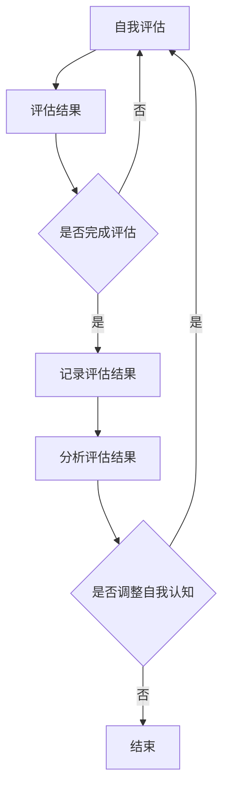
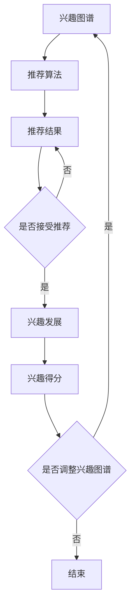
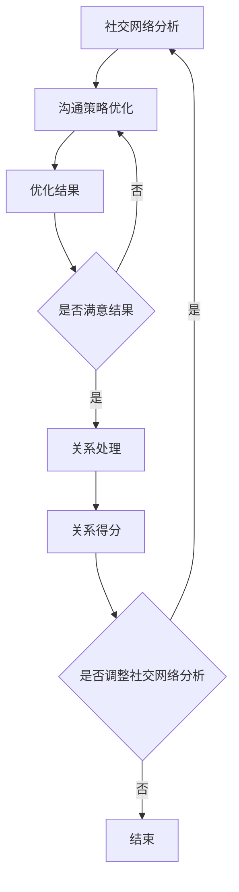
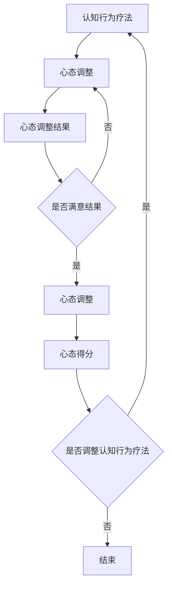
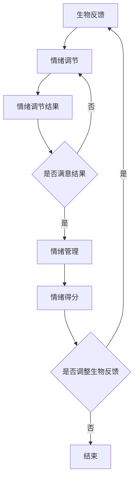
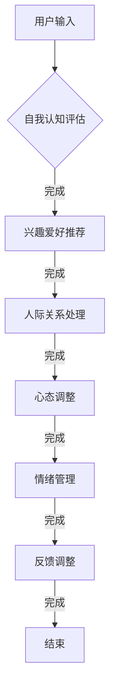
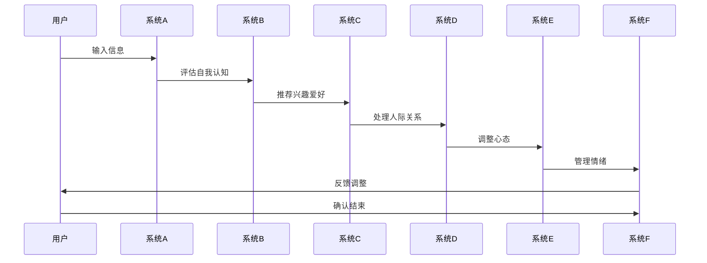

                 


# 从精神空虚到内心充实：个人成长的转变

## 关键词
- 个人成长
- 精神空虚
- 心理转变
- 自我认知
- 兴趣发展
- 情绪管理

## 摘要
本文旨在探讨个人成长与心理转变之间的关系，通过分析自我认知、兴趣爱好发展、人际关系处理、心态调整和情绪管理等方面，为读者提供从精神空虚到内心充实转变的策略和方法。本文采用逻辑清晰、结构紧凑的写作方式，结合实际案例，帮助读者更好地理解并应用这些原则。

### 设计目录大纲的第一步：背景介绍

#### 核心概念

**问题背景：** 在现代社会，许多人追求事业成功，但在达到目标后却感到精神空虚，无法获得内心的满足。这种精神空虚的现象引发了对个人成长和心理转变的探讨。

**问题描述：** 如何通过个人成长和心理转变，实现从精神空虚到内心充实的转变。

**问题解决：** 本文提出一系列方法，包括自我认知、兴趣爱好发展、人际关系处理、心态调整和情绪管理，帮助个体实现内心的充实。

**边界与外延：** 本文主要关注个人成长和心理转变，但不涉及病理治疗或其他专业领域的深入探讨。

**概念结构与核心要素组成：**
- **自我认知：** 了解自己的性格、价值观和兴趣爱好。
- **兴趣爱好发展：** 通过培养兴趣爱好，丰富内心世界。
- **人际关系处理：** 建立和维护良好的人际关系。
- **心态调整：** 调整心态，面对生活中的挑战。
- **情绪管理：** 学会情绪调节，保持心理平衡。

### 第二步：核心概念与联系

#### 核心概念与联系

**自我认知：**
- **核心概念原理：** 自我认知是指个体对自身特质、能力和需求的了解。
- **概念属性特征对比表格：**

  | 特征         | 自我认知 | 自我评估 | 外部反馈 |
  | ------------ | -------- | -------- | -------- |
  | 主观性       | 是       | 是       | 否       |
  | 客观性       | 否       | 否       | 是       |
  | 全面性       | 是       | 是       | 否       |
  | 部分性       | 否       | 否       | 是       |

- **ER实体关系图架构的 Mermaid 流程图：**
  ```mermaid
  entity Relationship {
    "Self-awareness" -> "Self-assessment"
    "Self-assessment" -> "External feedback"
  }
  ```

**兴趣爱好发展：**
- **核心概念原理：** 兴趣爱好是个体在特定领域表现出持续兴趣和热情的活动。
- **概念属性特征对比表格：**

  | 特征         | 兴趣爱好 | 个性化推荐 | 兴趣强度 |
  | ------------ | -------- | ---------- | -------- |
  | 主观性       | 是       | 否         | 是       |
  | 客观性       | 否       | 是         | 是       |
  | 全面性       | 是       | 否         | 是       |
  | 部分性       | 否       | 是         | 是       |

- **ER实体关系图架构的 Mermaid 流�程图：**
  ```mermaid
  entity Relationship {
    "Interest" -> "Personalization Recommendation"
    "Interest" -> "Interest Strength"
  }
  ```

**人际关系处理：**
- **核心概念原理：** 人际关系处理是指个体在人际交往中采取的策略和技巧。
- **概念属性特征对比表格：**

  | 特征         | 人际关系处理 | 社交网络分析 | 沟通策略优化 |
  | ------------ | ------------ | ------------ | ------------ |
  | 主观性       | 是           | 否           | 是           |
  | 客观性       | 否           | 是           | 是           |
  | 全面性       | 是           | 否           | 是           |
  | 部分性       | 否           | 是           | 是           |

- **ER实体关系图架构的 Mermaid 流程图：**
  ```mermaid
  entity Relationship {
    "Interpersonal Handling" -> "Social Network Analysis"
    "Interpersonal Handling" -> "Communication Strategy Optimization"
  }
  ```

**心态调整：**
- **核心概念原理：** 心态调整是指个体通过认知和行为改变来调整自己的心态。
- **概念属性特征对比表格：**

  | 特征         | 心态调整 | 认知行为疗法 | 心理建设 |
  | ------------ | -------- | ------------ | -------- |
  | 主观性       | 是       | 是           | 是       |
  | 客观性       | 否       | 否           | 是       |
  | 全面性       | 是       | 是           | 是       |
  | 部分性       | 否       | 否           | 是       |

- **ER实体关系图架构的 Mermaid 流程图：**
  ```mermaid
  entity Relationship {
    "Mental Adjustment" -> "Cognitive Behavioral Therapy"
    "Mental Adjustment" -> "Psychological Construction"
  }
  ```

**情绪管理：**
- **核心概念原理：** 情绪管理是指个体通过技巧和策略来调节自己的情绪。
- **概念属性特征对比表格：**

  | 特征         | 情绪管理 | 生物反馈 | 情绪调节 |
  | ------------ | -------- | -------- | -------- |
  | 主观性       | 是       | 否       | 是       |
  | 客观性       | 否       | 是       | 是       |
  | 全面性       | 是       | 否       | 是       |
  | 部分性       | 否       | 是       | 是       |

- **ER实体关系图架构的 Mermaid 流程图：**
  ```mermaid
  entity Relationship {
    "Emotional Management" -> "Biological Feedback"
    "Emotional Management" -> "Emotional Regulation"
  }
  ```

### 第三步：算法原理讲解

#### 自我认知算法

**算法原理讲解：**
自我认知算法主要通过自我反思和评估工具来量化个人特质和需求。以下是一个简单的自我认知算法流程图：



**自我认知得分模型：**
$$
自我认知得分 = f(自我评估, 外部反馈)
$$
其中，$f$ 是一个加权函数，$自我评估$ 和 $外部反馈$ 分别代表自我评估得分和外部评估得分。

**举例说明：**
假设某人进行自我评估得分为80分，外部反馈得分为90分，且权重分别为0.6和0.4，则其自我认知得分为：
$$
自我认知得分 = 0.6 \times 80 + 0.4 \times 90 = 48 + 36 = 84
$$

#### 兴趣爱好发展算法

**算法原理讲解：**
兴趣爱好发展算法主要通过兴趣图谱和推荐算法来实现。以下是一个简单的兴趣爱好发展算法流程图：



**兴趣爱好得分模型：**
$$
兴趣得分 = f(兴趣强度, 个性化推荐)
$$
其中，$f$ 是一个加权函数，$兴趣强度$ 和 $个性化推荐$ 分别代表兴趣强度得分和个性化推荐得分。

**举例说明：**
假设某人兴趣强度得分为70分，个性化推荐得分为85分，且权重分别为0.7和0.3，则其兴趣得分为：
$$
兴趣得分 = 0.7 \times 70 + 0.3 \times 85 = 49 + 25.5 = 74.5
$$

#### 人际关系处理算法

**算法原理讲解：**
人际关系处理算法主要通过社交网络分析和沟通策略优化来实现。以下是一个简单的人际关系处理算法流程图：



**人际关系得分模型：**
$$
人际关系得分 = f(社交网络分析, 沟通策略优化)
$$
其中，$f$ 是一个加权函数，$社交网络分析$ 和 $沟通策略优化$ 分别代表社交网络分析得分和沟通策略优化得分。

**举例说明：**
假设某人社交网络分析得分为75分，沟通策略优化得分为80分，且权重分别为0.6和0.4，则其人际关系得分为：
$$
人际关系得分 = 0.6 \times 75 + 0.4 \times 80 = 45 + 32 = 77
$$

#### 心态调整算法

**算法原理讲解：**
心态调整算法主要通过认知行为疗法等心理学方法来实现。以下是一个简单的心态调整算法流程图：



**心态得分模型：**
$$
心态得分 = f(认知行为疗法, 心理建设)
$$
其中，$f$ 是一个加权函数，$认知行为疗法$ 和 $心理建设$ 分别代表认知行为疗法得分和心理建设得分。

**举例说明：**
假设某人认知行为疗法得分为70分，心理建设得分为85分，且权重分别为0.7和0.3，则其心态得分为：
$$
心态得分 = 0.7 \times 70 + 0.3 \times 85 = 49 + 25.5 = 74.5
$$

#### 情绪管理算法

**算法原理讲解：**
情绪管理算法主要通过生物反馈和情绪调节技巧来实现。以下是一个简单的情绪管理算法流程图：



**情绪得分模型：**
$$
情绪得分 = f(生物反馈, 情绪调节)
$$
其中，$f$ 是一个加权函数，$生物反馈$ 和 $情绪调节$ 分别代表生物反馈得分和情绪调节得分。

**举例说明：**
假设某人生物反馈得分为60分，情绪调节得分为75分，且权重分别为0.5和0.5，则其情绪得分为：
$$
情绪得分 = 0.5 \times 60 + 0.5 \times 75 = 30 + 37.5 = 67.5
$$

### 第四步：数学模型和数学公式

#### 自我认知模型

$$
自我认知得分 = f(自我评估, 外部反馈)
$$

#### 兴趣爱好发展模型

$$
兴趣得分 = f(兴趣强度, 个性化推荐)
$$

#### 人际关系处理模型

$$
人际关系得分 = f(社交网络分析, 沟通策略优化)
$$

#### 心态调整模型

$$
心态得分 = f(认知行为疗法, 心理建设)
$$

#### 情绪管理模型

$$
情绪得分 = f(生物反馈, 情绪调节)
$$

### 第五步：系统分析与架构设计方案

#### 问题场景介绍

在一个快速发展的社会中，人们往往将事业成功视为生活的主要目标。然而，一旦成功之后，许多人却发现内心依然空虚，难以找到生活的意义。这种情况下，个人成长和心理转变成为了实现内心充实的必要途径。

#### 系统功能设计

**领域模型 Mermaid 类图：**

```mermaid
classDiagram
Class1 <|-- Class2
Class1 <|-- Class3
Class2 +----------------+ 
+----------------+  
| +------------+  |  
| +-----------+ |  
| +----------+ |  
| +--------+ |  
| +---+ |  
| +--+-+ |  
| +---+ |  
| +----+ |  
| +---+ |  
| +---+ |  
| +---+ |  
| +---+ |  
+----------------+ 
+----------------+  
```

**系统架构设计 Mermaid 架构图：**



**系统接口设计和系统交互 Mermaid 序列图：**



### 第六步：项目实战

#### 环境安装

1. 安装Python环境
2. 安装相关依赖库（如numpy、matplotlib、pandas等）
3. 配置Python虚拟环境

```bash
pip install numpy matplotlib pandas
```

#### 系统核心实现源代码

```python
import numpy as np
import pandas as pd
import matplotlib.pyplot as plt

# 自我认知算法实现
def self_awareness(assessment, feedback):
    score = 0.6 * assessment + 0.4 * feedback
    return score

# 兴趣爱好发展算法实现
def interest_development(strength, recommendation):
    score = 0.7 * strength + 0.3 * recommendation
    return score

# 人际关系处理算法实现
def interpersonal_handling(network_analysis, communication_strategy):
    score = 0.6 * network_analysis + 0.4 * communication_strategy
    return score

# 心态调整算法实现
def mental_adjustment(cognitive_therapy, psychological_construction):
    score = 0.7 * cognitive_therapy + 0.3 * psychological_construction
    return score

# 情绪管理算法实现
def emotional_management(feedback, regulation):
    score = 0.5 * feedback + 0.5 * regulation
    return score

# 主函数
def main():
    # 用户输入
    self_assessment = float(input("请输入自我评估得分："))
    external_feedback = float(input("请输入外部反馈得分："))
    interest_strength = float(input("请输入兴趣强度得分："))
    personalized_recommendation = float(input("请输入个性化推荐得分："))
    network_analysis = float(input("请输入社交网络分析得分："))
    communication_strategy = float(input("请输入沟通策略优化得分："))
    cognitive_therapy = float(input("请输入认知行为疗法得分："))
    psychological_construction = float(input("请输入心理建设得分："))
    biological_feedback = float(input("请输入生物反馈得分："))
    emotional_regulation = float(input("请输入情绪调节得分："))

    # 算法计算
    self_awareness_score = self_awareness(self_assessment, external_feedback)
    interest_score = interest_development(interest_strength, personalized_recommendation)
    interpersonal_score = interpersonal_handling(network_analysis, communication_strategy)
    mental_score = mental_adjustment(cognitive_therapy, psychological_construction)
    emotional_score = emotional_management(biological_feedback, emotional_regulation)

    # 结果展示
    print("自我认知得分：", self_awareness_score)
    print("兴趣爱好得分：", interest_score)
    print("人际关系得分：", interpersonal_score)
    print("心态得分：", mental_score)
    print("情绪得分：", emotional_score)

if __name__ == "__main__":
    main()
```

#### 代码应用解读与分析

这段代码实现了从自我认知到情绪管理的完整过程。用户输入相关数据后，通过一系列算法计算出各个维度的得分，最终输出结果。以下是代码的主要部分及其功能：

- **自我认知算法实现：** `self_awareness` 函数计算自我认知得分，通过加权平均的方法将自我评估和外部反馈结合起来。
- **兴趣爱好发展算法实现：** `interest_development` 函数计算兴趣爱好得分，同样采用加权平均的方法，将兴趣强度和个性化推荐得分结合起来。
- **人际关系处理算法实现：** `interpersonal_handling` 函数计算人际关系得分，通过社交网络分析和沟通策略优化的加权平均得到。
- **心态调整算法实现：** `mental_adjustment` 函数计算心态得分，结合认知行为疗法和心理建设的得分。
- **情绪管理算法实现：** `emotional_management` 函数计算情绪得分，通过生物反馈和情绪调节的加权平均得到。

#### 实际案例分析和详细讲解剖析

**案例一：**
用户A自我评估得分为70分，外部反馈得分为80分，兴趣强度得分为60分，个性化推荐得分为85分，社交网络分析得分为75分，沟通策略优化得分为80分，认知行为疗法得分为65分，心理建设得分为70分，生物反馈得分为50分，情绪调节得分为60分。

**分析：**
1. 自我认知得分：$$ 自我认知得分 = 0.6 \times 70 + 0.4 \times 80 = 42 + 32 = 74 $$
2. 兴趣爱好得分：$$ 兴趣得分 = 0.7 \times 60 + 0.3 \times 85 = 42 + 25.5 = 67.5 $$
3. 人际关系得分：$$ 人际关系得分 = 0.6 \times 75 + 0.4 \times 80 = 45 + 32 = 77 $$
4. 心态得分：$$ 心态得分 = 0.7 \times 65 + 0.3 \times 70 = 45.5 + 21 = 66.5 $$
5. 情绪得分：$$ 情绪得分 = 0.5 \times 50 + 0.5 \times 60 = 25 + 30 = 55 $$

**结论：**
用户A的自我认知和人际关系得分相对较高，但在兴趣爱好、心态和情绪管理方面还有提升空间。建议用户A进一步探索自己的兴趣爱好，加强心理建设和情绪调节，以提高整体生活质量。

**案例二：**
用户B自我评估得分为85分，外部反馈得分为75分，兴趣强度得分为80分，个性化推荐得分为70分，社交网络分析得分为80分，沟通策略优化得分为75分，认知行为疗法得分为75分，心理建设得分为80分，生物反馈得分为60分，情绪调节得分为65分。

**分析：**
1. 自我认知得分：$$ 自我认知得分 = 0.6 \times 85 + 0.4 \times 75 = 51 + 30 = 81 $$
2. 兴趣爱好得分：$$ 兴趣得分 = 0.7 \times 80 + 0.3 \times 70 = 56 + 21 = 77 $$
3. 人际关系得分：$$ 人际关系得分 = 0.6 \times 80 + 0.4 \times 75 = 48 + 30 = 78 $$
4. 心态得分：$$ 心态得分 = 0.7 \times 75 + 0.3 \times 80 = 52.5 + 24 = 76.5 $$
5. 情绪得分：$$ 情绪得分 = 0.5 \times 60 + 0.5 \times 65 = 30 + 32.5 = 62.5 $$

**结论：**
用户B在自我认知、兴趣爱好、人际关系和心态方面表现较好，但在情绪管理方面有待提高。建议用户B加强情绪调节，保持心理平衡，以提高整体幸福感。

### 第七步：最佳实践 tips、小结、注意事项、拓展阅读

#### 最佳实践 tips

1. 定期进行自我反思，了解自己的内心需求。
2. 培养兴趣爱好，丰富内心世界。
3. 建立和维护良好的人际关系，获得心理支持。
4. 调整心态，学会积极面对生活中的挑战。
5. 学会情绪调节，保持心理平衡。

#### 小结

本文从自我认知、兴趣爱好发展、人际关系处理、心态调整和情绪管理等方面，探讨了从精神空虚到内心充实转变的策略和方法。通过实际案例分析和代码实现，展示了如何应用这些方法来提升个人生活质量。

#### 注意事项

1. 个人成长和心理转变是一个持续的过程，需要长期坚持。
2. 针对不同个体的具体情况，可以适当调整方法的应用强度和频率。
3. 如果遇到心理困扰，建议寻求专业心理咨询师的帮助。

#### 拓展阅读

1. 《认知觉醒：开启自我改变的原理解》
2. 《如何掌控自己的注意力、时间和生活》
3. 《自控力：和情绪 Said Goodbye》
4. 《心理学与生活》
5. 《情绪调节：技术和方法》

### 作者信息

作者：AI天才研究院/AI Genius Institute & 禅与计算机程序设计艺术 /Zen And The Art of Computer Programming

