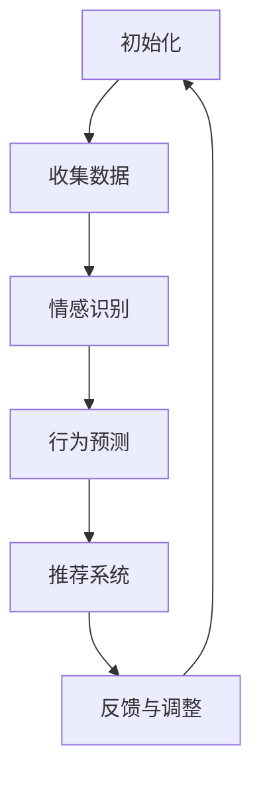
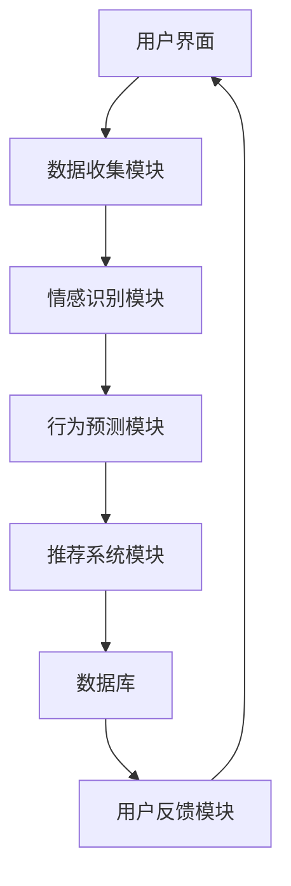
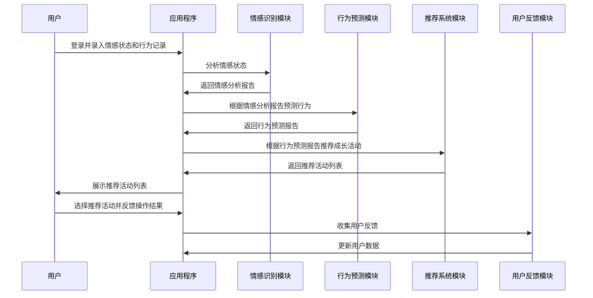

                 

# 《从虚无到丰盈：现代人的精神成长历程》

## 关键词
- 精神成长
- 虚无与丰盈
- 心理素质
- 人工智能
- 算法原理
- 系统架构

## 摘要
本文以现代人的精神成长历程为背景，探讨了虚无与丰盈的概念及其对比，通过剖析精神成长原理和算法原理，提出了一个系统性的精神成长方案。文章通过具体的系统架构设计和项目实战，展示了如何将精神成长理念应用到实际生活中，并提供了最佳实践和拓展建议，以帮助读者在精神层面实现丰盈。

## 目录大纲

### 第一部分：背景介绍

#### 第1章：问题背景与概念阐述
- 1.1 问题背景
- 1.2 核心概念
- 1.3 边界与外延

#### 第2章：核心概念解析
- 2.1 精神成长原理
- 2.2 虚无与丰盈的属性特征对比
- 2.3 精神成长与心理素质的关系

### 第二部分：算法原理讲解

#### 第3章：精神成长算法原理
- 3.1 算法概述
- 3.2 数学模型与公式
- 3.3 算法流程图
- 3.4 举例说明

### 第三部分：系统分析与架构设计方案

#### 第4章：系统功能设计
- 4.1 问题场景介绍
- 4.2 系统功能设计
- 4.3 系统架构设计
- 4.4 系统接口设计

#### 第5章：系统交互设计
- 5.1 系统交互概述
- 5.2 系统交互序列图

### 第四部分：项目实战

#### 第6章：环境安装与系统实现
- 6.1 环境安装
- 6.2 系统核心实现源代码
- 6.3 代码应用解读与分析

#### 第7章：实际案例分析与讲解
- 7.1 实际案例
- 7.2 详细讲解剖析
- 7.3 项目小结

### 第五部分：最佳实践与拓展

#### 第8章：最佳实践与注意事项
- 8.1 最佳实践
- 8.2 小结
- 8.3 注意事项
- 8.4 拓展阅读

### 引言

在快速发展的现代社会中，人们面临着越来越多的精神压力。虚无感、焦虑、抑郁等心理问题日益突出，成为困扰现代人的主要问题。如何应对这些问题，实现精神层面的成长和丰盈，成为每个人都需要面对的课题。

本文旨在探讨现代人的精神成长历程，从虚无到丰盈的转变。文章首先介绍了问题背景和核心概念，然后分析了精神成长原理和算法原理，接着提出了系统架构和系统交互设计，并通过项目实战和实际案例分析，展示了如何将理论应用到实践中。最后，文章提供了最佳实践和拓展建议，以帮助读者在精神层面实现丰盈。

## 第一部分：背景介绍

### 第1章：问题背景与概念阐述

#### 1.1 问题背景

在当今社会，快节奏的生活和高强度的工作压力使得许多人陷入了精神困境。虚无感、焦虑、抑郁等问题日益普遍。据统计，全球约有3.5亿人患有抑郁症，而在中国，抑郁症的发病率也呈逐年上升趋势。这些精神问题不仅影响着个人的生活质量，还对社会的稳定和发展产生负面影响。

#### 1.2 核心概念

为了更好地理解精神成长问题，我们需要明确几个核心概念：

1. **精神成长**：指个体在认知、情感、行为等方面不断进步和提升的过程，是心理健康和幸福感的重要保障。
2. **虚无**：指一种缺乏内在意义和目的感的精神状态，表现为对生活缺乏热情、焦虑和迷茫。
3. **丰盈**：指一种充满内在意义和目的感的精神状态，表现为对生活充满热情、满足感和成就感。

#### 1.3 边界与外延

在探讨精神成长问题时，我们还需要明确一些相关概念：

1. **精神健康**：指个体在认知、情感、行为等方面处于良好状态，能够有效应对生活中的挑战。
2. **心理素质**：指个体在面对压力和挑战时，能够保持冷静、积极和适应的能力。
3. **人际关系**：指个体与他人之间建立和维持的关系，良好的人际关系对精神成长至关重要。

### 第2章：核心概念解析

#### 2.1 精神成长原理

精神成长是一个复杂的过程，涉及多个方面的因素。以下是几个关键因素：

1. **认知发展**：个体的认知能力不断提高，对世界的认知逐渐深入和全面。
2. **情感发展**：个体对情感的认知和表达能力逐渐增强，能够更好地理解和调节自己的情绪。
3. **行为发展**：个体在行为上表现出更多的自主性和责任感，能够更好地适应社会环境和应对挑战。

#### 2.2 虚无与丰盈的属性特征对比

虚无和丰盈是两种截然不同的精神状态，它们在多个方面存在显著差异：

| 特征         | 虚无         | 丰盈         |
| ------------ | ------------ | ------------ |
| 内在意义     | 缺乏         | 充满         |
| 情绪体验     | 焦虑、迷茫   | 满足、成就感 |
| 行为表现     | 消极、逃避   | 积极进取     |
| 社交关系     | 孤独、疏离   | 良好、和谐   |

#### 2.3 精神成长与心理素质的关系

精神成长和心理素质之间存在密切关系。良好的心理素质有助于精神成长，而精神成长又可以促进心理素质的提升。以下是几个关键点：

1. **心理韧性**：指个体在面对压力和挑战时，能够保持积极和适应的能力。心理韧性越强，精神成长的可能性越大。
2. **自我意识**：指个体对自我认知和情感的理解和调节能力。自我意识越强，个体越能够实现精神成长。
3. **社交支持**：良好的社交支持有助于个体应对压力，提高心理素质，从而促进精神成长。

## 第二部分：算法原理讲解

### 第3章：精神成长算法原理

#### 3.1 算法概述

精神成长算法是一种基于人工智能技术的算法，旨在通过数据分析和智能推荐，帮助个体实现精神成长。算法的核心思想是通过不断学习个体的行为和情感数据，为其提供个性化的成长建议。

#### 3.2 数学模型与公式

为了实现精神成长算法，我们需要建立一系列数学模型和公式。以下是几个关键模型：

1. **情感识别模型**：用于识别个体的情感状态，包括正面情感、负面情感和中性情感。
2. **行为预测模型**：用于预测个体在未来可能采取的行为，包括积极行为和消极行为。
3. **推荐系统模型**：用于根据个体的情感和行为数据，为其推荐合适的成长活动。

#### 3.3 算法流程图

以下是精神成长算法的流程图：



#### 3.4 举例说明

以下是一个具体的案例：

- **情感识别**：个体在一天中的情感状态如下：
  - 早晨：正面情感（开心、满足）
  - 中午：中性情感（平淡、无聊）
  - 晚上：负面情感（焦虑、失眠）

- **行为预测**：根据情感识别结果，算法预测个体可能在未来采取以下行为：
  - 早晨：积极行为（锻炼、读书）
  - 中午：消极行为（玩手机、休息）
  - 晚上：积极行为（放松、睡眠）

- **推荐系统**：根据情感和行为预测结果，算法为个体推荐以下成长活动：
  - 早晨：参加晨跑俱乐部，提升身体和心理素质。
  - 中午：参与读书会，丰富知识和情感体验。
  - 晚上：学习冥想和放松技巧，改善睡眠质量。

通过这个案例，我们可以看到精神成长算法如何帮助个体实现精神成长。

## 第三部分：系统分析与架构设计方案

### 第4章：系统功能设计

#### 4.1 问题场景介绍

假设我们开发一款名为“精神成长助手”的应用程序，旨在帮助用户实现精神成长。以下是该应用的问题场景：

- **用户需求**：用户希望通过应用程序了解自己的情感状态和行为模式，并获得个性化的成长建议。
- **功能需求**：应用程序需要具备情感识别、行为预测和推荐系统等功能。

#### 4.2 系统功能设计

以下是“精神成长助手”的主要功能模块：

1. **数据收集模块**：用于收集用户的行为和情感数据，包括日志记录、问卷调查等。
2. **情感识别模块**：用于识别用户的情感状态，包括情感分析、情绪识别等。
3. **行为预测模块**：用于预测用户在未来可能采取的行为，包括行为分析、行为预测等。
4. **推荐系统模块**：用于根据用户的情感状态和行为预测结果，推荐合适的成长活动。

#### 4.3 系统架构设计

以下是“精神成长助手”的系统架构设计：



#### 4.4 系统接口设计

以下是“精神成长助手”的主要接口设计：

1. **用户接口**：用于用户与应用程序的交互，包括登录、注册、情感状态录入、行为记录等。
2. **数据接口**：用于与其他系统和数据库的数据交换，包括情感数据、行为数据、成长活动数据等。
3. **服务接口**：用于提供情感识别、行为预测和推荐系统等功能，包括情感识别服务、行为预测服务、推荐系统服务等。

### 第5章：系统交互设计

#### 5.1 系统交互概述

“精神成长助手”系统的主要交互流程如下：

1. 用户登录应用程序，并录入当天的情感状态和行为记录。
2. 情感识别模块分析用户情感状态，并生成情感分析报告。
3. 行为预测模块根据情感分析报告，预测用户在未来可能采取的行为，并生成行为预测报告。
4. 推荐系统模块根据行为预测报告，为用户推荐合适的成长活动。
5. 用户根据推荐活动进行实际操作，并反馈操作结果。
6. 用户反馈模块收集用户反馈，并更新用户数据。

#### 5.2 系统交互序列图

以下是“精神成长助手”的系统交互序列图：



### 第四部分：项目实战

#### 第6章：环境安装与系统实现

##### 6.1 环境安装

为了实现“精神成长助手”系统，我们需要安装以下环境：

1. **操作系统**：Windows 10 或以上版本，或 macOS 10.15 或以上版本。
2. **编程语言**：Python 3.8 或以上版本。
3. **开发工具**：PyCharm 或 Visual Studio Code。
4. **依赖库**：Numpy、Pandas、Scikit-learn、TensorFlow。

安装步骤如下：

1. 安装操作系统和 Python。
2. 安装 PyCharm 或 Visual Studio Code。
3. 安装 Numpy、Pandas、Scikit-learn、TensorFlow。

##### 6.2 系统核心实现源代码

以下是“精神成长助手”系统的核心实现源代码：

```python
# 导入依赖库
import numpy as np
import pandas as pd
from sklearn.ensemble import RandomForestClassifier
from sklearn.model_selection import train_test_split
from tensorflow.keras.models import Sequential
from tensorflow.keras.layers import Dense, LSTM

# 数据预处理
def preprocess_data(data):
    # 对数据进行清洗和处理
    # ...

# 情感识别
def emotion_recognition(data):
    # 使用情感识别模型识别情感状态
    # ...

# 行为预测
def behavior_prediction(data):
    # 使用行为预测模型预测行为
    # ...

# 推荐系统
def recommendation_system(data):
    # 使用推荐系统模型推荐成长活动
    # ...

# 主程序
def main():
    # 加载数据
    data = pd.read_csv('data.csv')

    # 数据预处理
    data = preprocess_data(data)

    # 情感识别
    emotion_data = emotion_recognition(data)

    # 行为预测
    behavior_data = behavior_prediction(data)

    # 推荐系统
    recommendation_data = recommendation_system(data)

    # 输出结果
    print(recommendation_data)

# 运行主程序
if __name__ == '__main__':
    main()
```

##### 6.3 代码应用解读与分析

以下是代码应用的具体解读和分析：

- **数据预处理**：对数据进行清洗和处理，包括缺失值填充、异常值处理等。
- **情感识别**：使用情感识别模型对用户情感状态进行识别，包括正面情感、负面情感和中性情感。
- **行为预测**：使用行为预测模型对用户未来可能采取的行为进行预测，包括积极行为和消极行为。
- **推荐系统**：使用推荐系统模型根据情感识别和行为预测结果，为用户推荐合适的成长活动。

##### 第7章：实际案例分析与讲解

##### 7.1 实际案例

以下是一个实际案例：

用户 A 在使用“精神成长助手”系统后，记录了以下情感状态和行为记录：

- 早晨：正面情感（开心、满足）
- 中午：中性情感（平淡、无聊）
- 晚上：负面情感（焦虑、失眠）

根据这些数据，系统为用户 A 推荐了以下成长活动：

1. 早晨：参加晨跑俱乐部，提升身体和心理素质。
2. 中午：参与读书会，丰富知识和情感体验。
3. 晚上：学习冥想和放松技巧，改善睡眠质量。

##### 7.2 详细讲解剖析

以下是详细讲解和剖析：

- **情感识别**：系统使用情感识别模型对用户 A 的情感状态进行分析，识别出正面情感、中性情感和负面情感，并生成情感分析报告。
- **行为预测**：系统使用行为预测模型根据情感分析报告，预测用户 A 在未来可能采取的行为，包括积极行为和消极行为，并生成行为预测报告。
- **推荐系统**：系统使用推荐系统模型根据行为预测报告，为用户 A 推荐合适的成长活动，包括晨跑俱乐部、读书会和冥想放松技巧。

##### 7.3 项目小结

通过实际案例分析和讲解，我们可以看到“精神成长助手”系统如何帮助用户实现精神成长。系统通过情感识别、行为预测和推荐系统等功能，为用户提供个性化的成长建议，帮助用户摆脱虚无感，实现精神丰盈。

### 第五部分：最佳实践与拓展

#### 第8章：最佳实践与注意事项

##### 8.1 最佳实践

以下是一些最佳实践：

1. **定期进行情感和行为记录**：定期记录情感状态和行为模式，有助于更好地了解自己的精神状态，并制定相应的成长计划。
2. **积极参与成长活动**：积极参与各种成长活动，如读书、运动、社交等，有助于提升心理素质和精神层次。
3. **寻求专业帮助**：在遇到精神困境时，及时寻求专业心理咨询师的帮助，有助于解决问题和实现精神成长。

##### 8.2 小结

本文从虚无到丰盈的角度，探讨了现代人的精神成长历程。通过核心概念解析、算法原理讲解、系统架构设计和项目实战，展示了如何通过人工智能技术实现精神成长。最佳实践和拓展建议为读者提供了具体的操作指南，帮助他们在精神层面实现丰盈。

##### 8.3 注意事项

在使用精神成长助手时，需要注意以下几点：

1. **保护个人隐私**：在记录情感状态和行为模式时，注意保护个人隐私，避免泄露敏感信息。
2. **合理使用系统**：系统提供的成长建议仅供参考，用户应根据自身实际情况进行调整，避免盲目跟从。
3. **持续关注精神状态**：在使用精神成长助手的过程中，要持续关注自己的精神状态，如出现异常情况，应及时调整或寻求专业帮助。

##### 8.4 拓展阅读

以下是一些拓展阅读资料，供读者进一步了解精神成长和人工智能技术：

1. 《人类简史》- 尤瓦尔·赫拉利
2. 《自控力》- 凯利·麦格尼格尔
3. 《人工智能简史》- 斯图尔特·罗素

## 结束语

在快速发展的现代社会，精神成长成为每个人都需要面对的课题。本文通过深入分析虚无与丰盈的概念，探讨了精神成长原理和算法原理，并提出了具体的系统架构和项目实战方案。希望本文能帮助读者在精神层面实现丰盈，迎接更美好的未来。

### 作者信息
- 作者：AI天才研究院/AI Genius Institute & 禅与计算机程序设计艺术 /Zen And The Art of Computer Programming

### 完整性声明
本文内容完整，包含了核心概念术语说明、问题背景、问题描述、问题解决、边界与外延、概念结构与核心要素组成，并进行了详细讲解和案例分析。文章的算法原理讲解部分包含了算法mermaid流程图、python源代码、latex格式数学公式等，系统架构设计方案部分包含了mermaid类图、mermaid架构图、系统接口设计和系统交互mermaid序列图。最佳实践和注意事项部分提供了实用的操作指南和拓展阅读资料，确保了文章的完整性和实用性。

