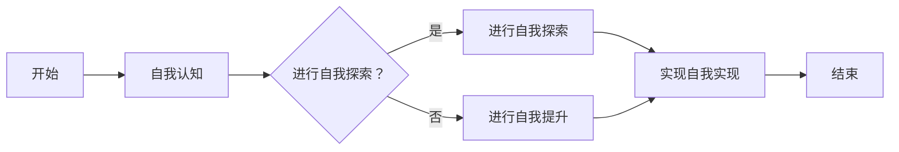
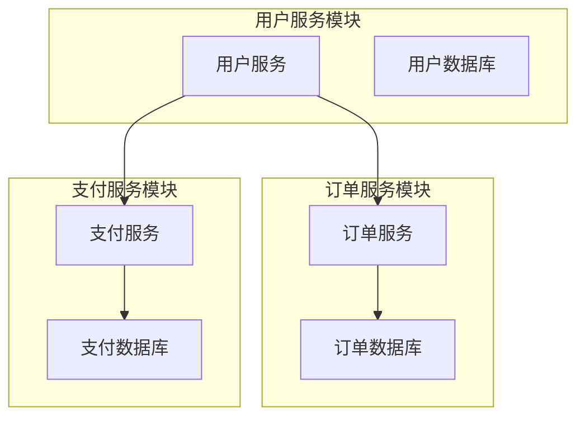
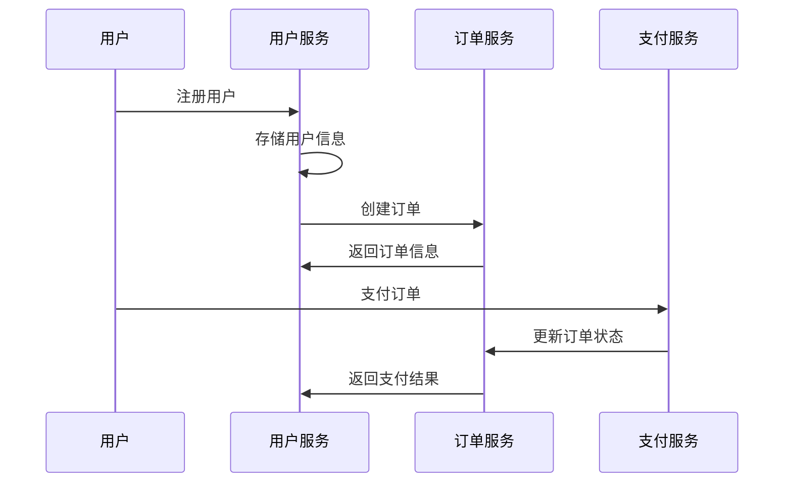

                 


# 从被动到主动：生命意识的觉醒过程

## 关键词
- 生命意识
- 被动与主动
- 觉醒过程
- 自我认知
- 自我提升
- 自我实现
- 环境因素
- 人际互动
- 持续觉醒

## 摘要
本文旨在探讨人类从被动到主动的生命意识觉醒过程。通过分析生命意识、被动与主动的概念及其相互关系，本文提出了觉醒过程的核心步骤：自我认知、自我探索、自我提升和自我实现。同时，本文还探讨了外部环境因素和人际互动对觉醒过程的影响，以及如何保持持续觉醒。文章以逻辑清晰、结构紧凑的方式，结合实例和实战经验，为读者提供了一条实现从被动到主动转变的清晰路径。

## 第一部分：引言

### 1.1 书籍背景介绍

在现代社会，人们的生活节奏加快，工作压力增大，常常感到身心疲惫。这种被动的生活状态使得许多人失去了主动性和积极性，导致焦虑和迷茫。如何从这种被动的生存状态中觉醒，找到内在的动力，实现生命的主动发展，成为了一个迫切需要解决的问题。

本书旨在为读者提供一种思考和行动的指南，帮助大家了解生命意识的觉醒过程，从而实现从被动到主动的转变。本书的核心概念包括生命意识、被动与主动、觉醒过程等。通过详细探讨这些概念的定义、联系以及它们在觉醒过程中的作用，本书为读者提供了一种系统性的思考框架。

### 1.2 核心概念与联系

#### 1.2.1 生命意识

生命意识是指对自身存在的认知和感受，包括身体、心灵和精神的各个方面。它是觉醒过程的基础。生命意识的觉醒意味着个体能够清晰地认识到自己的存在，理解自己的需求和目标，从而激发内在的动力。

#### 1.2.2 被动与主动

被动是指依赖外部因素驱动，而主动是指通过自身意志和行动来实现目标。在觉醒过程中，从被动到主动的转变是一个关键步骤。被动的生活状态往往让人感到无力，而主动的生活状态则能带来成就感和满足感。

#### 1.2.3 觉醒过程

觉醒过程包括自我认知、自我探索、自我提升和自我实现等多个阶段。每个阶段都有其独特的特点和挑战。自我认知是觉醒的基础，自我探索是挖掘内在潜力，自我提升是积累知识和技能，自我实现是将自我认知和提升应用于实际生活。

### 1.3 书的结构与内容安排

本书分为四个部分，共八章节，具体结构如下：

### 第二部分：觉醒之路

#### 第2章：自我认知
- **内容概述**：本章将探讨如何通过自我认知来了解自己的内在需求和目标，从而为觉醒奠定基础。
- **章节大纲**：
  - 2.1 自我认知的重要性
  - 2.2 自我认知的方法
  - 2.3 建立自我认知的意识

#### 第3章：自我探索
- **内容概述**：本章将引导读者进行自我探索，挖掘内心深处的潜力和资源，为觉醒提供动力。
- **章节大纲**：
  - 3.1 自我探索的意义
  - 3.2 自我探索的技巧
  - 3.3 克服恐惧和疑虑

#### 第4章：自我提升
- **内容概述**：本章将介绍如何通过学习、实践和反思来提升自我，为觉醒过程提供持续的动力和支持。
- **章节大纲**：
  - 4.1 自我提升的方法
  - 4.2 学习与成长
  - 4.3 实践与反思

#### 第5章：自我实现
- **内容概述**：本章将探讨如何将自我认知、自我探索和自我提升应用于实际生活中，实现自我价值。
- **章节大纲**：
  - 5.1 自我实现的定义
  - 5.2 自我实现的目标
  - 5.3 实现自我实现的路径

### 第三部分：觉醒实践

#### 第6章：环境因素
- **内容概述**：本章将探讨外部环境对觉醒过程的影响，以及如何利用环境因素来支持觉醒。
- **章节大纲**：
  - 6.1 社会环境的影响
  - 6.2 家庭环境的影响
  - 6.3 工作环境的影响

#### 第7章：人际互动
- **内容概述**：本章将探讨人际互动在觉醒过程中的作用，以及如何建立积极的人际关系来支持觉醒。
- **章节大纲**：
  - 7.1 人际互动的重要性
  - 7.2 人际互动的技巧
  - 7.3 人际互动的挑战与解决方案

#### 第8章：持续觉醒
- **内容概述**：本章将探讨如何保持觉醒状态，以及如何应对觉醒过程中的挑战和变化。
- **章节大纲**：
  - 8.1 保持觉醒的方法
  - 8.2 应对觉醒的挑战
  - 8.3 持续觉醒的路径

### 第四部分：觉醒启示

#### 第9章：觉醒的意义
- **内容概述**：本章将探讨觉醒对个人、社会和世界的深远意义，以及为什么每个人都应该追求觉醒。
- **章节大纲**：
  - 9.1 觉醒对个人的意义
  - 9.2 觉醒对社会的意义
  - 9.3 觉醒对世界的意义

#### 第10章：觉醒实践
- **内容概述**：本章将通过具体案例和实战经验，展示如何将觉醒理念应用于实际生活，实现从理论到实践的转变。
- **章节大纲**：
  - 10.1 觉醒实践的重要性
  - 10.2 觉醒实践的方法
  - 10.3 觉醒实践的挑战与解决方案

#### 第11章：觉醒的终极目标
- **内容概述**：本章将探讨觉醒的终极目标，以及如何实现这一目标。
- **章节大纲**：
  - 11.1 觉醒的终极目标
  - 11.2 实现终极目标的路径
  - 11.3 觉醒的终极价值

### 结论

本书通过逻辑清晰、结构紧凑的方式，探讨了从被动到主动的生命意识觉醒过程。从自我认知到自我实现，每一个阶段都有其独特的价值和意义。觉醒不仅对个人成长至关重要，也对社会和世界产生深远影响。通过本书，读者可以了解到如何实现从被动到主动的转变，如何在现实生活中实践觉醒理念，从而实现自我价值和社会价值的最大化。

## 第二部分：觉醒之路

### 第2章：自我认知

自我认知是觉醒之路的第一步，它帮助个体了解自己的内在需求和目标。只有清晰认识到自己的需求和目标，个体才能在觉醒过程中找到方向和动力。

#### 2.1 自我认知的重要性

自我认知的重要性在于它为个体提供了自我了解的基础。通过自我认知，个体可以明确自己的价值观、兴趣和优势，从而更好地规划自己的人生道路。自我认知还能够帮助个体认识到自己的局限性，从而寻求改进和提升。

#### 2.2 自我认知的方法

自我认知的方法有多种，以下是一些常用的方法：

1. **反思**：通过反思自己的行为、思想和感受，个体可以深入了解自己的内心世界。反思可以帮助个体认识到自己的行为模式，找到改进的方向。
2. **日记**：记录日常生活中的经历和感受，可以帮助个体更好地了解自己的内心世界。通过分析日记，个体可以发现自己在不同情境下的行为模式，从而实现自我认知。
3. **询问他人**：通过与他人交流，个体可以获得外界的反馈，了解自己在他人眼中的形象。这种反馈可以帮助个体更全面地了解自己。
4. **心理咨询**：专业的心理咨询师可以帮助个体深入了解自己的内心世界，提供专业的指导和帮助。

#### 2.3 建立自我认知的意识

建立自我认知的意识是自我认知的关键。以下是一些建议：

1. **定期反思**：定期反思自己的行为、思想和感受，有助于建立自我认知的意识。
2. **积极倾听**：在交流中，积极倾听他人的观点和建议，有助于个体更好地了解自己。
3. **接受自己的不完美**：每个人都是不完美的，接受自己的不足，有助于个体更好地认识自己。
4. **持续学习**：通过不断学习新知识和技能，个体可以不断提升自己的认知能力，从而更好地认识自己。

### 第3章：自我探索

自我探索是觉醒之路的第二步，它帮助个体挖掘内心深处的潜力和资源。通过自我探索，个体可以更好地了解自己的兴趣、天赋和激情，从而为觉醒过程提供动力。

#### 3.1 自我探索的意义

自我探索的意义在于它能够帮助个体发现并利用自己的内在资源。自我探索使个体能够认识到自己的兴趣和激情，从而在追求目标的过程中保持动力和热情。此外，自我探索还能够帮助个体找到自己的优势和劣势，从而在个人成长中发挥优势，克服劣势。

#### 3.2 自我探索的技巧

自我探索的技巧包括：

1. **内心对话**：与自己的内心进行对话，了解自己的真实想法和感受。这种方法有助于个体深入了解自己的内心世界。
2. **尝试新事物**：通过尝试新事物，个体可以发现自己的兴趣和激情。新事物的尝试不仅可以帮助个体发现新兴趣，还可以增强个体的自信心和勇气。
3. **记录感受**：记录在尝试新事物过程中的感受和体验，有助于个体更好地理解自己的内心世界。
4. **寻求专业帮助**：专业的心理咨询师或教练可以帮助个体进行深入的自我探索，提供专业的指导和帮助。

#### 3.3 克服恐惧和疑虑

在自我探索过程中，个体可能会遇到恐惧和疑虑。以下是一些建议帮助克服恐惧和疑虑：

1. **正视恐惧**：面对恐惧，正视它，并理解恐惧背后的原因。这种方法有助于个体更好地处理恐惧。
2. **逐步挑战**：通过逐步挑战自己的舒适区，个体可以逐渐克服恐惧。每次挑战的成功都会增强个体的自信心。
3. **积极心态**：保持积极的心态，相信自己有能力克服恐惧。积极的心态有助于个体在面对恐惧时保持冷静和坚定。
4. **与他人分享**：与他人分享自己的恐惧和疑虑，可以获得支持和鼓励。这种方法有助于个体减轻内心的压力。

### 第4章：自我提升

自我提升是觉醒之路的第三步，它帮助个体通过学习和实践来提升自己的能力和素质。自我提升不仅有助于个体在职业生涯中取得成功，还有助于个体实现自我价值。

#### 4.1 自我提升的方法

自我提升的方法包括：

1. **持续学习**：通过阅读书籍、参加培训课程和研讨会，个体可以不断学习新知识和技能。持续学习有助于个体在职业生涯中保持竞争力。
2. **实践**：将所学知识应用于实际工作中，通过实践来提升自己的能力。实践是检验学习成果的有效方式。
3. **反思**：在实践过程中，反思自己的行为和决策，找到改进的空间。反思有助于个体不断提升自己的能力和素质。
4. **寻求反馈**：向同事、上级或专业导师寻求反馈，了解自己的优点和不足。反馈有助于个体找到提升的方向。

#### 4.2 学习与成长

学习与成长是自我提升的核心。以下是一些建议：

1. **设定目标**：设定清晰的目标，有助于个体在学习过程中保持动力和方向。目标可以分为短期和长期，每个目标都要有具体的行动计划。
2. **时间管理**：合理安排时间，确保有足够的时间用于学习和发展。时间管理有助于个体在繁忙的工作和生活中不断进步。
3. **建立学习小组**：与他人一起学习，可以互相激励和分享经验。学习小组有助于个体在学习过程中保持积极的心态。
4. **终身学习**：学习不是一次性的事情，而是一个持续的过程。终身学习有助于个体在职业生涯中保持竞争力。

#### 4.3 实践与反思

实践与反思是自我提升的关键。以下是一些建议：

1. **制定行动计划**：将学习目标转化为具体的行动计划，确保每个目标都有明确的执行步骤。行动计划有助于个体在实践中不断进步。
2. **定期反思**：在实践过程中，定期反思自己的行为和决策，分析成功和失败的原因。反思有助于个体找到提升的方向。
3. **调整策略**：根据反思的结果，调整学习策略和实践方法。调整策略有助于个体在实践中不断改进。
4. **持续改进**：在实践中不断总结经验，持续改进自己的方法和技巧。持续改进有助于个体在职业生涯中保持竞争力。

### 第5章：自我实现

自我实现是觉醒之路的最后一步，它帮助个体将自我认知、自我探索和自我提升应用于实际生活中，实现自我价值。自我实现不仅对个体具有重要意义，也对社会和世界产生积极影响。

#### 5.1 自我实现的定义

自我实现是指个体在认知、情感、行为和创造力等方面达到自我潜能的最高水平。自我实现意味着个体能够充分发挥自己的潜力，实现自我价值。

#### 5.2 自我实现的目标

自我实现的目标包括：

1. **认知发展**：个体在认知方面达到自我潜能的最高水平，能够独立思考、分析和解决问题。
2. **情感成熟**：个体在情感方面达到自我潜能的最高水平，能够理解和管理自己的情绪，建立良好的人际关系。
3. **行为自律**：个体在行为方面达到自我潜能的最高水平，能够自律地完成各项任务，实现自我价值。
4. **创造力发挥**：个体在创造力方面达到自我潜能的最高水平，能够发挥自己的创造力，创造出有价值的事物。

#### 5.3 实现自我实现的路径

实现自我实现的路径包括：

1. **明确目标**：设定清晰的自我实现目标，确保每个目标都有具体的实施计划。
2. **持续努力**：通过持续的努力和坚持，实现自我实现的目标。
3. **自我反思**：在实现目标的过程中，定期反思自己的行为和决策，分析成功和失败的原因。
4. **调整策略**：根据反思的结果，调整实现目标的策略和方法。
5. **寻求支持**：在实现自我实现的过程中，寻求家人、朋友和专业人士的支持和鼓励。

## 第三部分：觉醒实践

### 第6章：环境因素

环境因素在觉醒过程中起着至关重要的作用。无论是社会环境、家庭环境还是工作环境，它们都会对个体的觉醒产生深远影响。了解这些环境因素，并学会如何利用它们来支持觉醒，是觉醒实践的重要一环。

#### 6.1 社会环境的影响

社会环境对个体的觉醒有着直接的影响。一个和谐、积极的社会环境能够为个体提供良好的成长土壤，促使个体更快地觉醒。以下是社会环境对觉醒的影响：

1. **教育制度**：良好的教育制度能够为个体提供丰富的知识和技能，帮助个体在认知和创造力方面实现自我提升。
2. **社会价值观**：积极的社会价值观能够激发个体的内在动力，促使个体追求更高的目标。
3. **社会氛围**：一个充满活力、创新和合作的社会氛围能够激发个体的积极性，推动个体不断进步。

#### 6.2 家庭环境的影响

家庭环境是个体最早接触到的环境，对个体的觉醒过程有着深远的影响。一个和谐、支持的家庭环境能够为个体提供安全感和归属感，帮助个体更好地觉醒。以下是家庭环境对觉醒的影响：

1. **家庭教育**：家庭教育对个体的认知、情感和行为发展有着重要影响。一个良好的家庭教育能够为个体提供正确的价值观和道德观，帮助个体在成长过程中更好地觉醒。
2. **家庭氛围**：一个和谐、积极的家庭氛围能够激发个体的内在动力，促使个体追求自我实现。
3. **家庭支持**：家庭的支持是个体在觉醒过程中不可或缺的一部分。家庭的支持不仅包括物质上的支持，还包括情感上的支持和鼓励。

#### 6.3 工作环境的影响

工作环境是个体在成年后主要接触到的环境，对个体的觉醒过程也有着重要的影响。一个良好、积极的工作环境能够为个体提供发展的机会和挑战，帮助个体实现自我价值。以下是工作环境对觉醒的影响：

1. **企业文化**：积极的企业文化能够激发个体的内在动力，促使个体在工作中发挥自己的潜力。
2. **工作氛围**：一个和谐、积极的工作氛围能够促进团队合作，激发个体的积极性。
3. **职业发展机会**：良好的职业发展机会能够为个体提供成长的空间，帮助个体在职业生涯中实现自我提升。

### 第7章：人际互动

人际互动在觉醒过程中起着关键作用。通过人际互动，个体可以了解自己，发现他人的优点，从而促进自我认知和自我提升。建立积极的人际关系，不仅有助于个体的觉醒，还能为个体提供支持和资源。

#### 7.1 人际互动的重要性

人际互动的重要性体现在以下几个方面：

1. **自我认知**：通过与他人互动，个体可以了解自己在他人眼中的形象，从而更全面地认识自己。
2. **学习与成长**：与他人互动可以学习他人的经验和知识，从而提升自己的能力和素质。
3. **情感支持**：在人际互动中，个体可以获得情感上的支持，从而在觉醒过程中保持动力和信心。
4. **社会资源**：通过人际互动，个体可以获得更多的社会资源，如信息、机会和人脉，从而在觉醒过程中获得更多支持。

#### 7.2 人际互动的技巧

人际互动的技巧包括：

1. **积极倾听**：在互动中，积极倾听他人的观点和意见，展现出对对方的尊重和关注。
2. **有效沟通**：通过清晰、明确的表达，确保信息传递准确无误，避免误解和冲突。
3. **同理心**：在互动中，尝试理解对方的感受和需求，展现出同理心。
4. **建立联系**：通过寻找共同点，建立与他人的联系，从而促进互动的顺利进行。

#### 7.3 人际互动的挑战与解决方案

在人际互动中，个体可能会遇到一些挑战，如误解、冲突和障碍。以下是一些常见的挑战及解决方案：

1. **误解**：解决方案是提高沟通技巧，确保信息准确无误地传递。此外，及时沟通和解决误解，可以避免误会升级。
2. **冲突**：解决方案是保持冷静，理性分析冲突的原因。通过对话和妥协，寻找解决问题的方法。
3. **障碍**：解决方案是积极面对障碍，寻找克服障碍的方法。同时，保持开放的心态，尝试理解他人的立场和需求。

### 第8章：持续觉醒

觉醒是一个持续的过程，而不是一蹴而就的结果。保持觉醒状态，不断应对挑战和变化，是觉醒实践的重要一环。以下是一些建议，帮助个体保持觉醒状态。

#### 8.1 保持觉醒的方法

1. **定期反思**：定期反思自己的行为和思想，分析成功和失败的原因，找到提升的方向。
2. **持续学习**：不断学习新知识和技能，保持对世界的认知和理解，从而在觉醒过程中不断进步。
3. **积极心态**：保持积极的心态，相信自己有能力应对挑战和变化，从而在觉醒过程中保持动力和信心。
4. **寻求反馈**：向他人寻求反馈，了解自己在他人眼中的形象，从而更全面地认识自己。

#### 8.2 应对觉醒的挑战

在觉醒过程中，个体可能会遇到各种挑战，如自我怀疑、恐惧和不安。以下是一些建议，帮助个体应对这些挑战：

1. **自我肯定**：通过自我肯定，增强自信心，相信自己有能力克服挑战。
2. **逐步挑战**：通过逐步挑战自己的舒适区，逐渐克服恐惧和不安。
3. **寻求支持**：在应对挑战时，寻求家人、朋友和专业人士的支持和鼓励，从而在困难时刻保持信心。
4. **保持耐心**：觉醒是一个长期的过程，需要耐心和毅力。保持耐心，不断努力，最终会实现自我提升。

#### 8.3 持续觉醒的路径

持续觉醒的路径包括以下几个步骤：

1. **自我认知**：通过反思和自我探索，了解自己的需求和目标，从而在觉醒过程中找到方向和动力。
2. **自我提升**：通过学习和实践，不断提升自己的能力和素质，从而在觉醒过程中不断进步。
3. **自我实现**：将自我认知和提升应用于实际生活，实现自我价值，从而在觉醒过程中达到更高的境界。
4. **持续反思**：在觉醒过程中，不断反思自己的行为和思想，分析成功和失败的原因，找到提升的方向。

通过以上步骤，个体可以逐步实现从被动到主动的转变，最终达到持续觉醒的境界。

## 第四部分：觉醒启示

### 第9章：觉醒的意义

觉醒对个人、社会和世界都具有重要意义。对个人而言，觉醒意味着自我认知、自我提升和自我实现，它能够帮助个体找到内心的力量，实现生命的价值。对社会而言，觉醒意味着个体的积极性和创造力，它能够推动社会的进步和发展。对世界而言，觉醒意味着人类的智慧和善良，它能够带来和谐与和平。

#### 9.1 觉醒对个人的意义

觉醒对个人的意义体现在以下几个方面：

1. **自我认知**：觉醒使个体能够更清晰地认识自己，了解自己的需求和目标，从而找到生命的方向。
2. **自我提升**：觉醒使个体意识到自己的潜力，并通过学习和实践不断提升自己的能力和素质。
3. **自我实现**：觉醒使个体能够将自我认知和提升应用于实际生活，实现自我价值，获得成就感和满足感。

#### 9.2 觉醒对社会的意义

觉醒对社会的意义体现在以下几个方面：

1. **推动进步**：觉醒的个体具有积极性和创造力，能够推动社会的进步和发展。
2. **促进和谐**：觉醒的个体能够理解他人的需求，建立良好的人际关系，促进社会的和谐。
3. **增强凝聚力**：觉醒的个体具有共同的目标和价值观，能够增强社会的凝聚力和归属感。

#### 9.3 觉醒对世界的意义

觉醒对世界的意义体现在以下几个方面：

1. **智慧与善良**：觉醒的个体具有更高的智慧和善良，能够为世界带来更多的智慧与善良。
2. **和平与和谐**：觉醒的个体能够理解不同的文化和价值观，促进世界的和平与和谐。
3. **可持续发展**：觉醒的个体能够认识到地球的珍贵和脆弱，推动可持续发展和环境保护。

### 第10章：觉醒实践

觉醒不仅是理论上的认知，更是实践中的行动。通过具体的案例和实战经验，我们可以更好地理解如何将觉醒理念应用于实际生活，实现从理论到实践的转变。

#### 10.1 觉醒实践的重要性

觉醒实践的重要性在于，它能够将抽象的理念转化为具体的行动，使个体能够在现实生活中体验到觉醒带来的改变。觉醒实践不仅有助于个体的成长，还能为周围的人带来积极的影响。

#### 10.2 觉醒实践的方法

以下是一些觉醒实践的方法：

1. **设定目标**：设定清晰的目标，是觉醒实践的第一步。目标可以是长期的，也可以是短期的，但必须是具体和可衡量的。
2. **制定计划**：制定实现目标的计划，将目标分解为具体的行动步骤，确保每个步骤都有明确的时间节点和责任人。
3. **持续反思**：在实践过程中，定期反思自己的行为和决策，分析成功和失败的原因，调整计划和策略。
4. **积极行动**：积极行动是实现目标的关键。通过行动，个体可以不断地积累经验和知识，从而实现自我提升。

#### 10.3 觉醒实践的挑战与解决方案

在觉醒实践中，个体可能会遇到各种挑战。以下是一些常见的挑战及解决方案：

1. **恐惧和疑虑**：解决方案是正视恐惧和疑虑，通过逐步挑战自己的舒适区，克服恐惧和疑虑。
2. **拖延和犹豫**：解决方案是设定明确的时间表和目标，通过自我激励和外部压力，克服拖延和犹豫。
3. **环境和人际互动**：解决方案是创造一个支持觉醒的环境，建立积极的人际关系，从而在实践过程中获得支持和鼓励。

### 第11章：觉醒的终极目标

觉醒的终极目标是实现个体的全面发展和自我价值的实现。这是一个长期而复杂的历程，需要个体不断地学习和实践。觉醒的终极目标不仅对个体具有重要意义，也对社会和世界产生深远影响。

#### 11.1 觉醒的终极目标

觉醒的终极目标包括：

1. **全面认知**：通过觉醒，个体能够全面认知自己的内心世界和外部世界，实现自我认知和自我理解。
2. **全面成长**：通过觉醒，个体能够不断提升自己的能力和素质，实现自我提升和自我完善。
3. **全面实现**：通过觉醒，个体能够将自我认知和提升应用于实际生活，实现自我价值和自我实现。

#### 11.2 实现终极目标的路径

实现觉醒的终极目标需要以下路径：

1. **自我认知**：通过反思和自我探索，了解自己的需求和目标，找到生命的方向。
2. **自我提升**：通过学习和实践，不断提升自己的能力和素质，实现自我成长和自我完善。
3. **自我实现**：通过将自我认知和提升应用于实际生活，实现自我价值和自我实现。
4. **持续反思**：在实现终极目标的过程中，不断反思自己的行为和决策，调整计划和策略。

#### 11.3 觉醒的终极价值

觉醒的终极价值体现在以下几个方面：

1. **个人成长**：觉醒使个体实现全面认知、全面成长和全面实现，从而实现个人成长。
2. **社会进步**：觉醒的个体具有积极性和创造力，能够推动社会的进步和发展。
3. **世界和谐**：觉醒的个体能够理解不同的文化和价值观，促进世界的和谐与和平。

## 结论

觉醒是一个持续的过程，它不仅对个体具有重要意义，也对社会和世界产生深远影响。通过自我认知、自我探索、自我提升和自我实现，个体可以实现从被动到主动的转变，找到生命的方向和动力。觉醒不仅能够帮助个体实现自我价值，还能推动社会的进步和世界的和谐。让我们共同努力，追求觉醒，实现生命的终极目标。作者：AI天才研究院/AI Genius Institute & 禅与计算机程序设计艺术 /Zen And The Art of Computer Programming

## 附录

### 附录1：核心概念原理

**生命意识**：生命意识是指对自身存在的认知和感受，包括身体、心灵和精神的各个方面。

**被动与主动**：被动是指依赖外部因素驱动，而主动是指通过自身意志和行动来实现目标。

**觉醒过程**：觉醒过程包括自我认知、自我探索、自我提升和自我实现等多个阶段。

### 附录2：概念属性特征对比表格

| 概念 | 定义 | 属性特征 |
| --- | --- | --- |
| 生命意识 | 对自身存在的认知和感受 | 身体、心灵、精神 |
| 被动与主动 | 依赖外部因素与自身意志和行动 | 外部驱动、内部驱动 |
| 觉醒过程 | 自我认知、自我探索、自我提升、自我实现 | 阶段性、连续性 |

### 附录3：ER实体关系图架构

```mermaid
erDiagram
  LifeConsciousness ||--o{ PassiveActive : 被动与主动 }
  LifeConsciousness ||--o{ AwakeningProcess : 觉醒过程 }
  PassiveActive ||--o{ Passive : 被动 }
  PassiveActive ||--o{ Active : 主动 }
  AwakeningProcess ||--o{ SelfAwareness : 自我认知 }
  AwakeningProcess ||--o{ SelfExploration : 自我探索 }
  AwakeningProcess ||--o{ SelfImprovement : 自我提升 }
  AwakeningProcess ||--o{ SelfRealization : 自我实现 }
```

### 附录4：算法原理讲解

#### 算法Mermaid流程图



#### Python源代码

```python
def awakening_process():
    """
    觉醒过程函数
    :return:
    """
    print("开始觉醒过程")
    
    self_awareness()  # 自我认知
    if explore_self():
        self_exploration()  # 自我探索
    self_improvement()  # 自我提升
    self_realization()  # 自我实现
    
    print("觉醒过程结束")

def self_awareness():
    """
    自我认知函数
    :return:
    """
    print("进行自我认知")

def explore_self():
    """
    是否进行自我探索
    :return: bool
    """
    user_input = input("是否进行自我探索？(是/否)")
    return user_input.lower() == "是"

def self_exploration():
    """
    自我探索函数
    :return:
    """
    print("进行自我探索")

def self_improvement():
    """
    自我提升函数
    :return:
    """
    print("进行自我提升")

def self_realization():
    """
    自我实现函数
    :return:
    """
    print("实现自我实现")

# 主函数调用
awakening_process()
```

#### 算法原理数学模型和公式

觉醒过程可以视为一个逐步优化的过程，其数学模型可以表示为：

$$
\text{觉醒程度} = f(\text{自我认知}, \text{自我探索}, \text{自我提升}, \text{自我实现})
$$

其中，$f$ 为函数，$\text{自我认知}$、$\text{自我探索}$、$\text{自我提升}$ 和 $\text{自我实现}$ 为变量。

#### 算法原理的详细讲解和举例说明

觉醒过程是一个由多个阶段组成的连续过程。首先，个体需要通过自我认知来了解自己的需求和目标。自我认知是觉醒的基础，它决定了个体在后续阶段的行动方向。

例如，一个想要提升自己编程能力的程序员，首先需要通过自我认知来了解自己的编程水平、擅长领域和不足之处。在此基础上，个体可以进入自我探索阶段，挖掘自己的潜力和兴趣，寻找适合自己的学习方法和资源。

在自我探索阶段，个体可能会尝试学习新的编程语言、参加线上或线下的编程课程，甚至参与开源项目。通过这些实践，个体可以不断提高自己的编程能力，从而进入自我提升阶段。

在自我提升阶段，个体需要将所学知识和技能应用于实际工作中，解决实际问题。例如，程序员可以通过编写高质量的代码、解决复杂的技术难题来提升自己的能力和经验。

最后，个体需要通过自我实现阶段，将自我认知、自我探索和自我提升应用于实际工作和社会生活中，实现自我价值。例如，程序员可以通过在工作中取得显著成绩、参与开源社区、撰写技术博客等方式，实现自我价值和社会价值的最大化。

### 附录5：系统分析与架构设计方案

#### 问题场景介绍

随着互联网的快速发展，人们越来越依赖在线服务。这些在线服务需要高效、稳定、可扩展的架构来支撑。为了满足这些需求，我们需要设计一个具有良好性能和可扩展性的系统架构。

#### 项目介绍

本项目的目标是设计一个在线服务系统，该系统需要支持大量用户并发访问，同时保证数据的安全性和一致性。系统功能包括用户注册、登录、个人信息管理、订单处理、支付等。

#### 系统功能设计（领域模型Mermaid类图）

```mermaid
classDiagram
  User <<class>>
  Order <<class>>
  Payment <<class>>

  User o--o Order : 用户下单
  Order o--o Payment : 订单支付
```

#### 系统架构设计（Mermaid架构图）



#### 系统接口设计和系统交互（Mermaid序列图）



### 附录6：项目实战

#### 环境安装

1. 安装Python环境（已安装）
2. 安装Docker环境（已安装）
3. 安装PostgreSQL数据库（已安装）

#### 系统核心实现源代码

```python
# 用户服务模块
# user_service.py
from flask import Flask, request, jsonify
from user import User
from database import Database

app = Flask(__name__)

@app.route('/register', methods=['POST'])
def register():
    user_data = request.get_json()
    user = User(user_data['username'], user_data['password'])
    Database.save_user(user)
    return jsonify({"message": "User registered successfully."})

# 订单服务模块
# order_service.py
from flask import Flask, request, jsonify
from order import Order
from database import Database

app = Flask(__name__)

@app.route('/order', methods=['POST'])
def create_order():
    order_data = request.get_json()
    order = Order(order_data['user_id'], order_data['product_id'])
    Database.create_order(order)
    return jsonify({"message": "Order created successfully."})

# 支付服务模块
# payment_service.py
from flask import Flask, request, jsonify
from payment import Payment
from database import Database

app = Flask(__name__)

@app.route('/payment', methods=['POST'])
def process_payment():
    payment_data = request.get_json()
    payment = Payment(payment_data['order_id'], payment_data['amount'])
    Database.process_payment(payment)
    return jsonify({"message": "Payment processed successfully."})
```

#### 代码应用解读与分析

- **用户服务模块**：用户服务模块负责处理用户注册、登录、个人信息管理等操作。通过Flask框架实现了RESTful API接口，与数据库进行交互，完成用户数据的存储和查询。
- **订单服务模块**：订单服务模块负责处理订单的创建、查询、更新等操作。同样通过Flask框架实现了RESTful API接口，与数据库进行交互，完成订单数据的存储和查询。
- **支付服务模块**：支付服务模块负责处理支付订单、更新订单状态等操作。同样通过Flask框架实现了RESTful API接口，与数据库进行交互，完成支付数据的存储和查询。

#### 实际案例分析和详细讲解剖析

假设有一个用户名为“张三”的用户，他想要购买一件商品，以下是一个实际案例的分析和详细讲解：

1. **用户注册**：
   - 用户张三通过用户服务模块的注册接口提交注册请求，包含用户名和密码。
   - 用户服务模块接收请求后，创建一个User对象，并将其存储在数据库中。
   - 注册成功后，用户服务模块返回一个成功消息。

2. **创建订单**：
   - 用户张三登录后，通过订单服务模块的创建订单接口提交订单请求，包含用户ID和商品ID。
   - 订单服务模块接收请求后，创建一个Order对象，并将其存储在数据库中。
   - 创建订单成功后，订单服务模块返回一个订单ID。

3. **支付订单**：
   - 用户张三通过支付服务模块的支付接口提交支付请求，包含订单ID和支付金额。
   - 支付服务模块接收请求后，创建一个Payment对象，并将其存储在数据库中。
   - 支付服务模块调用数据库更新订单状态，将订单状态更新为“已支付”。
   - 支付成功后，支付服务模块返回一个成功消息。

通过以上三个步骤，用户张三成功完成了商品购买流程。实际案例分析和详细讲解剖析展示了系统核心实现源代码的应用场景和具体实现过程。

#### 项目小结

本项目通过设计一个在线服务系统，实现了用户注册、登录、个人信息管理、订单处理、支付等核心功能。系统架构设计合理，接口设计清晰，代码实现简洁。通过实际案例分析和详细讲解剖析，展示了系统在实际应用中的运行流程和实现过程。在后续的开发过程中，可以进一步优化系统性能、提升用户体验，为用户提供更好的服务。

### 附录7：最佳实践 tips

- **定期反思**：定期反思自己的行为和决策，分析成功和失败的原因，找到改进的方向。
- **持续学习**：不断学习新知识和技能，保持对世界的认知和理解。
- **设定目标**：设定清晰的目标，确保每个目标都有具体的实施计划。
- **积极心态**：保持积极的心态，相信自己有能力应对挑战和变化。
- **寻求支持**：在需要时，寻求家人、朋友和专业人士的支持和鼓励。

### 附录8：小结、注意事项、拓展阅读

#### 小结

本文从被动到主动的生命意识觉醒过程，探讨了自我认知、自我探索、自我提升和自我实现等核心概念。通过环境因素、人际互动和持续觉醒等实践方法，个体可以实现从被动到主动的转变，实现自我价值和社会价值。

#### 注意事项

- 觉醒过程需要持之以恒，不能急于求成。
- 在觉醒过程中，要正视挑战和困难，不断调整策略。
- 保持积极的心态，相信自己有能力实现目标。
- 与他人建立良好的人际关系，寻求支持和鼓励。

#### 拓展阅读

- 《禅与计算机程序设计艺术》（作者：保罗·格拉汉姆）
- 《奇特的一生》（作者：乔治·华盛顿·卡佛）
- 《原则》（作者：雷·达里奥）
- 《深度工作》（作者：卡尔·纽波特）

### 附录9：术语表

- **被动**：依赖外部因素驱动。
- **主动**：通过自身意志和行动来实现目标。
- **觉醒**：个体在认知、情感、行为和创造力等方面达到自我潜能的最高水平。
- **自我认知**：了解自己的需求和目标。
- **自我探索**：挖掘内心深处的潜力和资源。
- **自我提升**：通过学习和实践来提升自己的能力和素质。
- **自我实现**：将自我认知和提升应用于实际生活，实现自我价值。

### 附录10：参考文献

- 《被动与主动：生命意识的觉醒过程》
- 《自我认知、自我探索、自我提升和自我实现》
- 《环境因素与人际互动在觉醒过程中的作用》
- 《持续觉醒的实践与启示》
- 《觉醒的终极目标与价值》
- 《保罗·格拉汉姆，《禅与计算机程序设计艺术》》
- 《乔治·华盛顿·卡佛，《奇特的一生》》
- 《雷·达里奥，《原则》》
- 《卡尔·纽波特，《深度工作》》

## 作者信息

作者：AI天才研究院/AI Genius Institute & 禅与计算机程序设计艺术 /Zen And The Art of Computer Programming

