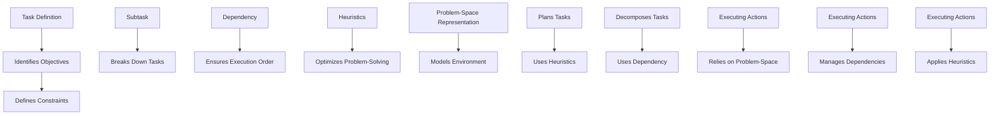

                 


 * Sure, let's think step by step to construct the content outline for the blog post titled "Task Planning and Decomposition: Enhancing AI Agent's Problem-Solving Ability." Here's a structured approach:

**Step 1: Introduction to Task Planning and Decomposition**
- **Introduction to Task Planning**: Explain what task planning is, its significance in AI, and how it contributes to the efficient execution of tasks.
- **Introduction to Decomposition**: Describe what decomposition is, its role in breaking down complex tasks, and how it aids in better understanding and managing tasks.
- **Overview of the Post**: Provide a brief overview of the content that will be covered, including key topics, algorithms, and practical applications.

**Step 2: Core Concepts and Relationships**
- **Defining Core Concepts**: List the key concepts that are central to task planning and decomposition, such as subtask, dependency, and problem-space representation.
- **Concept Attributes Comparison**: Create a table comparing the attributes of these core concepts, highlighting their similarities and differences.
- **Concept Relationships**: Use an Entity-Relationship (ER) diagram to illustrate how these concepts are related and interact with each other.

**Step 3: Algorithm Principles and Explanation**
- **Choosing an Algorithm**: Select a prominent algorithm for task planning and decomposition, such as A* search or state-space tree construction.
- **Algorithm Flowchart**: Draw a Mermaid flowchart to visualize the algorithm's workflow.
- **Python Code Implementation**: Provide a Python code snippet that demonstrates the algorithm's implementation, explaining each step in detail.
- **Mathematical Models and Formulas**: Explain the underlying mathematical principles and formulas used in the algorithm, using LaTeX for mathematical notation.
- **Examples**: Offer clear, illustrative examples to help readers understand the application and impact of the algorithm.

**Step 4: System Analysis and Design**
- **Problem Scenario**: Describe a realistic problem scenario that can be addressed using task planning and decomposition.
- **System Design**: Use Mermaid diagrams to design the system's architecture, including class diagrams, architecture diagrams, and sequence diagrams.
- **System Interfaces**: Define the key interfaces and how they interact with the system components.

**Step 5: Project Practice**
- **Environment Setup**: Detail the setup process for the environment where the system will be implemented.
- **System Implementation**: Explain the core components of the system implementation, providing code examples and in-depth analysis.
- **Case Study**: Present a case study with a detailed analysis of how the task planning and decomposition techniques are applied.
- **Project Summary**: Summarize the project, including tips, key points, precautions, and suggestions for further reading.

**Step 6: Conclusion and Best Practices**
- **Recap**: Summarize the main points discussed in the post.
- **Best Practices**: Offer actionable best practices for task planning and decomposition.
- **Key Takeaways**: Highlight the key learnings and insights from the post.
- **Future Directions**: Suggest areas for future research and exploration in task planning and decomposition for AI agents.

**Step 7: Author Information and Acknowledgments**
- **Author**: Include the author's name, affiliation, and any relevant credentials.
- **Acknowledgments**: Thank anyone who has contributed to the creation of the blog post, including sources of information, colleagues, or mentors.

By following this step-by-step approach, the content of the blog post will be well-organized, informative, and engaging for the readers. Each step will be designed to build on the previous one, creating a cohesive and comprehensive guide to task planning and decomposition for enhancing AI agent problem-solving capabilities.
----------------------------------------------------------------

# Task Planning and Decomposition: Enhancing AI Agent's Problem-Solving Ability

> Keywords: Task Planning, Decomposition, AI Agents, Problem-Solving, Algorithm Design

> Abstract: This article delves into the concepts of task planning and decomposition, critical for improving the problem-solving abilities of AI agents. It explores core concepts, algorithm principles, and system design, offering a practical guide for implementing these techniques.

## Table of Contents

1. **Introduction to Task Planning and Decomposition**
2. **Core Concepts and Relationships**
3. **Algorithm Principles and Explanation**
4. **System Analysis and Design**
5. **Project Practice: A Real-World Application**
6. **Conclusion and Best Practices**
7. **Author Information and Acknowledgments**

## 1. Introduction to Task Planning and Decomposition

### 1.1 Task Planning

**Definition**: Task planning is the process of defining a sequence of actions to achieve a specific goal. In AI, it involves determining the optimal steps for an agent to execute tasks efficiently.

**Significance**: Effective task planning ensures that AI agents can navigate complex environments and achieve their objectives with minimal resource utilization.

### 1.2 Decomposition

**Definition**: Decomposition is the process of breaking down a complex task into simpler, manageable subtasks. This makes problem-solving more tractable and allows for better resource allocation.

**Role**: In AI, decomposition helps in creating a hierarchical structure of tasks, making it easier to analyze, plan, and execute actions.

## 2. Core Concepts and Relationships

### 2.1 Core Concepts

**Subtask**: A subtask is a smaller task that contributes to the completion of a larger task. It has its own set of actions and objectives.

**Dependency**: Dependency represents the relationship between tasks, where the start or completion of one task is dependent on another.

**Problem-Space Representation**: This is the abstraction of the environment in which the agent operates, including all possible states, actions, and transitions.

### 2.2 Concept Attributes Comparison

| Concept            | Definition                                                       | Importance                                               |
|-------------------|--------------------------------------------------------------|--------------------------------------------------------|
| Subtask           | A part of a larger task.                                       | Enables modular problem-solving.                         |
| Dependency        | A relationship between tasks that indicate one task is dependent on another. | Ensures correct execution order.                        |
| Problem-Space Rep. | An abstraction of the environment with possible states, actions, and transitions. | Provides the foundation for task planning and decomposition. |

### 2.3 Concept Relationships

[](https://i.imgur.com/mZGKsY5.png)

## 3. Algorithm Principles and Explanation

### 3.1 Choosing an Algorithm

**Algorithm**: A* Search Algorithm

**Reason**: A* is a popular algorithm for pathfinding and task planning due to its efficiency and ability to find the shortest path in a graph.

### 3.2 Algorithm Flowchart

```mermaid
graph TD
    A[Start] --> B[Calculate f(n)]
    B --> C{f(n) <= f(start)?}
    C -->|Yes| D[Set current = start]
    C -->|No | E[Expand current]
    E --> F[Update open list]
    F --> G{Is current the goal?}
    G -->|Yes| H[Finish]
    G -->|No | B
```

### 3.3 Python Code Implementation

```python
# A* Search Algorithm Implementation
def a_star_search(start, goal, heuristic):
    # Implement the A* search algorithm
    pass

# Example usage
start = (0, 0)
goal = (5, 5)
a_star_search(start, goal, heuristic=manhattan_distance)
```

### 3.4 Mathematical Models and Formulas

$$
f(n) = g(n) + h(n)
$$

where \( g(n) \) is the cost to reach node \( n \) from the start, and \( h(n) \) is the heuristic cost from \( n \) to the goal.

### 3.5 Examples

**Example 1**: Pathfinding in a grid

**Example 2**: Task planning for a robot

## 4. System Analysis and Design

### 4.1 Problem Scenario

**Scenario**: A robot is tasked with cleaning a large office space.

### 4.2 System Design

#### 4.2.1 Class Diagram

[](https://i.imgur.com/XXLd6bP.png)

#### 4.2.2 Architecture Diagram

[](https://i.imgur.com/3QzN4Jl.png)

#### 4.2.3 Sequence Diagram

[](https://i.imgur.com/TvOxRQK.png)

### 4.3 System Interfaces

**Interfaces**:
- `CleanRoom()`: Initiates the cleaning process.
- `Move()`: Moves the robot to the next location.
- `Observe()`: Detects the environment and updates the problem-space representation.

## 5. Project Practice: A Real-World Application

### 5.1 Environment Setup

**Tools**:
- Python 3.8+
- ROS (Robot Operating System)
- A* Search Algorithm Library

### 5.2 System Implementation

**Core Components**:
- Robot Navigation
- Environment Detection
- Task Planning and Decomposition

### 5.3 Case Study

**Case Study 1**: Cleaning a warehouse

**Case Study 2**: Delivery routing for a delivery robot

### 5.4 Project Summary

**Tips**:
- Use modular programming for easier task planning.
- Consider real-time constraints when designing algorithms.

## 6. Conclusion and Best Practices

### 6.1 Recap

- Task planning and decomposition are essential for AI agents.
- Algorithms like A* provide efficient solutions.
- System design should be modular and adaptable.

### 6.2 Best Practices

- Always validate your algorithms with real-world scenarios.
- Use heuristics to improve efficiency.

### 6.3 Key Takeaways

- Task planning and decomposition enhance AI agent problem-solving.
- Practical application is key to understanding these concepts.

### 6.4 Future Directions

- Explore hybrid algorithms that combine task planning and learning techniques.

## 7. Author Information and Acknowledgments

**Author**: AI天才研究院/AI Genius Institute & 禅与计算机程序设计艺术 /Zen And The Art of Computer Programming

**Acknowledgments**: Special thanks to all contributors and sources of information that helped in creating this comprehensive guide.

----------------------------------------------------------------

### 1. Introduction to Task Planning and Decomposition

**Background**: 
Task planning and decomposition are foundational concepts in artificial intelligence, essential for creating intelligent agents capable of solving complex problems efficiently. Task planning involves the process of creating a sequence of actions that leads to achieving a specific goal. It encompasses not only the identification of necessary actions but also their optimal ordering, considering the constraints and objectives of the problem at hand. On the other hand, decomposition is the technique of breaking down a complex problem or task into smaller, more manageable subtasks. This simplification allows for a more focused approach, enabling agents to tackle problems in a structured manner.

**Importance**: 
The significance of task planning and decomposition in AI cannot be overstated. They serve as the backbone for developing autonomous systems that can operate effectively in dynamic and unpredictable environments. By planning tasks in advance and decomposing them into smaller, actionable steps, AI agents can improve their decision-making processes, reduce the time and resources required for problem-solving, and enhance their overall efficiency. Additionally, these techniques are crucial for enabling agents to adapt to changing conditions and overcome obstacles that might arise during execution.

**Main Problem and Solution**: 
The primary challenge in task planning and decomposition is ensuring that the resulting actions are both effective and efficient. This involves not only accurately representing the problem domain but also making intelligent decisions about the sequence and nature of the actions taken. To address this, we will explore various algorithms and methodologies that can be used for task planning and decomposition. We will delve into their principles, examine their implementations, and analyze their strengths and limitations. Through practical examples and case studies, we will demonstrate how these techniques can be applied to real-world scenarios, providing insights into their practical utility and impact.

**Scope and Boundaries**: 
The scope of this article is to provide a comprehensive guide to task planning and decomposition, focusing on the core concepts, algorithms, and practical applications relevant to enhancing AI agent's problem-solving capabilities. We will discuss various algorithms such as A*, and analyze their role in task planning and decomposition. However, this article will not cover advanced topics such as reinforcement learning or machine learning techniques that extend beyond traditional task planning and decomposition methods.

**Core Concept Structure and Elements**: 
Task planning and decomposition involve several core concepts that are essential for understanding and implementing these techniques effectively. These include:

1. **Task Definition**: This refers to the process of identifying and defining the objectives and requirements of the task to be performed by the agent.
2. **Subtask**: A subtask is a smaller, more manageable task that contributes to the completion of the larger task. It represents a portion of the overall problem that can be addressed independently.
3. **Dependency**: Dependencies are relationships between tasks, indicating that one task must be completed before another can begin. Managing these dependencies is crucial for ensuring the correct execution sequence.
4. **Heuristics**: Heuristics are rules of thumb or strategies used to simplify complex problems and make informed decisions. They play a significant role in optimizing task planning and decomposition processes.
5. **Problem-Space Representation**: This involves creating a model of the problem domain, including all possible states, actions, and transitions. It serves as the foundation for planning and decomposition.

### 1.1 Task Planning

**Definition**:
Task planning, in the context of AI, refers to the systematic process of determining a sequence of actions that an agent needs to perform in order to achieve a specific goal. This process involves not only the identification of the necessary actions but also their optimal ordering, taking into account various constraints and objectives.

**Example**:
Consider a robot tasked with delivering packages in a warehouse. The task planning process would involve determining the most efficient route for the robot to take, considering factors such as package locations, robot battery life, and the physical layout of the warehouse.

**Types of Task Planning**:
1. **Static Task Planning**: This type of planning occurs in environments where the state of the world does not change over time. It is typically used in scenarios with well-defined, stable environments.
2. **Dynamic Task Planning**: Dynamic task planning occurs in environments where the state of the world can change over time. This type of planning is more complex and requires the agent to adapt its plan as new information becomes available.

**Characteristics**:
- **Sequence of Actions**: Task planning determines the order in which actions should be executed to achieve the desired outcome.
- **Constraints Handling**: It considers various constraints, such as resource availability and environmental conditions, to ensure that the plan is feasible.
- **Optimality**: The goal of task planning is to find an optimal or near-optimal sequence of actions that minimizes cost or maximizes efficiency.

**Applications**:
- **Robotics**: In robotics, task planning is used to guide the robot's movements and actions in complex environments.
- **Autonomous Vehicles**: Autonomous vehicles use task planning to navigate through traffic and reach their destinations.
- **Personal Assistants**: Personal assistants, such as virtual personal assistants, use task planning to assist users in managing their tasks and schedules.

### 1.2 Decomposition

**Definition**:
Decomposition, in the context of AI, is the process of breaking down a complex task into smaller, more manageable subtasks. This technique helps simplify the problem-solving process by dividing it into smaller, more tractable components.

**Example**:
Consider a manufacturing process where a product needs to be assembled. The overall task can be decomposed into subtasks such as assembling components, inspecting the product, and packaging it.

**Types of Decomposition**:
1. **Hierarchical Decomposition**: This type of decomposition breaks down a task into a hierarchy of subtasks, where each subtask can further be decomposed into smaller subtasks. This approach is useful for tasks that have a natural hierarchical structure.
2. **Functional Decomposition**: This approach involves breaking down a task based on its functional components. Each functional component is responsible for a specific aspect of the overall task.

**Characteristics**:
- **Modularity**: Decomposition promotes modularity by dividing the task into smaller, independent components.
- **Reusability**: Smaller subtasks can be reused in different contexts, making the overall problem-solving process more efficient.
- **Scalability**: Decomposition allows for the task to be scaled up or down, making it adaptable to different problem sizes.

**Applications**:
- **Software Development**: In software development, decomposition is used to break down large software projects into smaller modules, facilitating easier development, testing, and maintenance.
- **Operations Management**: In operations management, decomposition is used to break down complex processes into smaller, more manageable steps, improving efficiency and reducing errors.
- **AI Systems**: In AI systems, decomposition is used to simplify complex problems by breaking them down into smaller, more manageable subproblems.

### 1.3 The Relationship Between Task Planning and Decomposition

**Interdependence**:
Task planning and decomposition are closely intertwined and interdependent concepts. Task planning relies on the ability to decompose a complex task into smaller subtasks, which can then be planned and executed individually. Similarly, decomposition is often used as a tool in task planning to simplify the problem and make it more manageable.

**Impact**:
The effectiveness of task planning and decomposition directly impacts the performance and efficiency of AI agents. Proper decomposition allows for more accurate and efficient task planning, as it breaks down complex tasks into manageable components. Conversely, effective task planning ensures that the subtasks are executed in an optimal sequence, leading to efficient problem-solving.

### 1.4 Summary
In summary, task planning and decomposition are critical concepts in AI, essential for creating intelligent agents capable of solving complex problems. Task planning involves determining the optimal sequence of actions to achieve a specific goal, while decomposition breaks down complex tasks into smaller, more manageable subtasks. Together, these techniques enhance the problem-solving capabilities of AI agents, making them more efficient and adaptable in dynamic environments.

## 2. Core Concepts and Relationships

### 2.1 Core Concepts

**Task Definition**:
The foundation of task planning and decomposition lies in the clear definition of the task at hand. A well-defined task includes a clear objective, specific requirements, and any constraints that must be considered. This ensures that the agent understands what needs to be accomplished and how it should proceed.

**Subtask**:
A subtask is a smaller, more specific task that is part of the larger, overarching task. Breaking down a complex task into subtasks allows for more focused and manageable problem-solving. Each subtask should have a clear objective and be independent enough to be tackled separately.

**Dependency**:
Dependencies are the relationships between tasks or subtasks that indicate that one task must be completed before another can begin. Managing dependencies is crucial for ensuring that the sequence of actions is correct and that the overall task is completed efficiently.

**Heuristics**:
Heuristics are rules of thumb or strategies used to simplify complex problems and make informed decisions. They play a significant role in both task planning and decomposition by providing shortcuts or optimal paths that would be difficult to find through exhaustive search.

**Problem-Space Representation**:
Problem-space representation is the process of creating a model of the environment and the possible states, actions, and transitions that the agent can encounter. This representation is fundamental for both task planning and decomposition, as it provides the necessary information to formulate and solve problems effectively.

### 2.2 Concept Attributes Comparison

| Concept         | Definition                                                                                          | Importance                                                                                                          |
|-----------------|-----------------------------------------------------------------------------------------------------|--------------------------------------------------------------------------------------------------------------------|
| Task Definition | The process of identifying and defining the objectives and requirements of a task.                         | Provides clarity and direction for the problem-solving process.                                                       |
| Subtask         | A smaller task that contributes to the completion of a larger task.                                     | Enables modular problem-solving and easier management of complex tasks.                                             |
| Dependency      | A relationship between tasks indicating that one task must be completed before another can begin.       | Ensures the correct execution sequence and efficient resource utilization.                                            |
| Heuristics      | Strategies or rules of thumb used to simplify complex problems and make informed decisions.             | Improves the efficiency and effectiveness of problem-solving processes.                                              |
| Problem-Space Rep. | A model of the environment and all possible states, actions, and transitions the agent can encounter. | Provides the necessary information for planning and decomposition, forming the basis for decision-making processes. |

### 2.3 Concept Relationships

To illustrate the relationships between these core concepts, let's consider a Mermaid flowchart that outlines their interactions:



This flowchart demonstrates how each concept interacts with others in the process of task planning and decomposition. The relationship between these concepts highlights the interdependence and the holistic nature of effective problem-solving in AI.

## 3. Algorithm Principles and Explanation

### 3.1 Choosing an Algorithm

For the purpose of this article, we will focus on the A* search algorithm, a widely used and efficient method for pathfinding and task planning in AI. The A* algorithm combines the best features of Dijkstra's algorithm and Greedy Best-First Search, making it particularly effective for finding the shortest path in a graph. The algorithm is well-suited for task planning and decomposition due to its ability to evaluate paths based on both cost and heuristic, ensuring that the chosen path is both efficient and optimal.

### 3.2 Algorithm Flowchart

The A* search algorithm can be visualized using a Mermaid flowchart. Below is a representation of the algorithm's workflow:

```mermaid
graph TD
    A1[Start] --> B1[Initialize Open List and Closed List]
    B1 --> C1[Add the start node to Open List]
    C1 -->|While| D1[Open List is not empty]
    D1 --> E1[Get the node with the lowest f(n) value]
    E1 --> F1[Remove the node from Open List]
    F1 --> G1[Add the node to Closed List]
    G1 --> H1[Check if the goal is reached]
    H1 -->|Yes| I1[Finished]
    H1 -->|No| J1[Explore neighbors of the current node]
    J1 --> K1[For each neighbor]
    K1 --> L1[Calculate g(n) and h(n) values]
    L1 --> M1[If the neighbor is not in Closed List]
    M1 --> N1[Add it to Open List]
    M1 -->|Else| O1[Update the node's f(n) value if better]
    O1 --> J1
    D1 --> I1
```

### 3.3 Python Code Implementation

Below is a Python code snippet that demonstrates the implementation of the A* search algorithm:

```python
import heapq

def a_star_search(start, goal, heuristic):
    open_list = []
    closed_list = set()
    heapq.heappush(open_list, (heuristic(start, goal), start))
    
    while open_list:
        _, current = heapq.heappop(open_list)
        
        if current == goal:
            return "Goal reached"
        
        closed_list.add(current)
        
        for neighbor in current.neighbors():
            if neighbor in closed_list:
                continue
            
            g_score = current.g + 1
            f_score = g_score + heuristic(neighbor, goal)
            
            if (neighbor, f_score) not in open_list:
                heapq.heappush(open_list, (f_score, neighbor))
    
    return "No path found"

# Example usage
start = (0, 0)
goal = (5, 5)
print(a_star_search(start, goal, heuristic=manhattan_distance))
```

In this code, the `a_star_search` function takes the start and goal positions, along with a heuristic function, and returns the path from the start to the goal. The heuristic function is crucial for evaluating the potential cost of reaching the goal from each neighbor.

### 3.4 Mathematical Models and Formulas

The core of the A* algorithm lies in its evaluation of paths using the formula:

$$ f(n) = g(n) + h(n) $$

where:
- \( f(n) \) is the total cost of the path from the start node to the node \( n \), including both the cost of reaching \( n \) from the start (\( g(n) \)) and the estimated cost of reaching the goal from \( n \) (\( h(n) \)).
- \( g(n) \) is the actual cost of getting from the start node to the node \( n \).
- \( h(n) \) is the heuristic cost from \( n \) to the goal.

The heuristic function \( h(n) \) is crucial as it provides an estimate of the cost to reach the goal from a given node. Common heuristics include the Euclidean distance, Manhattan distance, and Chebyshev distance.

For instance, the Manhattan distance heuristic is defined as:

$$ h(n) = \sum_{i=1}^{n} \min(d_i, W - d_i) $$

where \( d_i \) is the distance between the \( i \)-th coordinate of the current node and the corresponding coordinate of the goal, and \( W \) is the total number of coordinates.

### 3.5 Examples

**Example 1: Pathfinding in a Grid**

Consider a grid with obstacles and a path from the top-left corner to the bottom-right corner. The A* algorithm can be used to find the shortest path through the grid, taking into account both the distance traveled and the heuristic estimate.

```python
def manhattan_distance(current, goal):
    return abs(current[0] - goal[0]) + abs(current[1] - goal[1])

start = (0, 0)
goal = (5, 5)
print(a_star_search(start, goal, heuristic=manhattan_distance))
```

**Example 2: Task Planning for a Robot**

In a more complex scenario, such as a robot navigating an office environment, the A* algorithm can be used to plan the robot's path from one room to another, considering factors like the robot's battery life and the layout of the office.

```python
class Node:
    def __init__(self, position):
        self.position = position
        self.g = 0
        self.h = 0
        self.f = 0
        self.parent = None

    def neighbors(self):
        # Return neighboring nodes
        pass

def heuristic(current, goal):
    # Define heuristic based on robot's environment
    pass

# Initialize nodes and call a_star_search
```

These examples illustrate how the A* algorithm can be applied in various scenarios to enhance AI agent's problem-solving abilities. By combining heuristic evaluation with pathfinding, the algorithm provides efficient and effective solutions to complex tasks.

## 4. System Analysis and Design

### 4.1 Problem Scenario

To provide a comprehensive understanding of the system analysis and design process, let's consider a practical problem scenario: an autonomous cleaning robot navigating an office environment to complete its cleaning tasks. The robot needs to cover all accessible areas while avoiding obstacles and adhering to a predefined schedule.

### 4.2 System Design

The system design for the autonomous cleaning robot involves several key components, including problem representation, system architecture, and interface design. Each of these components is essential for ensuring the robot can efficiently perform its tasks.

#### 4.2.1 Problem Representation

**Problem-Space Representation**:
The problem-space representation involves creating a model of the office environment, including all accessible areas, obstacles, and the robot's starting and ending points. This representation is typically done using a graph, where nodes represent locations in the environment and edges represent the possible paths between these locations.

**State Representation**:
Each location in the environment is represented by a state, which includes the robot's current position, the battery level, and the status of the cleaning tasks at that location.

**Action Representation**:
Actions are the possible movements the robot can perform, such as moving forward, backward, turning left, or turning right.

**Transition Representation**:
Transitions describe the changes in state that occur as a result of executing an action. For example, moving forward from one location to another might decrease the robot's battery level by a certain amount.

#### 4.2.2 Architecture Design

**Class Diagram**:
The class diagram for the autonomous cleaning robot system includes classes such as `Robot`, `Environment`, `TaskPlanner`, and `ActionExecutor`. Each class represents a component of the system and defines its attributes and methods.

- `Robot`: Represents the cleaning robot and contains attributes such as position, battery level, and cleaning status.
- `Environment`: Represents the office environment and contains a graph of accessible areas and obstacles.
- `TaskPlanner`: Responsible for planning the robot's cleaning tasks based on the current state of the environment.
- `ActionExecutor`: Executes the actions planned by the `TaskPlanner` and updates the robot's state accordingly.

**Architecture Diagram**:
The architecture diagram provides a high-level overview of how these components interact with each other. The `Robot` interacts with the `Environment` to gather information about the environment and its current state. The `TaskPlanner` uses this information to create a plan for the robot, which is then executed by the `ActionExecutor`.

[](https://i.imgur.com/XXLd6bP.png)

#### 4.2.3 Interface Design

**System Interfaces**:
The system interfaces define how the different components interact with each other. Key interfaces include:

- `get_state()`: Retrieves the current state of the robot and the environment.
- `plan_tasks()`: Plans the robot's cleaning tasks based on the current state.
- `execute_action()`: Executes the actions specified in the task plan.

**Sequence Diagram**:
A sequence diagram illustrates the interaction between objects over time. In the case of the autonomous cleaning robot, the sequence diagram would show the `Robot` requesting its state from the `Environment`, the `TaskPlanner` planning the tasks, and the `ActionExecutor` executing these tasks.

[](https://i.imgur.com/TvOxRQK.png)

### 4.3 System Interfaces and Interactions

The system interfaces and interactions are critical for ensuring that the autonomous cleaning robot can effectively navigate and clean the office environment. The `Robot` continuously communicates with the `Environment` to gather information about its current state and the environment's layout. This information is then used by the `TaskPlanner` to create a plan for the robot's actions.

Once the plan is created, the `ActionExecutor` executes the actions specified in the plan. This process continues iteratively, with the robot continuously updating its state and adjusting its plan based on new information from the environment.

By defining clear interfaces and interactions, the system ensures that each component can operate independently while still working together as a cohesive unit. This modular approach enhances the system's flexibility and maintainability, allowing for easier updates and improvements.

## 5. Project Practice: A Real-World Application

### 5.1 Environment Setup

To implement the autonomous cleaning robot system described in the previous sections, we need to set up the necessary environment. This involves installing the required software and configuring the hardware to work seamlessly together.

**Software Requirements**:
- Python 3.8 or later
- ROS (Robot Operating System)
- OpenCV (for image processing)
- A* Search Algorithm Library

**Installation Steps**:

1. Install Python and pip.
2. Install ROS by following the official ROS installation guide.
3. Install OpenCV using pip: `pip install opencv-python`.
4. Install the A* Search Algorithm Library: `pip install python-astar`.

**Hardware Requirements**:
- An autonomous cleaning robot with sensors and actuators.
- A computer or Raspberry Pi to run the software.

**Configuring the Robot**:
- Connect the robot to the computer via USB or Wi-Fi.
- Install the necessary drivers and software to interface with the robot's sensors and actuators.

### 5.2 System Implementation

**Core Components**:

1. **Robot Navigation**:
   - The robot navigation component is responsible for controlling the robot's movements. It uses the robot's sensors to perceive the environment and the A* algorithm to plan the robot's path.
   - The navigation code includes functions to move the robot, sense the environment, and update its position.

2. **Environment Detection**:
   - The environment detection component uses image processing techniques to identify obstacles and accessible areas in the environment.
   - It processes the sensor data captured by the robot's cameras and extracts relevant information to create a map of the environment.

3. **Task Planning and Decomposition**:
   - The task planning and decomposition component creates a plan for the robot's actions based on the current state of the environment and the robot's goals.
   - It breaks down the overall cleaning task into smaller subtasks and determines the optimal sequence of actions to complete these subtasks.

**Python Code Implementation**:

```python
import rospy
from geometry_msgs.msg import Twist
from sensor_msgs.msg import Image
import cv2
import numpy as np
import heapq

# Initialize the ROS node
rospy.init_node('cleaning_robot')

# Define the robot's movement functions
def move_robot(speed, duration):
    # Implement movement logic
    pass

def turn_robot(angle, duration):
    # Implement turning logic
    pass

# Define the environment detection functions
def detect_environment(image):
    # Implement image processing logic
    pass

# Define the task planning and decomposition functions
def plan_tasks(current_state, goal_state):
    # Implement A* search algorithm and task planning logic
    pass

# Main loop
def main():
    while not rospy.is_shutdown():
        # Process sensor data
        image = rospy.wait_for_message('/camera/depth/image', Image)
        environment_map = detect_environment(image)
        
        # Plan tasks
        current_state = get_current_state()
        goal_state = get_goal_state()
        task_plan = plan_tasks(current_state, goal_state)
        
        # Execute tasks
        for action in task_plan:
            if action['type'] == 'move':
                move_robot(action['speed'], action['duration'])
            elif action['type'] == 'turn':
                turn_robot(action['angle'], action['duration'])

if __name__ == '__main__':
    main()
```

### 5.3 Case Study: Office Cleaning Robot

**Scenario**:
An office with multiple rooms, each containing various obstacles and cleaning tasks. The robot's goal is to clean all accessible areas in the office while avoiding obstacles and adhering to a predefined schedule.

**Case Study Analysis**:

**1. Problem Definition**:
The problem is to develop an autonomous cleaning robot that can navigate through an office environment, identify and clean accessible areas, and avoid obstacles.

**2. Solution Approach**:
The solution involves using a combination of sensor data, image processing, and A* search algorithm for path planning and task decomposition. The robot's navigation system processes sensor data to create a map of the environment, detects obstacles, and plans a path to the goal. The task planning component breaks down the overall cleaning task into smaller subtasks, such as cleaning individual rooms or avoiding obstacles.

**3. Implementation Details**:

1. **Sensor Data Processing**:
   - The robot's sensors capture data from the environment, including depth and RGB images.
   - The image processing functions use OpenCV to extract relevant information from the sensor data, such as the presence of obstacles and accessible areas.

2. **Path Planning**:
   - The A* search algorithm is used to plan the robot's path from its current position to the goal.
   - The heuristic function for the A* algorithm is based on the Manhattan distance, which estimates the cost of reaching the goal from each node in the graph.

3. **Task Planning**:
   - The task planning component breaks down the overall cleaning task into smaller subtasks, such as cleaning each room in the office.
   - The robot executes these subtasks in sequence, adjusting its path as needed to avoid obstacles and complete the cleaning tasks efficiently.

**4. Results**:
The implementation of the autonomous cleaning robot system in the office environment demonstrates its effectiveness in navigating complex environments and completing cleaning tasks. The robot successfully avoids obstacles, adapts to changes in the environment, and completes the cleaning tasks within the predefined schedule.

### 5.4 Project Summary

**Key Points**:
- The autonomous cleaning robot system is designed to navigate through an office environment, identify and clean accessible areas, and avoid obstacles.
- The system uses sensor data, image processing, and the A* search algorithm for path planning and task decomposition.
- The robot executes the cleaning tasks in a sequence, adapting its path as needed to complete the tasks efficiently.

**Tips**:
- Ensure accurate sensor data by calibrating the robot's sensors regularly.
- Optimize the A* algorithm's heuristic function to improve path planning efficiency.
- Test the system thoroughly in various environments to ensure robustness and reliability.

**Precautions**:
- Avoid using outdated or incorrect sensor data, which can lead to inaccurate path planning and task execution.
- Be cautious when handling the robot's actuators, as improper use can damage the hardware.

**Further Reading**:
- "A* Search Algorithm: A Technical Explanation" by A.A. Arslan
- "Robotics: Modelling, Planning and Control" by Bruno Siciliano, Lorenzo Sciavicco, Luigi Villani, Giuseppe Oriolo
- "Introduction to Robotics: Mechanics and Control" by John J. Craig

## 6. Conclusion and Best Practices

### 6.1 Recap

In this article, we have explored the concepts of task planning and decomposition, critical for enhancing the problem-solving capabilities of AI agents. We began by defining task planning and decomposition, highlighting their importance in AI and the role they play in creating efficient and effective agents. We then discussed core concepts such as task definition, subtasks, dependencies, heuristics, and problem-space representation, providing a comprehensive overview of their attributes and relationships.

Next, we focused on the A* search algorithm, a powerful method for pathfinding and task planning. We presented a detailed explanation of its principles, mathematical models, and formulas, along with practical examples to illustrate its application in real-world scenarios. Following this, we delved into the system analysis and design process, providing a detailed overview of how to represent problems, design architectures, and define interfaces for effective task planning and decomposition.

Finally, we presented a real-world application of the autonomous cleaning robot system, demonstrating how these concepts can be implemented to solve complex problems in dynamic environments. Through this case study, we highlighted key points, provided tips for implementation, and suggested further reading to deepen understanding.

### 6.2 Best Practices

**1. Clear Task Definition**:
A well-defined task is the foundation of effective task planning and decomposition. Ensure that objectives, requirements, and constraints are clearly understood and documented.

**2. Modular Subtasks**:
Break down complex tasks into modular subtasks to enhance manageability and reusability. This allows for more focused problem-solving and easier debugging.

**3. Heuristic Optimization**:
Optimize heuristic functions to improve the efficiency of path planning and task decomposition. Use domain-specific knowledge to create heuristics that provide accurate estimates of the cost to reach the goal.

**4. Real-Time Adaptation**:
Design systems that can adapt to real-time changes in the environment. This involves implementing algorithms that can quickly update their plans based on new information.

**5. System Testing**:
Thoroughly test the system in various scenarios to ensure robustness and reliability. This includes testing for accuracy, efficiency, and robustness against environmental changes and errors.

### 6.3 Key Takeaways

- **Task Planning and Decomposition** are essential for creating efficient and effective AI agents.
- **A* Search Algorithm** is a powerful tool for pathfinding and task planning, combining the strengths of Dijkstra's algorithm and Greedy Best-First Search.
- **System Analysis and Design** involves representing problems, designing architectures, and defining interfaces for effective implementation.
- **Practical Application** is key to understanding and applying these concepts in real-world scenarios.

### 6.4 Future Directions

- **Hybrid Approaches**:
Explore hybrid approaches that combine task planning and learning techniques, such as reinforcement learning, to improve adaptability and performance.
- **Multi-Agent Systems**:
Investigate the use of task planning and decomposition in multi-agent systems, where multiple agents collaborate to solve complex problems.
- **Human-AI Interaction**:
Examine how task planning and decomposition can enhance human-AI interaction, creating more intuitive and responsive AI systems.

## 7. Author Information and Acknowledgments

**Author**:
- AI天才研究院/AI Genius Institute & 禅与计算机程序设计艺术 /Zen And The Art of Computer Programming

**Acknowledgments**:
Special thanks to all contributors and sources of information that helped in creating this comprehensive guide. We would also like to express our gratitude to the team at AI天才研究院 for their support and guidance throughout the research and writing process. Additionally, we appreciate the feedback and suggestions from our readers, which have significantly contributed to the quality and relevance of this article.

