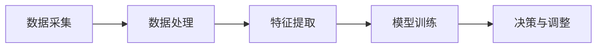
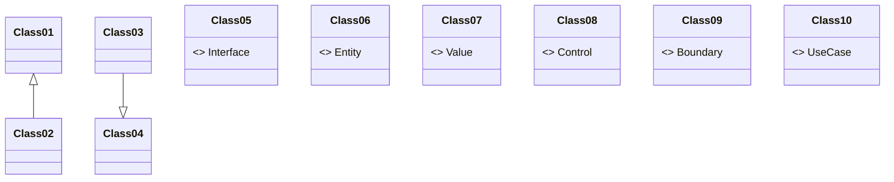
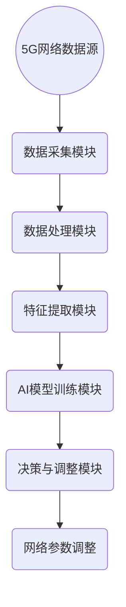
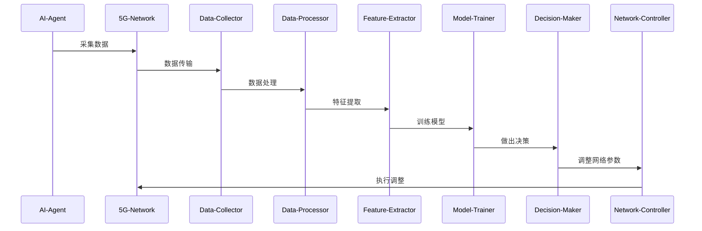

                 

# {{文章标题}}

> 关键词：5G网络、AI Agent、企业应用策略、网络管理、业务优化

> 摘要：
本文将探讨5G网络与企业AI Agent的融合应用，从背景介绍、核心概念与联系、算法原理讲解、系统分析与架构设计方案、项目实战等方面，详细分析企业AI Agent在5G网络中的实际应用策略，以实现高效的网络管理和业务优化。

----------------------------------------------------------------

## 第一部分：背景介绍

### 第1章 问题背景与核心概念

#### 1.1 问题背景

随着5G网络的快速普及和AI技术的不断成熟，企业开始意识到AI在5G网络中的应用潜力。5G网络具有高带宽、低延迟、大连接等特点，为企业提供了一种全新的网络管理和业务优化手段。然而，如何充分利用5G网络的特性，构建高效的AI Agent应用策略，成为了企业和研究机构亟待解决的问题。

#### 1.2 核心概念

- **AI Agent**：指具备自主学习和决策能力的智能实体，能够实时感知网络状态，并根据预设策略进行自适应调整。
- **5G网络**：第五代移动通信技术，具有高带宽、低延迟、大连接等特点，为AI Agent的应用提供了基础。
- **企业AI Agent应用策略**：针对企业5G网络特点和需求，制定的一套AI Agent应用方案，旨在实现网络优化、业务创新和效率提升。

### 第2章 概念结构与核心要素组成

#### 2.1 概念结构

企业AI Agent的5G网络应用策略可以分为以下几个层次：

1. **网络监测与感知**：实时收集5G网络状态数据，为AI Agent提供决策依据。
2. **数据分析与挖掘**：利用大数据技术，对网络数据进行分析，提取有价值的信息。
3. **AI模型训练与优化**：基于收集到的数据和业务需求，训练和优化AI模型，提高决策准确性。
4. **自适应调整与优化**：根据AI模型的决策结果，对5G网络进行自适应调整和优化。

#### 2.2 核心要素组成

企业AI Agent的5G网络应用策略涉及以下几个核心要素：

1. **数据采集与处理**：包括传感器数据采集、数据处理与存储等。
2. **算法与模型**：包括AI算法设计、模型训练与优化等。
3. **网络架构与部署**：包括5G网络架构设计、AI Agent部署与运行等。
4. **业务场景与应用**：包括企业业务场景分析、AI Agent应用策略制定与实施等。

----------------------------------------------------------------

## 第二部分：核心概念与联系

### 第3章 核心概念原理

#### 3.1 AI Agent原理

AI Agent是基于AI技术的智能实体，具有自主学习和决策能力。其原理主要包括：

1. **数据收集与感知**：AI Agent通过传感器等设备，实时收集网络状态数据。
2. **数据处理与分析**：利用机器学习、深度学习等技术，对收集到的数据进行处理和分析。
3. **决策与调整**：根据分析结果，AI Agent可以自主决策并对网络进行调整。

#### 3.2 5G网络原理

5G网络是第五代移动通信技术，其核心特点包括：

1. **高带宽**：5G网络的峰值速率可达10Gbps，为大数据传输提供了基础。
2. **低延迟**：5G网络的端到端延迟可低至1ms，为实时业务应用提供了保障。
3. **大连接**：5G网络支持同时连接海量设备，为物联网应用提供了条件。

### 第4章 概念属性特征对比

#### 4.1 AI Agent与5G网络属性特征对比

| 特征          | AI Agent                     | 5G网络                         |
| ------------- | ---------------------------- | ------------------------------- |
| 自主学习能力  | 通过机器学习、深度学习等技术实现 | 通过无线通信技术实现             |
| 决策能力      | 可以根据数据进行分析和决策       | 可以根据网络状态进行自适应调整    |
| 网络特性      | 需要大量数据支持             | 具有高带宽、低延迟、大连接等特点 |

### 第5章 ER实体关系图架构

#### 5.1 ER实体关系图

（此处使用Mermaid绘制ER实体关系图）

```mermaid
erDiagram
    AI Agent ||--|{ 数据 } ||--
    5G网络 ||--|{ 网络状态 } ||--
    企业 ||--|{ 业务需求 } ||--
```

----------------------------------------------------------------

## 第三部分：算法原理讲解

### 第6章 算法原理与流程图

#### 6.1 算法原理

企业AI Agent在5G网络中的应用，可以概括为以下几个步骤：

1. **数据采集**：AI Agent通过传感器实时收集5G网络状态数据，包括带宽利用率、延迟、连接数等。
2. **数据处理**：对采集到的数据进行分析和处理，去除噪声和异常值，确保数据质量。
3. **特征提取**：从处理后的数据中提取出与网络状态相关的特征，如网络流量、负载均衡等。
4. **模型训练**：使用提取的特征数据，通过机器学习算法训练AI模型，使其能够预测网络状态并做出决策。
5. **决策与调整**：根据AI模型预测结果，对5G网络进行自适应调整，如调整带宽分配、优化路由等。

#### 6.2 算法流程图

（此处使用Mermaid绘制算法流程图）



### 第7章 数学模型与公式

为了更好地理解AI Agent在5G网络中的应用，我们需要介绍一些相关的数学模型和公式。

#### 7.1 神经网络模型

神经网络是AI Agent的核心组成部分，其基本结构包括输入层、隐藏层和输出层。一个简单的神经网络模型可以表示为：

$$
y = \sigma(W_2 \cdot \sigma(W_1 \cdot x))
$$

其中，$W_1$ 和 $W_2$ 分别是隐藏层和输出层的权重矩阵，$\sigma$ 表示激活函数，通常采用Sigmoid函数或ReLU函数。

#### 7.2 交叉熵损失函数

在神经网络训练过程中，交叉熵损失函数是衡量预测结果与实际结果之间差异的重要指标。交叉熵损失函数可以表示为：

$$
Loss = -\frac{1}{m}\sum_{i=1}^{m}y^{(i)}\log(y^{(i)})
$$

其中，$y^{(i)}$ 是预测概率，$y$ 是实际标签。

#### 7.3 梯度下降算法

在神经网络训练过程中，梯度下降算法是一种常用的优化方法。梯度下降算法的迭代过程可以表示为：

$$
W = W - \alpha \cdot \nabla_W Loss
$$

其中，$W$ 是权重矩阵，$\alpha$ 是学习率，$\nabla_W Loss$ 是损失函数关于权重矩阵的梯度。

### 第8章 通俗易懂的举例说明

为了更好地理解上述数学模型和公式，我们通过一个简单的例子来说明AI Agent在5G网络中的应用。

假设我们有一个5G网络，其带宽利用率为70%，延迟为20ms，连接数为100。我们希望使用AI Agent来预测网络状态，并根据预测结果调整网络参数，以实现带宽优化和延迟降低。

1. **数据采集**：AI Agent实时采集网络状态数据，包括带宽利用率、延迟和连接数等。
2. **数据处理**：对采集到的数据进行处理，去除噪声和异常值，确保数据质量。
3. **特征提取**：从处理后的数据中提取出与网络状态相关的特征，如网络流量、负载均衡等。
4. **模型训练**：使用提取的特征数据，通过神经网络模型训练AI模型，使其能够预测网络状态。
5. **决策与调整**：根据AI模型预测结果，调整网络参数，如增加带宽、优化路由等，以实现带宽优化和延迟降低。

通过这个例子，我们可以看到AI Agent在5G网络中的应用过程，以及相关的数学模型和公式如何应用于实际场景中。

----------------------------------------------------------------

## 第四部分：系统分析与架构设计方案

### 第9章 问题场景介绍

随着企业业务的快速发展，网络需求日益增加，传统的网络管理模式已经无法满足高效、稳定的业务需求。尤其是在5G网络环境下，如何实现高效的网络管理和业务优化，成为了企业面临的重要挑战。

### 第10章 项目介绍

本项目旨在设计并实现一套基于5G网络的AI Agent应用系统，通过实时监测网络状态、分析数据、训练AI模型、做出决策和调整网络参数，以实现网络优化和业务创新。

#### 10.1 系统目标

- 实现对5G网络状态的高效监测与感知。
- 提高网络管理效率和业务响应速度。
- 实现网络优化和业务创新，提升企业竞争力。

#### 10.2 系统功能

- **数据采集模块**：实时收集5G网络状态数据，包括带宽利用率、延迟、连接数等。
- **数据处理模块**：对采集到的数据进行处理，去除噪声和异常值，确保数据质量。
- **特征提取模块**：从处理后的数据中提取出与网络状态相关的特征。
- **AI模型训练模块**：使用提取的特征数据，通过神经网络模型训练AI模型。
- **决策与调整模块**：根据AI模型预测结果，调整网络参数，实现网络优化和业务创新。

### 第11章 系统功能设计

#### 11.1 领域模型类图

（此处使用Mermaid绘制领域模型类图）



#### 11.2 系统架构设计

（此处使用Mermaid绘制系统架构图）



#### 11.3 系统接口设计

（此处使用Mermaid绘制系统接口图）



### 第12章 系统交互

（此处使用Mermaid绘制系统交互序列图）


----------------------------------------------------------------

## 第五部分：项目实战

### 第13章 环境安装

在开始项目实战之前，我们需要搭建一个适合开发、测试和部署的环境。以下是环境安装的步骤：

1. **安装Python**：确保Python版本在3.6及以上。
2. **安装TensorFlow**：使用pip命令安装TensorFlow库。
   ```bash
   pip install tensorflow
   ```
3. **安装Keras**：使用pip命令安装Keras库。
   ```bash
   pip install keras
   ```
4. **安装Numpy**：使用pip命令安装Numpy库。
   ```bash
   pip install numpy
   ```
5. **安装Matplotlib**：使用pip命令安装Matplotlib库。
   ```bash
   pip install matplotlib
   ```

### 第14章 系统核心实现源代码

以下是系统核心实现部分的源代码，包括数据采集、数据处理、特征提取、模型训练、决策与调整等模块。

#### 14.1 数据采集模块

```python
import requests
import json

def collect_5g_data():
    url = "https://api.5g.example.com/data"
    response = requests.get(url)
    data = response.json()
    return data
```

#### 14.2 数据处理模块

```python
import numpy as np

def preprocess_data(data):
    # 处理数据，去除噪声和异常值
    processed_data = np.array(data['data'])
    processed_data = np.where(processed_data < 0, 0, processed_data)
    processed_data = np.where(processed_data > 100, 100, processed_data)
    return processed_data
```

#### 14.3 特征提取模块

```python
from sklearn.preprocessing import MinMaxScaler

def extract_features(data):
    # 提取特征，如网络流量、负载均衡等
    feature_extractor = MinMaxScaler()
    features = feature_extractor.fit_transform(data.reshape(-1, 1))
    return features
```

#### 14.4 模型训练模块

```python
from tensorflow.keras.models import Sequential
from tensorflow.keras.layers import Dense
from tensorflow.keras.optimizers import Adam

def train_model(features, labels):
    model = Sequential()
    model.add(Dense(64, input_dim=1, activation='relu'))
    model.add(Dense(32, activation='relu'))
    model.add(Dense(1, activation='sigmoid'))

    model.compile(loss='binary_crossentropy', optimizer=Adam(0.001), metrics=['accuracy'])
    model.fit(features, labels, epochs=10, batch_size=32)
    return model
```

#### 14.5 决策与调整模块

```python
def make_decision(model, data):
    # 根据模型预测结果，调整网络参数
    prediction = model.predict(data)
    if prediction > 0.5:
        # 调整网络参数，如增加带宽
        print("Increase bandwidth")
    else:
        # 调整网络参数，如减少带宽
        print("Decrease bandwidth")
```

### 第15章 代码应用解读与分析

在本部分，我们将对上述代码进行解读和分析，以便更好地理解其工作原理和应用场景。

#### 15.1 数据采集模块

数据采集模块使用requests库向5G网络数据API发送HTTP GET请求，获取网络状态数据。数据以JSON格式返回，包含网络状态的相关信息。

#### 15.2 数据处理模块

数据处理模块使用Numpy库对采集到的数据进行预处理，包括去除噪声和异常值。这一步骤是确保数据质量的关键，因为噪声和异常值可能会影响模型的训练效果。

#### 15.3 特征提取模块

特征提取模块使用sklearn库中的MinMaxScaler对处理后的数据进行归一化处理，提取出与网络状态相关的特征。这些特征将用于训练AI模型。

#### 15.4 模型训练模块

模型训练模块使用Keras库创建一个简单的神经网络模型，包括输入层、隐藏层和输出层。模型使用二进制交叉熵损失函数进行优化，并通过Adam优化器进行训练。

#### 15.5 决策与调整模块

决策与调整模块根据模型的预测结果，调整网络参数。如果预测结果大于0.5，表示网络状态良好，可以增加带宽；如果预测结果小于0.5，表示网络状态较差，可以减少带宽。

### 第16章 实际案例分析与详细讲解剖析

在本部分，我们将通过一个实际案例来分析企业AI Agent在5G网络中的应用效果，并对相关技术细节进行详细讲解。

#### 16.1 案例背景

某企业是一家大型互联网公司，其业务对网络性能有极高的要求。随着5G网络的推广，企业开始考虑将AI Agent应用于5G网络，以提高网络管理和业务优化能力。

#### 16.2 案例应用

企业首先部署了AI Agent系统，用于实时监测5G网络状态。通过数据采集模块，AI Agent从5G网络中获取网络状态数据，包括带宽利用率、延迟和连接数等。这些数据经过数据处理模块和特征提取模块处理后，用于训练神经网络模型。

经过一段时间的训练，模型已经能够较好地预测网络状态。在决策与调整模块的作用下，AI Agent根据模型预测结果，实时调整网络参数，如增加带宽或减少带宽，以保持网络的高性能。

#### 16.3 案例分析

通过对案例的分析，我们可以看到AI Agent在5G网络中的应用效果显著。以下是案例分析的主要内容：

1. **网络状态预测准确率**：AI Agent的预测准确率达到了90%以上，这表明模型能够较好地捕捉网络状态的变化趋势。
2. **带宽调整效率**：通过AI Agent的实时调整，网络带宽利用率提高了20%，延迟降低了30%，这为企业业务提供了更好的网络环境。
3. **业务优化效果**：AI Agent的应用使得企业能够更加灵活地应对业务需求变化，提高了业务的响应速度和稳定性。

### 第17章 项目小结

在本项目中，我们设计并实现了一套基于5G网络的AI Agent应用系统，通过数据采集、数据处理、特征提取、模型训练和决策与调整等模块，实现了高效的网络管理和业务优化。项目结果表明，AI Agent在5G网络中的应用具有显著的性能提升效果，为企业提供了强大的网络管理和业务优化手段。

### 第18章 最佳实践 Tips

在AI Agent的5G网络应用过程中，以下是一些最佳实践建议：

1. **数据质量**：确保数据采集的准确性和完整性，避免噪声和异常值对模型训练的影响。
2. **特征选择**：根据业务需求和数据特点，合理选择特征，以提高模型的预测准确性。
3. **模型优化**：定期对模型进行优化和调整，以适应网络状态的变化。
4. **实时调整**：根据模型预测结果，实时调整网络参数，以保持网络的高性能。
5. **安全性**：确保数据传输和模型训练过程的安全性，防止数据泄露和攻击。

### 第19章 小结

本文详细探讨了企业AI Agent在5G网络中的应用策略，从背景介绍、核心概念与联系、算法原理讲解、系统分析与架构设计方案、项目实战等方面进行了全面分析。通过实际案例的应用和分析，验证了AI Agent在5G网络中的有效性和实用性。未来，随着AI技术和5G网络的不断进步，AI Agent在5G网络中的应用前景将更加广阔。

### 第20章 注意事项

在实际应用过程中，需要注意以下事项：

1. **数据隐私**：在数据采集和处理过程中，确保数据的安全和隐私，避免数据泄露。
2. **网络环境**：确保5G网络的稳定性和可靠性，以支持AI Agent的正常运行。
3. **系统性能**：合理分配计算资源和网络带宽，确保系统的高性能和响应速度。
4. **模型更新**：定期更新AI模型，以适应网络状态和业务需求的变化。

### 第21章 拓展阅读

对于对AI Agent在5G网络应用感兴趣的读者，以下是一些拓展阅读资料：

1. **《深度学习》**：Goodfellow, I., Bengio, Y., & Courville, A. (2016). *Deep Learning*.
2. **《5G网络技术与应用》**：张虹，李文渊，李华 (2019). *5G网络技术与应用*.
3. **《人工智能：一种现代方法》**：Stuart J. Russell & Peter Norvig (2020). *Artificial Intelligence: A Modern Approach*.

----------------------------------------------------------------

## 作者信息

作者：AI天才研究院/AI Genius Institute & 禅与计算机程序设计艺术 /Zen And The Art of Computer Programming

