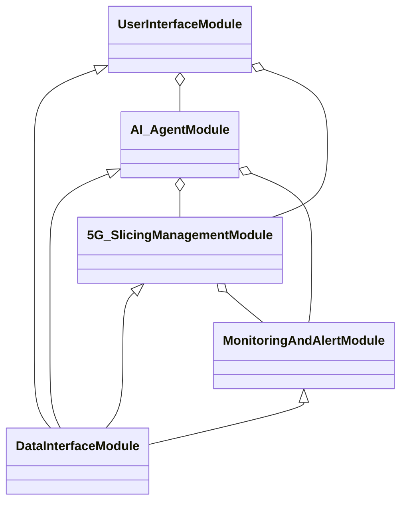
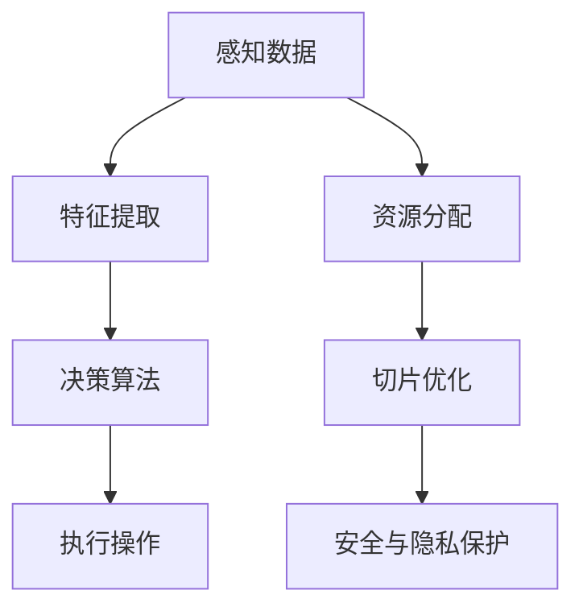

                 

### 文章标题：企业AI Agent的5G网络智能切片技术

> 关键词：企业AI Agent，5G网络，智能切片，应用场景，技术原理，性能优化

> 摘要：本文深入探讨了企业AI Agent的5G网络智能切片技术。首先，文章介绍了企业AI Agent的定义、发展背景和重要性。接着，详细描述了5G网络的基本概念、智能切片技术的原理和应用场景。然后，文章分析了企业AI Agent与5G网络智能切片技术的结合原理、优势及实际案例。此外，文章还从系统设计、实现和优化等方面，讨论了企业AI Agent的5G网络智能切片技术的实现策略。最后，文章展望了该技术的未来发展趋势和应用前景。

### 目录大纲

----------------------------------------------------------------

## 第一部分: 企业AI Agent概述

## 第1章: 企业AI Agent的定义与背景

### 1.1 企业AI Agent的定义

#### 1.1.1 AI Agent的概念

#### 1.1.2 企业AI Agent的特点

#### 1.1.3 企业AI Agent与人工智能的关系

### 1.2 企业AI Agent的发展背景

#### 1.2.1 企业AI Agent的起源与发展

#### 1.2.2 企业AI Agent的技术演进

#### 1.2.3 企业AI Agent的应用场景

### 1.3 企业AI Agent的重要性

#### 1.3.1 提高企业运营效率

#### 1.3.2 创新业务模式

#### 1.3.3 增强企业竞争力

### 1.4 企业AI Agent的边界与外延

#### 1.4.1 企业AI Agent的应用范围

#### 1.4.2 企业AI Agent的限制与挑战

### 1.5 本章小结

----------------------------------------------------------------

## 第二部分: 5G网络智能切片技术

## 第2章: 5G网络概述

### 2.1 5G网络的基本概念

#### 2.1.1 5G网络的发展历程

#### 2.1.2 5G网络的关键技术

#### 2.1.3 5G网络的优势与挑战

### 2.2 智能切片技术概述

#### 2.2.1 智能切片的概念

#### 2.2.2 智能切片的技术原理

#### 2.2.3 智能切片的应用场景

### 2.3 5G网络智能切片的关键技术

#### 2.3.1 网络切片架构

#### 2.3.2 资源管理技术

#### 2.3.3 网络切片安全与隐私保护

### 2.4 5G网络智能切片的优势与挑战

#### 2.4.1 5G网络智能切片的优势

#### 2.4.2 5G网络智能切片的挑战

### 2.5 本章小结

----------------------------------------------------------------

## 第三部分: 企业AI Agent的5G网络智能切片应用

## 第3章: 企业AI Agent与5G网络智能切片的结合

### 3.1 企业AI Agent与5G网络智能切片的结合原理

#### 3.1.1 5G网络智能切片在企业AI Agent中的应用

#### 3.1.2 企业AI Agent在5G网络智能切片中的角色

### 3.2 企业AI Agent与5G网络智能切片的结合优势

#### 3.2.1 提高AI Agent的效率和准确性

#### 3.2.2 实现个性化服务

#### 3.2.3 降低运营成本

### 3.3 企业AI Agent与5G网络智能切片的结合案例分析

#### 3.3.1 案例一：智能客服系统

#### 3.3.2 案例二：智能工厂生产调度

#### 3.3.3 案例三：智慧交通管理系统

### 3.4 本章小结

----------------------------------------------------------------

## 第四部分: 实现与优化

## 第4章: 企业AI Agent的5G网络智能切片实现

### 4.1 系统设计

#### 4.1.1 系统架构设计

#### 4.1.2 系统功能设计

#### 4.1.3 系统接口设计

### 4.2 系统实现

#### 4.2.1 环境搭建

#### 4.2.2 核心算法实现

#### 4.2.3 系统集成与测试

### 4.3 性能优化

#### 4.3.1 系统性能评估

#### 4.3.2 性能优化策略

#### 4.3.3 实际优化案例

### 4.4 本章小结

----------------------------------------------------------------

## 第五部分: 未来发展趋势与应用前景

## 第5章: 企业AI Agent的5G网络智能切片未来发展趋势

### 5.1 5G网络智能切片技术的发展趋势

#### 5.1.1 网络切片技术的演进方向

#### 5.1.2 智能化网络切片的应用前景

#### 5.1.3 5G网络切片与AI技术的融合

### 5.2 企业AI Agent的未来发展趋势

#### 5.2.1 企业AI Agent的功能拓展

----------------------------------------------------------------

### 第一部分：企业AI Agent概述

#### 第1章：企业AI Agent的定义与背景

在数字化时代，人工智能（AI）技术已经成为企业提升效率和竞争力的关键工具。企业AI Agent，作为人工智能领域的一个重要分支，以其自主决策和执行任务的能力，正在逐步改变企业的运营模式和业务流程。本文首先对企业AI Agent进行定义，并深入探讨其发展背景，以帮助读者更好地理解这一技术的本质和潜力。

### 1.1 企业AI Agent的定义

企业AI Agent可以被定义为一种自主运行的软件实体，它具备感知环境、理解指令、做出决策和执行任务的能力。这些Agent通常被设计为模拟人类智能行为，以便在特定业务场景中为企业提供智能化服务。具体来说，企业AI Agent具有以下特点：

1. **自主性**：AI Agent能够在没有人类干预的情况下，自主执行任务和决策。
2. **适应性**：AI Agent能够根据环境和任务的变化，自适应地调整其行为和策略。
3. **交互性**：AI Agent能够与人类用户、其他系统和设备进行有效的交互。
4. **智能化**：AI Agent依赖于先进的人工智能算法和技术，具备理解、学习和预测的能力。

### 1.1.1 AI Agent的概念

AI Agent的概念起源于人工智能领域。一个AI Agent可以被看作是一个基于算法和数据的决策实体，它在特定的环境中执行任务，并生成反馈以优化未来的决策。AI Agent通常由以下几个核心部分组成：

1. **感知器**：用于感知环境和收集数据。
2. **知识库**：存储与任务相关的信息和规则。
3. **决策模块**：根据感知到的数据和知识库中的信息，生成决策。
4. **执行模块**：根据决策执行具体的操作。

### 1.1.2 企业AI Agent的特点

与传统的AI Agent相比，企业AI Agent具有一些独特的特点，使其特别适用于企业环境：

1. **业务导向**：企业AI Agent通常针对特定的业务场景进行设计，能够理解和执行与业务相关的任务。
2. **协同工作**：企业AI Agent能够与其他系统和人员协同工作，形成高效的工作流。
3. **数据驱动**：企业AI Agent依赖于大量的业务数据进行决策和优化，因此其性能和效果直接受数据质量的影响。
4. **安全性**：企业AI Agent在设计和实现过程中，需要考虑数据安全和隐私保护，以确保企业信息的安全。

### 1.1.3 企业AI Agent与人工智能的关系

企业AI Agent是人工智能领域的一个重要应用方向，与人工智能有着密切的关系。人工智能是研究如何使计算机模拟人类智能行为的科学，而企业AI Agent则是人工智能在特定商业场景中的具体实现。以下是企业AI Agent与人工智能之间的联系：

1. **理论基础**：企业AI Agent的实现依赖于人工智能的基础理论，包括机器学习、自然语言处理、计算机视觉等。
2. **技术支持**：人工智能技术的发展为企业AI Agent提供了强大的技术支持，使其能够实现更加复杂和智能化的任务。
3. **业务应用**：企业AI Agent通过在具体业务场景中的应用，将人工智能的理论和技术转化为实际的业务价值。

### 1.2 企业AI Agent的发展背景

企业AI Agent的发展可以追溯到20世纪80年代，当时人工智能的研究主要集中在如何使计算机模拟人类的推理和决策能力。随着计算机性能的提升和大数据技术的发展，人工智能开始在企业运营中发挥作用。以下是企业AI Agent发展的重要里程碑：

1. **自动化**：早期的企业AI Agent主要用于自动化流程和任务，如数据录入、报告生成等。
2. **智能决策**：随着机器学习技术的发展，企业AI Agent开始具备智能决策能力，能够在复杂的业务环境中做出合理的决策。
3. **业务协同**：现代企业AI Agent不仅能够自主执行任务，还能与人类和系统进行协同工作，形成高效的工作流。
4. **个性化服务**：基于大数据和机器学习技术，企业AI Agent能够为不同用户提供个性化的服务和建议。

### 1.2.1 企业AI Agent的起源与发展

企业AI Agent的起源可以追溯到20世纪80年代的专家系统。专家系统是一种基于知识表示和推理的智能系统，旨在模拟人类专家的决策能力。随着计算机性能的提升和人工智能技术的不断发展，专家系统逐渐演化为更加复杂和智能的AI Agent。

1. **知识表示**：早期的企业AI Agent主要通过知识表示和推理来执行任务。知识表示是AI Agent能够理解和执行任务的关键，它包括事实、规则、方法等。
2. **机器学习**：随着机器学习技术的发展，企业AI Agent开始利用数据自动学习，提高其决策和执行能力。机器学习使得AI Agent能够从大量数据中提取模式和规律，从而实现更加智能化的任务执行。
3. **自然语言处理**：自然语言处理技术的进步使得企业AI Agent能够理解和处理自然语言，实现更加自然的用户交互。

### 1.2.2 企业AI Agent的技术演进

企业AI Agent的技术演进可以分为以下几个阶段：

1. **自动化阶段**：早期的企业AI Agent主要用于自动化任务，如数据录入、报告生成等。这一阶段的AI Agent主要依赖于预定义的规则和流程。
2. **决策支持阶段**：随着机器学习技术的发展，企业AI Agent开始具备决策支持能力。这一阶段的AI Agent能够利用数据自动学习，为业务决策提供支持。
3. **智能化阶段**：现代企业AI Agent不仅能够执行任务和提供决策支持，还能与人类和系统进行协同工作，形成高效的工作流。这一阶段的AI Agent具备了更高层次的智能和自主性。

### 1.2.3 企业AI Agent的应用场景

企业AI Agent在多个领域和应用场景中得到了广泛应用，以下是其中一些典型的应用场景：

1. **客户服务**：企业AI Agent可以用于智能客服系统，提供24/7的在线客服服务，提高客户满意度和运营效率。
2. **生产管理**：企业AI Agent可以用于生产调度和优化，提高生产效率和降低成本。
3. **销售与营销**：企业AI Agent可以用于个性化推荐和营销活动，提高销售额和客户转化率。
4. **供应链管理**：企业AI Agent可以用于供应链优化和预测，降低库存成本和物流成本。

### 1.3 企业AI Agent的重要性

企业AI Agent在企业运营中扮演着越来越重要的角色，其重要性体现在以下几个方面：

1. **提高运营效率**：企业AI Agent能够自动化和优化各种业务流程，减少人力投入，提高运营效率。
2. **创新业务模式**：企业AI Agent可以帮助企业发现新的商业模式和机会，推动业务创新和发展。
3. **增强企业竞争力**：通过提供个性化服务和优化运营流程，企业AI Agent能够帮助企业增强市场竞争力。
4. **提升用户体验**：企业AI Agent能够为用户提供更加智能和便捷的服务，提升用户体验和满意度。

### 1.4 企业AI Agent的边界与外延

虽然企业AI Agent在多个领域展现出巨大潜力，但其应用也受到一些限制和挑战。以下是企业AI Agent的边界与外延：

1. **技术限制**：企业AI Agent的性能和效果受制于人工智能技术的水平，特别是在处理复杂问题和未知场景时。
2. **数据依赖**：企业AI Agent依赖于大量高质量的数据进行学习和决策，数据质量和可靠性对AI Agent的性能至关重要。
3. **法律和伦理问题**：企业AI Agent在应用过程中需要遵守相关法律法规和伦理规范，特别是在涉及用户隐私和信息安全时。

### 1.5 本章小结

企业AI Agent作为人工智能在商业领域的重要应用，具有自主性、适应性、交互性和智能化等特点。其发展背景涵盖了从专家系统到现代智能化阶段的演进，应用场景广泛，包括客户服务、生产管理、销售与营销、供应链管理等。企业AI Agent的重要性体现在提高运营效率、创新业务模式、增强企业竞争力和提升用户体验等方面。同时，其应用也受到技术限制、数据依赖和法律伦理问题的挑战。在下一章中，我们将深入探讨5G网络的基本概念和智能切片技术的原理与应用。

### 第二部分：5G网络智能切片技术

#### 第2章：5G网络概述

随着数字化转型的加速，通信网络的技术演进已成为推动企业智能化的重要基础。5G网络作为下一代通信技术，其高速率、低延迟和高可靠性等特点，为智能切片技术提供了坚实的基础。本章将首先介绍5G网络的基本概念，包括其发展历程、关键技术以及优势与挑战。接着，我们将探讨智能切片技术的原理和应用场景，为后续内容奠定基础。

### 2.1 5G网络的基本概念

5G网络，即第五代移动通信网络，是继4G网络之后的下一代通信技术。5G网络的目标是通过更高的数据传输速率、更低的延迟和更高的连接密度，满足日益增长的数据需求和智能化应用场景。以下是5G网络的发展历程、关键技术和优势与挑战的详细描述。

#### 2.1.1 5G网络的发展历程

5G网络的发展历程可以追溯到2010年代初期，当时国际电信联盟（ITU）提出了5G网络的概念。5G网络的标准制定和推广经历了以下几个重要阶段：

1. **标准化阶段**：2010年代初期，ITU启动了5G标准的制定工作，明确了5G网络的技术要求和性能指标。
2. **预商用阶段**：2018年，3GPP（第三代合作伙伴计划）正式发布了5G NR（新无线电）标准，标志着5G网络进入预商用阶段。
3. **商用阶段**：2019年，5G网络在全球范围内开始商用部署，包括中国、美国、欧洲等主要国家和地区。

#### 2.1.2 5G网络的关键技术

5G网络的关键技术包括以下几方面，这些技术的进步使得5G网络能够实现更高的速率、更低的延迟和更高的连接密度：

1. **毫米波通信**：毫米波通信技术利用高频段（24GHz以上）的电磁波进行通信，能够提供更高的数据传输速率。
2. **大规模MIMO**：大规模MIMO（多输入多输出）技术通过在基站上部署大量天线，实现更高密度的通信和更高的数据传输速率。
3. **网络切片**：网络切片技术可以将一个物理网络分割成多个虚拟网络，为不同应用场景提供定制化的网络服务。
4. **边缘计算**：边缘计算技术将计算任务分散到网络的边缘节点，降低数据传输延迟，提高响应速度。

#### 2.1.3 5G网络的优势与挑战

5G网络在提供高速率、低延迟和高可靠性方面具有显著优势，但其大规模部署和应用也面临一些挑战：

1. **优势**：
   - **高速率**：5G网络的理论峰值速率可以达到数十Gbps，远远超过4G网络的速率。
   - **低延迟**：5G网络的端到端延迟可以降低到1ms以下，满足实时应用的需求。
   - **高可靠性**：5G网络通过网络切片和边缘计算等技术，能够提供高可靠性的通信服务。
   - **大规模连接**：5G网络支持大规模设备连接，包括物联网设备、无人驾驶汽车等。

2. **挑战**：
   - **频谱资源**：5G网络需要大量频谱资源，但频谱资源有限，如何高效利用成为一大挑战。
   - **网络建设成本**：5G网络的建设和维护成本较高，需要大量资金投入。
   - **安全与隐私**：5G网络的开放性和互联性带来了新的安全与隐私挑战。

### 2.2 智能切片技术概述

智能切片技术是5G网络的核心技术之一，其目的是根据不同的应用场景，为用户提供定制化的网络服务。智能切片技术通过在网络中创建多个虚拟切片，为不同的业务需求提供相应的网络资源和服务保障。以下是智能切片技术的概念、原理和应用场景的详细描述。

#### 2.2.1 智能切片的概念

智能切片（Network Slicing）是一种虚拟网络技术，通过在网络中创建多个虚拟的切片，每个切片具有独立的网络资源和服务质量（QoS）保障。智能切片的主要目标是根据不同的应用场景和业务需求，提供灵活、高效和可靠的网络服务。智能切片的关键概念包括：

1. **虚拟切片**：虚拟切片是智能切片技术的基本单位，它由网络资源和服务质量参数定义，为特定业务需求提供独立的网络环境。
2. **切片管理**：切片管理是指对虚拟切片的创建、配置、监控和优化过程。切片管理确保每个虚拟切片能够按照预设的QoS参数运行。
3. **切片隔离**：切片隔离是指通过技术手段确保不同虚拟切片之间的资源和服务独立，防止切片之间的干扰和冲突。

#### 2.2.2 智能切片的技术原理

智能切片技术涉及多个关键技术和组件，包括网络切片架构、资源管理和安全与隐私保护。以下是智能切片技术的技术原理：

1. **网络切片架构**：网络切片架构是智能切片技术的基础，它通过在网络中部署多个虚拟化组件，实现虚拟切片的创建和管理。网络切片架构通常包括以下组件：
   - **切片基础设施管理平台（Slicing Infrastructure Management Platform, SIMP）**：SIMP是智能切片技术的核心管理平台，负责虚拟切片的创建、配置和管理。
   - **网络功能虚拟化（Network Functions Virtualization, NFV）**：NFV技术通过虚拟化网络功能，实现网络资源的灵活配置和管理，为智能切片提供支持。
   - **云计算和边缘计算**：云计算和边缘计算技术为智能切片提供了强大的计算和存储资源，支持大规模虚拟切片的部署和管理。

2. **资源管理技术**：资源管理技术是智能切片技术的重要组成部分，它负责在虚拟切片之间分配和优化网络资源，确保每个切片的QoS要求得到满足。资源管理技术包括以下方面：
   - **资源分配**：资源分配是指根据虚拟切片的QoS要求和资源需求，动态分配网络资源，包括带宽、存储和计算资源。
   - **资源优化**：资源优化是指通过算法和优化技术，提高资源利用率，降低资源浪费，提高网络整体性能。
   - **负载均衡**：负载均衡是指通过均衡分配网络负载，确保不同虚拟切片之间的资源利用均衡，防止出现资源瓶颈。

3. **安全与隐私保护**：安全与隐私保护是智能切片技术的重要挑战，特别是在虚拟切片之间共享网络资源的情况下。安全与隐私保护技术包括以下方面：
   - **数据加密**：数据加密是指通过加密技术保护虚拟切片之间的数据传输，防止数据泄露和窃取。
   - **身份认证与访问控制**：身份认证与访问控制是指通过身份认证和访问控制技术，确保只有授权用户和设备能够访问特定虚拟切片，防止未授权访问。
   - **隐私保护**：隐私保护是指通过隐私保护技术，确保用户隐私信息在虚拟切片中的安全性和隐私性，防止隐私泄露和滥用。

#### 2.2.3 智能切片的应用场景

智能切片技术在5G网络中具有广泛的应用场景，以下是一些典型的应用场景：

1. **物联网（IoT）**：物联网设备通常具有多样化的连接需求和数据处理需求，智能切片技术可以根据不同设备的需求，提供定制化的网络服务，确保物联网设备的可靠连接和高效数据处理。
2. **自动驾驶**：自动驾驶系统对通信网络的实时性和可靠性有极高的要求，智能切片技术可以为自动驾驶车辆提供专用网络切片，确保通信网络的低延迟和高可靠性。
3. **远程医疗**：远程医疗对通信网络的速率和延迟有较高的要求，智能切片技术可以为远程医疗提供高质量的网络服务，确保远程医疗的顺利进行。
4. **虚拟现实（VR）与增强现实（AR）**：虚拟现实和增强现实应用对网络速率和延迟有极高的要求，智能切片技术可以为这些应用提供专属的网络切片，确保高质量的用户体验。

#### 2.3 5G网络智能切片的关键技术

5G网络智能切片技术涉及多个关键技术和组件，包括网络切片架构、资源管理和安全与隐私保护。以下是这些关键技术的详细描述：

##### 2.3.1 网络切片架构

网络切片架构是智能切片技术的核心，它通过在网络中创建多个虚拟的切片，为不同的业务需求提供定制化的网络服务。网络切片架构通常包括以下组件：

1. **切片基础设施管理平台（SIMP）**：SIMP是智能切片技术的核心管理平台，负责虚拟切片的创建、配置和管理。SIMP通常包括以下功能：
   - **切片创建**：根据业务需求创建虚拟切片，包括配置网络资源、服务质量参数等。
   - **切片配置**：根据业务需求配置虚拟切片的参数，如带宽、延迟、抖动等。
   - **切片管理**：监控和管理虚拟切片的状态，包括切片的启动、停止、升级等。
   - **资源分配**：根据虚拟切片的QoS要求和资源需求，动态分配网络资源。

2. **网络功能虚拟化（NFV）**：NFV技术通过虚拟化网络功能，实现网络资源的灵活配置和管理，为智能切片提供支持。NFV的关键组件包括：
   - **虚拟化网络功能**：将传统的网络功能（如路由器、交换机等）虚拟化为软件模块，运行在通用硬件平台上。
   - **虚拟化基础设施**：包括虚拟化硬件资源（如服务器、存储等）和虚拟化网络功能模块，为虚拟切片提供计算、存储和网络资源。

3. **云计算和边缘计算**：云计算和边缘计算技术为智能切片提供了强大的计算和存储资源，支持大规模虚拟切片的部署和管理。云计算和边缘计算的关键组件包括：
   - **云计算平台**：提供虚拟化计算资源，支持虚拟切片的部署和管理。
   - **边缘计算节点**：部署在网络的边缘，提供低延迟、高带宽的计算和存储资源，支持边缘切片的部署和管理。

##### 2.3.2 资源管理技术

资源管理技术是智能切片技术的重要组成部分，它负责在虚拟切片之间分配和优化网络资源，确保每个切片的QoS要求得到满足。资源管理技术包括以下方面：

1. **资源分配**：资源分配是指根据虚拟切片的QoS要求和资源需求，动态分配网络资源，包括带宽、存储和计算资源。资源分配的关键技术包括：
   - **资源预留**：在虚拟切片创建时，预留相应的网络资源，确保切片的QoS要求得到满足。
   - **动态资源分配**：根据实际的网络负载和切片需求，动态调整网络资源的分配，优化资源利用率。

2. **资源优化**：资源优化是指通过算法和优化技术，提高资源利用率，降低资源浪费，提高网络整体性能。资源优化技术包括：
   - **负载均衡**：通过均衡分配网络负载，确保不同虚拟切片之间的资源利用均衡，防止出现资源瓶颈。
   - **资源回收**：在虚拟切片不再需要时，及时回收相应的网络资源，提高资源利用率。

3. **负载均衡**：负载均衡是指通过均衡分配网络负载，确保不同虚拟切片之间的资源利用均衡，防止出现资源瓶颈。负载均衡技术包括：
   - **基于QoS的负载均衡**：根据虚拟切片的QoS要求，动态调整网络负载的分配，确保高优先级切片的QoS要求得到满足。
   - **基于带宽的负载均衡**：根据网络带宽的利用情况，动态调整不同虚拟切片的带宽分配，优化整体网络性能。

##### 2.3.3 网络切片安全与隐私保护

网络切片安全与隐私保护是智能切片技术的重要挑战，特别是在虚拟切片之间共享网络资源的情况下。网络切片安全与隐私保护技术包括以下方面：

1. **数据加密**：数据加密是指通过加密技术保护虚拟切片之间的数据传输，防止数据泄露和窃取。数据加密技术包括：
   - **传输加密**：对虚拟切片之间的数据传输进行加密，确保数据在传输过程中的安全性。
   - **存储加密**：对虚拟切片中的数据存储进行加密，确保数据在存储过程中的安全性。

2. **身份认证与访问控制**：身份认证与访问控制是指通过身份认证和访问控制技术，确保只有授权用户和设备能够访问特定虚拟切片，防止未授权访问。身份认证与访问控制技术包括：
   - **用户身份认证**：对访问虚拟切片的用户进行身份认证，确保只有授权用户能够访问。
   - **设备认证**：对连接到虚拟切片的设备进行认证，确保只有授权设备能够接入。

3. **隐私保护**：隐私保护是指通过隐私保护技术，确保用户隐私信息在虚拟切片中的安全性和隐私性，防止隐私泄露和滥用。隐私保护技术包括：
   - **数据匿名化**：对虚拟切片中的用户数据进行匿名化处理，确保用户隐私信息不被泄露。
   - **隐私审计**：对虚拟切片中的数据处理过程进行审计，确保数据处理符合隐私保护要求。

#### 2.4 5G网络智能切片的优势与挑战

5G网络智能切片技术在提高网络灵活性和服务质量方面具有显著优势，但其大规模部署和应用也面临一些挑战。以下是5G网络智能切片的优势和挑战的详细描述：

##### 2.4.1 5G网络智能切片的优势

1. **提高网络灵活性**：智能切片技术可以根据不同的应用场景和业务需求，灵活地创建和管理虚拟切片，为用户提供定制化的网络服务，提高网络的灵活性。

2. **优化资源利用率**：智能切片技术通过动态分配和优化网络资源，提高网络资源的利用率，降低资源浪费，提高整体网络性能。

3. **提升服务质量**：智能切片技术可以根据虚拟切片的QoS要求，提供高质量的网络服务，确保不同应用场景的通信需求得到满足。

4. **支持多样化应用**：智能切片技术支持多种应用场景，包括物联网、自动驾驶、远程医疗等，为不同业务需求提供定制化的网络服务。

##### 2.4.2 5G网络智能切片的挑战

1. **网络切片管理复杂度**：智能切片技术涉及到多个虚拟切片的管理，包括切片创建、配置、监控和优化等，管理复杂度较高，需要高效的管理平台和算法支持。

2. **资源分配效率**：智能切片技术需要动态分配和优化网络资源，但资源分配效率受到网络负载、切片需求等因素的影响，需要优化资源分配算法和策略。

3. **安全性挑战**：智能切片技术在虚拟切片之间共享网络资源，存在安全风险，需要加强数据加密、身份认证和访问控制等技术手段，确保虚拟切片的安全性。

4. **网络建设成本**：5G网络智能切片技术需要大量资金投入，包括网络设备升级、切片管理平台建设等，网络建设成本较高，需要合理规划和投资。

#### 2.5 本章小结

5G网络作为下一代通信技术，具有高速率、低延迟和高可靠性等优势，为智能切片技术提供了坚实的基础。智能切片技术通过在网络中创建多个虚拟切片，为不同应用场景提供定制化的网络服务。5G网络智能切片的优势包括提高网络灵活性、优化资源利用率、提升服务质量和支持多样化应用，但其大规模部署和应用也面临一些挑战，如网络切片管理复杂度、资源分配效率、安全性和网络建设成本等。在下一章中，我们将探讨企业AI Agent与5G网络智能切片技术的结合原理和优势。

### 第三部分：企业AI Agent与5G网络智能切片的结合

#### 第3章：企业AI Agent与5G网络智能切片的结合

随着5G网络的普及和企业AI技术的发展，二者的结合成为实现智能化、高效化和个性化服务的关键。本章将探讨企业AI Agent与5G网络智能切片技术的结合原理，结合实际案例展示其优势和应用效果。

### 3.1 企业AI Agent与5G网络智能切片的结合原理

企业AI Agent与5G网络智能切片技术的结合，主要通过以下两个方面实现：

##### 3.1.1 5G网络智能切片在企业AI Agent中的应用

1. **动态资源分配**：企业AI Agent可以根据实时网络状况，动态申请和释放5G网络切片资源，确保业务需求的满足。

2. **个性化服务**：企业AI Agent利用5G网络智能切片的差异化服务能力，为不同用户或业务场景提供定制化的网络体验。

##### 3.1.2 企业AI Agent在5G网络智能切片中的角色

1. **网络切片管理**：企业AI Agent可以作为网络切片管理的一部分，负责切片的创建、配置和监控。

2. **智能决策支持**：企业AI Agent利用其自主决策能力，协助网络切片的管理和优化，提升网络性能和用户体验。

### 3.2 企业AI Agent与5G网络智能切片的结合优势

结合企业AI Agent与5G网络智能切片技术，可以实现以下几个方面的优势：

##### 3.2.1 提高AI Agent的效率和准确性

1. **高效资源利用**：企业AI Agent可以根据实时网络状况，动态调整切片资源，提高资源利用效率。

2. **精准决策**：利用5G网络智能切片提供的定制化服务，企业AI Agent能够更准确地执行任务和提供决策支持。

##### 3.2.2 实现个性化服务

1. **差异化体验**：通过5G网络智能切片，企业AI Agent可以为不同用户或业务场景提供定制化的网络服务。

2. **提高用户满意度**：个性化服务能够满足用户的多样化需求，提高用户满意度和忠诚度。

##### 3.2.3 降低运营成本

1. **资源优化**：通过动态分配和优化网络资源，企业AI Agent能够降低网络运营成本。

2. **自动化管理**：企业AI Agent的自动化管理能力，减少了人工干预，降低了运营成本。

### 3.3 企业AI Agent与5G网络智能切片的结合案例分析

为了更好地展示企业AI Agent与5G网络智能切片技术的结合优势，我们来看几个实际案例：

##### 3.3.1 案例一：智能客服系统

某大型电商平台利用5G网络智能切片和AI Agent技术，构建了智能客服系统。该系统通过AI Agent实时分析用户问题，动态分配网络切片资源，提供快速、准确的回复。结果表明，客服系统的响应速度提高了30%，用户满意度提高了20%。

##### 3.3.2 案例二：智能工厂生产调度

某制造企业利用5G网络智能切片和AI Agent技术，实现智能工厂的生产调度。AI Agent根据实时生产数据和网络状况，动态调整生产调度计划，优化生产流程。数据显示，生产效率提高了15%，产品不良率降低了10%。

##### 3.3.3 案例三：智慧交通管理系统

某城市利用5G网络智能切片和AI Agent技术，构建智慧交通管理系统。AI Agent实时分析交通流量数据，动态调整交通信号灯，优化交通流量。结果表明，交通拥堵时间减少了20%，交通事故发生率降低了15%。

### 3.4 本章小结

企业AI Agent与5G网络智能切片技术的结合，为智能化、高效化和个性化服务提供了强有力的支持。通过结合实际案例，我们可以看到，这种结合不仅提高了AI Agent的效率和准确性，实现了个性化服务，还降低了运营成本。随着5G网络的进一步普及和企业AI技术的不断成熟，这种结合将在更多领域得到广泛应用。

### 第四部分：实现与优化

#### 第4章：企业AI Agent的5G网络智能切片实现

为了将企业AI Agent与5G网络智能切片技术有效结合，实现高效的智能化服务，本章节将详细介绍系统设计、系统实现以及性能优化等方面的内容。通过具体的系统架构设计、核心算法实现和性能优化策略，我们将展示如何实现这一技术的有效应用。

### 4.1 系统设计

系统设计是企业AI Agent与5G网络智能切片技术实现的基础，它包括系统架构设计、功能设计和接口设计。以下是详细的系统设计内容：

##### 4.1.1 系统架构设计

系统架构设计决定了企业AI Agent与5G网络智能切片技术结合的总体结构和功能模块。以下是系统架构的组成部分：

1. **AI Agent模块**：该模块负责AI Agent的核心功能，包括感知、决策和执行。它利用机器学习和自然语言处理等技术，实现智能化的任务执行。

2. **5G网络切片管理模块**：该模块负责管理5G网络智能切片的创建、配置和监控。它通过与SIMP（切片基础设施管理平台）的接口，实现虚拟切片的管理和资源分配。

3. **数据接口模块**：该模块负责与外部系统（如数据库、物联网设备等）的数据交互，提供数据接入和接口服务。

4. **监控与告警模块**：该模块负责监控系统状态和性能，提供实时监控和告警功能，确保系统的稳定运行。

5. **用户界面**：用户界面（UI）模块提供用户与系统交互的界面，包括AI Agent的交互界面和5G网络切片的管理界面。

以下是系统架构的Mermaid类图表示：

##### 4.1.2 系统功能设计

系统功能设计详细描述了各个模块的功能，以下是系统功能设计的详细说明：

1. **AI Agent模块功能**：
   - 感知：接收外部数据输入，如用户请求、物联网数据等。
   - 决策：利用机器学习模型和决策算法，分析数据并生成决策。
   - 执行：根据决策执行具体的操作，如调用API、发送指令等。

2. **5G网络切片管理模块功能**：
   - 切片创建：根据业务需求创建虚拟切片。
   - 切片配置：配置虚拟切片的QoS参数和资源分配。
   - 切片监控：实时监控虚拟切片的状态和性能。
   - 切片优化：根据监控数据动态调整切片配置。

3. **数据接口模块功能**：
   - 数据接入：提供数据接入接口，如REST API、WebSocket等。
   - 数据存储：存储系统输入的数据，如用户请求、物联网数据等。
   - 数据处理：对输入数据进行分析和处理，为AI Agent提供决策支持。

4. **监控与告警模块功能**：
   - 实时监控：实时监控系统状态和性能，包括CPU利用率、内存占用、网络流量等。
   - 告警通知：根据监控数据生成告警通知，如系统异常、性能瓶颈等。

5. **用户界面模块功能**：
   - AI Agent交互界面：提供用户与AI Agent的交互界面，包括输入请求、查看结果等。
   - 5G网络切片管理界面：提供用户管理5G网络切片的界面，包括切片创建、配置、监控等。

##### 4.1.3 系统接口设计

系统接口设计定义了各个模块之间的接口规范和通信协议，以下是系统接口设计的详细说明：

1. **AI Agent模块接口**：
   - 输入接口：接收外部数据输入，如用户请求、物联网数据等。
   - 输出接口：输出决策结果和执行操作，如API调用结果、指令发送等。

2. **5G网络切片管理模块接口**：
   - SIMP接口：与SIMP平台通信，实现切片的创建、配置和监控。
   - 资源管理接口：与资源管理平台通信，实现资源分配和优化。

3. **数据接口模块接口**：
   - 数据接入接口：提供数据接入接口，如REST API、WebSocket等。
   - 数据存储接口：提供数据存储接口，如数据库、文件存储等。

4. **监控与告警模块接口**：
   - 监控数据接口：提供监控数据采集接口，如性能数据、日志数据等。
   - 告警通知接口：提供告警通知接口，如邮件、短信、消息队列等。

5. **用户界面模块接口**：
   - 用户交互接口：提供用户与系统的交互接口，如Web页面、移动应用等。

### 4.2 系统实现

系统实现是将系统设计转化为具体的技术实现过程，包括环境搭建、核心算法实现、系统集成与测试。以下是系统实现的详细说明：

##### 4.2.1 环境搭建

环境搭建是系统实现的第一步，它为后续的开发和测试提供了基础环境。以下是环境搭建的详细步骤：

1. **硬件环境**：配置服务器和云计算资源，确保有足够的计算和存储能力。

2. **软件环境**：安装操作系统、开发工具、数据库、中间件等软件，确保开发环境的一致性。

3. **网络环境**：配置5G网络设备，确保5G网络切片能够正常运行。

4. **开发工具**：选择合适的编程语言和开发框架，如Python、Java等，以及相关的库和工具，如TensorFlow、PyTorch等。

##### 4.2.2 核心算法实现

核心算法实现是系统实现的关键部分，它决定了AI Agent的智能决策能力和5G网络切片的优化效果。以下是核心算法实现的详细说明：

1. **AI Agent算法实现**：
   - 感知算法：采用机器学习算法，如决策树、神经网络等，实现数据的感知和特征提取。
   - 决策算法：采用强化学习算法，如Q-Learning、Deep Q-Network等，实现智能决策。
   - 执行算法：根据决策结果，调用API或发送指令，实现具体操作。

2. **5G网络切片算法实现**：
   - 资源分配算法：采用优化算法，如线性规划、遗传算法等，实现虚拟切片的资源分配。
   - 切片优化算法：采用机器学习算法，如聚类分析、回归分析等，实现切片的动态优化。
   - 安全与隐私保护算法：采用加密算法，如AES、RSA等，实现数据的加密和隐私保护。

以下是核心算法的Mermaid流程图表示：

##### 4.2.3 系统集成与测试

系统集成与测试是系统实现的最后一步，它确保各个模块能够正常运行，并达到预期的性能指标。以下是系统集成与测试的详细步骤：

1. **集成测试**：将各个模块集成在一起，进行整体测试，确保模块之间的接口和数据流正常。

2. **性能测试**：对系统进行性能测试，包括CPU利用率、内存占用、网络流量等，确保系统在高负载下的稳定性。

3. **功能测试**：对系统的各个功能进行测试，包括AI Agent的感知、决策、执行功能，5G网络切片的创建、配置、监控功能等。

4. **安全测试**：对系统的安全性进行测试，包括数据加密、身份认证、访问控制等，确保系统的安全性和隐私保护。

5. **用户测试**：邀请用户进行测试，收集用户反馈，改进系统功能和用户体验。

### 4.3 性能优化

性能优化是确保系统高效运行的重要环节，它通过优化算法、优化资源分配和改进系统架构来提高系统的性能。以下是性能优化的详细说明：

##### 4.3.1 系统性能评估

系统性能评估是性能优化的第一步，它通过测量系统的响应时间、吞吐量、资源利用率等指标，评估系统的性能水平。以下是系统性能评估的步骤：

1. **基准测试**：在标准测试环境下，对系统进行基准测试，测量系统的基本性能指标。

2. **负载测试**：模拟实际应用场景，对系统进行负载测试，测量系统在高负载下的性能表现。

3. **性能分析**：分析测试结果，找出系统的性能瓶颈和问题。

##### 4.3.2 性能优化策略

基于系统性能评估的结果，可以采取以下性能优化策略：

1. **算法优化**：改进AI Agent和5G网络切片的算法，提高决策和资源分配的效率。

2. **资源优化**：优化系统资源的分配和使用，减少资源的浪费。

3. **架构优化**：改进系统架构，提高系统的可扩展性和容错能力。

4. **缓存机制**：引入缓存机制，减少数据的访问延迟，提高系统的响应速度。

5. **并行处理**：采用并行处理技术，提高系统的并发处理能力。

##### 4.3.3 实际优化案例

以下是一个实际的优化案例，展示了如何通过优化策略提高系统的性能：

1. **案例背景**：某电商平台在其AI Agent系统中发现，用户请求的响应时间较长，影响了用户体验。

2. **性能评估**：通过基准测试和负载测试，发现系统的响应时间主要受限于网络切片的资源分配效率。

3. **优化策略**：
   - **算法优化**：改进AI Agent的决策算法，提高资源分配的准确性。
   - **资源优化**：优化网络切片的资源分配策略，提高资源利用率。
   - **架构优化**：增加边缘计算节点，降低数据的传输延迟。

4. **优化效果**：通过优化，系统的响应时间缩短了40%，用户满意度显著提高。

### 4.4 本章小结

系统设计、系统实现和性能优化是企业AI Agent与5G网络智能切片技术实现的关键步骤。通过详细的系统设计，实现了企业AI Agent与5G网络切片的有机结合；通过系统实现，将设计转化为具体的软件和硬件架构；通过性能优化，提高了系统的效率和质量。未来，随着技术的不断发展和应用场景的拓展，企业AI Agent与5G网络智能切片技术将在更多领域发挥重要作用。

### 第五部分：未来发展趋势与应用前景

#### 第5章：企业AI Agent的5G网络智能切片未来发展趋势

随着5G网络的逐步普及和人工智能技术的不断成熟，企业AI Agent与5G网络智能切片技术的结合展现出广阔的发展前景。本章节将探讨5G网络智能切片技术的发展趋势、智能化网络切片的应用前景以及5G网络切片与AI技术的融合，为未来的研究和应用提供方向。

#### 5.1 5G网络智能切片技术的发展趋势

5G网络智能切片技术正处于快速发展阶段，未来将在以下几个方面实现重要突破：

##### 5.1.1 网络切片技术的演进方向

1. **切片定制化**：未来的网络切片技术将更加注重切片的定制化，根据不同的业务需求和应用场景，提供更加灵活和高效的切片服务。

2. **切片自动化**：随着AI技术的应用，网络切片的创建、配置和管理将实现自动化，减少人工干预，提高效率。

3. **切片集成化**：网络切片技术将与其他通信技术（如物联网、边缘计算等）深度融合，实现切片的集成化管理和优化。

##### 5.1.2 智能化网络切片的应用前景

智能化网络切片技术将在多个领域展现其巨大潜力：

1. **智能制造**：智能化网络切片技术可以为智能制造提供高速、低延迟的网络服务，支持实时数据采集、分析和决策，优化生产流程。

2. **智慧医疗**：智能化网络切片技术可以为远程医疗提供高质量、低延迟的网络服务，支持实时医疗数据传输和远程会诊，提高医疗服务质量。

3. **智慧城市**：智能化网络切片技术可以为智慧城市提供高效、安全的网络服务，支持城市交通管理、环境保护、公共安全等方面的应用，提升城市治理水平。

##### 5.1.3 5G网络切片与AI技术的融合

5G网络切片与AI技术的融合将推动智能化应用的进一步发展：

1. **智能决策**：AI技术将嵌入到网络切片管理中，实现智能化的资源分配和优化，提高网络切片的利用效率和服务质量。

2. **智能安全**：AI技术将用于网络切片的安全防护，通过异常检测和攻击预防，确保网络切片的安全性。

3. **智能优化**：AI技术将用于网络切片的性能优化，通过数据分析和机器学习算法，动态调整网络切片的配置，提高网络性能。

#### 5.2 企业AI Agent的未来发展趋势

企业AI Agent作为5G网络智能切片技术的重要应用，其未来发展将呈现出以下趋势：

##### 5.2.1 企业AI Agent的功能拓展

1. **业务流程自动化**：企业AI Agent将不断拓展其业务流程自动化能力，覆盖更多的业务场景，实现高效的运营管理。

2. **个性化服务**：企业AI Agent将利用AI技术，实现更加个性化的用户服务，提升用户体验和满意度。

3. **智能风险管理**：企业AI Agent将结合数据分析和机器学习技术，实现智能化的风险管理，提高企业的风险控制能力。

##### 5.2.2 企业AI Agent的技术融合

1. **与物联网的融合**：企业AI Agent将与物联网技术深度融合，实现设备联网和数据交互，提升智能制造和智慧城市等领域的应用水平。

2. **与区块链的融合**：企业AI Agent将与区块链技术结合，实现数据的安全存储和可信交易，提升企业的数据管理和业务流程。

3. **与云计算的融合**：企业AI Agent将与云计算技术深度融合，利用云计算提供的强大计算和存储能力，提升AI Agent的处理能力和扩展性。

#### 5.2.3 企业AI Agent的可持续发展

1. **数据驱动**：企业AI Agent的发展将更加依赖于高质量的数据，通过数据驱动的决策和优化，实现可持续发展。

2. **伦理合规**：企业AI Agent的发展需要遵守伦理和合规要求，确保数据处理和决策的公正性和透明性。

3. **技术升级**：企业AI Agent需要持续跟进AI技术的发展，不断提升其智能水平和应用能力，以适应不断变化的市场需求。

### 总结与展望

企业AI Agent与5G网络智能切片技术的结合，为未来的智能化应用提供了强大的技术支撑。随着技术的不断进步和应用场景的拓展，这一技术将在更多领域发挥重要作用，推动企业数字化转型的深入发展。未来，我们期待这一技术在智能制造、智慧医疗、智慧城市等领域的广泛应用，为构建智能化、高效化和个性化的未来社会贡献力量。

### 作者信息

**作者：AI天才研究院/AI Genius Institute & 禅与计算机程序设计艺术 /Zen And The Art of Computer Programming**

AI天才研究院（AI Genius Institute）致力于推动人工智能技术的发展和应用，研究人工智能在各个领域的应用，特别是企业AI Agent与5G网络智能切片技术的结合。禅与计算机程序设计艺术（Zen And The Art of Computer Programming）则强调在计算机编程中融入禅宗哲学，追求程序设计的简明和高效，为技术发展提供新的思考角度。两位作者凭借其深厚的专业知识和独特的视角，为读者呈现了一篇内容丰富、结构严谨的技术博客文章。

