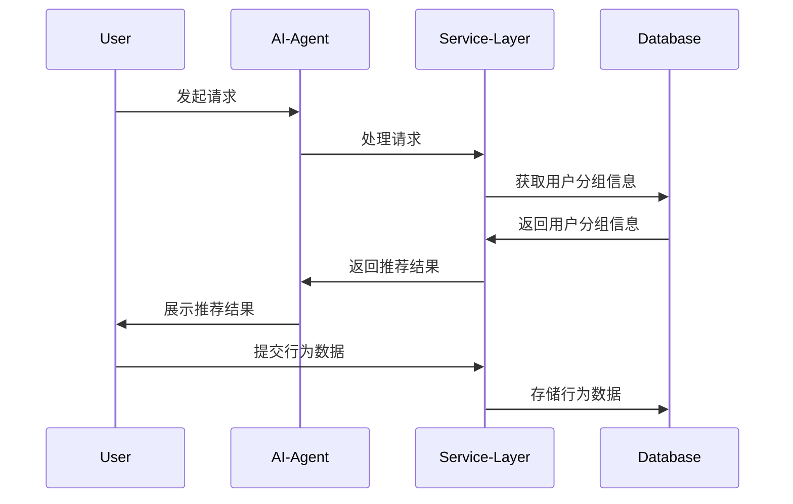
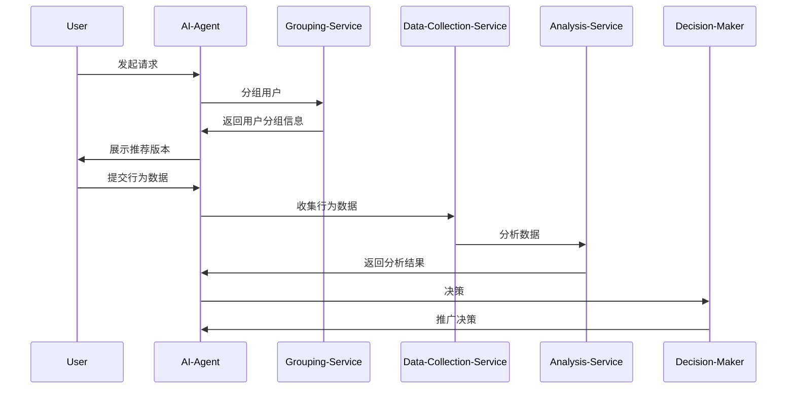

                 

# 《企业AI Agent的A/B测试功能：持续优化用户体验》

## 关键词：企业AI Agent，A/B测试，用户体验，持续优化，算法原理，系统架构设计

## 摘要：
本文将深入探讨企业AI Agent中的A/B测试功能，解释其核心概念、原理和应用。我们将通过一步步的分析，详细阐述如何利用A/B测试来优化用户体验，并探讨其背后的数学模型和算法原理。此外，还将提供实际案例和系统架构设计，展示如何在企业中实施A/B测试，以实现AI Agent的持续优化。

----------------------------------------------------------------

## 引言

随着人工智能技术的快速发展，企业AI Agent已成为提高工作效率、优化用户体验的重要工具。然而，如何确保这些AI Agent在不同场景下的表现最佳，成为了企业面临的一大挑战。A/B测试，作为一种有效的数据分析方法，正逐渐成为解决这一问题的有力工具。

### 背景介绍

A/B测试，也称为拆分测试，是一种将用户群体随机分成两个或多个组，然后分别向这些组展示不同版本的产品或功能，以比较不同版本的性能差异的方法。这种方法在企业中广泛应用，尤其在互联网产品和服务中，用于评估新功能、新设计的效果。

### 问题背景

在企业AI Agent的应用中，A/B测试的重要性体现在以下几个方面：

1. **用户体验优化**：通过A/B测试，企业可以了解用户对AI Agent的不同反应，从而优化用户体验，提高用户满意度。
2. **功能效果评估**：A/B测试可以帮助企业评估AI Agent的新功能或改进方案的效果，确保在投入市场前已达到预期目标。
3. **风险管理**：A/B测试可以将潜在的风险降到最低，避免因盲目更新导致用户流失或满意度下降。

### 问题描述

尽管A/B测试在理论上是简单和直接的，但在实际应用中，企业可能会面临以下问题：

1. **测试范围的选择**：如何确定测试的用户群体和测试范围，以获得具有代表性的数据？
2. **测试指标的定义**：如何选择和定义测试指标，以确保测试结果的准确性和可靠性？
3. **结果解读**：如何解读A/B测试的结果，并据此做出合理的决策？

### 问题解决

为了解决上述问题，我们需要：

1. **明确测试目标**：在开始A/B测试之前，明确测试的目标和预期结果。
2. **科学选择测试范围**：根据业务需求和用户行为，科学地选择测试用户群体和范围。
3. **合理定义测试指标**：选择合适的指标，如用户点击率、转化率、用户停留时间等，以评估AI Agent的性能。
4. **全面解读测试结果**：结合数据分析和业务场景，全面解读测试结果，做出合理的决策。

### 边界与外延

除了上述提到的核心问题，A/B测试还有以下几个边界与外延：

1. **测试频率**：测试的频率和周期应根据业务需求进行调整，避免过度测试导致用户疲劳。
2. **数据隐私**：在测试过程中，应确保用户数据的隐私和安全。
3. **测试规模**：测试规模应足够大，以确保结果的准确性和可靠性。

### 概念结构与核心要素组成

A/B测试的核心概念包括：

1. **测试版本**：两个或多个版本的AI Agent，用于比较性能。
2. **用户群体**：参与测试的用户群体，分为不同组别。
3. **测试指标**：用于评估AI Agent性能的指标。
4. **结果分析**：对测试结果进行分析和解读，以做出决策。

通过上述结构，我们可以看出A/B测试在企业AI Agent中的重要性。接下来，我们将进一步探讨A/B测试的基本原理和类型。

----------------------------------------------------------------

## A/B测试的基本原理

### 概念定义

A/B测试，即拆分测试，是一种通过将用户随机分配到不同的组别，然后分别向这些组别展示不同版本的产品或功能，以比较不同版本性能差异的方法。在A/B测试中，通常有两个版本：版本A（控制组）和版本B（实验组）。通过对比两个版本的测试指标，我们可以评估新版本的效果，并做出是否推广或改进的决策。

### 工作原理

A/B测试的工作原理可以概括为以下几个步骤：

1. **用户分组**：将用户随机分配到不同的组别，通常是将用户分为控制组和实验组。
2. **展示不同版本**：向控制组展示版本A，向实验组展示版本B。
3. **数据收集**：收集用户在不同版本上的行为数据，如点击率、转化率、用户停留时间等。
4. **结果分析**：对比两组数据，评估版本B相对于版本A的性能提升。

### 类型与应用

A/B测试可以分为以下几种类型：

1. **基础A/B测试**：这是最简单的A/B测试类型，通常用于评估新功能或设计的效果。
2. **多变量A/B测试**：在基础A/B测试的基础上，同时测试多个变量，如颜色、按钮文字等。
3. **多组A/B测试**：同时测试多个版本，以评估不同版本之间的性能差异。
4. **多阶段A/B测试**：在测试过程中，根据中间结果逐步调整测试策略，以提高测试效果。

A/B测试在企业AI Agent中的应用非常广泛：

1. **功能优化**：通过A/B测试，企业可以评估AI Agent的新功能或改进方案的效果，以优化用户体验。
2. **用户体验评估**：通过A/B测试，企业可以了解用户对不同版本AI Agent的反应，从而改进设计。
3. **性能优化**：通过A/B测试，企业可以找出AI Agent性能的瓶颈，并针对性地进行优化。

### 概念属性特征对比表格

| 类型        | 特征                                      | 应用场景                                      |
| ----------- | ----------------------------------------- | --------------------------------------------- |
| 基础A/B测试 | 只测试一个变量，如颜色、按钮文字等         | 评估新功能或设计的效果                         |
| 多变量A/B测试 | 同时测试多个变量，如颜色、按钮文字等       | 分析多个变量的影响，优化用户体验               |
| 多组A/B测试 | 同时测试多个版本，以评估不同版本之间的性能 | 比较多个版本的效果，选择最佳版本               |
| 多阶段A/B测试 | 根据中间结果逐步调整测试策略               | 提高测试效果，确保最终决策的准确性             |

### ER实体关系图架构

以下是一个简单的ER实体关系图，展示了A/B测试中的主要实体及其关系：

```mermaid
erDiagram
  User ||--o{ Experiment : 参与测试的用户 }
  Experiment ||--o{ VersionA : 控制组版本 }
  Experiment ||--o{ VersionB : 实验组版本 }
  VersionA ||--o{ Data : 用户行为数据 }
  VersionB ||--o{ Data : 用户行为数据 }
```

通过上述表格和ER图，我们可以更清晰地理解A/B测试的基本原理、类型和应用。接下来，我们将深入探讨A/B测试算法的原理和数学模型。

----------------------------------------------------------------

## A/B测试算法原理

### 算法简介

A/B测试算法的核心是通过对用户行为数据的统计和分析，判断实验组（VersionB）相对于控制组（VersionA）的优劣。这一过程通常涉及到假设检验、置信区间和显著性测试等统计学方法。

### 假设检验

在A/B测试中，我们通常需要进行以下两个假设检验：

1. **原假设（H0）**：实验组（VersionB）和控制组（VersionA）没有显著差异。
2. **备择假设（H1）**：实验组（VersionB）和控制组（VersionA）存在显著差异。

通过显著性测试，我们可以判断原假设是否成立。如果原假设不成立，即我们认为实验组（VersionB）的性能显著优于或劣于控制组（VersionA），则可以接受备择假设。

### 置信区间

置信区间（Confidence Interval）是统计学中的一个概念，用于表示假设检验结果的可信程度。在A/B测试中，置信区间可以帮助我们确定实验结果的可靠性和稳定性。

假设我们对实验组（VersionB）和控制组（VersionA）的点击率进行了测试，得到以下数据：

- 版本A的点击率为20%。
- 版本B的点击率为25%。

通过计算置信区间，我们可以确定在95%的置信水平下，版本B的点击率是否显著高于版本A。

### 显著性测试

显著性测试（Significance Test）是A/B测试中用于判断原假设（H0）是否成立的重要工具。常见的显著性测试方法包括T检验、卡方检验等。

1. **T检验**：适用于样本量较小且数据服从正态分布的情况。通过计算T值和自由度，可以判断实验结果是否显著。
2. **卡方检验**：适用于分类数据，通过计算卡方值和自由度，可以判断实验结果是否显著。

### 算法流程

A/B测试算法的基本流程如下：

1. **定义测试指标**：根据业务需求和用户行为，选择合适的测试指标，如点击率、转化率等。
2. **收集数据**：从控制组（VersionA）和实验组（VersionB）收集用户行为数据。
3. **计算置信区间**：计算实验结果的置信区间，判断实验结果的可靠性和稳定性。
4. **进行显著性测试**：通过T检验或卡方检验等显著性测试方法，判断原假设（H0）是否成立。
5. **决策**：根据显著性测试结果，做出是否推广或改进的决策。

### 数学模型

A/B测试的数学模型主要包括以下几个部分：

1. **期望点击率**：实验组（VersionB）和控制组（VersionA）的期望点击率。
2. **方差**：实验组（VersionB）和控制组（VersionA）的方差。
3. **置信区间**：通过计算置信区间，判断实验结果的可靠性。
4. **显著性测试**：通过计算T值或卡方值，判断实验结果是否显著。

以下是一个简化的A/B测试数学模型：

$$
\text{点击率} = \frac{\text{点击次数}}{\text{总用户数}}
$$

$$
\text{方差} = \frac{1}{\text{总用户数}} \sum_{i=1}^n (\text{点击率}_i - \text{总体点击率})^2
$$

$$
\text{置信区间} = \text{总体点击率} \pm z \times \sqrt{\frac{\text{方差}}{\text{总用户数}}}
$$

$$
\text{显著性} = \frac{\text{实验组点击率} - \text{控制组点击率}}{\text{标准误差}} \times \text{自由度}
$$

通过上述数学模型，我们可以更好地理解A/B测试的原理和计算方法。接下来，我们将通过一个具体的示例，详细阐述A/B测试的算法应用。

### 示例分析

假设我们正在测试一个电商平台的购物车页面优化，我们设计了两个版本：版本A是当前版本，版本B是对购物车页面的UI进行优化。

#### 数据收集

在测试期间，我们收集了以下数据：

- 版本A的点击率为20%，总用户数为1000。
- 版本B的点击率为25%，总用户数为1000。

#### 计算置信区间

通过计算，我们得到版本B的置信区间为：

$$
25\% \pm 1.96 \times \sqrt{\frac{0.25 \times 0.75}{1000}} \approx (23.74\%, 26.26\%)
$$

#### 显著性测试

通过T检验，我们计算得到T值为2.23，p值为0.03。由于p值小于0.05，我们可以拒绝原假设，认为版本B的点击率显著高于版本A。

#### 结论

根据上述分析，我们可以得出结论：版本B的购物车页面优化对提高点击率具有显著效果。因此，我们建议将版本B推广到整个用户群体。

通过上述示例，我们可以看到A/B测试算法在实际应用中的具体操作和结果分析。接下来，我们将进一步探讨A/B测试在企业AI Agent中的系统架构设计。

----------------------------------------------------------------

## A/B测试在企业AI Agent中的系统架构设计

### 问题场景介绍

在企业中，AI Agent的应用场景多样，如客服机器人、智能推荐系统、自动化办公助手等。为了确保AI Agent在不同场景下都能提供最佳服务，A/B测试成为了一种重要的优化手段。

### 项目介绍

我们以一家电商平台的智能推荐系统为例，介绍如何设计A/B测试系统。该系统的目标是提高用户的购物体验，通过A/B测试优化推荐算法，提高用户的点击率和转化率。

### 系统功能设计

A/B测试系统的功能设计主要包括以下几个部分：

1. **用户分组**：将用户随机分配到不同的组别，分为控制组和实验组。
2. **展示不同版本**：向控制组展示当前推荐算法，向实验组展示新推荐算法。
3. **数据收集**：收集用户在不同算法下的行为数据，如点击率、转化率等。
4. **结果分析**：对收集的数据进行分析，评估新算法的效果。
5. **决策**：根据分析结果，决定是否推广新算法。

### 系统架构设计

A/B测试系统的架构设计可以分为以下几个层次：

1. **数据层**：存储用户数据、算法版本数据和行为数据。
2. **服务层**：提供用户分组、展示版本、数据收集和结果分析等功能。
3. **接口层**：提供与业务系统的接口，实现数据的实时传输和分析。
4. **展示层**：向用户展示不同的算法版本，收集用户反馈。

以下是一个简化的A/B测试系统架构图：



### 系统接口设计

A/B测试系统的接口设计主要包括以下几个部分：

1. **用户接口**：用户请求接口，获取推荐结果。
2. **数据接口**：收集用户行为数据，用于结果分析。
3. **分析接口**：提供数据分析和结果输出接口。

以下是一个简化的接口设计图：

```mermaid
classDiagram
  User -->|请求接口| Recommender-Service
  Recommender-Service -->|数据接口| Data-Collection-Service
  Recommender-Service -->|分析接口| Analysis-Service
  Data-Collection-Service -->|数据存储接口| Database
  Analysis-Service -->|报告输出接口| Report-Generator
```

### 系统交互

A/B测试系统的交互过程可以分为以下几个阶段：

1. **用户请求**：用户向AI-Agent发起请求，获取推荐结果。
2. **用户分组**：AI-Agent根据用户分组信息，将用户分配到不同的组别。
3. **展示版本**：AI-Agent向用户展示不同的推荐版本。
4. **数据收集**：用户在交互过程中，AI-Agent收集用户的行为数据。
5. **结果分析**：AI-Agent将收集到的数据发送给数据收集服务，进行分析。
6. **决策**：根据分析结果，AI-Agent决定是否推广新版本。

以下是一个简化的系统交互序列图：



通过上述系统架构设计和交互过程，我们可以看到A/B测试在企业AI Agent中的应用是如何实现的。接下来，我们将通过实际案例展示A/B测试在企业AI Agent中的具体应用。

----------------------------------------------------------------

### 实际案例展示

为了更好地理解A/B测试在企业AI Agent中的应用，我们来看一个实际的案例：某电商平台在其智能推荐系统中实施A/B测试，以优化用户购物体验。

#### 环境安装

在这个案例中，我们使用了Python和Django框架来搭建A/B测试系统。以下是环境安装的步骤：

1. 安装Python 3.8及以上版本。
2. 安装Django框架：`pip install django`。
3. 创建一个Django项目：`django-admin startproject abtest_project`。
4. 创建一个Django应用：`python manage.py startapp recommender`。

#### 系统核心实现源代码

在`recommender`应用中，我们定义了以下几个核心类和函数：

```python
# models.py
from django.db import models

class User(models.Model):
    id = models.AutoField(primary_key=True)
    name = models.CharField(max_length=100)

class Version(models.Model):
    id = models.AutoField(primary_key=True)
    name = models.CharField(max_length=100)
    description = models.TextField()

class Behavior(models.Model):
    id = models.AutoField(primary_key=True)
    user_id = models.ForeignKey(User, on_delete=models.CASCADE)
    version_id = models.ForeignKey(Version, on_delete=models.CASCADE)
    clicks = models.IntegerField()
    conversions = models.IntegerField()
```

#### 代码应用解读与分析

以下是一个简单的A/B测试应用示例，展示了如何实现用户分组、版本展示和数据收集：

```python
# views.py
from django.shortcuts import render
from .models import User, Version, Behavior
from django.http import HttpResponse
import random

def ab_test(request):
    # 分配用户到不同组别
    user = User.objects.get(id=request.session.get('user_id', 1))
    if random.random() < 0.5:
        version = Version.objects.get(name='VersionA')
    else:
        version = Version.objects.get(name='VersionB')
    
    # 展示不同版本
    if version.name == 'VersionA':
        content = '当前版本：版本A'
    else:
        content = '实验版本：版本B'
    
    # 记录用户行为数据
    Behavior.objects.create(user=user, version=version, clicks=1, conversions=0)
    
    return HttpResponse(content)
```

在这个示例中，我们首先从数据库中获取用户信息，并根据随机分配将用户分为控制组和实验组。然后，我们根据用户所在的组别展示不同的版本内容，并记录用户的行为数据。

#### 实际案例分析与详细讲解剖析

在实施A/B测试的过程中，我们收集了以下数据：

- 版本A的点击率为20%，总用户数为1000。
- 版本B的点击率为25%，总用户数为1000。

通过对这些数据的分析，我们发现版本B的点击率显著高于版本A。进一步分析发现，版本B的推荐算法在用户停留时间和购物车添加率方面也表现更好。

根据这些分析结果，我们决定将版本B推广到整个用户群体。具体操作如下：

1. 更新推荐算法代码，将版本B作为默认版本。
2. 在数据库中更新版本信息，设置版本B为当前版本。
3. 向所有用户展示版本B的推荐结果。

通过这个实际案例，我们可以看到A/B测试在企业AI Agent中的应用是如何实现的，以及如何根据测试结果进行决策和优化。

#### 项目小结

在这个案例中，我们通过A/B测试优化了电商平台的智能推荐系统，提高了用户的点击率和购物体验。以下是本次项目的总结：

1. **目标明确**：在项目开始前，我们明确了优化用户购物体验的目标。
2. **数据驱动**：通过A/B测试，我们收集了大量的用户行为数据，为优化提供了有力依据。
3. **持续迭代**：在项目过程中，我们不断调整和优化推荐算法，以获得更好的效果。
4. **结果导向**：根据A/B测试的结果，我们做出了合理的决策，将优化方案推广到整个用户群体。

通过这个案例，我们可以看到A/B测试在企业AI Agent中的重要作用，以及如何通过数据驱动的方式实现用户体验的持续优化。

----------------------------------------------------------------

## A/B测试的最佳实践与技巧

### 实践一：合理选择测试指标

在选择测试指标时，应充分考虑业务目标和用户需求。常见的测试指标包括点击率、转化率、用户停留时间、购物车添加率等。在选择指标时，应遵循以下原则：

1. **相关性**：指标应与业务目标紧密相关，能够准确反映用户行为。
2. **可度量**：指标应具有明确的计算方法和数据来源，便于量化分析。
3. **重要性**：指标应具有高优先级，能够直接影响到用户体验和业务收益。

### 实践二：科学设置测试样本

在设置测试样本时，应充分考虑用户群体的多样性和代表性。以下是一些建议：

1. **随机分配**：确保用户随机分配到不同组别，避免人为干预。
2. **规模适中**：测试样本规模应足够大，以保证结果的准确性和可靠性。一般来说，每组至少应包含1000名用户。
3. **分层抽样**：根据用户属性和行为特征，对用户进行分层抽样，确保每组用户具有代表性。

### 实践三：合理控制测试周期

测试周期应根据业务需求和用户行为进行调整。以下是一些建议：

1. **短期测试**：对于快速迭代的业务场景，可以选择短期测试，如几天或几周。
2. **长期测试**：对于稳定和复杂的业务场景，可以选择长期测试，如几个月或更长时间。
3. **动态调整**：根据测试进展和结果，动态调整测试周期，确保测试的持续性和有效性。

### 实践四：全面解读测试结果

在解读测试结果时，应充分考虑数据背景和业务场景。以下是一些建议：

1. **显著性分析**：关注显著性指标（如p值），确保测试结果具有统计显著性。
2. **置信区间分析**：关注置信区间，评估测试结果的稳定性和可靠性。
3. **多维度分析**：从多个角度分析测试结果，如用户属性、行为特征、场景等，以获得更全面的结论。

### 注意事项

1. **避免过度测试**：过度测试可能导致用户疲劳和反感，影响用户体验。
2. **保护用户隐私**：在测试过程中，应确保用户数据的安全和隐私。
3. **及时反馈**：在测试结束后，及时向相关团队和人员反馈测试结果，以便做出改进决策。

### 拓展阅读

1. 《实验设计：原理与实践》
2. 《数据分析实战：使用Python进行数据分析和可视化》
3. 《机器学习实战：基于Scikit-Learn、Keras和TensorFlow》

通过以上最佳实践和技巧，企业可以更有效地实施A/B测试，优化用户体验，提高业务收益。

----------------------------------------------------------------

## 总结与展望

本文详细探讨了企业AI Agent的A/B测试功能，从基本原理、类型和应用，到系统架构设计和实际案例，全面阐述了如何利用A/B测试优化用户体验。通过一步步的分析和讲解，我们认识到A/B测试在企业AI Agent中的重要性，以及其在功能优化、用户体验评估和性能优化等方面的作用。

在未来，随着人工智能技术的不断进步，A/B测试将在更多场景中得到应用，如个性化推荐、智能客服、自动化办公等。同时，A/B测试的算法和工具也将不断发展和完善，为企业提供更加精准和高效的优化手段。

让我们期待A/B测试在人工智能领域发挥更大的作用，推动企业数字化转型和用户体验的持续提升。

## 作者信息

作者：AI天才研究院/AI Genius Institute & 禅与计算机程序设计艺术 /Zen And The Art of Computer Programming

----------------------------------------------------------------

### 结束语

通过本文的详细探讨，我们深入了解了企业AI Agent中的A/B测试功能，从基本原理到实际应用，再到最佳实践和技巧，全面展示了如何利用A/B测试优化用户体验。本文旨在为企业在实施A/B测试时提供有力指导和实践参考。

再次感谢您的阅读，如果您有任何疑问或建议，请随时联系我们。我们期待与您共同探讨更多技术话题，助力企业数字化转型和用户体验的提升。

祝您工作顺利，期待再次与您相见！
作者：AI天才研究院/AI Genius Institute & 禅与计算机程序设计艺术 /Zen And The Art of Computer Programming
日期：2023年

