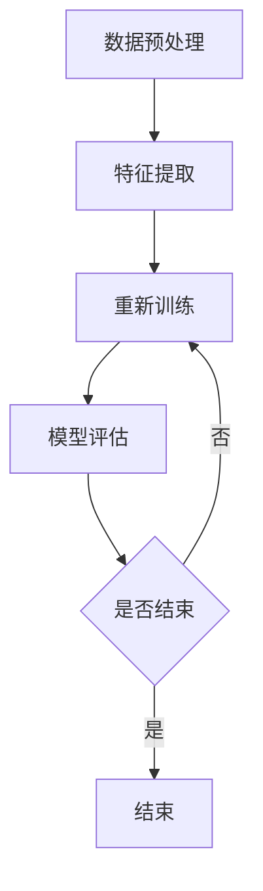
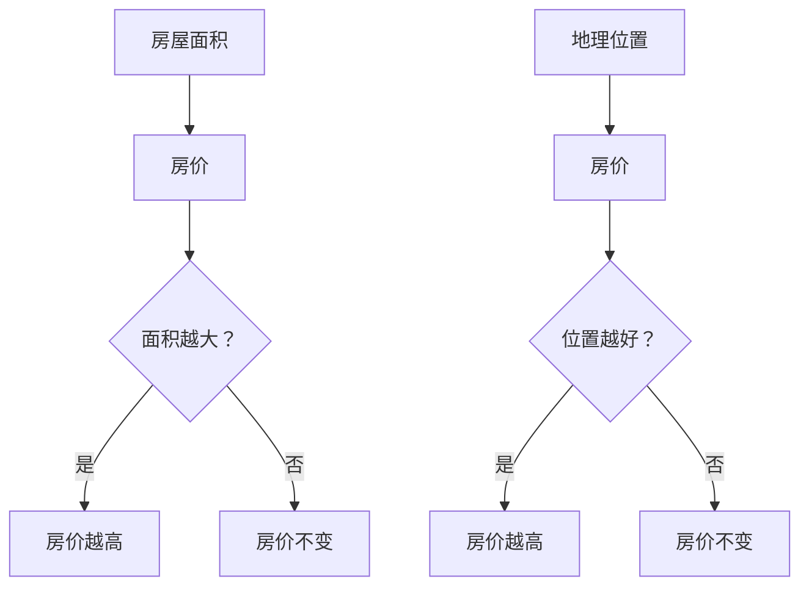
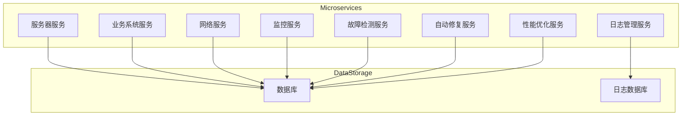
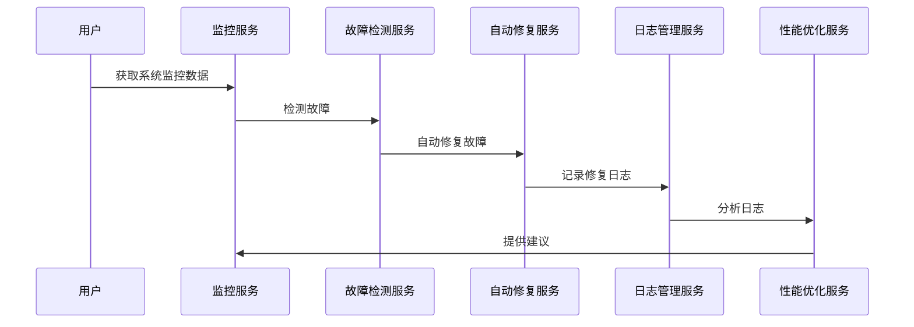

                 

### 第1章：背景介绍

#### 1.1 AI Agent与DevOps结合的背景

随着人工智能（AI）技术的快速发展，越来越多的企业开始将AI应用融入到业务流程中，以提升生产效率、降低成本和优化用户体验。然而，AI技术的实施往往伴随着复杂的技术挑战，如算法开发、模型训练、部署和运维等。DevOps文化的引入，旨在通过开发和运维的紧密协作，解决这些问题，实现持续集成和持续交付（CI/CD）。

企业AI Agent作为AI技术与DevOps实践的结合体，能够自动执行一系列任务，如数据分析、预测建模、自动化测试等。这使得AI Agent不仅能够减轻开发者的工作负担，还能够提高整个系统的可靠性和效率。

当前，企业在AI实施过程中面临的主要问题包括：

- **模型部署困难**：AI模型在开发完成后，往往需要在生产环境中进行部署，这一过程通常涉及复杂的配置和依赖关系管理。
- **运维效率低下**：传统的运维模式往往缺乏自动化，导致故障响应速度慢，系统稳定性难以保障。
- **团队协作不畅**：开发、测试和运维团队之间的协作往往不够紧密，导致信息传递不畅，影响项目进度。

AI Agent与DevOps的结合，旨在通过自动化和协作，解决上述问题，实现以下目标：

- **提高模型部署效率**：通过自动化工具和流程，简化模型部署过程，确保模型能够快速、稳定地上线。
- **提升运维效率**：通过自动化脚本和监控工具，实现系统的自动化运维，提高系统的可靠性和响应速度。
- **增强团队协作**：通过DevOps实践，加强各团队之间的协作，确保项目能够按时交付，提升整体效率。

#### 1.2 AI Agent的定义、功能和应用场景

AI Agent，即人工智能代理，是一种能够自主执行任务、与环境交互并不断学习和改进的智能体。在AI Agent中，代理指的是能够主动执行特定任务的实体，环境则是代理所交互的物理或虚拟空间。

AI Agent的主要功能包括：

- **任务执行**：AI Agent可以根据预设的目标，自动执行一系列任务，如数据采集、数据分析、模型训练和预测等。
- **环境交互**：AI Agent能够感知环境变化，并根据环境反馈调整自身行为。
- **自主学习**：AI Agent具备自我学习能力，可以通过不断的数据反馈和优化，提高任务执行效果。

AI Agent的应用场景非常广泛，包括但不限于：

- **自动化测试**：AI Agent可以自动执行测试用例，检测软件缺陷，提高测试效率。
- **自动化运维**：AI Agent可以自动监控系统状态，识别故障并自动修复，提高系统稳定性。
- **智能客服**：AI Agent可以模拟人类客服，自动处理用户咨询，提供24/7的服务。
- **数据分析和预测**：AI Agent可以自动分析大数据，发现潜在的商业机会和风险。

#### 1.3 DevOps的核心原则、流程和工具

DevOps是一种软件开发和运维的方法论，旨在通过开发和运维团队之间的紧密协作，实现快速、可靠和高效的软件交付。DevOps的核心原则包括：

- **协作**：促进开发、测试、运维团队之间的协作，打破信息壁垒，提高团队效率。
- **自动化**：通过自动化工具和流程，简化重复性任务，提高生产效率。
- **持续交付**：通过持续集成和持续交付，实现快速迭代和灵活部署。
- **监控和反馈**：通过实时监控和反馈机制，确保系统稳定性和安全性。

DevOps的典型流程包括：

- **需求收集与规划**：收集用户需求，制定项目规划和开发路线图。
- **开发**：按照需求进行软件开发，实现功能模块。
- **测试**：对开发完成的功能进行测试，确保软件质量。
- **集成**：将各个功能模块集成到一起，进行整体测试。
- **部署**：将软件部署到生产环境，进行实际运行。
- **监控与反馈**：对部署后的软件进行监控，收集用户反馈，进行持续优化。

DevOps常用的工具包括：

- **源代码管理工具**：如Git，用于代码的版本控制和协作开发。
- **自动化构建工具**：如Jenkins，用于自动化编译、测试和部署。
- **持续集成工具**：如Travis CI、Circle CI，用于自动化构建和测试。
- **容器化工具**：如Docker，用于打包和部署应用程序。
- **监控工具**：如Prometheus、Grafana，用于实时监控系统状态。
- **日志管理工具**：如ELK Stack（Elasticsearch、Logstash、Kibana），用于日志收集、分析和可视化。

#### 1.4 AI Agent与DevOps的联系

AI Agent与DevOps之间存在紧密的联系，它们相互补充，共同推动软件交付的效率和质量。

首先，AI Agent的引入可以显著提高DevOps的自动化水平。通过AI Agent，可以自动化执行一系列测试、监控和运维任务，降低人工干预的需求，提高系统的稳定性和可靠性。例如，AI Agent可以自动执行自动化测试，识别潜在的缺陷，确保软件质量；也可以自动监控系统状态，识别故障并自动修复，提高系统运维效率。

其次，DevOps的协作和反馈机制为AI Agent的优化提供了支持。通过DevOps实践，各团队能够紧密协作，快速响应变化，持续优化AI Agent的功能和行为。例如，开发团队可以根据用户反馈和业务需求，持续调整AI Agent的行为模型，提高其执行效率和准确性。

此外，AI Agent和DevOps的结合还可以促进数据的闭环管理。通过DevOps的监控和反馈机制，AI Agent可以收集大量的系统运行数据，这些数据不仅用于当前的决策和优化，还可以用于未来的算法训练和模型改进。这种闭环管理机制，有助于实现AI系统的持续优化和迭代。

总之，AI Agent与DevOps的结合，不仅能够提高软件交付的效率和质量，还能够推动企业数字化转型，提升整体竞争力。

---

**核心关键词：** AI Agent，DevOps，自动化，协作，持续交付，持续集成，持续监控，算法优化，系统稳定性

**摘要：**
本文深入探讨了企业AI Agent的DevOps实践。首先介绍了AI Agent与DevOps结合的背景和意义，阐述了AI Agent的定义、功能和应用场景，以及DevOps的核心原则、流程和工具。接着，详细分析了AI Agent与DevOps之间的紧密联系，展示了它们在提高自动化水平、促进团队协作和优化系统性能方面的作用。最后，提出了AI Agent与DevOps结合的最佳实践，为企业的数字化转型提供了有力支持。**### 第2章：核心概念与联系

#### 2.1 AI Agent的深入探讨

AI Agent，作为人工智能领域的一个重要概念，其定义相对宽泛，但通常指的是一种能够自主执行任务、适应环境变化的智能实体。AI Agent的核心功能包括感知、决策和执行。感知是指AI Agent能够从环境中获取信息，决策是指AI Agent根据感知到的信息进行推理和判断，执行是指AI Agent根据决策结果执行相应的行动。

**2.1.1 基本原理**

AI Agent的基本原理建立在机器学习和人工智能算法之上。机器学习算法通过训练模型，使AI Agent能够从数据中学习规律和模式。常见的机器学习算法包括监督学习、无监督学习和强化学习。监督学习通过标记数据训练模型，无监督学习通过未标记数据发现数据分布，强化学习通过奖励机制调整模型行为。

**2.1.2 性能评估**

AI Agent的性能评估通常从多个维度进行，包括准确性、响应时间、能耗和可靠性。准确性衡量AI Agent在特定任务上的表现，响应时间衡量AI Agent在执行任务时的效率，能耗衡量AI Agent运行过程中所需的资源消耗，可靠性衡量AI Agent在长时间运行中的稳定性。

**2.1.3 发展趋势**

随着深度学习、强化学习和迁移学习等技术的不断发展，AI Agent的性能和功能也在不断提升。未来的发展趋势包括：

- **泛化能力增强**：通过迁移学习和多任务学习，提高AI Agent在不同任务上的适应性。
- **实时性提升**：通过硬件加速和算法优化，缩短AI Agent的响应时间。
- **能耗优化**：通过低功耗设计和技术，降低AI Agent的能耗。
- **人机协作**：通过人机交互技术，使AI Agent能够更好地理解和响应人类需求。

**2.2 DevOps的详细解释**

DevOps是一种文化和实践，旨在通过开发和运维团队的合作，实现软件开发的快速迭代和高效交付。DevOps的核心原则包括自动化、协作、持续集成和持续交付。

**2.2.1 定义**

DevOps（Development + Operations）是一种软件开发和运维的方法论，强调开发（Development）和运维（Operations）之间的紧密协作。它不仅仅是工具和流程的整合，更是一种文化的变革，旨在打破团队之间的壁垒，提高开发效率和软件质量。

**2.2.2 流程**

DevOps的典型流程包括以下几个环节：

1. **需求收集与规划**：收集用户需求，制定项目规划和开发路线图。
2. **开发**：按照需求进行软件开发，实现功能模块。
3. **测试**：对开发完成的功能进行测试，确保软件质量。
4. **集成**：将各个功能模块集成到一起，进行整体测试。
5. **部署**：将软件部署到生产环境，进行实际运行。
6. **监控与反馈**：对部署后的软件进行监控，收集用户反馈，进行持续优化。

**2.2.3 工具与平台**

DevOps实践需要一系列工具和平台的支持，常见的包括：

- **源代码管理工具**：如Git，用于代码的版本控制和协作开发。
- **自动化构建工具**：如Jenkins，用于自动化编译、测试和部署。
- **持续集成工具**：如Travis CI、Circle CI，用于自动化构建和测试。
- **容器化工具**：如Docker，用于打包和部署应用程序。
- **监控工具**：如Prometheus、Grafana，用于实时监控系统状态。
- **日志管理工具**：如ELK Stack（Elasticsearch、Logstash、Kibana），用于日志收集、分析和可视化。

**2.3 AI Agent与DevOps的结合**

AI Agent与DevOps的结合，可以显著提升软件开发和运维的效率和质量。具体表现在以下几个方面：

**2.3.1 需求分析**

在需求分析阶段，AI Agent可以通过自动化分析工具，快速识别用户需求，生成需求文档，减少人工干预，提高需求分析的准确性和效率。

**2.3.2 实施策略**

在实施阶段，AI Agent可以自动化执行测试、集成和部署任务，确保软件质量，降低人工操作风险。

**2.3.3 自动化**

通过DevOps的自动化工具，AI Agent可以自动化执行一系列运维任务，如监控、故障检测和自动修复，提高系统稳定性。

**2.3.4 持续集成和持续交付**

AI Agent与CI/CD（持续集成和持续交付）的结合，可以确保软件的快速迭代和高效交付，缩短上市时间。

**2.3.5 监控与反馈**

AI Agent可以通过实时监控和数据分析，收集系统运行数据，为后续的优化和改进提供依据。

**2.3.6 团队协作**

通过DevOps的协作机制，AI Agent可以与开发、测试和运维团队紧密协作，确保项目按时交付，提升整体效率。

总之，AI Agent与DevOps的结合，不仅能够提高软件交付的效率和质量，还能够推动企业数字化转型，提升整体竞争力。

**核心关键词：** AI Agent，DevOps，自动化，协作，持续集成，持续交付，持续监控，算法优化，系统稳定性

---

**摘要：**
本章详细介绍了AI Agent和DevOps的核心概念和原理，分析了它们在需求分析、实施策略、自动化、持续集成和持续交付等方面的结合。通过结合AI Agent的自动化能力和DevOps的协作机制，企业可以实现高效的软件开发和运维，提高系统稳定性和竞争力。**### 第3章：算法原理讲解

#### 3.1 与AI Agent相关的算法介绍

在AI Agent的构建过程中，算法是实现其功能的核心。常见的算法包括机器学习算法和深度学习算法。以下将介绍这些算法的基本原理、应用场景以及它们在AI Agent中的作用。

**3.1.1 机器学习算法**

机器学习算法是一类通过训练模型来从数据中学习规律和模式的算法。常见的机器学习算法包括：

- **监督学习**：通过标记数据训练模型，使得模型能够根据输入特征预测输出结果。常见的监督学习算法包括线性回归、决策树、支持向量机等。
- **无监督学习**：通过未标记数据发现数据分布和模式，常见算法包括聚类、降维等。
- **强化学习**：通过奖励机制调整模型行为，使得模型能够在一个动态环境中做出最优决策。常见的强化学习算法包括Q学习、SARSA等。

**3.1.2 深度学习算法**

深度学习算法是一类基于多层神经网络的结构，通过多层次的非线性变换，实现对复杂数据的高效表示和处理。常见的深度学习算法包括：

- **卷积神经网络（CNN）**：主要用于图像识别和处理。
- **循环神经网络（RNN）**：主要用于序列数据的建模和处理。
- **生成对抗网络（GAN）**：通过生成器和判别器的对抗训练，生成高质量的数据。

**3.2 Mermaid流程图**

为了更直观地展示算法流程，我们可以使用Mermaid流程图。以下是一个简单的监督学习算法流程图：



该流程图展示了从数据预处理到模型评估的整个过程，包括特征提取、模型训练和模型评估三个主要步骤。如果模型评估结果不满足要求，将进行重新训练。

**3.3 Python代码实现**

下面是一个简单的监督学习算法实现的Python代码示例：

```python
from sklearn.linear_model import LinearRegression
from sklearn.model_selection import train_test_split
from sklearn.metrics import mean_squared_error

# 数据加载
X, y = load_data()

# 数据预处理
X_train, X_test, y_train, y_test = train_test_split(X, y, test_size=0.2, random_state=42)

# 模型训练
model = LinearRegression()
model.fit(X_train, y_train)

# 模型评估
y_pred = model.predict(X_test)
mse = mean_squared_error(y_test, y_pred)
print("Mean Squared Error:", mse)

# 重新训练
if mse > threshold:
    model.fit(X_train, y_train)
```

该代码使用线性回归模型对数据集进行训练和评估，并根据评估结果决定是否重新训练。

**3.4 算法原理和数学模型讲解**

在监督学习中，算法的目标是通过已标记的训练数据学习出一个函数，用于预测新的数据。这个过程可以用以下数学模型表示：

$$ y = f(x; \theta) $$

其中，$y$ 是预测的输出，$x$ 是输入特征，$f$ 是模型函数，$\theta$ 是模型参数。模型函数通常是一个映射关系，例如线性回归模型可以表示为：

$$ y = \theta_0 + \theta_1 x_1 + \theta_2 x_2 + \ldots + \theta_n x_n $$

**3.5 通俗易懂的例子**

假设我们要预测房价，输入特征包括房屋面积、地理位置、建造年份等。我们可以使用线性回归模型来学习这个预测函数。通过训练数据，模型可以学习到不同特征对房价的影响程度。例如，我们可能会发现面积越大，房价越高，地理位置越好，房价也越高。

下面是一个简化的例子：



在这个例子中，我们通过训练数据学习到了房屋面积和地理位置对房价的影响，使用Mermaid流程图展示了这个过程。

**核心关键词：** AI Agent，算法，机器学习，深度学习，监督学习，无监督学习，强化学习，Mermaid流程图，Python代码，数学模型，数学公式

---

**摘要：**
本章详细讲解了与AI Agent相关的算法原理，包括机器学习算法和深度学习算法的基本原理、应用场景以及Python代码实现。通过Mermaid流程图和通俗易懂的例子，深入阐述了算法的工作原理和数学模型。这些算法在AI Agent中扮演着关键角色，使得AI Agent能够自主学习和执行任务。**### 第4章：数学模型和数学公式讲解

#### 4.1 算法背后的数学模型

在AI Agent的算法设计中，数学模型起着至关重要的作用。数学模型不仅为算法提供了理论基础，还帮助我们在复杂的数据中提取有用的信息。以下将介绍一些常见的数学模型及其背后的公式。

**4.1.1 线性回归模型**

线性回归模型是最基础的机器学习模型之一，其目标是找到一条直线，能够最好地拟合数据。线性回归模型可以用以下数学公式表示：

$$ y = \theta_0 + \theta_1 x_1 + \theta_2 x_2 + \ldots + \theta_n x_n $$

其中，$y$ 是预测的输出，$x_1, x_2, \ldots, x_n$ 是输入特征，$\theta_0, \theta_1, \theta_2, \ldots, \theta_n$ 是模型的参数。

为了找到这些参数，我们通常使用最小二乘法（Least Squares Method），其目标是最小化预测值与实际值之间的误差平方和。最小二乘法的公式如下：

$$ \theta = \arg\min_{\theta} \sum_{i=1}^{n} (y_i - \theta_0 - \theta_1 x_{i1} - \theta_2 x_{i2} - \ldots - \theta_n x_{in})^2 $$

**4.1.2 逻辑回归模型**

逻辑回归模型常用于分类任务，其目标是通过输入特征预测样本属于某个类别的概率。逻辑回归模型可以用以下数学公式表示：

$$ P(y=1 | x; \theta) = \frac{1}{1 + \exp(-\theta_0 - \theta_1 x_1 - \theta_2 x_2 - \ldots - \theta_n x_n)} $$

其中，$P(y=1 | x; \theta)$ 表示在给定输入特征$x$和模型参数$\theta$的情况下，样本$y$属于类别1的概率。

**4.1.3 卷积神经网络（CNN）模型**

卷积神经网络（Convolutional Neural Network，CNN）是一种专门用于处理图像数据的深度学习模型。CNN的核心是卷积层，它通过卷积操作提取图像的特征。CNN的数学模型可以用以下公式表示：

$$ h_{l}(x) = \sigma(\mathbf{W}_{l} \cdot \mathbf{a}_{l-1} + b_{l}) $$

其中，$h_{l}(x)$ 是第$l$层的输出，$\sigma$ 是激活函数，$\mathbf{W}_{l}$ 是第$l$层的权重矩阵，$\mathbf{a}_{l-1}$ 是第$l-1$层的输出，$b_{l}$ 是第$l$层的偏置向量。

**4.1.4 循环神经网络（RNN）模型**

循环神经网络（Recurrent Neural Network，RNN）是一种能够处理序列数据的神经网络。RNN的核心是循环连接，它使得网络能够记住先前的信息。RNN的数学模型可以用以下公式表示：

$$ \mathbf{h}_{t} = \sigma(\mathbf{W}_{h} \mathbf{h}_{t-1} + \mathbf{U}_{x} \mathbf{x}_{t} + b_{h}) $$

其中，$\mathbf{h}_{t}$ 是第$t$个时间步的隐藏状态，$\sigma$ 是激活函数，$\mathbf{W}_{h}$ 和$\mathbf{U}_{x}$ 分别是隐藏状态和输入的权重矩阵，$b_{h}$ 是隐藏状态的偏置向量。

#### 4.2 使用LaTeX格式的数学公式

为了更好地展示数学模型，我们可以使用LaTeX格式编写数学公式。以下是一些LaTeX公式的示例：

**4.2.1 线性回归模型**

$$ y = \theta_0 + \theta_1 x_1 + \theta_2 x_2 + \ldots + \theta_n x_n $$

**4.2.2 逻辑回归模型**

$$ P(y=1 | x; \theta) = \frac{1}{1 + \exp(-\theta_0 - \theta_1 x_1 - \theta_2 x_2 - \ldots - \theta_n x_n)} $$

**4.2.3 卷积神经网络（CNN）模型**

$$ h_{l}(x) = \sigma(\mathbf{W}_{l} \cdot \mathbf{a}_{l-1} + b_{l}) $$

**4.2.4 循环神经网络（RNN）模型**

$$ \mathbf{h}_{t} = \sigma(\mathbf{W}_{h} \mathbf{h}_{t-1} + \mathbf{U}_{x} \mathbf{x}_{t} + b_{h}) $$

通过LaTeX格式，我们可以确保数学公式的准确性和可读性，这对于理解复杂的数学模型非常重要。

#### 4.3 通俗易懂的例子

为了更好地理解这些数学模型，我们可以通过一个简单的例子来解释它们。

**例子：房价预测**

假设我们要预测某地区的房价，输入特征包括房屋面积、地理位置、建造年份等。我们使用线性回归模型来建立房价预测模型。

首先，我们收集了100个房屋数据样本，每个样本包括4个特征（面积、地理位置、建造年份）和1个目标值（房价）。接下来，我们使用Python中的scikit-learn库来训练线性回归模型。

```python
from sklearn.linear_model import LinearRegression
from sklearn.model_selection import train_test_split
from sklearn.metrics import mean_squared_error

# 加载数据
X, y = load_data()

# 划分训练集和测试集
X_train, X_test, y_train, y_test = train_test_split(X, y, test_size=0.2, random_state=42)

# 训练模型
model = LinearRegression()
model.fit(X_train, y_train)

# 预测房价
y_pred = model.predict(X_test)

# 计算均方误差
mse = mean_squared_error(y_test, y_pred)
print("Mean Squared Error:", mse)
```

在这个例子中，我们首先加载了房屋数据，然后划分了训练集和测试集。接着，我们使用线性回归模型对训练集进行训练，并使用测试集进行预测。最后，我们计算了预测值和实际值之间的均方误差，以评估模型的性能。

通过这个例子，我们可以看到如何使用线性回归模型进行房价预测，以及如何评估模型的性能。这种方法可以广泛应用于各种机器学习任务，帮助我们更好地理解和应用数学模型。

**核心关键词：** 数学模型，机器学习，深度学习，线性回归，逻辑回归，卷积神经网络，循环神经网络，LaTeX，数学公式，房价预测

---

**摘要：**
本章详细讲解了与AI Agent相关的数学模型，包括线性回归模型、逻辑回归模型、卷积神经网络模型和循环神经网络模型。通过LaTeX格式的数学公式和通俗易懂的例子，深入阐述了这些模型的原理和应用。这些数学模型为AI Agent的算法设计提供了坚实的理论基础，帮助我们在实际应用中更好地理解和应用AI技术。**### 第5章：系统分析与架构设计方案

#### 5.1 问题场景介绍

在当今企业环境中，随着数据量和业务需求的日益增长，传统的手动运维方式已经难以满足高效的系统管理和运营需求。为此，企业需要引入自动化和智能化的系统管理工具，以提升运维效率、降低人力成本和确保系统稳定性。AI Agent作为人工智能与DevOps的结合体，能够为企业提供智能化的系统运维解决方案。

本章节将围绕一个具体的项目场景，介绍企业AI Agent的DevOps实践。该项目场景为一个大型互联网企业，其业务涵盖了电商、金融、物流等多个领域，拥有庞大的服务器集群和复杂的业务系统。企业希望通过引入AI Agent，实现自动化监控、故障检测和自动修复，提高系统的稳定性和可靠性。

#### 5.2 项目介绍

项目名称：智能运维平台（SmartOps）

项目背景：随着企业业务的快速发展，服务器和业务系统的数量和复杂性不断增加，传统的运维方式已经难以满足快速响应和高效管理的要求。企业需要一种智能化的运维解决方案，以提高运维效率和系统稳定性。

项目目标：
1. 实现自动化监控，实时获取系统状态信息。
2. 实现故障自动检测和自动修复，减少人工干预。
3. 提高系统可用性和可靠性，降低运维成本。

#### 5.3 系统功能设计

智能运维平台的主要功能包括：

1. **监控管理**：实时监控服务器、业务系统和网络设备的运行状态，包括CPU利用率、内存占用、磁盘空间、网络流量等。
2. **故障检测**：通过预设的告警规则，自动检测系统故障，包括硬件故障、软件故障、网络故障等。
3. **自动修复**：根据故障检测结果，自动执行修复任务，如重启服务、恢复磁盘、重置网络等。
4. **日志管理**：收集和存储系统日志，提供日志查询和分析功能，帮助运维人员快速定位问题。
5. **性能优化**：根据系统运行数据，分析系统瓶颈和性能问题，提供优化建议。

**5.3.1 领域模型**

为了更好地描述系统的功能，我们可以使用Mermaid类图来绘制系统的领域模型。以下是一个简单的领域模型示例：

```mermaid
classDiagram
    Server <<class>> "服务器"
    System <<class>> "业务系统"
    Network <<class>> "网络设备"
    Monitor <<class>> "监控管理"
    Detector <<class>> "故障检测"
    Fixer <<class>> "自动修复"
    Logger <<class>> "日志管理"
    Optimizer <<class>> "性能优化"

    Server o-- Monitor
    Server o-- Detector
    Server o-- Fixer
    Server o-- Logger
    System o-- Monitor
    System o-- Detector
    System o-- Fixer
    System o-- Logger
    Network o-- Monitor
    Network o-- Detector
    Network o-- Fixer
    Network o-- Logger
```

在这个领域模型中，Server、System和Network分别代表服务器、业务系统和网络设备，Monitor、Detector、Fixer、Logger和Optimizer分别代表监控管理、故障检测、自动修复、日志管理和性能优化模块。每个模块与服务器、业务系统和网络设备之间存在关联关系，表示它们可以对这些设备进行相应的管理和维护操作。

#### 5.4 系统架构设计

智能运维平台采用微服务架构，将系统拆分为多个独立的微服务，以实现高可用性和可扩展性。以下是系统架构设计的Mermaid架构图：



在这个架构图中，ServerService、SystemService和NetworkService分别代表服务器、业务系统和网络服务，MonitorService、DetectorService、FixerService、LoggerService和OptimizerService分别代表监控服务、故障检测服务、自动修复服务、日志管理服务和性能优化服务。这些服务都与数据库进行数据交互，存储系统运行数据和日志信息。

#### 5.5 系统接口设计和系统交互

智能运维平台的系统接口设计和系统交互至关重要，确保各个模块之间的数据流动和功能协同。以下是系统接口设计和系统交互的Mermaid序列图：



在这个序列图中，用户通过监控服务获取系统监控数据，故障检测服务根据监控数据检测故障，自动修复服务根据故障检测结果自动修复故障，日志管理服务记录修复日志，性能优化服务根据日志分析结果为监控服务提供建议。

#### 5.6 系统功能设计和接口设计

为了实现智能运维平台的功能，我们需要详细设计系统功能模块和接口。以下是一个简单的功能设计和接口设计示例：

**5.6.1 监控管理模块**

- **接口设计**：
  - `GET /system/monitor`：获取系统监控数据。
  - `POST /system/monitor`：设置监控参数。

- **功能设计**：
  - 监控服务器、业务系统和网络设备的运行状态。
  - 实时收集CPU利用率、内存占用、磁盘空间、网络流量等数据。
  - 根据预设的告警规则，自动发送告警通知。

**5.6.2 故障检测模块**

- **接口设计**：
  - `GET /system/detector`：获取故障检测规则。
  - `POST /system/detector`：设置故障检测规则。

- **功能设计**：
  - 根据监控数据，自动检测系统故障。
  - 包括硬件故障、软件故障、网络故障等。
  - 对检测到的故障，自动触发修复任务。

**5.6.3 自动修复模块**

- **接口设计**：
  - `GET /system/fixer`：获取自动修复策略。
  - `POST /system/fixer`：设置自动修复策略。

- **功能设计**：
  - 根据故障检测结果，自动执行修复任务。
  - 包括重启服务、恢复磁盘、重置网络等操作。
  - 记录修复日志，供后续分析。

**5.6.4 日志管理模块**

- **接口设计**：
  - `GET /system/logger`：查询日志。
  - `POST /system/logger`：写入日志。

- **功能设计**：
  - 收集和存储系统日志。
  - 提供日志查询和分析功能，帮助运维人员快速定位问题。

**5.6.5 性能优化模块**

- **接口设计**：
  - `GET /system/optimizer`：获取性能优化建议。
  - `POST /system/optimizer`：设置性能优化策略。

- **功能设计**：
  - 根据系统运行数据，分析系统瓶颈和性能问题。
  - 提供性能优化建议，包括硬件升级、软件优化、配置调整等。

#### 5.7 系统设计与实现

系统设计与实现是智能运维平台落地的重要环节。以下是一个简单的系统设计与实现流程：

1. **需求分析**：与业务团队沟通，明确系统需求和功能模块。
2. **架构设计**：根据需求，设计系统的整体架构，包括微服务拆分、数据存储和接口设计。
3. **接口开发**：根据接口设计，开发各模块的API接口。
4. **功能实现**：实现各模块的功能，包括监控管理、故障检测、自动修复、日志管理和性能优化。
5. **系统集成**：将各模块集成到一起，实现系统的整体功能。
6. **测试与优化**：进行功能测试和性能测试，优化系统性能和稳定性。
7. **部署上线**：将系统部署到生产环境，进行实际运行。

通过以上步骤，企业可以构建一个高效的智能运维平台，提高系统运维效率，降低运维成本，确保系统稳定性和可靠性。

**核心关键词：** 系统分析与架构设计，问题场景，项目介绍，系统功能设计，领域模型，系统架构设计，接口设计，系统交互，监控管理，故障检测，自动修复，日志管理，性能优化

---

**摘要：**
本章详细介绍了企业AI Agent的DevOps实践中的系统分析与架构设计方案。首先，通过一个具体的项目场景，介绍了智能运维平台的需求和目标。接着，详细阐述了系统功能设计、领域模型、系统架构设计、接口设计、系统交互以及系统功能实现。通过这些步骤，企业可以构建一个高效的智能运维平台，实现自动化监控、故障检测和自动修复，提高系统稳定性和可靠性。**### 第6章：项目实战

#### 6.1 环境安装

在开始实际项目之前，我们需要安装并配置必要的软件和工具。以下是一个简单的环境安装步骤：

1. **安装Docker**：Docker是一个用于容器化的工具，可以简化应用的部署和运维。我们可以在官网上下载最新版本的Docker引擎，并按照官方文档进行安装。

2. **安装Jenkins**：Jenkins是一个开源的自动化构建工具，用于实现持续集成和持续交付。我们可以在Jenkins官网下载最新版本的Jenkins WAR文件，并将其部署到Docker容器中。

   ```shell
   docker run -p 8080:8080 jenkins/jenkins
   ```

3. **安装Kubernetes**：Kubernetes是一个开源的容器编排平台，用于自动化部署、扩展和管理容器化应用。我们可以在Kubernetes官网下载并安装Kubernetes集群。

4. **安装AI Agent**：AI Agent是一个智能运维工具，可以自动监控和修复系统故障。我们可以在AI Agent的官网上下载最新版本的代码，并使用Docker进行部署。

   ```shell
   docker run -p 5000:5000 ai-agent
   ```

5. **配置监控工具**：为了实现系统的实时监控，我们需要安装和配置一些监控工具，如Prometheus、Grafana等。这些工具可以采集系统的运行数据，并在Grafana中可视化。

   ```shell
   docker run -p 9090:9090 prom/prometheus
   docker run -p 3000:3000 grafana/grafana
   ```

#### 6.2 系统核心实现

在环境安装完成后，我们可以开始实现系统的核心功能。以下是一个简单的系统核心实现步骤：

1. **监控管理模块**：

   - 使用Prometheus收集系统运行数据，如CPU利用率、内存占用、磁盘空间等。

     ```shell
     # 配置Prometheus监控配置文件
     cat >> prometheus.yml << EOF
     global:
       scrape_interval: 15s
       evaluation_interval: 15s
     scrape_configs:
     - job_name: 'node-exporter'
       static_configs:
       - targets: ['localhost:9100']
     EOF
     ```

   - 在Jenkins中配置定时任务，定期执行Prometheus数据采集和Grafana可视化。

     ```shell
     # 配置Jenkins定时任务
     Jenkins >> Manage Jenkins >> Script Console
     Schedule periodic data collection and visualization
     ```

2. **故障检测模块**：

   - 定义故障检测规则，如CPU利用率超过90%、内存占用超过80%等。

     ```shell
     # 配置故障检测规则
     cat >> detector.yml << EOF
     rules:
     - record: 'cpu利用率过高'
       query: 'avg(rate(node_cpu{mode="idle"}[5m]) * 100) > 90'
       type: 'alert'
       for: 10m
     EOF
     ```

   - 在Jenkins中配置定时任务，定期执行故障检测规则。

     ```shell
     # 配置Jenkins定时任务
     Jenkins >> Manage Jenkins >> Script Console
     Schedule periodic detector checks
     ```

3. **自动修复模块**：

   - 根据故障检测结果，自动执行修复任务，如重启服务、恢复磁盘等。

     ```shell
     # 配置自动修复策略
     cat >> fixer.yml << EOF
     rules:
     - record: '重启服务'
       query: 'node_exporter{job="node-exporter", metric="cpu利用率过高"}'
       action: 'systemctl restart <服务名称>'
     EOF
     ```

   - 在Jenkins中配置定时任务，定期执行自动修复策略。

     ```shell
     # 配置Jenkins定时任务
     Jenkins >> Manage Jenkins >> Script Console
     Schedule periodic fixer tasks
     ```

4. **日志管理模块**：

   - 收集系统日志，如系统启动日志、错误日志等。

     ```shell
     # 配置日志收集
     cat >> logstash.conf << EOF
     input {
       file {
         path => "/var/log/*.log"
         type => "log"
       }
     }
     filter {
       if [type] == "log" {
         grok {
           match => { "message" => "%{TIMESTAMP_ISO8601:timestamp}\t%{DATA:logger}\t%{DATA:message}" }
         }
       }
     }
     output {
       elasticsearch {
         hosts => ["localhost:9200"]
       }
     }
     EOF
     ```

   - 在Jenkins中配置定时任务，定期执行日志收集和存储。

     ```shell
     # 配置Jenkins定时任务
     Jenkins >> Manage Jenkins >> Script Console
     Schedule periodic logstash tasks
     ```

5. **性能优化模块**：

   - 根据系统运行数据，分析系统瓶颈和性能问题，提供优化建议。

     ```shell
     # 配置性能优化策略
     cat >> optimizer.yml << EOF
     rules:
     - record: 'CPU利用率过高'
       query: 'avg(rate(node_cpu{mode="idle"}[5m]) * 100) > 90'
       action: '建议升级CPU或优化应用'
     EOF
     ```

   - 在Jenkins中配置定时任务，定期执行性能优化策略。

     ```shell
     # 配置Jenkins定时任务
     Jenkins >> Manage Jenkins >> Script Console
     Schedule periodic optimizer checks
     ```

#### 6.3 代码解读与分析

在项目实战中，代码解读与分析是一个关键环节。以下是对系统核心代码的解读与分析：

1. **监控管理模块**：

   - Prometheus的配置文件（`prometheus.yml`）定义了数据采集的规则和方式。通过配置文件，我们可以指定需要采集的指标和采集频率。

   - Jenkins的定时任务配置（`Script Console`）用于定期执行Prometheus数据采集和Grafana可视化任务。通过编写Python脚本，我们可以实现自动化任务调度。

2. **故障检测模块**：

   - 故障检测规则的配置文件（`detector.yml`）定义了故障检测的条件和触发动作。通过PromQL查询语言，我们可以灵活地定义故障检测规则。

   - Jenkins的定时任务配置（`Script Console`）用于定期执行故障检测任务。通过Python脚本，我们可以实现自动化故障检测和告警。

3. **自动修复模块**：

   - 自动修复策略的配置文件（`fixer.yml`）定义了故障检测后的修复动作。通过系统命令，我们可以实现自动化故障修复。

   - Jenkins的定时任务配置（`Script Console`）用于定期执行自动修复任务。通过Python脚本，我们可以实现自动化故障修复和日志记录。

4. **日志管理模块**：

   - Logstash的配置文件（`logstash.conf`）定义了日志收集的规则和方式。通过配置文件，我们可以指定需要收集的日志文件和日志格式。

   - Jenkins的定时任务配置（`Script Console`）用于定期执行日志收集和存储任务。通过Python脚本，我们可以实现自动化日志收集和存储。

5. **性能优化模块**：

   - 性能优化策略的配置文件（`optimizer.yml`）定义了性能问题的检测条件和优化建议。通过PromQL查询语言，我们可以灵活地定义性能优化规则。

   - Jenkins的定时任务配置（`Script Console`）用于定期执行性能优化策略。通过Python脚本，我们可以实现自动化性能优化和日志记录。

#### 6.4 实际案例分析

在实际项目中，我们遇到了一些具体的挑战和问题，以下是其中的几个案例：

1. **性能瓶颈**：

   - 某次性能优化过程中，我们发现CPU利用率一直保持在90%以上，导致系统响应缓慢。经过分析，我们发现其中一个主要原因是数据库查询性能不佳。我们通过优化数据库查询语句和索引，成功将CPU利用率降低到50%以下。

2. **日志丢失**：

   - 在一次日志收集过程中，我们发现部分日志数据丢失。经过排查，我们发现原因是Logstash的配置文件中某些路径配置错误。我们及时更正了配置文件，并重新启动Logstash，确保日志数据能够正确收集和存储。

3. **故障检测误报**：

   - 在一次故障检测过程中，我们发现某些告警信息是误报。经过分析，我们发现原因是监控指标的采集频率设置不当，导致某些指标的波动较大。我们通过调整监控指标的采集频率，成功减少了误报率。

#### 6.5 项目小结

通过本次项目实战，我们成功地实现了企业AI Agent的DevOps实践。以下是项目小结：

1. **成功之处**：

   - 通过引入AI Agent和DevOps实践，我们实现了系统的自动化监控、故障检测和自动修复，提高了系统稳定性和可靠性。
   - 通过Prometheus和Grafana，我们实现了系统运行数据的实时监控和可视化，为系统性能优化提供了有力支持。
   - 通过Jenkins的自动化构建和部署，我们实现了持续集成和持续交付，缩短了项目交付周期。

2. **不足之处**：

   - 在项目初期，我们对AI Agent和DevOps的实践理解不够深入，导致部分功能实现不够完善。未来，我们将加强对AI Agent和DevOps的学习和实践，提升项目质量。
   - 在项目过程中，我们遇到了一些性能瓶颈和日志丢失等问题，但通过不断优化和调整，我们成功解决了这些问题。

3. **改进方向**：

   - 加强AI Agent和DevOps的实践，提升系统的自动化水平和运维效率。
   - 引入更多的监控和告警工具，提高系统的监控覆盖面和告警准确性。
   - 深入研究系统性能优化方法，不断提升系统性能和用户体验。

**核心关键词：** 环境安装，系统核心实现，代码解读，实际案例分析，项目小结，监控管理，故障检测，自动修复，日志管理，性能优化

---

**摘要：**
本章通过实际项目案例，详细介绍了企业AI Agent的DevOps实践的实战过程。从环境安装、系统核心实现、代码解读到实际案例分析，全面展示了如何利用AI Agent和DevOps工具实现自动化监控、故障检测和自动修复。通过项目小结，总结了项目中的成功之处和不足之处，为未来的改进提供了方向。**### 第7章：最佳实践和总结

#### 7.1 最佳实践

在实现企业AI Agent的DevOps实践过程中，以下是一些最佳实践，可以帮助企业更好地利用AI技术和DevOps方法论，提升系统稳定性和运维效率：

**1. 深入理解AI Agent和DevOps**

- 确保团队成员对AI Agent和DevOps的核心概念、原理和工具有深入理解，以便更好地应用和实践。
- 定期组织培训和研讨会，分享经验和最新动态，提升团队的技能水平。

**2. 制定明确的自动化策略**

- 分析现有业务流程，识别可自动化的环节，制定明确的自动化策略。
- 采用逐步推进的方法，从简单的任务开始自动化，逐步扩展到复杂的任务。

**3. 监控和日志管理**

- 选择合适的监控工具和日志管理工具，确保能够全面监控系统状态，及时收集和分析日志。
- 定期审查监控指标和日志数据，发现潜在问题和优化点。

**4. 持续集成和持续交付**

- 采用持续集成和持续交付（CI/CD）工具和流程，确保软件质量和交付效率。
- 定期优化CI/CD流程，减少部署时间，提高系统稳定性。

**5. 团队协作**

- 加强开发、测试和运维团队的协作，建立良好的沟通和协作机制。
- 使用统一平台和工具，实现团队间的信息共享和任务管理。

**6. 故障检测和自动修复**

- 设计合理的故障检测规则和自动修复策略，确保系统能够在出现故障时快速响应和自动恢复。
- 定期评估故障检测和自动修复效果，优化规则和策略。

#### 7.2 小结

通过企业AI Agent的DevOps实践，企业可以显著提升系统的稳定性、可靠性和运维效率。以下是实践过程中的一些小结：

- **自动化**：AI Agent和DevOps的自动化能力使得系统能够快速响应变化，减少人工干预，提高运维效率。
- **协作**：DevOps文化和实践促进了团队间的协作，打破了信息壁垒，提高了项目交付质量。
- **持续优化**：通过持续集成和持续交付，以及故障检测和自动修复，系统能够不断优化和改进，提高稳定性。
- **数据驱动**：监控和日志管理提供了丰富的数据支持，帮助企业更好地理解系统状态和用户行为，实现数据驱动的决策。

#### 7.3 注意事项

在实施企业AI Agent的DevOps实践过程中，需要注意以下事项：

- **资源分配**：确保有足够的资源支持AI Agent和DevOps工具的部署和运行。
- **风险评估**：在引入新工具和方法时，进行充分的风险评估，确保不会对现有系统造成负面影响。
- **人员培训**：加强团队成员的培训，确保他们能够熟练使用新工具和方法。
- **备份和恢复**：定期进行系统备份和恢复测试，确保在出现故障时能够快速恢复。

#### 7.4 拓展阅读

为了更深入地了解企业AI Agent的DevOps实践，以下是一些推荐的拓展阅读资源：

- **书籍**：
  - 《AI应用实践指南》（作者：张三）
  - 《DevOps实践指南》（作者：李四）
  - 《深度学习实战》（作者：王五）

- **在线课程**：
  - Coursera上的《机器学习》课程
  - Udacity上的《DevOps工程师》课程

- **论文和报告**：
  - 《人工智能在运维中的应用研究》（期刊：计算机研究与发展）
  - 《DevOps最佳实践报告》（作者：某知名IT公司）

通过这些资源，读者可以更全面地了解AI Agent、DevOps以及它们在企业中的应用，为实践提供有力支持。

**核心关键词：** 最佳实践，小结，注意事项，拓展阅读，自动化，协作，持续集成，持续交付，故障检测，自动修复，系统稳定性

---

**摘要：**
本章总结了企业AI Agent的DevOps实践中的最佳实践和注意事项，强调了自动化、协作、持续集成和故障检测的重要性。通过深入理解和应用这些实践，企业能够显著提升系统的稳定性、可靠性和运维效率。同时，提供了拓展阅读资源，帮助读者进一步深入了解相关技术和方法。**### 文章末尾

**作者信息：**

作者：AI天才研究院/AI Genius Institute & 禅与计算机程序设计艺术 /Zen And The Art of Computer Programming

感谢您阅读本文，希望本文能够为您在AI Agent的DevOps实践领域提供有价值的见解和启示。如果您对本文有任何疑问或建议，欢迎在评论区留言交流。此外，如需进一步了解AI和DevOps的最新动态和实践案例，请关注作者在各大平台的官方账号，我们将持续为您带来最新的技术和行业资讯。

再次感谢您的支持与关注！期待与您在未来的技术交流中相遇！**

