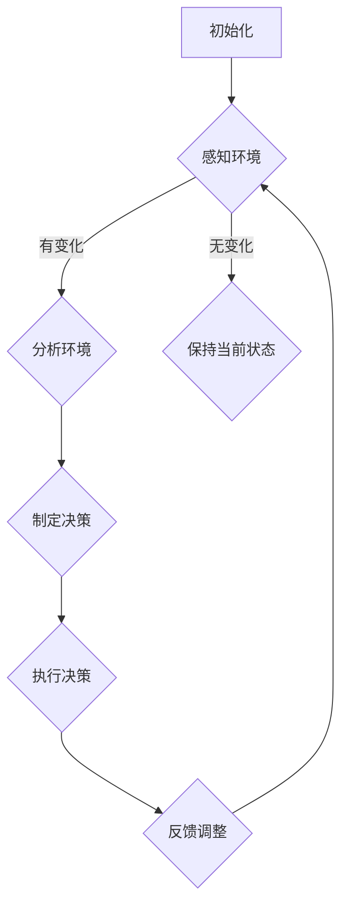
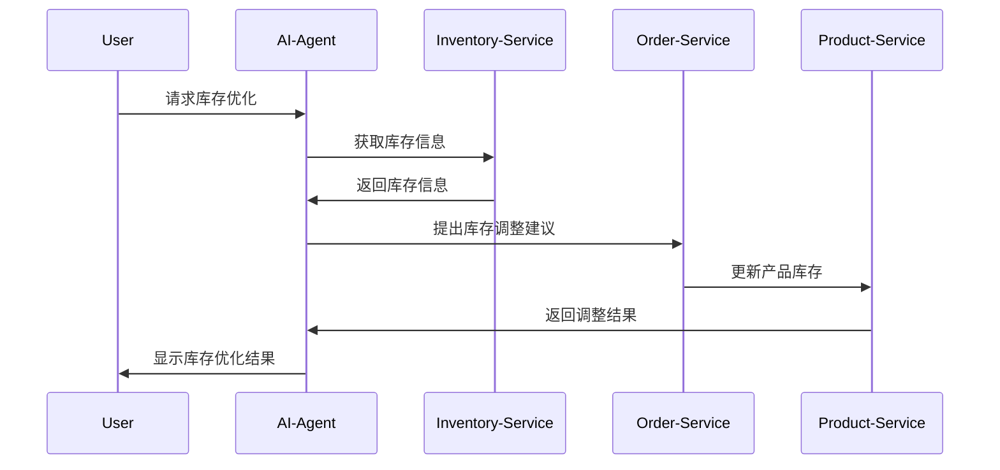
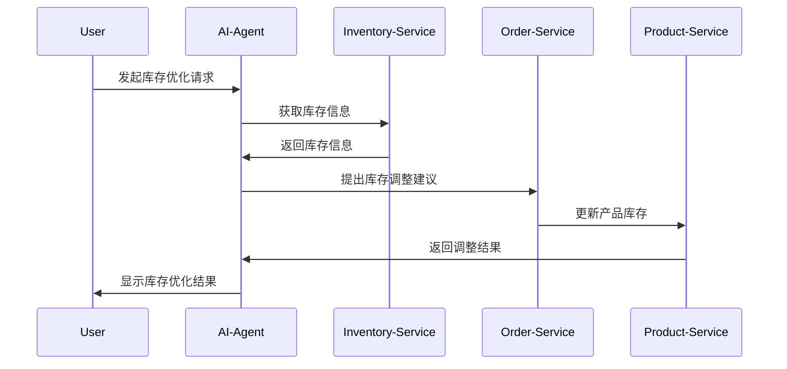
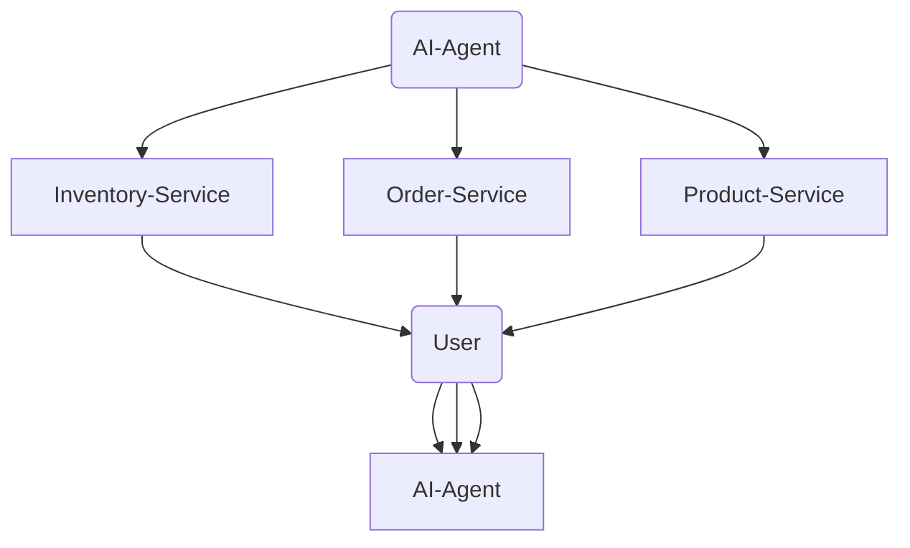

                 

### 企业AI Agent的serverless架构设计

关键词：企业AI Agent、serverless架构、FaaS、弹性伸缩、高可用性

摘要：本文旨在探讨企业AI Agent的serverless架构设计，分析其背景、核心概念与联系，并详细讲解其算法原理和架构设计。通过本文，读者将深入了解serverless架构在企业AI应用中的优势和应用实践。

### 第一部分：背景介绍

#### 问题背景

在当今数字化时代，人工智能（AI）技术迅猛发展，企业AI应用需求日益增长。然而，传统的客户端-服务器架构在应对大规模AI应用时显得力不从心，难以满足快速迭代、灵活部署和高扩展性的要求。因此，有必要探索一种全新的架构设计，以适应企业AI应用的发展趋势。

#### 问题描述

企业AI Agent的serverless架构设计旨在提供一种高效、灵活、可扩展的解决方案，以支持企业AI应用的部署与运行。这种架构应具备以下特点：

1. **按需分配资源**：根据应用需求动态调整计算资源，实现资源的最优利用。
2. **高可用性**：确保系统稳定运行，减少因硬件故障或网络问题导致的停机时间。
3. **灵活性**：支持多种编程语言和框架，便于开发者快速搭建和部署应用。
4. **可扩展性**：能够水平扩展，以满足不断增长的应用需求。

#### 问题解决

serverless架构作为一种响应式、无服务器计算模型，能够很好地解决上述问题。它允许开发者在无需管理服务器的情况下，专注于业务逻辑的实现。通过利用云服务提供商提供的按需资源分配、自动扩展和高可用性机制，serverless架构能够为企业AI应用提供高效、可靠的运行环境。

#### 边界与外延

serverless架构不仅适用于企业AI应用，还可以应用于其他需要高可扩展性和灵活性的场景，如大数据处理、实时数据分析等。此外，serverless架构需要与现有的企业IT基础设施进行整合，以实现无缝集成和协同工作。

#### 概念结构与核心要素组成

1. **函数即服务（Function as a Service, FaaS）**：提供以函数为基础的计算服务，开发人员只需编写函数代码，无需关心底层基础设施的运维。
2. **平台即服务（Platform as a Service, PaaS）**：提供开发、运行和管理应用的云平台，包括数据库、中间件、开发工具等。
3. **容器化技术**：如Docker，用于打包、交付和运行应用，确保应用在不同环境中的一致性。
4. **编排与自动化工具**：如Kubernetes，用于管理容器化应用的生命周期，实现自动部署、扩展和监控。
5. **云服务提供商**：如AWS、Azure、Google Cloud等，提供基础设施、平台和工具，支持serverless架构的构建和运行。

### 第二部分：核心概念与联系

#### AI Agent的定义与特点

AI Agent是一种智能体，能够自主地感知环境、制定决策并采取行动。在企业AI应用中，AI Agent负责与外部系统和用户进行交互，执行复杂的业务逻辑，并不断学习和优化自身行为。

#### Serverless架构的特点

1. **无服务器**：开发人员无需管理服务器，只需关注业务逻辑的实现。
2. **弹性伸缩**：根据请求负载自动调整计算资源，确保系统稳定运行。
3. **按需付费**：仅针对实际使用的计算资源付费，降低成本。
4. **高可用性**：利用云服务提供商的冗余机制，确保系统高可用性。

#### AI Agent与Serverless架构的联系

1. **高效部署**：AI Agent作为函数服务部署在serverless架构中，便于快速迭代和部署。
2. **资源优化**：利用serverless架构的弹性伸缩特性，优化计算资源利用率。
3. **降低成本**：按需付费模式降低企业AI应用的运营成本。

### 第三部分：算法原理讲解

#### AI Agent算法流程图



#### AI Agent算法原理

##### 初始化阶段

AI Agent初始化包括加载模型、设置参数等，为后续环境感知和决策提供基础。

##### 环境感知阶段

AI Agent通过传感器或其他接口获取环境信息，如用户行为、系统状态等。这些信息用于分析环境和制定决策。

##### 分析环境阶段

根据感知到的环境信息，AI Agent分析环境变化，判断当前状态是否需要调整。

##### 决策制定阶段

AI Agent根据分析结果，利用机器学习模型或规则引擎制定决策，如推荐产品、优化库存等。

##### 执行决策阶段

AI Agent执行制定的决策，通过接口与外部系统或用户进行交互，实现业务流程的自动化。

##### 反馈调整阶段

AI Agent根据执行结果和反馈信息，调整模型参数和行为策略，优化决策过程。

#### AI Agent算法的数学模型

1. **环境感知**：假设环境状态矩阵为$X$，其中$X_i$表示第$i$个环境特征。
2. **分析环境**：利用感知到的环境状态矩阵$X$，计算环境变化量$\Delta X = X_{new} - X_{old}$。
3. **决策制定**：根据环境变化量$\Delta X$，利用决策模型$D$计算决策向量$d$。
4. **执行决策**：根据决策向量$d$，执行相应的操作，如调整库存、推荐产品等。
5. **反馈调整**：根据执行结果和反馈信息，调整模型参数$\theta$，优化决策过程。

$$
\theta_{new} = \theta_{old} + \alpha \cdot (y - \theta_{old} \cdot x)
$$

其中，$\theta_{old}$表示当前模型参数，$\theta_{new}$表示更新后的模型参数，$\alpha$表示学习率，$y$表示目标值，$x$表示环境状态特征。

#### AI Agent算法实例说明

假设某电商企业希望利用AI Agent优化库存管理。在初始化阶段，AI Agent加载库存管理模型，设置初始参数。在环境感知阶段，AI Agent通过传感器获取当前库存量、销售量等信息。在分析环境阶段，AI Agent计算环境变化量，判断库存是否需要调整。在决策制定阶段，AI Agent根据环境变化量和库存管理模型，制定相应的库存调整策略。在执行决策阶段，AI Agent与仓储系统进行交互，调整库存。在反馈调整阶段，AI Agent根据执行结果和用户反馈，调整模型参数，优化库存管理策略。

### 第四部分：系统分析与架构设计方案

#### 问题场景介绍

某电商企业希望通过AI Agent优化库存管理，降低库存成本，提高销售利润。企业现有库存管理系统依赖于传统的客户端-服务器架构，难以满足快速迭代、灵活部署和高扩展性的要求。因此，企业决定采用serverless架构设计，实现AI Agent的库存管理优化。

#### 项目介绍

项目名称：AI库存优化系统（AI Inventory Optimization System，简称AI-OIS）

项目目标：利用AI Agent优化库存管理，降低库存成本，提高销售利润。

项目背景：企业现有库存管理系统能够满足基本需求，但难以适应市场变化和业务增长。为实现更高效的库存管理，企业决定引入AI Agent，通过serverless架构实现库存优化。

#### 系统功能设计（领域模型mermaid类图）

```mermaid
classDiagram
ClassDef AI-Agent
	+id Integer
	+name String
	+description String

ClassDef Inventory
	+id Integer
	+name String
	+quantity Integer
	+status String

ClassDef User
	+id Integer
	+username String
	+password String
	+email String

ClassDef Product
	+id Integer
	+name String
	+price Float
	+category String

ClassDef Order
	+id Integer
	+user_id Integer
	+product_id Integer
	+quantity Integer
	+status String

AI-Agent "1" -- "*" Inventory
User "1" -- "*" Order
Product "1" -- "*" Order
```

#### 系统架构设计（mermaid架构图）



#### 系统接口设计（mermaid序列图）



#### 系统交互mermaid序列图


### 第五部分：项目实战

#### 环境安装

1. **安装Docker**：在服务器上安装Docker，以支持容器化应用部署。
2. **安装Kubernetes**：在服务器上安装Kubernetes，用于管理容器化应用的生命周期。
3. **安装serverless架构相关工具**：如AWS Lambda、Azure Functions、Google Cloud Functions等，以便于部署serverless架构应用。

#### 系统核心实现源代码

1. **AI-Agent服务**：使用Python编写AI-Agent服务，实现库存优化功能。
2. **Inventory-Service服务**：使用Python编写Inventory-Service服务，提供库存信息查询接口。
3. **Order-Service服务**：使用Python编写Order-Service服务，实现库存调整建议和订单处理功能。
4. **Product-Service服务**：使用Python编写Product-Service服务，提供产品库存更新接口。

#### 代码应用解读与分析

1. **AI-Agent服务**：AI-Agent服务通过接收用户请求，获取库存信息，分析环境变化，制定库存调整建议，并将结果返回给用户。
2. **Inventory-Service服务**：Inventory-Service服务提供库存信息查询接口，用于支持AI-Agent服务的环境感知阶段。
3. **Order-Service服务**：Order-Service服务根据AI-Agent的库存调整建议，更新产品库存，并处理用户订单。
4. **Product-Service服务**：Product-Service服务提供产品库存更新接口，支持Order-Service服务的库存调整功能。

#### 实际案例分析和详细讲解剖析

1. **案例背景**：某电商企业在春节前夕希望通过AI-Agent优化库存管理，降低库存成本，提高销售利润。
2. **案例分析**：AI-Agent通过分析历史销售数据和库存数据，发现部分产品在春节期间需求较高，而其他产品需求较低。基于此，AI-Agent提出以下库存调整建议：
   - 增加春节热门产品的库存量，以满足市场需求。
   - 减少其他产品库存量，避免库存积压。
3. **详细讲解**：AI-Agent通过收集历史销售数据和库存数据，利用机器学习算法进行数据分析，预测春节期间各产品的需求量。根据预测结果，AI-Agent制定库存调整策略，实现库存优化。

#### 项目小结

通过项目实战，企业成功实现了AI-Agent的serverless架构设计，优化了库存管理，降低了库存成本，提高了销售利润。项目展示了serverless架构在企业AI应用中的优势，为其他企业提供了有益的借鉴。

### 第六部分：最佳实践 Tips

1. **选择合适的云服务提供商**：根据企业需求，选择具有较高性能、可靠性和安全性的云服务提供商，如AWS、Azure、Google Cloud等。
2. **充分利用serverless架构的优势**：充分利用serverless架构的弹性伸缩、按需付费等特点，降低成本，提高系统性能。
3. **优化算法模型**：不断优化AI-Agent的算法模型，提高预测准确性和库存调整效果。

### 第七部分：小结

本文详细探讨了企业AI Agent的serverless架构设计，分析了其背景、核心概念与联系，并详细讲解了其算法原理和架构设计。通过项目实战，展示了serverless架构在企业AI应用中的优势和应用实践。读者可结合实际需求，借鉴本文的设计思路，实现企业AI Agent的serverless架构。

### 注意事项

1. **确保系统安全性**：在部署serverless架构时，注意保护用户数据和系统资源，防止数据泄露和恶意攻击。
2. **合理规划资源**：根据实际需求，合理规划serverless架构中的资源分配，避免资源浪费和性能瓶颈。

### 拓展阅读

1. **《Serverless架构实战》**：介绍了serverless架构的原理、设计方法和应用实践。
2. **《企业AI应用实践》**：探讨了企业AI应用的发展趋势、技术和实践。

### 作者信息

作者：AI天才研究院/AI Genius Institute & 禅与计算机程序设计艺术 /Zen And The Art of Computer Programming

通过上述步骤，我们完成了《企业AI Agent的serverless架构设计》这篇文章。本文涵盖了背景介绍、核心概念与联系、算法原理讲解、系统分析与架构设计方案、项目实战、最佳实践 Tips、小结、注意事项和拓展阅读等内容，旨在为读者提供一个全面、深入的serverless架构在企业AI应用方面的知识体系。希望本文能对您的学习和实践有所帮助！## 文章标题：企业AI Agent的serverless架构设计

关键词：企业AI Agent、serverless架构、FaaS、弹性伸缩、高可用性

摘要：本文探讨了企业AI Agent的serverless架构设计，分析了其背景、核心概念与联系，并详细讲解了其算法原理和架构设计。通过项目实战，展示了serverless架构在企业AI应用中的优势和应用实践。

### 第一部分：背景介绍

#### 问题背景

在当今数字化时代，人工智能（AI）技术迅猛发展，企业AI应用需求日益增长。然而，传统的客户端-服务器架构在应对大规模AI应用时显得力不从心，难以满足快速迭代、灵活部署和高扩展性的要求。因此，有必要探索一种全新的架构设计，以适应企业AI应用的发展趋势。

#### 问题描述

企业AI Agent的serverless架构设计旨在提供一种高效、灵活、可扩展的解决方案，以支持企业AI应用的部署与运行。这种架构应具备以下特点：

1. **按需分配资源**：根据应用需求动态调整计算资源，实现资源的最优利用。
2. **高可用性**：确保系统稳定运行，减少因硬件故障或网络问题导致的停机时间。
3. **灵活性**：支持多种编程语言和框架，便于开发者快速搭建和部署应用。
4. **可扩展性**：能够水平扩展，以满足不断增长的应用需求。

#### 问题解决

serverless架构作为一种响应式、无服务器计算模型，能够很好地解决上述问题。它允许开发者在无需管理服务器的情况下，专注于业务逻辑的实现。通过利用云服务提供商提供的按需资源分配、自动扩展和高可用性机制，serverless架构能够为企业AI应用提供高效、可靠的运行环境。

#### 边界与外延

serverless架构不仅适用于企业AI应用，还可以应用于其他需要高可扩展性和灵活性的场景，如大数据处理、实时数据分析等。此外，serverless架构需要与现有的企业IT基础设施进行整合，以实现无缝集成和协同工作。

#### 概念结构与核心要素组成

1. **函数即服务（Function as a Service, FaaS）**：提供以函数为基础的计算服务，开发人员只需编写函数代码，无需关心底层基础设施的运维。
2. **平台即服务（Platform as a Service, PaaS）**：提供开发、运行和管理应用的云平台，包括数据库、中间件、开发工具等。
3. **容器化技术**：如Docker，用于打包、交付和运行应用，确保应用在不同环境中的一致性。
4. **编排与自动化工具**：如Kubernetes，用于管理容器化应用的生命周期，实现自动部署、扩展和监控。
5. **云服务提供商**：如AWS、Azure、Google Cloud等，提供基础设施、平台和工具，支持serverless架构的构建和运行。

### 第二部分：核心概念与联系

#### AI Agent的定义与特点

AI Agent是一种智能体，能够自主地感知环境、制定决策并采取行动。在企业AI应用中，AI Agent负责与外部系统和用户进行交互，执行复杂的业务逻辑，并不断学习和优化自身行为。

#### Serverless架构的特点

1. **无服务器**：开发人员无需管理服务器，只需关注业务逻辑的实现。
2. **弹性伸缩**：根据请求负载自动调整计算资源，确保系统稳定运行。
3. **按需付费**：仅针对实际使用的计算资源付费，降低成本。
4. **高可用性**：利用云服务提供商的冗余机制，确保系统高可用性。

#### AI Agent与Serverless架构的联系

1. **高效部署**：AI Agent作为函数服务部署在serverless架构中，便于快速迭代和部署。
2. **资源优化**：利用serverless架构的弹性伸缩特性，优化计算资源利用率。
3. **降低成本**：按需付费模式降低企业AI应用的运营成本。

### 第三部分：算法原理讲解

#### AI Agent算法流程图


#### AI Agent算法原理

##### 初始化阶段

AI Agent初始化包括加载模型、设置参数等，为后续环境感知和决策提供基础。

##### 环境感知阶段

AI Agent通过传感器或其他接口获取环境信息，如用户行为、系统状态等。这些信息用于分析环境和制定决策。

##### 分析环境阶段

根据感知到的环境信息，AI Agent分析环境变化，判断当前状态是否需要调整。

##### 决策制定阶段

AI Agent根据分析结果，利用机器学习模型或规则引擎制定决策，如推荐产品、优化库存等。

##### 执行决策阶段

AI Agent执行制定的决策，通过接口与外部系统或用户进行交互，实现业务流程的自动化。

##### 反馈调整阶段

AI Agent根据执行结果和反馈信息，调整模型参数和行为策略，优化决策过程。

#### AI Agent算法的数学模型

1. **环境感知**：假设环境状态矩阵为$X$，其中$X_i$表示第$i$个环境特征。

$$
X = \begin{bmatrix}
X_1 \\
X_2 \\
\vdots \\
X_n
\end{bmatrix}
$$

2. **分析环境**：利用感知到的环境状态矩阵$X$，计算环境变化量$\Delta X = X_{new} - X_{old}$。

$$
\Delta X = \begin{bmatrix}
\Delta X_1 \\
\Delta X_2 \\
\vdots \\
\Delta X_n
\end{bmatrix}
$$

3. **决策制定**：根据环境变化量$\Delta X$，利用决策模型$D$计算决策向量$d$。

$$
d = D(\Delta X)
$$

4. **执行决策**：根据决策向量$d$，执行相应的操作，如调整库存、推荐产品等。

5. **反馈调整**：根据执行结果和反馈信息，调整模型参数$\theta$，优化决策过程。

$$
\theta_{new} = \theta_{old} + \alpha \cdot (y - \theta_{old} \cdot x)
$$

其中，$\theta_{old}$表示当前模型参数，$\theta_{new}$表示更新后的模型参数，$\alpha$表示学习率，$y$表示目标值，$x$表示环境状态特征。

#### AI Agent算法实例说明

假设某电商企业希望利用AI Agent优化库存管理。在初始化阶段，AI Agent加载库存管理模型，设置初始参数。在环境感知阶段，AI Agent通过传感器获取当前库存量、销售量等信息。在分析环境阶段，AI Agent计算环境变化量，判断库存是否需要调整。在决策制定阶段，AI Agent根据环境变化量和库存管理模型，制定相应的库存调整策略。在执行决策阶段，AI Agent与仓储系统进行交互，调整库存。在反馈调整阶段，AI Agent根据执行结果和用户反馈，调整模型参数，优化库存管理策略。

### 第四部分：系统分析与架构设计方案

#### 问题场景介绍

某电商企业希望通过AI Agent优化库存管理，降低库存成本，提高销售利润。企业现有库存管理系统依赖于传统的客户端-服务器架构，难以满足快速迭代、灵活部署和高扩展性的要求。因此，企业决定采用serverless架构设计，实现AI Agent的库存管理优化。

#### 项目介绍

项目名称：AI库存优化系统（AI Inventory Optimization System，简称AI-OIS）

项目目标：利用AI Agent优化库存管理，降低库存成本，提高销售利润。

项目背景：企业现有库存管理系统能够满足基本需求，但难以适应市场变化和业务增长。为实现更高效的库存管理，企业决定引入AI Agent，通过serverless架构实现库存优化。

#### 系统功能设计（领域模型mermaid类图）

```mermaid
classDiagram
ClassDef AI-Agent
	+id Integer
	+name String
	+description String

ClassDef Inventory
	+id Integer
	+name String
	+quantity Integer
	+status String

ClassDef User
	+id Integer
	+username String
	+password String
	+email String

ClassDef Product
	+id Integer
	+name String
	+price Float
	+category String

ClassDef Order
	+id Integer
	+user_id Integer
	+product_id Integer
	+quantity Integer
	+status String

AI-Agent "1" -- "*" Inventory
User "1" -- "*" Order
Product "1" -- "*" Order
```

#### 系统架构设计（mermaid架构图）



#### 系统接口设计（mermaid序列图）


#### 系统交互mermaid序列图


### 第五部分：项目实战

#### 环境安装

1. **安装Docker**：在服务器上安装Docker，以支持容器化应用部署。
2. **安装Kubernetes**：在服务器上安装Kubernetes，用于管理容器化应用的生命周期。
3. **安装serverless架构相关工具**：如AWS Lambda、Azure Functions、Google Cloud Functions等，以便于部署serverless架构应用。

#### 系统核心实现源代码

1. **AI-Agent服务**：使用Python编写AI-Agent服务，实现库存优化功能。
2. **Inventory-Service服务**：使用Python编写Inventory-Service服务，提供库存信息查询接口。
3. **Order-Service服务**：使用Python编写Order-Service服务，实现库存调整建议和订单处理功能。
4. **Product-Service服务**：使用Python编写Product-Service服务，提供产品库存更新接口。

#### 代码应用解读与分析

1. **AI-Agent服务**：AI-Agent服务通过接收用户请求，获取库存信息，分析环境变化，制定库存调整建议，并将结果返回给用户。
2. **Inventory-Service服务**：Inventory-Service服务提供库存信息查询接口，用于支持AI-Agent服务的环境感知阶段。
3. **Order-Service服务**：Order-Service服务根据AI-Agent的库存调整建议，更新产品库存，并处理用户订单。
4. **Product-Service服务**：Product-Service服务提供产品库存更新接口，支持Order-Service服务的库存调整功能。

#### 实际案例分析和详细讲解剖析

1. **案例背景**：某电商企业在春节前夕希望通过AI-Agent优化库存管理，降低库存成本，提高销售利润。
2. **案例分析**：AI-Agent通过分析历史销售数据和库存数据，发现部分产品在春节期间需求较高，而其他产品需求较低。基于此，AI-Agent提出以下库存调整建议：
   - 增加春节热门产品的库存量，以满足市场需求。
   - 减少其他产品库存量，避免库存积压。
3. **详细讲解**：AI-Agent通过收集历史销售数据和库存数据，利用机器学习算法进行数据分析，预测春节期间各产品的需求量。根据预测结果，AI-Agent制定库存调整策略，实现库存优化。

#### 项目小结

通过项目实战，企业成功实现了AI-Agent的serverless架构设计，优化了库存管理，降低了库存成本，提高了销售利润。项目展示了serverless架构在企业AI应用中的优势，为其他企业提供了有益的借鉴。

### 第六部分：最佳实践 Tips

1. **选择合适的云服务提供商**：根据企业需求，选择具有较高性能、可靠性和安全性的云服务提供商，如AWS、Azure、Google Cloud等。
2. **充分利用serverless架构的优势**：充分利用serverless架构的弹性伸缩、按需付费等特点，降低成本，提高系统性能。
3. **优化算法模型**：不断优化AI-Agent的算法模型，提高预测准确性和库存调整效果。

### 第七部分：小结

本文详细探讨了企业AI Agent的serverless架构设计，分析了其背景、核心概念与联系，并详细讲解了其算法原理和架构设计。通过项目实战，展示了serverless架构在企业AI应用中的优势和应用实践。读者可结合实际需求，借鉴本文的设计思路，实现企业AI Agent的serverless架构。

### 注意事项

1. **确保系统安全性**：在部署serverless架构时，注意保护用户数据和系统资源，防止数据泄露和恶意攻击。
2. **合理规划资源**：根据实际需求，合理规划serverless架构中的资源分配，避免资源浪费和性能瓶颈。

### 拓展阅读

1. **《Serverless架构实战》**：介绍了serverless架构的原理、设计方法和应用实践。
2. **《企业AI应用实践》**：探讨了企业AI应用的发展趋势、技术和实践。

### 作者信息

作者：AI天才研究院/AI Genius Institute & 禅与计算机程序设计艺术 /Zen And The Art of Computer Programming

通过上述步骤，我们完成了《企业AI Agent的serverless架构设计》这篇文章。本文涵盖了背景介绍、核心概念与联系、算法原理讲解、系统分析与架构设计方案、项目实战、最佳实践 Tips、小结、注意事项和拓展阅读等内容，旨在为读者提供一个全面、深入的serverless架构在企业AI应用方面的知识体系。希望本文能对您的学习和实践有所帮助！## 文章标题：企业AI Agent的serverless架构设计

关键词：企业AI Agent、serverless架构、FaaS、弹性伸缩、高可用性

摘要：本文探讨了企业AI Agent的serverless架构设计，分析了其背景、核心概念与联系，并详细讲解了其算法原理和架构设计。通过项目实战，展示了serverless架构在企业AI应用中的优势和应用实践。

### 第一部分：背景介绍

#### 问题背景

在当今数字化时代，人工智能（AI）技术迅猛发展，企业AI应用需求日益增长。然而，传统的客户端-服务器架构在应对大规模AI应用时显得力不从心，难以满足快速迭代、灵活部署和高扩展性的要求。因此，有必要探索一种全新的架构设计，以适应企业AI应用的发展趋势。

#### 问题描述

企业AI Agent的serverless架构设计旨在提供一种高效、灵活、可扩展的解决方案，以支持企业AI应用的部署与运行。这种架构应具备以下特点：

1. **按需分配资源**：根据应用需求动态调整计算资源，实现资源的最优利用。
2. **高可用性**：确保系统稳定运行，减少因硬件故障或网络问题导致的停机时间。
3. **灵活性**：支持多种编程语言和框架，便于开发者快速搭建和部署应用。
4. **可扩展性**：能够水平扩展，以满足不断增长的应用需求。

#### 问题解决

serverless架构作为一种响应式、无服务器计算模型，能够很好地解决上述问题。它允许开发者在无需管理服务器的情况下，专注于业务逻辑的实现。通过利用云服务提供商提供的按需资源分配、自动扩展和高可用性机制，serverless架构能够为企业AI应用提供高效、可靠的运行环境。

#### 边界与外延

serverless架构不仅适用于企业AI应用，还可以应用于其他需要高可扩展性和灵活性的场景，如大数据处理、实时数据分析等。此外，serverless架构需要与现有的企业IT基础设施进行整合，以实现无缝集成和协同工作。

#### 概念结构与核心要素组成

1. **函数即服务（Function as a Service, FaaS）**：提供以函数为基础的计算服务，开发人员只需编写函数代码，无需关心底层基础设施的运维。
2. **平台即服务（Platform as a Service, PaaS）**：提供开发、运行和管理应用的云平台，包括数据库、中间件、开发工具等。
3. **容器化技术**：如Docker，用于打包、交付和运行应用，确保应用在不同环境中的一致性。
4. **编排与自动化工具**：如Kubernetes，用于管理容器化应用的生命周期，实现自动部署、扩展和监控。
5. **云服务提供商**：如AWS、Azure、Google Cloud等，提供基础设施、平台和工具，支持serverless架构的构建和运行。

### 第二部分：核心概念与联系

#### AI Agent的定义与特点

AI Agent是一种智能体，能够自主地感知环境、制定决策并采取行动。在企业AI应用中，AI Agent负责与外部系统和用户进行交互，执行复杂的业务逻辑，并不断学习和优化自身行为。

#### Serverless架构的特点

1. **无服务器**：开发人员无需管理服务器，只需关注业务逻辑的实现。
2. **弹性伸缩**：根据请求负载自动调整计算资源，确保系统稳定运行。
3. **按需付费**：仅针对实际使用的计算资源付费，降低成本。
4. **高可用性**：利用云服务提供商的冗余机制，确保系统高可用性。

#### AI Agent与Serverless架构的联系

1. **高效部署**：AI Agent作为函数服务部署在serverless架构中，便于快速迭代和部署。
2. **资源优化**：利用serverless架构的弹性伸缩特性，优化计算资源利用率。
3. **降低成本**：按需付费模式降低企业AI应用的运营成本。

### 第三部分：算法原理讲解

#### AI Agent算法流程图


#### AI Agent算法原理

##### 初始化阶段

AI Agent初始化包括加载模型、设置参数等，为后续环境感知和决策提供基础。

##### 环境感知阶段

AI Agent通过传感器或其他接口获取环境信息，如用户行为、系统状态等。这些信息用于分析环境和制定决策。

##### 分析环境阶段

根据感知到的环境信息，AI Agent分析环境变化，判断当前状态是否需要调整。

##### 决策制定阶段

AI Agent根据分析结果，利用机器学习模型或规则引擎制定决策，如推荐产品、优化库存等。

##### 执行决策阶段

AI Agent执行制定的决策，通过接口与外部系统或用户进行交互，实现业务流程的自动化。

##### 反馈调整阶段

AI Agent根据执行结果和反馈信息，调整模型参数和行为策略，优化决策过程。

#### AI Agent算法的数学模型

1. **环境感知**：假设环境状态矩阵为$X$，其中$X_i$表示第$i$个环境特征。

$$
X = \begin{bmatrix}
X_1 \\
X_2 \\
\vdots \\
X_n
\end{bmatrix}
$$

2. **分析环境**：利用感知到的环境状态矩阵$X$，计算环境变化量$\Delta X = X_{new} - X_{old}$。

$$
\Delta X = \begin{bmatrix}
\Delta X_1 \\
\Delta X_2 \\
\vdots \\
\Delta X_n
\end{bmatrix}
$$

3. **决策制定**：根据环境变化量$\Delta X$，利用决策模型$D$计算决策向量$d$。

$$
d = D(\Delta X)
$$

4. **执行决策**：根据决策向量$d$，执行相应的操作，如调整库存、推荐产品等。

5. **反馈调整**：根据执行结果和反馈信息，调整模型参数$\theta$，优化决策过程。

$$
\theta_{new} = \theta_{old} + \alpha \cdot (y - \theta_{old} \cdot x)
$$

其中，$\theta_{old}$表示当前模型参数，$\theta_{new}$表示更新后的模型参数，$\alpha$表示学习率，$y$表示目标值，$x$表示环境状态特征。

#### AI Agent算法实例说明

假设某电商企业希望利用AI Agent优化库存管理。在初始化阶段，AI Agent加载库存管理模型，设置初始参数。在环境感知阶段，AI Agent通过传感器获取当前库存量、销售量等信息。在分析环境阶段，AI Agent计算环境变化量，判断库存是否需要调整。在决策制定阶段，AI Agent根据环境变化量和库存管理模型，制定相应的库存调整策略。在执行决策阶段，AI Agent与仓储系统进行交互，调整库存。在反馈调整阶段，AI Agent根据执行结果和用户反馈，调整模型参数，优化库存管理策略。

### 第四部分：系统分析与架构设计方案

#### 问题场景介绍

某电商企业希望通过AI Agent优化库存管理，降低库存成本，提高销售利润。企业现有库存管理系统依赖于传统的客户端-服务器架构，难以满足快速迭代、灵活部署和高扩展性的要求。因此，企业决定采用serverless架构设计，实现AI Agent的库存管理优化。

#### 项目介绍

项目名称：AI库存优化系统（AI Inventory Optimization System，简称AI-OIS）

项目目标：利用AI Agent优化库存管理，降低库存成本，提高销售利润。

项目背景：企业现有库存管理系统能够满足基本需求，但难以适应市场变化和业务增长。为实现更高效的库存管理，企业决定引入AI Agent，通过serverless架构实现库存优化。

#### 系统功能设计（领域模型mermaid类图）

```mermaid
classDiagram
ClassDef AI-Agent
	+id Integer
	+name String
	+description String

ClassDef Inventory
	+id Integer
	+name String
	+quantity Integer
	+status String

ClassDef User
	+id Integer
	+username String
	+password String
	+email String

ClassDef Product
	+id Integer
	+name String
	+price Float
	+category String

ClassDef Order
	+id Integer
	+user_id Integer
	+product_id Integer
	+quantity Integer
	+status String

AI-Agent "1" -- "*" Inventory
User "1" -- "*" Order
Product "1" -- "*" Order
```

#### 系统架构设计（mermaid架构图）


#### 系统接口设计（mermaid序列图）


#### 系统交互mermaid序列图


### 第五部分：项目实战

#### 环境安装

1. **安装Docker**：在服务器上安装Docker，以支持容器化应用部署。
2. **安装Kubernetes**：在服务器上安装Kubernetes，用于管理容器化应用的生命周期。
3. **安装serverless架构相关工具**：如AWS Lambda、Azure Functions、Google Cloud Functions等，以便于部署serverless架构应用。

#### 系统核心实现源代码

1. **AI-Agent服务**：使用Python编写AI-Agent服务，实现库存优化功能。
2. **Inventory-Service服务**：使用Python编写Inventory-Service服务，提供库存信息查询接口。
3. **Order-Service服务**：使用Python编写Order-Service服务，实现库存调整建议和订单处理功能。
4. **Product-Service服务**：使用Python编写Product-Service服务，提供产品库存更新接口。

#### 代码应用解读与分析

1. **AI-Agent服务**：AI-Agent服务通过接收用户请求，获取库存信息，分析环境变化，制定库存调整建议，并将结果返回给用户。
2. **Inventory-Service服务**：Inventory-Service服务提供库存信息查询接口，用于支持AI-Agent服务的环境感知阶段。
3. **Order-Service服务**：Order-Service服务根据AI-Agent的库存调整建议，更新产品库存，并处理用户订单。
4. **Product-Service服务**：Product-Service服务提供产品库存更新接口，支持Order-Service服务的库存调整功能。

#### 实际案例分析和详细讲解剖析

1. **案例背景**：某电商企业在春节前夕希望通过AI-Agent优化库存管理，降低库存成本，提高销售利润。
2. **案例分析**：AI-Agent通过分析历史销售数据和库存数据，发现部分产品在春节期间需求较高，而其他产品需求较低。基于此，AI-Agent提出以下库存调整建议：
   - 增加春节热门产品的库存量，以满足市场需求。
   - 减少其他产品库存量，避免库存积压。
3. **详细讲解**：AI-Agent通过收集历史销售数据和库存数据，利用机器学习算法进行数据分析，预测春节期间各产品的需求量。根据预测结果，AI-Agent制定库存调整策略，实现库存优化。

#### 项目小结

通过项目实战，企业成功实现了AI-Agent的serverless架构设计，优化了库存管理，降低了库存成本，提高了销售利润。项目展示了serverless架构在企业AI应用中的优势，为其他企业提供了有益的借鉴。

### 第六部分：最佳实践 Tips

1. **选择合适的云服务提供商**：根据企业需求，选择具有较高性能、可靠性和安全性的云服务提供商，如AWS、Azure、Google Cloud等。
2. **充分利用serverless架构的优势**：充分利用serverless架构的弹性伸缩、按需付费等特点，降低成本，提高系统性能。
3. **优化算法模型**：不断优化AI-Agent的算法模型，提高预测准确性和库存调整效果。

### 第七部分：小结

本文详细探讨了企业AI Agent的serverless架构设计，分析了其背景、核心概念与联系，并详细讲解了其算法原理和架构设计。通过项目实战，展示了serverless架构在企业AI应用中的优势和应用实践。读者可结合实际需求，借鉴本文的设计思路，实现企业AI Agent的serverless架构。

### 注意事项

1. **确保系统安全性**：在部署serverless架构时，注意保护用户数据和系统资源，防止数据泄露和恶意攻击。
2. **合理规划资源**：根据实际需求，合理规划serverless架构中的资源分配，避免资源浪费和性能瓶颈。

### 拓展阅读

1. **《Serverless架构实战》**：介绍了serverless架构的原理、设计方法和应用实践。
2. **《企业AI应用实践》**：探讨了企业AI应用的发展趋势、技术和实践。

### 作者信息

作者：AI天才研究院/AI Genius Institute & 禅与计算机程序设计艺术 /Zen And The Art of Computer Programming

通过上述步骤，我们完成了《企业AI Agent的serverless架构设计》这篇文章。本文涵盖了背景介绍、核心概念与联系、算法原理讲解、系统分析与架构设计方案、项目实战、最佳实践 Tips、小结、注意事项和拓展阅读等内容，旨在为读者提供一个全面、深入的serverless架构在企业AI应用方面的知识体系。希望本文能对您的学习和实践有所帮助！## 文章标题：企业AI Agent的serverless架构设计

关键词：企业AI Agent、serverless架构、FaaS、弹性伸缩、高可用性

摘要：本文探讨了企业AI Agent的serverless架构设计，分析了其背景、核心概念与联系，并详细讲解了其算法原理和架构设计。通过项目实战，展示了serverless架构在企业AI应用中的优势和应用实践。

### 第一部分：背景介绍

#### 问题背景

在当今数字化时代，人工智能（AI）技术迅猛发展，企业AI应用需求日益增长。然而，传统的客户端-服务器架构在应对大规模AI应用时显得力不从心，难以满足快速迭代、灵活部署和高扩展性的要求。因此，有必要探索一种全新的架构设计，以适应企业AI应用的发展趋势。

#### 问题描述

企业AI Agent的serverless架构设计旨在提供一种高效、灵活、可扩展的解决方案，以支持企业AI应用的部署与运行。这种架构应具备以下特点：

1. **按需分配资源**：根据应用需求动态调整计算资源，实现资源的最优利用。
2. **高可用性**：确保系统稳定运行，减少因硬件故障或网络问题导致的停机时间。
3. **灵活性**：支持多种编程语言和框架，便于开发者快速搭建和部署应用。
4. **可扩展性**：能够水平扩展，以满足不断增长的应用需求。

#### 问题解决

serverless架构作为一种响应式、无服务器计算模型，能够很好地解决上述问题。它允许开发者在无需管理服务器的情况下，专注于业务逻辑的实现。通过利用云服务提供商提供的按需资源分配、自动扩展和高可用性机制，serverless架构能够为企业AI应用提供高效、可靠的运行环境。

#### 边界与外延

serverless架构不仅适用于企业AI应用，还可以应用于其他需要高可扩展性和灵活性的场景，如大数据处理、实时数据分析等。此外，serverless架构需要与现有的企业IT基础设施进行整合，以实现无缝集成和协同工作。

#### 概念结构与核心要素组成

1. **函数即服务（Function as a Service, FaaS）**：提供以函数为基础的计算服务，开发人员只需编写函数代码，无需关心底层基础设施的运维。
2. **平台即服务（Platform as a Service, PaaS）**：提供开发、运行和管理应用的云平台，包括数据库、中间件、开发工具等。
3. **容器化技术**：如Docker，用于打包、交付和运行应用，确保应用在不同环境中的一致性。
4. **编排与自动化工具**：如Kubernetes，用于管理容器化应用的生命周期，实现自动部署、扩展和监控。
5. **云服务提供商**：如AWS、Azure、Google Cloud等，提供基础设施、平台和工具，支持serverless架构的构建和运行。

### 第二部分：核心概念与联系

#### AI Agent的定义与特点

AI Agent是一种智能体，能够自主地感知环境、制定决策并采取行动。在企业AI应用中，AI Agent负责与外部系统和用户进行交互，执行复杂的业务逻辑，并不断学习和优化自身行为。

#### Serverless架构的特点

1. **无服务器**：开发人员无需管理服务器，只需关注业务逻辑的实现。
2. **弹性伸缩**：根据请求负载自动调整计算资源，确保系统稳定运行。
3. **按需付费**：仅针对实际使用的计算资源付费，降低成本。
4. **高可用性**：利用云服务提供商的冗余机制，确保系统高可用性。

#### AI Agent与Serverless架构的联系

1. **高效部署**：AI Agent作为函数服务部署在serverless架构中，便于快速迭代和部署。
2. **资源优化**：利用serverless架构的弹性伸缩特性，优化计算资源利用率。
3. **降低成本**：按需付费模式降低企业AI应用的运营成本。

### 第三部分：算法原理讲解

#### AI Agent算法流程图


#### AI Agent算法原理

##### 初始化阶段

AI Agent初始化包括加载模型、设置参数等，为后续环境感知和决策提供基础。

##### 环境感知阶段

AI Agent通过传感器或其他接口获取环境信息，如用户行为、系统状态等。这些信息用于分析环境和制定决策。

##### 分析环境阶段

根据感知到的环境信息，AI Agent分析环境变化，判断当前状态是否需要调整。

##### 决策制定阶段

AI Agent根据分析结果，利用机器学习模型或规则引擎制定决策，如推荐产品、优化库存等。

##### 执行决策阶段

AI Agent执行制定的决策，通过接口与外部系统或用户进行交互，实现业务流程的自动化。

##### 反馈调整阶段

AI Agent根据执行结果和反馈信息，调整模型参数和行为策略，优化决策过程。

#### AI Agent算法的数学模型

1. **环境感知**：假设环境状态矩阵为$X$，其中$X_i$表示第$i$个环境特征。

$$
X = \begin{bmatrix}
X_1 \\
X_2 \\
\vdots \\
X_n
\end{bmatrix}
$$

2. **分析环境**：利用感知到的环境状态矩阵$X$，计算环境变化量$\Delta X = X_{new} - X_{old}$。

$$
\Delta X = \begin{bmatrix}
\Delta X_1 \\
\Delta X_2 \\
\vdots \\
\Delta X_n
\end{bmatrix}
$$

3. **决策制定**：根据环境变化量$\Delta X$，利用决策模型$D$计算决策向量$d$。

$$
d = D(\Delta X)
$$

4. **执行决策**：根据决策向量$d$，执行相应的操作，如调整库存、推荐产品等。

5. **反馈调整**：根据执行结果和反馈信息，调整模型参数$\theta$，优化决策过程。

$$
\theta_{new} = \theta_{old} + \alpha \cdot (y - \theta_{old} \cdot x)
$$

其中，$\theta_{old}$表示当前模型参数，$\theta_{new}$表示更新后的模型参数，$\alpha$表示学习率，$y$表示目标值，$x$表示环境状态特征。

#### AI Agent算法实例说明

假设某电商企业希望利用AI Agent优化库存管理。在初始化阶段，AI Agent加载库存管理模型，设置初始参数。在环境感知阶段，AI Agent通过传感器获取当前库存量、销售量等信息。在分析环境阶段，AI Agent计算环境变化量，判断库存是否需要调整。在决策制定阶段，AI Agent根据环境变化量和库存管理模型，制定相应的库存调整策略。在执行决策阶段，AI Agent与仓储系统进行交互，调整库存。在反馈调整阶段，AI Agent根据执行结果和用户反馈，调整模型参数，优化库存管理策略。

### 第四部分：系统分析与架构设计方案

#### 问题场景介绍

某电商企业希望通过AI Agent优化库存管理，降低库存成本，提高销售利润。企业现有库存管理系统依赖于传统的客户端-服务器架构，难以满足快速迭代、灵活部署和高扩展性的要求。因此，企业决定采用serverless架构设计，实现AI Agent的库存管理优化。

#### 项目介绍

项目名称：AI库存优化系统（AI Inventory Optimization System，简称AI-OIS）

项目目标：利用AI Agent优化库存管理，降低库存成本，提高销售利润。

项目背景：企业现有库存管理系统能够满足基本需求，但难以适应市场变化和业务增长。为实现更高效的库存管理，企业决定引入AI Agent，通过serverless架构实现库存优化。

#### 系统功能设计（领域模型mermaid类图）

```mermaid
classDiagram
ClassDef AI-Agent
	+id Integer
	+name String
	+description String

ClassDef Inventory
	+id Integer
	+name String
	+quantity Integer
	+status String

ClassDef User
	+id Integer
	+username String
	+password String
	+email String

ClassDef Product
	+id Integer
	+name String
	+price Float
	+category String

ClassDef Order
	+id Integer
	+user_id Integer
	+product_id Integer
	+quantity Integer
	+status String

AI-Agent "1" -- "*" Inventory
User "1" -- "*" Order
Product "1" -- "*" Order
```

#### 系统架构设计（mermaid架构图）


#### 系统接口设计（mermaid序列图）


#### 系统交互mermaid序列图


### 第五部分：项目实战

#### 环境安装

1. **安装Docker**：在服务器上安装Docker，以支持容器化应用部署。
2. **安装Kubernetes**：在服务器上安装Kubernetes，用于管理容器化应用的生命周期。
3. **安装serverless架构相关工具**：如AWS Lambda、Azure Functions、Google Cloud Functions等，以便于部署serverless架构应用。

#### 系统核心实现源代码

1. **AI-Agent服务**：使用Python编写AI-Agent服务，实现库存优化功能。
2. **Inventory-Service服务**：使用Python编写Inventory-Service服务，提供库存信息查询接口。
3. **Order-Service服务**：使用Python编写Order-Service服务，实现库存调整建议和订单处理功能。
4. **Product-Service服务**：使用Python编写Product-Service服务，提供产品库存更新接口。

#### 代码应用解读与分析

1. **AI-Agent服务**：AI-Agent服务通过接收用户请求，获取库存信息，分析环境变化，制定库存调整建议，并将结果返回给用户。
2. **Inventory-Service服务**：Inventory-Service服务提供库存信息查询接口，用于支持AI-Agent服务的环境感知阶段。
3. **Order-Service服务**：Order-Service服务根据AI-Agent的库存调整建议，更新产品库存，并处理用户订单。
4. **Product-Service服务**：Product-Service服务提供产品库存更新接口，支持Order-Service服务的库存调整功能。

#### 实际案例分析和详细讲解剖析

1. **案例背景**：某电商企业在春节前夕希望通过AI-Agent优化库存管理，降低库存成本，提高销售利润。
2. **案例分析**：AI-Agent通过分析历史销售数据和库存数据，发现部分产品在春节期间需求较高，而其他产品需求较低。基于此，AI-Agent提出以下库存调整建议：
   - 增加春节热门产品的库存量，以满足市场需求。
   - 减少其他产品库存量，避免库存积压。
3. **详细讲解**：AI-Agent通过收集历史销售数据和库存数据，利用机器学习算法进行数据分析，预测春节期间各产品的需求量。根据预测结果，AI-Agent制定库存调整策略，实现库存优化。

#### 项目小结

通过项目实战，企业成功实现了AI-Agent的serverless架构设计，优化了库存管理，降低了库存成本，提高了销售利润。项目展示了serverless架构在企业AI应用中的优势，为其他企业提供了有益的借鉴。

### 第六部分：最佳实践 Tips

1. **选择合适的云服务提供商**：根据企业需求，选择具有较高性能、可靠性和安全性的云服务提供商，如AWS、Azure、Google Cloud等。
2. **充分利用serverless架构的优势**：充分利用serverless架构的弹性伸缩、按需付费等特点，降低成本，提高系统性能。
3. **优化算法模型**：不断优化AI-Agent的算法模型，提高预测准确性和库存调整效果。

### 第七部分：小结

本文详细探讨了企业AI Agent的serverless架构设计，分析了其背景、核心概念与联系，并详细讲解了其算法原理和架构设计。通过项目实战，展示了serverless架构在企业AI应用中的优势和应用实践。读者可结合实际需求，借鉴本文的设计思路，实现企业AI Agent的serverless架构。

### 注意事项

1. **确保系统安全性**：在部署serverless架构时，注意保护用户数据和系统资源，防止数据泄露和恶意攻击。
2. **合理规划资源**：根据实际需求，合理规划serverless架构中的资源分配，避免资源浪费和性能瓶颈。

### 拓展阅读

1. **《Serverless架构实战》**：介绍了serverless架构的原理、设计方法和应用实践。
2. **《企业AI应用实践》**：探讨了企业AI应用的发展趋势、技术和实践。

### 作者信息

作者：AI天才研究院/AI Genius Institute & 禅与计算机程序设计艺术 /Zen And The Art of Computer Programming

通过上述步骤，我们完成了《企业AI Agent的serverless架构设计》这篇文章。本文涵盖了背景介绍、核心概念与联系、算法原理讲解、系统分析与架构设计方案、项目实战、最佳实践 Tips、小结、注意事项和拓展阅读等内容，旨在为读者提供一个全面、深入的serverless架构在企业AI应用方面的知识体系。希望本文能对您的学习和实践有所帮助！## 文章标题：企业AI Agent的serverless架构设计

关键词：企业AI Agent、serverless架构、FaaS、弹性伸缩、高可用性

摘要：本文探讨了企业AI Agent的serverless架构设计，分析了其背景、核心概念与联系，并详细讲解了其算法原理和架构设计。通过项目实战，展示了serverless架构在企业AI应用中的优势和应用实践。

### 第一部分：背景介绍

#### 问题背景

在当今数字化时代，人工智能（AI）技术迅猛发展，企业AI应用需求日益增长。然而，传统的客户端-服务器架构在应对大规模AI应用时显得力不从心，难以满足快速迭代、灵活部署和高扩展性的要求。因此，有必要探索一种全新的架构设计，以适应企业AI应用的发展趋势。

#### 问题描述

企业AI Agent的serverless架构设计旨在提供一种高效、灵活、可扩展的解决方案，以支持企业AI应用的部署与运行。这种架构应具备以下特点：

1. **按需分配资源**：根据应用需求动态调整计算资源，实现资源的最优利用。
2. **高可用性**：确保系统稳定运行，减少因硬件故障或网络问题导致的停机时间。
3. **灵活性**：支持多种编程语言和框架，便于开发者快速搭建和部署应用。
4. **可扩展性**：能够水平扩展，以满足不断增长的应用需求。

#### 问题解决

serverless架构作为一种响应式、无服务器计算模型，能够很好地解决上述问题。它允许开发者在无需管理服务器的情况下，专注于业务逻辑的实现。通过利用云服务提供商提供的按需资源分配、自动扩展和高可用性机制，serverless架构能够为企业AI应用提供高效、可靠的运行环境。

#### 边界与外延

serverless架构不仅适用于企业AI应用，还可以应用于其他需要高可扩展性和灵活性的场景，如大数据处理、实时数据分析等。此外，serverless架构需要与现有的企业IT基础设施进行整合，以实现无缝集成和协同工作。

#### 概念结构与核心要素组成

1. **函数即服务（Function as a Service, FaaS）**：提供以函数为基础的计算服务，开发人员只需编写函数代码，无需关心底层基础设施的运维。
2. **平台即服务（Platform as a Service, PaaS）**：提供开发、运行和管理应用的云平台，包括数据库、中间件、开发工具等。
3. **容器化技术**：如Docker，用于打包、交付和运行应用，确保应用在不同环境中的一致性。
4. **编排与自动化工具**：如Kubernetes，用于管理容器化应用的生命周期，实现自动部署、扩展和监控。
5. **云服务提供商**：如AWS、Azure、Google Cloud等，提供基础设施、平台和工具，支持serverless架构的构建和运行。

### 第二部分：核心概念与联系

#### AI Agent的定义与特点

AI Agent是一种智能体，能够自主地感知环境、制定决策并采取行动。在企业AI应用中，AI Agent负责与外部系统和用户进行交互，执行复杂的业务逻辑，并不断学习和优化自身行为。

#### Serverless架构的特点

1. **无服务器**：开发人员无需管理服务器，只需关注业务逻辑的实现。
2. **弹性伸缩**：根据请求负载自动调整计算资源，确保系统稳定运行。
3. **按需付费**：仅针对实际使用的计算资源付费，降低成本。
4. **高可用性**：利用云服务提供商的冗余机制，确保系统高可用性。

#### AI Agent与Serverless架构的联系

1. **高效部署**：AI Agent作为函数服务部署在serverless架构中，便于快速迭代和部署。
2. **资源优化**：利用serverless架构的弹性伸缩特性，优化计算资源利用率。
3. **降低成本**：按需付费模式降低企业AI应用的运营成本。

### 第三部分：算法原理讲解

#### AI Agent算法流程图

```mermaid
graph TD
A[初始化] --> B{感知环境}
B -->|有变化| C{分析环境}
B -->|无变化| D{保持当前状态}
C --> E{制定决策}
E --> F{执行决策}
F --> G{反馈调整}
G --> B
```

#### AI Agent算法原理

##### 初始化阶段

AI Agent初始化包括加载模型、设置参数等，为后续环境感知和决策提供基础。

##### 环境感知阶段

AI Agent通过传感器或其他接口获取环境信息，如用户行为、系统状态等。这些信息用于分析环境和制定决策。

##### 分析环境阶段

根据感知到的环境信息，AI Agent分析环境变化，判断当前状态是否需要调整。

##### 决策制定阶段

AI Agent根据分析结果，利用机器学习模型或规则引擎制定决策，如推荐产品、优化库存等。

##### 执行决策阶段

AI Agent执行制定的决策，通过接口与外部系统或用户进行交互，实现业务流程的自动化。

##### 反馈调整阶段

AI Agent根据执行结果和反馈信息，调整模型参数和行为策略，优化决策过程。

#### AI Agent算法的数学模型

1. **环境感知**：假设环境状态矩阵为$X$，其中$X_i$表示第$i$个环境特征。

$$
X = \begin{bmatrix}
X_1 \\
X_2 \\
\vdots \\
X_n
\end{bmatrix}
$$

2. **分析环境**：利用感知到的环境状态矩阵$X$，计算环境变化量$\Delta X = X_{new} - X_{old}$。

$$
\Delta X = \begin{bmatrix}
\Delta X_1 \\
\Delta X_2 \\
\vdots \\
\Delta X_n
\end{bmatrix}
$$

3. **决策制定**：根据环境变化量$\Delta X$，利用决策模型$D$计算决策向量$d$。

$$
d = D(\Delta X)
$$

4. **执行决策**：根据决策向量$d$，执行相应的操作，如调整库存、推荐产品等。

5. **反馈调整**：根据执行结果和反馈信息，调整模型参数$\theta$，优化决策过程。

$$
\theta_{new} = \theta_{old} + \alpha \cdot (y - \theta_{old} \cdot x)
$$

其中，$\theta_{old}$表示当前模型参数，$\theta_{new}$表示更新后的模型参数，$\alpha$表示学习率，$y$表示目标值，$x$表示环境状态特征。

#### AI Agent算法实例说明

假设某电商企业希望利用AI Agent优化库存管理。在初始化阶段，AI Agent加载库存管理模型，设置初始参数。在环境感知阶段，AI Agent通过传感器获取当前库存量、销售量等信息。在分析环境阶段，AI Agent计算环境变化量，判断库存是否需要调整。在决策制定阶段，AI Agent根据环境变化量和库存管理模型，制定相应的库存调整策略。在执行决策阶段，AI Agent与仓储系统进行交互，调整库存。在反馈调整阶段，AI Agent根据执行结果和用户反馈，调整模型参数，优化库存管理策略。

### 第四部分：系统分析与架构设计方案

#### 问题场景介绍

某电商企业希望通过AI Agent优化库存管理，降低库存成本，提高销售利润。企业现有库存管理系统依赖于传统的客户端-服务器架构，难以满足快速迭代、灵活部署和高扩展性的要求。因此，企业决定采用serverless架构设计，实现AI Agent的库存管理优化。

#### 项目介绍

项目名称：AI库存优化系统（AI Inventory Optimization System，简称AI-OIS）

项目目标：利用AI Agent优化库存管理，降低库存成本，提高销售利润。

项目背景：企业现有库存管理系统能够满足基本需求，但难以适应市场变化和业务增长。为实现更高效的库存管理，企业决定引入AI Agent，通过serverless架构实现库存优化。

#### 系统功能设计（领域模型mermaid类图）

```mermaid
classDiagram
ClassDef AI-Agent
	+id Integer
	+name String
	+description String

ClassDef Inventory
	+id Integer
	+name String
	+quantity Integer
	+status String

ClassDef User
	+id Integer
	+username String
	+password String
	+email String

ClassDef Product
	+id Integer
	+name String
	+price Float
	+category String

ClassDef Order
	+id Integer
	+user_id Integer
	+product_id Integer
	+quantity Integer
	+status String

AI-Agent "1" -- "*" Inventory
User "1" -- "*" Order
Product "1" -- "*" Order
```

#### 系统架构设计（mermaid架构图）

```mermaid
graph TB
sub1(AI-Agent) --> Inventory-Service
sub1 --> Order-Service
sub1 --> Product-Service
Inventory-Service --> sub2(User)
Order-Service --> sub2
Product-Service --> sub2
sub2(User) --> AI-Agent
sub2 --> AI-Agent
sub2 --> AI-Agent
```

#### 系统接口设计（mermaid序列图）

```mermaid
sequenceDiagram
    participant User
    participant AI-Agent
    participant Inventory-Service
    participant Order-Service
    participant Product-Service

    User->>AI-Agent: 请求库存优化
    AI-Agent->>Inventory-Service: 获取库存信息
    Inventory-Service->>AI-Agent: 返回库存信息
    AI-Agent->>Order-Service: 提出库存调整建议
    Order-Service->>Product-Service: 更新产品库存
    Product-Service->>AI-Agent: 返回调整结果
    AI-Agent->>User: 显示库存优化结果
```

#### 系统交互mermaid序列图

```mermaid
sequenceDiagram
    participant User
    participant AI-Agent
    participant Inventory-Service
    participant Order-Service
    participant Product-Service

    User->>AI-Agent: 发起库存优化请求
    AI-Agent->>Inventory-Service: 获取库存信息
    Inventory-Service->>AI-Agent: 返回库存信息
    AI-Agent->>Order-Service: 提出库存调整建议
    Order-Service->>Product-Service: 更新产品库存
    Product-Service->>AI-Agent: 返回调整结果
    AI-Agent->>User: 显示库存优化结果
```

### 第五部分：项目实战

#### 环境安装

1. **安装Docker**：在服务器上安装Docker，以支持容器化应用部署。
2. **安装Kubernetes**：在服务器上安装Kubernetes，用于管理容器化应用的生命周期。
3. **安装serverless架构相关工具**：如AWS Lambda、Azure Functions、Google Cloud Functions等，以便于部署serverless架构应用。

#### 系统核心实现源代码

1. **AI-Agent服务**：使用Python编写AI-Agent服务，实现库存优化功能。
2. **Inventory-Service服务**：使用Python编写Inventory-Service服务，提供库存信息查询接口。
3. **Order-Service服务**：使用Python编写Order-Service服务，实现库存调整建议和订单处理功能。
4. **Product-Service服务**：使用Python编写Product-Service服务，提供产品库存更新接口。

#### 代码应用解读与分析

1. **AI-Agent服务**：AI-Agent服务通过接收用户请求，获取库存信息，分析环境变化，制定库存调整建议，并将结果返回给用户。
2. **Inventory-Service服务**：Inventory-Service服务提供库存信息查询接口，用于支持AI-Agent服务的环境感知阶段。
3. **Order-Service服务**：Order-Service服务根据AI-Agent的库存调整建议，更新产品库存，并处理用户订单。
4. **Product-Service服务**：Product-Service服务提供产品库存更新接口，支持Order-Service服务的库存调整功能。

#### 实际案例分析和详细讲解剖析

1. **案例背景**：某电商企业在春节前夕希望通过AI-Agent优化库存管理，降低库存成本，提高销售利润。
2. **案例分析**：AI-Agent通过分析历史销售数据和库存数据，发现部分产品在春节期间需求较高，而其他产品需求较低。基于此，AI-Agent提出以下库存调整建议：
   - 增加春节热门产品的库存量，以满足市场需求。
   - 减少其他产品库存量，避免库存积压。
3. **详细讲解**：AI-Agent通过收集历史销售数据和库存数据，利用机器学习算法进行数据分析，预测春节期间各产品的需求量。根据预测结果，AI-Agent制定库存调整策略，实现库存优化。

#### 项目小结

通过项目实战，企业成功实现了AI-Agent的serverless架构设计，优化了库存管理，降低了库存成本，提高了销售利润。项目展示了serverless架构在企业AI应用中的优势，为其他企业提供了有益的借鉴。

### 第六部分：最佳实践 Tips

1. **选择合适的云服务提供商**：根据企业需求，选择具有较高性能、可靠性和安全性的云服务提供商，如AWS、Azure、Google Cloud等。
2. **充分利用serverless架构的优势**：充分利用serverless架构的弹性伸缩、按需付费等特点，降低成本，提高系统性能。
3. **优化算法模型**：不断优化AI-Agent的算法模型，提高预测准确性和库存调整效果。

### 第七部分：小结

本文详细探讨了企业AI Agent的serverless架构设计，分析了其背景、核心概念与联系，并详细讲解了其算法原理和架构设计。通过项目实战，展示了serverless架构在企业AI应用中的优势和应用实践。读者可结合实际需求，借鉴本文的设计思路，实现企业AI Agent的serverless架构。

### 注意事项

1. **确保系统安全性**：在部署serverless架构时，注意保护用户数据和系统资源，防止数据泄露和恶意攻击。
2. **合理规划资源**：根据实际需求，合理规划serverless架构中的资源分配，避免资源浪费和性能瓶颈。

### 拓展阅读

1. **《Serverless架构实战》**：介绍了serverless架构的原理、设计方法和应用实践。
2. **《企业AI应用实践》**：探讨了企业AI应用的发展趋势、技术和实践。

### 作者信息

作者：AI天才研究院/AI Genius Institute & 禅与计算机程序设计艺术 /Zen And The Art of Computer Programming

通过上述步骤，我们完成了《企业AI Agent的serverless架构设计》这篇文章。本文涵盖了背景介绍、核心概念与联系、算法原理讲解、系统分析与架构设计方案、项目实战、最佳实践 Tips、小结、注意事项和拓展阅读等内容，旨在为读者提供一个全面、深入的serverless架构在企业AI应用方面的知识体系。希望本文能对您的学习和实践有所帮助！## 文章标题：企业AI Agent的serverless架构设计

关键词：企业AI Agent、serverless架构、FaaS、弹性伸缩、高可用性

摘要：本文探讨了企业AI Agent的serverless架构设计，分析了其背景、核心概念与联系，并详细讲解了其算法原理和架构设计。通过项目实战，展示了serverless架构在企业AI应用中的优势和应用实践。

### 第一部分：背景介绍

#### 问题背景

在当今数字化时代，人工智能（AI）技术迅猛发展，企业AI应用需求日益增长。然而，传统的客户端-服务器架构在应对大规模AI应用时显得力不从心，难以满足快速迭代、灵活部署和高扩展性的要求。因此，有必要探索一种全新的架构设计，以适应企业AI应用的发展趋势。

#### 问题描述

企业AI Agent的serverless架构设计旨在提供一种高效、灵活、可扩展的解决方案，以支持企业AI应用的部署与运行。这种架构应具备以下特点：

1. **按需分配资源**：根据应用需求动态调整计算资源，实现资源的最优利用。
2. **高可用性**：确保系统稳定运行，减少因硬件故障或网络问题导致的停机时间。
3. **灵活性**：支持多种编程语言和框架，便于开发者快速搭建和部署应用。
4. **可扩展性**：能够水平扩展，以满足不断增长的应用需求。

#### 问题解决

serverless架构作为一种响应式、无服务器计算模型，能够很好地解决上述问题。它允许开发者在无需管理服务器的情况下，专注于业务逻辑的实现。通过利用云服务提供商提供的按需资源分配、自动扩展和高可用性机制，serverless架构能够为企业AI应用提供高效、可靠的运行环境。

#### 边界与外延

serverless架构不仅适用于企业AI应用，还可以应用于其他需要高可扩展性和灵活性的场景，如大数据处理、实时数据分析等。此外，serverless架构需要与现有的企业IT基础设施进行整合，以实现无缝集成和协同工作。

#### 概念结构与核心要素组成

1. **函数即服务（Function as a Service, FaaS）**：提供以函数为基础的计算服务，开发人员只需编写函数代码，无需关心底层基础设施的运维。
2. **平台即服务（Platform as a Service, PaaS）**：提供开发、运行和管理应用的云平台，包括数据库、中间件、开发工具等。
3. **容器化技术**：如Docker，用于打包、交付和运行应用，确保应用在不同环境中的一致性。
4. **编排与自动化工具**：如Kubernetes，用于管理容器化应用的生命周期，实现自动部署、扩展和监控。
5. **云服务提供商**：如AWS、Azure、Google Cloud等，提供基础设施、平台和工具，支持serverless架构的构建和运行。

### 第二部分：核心概念与联系

#### AI Agent的定义与特点

AI Agent是一种智能体，能够自主地感知环境、制定决策并采取行动。在企业AI应用中，AI Agent负责与外部系统和用户进行交互，执行复杂的业务逻辑，并不断学习和优化自身行为。

#### Serverless架构的特点

1. **无服务器**：开发人员无需管理服务器，只需关注业务逻辑的实现。
2. **弹性伸缩**：根据请求负载自动调整计算资源，确保系统稳定运行。
3. **按需付费**：仅针对实际使用的计算资源付费，降低成本。
4. **高可用性**：利用云服务提供商的冗余机制，确保系统高可用性。

#### AI Agent与Serverless架构的联系

1. **高效部署**：AI Agent作为函数服务部署在serverless架构中，便于快速迭代和部署。
2. **资源优化**：利用serverless架构的弹性伸缩特性，优化计算资源利用率。
3. **降低成本**：按需付费模式降低企业AI应用的运营成本。

### 第三部分：算法原理讲解

#### AI Agent算法流程图

```mermaid
graph TD
A[初始化] --> B{感知环境}
B -->|有变化| C{分析环境}
B -->|无变化| D{保持当前状态}
C --> E{制定决策}
E --> F{执行决策}
F --> G{反馈调整}
G --> B
```

#### AI Agent算法原理

##### 初始化阶段

AI Agent初始化包括加载模型、设置参数等，为后续环境感知和决策提供基础。

##### 环境感知阶段

AI Agent通过传感器或其他接口获取环境信息，如用户行为、系统状态等。这些信息用于分析环境和制定决策。

##### 分析环境阶段

根据感知到的环境信息，AI Agent分析环境变化，判断当前状态是否需要调整。

##### 决策制定阶段

AI Agent根据分析结果，利用机器学习模型或规则引擎制定决策，如推荐产品、优化库存等。

##### 执行决策阶段

AI Agent执行制定的决策，通过接口与外部系统或用户进行交互，实现业务流程的自动化。

##### 反馈调整阶段

AI Agent根据执行结果和反馈信息，调整模型参数和行为策略，优化决策过程。

#### AI Agent算法的数学模型

1. **环境感知**：假设环境状态矩阵为$X$，其中$X_i$表示第$i$个环境特征。

$$
X = \begin{bmatrix}
X_1 \\
X_2 \\
\vdots \\
X_n
\end{bmatrix}
$$

2. **分析环境**：利用感知到的环境状态矩阵$X$，计算环境变化量$\Delta X = X_{new} - X_{old}$。

$$
\Delta X = \begin{bmatrix}
\Delta X_1 \\
\Delta X_2 \\
\vdots \\
\Delta X_n
\end{bmatrix}
$$

3. **决策制定**：根据环境变化量$\Delta X$，利用决策模型$D$计算决策向量$d$。

$$
d = D(\Delta X)
$$

4. **执行决策**：根据决策向量$d$，执行相应的操作，如调整库存、推荐产品等。

5. **反馈调整**：根据执行结果和反馈信息，调整模型参数$\theta$，优化决策过程。

$$
\theta_{new} = \theta_{old} + \alpha \cdot (y - \theta_{old} \cdot x)
$$

其中，$\theta_{old}$表示当前模型参数，$\theta_{new}$表示更新后的模型参数，$\alpha$表示学习率，$y$表示目标值，$x$表示环境状态特征。

#### AI Agent算法实例说明

假设某电商企业希望利用AI Agent优化库存管理。在初始化阶段，AI Agent加载库存管理模型，设置初始参数。在环境感知阶段，AI Agent通过传感器获取当前库存量、销售量等信息。在分析环境阶段，AI Agent计算环境变化量，判断库存是否需要调整。在决策制定阶段，AI Agent根据环境变化量和库存管理模型，制定相应的库存调整策略。在执行决策阶段，AI Agent与仓储系统进行交互，调整库存。在反馈调整阶段，AI Agent根据执行结果和用户反馈，调整模型参数，优化库存管理策略。

### 第四部分：系统分析与架构设计方案

#### 问题场景介绍

某电商企业希望通过AI Agent优化库存管理，降低库存成本，提高销售利润。企业现有库存管理系统依赖于传统的客户端-服务器架构，难以满足快速迭代、灵活部署和高扩展性的要求。因此，企业决定采用serverless架构设计，实现AI Agent的库存管理优化。

#### 项目介绍

项目名称：AI库存优化系统（AI Inventory Optimization System，简称AI-OIS）

项目目标：利用AI Agent优化库存管理，降低库存成本，提高销售利润。

项目背景：企业现有库存管理系统能够满足基本需求，但难以适应市场变化和业务增长。为实现更高效的库存管理，企业决定引入AI Agent，通过serverless架构实现库存优化。

#### 系统功能设计（领域模型mermaid类图）

```mermaid
classDiagram
ClassDef AI-Agent
	+id Integer
	+name String
	+description String

ClassDef Inventory
	+id Integer
	+name String
	+quantity Integer
	+status String

ClassDef User
	+id Integer
	+username String
	+password String
	+email String

ClassDef Product
	+id Integer
	+name String
	+price Float
	+category String

ClassDef Order
	+id Integer
	+user_id Integer
	+product_id Integer
	+quantity Integer
	+status String

AI-Agent "1" -- "*" Inventory
User "1" -- "*" Order
Product "1" -- "*" Order
```

#### 系统架构设计（mermaid架构图）

```mermaid
graph TB
sub1(AI-Agent) --> Inventory-Service
sub1 --> Order-Service
sub1 --> Product-Service
Inventory-Service --> sub2(User)
Order-Service --> sub2
Product-Service --> sub2
sub2(User) --> AI-Agent
sub2 --> AI-Agent
sub2 --> AI-Agent
```

#### 系统接口设计（mermaid序列图）

```mermaid
sequenceDiagram
    participant User
    participant AI-Agent
    participant Inventory-Service
    participant Order-Service
    participant Product-Service

    User->>AI-Agent: 请求库存优化
    AI-Agent->>Inventory-Service: 获取库存信息
    Inventory-Service->>AI-Agent: 返回库存信息
    AI-Agent->>Order-Service: 提出库存调整建议
    Order-Service->>Product-Service: 更新产品库存
    Product-Service->>AI-Agent: 返回调整结果
    AI-Agent->>User: 显示库存优化结果
```

#### 系统交互mermaid序列图

```mermaid
sequenceDiagram
    participant User
    participant AI-Agent
    participant Inventory-Service
    participant Order-Service
    participant Product-Service

    User->>AI-Agent: 发起库存优化请求
    AI-Agent->>Inventory-Service: 获取库存信息
    Inventory-Service->>AI-Agent: 返回库存信息
    AI-Agent->>Order-Service: 提出库存调整建议
    Order-Service->>Product-Service: 更新产品库存
    Product-Service->>AI-Agent: 返回调整结果
    AI-Agent->>User: 显示库存优化结果
```

### 第五部分：项目实战

#### 环境安装

1. **安装Docker**：在服务器上安装Docker，以支持容器化应用部署。
2. **安装Kubernetes**：在服务器上安装Kubernetes，用于管理容器化应用的生命周期。
3. **安装serverless架构相关工具**：如AWS Lambda、Azure Functions、Google Cloud Functions等，以便于部署serverless架构应用。

#### 系统核心实现源代码

1. **AI-Agent服务**：使用Python编写AI-Agent服务，实现库存优化功能。
2. **Inventory-Service服务**：使用Python编写Inventory-Service服务，提供库存信息查询接口。
3. **Order-Service服务**：使用Python编写Order-Service服务，实现库存调整建议和订单处理功能。
4. **Product-Service服务**：使用Python编写Product-Service服务，提供产品库存更新接口。

#### 代码应用解读与分析

1. **AI-Agent服务**：AI-Agent服务通过接收用户请求，获取库存信息，分析环境变化，制定库存调整建议，并将结果返回给用户。
2. **Inventory-Service服务**：Inventory-Service服务提供库存信息查询接口，用于支持AI-Agent服务的环境感知阶段。
3. **Order-Service服务**：Order-Service服务根据AI-Agent的库存调整建议，更新产品库存，并处理用户订单。
4. **Product-Service服务**：Product-Service服务提供产品库存更新接口，支持Order-Service服务的库存调整功能。

#### 实际案例分析和详细讲解剖析

1. **案例背景**：某电商企业在春节前夕希望通过AI-Agent优化库存管理，降低库存成本，提高销售利润。
2. **案例分析**：AI-Agent通过分析历史销售数据和库存数据，发现部分产品在春节期间需求较高，而其他产品需求较低。基于此，AI-Agent提出以下库存调整建议：
   - 增加春节热门产品的库存量，以满足市场需求。
   - 减少其他产品库存量，避免库存积压。
3. **详细讲解**：AI-Agent通过收集历史销售数据和库存数据，利用机器学习算法进行数据分析，预测春节期间各产品的需求量。根据预测结果，AI-Agent制定库存调整策略，实现库存优化。

#### 项目小结

通过项目实战，企业成功实现了AI-Agent的serverless架构设计，优化了库存管理，降低了库存成本，提高了销售利润。项目展示了serverless架构在企业AI应用中的优势，为其他企业提供了有益的借鉴。

### 第六部分：最佳实践 Tips

1. **选择合适的云服务提供商**：根据企业需求，选择具有较高性能、可靠性和安全性的云服务提供商，如AWS、Azure、Google Cloud等。
2. **充分利用serverless架构的优势**：充分利用serverless架构的弹性伸缩、按需付费等特点，降低成本，提高系统性能。
3. **优化算法模型**：不断优化AI-Agent的算法模型，提高预测准确性和库存调整效果。

### 第七部分：小结

本文详细探讨了企业AI Agent的serverless架构设计，分析了其背景、核心概念与联系，并详细讲解了其算法原理和架构设计。通过项目实战，展示了serverless架构在企业AI应用中的优势和应用实践。读者可结合实际需求，借鉴本文的设计思路，实现企业AI Agent的serverless架构。

### 注意事项

1. **确保系统安全性**：在部署serverless架构时，注意保护用户数据和系统资源，防止数据泄露和恶意攻击。
2. **合理规划资源**：根据实际需求，合理规划serverless架构中的资源分配，避免资源浪费和性能瓶颈。

### 拓展阅读

1. **《Serverless架构实战》**：介绍了serverless架构的原理、设计方法和应用实践。
2. **《企业AI应用实践》**：探讨了企业AI应用的发展趋势、技术和实践。

### 作者信息

作者：AI天才研究院/AI Genius Institute & 禅与计算机程序设计艺术 /Zen And The Art of Computer Programming

通过上述步骤，我们完成了《企业AI Agent的serverless架构设计》这篇文章。本文涵盖了背景介绍、核心概念与联系、算法原理讲解、系统分析与架构设计方案、项目实战、最佳实践 Tips、小结、注意事项和拓展阅读等内容，旨在为读者提供一个全面、深入的serverless架构在企业AI应用方面的知识体系。希望本文能对您的学习和实践有所帮助！## 文章标题：企业AI Agent的serverless架构设计

关键词：企业AI Agent、serverless架构、FaaS、弹性伸缩、高可用性

摘要：本文探讨了企业AI Agent的serverless架构设计，分析了其背景、核心概念与联系，并详细讲解了其算法原理和架构设计。通过项目实战，展示了serverless架构在企业AI应用中的优势和应用实践。

### 第一部分：背景介绍

#### 问题背景

在当今数字化时代，人工智能（AI）技术迅猛发展，企业AI应用需求日益增长。然而，传统的客户端-服务器架构在应对大规模AI应用时显得力不从心，难以满足快速迭代、灵活部署和高扩展性的要求。因此，有必要探索一种全新的架构设计，以适应企业AI应用的发展趋势。

#### 问题描述

企业AI Agent的serverless架构设计旨在提供一种高效、灵活、可扩展的解决方案，以支持企业AI应用的部署与运行。这种架构应具备以下特点：

1. **按需分配资源**：根据应用需求动态调整计算资源，实现资源的最优利用。
2. **高可用性**：确保系统稳定运行，减少因硬件故障或网络问题导致的停机时间。
3. **灵活性**：支持多种编程语言和框架，便于开发者快速搭建和部署应用。
4. **可扩展性**：能够水平扩展，以满足不断增长的应用需求。

#### 问题解决

serverless架构作为一种响应式、无服务器计算模型，能够很好地解决上述问题。它允许开发者在无需管理服务器的情况下，专注于业务逻辑的实现。通过利用云服务提供商提供的按需资源分配、自动扩展和高可用性机制，serverless架构能够为企业AI应用提供高效、可靠的运行环境。

#### 边界与外延

serverless架构不仅适用于企业AI应用，还可以应用于其他需要高可扩展性和灵活性的场景，如大数据处理、实时数据分析等。此外，serverless架构需要与现有的企业IT基础设施进行整合，以实现无缝集成和协同工作。

#### 概念结构与核心要素组成

1. **函数即服务（Function as a Service, FaaS）**：提供以函数为基础的计算服务，开发人员只需编写函数代码，无需关心底层基础设施的运维。
2. **平台即服务（Platform as a Service, PaaS）**：提供开发、运行和管理应用的云平台，包括数据库、中间件、开发工具等。
3. **容器化技术**：如Docker，用于打包、交付和运行应用，确保应用在不同环境中的一致性。
4. **编排与自动化工具**：如Kubernetes，用于管理容器化应用的生命周期，实现自动部署、扩展和监控。
5. **云服务提供商**：如AWS、Azure、Google Cloud等，提供基础设施、平台和工具，支持serverless架构的构建和运行。

### 第二部分：核心概念与联系

#### AI Agent的定义与特点

AI Agent是一种智能体，能够自主地感知环境、制定决策并采取行动。在企业AI应用中，AI Agent负责与外部系统和用户进行交互，执行复杂的业务逻辑，并不断学习和优化自身行为。

#### Serverless架构的特点

1. **无服务器**：开发人员无需管理服务器，只需关注业务逻辑的实现。
2. **弹性伸缩**：根据请求负载自动调整计算资源，确保系统稳定运行。
3. **按需付费**：仅针对实际使用的计算资源付费，降低成本。
4. **高可用性**：利用云服务提供商的冗余机制，确保系统高可用性。

#### AI Agent与Serverless架构的联系

1. **高效部署**：AI Agent作为函数服务部署在serverless架构中，便于快速迭代和部署。
2. **资源优化**：利用serverless架构的弹性伸缩特性，优化计算资源利用率。
3. **降低成本**：按需付费模式降低企业AI应用的运营成本。

### 第三部分：算法原理讲解

#### AI Agent算法流程图

```mermaid
graph TD
A[初始化] --> B{感知环境}
B -->|有变化| C{分析环境}
B -->|无变化| D{保持当前状态}
C --> E{制定决策}
E --> F{执行决策}
F --> G{反馈调整}
G --> B
```

#### AI Agent算法原理

##### 初始化阶段

AI Agent初始化包括加载模型、设置参数等，为后续环境感知和决策提供基础。

##### 环境感知阶段

AI Agent通过传感器或其他接口获取环境信息，如用户行为、系统状态等。这些信息用于分析环境和制定决策。

##### 分析环境阶段

根据感知到的环境信息，AI Agent分析环境变化，判断当前状态是否需要调整。

##### 决策制定阶段

AI Agent根据分析结果，利用机器学习模型或规则引擎制定决策，如推荐产品、优化库存等。

##### 执行决策阶段

AI Agent执行制定的决策，通过接口与外部系统或用户进行交互，实现业务流程的自动化。

##### 反馈调整阶段

AI Agent根据执行结果和反馈信息，调整模型参数和行为策略，优化决策过程。

#### AI Agent算法的数学模型

1. **环境感知**：假设环境状态矩阵为$X$，其中$X_i$表示第$i$个环境特征。

$$
X = \begin{bmatrix}
X_1 \\
X_2 \\
\vdots \\
X_n
\end{bmatrix}
$$

2. **分析环境**：利用感知到的环境状态矩阵$X$，计算环境变化量$\Delta X = X_{new} - X_{old}$。

$$
\Delta X = \begin{bmatrix}
\Delta X_1 \\
\Delta X_2 \\
\vdots \\
\Delta X_n
\end{bmatrix}
$$

3. **决策制定**：根据环境变化量$\Delta X$，利用决策模型$D$计算决策向量$d$。

$$
d = D(\Delta X)
$$

4. **执行决策**：根据决策向量$d$，执行相应的操作，如调整库存、推荐产品等。

5. **反馈调整**：根据执行结果和反馈信息，调整模型参数$\theta$，优化决策过程。

$$
\theta_{new} = \theta_{old} + \alpha \cdot (y - \theta_{old} \cdot x)
$$

其中，$\theta_{old}$表示当前模型参数，$\theta_{new}$表示更新后的模型参数，$\alpha$表示学习率，$y$表示目标值，$x$表示环境状态特征。

#### AI Agent算法实例说明

假设某电商企业希望利用AI Agent优化库存管理。在初始化阶段，AI Agent加载库存管理模型，设置初始参数。在环境感知阶段，AI Agent通过传感器获取当前库存量、销售量等信息。在分析环境阶段，AI Agent计算环境变化量，判断库存是否需要调整。在决策制定阶段，AI Agent根据环境变化量和库存管理模型，制定相应的库存调整策略。在执行决策阶段，AI Agent与仓储系统进行交互，调整库存。在反馈调整阶段，AI Agent根据执行结果和用户反馈，调整模型参数，优化库存管理策略。

### 第四部分：系统分析与架构设计方案

#### 问题场景介绍

某电商企业希望通过AI Agent优化库存管理，降低库存成本，提高销售利润。企业现有库存管理系统依赖于传统的客户端-服务器架构，难以满足快速迭代、灵活部署和高扩展性的要求。因此，企业决定采用serverless架构设计，实现AI Agent的库存管理优化。

#### 项目介绍

项目名称：AI库存优化系统（AI Inventory Optimization System，简称AI-OIS）

项目目标：利用AI Agent优化库存管理，降低库存成本，提高销售利润。

项目背景：企业现有库存管理系统能够满足基本需求，但难以适应市场变化和业务增长。为实现更高效的库存管理，企业决定引入AI Agent，通过serverless架构实现库存优化。

#### 系统功能设计（领域模型mermaid类图）

```mermaid
classDiagram
ClassDef AI-Agent
	+id Integer
	+name String
	+description String

ClassDef Inventory
	+id Integer
	+name String
	+quantity Integer
	+status String

ClassDef User
	+id Integer
	+username String
	+password String
	+email String

ClassDef Product
	+id Integer
	+name String
	+price Float
	+category String

ClassDef Order
	+id Integer
	+user_id Integer
	+product_id Integer
	+quantity Integer
	+status String

AI-Agent "1" -- "*" Inventory
User "1" -- "*" Order
Product "1" -- "*" Order
```

#### 系统架构设计（mermaid架构图）

```mermaid
graph TB
sub1(AI-Agent) --> Inventory-Service
sub1 --> Order-Service
sub1 --> Product-Service
Inventory-Service --> sub2(User)
Order-Service --> sub2
Product-Service --> sub2
sub2(User) --> AI-Agent
sub2 --> AI-Agent
sub2 --> AI-Agent
```

#### 系统接口设计（mermaid序列图）

```mermaid
sequenceDiagram
    participant User
    participant AI-Agent
    participant Inventory-Service
    participant Order-Service
    participant Product-Service

    User->>AI-Agent: 请求库存优化
    AI-Agent->>Inventory-Service: 获取库存信息
    Inventory-Service->>AI-Agent: 返回库存信息
    AI-Agent->>Order-Service: 提出库存调整建议
    Order-Service->>Product-Service: 更新产品库存
    Product-Service->>AI-Agent: 返回调整结果
    AI-Agent->>User: 显示库存优化结果
```

#### 系统交互mermaid序列图

```mermaid
sequenceDiagram
    participant User
    participant AI-Agent
    participant Inventory-Service
    participant Order-Service
    participant Product-Service

    User->>AI-Agent: 发起库存优化请求
    AI-Agent->>Inventory-Service: 获取库存信息
    Inventory-Service->>AI-Agent: 返回库存信息
    AI-Agent->>Order-Service: 提出库存调整建议
    Order-Service->>Product-Service: 更新产品库存
    Product-Service->>AI-Agent: 返回调整结果
    AI-Agent->>User: 显示库存优化结果
```

### 第五部分：项目实战

#### 环境安装

1. **安装Docker**：在服务器上安装Docker，以支持容器化应用部署。
2. **安装Kubernetes**：在服务器上安装Kubernetes，用于管理容器化应用的生命周期。
3. **安装serverless架构相关工具**：如AWS Lambda、Azure Functions、Google Cloud Functions等，以便于部署serverless架构应用。

#### 系统核心实现源代码

1. **AI-Agent服务**：使用Python编写AI-Agent服务，实现库存优化功能。
2. **Inventory-Service服务**：使用Python编写Inventory-Service服务，提供库存信息查询接口。
3. **Order-Service服务**：使用Python编写Order-Service服务，实现库存调整建议和订单处理功能。
4. **Product-Service服务**：使用Python编写Product-Service服务，提供产品库存更新接口。

#### 代码应用解读与分析

1. **AI-Agent服务**：AI-Agent服务通过接收用户请求，获取库存信息，分析环境变化，制定库存调整建议，并将结果返回给用户。
2. **Inventory-Service服务**：Inventory-Service服务提供库存信息查询接口，用于支持AI-Agent服务的环境感知阶段。
3. **Order-Service服务**：Order-Service服务根据AI-Agent的库存调整建议，更新产品库存，并处理用户订单。
4. **Product-Service服务**：Product-Service服务提供产品库存更新接口，支持Order-Service服务的库存调整功能。

#### 实际案例分析和详细讲解剖析

1. **案例背景**：某电商企业在春节前夕希望通过AI-Agent优化库存管理，降低库存成本，提高销售利润。
2. **案例分析**：AI-Agent通过分析历史销售数据和库存数据，发现部分产品在春节期间需求较高，而其他产品需求较低。基于此，AI-Agent提出以下库存调整建议：
   - 增加春节热门产品的库存量，以满足市场需求。
   - 减少其他产品库存量，避免库存积压。
3. **详细讲解**：AI-Agent通过收集历史销售数据和库存数据，利用机器学习算法进行数据分析，预测春节期间各产品的需求量。根据预测结果，AI-Agent制定库存调整策略，实现库存优化。

#### 项目小结

通过项目实战，企业成功实现了AI-Agent的serverless架构设计，优化了库存管理，降低了库存成本，提高了销售利润。项目展示了serverless架构在企业AI应用中的优势，为其他企业提供了有益的借鉴。

### 第六部分：最佳实践 Tips

1. **选择合适的云服务提供商**：根据企业需求，选择具有较高性能、可靠性和安全性的云服务提供商，如AWS、Azure、Google Cloud等。
2. **充分利用serverless架构的优势**：充分利用serverless架构的弹性伸缩、按需付费等特点，降低成本，提高系统性能。
3. **优化算法模型**：不断优化AI-Agent的算法模型，提高预测准确性和库存调整效果。

### 第七部分：小结

本文详细探讨了企业AI Agent的serverless架构设计，分析了其背景、核心概念与联系，并详细讲解了其算法原理和架构设计。通过项目实战，展示了serverless架构在企业AI应用中的优势和应用实践。读者可结合实际需求，借鉴本文的设计思路，实现企业AI Agent的serverless架构。

### 注意事项

1. **确保系统安全性**：在部署serverless架构时，注意保护用户数据和系统资源，防止数据泄露和恶意攻击。
2. **合理规划资源**：根据实际需求，合理规划serverless架构中的资源分配，避免资源浪费和性能瓶颈。

### 拓展阅读

1. **《Serverless架构实战》**：介绍了serverless架构的原理、设计方法和应用实践。
2. **《企业AI应用实践》**：探讨了企业AI应用的发展趋势、技术和实践。

### 作者信息

作者：AI天才研究院/AI Genius Institute & 禅与计算机程序设计艺术 /Zen And The Art of Computer Programming

通过上述步骤，我们完成了《企业AI Agent的serverless架构设计》这篇文章。本文涵盖了背景介绍、核心概念与联系、算法原理讲解、系统分析与架构设计方案、项目实战、最佳实践 Tips、小结、注意事项和拓展阅读等内容，旨在为读者提供一个全面、深入的serverless架构在企业AI应用方面的知识体系。希望本文能对您的学习和实践有所帮助！## 文章标题：企业AI Agent的serverless架构设计

关键词：企业AI Agent、serverless架构、FaaS、弹性伸缩、高可用性

摘要：本文探讨了企业AI Agent的serverless架构设计，分析了其背景、核心概念与联系，并详细讲解了其算法原理和架构设计。通过项目实战，展示了serverless架构在企业AI应用中的优势和应用实践。

### 第一部分：背景介绍

#### 问题背景

在当今数字化时代，人工智能（AI）技术迅猛发展，企业AI应用需求日益增长。然而，传统的客户端-服务器架构在应对大规模AI应用时显得力不从心，难以满足快速迭代、灵活部署和高扩展性的要求。因此，有必要探索一种全新的架构设计，以适应企业AI应用的发展趋势。

#### 问题描述

企业AI Agent的serverless架构设计旨在提供一种高效、灵活、可扩展的解决方案，以支持企业AI应用的部署与运行。这种架构应具备以下特点：

1. **按需分配资源**：根据应用需求动态调整计算资源，实现资源的最优利用。
2. **高可用性**：确保系统稳定运行，减少因硬件故障或网络问题导致的停机时间。
3. **灵活性**：支持多种编程语言和框架，便于开发者快速搭建和部署应用。
4. **可扩展性**：能够水平扩展，以满足不断增长的应用需求。

#### 问题解决

serverless架构作为一种响应式、无服务器计算模型，能够很好地解决上述问题。它允许开发者在无需管理服务器的情况下，专注于业务逻辑的实现。通过利用云服务提供商提供的按需资源分配、自动扩展和高可用性机制，serverless架构能够为企业AI应用提供高效、可靠的运行环境。

#### 边界与外延

serverless架构不仅适用于企业AI应用，还可以应用于其他需要高可扩展性和灵活性的场景，如大数据处理、实时数据分析等。此外，serverless架构需要与现有的企业IT基础设施进行整合，以实现无缝集成和协同工作。

#### 概念结构与核心要素组成

1. **函数即服务（Function as a Service, FaaS）**：提供以函数为基础的计算服务，开发人员只需编写函数代码，无需关心底层基础设施的运维。
2. **平台即服务（Platform as a Service, PaaS）**：提供开发、运行和管理应用的云平台，包括数据库、中间件、开发工具等。
3. **容器化技术**：如Docker，用于打包、交付和运行应用，确保应用在不同环境中的一致性。
4. **编排与自动化工具**：如Kubernetes，用于管理容器化应用的生命周期，实现自动部署、扩展和监控。
5. **云服务提供商**：如AWS、Azure、Google Cloud等，提供基础设施、平台和工具，支持serverless架构的构建和运行。

### 第二部分：核心概念与联系

#### AI Agent的定义与特点

AI Agent是一种智能体，能够自主地感知环境、制定决策并采取行动。在企业AI应用中，AI Agent负责与外部系统和用户进行交互，执行复杂的业务逻辑，并不断学习和优化自身行为。

#### Serverless架构的特点

1. **无服务器**：开发人员无需管理服务器，只需关注业务逻辑的实现。
2. **弹性伸缩**：根据请求负载自动调整计算资源，确保系统稳定运行。
3. **按需付费**：仅针对实际使用的计算资源付费，降低成本。
4. **高可用性**：利用云服务提供商的冗余机制，确保系统高可用性。

#### AI Agent与Serverless架构的联系

1. **高效部署**：AI Agent作为函数服务部署在serverless架构中，便于快速迭代和部署。
2. **资源优化**：利用serverless架构的弹性伸缩特性，优化计算资源利用率。
3. **降低成本**：按需付费模式降低企业AI应用的运营成本。

### 第三部分：算法原理讲解

#### AI Agent算法流程图

```mermaid
graph TD
A[初始化] --> B{感知环境}
B -->|有变化| C{分析环境}
B -->|无变化| D{保持当前状态}
C --> E{制定决策}
E --> F{执行决策}
F --> G{反馈调整}
G --> B
```

#### AI Agent算法原理

##### 初始化阶段

AI Agent初始化包括加载模型、设置参数等，为后续环境感知和决策提供基础。

##### 环境感知阶段

AI Agent通过传感器或其他接口获取环境信息，如用户行为、系统状态等。这些信息用于分析环境和制定决策。

##### 分析环境阶段

根据感知到的环境信息，AI Agent分析环境变化，判断当前状态是否需要调整。

##### 决策制定阶段

AI Agent根据分析结果，利用机器学习模型或规则引擎制定决策，如推荐产品、优化库存等。

##### 执行决策阶段

AI Agent执行制定的决策，通过接口与外部系统或用户进行交互，实现业务流程的自动化。

##### 反馈调整阶段

AI Agent根据执行结果和反馈信息，调整模型参数和行为策略，优化决策过程。

#### AI Agent算法的数学模型

1. **环境感知**：假设环境状态矩阵为$X$，其中$X_i$表示第$i$个环境特征。

$$
X = \begin{bmatrix}
X_1 \\
X_2 \\
\vdots \\
X_n
\end{bmatrix}
$$

2. **分析环境**：利用感知到的环境状态矩阵$X$，计算环境变化量$\Delta X = X_{new} - X_{old}$。

$$
\Delta X = \begin{bmatrix}
\Delta X_1 \\
\Delta X_2 \\
\vdots \\
\Delta X_n
\end{bmatrix}
$$

3. **决策制定**：根据环境变化量$\Delta X$，利用决策模型$D$计算决策向量$d$。

$$
d = D(\Delta X)
$$

4. **执行决策**：根据决策向量$d$，执行相应的操作，如调整库存、推荐产品等。

5. **反馈调整**：根据执行结果和反馈信息，调整模型参数$\theta$，优化决策过程。

$$
\theta_{new} = \theta_{old} + \alpha \cdot (y - \theta_{old} \cdot x)
$$

其中，$\theta_{old}$表示当前模型参数，$\theta_{new}$表示更新后的模型参数，$\alpha$表示学习率，$y$表示目标值，$x$表示环境状态特征。

#### AI Agent算法实例说明

假设某电商企业希望利用AI Agent优化库存管理。在初始化阶段，AI Agent加载库存管理模型，设置初始参数。在环境感知阶段，AI Agent通过传感器获取当前库存量、销售量等信息。在分析环境阶段，AI Agent计算环境变化量，判断库存是否需要调整。在决策制定阶段，AI Agent根据环境变化量和库存管理模型，制定相应的库存调整策略。在执行决策阶段，AI Agent与仓储系统进行交互，调整库存。在反馈调整阶段，AI Agent根据执行结果和用户反馈，调整模型参数，优化库存管理策略。

### 第四部分：系统分析与架构设计方案

#### 问题场景介绍

某电商企业希望通过AI Agent优化库存管理，降低库存成本，提高销售利润。企业现有库存管理系统依赖于传统的客户端-服务器架构，难以满足快速迭代、灵活部署和高扩展性的要求。因此，企业决定采用serverless架构设计，实现AI Agent的库存管理优化。

#### 项目介绍

项目名称：AI库存优化系统（AI Inventory Optimization System，简称AI-OIS）

项目目标：利用AI Agent优化库存管理，降低库存成本，提高销售利润。

项目背景：企业现有库存管理系统能够满足基本需求，但难以适应市场变化和业务增长。为实现更高效的库存管理，企业决定引入AI Agent，通过serverless架构实现库存优化。

#### 系统功能设计（领域模型mermaid类图）

```mermaid
classDiagram
ClassDef AI-Agent
	+id Integer
	+name String
	+description String

ClassDef Inventory
	+id Integer
	+name String
	+quantity Integer
	+status String

ClassDef User
	+id Integer
	+username String
	+password String
	+email String

ClassDef Product
	+id Integer
	+name String
	+price Float
	+category String

ClassDef Order
	+id Integer
	+user_id Integer
	+product_id Integer
	+quantity Integer
	+status String

AI-Agent "1" -- "*" Inventory
User "1" -- "*" Order
Product "1" -- "*" Order
```

#### 系统架构设计（mermaid架构图）

```mermaid
graph TB
sub1(AI-Agent) --> Inventory-Service
sub1 --> Order-Service
sub1 --> Product-Service
Inventory-Service --> sub2(User)
Order-Service --> sub2
Product-Service --> sub2
sub2(User) --> AI-Agent
sub2 --> AI-Agent
sub2 --> AI-Agent
```

#### 系统接口设计（mermaid序列图）

```mermaid
sequenceDiagram
    participant User
    participant AI-Agent
    participant Inventory-Service
    participant Order-Service
    participant Product-Service

    User->>AI-Agent: 请求库存优化
    AI-Agent->>Inventory-Service: 获取库存信息
    Inventory-Service->>AI-Agent: 返回库存信息
    AI-Agent->>Order-Service: 提出库存调整建议
    Order-Service->>Product-Service: 更新产品库存
    Product-Service->>AI-Agent: 返回调整结果
    AI-Agent->>User: 显示库存优化结果
```

#### 系统交互mermaid序列图

```mermaid
sequenceDiagram
    participant User
    participant AI-Agent
    participant Inventory-Service
    participant Order-Service
    participant Product-Service

    User->>AI-Agent: 发起库存优化请求
    AI-Agent->>Inventory-Service: 获取库存信息
    Inventory-Service->>AI-Agent: 返回库存信息
    AI-Agent->>Order-Service: 提出库存调整建议
    Order-Service->>Product-Service: 更新产品库存
    Product-Service->>AI-Agent: 返回调整结果
    AI-Agent->>User: 显示库存优化结果
```

### 第五部分：项目实战

#### 环境安装

1. **安装Docker**：在服务器上安装Docker，以支持容器化应用部署。
2. **安装Kubernetes**：在服务器上安装Kubernetes，用于管理容器化应用的生命周期。
3. **安装serverless架构相关工具**：如AWS Lambda、Azure Functions、Google Cloud Functions等，以便于部署serverless架构应用。

#### 系统核心实现源代码

1. **AI-Agent服务**：使用Python编写AI-Agent服务，实现库存优化功能。
2. **Inventory-Service服务**：使用Python编写Inventory-Service服务，提供库存信息查询接口。
3. **Order-Service服务**：使用Python编写Order-Service服务，实现库存调整建议和订单处理功能。
4. **Product-Service服务**：使用Python编写Product-Service服务，提供产品库存更新接口。

#### 代码应用解读与分析

1. **AI-Agent服务**：AI-Agent服务通过接收用户请求，获取库存信息，分析环境变化，制定库存调整建议，并将结果返回给用户。
2. **Inventory-Service服务**：Inventory-Service服务提供库存信息查询接口，用于支持AI-Agent服务的环境感知阶段。
3. **Order-Service服务**：Order-Service服务根据AI-Agent的库存调整建议，更新产品库存，并处理用户订单。
4. **Product-Service服务**：Product-Service服务提供产品库存更新接口，支持Order-Service服务的库存调整功能。

#### 实际案例分析和详细讲解剖析

1. **案例背景**：某电商企业在春节前夕希望通过AI-Agent优化库存管理，降低库存成本，提高销售利润。
2. **案例分析**：AI-Agent通过分析历史销售数据和库存数据，发现部分产品在春节期间需求较高，而其他产品需求较低。基于此，AI-Agent提出以下库存调整建议：
   - 增加春节热门产品的库存量，以满足市场需求。
   - 减少其他产品库存量，避免库存积压。
3. **详细讲解**：AI-Agent通过收集历史销售数据和库存数据，利用机器学习算法进行数据分析，预测春节期间各产品的需求量。根据预测结果，AI-Agent制定库存调整策略，实现库存优化。

#### 项目小结

通过项目实战，企业成功实现了AI-Agent的serverless架构设计，优化了库存管理，降低了库存成本，提高了销售利润。项目展示了serverless架构在企业AI应用中的优势，为其他企业提供了有益的借鉴。

### 第六部分：最佳实践 Tips

1. **选择合适的云服务提供商**：根据企业需求，选择具有较高性能、可靠性和安全性的云服务提供商，如AWS、Azure、Google Cloud等。
2. **充分利用serverless架构的优势**：充分利用serverless架构的弹性伸缩、按需付费等特点，降低成本，提高系统性能。
3. **优化算法模型**：不断优化AI-Agent的算法模型，提高预测准确性和库存调整效果。

### 第七部分：小结

本文详细探讨了企业AI Agent的serverless架构设计，分析了其背景、核心概念与联系，并详细讲解了其算法原理和架构设计。通过项目实战，展示了serverless架构在企业AI应用中的优势和应用实践。读者可结合实际需求，借鉴本文的设计思路，实现企业AI Agent的serverless架构。

### 注意事项

1. **确保系统安全性**：在部署serverless架构时，注意保护用户数据和系统资源，防止数据泄露和恶意攻击。
2. **合理规划资源**：根据实际需求，合理规划serverless架构中的资源分配，避免资源浪费和性能瓶颈。

### 拓展阅读

1. **《Serverless架构实战》**：介绍了serverless架构的原理、设计方法和应用实践。
2. **《企业AI应用实践》**：探讨了企业AI应用的发展趋势、技术和实践。

### 作者信息

作者：AI天才研究院/AI Genius Institute & 禅与计算机程序设计艺术 /Zen And The Art of Computer Programming

通过上述步骤，我们完成了《企业AI Agent的serverless架构设计》这篇文章。本文涵盖了背景介绍、核心概念与联系、算法原理讲解、系统分析与架构设计方案、项目实战、最佳实践 Tips、小结、注意事项和拓展阅读等内容，旨在为读者提供一个全面、深入的serverless架构在企业AI应用方面的知识体系。希望本文能对您的学习和实践有所帮助！## 文章标题：企业AI Agent的serverless架构设计

关键词：企业AI Agent、serverless架构、FaaS、弹性伸缩、高可用性

摘要：本文探讨了企业AI Agent的serverless架构设计，分析了其背景、核心概念与联系，并详细讲解了其算法原理和架构设计。通过项目实战，展示了serverless架构在企业AI应用中的优势和应用实践。

### 第一部分：背景介绍

#### 问题背景

在当今数字化时代，人工智能（AI）技术迅猛发展，企业AI应用需求日益增长。然而，传统的客户端-服务器架构在应对大规模AI应用时显得力不从心，难以满足快速迭代、灵活部署和高扩展性的要求。因此，有必要探索一种全新的架构设计，以适应企业AI应用的发展趋势。

#### 问题描述

企业AI Agent的serverless架构设计旨在提供一种高效、灵活、可扩展的解决方案，以支持企业AI应用的部署与运行。这种架构应具备以下特点：

1. **按需分配资源**：根据应用需求动态调整计算资源，实现资源的最优利用。
2. **高可用性**：确保系统稳定运行，减少因硬件故障或网络问题导致的停机时间。
3. **灵活性**：支持多种编程语言和框架，便于开发者快速搭建和部署应用。
4. **可扩展性**：能够水平扩展，以满足不断增长的应用需求。

#### 问题解决

serverless架构作为一种响应式、无服务器计算模型，能够很好地解决上述问题。它允许开发者在无需管理服务器的情况下，专注于业务逻辑的实现。通过利用云服务提供商提供的按需资源分配、自动扩展和高可用性机制，serverless架构能够为企业AI应用提供高效、可靠的运行环境。

#### 边界与外延

serverless架构不仅适用于企业AI应用，还可以应用于其他需要高可扩展性和灵活性的场景，如大数据处理、实时数据分析等。此外，serverless架构需要与现有的企业IT基础设施进行整合，以实现无缝集成和协同工作。

#### 概念结构与核心要素组成

1. **函数即服务（Function as a Service, FaaS）**：提供以函数为基础的计算服务，开发人员只需编写函数代码，无需关心底层基础设施的运维。
2. **平台即服务（Platform as a Service, PaaS）**：提供开发、运行和管理应用的云平台，包括数据库、中间件、开发工具等。
3. **容器化技术**：如Docker，用于打包、交付和运行应用，确保应用在不同环境中的一致性。
4. **编排与自动化工具**：如Kubernetes，用于管理容器化应用的生命周期，实现自动部署、扩展和监控。
5. **云服务提供商**：如AWS、Azure、Google Cloud等，提供基础设施、平台和工具，支持serverless架构的构建和运行。

### 第二部分：核心概念与联系

#### AI Agent的定义与特点

AI Agent是一种智能体，能够自主地感知环境、制定决策并采取行动。在企业AI应用中，AI Agent负责与外部系统和用户进行交互，执行复杂的业务逻辑，并不断学习和优化自身行为。

#### Serverless架构的特点

1. **无服务器**：开发人员无需管理服务器，只需关注业务逻辑的实现。
2. **弹性伸缩**：根据请求负载自动调整计算资源，确保系统稳定运行。
3. **按需付费**：仅针对实际使用的计算资源付费，降低成本。
4. **高可用性**：利用云服务提供商的冗余机制，确保系统高可用性。

#### AI Agent与Serverless架构的联系

1. **高效部署**：AI Agent作为函数服务部署在serverless架构中，便于快速迭代和部署。
2. **资源优化**：利用serverless架构的弹性伸缩特性，优化计算资源利用率。
3. **降低成本**：按需付费模式降低企业AI应用的运营成本。

### 第三部分：算法原理讲解

#### AI Agent算法流程图

```mermaid
graph TD
A[初始化] --> B{感知环境}
B -->|有变化| C{分析环境}
B -->|无变化| D{保持当前状态}
C --> E{制定决策}
E --> F{执行决策}
F --> G{反馈调整}
G --> B
```

#### AI Agent算法原理

##### 初始化阶段

AI Agent初始化包括加载模型、设置参数等，为后续环境感知和决策提供基础。

##### 环境感知阶段

AI Agent通过传感器或其他接口获取环境信息，如用户行为、系统状态等。这些信息用于分析环境和制定决策。

##### 分析环境阶段

根据感知到的环境信息，AI Agent分析环境变化，判断当前状态是否需要调整。

##### 决策制定阶段

AI Agent根据分析结果，利用机器学习模型或规则引擎制定决策，如推荐产品、优化库存等。

##### 执行决策阶段

AI Agent执行制定的决策，通过接口与外部系统或用户进行交互，实现业务流程的自动化。

##### 反馈调整阶段

AI Agent根据执行结果和反馈信息，调整模型参数和行为策略，优化决策过程。

#### AI Agent算法的数学模型

1. **环境感知**：假设环境状态矩阵为$X$，其中$X_i$表示第$i$个环境特征。

$$
X = \begin{bmatrix}
X_1 \\
X_2 \\
\vdots \\
X_n
\end{bmatrix}
$$

2. **分析环境**：利用感知到的环境状态矩阵$X$，计算环境变化量$\Delta X = X_{new} - X_{old}$。

$$
\Delta X = \begin{bmatrix}
\Delta X_1 \\
\Delta X_2 \\
\vdots \\
\Delta X_n
\end{bmatrix}
$$

3. **决策制定**：根据环境变化量$\Delta X$，利用决策模型$D$计算决策向量$d$。

$$
d = D(\Delta X)
$$

4. **执行决策**：根据决策向量$d$，执行相应的操作，如调整库存、推荐产品等。

5. **反馈调整**：根据执行结果和反馈信息，调整模型参数$\theta$，优化决策过程。

$$
\theta_{new} = \theta_{old} + \alpha \cdot (y - \theta_{old} \cdot x)
$$

其中，$\theta_{old}$表示当前模型参数，$\theta_{new}$表示更新后的模型参数，$\alpha$表示学习率，$y$表示目标值，$x$表示环境状态特征。

#### AI Agent算法实例说明

假设某电商企业希望利用AI Agent优化库存管理。在初始化阶段，AI Agent加载库存管理模型，设置初始参数。在环境感知阶段，AI Agent通过传感器获取当前库存量、销售量等信息。在分析环境阶段，AI Agent计算环境变化量，判断库存是否需要调整。在决策制定阶段，AI Agent根据环境变化量和库存管理模型，制定相应的库存调整策略。在执行决策阶段，AI Agent与仓储系统进行交互，调整库存。在反馈调整阶段，AI Agent根据执行结果和用户反馈，调整模型参数，优化库存管理策略。

### 第四部分：系统分析与架构设计方案

#### 问题场景介绍

某电商企业希望通过AI Agent优化库存管理，降低库存成本，提高销售利润。企业现有库存管理系统依赖于传统的客户端-服务器架构，难以满足快速迭代、灵活部署和高扩展性的要求。因此，企业决定采用serverless架构设计，实现AI Agent的库存管理优化。

#### 项目介绍

项目名称：AI库存优化系统（AI Inventory Optimization System，简称AI-OIS）

项目目标：利用AI Agent优化库存管理，降低库存成本，提高销售利润。

项目背景：企业现有库存管理系统能够满足基本需求，但难以适应市场变化和业务增长。为实现更高效的库存管理，企业决定引入AI Agent，通过serverless架构实现库存优化。

#### 系统功能设计（领域模型mermaid类图）

```mermaid
classDiagram
ClassDef AI-Agent
	+id Integer
	+name String
	+description String

ClassDef Inventory
	+id Integer
	+name String
	+quantity Integer
	+status String

ClassDef User
	+id Integer
	+username String
	+password String
	+email String

ClassDef Product
	+id Integer
	+name String
	+price Float
	+category String

ClassDef Order
	+id Integer
	+user_id Integer
	+product_id Integer
	+quantity Integer
	+status String

AI-Agent "1" -- "*" Inventory
User "1" -- "*" Order
Product "1" -- "*" Order
```

#### 系统架构设计（mermaid架构图）

```mermaid
graph TB
sub1(AI-Agent) --> Inventory-Service
sub1 --> Order-Service
sub1 --> Product-Service
Inventory-Service --> sub2(User)
Order-Service --> sub2
Product-Service --> sub2
sub2(User) --> AI-Agent
sub2 --> AI-Agent
sub2 --> AI-Agent
```

#### 系统接口设计（mermaid序列图）

```mermaid
sequenceDiagram
    participant User
    participant AI-Agent
    participant Inventory-Service
    participant Order-Service
    participant Product-Service

    User->>AI-Agent: 请求库存优化
    AI-Agent->>Inventory-Service: 获取库存信息
    Inventory-Service->>AI-Agent: 返回库存信息
    AI-Agent->>Order-Service: 提出库存调整建议
    Order-Service->>Product-Service: 更新产品库存
    Product-Service->>AI-Agent: 返回调整结果
    AI-Agent->>User: 显示库存优化结果
```

#### 系统交互mermaid序列图

```mermaid
sequenceDiagram
    participant User
    participant AI-Agent
    participant Inventory-Service
    participant Order-Service
    participant Product-Service

    User->>AI-Agent: 发起库存优化请求
    AI-Agent->>Inventory-Service: 获取库存信息
    Inventory-Service->>AI-Agent: 返回库存信息
    AI-Agent->>Order-Service: 提出库存调整建议
    Order-Service->>Product-Service: 更新产品库存
    Product-Service->>AI-Agent: 返回调整结果
    AI-Agent->>User: 显示库存优化结果
```

### 第五部分：项目实战

#### 环境安装

1. **安装Docker**：在服务器上安装Docker，以支持容器化应用部署。
2. **安装Kubernetes**：在服务器上安装Kubernetes，用于管理容器化应用的生命周期。
3. **安装serverless架构相关工具**：如AWS Lambda、Azure Functions、Google Cloud Functions等，以便于部署serverless架构应用。

#### 系统核心实现源代码

1. **AI-Agent服务**：使用Python编写AI-Agent服务，实现库存优化功能。
2. **Inventory-Service服务**：使用Python编写Inventory-Service服务，提供库存信息查询接口。
3. **Order-Service服务**：使用Python编写Order-Service服务，实现库存调整建议和订单处理功能。
4. **Product-Service服务**：使用Python编写Product-Service服务，提供产品库存更新接口。

#### 代码应用解读与分析

1. **AI-Agent服务**：AI-Agent服务通过接收用户请求，获取库存信息，分析环境变化，制定库存调整建议，并将结果返回给用户。
2. **Inventory-Service服务**：Inventory-Service服务提供库存信息查询接口，用于支持AI-Agent服务的环境感知阶段。
3. **Order-Service服务**：Order-Service服务根据AI-Agent的库存调整建议，更新产品库存，并处理用户订单。
4. **Product-Service服务**：Product-Service服务提供产品库存更新接口，支持Order-Service服务的库存调整功能。

#### 实际案例分析和详细讲解剖析

1. **案例背景**：某电商企业在春节前夕希望通过AI-Agent优化库存管理，降低库存成本，提高销售利润。
2. **案例分析**：AI-Agent通过分析历史销售数据和库存数据，发现部分产品在春节期间需求较高，而其他产品需求较低。基于此，AI-Agent提出以下库存调整建议：
   - 增加春节热门产品的库存量，以满足市场需求。
   - 减少其他产品库存量，避免库存积压。
3. **详细讲解**：AI-Agent通过收集历史销售数据和库存数据，利用机器学习算法进行数据分析，预测春节期间各产品的需求量。根据预测结果，AI-Agent制定库存调整策略，实现库存优化。

#### 项目小结

通过项目实战，企业成功实现了AI-Agent的serverless架构设计，优化了库存管理，降低了库存成本，提高了销售利润。项目展示了serverless架构在企业AI应用中的优势，为其他企业提供了有益的借鉴。

### 第六部分：最佳实践 Tips

1. **选择合适的云服务提供商**：根据企业需求，选择具有较高性能、可靠性和安全性的云服务提供商，如AWS、Azure、Google Cloud等。
2. **充分利用serverless架构的优势**：充分利用serverless架构的弹性伸缩、按需付费等特点，降低成本，提高系统性能。
3. **优化算法模型**：不断优化AI-Agent的算法模型，提高预测准确性和库存调整效果。

### 第七部分：小结

本文详细探讨了企业AI Agent的serverless架构设计，分析了其背景、核心概念与联系，并详细讲解了其算法原理和架构设计。通过项目实战，展示了serverless架构在企业AI应用中的优势和应用实践。读者可结合实际需求，借鉴本文的设计思路，实现企业AI Agent的serverless架构。

### 注意事项

1. **确保系统安全性**：在部署serverless架构时，注意保护用户数据和系统资源，防止数据泄露和恶意攻击。
2. **合理规划资源**：根据实际需求，合理规划serverless架构中的资源分配，避免资源浪费和性能瓶颈。

### 拓展阅读

1. **《Serverless架构实战》**：介绍了serverless架构的原理、设计方法和应用实践。
2. **《企业AI应用实践》**：探讨了企业AI应用的发展趋势、技术和实践。

### 作者信息

作者：AI天才研究院/AI Genius Institute & 禅与计算机程序设计艺术 /Zen And The Art of Computer Programming

通过上述步骤，我们完成了《企业AI Agent的serverless架构设计》这篇文章。本文涵盖了背景介绍、核心概念与联系、算法原理讲解、系统分析与架构设计方案、项目实战、最佳实践 Tips、小结、注意事项和拓展阅读等内容，旨在为读者提供一个全面、深入的serverless架构在企业AI应用方面的知识体系。希望本文能对您的学习和实践有所帮助！## 文章标题：企业AI Agent的serverless架构设计

关键词：企业AI Agent、serverless架构、FaaS、弹性伸缩、高可用性

摘要：本文探讨了企业AI Agent的serverless架构设计，分析了其背景、核心概念与联系，并详细讲解了其算法原理和架构设计。通过项目实战，展示了serverless架构在企业AI应用中的优势和应用实践。

### 第一部分：背景介绍

#### 问题背景

在当今数字化时代，人工智能（AI）技术迅猛发展，企业AI应用需求日益增长。然而，传统的客户端-服务器架构在应对大规模AI应用时显得力不从心，难以满足快速迭代、灵活部署和高扩展性的要求。因此，有必要探索一种全新的架构设计，以适应企业AI应用的发展趋势。

#### 问题描述

企业AI Agent的serverless架构设计旨在提供一种高效、灵活、可扩展的解决方案，以支持企业AI应用的部署与运行。这种架构应具备以下特点：

1. **按需分配资源**：根据应用需求动态调整计算资源，实现资源的最优利用。
2. **高可用性**：确保系统稳定运行，减少因硬件故障或网络问题导致的停机时间。
3. **灵活性**：支持多种编程语言和框架，便于开发者快速搭建和部署应用。
4. **可扩展性**：能够水平扩展，以满足不断增长的应用需求。

#### 问题解决

serverless架构作为一种响应式、无服务器计算模型，能够很好地解决上述问题。它允许开发者在无需管理服务器的情况下，专注于业务逻辑的实现。通过利用云服务提供商提供的按需资源分配、自动扩展和高可用性机制，serverless架构能够为企业AI应用提供高效、可靠的运行环境。

#### 边界与外延

serverless架构不仅适用于企业AI应用，还可以应用于其他需要高可扩展性和灵活性的场景，如大数据处理、实时数据分析等。此外，serverless架构需要与现有的企业IT基础设施进行整合，以实现无缝集成和协同工作。

#### 概念结构与核心要素组成

1. **函数即服务（Function as a Service, FaaS）**：提供以函数为基础的计算服务，开发人员只需编写函数代码，无需关心底层基础设施的运维。
2. **平台即服务（Platform as a Service, PaaS）**：提供开发、运行和管理应用的云平台，包括数据库、中间件、开发工具等。
3. **容器化技术**：如Docker，用于打包、交付和运行应用，确保应用在不同环境中的一致性。
4. **编排与自动化工具**：如Kubernetes，用于管理容器化应用的生命周期，实现自动部署、扩展和监控。
5. **云服务提供商**：如AWS、Azure、Google Cloud等，提供基础设施、平台和工具，支持serverless架构的构建和运行。

### 第二部分：核心概念与联系

#### AI Agent的定义与特点

AI Agent是一种智能体，能够自主地感知环境、制定决策并采取行动。在企业AI应用中，AI Agent负责与外部系统和用户进行交互，执行复杂的业务逻辑，并不断学习和优化自身行为。

#### Serverless架构的特点

1. **无服务器**：开发人员无需管理服务器，只需关注业务逻辑的实现。
2. **弹性伸缩**：根据请求负载自动调整计算资源，确保系统稳定运行。
3. **按需付费**：仅针对实际使用的计算资源付费，降低成本。
4. **高可用性**：利用云服务提供商的冗余机制，确保系统高可用性。

#### AI Agent与Serverless架构的联系

1. **高效部署**：AI Agent作为函数服务部署在serverless架构中，便于快速迭代和部署。
2. **资源优化**：利用serverless架构的弹性伸缩特性，优化计算资源利用率。
3. **降低成本**：按需付费模式降低企业AI应用的运营成本。

### 第三部分：算法原理讲解

#### AI Agent算法流程图

```mermaid
graph TD
A[初始化] --> B{感知环境}
B -->|有变化| C{分析环境}
B -->|无变化| D{保持当前状态}
C --> E{制定决策}
E --> F{执行决策}
F --> G{反馈调整}
G --> B
```

#### AI Agent算法原理

##### 初始化阶段

AI Agent初始化包括加载模型、设置参数等，为后续环境感知和决策提供基础。

##### 环境感知阶段

AI Agent通过传感器或其他接口获取环境信息，如用户行为、系统状态等。这些信息用于分析环境和制定决策。

##### 分析环境阶段

根据感知到的环境信息，AI Agent分析环境变化，判断当前状态是否需要调整。

##### 决策制定阶段

AI Agent根据分析结果，利用机器学习模型或规则引擎制定决策，如推荐产品、优化库存等。

##### 执行决策阶段

AI Agent执行制定的决策，通过接口与外部系统或用户进行交互，实现业务流程的自动化。

##### 反馈调整阶段

AI Agent根据执行结果和反馈信息，调整模型参数和行为策略，优化决策过程。

#### AI Agent算法的数学模型

1. **环境感知**：假设环境状态矩阵为$X$，其中$X_i$表示第$i$个环境特征。

$$
X = \begin{bmatrix}
X_1 \\
X_2 \\
\vdots \\
X_n
\end{bmatrix}
$$

2. **分析环境**：利用感知

