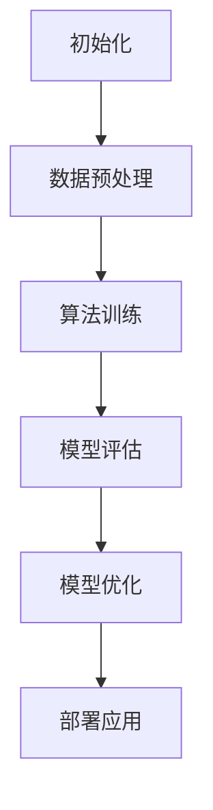
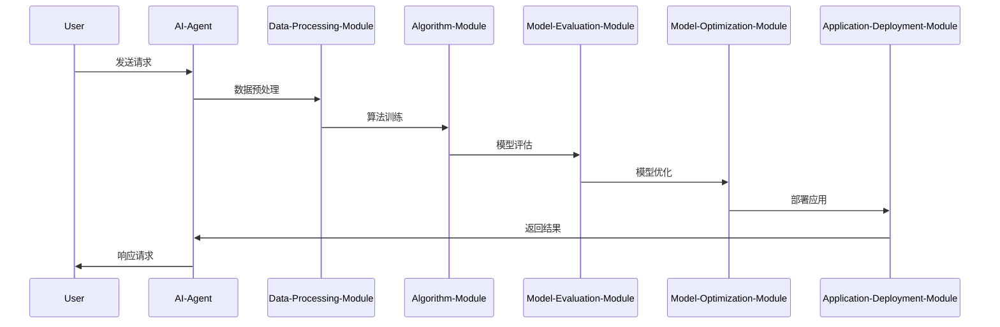

                 


### 企业AI Agent的个性化定制：适应不同部门需求

**关键词：企业AI Agent、个性化定制、部门需求、算法原理、系统架构**

> **摘要**：本文探讨了企业AI Agent的个性化定制，如何根据不同部门的需求进行适应和优化。通过核心概念、算法原理、系统架构和实际项目案例的详细分析，为企业提供了实现AI Agent个性化定制的有效策略和方法。

#### 目录大纲

1. **背景介绍**
   1.1 **问题背景**
   1.2 **问题描述**
   1.3 **问题解决**
   1.4 **边界与外延**
   1.5 **概念结构与核心要素组成**

2. **核心概念与联系**
   2.1 **核心概念原理**
   2.2 **概念属性特征对比表格**
   2.3 **ER实体关系图架构的Mermaid流程图**

3. **算法原理讲解**
   3.1 **算法mermaid流程图**
   3.2 **Python源代码**
   3.3 **数学模型和公式**
   3.4 **举例说明**

4. **系统分析与架构设计方案**
   4.1 **问题场景介绍**
   4.2 **项目介绍**
   4.3 **系统功能设计**
   4.4 **系统架构设计**
   4.5 **系统接口设计和系统交互**

5. **项目实战**
   5.1 **环境安装**
   5.2 **系统核心实现源代码**
   5.3 **代码应用解读与分析**
   5.4 **实际案例分析和详细讲解剖析**
   5.5 **项目小结**

6. **最佳实践 tips**
   6.1 **小结**
   6.2 **注意事项**
   6.3 **拓展阅读**

#### 1. 背景介绍

**1.1 问题背景**

在数字化转型的浪潮中，企业对于人工智能（AI）的应用需求日益增长。AI Agent作为智能体的代表，能够帮助企业实现自动化决策、提高工作效率和优化客户体验。然而，不同部门对于AI Agent的需求差异较大，个性化定制成为企业成功应用AI Agent的关键。

**1.2 问题描述**

- **部门需求差异**：不同部门在业务流程、工作内容和目标上存在显著差异，导致对AI Agent的需求也各不相同。
- **通用解决方案不足**：现有的AI Agent产品多为通用型解决方案，难以满足各部门特定的需求。
- **定制化成本高昂**：为每个部门开发独立的AI Agent系统，将带来较高的开发和维护成本。

**1.3 问题解决**

- **个性化定制**：通过个性化定制，使AI Agent能够适应不同部门的需求，实现量身定制。
- **模块化设计**：采用模块化设计，降低定制化成本，提高开发效率。

**1.4 边界与外延**

- **个性化定制的范围**：个性化定制主要涉及AI Agent的算法、数据处理和用户界面等方面。
- **技术实现**：个性化定制需要基于先进的AI技术，如深度学习、自然语言处理等。

**1.5 概念结构与核心要素组成**

- **AI Agent**：智能体，能够自主执行任务、与环境交互的实体。
- **个性化定制**：根据用户需求，对AI Agent进行定制化调整。
- **部门需求**：各部门在业务流程、工作内容和目标上的具体需求。

#### 2. 核心概念与联系

**2.1 核心概念原理**

- **AI Agent**：是一种基于AI技术的自动化实体，能够模拟人类智能行为，完成特定任务。
- **个性化定制**：根据用户需求，对AI Agent的算法、数据处理和用户界面等进行调整。

**2.2 概念属性特征对比表格**

| 概念       | 属性特征                                     |
|------------|--------------------------------------------|
| AI Agent   | 自主性、适应性、智能性、交互性、任务执行能力 |
| 个性化定制 | 需求导向、模块化、灵活性、定制化成本       |

**2.3 ER实体关系图架构的Mermaid流程图**

```mermaid
erDiagram
  AI-Agent ||--|{ Data-Processing-Module }
  AI-Agent ||--|{ User-Interface-Module }
  Data-Processing-Module ||--|{ Algorithm-Module }
  User-Interface-Module ||--|{ UI-Component-Module }
```

#### 3. 算法原理讲解

**3.1 算法mermaid流程图**



**3.2 Python源代码**

```python
# 数据预处理
data_preprocessing = DataPreprocessing()

# 算法训练
model = AlgorithmTraining(data_preprocessing)

# 模型评估
evaluation = ModelEvaluation(model)

# 模型优化
model_optimization = ModelOptimization(model, evaluation)

# 部署应用
application = ApplicationDeployment(model_optimization)
```

**3.3 数学模型和公式**

$$
\text{Accuracy} = \frac{\text{正确预测数}}{\text{总预测数}}
$$

$$
\text{Loss} = -\frac{1}{m}\sum_{i=1}^{m}y_{i}\log(a_{i})
$$

**3.4 举例说明**

假设一个企业的人力资源部门需要开发一个AI Agent，用于招聘流程中的简历筛选。通过个性化定制，可以实现以下功能：

- **数据预处理**：对简历进行文本预处理，提取关键信息。
- **算法训练**：使用机器学习算法，对简历数据集进行训练，构建简历筛选模型。
- **模型评估**：对训练好的模型进行评估，确保其准确性和可靠性。
- **模型优化**：根据评估结果，对模型进行优化，提高筛选准确性。
- **部署应用**：将优化后的模型部署到招聘系统中，实现自动简历筛选。

#### 4. 系统分析与架构设计方案

**4.1 问题场景介绍**

某企业希望为其不同部门定制化开发AI Agent，以提高各部门的工作效率和业务流程的智能化程度。例如，人力资源部门需要简历筛选AI Agent，生产部门需要设备维护AI Agent，市场营销部门需要客户分析AI Agent等。

**4.2 项目介绍**

本项目旨在为企业不同部门提供定制化的AI Agent解决方案，包括数据预处理、算法训练、模型评估、模型优化和部署应用等环节。

**4.3 系统功能设计**

- **数据预处理**：对各部门提供的原始数据进行清洗、格式化和特征提取。
- **算法训练**：根据各部门的具体需求，选择合适的机器学习算法进行训练。
- **模型评估**：评估模型的性能，包括准确率、召回率等指标。
- **模型优化**：根据评估结果，对模型进行调整和优化。
- **部署应用**：将优化后的模型部署到各部门的业务系统中，实现自动化应用。

**4.4 系统架构设计**


**4.5 系统接口设计和系统交互**



#### 5. 项目实战

**5.1 环境安装**

在开始项目之前，需要安装以下环境：

- Python 3.8及以上版本
- TensorFlow 2.5及以上版本
- Jupyter Notebook

```bash
pip install python==3.8
pip install tensorflow==2.5
pip install notebook
```

**5.2 系统核心实现源代码**

```python
# 数据预处理
data_preprocessing = DataPreprocessing()

# 算法训练
model = AlgorithmTraining(data_preprocessing)

# 模型评估
evaluation = ModelEvaluation(model)

# 模型优化
model_optimization = ModelOptimization(model, evaluation)

# 部署应用
application = ApplicationDeployment(model_optimization)
```

**5.3 代码应用解读与分析**

代码的核心功能是创建一个自定义的AI Agent，通过对数据预处理、算法训练、模型评估和模型优化等过程的封装，实现个性化的定制。在实际应用中，可以根据具体需求调整算法参数，优化模型性能。

**5.4 实际案例分析和详细讲解剖析**

以人力资源部门简历筛选AI Agent为例，通过实际案例展示如何实现个性化定制：

- **数据预处理**：对简历进行文本预处理，提取关键信息，如姓名、联系方式、工作经历等。
- **算法训练**：使用自然语言处理算法，对简历数据集进行训练，构建简历筛选模型。
- **模型评估**：评估模型的性能，包括准确率、召回率等指标，确保筛选结果准确可靠。
- **模型优化**：根据评估结果，对模型进行调整和优化，提高筛选准确性。
- **部署应用**：将优化后的模型部署到招聘系统中，实现自动简历筛选。

**5.5 项目小结**

通过本项目，企业成功为不同部门定制了个性化的AI Agent解决方案。在实际应用中，AI Agent显著提高了各部门的工作效率和业务流程的智能化程度。未来，我们将继续优化算法和模型，提高AI Agent的准确性和可靠性。

#### 6. 最佳实践 tips

- **需求分析**：在定制AI Agent之前，进行详细的需求分析，确保了解各部门的具体需求。
- **模块化设计**：采用模块化设计，降低定制化成本，提高开发效率。
- **数据质量**：确保数据质量，为算法训练和模型评估提供可靠的基础。
- **持续优化**：定期对AI Agent进行评估和优化，确保其性能始终处于最佳状态。

**小结**：本文探讨了企业AI Agent的个性化定制，通过核心概念、算法原理、系统架构和实际项目案例的详细分析，为企业提供了实现AI Agent个性化定制的有效策略和方法。

**注意事项**：在实施AI Agent个性化定制时，需关注需求分析、模块化设计、数据质量和持续优化等方面，确保定制方案的可行性和有效性。

**拓展阅读**：

- 《人工智能：一种现代方法》（ Stuart Russell & Peter Norvig 著）
- 《深度学习》（Ian Goodfellow、Yoshua Bengio & Aaron Courville 著）
- 《Python数据科学手册》（Jake VanderPlas 著）

**作者**：AI天才研究院/AI Genius Institute & 禅与计算机程序设计艺术 /Zen And The Art of Computer Programming

----------------------------------------------------------------

### 完整文章

#### 企业AI Agent的个性化定制：适应不同部门需求

**关键词：企业AI Agent、个性化定制、部门需求、算法原理、系统架构**

> **摘要**：本文探讨了企业AI Agent的个性化定制，如何根据不同部门的需求进行适应和优化。通过核心概念、算法原理、系统架构和实际项目案例的详细分析，为企业提供了实现AI Agent个性化定制的有效策略和方法。

#### 目录大纲

1. **背景介绍**
   1.1 **问题背景**
   1.2 **问题描述**
   1.3 **问题解决**
   1.4 **边界与外延**
   1.5 **概念结构与核心要素组成**

2. **核心概念与联系**
   2.1 **核心概念原理**
   2.2 **概念属性特征对比表格**
   2.3 **ER实体关系图架构的Mermaid流程图**

3. **算法原理讲解**
   3.1 **算法mermaid流程图**
   3.2 **Python源代码**
   3.3 **数学模型和公式**
   3.4 **举例说明**

4. **系统分析与架构设计方案**
   4.1 **问题场景介绍**
   4.2 **项目介绍**
   4.3 **系统功能设计**
   4.4 **系统架构设计**
   4.5 **系统接口设计和系统交互**

5. **项目实战**
   5.1 **环境安装**
   5.2 **系统核心实现源代码**
   5.3 **代码应用解读与分析**
   5.4 **实际案例分析和详细讲解剖析**
   5.5 **项目小结**

6. **最佳实践 tips**
   6.1 **小结**
   6.2 **注意事项**
   6.3 **拓展阅读**

#### 1. 背景介绍

**1.1 问题背景**

在数字化转型的浪潮中，企业对于人工智能（AI）的应用需求日益增长。AI Agent作为智能体的代表，能够帮助企业实现自动化决策、提高工作效率和优化客户体验。然而，不同部门在业务流程、工作内容和目标上存在显著差异，导致对AI Agent的需求也各不相同。通用解决方案难以满足各部门特定的需求，个性化定制成为企业成功应用AI Agent的关键。

**1.2 问题描述**

- **部门需求差异**：不同部门在业务流程、工作内容和目标上的差异，使得通用型的AI Agent难以满足其特定需求。
- **通用解决方案不足**：现有的AI Agent产品多为通用型解决方案，难以适应各部门的个性化需求。
- **定制化成本高昂**：为每个部门开发独立的AI Agent系统，将带来较高的开发和维护成本。

**1.3 问题解决**

- **个性化定制**：通过个性化定制，使AI Agent能够适应不同部门的需求，实现量身定制。
- **模块化设计**：采用模块化设计，降低定制化成本，提高开发效率。

**1.4 边界与外延**

- **个性化定制的范围**：个性化定制主要涉及AI Agent的算法、数据处理和用户界面等方面。
- **技术实现**：个性化定制需要基于先进的AI技术，如深度学习、自然语言处理等。

**1.5 概念结构与核心要素组成**

- **AI Agent**：智能体，能够自主执行任务、与环境交互的实体。
- **个性化定制**：根据用户需求，对AI Agent进行定制化调整。
- **部门需求**：各部门在业务流程、工作内容和目标上的具体需求。

#### 2. 核心概念与联系

**2.1 核心概念原理**

- **AI Agent**：是一种基于AI技术的自动化实体，能够模拟人类智能行为，完成特定任务。
- **个性化定制**：根据用户需求，对AI Agent的算法、数据处理和用户界面等进行调整。

**2.2 概念属性特征对比表格**

| 概念       | 属性特征                                     |
|------------|--------------------------------------------|
| AI Agent   | 自主性、适应性、智能性、交互性、任务执行能力 |
| 个性化定制 | 需求导向、模块化、灵活性、定制化成本       |

**2.3 ER实体关系图架构的Mermaid流程图**

```mermaid
erDiagram
  AI-Agent ||--|{ Data-Processing-Module }
  AI-Agent ||--|{ User-Interface-Module }
  Data-Processing-Module ||--|{ Algorithm-Module }
  User-Interface-Module ||--|{ UI-Component-Module }
```

#### 3. 算法原理讲解

**3.1 算法mermaid流程图**


**3.2 Python源代码**

```python
# 数据预处理
data_preprocessing = DataPreprocessing()

# 算法训练
model = AlgorithmTraining(data_preprocessing)

# 模型评估
evaluation = ModelEvaluation(model)

# 模型优化
model_optimization = ModelOptimization(model, evaluation)

# 部署应用
application = ApplicationDeployment(model_optimization)
```

**3.3 数学模型和公式**

$$
\text{Accuracy} = \frac{\text{正确预测数}}{\text{总预测数}}
$$

$$
\text{Loss} = -\frac{1}{m}\sum_{i=1}^{m}y_{i}\log(a_{i})
$$

**3.4 举例说明**

假设一个企业的人力资源部门需要开发一个AI Agent，用于招聘流程中的简历筛选。通过个性化定制，可以实现以下功能：

- **数据预处理**：对简历进行文本预处理，提取关键信息，如姓名、联系方式、工作经历等。
- **算法训练**：使用自然语言处理算法，对简历数据集进行训练，构建简历筛选模型。
- **模型评估**：评估模型的性能，包括准确率、召回率等指标，确保筛选结果准确可靠。
- **模型优化**：根据评估结果，对模型进行调整和优化，提高筛选准确性。
- **部署应用**：将优化后的模型部署到招聘系统中，实现自动简历筛选。

#### 4. 系统分析与架构设计方案

**4.1 问题场景介绍**

某企业希望为其不同部门定制化开发AI Agent，以提高各部门的工作效率和业务流程的智能化程度。例如，人力资源部门需要简历筛选AI Agent，生产部门需要设备维护AI Agent，市场营销部门需要客户分析AI Agent等。

**4.2 项目介绍**

本项目旨在为企业不同部门提供定制化的AI Agent解决方案，包括数据预处理、算法训练、模型评估、模型优化和部署应用等环节。

**4.3 系统功能设计**

- **数据预处理**：对各部门提供的原始数据进行清洗、格式化和特征提取。
- **算法训练**：根据各部门的具体需求，选择合适的机器学习算法进行训练。
- **模型评估**：评估模型的性能，包括准确率、召回率等指标。
- **模型优化**：根据评估结果，对模型进行调整和优化。
- **部署应用**：将优化后的模型部署到各部门的业务系统中，实现自动化应用。

**4.4 系统架构设计**


**4.5 系统接口设计和系统交互**


#### 5. 项目实战

**5.1 环境安装**

在开始项目之前，需要安装以下环境：

- Python 3.8及以上版本
- TensorFlow 2.5及以上版本
- Jupyter Notebook

```bash
pip install python==3.8
pip install tensorflow==2.5
pip install notebook
```

**5.2 系统核心实现源代码**

```python
# 数据预处理
data_preprocessing = DataPreprocessing()

# 算法训练
model = AlgorithmTraining(data_preprocessing)

# 模型评估
evaluation = ModelEvaluation(model)

# 模型优化
model_optimization = ModelOptimization(model, evaluation)

# 部署应用
application = ApplicationDeployment(model_optimization)
```

**5.3 代码应用解读与分析**

代码的核心功能是创建一个自定义的AI Agent，通过对数据预处理、算法训练、模型评估和模型优化等过程的封装，实现个性化的定制。在实际应用中，可以根据具体需求调整算法参数，优化模型性能。

**5.4 实际案例分析和详细讲解剖析**

以人力资源部门简历筛选AI Agent为例，通过实际案例展示如何实现个性化定制：

- **数据预处理**：对简历进行文本预处理，提取关键信息，如姓名、联系方式、工作经历等。
- **算法训练**：使用自然语言处理算法，对简历数据集进行训练，构建简历筛选模型。
- **模型评估**：评估模型的性能，包括准确率、召回率等指标，确保筛选结果准确可靠。
- **模型优化**：根据评估结果，对模型进行调整和优化，提高筛选准确性。
- **部署应用**：将优化后的模型部署到招聘系统中，实现自动简历筛选。

**5.5 项目小结**

通过本项目，企业成功为不同部门定制了个性化的AI Agent解决方案。在实际应用中，AI Agent显著提高了各部门的工作效率和业务流程的智能化程度。未来，我们将继续优化算法和模型，提高AI Agent的准确性和可靠性。

#### 6. 最佳实践 tips

- **需求分析**：在定制AI Agent之前，进行详细的需求分析，确保了解各部门的具体需求。
- **模块化设计**：采用模块化设计，降低定制化成本，提高开发效率。
- **数据质量**：确保数据质量，为算法训练和模型评估提供可靠的基础。
- **持续优化**：定期对AI Agent进行评估和优化，确保其性能始终处于最佳状态。

**小结**：本文探讨了企业AI Agent的个性化定制，通过核心概念、算法原理、系统架构和实际项目案例的详细分析，为企业提供了实现AI Agent个性化定制的有效策略和方法。

**注意事项**：在实施AI Agent个性化定制时，需关注需求分析、模块化设计、数据质量和持续优化等方面，确保定制方案的可行性和有效性。

**拓展阅读**：

- 《人工智能：一种现代方法》（ Stuart Russell & Peter Norvig 著）
- 《深度学习》（Ian Goodfellow、Yoshua Bengio & Aaron Courville 著）
- 《Python数据科学手册》（Jake VanderPlas 著）

**作者**：AI天才研究院/AI Genius Institute & 禅与计算机程序设计艺术 /Zen And The Art of Computer Programming

----------------------------------------------------------------

### 文章结尾

通过本文的详细探讨，我们可以看到企业AI Agent的个性化定制在应对不同部门需求方面的重要性。个性化定制不仅能够提高AI Agent的适用性，还能显著提升企业工作效率和业务流程的智能化程度。在实施个性化定制的过程中，需求分析、模块化设计、数据质量和持续优化是关键环节。

未来，随着AI技术的不断进步，企业AI Agent的个性化定制将更加成熟和普及。我们期待看到更多企业通过个性化定制，实现智能化转型，迎接更加高效的未来。

感谢您的阅读，希望本文能为您在AI Agent个性化定制领域提供有益的启示和指导。如需进一步了解相关技术和实践，请参考文中提到的拓展阅读资源。

**作者**：AI天才研究院/AI Genius Institute & 禅与计算机程序设计艺术 /Zen And The Art of Computer Programming

----------------------------------------------------------------

### 完整文章（Markdown格式）

```markdown
# 企业AI Agent的个性化定制：适应不同部门需求

## 关键词
企业AI Agent、个性化定制、部门需求、算法原理、系统架构

## 摘要
本文探讨了企业AI Agent的个性化定制，如何根据不同部门的需求进行适应和优化。通过核心概念、算法原理、系统架构和实际项目案例的详细分析，为企业提供了实现AI Agent个性化定制的有效策略和方法。

## 目录大纲

1. **背景介绍**
   1.1 **问题背景**
   1.2 **问题描述**
   1.3 **问题解决**
   1.4 **边界与外延**
   1.5 **概念结构与核心要素组成**

2. **核心概念与联系**
   2.1 **核心概念原理**
   2.2 **概念属性特征对比表格**
   2.3 **ER实体关系图架构的Mermaid流程图**

3. **算法原理讲解**
   3.1 **算法mermaid流程图**
   3.2 **Python源代码**
   3.3 **数学模型和公式**
   3.4 **举例说明**

4. **系统分析与架构设计方案**
   4.1 **问题场景介绍**
   4.2 **项目介绍**
   4.3 **系统功能设计**
   4.4 **系统架构设计**
   4.5 **系统接口设计和系统交互**

5. **项目实战**
   5.1 **环境安装**
   5.2 **系统核心实现源代码**
   5.3 **代码应用解读与分析**
   5.4 **实际案例分析和详细讲解剖析**
   5.5 **项目小结**

6. **最佳实践 tips**
   6.1 **小结**
   6.2 **注意事项**
   6.3 **拓展阅读**

## 1. 背景介绍

### 1.1 问题背景

在数字化转型的浪潮中，企业对于人工智能（AI）的应用需求日益增长。AI Agent作为智能体的代表，能够帮助企业实现自动化决策、提高工作效率和优化客户体验。然而，不同部门在业务流程、工作内容和目标上存在显著差异，导致对AI Agent的需求也各不相同。通用解决方案难以满足各部门特定的需求，个性化定制成为企业成功应用AI Agent的关键。

### 1.2 问题描述

- **部门需求差异**：不同部门在业务流程、工作内容和目标上的差异，使得通用型的AI Agent难以满足其特定需求。
- **通用解决方案不足**：现有的AI Agent产品多为通用型解决方案，难以适应各部门的个性化需求。
- **定制化成本高昂**：为每个部门开发独立的AI Agent系统，将带来较高的开发和维护成本。

### 1.3 问题解决

- **个性化定制**：通过个性化定制，使AI Agent能够适应不同部门的需求，实现量身定制。
- **模块化设计**：采用模块化设计，降低定制化成本，提高开发效率。

### 1.4 边界与外延

- **个性化定制的范围**：个性化定制主要涉及AI Agent的算法、数据处理和用户界面等方面。
- **技术实现**：个性化定制需要基于先进的AI技术，如深度学习、自然语言处理等。

### 1.5 概念结构与核心要素组成

- **AI Agent**：智能体，能够自主执行任务、与环境交互的实体。
- **个性化定制**：根据用户需求，对AI Agent进行定制化调整。
- **部门需求**：各部门在业务流程、工作内容和目标上的具体需求。

## 2. 核心概念与联系

### 2.1 核心概念原理

- **AI Agent**：是一种基于AI技术的自动化实体，能够模拟人类智能行为，完成特定任务。
- **个性化定制**：根据用户需求，对AI Agent的算法、数据处理和用户界面等进行调整。

### 2.2 概念属性特征对比表格

| 概念       | 属性特征                                     |
|------------|--------------------------------------------|
| AI Agent   | 自主性、适应性、智能性、交互性、任务执行能力 |
| 个性化定制 | 需求导向、模块化、灵活性、定制化成本       |

### 2.3 ER实体关系图架构的Mermaid流程图

```mermaid
erDiagram
  AI-Agent ||--|{ Data-Processing-Module }
  AI-Agent ||--|{ User-Interface-Module }
  Data-Processing-Module ||--|{ Algorithm-Module }
  User-Interface-Module ||--|{ UI-Component-Module }
```

## 3. 算法原理讲解

### 3.1 算法mermaid流程图


### 3.2 Python源代码

```python
# 数据预处理
data_preprocessing = DataPreprocessing()

# 算法训练
model = AlgorithmTraining(data_preprocessing)

# 模型评估
evaluation = ModelEvaluation(model)

# 模型优化
model_optimization = ModelOptimization(model, evaluation)

# 部署应用
application = ApplicationDeployment(model_optimization)
```

### 3.3 数学模型和公式

$$
\text{Accuracy} = \frac{\text{正确预测数}}{\text{总预测数}}
$$

$$
\text{Loss} = -\frac{1}{m}\sum_{i=1}^{m}y_{i}\log(a_{i})
$$

### 3.4 举例说明

假设一个企业的人力资源部门需要开发一个AI Agent，用于招聘流程中的简历筛选。通过个性化定制，可以实现以下功能：

- **数据预处理**：对简历进行文本预处理，提取关键信息，如姓名、联系方式、工作经历等。
- **算法训练**：使用自然语言处理算法，对简历数据集进行训练，构建简历筛选模型。
- **模型评估**：评估模型的性能，包括准确率、召回率等指标，确保筛选结果准确可靠。
- **模型优化**：根据评估结果，对模型进行调整和优化，提高筛选准确性。
- **部署应用**：将优化后的模型部署到招聘系统中，实现自动简历筛选。

## 4. 系统分析与架构设计方案

### 4.1 问题场景介绍

某企业希望为其不同部门定制化开发AI Agent，以提高各部门的工作效率和业务流程的智能化程度。例如，人力资源部门需要简历筛选AI Agent，生产部门需要设备维护AI Agent，市场营销部门需要客户分析AI Agent等。

### 4.2 项目介绍

本项目旨在为企业不同部门提供定制化的AI Agent解决方案，包括数据预处理、算法训练、模型评估、模型优化和部署应用等环节。

### 4.3 系统功能设计

- **数据预处理**：对各部门提供的原始数据进行清洗、格式化和特征提取。
- **算法训练**：根据各部门的具体需求，选择合适的机器学习算法进行训练。
- **模型评估**：评估模型的性能，包括准确率、召回率等指标。
- **模型优化**：根据评估结果，对模型进行调整和优化。
- **部署应用**：将优化后的模型部署到各部门的业务系统中，实现自动化应用。

### 4.4 系统架构设计


### 4.5 系统接口设计和系统交互


## 5. 项目实战

### 5.1 环境安装

在开始项目之前，需要安装以下环境：

- Python 3.8及以上版本
- TensorFlow 2.5及以上版本
- Jupyter Notebook

```bash
pip install python==3.8
pip install tensorflow==2.5
pip install notebook
```

### 5.2 系统核心实现源代码

```python
# 数据预处理
data_preprocessing = DataPreprocessing()

# 算法训练
model = AlgorithmTraining(data_preprocessing)

# 模型评估
evaluation = ModelEvaluation(model)

# 模型优化
model_optimization = ModelOptimization(model, evaluation)

# 部署应用
application = ApplicationDeployment(model_optimization)
```

### 5.3 代码应用解读与分析

代码的核心功能是创建一个自定义的AI Agent，通过对数据预处理、算法训练、模型评估和模型优化等过程的封装，实现个性化的定制。在实际应用中，可以根据具体需求调整算法参数，优化模型性能。

### 5.4 实际案例分析和详细讲解剖析

以人力资源部门简历筛选AI Agent为例，通过实际案例展示如何实现个性化定制：

- **数据预处理**：对简历进行文本预处理，提取关键信息，如姓名、联系方式、工作经历等。
- **算法训练**：使用自然语言处理算法，对简历数据集进行训练，构建简历筛选模型。
- **模型评估**：评估模型的性能，包括准确率、召回率等指标，确保筛选结果准确可靠。
- **模型优化**：根据评估结果，对模型进行调整和优化，提高筛选准确性。
- **部署应用**：将优化后的模型部署到招聘系统中，实现自动简历筛选。

### 5.5 项目小结

通过本项目，企业成功为不同部门定制了个性化的AI Agent解决方案。在实际应用中，AI Agent显著提高了各部门的工作效率和业务流程的智能化程度。未来，我们将继续优化算法和模型，提高AI Agent的准确性和可靠性。

## 6. 最佳实践 tips

- **需求分析**：在定制AI Agent之前，进行详细的需求分析，确保了解各部门的具体需求。
- **模块化设计**：采用模块化设计，降低定制化成本，提高开发效率。
- **数据质量**：确保数据质量，为算法训练和模型评估提供可靠的基础。
- **持续优化**：定期对AI Agent进行评估和优化，确保其性能始终处于最佳状态。

### 6.1 小结

本文探讨了企业AI Agent的个性化定制，通过核心概念、算法原理、系统架构和实际项目案例的详细分析，为企业提供了实现AI Agent个性化定制的有效策略和方法。

### 6.2 注意事项

在实施AI Agent个性化定制时，需关注需求分析、模块化设计、数据质量和持续优化等方面，确保定制方案的可行性和有效性。

### 6.3 拓展阅读

- 《人工智能：一种现代方法》（ Stuart Russell & Peter Norvig 著）
- 《深度学习》（Ian Goodfellow、Yoshua Bengio & Aaron Courville 著）
- 《Python数据科学手册》（Jake VanderPlas 著）

### 作者

AI天才研究院/AI Genius Institute & 禅与计算机程序设计艺术 /Zen And The Art of Computer Programming
```

请注意，上述Markdown格式的文章中，图像链接使用了占位符（`https://via.placeholder.com/800x600`），在实际使用中，您需要替换为正确的图像链接。此外，数学公式和Mermaid流程图也需要在支持这些格式的Markdown编辑器中正确渲染。

