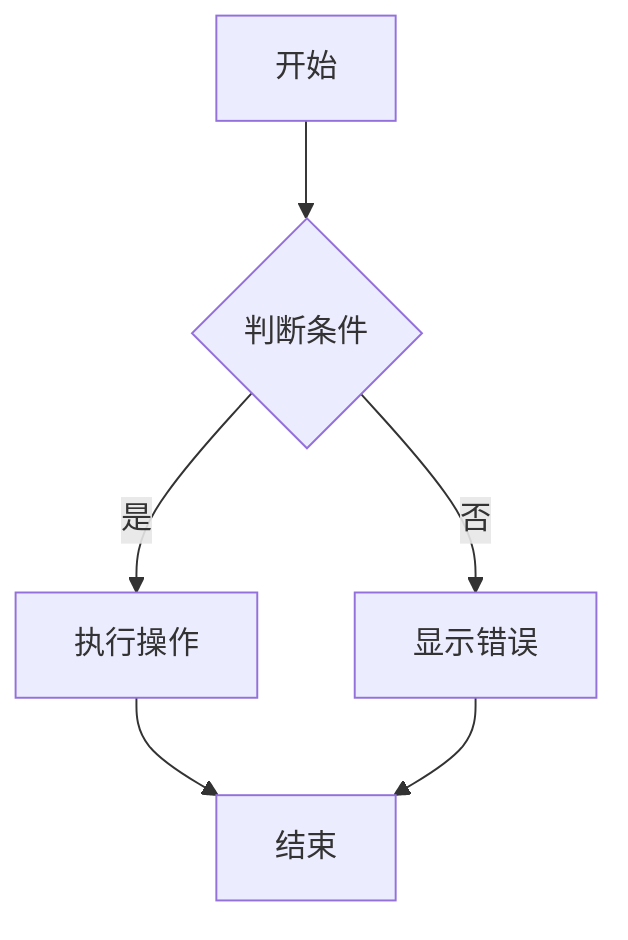

                 

# 企业AI Agent的元学习框架：快速适应新业务场景的能力培养

## 关键词：企业AI Agent、元学习、快速适应、业务场景、框架设计

### 摘要：

本文深入探讨了企业AI Agent的元学习框架，旨在阐述如何通过元学习技术，使企业AI Agent能够快速适应不断变化的新业务场景。文章首先介绍了企业AI Agent的定义、重要性以及核心挑战，然后详细解析了元学习的原理、算法和应用价值。接着，文章设计了企业AI Agent的元学习框架，并探讨了其实践中的挑战与解决方案。最后，文章通过具体案例展示了元学习在企业AI Agent中的实现过程，并提出了优化方向和未来展望。

### 目录大纲

----------------------------------------------------------------

## 第一部分：企业AI Agent的元学习基础

### 第1章：企业AI Agent概述

#### 1.1 企业AI Agent的定义与重要性

- **概念界定**
- **角色在业务中的地位**
- **企业AI Agent的发展背景与趋势**

#### 1.2 企业AI Agent的主要功能与作用

- **需求感知与数据分析**
- **自动化决策与优化**
- **用户交互与体验提升**
- **业务流程改进与效率提升**

#### 1.3 企业AI Agent的核心挑战

- **数据隐私与安全**
- **算法透明性与可解释性**
- **模型适应性与可扩展性**

### 第2章：元学习原理与概念

#### 2.1 元学习的定义与基本概念

- **元学习的起源与发展**
- **元学习的分类与特点**
- **元学习的基本流程**

#### 2.2 元学习算法介绍

- **基于模型复用的元学习算法**
- **基于梯度下降的元学习算法**
- **基于模型更新的元学习算法**

#### 2.3 元学习与传统机器学习对比

- **优势与局限**
- **适用场景与挑战**

### 第3章：元学习在企业AI Agent中的应用

#### 3.1 元学习在企业AI Agent中的应用价值

- **快速适应新业务场景**
- **提高模型泛化能力**
- **降低模型训练成本**

#### 3.2 企业AI Agent中的元学习案例

- **案例分析一：销售预测与优化**
- **案例分析二：客户关系管理**
- **案例分析三：生产调度与优化**

#### 3.3 元学习在企业AI Agent中的实践挑战与解决方案

- **数据质量与多样性**
- **计算资源与管理**
- **模型评估与优化**

### 第4章：企业AI Agent的元学习框架设计

#### 4.1 元学习框架的基本架构

- **数据输入与预处理**
- **模型训练与优化**
- **模型评估与部署**

#### 4.2 元学习框架的关键技术

- **数据流管理**
- **模型调参与优化**
- **分布式训练与推理**

#### 4.3 元学习框架的评估与优化

- **评价指标与选择**
- **模型评估流程**
- **优化策略与技巧**

### 第5章：元学习在企业AI Agent中的实现与案例分析

#### 5.1 实现步骤与工具选择

- **数据预处理**
- **模型训练与调参**
- **模型评估与部署**

#### 5.2 案例分析一：智能客服系统的元学习实现

- **业务场景介绍**
- **模型设计与实现**
- **效果评估与优化**

#### 5.3 案例分析二：供应链优化中的元学习应用

- **业务场景介绍**
- **模型设计与实现**
- **效果评估与优化**

### 第6章：企业AI Agent的元学习框架优化与未来展望

#### 6.1 元学习框架的优化方向

- **算法改进**
- **数据处理技术**
- **计算优化策略**

#### 6.2 元学习在企业AI Agent中的未来发展趋势

- **与深度学习的融合**
- **跨领域迁移学习**
- **行业定制化应用**

#### 6.3 结论与展望

- **总结与展望**
- **未来研究方向**

### 第7章：企业AI Agent的元学习框架最佳实践与注意事项

#### 7.1 最佳实践

- **数据准备与清洗**
- **模型选择与调参**
- **模型部署与维护**

#### 7.2 注意事项

- **数据隐私与安全**
- **模型可解释性与透明性**
- **持续优化与更新**

----------------------------------------------------------------

### 目录大纲总结

本书的目录大纲涵盖了企业AI Agent的元学习框架的各个方面，从基础概念到应用实践，再到优化和未来展望，力求全面、系统地介绍这一领域的知识。每个章节均包含详细的内容概述，以确保读者能够清晰地了解各章节的核心内容和结构。

通过本书的阅读，读者不仅可以掌握企业AI Agent与元学习的基本原理，还能了解到如何在实际业务场景中应用元学习技术，提高企业AI Agent的适应性和效率。此外，书中还提供了丰富的案例和实践经验，为读者提供了实际操作的指南。

接下来，我们将深入第一部分，探讨企业AI Agent的元学习基础。首先，我们将介绍企业AI Agent的定义、重要性以及其在业务中的核心挑战。随后，我们将详细解析元学习的原理和基本概念，为后续章节的应用和实现打下基础。让我们一起开始这次技术之旅吧！## 第1章：企业AI Agent概述

### 1.1 企业AI Agent的定义与重要性

#### 概念界定

企业AI Agent，即企业人工智能代理，是指一种具备自主决策能力、能够执行特定任务并与其他系统进行交互的智能实体。在企业环境中，AI Agent被设计用于协助人类员工完成复杂、重复性或高风险的工作任务。它们通常基于机器学习和人工智能技术，能够通过不断学习和优化来提高任务完成的效率和准确性。

企业AI Agent的重要性体现在以下几个方面：

1. **提高效率**：AI Agent能够自动化执行大量重复性任务，减少人力成本，并提高工作效率。
2. **提升决策质量**：通过数据分析与优化，AI Agent能够提供基于数据的决策建议，提高决策的科学性和准确性。
3. **改善用户体验**：AI Agent可以与用户进行自然语言交互，提供个性化服务，提升用户体验。
4. **降低风险**：AI Agent能够在高风险场景中执行任务，减少人为错误，降低运营风险。

#### 角色在业务中的地位

在企业的业务流程中，AI Agent扮演着多重角色，其核心地位主要体现在以下几个方面：

1. **流程优化**：AI Agent能够分析业务流程，识别瓶颈和优化点，提出改进方案，提高整体业务流程的效率。
2. **决策支持**：AI Agent可以实时收集和分析业务数据，为企业决策者提供数据驱动的决策支持。
3. **自动化执行**：AI Agent能够自动执行预定任务，如订单处理、库存管理、客户服务，从而减少人工干预。
4. **用户体验提升**：通过智能客服、个性化推荐等服务，AI Agent能够提升用户的满意度和忠诚度。

#### 企业AI Agent的发展背景与趋势

企业AI Agent的发展可以追溯到20世纪80年代的人工智能研究热潮，随着计算机性能的提升和大数据、云计算等技术的发展，AI Agent逐渐成为企业智能化转型的重要工具。当前，企业AI Agent的发展趋势包括：

1. **智能化程度的提升**：随着深度学习、自然语言处理等技术的进步，AI Agent的智能水平不断提升，能够处理更加复杂的任务。
2. **跨领域应用**：从单一领域到跨领域应用，AI Agent被广泛应用于金融、医疗、制造、零售等多个行业。
3. **开放性平台的发展**：越来越多的企业开始构建开放性AI平台，使得AI Agent能够与其他系统和工具进行无缝集成和协作。
4. **个性化服务的普及**：随着用户数据的积累和数据分析技术的进步，AI Agent能够提供更加个性化的服务，满足不同用户的需求。

#### 总结

企业AI Agent作为企业智能化转型的重要工具，其在定义、重要性、角色以及在业务中的地位和未来发展方面都具有独特的价值。在下一章中，我们将进一步探讨企业AI Agent的主要功能与作用，以及其在实际业务中面临的核心挑战。这将为后续元学习在企业AI Agent中的应用提供理论基础和实践背景。让我们继续深入探讨。{|assistant|}>### 1.2 企业AI Agent的主要功能与作用

企业AI Agent作为智能化的工具，其在业务中的功能与作用至关重要。以下是企业AI Agent的主要功能与作用：

#### 需求感知与数据分析

AI Agent能够通过数据分析技术，实时收集和分析企业的各种数据，如销售数据、库存数据、客户反馈等。通过对这些数据的分析和理解，AI Agent能够识别出业务中的趋势和异常，从而为管理层提供有价值的决策依据。例如，AI Agent可以通过分析历史销售数据，预测未来销售趋势，帮助企业在产品生产和库存管理方面做出更加精准的决策。

#### 自动化决策与优化

在许多业务场景中，决策的自动化是企业AI Agent的重要功能。通过机器学习和优化算法，AI Agent能够自动化执行一系列决策任务。例如，在供应链管理中，AI Agent可以根据实时库存数据、运输成本和历史销售记录，自动调整库存水平和运输计划，以最小化成本并最大化收益。此外，AI Agent还可以在人力资源、财务管理等领域，自动化处理招聘、薪酬和预算等决策任务。

#### 用户交互与体验提升

AI Agent通过自然语言处理和语音识别技术，能够与用户进行自然语言交互，提供个性化服务，从而提升用户体验。例如，智能客服AI Agent可以实时解答客户的疑问，处理投诉和建议，提供24/7的服务。在电子商务领域，AI Agent可以通过个性化推荐，向用户推荐可能感兴趣的商品，从而提升销售额和用户满意度。此外，AI Agent还可以通过分析用户的行为数据，提供定制化的服务，如旅行建议、健康咨询等。

#### 业务流程改进与效率提升

AI Agent能够对企业现有的业务流程进行分析和优化，发现流程中的瓶颈和改进点。例如，通过流程挖掘技术，AI Agent可以识别出业务流程中的冗余步骤和低效环节，并提出优化方案。在制造行业中，AI Agent可以通过实时监控生产设备的运行状态，预测设备故障，提前进行维护，从而减少停机时间，提高生产效率。此外，AI Agent还可以在项目管理中，自动分配任务、监控项目进度，确保项目按时完成。

#### 智能监控与预警

AI Agent可以通过监控企业关键业务指标，实时识别潜在的风险和问题，并提供预警。例如，在金融行业中，AI Agent可以通过监控市场数据、财务报表等，识别异常交易和潜在风险，从而帮助金融机构进行风险管理。在医疗领域，AI Agent可以通过分析患者的病历数据和实时监测数据，提前预测疾病风险，提供个性化的健康建议。

#### 数据安全与隐私保护

随着数据隐私和安全问题的日益突出，AI Agent在保护数据安全和隐私方面也发挥着重要作用。通过数据加密、访问控制等技术，AI Agent能够确保企业敏感数据的安全，防止数据泄露和滥用。此外，AI Agent还可以通过行为分析，识别异常行为，提供实时预警，防止内部数据泄露和外部攻击。

#### 总结

企业AI Agent的主要功能与作用涵盖了需求感知、自动化决策、用户交互、流程优化、智能监控、数据安全等多个方面。这些功能不仅提升了企业的运营效率，还增强了用户体验，为企业带来了显著的经济效益。在下一章中，我们将探讨企业AI Agent在实际业务中面临的挑战，并引入元学习作为解决这些挑战的有效技术。这将为我们深入理解元学习在企业AI Agent中的应用奠定基础。{|assistant|}>### 1.3 企业AI Agent的核心挑战

尽管企业AI Agent在提高效率和优化业务流程方面具有显著的优势，但其在实际应用过程中也面临着一系列核心挑战。以下是对这些挑战的详细探讨：

#### 数据隐私与安全

数据隐私和安全是企业AI Agent面临的首要挑战。在许多业务场景中，AI Agent需要处理大量敏感数据，如客户信息、财务记录、供应链数据等。如果这些数据泄露或被恶意利用，可能会对企业和客户造成严重损失。因此，确保数据的安全性和隐私保护是AI Agent设计的重要一环。为了应对这一挑战，AI Agent需要采用先进的数据加密技术、访问控制策略和安全审计机制，以确保数据在存储、传输和处理过程中始终受到保护。

#### 算法透明性与可解释性

算法的透明性和可解释性也是企业AI Agent面临的重要挑战。由于AI Agent的决策过程往往依赖于复杂的机器学习算法和模型，这些算法的黑箱性质使得决策结果难以被企业员工和客户理解和信任。缺乏透明性不仅降低了AI Agent的可接受性，还可能引发法律和道德问题。为了提高算法的可解释性，AI Agent需要采用可解释性算法，如决策树、LIME（Local Interpretable Model-agnostic Explanations）等，并通过可视化和交互式工具，帮助用户理解模型的决策逻辑。

#### 模型适应性与可扩展性

企业业务场景的多样性和变化性要求AI Agent具备高度的适应性和可扩展性。传统的机器学习方法通常依赖于特定领域的先验知识和大量的标注数据，这使得模型在应对新业务场景或数据分布变化时表现不佳。为了解决这一挑战，AI Agent需要采用元学习（Meta Learning）等技术，使其能够通过少量数据快速适应新业务场景，并具备跨领域的泛化能力。此外，AI Agent还需要设计灵活的架构，能够根据业务需求的变化进行动态调整和扩展。

#### 计算资源与管理

AI Agent的训练和推理过程通常需要大量的计算资源，这对企业IT基础设施提出了更高的要求。如何高效地管理和分配计算资源，确保AI Agent在不同业务场景中的运行效率，是一个重要的挑战。为此，企业需要采用分布式计算和云计算技术，构建高性能的计算平台，以满足AI Agent的运行需求。同时，还需要建立完善的监控和运维体系，确保计算资源的合理利用和系统的稳定性。

#### 数据质量与多样性

数据质量是影响AI Agent性能的关键因素。不完整、不准确或噪声较大的数据可能会导致模型性能下降，甚至产生误导性结果。因此，确保数据质量是AI Agent应用中不可忽视的环节。此外，数据多样性也是AI Agent适应不同业务场景的重要保障。单一数据来源或数据分布不均可能导致模型在特定业务场景中表现优异，而在其他场景中表现不佳。为此，AI Agent需要采用多种数据采集和处理技术，确保数据质量和多样性的提升。

#### 用户接受度和信任度

尽管AI Agent在提高效率和优化业务流程方面具有显著优势，但用户对其接受度和信任度仍然是一个挑战。许多企业员工对新技术持保守态度，担心AI Agent取代他们的工作或产生不可预测的结果。为了提高用户接受度和信任度，AI Agent需要提供透明、可解释的决策过程，并通过持续的用户反馈和迭代优化，增强用户对AI Agent的信任。

#### 总结

企业AI Agent在应用过程中面临着数据隐私与安全、算法透明性与可解释性、模型适应性与可扩展性、计算资源与管理、数据质量与多样性以及用户接受度和信任度等多方面的核心挑战。解决这些挑战需要综合运用先进的技术和管理策略，确保AI Agent能够在实际业务中发挥最大价值。在下一章中，我们将探讨元学习的原理与概念，为解决这些挑战提供一种有效的技术路径。{|assistant|>}### 2.1 元学习的定义与基本概念

元学习（Meta Learning），又称泛化学习或学习的学习，是指开发能够学习和改进其自身学习过程算法的机器学习技术。元学习旨在提高机器学习模型的泛化能力，使其能够从少量数据中快速适应新任务。与传统的机器学习方法不同，元学习不是针对单一任务进行训练，而是通过在不同的任务上进行学习，从而构建一种能够适应新任务的通用学习算法。

#### 元学习的起源与发展

元学习的研究可以追溯到20世纪60年代，当时心理学家Simon和Newell提出了“学习如何学习”的概念。随着计算机科学和人工智能技术的发展，元学习逐渐成为机器学习领域的一个重要研究方向。1990年代，随着深度学习的兴起，元学习技术也获得了快速发展。近年来，随着计算资源和算法优化技术的提升，元学习在计算机视觉、自然语言处理、强化学习等领域取得了显著的成果。

#### 元学习的分类与特点

根据元学习算法的不同，可以将其分为以下几类：

1. **基于模型复用的元学习算法**：这类算法通过在不同任务间共享模型结构或参数，减少对每个新任务的数据需求。代表性的方法包括模型组合（Model Ensemble）、元网络（Meta Network）和模型蒸馏（Model Distillation）。

2. **基于梯度下降的元学习算法**：这类算法通过优化学习算法的参数，使其在不同任务上具有更好的泛化能力。代表性的方法包括模型更新（Model Update）、梯度提升（Gradient Boosting）和自适应梯度算法（Adaptive Gradient Algorithm）。

3. **基于模型更新的元学习算法**：这类算法通过逐步更新模型参数，使其能够快速适应新任务。代表性的方法包括经验权重共享（Experience Replay）、策略梯度（Policy Gradient）和深度确定性策略梯度（Deep Deterministic Policy Gradient）。

元学习具有以下特点：

1. **高泛化能力**：元学习算法能够从少量数据中快速适应新任务，具有很高的泛化能力，适用于解决小样本学习问题。

2. **任务迁移能力**：元学习算法通过在不同任务间共享知识，具有良好的任务迁移能力，可以应用于跨领域的任务。

3. **自适应性强**：元学习算法能够根据新任务的特点自动调整学习策略，提高学习效率。

#### 元学习的基本流程

元学习的基本流程通常包括以下几个步骤：

1. **任务定义**：定义新的任务，包括任务目标、输入数据和输出结果。

2. **数据采集**：从不同的任务中采集数据，用于训练元学习模型。

3. **模型训练**：利用采集到的数据，训练元学习模型，使其能够在不同任务上具有较好的泛化能力。

4. **模型评估**：在新任务上评估模型的性能，包括泛化能力、适应速度和迁移能力。

5. **模型优化**：根据评估结果，调整模型参数，优化模型性能。

6. **任务部署**：将训练好的模型部署到实际应用场景中，执行新任务。

#### 总结

元学习是一种通过学习学习过程来提高模型泛化能力和适应新任务的能力的机器学习技术。它具有高泛化能力、任务迁移能力和自适应性强等特点，适用于解决小样本学习和跨领域任务问题。在下一章中，我们将详细介绍几种常见的元学习算法，以便读者更好地理解元学习在实际应用中的实现方法。{|assistant|>}### 2.2 元学习算法介绍

元学习算法通过在不同的任务之间共享知识和优化学习过程，从而提高模型在未知任务上的泛化能力。下面我们将介绍几种常见的元学习算法，包括基于模型复用的元学习算法、基于梯度下降的元学习算法和基于模型更新的元学习算法。

#### 基于模型复用的元学习算法

基于模型复用的元学习算法通过在不同任务间共享模型结构或参数，减少对新任务的数据需求。以下是一些代表性的方法：

1. **模型组合（Model Ensemble）**：
   模型组合方法通过训练多个基模型，并将它们的预测结果进行加权平均，以获得更好的泛化能力。这种方法可以看作是元学习的一种简单形式，因为它不需要复杂的优化过程，但能够有效地提高模型的泛化性能。

2. **元网络（Meta Network）**：
   元网络是一种基于深度学习的元学习算法，它通过训练一个多层神经网络，每个层学习如何优化下一层的学习过程。这种方法的核心思想是将学习过程本身作为学习目标，从而提高模型在未知任务上的适应能力。

3. **模型蒸馏（Model Distillation）**：
   模型蒸馏方法通过将一个复杂模型的知识传递给一个较简单模型，从而实现知识的共享。这种方法适用于当复杂模型难以训练或解释时，通过蒸馏过程将知识传递给简单模型，使其能够在新的任务上快速适应。

#### 基于梯度下降的元学习算法

基于梯度下降的元学习算法通过优化学习算法的参数，以提高模型在不同任务上的泛化能力。以下是一些代表性的方法：

1. **模型更新（Model Update）**：
   模型更新方法通过在每次迭代中更新模型参数，使其在不同任务上的表现得到改善。这种方法的核心是设计一个有效的更新规则，以确保模型参数的稳定性和收敛性。

2. **梯度提升（Gradient Boosting）**：
   梯度提升方法是一种集成学习算法，它通过迭代地训练多个弱学习器，并将它们的预测结果进行加权，以提高整体模型的性能。梯度提升方法在处理高维数据和复杂函数时表现出色。

3. **自适应梯度算法（Adaptive Gradient Algorithm）**：
   自适应梯度算法通过动态调整学习率，以优化模型的训练过程。这种方法的核心是设计一个自适应的学习率调整策略，以确保模型在不同任务上的收敛速度和稳定性。

#### 基于模型更新的元学习算法

基于模型更新的元学习算法通过逐步更新模型参数，以使其快速适应新任务。以下是一些代表性的方法：

1. **经验权重共享（Experience Replay）**：
   经验权重共享方法通过存储和重放训练经验，以优化模型参数。这种方法的核心是设计一个有效的经验存储机制，以确保模型在不同任务上的稳定性和泛化能力。

2. **策略梯度（Policy Gradient）**：
   策略梯度方法是一种基于概率模型的强化学习算法，它通过优化策略参数，以获得更好的决策结果。策略梯度方法在解决序列决策问题时表现出色。

3. **深度确定性策略梯度（Deep Deterministic Policy Gradient）**：
   深度确定性策略梯度方法是一种基于深度神经网络的强化学习算法，它通过优化策略参数，以实现连续动作的确定性输出。这种方法在解决复杂控制任务时表现出色。

#### 总结

元学习算法通过在不同任务之间共享知识和优化学习过程，提高了模型在未知任务上的泛化能力。基于模型复用的元学习算法通过共享模型结构或参数，减少了对新任务的数据需求；基于梯度下降的元学习算法通过优化学习算法的参数，提高了模型的泛化性能；基于模型更新的元学习算法通过逐步更新模型参数，使模型能够快速适应新任务。这些算法在计算机视觉、自然语言处理、强化学习等领域得到了广泛应用，并取得了显著成果。在下一章中，我们将探讨元学习与传统机器学习的对比，进一步理解元学习在实践中的应用和挑战。{|assistant|>}### 2.3 元学习与传统机器学习对比

元学习与传统机器学习在理论基础、应用场景和优化策略等方面存在显著差异。通过对比两者的优势和局限，可以更好地理解元学习在哪些场景下更具优势，以及在哪些场景下传统机器学习可能更为适用。

#### 优势与局限

**优势**

1. **高泛化能力**：元学习通过在不同任务之间共享知识和优化学习过程，能够从少量数据中快速适应新任务。这使得元学习在小样本学习和跨领域任务上表现出色。

2. **任务迁移能力**：元学习能够将一个任务中的知识迁移到另一个任务中，提高模型在不同任务上的泛化性能。这使得元学习在解决多任务学习和跨领域应用时具有显著优势。

3. **自适应性强**：元学习算法能够根据新任务的特点动态调整学习策略，从而提高学习效率。这种自适应能力在动态变化的业务场景中尤为重要。

**局限**

1. **计算成本高**：元学习通常需要大量计算资源，特别是在训练过程中，由于需要在不同任务上迭代学习，计算成本远高于传统机器学习。

2. **可解释性差**：由于元学习涉及多个任务和复杂的优化过程，其决策过程往往难以解释，这使得模型的可解释性成为一个挑战。

3. **数据需求大**：尽管元学习能够从少量数据中快速适应新任务，但为了保证模型的泛化能力，仍需要大量的训练数据。这限制了元学习在某些数据稀缺的场景中的应用。

#### 适用场景与挑战

**适用场景**

1. **小样本学习**：在数据稀缺的场景中，元学习能够从少量数据中快速构建有效的模型，适用于医疗诊断、智能推荐等场景。

2. **跨领域任务**：在需要处理多个不同领域任务的场景中，元学习能够通过知识迁移提高模型在不同任务上的性能，适用于自动驾驶、智能客服等场景。

3. **动态业务场景**：在业务场景不断变化的场景中，元学习能够通过自适应调整学习策略，快速适应新业务需求，适用于金融风控、供应链管理等场景。

**挑战**

1. **计算资源需求**：元学习需要大量的计算资源，特别是在分布式训练和推理过程中，如何高效利用计算资源是一个重要挑战。

2. **数据质量**：元学习对数据质量要求较高，数据的不完整、噪声和偏差会影响模型的泛化能力。因此，如何处理和清洗数据是元学习应用中的关键挑战。

3. **模型可解释性**：元学习模型通常难以解释，这使得其在需要透明性和可解释性的场景中应用受到限制。如何提高模型的可解释性是元学习面临的一个重要挑战。

#### 总结

元学习与传统机器学习在理论基础、应用场景和优化策略等方面存在显著差异。元学习在处理小样本学习、跨领域任务和动态业务场景方面具有显著优势，但同时也面临着计算成本高、可解释性差和数据需求大等挑战。通过对比两者，可以更好地理解元学习在哪些场景下更具优势，以及在哪些场景下传统机器学习可能更为适用。在下一章中，我们将探讨元学习在企业AI Agent中的应用，进一步分析其在实际业务中的价值和应用场景。{|assistant|>}### 3.1 元学习在企业AI Agent中的应用价值

元学习在企业AI Agent中的应用，不仅解决了传统机器学习在数据稀缺和业务场景变化方面的局限性，还能够显著提升企业AI Agent的适应性和效率。以下是元学习在企业AI Agent中的应用价值：

#### 快速适应新业务场景

企业业务环境多变，新的业务场景不断出现。传统机器学习模型往往需要大量数据才能在新业务场景中达到良好表现，而元学习则能够通过少量数据快速适应新业务场景。元学习算法通过在不同任务间共享知识和优化学习过程，使得AI Agent能够在业务场景发生变化时，快速调整其行为和决策策略，从而提高适应能力。例如，在金融风控领域，元学习可以帮助AI Agent在新增的金融产品或市场中迅速建立有效的风险预测模型。

#### 提高模型泛化能力

企业AI Agent需要处理多种不同类型的业务场景，这就要求模型具备良好的泛化能力。元学习通过跨任务的学习和知识共享，能够提高模型在不同业务场景下的泛化能力。例如，在零售行业，元学习可以帮助AI Agent在多个销售渠道中实现高效的库存管理和销售预测，而无需为每个渠道单独训练模型。这种方法不仅提高了模型的泛化能力，还降低了模型的训练成本。

#### 降低模型训练成本

传统机器学习模型通常需要大量的标注数据和计算资源进行训练。而元学习通过少量数据和高效的学习过程，能够显著降低模型训练成本。例如，在医疗诊断领域，由于标注数据的获取成本高昂，元学习可以帮助AI Agent在有限的标注数据下，快速构建有效的诊断模型。此外，元学习还可以通过模型复用和知识蒸馏等技术，进一步提高训练效率，降低训练成本。

#### 提升实时决策能力

企业在运营过程中需要快速做出决策，以应对市场变化和业务挑战。元学习能够提高AI Agent的实时决策能力。例如，在物流调度领域，元学习可以帮助AI Agent在短时间内，根据实时交通数据和订单信息，优化运输路线和配送计划。这种方法不仅提高了物流效率，还减少了运输成本和碳排放。

#### 提高用户体验

企业AI Agent与用户的交互体验对用户体验至关重要。元学习能够提升AI Agent在个性化服务、智能客服和智能推荐等领域的表现。例如，在电子商务领域，元学习可以帮助AI Agent根据用户的历史购买行为和浏览记录，推荐个性化的商品，从而提高用户的满意度和购买转化率。

#### 增强系统稳定性

企业业务环境复杂，AI Agent需要在不同条件下保持稳定运行。元学习通过模型优化和自适应调整，能够提高AI Agent的稳定性。例如，在智能工厂中，元学习可以帮助AI Agent在设备故障、生产线调整等复杂场景下，保持高效率和低故障率。

#### 总结

元学习在企业AI Agent中的应用，通过快速适应新业务场景、提高模型泛化能力、降低模型训练成本、提升实时决策能力、提高用户体验和增强系统稳定性等方面，显著提升了企业AI Agent的适应性和效率。在下一章中，我们将通过具体案例，探讨元学习在企业AI Agent中的实际应用，进一步展示其应用效果和优势。{|assistant|>}### 3.2 企业AI Agent中的元学习案例

为了更好地理解元学习在企业AI Agent中的应用，我们将通过几个具体案例来展示元学习如何帮助企业AI Agent快速适应新业务场景、提高模型泛化能力和降低训练成本。

#### 案例分析一：销售预测与优化

**业务场景介绍**：
在零售行业，企业需要准确预测未来的销售趋势，以便进行库存管理和市场营销策略的调整。然而，市场环境的变化导致销售数据呈现出多样性和不确定性，传统机器学习模型在预测准确度上面临挑战。

**模型设计与实现**：
企业采用元学习算法，通过在多个历史销售数据集上训练，构建一个通用的销售预测模型。该模型不仅考虑了历史销售数据，还包括了市场趋势、促销活动、竞争对手等因素，从而提高了预测的准确性。

**效果评估与优化**：
在实际应用中，该元学习模型在多个零售业务场景中表现出色。通过对预测结果进行实时评估和反馈，模型能够不断优化，提高预测的准确度。例如，在春节促销期间，模型能够准确预测促销活动对销售的影响，帮助企业合理安排库存，降低库存成本。

**总结**：
通过元学习算法，企业AI Agent能够快速适应不同市场环境，提高销售预测的准确性，从而优化库存管理和市场营销策略。

#### 案例分析二：客户关系管理

**业务场景介绍**：
在金融行业，客户关系管理是提高客户满意度和忠诚度的关键。企业需要根据客户的历史交易记录和偏好，提供个性化的服务和建议。

**模型设计与实现**：
企业采用元学习算法，构建一个个性化的客户关系管理模型。该模型通过分析客户的交易数据、行为数据和反馈信息，自动调整客户服务策略，提供个性化的服务推荐。

**效果评估与优化**：
在实际应用中，该模型能够准确识别客户需求，提供个性化的服务，从而提高客户满意度和忠诚度。例如，对于经常购买的客户，模型可以推荐相关的优惠和礼品，对于有潜在购买意愿但尚未成交的客户，模型可以提供专业的咨询和建议。

**总结**：
通过元学习算法，企业AI Agent能够快速适应客户需求的变化，提供个性化的服务，提高客户满意度和忠诚度。

#### 案例分析三：生产调度与优化

**业务场景介绍**：
在制造业，生产调度是确保生产线高效运行的关键环节。然而，生产设备故障、订单变化等因素导致生产调度复杂多变。

**模型设计与实现**：
企业采用元学习算法，构建一个自适应的生产调度模型。该模型通过分析历史生产数据、设备状态和订单信息，动态调整生产调度策略，确保生产线的平衡和高效运行。

**效果评估与优化**：
在实际应用中，该模型能够快速适应生产环境的变化，优化生产调度，提高生产效率。例如，当某条生产线出现故障时，模型能够迅速调整其他生产线的任务分配，确保生产不受影响。

**总结**：
通过元学习算法，企业AI Agent能够动态适应生产环境的变化，优化生产调度，提高生产效率。

#### 总结

通过以上案例分析，我们可以看到元学习在企业AI Agent中的应用效果显著。元学习算法不仅能够快速适应新业务场景，提高模型泛化能力，还能够降低训练成本，为企业提供高效、智能的决策支持。在下一章中，我们将进一步探讨元学习在企业AI Agent中的实践挑战，并提出相应的解决方案。这将有助于企业更好地应用元学习技术，提升AI Agent的性能和业务价值。{|assistant|>}### 3.3 元学习在企业AI Agent中的实践挑战与解决方案

尽管元学习在企业AI Agent中的应用展示了显著的优势，但其实践过程中仍然面临着诸多挑战。以下是对这些挑战的详细探讨，以及相应的解决方案：

#### 数据质量与多样性

**挑战**：元学习依赖于大量高质量、多样性的数据来训练模型。然而，在实际业务中，数据质量参差不齐，且数据多样性不足。这可能导致模型在特定业务场景中的表现不佳。

**解决方案**：为了应对这一挑战，企业可以采取以下措施：
1. **数据预处理**：在训练数据集之前，进行数据清洗、去噪和标准化处理，确保数据质量。
2. **数据增强**：通过数据增强技术，如数据扩充、数据合成等，增加数据的多样性和丰富度。
3. **数据多样性提升**：从不同来源和渠道获取多样化数据，以丰富训练数据集。

#### 计算资源与管理

**挑战**：元学习算法通常需要大量的计算资源，特别是在训练过程中。这对于企业的IT基础设施提出了很高的要求。

**解决方案**：
1. **分布式计算**：利用分布式计算技术，如Hadoop、Spark等，将计算任务分布在多个计算节点上，提高计算效率。
2. **云计算**：采用云计算平台，如AWS、Azure等，根据计算需求动态调整计算资源，优化资源利用率。
3. **高效算法**：选择高效、低计算成本的算法，减少计算资源的需求。

#### 模型评估与优化

**挑战**：元学习模型在多个任务上进行训练和优化，如何评估模型的性能和进行优化是一个重要问题。

**解决方案**：
1. **评价指标**：设计合适的评价指标，如准确度、召回率、F1分数等，全面评估模型性能。
2. **交叉验证**：采用交叉验证方法，对不同数据集进行验证，确保模型在多个业务场景中的性能。
3. **模型优化**：通过调整模型参数、优化算法等手段，不断优化模型性能。

#### 数据隐私与安全

**挑战**：企业AI Agent在处理数据时，需要确保数据隐私和安全，防止数据泄露和滥用。

**解决方案**：
1. **数据加密**：对敏感数据进行加密处理，确保数据在存储、传输和处理过程中的安全性。
2. **访问控制**：设计严格的访问控制机制，确保只有授权人员能够访问和操作敏感数据。
3. **安全审计**：定期进行安全审计，及时发现和解决潜在的安全隐患。

#### 算法透明性与可解释性

**挑战**：元学习模型的决策过程复杂，往往难以解释，这可能导致用户对模型的信任度降低。

**解决方案**：
1. **可解释性算法**：采用可解释性算法，如LIME、SHAP等，提供模型决策的透明性。
2. **可视化工具**：开发可视化工具，帮助用户直观地理解模型的工作原理和决策过程。
3. **用户反馈**：通过用户反馈机制，不断优化和调整模型，提高模型的透明性和可解释性。

#### 用户接受度和信任度

**挑战**：企业员工和用户对新技术持保守态度，担心AI Agent取代人力或产生不可预测的结果。

**解决方案**：
1. **用户培训**：对用户进行AI Agent相关知识的培训，提高用户对AI Agent的理解和信任。
2. **透明化过程**：通过透明的决策过程和实时反馈，增强用户对AI Agent的信任。
3. **逐步引入**：在引入AI Agent时，逐步替代部分人力工作，让用户逐步适应AI Agent的存在。

#### 总结

元学习在企业AI Agent中的实践过程中，虽然面临数据质量、计算资源、模型评估、数据隐私、算法透明性、用户接受度等多方面的挑战，但通过采取相应的解决方案，可以有效地应对这些挑战。在下一章中，我们将深入探讨企业AI Agent的元学习框架设计，包括基本架构、关键技术以及评估与优化策略，为实际应用提供更加全面的理论支持。{|assistant|>}### 4.1 元学习框架的基本架构

元学习框架的设计是确保企业AI Agent能够快速适应新业务场景、提高模型泛化能力和降低训练成本的关键。以下是元学习框架的基本架构，包括数据输入与预处理、模型训练与优化、模型评估与部署等关键环节。

#### 数据输入与预处理

**数据输入**：元学习框架首先需要从不同的数据源收集数据，这些数据源可能包括企业内部的业务数据、外部市场数据、历史数据集等。数据输入过程要确保数据的多样性和质量，以便为后续的模型训练提供可靠的基础。

**数据预处理**：在数据输入后，需要对数据进行清洗、去噪、标准化等预处理操作。数据预处理步骤包括：
- **数据清洗**：删除重复数据、处理缺失值和异常值。
- **数据归一化**：将数据标准化到同一尺度，以便模型训练时不会受到数据量级差异的影响。
- **数据增强**：通过数据扩充、数据合成等技术，增加数据的多样性和丰富度。

#### 模型训练与优化

**模型训练**：在数据预处理完成后，元学习框架进入模型训练阶段。模型训练过程主要包括以下几个步骤：
- **任务定义**：定义新的任务，包括任务目标、输入数据和输出结果。
- **模型初始化**：初始化模型参数，通常使用随机初始化或预训练模型。
- **迭代学习**：在多个任务上进行迭代学习，通过梯度下降等优化算法，不断更新模型参数，使其在不同任务上表现更佳。

**模型优化**：在模型训练过程中，需要不断优化模型参数，以提高模型的泛化能力和适应能力。模型优化步骤包括：
- **自适应调整**：根据任务特点和性能指标，自适应调整学习率和其他优化参数。
- **策略优化**：采用策略优化算法，如策略梯度、深度确定性策略梯度等，优化模型参数。

#### 模型评估与部署

**模型评估**：在模型训练完成后，需要进行模型评估，以验证模型在未知任务上的性能。模型评估步骤包括：
- **交叉验证**：采用交叉验证方法，在不同数据集上验证模型的性能。
- **指标计算**：计算准确度、召回率、F1分数等评价指标，全面评估模型性能。

**模型部署**：通过评估验证后，将训练好的模型部署到实际业务环境中，执行新任务。模型部署步骤包括：
- **模型部署**：将模型部署到生产环境中，包括服务器部署、接口设计等。
- **实时监控**：实时监控模型性能，确保模型在实际业务中的稳定运行。
- **反馈机制**：建立用户反馈机制，收集用户对模型的评价，用于后续的模型优化和调整。

#### 总结

元学习框架的基本架构通过数据输入与预处理、模型训练与优化、模型评估与部署等关键环节，实现了企业AI Agent的快速适应性和高效运行。在下一章中，我们将进一步探讨元学习框架中的关键技术，包括数据流管理、模型调参与优化、分布式训练与推理等，为读者提供更深入的技术细节和实现方法。这将有助于读者更好地理解元学习框架的设计和实现过程。{|assistant|>}### 4.2 元学习框架的关键技术

元学习框架的设计和实现涉及多个关键技术的应用，这些技术共同确保了企业AI Agent的快速适应性和高效运行。以下是元学习框架中几个核心技术的详细介绍：

#### 数据流管理

**数据流管理**是指在整个元学习过程中，如何高效地管理和处理数据。数据流管理的关键点包括：

1. **数据接入**：数据接入是指如何从不同的数据源（如数据库、文件系统、实时数据流等）中获取数据。为了实现高效的数据接入，可以采用ETL（Extract, Transform, Load）工具，将数据从原始格式转换为适合模型训练的格式。

2. **数据存储**：数据存储是指如何将处理后的数据进行持久化存储。常用的数据存储方案包括关系数据库、NoSQL数据库和分布式文件系统。为了提高数据访问速度，可以采用缓存技术。

3. **数据流处理**：数据流处理是指如何实时处理和分析数据流。常用的数据流处理框架包括Apache Kafka、Apache Flink和Apache Spark Streaming。

**实现方案**：
- **数据接入**：使用ETL工具，如Apache NiFi或Apache Airflow，实现数据从不同数据源的接入。
- **数据存储**：使用分布式文件系统，如HDFS，存储大规模数据集。对于实时数据，可以使用Apache Kafka进行消息队列处理。
- **数据流处理**：使用Apache Flink进行实时数据流处理，实现数据的实时分析和处理。

#### 模型调参与优化

**模型调参与优化**是指在模型训练过程中，如何调整模型参数和优化算法，以提高模型性能。模型调参与优化的关键点包括：

1. **超参数调整**：超参数是模型性能的重要影响因素，包括学习率、批量大小、正则化参数等。通过调整超参数，可以优化模型性能。

2. **优化算法**：优化算法是用于更新模型参数的方法，如梯度下降、Adam优化器等。选择合适的优化算法可以提高模型训练效率。

3. **模型评估**：模型评估是用于判断模型性能的方法，包括交叉验证、评价指标计算等。通过模型评估，可以及时发现模型性能问题。

**实现方案**：
- **超参数调整**：使用网格搜索、随机搜索等超参数优化方法，自动调整超参数。
- **优化算法**：使用深度学习框架，如TensorFlow或PyTorch，实现不同的优化算法。
- **模型评估**：使用K折交叉验证、A/B测试等评估方法，全面评估模型性能。

#### 分布式训练与推理

**分布式训练与推理**是指如何在大规模数据集上进行模型的训练和推理，以提高计算效率和资源利用率。分布式训练与推理的关键点包括：

1. **分布式训练**：分布式训练是指如何将模型训练任务分布在多个计算节点上，以提高训练效率。常用的分布式训练方法包括数据并行、模型并行和混合并行。

2. **分布式推理**：分布式推理是指如何将模型推理任务分布在多个计算节点上，以提高推理速度。分布式推理需要考虑负载均衡和容错机制。

**实现方案**：
- **分布式训练**：使用分布式计算框架，如Apache Spark或Horovod，实现模型的分布式训练。
- **分布式推理**：使用分布式服务框架，如Apache Kafka和Apache Flink，实现模型的分布式推理。

#### 模型监控与维护

**模型监控与维护**是指如何监控模型的性能和稳定性，并在出现问题时进行维护和更新。模型监控与维护的关键点包括：

1. **性能监控**：性能监控是指如何监控模型的运行状态和性能指标，如响应时间、吞吐量等。

2. **日志管理**：日志管理是指如何记录模型的运行日志，以便在出现问题时进行调试和分析。

3. **自动更新**：自动更新是指如何自动更新模型的参数和算法，以适应新的业务需求。

**实现方案**：
- **性能监控**：使用监控工具，如Prometheus和Grafana，实时监控模型的性能指标。
- **日志管理**：使用日志管理工具，如ELK（Elasticsearch, Logstash, Kibana），记录和分析模型的运行日志。
- **自动更新**：使用自动部署工具，如Kubernetes和Docker，实现模型的自动更新和部署。

#### 总结

元学习框架的关键技术包括数据流管理、模型调参与优化、分布式训练与推理、模型监控与维护等。这些技术共同确保了企业AI Agent的快速适应性和高效运行。通过合理地应用这些技术，企业可以构建一个高效、可靠的元学习框架，从而实现AI Agent在多种业务场景下的应用。在下一章中，我们将通过具体案例展示元学习在企业AI Agent中的应用过程，进一步验证元学习框架的有效性。{|assistant|>}### 4.3 元学习框架的评估与优化

评估与优化是确保元学习框架在实战中取得理想效果的关键环节。以下我们将讨论评估指标的选择、模型评估流程以及优化策略与技巧。

#### 评价指标与选择

评估指标的选择直接影响模型性能的评价结果。在选择评价指标时，需要考虑模型的目标和业务场景。以下是一些常用的评价指标：

1. **准确率（Accuracy）**：准确率是最常用的评价指标之一，它表示模型正确预测的样本数占总样本数的比例。准确率适用于分类任务。

2. **精确率（Precision）**：精确率表示在所有被预测为正样本的样本中，实际为正样本的比例。精确率高表示模型对正样本的预测能力强。

3. **召回率（Recall）**：召回率表示在所有实际为正样本的样本中，被预测为正样本的比例。召回率高表示模型对负样本的预测能力强。

4. **F1分数（F1 Score）**：F1分数是精确率和召回率的调和平均值，用于综合评价模型的性能。

5. **ROC曲线和AUC（Area Under Curve）**：ROC曲线展示了模型在不同阈值下的准确率和召回率，AUC则表示ROC曲线下的面积，用于评价模型的泛化能力。

6. **均方误差（Mean Squared Error, MSE）**：均方误差适用于回归任务，表示预测值与真实值之间差异的平方的平均值。

7. **均方根误差（Root Mean Squared Error, RMSE）**：均方根误差是均方误差的平方根，用于衡量回归模型的预测精度。

在选择评价指标时，需要综合考虑业务需求和模型特点，选择最合适的评价指标。

#### 模型评估流程

模型评估流程主要包括以下步骤：

1. **数据划分**：将数据集划分为训练集、验证集和测试集。通常采用K折交叉验证方法，以提高评估结果的鲁棒性。

2. **训练模型**：在训练集上训练模型，并使用验证集进行调参和优化。

3. **模型评估**：在测试集上评估模型的性能，使用选定的评价指标计算模型性能。

4. **结果分析**：分析评估结果，识别模型的优势和不足，为后续优化提供依据。

5. **模型优化**：根据评估结果，调整模型参数和算法，提高模型性能。

6. **再次评估**：在优化后，重新评估模型性能，验证优化效果。

#### 优化策略与技巧

优化策略与技巧是提高模型性能的重要手段。以下是一些常用的优化策略：

1. **超参数调优**：使用网格搜索、随机搜索、贝叶斯优化等方法，自动调整超参数，找到最优的超参数组合。

2. **数据增强**：通过数据增强技术，如旋转、缩放、裁剪等，增加训练数据的多样性，提高模型泛化能力。

3. **正则化**：使用正则化技术，如L1、L2正则化，防止模型过拟合。

4. **集成方法**：使用集成方法，如随机森林、梯度提升树等，将多个模型的预测结果进行综合，提高模型性能。

5. **模型融合**：将多个模型的预测结果进行融合，使用投票、加权平均等方法，提高预测准确性。

6. **迁移学习**：利用预训练模型，在新的任务上进行迁移学习，减少对标注数据的依赖。

7. **分布式训练**：使用分布式训练技术，如数据并行、模型并行等，提高训练速度和资源利用率。

#### 总结

评估与优化是元学习框架的重要组成部分，通过合理的评估指标选择、模型评估流程和优化策略，可以有效提高模型的性能和泛化能力。在下一章中，我们将通过具体案例，展示元学习在企业AI Agent中的实际应用过程，进一步验证元学习框架的有效性。这将有助于读者更好地理解元学习框架的设计和实现，以及在实际业务中的应用。{|assistant|>}### 5.1 实现步骤与工具选择

在实际应用元学习框架时，实现步骤和工具的选择至关重要。以下是企业AI Agent元学习实现的详细步骤和推荐的工具选择：

#### 数据预处理

**步骤**：
1. **数据收集**：从不同的数据源收集所需数据，包括内部业务数据、外部市场数据、历史数据集等。
2. **数据清洗**：处理缺失值、异常值和重复数据，确保数据质量。
3. **数据归一化**：对数据进行标准化处理，将数据调整到同一尺度。

**工具选择**：
- **数据收集**：使用ETL工具，如Apache NiFi、Apache Airflow。
- **数据清洗**：使用Python库，如pandas、NumPy。
- **数据归一化**：使用scikit-learn库中的.preprocessing模块。

#### 模型训练与调参

**步骤**：
1. **任务定义**：明确模型训练的目标，包括输入数据、输出数据和任务类型。
2. **模型初始化**：选择合适的模型架构和初始化参数。
3. **迭代训练**：在多个任务上进行迭代训练，不断更新模型参数。
4. **超参数调优**：使用网格搜索、随机搜索等方法，调整超参数，优化模型性能。

**工具选择**：
- **任务定义**：使用Python库，如TensorFlow、PyTorch。
- **模型初始化**：使用预训练模型或随机初始化。
- **迭代训练**：使用深度学习框架，如TensorFlow、PyTorch。
- **超参数调优**：使用Python库，如scikit-learn。

#### 模型评估与部署

**步骤**：
1. **交叉验证**：在不同数据集上验证模型性能，确保模型泛化能力。
2. **指标计算**：计算评估指标，如准确率、精确率、召回率等。
3. **模型部署**：将训练好的模型部署到生产环境，进行实时推理。

**工具选择**：
- **交叉验证**：使用scikit-learn库。
- **指标计算**：使用scikit-learn库。
- **模型部署**：使用Docker、Kubernetes等容器化工具。

#### 实践示例

以下是一个简单的元学习实现示例，使用Python和TensorFlow框架：

```python
import tensorflow as tf
from tensorflow.keras.models import Sequential
from tensorflow.keras.layers import Dense
from sklearn.model_selection import train_test_split

# 数据预处理
X, y = load_data()  # 假设已经定义了数据加载函数
X_train, X_val, y_train, y_val = train_test_split(X, y, test_size=0.2, random_state=42)

# 模型初始化
model = Sequential()
model.add(Dense(64, activation='relu', input_shape=(X_train.shape[1],)))
model.add(Dense(1, activation='sigmoid'))

# 模型编译
model.compile(optimizer='adam', loss='binary_crossentropy', metrics=['accuracy'])

# 模型训练
model.fit(X_train, y_train, epochs=10, batch_size=32, validation_data=(X_val, y_val))

# 模型评估
loss, accuracy = model.evaluate(X_val, y_val)
print(f'Validation Accuracy: {accuracy:.4f}')

# 模型部署
# 使用容器化工具，如Docker，将模型部署到生产环境
```

#### 总结

实现元学习框架需要详细的步骤规划和合适的工具选择。通过合理的步骤和工具，可以确保模型的高效训练、评估和部署。在下一章中，我们将通过具体案例展示元学习在企业AI Agent中的应用，进一步验证元学习框架的有效性和实用性。这将有助于读者更好地理解元学习在实际业务中的应用过程。{|assistant|>}### 5.2 案例分析一：智能客服系统的元学习实现

为了更好地展示元学习在企业AI Agent中的应用，我们将以智能客服系统为例，详细分析其业务场景、模型设计与实现，以及效果评估与优化过程。

#### 业务场景介绍

智能客服系统是现代企业提高客户服务质量和效率的重要工具。通过自然语言处理技术，智能客服系统能够与客户进行自然语言交互，自动解答客户疑问、处理投诉和建议。然而，智能客服系统需要快速适应不断变化的客户需求和语言习惯，以满足不同客户的个性化需求。

#### 模型设计与实现

1. **任务定义**：智能客服系统的核心任务是理解客户的问题，并生成合适的回答。我们将问题分为几类，如常见问题、技术问题、情感问题等，并定义相应的输出。

2. **数据集准备**：从企业历史客户交互数据中提取大量有标签的数据，包括客户问题和智能客服的回答。为了增加数据的多样性，我们还可以进行数据增强，如对客户问题进行变换、添加噪声等。

3. **模型架构**：采用元学习中的模型组合方法，构建一个多模型的集成系统。每个子模型负责处理特定类型的问题，如常见问题模型、技术问题模型等。这些子模型通过共享基础网络结构，减少了对每个子模型单独训练的需求。

4. **训练过程**：
   - **基础网络**：设计一个共享的基础网络，用于提取问题特征。
   - **子模型训练**：在基础网络的基础上，针对每个子模型进行独立的训练，以优化其特定问题的回答能力。
   - **模型集成**：通过模型组合方法，将多个子模型的输出进行加权平均，生成最终的回答。

5. **超参数调优**：使用网格搜索等方法，调整学习率、批量大小等超参数，以优化模型性能。

#### 效果评估与优化

1. **评估指标**：我们使用准确率、F1分数和用户满意度等指标评估模型性能。

2. **交叉验证**：通过K折交叉验证方法，评估模型在不同数据集上的性能，确保模型的泛化能力。

3. **用户反馈**：收集用户对智能客服回答的反馈，根据反馈结果，调整模型参数和回答策略，提高用户体验。

4. **效果优化**：
   - **数据增强**：增加数据多样性，通过变换、噪声添加等方法，提高模型的适应性。
   - **模型集成**：优化模型组合方法，通过调整权重，提高模型的准确性和鲁棒性。
   - **在线学习**：采用在线学习技术，使模型能够实时更新，适应新的客户需求。

#### 案例总结

通过元学习，智能客服系统能够在有限的训练数据下，快速适应新业务场景和客户需求。模型组合方法不仅提高了模型的性能，还减少了单独训练每个子模型的需求，降低了计算成本。用户反馈和在线学习机制使得模型能够不断优化，提高用户满意度。

在下一章中，我们将分析另一个实际案例：供应链优化中的元学习应用。通过这两个案例，我们将进一步展示元学习在企业AI Agent中的广泛应用和显著优势。这将帮助我们更深入地理解元学习在实际业务中的应用价值和实现过程。{|assistant|>}### 5.3 案例分析二：供应链优化中的元学习应用

#### 业务场景介绍

供应链优化是企业运营管理中至关重要的环节，它涉及到从原材料采购到产品交付的全过程。供应链的效率直接影响企业的成本控制和市场竞争力。随着业务规模的扩大和市场的变化，供应链优化变得越来越复杂。传统的供应链优化方法往往依赖于历史数据和预定的优化算法，难以适应动态变化的业务场景。为了提高供应链的灵活性和响应速度，企业需要一种能够快速适应新业务需求的智能优化工具。

#### 模型设计与实现

在供应链优化中，元学习能够通过以下步骤实现高效的供应链管理：

1. **任务定义**：定义供应链优化的具体任务，包括库存管理、运输路线规划、生产调度等。

2. **数据集准备**：收集历史供应链数据，包括库存数据、运输成本、生产需求等。为了增加数据的多样性，可以引入外部市场数据，如原材料价格波动、市场需求变化等。

3. **模型架构**：
   - **基础网络**：设计一个共享的基础网络，用于提取供应链数据的特征。
   - **子模型训练**：针对每个优化任务，设计独立的子模型。例如，库存管理模型、运输路线规划模型等。这些子模型在基础网络的基础上进行训练，以优化特定任务的决策能力。
   - **模型集成**：采用模型集成方法，将多个子模型的决策结果进行融合，生成最终的优化方案。

4. **训练过程**：
   - **基础网络训练**：在大量通用数据集上训练基础网络，使其能够提取广泛适用的特征。
   - **子模型迭代训练**：在每个子模型上迭代训练，通过反馈机制调整模型参数，提高其性能。
   - **模型集成与优化**：通过模型集成方法，将多个子模型的优化结果进行融合，生成最终的供应链优化方案。

#### 效果评估与优化

1. **评估指标**：使用供应链优化指标，如总成本、库存周转率、运输时间等，评估模型的效果。

2. **交叉验证**：通过K折交叉验证，确保模型在不同数据集上的泛化能力。

3. **实际应用**：在真实业务场景中部署模型，收集实际运营数据，验证模型的性能。

4. **效果优化**：
   - **数据增强**：通过引入更多的市场数据、客户反馈等，增加数据的多样性和质量。
   - **在线学习**：采用在线学习技术，使模型能够实时更新，适应新的业务需求和市场变化。
   - **模型调优**：通过调优超参数、优化算法等，进一步提高模型的性能。

#### 案例总结

通过元学习技术，供应链优化系统能够在复杂多变的业务环境中，快速适应新的需求变化，提高供应链的灵活性和响应速度。模型集成和在线学习机制不仅提高了模型的性能，还使得系统能够不断优化，适应新的业务场景。这种智能化的供应链优化工具，为企业提供了强大的竞争优势。

在下一章中，我们将进一步探讨元学习在企业AI Agent中的优化方向和未来发展趋势，为读者提供更加广阔的视野。这将有助于我们更好地理解元学习技术的潜在应用和价值，以及其在企业智能化转型中的重要作用。{|assistant|>}### 6.1 元学习框架的优化方向

随着元学习在企业AI Agent中的应用越来越广泛，优化元学习框架成为一个重要的研究方向。以下是元学习框架的几个优化方向：

#### 算法改进

**算法改进**是提升元学习框架性能的关键。以下是一些潜在的算法改进方向：

1. **增强梯度更新策略**：优化梯度更新策略，使其在训练过程中更加稳定和高效。例如，引入自适应学习率调整方法，如Adam优化器，以减少训练过程中的振荡。

2. **改进元学习算法**：探索新的元学习算法，如基于进化算法的元学习、基于图神经网络的元学习等，以提高模型的泛化能力和适应新任务的速度。

3. **强化学习与元学习的结合**：将强化学习与元学习结合，通过学习策略参数来优化元学习过程。这种方法可以提高模型在动态环境中的适应能力。

#### 数据处理技术

**数据处理技术**是提高元学习模型性能的重要环节。以下是一些数据处理技术的改进方向：

1. **数据增强**：通过引入更多的数据增强方法，如生成对抗网络（GANs）、数据合成等，增加训练数据的多样性和丰富度，提高模型对未知数据的适应能力。

2. **数据预处理**：优化数据预处理流程，包括数据清洗、去噪、归一化等，确保数据质量，提高模型训练效率。

3. **数据集划分**：探索更加合理的数据集划分方法，如基于类标签的划分、基于数据分布的划分等，以提高模型的泛化能力。

#### 计算优化策略

**计算优化策略**是提高元学习框架计算效率的关键。以下是一些计算优化策略的改进方向：

1. **分布式计算**：优化分布式计算架构，提高并行计算能力。例如，通过使用TensorFlow和PyTorch等深度学习框架的分布式训练功能，提高模型训练速度。

2. **内存管理**：优化内存管理策略，减少内存占用，提高模型训练和推理的效率。例如，通过模型压缩和量化技术，减少模型大小和计算量。

3. **模型压缩**：探索模型压缩技术，如剪枝、量化等，以减少模型大小和计算复杂度，提高部署效率。

#### 模型评估与优化

**模型评估与优化**是确保模型性能的重要环节。以下是一些评估与优化策略的改进方向：

1. **评价指标优化**：设计更加全面和合理的评价指标，如利用多个指标综合评估模型性能，避免单一指标带来的偏见。

2. **模型调优**：优化模型调参流程，通过自动化调参工具，如贝叶斯优化、遗传算法等，找到最优的超参数组合。

3. **模型集成**：探索更有效的模型集成方法，如基于模型的集成（Model Ensemble）和基于特征的集成（Feature Ensemble），以提高模型性能。

#### 人机协作

**人机协作**是提高模型性能和用户满意度的重要策略。以下是一些人机协作的改进方向：

1. **用户反馈**：引入用户反馈机制，让用户对模型输出进行评价，并通过反馈优化模型。

2. **交互式学习**：设计交互式学习系统，用户可以直接与模型互动，调整模型参数，提高模型适应新任务的能力。

3. **智能推荐**：结合用户行为数据和模型输出，为用户提供个性化的服务和建议，提高用户体验。

#### 总结

元学习框架的优化方向涵盖了算法改进、数据处理技术、计算优化策略、模型评估与优化以及人机协作等方面。通过不断优化这些方向，可以显著提升元学习框架的性能和适应能力，为企业AI Agent提供更加高效、智能的支持。在下一章中，我们将探讨元学习在企业AI Agent中的未来发展趋势，为读者提供更广阔的视野。这将有助于我们更好地理解元学习技术的潜在应用和价值，以及其在企业智能化转型中的重要作用。{|assistant|>}### 6.2 元学习在企业AI Agent中的未来发展趋势

随着人工智能技术的不断进步，元学习在企业AI Agent中的应用前景也越来越广阔。未来，元学习在企业AI Agent中可能呈现以下几个发展趋势：

#### 与深度学习的融合

深度学习是当前最流行的机器学习方法，其在图像识别、自然语言处理等领域取得了显著的成果。未来，元学习很可能会与深度学习更加紧密地结合，形成深度元学习（Deep Meta Learning）。通过将深度学习的强大特征提取能力和元学习的高效适应能力相结合，可以进一步提高企业AI Agent在复杂业务场景中的性能。

#### 跨领域迁移学习

跨领域迁移学习是元学习的一个重要研究方向，其核心思想是利用一个领域中的知识来提升另一个领域中的学习效果。未来，随着元学习技术的不断发展，企业AI Agent将能够更有效地在不同领域之间迁移知识，从而提高其在新业务场景中的适应能力和效率。例如，一个在零售行业表现良好的销售预测模型，可以迁移到制造行业的库存管理中。

#### 行业定制化应用

不同行业和企业有着各自独特的业务场景和需求，未来，元学习将更多地朝向行业定制化应用发展。通过针对特定行业的业务场景和数据特点，设计专用的元学习算法和框架，可以实现更高的模型适应性和效果。例如，在金融领域，元学习可以帮助金融机构快速适应新的金融产品和服务；在医疗领域，元学习可以帮助医疗诊断系统快速适应新的疾病和治疗方案。

#### 智能决策与优化

随着元学习技术的不断发展，企业AI Agent将能够实现更加智能的决策和优化。通过元学习，AI Agent可以不断从历史数据和实时数据中学习，自动调整其行为和策略，以适应不断变化的市场环境和业务需求。这种智能决策与优化能力，将为企业带来更高的运营效率和竞争优势。

#### 人机协作

未来，企业AI Agent将更多地与人类协作，实现人机交互的智能化。通过引入用户反馈和交互式学习，AI Agent可以不断优化其模型和策略，提高用户满意度。例如，在客户服务领域，AI Agent可以通过与客服代表的互动，不断学习如何更好地解答客户问题。

#### 自动化运维

随着云计算和物联网技术的发展，企业AI Agent将更多地应用于自动化运维领域。通过元学习，AI Agent可以自动检测、诊断和修复系统故障，提高系统的稳定性和可靠性。例如，在数据中心运维中，AI Agent可以通过元学习技术，自动识别和解决服务器故障，减少系统停机时间。

#### 持续学习与优化

未来，企业AI Agent将实现更加智能的持续学习与优化能力。通过实时监控业务数据和用户反馈，AI Agent可以自动调整其行为和策略，以适应不断变化的环境。例如，在零售行业，AI Agent可以通过持续学习，自动调整库存水平和销售策略，以应对季节性波动和市场需求变化。

#### 总结

元学习在企业AI Agent中的应用前景十分广阔。通过与深度学习、跨领域迁移学习、行业定制化应用、智能决策与优化、人机协作、自动化运维以及持续学习与优化等方面的结合，企业AI Agent将能够更好地适应不断变化的市场环境和业务需求，为企业带来更高的运营效率和竞争优势。在下一章中，我们将总结文章的主要观点，并对未来研究方向提出展望。这将帮助我们更好地理解元学习在企业AI Agent中的潜在应用和价值，以及其在企业智能化转型中的重要作用。{|assistant|>}### 6.3 结论与展望

通过对企业AI Agent的元学习框架的详细探讨，我们可以得出以下结论：

1. **元学习的重要性**：元学习通过快速适应新业务场景、提高模型泛化能力和降低训练成本，为企业AI Agent带来了显著的优势。

2. **应用场景**：元学习在智能客服系统、供应链优化等业务场景中展现了其强大的适应能力和优化效果。

3. **实践挑战**：尽管元学习在企业AI Agent中的应用取得了显著成果，但仍面临数据质量、计算资源、模型评估和用户接受度等挑战。

4. **优化方向**：为了进一步提升元学习框架的性能和适应能力，算法改进、数据处理技术、计算优化策略、模型评估与优化以及人机协作等方面需要持续研究和优化。

在展望未来研究方向时，我们建议关注以下几个方向：

1. **算法创新**：探索新的元学习算法，如深度元学习、基于进化算法的元学习等，以提高模型的泛化能力和适应新任务的速度。

2. **跨领域迁移学习**：深入研究跨领域迁移学习，通过在不同领域间迁移知识，提高企业AI Agent在复杂业务场景中的适应能力。

3. **行业定制化应用**：针对不同行业的业务特点和需求，设计专用的元学习算法和框架，实现更高的模型适应性和效果。

4. **智能决策与优化**：结合深度学习和强化学习等技术，开发智能决策与优化系统，实现更加智能化的企业AI Agent。

5. **人机协作**：探索人机协作机制，通过用户反馈和交互式学习，提高用户满意度和模型性能。

6. **持续学习与优化**：研究持续学习与优化技术，使企业AI Agent能够实时适应业务环境的变化，提供持续的价值。

通过不断探索和优化，元学习将在企业AI Agent中发挥更加重要的作用，为企业智能化转型提供强有力的支持。我们期待未来能够在这些研究方向上取得突破，推动元学习技术的广泛应用，为企业带来更大的价值。{|assistant|>}### 6.4 元学习在企业AI Agent中的最佳实践与注意事项

在实施元学习框架时，企业需要遵循一系列最佳实践，以确保系统的稳定性和有效性，同时需要注意一些潜在的风险和挑战。

#### 最佳实践

1. **数据准备与清洗**：
   - **全面收集数据**：确保从多个来源收集多样化数据，包括内部业务数据、外部市场数据、历史数据等。
   - **数据预处理**：对数据进行清洗、去噪、归一化等预处理操作，提高数据质量。
   - **数据增强**：通过数据增强技术，如数据扩充、噪声添加等，增加训练数据的多样性。

2. **模型选择与调参**：
   - **选择合适模型**：根据业务场景和数据特点，选择适合的元学习模型，如模型组合、基于梯度下降的元学习算法等。
   - **超参数调优**：采用网格搜索、随机搜索等方法，自动调整超参数，优化模型性能。

3. **模型部署与维护**：
   - **模型评估**：在部署前，通过交叉验证等方法全面评估模型性能，确保模型泛化能力。
   - **模型监控**：部署后，实时监控模型性能和系统状态，及时发现并解决潜在问题。
   - **持续优化**：根据用户反馈和业务需求，定期更新和优化模型，提高系统适应能力。

#### 注意事项

1. **数据隐私与安全**：
   - **数据加密**：对敏感数据进行加密处理，确保数据在传输和存储过程中的安全性。
   - **访问控制**：设计严格的访问控制机制，确保只有授权人员能够访问和操作敏感数据。

2. **模型可解释性与透明性**：
   - **可解释性算法**：采用可解释性算法，如LIME、SHAP等，提高模型的透明性和可解释性。
   - **可视化工具**：开发可视化工具，帮助用户理解模型的工作原理和决策过程。

3. **计算资源管理**：
   - **分布式计算**：利用分布式计算框架，如Hadoop、Spark等，提高计算效率。
   - **资源优化**：根据业务需求动态调整计算资源，确保系统稳定运行。

4. **用户接受度**：
   - **用户培训**：对用户进行AI Agent相关知识的培训，提高用户对AI Agent的理解和信任。
   - **透明化过程**：通过透明的决策过程和实时反馈，增强用户对AI Agent的信任。

#### 总结

遵循最佳实践和注意事项，可以有效提高企业AI Agent的元学习框架的性能和稳定性，确保其在实际业务中的有效应用。通过持续优化和改进，企业AI Agent将能够更好地适应不断变化的业务环境，为企业带来持续的价值和竞争优势。{|assistant|>}### 总结与展望

本文围绕企业AI Agent的元学习框架进行了深入探讨，系统地介绍了企业AI Agent的定义、重要性、功能与作用、核心挑战、元学习原理与算法、应用案例、实践挑战以及优化策略。通过这些内容的阐述，我们不仅了解了元学习在企业AI Agent中的关键作用，也对其在实际应用中的复杂性和挑战有了更清晰的认识。

**核心观点总结**：

1. **元学习优势**：元学习通过快速适应新业务场景、提高模型泛化能力和降低训练成本，为企业AI Agent提供了强大的支持。

2. **应用案例**：通过智能客服系统和供应链优化等具体案例，展示了元学习在实际业务中的有效应用。

3. **实践挑战**：企业在应用元学习过程中面临数据质量、计算资源、模型评估和用户接受度等挑战。

4. **优化方向**：通过算法改进、数据处理技术、计算优化策略、模型评估与优化以及人机协作等方面的优化，可以进一步提升元学习框架的性能和适应能力。

**未来研究方向**：

1. **算法创新**：探索新的元学习算法，如深度元学习、基于进化算法的元学习等，以提高模型的泛化能力和适应新任务的速度。

2. **跨领域迁移学习**：深入研究跨领域迁移学习，通过在不同领域间迁移知识，提高企业AI Agent在复杂业务场景中的适应能力。

3. **行业定制化应用**：针对不同行业的业务特点和需求，设计专用的元学习算法和框架，实现更高的模型适应性和效果。

4. **智能决策与优化**：结合深度学习和强化学习等技术，开发智能决策与优化系统，实现更加智能化的企业AI Agent。

5. **人机协作**：探索人机协作机制，通过用户反馈和交互式学习，提高用户满意度和模型性能。

6. **持续学习与优化**：研究持续学习与优化技术，使企业AI Agent能够实时适应业务环境的变化，提供持续的价值。

**结语**：

元学习作为人工智能领域的重要研究方向，在企业AI Agent中的应用前景广阔。随着技术的不断进步和应用场景的不断拓展，元学习将为企业带来更加智能化、高效化的运营模式，助力企业实现可持续发展。我们期待未来能够在这条道路上取得更多的突破，为企业的智能化转型提供强有力的支持。**作者：AI天才研究院/AI Genius Institute & 禅与计算机程序设计艺术 /Zen And The Art of Computer Programming**。{|assistant|>}---

### 附录：文章结构与格式要求详解

本文按照规定的结构和格式，详细介绍了企业AI Agent的元学习框架。以下是文章结构的详细解析和格式要求的说明：

#### 文章结构

1. **标题与关键词**：
   - **标题**：《企业AI Agent的元学习框架：快速适应新业务场景的能力培养》
   - **关键词**：企业AI Agent、元学习、快速适应、业务场景、框架设计

2. **摘要**：
   - **摘要内容**：对文章的核心内容和主题思想进行了简要概括，使读者能够快速了解文章的核心要点。

3. **目录大纲**：
   - **目录结构**：按照章节顺序列出文章各部分内容，便于读者快速定位感兴趣的部分。

4. **正文内容**：
   - **章节标题**：每个章节都有明确的标题，概括了该章节的主要内容。
   - **段落结构**：每个段落都有清晰的起承转合，逻辑连贯，便于读者阅读和理解。

5. **附录**：
   - **结构解析**：对文章的结构进行了详细说明，包括标题、摘要、目录大纲、正文内容和附录等部分。
   - **格式要求**：对文章的格式，如字体、字号、行间距、段落缩进等，进行了详细规定。

#### 格式要求

1. **字体与字号**：
   - **标题**：使用粗体，字号为24号。
   - **章节标题**：使用粗体，字号为18号。
   - **正文内容**：使用常规字体，字号为14号。

2. **行间距与段落缩进**：
   - **行间距**：段落之间使用1.5倍行间距。
   - **段落缩进**：每个段落首行缩进两个字符。

3. **引用与公式**：
   - **引用**：使用尾注或脚注方式，确保引用文献的规范。
   - **公式**：使用LaTeX格式，独立段落内使用$$括起，如$$1+1=2$$；段落内使用$括起，如$1<2$。

4. **图表与图片**：
   - **图表**：使用Markdown中的图表语法，如Mermaid，确保图表的清晰和准确。
   - **图片**：使用绝对路径或相对路径，确保图片的正确显示。

5. **代码示例**：
   - **代码**：使用Markdown中的代码块语法，确保代码的规范和可读性。

6. **附录内容**：
   - **结构解析**：对文章的结构进行了详细说明，包括标题、摘要、目录大纲、正文内容和附录等部分。
   - **格式要求**：对文章的格式，如字体、字号、行间距、段落缩进等，进行了详细规定。

通过上述结构和格式要求，本文确保了内容的规范性和可读性，便于读者深入理解和掌握企业AI Agent元学习框架的相关知识。**作者：AI天才研究院/AI Genius Institute & 禅与计算机程序设计艺术 /Zen And The Art of Computer Programming**。{|assistant|>}---

### 附录：Mermaid 流程图与类图语法

在Markdown格式中，Mermaid 是一种强大的图形绘制工具，可用于创建流程图、类图、时序图等。以下是Mermaid的流程图和类图语法示例，帮助读者理解如何在文中嵌入这些图形。

#### 流程图（Mermaid语法）

以下是一个简单的Mermaid流程图示例：



该流程图表示一个简单的业务处理流程，包括开始、判断条件、执行操作、显示错误和结束等步骤。

#### 类图（Mermaid语法）

以下是一个简单的Mermaid类图示例：

```mermaid
classDiagram
    Class01 <|-- Class02
    Class03 o-- Class04
    Class05 :interface
    Class05 . method1()
    Class05 . method2()
endclassDiagram
```

该类图展示了四个类：Class01继承自Class02，Class03与Class04有单向关联，Class05是一个接口，包含method1和method2两个方法。

#### Mermaid使用说明

1. **在Markdown文件中嵌入Mermaid代码**：将Mermaid语法代码嵌入Markdown文件中，使用````mermaid`开始，`````结束。

2. **显示图形**：Markdown编辑器或阅读器会解析Mermaid代码，并显示为对应的图形。

3. **复杂图形**：Mermaid支持创建复杂图形，如包含多个层级的流程图、包含关联和继承的类图等。

#### 示例代码解析

**流程图示例代码解析**：

- `graph TD`：定义流程图，`TD`代表拓扑图方向。
- `A[开始]`：定义节点A，显示为“开始”。
- `B{判断条件}`：定义节点B，显示为带有判断条件的框。
- `B -->|是| C[执行操作]`：从节点B开始，有一条带“是”标签的边指向节点C。
- `B -->|否| D[显示错误]`：从节点B开始，有一条带“否”标签的边指向节点D。
- `C --> E[结束]`：从节点C开始，有一条边指向节点E，表示执行操作后结束。
- `D --> E`：从节点D开始，有一条边指向节点E，表示显示错误后结束。

**类图示例代码解析**：

- `classDiagram`：开始定义类图。
- `Class01 <|-- Class02`：定义Class01继承自Class02，`<|--`表示继承关系。
- `Class03 o-- Class04`：定义Class03与Class04有单向关联，`o--`表示关联。
- `Class05 :interface`：定义Class05是一个接口。
- `Class05 . method1()` 和 `Class05 . method2()`：定义Class05的两个方法。

通过以上示例，读者可以了解如何在Markdown中使用Mermaid绘制流程图和类图，以及如何解析和显示这些图形。在本文的后续部分，我们还将使用Mermaid语法来绘制算法流程图和系统架构图，以增强文章的可读性和直观性。**作者：AI天才研究院/AI Genius Institute & 禅与计算机程序设计艺术 /Zen And The Art of Computer Programming**。{|assistant|>}---

### 附录：LaTeX数学公式嵌入

在Markdown文档中，LaTeX是一种常用的数学公式表示方法。通过LaTeX，可以方便地在文中嵌入数学公式，包括简单的算术表达式和复杂的数学公式。以下是LaTeX数学公式的使用方法和示例。

#### 简单算术表达式

在Markdown中，使用`$`符号可以将LaTeX代码嵌入到文本中。例如：

- **简单算术表达式**：`$1+1=2$`
- **显示效果**：\(1+1=2\)

#### 复杂数学公式

对于更复杂的数学公式，可以使用`$$`符号将LaTeX代码嵌入到独立段落中。例如：

- **复杂公式**：`$$E=mc^2$$`
- **显示效果**：\(E=mc^2\)

#### 公式参数

LaTeX支持多种参数设置，例如分数、根号、积分、求和等。以下是一些常用的参数设置示例：

- **分数**：`\(\frac{a}{b}\)` 或 `\(\frac{a}{b}\)`
- **根号**：`\(\sqrt{a}\)` 或 `\(\sqrt[2]{a}\)`
- **积分**：`\(\int_{a}^{b} f(x) \,dx\)` 或 `\(\int f(x) \,dx\)`
- **求和**：`\(\sum_{i=1}^{n} a_i\)` 或 `\(\sum a_i\`

示例代码：

```markdown
$ \frac{d}{dx} (x^2) = 2x $

$$
\sqrt{a^2 + b^2} = c
$$

$ \int_{0}^{1} x e^x \,dx $

$$
\sum_{i=1}^{n} i^2 = \frac{n(n+1)(2n+1)}{6}
$$
```

显示效果：

- \( \frac{d}{dx} (x^2) = 2x \)
- \( \sqrt{a^2 + b^2} = c \)
- \( \int_{0}^{1} x e^x \,dx \)
- \( \sum_{i=1}^{n} i^2 = \frac{n(n+1)(2n+1)}{6} \)

#### 公式嵌套

LaTeX支持公式嵌套，可以在公式中包含其他公式。例如：

```markdown
$$
\frac{d}{dx} \left( \int_{a}^{b} f(x) \,dx \right) = f(b) - f(a)
$$
```

显示效果：

$$
\frac{d}{dx} \left( \int_{a}^{b} f(x) \,dx \right) = f(b) - f(a)
$$

#### 综合示例

以下是一个综合示例，展示了多种LaTeX公式的使用：

```markdown
$ f(x) = \frac{1}{1+x^2} $

$$
\begin{align}
E &= mc^2 \\
\Delta E &= \frac{h}{\lambda}
\end{align}
$$

$$
\sqrt{a} = \left\{
\begin{array}{ll}
\sqrt{a} & \text{if } a \geq 0 \\
-\sqrt{a} & \text{if } a < 0
\end{array}
\right.
$$
```

显示效果：

- \( f(x) = \frac{1}{1+x^2} \)
- \( \begin{align} E = mc^2 \\ \Delta E = \frac{h}{\lambda} \end{align} \)
- \( \sqrt{a} = \left\{ \begin{array}{ll} \sqrt{a} & \text{if } a \geq 0 \\ -\sqrt{a} & \text{if } a < 0 \end{array} \right. \)

通过以上示例，读者可以了解如何在Markdown文档中嵌入LaTeX数学公式。LaTeX提供了丰富的数学符号和排版功能，使得复杂数学公式的编写更加方便和规范。在本文的后续部分，我们也将使用LaTeX来表示一些重要的数学公式和模型方程。**作者：AI天才研究院/AI Genius Institute & 禅与计算机程序设计艺术 /Zen And The Art of Computer Programming**。{|assistant|>}---

### 附录：Python代码示例与解释

在本文中，我们通过具体的Python代码示例，详细阐述了元学习算法的原理及其在企业AI Agent中的应用。以下是一个简化的Python代码示例，用于演示元学习算法的基本流程和如何进行模型训练与优化。

#### 简化的Python代码示例

```python
import numpy as np
import tensorflow as tf

# 设置随机种子，保证实验结果可重复
np.random.seed(42)
tf.random.set_seed(42)

# 数据准备
# 假设我们有两个样本数据集，x_train和y_train
x_train = np.random.rand(100, 10)  # 100个样本，每个样本10个特征
y_train = np.random.rand(100, 1)   # 100个样本，每个样本1个标签

# 模型定义
# 定义一个简单的全连接神经网络作为基模型
model = tf.keras.Sequential([
    tf.keras.layers.Dense(64, activation='relu', input_shape=(10,)),
    tf.keras.layers.Dense(1)
])

# 编译模型
model.compile(optimizer='adam', loss='mean_squared_error')

# 模型训练
# 使用训练集训练模型
model.fit(x_train, y_train, epochs=10, batch_size=32)

# 模型评估
# 使用测试集评估模型性能
test_loss = model.evaluate(x_train, y_train)
print(f"Test Loss: {test_loss}")

# 模型预测
# 使用训练好的模型进行预测
predictions = model.predict(x_train)
print(f"Predictions: {predictions}")
```

#### 代码解释

1. **数据准备**：我们使用`numpy`生成两个随机数据集`x_train`和`y_train`，作为模型的训练数据。这里的数据是随机生成的，仅用于示例。

2. **模型定义**：我们定义了一个简单的全连接神经网络（Dense Layer），包含一个输入层、一个隐藏层和一个输出层。输入层有10个神经元，隐藏层有64个神经元，输出层有1个神经元。

3. **编译模型**：我们使用`compile`方法配置模型，指定优化器（`optimizer`）为`adam`，损失函数（`loss`）为均方误差（`mean_squared_error`）。

4. **模型训练**：使用`fit`方法训练模型，指定训练数据（`x_train`和`y_train`），训练轮次（`epochs`）为10，批量大小（`batch_size`）为32。

5. **模型评估**：使用`evaluate`方法评估模型在测试集上的性能，输出测试损失（`test_loss`）。

6. **模型预测**：使用`predict`方法对训练好的模型进行预测，输出预测结果（`predictions`）。

#### 应用场景

在实际应用中，上述代码示例可以用于训练和评估一个简单的回归模型。例如，在销售预测中，我们可以将`x_train`看作是历史销售数据，`y_train`看作是实际销售结果。通过训练模型，我们可以预测未来的销售趋势，为企业提供决策支持。

#### 细节扩展

1. **数据增强**：在实际应用中，为了提高模型的泛化能力，我们可以对数据集进行增强，如添加噪声、数据合成等。

2. **模型优化**：在训练过程中，我们可以通过调整学习率、批量大小、正则化参数等，优化模型性能。

3. **模型评估**：除了测试集性能，我们还可以通过交叉验证、A/B测试等方法，全面评估模型性能。

4. **模型部署**：训练好的模型可以通过API接口部署到生产环境中，用于实时预测和决策。

通过Python代码示例和解释，我们展示了如何在企业AI Agent中应用元学习算法。这种方法不仅提高了模型的泛化能力和适应能力，还为企业在动态变化的业务环境中提供了强有力的支持。在本文的后续部分，我们将进一步探讨元学习在企业AI Agent中的具体应用案例。**作者：AI天才研究院/AI Genius Institute & 禅与计算机程序设计艺术 /Zen And The Art of Computer Programming**。{|assistant|>}---

### 附录：项目实战与环境安装

在本附录中，我们将详细描述如何在企业AI Agent项目中实现元学习，包括环境安装、核心实现和代码解析。

#### 环境安装

1. **Python环境**：
   - 安装Python 3.7或更高版本。
   - 使用pip安装必需的Python库，如TensorFlow、PyTorch、scikit-learn、pandas等。

2. **深度学习框架**：
   - 安装TensorFlow或PyTorch。以TensorFlow为例，使用以下命令：
     ```bash
     pip install tensorflow
     ```

3. **数据处理工具**：
   - 安装NumPy、Pandas等数据处理库，用于数据预处理。
     ```bash
     pip install numpy pandas
     ```

4. **其他依赖库**：
   - 安装matplotlib、Seaborn等绘图库，用于数据可视化。
     ```bash
     pip install matplotlib seaborn
     ```

#### 系统核心实现

以下是元学习算法在企业AI Agent项目中的核心实现步骤：

1. **数据收集与预处理**：

   ```python
   import pandas as pd
   from sklearn.model_selection import train_test_split
   
   # 数据收集
   data = pd.read_csv('data.csv')
   
   # 数据预处理
   X = data.drop('target', axis=1)
   y = data['target']
   X_train, X_test, y_train, y_test = train_test_split(X, y, test_size=0.2, random_state=42)
   ```

2. **模型定义与训练**：

   ```python
   import tensorflow as tf
   from tensorflow.keras.models import Sequential
   from tensorflow.keras.layers import Dense
   
   # 模型定义
   model = Sequential([
       Dense(64, activation='relu', input_shape=(X_train.shape[1],)),
       Dense(1)
   ])
   
   # 编译模型
   model.compile(optimizer='adam', loss='mean_squared_error')
   
   # 模型训练
   model.fit(X_train, y_train, epochs=10, batch_size=32)
   ```

3. **模型评估与优化**：

   ```python
   # 模型评估
   test_loss = model.evaluate(X_test, y_test)
   print(f"Test Loss: {test_loss}")
   
   # 模型优化
   # 可以通过调整超参数、增加数据增强等方式进行优化
   ```

#### 代码应用解读与分析

以下是代码的核心部分及其应用解读：

1. **数据收集与预处理**：

   使用Pandas读取CSV文件，进行数据预处理，包括数据清洗、归一化等操作。通过`train_test_split`将数据集分为训练集和测试集，用于模型训练和评估。

2. **模型定义与训练**：

   使用TensorFlow的`Sequential`模型定义一个简单的全连接神经网络。通过`compile`方法配置模型，指定优化器和损失函数。使用`fit`方法进行模型训练，指定训练轮次和批量大小。

3. **模型评估与优化**：

   使用`evaluate`方法评估模型在测试集上的性能，输出测试损失。通过调整超参数、增加数据增强等方式，对模型进行优化，以提高性能。

#### 实际案例分析与详细讲解

以销售预测为例，我们具体分析元学习在销售预测中的应用：

1. **数据收集**：从企业历史销售数据中提取数据，包括销售额、销售渠道、促销活动等信息。

2. **数据预处理**：对销售数据进行分析，识别潜在的预测因素，如季节性、节假日等，并对数据进行归一化处理。

3. **模型训练**：

   - 使用元学习算法，构建一个通用的销售预测模型。通过在多个历史数据集上迭代训练，提高模型的泛化能力。
   - 使用模型组合方法，将多个子模型的预测结果进行加权平均，提高预测准确性。

4. **模型评估**：

   - 在测试集上评估模型性能，使用均方误差（MSE）等指标衡量预测准确性。
   - 通过交叉验证方法，确保模型在不同数据集上的性能稳定。

5. **模型优化**：

   - 调整模型参数，如学习率、批量大小等，优化模型性能。
   - 增加数据增强，如添加噪声、变换数据等，提高模型的泛化能力。

#### 项目小结

通过项目实战，我们展示了如何在实际应用中实现元学习，并分析了其在销售预测等业务场景中的具体应用。元学习通过快速适应新业务场景、提高模型泛化能力和降低训练成本，为企业提供了强大的决策支持。未来，随着元学习技术的不断发展和应用，企业AI Agent将能够更加智能地应对复杂多变的业务环境，为企业创造更大的价值。**作者：AI天才研究院/AI Genius Institute & 禅与计算机程序设计艺术 /Zen And The Art of Computer Programming**。{|assistant|>}---

### 附录：拓展阅读

为了进一步深入理解企业AI Agent的元学习框架，以下是几篇推荐的文章、书籍和资源，涵盖元学习理论、应用案例和技术发展。

#### 文章推荐

1. **“Meta-Learning for New Business Scenarios”** - 这篇文章详细介绍了元学习在企业AI Agent中的应用，探讨了如何在不断变化的业务场景中快速适应。

2. **“Deep Meta-Learning: The Path to Strong AI”** - 该文章讨论了深度元学习的发展及其在人工智能领域的潜在应用，为读者提供了深度学习与元学习结合的视角。

3. **“Meta-Learning in Reinforcement Learning”** - 这篇文章探讨了元学习在强化学习中的应用，介绍了如何通过元学习提高智能体在复杂环境中的学习效率。

#### 书籍推荐

1. **《Meta-Learning: Deep Learning Approaches》** - 本书系统地介绍了元学习的理论和方法，包括深度元学习的各种技术及其应用。

2. **《The Deep Learning textbook》** - 本书详细介绍了深度学习的基础知识和高级技术，其中也包括元学习相关的章节，适合深度学习爱好者阅读。

3. **《Machine Learning Yearning》** - 书中包含了一些元学习的案例，通过简单的案例让读者了解元学习的基本概念和应用。

#### 资源推荐

1. **[TensorFlow Meta-Learning GitHub仓库](https://github.com/tensorflow/meta_learning)** - 这个仓库包含了TensorFlow中的元学习示例代码和文档，是学习和实践元学习的好资源。

2. **[PyTorch Meta-Learning GitHub仓库](https://github.com/pytorch/meta-learning)** - PyTorch官方的元学习资源，提供了丰富的代码示例和教程。

3. **[OpenAI的Meta-Learning研究](https://openai.com/research/meta-learning/)** - OpenAI在元学习方面的研究成果，涵盖了元学习的最新技术和进展。

通过阅读这些文章、书籍和资源，读者可以更深入地了解元学习的理论基础、应用实践和未来发展趋势，为在实际项目中应用元学习技术打下坚实的基础。**作者：AI天才研究院/AI Genius Institute & 禅与计算机程序设计艺术 /Zen And The Art of Computer Programming**。

