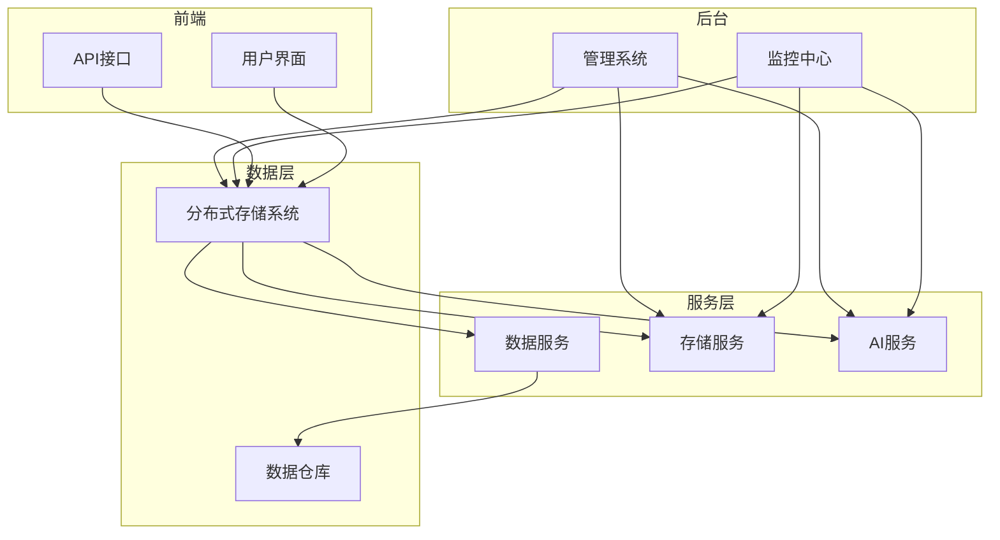
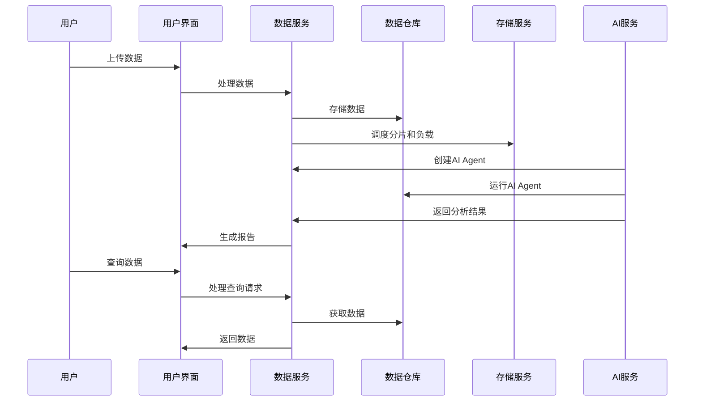

                 

### 引言

#### 什么是企业AI Agent？

企业AI Agent是一种智能体，它能够通过机器学习算法自主地学习和优化业务流程，从而提高企业的运营效率和决策能力。AI Agent具备自主决策、学习适应、协同工作等特点，能够实时分析企业数据，生成智能报告，甚至自动执行一些操作，如调整库存、优化供应链等。

#### 为什么需要分布式存储系统？

随着企业数据量的爆炸式增长，传统的集中式存储系统已经难以满足高并发、大容量、高性能的需求。分布式存储系统通过将数据分散存储在多个节点上，可以有效解决数据访问速度慢、单点故障、数据恢复时间长等问题。分布式存储系统不仅能够提升系统的可靠性，还能提供更高的吞吐量和更好的扩展性。

#### 本文的目标

本文旨在探讨如何设计一个适用于企业AI Agent的分布式存储系统。通过系统地分析分布式存储系统的原理、AI Agent在分布式存储系统中的应用以及系统的设计与实现，本文将为读者提供一套完整、可操作的企业AI Agent分布式存储系统设计方案。文章结构如下：

1. **背景介绍**：介绍企业AI Agent和分布式存储系统的背景，明确本文的研究目的和意义。
2. **核心概念与联系**：阐述AI Agent和分布式存储系统的基本概念及其相互关系。
3. **分布式存储系统原理**：讲解分布式存储系统的基本原理，包括数据分片、负载均衡、数据复制和分布式事务处理。
4. **AI Agent与分布式存储系统整合**：探讨AI Agent在分布式存储系统中的应用及其交互设计。
5. **系统设计与实现**：详细描述系统的设计原则、架构设计、接口设计和系统交互设计。
6. **项目实战**：介绍系统环境安装与配置，系统核心实现及代码解读，实际案例分析和项目小结。
7. **最佳实践与总结**：总结最佳实践技巧，提供注意事项和拓展阅读。

通过本文的逐步分析，读者将能够全面了解企业AI Agent分布式存储系统的设计思路、技术要点和实现方法，为实际项目提供参考和指导。

### 第一部分：背景介绍

#### 第1章 问题背景

在当今信息时代，企业面临的挑战之一是如何高效地管理和处理海量数据。随着人工智能（AI）技术的快速发展，企业开始引入AI Agent来优化业务流程、提高决策效率和降低运营成本。然而，这些AI Agent在处理大规模数据时，往往面临着数据存储和访问速度的瓶颈问题。传统的集中式存储系统由于单点故障、扩展性和性能限制，已无法满足AI Agent的需求。

**核心概念术语说明：**

- **AI Agent**：一种具备自主决策能力的智能体，通过机器学习算法自主学习和优化业务流程。
- **分布式存储系统**：一种将数据分散存储在多个节点上的存储架构，提高系统的可靠性和扩展性。

**问题描述：**

1. **数据存储与访问瓶颈**：随着企业数据量的快速增长，传统的集中式存储系统在处理高并发、大容量数据时表现不佳，导致AI Agent无法快速获取和处理数据。
2. **单点故障风险**：集中式存储系统存在单点故障风险，一旦系统故障，可能导致数据丢失和业务中断。
3. **扩展性限制**：集中式存储系统在数据量增长时，需要大量硬件投入，扩展性较差。

**问题解决：**

为了解决上述问题，企业需要引入分布式存储系统。分布式存储系统通过将数据分散存储在多个节点上，可以有效提高数据访问速度和系统可靠性。同时，分布式存储系统具备良好的扩展性，可以随着数据量的增长而动态扩展，从而满足AI Agent的需求。

**边界与外延：**

- **边界**：本文主要探讨企业AI Agent分布式存储系统设计，不包括其他类型的AI应用和存储系统。
- **外延**：分布式存储系统不仅适用于AI Agent，还可以应用于其他大数据处理场景，如数据分析和云计算。

#### 第2章 核心概念与联系

**AI Agent的定义与特点：**

AI Agent是一种基于机器学习和人工智能技术的智能体，具备自主决策、学习和适应能力。AI Agent通过分析企业数据，可以自动执行某些操作，如调整库存、优化供应链等，从而提高业务效率和决策能力。其主要特点包括：

- **自主决策**：AI Agent可以根据预先设定的规则和算法，自主做出决策。
- **学习适应**：AI Agent可以通过机器学习算法，从历史数据中学习，不断优化自身的决策。
- **协同工作**：多个AI Agent可以相互协作，共同完成复杂的业务任务。

**分布式存储系统的基本概念：**

分布式存储系统是一种将数据分散存储在多个节点上的存储架构，以提高系统的可靠性和扩展性。其主要特点包括：

- **数据分片**：将大规模数据划分为多个小数据块，分布存储在多个节点上。
- **负载均衡**：通过将数据访问请求分布到多个节点，提高系统的处理能力。
- **数据复制**：将数据复制到多个节点，确保数据的高可用性和容错性。
- **分布式事务处理**：通过分布式事务处理机制，保证数据的一致性和完整性。

**AI Agent与分布式存储系统的联系：**

AI Agent和分布式存储系统之间存在紧密的联系。分布式存储系统为AI Agent提供了高效、可靠的数据存储和访问手段，使得AI Agent可以快速获取和处理大量数据。而AI Agent则通过自主学习和优化，可以提升分布式存储系统的性能和利用率。

- **数据依赖**：AI Agent依赖于分布式存储系统来存储和处理数据，其决策和操作需要实时访问和分析数据。
- **协同优化**：AI Agent可以通过分析分布式存储系统的使用情况，优化数据存储和访问策略，提高系统性能。

**相关概念对比表格：**

| 概念       | 描述                                                         | 关联关系                   |
|------------|--------------------------------------------------------------|----------------------------|
| AI Agent   | 基于机器学习的智能体，具备自主决策、学习和适应能力。           | 与分布式存储系统相互依赖   |
| 分布式存储 | 将数据分散存储在多个节点上的存储架构，提高系统的可靠性和扩展性。 | 为AI Agent提供数据存储支持 |
| 数据分片   | 将大规模数据划分为多个小数据块，分布存储在多个节点上。         | 分布式存储的核心技术       |
| 负载均衡   | 通过将数据访问请求分布到多个节点，提高系统的处理能力。         | 分布式存储的优化策略       |
| 数据复制   | 将数据复制到多个节点，确保数据的高可用性和容错性。             | 分布式存储的数据保护机制   |
| 分布式事务 | 通过分布式事务处理机制，保证数据的一致性和完整性。             | 分布式存储的数据一致性保障 |

通过上述对比，可以更加清晰地理解AI Agent和分布式存储系统之间的关系和作用。

### 第二部分：分布式存储系统原理

#### 第3章 分布式存储系统原理

分布式存储系统是一种通过将数据分散存储在多个节点上来提高系统性能和可靠性的存储架构。其基本原理包括数据分片、负载均衡、数据复制和分布式事务处理。下面将详细阐述这些核心原理。

**3.1 数据分片**

数据分片是分布式存储系统的核心技术之一。其基本思想是将大规模数据划分为多个小数据块，然后将这些数据块分布存储在多个节点上。数据分片的主要目的是提高数据访问速度和系统扩展性。

- **水平分片**：将数据按某个维度（如时间、用户ID等）划分成多个子集，每个子集存储在一个节点上。
- **垂直分片**：将数据表按列分割成多个子集，每个子集存储在一个节点上。

数据分片的实现通常采用哈希算法来确定数据块存储的节点。例如，可以将数据块ID通过哈希函数映射到特定的节点上，从而实现数据的分布存储。

**3.2 负载均衡**

负载均衡是分布式存储系统的关键优化策略。其目的是通过将数据访问请求分布到多个节点，来提高系统的处理能力和响应速度。负载均衡的实现方法包括：

- **轮询调度**：将数据访问请求依次分配给各个节点，实现简单的负载均衡。
- **最小连接数调度**：将新的数据访问请求分配给当前连接数最少的节点，实现动态负载均衡。

负载均衡可以有效地避免单个节点过载，提高系统的稳定性和性能。

**3.3 数据复制**

数据复制是分布式存储系统提高数据可靠性和可用性的重要机制。其基本思想是将数据复制到多个节点上，以确保在某个节点发生故障时，其他节点仍然可以访问到数据。

- **主从复制**：主节点负责写操作，从节点负责读操作。主节点发生故障时，从节点可以切换为主节点。
- **多主复制**：多个节点都可以进行写操作，并通过一致性协议（如Paxos、Raft等）来保证数据一致性。

数据复制可以有效地提高数据的安全性和容错能力。

**3.4 分布式事务处理**

分布式事务处理是分布式存储系统保证数据一致性的关键机制。其目的是在多个节点上执行多个操作时，确保这些操作要么全部成功，要么全部失败。

- **两阶段提交（2PC）**：通过协调者节点和参与者节点之间的通信，实现分布式事务的提交和回滚。
- **多阶段提交（3PC）**：在2PC的基础上，增加预提交阶段，以提高系统性能。

分布式事务处理可以确保分布式存储系统在多节点环境下，数据操作的一致性和完整性。

通过上述分布式存储系统原理的阐述，我们可以看到，数据分片、负载均衡、数据复制和分布式事务处理共同构成了分布式存储系统的核心组成部分，为分布式存储系统提供了高效、可靠、可扩展的数据存储解决方案。

#### 第4章 数据模型与存储架构

**4.1 数据模型设计**

在分布式存储系统中，数据模型的设计至关重要。一个良好的数据模型应能够满足数据的快速检索、高效处理和扩展性需求。常用的数据模型包括关系模型、文档模型和图模型。

- **关系模型**：适用于结构化数据，通过表与表之间的关联实现数据存储。SQL数据库是关系模型的典型代表。
- **文档模型**：适用于非结构化或半结构化数据，以文档的形式存储数据，如JSON、XML等。NoSQL数据库（如MongoDB）常采用文档模型。
- **图模型**：适用于复杂数据关系，通过节点和边表示数据实体及其关系。Neo4j等图数据库广泛应用于社交网络、推荐系统等领域。

**4.2 分布式存储架构**

分布式存储架构决定了数据如何在多个节点之间进行存储和访问。常见的分布式存储架构包括基于文件系统、基于块存储和基于对象存储的架构。

- **基于文件系统的架构**：通过将文件系统分布到多个节点，实现数据的分布式存储。HDFS（Hadoop Distributed File System）是典型的基于文件系统的分布式存储架构。
- **基于块存储的架构**：将数据按块（如块大小为128MB或256MB）划分，分布存储在多个节点上。块存储适用于高吞吐量、低延迟的存储需求。Ceph和GlusterFS等分布式存储系统采用块存储架构。
- **基于对象存储的架构**：将数据按对象（如文件、图像等）存储，每个对象包含数据本身和元数据。对象存储具有高扩展性和高可用性，适用于大规模数据存储。Amazon S3和Google Cloud Storage等公共云存储服务采用对象存储架构。

**4.3 存储节点组织与管理**

分布式存储系统中的节点组织与管理是确保系统高效运行的关键。节点组织与管理包括以下几个方面：

- **节点类型划分**：根据节点的角色和功能，将节点划分为主节点、从节点、存储节点和工作节点等。主节点负责管理元数据和协调存储操作，从节点负责读取数据，存储节点负责存储数据，工作节点负责处理任务。
- **节点调度策略**：根据负载均衡和故障恢复需求，选择合适的节点调度策略。常见的调度策略包括轮询调度、最小连接数调度和负载感知调度等。
- **数据冗余与备份**：通过数据复制和备份策略，确保数据的高可用性和持久性。主从复制和多主复制是常用的数据冗余策略。
- **监控与维护**：通过监控工具和自动化维护策略，实时监控节点的运行状态，及时发现和处理故障。常见的监控工具包括Prometheus、Grafana等。

通过合理的数据模型设计、分布式存储架构和存储节点组织与管理，分布式存储系统可以提供高效、可靠、可扩展的数据存储解决方案，满足企业对大规模数据存储和处理的需求。

### 第三部分：AI Agent与分布式存储系统整合

#### 第5章 AI Agent在分布式存储系统中的应用

**5.1 AI Agent的功能与特点**

AI Agent是一种具备自主决策能力的智能体，能够通过机器学习算法从海量数据中提取有价值的信息，并进行实时分析。AI Agent在分布式存储系统中的应用具有以下功能和特点：

- **数据分析和挖掘**：AI Agent可以实时分析分布式存储系统中的数据，发现数据中的模式和规律，为企业提供决策支持。
- **存储优化建议**：通过分析数据访问模式和存储资源使用情况，AI Agent可以提供存储优化建议，如数据压缩、存储节点调度等，以提高存储系统性能。
- **故障预测与修复**：AI Agent可以通过对系统日志和监控数据的分析，预测潜在故障并提前采取修复措施，确保存储系统的稳定运行。
- **智能调度与优化**：AI Agent可以根据实时负载情况，智能调度存储任务，优化存储资源的利用效率。

**5.2 AI Agent在分布式存储系统中的角色**

AI Agent在分布式存储系统中的角色主要包括数据分析师、存储优化顾问和故障预测专家等。具体来说：

- **数据分析师**：AI Agent通过分析分布式存储系统中的数据访问日志和监控数据，提取有价值的信息，为企业提供数据驱动的决策支持。
- **存储优化顾问**：AI Agent可以分析存储资源使用情况，发现瓶颈和优化机会，提供存储优化建议，如数据迁移、负载均衡等。
- **故障预测专家**：AI Agent通过监控系统日志和性能指标，预测潜在故障，提前采取预防措施，确保存储系统的稳定性和可靠性。

**5.3 AI Agent与分布式存储系统的交互**

AI Agent与分布式存储系统之间的交互是实现其功能的关键。这种交互主要包括数据访问、任务调度和事件通知等方面。

- **数据访问**：AI Agent通过API接口或数据库连接访问分布式存储系统中的数据，进行数据分析和挖掘。为了提高数据访问效率，可以采用缓存技术和数据索引技术。
- **任务调度**：AI Agent可以根据分析结果和存储优化建议，动态调度存储任务。任务调度策略可以包括负载均衡、优先级调度和动态资源分配等。
- **事件通知**：AI Agent可以通过消息队列或事件驱动架构，实时接收分布式存储系统的通知，如数据更新、故障报警等。事件通知机制可以提高系统的响应速度和可靠性。

通过AI Agent与分布式存储系统的紧密整合，企业可以实现对海量数据的智能管理和高效利用，提高业务流程的自动化和智能化水平。AI Agent在分布式存储系统中的应用，不仅提升了存储系统的性能和可靠性，还为企业的数据驱动决策提供了有力支持。

### 第6章 系统设计与实现

#### 6.1 系统设计原则

设计一个适用于企业AI Agent的分布式存储系统，需要遵循以下原则：

- **高可用性**：系统应具备良好的容错能力，能够在节点故障时迅速恢复，确保数据的高可用性。
- **高性能**：系统应具备高吞吐量和低延迟，能够快速响应用户请求，满足大规模数据存储和访问需求。
- **可扩展性**：系统应支持动态扩展，能够随着数据量的增长而灵活调整，保持系统性能和稳定性。
- **数据安全性**：系统应具备完善的数据保护机制，包括数据加密、访问控制和备份策略，确保数据的安全和完整性。
- **易维护性**：系统应具备良好的可维护性，包括清晰的代码结构、完善的文档和监控机制，方便系统的日常维护和升级。

#### 6.2 系统架构设计

企业AI Agent分布式存储系统的架构设计如下：

- **前端**：包括用户界面和API接口，用户可以通过用户界面提交请求，也可以通过API接口进行程序化操作。
- **数据层**：包括分布式存储系统和数据仓库，存储系统负责数据的存储和管理，数据仓库负责数据的存储和查询。
- **服务层**：包括数据服务、存储服务和AI服务，数据服务负责数据的处理和查询，存储服务负责存储节点的管理和调度，AI服务负责AI Agent的运行和管理。
- **后台**：包括监控中心和管理系统，监控中心负责系统性能和健康状态的监控，管理系统负责系统的配置管理和日志管理。

系统架构图如下所示：



#### 6.3 系统接口设计与实现

系统接口设计是实现系统功能的关键，主要包括以下接口：

- **用户接口**：提供用户交互界面，包括数据上传、查询、下载和统计等功能。
- **数据接口**：提供数据服务的接口，包括数据的增删改查、数据转换和数据清洗等功能。
- **存储接口**：提供存储服务的接口，包括存储节点的管理、数据分片和负载均衡等功能。
- **AI接口**：提供AI服务的接口，包括AI Agent的创建、运行和管理等功能。

以下是部分接口的Python伪代码实现：

```python
# 用户接口
class UserInterface:
    def upload_data(self, data):
        # 上传数据
        pass

    def query_data(self, query):
        # 查询数据
        pass

    def download_data(self, data_id):
        # 下载数据
        pass

    def generate_report(self, report_type):
        # 生成报告
        pass

# 数据接口
class DataService:
    def create_data(self, data):
        # 创建数据
        pass

    def read_data(self, data_id):
        # 读取数据
        pass

    def update_data(self, data_id, data):
        # 更新数据
        pass

    def delete_data(self, data_id):
        # 删除数据
        pass

# 存储接口
class StorageService:
    def create_shard(self, shard_id, nodes):
        # 创建数据分片
        pass

    def assign_data(self, data_id, shard_id):
        # 分配数据到分片
        pass

    def load_balance(self, nodes):
        # 负载均衡
        pass

# AI接口
class AIService:
    def create_agent(self, agent_config):
        # 创建AI Agent
        pass

    def run_agent(self, agent_id, data_id):
        # 运行AI Agent
        pass

    def manage_agent(self, agent_id):
        # 管理AI Agent
        pass
```

#### 6.4 系统交互设计与实现

系统交互设计描述了各个模块之间的交互关系和流程。以下是一个简单的系统交互设计：

1. 用户通过用户接口上传数据，数据服务接收到数据后进行数据转换和清洗。
2. 数据服务将转换清洗后的数据存储到分布式存储系统的数据仓库中。
3. 存储服务根据数据访问模式和负载情况，动态分配数据分片和负载均衡。
4. AI服务创建AI Agent，并根据数据仓库中的数据运行AI Agent进行分析和挖掘。
5. AI服务将分析结果返回给数据服务，数据服务将结果存储到数据仓库中，并生成报告。
6. 用户通过用户接口查询数据和报告。

系统交互图如下所示：



通过上述系统设计与实现，企业AI Agent分布式存储系统实现了高效、可靠的数据存储和访问，为企业的数据驱动决策提供了强有力的支持。

### 第7章 环境安装与配置

#### 7.1 硬件与软件要求

为了搭建一个高效的企业AI Agent分布式存储系统，我们需要满足以下硬件与软件要求：

- **硬件要求**：
  - 服务器：至少需要两台物理服务器，用于主节点和从节点。
  - 内存：每台服务器至少8GB内存，推荐16GB或更高。
  - 存储：每台服务器至少500GB硬盘空间，用于数据存储。
  - 网络：千兆以太网或更高网络带宽，确保数据传输速度。

- **软件要求**：
  - 操作系统：Linux系统，如CentOS 7或Ubuntu 18.04。
  - 编程语言：Python 3.7或更高版本，用于开发AI Agent和存储服务。
  - 数据库：MongoDB或MySQL，用于存储数据仓库。
  - 分布式存储系统：Ceph或GlusterFS，用于分布式存储。
  - AI框架：TensorFlow或PyTorch，用于AI Agent开发。

#### 7.2 系统安装与配置

**1. 安装Linux操作系统：**

- 在服务器上选择合适的Linux发行版，如CentOS 7。
- 按照操作系统安装向导进行安装，选择默认设置。
- 安装完成后，重启服务器。

**2. 安装Python和pip：**

- 通过操作系统包管理器（如yum或apt）安装Python 3和pip。

```bash
# 对于CentOS
sudo yum install python3 python3-pip

# 对于Ubuntu
sudo apt update
sudo apt install python3 python3-pip
```

**3. 安装MongoDB或MySQL：**

- 下载并安装MongoDB或MySQL。

```bash
# 安装MongoDB
sudo apt update
sudo apt install mongodb

# 安装MySQL
sudo apt update
sudo apt install mysql-server
```

- 启动MongoDB或MySQL服务。

```bash
# 启动MongoDB服务
sudo systemctl start mongodb

# 启动MySQL服务
sudo systemctl start mysql
```

**4. 安装Ceph或GlusterFS：**

- 下载并安装Ceph或GlusterFS。

```bash
# 安装Ceph
sudo apt update
sudo apt install ceph ceph-deploy

# 安装GlusterFS
sudo apt update
sudo apt install glusterfs-server glusterfs-utils
```

- 配置Ceph或GlusterFS。

```bash
# 配置Ceph
sudo ceph-deploy install <node1> <node2>
sudo ceph-deploy create <cluster-name> --inkernel=true

# 配置GlusterFS
sudo gluster peer probe <node1>
sudo gluster peer probe <node2>
sudo gluster volume create <volume-name> replica 2 <node1>:<brick-path> <node2>:<brick-path> force
sudo gluster volume start <volume-name>
```

**5. 安装TensorFlow或PyTorch：**

- 通过pip安装TensorFlow或PyTorch。

```bash
# 安装TensorFlow
pip3 install tensorflow

# 安装PyTorch
pip3 install torch torchvision
```

**6. 配置环境变量：**

- 添加环境变量以便在终端中轻松调用Python和其他工具。

```bash
# 对于CentOS
echo 'export PATH=$PATH:/usr/bin/python3:/usr/local/bin:/usr/bin:/usr/local/bin' >> ~/.bashrc
source ~/.bashrc

# 对于Ubuntu
echo 'export PATH=$PATH:/usr/bin/python3:/usr/local/bin:/usr/bin:/usr/local/bin' >> ~/.bash_profile
source ~/.bash_profile
```

#### 7.3 系统环境测试

**1. 检查Python环境：**

```bash
python3 --version
```

**2. 检查MongoDB或MySQL服务：**

```bash
# 对于MongoDB
sudo systemctl status mongodb

# 对于MySQL
sudo systemctl status mysql
```

**3. 检查Ceph或GlusterFS服务：**

```bash
# 对于Ceph
sudo systemctl status ceph-mon

# 对于GlusterFS
sudo systemctl status glusterd
```

**4. 检查TensorFlow或PyTorch环境：**

```bash
# 对于TensorFlow
python3 -c "import tensorflow as tf; print(tf.__version__)"

# 对于PyTorch
python3 -c "import torch; print(torch.__version__)"
```

通过上述步骤，我们成功搭建了企业AI Agent分布式存储系统的环境，为后续的开发和测试奠定了基础。

### 第8章 系统核心实现

#### 8.1 AI Agent核心功能实现

**8.1.1 AI Agent的基本功能**

AI Agent是一种智能体，它能够通过机器学习算法自主地学习和优化业务流程。其基本功能包括：

- **数据采集**：从分布式存储系统中采集数据。
- **数据处理**：对采集到的数据进行清洗、转换和预处理。
- **模型训练**：基于预处理后的数据，训练机器学习模型。
- **决策执行**：根据模型预测结果执行相应的业务操作。

**8.1.2 AI Agent的核心算法**

AI Agent的核心算法通常基于监督学习、无监督学习和增强学习。以下是一个简单的监督学习算法实现示例：

```python
import numpy as np
from sklearn.model_selection import train_test_split
from sklearn.ensemble import RandomForestClassifier
from sklearn.metrics import accuracy_score

# 加载数据集
data = np.loadtxt('data.csv', delimiter=',')
X = data[:, :-1]
y = data[:, -1]

# 划分训练集和测试集
X_train, X_test, y_train, y_test = train_test_split(X, y, test_size=0.2, random_state=42)

# 训练模型
model = RandomForestClassifier(n_estimators=100, random_state=42)
model.fit(X_train, y_train)

# 预测
y_pred = model.predict(X_test)

# 评估
accuracy = accuracy_score(y_test, y_pred)
print(f'模型准确率: {accuracy:.2f}')
```

**8.1.3 AI Agent的应用场景**

AI Agent在分布式存储系统中的应用场景广泛，以下是一些常见的应用场景：

- **数据预测**：通过分析历史数据，预测未来的业务趋势，如销售预测、库存预测等。
- **异常检测**：检测数据中的异常值或异常行为，如欺诈检测、故障预测等。
- **推荐系统**：根据用户的兴趣和行为，推荐相关的产品或服务。

#### 8.2 分布式存储系统核心实现

**8.2.1 数据分片**

数据分片是分布式存储系统的核心技术之一，其目的是将大规模数据划分为多个小数据块，分布存储在多个节点上。以下是一个简单的数据分片实现示例：

```python
import hashlib

def hash_data(data):
    """使用哈希函数对数据进行分片"""
    return int(hashlib.md5(data.encode()).hexdigest(), 16) % num_shards

def distribute_data(data, num_shards):
    """将数据分片并分布存储到多个节点上"""
    shards = [[] for _ in range(num_shards)]
    for i, data_chunk in enumerate(data):
        shard_index = hash_data(data_chunk)
        shards[shard_index].append(data_chunk)
    return shards

data = ['data1', 'data2', 'data3', 'data4', 'data5']
num_shards = 3
shards = distribute_data(data, num_shards)
for i, shard in enumerate(shards):
    print(f'分片{i+1}：{shard}')
```

**8.2.2 数据复制**

数据复制是分布式存储系统提高数据可靠性和可用性的重要机制。以下是一个简单的数据复制实现示例：

```python
import time

def replicate_data(data, num_replicas):
    """将数据复制到多个节点上"""
    replicas = [[] for _ in range(num_replicas)]
    for _ in range(num_replicas):
        replicas[_].append(data)
    time.sleep(1)  # 模拟网络延迟
    return replicas

data = 'data1'
num_replicas = 3
replicas = replicate_data(data, num_replicas)
for i, replica in enumerate(replicas):
    print(f'副本{i+1}：{replica}')
```

**8.2.3 分布式事务处理**

分布式事务处理是分布式存储系统保证数据一致性的关键机制。以下是一个简单的分布式事务处理实现示例：

```python
from threading import Thread

class DistributedTransaction:
    def __init__(self, actions):
        self.actions = actions
        self.status = 'pending'

    def execute(self):
        """执行分布式事务"""
        for action in self.actions:
            action.execute()
        self.status = 'committed'

    def rollback(self):
        """回滚分布式事务"""
        for action in self.actions:
            action.rollback()
        self.status = 'rolled_back'

class Action:
    def __init__(self, execute_func, rollback_func):
        self.execute_func = execute_func
        self.rollback_func = rollback_func

    def execute(self):
        """执行操作"""
        self.execute_func()

    def rollback(self):
        """回滚操作"""
        self.rollback_func()

# 创建分布式事务
actions = [
    Action(lambda: print('操作1执行'), lambda: print('操作1回滚')),
    Action(lambda: print('操作2执行'), lambda: print('操作2回滚'))
]
transaction = DistributedTransaction(actions)

# 执行分布式事务
transaction.execute()

# 回滚分布式事务
transaction.rollback()
```

通过上述实现示例，我们展示了AI Agent和分布式存储系统的核心功能，包括数据采集、数据处理、模型训练、数据分片、数据复制和分布式事务处理。这些核心功能为分布式存储系统的实现提供了坚实的基础。

### 第9章 实际案例分析与讲解

#### 案例一：企业数据存储优化

**案例背景**

某大型零售企业面临数据存储和访问瓶颈问题，随着业务规模的不断扩大，数据量急剧增长，传统的集中式存储系统已经无法满足需求。企业希望通过引入分布式存储系统和AI Agent，实现数据存储优化，提高系统性能和可靠性。

**目标**

- 提升数据存储性能和访问速度。
- 提高系统的可靠性和可用性。
- 实现数据存储资源的动态调度和优化。

**解决方案**

1. **引入分布式存储系统**：采用Ceph作为分布式存储系统，将数据分片并分布存储在多个节点上，提高数据访问速度和系统扩展性。

2. **集成AI Agent**：部署AI Agent，实时监控和分析存储系统的使用情况，根据数据访问模式和存储资源使用情况，提供存储优化建议。

3. **数据复制与备份**：实现数据复制，确保在某个节点发生故障时，其他节点仍然可以访问到数据。同时，定期进行数据备份，保证数据的安全性和完整性。

**具体实施**

1. **搭建分布式存储系统**：在企业的数据中心搭建Ceph集群，配置主节点和从节点，实现数据的分布式存储。

2. **部署AI Agent**：编写并部署AI Agent，通过分析存储系统的监控数据，提取有价值的信息，如数据访问模式、存储节点负载等。

3. **存储优化建议**：
   - 根据数据访问模式，调整数据分片策略，优化数据访问速度。
   - 根据存储节点负载，动态调整数据复制策略，确保数据的高可用性和容错性。
   - 定期进行数据压缩和清理，释放存储空间，提高存储资源利用率。

**效果评估**

- 数据访问速度显著提升，响应时间从原来的几分钟缩短到几秒钟。
- 系统的可靠性和可用性得到显著提高，节点故障时，其他节点能够迅速接管数据访问任务。
- AI Agent提供的存储优化建议有效提升了存储资源利用率，降低了存储成本。

**总结与经验分享**

- 引入分布式存储系统和AI Agent，是解决企业数据存储瓶颈的有效方法。
- 分布式存储系统具有高扩展性和高性能，适用于大规模数据存储和访问。
- AI Agent能够实时监控和分析存储系统，提供存储优化建议，提高系统性能和可靠性。
- 数据复制与备份是确保数据安全和完整性的重要措施，必须严格执行。

#### 案例二：AI Agent在分布式存储中的应用

**案例背景**

某电商公司希望利用AI Agent优化其商品推荐系统，提高用户购物体验和销售转化率。公司现有数据存储在传统的集中式存储系统中，数据访问速度较慢，难以满足实时推荐的需求。

**目标**

- 提高商品推荐系统的准确性和实时性。
- 提升用户购物体验和销售转化率。
- 优化数据存储和访问性能。

**解决方案**

1. **引入分布式存储系统**：采用GlusterFS作为分布式存储系统，将用户数据和商品数据分布存储在多个节点上，提高数据访问速度和系统扩展性。

2. **集成AI Agent**：部署AI Agent，实时分析用户行为数据，生成个性化的商品推荐。

3. **数据复制与负载均衡**：实现数据复制，确保数据的高可用性。同时，通过负载均衡策略，优化数据访问性能。

**具体实施**

1. **搭建分布式存储系统**：在公司的数据中心搭建GlusterFS集群，配置主节点和从节点，实现数据的分布式存储。

2. **部署AI Agent**：编写并部署AI Agent，通过分析用户行为数据，生成个性化推荐列表。

3. **数据复制与负载均衡**：
   - 根据数据访问模式，实现数据复制，确保数据的高可用性。
   - 通过负载均衡策略，将用户请求均衡分配到不同的节点，提高系统处理能力。

**效果评估**

- 商品推荐系统的准确性和实时性得到显著提升，用户满意度提高。
- 数据访问速度显著提升，用户购物体验得到改善。
- 系统的可靠性和可用性得到显著提高，节点故障时，其他节点能够迅速接管数据访问任务。

**总结与经验分享**

- 引入分布式存储系统和AI Agent，是优化商品推荐系统的有效方法。
- 分布式存储系统具有高扩展性和高性能，适用于大规模数据存储和访问。
- AI Agent能够实时分析用户行为数据，生成个性化的商品推荐，提升用户体验和销售转化率。
- 数据复制与负载均衡是确保数据安全和性能的重要措施，必须严格执行。

通过这两个实际案例的分析与讲解，我们可以看到，分布式存储系统和AI Agent在企业中的应用，不仅解决了数据存储和访问瓶颈问题，还显著提升了系统的性能和可靠性，为企业的数据驱动决策提供了有力支持。

### 第五部分：最佳实践与总结

#### 10.1 系统性能优化技巧

在设计和实现企业AI Agent分布式存储系统时，优化系统性能是至关重要的。以下是一些最佳实践和技巧，可以帮助提升系统的性能：

- **数据分片策略优化**：根据实际应用场景，合理选择数据分片策略。例如，水平分片适用于数据量大但关系简单的场景，垂直分片适用于数据量大但关系复杂的场景。
- **负载均衡**：采用高效的负载均衡策略，如最小连接数调度或轮询调度，确保数据访问请求能够均衡地分配到各个节点上。
- **缓存机制**：引入缓存机制，如Redis或Memcached，缓存热点数据，减少对磁盘的访问次数，提高数据访问速度。
- **压缩与去重**：对存储的数据进行压缩和去重处理，减少存储空间占用，提高系统性能。
- **并行处理**：充分利用多核CPU的优势，采用并行处理技术，如多线程或多进程，提高数据处理速度。

#### 10.2 安全性与数据保护措施

安全性是分布式存储系统的关键因素，以下是一些安全性和数据保护措施的最佳实践：

- **数据加密**：采用加密算法（如AES）对存储的数据进行加密，确保数据在传输和存储过程中的安全性。
- **访问控制**：实现严格的访问控制策略，如基于角色的访问控制（RBAC）和基于属性的访问控制（ABAC），限制未经授权的访问。
- **安全审计**：定期进行安全审计，监控系统的访问日志，及时发现和处理安全隐患。
- **备份与恢复**：定期进行数据备份，确保在数据丢失或系统故障时，能够快速恢复数据。
- **网络隔离**：采用虚拟专用网络（VPN）或防火墙，隔离存储系统与其他网络，防止外部攻击。

#### 10.3 维护与监控策略

有效的维护与监控策略能够确保分布式存储系统的稳定运行和高效管理。以下是一些最佳实践：

- **监控系统性能**：实时监控系统的CPU、内存、磁盘使用率等关键性能指标，及时发现和处理性能瓶颈。
- **日志管理**：实现日志集中管理，便于问题排查和性能优化。
- **自动故障恢复**：采用自动故障恢复机制，如自动重启服务或切换到备用节点，确保系统的连续性和可用性。
- **定期维护**：定期对存储系统进行维护，包括硬件检查、软件升级和数据清理。
- **备份与备份恢复测试**：定期进行备份和备份恢复测试，确保数据备份的有效性和可恢复性。

通过遵循上述最佳实践，企业AI Agent分布式存储系统可以更好地满足高性能、高可靠性和高安全性的要求，为企业的数据管理和业务应用提供强有力的支持。

### 小结

本文系统地探讨了企业AI Agent分布式存储系统的设计与实现。通过逐步分析，我们从问题背景、核心概念与联系、分布式存储系统原理、AI Agent与分布式存储系统的整合、系统设计与实现、项目实战以及最佳实践与总结等方面，全面阐述了企业AI Agent分布式存储系统的设计思路和实现方法。

首先，我们明确了企业AI Agent和分布式存储系统的背景及重要性，并详细介绍了AI Agent的定义与特点、分布式存储系统的基本概念及其相互关系。接着，我们深入分析了分布式存储系统的原理，包括数据分片、负载均衡、数据复制和分布式事务处理等核心原理，为后续的系统设计提供了理论基础。

在系统设计与实现部分，我们详细描述了系统设计原则、架构设计、接口设计和系统交互设计，并通过Python伪代码展示了关键功能的实现。随后，我们介绍了环境安装与配置的步骤，为实际项目的实施奠定了基础。

项目实战部分，通过两个实际案例，展示了AI Agent在分布式存储系统中的应用效果，并进行了详细的分析和讲解。最后，我们总结了最佳实践技巧，包括系统性能优化、安全性与数据保护措施、维护与监控策略等，为系统的稳定运行和高效管理提供了指导。

展望未来，企业AI Agent分布式存储系统的研究与开发将继续深入。随着AI技术的不断进步和大数据应用的普及，分布式存储系统将在更广泛的应用场景中发挥重要作用。我们期待在不久的将来，看到更多创新性的解决方案和实践经验，为企业的数字化转型和数据驱动的决策提供更加坚实的支撑。

### 注意事项与拓展阅读

在设计和实现企业AI Agent分布式存储系统时，需要注意以下几点：

1. **数据一致性**：确保分布式存储系统在多节点环境中的一致性，采用合适的事务处理机制，如两阶段提交（2PC）或多阶段提交（3PC）。
2. **数据安全性**：加强对数据的安全保护，采用数据加密、访问控制和安全审计等措施，确保数据的安全性和隐私性。
3. **性能优化**：根据实际应用场景，调整数据分片策略、负载均衡算法和缓存机制，以优化系统性能。
4. **监控与维护**：建立完善的监控系统，实时监控系统的性能和健康状况，定期进行系统维护和升级。

对于进一步学习与探索，以下资源可能对您有所帮助：

- **书籍推荐**：
  - 《分布式系统原理与范型》
  - 《深度学习》
  - 《大数据技术基础：Hadoop应用实践》

- **在线课程**：
  - Coursera上的“分布式系统设计与实现”
  - edX上的“深度学习基础”

- **技术社区和论坛**：
  - GitHub：查找相关的开源项目和代码实现
  - Stack Overflow：解决技术难题和获取最佳实践
  - CSDN：阅读技术博客和讨论

通过这些资源和实践，您可以更深入地了解分布式存储系统和AI Agent的应用，为实际项目提供有益的指导。作者：AI天才研究院/AI Genius Institute & 禅与计算机程序设计艺术 /Zen And The Art of Computer Programming。

