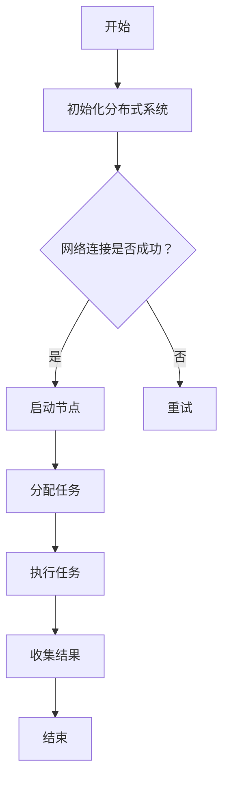
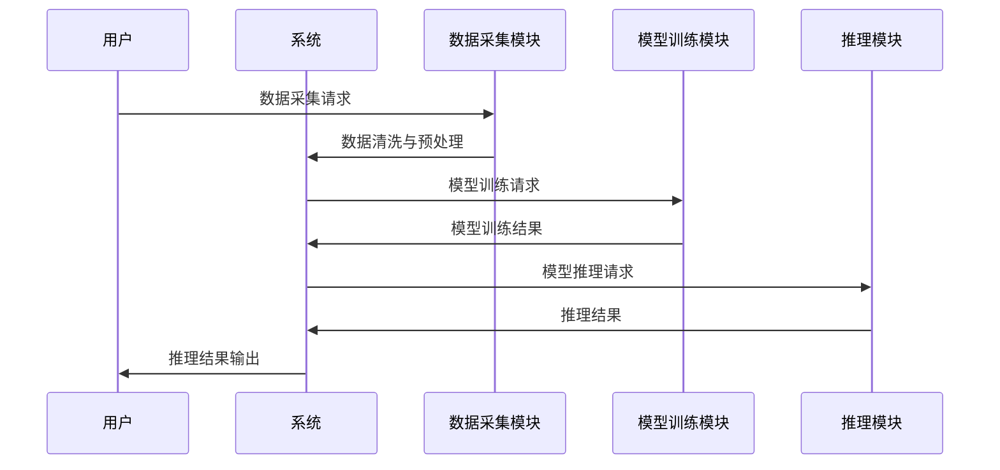

                 


## 《企业AI Agent的分布式计算架构》

> 关键词：企业AI，分布式计算，架构设计，AI Agent，系统实现

> 摘要：本文旨在探讨企业AI Agent的分布式计算架构，从背景与概述、核心概念原理、分布式计算架构设计、系统接口设计与交互、分布式计算架构实现以及项目实战与案例分析等多个方面，详细剖析企业AI Agent的分布式计算架构，帮助企业更好地应对数字化转型中的计算挑战。

### 第一部分：背景与概述

#### 第1章：问题背景与目标

##### 1.1 问题背景

随着数字化转型的不断深入，企业面临着越来越多的计算挑战。传统的集中式计算模式已无法满足企业对海量数据的高效处理需求，分布式计算作为一种新兴的计算模式，逐渐成为企业应对计算挑战的有效手段。特别是在人工智能（AI）领域，分布式计算的应用更是为AI Agent的开发和部署提供了强有力的支持。

##### 1.2 研究目标

本文的研究目标在于：

1. 理解分布式计算在企业AI中的应用场景。
2. 构建企业AI Agent的分布式计算架构。
3. 探索分布式计算架构在企业AI中的应用价值。

##### 1.3 边界与外延

1. 分布式计算的基本概念和原理。
2. 企业AI Agent的架构设计与实现。
3. 分布式计算架构在企业AI Agent中的应用场景和挑战。

##### 1.4 核心概念与联系

1. 分布式计算的核心概念与联系：
   - 分布式系统：由多个相互独立、协同工作的计算机节点组成。
   - 分布式存储：实现数据的高效存储和访问。
   - 分布式计算框架：提供分布式计算能力的平台，如Hadoop、Spark等。

2. 企业AI Agent的核心技术点：
   - AI Agent：具备感知、决策和执行能力的智能体。
   - 分布式计算架构：支持AI Agent高效运行的计算架构。

### 第2章：核心概念原理

#### 2.1 分布式计算原理

##### 2.1.1 分布式计算的定义与特点

1. **分布式系统的基本组成与运作原理**：
   - 节点：计算机设备，负责处理数据和执行任务。
   - 网络：连接各个节点的通信网络，实现数据传输和任务调度。
   - 分布式算法：协调节点之间任务分配和负载均衡的算法。

2. **分布式计算的优势与挑战**：
   - **优势**：
     - 高性能：通过并行计算，提高数据处理速度。
     - 高可用性：节点故障不会导致整个系统的瘫痪。
     - 可扩展性：支持系统规模的动态调整。
   - **挑战**：
     - 网络延迟和带宽限制：影响分布式系统的性能。
     - 数据一致性：保证多个节点之间数据的一致性。

##### 2.1.2 分布式计算架构

1. **分布式存储架构**：
   - **分布式文件系统**：如HDFS、Ceph等，提供高可靠性和高性能的数据存储。
   - **分布式数据库**：如HBase、MongoDB等，支持海量数据的存储和查询。

2. **分布式计算框架**：
   - **MapReduce**：基于函数式编程模型，实现大规模数据的分布式处理。
   - **Spark**：基于内存计算，提供高速的数据处理能力。

##### 2.1.3 Mermaid流程图



#### 2.2 企业AI Agent原理

##### 2.2.1 AI Agent的定义与分类

1. **反应型AI Agent**：根据感知到的环境进行即时反应。
2. **目标型AI Agent**：具有明确的目标，通过学习和规划实现目标。
3. **学习型AI Agent**：具备自我学习能力，不断提升智能水平。

##### 2.2.2 AI Agent的核心功能与特性

1. **感知能力**：获取环境信息。
2. **决策能力**：根据环境信息和目标，做出合理决策。
3. **执行能力**：执行决策结果，达成目标。

##### 2.2.3 ER实体关系图架构

```mermaid
erDiagram
    AI-Agent ||--|{ 感知模块 :Perception-Module }
    AI-Agent ||--|{ 决策模块 :Decision-Module }
    AI-Agent ||--|{ 执行模块 :Execution-Module }
    Perception-Module ||--|{ 环境信息 :Environmental-Information }
    Decision-Module ||--|{ 决策结果 :Decision-Result }
    Execution-Module ||--|{ 执行过程 :Execution-Process }
```

### 第二部分：分布式计算架构设计

#### 第3章：分布式计算架构设计原理

##### 3.1 系统需求分析

1. **系统功能需求**：
   - **数据采集与处理**：从多个数据源采集数据，进行数据清洗和预处理。
   - **模型训练与推理**：在分布式环境中训练和推理AI模型。
   - **分布式调度与协同**：实现任务的分配、调度和协同。

2. **系统性能需求**：
   - **计算性能**：支持大规模数据的高效处理。
   - **存储性能**：提供高性能的数据存储和访问。
   - **通信性能**：确保节点之间的数据传输和任务调度的稳定性。

##### 3.2 系统架构设计

1. **系统架构概述**：
   - **数据层架构设计**：分布式存储和数据采集模块。
   - **计算层架构设计**：分布式计算框架和AI模型训练与推理模块。
   - **应用层架构设计**：分布式调度与协同模块。

2. **架构设计原则**：
   - **高可用性**：确保系统稳定运行，减少故障影响。
   - **高性能**：提供高效的数据处理和计算能力。
   - **可扩展性**：支持系统规模的动态调整。

##### 3.3 Mermaid类图

```mermaid
classDiagram
    class DataLayer {
        - StorageModule
        - DataCollector
    }
    class ComputeLayer {
        - DistributedFramework
        - ModelTraining
        - Inference
    }
    class ApplicationLayer {
        - Scheduler
        - Coordinator
    }
    DataLayer --|{ Data } ComputeLayer
    ComputeLayer --|{ Compute } ApplicationLayer
```

### 第三部分：系统接口设计与交互

#### 第4章：系统接口设计与交互

##### 4.1 系统接口设计

1. **接口设计原则**：
   - **接口标准化**：遵循统一的接口规范，提高开发效率。
   - **接口安全性**：确保数据传输和系统交互的安全性。
   - **接口易用性**：简化接口使用，降低开发难度。

2. **接口设计与实现**：
   - **数据采集接口**：支持多种数据源接入，实现数据采集。
   - **模型训练接口**：提供模型训练的接口，支持模型参数调整。
   - **推理与执行接口**：实现模型推理和执行结果的输出。

##### 4.2 系统接口交互

1. **数据采集接口交互**：
   - **数据源接入**：接入不同的数据源，如数据库、文件等。
   - **数据清洗与预处理**：对采集到的数据进行清洗和预处理。

2. **模型训练接口交互**：
   - **模型训练参数设置**：设置模型训练的超参数。
   - **模型训练与评估**：启动模型训练，评估模型性能。

3. **推理与执行接口交互**：
   - **模型推理**：使用训练好的模型进行推理。
   - **执行结果输出**：输出执行结果，支持进一步分析。

##### 4.3 Mermaid序列图



### 第四部分：分布式计算架构实现

#### 第5章：环境安装与配置

##### 5.1 环境准备

1. **软件与硬件环境要求**：
   - 操作系统：Linux或Windows。
   - 编程语言：Python、Java等。
   - 数据库：MySQL、PostgreSQL等。

2. **环境安装与配置**：
   - **分布式计算框架安装**：如Hadoop、Spark等。
   - **AI Agent开发工具安装**：如TensorFlow、PyTorch等。
   - **数据库配置与优化**：配置数据库连接参数，优化查询性能。

##### 5.2 系统核心实现与代码分析

1. **数据采集与处理**：
   - **数据采集流程**：从多个数据源采集数据，如数据库、文件等。
   - **数据清洗与预处理**：对采集到的数据进行清洗和预处理，如去除无效数据、填补缺失值等。

2. **模型训练与推理**：
   - **模型训练流程**：划分数据集，训练模型，评估模型性能。
   - **模型推理流程**：使用训练好的模型进行推理，输出预测结果。

3. **分布式调度与协同**：
   - **调度与协同流程**：分配任务，管理资源，实现任务协同。

#### 第6章：项目实战与案例分析

##### 6.1 项目介绍

本项目旨在构建一个企业AI Agent的分布式计算架构，实现对大规模数据的高效处理和分析。项目分为以下几个模块：

1. **数据采集模块**：从多个数据源采集数据，如数据库、文件等。
2. **数据预处理模块**：对采集到的数据进行清洗和预处理。
3. **模型训练模块**：在分布式环境中训练AI模型。
4. **模型推理模块**：使用训练好的模型进行推理，输出预测结果。
5. **分布式调度与协同模块**：实现任务的分配、调度和协同。

##### 6.2 系统功能设计与实现

1. **数据采集与处理**：
   - **Python代码实现**：
     ```python
     # 数据采集
     data_collector = DataCollector()
     data_collector.collect_data()

     # 数据预处理
     data_processor = DataProcessor()
     processed_data = data_processor.preprocess_data(raw_data)
     ```

2. **模型训练与推理**：
   - **Python代码实现**：
     ```python
     # 模型训练
     model_trainer = ModelTrainer()
     model = model_trainer.train_model(processed_data)

     # 模型推理
     inference_engine = InferenceEngine()
     predictions = inference_engine.predict(model, test_data)
     ```

3. **分布式调度与协同**：
   - **Python代码实现**：
     ```python
     # 任务分配
     scheduler = Scheduler()
     tasks = scheduler.allocate_tasks()

     # 资源管理
     resource_manager = ResourceManager()
     resources = resource_manager.allocate_resources(tasks)

     # 任务协同
     coordinator = Coordinator()
     coordinator.coordinate_tasks(tasks, resources)
     ```

##### 6.3 项目小结

本项目通过分布式计算架构，实现了对大规模数据的高效处理和分析。通过对数据采集、预处理、模型训练、推理以及分布式调度与协同的模块化设计，项目具备了良好的扩展性和可维护性。在项目实战中，我们深入探讨了分布式计算在企业AI Agent中的应用，为企业数字化转型提供了有力支持。

### 最佳实践 tips

1. **性能优化**：针对分布式计算过程中的性能瓶颈，进行性能优化，如数据压缩、并行计算等。
2. **安全性提升**：加强系统安全性，如数据加密、身份验证等。
3. **可扩展性设计**：在设计架构时，考虑未来可能的扩展需求，如增加节点、数据源等。

### 小结

本文从背景与概述、核心概念原理、分布式计算架构设计、系统接口设计与交互、分布式计算架构实现以及项目实战与案例分析等多个方面，详细探讨了企业AI Agent的分布式计算架构。通过对分布式计算在企业AI中的应用、架构设计、系统接口设计、环境安装与配置以及项目实战的深入剖析，为企业数字化转型提供了有力的技术支持。

### 注意事项

1. **硬件资源限制**：分布式计算需要足够的硬件资源支持，如CPU、内存、存储等。
2. **网络环境**：确保网络环境稳定，减少网络延迟和带宽限制对分布式计算的影响。

### 拓展阅读

1. 《分布式系统原理与范型》
2. 《机器学习实战》
3. 《深度学习》

### 作者信息

作者：AI天才研究院/AI Genius Institute & 禅与计算机程序设计艺术 /Zen And The Art of Computer Programming

