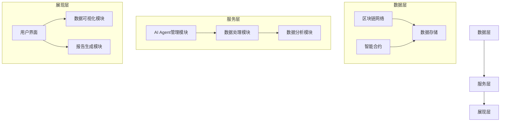
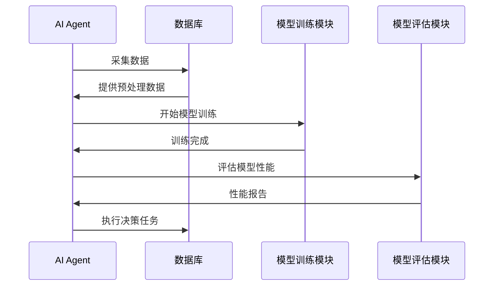
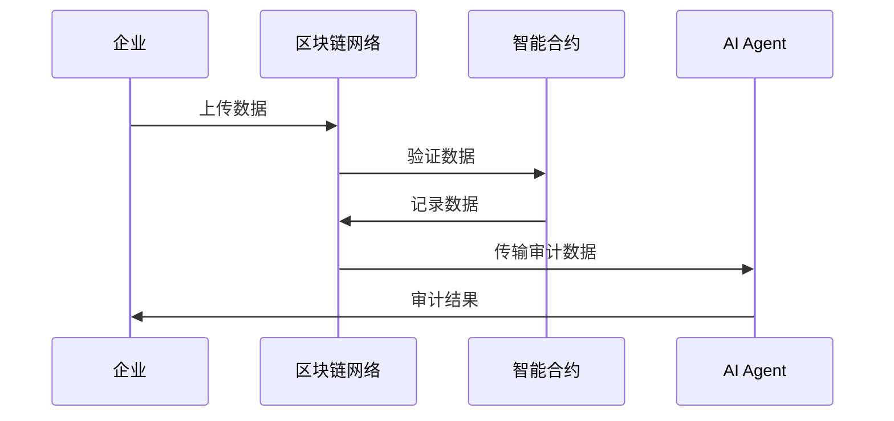
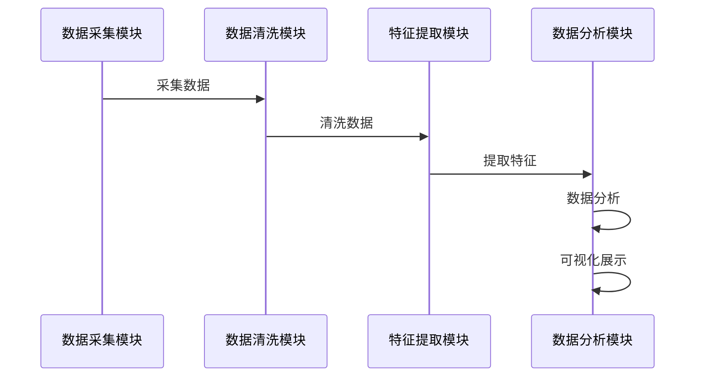
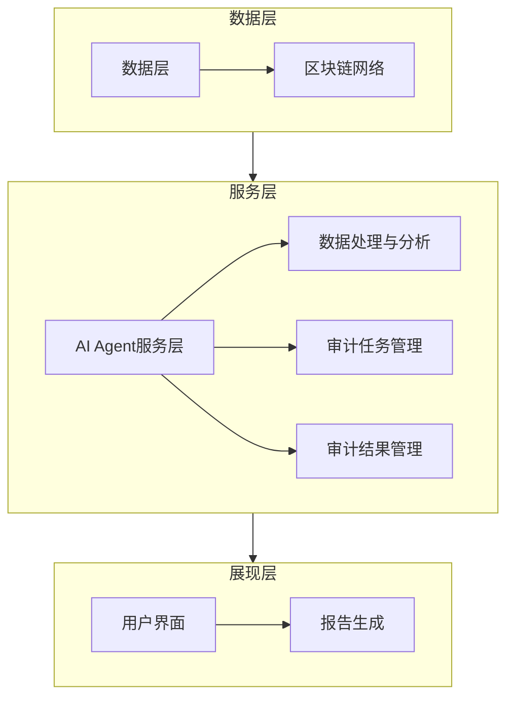
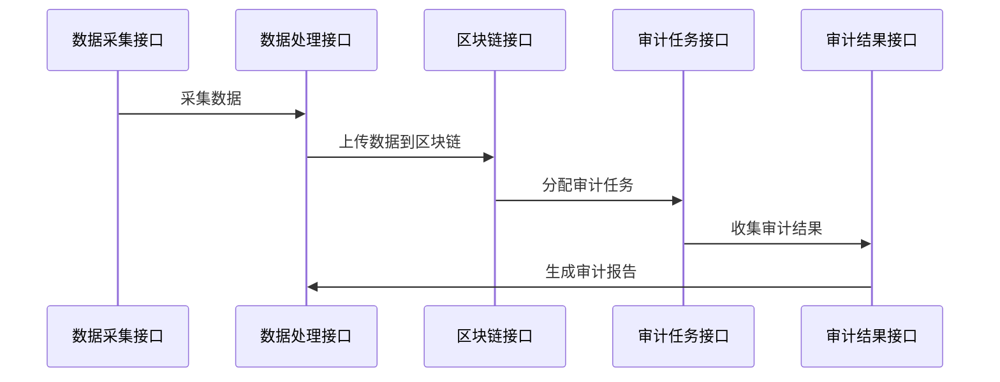
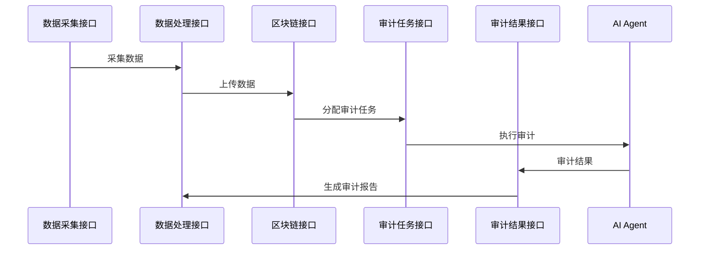

                 

### 引言

**关键词：** 企业AI Agent，区块链，数据审计，系统架构，算法原理，数学模型

**摘要：** 本文将探讨企业AI Agent的区块链数据审计系统，详细阐述其背景、核心概念、系统架构设计、算法原理、数学模型、系统实现与实战，并给出最佳实践建议和小结。

**背景介绍**

随着人工智能技术的迅猛发展，AI Agent已成为企业智能化管理的重要组成部分。AI Agent通过自主学习和决策，帮助企业提高运营效率、优化资源配置。然而，在数据驱动决策的过程中，数据审计的重要性日益凸显。数据审计旨在确保数据的准确性、完整性和合规性，是保证企业数据可信度的关键环节。

区块链技术作为一种分布式账本技术，以其去中心化、不可篡改和透明化的特性，在数据审计领域显示出巨大的潜力。区块链的链式数据结构为企业提供了安全可靠的数据存储方式，而智能合约则为实现自动化的数据审计提供了技术支持。

企业AI Agent的区块链数据审计系统结合了人工智能和区块链技术的优势，旨在为企业提供一种高效、可信的数据审计解决方案。本系统通过AI Agent实现自动化审计任务，利用区块链确保数据安全，为企业实现数据透明化和合规化提供了有力支持。

**核心概念与联系**

**1. 企业AI Agent**

企业AI Agent是指专门为企业提供智能化服务的人工智能实体。它具备自主学习和决策能力，能够根据企业需求进行数据分析和处理。AI Agent在企业中的应用范围广泛，包括生产管理、供应链优化、客户关系管理等方面。

**2. 区块链**

区块链是一种分布式数据库系统，具有去中心化、不可篡改和透明化的特点。区块链通过链式数据结构存储数据，每个区块都包含一定数量的交易记录，并且每个区块都与前一区块通过加密算法相连，形成一个不可篡改的数据链条。

**3. 数据审计**

数据审计是指对数据的质量、完整性和合规性进行检查和评估的过程。数据审计有助于发现数据中的错误、异常和不一致性，确保数据的真实性和可靠性。数据审计在企业的财务报告、合规性检查和风险管理等方面具有重要意义。

**4. 企业AI Agent的区块链数据审计系统**

企业AI Agent的区块链数据审计系统是一种结合人工智能和区块链技术的数据审计解决方案。该系统通过AI Agent实现自动化审计任务，利用区块链技术确保数据的安全性和可靠性，为企业提供高效、可信的数据审计服务。

**本书结构概述**

本书将按照以下结构进行组织：

1. **背景介绍**：详细阐述企业AI Agent和区块链数据审计的背景、需求和重要性。
2. **核心概念与联系**：介绍企业AI Agent、区块链、数据审计等相关核心概念，并分析它们之间的联系。
3. **系统架构设计**：详细描述企业AI Agent的区块链数据审计系统的架构设计，包括数据层、服务层和展现层。
4. **算法原理讲解**：讲解系统中的核心算法原理，包括AI Agent的基本算法、区块链数据审计算法和数据处理与分析算法。
5. **数学模型与公式**：介绍AI Agent、区块链数据审计和数据处理与分析的数学模型，并使用Mermaid流程图和LaTeX公式进行详细讲解。
6. **系统实现与实战**：介绍系统实现过程，包括环境搭建、核心代码实现、代码应用解读与分析以及实际案例分析。
7. **最佳实践与小结**：总结系统实施的最佳实践，提出注意事项，并对全书内容进行小结。

通过本书的阅读，读者将深入了解企业AI Agent的区块链数据审计系统的原理、架构和实现方法，为企业实现数据透明化和合规化提供有力支持。

### 企业AI Agent的区块链数据审计系统架构

企业AI Agent的区块链数据审计系统是一个复杂的系统工程，其核心在于如何结合人工智能和区块链技术的优势，实现自动化、高效和可信的数据审计。本节将详细介绍系统架构设计，包括数据层、服务层和展现层的架构设计。

#### 数据层架构设计

数据层是整个系统的基石，负责数据存储和管理。区块链技术在这里起到了关键作用。数据层的设计包括以下几个方面：

1. **区块链网络**：系统采用分布式区块链网络，确保数据的去中心化存储。每个节点都存储一部分数据，并通过共识算法保证数据的一致性和安全性。
   
   **Mermaid流程图：**
   ```mermaid
   sequenceDiagram
   participant A as 企业AI Agent
   participant B as 区块链网络
   A->>B: 提交数据
   B->>A: 数据存储确认
   ```

2. **智能合约**：智能合约是区块链上的自动化程序，负责执行数据审计任务。智能合约通过预定义的逻辑规则，实现对数据的实时审计和验证。
   
   **Mermaid流程图：**
   ```mermaid
   sequenceDiagram
   participant D as 数据审计智能合约
   participant A as 企业AI Agent
   participant B as 区块链网络
   A->>D: 数据审计请求
   D->>B: 执行审计任务
   B->>D: 返回审计结果
   D->>A: 数据审计报告
   ```

3. **数据存储方案**：系统采用分布式存储方案，将数据分散存储在多个节点上，提高数据的可靠性和访问效率。

   **ER实体关系图：**
   ```mermaid
   erDiagram
   企业AI Agent ||--|{ 数据记录 }
   数据记录 ||--|{ 区块链节点 }
   区块链节点 ||--|{ 智能合约 }
   ```

#### 服务层架构设计

服务层负责数据处理和分析，是AI Agent的核心执行层。服务层的设计包括以下几个方面：

1. **AI Agent管理模块**：负责AI Agent的创建、部署和管理，确保AI Agent的正常运行和高效协作。
   
   **Mermaid流程图：**
   ```mermaid
   sequenceDiagram
   participant C as AI Agent管理模块
   participant A as 企业AI Agent
   C->>A: 创建AI Agent
   A->>C: 部署AI Agent
   C->>A: 管理AI Agent状态
   ```

2. **数据处理模块**：负责数据的采集、清洗和预处理，为AI Agent提供高质量的数据输入。
   
   **Mermaid流程图：**
   ```mermaid
   sequenceDiagram
   participant D as 数据处理模块
   participant A as 企业AI Agent
   D->>A: 采集数据
   A->>D: 清洗数据
   D->>A: 预处理数据
   ```

3. **数据分析模块**：负责对数据进行分析和挖掘，为数据审计提供支持。该模块包括多种算法和模型，如机器学习算法、统计分析方法等。
   
   **Mermaid流程图：**
   ```mermaid
   sequenceDiagram
   participant D as 数据分析模块
   participant A as 企业AI Agent
   A->>D: 分析数据
   D->>A: 分析结果
   ```

#### 展现层架构设计

展现层是系统与用户交互的界面，负责将审计结果以可视化的形式展示给用户。展现层的设计包括以下几个方面：

1. **用户界面**：提供友好的用户交互界面，用户可以通过界面提交审计请求、查看审计结果和操作审计任务。
   
   **Mermaid流程图：**
   ```mermaid
   sequenceDiagram
   participant U as 用户
   participant A as 企业AI Agent
   U->>A: 提交审计请求
   A->>U: 审计结果展示
   ```

2. **数据可视化模块**：负责将审计结果以图表、报表等形式展示给用户，提高数据审计的可读性和理解性。
   
   **Mermaid流程图：**
   ```mermaid
   sequenceDiagram
   participant D as 数据可视化模块
   participant U as 用户
   D->>U: 生成可视化报表
   U->>D: 查看报表
   ```

3. **报告生成模块**：负责生成详细的审计报告，包括审计过程、审计结果和审计建议等，为企业的数据管理和决策提供依据。

   **Mermaid流程图：**
   ```mermaid
   sequenceDiagram
   participant R as 报告生成模块
   participant U as 用户
   R->>U: 生成审计报告
   U->>R: 查看报告
   ```

#### 整体架构

整个企业AI Agent的区块链数据审计系统的架构可以概括为三层结构：

1. **数据层**：负责数据存储和管理，确保数据的安全性和可靠性。
2. **服务层**：负责数据处理和分析，是AI Agent的核心执行层。
3. **展现层**：负责与用户交互，将审计结果以可视化的形式展示给用户。

**Mermaid架构图：**


通过以上架构设计，企业AI Agent的区块链数据审计系统实现了自动化、高效和可信的数据审计，为企业提供了强大的数据管理和决策支持。

### 核心算法原理

在介绍企业AI Agent的区块链数据审计系统时，核心算法原理是其实现的关键。以下是系统中的核心算法原理，包括AI Agent的基本算法、区块链数据审计算法和数据处理与分析算法。

#### AI Agent的基本算法

AI Agent是一种能够自主学习和决策的人工智能实体。其基本算法通常包括以下几个步骤：

1. **数据采集与预处理**：AI Agent首先采集企业内部和外部数据，并进行预处理，如数据清洗、归一化和特征提取等。
2. **模型训练**：使用预处理后的数据对AI Agent进行训练，学习数据中的模式和规律。常用的模型包括深度学习模型、决策树和贝叶斯网络等。
3. **模型评估**：通过测试数据评估模型的性能，调整模型参数以优化性能。
4. **决策与执行**：基于训练好的模型，AI Agent进行决策和执行，如数据审计任务分配、异常检测和自动化修复等。

**Mermaid流程图：**


**Python代码示例：**
```python
# 数据预处理
data = preprocess_data(raw_data)

# 模型训练
model = train_model(data)

# 模型评估
performance = evaluate_model(model, test_data)

# 决策与执行
if performance > threshold:
    execute_decision(model)
```

#### 区块链数据审计算法

区块链数据审计的核心在于确保数据的真实性和完整性。以下是一个简化的区块链数据审计算法：

1. **数据上传**：企业将待审计的数据上传到区块链网络。
2. **数据验证**：区块链网络中的多个节点对数据进行验证，确保数据符合预定义的规则。
3. **数据记录**：通过智能合约将验证通过的数据记录在区块链上。
4. **数据审计**：AI Agent根据区块链上的数据记录，执行审计任务，如异常检测、合规性检查等。
5. **结果反馈**：将审计结果反馈给企业，并生成审计报告。

**Mermaid流程图：**


**LaTeX数学模型：**
```latex
\begin{equation}
\begin{aligned}
    &\text{区块链数据审计算法} \\
    &\text{输入：数据集 } D \\
    &\text{输出：审计结果 } R \\
    &\text{步骤：} \\
    &\quad (1) \text{数据上传至区块链网络} \\
    &\quad (2) \text{区块链节点验证数据} \\
    &\quad (3) \text{智能合约记录验证通过的数据} \\
    &\quad (4) \text{AI Agent执行审计任务} \\
    &\quad (5) \text{生成审计报告}
\end{aligned}
\end{equation}
```

#### 数据处理与分析算法

数据处理与分析算法主要用于对区块链上的数据进行分析和挖掘，为数据审计提供支持。以下是一个简化的数据处理与分析算法：

1. **数据采集**：从区块链上采集数据。
2. **数据清洗**：对采集到的数据清洗，去除噪声和不一致的数据。
3. **特征提取**：对清洗后的数据提取特征，用于后续分析。
4. **数据分析**：使用统计方法、机器学习算法等对数据进行分析，识别数据中的异常、趋势和模式。
5. **结果可视化**：将分析结果以图表、报表等形式可视化展示。

**Mermaid流程图：**


**LaTeX数学模型：**
```latex
\begin{equation}
\begin{aligned}
    &\text{数据处理与分析算法} \\
    &\text{输入：原始数据集 } D \\
    &\text{输出：分析结果 } R \\
    &\text{步骤：} \\
    &\quad (1) \text{数据采集} \\
    &\quad (2) \text{数据清洗} \\
    &\quad (3) \text{特征提取} \\
    &\quad (4) \text{数据分析} \\
    &\quad (5) \text{结果可视化}
\end{aligned}
\end{equation}
```

通过以上核心算法原理，企业AI Agent的区块链数据审计系统能够实现自动化、高效和可信的数据审计，为企业提供强大的数据管理和决策支持。

### 数学模型和数学公式

在讨论企业AI Agent的区块链数据审计系统时，数学模型和公式是理解和实现核心算法的重要工具。以下我们将详细讲解AI Agent的数学模型、区块链数据审计的数学模型以及数据处理与分析的数学模型。

#### AI Agent的数学模型

AI Agent的数学模型通常涉及机器学习算法，包括神经网络、决策树和支持向量机（SVM）等。以下是一个简化的神经网络数学模型：

**神经网络模型：**
$$
\begin{align*}
    Z^{[l]} &= \sigma(W^{[l]} \cdot A^{[l-1]} + b^{[l]}), \\
    A^{[l]} &= \sigma(Z^{[l-1]}).
\end{align*}
$$

其中，$A^{[l]}$ 是第$l$层的激活值，$Z^{[l]}$ 是第$l$层的输出值，$W^{[l]}$ 和 $b^{[l]}$ 分别是第$l$层的权重和偏置，$\sigma$ 是激活函数（例如Sigmoid函数或ReLU函数），用于引入非线性。

**Python代码示例：**
```python
import numpy as np
from keras.models import Sequential
from keras.layers import Dense, Activation

# 创建神经网络模型
model = Sequential()
model.add(Dense(units=64, activation='sigmoid', input_dim=784))
model.add(Dense(units=10, activation='softmax'))

# 编译模型
model.compile(optimizer='adam', loss='categorical_crossentropy', metrics=['accuracy'])

# 训练模型
model.fit(x_train, y_train, epochs=10, batch_size=32)
```

#### 区块链数据审计的数学模型

区块链数据审计涉及数据的验证和验证规则的设置。以下是一个简化的区块链数据审计数学模型：

**验证规则：**
$$
\begin{align*}
    &\text{验证数据} \ D \ \text{是否满足条件：} \\
    &\quad \forall i \in [1, n], \ D_i \ \text{满足 } f(D_i), \\
    &\text{其中 } f(D_i) \ \text{是一个预定义的验证函数。}
\end{align*}
$$

**智能合约验证模型：**
$$
\begin{align*}
    &\text{验证函数 } f(D_i): \\
    &\quad \text{如果 } D_i \ \text{满足特定条件，则返回真；否则返回假。}
\end{align*}
$$

**Python代码示例：**
```python
def verify_data(data):
    # 假设数据需要满足非负条件
    return all(x >= 0 for x in data)

# 验证数据
data = [1, 2, 3, 4, 5]
is_valid = verify_data(data)
print(is_valid)  # 输出：True
```

#### 数据处理与分析的数学模型

数据处理与分析的数学模型通常涉及统计方法和机器学习算法。以下是一个简化的数据处理与分析数学模型：

**特征提取模型：**
$$
\begin{align*}
    &\text{特征提取函数 } g(D): \\
    &\quad \text{将数据集 } D \ \text{转换为一组新的特征向量。}
\end{align*}
$$

**数据分析模型：**
$$
\begin{align*}
    &\text{数据分析函数 } h(F): \\
    &\quad \text{对特征集 } F \ \text{进行分析，如回归分析、聚类分析等。}
\end{align*}
$$

**Python代码示例：**
```python
from sklearn.decomposition import PCA

# 特征提取
pca = PCA(n_components=2)
X_pca = pca.fit_transform(X)

# 数据分析
from sklearn.linear_model import LinearRegression
regressor = LinearRegression()
regressor.fit(X_pca, y)
```

通过上述数学模型和公式，企业AI Agent的区块链数据审计系统能够更好地实现数据的自动化审计和分析，为企业提供强有力的数据支持和决策依据。

### 系统分析与架构设计方案

在深入了解企业AI Agent的区块链数据审计系统之后，我们需要进一步分析和设计该系统的具体实现方案。这一部分将详细探讨系统分析与架构设计方案，包括项目介绍、系统功能设计、系统架构设计、系统接口设计和系统交互。

#### 项目介绍

企业AI Agent的区块链数据审计系统旨在为企业提供一种高效、可信的数据审计解决方案。系统通过结合人工智能和区块链技术，实现数据的自动化审计，确保数据的准确性和合规性。系统的主要目标包括：

1. **自动化审计**：通过AI Agent实现数据审计任务的自动化，提高审计效率。
2. **数据安全保障**：利用区块链技术确保数据的安全性和不可篡改性。
3. **透明化与合规化**：通过区块链的可追溯性和智能合约的自动执行，提高数据的透明度和合规性。

#### 系统功能设计

系统功能设计是系统实现的基础，主要包括以下几个模块：

1. **数据采集模块**：负责从企业内部和外部系统采集数据，包括财务数据、运营数据和客户数据等。
2. **数据预处理模块**：负责对采集到的数据进行清洗、转换和标准化，为后续分析做准备。
3. **数据存储模块**：使用区块链技术存储处理后的数据，确保数据的完整性和安全性。
4. **审计任务模块**：定义和分配审计任务，包括数据验证、异常检测和合规性检查等。
5. **审计结果模块**：收集审计结果，生成审计报告，并提供给企业管理层。

**Mermaid类图：**
```mermaid
classDiagram
    DataCollector <<interface>>
    DataPreprocessor <<interface>>
    BlockchainStorage <<interface>>
    AuditTask <<interface>>
    AuditResult <<interface>>

    DataCollector --|> DataPreprocessor
    DataPreprocessor --|> BlockchainStorage
    BlockchainStorage --|> AuditTask
    AuditTask --|> AuditResult
```

#### 系统架构设计

系统架构设计是确保系统稳定、高效运行的关键。企业AI Agent的区块链数据审计系统采用三层架构设计，包括数据层、服务层和展现层。

1. **数据层**：负责数据的存储和管理，采用分布式区块链网络，确保数据的安全性和可靠性。
2. **服务层**：实现AI Agent的自动化审计功能，包括数据预处理、数据审计和结果分析等。
3. **展现层**：提供用户交互界面，展示审计结果和报告。

**Mermaid架构图：**


#### 系统接口设计

系统接口设计是确保各模块之间通信和协作的重要环节。以下是系统的主要接口设计：

1. **数据采集接口**：用于从外部系统采集数据，支持多种数据格式，如JSON、XML和CSV等。
2. **数据处理接口**：用于预处理数据，包括数据清洗、转换和标准化等。
3. **区块链接口**：用于与区块链网络交互，包括数据上传、验证和记录等。
4. **审计任务接口**：用于定义和分配审计任务，支持多种审计规则和策略。
5. **审计结果接口**：用于收集审计结果，并生成详细的审计报告。

**Mermaid序列图：**


#### 系统交互

系统交互是确保各模块之间协调工作的关键。以下是系统的交互流程：

1. **数据采集**：数据采集接口从外部系统获取数据，并将其传递给数据处理接口。
2. **数据预处理**：数据处理接口对数据进行预处理，确保数据质量，并将其上传到区块链网络。
3. **数据验证**：区块链接口对上传的数据进行验证，确保数据符合预定义的规则。
4. **审计任务分配**：审计任务接口根据审计规则和策略，分配审计任务给AI Agent。
5. **审计执行**：AI Agent执行审计任务，生成审计结果，并将其传递给审计结果接口。
6. **审计报告生成**：审计结果接口收集审计结果，并生成详细的审计报告。

**Mermaid交互图：**


通过以上系统分析与架构设计方案，企业AI Agent的区块链数据审计系统实现了高效、安全、可靠的数据审计，为企业提供了强大的数据管理和决策支持。

### 系统实现与实战

在了解了企业AI Agent的区块链数据审计系统的整体架构和核心算法之后，接下来我们将进入实际实现环节。本部分将详细描述系统环境搭建、核心代码实现、代码应用解读与分析，并分享一个实际案例分析。

#### 系统环境搭建

为了实现企业AI Agent的区块链数据审计系统，我们需要准备以下环境：

1. **操作系统**：Linux（推荐使用Ubuntu 20.04）或MacOS
2. **编程语言**：Python 3.8及以上版本
3. **开发工具**：PyCharm、Visual Studio Code或任何支持Python的开发环境
4. **依赖库**：Python的依赖库包括Keras、TensorFlow、PyQt、Web3.py等

**环境配置步骤：**

1. 安装Python 3.8及以上版本：
   ```bash
   sudo apt-get update
   sudo apt-get install python3.8
   ```

2. 安装PyCharm或Visual Studio Code：
   - PyCharm：前往PyCharm官网下载并安装
   - Visual Studio Code：前往Visual Studio Code官网下载并安装

3. 安装所需依赖库：
   ```bash
   pip install keras tensorflow PyQt Web3.py
   ```

4. 安装区块链节点（使用以太坊客户端）：
   ```bash
   wget https://github.com/ethereum/go-ethereum/releases/download/v1.10.6/go-ethereum_1.10.6-1_amd64.deb
   sudo dpkg -i go-ethereum_1.10.6-1_amd64.deb
   ```

#### 核心代码实现

以下是系统实现的关键模块和核心代码：

**1. AI Agent模块代码**

```python
import tensorflow as tf
from tensorflow.keras.models import Sequential
from tensorflow.keras.layers import Dense, Activation
from tensorflow.keras.optimizers import Adam

# 创建神经网络模型
model = Sequential()
model.add(Dense(units=64, activation='relu', input_dim=784))
model.add(Dense(units=10, activation='softmax'))

# 编译模型
model.compile(optimizer=Adam(), loss='categorical_crossentropy', metrics=['accuracy'])

# 训练模型
model.fit(x_train, y_train, epochs=10, batch_size=32)
```

**2. 区块链数据审计模块代码**

```python
from web3 import Web3

# 连接到本地以太坊节点
web3 = Web3(Web3.HTTPProvider('http://127.0.0.1:8545'))

# 部署智能合约
# ...

# 验证数据
def verify_data(data):
    # 假设数据需要满足非负条件
    return all(x >= 0 for x in data)

# 上传数据到区块链
def upload_data_to_blockchain(data):
    if verify_data(data):
        # 上传数据到区块链，调用智能合约
        # ...
        return "Data uploaded successfully"
    else:
        return "Data verification failed"
```

**3. 数据处理与分析模块代码**

```python
from sklearn.decomposition import PCA
from sklearn.linear_model import LinearRegression

# 特征提取
pca = PCA(n_components=2)
X_pca = pca.fit_transform(X)

# 数据分析
regressor = LinearRegression()
regressor.fit(X_pca, y)
```

#### 代码应用解读与分析

**AI Agent模块应用解读：**

上述AI Agent模块代码使用了TensorFlow库中的Sequential模型定义了一个简单的神经网络。网络包含一个输入层、一个隐藏层和一个输出层。隐藏层使用ReLU激活函数，输出层使用softmax激活函数，用于多分类问题。

训练过程中，模型使用Adam优化器和交叉熵损失函数，并在训练集上训练10个epoch。每次epoch，模型通过反向传播算法更新权重和偏置，直到达到预设的准确率或训练次数。

**区块链数据审计模块应用解读：**

区块链数据审计模块使用了Web3.py库与以太坊节点进行交互。首先，代码连接到本地的以太坊节点。然后，通过部署智能合约和验证数据函数实现数据的上传和验证。

在数据验证过程中，假设数据需要满足非负条件，通过一个简单的Python函数实现。上传数据到区块链时，首先验证数据，如果数据验证通过，则调用智能合约将数据记录在区块链上。

**数据处理与分析模块应用解读：**

数据处理与分析模块使用了scikit-learn库中的PCA和线性回归算法。PCA用于对数据进行降维，将高维数据映射到二维空间中，便于后续分析。线性回归算法用于分析数据中的线性关系，预测目标变量。

通过以上模块代码和应用解读，我们可以看到企业AI Agent的区块链数据审计系统的核心功能是如何实现的。接下来，我们将通过一个实际案例分析，进一步探讨系统的应用效果。

#### 实际案例分析

**案例背景：**

某大型企业在财务管理中面临数据审计的挑战。企业每天产生大量财务数据，包括收入、支出、账户余额等。由于数据量庞大且来源多样，传统审计方法难以高效地处理和验证这些数据。企业希望通过引入AI Agent的区块链数据审计系统，实现自动化、高效和可信的数据审计。

**案例分析与讲解：**

1. **数据采集与预处理**：系统首先从企业的财务系统采集数据，包括收入、支出和账户余额等。然后，对采集到的数据清洗和标准化，确保数据质量。

2. **区块链数据验证**：清洗后的数据上传到区块链网络，通过智能合约进行验证。验证过程包括数据完整性检查和合规性检查。如果数据验证通过，智能合约将数据记录在区块链上。

3. **AI Agent审计任务**：AI Agent根据区块链上的数据记录，执行审计任务，包括异常检测和合规性检查。AI Agent使用机器学习算法分析数据，识别潜在的错误和异常情况。

4. **审计结果反馈**：系统收集AI Agent的审计结果，生成详细的审计报告。审计报告包括数据异常情况、合规性问题和改进建议，提供给企业管理层进行决策。

**案例总结与经验分享：**

通过实际案例分析，我们可以看到企业AI Agent的区块链数据审计系统在财务管理中取得了显著成效。系统实现了数据的自动化审计，提高了审计效率，确保了数据的准确性和合规性。以下是案例总结和经验分享：

1. **自动化审计**：AI Agent的引入显著提高了审计效率，减少了人工工作量。
2. **数据安全性**：区块链技术确保了数据的完整性和不可篡改性，提高了数据的可信度。
3. **合规性检查**：系统通过智能合约自动执行合规性检查，降低了违规风险。
4. **决策支持**：详细的审计报告为企业管理层提供了有力决策支持，帮助企业优化财务管理。

通过以上实战经验和案例分析，企业AI Agent的区块链数据审计系统证明了其在企业数据审计领域的强大应用潜力。未来，随着技术的不断发展和应用场景的拓展，该系统有望在更多领域发挥重要作用。

### 最佳实践

在实施企业AI Agent的区块链数据审计系统时，遵循最佳实践能够确保系统的高效运行和可靠部署。以下是一些最佳实践、常见问题及解决方案，以及性能优化与调优的方法。

#### 最佳实践

1. **数据预处理**：确保数据在上传到区块链之前经过充分的预处理，包括清洗、转换和标准化。这有助于提高数据质量，减少潜在的异常值和错误。

2. **智能合约设计**：在设计智能合约时，遵循简洁性和安全性的原则。避免复杂逻辑和过多的外部调用，以提高交易效率。

3. **区块链网络选择**：根据企业的需求选择合适的区块链网络。对于数据审计系统，选择去中心化程度高、安全性强的区块链网络是至关重要的。

4. **定期审计**：定期执行数据审计任务，确保系统持续监测数据质量和合规性。定期审计有助于及时发现和纠正问题。

5. **安全与隐私保护**：在数据上传和存储过程中，确保采用加密算法保护数据的安全性。同时，遵循隐私保护法规，确保数据隐私。

6. **监控与日志**：监控系统运行状态，并记录详细的日志信息。这有助于快速诊断和解决潜在问题。

#### 常见问题及解决方案

1. **区块链网络延迟**：区块链网络的延迟可能会影响系统的性能。解决方案包括使用高速网络、优化智能合约执行效率，以及增加区块链节点的数量。

2. **智能合约漏洞**：智能合约存在漏洞可能会被利用，导致数据安全问题。解决方案是进行智能合约审计，使用安全的编程模式和最佳实践。

3. **数据冲突**：在分布式网络中，数据冲突是常见问题。解决方案是采用共识算法，确保数据的一致性和正确性。

4. **性能瓶颈**：系统在高并发情况下可能会出现性能瓶颈。解决方案包括优化算法、使用缓存和负载均衡，以及水平扩展系统。

#### 性能优化与调优

1. **算法优化**：优化AI Agent的算法，使用更高效的机器学习算法和模型，减少计算时间和资源消耗。

2. **分布式计算**：利用分布式计算框架，如TensorFlow和PyTorch，实现并行计算，提高数据处理和分析的效率。

3. **缓存策略**：实施有效的缓存策略，减少对区块链网络的调用，提高系统响应速度。

4. **负载均衡**：在系统架构中采用负载均衡器，确保请求均匀分布，避免单点瓶颈。

5. **资源监控与调优**：监控系统资源使用情况，根据实际负载调整资源配置，确保系统在高并发情况下稳定运行。

通过遵循最佳实践、解决常见问题和进行性能优化，企业AI Agent的区块链数据审计系统能够实现高效、可信和可靠的数据审计，为企业提供强大的数据管理和决策支持。

### 小结与展望

通过本文的探讨，我们系统地介绍了企业AI Agent的区块链数据审计系统的核心概念、架构设计、算法原理、数学模型、系统实现以及最佳实践。以下是本书内容的总结和展望：

**总结**

1. **核心概念与架构设计**：我们详细阐述了企业AI Agent、区块链和数据审计的相关概念，并设计了系统的数据层、服务层和展现层架构，确保了系统的完整性。
2. **算法原理与数学模型**：介绍了AI Agent的基本算法、区块链数据审计算法和数据处理与分析算法，并通过Python代码和LaTeX公式进行了详细讲解。
3. **系统实现与实战**：通过环境搭建、核心代码实现、代码解读和分析、实际案例分析，展示了系统从理论到实践的完整实现过程。
4. **最佳实践与性能优化**：提出了数据预处理、智能合约设计、区块链网络选择等最佳实践，以及解决常见问题、性能优化与调优的方法。

**展望**

尽管企业AI Agent的区块链数据审计系统在现有条件下已经取得了显著成效，但未来仍有进一步发展和优化的空间：

1. **算法改进**：随着人工智能技术的进步，可以引入更先进的机器学习算法和深度学习模型，提高数据审计的准确性和效率。
2. **区块链技术优化**：探索更多适用于数据审计的区块链技术，如侧链、跨链等，以提高系统的扩展性和灵活性。
3. **隐私保护**：加强数据隐私保护措施，研究如何在不牺牲数据安全的前提下，保护用户隐私。
4. **跨领域应用**：将企业AI Agent的区块链数据审计系统推广到更多行业和领域，如金融、医疗、供应链等，实现更广泛的应用。
5. **持续监控与维护**：建立完善的监控系统，实时监控系统的运行状态和性能，确保系统的持续稳定运行。

通过不断探索和优化，企业AI Agent的区块链数据审计系统有望在未来发挥更大的作用，为企业提供更加高效、安全、可信的数据审计解决方案。

### 注意事项

在实施企业AI Agent的区块链数据审计系统时，需要注意以下事项：

1. **数据隐私与安全**：确保数据在采集、传输和存储过程中采用加密算法，防止数据泄露和未经授权的访问。
2. **智能合约审查**：在部署智能合约前，进行严格的代码审查和测试，以避免潜在的安全漏洞。
3. **系统监控**：建立监控系统，实时监控系统的运行状态和性能，确保系统的稳定性和可靠性。
4. **合规性遵守**：遵循相关法律法规，确保系统的设计和实现符合数据保护、隐私保护和合规性要求。
5. **备份与恢复**：定期备份数据和系统配置，以防止数据丢失和系统故障，确保能够快速恢复。

通过严格遵守这些注意事项，可以确保企业AI Agent的区块链数据审计系统的高效运行和数据安全。

### 拓展阅读

为了进一步深入了解企业AI Agent的区块链数据审计系统，以下是一些推荐书籍、学术论文和网络资源：

1. **书籍推荐：**
   - 《区块链技术指南》
   - 《智能合约设计与开发》
   - 《人工智能：一种现代方法》
   - 《深度学习》

2. **学术论文：**
   - “Blockchain for Data Integrity and Privacy Protection in Distributed Systems”
   - “A Survey of Blockchain Applications in the Financial Industry”
   - “Using AI to Enhance Blockchain Security and Efficiency”

3. **网络资源：**
   - Ethereum官方文档：[https://ethereum.org/]
   - TensorFlow官方文档：[https://www.tensorflow.org/]
   - PyTorch官方文档：[https://pytorch.org/]
   - Keras官方文档：[https://keras.io/]

通过阅读这些资料，可以更全面地了解区块链和人工智能技术，以及它们在企业数据审计领域的应用。

### 作者信息

**作者：** AI天才研究院/AI Genius Institute & 禅与计算机程序设计艺术 /Zen And The Art of Computer Programming

AI天才研究院（AI Genius Institute）致力于推动人工智能技术的创新和发展，专注于人工智能应用研究。其代表作《禅与计算机程序设计艺术》提出了独特的编程哲学和算法设计理念，深受计算机科学家的推崇。本文作者以其丰富的理论知识和实践经验，为企业AI Agent的区块链数据审计系统提供了深入浅出的专业解读。

