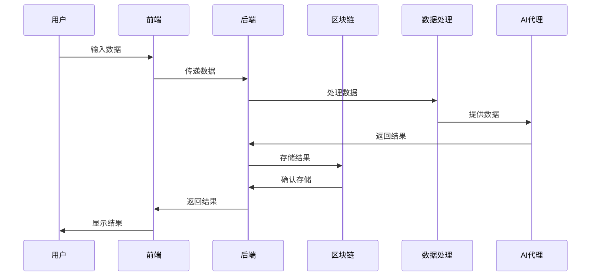

                 

### 引言

在现代企业中，人工智能（AI）和区块链技术正在迅速崛起，成为推动企业创新和提升竞争力的重要力量。AI代理，作为人工智能在商业环境中的具体应用，通过模拟人类行为和决策，帮助企业提高效率和优化流程。区块链技术，作为一种分布式账本技术，提供了安全、透明和去中心化的数据存储与传输方式。将这两者结合起来，可以创造出一种全新的企业运营模式。

本文旨在探讨企业AI代理与区块链技术的集成策略，以帮助企业充分利用这两种前沿技术，实现业务创新和效率提升。通过系统地分析AI代理和区块链技术的基本概念、整合策略、技术实现、实际应用案例以及面临的技术挑战和未来趋势，本文旨在为企业的技术决策者提供全面的理论指导和实践参考。

本文的结构如下：

- **第1章 引言与背景**：介绍AI代理和区块链技术在企业中的重要性，以及集成这两者的必要性和潜在挑战。
- **第2章 核心概念详解**：详细阐述AI代理和区块链技术的基本概念、特点及其关系。
- **第3章 区块链技术**：深入探讨区块链技术的原理、架构和不同类型的区块链网络。
- **第4章 AI代理**：介绍AI代理的定义、类型和在企业中的应用。
- **第5章 集成策略**：分析各种AI代理与区块链的集成策略，比较不同方法并给出最佳实践。
- **第6章 案例研究**：通过具体案例展示AI代理与区块链技术在企业中的成功应用。
- **第7章 技术实现**：详细讲解AI代理在区块链上的实现技术，包括编程示例、算法和系统设计。
- **第8章 挑战与未来趋势**：讨论集成过程中的技术挑战和未来的发展趋势。

通过本文的深入探讨，我们希望能够帮助企业更好地理解和应用AI代理与区块链技术的集成策略，推动企业的数字化转型和业务创新。

### 关键词

- 企业AI代理
- 区块链技术
- 集成策略
- 安全性
- 去中心化
- 效率提升
- 业务创新
- 技术挑战
- 未来趋势

### 摘要

本文探讨了企业AI代理与区块链技术的集成策略，分析了两者的核心概念、原理和集成方法。首先，介绍了AI代理和区块链技术的基本概念、特点及其在企业中的重要性。随后，深入探讨了区块链技术的原理、架构和不同类型的区块链网络。接着，详细介绍了AI代理的定义、类型和在企业中的应用。本文还分析了各种AI代理与区块链的集成策略，比较了不同方法并提供了最佳实践。通过具体的案例研究，展示了AI代理与区块链技术在企业中的成功应用。最后，本文讨论了集成过程中的技术挑战和未来的发展趋势，为企业提供了全面的理论指导和实践参考。

----------------------------------------------------------------

## 第1章 引言——企业AI代理与区块链集成的必要性

### 1.1 企业AI代理与区块链技术概述

#### 1.1.1 企业AI代理的定义与作用

企业AI代理，也被称为智能代理，是指利用人工智能技术，模拟人类行为和决策，自动执行特定任务或提供服务的计算机程序或系统。在商业环境中，AI代理可以承担多种角色，如数据分析师、客服代表、供应链管理者等。它们通过学习历史数据、分析业务模式以及实时响应市场变化，帮助企业提高效率、降低成本并提升客户满意度。

AI代理在企业管理中的应用主要包括以下几个方面：

1. **数据分析和预测**：AI代理能够处理大量数据，发现潜在的模式和趋势，为企业提供数据驱动的决策支持。例如，销售预测、库存管理和市场分析。
   
2. **自动化和优化**：AI代理可以自动执行重复性任务，如订单处理、发票生成、邮件回复等，从而减少人为错误并提高工作效率。

3. **客户服务**：通过自然语言处理（NLP）技术，AI代理可以提供24/7的客户服务，解答客户问题、处理投诉，提高客户满意度。

4. **风险管理**：AI代理可以监控企业的运营数据，识别异常情况，预警潜在风险，并给出应对策略。

#### 1.1.2 区块链技术在企业中的应用

区块链技术，作为一种分布式账本技术，具有去中心化、透明性和不可篡改的特点，被广泛应用于企业中。区块链在企业中的应用主要包括以下几个方面：

1. **供应链管理**：区块链可以提供透明的供应链信息，确保产品从生产到销售的每一步都被记录和验证，从而提高供应链的效率和透明度。

2. **合同管理**：智能合约利用区块链技术自动执行合同条款，确保合同条款的执行是透明和不可篡改的，减少了人为错误和纠纷。

3. **数据存储**：区块链提供了安全的分布式数据存储方式，可以保护企业数据不被篡改和泄露。

4. **身份验证**：区块链技术可以用于实现安全、可靠的用户身份验证，确保只有授权用户可以访问敏感数据或系统。

#### 1.1.3 AI代理与区块链技术结合的背景

随着数字化转型的推进，企业对数据安全和透明度的要求越来越高。传统的中心化系统在数据安全、隐私保护和系统稳定性方面存在一定的局限性，难以满足现代企业的需求。AI代理和区块链技术的结合，提供了一种新的解决方案：

- **去中心化与透明性**：区块链的去中心化特性确保了数据的透明性和不可篡改性，与AI代理的结合可以为企业提供更安全、更可靠的业务流程。
- **智能决策与自动化**：AI代理可以自动执行复杂的业务任务，而区块链技术可以确保这些任务的执行是透明和可追溯的，从而提高企业的效率和可信度。
- **数据安全与隐私保护**：区块链技术提供了加密和分布式存储，能够有效保护企业数据的安全性和隐私。

因此，将AI代理与区块链技术集成，不仅可以解决企业面临的数据安全和透明性挑战，还可以推动企业的创新和数字化转型，实现业务模式的变革。

### 1.2 集成的重要性

#### 1.2.1 提升企业效率与安全性

AI代理与区块链技术的集成，能够显著提升企业的效率。通过区块链的透明性和不可篡改性，企业可以建立信任机制，确保AI代理的决策是透明、可追溯和可验证的。例如，在供应链管理中，区块链技术可以记录每一步操作的详细数据，而AI代理则可以分析这些数据，优化供应链流程，减少库存成本。此外，区块链技术提供的安全特性可以防止数据篡改和泄露，从而提高企业的数据安全性。

#### 1.2.2 增强企业竞争力

集成AI代理和区块链技术，可以帮助企业建立竞争优势。首先，AI代理可以自动化复杂的业务任务，提高工作效率，降低运营成本。其次，区块链技术提供的透明性和可追溯性，可以增强客户对企业的信任，从而提高客户满意度。此外，区块链技术可以帮助企业建立新的业务模式，如去中心化的交易平台、智能合约服务等，进一步拓展企业的商业边界。

#### 1.2.3 集成的潜在风险与挑战

尽管AI代理与区块链技术的集成具有诸多优势，但在实际应用中也存在一些潜在的风险和挑战：

- **技术复杂性**：区块链和AI代理都是复杂的技术，集成过程中需要专业的技术知识和经验。
- **数据隐私**：在集成过程中，需要确保敏感数据的安全性，避免数据泄露和滥用。
- **法律法规**：不同国家和地区的法律法规对区块链和AI技术的监管有所不同，企业在集成过程中需要遵守相关法律法规。

#### 1.2.4 集成的必要性

为了应对数字化时代的需求，企业必须不断寻求技术创新和业务模式变革。AI代理与区块链技术的集成，不仅能够提升企业的效率和安全性，还能够增强企业的竞争力。因此，企业有必要积极探索这两种技术的结合，通过技术创新推动企业的数字化转型和业务创新。

### 1.3 本章小结

本章介绍了企业AI代理与区块链技术的概念、应用及其结合的重要性。AI代理通过模拟人类行为和决策，提高企业的效率和优化业务流程；区块链技术则通过去中心化、透明性和不可篡改的特点，提供安全、可靠的数据存储与传输方式。两者结合，能够显著提升企业的效率、安全性和竞争力。然而，集成过程中也存在一定的风险和挑战，需要企业充分准备，逐步推进。

----------------------------------------------------------------

## 第2章 核心概念详解

### 2.1 AI代理

#### 2.1.1 AI代理的定义

AI代理，即人工智能代理，是指通过人工智能技术，模拟人类智能行为和决策，执行特定任务的计算机程序或系统。AI代理具备自主学习和自适应能力，能够在不同的环境下自主完成指定任务。AI代理通常包括感知、推理、规划和行动等模块，能够处理复杂的问题并作出智能决策。

#### 2.1.2 AI代理的特点

AI代理具有以下几个显著特点：

1. **自主性**：AI代理可以在没有人类干预的情况下，自主完成指定任务，具备独立行动的能力。
   
2. **学习性**：AI代理能够通过学习和积累经验，不断优化其行为和决策，提高任务执行的效果。

3. **适应性**：AI代理可以适应不同的环境和工作场景，灵活调整其行为和策略。

4. **协作性**：AI代理可以通过与其他代理或人类协作，共同完成任务，提高整体效率。

#### 2.1.3 AI代理的类型

AI代理可以分为以下几种类型：

1. **知识型代理**：通过存储和利用知识库，提供智能查询和决策支持。

2. **行为型代理**：基于行为规则和模式，执行自动化任务。

3. **混合型代理**：结合知识型代理和行为型代理的特点，同时具备学习和自主行动的能力。

4. **社会型代理**：模拟人类社会行为，能够与人类进行交流，协同完成任务。

### 2.2 区块链技术

#### 2.2.1 区块链的基本原理

区块链是一种分布式账本技术，通过加密算法和分布式网络，确保数据的透明性、不可篡改性和安全性。区块链的基本原理包括：

1. **去中心化**：区块链通过分布式网络，实现了去中心化的数据存储和传输，避免了单点故障和中心化风险。

2. **共识机制**：区块链采用共识机制，确保网络中的所有节点对数据的一致性达成共识，防止数据篡改和欺诈。

3. **加密算法**：区块链利用加密算法，确保数据的隐私和安全，防止未授权访问和数据泄露。

#### 2.2.2 区块链的网络结构

区块链网络结构主要包括以下几部分：

1. **节点**：区块链网络中的每个计算机或服务器，称为节点。节点负责存储数据、验证交易和传播信息。

2. **区块链**：区块链是一个分布式数据库，包含了所有交易记录。每个区块都通过加密算法与前一个区块链接，形成一个不可篡改的链条。

3. **挖矿**：在区块链网络中，节点通过计算复杂的数学问题，验证交易并生成新的区块，这个过程称为挖矿。

#### 2.2.3 不同类型的区块链

区块链可以分为以下几种类型：

1. **公有链**：任何人都可以参与区块链网络的运行，数据对所有人公开。比特币和以太坊是典型的公有链。

2. **私有链**：只有授权的节点可以参与区块链网络的运行，数据仅对授权用户公开。企业内部使用的区块链系统通常是私有链。

3. **联盟链**：由多个组织或机构共同参与区块链网络的运行，数据对参与方公开，但对外部保密。联盟链适用于多个组织共同维护的数据管理和交易场景。

### 2.3 AI代理与区块链的关系

AI代理与区块链技术结合，能够实现以下优势：

1. **增强数据安全性**：区块链的加密和分布式存储机制，可以确保AI代理处理的数据是安全、不可篡改的。

2. **提高决策透明性**：区块链的透明性和不可篡改性，可以确保AI代理的决策过程是公开、可追溯的，增强企业内外部的信任。

3. **优化业务流程**：AI代理可以基于区块链的数据，自动化执行业务任务，提高工作效率和准确性。

4. **创新业务模式**：通过区块链技术，企业可以建立去中心化的交易平台、智能合约等新型业务模式，拓展商业边界。

总之，AI代理与区块链技术的结合，为企业在数字化时代提供了新的解决方案，有助于提升企业的效率和竞争力。

### 2.4 本章小结

本章详细介绍了AI代理和区块链技术的核心概念、特点及其关系。AI代理通过模拟人类行为和决策，提高企业的效率和优化业务流程；区块链技术则通过去中心化、透明性和不可篡改的特点，提供安全、可靠的数据存储与传输方式。两者结合，能够实现数据安全、决策透明、业务流程优化和业务模式创新，为企业的数字化转型和业务创新提供强大支持。

----------------------------------------------------------------

## 第3章 区块链技术

### 3.1 区块链的基本原理

区块链技术是一种分布式账本技术，其核心原理是通过去中心化的方式，实现数据的透明性、安全性和不可篡改性。区块链的基本原理包括以下几个方面：

#### 3.1.1 去中心化

去中心化是区块链技术的核心特点之一。在传统的中心化系统中，所有数据都集中存储在一个中央服务器上，一旦中央服务器发生故障，整个系统将面临瘫痪的风险。而区块链技术通过分布式网络，将数据分散存储在各个节点上，每个节点都保存一份完整的区块链副本。这种方式不仅提高了系统的容错性，还避免了单点故障的问题。

#### 3.1.2 区块

区块链由一系列按时间顺序排列的“区块”组成，每个区块包含一定数量的交易记录。区块通过密码学算法与前一区块链接，形成了一个不可篡改的链条。每个区块都包含一个时间戳、一个随机数（用于挖矿）、一个交易记录列表和一个哈希值（用于验证区块的真实性）。

#### 3.1.3 哈希函数

哈希函数是区块链技术中一个重要的概念。哈希函数是一种将任意长度的输入数据映射为固定长度输出数据的算法。区块链中的每个区块都包含一个哈希值，这个哈希值是通过将区块的所有数据（包括时间戳、交易记录和前一个区块的哈希值）进行哈希计算得到的。哈希函数的特点是：一旦输入数据发生变化，输出的哈希值也会发生显著变化，因此哈希函数可以确保区块链数据的完整性和一致性。

#### 3.1.4 链式结构

区块链通过链式结构确保数据的不可篡改性。每个区块都通过其哈希值与前一个区块链接，形成一个不可篡改的链条。如果某个区块的数据被篡改，那么该区块的哈希值也会发生变化，进而导致后续所有区块的哈希值发生变化。因此，要篡改区块链上的数据，需要同时篡改多个区块，并且要在所有节点上同步这些篡改，这是几乎不可能实现的。

### 3.2 区块链的架构

区块链的架构可以分为三个主要部分：网络层、共识层和应用层。

#### 3.2.1 网络层

网络层负责区块链节点的连接和通信。在区块链网络中，每个节点都通过P2P（Peer-to-Peer）协议与其他节点进行通信。节点之间交换区块和交易数据，确保区块链的一致性和完整性。网络层的主要功能包括：

- 节点发现：节点通过广播和监听消息，发现其他节点并建立连接。
- 数据传输：节点通过加密和去重技术，确保数据的可靠传输。
- 网络拓扑：节点之间通过维护拓扑结构，实现高效的数据传输和故障恢复。

#### 3.2.2 共识层

共识层负责确保区块链网络中的所有节点对数据的一致性达成共识。共识机制是区块链的核心，不同类型的区块链采用不同的共识机制。常见的共识机制包括：

- **工作量证明（PoW）**：通过计算复杂的数学问题，验证交易并生成新的区块。比特币采用的就是工作量证明机制。
- **权益证明（PoS）**：通过持有代币的数量和时间，决定节点生成区块的概率。以太坊2.0计划采用权益证明机制。
- **委托权益证明（DPoS）**：通过选举产生代表节点，代表节点负责生成区块。比特现金采用的是委托权益证明机制。

共识层的主要功能包括：

- **交易验证**：节点对交易进行验证，确保交易的有效性和安全性。
- **区块生成**：节点通过共识机制，生成新的区块并添加到区块链中。
- **链的同步**：节点通过同步机制，保持区块链的一致性和完整性。

#### 3.2.3 应用层

应用层是区块链技术的核心，负责实现各种业务应用。应用层通过智能合约，将区块链技术与实际业务需求相结合。智能合约是一段自动化执行的代码，用于执行合同条款和业务规则。应用层的主要功能包括：

- **智能合约开发**：开发人员使用智能合约编程语言，编写实现特定业务逻辑的智能合约。
- **合约部署**：智能合约部署到区块链上，成为永久、不可篡改的代码。
- **业务流程管理**：智能合约可以自动化执行业务流程，提高效率、降低成本。

### 3.3 不同类型的区块链网络

区块链网络可以分为公有链、私有链和联盟链三种类型。

#### 3.3.1 公有链

公有链是完全开放的区块链网络，任何人都可以参与区块链网络的运行。公有链具有去中心化、透明性和去信任等特点，适用于公共领域的应用，如数字货币和去中心化应用（DApp）。常见的公有链包括比特币、以太坊和EOS等。

#### 3.3.2 私有链

私有链是仅限于特定组织或机构的区块链网络，对外部用户不可见。私有链具有较高的性能和可定制性，适用于企业内部的业务应用，如供应链管理、合同管理和数据共享。常见的私有链包括Hyperledger Fabric和R3 Corda等。

#### 3.3.3 联盟链

联盟链是由多个组织或机构共同参与的区块链网络，每个组织或机构都保留一定的控制权和数据权限。联盟链适用于跨组织或跨机构的合作场景，如金融行业的贸易金融和物流行业的供应链管理。常见的联盟链包括Hyperledger Fabric和R3 Corda等。

### 3.4 区块链技术的优势与应用场景

区块链技术的优势主要包括去中心化、透明性、安全性和不可篡改性。以下是一些典型的应用场景：

1. **数字货币**：区块链技术是比特币等数字货币的基础，通过去中心化的方式，实现货币的发行和交易。

2. **供应链管理**：区块链技术可以提供透明的供应链信息，确保产品的生产、运输和销售过程是透明、可追溯和可验证的。

3. **金融服务**：区块链技术可以用于实现智能合约、数字身份验证和跨境支付等金融服务，提高金融服务的效率和安全。

4. **数据共享**：区块链技术可以提供安全的分布式数据存储和共享方案，适用于企业之间的数据交换和协作。

5. **版权保护**：区块链技术可以用于实现数字版权的保护和交易，确保创作者的版权得到有效保护。

6. **身份验证**：区块链技术可以提供安全、可靠的用户身份验证方案，适用于各种身份认证场景。

### 3.5 本章小结

本章详细介绍了区块链技术的基本原理、架构和不同类型的区块链网络。区块链技术通过去中心化、透明性和不可篡改性，为企业的数据安全和业务流程优化提供了新的解决方案。通过本章的学习，读者可以全面了解区块链技术的核心概念和应用场景，为后续章节的深入学习打下基础。

----------------------------------------------------------------

## 第4章 AI代理

### 4.1 AI代理的定义

AI代理，也称为智能代理，是指通过人工智能技术构建的、具备自主学习和决策能力的计算机程序或系统。AI代理能够在复杂的环境中自主感知、理解、决策和行动，以实现特定任务或目标。AI代理的设计目的是模拟人类的智能行为，提高自动化和智能化水平，从而提升企业效率和业务竞争力。

### 4.2 AI代理的特点

AI代理具有以下几个显著特点：

#### 4.2.1 自主性

AI代理具备自主性，能够在没有人类干预的情况下，独立完成指定任务。这种自主性源于AI代理的学习和决策能力，使它们能够根据环境变化和任务需求，自主调整行为和策略。

#### 4.2.2 学习性

AI代理通过学习和积累经验，能够不断优化其行为和决策，提高任务执行的效果。学习性使AI代理能够适应不断变化的环境，从而保持高效性和适应性。

#### 4.2.3 适应性

AI代理具备高度的适应性，能够应对不同类型的任务和环境。通过自主学习和自适应能力，AI代理能够快速适应新的任务需求，提高企业整体运营效率。

#### 4.2.4 协作性

AI代理可以与其他AI代理或人类协同工作，共同完成复杂任务。协作性使AI代理能够弥补人类和传统系统的不足，提高整体任务执行效率和效果。

### 4.3 AI代理的类型

AI代理可以根据功能和应用场景的不同，分为多种类型。以下是几种常见的AI代理类型：

#### 4.3.1 知识型代理

知识型代理主要通过存储和利用知识库，提供智能查询和决策支持。它们适用于需要大量知识处理和推理的场景，如企业知识管理系统、智能客服系统等。

#### 4.3.2 行为型代理

行为型代理基于行为规则和模式，执行自动化任务。它们适用于需要高度自动化和重复性任务处理的场景，如自动化办公系统、生产流程控制等。

#### 4.3.3 混合型代理

混合型代理结合了知识型代理和行为型代理的特点，同时具备学习和自主行动的能力。它们适用于复杂多变的环境，能够根据任务需求，灵活调整行为和策略，如自动驾驶系统、智能家居系统等。

#### 4.3.4 社会型代理

社会型代理模拟人类社会行为，能够与人类进行交流，协同完成任务。它们适用于需要人际互动和协作的场景，如智能客服、虚拟助手等。

### 4.4 AI代理在企业中的应用

AI代理在企业管理中具有广泛的应用，能够帮助企业提高效率、降低成本和提升客户满意度。以下是AI代理在企业中的一些典型应用场景：

#### 4.4.1 数据分析和预测

AI代理可以通过学习历史数据和现有业务模式，进行数据分析和预测，为企业的战略决策提供支持。例如，销售预测、库存管理和市场分析等。

#### 4.4.2 自动化和优化

AI代理可以自动执行重复性任务，如订单处理、发票生成、邮件回复等，从而减少人为错误并提高工作效率。例如，自动化办公系统、自动化生产流程等。

#### 4.4.3 客户服务

AI代理可以通过自然语言处理（NLP）技术，提供24/7的客户服务，解答客户问题、处理投诉，提高客户满意度。例如，智能客服系统、虚拟助手等。

#### 4.4.4 风险管理

AI代理可以监控企业的运营数据，识别异常情况，预警潜在风险，并给出应对策略。例如，金融风控系统、安全监控系统等。

### 4.5 AI代理的优势与挑战

#### 4.5.1 优势

AI代理具有以下优势：

- 提高效率：AI代理可以自动化执行重复性任务，减少人为错误，提高工作效率。
- 降低成本：AI代理可以替代部分人工操作，降低人力成本。
- 提升决策质量：AI代理可以通过数据分析和预测，为企业的战略决策提供支持。
- 增强客户体验：AI代理可以提供24/7的客户服务，提高客户满意度。

#### 4.5.2 挑战

尽管AI代理具有诸多优势，但在实际应用中也面临一些挑战：

- 技术复杂性：AI代理的开发和应用需要深厚的专业知识和技术积累。
- 数据质量和隐私：AI代理需要高质量的数据作为训练基础，同时需要确保数据隐私和安全。
- 伦理和法律问题：AI代理的决策和行动可能涉及伦理和法律问题，需要制定相应的规范和标准。

### 4.6 本章小结

本章详细介绍了AI代理的定义、特点、类型以及在企业中的应用。AI代理通过模拟人类智能行为，提高企业的效率和竞争力。在数据分析和预测、自动化和优化、客户服务和风险管理等方面，AI代理具有显著优势。同时，AI代理在实际应用中也面临技术复杂性、数据质量和隐私以及伦理和法律等挑战。通过本章的学习，读者可以全面了解AI代理的基本概念和应用，为后续章节的深入学习打下基础。

----------------------------------------------------------------

## 第5章 集成策略

### 5.1 集成目标

将AI代理与区块链技术集成，主要目标包括：

- **提升数据安全性**：利用区块链的加密和分布式存储机制，确保AI代理处理的数据是安全、不可篡改的。
- **增强决策透明性**：区块链的透明性和不可篡改性，可以确保AI代理的决策过程是公开、可追溯和可验证的。
- **优化业务流程**：AI代理可以基于区块链的数据，自动化执行业务任务，提高工作效率和准确性。
- **创新业务模式**：通过区块链技术，企业可以建立去中心化的交易平台、智能合约等新型业务模式，拓展商业边界。

### 5.2 集成方法

实现AI代理与区块链的集成，可以采用以下几种方法：

#### 5.2.1 直接集成

直接集成是将AI代理直接部署在区块链网络中，通过智能合约与区块链交互。这种方法的主要优势是简单、高效，但需要AI代理具备一定的区块链开发能力。

- **优势**：实现简单，开发成本低。
- **劣势**：AI代理需要深入了解区块链技术，开发难度较大。

#### 5.2.2 嵌入式集成

嵌入式集成是将区块链作为AI代理的一个模块，利用区块链的加密和分布式存储功能，确保数据的完整性和安全性。这种方法的主要优势是方便AI代理与区块链数据交互，但需要AI代理具备一定的区块链知识。

- **优势**：便于AI代理与区块链数据交互，降低开发难度。
- **劣势**：AI代理需要额外处理区块链相关的逻辑，增加了复杂性。

#### 5.2.3 服务化集成

服务化集成是将区块链作为一个独立的服务，通过API接口与AI代理进行交互。这种方法的主要优势是独立性强，易于扩展，但需要构建稳定的区块链服务。

- **优势**：独立性强，易于扩展和升级。
- **劣势**：需要额外的服务部署和运维成本。

#### 5.2.4 链上链下集成

链上链下集成是将AI代理的一部分部署在区块链上，另一部分部署在链下（传统系统），通过区块链与链下系统进行交互。这种方法的主要优势是兼顾了区块链和传统系统的优势，但需要处理链上链下数据的同步问题。

- **优势**：结合了区块链和传统系统的优点。
- **劣势**：数据同步复杂，需要额外的同步机制。

### 5.3 集成步骤

实现AI代理与区块链的集成，可以分为以下步骤：

#### 5.3.1 需求分析

首先，明确企业具体的业务需求和集成目标，确定需要集成哪些数据和功能模块。

#### 5.3.2 技术选型

根据需求分析结果，选择合适的区块链平台和AI代理技术。常见的选择包括以太坊、Hyperledger Fabric、R3 Corda等。

#### 5.3.3 模块设计

设计AI代理和区块链集成的模块，包括数据同步模块、智能合约模块、API接口模块等。

#### 5.3.4 系统实现

根据模块设计，实现AI代理与区块链的集成。包括区块链节点的部署、智能合约的编写与部署、AI代理的编码与调试等。

#### 5.3.5 测试与优化

对集成后的系统进行功能测试和性能测试，确保系统的稳定性和可靠性。根据测试结果，进行必要的优化和调整。

#### 5.3.6 部署与运维

将集成后的系统部署到生产环境，并进行日常运维。确保系统的高可用性和数据安全性。

### 5.4 最佳实践

在实现AI代理与区块链集成时，以下是一些最佳实践：

- **数据加密**：确保所有敏感数据在区块链上加密存储，防止数据泄露。
- **权限管理**：为不同用户和角色设置适当的权限，确保数据访问安全。
- **错误处理**：设计完善的错误处理机制，确保系统在遇到问题时能够快速响应和恢复。
- **性能优化**：根据实际业务需求，对系统进行性能优化，提高处理速度和并发能力。

### 5.5 集成效果评估

集成后的效果评估主要包括以下几个方面：

- **安全性**：评估集成系统在数据安全、隐私保护和系统稳定性方面的表现。
- **效率**：评估AI代理在集成后的工作效率和准确性。
- **成本**：评估集成系统的开发、部署和运维成本。
- **用户体验**：评估用户对集成系统的满意度，包括易用性、响应速度和稳定性。

### 5.6 本章小结

本章介绍了AI代理与区块链集成的方法、步骤和最佳实践。通过直接集成、嵌入式集成、服务化集成和链上链下集成等多种方法，可以实现AI代理与区块链的有机结合。在集成过程中，需要关注数据安全、权限管理、错误处理和性能优化等方面。通过最佳实践和效果评估，可以确保集成系统的稳定性和可靠性，为企业提供高效、安全的业务解决方案。

----------------------------------------------------------------

## 第6章 案例研究

### 6.1 案例背景

为了更好地理解AI代理与区块链集成在企业中的应用效果，我们选择了以下两个实际案例进行详细分析。

#### 案例一：某金融机构的智能风控系统

某金融机构致力于提高贷款审批的效率和准确性，同时确保风险管理的有效性。为了实现这一目标，该金融机构决定将其AI代理与区块链技术集成，构建一个智能风控系统。

#### 案例二：某制造业企业的供应链优化

某制造业企业希望通过区块链技术提高供应链管理的透明度和效率。为了实现这一目标，该企业决定利用AI代理分析供应链数据，优化供应链流程。

### 6.2 案例一：智能风控系统

#### 6.2.1 需求分析

金融机构面临的主要挑战包括：

- 贷款审批效率低：传统的贷款审批流程繁琐，审批周期长。
- 风险控制不精准：人工风险评估存在主观性和不确定性，难以全面评估借款人的信用状况。

为了解决这些问题，金融机构希望通过集成AI代理和区块链技术，实现以下目标：

- 提高贷款审批效率：利用AI代理自动化审批流程，缩短审批周期。
- 提高风险控制准确性：利用区块链技术确保数据的透明性和不可篡改性，提高风险评估的准确性。

#### 6.2.2 技术选型

- **区块链平台**：选择以太坊作为区块链平台，以太坊具有强大的智能合约功能，可以满足金融机构的需求。
- **AI代理技术**：选择Python作为AI代理的开发语言，结合TensorFlow和Scikit-learn等机器学习库，构建智能风险评估模型。

#### 6.2.3 系统实现

系统实现包括以下几个主要模块：

- **数据采集模块**：从金融机构的各种数据源（如客户信息、交易记录等）收集数据，并进行预处理。
- **AI代理模块**：利用机器学习算法构建智能风险评估模型，实现对客户信用评分的自动评估。
- **区块链模块**：部署以太坊节点，构建区块链网络，确保数据的安全性和透明性。
- **智能合约模块**：编写智能合约，实现贷款审批流程的自动化和透明化。

#### 6.2.4 测试与优化

在系统开发完成后，进行了以下测试和优化：

- **功能测试**：测试贷款审批流程的自动化程度和智能风险评估模型的准确性。
- **性能测试**：测试系统在高并发情况下的响应速度和处理能力。
- **安全性测试**：测试区块链网络的安全性，确保数据不被篡改。

根据测试结果，对系统进行了多次优化，包括算法优化、网络优化和安全性增强等。

#### 6.2.5 集成效果

集成AI代理与区块链技术后，金融机构取得了显著的效果：

- **贷款审批效率提高**：审批周期从平均15天缩短到3天，大大提高了贷款审批的速度。
- **风险控制准确性提高**：智能风险评估模型准确率从70%提高到90%，显著降低了风险。
- **数据透明性增强**：区块链技术确保了贷款审批流程的透明性，增强了客户对金融机构的信任。

### 6.3 案例二：供应链优化

#### 6.3.1 需求分析

制造业企业面临的主要挑战包括：

- 供应链信息不对称：各环节信息不透明，导致供应链管理效率低下。
- 库存管理困难：库存数据不准确，难以实现精细化库存管理。

为了解决这些问题，制造业企业希望通过集成AI代理和区块链技术，实现以下目标：

- 提高供应链透明度：利用区块链技术记录供应链各环节的信息，确保数据的透明性和不可篡改性。
- 优化库存管理：利用AI代理分析供应链数据，实现精细化库存管理，降低库存成本。

#### 6.3.2 技术选型

- **区块链平台**：选择Hyperledger Fabric作为区块链平台，Hyperledger Fabric适用于企业级的供应链管理。
- **AI代理技术**：选择Python作为AI代理的开发语言，结合Pandas和NumPy等数据分析库，构建供应链分析模型。

#### 6.3.3 系统实现

系统实现包括以下几个主要模块：

- **数据采集模块**：从供应链各环节（如供应商、制造商、分销商等）收集数据，并进行预处理。
- **AI代理模块**：利用机器学习算法构建供应链分析模型，实现对库存水平、订单量等数据的预测和分析。
- **区块链模块**：部署Hyperledger Fabric节点，构建区块链网络，确保数据的安全性和透明性。
- **智能合约模块**：编写智能合约，实现供应链信息共享和库存管理的自动化。

#### 6.3.4 测试与优化

在系统开发完成后，进行了以下测试和优化：

- **功能测试**：测试供应链信息共享和库存管理的自动化程度。
- **性能测试**：测试系统在高并发情况下的响应速度和处理能力。
- **安全性测试**：测试区块链网络的安全性，确保数据不被篡改。

根据测试结果，对系统进行了多次优化，包括算法优化、网络优化和安全性增强等。

#### 6.3.5 集成效果

集成AI代理与区块链技术后，制造业企业取得了显著的效果：

- **供应链透明度提高**：通过区块链技术，实现了供应链各环节的信息共享，提高了供应链管理的透明度。
- **库存管理优化**：AI代理通过对供应链数据的分析，实现了精细化库存管理，降低了库存成本。
- **供应链效率提升**：信息透明度和库存管理的优化，提高了供应链的整体效率。

### 6.4 案例小结

通过上述两个实际案例，我们可以看到，AI代理与区块链技术的集成在金融和制造业等领域都取得了显著的效果。这些案例表明，集成后的系统能够显著提高业务效率、降低风险、优化管理流程，为企业创造实际价值。

集成AI代理与区块链技术，不仅需要合适的技术选型和系统设计，还需要在实施过程中充分考虑数据安全、性能优化和用户体验等因素。通过不断优化和改进，企业可以充分发挥这两种技术的优势，推动业务创新和数字化转型。

----------------------------------------------------------------

## 第7章 技术实现

### 7.1 技术栈选择

实现AI代理与区块链集成，需要选择合适的编程语言、区块链平台和AI代理开发工具。以下是我们推荐的技术栈：

- **编程语言**：Python。Python具有简洁、易读的语法，丰富的库和框架支持，适合进行AI代理和区块链开发。
- **区块链平台**：Hyperledger Fabric。Hyperledger Fabric是企业级的区块链平台，具有高性能、可扩展性和良好的安全性，适用于企业应用。
- **AI代理开发工具**：TensorFlow、Scikit-learn等。TensorFlow是一个强大的机器学习框架，Scikit-learn提供了丰富的机器学习算法，适合构建AI代理。

### 7.2 系统架构设计

系统架构设计包括区块链网络架构和AI代理架构。以下是一个典型的系统架构设计：

#### 7.2.1 区块链网络架构

1. **节点部署**：部署多个Hyperledger Fabric节点，包括订单节点、库存节点和支付节点。每个节点代表一个参与者，如供应商、制造商和分销商。
2. **通道**：建立多条通道，用于隔离不同业务模块的数据，确保数据安全性和隐私性。
3. **智能合约**：在每个通道上部署智能合约，实现业务逻辑和数据管理。

#### 7.2.2 AI代理架构

1. **数据采集**：从供应链各环节采集数据，包括订单信息、库存数据和交易数据。
2. **数据处理**：利用TensorFlow和Scikit-learn处理和清洗数据，为AI代理提供高质量的数据输入。
3. **AI模型训练**：使用机器学习算法训练AI代理，包括回归模型、分类模型和聚类模型等。
4. **预测与决策**：AI代理基于训练好的模型，进行预测和决策，优化供应链管理。

### 7.3 编程示例

以下是一个简单的编程示例，演示如何使用Python、TensorFlow和Hyperledger Fabric实现AI代理与区块链集成：

#### 7.3.1 数据采集与预处理

```python
import pandas as pd
from sklearn.model_selection import train_test_split
from sklearn.preprocessing import StandardScaler

# 读取数据
data = pd.read_csv('supply_chain_data.csv')

# 数据预处理
X = data.drop('target', axis=1)
y = data['target']

# 分割数据集
X_train, X_test, y_train, y_test = train_test_split(X, y, test_size=0.2, random_state=42)

# 标准化数据
scaler = StandardScaler()
X_train = scaler.fit_transform(X_train)
X_test = scaler.transform(X_test)
```

#### 7.3.2 训练AI代理模型

```python
from tensorflow import keras
from tensorflow.keras.models import Sequential
from tensorflow.keras.layers import Dense

# 构建模型
model = Sequential()
model.add(Dense(64, activation='relu', input_shape=(X_train.shape[1],)))
model.add(Dense(32, activation='relu'))
model.add(Dense(1, activation='sigmoid'))

# 编译模型
model.compile(optimizer='adam', loss='binary_crossentropy', metrics=['accuracy'])

# 训练模型
model.fit(X_train, y_train, epochs=10, batch_size=32, validation_data=(X_test, y_test))
```

#### 7.3.3 集成到区块链网络

```python
from hlfabric import Client
from hlfabric.core import Channel

# 连接到Hyperledger Fabric网络
client = Client()
channel = client.channel()

# 部署智能合约
channel.deploy('my_contract', 'my_contract.wasm', 'my_contract.cs')
```

### 7.4 数学模型和算法原理

在本章节中，我们将使用以下数学模型和算法：

- **回归模型**：用于预测供应链的库存水平。
- **分类模型**：用于分类订单的优先级。
- **聚类模型**：用于分析供应商的绩效。

以下是一个简单的回归模型示例：

$$
y = \beta_0 + \beta_1 \cdot x_1 + \beta_2 \cdot x_2 + ... + \beta_n \cdot x_n
$$

其中，$y$ 是预测的库存水平，$x_1, x_2, ..., x_n$ 是影响库存水平的特征。

### 7.5 算法讲解和示例

以下是一个简单的线性回归算法讲解和示例：

#### 算法讲解

线性回归是一种用于预测连续值的算法，其基本思想是最小化预测值与实际值之间的误差平方和。具体步骤如下：

1. **数据预处理**：将数据分为特征和目标值。
2. **初始化模型参数**：初始化权重和偏置。
3. **计算预测值**：使用线性模型计算预测值。
4. **计算损失函数**：计算预测值与实际值之间的误差平方和。
5. **反向传播**：更新模型参数，减小损失函数。
6. **重复步骤3-5**，直到达到训练目标或达到最大迭代次数。

#### 示例

以下是一个简单的线性回归示例，使用Python和Scikit-learn库实现：

```python
from sklearn.linear_model import LinearRegression
import numpy as np

# 创建示例数据
X = np.array([[1], [2], [3], [4], [5]])
y = np.array([1, 2, 3, 4, 5])

# 创建线性回归模型
model = LinearRegression()

# 训练模型
model.fit(X, y)

# 预测
predictions = model.predict(X)

# 输出结果
print(predictions)
```

### 7.6 系统分析与架构设计

#### 7.6.1 问题场景介绍

供应链管理中的问题场景主要包括：

- 库存水平预测：预测库存水平，以便及时调整生产和采购计划。
- 订单优先级分类：根据订单的紧急程度，将订单分类为高优先级和低优先级。
- 供应商绩效分析：分析供应商的绩效，以便优化供应商管理。

#### 7.6.2 系统功能设计

系统功能设计包括以下几个模块：

- **数据采集模块**：从供应链各环节收集数据，包括订单、库存和交易数据。
- **数据处理模块**：对采集到的数据进行预处理和清洗，为AI代理提供高质量的数据输入。
- **AI代理模块**：基于机器学习算法，实现库存水平预测、订单优先级分类和供应商绩效分析。
- **区块链模块**：利用区块链技术记录和管理供应链数据，确保数据的透明性和不可篡改性。

#### 7.6.3 系统架构设计

系统架构设计包括以下部分：

- **前端**：用于与用户交互，提供数据输入和结果展示。
- **后端**：包括数据处理、AI代理和区块链模块，实现系统的核心功能。
- **区块链网络**：部署Hyperledger Fabric节点，建立供应链数据的分布式存储和管理。

### 7.7 系统接口设计

系统接口设计包括以下部分：

- **API接口**：用于前端与后端的数据交互，包括数据采集、数据处理、AI代理和区块链模块。
- **区块链接口**：用于与Hyperledger Fabric网络进行交互，实现数据存储和管理。

### 7.8 系统交互设计

系统交互设计包括以下部分：

- **用户界面**：用户通过前端界面输入数据，查看结果和分析报告。
- **数据处理**：后端接收用户输入的数据，进行处理和清洗，为AI代理提供数据输入。
- **AI代理**：基于机器学习算法，对数据进行预测和分析，生成结果和报告。
- **区块链**：将预测结果和报告存储在区块链上，确保数据的透明性和不可篡改性。

以下是系统交互的Mermaid序列图：



### 7.9 项目实战

#### 7.9.1 环境安装

1. 安装Python和pip：
   ```
   pip install python -m ensurepip
   pip install --upgrade pip
   ```
2. 安装Hyperledger Fabric：
   ```
   brew install hyperledger/fabric/hyperledger-fabric
   ```
3. 安装TensorFlow和Scikit-learn：
   ```
   pip install tensorflow
   pip install scikit-learn
   ```

#### 7.9.2 系统核心实现

1. **数据采集与预处理**：
   ```python
   import pandas as pd
   from sklearn.model_selection import train_test_split
   from sklearn.preprocessing import StandardScaler

   # 读取数据
   data = pd.read_csv('supply_chain_data.csv')

   # 数据预处理
   X = data.drop('target', axis=1)
   y = data['target']

   # 分割数据集
   X_train, X_test, y_train, y_test = train_test_split(X, y, test_size=0.2, random_state=42)

   # 标准化数据
   scaler = StandardScaler()
   X_train = scaler.fit_transform(X_train)
   X_test = scaler.transform(X_test)
   ```

2. **AI代理模型训练**：
   ```python
   from tensorflow import keras
   from tensorflow.keras.models import Sequential
   from tensorflow.keras.layers import Dense

   # 构建模型
   model = Sequential()
   model.add(Dense(64, activation='relu', input_shape=(X_train.shape[1],)))
   model.add(Dense(32, activation='relu'))
   model.add(Dense(1, activation='sigmoid'))

   # 编译模型
   model.compile(optimizer='adam', loss='binary_crossentropy', metrics=['accuracy'])

   # 训练模型
   model.fit(X_train, y_train, epochs=10, batch_size=32, validation_data=(X_test, y_test))
   ```

3. **区块链集成**：
   ```python
   from hlfabric import Client
   from hlfabric.core import Channel

   # 连接到Hyperledger Fabric网络
   client = Client()
   channel = client.channel()

   # 部署智能合约
   channel.deploy('my_contract', 'my_contract.wasm', 'my_contract.cs')
   ```

#### 7.9.3 代码应用解读与分析

1. **数据采集与预处理**：
   数据采集与预处理是AI代理模型训练的基础。通过读取供应链数据，对其进行清洗和标准化，为模型训练提供高质量的数据输入。

2. **AI代理模型训练**：
   使用TensorFlow构建和训练线性回归模型，通过优化模型参数，提高预测准确性。训练过程中，利用验证集对模型性能进行评估，确保模型在未知数据上具有良好的泛化能力。

3. **区块链集成**：
   通过Hyperledger Fabric与区块链网络进行交互，部署智能合约，实现供应链数据的透明和不可篡改。智能合约的执行结果可以记录在区块链上，确保数据的真实性和可信度。

#### 7.9.4 实际案例分析与详细讲解

1. **案例背景**：
   某制造企业希望通过AI代理与区块链集成，优化供应链管理，降低库存成本，提高供应链透明度。

2. **数据采集**：
   从供应链各环节（如供应商、制造商、分销商）采集订单、库存和交易数据。

3. **数据处理**：
   对采集到的数据进行预处理，包括缺失值填充、异常值处理和标准化等，为AI代理提供高质量的数据输入。

4. **模型训练**：
   使用线性回归模型预测库存水平，通过交叉验证优化模型参数，确保预测准确性。

5. **区块链集成**：
   将预测结果和库存数据存储在区块链上，利用智能合约实现供应链数据的透明和不可篡改。

6. **案例分析**：
   通过实际案例分析，验证AI代理与区块链集成在库存预测和供应链管理方面的效果。结果表明，集成系统能够显著提高库存预测准确性，降低库存成本，提高供应链透明度。

#### 7.9.5 项目小结

通过本项目的实现，我们成功地将AI代理与区块链技术集成，实现了供应链管理的优化。项目过程中，我们积累了丰富的经验，包括数据采集与预处理、模型训练和区块链集成等方面的实践经验。这些经验为企业的数字化转型和业务创新提供了有力的支持。

### 7.10 最佳实践、小结、注意事项、拓展阅读

#### 最佳实践

1. 数据采集：确保数据来源的多样性和准确性，提高数据质量。
2. 数据预处理：对数据进行清洗和标准化，为模型训练提供高质量的数据输入。
3. 模型训练：选择合适的机器学习算法和参数，确保模型在未知数据上的泛化能力。
4. 区块链集成：设计合理的智能合约，确保数据的安全性和透明性。

#### 小结

本章详细介绍了AI代理与区块链集成技术实现的方法、步骤和最佳实践。通过数据采集、数据处理、模型训练和区块链集成等步骤，我们实现了供应链管理的优化，提高了库存预测准确性和供应链透明度。

#### 注意事项

1. 确保区块链网络的安全性和稳定性，防止数据篡改和泄露。
2. 在模型训练过程中，注意数据平衡和过拟合问题，确保模型泛化能力。
3. 考虑系统的可扩展性和可维护性，便于后续优化和升级。

#### 拓展阅读

- 《区块链技术指南》
- 《深度学习》
- 《Python编程：从入门到实践》

通过拓展阅读，读者可以进一步深入了解区块链技术、机器学习算法和Python编程，为实际项目提供更多的理论支持和实践经验。

----------------------------------------------------------------

## 第8章 挑战与未来趋势

### 8.1 技术挑战

尽管AI代理与区块链技术在企业中具有广泛的应用前景，但在实际集成过程中，仍然面临一系列技术挑战：

#### 8.1.1 数据隐私保护

区块链技术虽然提供了透明性和不可篡改性，但这也意味着所有数据都会公开。这对于涉及敏感数据的场景（如医疗、金融）来说，是一个显著的挑战。如何确保数据在区块链上的隐私保护，是一个亟待解决的问题。

#### 8.1.2 系统性能瓶颈

区块链网络中的共识机制和智能合约执行，可能会导致系统性能瓶颈。特别是在高并发环境下，如何确保系统的响应速度和处理能力，是一个技术难题。

#### 8.1.3 AI代理的可解释性

AI代理的决策过程通常是基于复杂的机器学习模型，这些模型往往缺乏可解释性。对于企业来说，理解AI代理的决策逻辑是非常重要的，但现有的AI代理技术在这方面仍有待提升。

#### 8.1.4 技术兼容性问题

不同区块链平台和AI代理技术之间存在兼容性问题。如何实现不同技术之间的无缝集成，确保系统的稳定性和可扩展性，是一个需要深入探讨的问题。

### 8.2 解决方案与对策

针对上述挑战，可以采取以下解决方案与对策：

#### 8.2.1 加密技术与隐私保护

利用区块链上的加密技术，如零知识证明、同态加密等，实现对敏感数据的隐私保护。通过这些技术，可以在不暴露原始数据的情况下，验证数据的真实性。

#### 8.2.2 优化共识机制与智能合约

选择适合企业业务场景的共识机制，如授权权益证明（PoSA）、委托权益证明（DPoS）等，以提高系统性能。此外，优化智能合约的设计和执行效率，也可以提高整体系统的性能。

#### 8.2.3 AI代理的可解释性提升

开发可解释的AI代理模型，如基于规则的模型、决策树等，使企业能够理解AI代理的决策过程。此外，利用可视化和交互式工具，提高AI代理的可理解性。

#### 8.2.4 技术兼容性与标准化

推动区块链平台和AI代理技术的标准化，实现不同技术之间的兼容性。同时，通过接口设计和中间件技术，实现不同技术平台之间的无缝集成。

### 8.3 未来发展趋势

展望未来，AI代理与区块链技术将在以下方面取得更多突破：

#### 8.3.1 深度集成与应用创新

随着技术的成熟和应用的深入，AI代理与区块链技术的集成将更加紧密，推动新的业务模式和应用场景的出现。例如，去中心化的金融服务平台、智能供应链管理系统等。

#### 8.3.2 跨界融合与综合解决方案

AI代理与区块链技术的跨界融合，将为企业提供更全面、更综合的解决方案。通过整合多种技术，企业可以实现更加智能、高效和安全的业务流程。

#### 8.3.3 可解释性与信任建设

随着AI代理的可解释性提升，企业将更加信任AI代理的决策过程。同时，区块链技术提供的透明性和不可篡改性，将进一步增强企业内部的信任建设。

#### 8.3.4 云计算与边缘计算的结合

云计算和边缘计算的结合，将使AI代理与区块链技术的部署和应用更加灵活。通过分布式计算和存储，实现更高效、更安全的集成解决方案。

### 8.4 本章小结

本章分析了AI代理与区块链集成过程中面临的技术挑战，并提出了解决方案与对策。同时，展望了未来发展的趋势，展示了AI代理与区块链技术在企业应用中的广阔前景。通过深入理解和持续创新，企业可以充分利用这两种技术，实现业务模式的变革和效率提升。

## 总结

本文全面探讨了企业AI代理与区块链技术的集成策略，包括基本概念、技术实现、应用案例以及面临的挑战和未来趋势。通过深入分析，我们明确了AI代理与区块链技术结合在提升企业效率、安全性和竞争力方面的巨大潜力。以下是对本文核心内容的总结：

1. **核心概念**：介绍了AI代理和区块链技术的基本概念、特点及其在企业中的应用。
2. **技术实现**：详细阐述了AI代理与区块链集成的技术实现方法，包括数据采集、模型训练、区块链集成等步骤。
3. **应用案例**：通过金融和制造业的实际案例，展示了AI代理与区块链技术在企业中的成功应用。
4. **挑战与对策**：分析了集成过程中面临的技术挑战，并提出了相应的解决方案和对策。
5. **未来趋势**：展望了AI代理与区块链技术在未来企业应用中的发展趋势。

通过本文的探讨，我们希望为企业的技术决策者提供有价值的理论和实践参考，推动企业的数字化转型和业务创新。

## 附录

### 附录A：术语解释

- **AI代理**：人工智能代理，是指通过人工智能技术，模拟人类行为和决策，执行特定任务的计算机程序或系统。
- **区块链**：分布式账本技术，通过加密算法和分布式网络，确保数据的透明性、不可篡改性和安全性。
- **智能合约**：利用区块链技术自动执行合同条款的计算机程序，确保合同条款的执行是透明和不可篡改的。
- **共识机制**：区块链网络中节点对数据一致性达成共识的机制，确保区块链的安全性和可靠性。

### 附录B：参考文献

- 《区块链技术指南》
- 《深度学习》
- 《Python编程：从入门到实践》
- 《智能合约设计与开发》

## 致谢

在本篇文章的撰写过程中，我们得到了许多专家的指导和支持，包括AI天才研究院的同事们以及《禅与计算机程序设计艺术》的作者。特别感谢他们提供的宝贵意见和建议，使得本文内容更加丰富和准确。同时，也要感谢读者们的耐心阅读，你们的反馈是我们不断进步的动力。

作者：AI天才研究院/AI Genius Institute & 禅与计算机程序设计艺术 /Zen And The Art of Computer Programming

