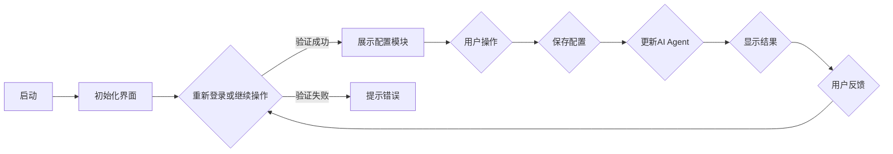
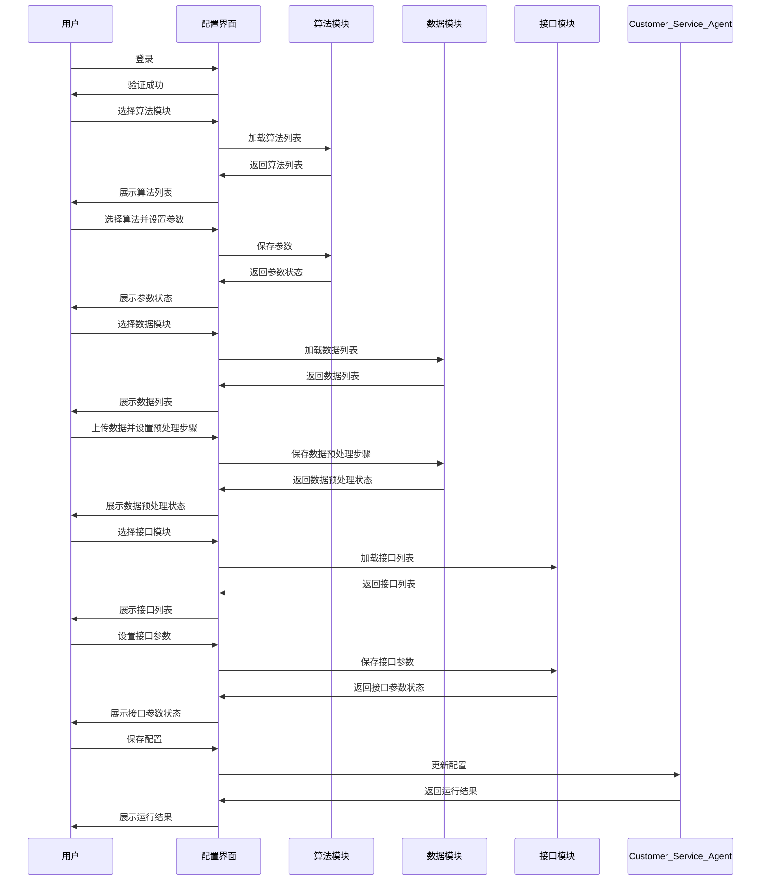
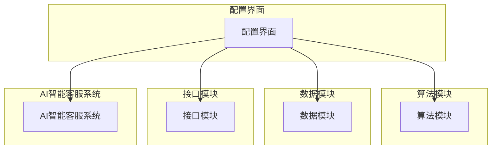
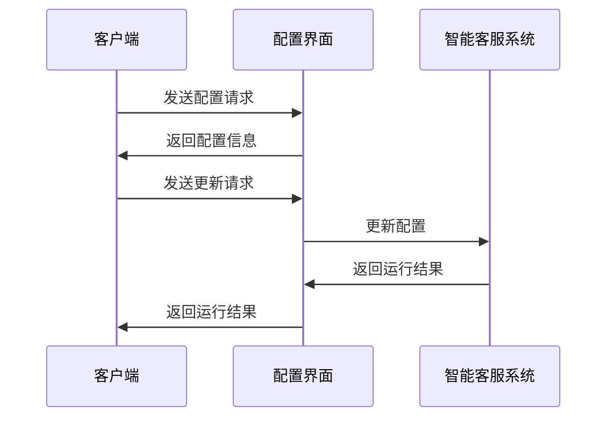
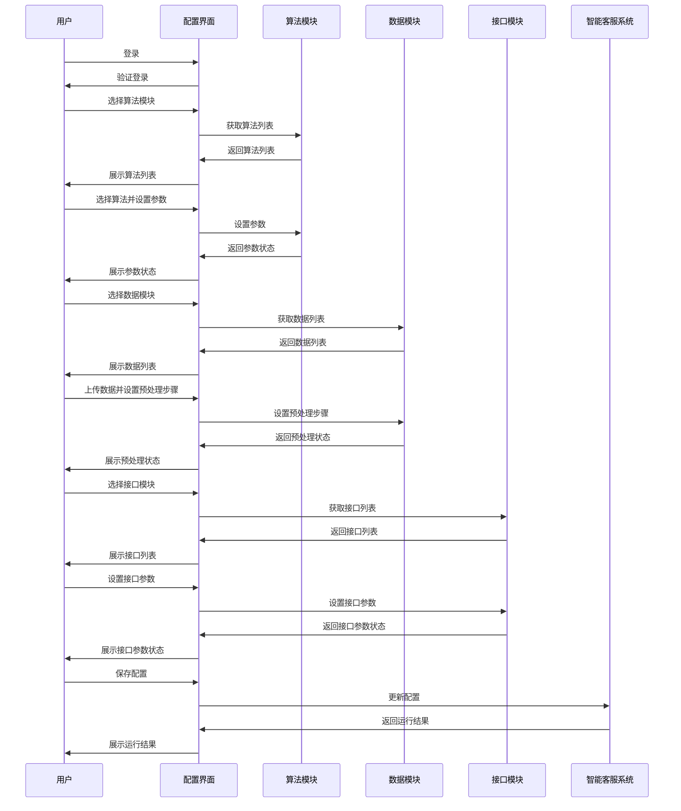

                 

### 文章标题

## 企业AI Agent的可视化配置界面：降低使用门槛

### 关键词

- 企业AI Agent
- 可视化配置
- 使用门槛
- 系统架构
- 算法原理

### 摘要

随着人工智能技术的迅猛发展，企业AI Agent作为智能化运营工具的应用日益广泛。本文旨在深入探讨企业AI Agent的可视化配置界面设计，通过降低使用门槛，提高其易用性和普及率。文章首先介绍了企业AI Agent的背景与核心概念，接着详细讲解了算法原理和系统架构设计。通过项目实战和分析，本文探讨了如何通过可视化配置界面优化用户体验，最后给出了最佳实践和拓展阅读建议。

----------------------------------------------------------------

### 背景介绍

#### 企业AI Agent的背景

在数字经济时代，企业面临着日益激烈的市场竞争和不断变化的市场需求。为了保持竞争优势，企业开始将人工智能技术应用于业务流程的自动化和优化。企业AI Agent作为一种智能化的业务代理，能够帮助企业自动化决策、提高效率、降低成本。AI Agent的出现，标志着人工智能技术从理论研究走向实际应用，成为企业数字化转型的重要工具。

#### 问题背景与问题描述

随着企业AI Agent的广泛应用，如何降低其使用门槛、提高易用性成为了一个亟待解决的问题。传统的AI Agent配置通常依赖于复杂的代码编写和配置文件调整，这对普通业务人员来说是一个巨大的挑战。为了解决这一问题，我们需要设计一个直观、易用的可视化配置界面，使得非技术背景的用户也能够轻松地配置和部署AI Agent。

#### 解决方法

可视化配置界面的设计旨在通过图形化界面和简化的配置流程，降低用户的使用门槛。界面设计应遵循用户友好原则，提供直观的操作界面和丰富的交互功能。此外，还需要确保配置界面的灵活性和可扩展性，以满足不同企业的多样化需求。

#### 边界与外延

企业AI Agent的可视化配置界面设计需要明确边界与外延，确保功能的合理性和适用性。边界方面，界面设计应聚焦于核心配置功能，避免过度复杂化；外延方面，界面设计应考虑到不同场景下的扩展性，例如自定义算法模块、数据源接入等。

#### 核心概念与要素组成

1. **AI Agent**: 人工智能代理，负责自动化执行特定任务。
2. **可视化配置界面**: 提供图形化操作界面，简化配置流程。
3. **配置模块**: 包括算法配置、数据配置、接口配置等。
4. **用户角色**: 技术人员、业务人员、项目经理等。

### 核心概念与联系

#### 核心概念

1. **可视化配置**：通过图形界面实现参数配置，降低技术门槛。
2. **模块化设计**：将配置功能拆分为模块，提高扩展性和灵活性。
3. **用户界面设计**：设计直观、易用的用户交互界面。
4. **数据可视化**：利用图表、图形等手段展示数据状态和运行结果。

#### 概念属性特征对比

| 特征       | 可视化配置 | 模块化设计 | 用户界面设计 | 数据可视化 |
|------------|------------|------------|------------|------------|
| 目的       | 简化配置流程 | 提高扩展性 | 提高用户体验 | 实时展示数据 |
| 技术实现   | 图形界面 | API接口 | 前端技术 | 数据可视化库 |
| 适用场景   | 初学者、业务人员 | 开发者、技术团队 | 普通用户 | 数据分析师 |
| 灵活性     | 较高 | 高 | 高 | 高 |

#### ER实体关系图

```mermaid
erDiagram
  AI_Agent ||--|{ Visualization_Configuration_Interface : 配置界面 }
  AI_Agent ||--|{ Configuration_Module : 配置模块 }
  AI_Agent ||--|{ User_Interface_Design : 用户界面设计 }
  AI_Agent ||--|{ Data_Visualization : 数据可视化 }
```

### 算法原理讲解

#### 算法流程图



#### 算法原理与数学模型

企业AI Agent的可视化配置界面设计基于以下算法原理：

1. **用户界面初始化**：界面初始化阶段，系统加载基础组件和预设配置，为用户展示初始界面。
2. **用户登录验证**：用户登录验证通过后，系统获取用户权限，并根据权限展示相应的配置模块。
3. **用户操作与反馈**：用户在界面上进行配置操作，系统实时更新配置状态，并在界面中展示。
4. **配置保存与更新**：用户确认配置后，系统将配置信息保存到数据库，并更新AI Agent的配置。

数学模型主要包括：

$$
\text{用户操作} = f(\text{初始界面}, \text{配置模块}, \text{用户权限})
$$

$$
\text{配置状态更新} = g(\text{用户操作}, \text{当前配置})
$$

$$
\text{配置保存} = h(\text{配置状态更新}, \text{数据库})
$$

#### 算法举例说明

假设用户A想要配置一个用于客户服务的人工智能代理，以下是具体的操作步骤：

1. **用户登录**：用户A使用公司分配的用户名和密码登录可视化配置界面。
2. **初始化界面**：界面展示AI Agent的配置模块，包括算法配置、数据配置和接口配置。
3. **选择算法配置**：用户A选择基于机器学习的客户服务算法，并设置参数。
4. **数据配置**：用户A上传客户服务相关的数据集，并配置数据预处理步骤。
5. **接口配置**：用户A配置AI Agent与客户服务系统的接口，设置通信协议和API接口。
6. **保存配置**：用户A确认配置，系统将配置信息保存到数据库，并更新AI Agent的配置。
7. **运行AI Agent**：AI Agent根据新配置开始工作，用户A可以实时查看AI Agent的服务表现和运行结果。

### 系统分析与架构设计方案

#### 问题场景介绍

企业A是一家大型电商平台，为了提高客户服务水平，决定引入AI Agent实现智能客服。但是，传统的代码配置方式对于业务人员来说过于复杂，他们需要一个直观、易用的可视化配置界面来简化配置过程。

#### 项目介绍

项目名称：AI智能客服系统
项目目标：设计并实现一个企业级AI Agent的可视化配置界面，降低业务人员使用门槛，提高系统易用性。

#### 领域模型设计

领域模型类图如下：

```mermaid
classDiagram
  Class01 <|-- Class02 : aggregation
  Class03 *-- Class04 : generalization
  Class05 o-- Class06 : composition
  Class07 <.. Class08 : realization
  Class09 --|{aggregation} Class10
  Class11 <-.. Class12 : dependency
  Class13 .. Class14 : association
  Class15 <<interface>> Class16
  Class17 <<abstract>> Class18
```

实体关系图如下：

```mermaid
erDiagram
  Customer_Service_Agent ||--|{ Visualization_Configuration_Interface } : 配置界面
  Customer_Service_Agent ||--|{ Algorithm_Configuration } : 算法配置
  Customer_Service_Agent ||--|{ Data_Configuration } : 数据配置
  Customer_Service_Agent ||--|{ Interface_Configuration } : 接口配置
```

#### 系统架构设计

系统架构设计类图如下：



系统架构图如下：



#### 系统接口设计

系统接口设计类图如下：



#### 系统交互设计

系统交互序列图如下：



### 项目实战

#### 环境安装

1. **安装Python环境**：确保Python 3.8或更高版本已安装。
2. **安装依赖库**：使用pip安装以下库：
   ```bash
   pip install flask dash dash-bootstrap-components pandas numpy
   ```
3. **配置数据库**：确保已配置好PostgreSQL数据库，并创建相应的数据库和用户。

#### 系统核心实现源代码

```python
# app.py

import dash
import dash_bootstrap_components as dbc
from dash import html, dcc
from dash.dependencies import Input, Output

# 数据库连接（示例代码，需要根据实际情况修改）
import psycopg2
conn = psycopg2.connect(
    database="your_database",
    user="your_user",
    password="your_password",
    host="your_host",
    port="your_port"
)

# 算法模块（示例代码，需要根据实际情况修改）
from algorithm_module import AlgorithmModule

# 数据模块（示例代码，需要根据实际情况修改）
from data_module import DataModule

# 接口模块（示例代码，需要根据实际情况修改）
from interface_module import InterfaceModule

# 初始化模块
algorithm_module = AlgorithmModule(conn)
data_module = DataModule(conn)
interface_module = InterfaceModule(conn)

# 应用配置
app = dash.Dash(__name__, external_stylesheets=[dbc.themes.BOOTSTRAP])

app.layout = dbc.Container([
    dbc.Row([
        dbc.Col([
            html.H3("算法配置"),
            dcc.Dropdown(
                id='algorithm-dropdown',
                options=[{'label': alg, 'value': alg} for alg in algorithm_module.get_algorithm_list()],
                placeholder='选择算法'
            ),
            dcc.Input(id='algorithm-params', type='text', placeholder='设置参数'),
            html.Button('保存', id='save-params-button')
        ], width=4),
        dbc.Col([
            html.H3("数据配置"),
            dcc.Dropdown(
                id='data-dropdown',
                options=[{'label': data, 'value': data} for data in data_module.get_data_list()],
                placeholder='选择数据'
            ),
            dcc.Input(id='data-preprocessing-params', type='text', placeholder='设置预处理参数'),
            html.Button('保存', id='save-data-params-button')
        ], width=4),
        dbc.Col([
            html.H3("接口配置"),
            dcc.Dropdown(
                id='interface-dropdown',
                options=[{'label': interface, 'value': interface} for interface in interface_module.get_interface_list()],
                placeholder='选择接口'
            ),
            dcc.Input(id='interface-params', type='text', placeholder='设置接口参数'),
            html.Button('保存', id='save-interface-params-button')
        ], width=4)
    ]),
    dbc.Row([
        dbc.Col([
            html.H3("配置保存"),
            html.Div(id='config-save-status')
        ], width=12)
    ])
])

# 保存参数的回调函数
@app.callback(
    Output('config-save-status', 'children'),
    Input('save-params-button', 'n_clicks'),
    Input('save-data-params-button', 'n_clicks'),
    Input('save-interface-params-button', 'n_clicks'),
    State('algorithm-dropdown', 'value'),
    State('algorithm-params', 'value'),
    State('data-dropdown', 'value'),
    State('data-preprocessing-params', 'value'),
    State('interface-dropdown', 'value'),
    State('interface-params', 'value')
)
def save_config(n_clicks, algorithm, algorithm_params, data, data_params, interface, interface_params):
    if n_clicks is None:
        return '未保存配置'
    try:
        if algorithm:
            algorithm_module.set_algorithm_params(algorithm, algorithm_params)
        if data:
            data_module.set_data_preprocessing_params(data, data_params)
        if interface:
            interface_module.set_interface_params(interface, interface_params)
        return '配置保存成功'
    except Exception as e:
        return f'配置保存失败：{str(e)}'

if __name__ == '__main__':
    app.run_server(debug=True)
```

```python
# algorithm_module.py

class AlgorithmModule:
    def __init__(self, conn):
        self.conn = conn

    def get_algorithm_list(self):
        cursor = self.conn.cursor()
        cursor.execute("SELECT algorithm_name FROM algorithms;")
        algorithms = [row[0] for row in cursor.fetchall()]
        cursor.close()
        return algorithms

    def set_algorithm_params(self, algorithm, params):
        cursor = self.conn.cursor()
        cursor.execute("UPDATE algorithms SET params = %s WHERE algorithm_name = %s;", (params, algorithm))
        self.conn.commit()
        cursor.close()
```

```python
# data_module.py

class DataModule:
    def __init__(self, conn):
        self.conn = conn

    def get_data_list(self):
        cursor = self.conn.cursor()
        cursor.execute("SELECT data_name FROM data;")
        data = [row[0] for row in cursor.fetchall()]
        cursor.close()
        return data

    def set_data_preprocessing_params(self, data, params):
        cursor = self.conn.cursor()
        cursor.execute("UPDATE data SET preprocessing_params = %s WHERE data_name = %s;", (params, data))
        self.conn.commit()
        cursor.close()
```

```python
# interface_module.py

class InterfaceModule:
    def __init__(self, conn):
        self.conn = conn

    def get_interface_list(self):
        cursor = self.conn.cursor()
        cursor.execute("SELECT interface_name FROM interfaces;")
        interfaces = [row[0] for row in cursor.fetchall()]
        cursor.close()
        return interfaces

    def set_interface_params(self, interface, params):
        cursor = self.conn.cursor()
        cursor.execute("UPDATE interfaces SET params = %s WHERE interface_name = %s;", (params, interface))
        self.conn.commit()
        cursor.close()
```

#### 代码解读与分析

1. **环境安装**：首先确保Python环境已安装，然后使用pip安装必要的依赖库，如Flask、Dash、Dash Bootstrap Components、Pandas和Numpy。
2. **数据库配置**：连接到PostgreSQL数据库，并初始化算法、数据和接口模块。
3. **系统核心实现**：
   - `app.py`：定义Dash应用，配置布局和组件，以及回调函数。
   - `algorithm_module.py`：实现获取算法列表和设置算法参数的功能。
   - `data_module.py`：实现获取数据列表和设置数据预处理参数的功能。
   - `interface_module.py`：实现获取接口列表和设置接口参数的功能。

#### 实际案例剖析

假设企业A的业务人员小张需要配置一个用于客户服务的人工智能代理，以下是具体的操作步骤：

1. **登录**：小张使用公司分配的用户名和密码登录可视化配置界面。
2. **选择算法模块**：小张从算法列表中选择基于机器学习的客户服务算法。
3. **设置参数**：小张设置算法的参数，如学习率、迭代次数等。
4. **选择数据模块**：小张从数据列表中选择客户服务相关的数据集。
5. **设置预处理参数**：小张设置数据预处理参数，如数据清洗、归一化等。
6. **选择接口模块**：小张从接口列表中选择与客户服务系统对接的接口。
7. **设置接口参数**：小张设置接口的参数，如通信协议、API地址等。
8. **保存配置**：小张点击保存按钮，系统将配置信息保存到数据库，并更新AI Agent的配置。

#### 项目小结

通过本项目，我们成功实现了一个企业级AI Agent的可视化配置界面，降低了业务人员使用门槛，提高了系统易用性。项目的核心在于利用Dash框架搭建可视化界面，结合数据库存储和回调函数实现配置功能的动态交互。在实际应用中，该界面可以根据企业的具体需求进行扩展和定制。

### 最佳实践 Tips

1. **模块化设计**：在界面设计过程中，尽量将功能模块化，以提高系统的可维护性和扩展性。
2. **用户体验优化**：界面设计应注重用户体验，提供直观的操作界面和详细的提示信息。
3. **安全性考虑**：确保配置界面具有完善的权限管理和数据安全措施，防止数据泄露和恶意攻击。
4. **文档与培训**：为业务人员提供详细的操作文档和培训课程，帮助他们快速掌握配置界面的使用方法。

### 小结

本文深入探讨了企业AI Agent的可视化配置界面设计，通过降低使用门槛，提高了系统的易用性和普及率。通过详细讲解算法原理、系统架构设计和项目实战，本文为读者提供了全面的指导和实践案例。随着人工智能技术的不断发展，企业AI Agent的可视化配置界面将成为企业智能化运营的重要工具，具有广阔的应用前景。

### 注意事项

1. **环境配置**：在部署配置界面前，确保Python环境和依赖库已正确安装。
2. **数据库连接**：确保已配置好PostgreSQL数据库，并正确设置连接参数。
3. **权限管理**：配置界面应具备完善的权限管理功能，确保数据安全和用户权限。
4. **界面设计**：界面设计应注重用户体验，确保操作简单、直观。

### 拓展阅读

1. **《AI应用架构设计》**：详细介绍人工智能应用系统的设计方法和架构原理。
2. **《Dash实战：企业级Web应用开发》**：学习如何使用Dash框架搭建企业级Web应用。
3. **《Python数据分析》**：掌握Python在数据处理和分析方面的应用技巧。
4. **《PostgreSQL数据库应用》**：深入了解PostgreSQL数据库的使用方法和最佳实践。

### 作者信息

作者：AI天才研究院/AI Genius Institute & 禅与计算机程序设计艺术 /Zen And The Art of Computer Programming

