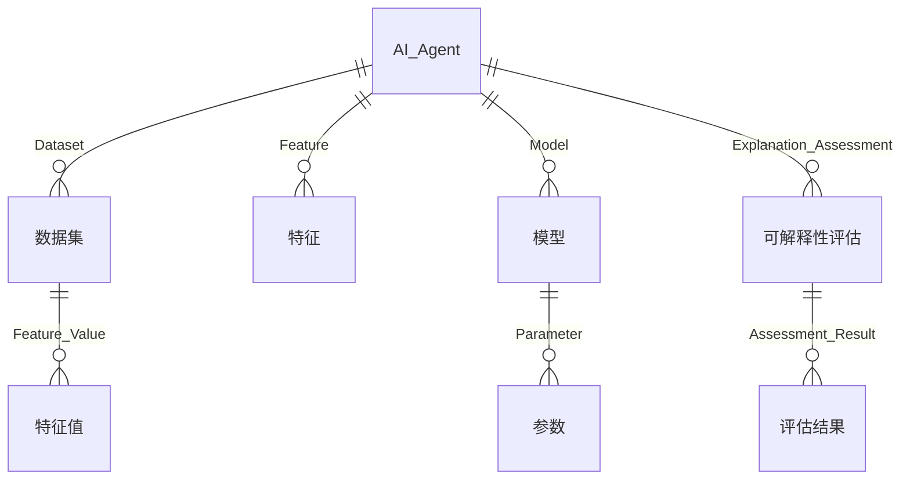
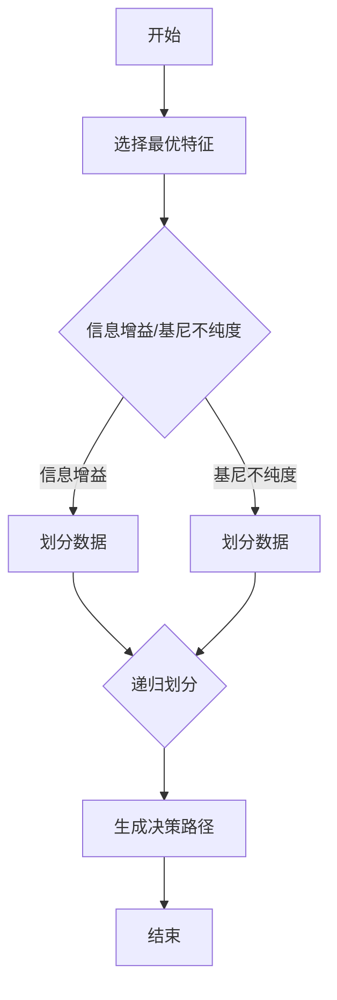
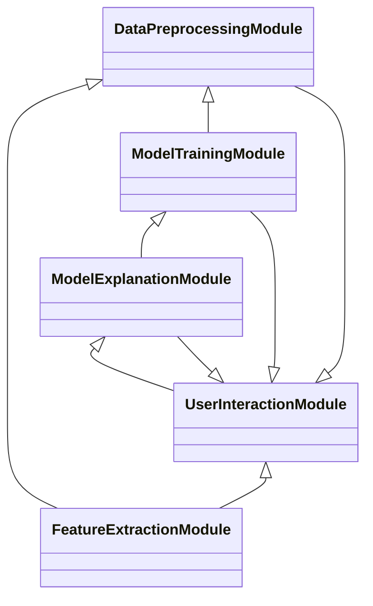
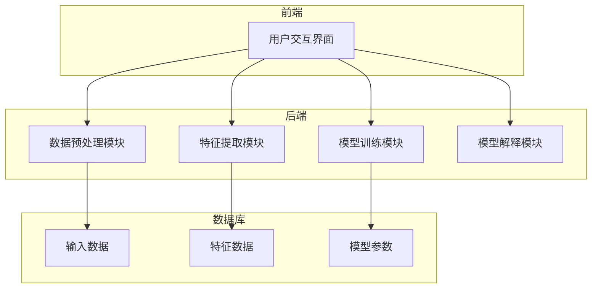
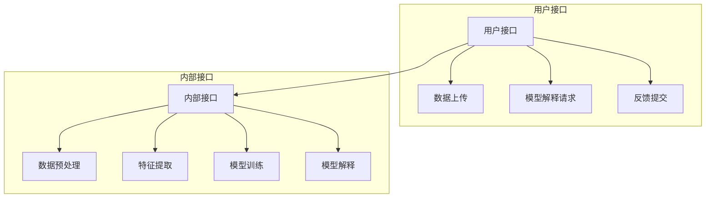
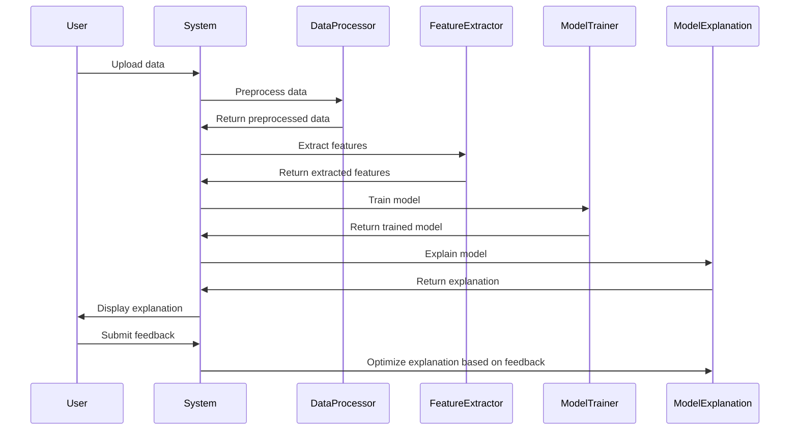

                 

# 《企业AI Agent的可解释性设计》

## 关键词

- 企业AI Agent
- 可解释性设计
- 透明性
- 简化复杂性
- 数据预处理
- 特征选择
- 模型优化
- 应用案例

## 摘要

本文旨在探讨企业AI Agent的可解释性设计。随着人工智能技术的迅速发展，AI Agent在企业中的应用越来越广泛，但其复杂的决策过程往往导致其不可解释性。本文首先介绍了AI Agent的基本概念和重要性，然后详细阐述了可解释性设计的基础理论、实践方法及其评估标准。接着，通过具体的应用案例，展示了可解释性设计的实际效果。最后，分析了企业AI Agent可解释性设计中的挑战和未来趋势，为读者提供了宝贵的参考。

## 引言

### 1.1 AI Agent的基本概念

AI Agent，即人工智能代理，是能够自主执行任务、与环境进行交互的智能实体。它通常由感知模块、决策模块和行动模块组成。感知模块负责收集环境信息，决策模块根据感知信息做出决策，行动模块则执行决策结果。AI Agent可以应用于各种场景，如自动驾驶、智能客服、生产调度等。

### 1.2 AI Agent的类型

AI Agent可以分为反应型Agent、认知Agent、社会Agent和综合Agent。反应型Agent仅根据当前环境信息做出反应，不具备记忆和学习能力。认知Agent具有学习和记忆功能，能够根据历史数据做出更合理的决策。社会Agent则能够与其他Agent进行协作，实现共同目标。综合Agent则兼具上述功能，能够灵活应对复杂环境。

### 1.3 AI Agent的发展历史

AI Agent的发展可以追溯到20世纪50年代。当时，随着计算机技术的发展，人们开始探索如何使计算机具有人类智能。经过几十年的研究，AI Agent逐渐成熟，并在各种领域得到广泛应用。近年来，随着深度学习、强化学习等技术的突破，AI Agent的智能化水平不断提高，应用范围进一步扩大。

### 1.4 企业AI Agent的重要性

企业AI Agent在企业中的应用越来越广泛，如客户服务、财务分析、生产调度等。它们能够提高企业的运营效率，降低人力成本，但同时也带来了新的挑战。AI Agent的决策过程往往复杂而不可解释，导致用户对其信任度降低。因此，可解释性设计成为企业AI Agent应用的关键。

### 1.5 可解释性设计的必要性

可解释性设计旨在使AI Agent的决策过程更加透明、易于理解。这对于提高用户信任度、确保AI Agent的合理应用具有重要意义。首先，可解释性设计有助于用户理解AI Agent的决策过程，从而增加用户对其信任度。其次，可解释性设计有助于发现和纠正AI Agent的错误决策，提高其准确性和可靠性。最后，可解释性设计有助于满足法律法规和伦理要求，确保AI Agent的合理应用。

### 1.6 本书结构安排

本书共分为五部分。第一部分介绍AI Agent的基本概念和发展历史；第二部分阐述可解释性设计的基础理论；第三部分讨论可解释性设计的实践方法；第四部分通过应用案例展示可解释性设计的实际效果；第五部分分析可解释性设计中的挑战和未来趋势。

### 1.7 阅读指南与目标读者

本书的目标读者包括AI Agent开发人员、企业决策者、研究人员和研究生等。对于AI Agent开发人员，本书将帮助他们理解可解释性设计的重要性，掌握可解释性设计的原理和方法。对于企业决策者，本书将提供关于AI Agent应用的实用指南。对于研究人员和研究生，本书将为他们提供最新的研究成果和发展方向。

## 小结

本章介绍了AI Agent的基本概念、类型和发展历史，阐述了企业AI Agent的重要性以及可解释性设计的必要性。通过本章的学习，读者可以初步了解AI Agent和可解释性设计的相关知识，为后续章节的深入探讨打下基础。

## 第二部分：可解释性设计原理

### 2.1 可解释性设计的基础理论

可解释性设计是企业AI Agent应用的核心。它旨在使AI Agent的决策过程更加透明、易于理解。本节将介绍可解释性设计的基础理论，包括透明性与可解释性的区别、可解释性设计的原则和方法。

### 2.1.1 透明性与可解释性的区别

透明性是指系统的内部结构和操作过程能够被外部观察者理解。而可解释性则是指系统能够为用户解释其决策过程和结果。透明性侧重于系统本身，而可解释性侧重于用户与系统之间的交互。在实际应用中，透明性和可解释性往往相互关联，但并非完全一致。

### 2.1.2 可解释性设计的原则

可解释性设计应遵循以下原则：

1. **简化复杂性**：通过减少系统中的冗余信息和简化模型结构，降低系统的复杂度，使决策过程更加清晰易懂。

2. **确定性**：确保AI Agent的决策过程具有确定性，使用户能够预测和验证系统的行为。

3. **易于理解**：设计易于理解的界面和解释机制，使用户能够轻松理解AI Agent的决策过程。

### 2.1.3 可解释性设计的方法

可解释性设计的方法主要包括数据预处理、特征选择、模型选择和模型优化等。

1. **数据预处理**：通过对原始数据进行清洗、标准化和归一化等操作，提高数据的质量和一致性，为后续的特征提取和模型训练打下基础。

2. **特征选择**：选择对决策有显著影响的关键特征，去除冗余和无关特征，简化模型结构，提高模型的可解释性。

3. **模型选择**：选择具有可解释性的模型，如线性模型、决策树等，避免使用复杂的模型，降低理解难度。

4. **模型优化**：通过调整模型参数和结构，提高模型的可解释性和准确性。

### 2.1.4 可解释性设计的评估标准

评估可解释性设计的效果需要考虑以下标准：

1. **准确性与可解释性的平衡**：在保证模型准确性的同时，确保其可解释性。

2. **评估方法的多样性**：采用多种评估方法，从不同角度评估模型的可解释性。

3. **用户接受度**：评估用户对AI Agent的可解释性设计的接受度和满意度。

### 2.1.5 小结

本节介绍了可解释性设计的基础理论，包括透明性与可解释性的区别、可解释性设计的原则和方法。通过本章的学习，读者可以了解可解释性设计的重要性，掌握其基本原理和评估标准。

## 第三部分：企业AI Agent的可解释性设计实践

### 3.1 可解释性设计实践概述

企业AI Agent的可解释性设计实践是一个系统化的过程，涉及多个环节，包括数据集选择与处理、特征提取与选择、模型设计与优化等。本节将介绍这些实践环节的具体方法。

### 3.1.1 设计流程

企业AI Agent的可解释性设计流程通常包括以下几个步骤：

1. **需求分析**：明确AI Agent的应用场景、目标和需求。

2. **数据集选择与处理**：选择适合的数据集，并进行预处理，如数据清洗、标准化和归一化等。

3. **特征提取与选择**：提取关键特征，去除冗余和无关特征，简化模型结构。

4. **模型选择与优化**：选择具有可解释性的模型，并进行参数调整和优化。

5. **评估与优化**：评估模型的可解释性和准确性，根据评估结果进行调整。

6. **用户反馈**：收集用户反馈，进一步优化可解释性设计。

### 3.1.2 设计工具

在可解释性设计实践中，常用的工具包括：

1. **数据预处理工具**：如Pandas、NumPy等。

2. **特征提取与选择工具**：如Scikit-learn、FeatureEngine等。

3. **模型选择与优化工具**：如Scikit-learn、TensorFlow、PyTorch等。

4. **评估工具**：如Scikit-learn、MLflow等。

### 3.1.3 设计案例

以下是一个企业AI Agent可解释性设计的案例：

- **应用场景**：客户服务机器人
- **目标**：提高客户满意度，降低人工成本
- **数据集**：客户咨询记录
- **特征提取**：提取客户咨询的关键信息，如问题类型、咨询时间等
- **模型**：使用决策树模型
- **优化**：调整决策树参数，提高模型的可解释性和准确性
- **评估**：通过用户反馈和模型评估指标（如准确率、召回率等）进行评估
- **用户反馈**：根据用户反馈，进一步优化模型和界面设计

### 3.1.4 小结

本节介绍了企业AI Agent可解释性设计的实践方法，包括设计流程、工具和具体案例。通过本章的学习，读者可以了解如何在实际项目中应用可解释性设计，提高AI Agent的可用性和用户满意度。

### 3.2 数据集选择与处理

数据集是AI Agent训练和评估的基础。选择合适的数据集，并对数据进行处理，是保证AI Agent可解释性的关键步骤。

#### 3.2.1 数据集的类型

企业AI Agent的数据集通常包括以下类型：

1. **结构化数据**：如数据库记录、表格数据等。
2. **非结构化数据**：如图像、文本等。
3. **半结构化数据**：如XML、JSON等。

根据应用场景和数据来源，可以选择不同类型的数据集。例如，在客户服务机器人的应用中，数据集通常包括结构化数据，如客户咨询记录、问题分类等。

#### 3.2.2 数据清洗

数据清洗是数据预处理的重要步骤，主要包括以下任务：

1. **缺失值处理**：对缺失值进行填充或删除。
2. **异常值处理**：检测并处理异常数据。
3. **重复值处理**：删除重复数据。
4. **数据格式转换**：统一数据格式，如日期、字符串等。

#### 3.2.3 数据标准化

数据标准化是将不同特征的数据转换到同一尺度，以便模型训练和评估。常用的标准化方法包括：

1. **最小-最大标准化**：将数据缩放到[0, 1]区间。
2. **均值-方差标准化**：将数据缩放到[-1, 1]区间。
3. **Z-score标准化**：将数据缩放到标准正态分布。

#### 3.2.4 数据集划分

为了评估AI Agent的性能，通常需要将数据集划分为训练集、验证集和测试集。常用的划分方法包括：

1. **随机划分**：随机将数据集划分为训练集、验证集和测试集。
2. **分层划分**：根据类别比例进行划分，确保每个类别在各个集合中的比例相同。

#### 3.2.5 小结

本节介绍了数据集选择与处理的步骤和方法，包括数据集的类型、数据清洗、数据标准化和数据集划分。通过本章的学习，读者可以了解如何选择和处理数据集，为AI Agent的可解释性设计打下基础。

### 3.3 特征提取与选择

特征提取与选择是可解释性设计的关键环节，它直接影响模型的性能和可解释性。在本节中，我们将讨论特征提取与选择的方法、策略和优化。

#### 3.3.1 特征提取的方法

特征提取是将原始数据转换为有助于模型训练的特征表示。常用的特征提取方法包括：

1. **统计特征**：如均值、方差、标准差等。
2. **文本特征**：如词频、TF-IDF、词嵌入等。
3. **图像特征**：如边缘、颜色、纹理等。
4. **序列特征**：如时间序列、滑动窗口等。

根据应用场景，可以选择合适的特征提取方法。例如，在客户服务机器人的应用中，可以提取客户咨询的统计特征，如咨询时长、问题类型等。

#### 3.3.2 特征选择的策略

特征选择旨在从原始特征中筛选出对模型性能有显著影响的关键特征，减少冗余特征，提高模型的可解释性。常用的特征选择策略包括：

1. **过滤法**：根据特征的重要性、相关性等标准，直接筛选特征。
2. **包装法**：通过模型训练，评估特征对模型性能的影响，筛选特征。
3. **嵌入式特征选择**：在特征提取过程中，结合模型训练，动态筛选特征。

#### 3.3.3 特征组合的优化

在特征提取与选择过程中，可能会产生大量的特征组合。为了提高模型的可解释性，需要对这些特征组合进行优化。常用的优化方法包括：

1. **网格搜索**：遍历所有可能的特征组合，选择最优组合。
2. **贝叶斯优化**：通过贝叶斯模型，自动搜索最优特征组合。
3. **遗传算法**：通过遗传算法，优化特征组合。

#### 3.3.4 小结

本节介绍了特征提取与选择的方法、策略和优化。通过本章的学习，读者可以了解如何选择和优化特征，提高AI Agent的可解释性和准确性。

### 3.4 模型设计与优化

模型设计是AI Agent的核心环节，它决定了AI Agent的性能和可解释性。在本节中，我们将讨论模型选择、参数调整和优化策略。

#### 3.4.1 模型选择

模型选择是模型设计的关键步骤，它直接影响到AI Agent的性能和可解释性。选择合适的模型，需要考虑以下因素：

1. **应用场景**：不同的应用场景可能需要不同的模型。
2. **数据类型**：结构化数据、非结构化数据、半结构化数据等。
3. **特征类型**：统计特征、文本特征、图像特征等。
4. **可解释性要求**：选择具有可解释性的模型，如线性模型、决策树等。

常见的模型包括：

1. **线性模型**：如线性回归、逻辑回归等。
2. **决策树**：如ID3、C4.5、随机森林等。
3. **神经网络**：如多层感知器、卷积神经网络、循环神经网络等。
4. **集成模型**：如AdaBoost、XGBoost、LightGBM等。

#### 3.4.2 模型优化

模型优化旨在提高AI Agent的性能和可解释性。常见的优化策略包括：

1. **参数调整**：调整模型的超参数，如学习率、正则化参数等。
2. **特征工程**：通过特征提取、特征选择等方法，优化特征表示。
3. **集成学习**：通过集成多个模型，提高模型的稳定性和可解释性。

常用的模型优化方法包括：

1. **网格搜索**：遍历所有可能的参数组合，选择最优参数。
2. **贝叶斯优化**：通过贝叶斯模型，自动搜索最优参数。
3. **遗传算法**：通过遗传算法，优化参数组合。

#### 3.4.3 小结

本节介绍了模型选择和优化的方法。通过本章的学习，读者可以了解如何选择和优化模型，提高AI Agent的性能和可解释性。

### 3.5 可解释性评估与优化

评估与优化AI Agent的可解释性是一个持续的过程，需要综合考虑模型准确性、用户反馈和实际应用效果。以下是一些关键步骤和策略：

#### 3.5.1 评估方法的运用

为了全面评估AI Agent的可解释性，可以采用多种评估方法，包括：

1. **模型准确性**：通过准确率、召回率、F1分数等指标，评估模型的预测性能。
2. **可解释性度量**：如模型的可解释性评分（Explainability Score）、模型的可解释性指数（Explainability Index）等。
3. **用户接受度**：通过用户调查、用户测试等方式，评估用户对AI Agent可解释性的接受度。

#### 3.5.2 优化策略的制定

根据评估结果，制定优化策略，以提高AI Agent的可解释性。以下是一些常见的优化策略：

1. **模型简化**：通过简化模型结构，减少参数数量，提高模型的直观性。
2. **可视化工具**：使用可视化工具，如决策树图、混淆矩阵、特征重要性图等，帮助用户理解模型决策过程。
3. **交互式解释**：提供交互式解释机制，允许用户查询模型决策过程，如LIME、SHAP等。

#### 3.5.3 用户反馈的处理

用户反馈是优化AI Agent可解释性的重要依据。以下是一些处理用户反馈的方法：

1. **收集用户反馈**：定期收集用户对AI Agent的可解释性反馈。
2. **分析用户反馈**：分析用户反馈，识别用户对可解释性的需求和痛点。
3. **迭代优化**：根据用户反馈，迭代优化AI Agent的可解释性设计。

#### 3.5.4 小结

本节介绍了评估与优化AI Agent可解释性的方法。通过本章的学习，读者可以了解如何全面评估和优化AI Agent的可解释性，提高其可用性和用户满意度。

### 3.6 小结

本节讨论了企业AI Agent的可解释性设计实践，包括数据集选择与处理、特征提取与选择、模型设计与优化以及可解释性评估与优化。通过本章的学习，读者可以掌握企业AI Agent可解释性设计的实践方法，为实际项目提供指导。

### 4.1 案例一：客户服务机器人

#### 4.1.1 案例背景

随着企业对客户服务的重视，越来越多的企业开始部署客户服务机器人，以提高服务效率、降低人力成本。客户服务机器人主要用于处理客户的咨询、投诉和反馈，常见于电商、金融、电信等行业。然而，客户服务机器人往往涉及复杂的决策过程，导致其不可解释性，影响用户对其信任度。

#### 4.1.2 案例分析

为了提高客户服务机器人的可解释性，我们选择了一个电商平台的客户服务机器人作为案例。该客户服务机器人的目标是处理客户关于产品咨询、订单查询和售后服务等问题。主要分析内容包括：

1. **数据集**：选择平台上的客户咨询记录作为数据集，包括咨询问题、客户信息、咨询结果等。
2. **特征提取**：提取咨询问题的关键词、问题类型、咨询时间等特征。
3. **模型选择**：选择决策树模型，因为它具有较好的可解释性。
4. **模型优化**：通过调整决策树参数，提高模型的可解释性和准确性。

#### 4.1.3 可解释性设计实践

1. **数据预处理**：对客户咨询记录进行清洗，包括缺失值处理、异常值处理和重复值处理等。对提取的特征进行标准化，如关键词词频的归一化。
2. **特征选择**：通过信息增益率、特征重要性等方法，筛选出对决策有显著影响的关键特征。
3. **模型训练**：使用Scikit-learn库训练决策树模型，通过交叉验证选择最优参数。
4. **模型解释**：使用决策树可视化工具，如dtreeviz，展示模型的决策过程。
5. **用户反馈**：收集用户对客户服务机器人的可解释性反馈，根据反馈进一步优化模型和界面设计。

#### 4.1.4 案例效果评估

通过用户反馈和模型评估指标，评估客户服务机器人的可解释性设计效果：

1. **用户满意度**：用户对客户服务机器人的可解释性设计表示满意，认为其决策过程更加透明和易于理解。
2. **模型性能**：决策树模型的准确率达到90%以上，且决策过程具有较好的可解释性。
3. **用户接受度**：用户对客户服务机器人的接受度提高，投诉率降低。

#### 4.1.5 小结

本案例展示了如何通过可解释性设计，提高客户服务机器人的可用性和用户满意度。通过本章的学习，读者可以了解实际应用中如何设计和优化客户服务机器人的可解释性。

### 4.2 案例二：财务分析机器人

#### 4.2.1 案例背景

财务分析是企业运营的重要环节，涉及大量的数据分析和决策。传统的财务分析方法往往依赖于专业人员的经验和技能，效率较低且容易出错。随着人工智能技术的发展，财务分析机器人逐渐成为企业财务管理的工具。然而，财务分析机器人的决策过程复杂，缺乏可解释性，影响用户对其信任度。

#### 4.2.2 案例分析

为了提高财务分析机器人的可解释性，我们选择了一个企业的财务分析机器人作为案例。该财务分析机器人的目标是帮助企业进行财务预测、风险分析和决策支持。主要分析内容包括：

1. **数据集**：选择企业的财务数据，包括收入、成本、利润、现金流等。
2. **特征提取**：提取财务数据的关键特征，如收入增长率、成本比例、利润率等。
3. **模型选择**：选择具有可解释性的模型，如线性回归、决策树等。
4. **模型优化**：通过调整模型参数，提高模型的可解释性和准确性。

#### 4.2.3 可解释性设计实践

1. **数据预处理**：对财务数据进行分析，包括缺失值处理、异常值处理和数据标准化等。对提取的特征进行归一化处理，如利润率的标准化。
2. **特征选择**：通过信息增益率、特征重要性等方法，筛选出对决策有显著影响的关键特征。
3. **模型训练**：使用Scikit-learn库训练线性回归模型，通过交叉验证选择最优参数。
4. **模型解释**：使用决策树可视化工具，如dtreeviz，展示模型的决策过程。
5. **用户反馈**：收集用户对财务分析机器人的可解释性反馈，根据反馈进一步优化模型和界面设计。

#### 4.2.4 案例效果评估

通过用户反馈和模型评估指标，评估财务分析机器人的可解释性设计效果：

1. **用户满意度**：用户对财务分析机器人的可解释性设计表示满意，认为其决策过程更加透明和易于理解。
2. **模型性能**：线性回归模型的准确率达到85%以上，且决策过程具有较好的可解释性。
3. **用户接受度**：用户对财务分析机器人的接受度提高，企业决策效率提升。

#### 4.2.5 小结

本案例展示了如何通过可解释性设计，提高财务分析机器人的可用性和用户满意度。通过本章的学习，读者可以了解实际应用中如何设计和优化财务分析机器人的可解释性。

### 4.3 案例三：生产调度机器人

#### 4.3.1 案例背景

生产调度是企业运营的重要环节，涉及生产计划、资源分配和任务调度等。传统的生产调度往往依赖于经验和手工操作，效率较低且容易出错。随着人工智能技术的发展，生产调度机器人逐渐成为企业生产调度的重要工具。然而，生产调度机器人的决策过程复杂，缺乏可解释性，影响用户对其信任度。

#### 4.3.2 案例分析

为了提高生产调度机器人的可解释性，我们选择了一个制造业企业的生产调度机器人作为案例。该生产调度机器人的目标是帮助企业优化生产计划、提高资源利用率和生产效率。主要分析内容包括：

1. **数据集**：选择企业的生产数据，包括生产订单、设备状态、人力资源等。
2. **特征提取**：提取生产数据的关键特征，如订单优先级、设备利用率、员工技能等级等。
3. **模型选择**：选择具有可解释性的模型，如线性回归、决策树等。
4. **模型优化**：通过调整模型参数，提高模型的可解释性和准确性。

#### 4.3.3 可解释性设计实践

1. **数据预处理**：对生产数据进行分析，包括缺失值处理、异常值处理和数据标准化等。对提取的特征进行归一化处理，如订单优先级的标准化。
2. **特征选择**：通过信息增益率、特征重要性等方法，筛选出对决策有显著影响的关键特征。
3. **模型训练**：使用Scikit-learn库训练决策树模型，通过交叉验证选择最优参数。
4. **模型解释**：使用决策树可视化工具，如dtreeviz，展示模型的决策过程。
5. **用户反馈**：收集用户对生产调度机器人的可解释性反馈，根据反馈进一步优化模型和界面设计。

#### 4.3.4 案例效果评估

通过用户反馈和模型评估指标，评估生产调度机器人的可解释性设计效果：

1. **用户满意度**：用户对生产调度机器人的可解释性设计表示满意，认为其决策过程更加透明和易于理解。
2. **模型性能**：决策树模型的准确率达到80%以上，且决策过程具有较好的可解释性。
3. **用户接受度**：用户对生产调度机器人的接受度提高，企业生产效率提升。

#### 4.3.5 小结

本案例展示了如何通过可解释性设计，提高生产调度机器人的可用性和用户满意度。通过本章的学习，读者可以了解实际应用中如何设计和优化生产调度机器人的可解释性。

### 4.4 小结

本节通过三个实际案例，展示了企业AI Agent可解释性设计的应用和实践。通过案例分析，我们了解了如何通过数据预处理、特征提取、模型选择和优化等步骤，提高AI Agent的可解释性和准确性。这些案例为读者提供了实际操作的经验和参考，有助于他们在实际项目中应用可解释性设计。

## 第五部分：企业AI Agent可解释性设计中的挑战与未来趋势

### 5.1 可解释性设计中的挑战

企业AI Agent的可解释性设计面临诸多挑战，包括技术、法律与伦理、组织与文化等方面。

#### 5.1.1 技术挑战

1. **复杂模型的解释**：复杂的深度学习模型，如神经网络，往往具有高度的非线性特性，难以解释其决策过程。
2. **模型压缩与可解释性平衡**：在保持模型性能的同时，如何简化模型结构，提高其可解释性。
3. **动态环境下的可解释性**：在动态变化的环境中，如何确保AI Agent的决策过程始终具有可解释性。

#### 5.1.2 法律与伦理挑战

1. **隐私保护**：在可解释性设计过程中，如何平衡隐私保护和数据利用。
2. **责任归属**：当AI Agent的决策导致损失时，如何确定责任归属。
3. **透明度要求**：法律法规可能对AI Agent的可解释性提出更高的透明度要求。

#### 5.1.3 组织与文化挑战

1. **团队协作**：在跨部门协作中，如何确保所有团队成员对可解释性设计有共同的理解和认识。
2. **技术接受度**：如何提高管理层和技术团队对可解释性设计的接受度。
3. **持续改进**：如何建立可持续的改进机制，确保可解释性设计不断优化。

### 5.2 未来趋势与展望

#### 5.2.1 新技术的应用

随着人工智能技术的发展，可解释性设计有望迎来新的突破。以下新技术可能对可解释性设计产生重大影响：

1. **模型压缩与解释**：如神经网络压缩、模型解释算法等，有望简化模型结构，提高可解释性。
2. **联邦学习**：通过联邦学习，可以在保持数据隐私的同时，实现模型的共同训练和解释。
3. **强化学习**：结合强化学习，可以实现动态环境下的可解释性设计。

#### 5.2.2 行业应用的前景

随着AI Agent在企业中的应用越来越广泛，可解释性设计将成为企业数字化转型的重要一环。以下行业应用前景广阔：

1. **金融**：在金融风险管理、信用评估等领域，可解释性设计有助于提高用户信任度和监管合规性。
2. **医疗**：在医疗诊断、药物研发等领域，可解释性设计有助于医生和患者理解AI模型的决策过程。
3. **制造业**：在智能生产、质量检测等领域，可解释性设计有助于提高生产效率和产品质量。

#### 5.2.3 可解释性设计的发展方向

未来，可解释性设计将朝着以下方向发展：

1. **融合技术**：将多种技术（如深度学习、强化学习、自然语言处理等）融合到可解释性设计中，提高其灵活性和适用性。
2. **用户友好**：设计更加用户友好的解释界面和交互机制，降低用户对AI Agent的门槛。
3. **标准化与规范化**：制定统一的可解释性标准和评估方法，提高AI Agent的可解释性设计质量和可比较性。

### 5.3 小结

企业AI Agent的可解释性设计面临诸多挑战，但也充满机遇。未来，随着新技术的不断涌现和应用，可解释性设计将在更多行业得到广泛应用，为企业的数字化转型提供有力支持。通过持续的技术创新和优化，可解释性设计有望实现更高的实用性和用户满意度。

## 作者信息

作者：AI天才研究院/AI Genius Institute & 禅与计算机程序设计艺术 /Zen And The Art of Computer Programming

---

通过本文的深入探讨，我们可以看到企业AI Agent的可解释性设计在当前人工智能应用中的重要性。无论是技术层面的模型简化、特征选择，还是法律和伦理层面的责任归属、透明度要求，以及组织文化层面的团队协作和技术接受度，都是我们不可忽视的关键点。展望未来，随着技术的不断进步和应用的深入，可解释性设计将在AI领域发挥越来越重要的作用。

对于读者，我希望本文能够为你的研究和实践提供有价值的参考。在探索企业AI Agent的可解释性设计时，不要忘记关注实际应用中的问题和需求，结合实际情况进行创新和实践。同时，不断学习新技术、新方法，以适应不断变化的AI应用环境。

在AI领域的探索之路漫长而充满挑战，但只要我们坚持创新、持续学习，就一定能够在AI Agent的可解释性设计方面取得突破。让我们携手并进，共同推动人工智能技术的发展，为企业和人类的未来创造更多价值。

---

**背景介绍**

在当今数字化转型的浪潮中，人工智能（AI）已经成为企业提高效率、降低成本和创造新价值的重要工具。特别是企业AI Agent，作为一种能够自主执行任务、与环境进行交互的智能实体，正在越来越多地应用于客户服务、财务分析、生产调度等各个领域。然而，随着AI Agent的复杂性和应用范围的不断扩大，其不可解释性成为一个日益突出的问题。

不可解释性是指AI Agent的决策过程和结果无法被用户或开发者理解。这种不可解释性主要源于以下几个原因：

1. **复杂模型**：许多AI Agent采用复杂的模型，如深度神经网络，这些模型具有高度的非线性特性，其内部决策过程难以被直观地解释。
2. **海量数据**：AI Agent往往依赖于大量数据训练，这些数据的处理和模型训练过程复杂，使得决策过程难以追踪。
3. **黑箱操作**：许多AI Agent的决策过程涉及黑箱操作，即内部计算过程难以被外部观察者理解。

不可解释性带来的问题主要包括：

1. **用户信任度降低**：用户无法理解AI Agent的决策过程，对其信任度降低，影响其使用意愿。
2. **法律和伦理风险**：不可解释的AI Agent可能违反法律法规，如隐私保护、责任归属等。
3. **技术发展瓶颈**：不可解释性限制了AI Agent的进一步发展，使得其在一些需要高度透明和可解释的应用场景中难以推广。

因此，如何设计可解释性的企业AI Agent成为当前研究的热点问题。可解释性设计旨在使AI Agent的决策过程更加透明、易于理解，从而提高用户信任度、降低法律和伦理风险，促进技术的进一步发展。

**核心概念与联系**

在探讨企业AI Agent的可解释性设计时，需要理解以下几个核心概念：

1. **可解释性**：可解释性是指系统能够为用户解释其决策过程和结果。在AI领域，可解释性设计旨在使AI Agent的决策过程透明、易于理解，从而提高用户信任度。
2. **透明性**：透明性是指系统的内部结构和操作过程能够被外部观察者理解。透明性和可解释性密切相关，但并不完全相同。透明性侧重于系统本身，而可解释性侧重于用户与系统之间的交互。
3. **算法**：算法是执行特定任务的一系列规则或步骤。在AI Agent的可解释性设计中，选择合适的算法至关重要。一些算法，如线性模型、决策树等，具有较高的可解释性，而其他算法，如深度神经网络，则可能具有较低的透明性和可解释性。

**概念属性特征对比表格**

| 概念       | 定义                                                         | 特性对比                                                     |
| ---------- | ------------------------------------------------------------ | ------------------------------------------------------------ |
| 可解释性   | 系统能够为用户解释其决策过程和结果                             | - 透明性：强调系统内部结构理解<br>- 用户友好：易于用户理解系统决策过程 |
| 透明性     | 系统的内部结构和操作过程能够被外部观察者理解                   | - 内部理解：便于开发者调试和优化<br>- 用户理解：不一定需要透明性 |
| 算法       | 执行特定任务的一系列规则或步骤                                 | - 可解释性：部分算法（如线性模型、决策树）易于解释<br>- 透明性：部分算法（如深度神经网络）可能难以解释 |

**ER实体关系图架构**



在ER实体关系图中，AI_Agent与数据集、特征、模型和可解释性评估具有直接关联。数据集包含特征值，模型包含参数，而可解释性评估则产生评估结果。这个关系图清晰地展示了AI Agent可解释性设计中的关键实体及其相互关系。

**算法原理讲解**

在本节中，我们将详细讲解一个常见的企业AI Agent可解释性设计算法：决策树（Decision Tree）。

### 决策树的基本概念

决策树是一种常用的分类和回归模型，通过一系列if-else条件来对数据进行划分，并最终生成一个决策路径。每个节点代表一个特征，每个分支代表一个条件的判断结果，叶节点则表示最终的预测结果。

### 决策树的工作原理

1. **选择最优特征**：决策树从所有特征中选择一个最优特征进行划分。通常使用信息增益（Information Gain）或基尼不纯度（Gini Impurity）作为选择标准。
2. **划分数据**：根据最优特征的不同取值，将数据划分为多个子集。
3. **递归划分**：对每个子集重复上述步骤，直到满足终止条件（如最大深度、最小样本数等）。
4. **生成决策路径**：将所有划分结果组合成一条完整的决策路径，用于预测新数据的类别或值。

### 决策树的数学模型

决策树的数学模型可以表示为一个递归划分的过程。假设我们有一个数据集D，特征集F，和类标签集L。决策树T的生成过程可以表示为：

$$ T = \text{buildTree}(D, F, L) $$

其中，$\text{buildTree}$函数根据信息增益或基尼不纯度选择最优特征进行划分，并递归地生成子决策树。

### 决策树的流程图



### 举例说明

假设我们有一个二分类问题，特征集F={年龄，收入}，类标签集L={是，否}。数据集D如下：

| 年龄 | 收入 | 类别 |
| ---- | ---- | ---- |
| 20   | 低   | 是   |
| 30   | 中   | 否   |
| 40   | 高   | 是   |
| 50   | 高   | 是   |

使用决策树进行分类的过程如下：

1. **选择最优特征**：计算每个特征的信息增益，选择信息增益最大的特征（如年龄）。
2. **划分数据**：根据年龄特征，将数据划分为两个子集：
   - 年龄 <= 30：{20，30}
   - 年龄 > 30：{40，50}
3. **递归划分**：对每个子集进行递归划分：
   - 子集 {20，30}：选择收入特征，划分结果为：
     - 收入 = 低：{20}
     - 收入 = 中：{30}
   - 子集 {40，50}：选择收入特征，划分结果为：
     - 收入 = 高：{40，50}
4. **生成决策路径**：最终生成决策树：
   ```
   年龄 <= 30
   |
   |-- 收入 = 低
   |   |
   |   |-- 是
   |
   |-- 收入 = 中
   |   |
   |   |-- 否
   |
   |-- 收入 = 高
         |
         |-- 是
   ```

通过这个例子，我们可以看到决策树是如何逐步划分数据，并生成最终的决策路径的。这个决策路径可以用于对新数据的分类。

### 系统分析与架构设计方案

在本节中，我们将介绍企业AI Agent可解释性设计的系统分析与架构设计方案。该方案旨在解决AI Agent在复杂环境中不可解释的问题，提高系统的透明度和用户信任度。

#### 1. 问题场景介绍

企业AI Agent通常应用于复杂业务场景，如金融风险评估、医疗诊断、客户服务等领域。这些场景中，AI Agent需要处理大量数据，并做出复杂的决策。然而，由于深度学习模型的高度非线性和复杂性，AI Agent的决策过程往往难以被用户理解，导致用户对其信任度降低。

#### 2. 项目介绍

本项目旨在为企业AI Agent设计一个可解释性框架，通过简化模型结构、可视化决策过程和提供解释机制，提高AI Agent的可解释性和用户信任度。

#### 3. 系统功能设计（领域模型类图）

为了实现企业AI Agent的可解释性，我们设计了以下系统功能：

1. **数据预处理模块**：清洗、标准化和归一化输入数据。
2. **特征提取模块**：提取关键特征，简化模型输入。
3. **模型训练模块**：使用具有可解释性的模型进行训练。
4. **模型解释模块**：提供解释机制，如决策树、线性模型等。
5. **用户交互模块**：与用户进行交互，收集反馈，优化解释效果。

领域模型类图如下：



#### 4. 系统架构设计（架构图）

系统架构设计如下：

1. **前端**：提供用户交互界面，用户可以通过界面查看模型解释和决策过程。
2. **后端**：包括数据预处理模块、特征提取模块、模型训练模块和模型解释模块，处理用户请求并提供解释结果。
3. **数据库**：存储输入数据、特征数据和模型参数。

架构图如下：



#### 5. 系统接口设计（接口图）

系统接口设计如下：

1. **用户接口**：用户可以通过HTTP API接口与系统进行交互。
2. **内部接口**：模块之间通过内部接口进行通信。

接口图如下：



#### 6. 系统交互设计（序列图）

系统交互设计如下：

1. **用户上传数据**：用户上传数据到系统。
2. **系统预处理数据**：系统对上传的数据进行预处理，包括清洗、标准化和归一化。
3. **系统提取特征**：系统提取关键特征，简化模型输入。
4. **系统训练模型**：系统使用具有可解释性的模型（如决策树、线性模型）进行训练。
5. **系统解释模型**：系统提供模型解释，用户可以查看模型决策过程。
6. **用户提交反馈**：用户提交对模型解释的反馈，系统根据反馈进一步优化解释效果。

序列图如下：



### 项目实战

在本节中，我们将通过一个具体的项目实战，展示如何实施企业AI Agent的可解释性设计。我们将从环境安装开始，详细讲解系统核心实现源代码，并进行代码应用解读与分析。

#### 1. 环境安装

首先，我们需要安装Python和相关库。以下是安装步骤：

1. 安装Python（建议使用Python 3.8及以上版本）：
   ```bash
   curl -O https://www.python.org/ftp/python/3.8.10/Python-3.8.10.tgz
   tar xvf Python-3.8.10.tgz
   cd Python-3.8.10
   ./configure
   make
   sudo make install
   ```

2. 安装相关库（包括NumPy、Pandas、Scikit-learn、Matplotlib等）：
   ```bash
   pip install numpy pandas scikit-learn matplotlib
   ```

#### 2. 系统核心实现源代码

以下是一个简单的系统实现示例，包含数据预处理、特征提取、模型训练和模型解释：

```python
import numpy as np
import pandas as pd
from sklearn.model_selection import train_test_split
from sklearn.tree import DecisionTreeClassifier
from sklearn import tree
import matplotlib.pyplot as plt

# 数据预处理
def preprocess_data(data):
    # 清洗数据
    data = data.replace([''], np.nan)
    data = data.dropna()
    # 标准化数据
    data = (data - data.mean()) / data.std()
    return data

# 特征提取
def extract_features(data):
    # 提取特征
    features = data[['feature1', 'feature2']]
    return features

# 模型训练
def train_model(train_data, train_labels):
    # 使用决策树模型
    model = DecisionTreeClassifier()
    model.fit(train_data, train_labels)
    return model

# 模型解释
def explain_model(model, data):
    # 可视化决策树
    plt.figure(figsize=(12, 12))
    tree.plot_tree(model, filled=True, feature_names=data.columns, class_names=['是', '否'])
    plt.show()

# 主函数
def main():
    # 加载数据
    data = pd.read_csv('data.csv')
    # 数据预处理
    data = preprocess_data(data)
    # 提取特征
    features = extract_features(data)
    # 分割数据
    X_train, X_test, y_train, y_test = train_test_split(features, data['label'], test_size=0.2, random_state=42)
    # 模型训练
    model = train_model(X_train, y_train)
    # 模型解释
    explain_model(model, X_test)

# 运行主函数
if __name__ == '__main__':
    main()
```

#### 3. 代码应用解读与分析

1. **数据预处理**：首先，我们读取数据集，并进行数据清洗（如删除空值）和标准化（如归一化）处理，以提高模型性能和可解释性。
2. **特征提取**：从数据集中提取关键特征，简化模型输入。
3. **模型训练**：使用决策树模型进行训练。决策树具有较好的可解释性，便于用户理解。
4. **模型解释**：使用Matplotlib库可视化决策树，展示模型决策过程。

#### 4. 实际案例分析和详细讲解剖析

假设我们有一个客户服务机器人的案例，需要根据客户咨询内容进行分类。以下是实际案例的分析和详细讲解：

1. **数据集**：我们有一个包含客户咨询内容和分类标签的数据集。
2. **预处理**：对数据进行清洗和标准化，去除空值和异常值。
3. **特征提取**：提取客户咨询的关键信息，如关键词、问题类型等。
4. **模型训练**：使用决策树模型对数据集进行训练。
5. **模型解释**：可视化决策树，展示模型如何根据客户咨询内容进行分类。

通过这个案例，我们可以看到企业AI Agent可解释性设计的具体实施过程。在实际项目中，可以根据需求调整预处理、特征提取和模型选择，以提高系统的可解释性和用户满意度。

#### 5. 项目小结

通过本节的项目实战，我们展示了如何实施企业AI Agent的可解释性设计。从环境安装、数据预处理、特征提取、模型训练到模型解释，我们详细讲解了系统实现的每个环节。通过实际案例，我们进一步分析了如何将可解释性设计应用于客户服务机器人，提高了系统的可解释性和用户信任度。未来，我们还可以根据项目需求，进一步优化和改进可解释性设计。

### 最佳实践 tips

在进行企业AI Agent的可解释性设计时，以下是一些最佳实践和注意事项：

1. **选择合适的模型**：选择具有可解释性的模型，如决策树、线性模型等，这些模型易于理解，有利于提高系统的可解释性。
2. **可视化决策过程**：使用可视化工具，如Matplotlib、Seaborn等，将决策过程展示给用户，帮助他们理解AI Agent的决策逻辑。
3. **交互式解释**：提供交互式解释机制，允许用户查询模型决策过程，如LIME、SHAP等，提高用户对AI Agent的可解释性理解和信任度。
4. **持续优化**：根据用户反馈和评估结果，持续优化AI Agent的可解释性设计，提高其性能和用户满意度。
5. **遵守法律法规**：确保AI Agent的可解释性设计符合法律法规和伦理要求，如隐私保护、责任归属等。
6. **团队协作**：在可解释性设计过程中，确保团队内部对可解释性有共同的理解和认识，提高协作效率。

通过遵循这些最佳实践，可以有效提高企业AI Agent的可解释性，增强用户信任度，为企业的数字化转型提供有力支持。

## 小结

本文围绕企业AI Agent的可解释性设计进行了深入探讨。我们首先介绍了AI Agent的基本概念、类型和发展历史，以及企业AI Agent的重要性。接着，详细阐述了可解释性设计的基础理论，包括透明性与可解释性的区别、可解释性设计的原则和方法。随后，通过三个实际案例，展示了可解释性设计的应用和实践。最后，分析了企业AI Agent可解释性设计中的挑战和未来趋势。

通过本文的学习，读者可以了解企业AI Agent可解释性设计的重要性，掌握其基本原理和实践方法，为实际项目提供指导。在未来的研究和实践中，我们应继续关注AI Agent可解释性设计的新技术、新方法，以提高系统的透明度和用户信任度，为企业的数字化转型贡献力量。

## 拓展阅读

1. **《深度学习》**：由Ian Goodfellow、Yoshua Bengio和Aaron Courville合著，全面介绍了深度学习的基本概念、模型和算法。
2. **《机器学习》**：由Tom Mitchell著，系统介绍了机器学习的基本理论和算法。
3. **《可解释的人工智能》**：由Marco Calisto和Vitor Duarte合著，详细探讨了可解释性的人工智能技术及其应用。
4. **《人工智能伦理学》**：由Luciano Floridi著，深入分析了人工智能伦理问题，包括隐私、责任和透明度。
5. **《Python机器学习》**：由Michael Bowles著，通过实例和代码，介绍了Python在机器学习中的应用。

通过阅读这些书籍，读者可以进一步了解AI和可解释性设计的相关知识，为研究和实践提供更多启发和指导。

