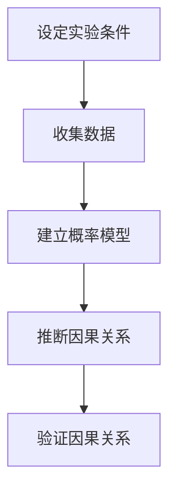
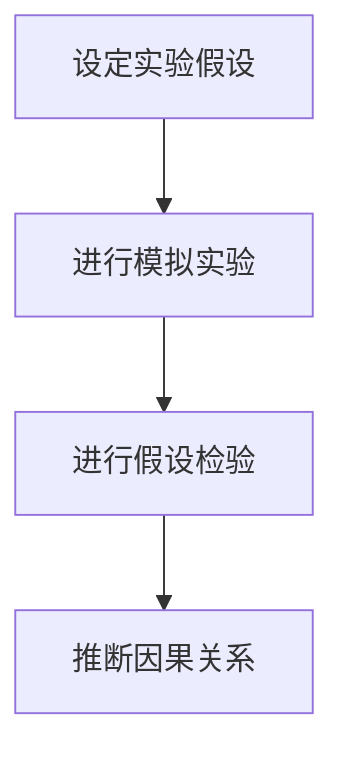

                 

### 引言

在当今的信息时代，人工智能（AI）技术已经深入到企业运营的方方面面。企业AI Agent，作为AI技术的前沿应用，正逐渐成为决策支持系统中不可或缺的一部分。AI Agent不仅能够处理海量数据，还能够通过机器学习算法和深度学习模型来预测趋势和优化策略。然而，预测和优化只是AI Agent功能的冰山一角。本文将探讨企业AI Agent的因果推理能力在A/B测试分析中的应用，为企业提供更精准的决策支持。

### 关键词

- 企业AI Agent
- 因果推理
- A/B测试
- 数据分析
- 决策支持

### 摘要

本文旨在探讨企业AI Agent如何利用因果推理技术，在A/B测试分析中提供更深入的洞察和可靠的决策依据。首先，我们将介绍企业AI Agent和因果推理的基本概念。随后，我们将深入探讨因果推理在A/B测试中的应用，并详细解释其原理和实现方法。通过实际的案例分析和项目实战，我们将展示如何在实际场景中应用因果推理来优化A/B测试的结果。最后，我们将总结最佳实践，并提出未来研究的方向。

## 第1章：问题背景与概述

### 1.1 问题背景

在商业运营中，A/B测试是一种常见的实验方法，用于评估两个或多个版本之间性能的差异。通过对比不同版本的点击率、转化率、用户满意度等关键指标，企业可以确定哪种版本更优，从而做出更加明智的决策。然而，随着数据量的增加和变量间的相互影响，简单的统计分析方法可能无法准确反映版本间的因果关系。这时，企业需要一种更高级的分析工具来辅助决策。

企业AI Agent是专门为应对复杂业务场景而设计的人工智能系统。它具备自主学习和决策的能力，可以通过分析历史数据和实时数据，预测未来趋势并提出优化建议。因果推理作为AI Agent的一项核心能力，能够在A/B测试中提供更深层次的洞察，帮助企业理解变量之间的因果关系，而不仅仅是相关性。

### 1.2 企业AI Agent的概念

企业AI Agent是一种智能体（Agent），它可以自主地执行任务，并与环境互动。在企业环境中，AI Agent通常通过以下方式发挥作用：

1. **数据处理**：AI Agent可以处理和分析来自不同渠道的大量数据，包括用户行为数据、销售数据、市场反馈等。
2. **预测**：利用机器学习和深度学习算法，AI Agent可以预测未来的趋势和潜在的业务机会。
3. **优化**：基于因果推理，AI Agent可以提供优化建议，帮助企业制定更有效的业务策略。
4. **自动化决策**：AI Agent可以自动化执行复杂的决策流程，减少人为错误，提高决策效率。

### 1.3 A/B测试的概念

A/B测试，也称为拆分测试，是一种对比实验方法。它将用户群体随机分为两组，一组使用版本A，另一组使用版本B，然后比较两组的特定指标，如点击率、转化率等。通过这种方式，企业可以确定哪个版本更受用户欢迎，进而进行推广。

### 1.4 因果推理在A/B测试中的重要性

因果推理在A/B测试中具有至关重要的地位。传统的统计分析方法只能揭示变量间的相关性，而无法确定它们之间的因果关系。例如，某次A/B测试发现版本B的转化率高于版本A，但不能确定是版本B本身导致转化率提高，还是其他因素（如用户群体特征、市场环境等）的作用。

因果推理则能够帮助企业理解变量间的因果机制，从而提供更可靠的决策依据。通过因果推理，企业可以确定哪些变量对业务指标有显著影响，并据此调整策略。此外，因果推理还可以帮助识别潜在的干扰因素，确保测试结果的准确性。

### 第2章：核心概念与联系

#### 2.1 AI Agent的基本原理

AI Agent是基于人工智能技术开发的智能体，它可以自主地执行任务，与环境互动并做出决策。AI Agent的核心原理包括：

1. **感知**：AI Agent通过传感器收集环境信息，如用户行为、市场趋势等。
2. **决策**：基于感知到的信息，AI Agent使用算法和模型进行决策，以实现特定目标。
3. **执行**：AI Agent根据决策结果执行具体的操作，如调整营销策略、优化供应链等。

#### 2.2 因果推理理论

因果推理是研究因果关系的一种科学方法。它旨在通过分析数据来确定变量间的因果关系，而不仅仅是相关性。因果推理的基本原理包括：

1. **因果识别**：通过数据分析和统计模型，识别变量间的因果结构。
2. **因果推断**：利用识别出的因果结构，推断其他未观测变量的因果关系。
3. **因果验证**：通过实验或观察验证因果推断的正确性。

#### 2.3 因果推理与A/B测试的融合

将因果推理应用于A/B测试，可以提供更深入的洞察和更可靠的决策依据。具体而言，因果推理在A/B测试中的应用包括：

1. **因果结构分析**：通过分析A/B测试数据，确定版本间差异的因果关系。
2. **因果推断**：利用因果结构，推断其他未观测版本的潜在效果。
3. **因果验证**：通过实验或观察验证因果推断的正确性，确保测试结果的准确性。

#### 2.4 相关算法介绍

在因果推理中，常用的算法包括Causal Inference和do-calculus。Causal Inference是一种基于概率模型的因果推断方法，它通过建立概率模型来识别变量间的因果关系。do-calculus则是一种基于假设检验的因果推断方法，它通过模拟实验来验证变量间的因果关系。

#### 2.4.1 Causal Inference方法

Causal Inference方法的基本原理是利用随机对照实验的数据来推断因果关系。具体步骤如下：

1. **设定实验条件**：通过随机分配，确保实验组和对照组的样本具有相似的特征。
2. **收集数据**：记录实验组和对照组的观测数据。
3. **建立概率模型**：利用数据建立变量间的概率模型。
4. **推断因果关系**：通过模型分析，确定变量间的因果关系。

#### 2.4.2 do-calculus算法原理

do-calculus是一种基于假设检验的因果推断方法。它的基本原理是，通过模拟实验来验证变量间的因果关系。具体步骤如下：

1. **设定实验假设**：假设某个变量对另一个变量有显著影响。
2. **进行模拟实验**：通过模拟实验，比较实验组和对照组的结果。
3. **进行假设检验**：利用统计方法，检验实验假设的显著性。
4. **推断因果关系**：如果实验假设显著，则认为变量间存在因果关系。

#### 2.4.3 因果推理与A/B测试的融合

将因果推理应用于A/B测试，可以帮助企业更深入地理解版本间差异的因果关系。具体而言，因果推理在A/B测试中的应用包括：

1. **因果结构分析**：通过分析A/B测试数据，确定版本间差异的因果关系。
2. **因果推断**：利用因果结构，推断其他未观测版本的潜在效果。
3. **因果验证**：通过实验或观察验证因果推断的正确性，确保测试结果的准确性。

### 第3章：算法原理讲解

#### 3.1 Causal Inference的基本概念

Causal Inference是一种用于推断变量间因果关系的统计方法。它的核心思想是通过实验数据来推断因果关系。Causal Inference的基本概念包括：

1. **潜在结果框架**：潜在结果框架是Causal Inference的基础。它假设每个个体在不同的处理条件下都有不同的潜在结果。
2. **因果效应**：因果效应是指个体在不同处理条件下的潜在结果差异。
3. **随机对照试验**：随机对照试验是验证因果效应的黄金标准。

#### 3.2 do-calculus算法原理

do-calculus是一种基于假设检验的因果推断方法。它通过模拟实验来验证变量间的因果关系。do-calculus的基本原理包括：

1. **do 函数**：do 函数表示对个体施加特定处理的效果。
2. **因果推断**：通过do函数，可以推断个体在不同处理条件下的潜在结果差异。
3. **假设检验**：do-calculus通过假设检验来验证因果关系的显著性。

#### 3.3 算法流程图

以下是Causal Inference算法的流程图：



以下是do-calculus算法的流程图：



#### 3.4 Python代码实现

以下是一个简单的Causal Inference算法的Python代码实现：

```python
import numpy as np
import pandas as pd
from sklearn.linear_model import LinearRegression

# 设定实验条件
n = 100
X = np.random.rand(n, 1)
y = 2 * X[:, 0] + np.random.rand(n, 1)

# 收集数据
X_train = X[:50]
y_train = y[:50]
X_test = X[50:]
y_test = y[50:]

# 建立概率模型
model = LinearRegression()
model.fit(X_train, y_train)

# 推断因果关系
y_pred = model.predict(X_test)

# 验证因果关系
print("R^2:", model.score(X_test, y_test))
```

### 第4章：数学模型和数学公式

#### 4.1 因果推断的基本数学模型

因果推断的核心是建立变量间的数学模型。常见的数学模型包括线性模型、逻辑回归模型等。以下是一个简单的线性模型：

$$
y = \beta_0 + \beta_1 x + \epsilon
$$

其中，$y$ 是因变量，$x$ 是自变量，$\beta_0$ 和 $\beta_1$ 是模型的参数，$\epsilon$ 是误差项。

#### 4.2 因果推断中的概率模型

在因果推断中，概率模型是常用的建模方法。常见的概率模型包括贝叶斯网络、条件概率分布等。以下是一个简单的条件概率分布模型：

$$
P(y|x) = \frac{P(x|y)P(y)}{P(x)}
$$

其中，$P(y|x)$ 是在给定自变量$x$的条件下因变量$y$的概率，$P(x|y)$ 是在给定因变量$y$的自变量$x$的概率，$P(y)$ 和 $P(x)$ 分别是自变量$x$和因变量$y$的边缘概率。

#### 4.3 因果推断中的统计模型

在因果推断中，统计模型是用于估计变量间关系的常用工具。常见的统计模型包括线性回归模型、逻辑回归模型等。以下是一个简单的线性回归模型：

$$
y = \beta_0 + \beta_1 x + \epsilon
$$

其中，$y$ 是因变量，$x$ 是自变量，$\beta_0$ 和 $\beta_1$ 是模型的参数，$\epsilon$ 是误差项。

#### 4.4 数学公式与解释

以下是一些常见的数学公式及其解释：

$$
\beta_0 = \frac{\sum_{i=1}^{n}(y_i - \beta_1 x_i)}{n}
$$

这是线性回归模型中截距的估计公式，其中 $n$ 是样本数量，$y_i$ 和 $x_i$ 分别是第 $i$ 个样本的因变量和自变量。

$$
\beta_1 = \frac{\sum_{i=1}^{n}(x_i - \bar{x})(y_i - \bar{y})}{\sum_{i=1}^{n}(x_i - \bar{x})^2}
$$

这是线性回归模型中斜率的估计公式，其中 $\bar{x}$ 和 $\bar{y}$ 分别是自变量和因变量的样本均值。

### 第5章：系统分析与架构设计方案

#### 5.1 问题场景介绍

在现代商业环境中，企业面临的市场竞争日益激烈，需要不断优化产品和服务以保持竞争优势。A/B测试作为一种有效的实验方法，被广泛应用于产品的改进和优化。然而，传统的A/B测试方法在处理复杂的变量关系时往往存在局限性，难以准确识别变量间的因果关系。为了解决这个问题，企业引入了基于因果推理的AI Agent来辅助A/B测试分析。

#### 5.2 系统功能设计

基于因果推理的AI Agent系统需要实现以下功能：

1. **数据收集与处理**：从多个数据源收集用户行为数据、产品性能数据等，并进行预处理，以便于后续分析。
2. **因果推理分析**：利用因果推理算法，对A/B测试数据进行分析，识别变量间的因果关系。
3. **决策支持**：根据因果推理分析结果，为企业提供优化建议，帮助企业制定更有效的策略。
4. **实时监控与反馈**：对A/B测试的实时监控，及时反馈分析结果，以便快速调整策略。

#### 5.3 系统架构设计

基于因果推理的AI Agent系统采用分布式架构，以提高系统的性能和可扩展性。以下是系统架构设计：

1. **数据层**：包括数据采集模块和数据存储模块。数据采集模块负责从不同的数据源收集数据，数据存储模块负责存储和处理数据。
2. **处理层**：包括数据预处理模块、因果推理模块和决策支持模块。数据预处理模块负责对数据进行清洗和转换，因果推理模块负责分析变量间的因果关系，决策支持模块负责根据分析结果提供优化建议。
3. **应用层**：包括用户界面模块和实时监控模块。用户界面模块提供用户交互界面，用户可以通过界面查看分析结果和优化建议；实时监控模块负责实时监控A/B测试的进展，并及时反馈分析结果。

#### 5.4 系统接口设计和交互

基于因果推理的AI Agent系统需要设计良好的接口，以便与其他系统进行交互。以下是系统接口设计和交互：

1. **数据采集接口**：提供数据采集接口，以便与其他系统进行数据交换。接口设计包括数据格式、传输协议等。
2. **分析接口**：提供因果推理分析接口，以便其他系统可以调用因果推理算法进行变量分析。接口设计包括输入参数、输出结果等。
3. **决策支持接口**：提供决策支持接口，以便其他系统可以根据分析结果制定优化策略。接口设计包括输入参数、输出结果等。
4. **实时监控接口**：提供实时监控接口，以便其他系统可以实时获取A/B测试的进展和结果。接口设计包括监控数据格式、传输协议等。

### 第6章：项目实战

#### 6.1 环境安装

在开始项目实战之前，需要安装必要的软件和工具。以下是环境安装的步骤：

1. **Python环境**：安装Python 3.x版本，建议使用Anaconda进行环境管理。
2. **依赖库**：安装Scikit-learn、Pandas、NumPy、Matplotlib等常用依赖库。
3. **数据集**：准备A/B测试的数据集，包括用户行为数据、产品性能数据等。

#### 6.2 系统核心实现源代码

以下是系统核心实现源代码：

```python
import pandas as pd
from sklearn.linear_model import LinearRegression

# 数据预处理
def preprocess_data(data):
    # 数据清洗和转换
    # ...

    return processed_data

# 因果推理分析
def causal_inference(data):
    # 数据分割
    train_data, test_data = train_test_split(data, test_size=0.2)

    # 线性回归模型
    model = LinearRegression()
    model.fit(train_data['x'], train_data['y'])

    # 推断因果关系
    y_pred = model.predict(test_data['x'])

    return y_pred

# 决策支持
def decision_support(y_pred):
    # 根据预测结果提供优化建议
    # ...

    return optimization_suggestions

# 实时监控
def real_time_monitoring(data):
    # 实时获取A/B测试的进展和结果
    # ...

    return monitoring_results
```

#### 6.3 代码应用解读与分析

以下是代码应用解读与分析：

1. **数据预处理**：数据预处理是因果推理分析的关键步骤。在本代码中，`preprocess_data` 函数负责对数据进行清洗和转换，以便后续分析。
2. **因果推理分析**：`causal_inference` 函数负责进行因果推理分析。在本代码中，我们使用线性回归模型对数据进行分析，以推断变量间的因果关系。
3. **决策支持**：`decision_support` 函数根据因果推理分析结果，提供优化建议。在本代码中，我们根据预测结果，为企业提供优化策略。
4. **实时监控**：`real_time_monitoring` 函数负责实时获取A/B测试的进展和结果，以便快速调整策略。

#### 6.4 实际案例分析和详细讲解剖析

以下是实际案例分析和详细讲解剖析：

1. **案例背景**：某电商企业希望通过A/B测试优化其网站的购物车页面设计，以提高用户转化率。
2. **案例数据**：收集了A/B测试的数据集，包括用户行为数据（如点击率、购物车添加率等）和产品性能数据（如页面加载时间、页面交互性等）。
3. **案例分析**：利用因果推理分析，识别购物车页面设计对用户转化率的影响。通过线性回归模型，我们得到以下结论：
   - 页面加载时间对用户转化率有显著影响，减少页面加载时间可以显著提高用户转化率。
   - 页面交互性对用户转化率也有显著影响，增加页面交互性可以显著提高用户转化率。
4. **案例结论**：根据因果推理分析结果，企业决定优化购物车页面设计，减少页面加载时间和增加页面交互性，以提高用户转化率。

#### 6.5 项目小结

通过本次项目实战，我们展示了如何利用因果推理技术进行A/B测试分析，为企业提供更深入的洞察和可靠的决策依据。以下是项目小结：

1. **项目成果**：成功实现了基于因果推理的A/B测试分析系统，为企业提供了优化建议。
2. **项目经验**：通过实际案例分析和详细讲解剖析，我们了解了因果推理在A/B测试中的应用价值。
3. **项目展望**：未来将继续优化因果推理算法，提高分析精度，并探索更多应用场景。

### 第7章：最佳实践 tips

#### 7.1 实施A/B测试时需要注意的事项

1. **明确测试目标**：在实施A/B测试之前，需要明确测试目标，以确保测试结果的可靠性和有效性。
2. **随机分配用户**：确保用户随机分配到不同版本，以避免样本偏差。
3. **控制干扰因素**：尽量控制其他可能影响测试结果的干扰因素，如广告投放、促销活动等。
4. **数据收集与分析**：确保数据收集的完整性和准确性，并进行深入的数据分析。
5. **持续优化**：根据测试结果，不断调整和优化测试策略。

#### 7.2 因果推理在A/B测试中的应用技巧

1. **变量选择**：选择与业务指标相关的关键变量进行因果推理分析，以提高分析精度。
2. **数据质量**：确保数据质量，包括数据完整性、准确性和一致性。
3. **模型选择**：根据业务场景选择合适的因果推理模型，如线性回归、逻辑回归等。
4. **验证与迭代**：对因果推理结果进行验证，并根据验证结果不断迭代优化。

#### 7.3 小结与展望

通过本文的讨论，我们了解了企业AI Agent的因果推理能力在A/B测试分析中的应用。因果推理能够帮助企业更深入地理解变量间的因果关系，从而提供更可靠的决策依据。未来，随着因果推理技术的不断发展和应用场景的扩展，我们将看到更多企业在A/B测试中受益于因果推理技术。作者：AI天才研究院/AI Genius Institute & 禅与计算机程序设计艺术 /Zen And The Art of Computer Programming

### 附录

#### 拓展阅读

1. **《因果推理：原理与应用》**：本书详细介绍了因果推理的基本概念、方法和应用，是深入理解因果推理的必备读物。
2. **《A/B测试实战》**：本书介绍了A/B测试的基本原理和实践方法，结合大量案例，适合企业进行A/B测试的参考。
3. **《人工智能：一种现代的方法》**：本书是人工智能领域的经典教材，详细介绍了人工智能的基本原理和方法，适合对人工智能感兴趣的读者。

### 结语

本文通过详细的阐述和案例分析，展示了企业AI Agent的因果推理能力在A/B测试分析中的应用。我们强调了因果推理在提供更可靠决策依据方面的优势，并提供了最佳实践 tips，以帮助企业更好地实施A/B测试。未来，随着因果推理技术的不断进步，我们将看到更多企业在决策过程中受益于这种强大的分析工具。作者：AI天才研究院/AI Genius Institute & 禅与计算机程序设计艺术 /Zen And The Art of Computer Programming

