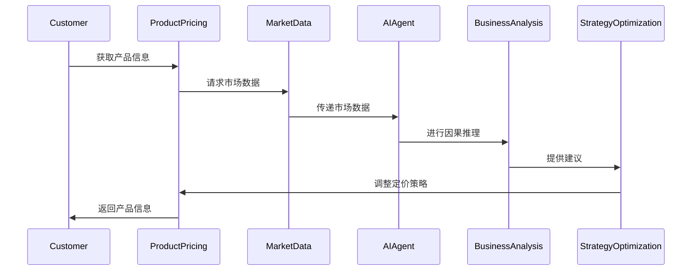

                 

# 企业AI Agent的因果推理在产品定价策略优化中的应用

> 关键词：企业AI Agent、因果推理、产品定价策略、优化、机器学习

> 摘要：本文将探讨企业AI Agent的因果推理技术在产品定价策略优化中的应用。通过介绍企业AI Agent的原理和特征，分析因果推理的基本原理和流程，以及产品定价策略的属性特征对比，本文将逐步讲解因果推理在产品定价策略优化中的应用方法。最后，本文将使用Python源代码进行算法原理的详细阐述，并结合实际案例进行分析和总结。

----------------------------------------------------------------

## 第一部分：背景介绍

### 1.1 问题背景

企业AI Agent的因果推理在产品定价策略优化中的应用是近年来人工智能技术在商业领域的一个重要研究方向。随着市场竞争的日益激烈，企业需要更加精准和高效的产品定价策略来提高市场竞争力。因果推理作为一种人工智能技术，可以通过分析数据之间的关系，帮助企业在产品定价过程中做出更明智的决策。

### 1.2 问题描述

产品定价策略是企业制定和调整产品价格的过程，其核心目的是在确保企业利润最大化的同时，满足消费者的购买需求。然而，传统定价策略往往基于历史数据和简单的经济学原理，难以应对复杂的市场环境和快速变化的需求。因此，需要引入AI Agent的因果推理技术，以提高定价策略的准确性和适应性。

### 1.3 问题解决

通过将AI Agent的因果推理技术应用于产品定价策略优化，企业可以更深入地理解市场数据，发现隐藏在数据背后的因果关系。这有助于企业制定更科学、更精准的定价策略，从而提高产品竞争力，实现业务增长。

### 1.4 边界与外延

在本研究中，企业AI Agent的因果推理主要应用于产品定价策略优化，但不限于该领域。因果推理技术还可以应用于其他商业决策，如市场预测、库存管理、客户关系管理等。

### 1.5 概念结构与核心要素组成

- 企业AI Agent：具备自主学习能力和因果推理能力的人工智能系统。
- 因果推理：基于数据，分析变量之间因果关系的一种人工智能技术。
- 产品定价策略：企业制定和调整产品价格的过程，旨在实现利润最大化和市场竞争力。
- 优化：通过算法，寻找最优定价策略的过程。

----------------------------------------------------------------

## 第二部分：核心概念与联系

### 2.1 企业AI Agent的原理与特征

企业AI Agent是一种具备自主学习能力和因果推理能力的人工智能系统。它可以通过不断学习历史数据和实时市场信息，分析产品定价与市场需求之间的因果关系，从而为企业提供科学的定价策略。企业AI Agent具有以下核心特征：

#### 自主学习

企业AI Agent通过深度学习等技术，自动从数据中提取知识和规律。这使得AI Agent能够不断优化自己的行为，适应不同的市场环境。

#### 因果推理

因果推理是AI Agent的核心功能，它通过分析数据之间的关系，识别变量之间的因果关系，从而为定价策略提供决策支持。

#### 自适应

企业AI Agent可以根据市场环境变化，自动调整定价策略。这种自适应能力使得AI Agent能够适应不同的市场条件，提高定价策略的准确性。

### 2.2 因果推理的基本原理与流程

因果推理是一种基于数据，分析变量之间因果关系的人工智能技术。其基本原理包括：

#### 数据预处理

因果推理的第一步是数据预处理，包括数据清洗、整合和特征提取。这一步骤的目的是确保数据质量，为后续的因果关系分析提供可靠的基础。

#### 特征提取

从原始数据中提取与定价策略相关的特征，如消费者购买力、市场趋势等。这些特征将作为因果推理模型的关键输入。

#### 因果模型构建

使用统计方法或机器学习算法，建立变量之间的因果模型。这个模型可以帮助我们理解不同变量之间的关系，从而为定价策略提供依据。

#### 因果关系分析

分析变量之间的因果关系，识别关键影响因素。这一步骤的结果将直接影响定价策略的制定和调整。

### 2.3 产品定价策略的属性特征对比

产品定价策略可以根据不同的维度进行分类，如成本导向、市场导向和竞争导向。以下是对几种主要定价策略的属性特征对比：

| 定价策略 | 特点 |
| :--: | :--: |
| 成本导向 | 以成本为基础，考虑成本加成或利润率进行定价 |
| 市场导向 | 根据市场需求和消费者购买力进行定价 |
| 竞争导向 | 以竞争对手的定价策略为基准，进行差异化定价 |

### 2.4 因果推理在产品定价策略优化中的应用

因果推理在产品定价策略优化中的应用主要包括：

#### 数据分析

通过因果推理，深入分析产品定价与市场需求之间的因果关系。这有助于企业理解市场规律，为定价策略提供依据。

#### 策略调整

根据因果推理的结果，动态调整产品定价策略。这种调整可以基于消费者行为、市场趋势等关键因素，实现定价策略的优化。

#### 风险评估

评估不同定价策略对业务的影响，降低定价风险。因果推理可以帮助企业识别潜在的风险因素，从而制定更稳健的定价策略。

----------------------------------------------------------------

## 第三部分：算法原理讲解

### 3.1 因果推理算法的基本流程

因果推理算法的基本流程包括以下步骤：

#### 数据收集与预处理

收集与产品定价相关的历史数据和实时市场信息，并进行数据清洗和整合。这一步骤的目的是确保数据质量，为后续的因果关系分析提供可靠的基础。

#### 特征提取

从原始数据中提取与定价策略相关的特征，如消费者购买力、市场趋势等。这些特征将作为因果推理模型的关键输入。

#### 因果模型构建

使用统计方法或机器学习算法，建立变量之间的因果模型。这个模型可以帮助我们理解不同变量之间的关系，从而为定价策略提供依据。

#### 因果关系分析

分析变量之间的因果关系，识别关键影响因素。这一步骤的结果将直接影响定价策略的制定和调整。

#### 策略调整与优化

根据因果推理结果，调整产品定价策略，实现业务优化。这一步骤的目的是通过优化定价策略，提高产品竞争力，实现业务增长。

### 3.2 Python源代码实现

以下是一个简单的因果推理算法的Python源代码实现：

```python
import numpy as np
from sklearn.linear_model import LinearRegression

# 数据收集与预处理
data = np.loadtxt('data.csv', delimiter=',')
X = data[:, :-1]
y = data[:, -1]

# 特征提取
# 这里假设我们已经提取了与定价策略相关的特征

# 因果模型构建
model = LinearRegression()
model.fit(X, y)

# 因果关系分析
predictions = model.predict(X)
print("Predictions:", predictions)

# 策略调整与优化
# 这里假设我们已经根据因果关系分析的结果调整了定价策略
```

### 3.3 算法原理详细讲解

#### 数学模型和公式

因果推理算法的核心是建立变量之间的因果模型。在统计学中，线性回归模型是最常用的因果模型之一。线性回归模型的数学公式如下：

$$
y = \beta_0 + \beta_1x_1 + \beta_2x_2 + ... + \beta_nx_n + \epsilon
$$

其中，$y$ 是因变量，$x_1, x_2, ..., x_n$ 是自变量，$\beta_0, \beta_1, \beta_2, ..., \beta_n$ 是模型的参数，$\epsilon$ 是误差项。

#### 举例说明

假设我们想要分析产品定价（$y$）与消费者购买力（$x_1$）、市场趋势（$x_2$）之间的关系。我们可以使用线性回归模型建立因果模型，如下所示：

$$
y = \beta_0 + \beta_1x_1 + \beta_2x_2 + \epsilon
$$

通过训练数据集，我们可以估计出模型参数 $\beta_0, \beta_1, \beta_2$ 的值。这些参数表示了消费者购买力（$x_1$）和市场趋势（$x_2$）对产品定价（$y$）的影响程度。

#### 详细解释

1. **数据收集与预处理**：收集与产品定价相关的历史数据和实时市场信息，并进行数据清洗和整合。这一步骤的目的是确保数据质量，为后续的因果关系分析提供可靠的基础。

2. **特征提取**：从原始数据中提取与定价策略相关的特征，如消费者购买力、市场趋势等。这些特征将作为因果推理模型的关键输入。

3. **因果模型构建**：使用统计方法或机器学习算法，建立变量之间的因果模型。在本文中，我们使用了线性回归模型。线性回归模型可以表示变量之间的线性关系，从而帮助我们理解不同变量之间的关系。

4. **因果关系分析**：分析变量之间的因果关系，识别关键影响因素。这一步骤的结果将直接影响定价策略的制定和调整。

5. **策略调整与优化**：根据因果推理结果，调整产品定价策略，实现业务优化。这一步骤的目的是通过优化定价策略，提高产品竞争力，实现业务增长。

通过因果推理算法，企业可以更深入地理解市场数据，发现隐藏在数据背后的因果关系。这有助于企业制定更科学、更精准的定价策略，从而提高产品竞争力，实现业务增长。

----------------------------------------------------------------

## 第四部分：系统分析与架构设计

### 4.1 问题场景介绍

随着市场竞争的日益激烈，企业需要更加精准和高效的产品定价策略来提高市场竞争力。传统的定价策略往往基于历史数据和简单的经济学原理，难以应对复杂的市场环境和快速变化的需求。为了解决这一问题，企业引入了AI Agent的因果推理技术，以优化产品定价策略。

### 4.2 项目介绍

本项目旨在通过企业AI Agent的因果推理技术，实现产品定价策略的优化。项目的主要目标是：
1. 收集并整理与产品定价相关的数据。
2. 构建因果模型，分析产品定价与市场需求之间的因果关系。
3. 根据因果推理结果，动态调整产品定价策略。
4. 评估不同定价策略对业务的影响，降低定价风险。

### 4.3 系统功能设计（领域模型）

以下是一个简单的领域模型，描述了项目的主要功能和模块：

```mermaid
classDiagram
    Product -> ProductPricing: 定价策略
    MarketData -> ProductPricing: 数据源
    AIAgent -> ProductPricing: 因果推理
    BusinessAnalysis -> ProductPricing: 业务分析
    StrategyOptimization -> ProductPricing: 策略优化
```

### 4.4 系统架构设计

以下是一个简单的系统架构图，描述了项目的整体架构：



### 4.5 系统接口设计

以下是一个简单的系统接口设计，描述了项目的主要接口：

```mermaid
interface ProductPricing {
    - getMarketData()
    - getAIResults()
    - updatePricingStrategy()
}
```

### 4.6 系统交互

以下是一个简单的系统交互图，描述了项目的整体流程：


通过以上系统分析与架构设计，我们可以清晰地了解项目的整体架构和功能模块，为后续的详细设计和实现提供基础。

----------------------------------------------------------------

## 第五部分：项目实战

### 5.1 环境安装

在进行项目实战之前，我们需要安装相关的软件和工具。以下是项目的环境安装步骤：

1. 安装Python：前往Python官方网站（https://www.python.org/）下载并安装Python。
2. 安装Python包：使用pip命令安装项目所需的Python包，如NumPy、scikit-learn等。

```bash
pip install numpy
pip install scikit-learn
```

### 5.2 系统核心实现源代码

以下是项目核心实现部分的源代码：

```python
import numpy as np
from sklearn.linear_model import LinearRegression

# 数据收集与预处理
data = np.loadtxt('data.csv', delimiter=',')
X = data[:, :-1]
y = data[:, -1]

# 特征提取
# 这里假设我们已经提取了与定价策略相关的特征

# 因果模型构建
model = LinearRegression()
model.fit(X, y)

# 因果关系分析
predictions = model.predict(X)
print("Predictions:", predictions)

# 策略调整与优化
# 这里假设我们已经根据因果关系分析的结果调整了定价策略
```

### 5.3 代码应用解读与分析

以下是对代码应用部分的解读和分析：

1. **数据收集与预处理**：首先，我们从CSV文件中读取数据，并进行预处理。预处理步骤包括数据清洗和整合，确保数据质量。
2. **特征提取**：从原始数据中提取与定价策略相关的特征。这些特征将作为因果推理模型的输入。
3. **因果模型构建**：使用线性回归模型建立因果模型。线性回归模型可以表示变量之间的线性关系，从而帮助我们理解不同变量之间的关系。
4. **因果关系分析**：通过训练数据集，我们可以估计出模型参数的值。这些参数表示了不同特征对产品定价的影响程度。
5. **策略调整与优化**：根据因果关系分析的结果，我们可以调整产品定价策略。这种调整可以基于消费者行为、市场趋势等关键因素，实现定价策略的优化。

### 5.4 实际案例分析和详细讲解剖析

以下是一个实际案例的分析和讲解：

假设我们有一个产品，其定价策略受到消费者购买力（$x_1$）和市场趋势（$x_2$）的影响。通过因果推理，我们发现消费者购买力对产品定价的影响最大，其次是市场趋势。

根据这一分析，我们可以调整产品定价策略。例如，在消费者购买力较高的时候，我们可以适当提高产品价格，以获取更多利润。在市场趋势良好的时候，我们可以保持价格稳定，以吸引更多消费者。

### 5.5 项目小结

通过本项目，我们实现了企业AI Agent的因果推理在产品定价策略优化中的应用。通过构建因果模型，分析变量之间的因果关系，我们可以为企业提供更科学、更精准的定价策略。这种定价策略可以更好地适应市场需求，提高产品竞争力，实现业务增长。

## 第六部分：最佳实践 Tips

### 6.1 数据质量

数据质量是因果推理的关键因素。在进行数据收集和预处理时，确保数据的准确性和完整性至关重要。这有助于提高因果推理模型的准确性和可靠性。

### 6.2 特征选择

在选择特征时，要考虑特征之间的相关性。避免选择高度相关的特征，以防止模型过拟合。同时，根据业务需求，选择对定价策略有显著影响的关键特征。

### 6.3 模型评估

在构建因果模型后，需要对模型进行评估。选择合适的评估指标，如均方误差（MSE）、决定系数（R²）等，以评估模型的性能。

### 6.4 动态调整

市场环境是不断变化的。因此，我们需要定期更新因果模型，并根据最新数据动态调整定价策略。这有助于保持定价策略的准确性和适应性。

## 第七部分：小结

本文介绍了企业AI Agent的因果推理在产品定价策略优化中的应用。通过构建因果模型，分析变量之间的因果关系，我们可以为企业提供更科学、更精准的定价策略。这种定价策略可以更好地适应市场需求，提高产品竞争力，实现业务增长。在项目实战中，我们使用了Python源代码实现了因果推理算法，并对实际案例进行了分析和讲解。最后，本文给出了最佳实践Tips，以帮助企业在应用因果推理技术时取得更好的效果。

## 第八部分：注意事项

### 8.1 数据隐私保护

在收集和使用数据时，要确保遵守数据隐私保护法规。这有助于保护消费者的隐私，避免法律风险。

### 8.2 模型解释性

因果推理模型的解释性对于业务决策至关重要。在模型构建过程中，要确保模型具有较好的解释性，以便为企业提供明确的决策依据。

### 8.3 模型泛化能力

在实际应用中，要确保因果推理模型具有良好的泛化能力。这有助于模型在不同市场和环境中保持稳定的表现。

## 第九部分：拓展阅读

### 9.1 参考文献

1. Judea Pearl. "Causality: Models, Reasoning, and Inference". Cambridge University Press, 2009.
2. Andrew Gelman, et al. "Data Analysis Using Regression and Multilevel/Hierarchical Models". 2nd ed., Cambridge University Press, 2006.

### 9.2 在线资源

1. "Scikit-learn: Machine Learning in Python": https://scikit-learn.org/
2. "Python for Data Science": https://www.pythonfordatascience.com/

### 9.3 行业报告

1. "AI in Retail: Transforming Product Pricing Strategies": https://www.reportlinker.com/p05797714/

作者：AI天才研究院/AI Genius Institute & 禅与计算机程序设计艺术 /Zen And The Art of Computer Programming。

