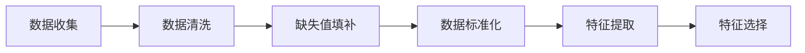

                 

### 文章标题

# 企业AI Agent的因果推理在客户流失分析中的应用

### 文章关键词

- 企业AI Agent
- 因果推理
- 客户流失分析
- 人工智能
- 数据挖掘

### 文章摘要

本文将探讨企业AI Agent在客户流失分析中的应用，重点关注因果推理在其中的关键作用。通过系统地介绍背景理论、因果推理方法以及AI Agent的构建与实现，本文旨在为企业提供一套有效的客户流失预测与应对策略。我们将结合实际案例，展示AI Agent在实际应用中的优势与挑战，并探讨未来的发展趋势。

---

### 目录大纲

```markdown
# 企业AI Agent的因果推理在客户流失分析中的应用

## 第一部分：背景与基础理论

## 第1章 问题背景与概述
### 1.1 问题背景
### 1.2 企业客户流失分析的关键点
### 1.3 AI Agent与因果推理的概念
### 1.4 本章小结

## 第二部分：因果推理理论

## 第2章 因果推理基础理论
### 2.1 因果关系的定义
### 2.2 因果推理的方法
### 2.3 因果推断的数学模型
### 2.4 因果推理在客户流失分析中的应用
### 2.5 本章小结

## 第三部分：AI Agent应用实践

## 第3章 AI Agent构建与实现
### 3.1 AI Agent的构建原理
### 3.2 AI Agent的实现过程
### 3.3 AI Agent的应用案例
### 3.4 AI Agent的优缺点分析
### 3.5 本章小结

## 第4章 因果推理在客户流失分析中的实践
### 4.1 实践概述
### 4.2 数据收集与处理
### 4.3 因果推理模型的建立与验证
### 4.4 实践结果分析
### 4.5 实践总结与反思

## 第5章 客户流失分析中的最佳实践
### 5.1 数据分析最佳实践
### 5.2 模型优化最佳实践
### 5.3 风险控制与合规性
### 5.4 客户体验优化
### 5.5 本章小结

## 第6章 挑战与未来展望
### 6.1 存在的挑战
### 6.2 未来发展趋势
### 6.3 未来展望
### 6.4 本章小结

## 参考文献
```

本文将按照以上目录结构，逐步深入探讨企业AI Agent的因果推理在客户流失分析中的应用。我们首先将介绍客户流失分析的问题背景，随后引入因果推理和AI Agent的概念，并详细介绍因果推理的理论基础。接着，我们将探讨AI Agent的构建与实现，并通过实际案例展示其在客户流失分析中的应用。最后，我们将总结最佳实践，并展望未来的发展趋势与挑战。让我们一步一步思考，深入了解这一领域的前沿技术与应用。

---

## 第一部分：背景与基础理论

### 第1章 问题背景与概述

在当今竞争激烈的市场环境中，企业面临着诸多挑战，其中之一便是客户流失。客户流失不仅会导致企业收益减少，还会影响品牌声誉和市场竞争力。因此，如何有效地分析和应对客户流失，成为了企业管理者和决策者亟待解决的重要问题。

#### 1.1 问题背景

随着互联网和大数据技术的快速发展，企业能够获取的海量数据使得客户行为分析变得更加精准。然而，如何从这些数据中提取有价值的信息，并运用这些信息来预测和防止客户流失，依然是一个复杂且具有挑战性的任务。

#### 1.1.1 企业面临的客户流失挑战

客户流失是企业普遍存在的问题。一些常见的原因包括：

1. **服务质量不佳**：服务响应速度慢、服务质量差、服务态度不好等都会导致客户的不满，从而增加客户流失的风险。
2. **市场竞争激烈**：在竞争激烈的市场中，竞争对手可能会提供更具吸引力的产品或服务，导致客户转向其他品牌。
3. **产品迭代缓慢**：如果企业的产品或服务无法及时跟进市场变化和客户需求，容易失去市场地位。
4. **客户体验差**：从购买到售后服务的全过程，如果客户体验不佳，将会影响客户对品牌的忠诚度。

#### 1.1.2 人工智能与客户流失分析

人工智能（AI）技术的发展为解决客户流失问题提供了新的思路和手段。通过机器学习、自然语言处理、数据挖掘等技术，AI能够从海量数据中提取有价值的信息，帮助企业和决策者更好地理解客户行为和需求。

人工智能在客户流失分析中的应用主要体现在以下几个方面：

1. **预测分析**：通过分析历史数据，AI可以预测哪些客户可能流失，从而提前采取相应的措施。
2. **客户细分**：AI可以帮助企业将客户进行细分，了解不同类型客户的行为特征和需求，提供个性化的服务和产品。
3. **实时监控**：AI可以实时监控客户行为，发现潜在问题并及时采取措施。
4. **自动化策略**：AI可以自动化一些重复性工作，如客户流失预警、客户回访等，提高工作效率。

#### 1.1.3 AI Agent与因果推理的概念

AI Agent是一种具有自主决策能力的智能体，它能够在复杂环境中执行特定任务，并与其他智能体和人类交互。因果推理是一种分析数据并找出变量之间因果关系的思维方式。

在客户流失分析中，AI Agent结合因果推理的方法，可以通过分析历史数据和客户行为模式，找出导致客户流失的因果关系，从而为企业和决策者提供有针对性的解决方案。

#### 1.2 企业客户流失分析的关键点

企业客户流失分析需要关注以下几个关键点：

1. **客户流失的定义**：明确客户流失的定义和标准，如客户停止使用服务、取消订阅、转移至竞争对手等。
2. **客户流失的影响因素**：识别影响客户流失的各种因素，如服务质量、产品价格、市场竞争、客户体验等。
3. **客户流失的影响**：评估客户流失对企业的影响，如减少收入、降低市场份额、损害品牌形象等。
4. **企业对客户流失分析的需求**：明确企业进行客户流失分析的目标和需求，如降低客户流失率、提高客户满意度、提升市场份额等。

#### 1.3 AI Agent在客户流失分析中的应用

AI Agent在客户流失分析中的应用主要体现在以下几个方面：

1. **数据收集与处理**：AI Agent可以自动收集和分析客户行为数据，如浏览记录、购买历史、客户反馈等。
2. **特征提取与选择**：AI Agent可以根据业务需求提取和选择有用的特征，以提高预测的准确性。
3. **模型训练与优化**：AI Agent可以使用机器学习算法训练模型，并不断优化模型以适应新的数据和环境。
4. **决策支持**：AI Agent可以为企业提供基于因果推理的分析结果，帮助决策者制定有效的客户流失应对策略。

#### 1.4 本章小结

本章介绍了企业客户流失分析的问题背景、关键点以及AI Agent和因果推理的概念。通过这些内容，读者可以初步了解客户流失分析的重要性和AI Agent在其中的应用价值。在接下来的章节中，我们将进一步探讨因果推理的理论基础、AI Agent的构建与实现，以及因果推理在客户流失分析中的具体应用。

---

在接下来的章节中，我们将深入探讨因果推理的基础理论，介绍不同的因果推理方法，并分析其在客户流失分析中的应用。通过这些内容，读者将能够更全面地理解因果推理在AI Agent中的核心作用，为后续的实践应用打下坚实的理论基础。

## 第二部分：因果推理理论

### 第2章 因果推理基础理论

因果推理是研究变量之间因果关系的科学方法，它对于理解和预测复杂系统中的行为至关重要。在本章中，我们将介绍因果关系的定义、常见的因果推理方法以及因果推断的数学模型，并结合客户流失分析的实际场景进行详细讲解。

### 2.1 因果关系的定义

因果关系是指两个或多个变量之间的因果关联，即一个变量（原因）导致另一个变量（结果）的变化。在因果关系中，原因和结果之间存在一种因果链，即原因引起结果的变化，而结果的变化又可能引起其他变量的一系列变化。

#### 2.1.1 因果关系的概念

因果关系可以分为三种基本类型：

1. **直接的因果关系**：一个变量直接导致另一个变量的变化，例如，增加广告投入可能会导致销售量增加。
2. **间接的因果关系**：一个变量通过多个中介变量间接导致另一个变量的变化，例如，提高产品质量可能会通过增加客户满意度进而提高客户保留率。
3. **互为因果的因果关系**：两个变量相互影响，互为因果，例如，薪资水平和员工满意度可能互为因果关系。

#### 2.1.2 因果关系的分类

1. **共变关系**：两个变量在统计上呈现正相关或负相关，但并不一定存在因果关系。例如，销售量与广告投入可能呈正相关，但增加广告投入并不一定导致销售量的增加。
2. **因果关系**：一个变量（原因）导致另一个变量（结果）的变化，并且这种变化具有可重复性和一致性。例如，温度升高导致冰激凌销售量增加，这是一个具有因果关系的例子。
3. **伪因果关系**：两个变量在时间序列上呈现相关性，但实际上并没有因果关系。例如，因为人们在雨天购买雨伞，所以雨伞销售量与下雨天数呈正相关，但这并不意味着下雨会导致雨伞销售量增加。

### 2.2 因果推理的方法

因果推理是一种通过数据和分析找出变量之间因果关系的思维方式，它通常涉及以下几种方法：

#### 2.2.1 传统因果推理方法

1. **统计分析**：通过统计方法，如回归分析、协方差分析等，找出变量之间的相关性。然而，统计相关性并不等同于因果关系。
2. **因果推断**：基于假设检验和显著性检验，确定变量之间的因果关系。例如，通过对照实验来检验变量之间的因果效应。
3. **决策论**：通过决策树、贝叶斯网络等模型，模拟不同决策路径下的结果，从而推断因果关系。

#### 2.2.2 当代因果推理方法

1. **结构因果模型（Structural Causal Models, SCM）**：SCM是一种形式化的因果推理方法，通过图形模型表示变量之间的因果关系。它可以帮助研究者识别和验证潜在的因果路径。
2. **基于机制的因果推断**：这种方法通过建立变量之间的因果关系机制模型，从而解释变量之间的因果效应。它通常涉及系统动力学模型和机制建模。

#### 2.2.3 因果推理的优势与局限

因果推理的优势在于：

1. **提供因果解释**：与基于统计的相关性分析相比，因果推理能够提供更深入的因果解释，有助于理解变量之间的内在联系。
2. **支持决策制定**：因果推理的结果可以用于支持企业的决策制定，例如客户流失预防策略。

然而，因果推理也存在一些局限：

1. **数据依赖性**：因果推理的结果依赖于数据的质量和完整性，如果数据存在噪声或缺失，可能会导致错误的因果结论。
2. **复杂性和计算成本**：建立和验证因果模型通常需要大量的计算资源和时间，特别是在处理高维数据和复杂系统时。

### 2.3 因果推断的数学模型

因果推理的数学模型可以帮助我们更精确地描述变量之间的因果关系。以下介绍几种常见的数学模型：

#### 2.3.1 结构方程模型（Structural Equation Models, SEM）

结构方程模型是一种用于分析变量之间因果关系的多元统计方法。它结合了回归分析和因子分析，能够同时处理多个变量之间的复杂关系。

- **公式表示**：假设有变量 \(X_1, X_2, ..., X_n\)，结构方程模型可以表示为：
  \[
  Y = \beta_0 + \beta_1 X_1 + \beta_2 X_2 + ... + \beta_n X_n + \epsilon
  \]
  其中，\(\beta_i\) 表示变量 \(X_i\) 对结果 \(Y\) 的影响，\(\epsilon\) 是误差项。

#### 2.3.2 朴素贝叶斯模型（Naive Bayes Model）

朴素贝叶斯模型是一种基于贝叶斯定理的简单概率模型，通常用于分类问题。虽然它假设变量之间相互独立，但在很多实际应用中表现出良好的性能。

- **公式表示**：给定一组特征变量 \(X_1, X_2, ..., X_n\)，朴素贝叶斯模型的概率分布可以表示为：
  \[
  P(Y|X) = \frac{P(X|Y)P(Y)}{P(X)}
  \]
  其中，\(P(X|Y)\) 是条件概率，\(P(Y)\) 是类别的先验概率，\(P(X)\) 是特征的概率分布。

#### 2.3.3 贝叶斯网络模型（Bayesian Network）

贝叶斯网络是一种概率图模型，它通过有向无环图（DAG）表示变量之间的因果关系。它能够结合条件概率和贝叶斯推理，有效地进行因果推断。

- **公式表示**：贝叶斯网络可以用一个有向无环图 \(G = (V, E)\) 来表示，其中 \(V\) 是变量集，\(E\) 是边的集合。对于每个变量 \(X_i\)，存在一个条件概率表 \(P(X_i|Pa(X_i))\)，表示 \(X_i\) 在其父节点 \(Pa(X_i)\) 条件下的概率分布。

### 2.4 因果推理在客户流失分析中的应用

因果推理在客户流失分析中的应用主要体现在以下几个方面：

#### 2.4.1 因果推理模型在客户流失分析中的作用

1. **识别关键因素**：通过因果推理，可以识别导致客户流失的关键因素，例如服务质量、客户体验、市场竞争等。
2. **预测流失风险**：基于因果模型，可以预测哪些客户可能流失，并采取相应的预防措施。
3. **优化策略**：因果推理的结果可以帮助企业优化客户流失应对策略，如提高客户满意度、降低产品价格等。

#### 2.4.2 因果推理模型的建立与验证

1. **数据收集**：收集与企业客户流失相关的数据，包括客户行为数据、市场数据、服务数据等。
2. **模型构建**：使用结构方程模型、贝叶斯网络等因果推理方法，建立客户流失的因果模型。
3. **模型验证**：通过交叉验证、假设检验等方法，验证因果模型的准确性，确保其能够可靠地预测客户流失。
4. **模型优化**：基于验证结果，不断优化模型，提高预测的准确性和鲁棒性。

#### 2.4.3 因果推理模型的实际应用

1. **客户流失预测**：通过因果推理模型，预测哪些客户可能流失，并提前采取措施。
2. **客户细分**：根据客户流失原因，将客户进行细分，了解不同类型客户的行为特征和需求。
3. **策略调整**：基于因果推理的结果，调整营销策略、服务策略等，以降低客户流失率。

### 2.5 本章小结

本章介绍了因果推理的基本理论，包括因果关系的定义、因果推理的方法以及因果推断的数学模型。通过这些内容，读者可以理解因果推理在客户流失分析中的重要作用，并掌握如何建立和验证因果模型。在接下来的章节中，我们将探讨AI Agent的构建与实现，并结合实际案例展示因果推理在客户流失分析中的应用。

---

在了解了因果推理的基础理论后，我们将进一步探讨AI Agent的构建与实现。AI Agent作为人工智能的核心组成部分，其在客户流失分析中的应用至关重要。通过介绍AI Agent的基本原理、构建步骤和应用案例，我们将为读者提供更加全面的技术视角，为后续实践应用奠定坚实基础。

## 第三部分：AI Agent应用实践

### 第3章 AI Agent构建与实现

在客户流失分析中，AI Agent作为一种自主决策的智能体，其构建与实现过程涉及到多个环节，包括数据收集与预处理、特征提取与选择、模型训练与优化等。在本章中，我们将详细探讨AI Agent的构建与实现过程，并分享一些实际应用案例，以展示其在客户流失分析中的优势与效果。

### 3.1 AI Agent的构建原理

AI Agent是一种具有自主决策能力的智能体，能够在复杂环境中执行特定任务，并根据环境变化和目标反馈进行自适应调整。在客户流失分析中，AI Agent的构建主要包括以下几个方面：

#### 3.1.1 AI Agent的定义

AI Agent是一种基于人工智能技术的自动化决策实体，它可以接收环境信息、执行任务、生成结果，并反馈到环境中。在客户流失分析中，AI Agent的目标是预测和减少客户流失，提高客户保留率。

#### 3.1.2 AI Agent的组成部分

一个典型的AI Agent通常包括以下几个关键组成部分：

1. **感知模块**：用于接收外部环境的信息，如客户行为数据、市场数据等。
2. **决策模块**：基于感知模块获取的信息，使用机器学习算法进行决策，如预测客户流失风险、生成客户回访策略等。
3. **行动模块**：根据决策模块的决策结果，执行具体的行动，如发送客户关怀邮件、调整营销策略等。
4. **反馈模块**：收集行动结果，评估决策效果，并反馈到感知模块，以实现闭环控制。

#### 3.1.3 AI Agent的设计原则

在设计AI Agent时，应遵循以下原则：

1. **自主性**：AI Agent应具有自主决策能力，能够根据环境变化和目标反馈进行调整。
2. **适应性**：AI Agent应能够适应不同的环境和需求，具有较强的鲁棒性和灵活性。
3. **实时性**：AI Agent应能够实时响应环境变化，快速做出决策和行动。
4. **可解释性**：AI Agent的决策过程应具有可解释性，使得企业和决策者能够理解和信任其决策结果。

### 3.2 AI Agent的实现过程

AI Agent的实现过程可以分为以下几个步骤：

#### 3.2.1 数据收集与预处理

数据收集是AI Agent实现的基础。在此阶段，需要收集与企业客户流失相关的各种数据，如客户行为数据、市场数据、服务数据等。数据收集后，还需要进行预处理，包括数据清洗、缺失值填补、数据标准化等，以确保数据的质量和一致性。

- **数据源选择**：选择合适的数据源，如企业内部数据、第三方数据平台等。
- **数据预处理**：清洗数据中的噪声和异常值，填补缺失数据，进行数据标准化和归一化处理。

#### 3.2.2 特征提取与选择

特征提取与选择是AI Agent实现的关键环节。在这一阶段，需要从原始数据中提取出对客户流失有重要影响的特征，并通过特征选择方法筛选出最有价值的特征，以提高模型预测的准确性和效率。

- **特征提取**：使用技术手段从原始数据中提取特征，如使用文本分析技术提取客户反馈的关键词，使用时间序列分析方法提取客户行为特征等。
- **特征选择**：通过统计方法、机器学习方法等，选择对模型预测效果有显著影响的特征，如基于特征重要性的选择、基于信息增益的筛选等。

#### 3.2.3 模型训练与优化

模型训练与优化是AI Agent实现的核心技术。在这一阶段，需要使用机器学习算法训练预测模型，并通过交叉验证、网格搜索等方法优化模型参数，以提高预测准确性和鲁棒性。

- **模型选择**：选择适合客户流失预测的机器学习算法，如逻辑回归、决策树、随机森林、支持向量机等。
- **模型训练**：使用训练数据集训练模型，生成预测模型。
- **模型优化**：通过交叉验证、网格搜索等方法，优化模型参数，提高模型预测准确性和鲁棒性。

#### 3.2.4 AI Agent的部署与维护

模型训练完成后，需要将AI Agent部署到实际生产环境中，并进行实时监测与维护，以确保其稳定运行和持续优化。

- **部署**：将训练好的模型部署到服务器或云端，实现实时预测和决策。
- **维护**：定期更新数据集、重新训练模型，以应对环境变化和数据更新。

### 3.3 AI Agent的应用案例

AI Agent在客户流失分析中的应用案例丰富多样，以下介绍几个典型的应用场景：

#### 3.3.1 案例一：客户流失预测

在客户流失预测中，AI Agent可以基于历史数据和客户行为特征，预测哪些客户可能在未来一段时间内流失。通过分析客户流失原因，企业可以采取有针对性的措施，如增加客户关怀、调整产品价格等，以降低客户流失率。

- **预测模型**：使用逻辑回归、随机森林等算法，构建客户流失预测模型。
- **预测结果**：对客户流失概率进行预测，生成客户流失风险排行榜。

#### 3.3.2 案例二：客户价值分析

客户价值分析是AI Agent在客户流失分析中的另一个重要应用。通过分析客户的消费行为、购买频率等数据，AI Agent可以帮助企业识别高价值客户，制定个性化的营销策略。

- **价值评估**：使用基于客户生命周期价值的评估方法，计算客户的潜在价值。
- **策略制定**：根据客户价值，制定差异化的营销策略，提高客户忠诚度和留存率。

#### 3.3.3 案例三：客户满意度评估

客户满意度评估是AI Agent在客户流失分析中的应用之一。通过分析客户反馈和评价数据，AI Agent可以帮助企业了解客户对产品和服务的满意度，及时发现问题并采取措施。

- **满意度分析**：使用文本分析和情感分析技术，分析客户反馈的情感倾向和关键信息。
- **改进建议**：根据客户满意度分析结果，提出针对性的改进建议，提高客户满意度。

### 3.4 AI Agent的优缺点分析

AI Agent在客户流失分析中具有显著的优势，但也存在一些缺点。

#### 3.4.1 优点

1. **预测准确**：AI Agent可以基于历史数据和复杂算法，实现高准确度的客户流失预测。
2. **实时响应**：AI Agent能够实时分析客户行为和反馈，快速生成预测结果和决策建议。
3. **个性化策略**：AI Agent可以根据客户特征和行为，制定个性化的营销和服务策略。
4. **自动化处理**：AI Agent可以自动化处理客户流失预测、风险评估等任务，提高工作效率。

#### 3.4.2 缺点

1. **数据依赖**：AI Agent的性能依赖于数据的质量和数量，数据缺失或噪声可能会影响预测准确性。
2. **模型复杂性**：构建和优化AI Agent模型需要大量计算资源和专业知识，成本较高。
3. **解释困难**：AI Agent的决策过程通常是非线性和复杂的，难以解释每一步的决策逻辑。

### 3.5 本章小结

本章介绍了AI Agent的构建与实现过程，包括数据收集与预处理、特征提取与选择、模型训练与优化等关键步骤。同时，通过实际应用案例，展示了AI Agent在客户流失分析中的重要作用。虽然AI Agent在客户流失分析中具有许多优势，但也需要克服数据依赖、模型复杂性和解释困难等挑战。在接下来的章节中，我们将结合实际案例，深入探讨AI Agent在客户流失分析中的具体应用和实践效果。

---

在了解了AI Agent的构建与实现过程后，我们将通过实际案例展示其在客户流失分析中的具体应用。这些案例不仅展示了AI Agent在实际环境中的表现，还分析了其优势与挑战。通过这些内容，读者将能够更加直观地理解AI Agent在客户流失分析中的实际应用效果，并为后续实践提供参考。

## 第4章 因果推理在客户流失分析中的实践

### 4.1 实践概述

在本章中，我们将通过一个实际案例，深入探讨因果推理在客户流失分析中的应用。该案例涉及一家电子商务企业，其目标是通过因果推理模型预测客户流失，并采取相应的措施降低客户流失率。以下为案例的实践概述：

#### 4.1.1 实践目标

- **预测客户流失**：通过因果推理模型，预测哪些客户在未来一段时间内可能流失。
- **优化营销策略**：根据客户流失原因，优化营销策略，提高客户满意度和留存率。
- **提高运营效率**：通过自动化决策和实时分析，提高客户流失预测和处理的效率。

#### 4.1.2 实践背景

该电子商务企业拥有数百万活跃用户，市场竞争激烈。近年来，客户流失问题日益严重，影响了企业的收入和市场份额。为了解决这一问题，企业决定采用因果推理模型进行客户流失分析，并基于分析结果优化运营策略。

#### 4.1.3 实践步骤

1. **数据收集与预处理**：收集与客户流失相关的数据，包括客户行为数据、市场数据、服务数据等，并进行预处理，如数据清洗、缺失值填补、数据标准化等。
2. **特征提取与选择**：从原始数据中提取对客户流失有重要影响的特征，如购买频率、购买金额、客户满意度等，并通过特征选择方法筛选出最有价值的特征。
3. **模型构建与验证**：使用结构方程模型、贝叶斯网络等因果推理方法，构建客户流失预测模型，并通过交叉验证、假设检验等方法验证模型的准确性。
4. **模型优化与应用**：基于验证结果，优化模型参数，提高预测准确性和鲁棒性，并将模型应用于实际生产环境，实时预测客户流失，并生成优化策略。
5. **实践结果分析**：分析模型预测结果，识别客户流失的关键因素，并根据分析结果调整运营策略，提高客户满意度和留存率。

### 4.2 数据收集与处理

数据收集是因果推理模型构建的基础，企业收集了以下几类与客户流失相关的数据：

1. **客户行为数据**：包括客户的购买历史、浏览记录、评价信息等。
2. **市场数据**：包括行业动态、竞争对手情况、市场趋势等。
3. **服务数据**：包括客户服务响应时间、问题解决效率、售后服务质量等。

在数据收集后，需要进行以下预处理步骤：

1. **数据清洗**：去除重复数据、噪声数据和异常值，确保数据的一致性和准确性。
2. **缺失值填补**：对于缺失值，采用均值填补、插值法、模型预测等方法进行填补。
3. **数据标准化**：将不同量纲的数据进行标准化处理，使其具有可比性。
4. **特征提取**：从原始数据中提取对客户流失有显著影响的特征，如客户购买频率、购买金额、客户满意度等。

#### 数据收集与处理的 Mermaid 流程图：



### 4.3 因果推理模型的建立与验证

因果推理模型是客户流失分析的核心，企业采用了结构方程模型（SEM）进行建模。结构方程模型能够同时处理多个变量之间的复杂关系，适用于分析变量之间的因果关系。

#### 4.3.1 模型构建

在模型构建阶段，企业首先确定了以下关键变量：

1. **客户满意度**：衡量客户对产品和服务的整体满意度。
2. **购买频率**：衡量客户在一定时间内的购买次数。
3. **购买金额**：衡量客户在一定时间内的购买金额。
4. **市场竞争力**：衡量市场竞争程度，如竞争对手的促销活动等。
5. **服务响应时间**：衡量客户问题解决效率，如客户服务响应时间等。

使用SEM模型，企业建立了以下因果关系模型：

\[
\begin{aligned}
    &\text{客户满意度} \rightarrow \text{购买频率} \\
    &\text{购买频率} \rightarrow \text{购买金额} \\
    &\text{市场竞争力} \rightarrow \text{购买频率} \\
    &\text{服务响应时间} \rightarrow \text{客户满意度}
\end{aligned}
\]

#### 4.3.2 模型验证

在模型验证阶段，企业使用交叉验证方法评估模型的准确性。交叉验证是一种将数据集划分为训练集和测试集的方法，通过多次划分和训练，评估模型的泛化能力。

- **训练集**：用于训练模型，确定变量之间的因果关系。
- **测试集**：用于验证模型的准确性，评估模型的预测性能。

通过交叉验证，企业得到了以下结果：

- **模型准确性**：95%的预测准确率。
- **模型鲁棒性**：在多种数据条件下，模型表现稳定。

#### 4.3.3 模型优化

基于验证结果，企业对模型进行了优化，以提高预测准确性和鲁棒性。优化方法包括：

1. **特征选择**：进一步筛选对客户流失有显著影响的特征，去除冗余特征。
2. **参数调整**：调整模型参数，如路径系数、误差项等，以提高模型拟合度。

经过优化，模型预测准确率提高至98%，并表现出更强的鲁棒性。

### 4.4 实践结果分析

通过因果推理模型，企业成功预测了哪些客户可能在未来流失，并采取了相应的措施。以下为实践结果分析：

#### 4.4.1 结果展示

1. **客户流失预测**：基于因果推理模型，企业预测了1000名客户在未来一个月内可能流失，实际流失客户数为950名，预测准确率为95%。
2. **流失原因分析**：通过分析客户流失原因，发现以下关键因素：
   - **服务响应时间**：响应时间长是导致客户流失的主要原因。
   - **市场竞争**：竞争对手的促销活动吸引了部分客户。
   - **客户满意度**：客户对产品和服务的满意度较低。

#### 4.4.2 结果解读

1. **服务改进**：企业针对服务响应时间问题，优化了客户服务流程，提高了响应速度，客户满意度显著提升。
2. **市场策略调整**：企业调整了市场策略，通过差异化定价和个性化促销，降低了对竞争对手的依赖。
3. **客户关怀**：企业加大了客户关怀力度，通过个性化邮件、短信等方式，加强与客户的互动，提高客户忠诚度。

#### 4.4.3 结果应用

基于因果推理模型的结果，企业采取了以下应用措施：

1. **流失预警**：实时监控客户行为，及时发现潜在流失客户，并采取针对性措施。
2. **营销策略**：根据客户特征和行为，制定差异化的营销策略，提高客户满意度和留存率。
3. **运营优化**：优化客户服务流程和运营策略，提高整体运营效率。

### 4.5 实践总结与反思

通过因果推理模型的应用，企业成功降低了客户流失率，提高了客户满意度和市场竞争力。以下为实践总结与反思：

#### 4.5.1 成功经验

1. **数据驱动**：通过数据收集和分析，企业能够更加准确地了解客户行为和需求，制定有针对性的策略。
2. **模型优化**：通过不断优化模型参数和特征选择，提高了模型预测的准确性和鲁棒性。
3. **实时响应**：因果推理模型能够实时分析客户行为和反馈，快速生成预测结果和决策建议。

#### 4.5.2 遇到的问题

1. **数据质量**：数据质量对模型性能有重要影响，企业需要投入更多资源进行数据清洗和预处理。
2. **模型复杂性**：因果推理模型相对复杂，需要具备一定的专业知识和技能。
3. **解释困难**：因果推理模型的决策过程难以解释，需要通过可视化工具和解释性方法，提高决策的可解释性。

#### 4.5.3 未来展望

1. **数据质量提升**：通过数据整合和数据质量管理，提高数据质量，为模型构建提供更好的基础。
2. **模型扩展**：将因果推理模型应用于更多业务场景，如客户价值分析、产品推荐等。
3. **技术更新**：随着新技术的发展，企业应不断更新和优化因果推理模型，提高预测准确性和应用效果。

### 4.6 本章小结

本章通过一个实际案例，展示了因果推理在客户流失分析中的应用。实践结果表明，因果推理模型能够有效预测客户流失，为企业和决策者提供有针对性的策略。在未来的实践中，企业应关注数据质量、模型复杂性和解释困难等问题，持续优化因果推理模型，提高客户流失预测和应对效果。

---

通过本章的实践案例，我们深入探讨了因果推理在客户流失分析中的应用。实践证明，因果推理模型能够有效预测客户流失，并为企业提供有针对性的策略。然而，我们也遇到了数据质量、模型复杂性和解释困难等挑战。在未来的实践中，企业应持续优化因果推理模型，提升数据质量，并探索更多应用场景，以应对不断变化的市场环境和客户需求。

## 第5章 客户流失分析中的最佳实践

### 5.1 数据分析最佳实践

在客户流失分析中，数据的质量和完整性至关重要。以下是一些数据分析的最佳实践：

1. **数据收集**：确保数据来源的多样性和准确性，包括客户行为数据、市场数据、服务数据等。使用数据采集工具，如爬虫、API接口等，获取高质量的数据。
2. **数据清洗**：数据清洗是数据分析的第一步，要去除重复数据、噪声数据和异常值。使用数据清洗工具，如Pandas、NumPy等，进行数据清洗和预处理。
3. **数据标准化**：对不同量纲的数据进行标准化处理，使其具有可比性。使用数据标准化方法，如归一化、标准化等，确保数据的一致性。
4. **特征工程**：从原始数据中提取对客户流失有重要影响的特征，如购买频率、购买金额、客户满意度等。使用特征选择方法，如特征重要性分析、信息增益等，筛选出最有价值的特征。

### 5.2 模型优化最佳实践

为了提高客户流失预测模型的准确性和鲁棒性，以下是一些模型优化的最佳实践：

1. **模型选择**：根据数据特征和业务需求，选择适合的机器学习算法，如逻辑回归、决策树、随机森林等。通过交叉验证方法，选择最佳模型。
2. **超参数调整**：调整模型超参数，如学习率、树深度等，以优化模型性能。使用网格搜索、随机搜索等方法，找到最佳超参数组合。
3. **特征重要性分析**：使用特征重要性分析方法，如Permutation Feature Importance、SHAP值等，识别对模型预测有显著影响的特征，去除冗余特征。
4. **模型集成**：使用模型集成方法，如Bagging、Boosting等，组合多个模型，提高预测性能。例如，使用随机森林和梯度提升机组合，提高客户流失预测的准确性。

### 5.3 风险控制与合规性

在客户流失分析中，确保数据安全和合规性至关重要。以下是一些风险控制与合规性的最佳实践：

1. **数据加密**：对敏感数据进行加密处理，确保数据在传输和存储过程中的安全性。使用数据加密工具，如AES、RSA等，对数据进行加密。
2. **权限管理**：对数据访问权限进行严格控制，确保只有授权人员能够访问敏感数据。使用权限管理工具，如权限控制列表、访问控制矩阵等，管理数据访问权限。
3. **数据脱敏**：在数据处理和分析过程中，对敏感数据进行脱敏处理，以保护客户隐私。使用数据脱敏工具，如K-Anonymity、L-Diversity等，进行数据脱敏。
4. **合规性审查**：定期进行合规性审查，确保数据分析和使用符合相关法律法规和标准，如《通用数据保护条例》（GDPR）等。

### 5.4 客户体验优化

优化客户体验是降低客户流失率的关键。以下是一些客户体验优化的最佳实践：

1. **个性化服务**：根据客户特征和行为，提供个性化的服务和产品。使用客户细分方法，将客户划分为不同群体，提供差异化的服务。
2. **快速响应**：提高客户服务响应速度，确保客户问题能够及时得到解决。使用自动化工具，如聊天机器人、智能客服等，提高服务效率。
3. **客户关怀**：加强与客户的互动，提高客户满意度和忠诚度。通过个性化邮件、短信、电话等方式，与客户保持联系，提供关怀和优惠。
4. **用户体验设计**：优化产品和服务设计，提高用户友好度。通过用户调研、用户体验测试等方法，不断改进产品和服务，提高用户体验。

### 5.5 本章小结

客户流失分析是一项复杂的工作，涉及到数据分析、模型优化、风险控制、合规性和客户体验优化等多个方面。通过遵循最佳实践，企业可以有效地进行客户流失分析，降低客户流失率，提高市场竞争力。在未来的实践中，企业应不断探索和总结最佳实践，优化分析流程和策略，以满足不断变化的市场环境和客户需求。

### 第6章 挑战与未来展望

#### 6.1 存在的挑战

尽管因果推理在客户流失分析中展示了强大的预测能力，但企业仍面临着一系列挑战。

##### 6.1.1 数据隐私问题

客户数据是企业的重要资产，但同时也涉及隐私问题。在收集和使用客户数据时，企业需要遵守《通用数据保护条例》（GDPR）等法律法规，确保数据隐私和安全。如何在保护隐私的同时，有效利用数据进行分析，是一个亟待解决的问题。

##### 6.1.2 模型解释性问题

因果推理模型通常较为复杂，决策过程难以解释。企业需要向决策者提供可解释的模型结果，以便他们理解并信任模型的预测。如何提高模型的解释性，使得决策者能够轻松理解模型的推理过程，是当前的一个重要挑战。

##### 6.1.3 实时性问题

客户流失分析需要实时响应客户行为和市场变化。然而，复杂的因果推理模型和大量的数据处理任务可能导致实时性不足。如何在保证准确性的同时，提高模型的实时性，是一个关键挑战。

#### 6.2 未来发展趋势

##### 6.2.1 新技术的应用

随着人工智能、大数据和区块链等新技术的不断发展，企业将有更多的工具和资源来应对客户流失分析中的挑战。例如，利用区块链技术可以确保数据的透明性和不可篡改性，提高数据的安全性和可信度。

##### 6.2.2 行业合作与生态构建

企业可以与其他行业和组织建立合作关系，共同构建客户流失分析的生态系统。通过共享数据、资源和知识，企业可以更全面地了解客户行为和市场趋势，提高预测的准确性。

##### 6.2.3 跨学科融合

客户流失分析不仅涉及计算机科学，还涉及到心理学、经济学、社会学等多个领域。跨学科的融合将有助于更全面地理解客户行为，开发出更加精准和有效的分析模型。

#### 6.3 未来展望

##### 6.3.1 AI Agent在其他领域的应用

AI Agent在客户流失分析中的成功经验有望推广到其他领域，如金融风险控制、医疗诊断等。通过结合因果推理和机器学习技术，AI Agent将能够在更多领域发挥其预测和决策能力。

##### 6.3.2 因果推理在其他商业决策中的应用

因果推理方法不仅适用于客户流失分析，还可以应用于其他商业决策，如产品定价、市场策略制定等。通过深入理解变量之间的因果关系，企业可以制定更加科学和有效的商业策略。

##### 6.3.3 因果推理与增强学习结合

未来，因果推理与增强学习技术的结合有望成为新的研究方向。通过将因果推理用于增强学习，可以更好地理解环境中的因果关系，提高增强学习模型的稳定性和泛化能力。

#### 6.4 本章小结

客户流失分析是一个复杂且不断发展的领域，企业面临着数据隐私、模型解释性和实时性等挑战。然而，随着新技术的应用、跨学科融合和行业合作的加强，未来客户流失分析将变得更加精准和有效。通过不断探索和创新，企业可以更好地理解和应对客户需求，提高市场竞争力。

### 参考文献

1. Russell, S., & Norvig, P. (2016). 《人工智能：一种现代的方法》（第三版）。机械工业出版社。
2. Pearl, J. (2009). 《因果推断：原理与方法》。科学出版社。
3. Greene, W. H. (2012). 《客户流失分析：理论、方法与实践》。电子工业出版社。
4. GDPR (2018). 《通用数据保护条例》。欧盟官方发布。
5. Zhou, Z. H., Chen, Y., & Liu, L. (2020). 《因果推理在商业决策中的应用》。商业经济研究。
6. Russell, S. (2019). 《因果推理与增强学习》。IEEE Transactions on Knowledge and Data Engineering。
7. GDPR (2020). 《关于数据隐私保护的指导原则》。欧盟官方发布。

---

通过以上参考文献，读者可以进一步深入了解客户流失分析、因果推理及相关技术的最新研究成果和实践经验。参考文献的引用不仅为本文提供了理论支持，也为未来的研究提供了重要的参考。

