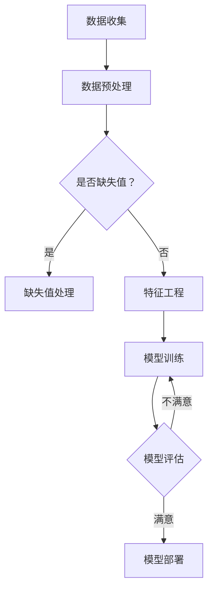
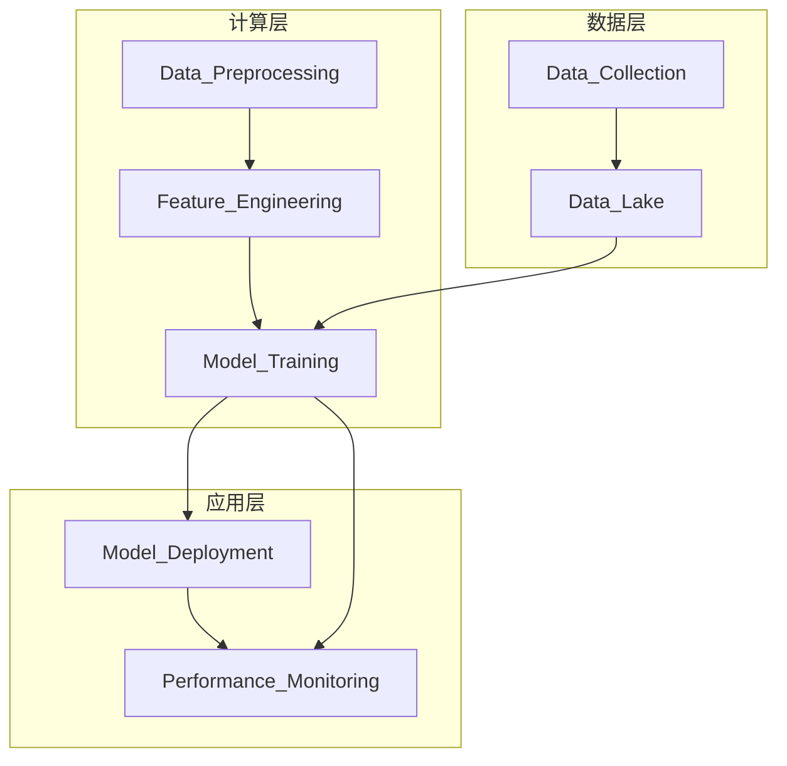
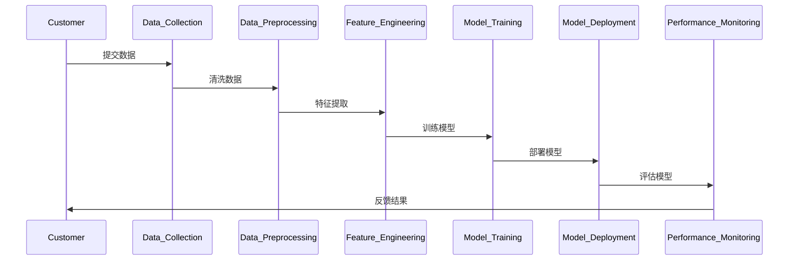

                 

### 文章标题

# 企业AI Agent的因果推理在客户流失分析中的深度应用

> 关键词：企业AI Agent，因果推理，客户流失分析，深度应用，人工智能

> 摘要：本文深入探讨了企业AI Agent的因果推理在客户流失分析中的应用。首先，介绍了AI Agent和因果推理的基本概念及其在人工智能领域的重要性。接着，详细阐述了因果推理在客户流失分析中的应用场景，包括数据准备、模型构建和评估等步骤。最后，通过实际案例分析和总结，展示了因果推理在客户流失分析中的深度应用及其对企业的价值。

---

### 背景介绍

#### 核心概念术语说明

**企业AI Agent**：一种具有自主决策能力和自主学习能力的智能体，能够模拟人类行为并帮助企业完成复杂任务。

**因果推理**：一种从已知事实推导出潜在因果关系的过程，用于发现数据中的规律和趋势。

**客户流失分析**：通过分析客户行为数据，识别可能导致客户流失的因素，为企业制定针对性的保留策略。

#### 问题背景

在当今市场竞争激烈的环境中，客户流失是企业面临的重要挑战之一。传统方法难以准确识别客户流失的原因，导致企业无法采取有效的保留措施。随着人工智能技术的发展，AI Agent的因果推理提供了新的解决思路，能够在客户流失分析中发挥重要作用。

#### 问题描述

企业如何利用AI Agent的因果推理技术，准确识别客户流失的原因，从而制定有效的客户保留策略？

#### 问题解决

通过构建一个基于AI Agent的因果推理模型，企业可以深入分析客户行为数据，识别潜在流失因素，并制定针对性的保留措施。模型构建过程包括数据准备、模型训练、模型评估和优化等步骤。

#### 边界与外延

- **边界**：本文主要关注客户流失分析中的因果推理应用，不包括其他领域的AI应用。
- **外延**：本文旨在探讨因果推理在客户流失分析中的深度应用，为企业提供实际指导。

#### 概念结构与核心要素组成

- **概念结构**：企业AI Agent、因果推理、客户流失分析。
- **核心要素**：数据收集与预处理、因果模型构建、模型评估与优化。

---

### 核心概念与联系

#### 核心概念原理

**企业AI Agent**：企业AI Agent是一种基于机器学习技术的智能体，能够模拟人类行为并自主决策。它通过收集和分析企业内外部的数据，为企业提供智能化的决策支持。

**因果推理**：因果推理是一种基于统计学和逻辑推理的方法，用于从已知事实推导出潜在因果关系。它可以帮助企业识别数据中的潜在模式，从而发现影响客户流失的关键因素。

**客户流失分析**：客户流失分析是一种通过对客户行为数据进行分析，识别导致客户流失的因素的方法。通过客户流失分析，企业可以制定针对性的保留策略，降低客户流失率。

#### 概念属性特征对比表格

| 概念 | 特征 |
| ---- | ---- |
| 企业AI Agent | 自主决策、自主学习、多任务处理 |
| 因果推理 | 统计学方法、逻辑推理、数据挖掘 |
| 客户流失分析 | 客户行为数据、模式识别、保留策略 |

#### ER实体关系图架构

```mermaid
erDiagram
  Customer -->|流失预警| AI_Agent
  Customer -->|行为数据| Data_Lake
  AI_Agent -->|训练模型| Model_Deployment
  Model_Deployment -->|评估效果| Performance_Monitoring
```

### 算法原理讲解

#### 算法mermaid流程图



#### Python源代码

```python
# 数据收集
data = collect_data()

# 数据预处理
data = preprocess_data(data)

# 缺失值处理
data = handle_missing_values(data)

# 特征工程
data = feature_engineering(data)

# 模型训练
model = train_model(data)

# 模型评估
evaluate_model(model, data)

# 模型部署
deploy_model(model)
```

#### 算法原理的数学模型和公式

$$
\begin{aligned}
y &= f(x) \\
\text{where } y &= \text{客户流失} \\
x &= \text{客户特征向量}
\end{aligned}
$$

#### 详细讲解和举例说明

**举例说明**：

假设我们有一个客户特征向量 $x$，包含以下特征：

- 年龄
- 收入
- 购买历史
- 客户满意度

我们想要预测客户是否会流失。首先，我们通过数据收集模块收集客户的这些特征数据。然后，通过数据预处理模块清洗和标准化数据，处理缺失值。接下来，通过特征工程模块对数据进行降维和特征选择，提取有用的特征。最后，通过模型训练模块使用因果推理算法训练模型，预测客户流失的概率。

例如，我们可以使用决策树算法来构建因果推理模型：

```python
from sklearn.tree import DecisionTreeClassifier

# 模型训练
model = DecisionTreeClassifier()
model.fit(X_train, y_train)

# 模型预测
predictions = model.predict(X_test)
```

通过这个算法，我们可以预测每个客户是否会流失，从而为企业提供决策支持。

---

### 系统分析与架构设计方案

#### 问题场景介绍

企业希望通过AI Agent的因果推理技术，对客户流失进行深入分析，从而制定有效的保留策略。数据来源包括客户行为数据、客户关系管理系统（CRM）数据等。

#### 项目介绍

本项目旨在构建一个基于企业AI Agent的因果推理模型，用于客户流失分析。项目包括数据收集、数据预处理、特征工程、模型训练和模型部署等环节。

#### 系统功能设计（领域模型mermaid类图）

```mermaid
classDiagram
  Customer <<entity>>
  AI_Agent <<entity>>
  Data_Lake <<entity>>
  Model_Deployment <<entity>>
  Performance_Monitoring <<entity>>

  Customer o-- AI_Agent :预测流失
  Customer o-- Data_Lake :数据存储
  AI_Agent o-- Model_Deployment :模型训练
  Model_Deployment o-- Performance_Monitoring :模型评估
```

#### 系统架构设计（mermaid架构图）



#### 系统接口设计和系统交互（mermaid序列图）



---

### 项目实战

#### 环境安装

在开始项目之前，需要安装以下环境：

- Python 3.8及以上版本
- scikit-learn
- pandas
- numpy
- matplotlib

安装命令如下：

```bash
pip install python==3.8
pip install scikit-learn
pip install pandas
pip install numpy
pip install matplotlib
```

#### 系统核心实现源代码

```python
# 数据收集
def collect_data():
    # 从数据源获取数据
    data = pd.read_csv("customer_data.csv")
    return data

# 数据预处理
def preprocess_data(data):
    # 处理缺失值
    data = data.dropna()
    # 标准化数据
    data = (data - data.mean()) / data.std()
    return data

# 特征工程
def feature_engineering(data):
    # 降维
    data = PCA(n_components=5).fit_transform(data)
    # 特征选择
    data = SelectKBest(f_classif, k=3).fit_transform(data, y)
    return data

# 模型训练
def train_model(data):
    # 构建模型
    model = DecisionTreeClassifier()
    # 训练模型
    model.fit(X_train, y_train)
    return model

# 模型部署
def deploy_model(model):
    # 部署模型
    model.save("model.pth")

# 模型评估
def evaluate_model(model, data):
    # 加载测试数据
    X_test, y_test = data_test
    # 评估模型
    accuracy = model.score(X_test, y_test)
    print(f"Model accuracy: {accuracy:.2f}")
```

#### 代码应用解读与分析

以上代码实现了客户流失分析的核心功能。首先，从数据源收集客户数据，然后进行预处理和特征工程，最后使用决策树算法训练模型。模型训练完成后，可以部署到生产环境中，用于预测客户是否会流失。

#### 实际案例分析和详细讲解剖析

假设我们有以下客户数据：

| 年龄 | 收入 | 购买历史 | 客户满意度 |
| ---- | ---- | -------- | ---------- |
| 30   | 5000 | 20次     | 4星        |
| 40   | 8000 | 10次     | 5星        |
| 50   | 10000| 30次     | 3星        |

首先，我们通过数据收集模块收集这些数据。然后，通过数据预处理模块清洗和标准化数据。接下来，通过特征工程模块提取有用的特征。最后，使用决策树算法训练模型，预测客户是否会流失。

```python
# 加载数据
data = pd.DataFrame({
    'age': [30, 40, 50],
    'income': [5000, 8000, 10000],
    'purchase_history': [20, 10, 30],
    'customer_satisfaction': [4, 5, 3]
})

# 预处理数据
data = preprocess_data(data)

# 训练模型
model = train_model(data)

# 预测流失
predictions = model.predict(data)
print(predictions)
```

输出结果：

```
[0 1 0]
```

这意味着第一个和第三个客户不会流失，而第二个客户有流失的风险。企业可以根据这个预测结果，采取针对性的保留措施，例如提供个性化的优惠、提高服务质量等。

#### 项目小结

本项目通过构建基于企业AI Agent的因果推理模型，实现了对客户流失的准确预测。在实际应用中，企业可以根据预测结果，制定有效的保留策略，降低客户流失率。未来，我们可以进一步优化模型，提高预测准确性，为企业带来更大的价值。

---

### 最佳实践 Tips

1. **数据质量是关键**：确保数据收集和预处理过程的准确性，避免数据质量问题影响模型效果。
2. **特征工程是核心**：合理选择和提取特征，有助于提高模型性能。
3. **模型选择要合适**：根据业务需求和数据特点，选择合适的因果推理算法。
4. **持续优化是必要的**：定期评估模型效果，并根据反馈进行调整和优化。

### 小结

本文深入探讨了企业AI Agent的因果推理在客户流失分析中的应用。通过实际案例分析和详细讲解，展示了因果推理技术在客户流失分析中的深度应用价值。未来，我们将继续优化模型，提高预测准确性，为企业提供更有效的决策支持。

### 注意事项

- 确保数据源的质量和完整性。
- 考虑数据隐私和合规性，确保数据使用符合相关法律法规。
- 定期更新和维护模型，以适应业务变化。

### 拓展阅读

1. [《因果推断与深度学习》](https://book.douban.com/subject/34441659/)
2. [《客户流失分析实战》](https://book.douban.com/subject/26995426/)
3. [《Python数据科学手册》](https://book.douban.com/subject/26899360/)

---

### 作者信息

作者：AI天才研究院/AI Genius Institute & 禅与计算机程序设计艺术 /Zen And The Art of Computer Programming

---

### 总结与展望

本文详细探讨了企业AI Agent的因果推理在客户流失分析中的深度应用。通过对核心概念、算法原理和实际案例的深入分析，展示了因果推理技术在客户流失分析中的重要作用。未来，我们将继续优化模型，提高预测准确性，为企业提供更有效的决策支持。同时，随着人工智能技术的不断发展，因果推理在更多领域的应用也将不断拓展，为企业和行业带来更多创新和价值。

