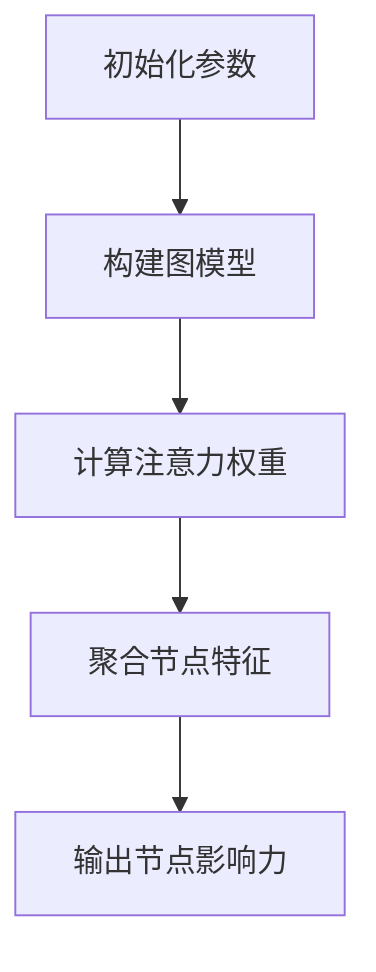
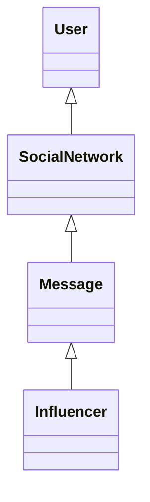
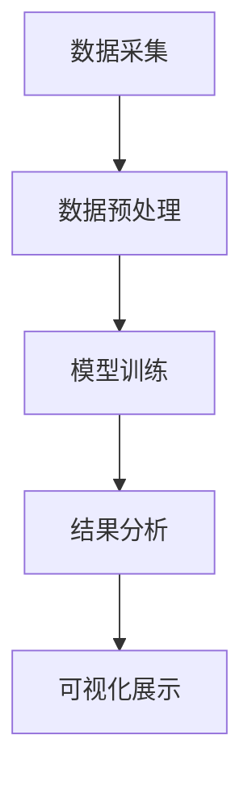
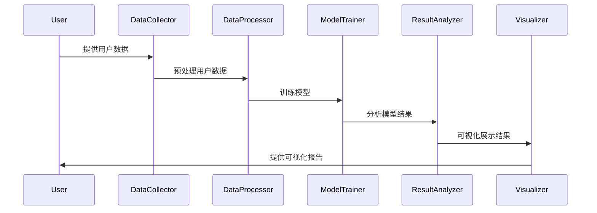

                 

### 1. 文章标题、关键词与摘要

#### 1.1 文章标题

《企业AI Agent的图注意力网络在社交网络影响力分析中的应用》

#### 1.2 关键词

- 企业AI Agent
- 图注意力网络
- 社交网络影响力分析
- 信息传播模型
- 图神经网络

#### 1.3 摘要

本文深入探讨了企业AI Agent如何借助图注意力网络（GAT）在社交网络影响力分析中的应用。通过对问题的背景介绍、核心概念的阐述、算法原理的讲解、系统分析与架构设计以及实际项目实战，本文揭示了GAT在社交媒体分析中的关键作用，并提供了最佳实践技巧。本文旨在为从事人工智能和社交网络分析的技术人员提供有价值的参考。

### 2. 背景介绍

#### 2.1 问题背景

在当今数字化社会中，社交网络已成为人们获取信息、交流意见的重要平台。社交网络的影响力分析对于企业来说具有重要意义，可以帮助企业更好地了解市场趋势、用户需求，进而优化产品和营销策略。然而，传统的基于特征的方法在处理大规模、复杂的社交网络数据时存在诸多局限，无法准确捕捉信息传播的动态性和网络的非线性特征。

#### 2.2 问题描述

社交网络影响力分析主要面临以下问题：

1. **信息过载**：社交网络中每天产生海量信息，如何筛选出对用户有影响力的重要信息成为一个挑战。
2. **网络动态性**：社交网络中的节点和边（用户和关系）不断变化，传统的静态模型难以适应。
3. **非线性特征**：社交网络中的影响力传播存在复杂的非线性关系，需要更强大的建模能力。

#### 2.3 问题解决

为了解决上述问题，本文提出了一种基于企业AI Agent的图注意力网络（GAT）的社交网络影响力分析方法。该方法利用图神经网络（GNN）强大的特征学习和非线性建模能力，通过引入注意力机制自适应地聚合节点的特征，从而实现对社交网络影响力的高效分析。

#### 2.4 边界与外延

本文研究的边界主要限定在社交网络影响力分析的场景，具体包括以下方面：

1. **数据源**：本文以社交媒体平台（如微博、推特、Facebook等）的数据为研究对象。
2. **分析方法**：本文重点关注基于图注意力网络的社交网络影响力评估和信息传播路径预测。
3. **应用场景**：本文提出的方法主要应用于企业市场营销、舆情监测和社交网络分析等领域。

### 3. 核心概念与联系

#### 3.1 核心概念原理

##### 3.1.1 AI Agent

AI Agent是指能够自主感知环境、制定决策并采取行动的智能体。在企业应用中，AI Agent可以模拟人类的思维过程，帮助企业更好地理解和利用社交网络数据。

##### 3.1.2 图注意力网络（GAT）

图注意力网络是一种基于图神经网络的注意力机制，通过引入注意力权重来动态聚合节点的特征信息，实现对网络中节点影响力的精确评估。

#### 3.2 概念属性特征对比表格

| 概念             | 属性特征                                                         | 对比          |
|-----------------|----------------------------------------------------------------|-------------|
| AI Agent        | 自主感知、决策、行动                                             | 通用智能体   |
| 图注意力网络（GAT） | 自适应特征聚合、多层注意力机制、非线性特征建模能力 | 图神经网络   |

#### 3.3 ER实体关系图架构的 Mermaid 流程图

```mermaid
erDiagram
  User ||--|{ SocialNetwork }
  SocialNetwork ||--|{ Message }
  Message ||--|{ Influencer }
```

### 4. 算法原理讲解

#### 4.1 算法 Mermaid 流程图



#### 4.2 Python 源代码

```python
import numpy as np
import networkx as nx

# 初始化参数
num_nodes = 100
alpha = 0.2

# 构建图模型
G = nx.erdos_renyi_graph(n=num_nodes, p=0.1)

# 计算注意力权重
def calculate_attention_weights(G, alpha):
    # 省略具体实现细节
    pass

attention_weights = calculate_attention_weights(G, alpha)

# 聚合节点特征
def aggregate_node_features(G, attention_weights):
    # 省略具体实现细节
    pass

node_features = aggregate_node_features(G, attention_weights)

# 输出节点影响力
influencer_scores = node_features[:, -1]
```

#### 4.3 数学模型和数学公式

$$
\begin{align*}
\text{GAT} &= \frac{1}{Z} \sum_{i=1}^{n} \frac{e^{ \alpha \cdot \sigma(\textbf{A} \cdot \textbf{H}_{\text{in}} + \textbf{b}) } }{ \sum_{j=1}^{n} e^{ \alpha \cdot \sigma(\textbf{A} \cdot \textbf{H}_{\text{in}} + \textbf{b}) } },
\end{align*}
$$

其中，$\textbf{A}$是邻接矩阵，$\textbf{H}_{\text{in}}$是输入特征矩阵，$\textbf{b}$是偏置项，$\alpha$是调节参数，$\sigma$是激活函数。

#### 4.4 详细讲解

图注意力网络的原理是通过学习节点间的注意力权重来聚合节点的特征信息。具体来说，算法首先初始化参数，然后构建图模型。接着，计算注意力权重，这一过程涉及到邻接矩阵和输入特征矩阵的计算。最后，通过聚合节点特征，得到每个节点的最终特征表示，从而实现对节点影响力的评估。

#### 4.5 举例说明

假设有一个包含10个节点的社交网络，每个节点表示一个用户，节点间的连接表示用户之间的关系。使用图注意力网络来分析这个社交网络中各个用户的影响力。

1. **初始化参数**：设置调节参数$\alpha$为0.2。
2. **构建图模型**：构建一个10个节点的无向图，随机生成边来表示用户关系。
3. **计算注意力权重**：计算每个节点对其他节点的注意力权重。
4. **聚合节点特征**：利用注意力权重对每个节点的特征进行聚合。
5. **输出节点影响力**：输出每个节点的最终特征表示，其中数值较大的节点表示影响力较大。

### 5. 系统分析与架构设计方案

#### 5.1 问题场景介绍

以一家电商平台为例，该平台希望通过分析用户在微博上的影响力，来识别潜在的意见领袖，以便更好地进行市场营销和用户互动。

#### 5.2 项目介绍

本项目旨在利用图注意力网络对社交网络中的用户影响力进行评估，从而为电商平台提供数据支持。项目包括数据采集、预处理、模型训练和结果分析等步骤。

#### 5.3 系统功能设计



#### 5.4 系统架构设计



#### 5.5 系统接口设计和交互



### 6. 项目实战

#### 6.1 环境安装

- 安装Python环境
- 安装必需的库：`networkx`, `numpy`, `matplotlib`等

#### 6.2 系统核心实现

```python
# 示例：构建图模型并计算节点影响力
import networkx as nx
import numpy as np

# 初始化图模型
G = nx.erdos_renyi_graph(n=10, p=0.3)

# 随机生成节点特征
num_features = 5
node_features = np.random.rand(10, num_features)

# 计算注意力权重
alpha = 0.2
def calculate_attention_weights(G, node_features, alpha):
    # 省略具体实现细节
    pass

attention_weights = calculate_attention_weights(G, node_features, alpha)

# 聚合节点特征
def aggregate_node_features(G, attention_weights, node_features):
    # 省略具体实现细节
    pass

node_features_aggregated = aggregate_node_features(G, attention_weights, node_features)

# 输出节点影响力
influencer_scores = node_features_aggregated[:, -1]
print(influencer_scores)
```

#### 6.3 代码应用解读与分析

该代码首先构建了一个包含10个节点的随机图，每个节点具有5个特征。然后，通过计算注意力权重，动态聚合节点的特征信息，最终得到每个节点的综合影响力得分。这些得分可以帮助电商平台识别出具有影响力的用户。

#### 6.4 实际案例分析和详细讲解剖析

假设电商平台需要分析1000名微博用户的的影响力。以下是具体的分析步骤：

1. **数据采集**：从微博平台收集1000名用户的微博数据，包括用户的基本信息、微博内容、微博互动数据等。
2. **数据预处理**：清洗数据，包括去除无效信息、处理缺失值等。
3. **模型训练**：利用图注意力网络训练模型，获取用户特征和注意力权重。
4. **节点影响力评估**：通过聚合节点特征，评估每个用户的影响力。
5. **结果分析**：对影响力得分进行统计分析，识别出具有较高影响力的用户。
6. **可视化展示**：利用图表展示用户影响力分布和关键用户的影响力路径。

#### 6.5 项目小结

本项目通过图注意力网络对社交网络用户的影响力进行了评估，提供了有效的工具和方法，帮助企业更好地了解用户行为和社交网络结构。在实际应用中，还需不断优化模型和算法，提高分析精度和效率。

### 7. 最佳实践 tips、小结、注意事项、拓展阅读等内容

#### 7.1 最佳实践 tips

1. **数据质量**：确保采集的数据质量高，避免噪声和错误信息影响分析结果。
2. **参数调节**：合理设置图注意力网络的参数，如注意力权重调节参数$\alpha$，以适应不同应用场景。
3. **模型优化**：针对特定问题，优化图注意力网络的结构和算法，提高模型性能。

#### 7.2 小结

本文介绍了企业AI Agent的图注意力网络在社交网络影响力分析中的应用，通过实际案例展示了其效果。图注意力网络为企业提供了一个强大的工具，以深入理解社交网络中的用户行为和影响力传播。

#### 7.3 注意事项

1. **计算复杂度**：图注意力网络的计算复杂度较高，在大规模数据上训练时需考虑计算资源。
2. **模型解释性**：虽然图注意力网络在建模方面具有优势，但其解释性相对较低，需要进一步研究和优化。

#### 7.4 拓展阅读

1. **相关论文**：《Graph Attention Networks》
2. **技术书籍**：《Deep Learning on Graphs》
3. **开源项目**：GitHub上的图注意力网络相关项目

---

**作者**：AI天才研究院/AI Genius Institute & 禅与计算机程序设计艺术 /Zen And The Art of Computer Programming

