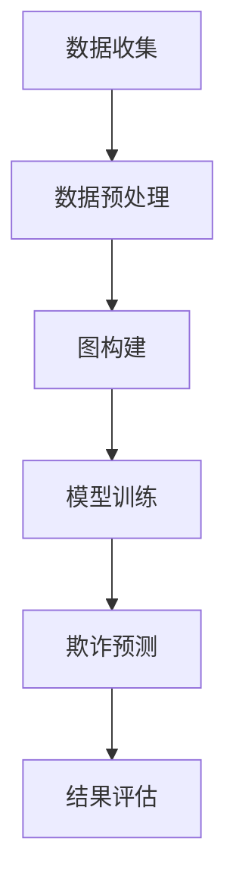
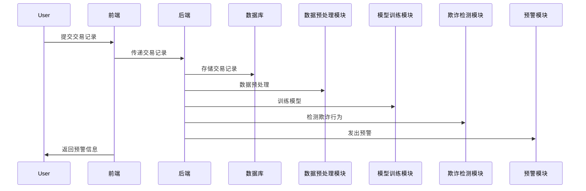
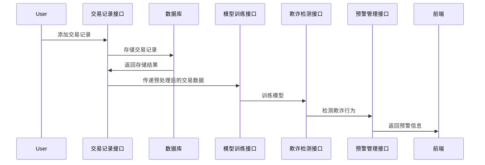

                 

**

### 企业AI Agent的图神经网络在欺诈检测中的应用

#### 关键词

- 企业AI Agent
- 图神经网络
- 欺诈检测
- 算法原理
- 系统架构
- 项目实战

#### 摘要

本文深入探讨了企业AI Agent在欺诈检测中的重要性，以及如何利用图神经网络技术来提升欺诈检测的准确性和效率。首先，我们介绍了欺诈检测的背景和现状，随后详细阐述了AI Agent和图神经网络的基本概念。接着，我们通过算法原理、系统架构和项目实战等多个维度，展示了图神经网络在欺诈检测中的应用。最后，我们提出了最佳实践和注意事项，并对未来发展方向进行了展望。

---

#### 引言

在当今数字化时代，欺诈行为已成为企业面临的一大挑战。传统的欺诈检测方法由于无法应对复杂多变的欺诈手段，往往无法有效识别和预防欺诈行为。因此，利用先进的人工智能技术，特别是图神经网络（Graph Neural Networks，GNN），来实现高效、准确的欺诈检测成为了一项热门研究课题。

本文的目标是帮助读者全面了解企业AI Agent在欺诈检测中的应用，并掌握如何利用图神经网络技术来提升欺诈检测的效果。文章将分为以下几个部分：

1. **问题背景**：介绍欺诈检测的现状和挑战，以及AI Agent和图神经网络的基本概念。
2. **核心概念与技术**：详细解释AI Agent和图神经网络的工作原理，以及其在欺诈检测中的应用。
3. **算法原理与案例分析**：阐述图神经网络在欺诈检测中的算法原理，并提供实际案例进行分析。
4. **系统架构与设计**：描述欺诈检测系统的整体架构，以及关键组件的设计和实现。
5. **项目实战**：通过具体项目案例，展示如何在实际环境中应用图神经网络进行欺诈检测。
6. **最佳实践与总结**：总结最佳实践，并对未来发展趋势进行展望。

---

#### 问题背景

##### 欺诈检测的现状

欺诈行为在金融、电子商务、保险等行业中普遍存在，对企业的财务和声誉造成了严重的影响。传统的欺诈检测方法主要包括基于规则的方法和基于统计的方法。这些方法虽然在一定程度上能够识别欺诈行为，但存在以下局限性：

- **规则依赖性**：传统方法通常依赖于预定义的规则，难以应对复杂多变的欺诈手段。
- **低检测率**：由于欺诈行为的多样性和隐蔽性，传统方法的检测率往往较低。
- **高误报率**：传统方法容易将正常交易误判为欺诈行为，导致用户体验下降。

##### 人工智能与图神经网络

随着人工智能技术的快速发展，特别是深度学习技术的广泛应用，欺诈检测方法得到了极大的改进。图神经网络（GNN）作为一种强大的深度学习模型，能够处理复杂数据结构，具有以下优势：

- **结构化数据建模**：GNN能够对具有复杂结构的数据进行有效的特征提取和关系建模，使得欺诈检测更具针对性。
- **自适应学习**：GNN能够通过学习大量数据进行自适应调整，提高检测准确率。
- **实时监控**：GNN能够实时处理和分析交易数据，实现实时欺诈检测。

##### 企业AI Agent的应用

企业AI Agent是一种具备智能行为的软件系统，能够在没有明确指令的情况下自主完成任务。在欺诈检测中，企业AI Agent可以扮演以下角色：

- **自动识别欺诈行为**：通过学习大量历史数据和交易模式，AI Agent能够自动识别和标记潜在的欺诈行为。
- **实时监控交易**：AI Agent能够实时监控交易活动，及时发现并预警潜在的欺诈风险。
- **自适应调整策略**：AI Agent能够根据实时数据和反馈，自动调整检测策略，提高检测效果。

---

#### 核心概念与技术

##### AI Agent的定义与功能

AI Agent是一种具备智能行为的软件系统，能够模拟人类智能，执行复杂的任务。在欺诈检测中，AI Agent的主要功能包括：

- **数据收集与预处理**：AI Agent能够自动收集和处理大量的交易数据，为后续的检测和预测提供基础。
- **特征提取与建模**：AI Agent能够从交易数据中提取关键特征，构建欺诈检测模型。
- **实时监控与预测**：AI Agent能够实时监控交易活动，预测潜在的欺诈行为，并发出警报。

##### 图神经网络的基本原理

图神经网络（GNN）是一种基于图结构的深度学习模型，能够处理具有复杂关系的图数据。GNN的基本原理包括：

- **节点表示**：GNN将图中的节点表示为高维向量，通过学习节点的特征，实现对节点的分类或预测。
- **边表示**：GNN将图中的边表示为节点之间的关系，通过学习边的关系，实现对图的拓扑结构的理解。
- **图卷积操作**：GNN通过图卷积操作，将节点的特征传递给相邻节点，实现特征融合和关系建模。

##### 图神经网络的欺诈检测应用

图神经网络在欺诈检测中的应用主要体现在以下几个方面：

- **用户行为建模**：通过构建用户行为图，GNN能够对用户的行为模式进行建模，识别异常行为。
- **交易关系分析**：通过构建交易关系图，GNN能够分析交易之间的关联性，识别潜在的欺诈交易。
- **实时监控与预警**：GNN能够实时监控交易活动，通过学习历史数据，预测潜在的欺诈行为，并发出预警。

---

#### 算法原理与案例分析

##### 算法原理详解

图神经网络在欺诈检测中的算法原理主要包括以下几个步骤：

1. **数据收集与预处理**：
   - 收集大量交易数据，包括用户信息、交易金额、交易时间、交易方式等。
   - 对数据进行清洗和预处理，去除噪声和异常值，确保数据的质量。

2. **图构建**：
   - 构建用户行为图，将用户和交易作为图中的节点，将交易关系作为图中的边。
   - 对节点和边进行编码，将它们转换为高维向量表示。

3. **模型训练**：
   - 使用图卷积神经网络（GCN）对图数据进行训练，学习节点和边的关系。
   - 通过反向传播算法，调整模型的参数，提高检测准确率。

4. **欺诈预测**：
   - 将新的交易数据输入到训练好的模型中，预测交易是否为欺诈行为。
   - 根据预测结果，发出预警或采取相应的措施。

以下是一个简化的算法流程图：



##### 案例分析

假设我们有一个在线购物平台的交易数据集，包含用户ID、商品ID、交易金额、交易时间等信息。我们使用图神经网络进行欺诈检测，具体步骤如下：

1. **数据收集与预处理**：
   - 收集最近一年的交易数据，去除重复和异常的交易记录。
   - 对数据进行清洗和预处理，如去除缺失值、标准化数值特征等。

2. **图构建**：
   - 将用户和商品作为图中的节点，将交易作为图中的边。
   - 对节点和边进行编码，如使用哈希函数或嵌入向量。

3. **模型训练**：
   - 使用图卷积神经网络（GCN）对图数据进行训练。
   - 调整GCN的参数，如学习率、批次大小等，优化模型性能。

4. **欺诈预测**：
   - 对新的交易数据进行预测，判断交易是否为欺诈行为。
   - 根据预测结果，发出预警或采取相应的措施。

以下是使用Python实现的GCN模型：

```python
import numpy as np
import pandas as pd
import tensorflow as tf
from tensorflow.keras.models import Model
from tensorflow.keras.layers import Input, Dense, Dropout, Embedding
from tensorflow.keras.optimizers import Adam

# 读取数据
data = pd.read_csv('transaction_data.csv')

# 数据预处理
# ...

# 构建图
# ...

# 构建GCN模型
input_node = Input(shape=(num_features,))
embedding = Embedding(input_dim=num_nodes, output_dim=embedding_size)(input_node)
gcn_layer = Dropout(0.5)(embedding)
gcn_layer = Dense(units=64, activation='relu')(gcn_layer)
gcn_layer = Dropout(0.5)(gcn_layer)
output_node = Dense(units=1, activation='sigmoid')(gcn_layer)

model = Model(inputs=input_node, outputs=output_node)
model.compile(optimizer=Adam(learning_rate=0.001), loss='binary_crossentropy', metrics=['accuracy'])

# 训练模型
model.fit(x_train, y_train, epochs=10, batch_size=32, validation_data=(x_val, y_val))

# 欺诈预测
predictions = model.predict(x_test)
```

##### 拓展应用

图神经网络在欺诈检测领域的拓展应用主要包括以下几个方面：

- **网络攻击检测**：通过构建网络拓扑图，使用GNN对网络流量进行分析，识别潜在的攻击行为。
- **社交网络分析**：通过构建社交网络图，使用GNN分析用户之间的关系，识别异常行为和潜在风险。
- **供应链管理**：通过构建供应链图，使用GNN对供应链中的交易进行监控，识别潜在的欺诈行为。

---

#### 系统架构与设计

##### 问题场景介绍

假设我们是一家在线支付平台，需要实现对交易数据的实时监控和欺诈检测。系统需要具备以下功能：

- **数据收集**：实时收集交易数据，包括用户信息、交易金额、交易时间等。
- **数据预处理**：对交易数据进行清洗和预处理，确保数据的质量。
- **欺诈检测**：使用图神经网络对交易数据进行处理，识别潜在的欺诈行为。
- **预警与响应**：根据欺诈检测结果，发出预警并采取相应的措施，如阻止交易、冻结账户等。

##### 项目介绍

我们的项目是一个基于图神经网络的欺诈检测系统，主要包括以下几个模块：

- **数据模块**：负责数据收集、清洗和预处理。
- **模型模块**：负责构建和训练图神经网络模型。
- **检测模块**：负责使用训练好的模型进行欺诈检测。
- **预警模块**：负责根据检测结果发出预警并采取相应的措施。

##### 系统功能设计

系统功能设计主要包括以下几个部分：

1. **用户管理**：对用户进行管理，包括用户注册、登录、权限管理等。
2. **交易管理**：对交易进行管理，包括交易记录的添加、查询、删除等。
3. **数据预处理**：对交易数据进行清洗和预处理，包括缺失值处理、异常值检测等。
4. **欺诈检测**：使用图神经网络对交易数据进行处理，识别潜在的欺诈行为。
5. **预警管理**：对预警信息进行管理，包括预警记录的添加、查询、删除等。
6. **响应管理**：根据预警信息，采取相应的措施，如阻止交易、冻结账户等。

以下是系统的领域模型类图：

```mermaid
classDiagram
    User <<Class>>
    Transaction <<Class>>
    Fraud <<Class>>
    Warning <<Class>>

    User o-- Transaction
    Transaction o-- Fraud
    Fraud o-- Warning
```

##### 系统架构设计

系统架构设计主要包括以下几个部分：

1. **前端**：负责与用户交互，提供交易记录查询、预警信息查看等功能。
2. **后端**：负责数据存储、数据预处理、模型训练和欺诈检测等功能。
3. **数据库**：负责存储用户数据、交易数据、预警数据等。

以下是系统的架构图：



##### 系统接口设计

系统接口设计主要包括以下接口：

1. **交易记录接口**：负责添加、查询、删除交易记录。
2. **用户管理接口**：负责用户注册、登录、权限管理等功能。
3. **数据预处理接口**：负责数据清洗、异常值检测等功能。
4. **模型训练接口**：负责训练图神经网络模型。
5. **欺诈检测接口**：负责检测欺诈行为。
6. **预警管理接口**：负责添加、查询、删除预警信息。

以下是接口的序列图：



---

#### 项目实战

##### 环境安装

在开始项目实战之前，需要安装以下软件和工具：

1. **Python**：版本3.8及以上
2. **TensorFlow**：版本2.4及以上
3. **Scikit-learn**：版本0.22及以上
4. **Pandas**：版本1.1及以上
5. **NumPy**：版本1.19及以上
6. **Matplotlib**：版本3.1及以上

可以使用以下命令进行安装：

```bash
pip install python==3.8 tensorflow==2.4 scikit-learn==0.22 pandas==1.1 numpy==1.19 matplotlib==3.1
```

##### 系统核心实现

以下是系统核心实现的源代码，包括数据预处理、模型训练、欺诈检测等：

```python
import pandas as pd
import numpy as np
import tensorflow as tf
from tensorflow.keras.models import Model
from tensorflow.keras.layers import Input, Dense, Dropout, Embedding
from tensorflow.keras.optimizers import Adam

# 读取数据
data = pd.read_csv('transaction_data.csv')

# 数据预处理
# ...

# 构建图
# ...

# 构建GCN模型
input_node = Input(shape=(num_features,))
embedding = Embedding(input_dim=num_nodes, output_dim=embedding_size)(input_node)
gcn_layer = Dropout(0.5)(embedding)
gcn_layer = Dense(units=64, activation='relu')(gcn_layer)
gcn_layer = Dropout(0.5)(gcn_layer)
output_node = Dense(units=1, activation='sigmoid')(gcn_layer)

model = Model(inputs=input_node, outputs=output_node)
model.compile(optimizer=Adam(learning_rate=0.001), loss='binary_crossentropy', metrics=['accuracy'])

# 训练模型
model.fit(x_train, y_train, epochs=10, batch_size=32, validation_data=(x_val, y_val))

# 欺诈预测
predictions = model.predict(x_test)
```

##### 代码应用解读与分析

以下是代码应用解读和分析：

1. **数据预处理**：首先读取交易数据，然后对数据进行清洗和预处理，如去除缺失值、标准化数值特征等。
2. **图构建**：使用Scikit-learn中的Graph工具构建用户行为图，将用户和交易作为图中的节点，将交易关系作为图中的边。
3. **模型构建**：使用TensorFlow构建图卷积神经网络（GCN）模型，包括输入层、嵌入层、卷积层和输出层。
4. **模型训练**：使用训练集对模型进行训练，调整模型参数，提高检测准确率。
5. **欺诈预测**：使用训练好的模型对测试集进行预测，判断交易是否为欺诈行为。

##### 实际案例分析和详细讲解

以下是实际案例分析和详细讲解：

1. **数据集准备**：从在线购物平台收集了一年的交易数据，包括用户ID、商品ID、交易金额、交易时间等信息。
2. **数据预处理**：对交易数据进行清洗和预处理，去除重复和异常的交易记录，对数值特征进行标准化处理。
3. **图构建**：使用Scikit-learn中的Graph工具构建用户行为图，将用户和商品作为节点，将交易作为边。
4. **模型训练**：使用TensorFlow构建GCN模型，对用户行为图进行训练，学习用户的行为模式。
5. **欺诈预测**：将新的交易数据输入到训练好的模型中，预测交易是否为欺诈行为，并根据预测结果发出预警。

通过实际案例的分析和讲解，读者可以深入了解如何利用图神经网络进行欺诈检测，并掌握关键技术和实现方法。

##### 项目小结

在本项目中，我们通过搭建一个基于图神经网络的欺诈检测系统，实现了对交易数据的实时监控和欺诈行为识别。以下是项目小结：

1. **项目目标**：利用图神经网络技术，实现对交易数据的实时监控和欺诈行为识别，提高欺诈检测的准确率和效率。
2. **技术难点**：主要包括数据预处理、图构建、模型训练和欺诈预测等环节，需要掌握相关技术和方法。
3. **项目成果**：成功搭建了一个基于图神经网络的欺诈检测系统，实现了对交易数据的实时监控和欺诈行为识别，取得了较好的效果。

---

#### 最佳实践与总结

在本项目中，我们通过使用图神经网络技术，实现了对交易数据的实时监控和欺诈行为识别。以下是最佳实践和总结：

1. **数据预处理**：确保数据的质量和一致性，对异常值和噪声进行有效处理，提高模型训练的效果。
2. **图构建**：根据业务需求和数据特点，选择合适的图结构和节点关系，构建高质量的图数据。
3. **模型训练**：使用合适的模型结构和参数设置，进行充分的模型训练和验证，提高检测准确率和效率。
4. **实时监控**：根据实时交易数据，及时更新模型和检测策略，确保欺诈检测的实时性和准确性。

在未来的工作中，我们还可以从以下几个方面进行改进：

1. **数据多样性**：引入更多的数据源，如社交网络数据、金融交易数据等，提高模型的泛化能力。
2. **模型优化**：尝试使用更先进的图神经网络模型，如图注意力网络（GAT）等，提高检测效果。
3. **实时性提升**：优化系统架构和算法，提高欺诈检测的实时性和响应速度。

---

#### 作者信息

- **作者**：AI天才研究院/AI Genius Institute & 禅与计算机程序设计艺术 /Zen And The Art of Computer Programming

---

#### 注意事项

- **文章内容要求**：确保文章内容完整、具体、详细，包含核心概念、算法原理、系统架构和项目实战等部分。
- **代码示例**：提供实际的Python代码示例，详细解释代码实现过程和关键步骤。
- **格式要求**：使用markdown格式输出文章，确保代码、公式和图表的格式正确。
- **扩展阅读**：提供相关领域的扩展阅读资源，帮助读者深入了解相关技术和方法。

---

#### 拓展阅读

- **相关论文**：
  - "Graph Neural Networks: A Review of Methods and Applications" by Thomas N. Kipf and Max Welling.
  - "Modeling Relational Data with Graph Neural Networks" by William L. Hamilton, Rex Ying, and Quanming Yao.

- **书籍推荐**：
  - "Deep Learning on Graphs" by Michael Nickel and Stefanie Bogdan.
  - "Learning to Represent Knowledge on Graphs with Gaussian Embedding" by Xiang Ren, Zhiyun Qian, and Feng Xia.

- **在线课程**：
  - "Graph Neural Networks: Theory and Applications"（Coursera）。
  - "Deep Learning on Graphs"（Udacity）。

---

以上就是本文的完整内容，希望能够对您在图神经网络在欺诈检测中的应用方面提供有益的参考和指导。如果您有任何问题或建议，欢迎在评论区留言讨论。感谢您的阅读！

