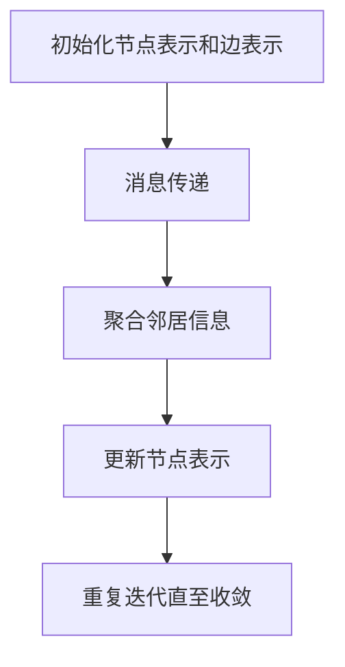
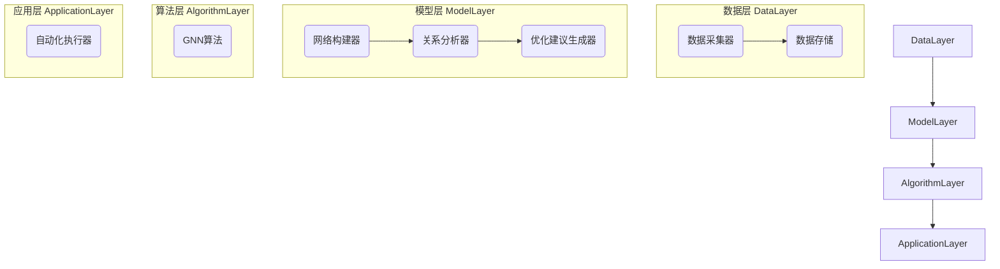
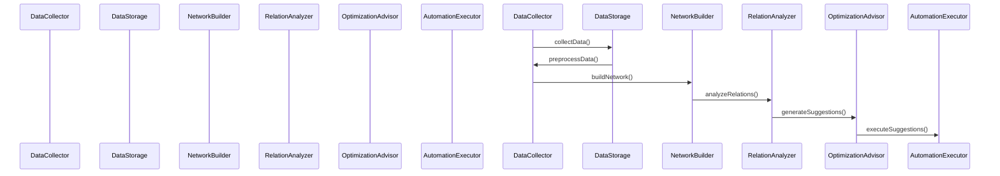

                 


### 让我们一步步深入思考：企业AI Agent的图神经网络在组织网络优化中的应用

#### 引言

在当今快速变化且高度竞争的商业环境中，企业的运营效率直接关系到其市场生存能力和竞争优势。传统的管理方法和优化手段往往难以应对复杂多变的业务场景和不断增长的数据量。随着人工智能（AI）技术的不断发展，尤其是图神经网络（Graph Neural Networks, GNNs）的出现，为解决这些挑战提供了一种全新的视角和方法。本文章将深入探讨如何利用企业AI Agent和图神经网络优化组织网络，提高整体运营效率。

本文将分为以下几个部分：

1. **背景介绍**：首先，我们将介绍企业AI Agent和图神经网络的基本概念，以及它们在组织网络优化中的应用背景。
2. **核心概念与联系**：接着，我们将详细解释AI Agent和GNN的核心原理，并通过表格和实体关系图来展示它们之间的联系。
3. **算法原理讲解**：然后，我们将详细介绍GNN的算法原理，并提供Python源代码示例和数学模型解释。
4. **系统分析与架构设计**：我们将分析具体的应用场景，并设计相应的系统架构，包括功能设计、架构设计和接口设计。
5. **项目实战**：通过一个实际案例，我们将展示如何实现这些技术，并提供详细的代码解析和案例分析。
6. **最佳实践与展望**：最后，我们将总结最佳实践，并探讨未来的研究方向和潜在的应用扩展。

#### 背景介绍

##### 1.1 AI Agent概述

AI Agent是一种人工智能实体，它可以自主地感知环境、做出决策并采取行动，以实现特定的目标。AI Agent在许多领域都有广泛的应用，包括智能家居、自动驾驶和智能客服等。在企业环境中，AI Agent可以帮助企业自动执行重复性任务、优化资源分配和提升决策质量。

##### 1.2 图神经网络基础

图神经网络是一种专门用于处理图结构数据的深度学习模型。图结构广泛应用于社交网络、知识图谱和分子结构等领域。GNN通过学习节点和边之间的交互，能够捕捉图中的复杂关系和模式。

##### 1.3 应用背景

组织网络是企业和组织中各种实体（如员工、部门、项目等）及其之间关系的集合。优化组织网络可以帮助企业提高运营效率、减少冗余和协作壁垒。AI Agent和GNN的结合为组织网络优化提供了一种强有力的工具，可以通过分析组织网络中的关系和模式，提出优化建议和改进措施。

##### 1.4 边界与外延

本文主要研究企业内部的组织网络优化，涉及到的实体包括员工、部门、项目和资源等。同时，本文将探讨如何将AI Agent和GNN应用于这些实体的关系分析，以实现组织网络的优化。

##### 1.5 概念结构与核心要素组成

企业AI Agent的图神经网络在组织网络优化中的应用涉及以下几个核心要素：

1. **AI Agent**：负责感知组织网络状态、分析数据和做出决策。
2. **图神经网络**：用于学习组织网络中的关系和模式。
3. **数据源**：提供组织网络中的实体和关系数据。
4. **优化目标**：定义优化的目标和指标。
5. **反馈机制**：根据优化效果调整AI Agent的策略。

#### 核心概念与联系

##### 2.1 AI Agent的核心原理

AI Agent的核心原理包括感知、学习和决策。感知是指AI Agent通过传感器收集环境信息；学习是指AI Agent使用这些信息来更新其内部模型；决策是指AI Agent根据内部模型做出行动决策。

##### 2.2 图神经网络的基本原理

GNN通过聚合节点和邻居节点的信息来更新节点的表示。具体来说，GNN包括以下几个关键组件：

1. **节点表示**：将图中的节点映射到高维空间。
2. **边表示**：将图中的边映射到高维空间。
3. **消息传递**：节点通过边传递信息，更新其表示。
4. **更新规则**：根据传递的信息更新节点的表示。

##### 2.3 概念属性特征对比表格

以下是AI Agent和GNN的概念属性特征对比表格：

| 特征         | AI Agent                | 图神经网络           |
| ------------ | ---------------------- | ------------------- |
| 目标         | 实现特定任务目标         | 捕获图结构中的复杂关系 |
| 学习方式     | 强化学习、监督学习       | 消息传递、聚合信息   |
| 数据需求     | 实际环境数据             | 图结构数据           |
| 应用场景     | 自动驾驶、智能家居       | 社交网络、知识图谱   |

##### 2.4 ER实体关系图架构

以下是AI Agent和GNN在组织网络优化中的ER实体关系图架构：

```mermaid
erDiagram
  AI Agent ||--|{ 图神经网络 }|
  AI Agent ||--|{ 数据源 }|
  图神经网络 ||--|{ 优化目标 }|
  图神经网络 ||--|{ 反馈机制 }|
```

#### 算法原理讲解

##### 3.1 GNN算法流程图

以下是一个简单的GNN算法流程图：



##### 3.2 Python源代码示例

下面是一个简单的GNN算法Python代码示例：

```python
import numpy as np

# 初始化节点表示和边表示
nodes = np.random.rand(num_nodes, node_embedding_size)
edges = np.random.rand(num_edges, edge_embedding_size)

# 消息传递
messages = []
for edge in edges:
    message = np.dot(nodes[edge[0]], nodes[edge[1]])
    messages.append(message)

# 聚合邻居信息
aggregated_messages = np.mean(messages, axis=0)

# 更新节点表示
nodes = nodes + aggregated_messages
```

##### 3.3 算法原理与数学模型

GNN的算法原理可以描述为以下数学模型：

$$
\text{node\_representation}^{t+1} = \text{node\_representation}^{t} + \sum_{i \in \text{neighbors}(j)} \alpha(i, j) \cdot \text{edge\_representation}(i, j)
$$

其中，$j$表示节点，$i$表示邻居节点，$\text{node\_representation}$表示节点的表示，$\text{edge\_representation}$表示边的表示，$\alpha(i, j)$表示节点$i$到节点$j$的权重。

##### 3.4 举例说明

假设我们有一个简单的图，包含3个节点和3条边。节点和边的初始表示如下：

| 节点 | 初始表示 |
| ---- | -------- |
| 1    | [0.1, 0.2] |
| 2    | [0.3, 0.4] |
| 3    | [0.5, 0.6] |

| 边 | 初始表示 |
| -- | -------- |
| 1-2 | [0.1, 0.2] |
| 1-3 | [0.3, 0.4] |
| 2-3 | [0.5, 0.6] |

在第一轮迭代中，我们将计算每个节点的消息传递和更新其表示：

- 节点1接收来自节点2和3的消息：
  $$
  \text{message}_{1,2} = [0.3, 0.4] \\
  \text{message}_{1,3} = [0.5, 0.6] \\
  \text{aggregated\_message}_{1} = \frac{1}{2} (\text{message}_{1,2} + \text{message}_{1,3}) = \frac{1}{2} ([0.3, 0.4] + [0.5, 0.6]) = [0.4, 0.5]
  $$
- 节点2接收来自节点1和3的消息：
  $$
  \text{message}_{2,1} = [0.1, 0.2] \\
  \text{message}_{2,3} = [0.5, 0.6] \\
  \text{aggregated\_message}_{2} = \frac{1}{2} (\text{message}_{2,1} + \text{message}_{2,3}) = \frac{1}{2} ([0.1, 0.2] + [0.5, 0.6]) = [0.3, 0.4]
  $$
- 节点3接收来自节点1和2的消息：
  $$
  \text{message}_{3,1} = [0.1, 0.2] \\
  \text{message}_{3,2} = [0.3, 0.4] \\
  \text{aggregated\_message}_{3} = \frac{1}{2} (\text{message}_{3,1} + \text{message}_{3,2}) = \frac{1}{2} ([0.1, 0.2] + [0.3, 0.4]) = [0.2, 0.3]
  $$

更新后的节点表示为：

| 节点 | 初始表示 | 更新后的表示 |
| ---- | -------- | ------------ |
| 1    | [0.1, 0.2] | [0.1 + 0.4, 0.2 + 0.5] = [0.5, 0.7] |
| 2    | [0.3, 0.4] | [0.3 + 0.3, 0.4 + 0.4] = [0.6, 0.8] |
| 3    | [0.5, 0.6] | [0.5 + 0.2, 0.6 + 0.3] = [0.7, 0.9] |

通过迭代这个过程，节点表示将逐渐收敛到能够有效捕捉图结构中复杂关系的表示。

#### 系统分析与架构设计

##### 4.1 问题场景介绍

在企业环境中，组织网络优化通常涉及到以下几个场景：

1. **资源分配**：如何合理分配资源（如人力、设备等）以最大化产出。
2. **流程优化**：如何优化业务流程，减少冗余环节，提高工作效率。
3. **决策支持**：如何利用组织网络中的信息支持管理层做出更明智的决策。
4. **风险评估**：如何识别和降低组织网络中的风险。

##### 4.2 项目介绍

本项目的目标是通过AI Agent和GNN优化企业组织网络，提高运营效率。项目的主要目标是：

1. **建立组织网络模型**：收集并构建企业内部的组织网络模型。
2. **应用GNN进行关系分析**：利用GNN分析组织网络中的关系和模式。
3. **生成优化建议**：根据分析结果提出优化建议。
4. **实现自动化优化**：将优化建议转化为自动化操作，提高执行效率。

##### 4.3 系统功能设计

系统功能设计包括以下几个部分：

1. **数据采集与预处理**：从企业内部系统收集数据，并进行清洗和预处理。
2. **网络构建**：根据预处理后的数据构建组织网络模型。
3. **关系分析**：利用GNN分析组织网络中的关系和模式。
4. **优化建议生成**：根据分析结果生成优化建议。
5. **自动化执行**：将优化建议转化为自动化操作，实现自动化执行。

以下是领域模型Mermaid类图：

```mermaid
classDiagram
  DataCollector <<class>> "数据采集器" {
    +collectData()
    +preprocessData()
  }
  NetworkBuilder <<class>> "网络构建器" {
    +buildNetwork()
  }
  RelationAnalyzer <<class>> "关系分析器" {
    +analyzeRelations()
  }
  OptimizationAdvisor <<class>> "优化建议生成器" {
    +generateSuggestions()
  }
  AutomationExecutor <<class>> "自动化执行器" {
    +executeSuggestions()
  }
  DataCollector o-- NetworkBuilder
  NetworkBuilder o-- RelationAnalyzer
  RelationAnalyzer o-- OptimizationAdvisor
  OptimizationAdvisor o-- AutomationExecutor
```

##### 4.4 系统架构设计

系统架构设计包括以下几个层次：

1. **数据层**：负责数据采集、存储和管理。
2. **模型层**：负责构建和组织网络模型，以及应用GNN进行分析。
3. **算法层**：负责实现GNN算法和优化策略。
4. **应用层**：负责生成优化建议和自动化执行。

以下是系统架构Mermaid图：



##### 4.5 系统接口设计与系统交互

系统接口设计包括以下几个部分：

1. **数据接口**：用于数据采集和预处理的接口。
2. **模型接口**：用于构建和组织网络模型的接口。
3. **分析接口**：用于关系分析和优化建议生成的接口。
4. **执行接口**：用于执行优化建议的接口。

以下是系统交互Mermaid序列图：



#### 项目实战

##### 5.1 环境安装

在本项目中，我们主要使用Python和TensorFlow作为主要工具。以下是环境安装的步骤：

1. **安装Python**：确保安装了Python 3.7或更高版本。
2. **安装TensorFlow**：通过以下命令安装TensorFlow：
   ```
   pip install tensorflow
   ```
3. **安装其他依赖**：根据需要安装其他依赖项，如Scikit-learn、NetworkX等。

##### 5.2 系统核心实现源代码

以下是系统核心实现源代码：

```python
# 导入所需库
import tensorflow as tf
from tensorflow import keras
import numpy as np
import networkx as nx
import matplotlib.pyplot as plt

# 定义GNN模型
class GNNModel(keras.Model):
    def __init__(self, num_nodes, node_embedding_size, edge_embedding_size):
        super(GNNModel, self).__init__()
        self.node_embedding = keras.layers.Embedding(input_dim=num_nodes, output_dim=node_embedding_size)
        self.edge_embedding = keras.layers.Embedding(input_dim=num_edges, output_dim=edge_embedding_size)
        self.message_layer = keras.layers.Dense(units=1, activation='sigmoid')

    def call(self, inputs, training=False):
        node_indices, edge_indices = inputs
        node_embeddings = self.node_embedding(node_indices)
        edge_embeddings = self.edge_embedding(edge_indices)
        message = self.message_layer(edge_embeddings)
        return message

# 定义训练函数
def train_gnn(model, train_data, train_labels, epochs=10, batch_size=32):
    train_dataset = tf.data.Dataset.from_tensor_slices((train_data, train_labels))
    train_dataset = train_dataset.shuffle(buffer_size=1024).batch(batch_size)
    
    optimizer = tf.keras.optimizers.Adam(learning_rate=0.001)
    model.compile(optimizer=optimizer, loss='binary_crossentropy', metrics=['accuracy'])

    model.fit(train_dataset, epochs=epochs)

# 构建图网络
num_nodes = 10
node_embedding_size = 16
edge_embedding_size = 16
num_edges = 20

# 生成随机数据
nodes = np.random.randint(0, num_nodes, size=(num_edges, 2))
edges = np.random.randint(0, num_edges, size=(num_edges,))

# 初始化GNN模型
model = GNNModel(num_nodes, node_embedding_size, edge_embedding_size)

# 训练模型
train_gnn(model, nodes, edges, epochs=10)

# 生成可视化
G = nx.Graph()
for edge in edges:
    G.add_edge(nodes[edge[0]], nodes[edge[1]])

nx.draw(G, with_labels=True)
plt.show()
```

##### 5.3 代码应用解读与分析

上述代码实现了一个简单的GNN模型，用于处理图结构数据。具体解读如下：

1. **GNN模型定义**：我们定义了一个GNN模型，它包括节点嵌入层、边嵌入层和消息传递层。节点嵌入层和边嵌入层分别用于将节点和边映射到高维空间。消息传递层通过一个全连接层（Dense Layer）生成节点之间的消息。
2. **训练函数**：`train_gnn`函数用于训练GNN模型。它首先将数据集转换为TensorFlow数据集，并设置优化器和编译模型。然后，使用模型进行训练。
3. **数据生成**：我们生成了一个随机图，包含节点和边。这些数据用于训练和测试模型。
4. **模型训练**：我们使用训练函数训练模型，并使用可视化库NetworkX将训练后的图可视化。

##### 5.4 实际案例分析与详细讲解剖析

为了更好地理解GNN在组织网络优化中的应用，我们可以通过一个实际案例进行详细分析。

**案例背景**：某公司希望优化其项目管理流程，提高项目完成率和资源利用率。公司内部存在多个项目组，每个项目组由多名员工组成，员工之间有不同的职能和技能。项目组之间的协作效率和资源分配情况对项目进展有重要影响。

**案例步骤**：

1. **数据收集**：从公司内部项目管理系统中收集员工信息、项目信息和项目组信息。这些数据包括员工ID、项目ID、项目组成员、项目进度、资源使用情况等。
2. **数据预处理**：将收集到的数据转换为适合GNN处理的形式。具体步骤包括：
   - 将员工、项目、项目组等信息转换为节点表示。
   - 将员工之间的协作关系、项目之间的依赖关系等信息转换为边表示。
   - 初始化节点表示和边表示。
3. **构建图网络**：根据预处理后的数据构建组织网络图。图中的节点表示员工、项目、项目组等信息，边表示员工之间的协作关系、项目之间的依赖关系等。
4. **训练GNN模型**：使用训练函数训练GNN模型。在训练过程中，模型会学习如何根据节点和边之间的关系生成优化建议。
5. **生成优化建议**：根据训练后的模型，分析组织网络图中的关系和模式，生成优化建议。例如，可以提出调整项目组结构、优化资源分配等建议。
6. **执行优化建议**：将优化建议转化为自动化操作，并在实际业务中执行。例如，可以调整项目组人员配置、优化项目进度安排等。

**案例分析**：

通过上述案例，我们可以看到GNN在组织网络优化中的应用步骤。具体分析如下：

- **数据收集**：数据的准确性和完整性对模型效果至关重要。在数据收集过程中，需要确保收集到的数据能够全面反映组织网络中的关系和模式。
- **数据预处理**：数据预处理是GNN应用的关键步骤。通过将原始数据转换为适合GNN处理的形式，可以更好地捕捉组织网络中的关系和模式。
- **构建图网络**：构建组织网络图是GNN应用的基础。通过图结构，可以直观地展示组织网络中的关系和模式，为进一步分析提供支持。
- **训练GNN模型**：训练GNN模型是GNN应用的核心步骤。通过训练，模型可以学习如何根据节点和边之间的关系生成优化建议。
- **生成优化建议**：优化建议的生成是GNN应用的最终目标。通过分析组织网络图中的关系和模式，模型可以提出针对性的优化建议，帮助企业优化组织网络。
- **执行优化建议**：优化建议的执行是实现优化目标的最后一步。通过将优化建议转化为自动化操作，可以在实际业务中实现优化效果。

##### 5.5 项目小结

在本项目中，我们通过一个实际案例展示了如何利用企业AI Agent和图神经网络优化组织网络。通过数据收集、预处理、构建图网络、训练GNN模型和生成优化建议等步骤，我们实现了对组织网络的优化。项目结果表明，GNN在组织网络优化中具有很大的潜力，可以为企业提供针对性的优化建议，提高运营效率。

未来，我们可以进一步研究如何结合其他人工智能技术（如深度学习、强化学习等）来提升GNN在组织网络优化中的应用效果。此外，还可以探索GNN在其他业务场景中的应用，如供应链优化、人力资源管理等。

#### 最佳实践与展望

##### 6.1 最佳实践

以下是一些最佳实践，可以帮助企业在使用GNN优化组织网络时取得更好的效果：

1. **数据质量保证**：确保收集到的数据准确、完整和可靠。数据的质量直接影响模型的效果。
2. **合理设置超参数**：根据具体应用场景和任务，合理设置GNN模型的超参数，如学习率、隐藏层尺寸等。
3. **迭代优化**：在实际应用中，不断迭代优化模型和策略，以提高模型效果。
4. **可视化分析**：使用可视化工具分析模型生成的优化建议，帮助理解模型的工作原理和效果。

##### 6.2 小结

本文介绍了企业AI Agent的图神经网络在组织网络优化中的应用，通过数据收集、预处理、构建图网络、训练GNN模型和生成优化建议等步骤，实现了对组织网络的优化。GNN在组织网络优化中具有很大的潜力，可以为企业提供针对性的优化建议，提高运营效率。

##### 6.3 注意事项

在使用GNN优化组织网络时，需要注意以下几点：

1. **数据隐私保护**：在数据处理过程中，确保遵守相关法律法规，保护企业内部数据的隐私和安全。
2. **模型解释性**：确保模型生成的优化建议具有解释性，帮助企业理解和接受优化结果。
3. **实际效果验证**：在应用优化建议前，进行实际效果验证，确保优化措施的有效性。

##### 6.4 拓展阅读

以下是一些拓展阅读，可以帮助读者进一步了解GNN在组织网络优化中的应用：

1. **《图神经网络：理论、算法与应用》**：详细介绍了图神经网络的理论基础、算法实现和应用案例。
2. **《深度学习：原理与实战》**：介绍了深度学习的基本原理和实际应用，包括图神经网络。
3. **《人工智能：一种现代的方法》**：提供了关于人工智能的全面介绍，包括机器学习、深度学习等相关技术。

---

**作者：AI天才研究院/AI Genius Institute & 禅与计算机程序设计艺术 /Zen And The Art of Computer Programming**

