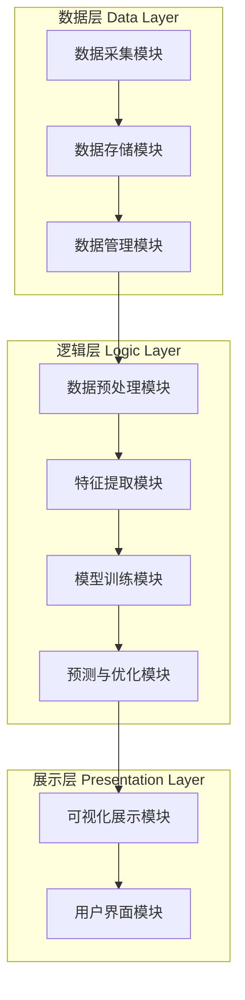
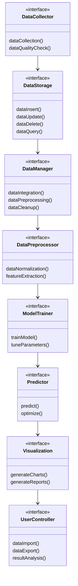
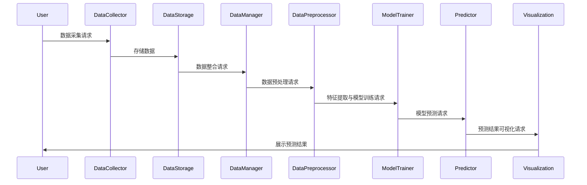

                 

### 第一部分：背景介绍

#### 1.1 问题的背景

在当今快速发展的数字化时代，企业面临着前所未有的复杂性和挑战。随着组织规模的扩大和业务复杂性的增加，如何有效地管理和分析组织内部的各种网络结构，以优化决策和提升效率，成为了企业亟需解决的问题。这不仅仅涉及传统的网络分析技术，更需要结合人工智能，特别是图神经网络等前沿技术来提升组织网络分析的深度和广度。

**1.1.1 人工智能与组织网络分析的关系**

人工智能（AI）作为现代信息技术的核心驱动力，正在深刻地改变着各行各业的运作方式。在组织网络分析中，人工智能的引入可以显著提高数据分析的效率和准确性。传统的数据分析方法往往依赖于统计和线性模型，难以处理复杂、非线性的组织网络结构。而人工智能，尤其是基于图神经网络的技术，能够更好地捕捉和利用组织内部的复杂关系，从而提供更为精准和深入的洞察。

**1.1.2 企业AI Agent的定义与重要性**

企业AI Agent，即企业人工智能代理，是一种专门为解决企业特定问题而设计的智能体。它可以通过学习和推理，在组织网络中自动执行任务，提供决策支持。在组织网络分析中，企业AI Agent的重要性不言而喻。它可以自动收集、分析和整合组织内部的各类数据，识别关键节点和路径，发现潜在的问题和机会，从而帮助企业做出更加科学和高效的决策。

**1.1.3 组织网络分析的需求与挑战**

随着企业规模的扩大和业务多元化的发展，组织内部的网络结构变得日益复杂。这种复杂性对传统的组织网络分析技术提出了巨大的挑战。传统的分析方法往往局限于简单的网络拓扑分析，难以深入挖掘组织网络的深层次结构和功能。此外，随着数据量的爆炸性增长，如何有效地管理和分析这些数据，成为了企业面临的另一大挑战。

**1.2 图神经网络的基本概念**

图神经网络（Graph Neural Network, GNN）是一种专门用于处理图结构数据的神经网络。与传统的神经网络不同，GNN能够直接处理图结构数据，包括节点和边。这使得GNN在处理复杂、非线性的组织网络结构时具有独特的优势。

**1.2.1 图神经网络的概念与历史**

图神经网络的概念最早可以追溯到1986年，当时Hinton和Salakhutdinov提出了自动编码器的概念，用于处理图像和序列数据。随着深度学习技术的不断发展，图神经网络也得到了广泛的研究和应用。近年来，随着大数据和人工智能技术的普及，图神经网络在各个领域，尤其是组织网络分析中，展现出了巨大的潜力。

**1.2.2 图神经网络的基本原理**

图神经网络的基本原理是通过节点的邻域信息进行特征融合和更新。在GNN中，每个节点都被看作是一个神经元，节点的特征通过其邻居节点的特征进行更新。这个过程可以通过图卷积操作来实现，从而使得节点特征能够逐步融合和更新，形成更为复杂的特征表示。

**1.2.3 图神经网络在组织网络分析中的应用潜力**

图神经网络在组织网络分析中具有广泛的应用潜力。首先，GNN能够有效地处理组织内部的复杂网络结构，包括员工关系网络、知识图谱和企业供应链网络等。通过GNN，企业可以更深入地挖掘组织内部的数据，发现潜在的关联和规律。此外，GNN还可以用于预测和优化，例如预测员工的流失率、优化企业的供应链网络等。

**1.3 企业AI Agent与图神经网络结合的必要性**

企业AI Agent与图神经网络的结合具有以下必要性：

**1.3.1 企业AI Agent的特点与挑战**

企业AI Agent具有自动化、智能化的特点，能够在没有人类干预的情况下执行复杂任务。然而，传统的AI Agent在处理复杂、非线性的组织网络结构时，存在一定的局限性。这主要是因为传统的AI Agent往往依赖于线性的模型和算法，难以有效地处理复杂的图结构数据。

**1.3.2 图神经网络如何解决企业AI Agent的挑战**

图神经网络能够通过直接处理图结构数据，解决企业AI Agent在处理复杂网络结构时的局限性。GNN能够有效地捕捉和利用组织内部的复杂关系，从而提供更为精准和深入的洞察。此外，GNN还可以通过学习，自动调整和优化AI Agent的行为，使其能够更好地适应和应对组织内部的复杂变化。

**1.3.3 结合案例探讨企业AI Agent与图神经网络的潜在应用**

结合案例，我们可以看到企业AI Agent与图神经网络结合的巨大潜力。例如，在企业知识管理中，企业AI Agent可以通过GNN构建企业知识图谱，自动识别和关联知识节点，从而提供更高效的知识搜索和推荐服务。在供应链优化中，企业AI Agent可以通过GNN分析供应链网络中的关键节点和路径，优化供应链的效率和成本。

**1.4 组织网络分析的核心概念与联系**

组织网络分析涉及多个核心概念和联系，以下是对这些概念和联系的基本介绍：

**1.4.1 组织网络的基本概念**

组织网络是指组织内部各种元素（如员工、部门、项目等）之间的相互关系。组织网络的构建和分析对于理解组织的运作机制和优化管理决策具有重要意义。

**1.4.2 组织网络的属性特征对比表格**

组织网络的属性特征包括节点数量、边的密度、路径长度等。通过对比不同属性特征，可以更好地理解组织网络的复杂性和结构特征。

**1.4.3 组织网络的ER实体关系图**

ER实体关系图是一种用于表示实体之间关系的图形化工具。在组织网络分析中，ER实体关系图可以用来表示员工、部门和项目等实体之间的关系，从而帮助我们更好地理解组织网络的拓扑结构。

**1.5 本章小结**

本章主要介绍了企业AI Agent与图神经网络在组织网络分析中的应用背景、基本概念和应用潜力。通过对这些背景知识的介绍，我们为后续章节的深入探讨奠定了基础。在接下来的章节中，我们将进一步详细讨论图神经网络的基本原理、企业AI Agent的算法原理以及它们在组织网络分析中的具体应用案例。

### 目录大纲

```markdown
----------------------------------------------------------------
# 企业AI Agent的图神经网络在组织网络分析中的应用

## 第一部分：背景介绍

## 1.1 问题的背景
### 1.1.1 人工智能与组织网络分析的关系
### 1.1.2 企业AI Agent的定义与重要性
### 1.1.3 组织网络分析的需求与挑战

## 1.2 图神经网络的基本概念
### 1.2.1 图神经网络的概念与历史
### 1.2.2 图神经网络的基本原理
### 1.2.3 图神经网络在组织网络分析中的应用潜力

## 1.3 企业AI Agent与图神经网络结合的必要性
### 1.3.1 企业AI Agent的特点与挑战
### 1.3.2 图神经网络如何解决企业AI Agent的挑战
### 1.3.3 结合案例探讨企业AI Agent与图神经网络的潜在应用

## 1.4 组织网络分析的核心概念与联系
### 1.4.1 组织网络的基本概念
### 1.4.2 组织网络的属性特征对比表格
### 1.4.3 组织网络的ER实体关系图

## 1.5 本章小结

----------------------------------------------------------------

## 第二部分：核心概念与联系

## 2.1 图神经网络原理讲解
### 2.1.1 图神经网络的基本组成
### 2.1.2 图神经网络的算法原理
### 2.1.3 图神经网络的工作流程

## 2.2 企业AI Agent的算法原理
### 2.2.1 企业AI Agent的定义与特点
### 2.2.2 企业AI Agent的算法原理
### 2.2.3 企业AI Agent与图神经网络的结合

## 2.3 图神经网络在组织网络分析中的应用案例
### 2.3.1 案例一：企业内部知识图谱构建
### 2.3.2 案例二：企业供应链网络优化
### 2.3.3 案例三：企业员工关系网络分析

## 2.4 图神经网络在组织网络分析中的优势与局限
### 2.4.1 图神经网络在组织网络分析中的优势
### 2.4.2 图神经网络在组织网络分析中的局限
### 2.4.3 面向未来：如何优化图神经网络在组织网络分析中的应用

## 2.5 本章小结

----------------------------------------------------------------

## 第三部分：系统分析与架构设计方案

## 3.1 问题场景介绍
### 3.1.1 企业组织网络分析的需求分析
### 3.1.2 现有系统的问题与不足
### 3.1.3 新系统需要实现的功能

## 3.2 系统架构设计
### 3.2.1 系统架构概述
### 3.2.2 系统架构的mermaid架构图

## 3.3 系统接口设计
### 3.3.1 系统接口的mermaid类图
### 3.3.2 系统接口的功能说明

## 3.4 系统交互设计
### 3.4.1 系统交互的mermaid序列图
### 3.4.2 系统交互流程详细说明

## 3.5 本章小结

----------------------------------------------------------------

## 第四部分：项目实战

## 4.1 环境安装
### 4.1.1 环境准备
### 4.1.2 工具与依赖安装
### 4.1.3 测试环境搭建

## 4.2 系统核心实现源代码
### 4.2.1 源代码架构设计
### 4.2.2 关键代码实现
### 4.2.3 代码应用解读与分析

## 4.3 实际案例分析与详细讲解
### 4.3.1 案例背景
### 4.3.2 案例实施步骤
### 4.3.3 案例结果分析
### 4.3.4 深入剖析

## 4.4 项目小结
### 4.4.1 项目成果总结
### 4.4.2 项目经验与启示
### 4.4.3 下一步工作计划

## 4.5 本章小结

----------------------------------------------------------------

## 第五部分：最佳实践与拓展

## 5.1 最佳实践
### 5.1.1 实践一：数据清洗与预处理
### 5.1.2 实践二：模型训练与优化
### 5.1.3 实践三：模型部署与监控

## 5.2 小结
### 5.2.1 主要内容回顾
#

----------------------------------------------------------------

### 1.1.1 人工智能与组织网络分析的关系

人工智能（AI）作为一种强大的技术工具，正在深刻地改变着组织运作的方式。组织网络分析（Organizational Network Analysis, ONA）是一种通过分析组织内部人际关系的结构、动态和行为来提高组织效率和决策质量的科学方法。人工智能与组织网络分析的结合，能够为组织带来以下几个显著的优势：

**1. 提升数据分析的深度与广度**

传统的组织网络分析通常依赖于手动收集和统计数据，这种方法不仅耗时耗力，而且容易受到人为因素的影响。人工智能技术，特别是机器学习和深度学习算法，可以自动化地处理和分析大量结构化和非结构化数据，从而显著提升数据分析的深度和广度。通过机器学习算法，可以识别出组织网络中的关键节点和路径，发现潜在的问题和机会。

**2. 提高预测和决策的准确性**

组织网络分析的一个重要目标是通过理解组织内部的复杂关系，预测员工的流动、团队的协作效果以及组织的整体绩效。人工智能技术可以帮助建立复杂的预测模型，通过历史数据的训练，提高预测的准确性。例如，通过分析员工的社交网络和沟通行为，可以预测哪些员工可能离职，哪些团队成员之间的合作最为有效。

**3. 优化组织结构和流程**

人工智能可以通过对组织网络的分析，提供有关组织内部结构和流程优化的重要洞见。通过识别组织网络中的瓶颈和冗余，人工智能可以帮助企业重新设计组织结构和业务流程，从而提高效率。例如，在人力资源管理中，通过分析员工网络，可以优化员工配置，提高团队协作效率。

**4. 改善沟通和协作**

有效的沟通和协作是组织成功的关键。人工智能可以通过分析组织网络中的沟通模式，识别沟通的障碍和不足，并提出改进建议。例如，通过分析员工的邮件通信和即时通讯记录，可以识别出哪些团队成员之间的沟通最为频繁，哪些沟通渠道最为有效，从而优化沟通策略。

**5. 促进知识管理和创新**

知识管理和创新是组织竞争力的核心。人工智能可以帮助企业构建知识图谱，通过分析组织网络中的知识流动，发现知识的潜在价值和应用场景。例如，通过分析员工的贡献和互动，可以识别出组织内部的专家和知识领域，从而促进知识的传播和利用。

**应用场景**

在实际应用中，人工智能与组织网络分析的结合有着广泛的应用场景。以下是一些具体的例子：

- **人力资源管理**：通过分析员工网络，预测员工流失率，优化员工配置，提高员工满意度。
- **项目管理**：通过分析项目团队的网络结构，优化项目管理和协作流程，提高项目成功率。
- **供应链管理**：通过分析供应链网络，优化供应链的效率和成本，提高供应链的韧性。
- **知识管理**：通过构建知识图谱，优化知识传播和应用，提高企业的创新能力。

总之，人工智能与组织网络分析的结合，不仅能够提高数据分析的深度和广度，还能够为组织提供精准的预测和决策支持，优化组织结构和流程，促进沟通和协作，最终提升组织的整体绩效和竞争力。

### 1.1.2 企业AI Agent的定义与重要性

企业AI Agent，即企业人工智能代理，是指一种专门为企业内部问题提供自动化解决方案的智能体。它利用人工智能技术，包括机器学习、自然语言处理和深度学习等，通过自主学习、推理和决策，执行特定的任务，为企业提供决策支持。

**1. 定义**

企业AI Agent具有以下几个关键特征：

- **自主学习能力**：企业AI Agent可以通过机器学习算法，从历史数据中学习和提取模式，不断优化其行为和决策。
- **自主决策能力**：企业AI Agent可以根据预设的目标和规则，自主做出决策，而不需要人工干预。
- **自动化执行**：企业AI Agent可以自动化地执行任务，减少人工操作，提高工作效率。
- **适应性**：企业AI Agent可以根据企业环境的变化，自适应地调整其行为和策略。

**2. 重要性**

在企业内部，企业AI Agent发挥着至关重要的作用，主要体现在以下几个方面：

- **提升决策效率**：企业AI Agent能够快速分析和处理大量数据，提供实时决策支持，帮助企业做出更科学、更高效的决策。
- **优化资源分配**：通过分析组织网络和数据，企业AI Agent可以帮助企业优化资源分配，提高资源利用效率，减少浪费。
- **改进运营流程**：企业AI Agent可以自动化地处理日常运营中的繁琐任务，优化业务流程，提高运营效率。
- **提高员工满意度**：通过智能化的工作辅助，企业AI Agent可以减轻员工的工作负担，提高员工的工作满意度和幸福感。
- **增强创新能力**：企业AI Agent可以通过对数据的深度分析和挖掘，发现新的业务机会，推动企业创新和发展。

**3. 在组织网络分析中的应用**

在组织网络分析中，企业AI Agent具有以下几个重要应用：

- **识别关键节点和路径**：企业AI Agent可以通过对组织网络的深度分析，识别出组织中的关键节点和路径，帮助企业制定更有效的管理策略。
- **预测员工流动**：通过分析员工的社交网络和行为数据，企业AI Agent可以预测员工的流失风险，提前采取干预措施，减少员工流失。
- **优化知识传播**：企业AI Agent可以帮助构建企业知识图谱，优化知识的传播和共享，提高企业的知识管理水平。
- **提升沟通效率**：通过分析组织内部的沟通网络，企业AI Agent可以识别出沟通的障碍和瓶颈，提出改进建议，优化沟通渠道。

**4. 挑战**

尽管企业AI Agent在组织网络分析中具有巨大潜力，但其应用也面临一些挑战：

- **数据质量和隐私**：企业AI Agent的性能高度依赖于数据的质量和准确性。同时，数据隐私保护也是企业需要关注的重要问题。
- **模型解释性**：深度学习模型通常具有高解释性，而企业AI Agent使用的机器学习模型往往较为复杂，难以解释其决策过程，这可能会影响用户对其信任。
- **技术依赖**：企业AI Agent的开发和应用需要高度的技术支持，对企业IT团队的专业能力提出了较高的要求。

**5. 结论**

总之，企业AI Agent作为一种新兴的人工智能技术，正在逐渐改变企业的运营和管理方式。在组织网络分析中，企业AI Agent具有巨大的应用潜力，能够显著提高数据分析的效率和准确性，优化组织结构和流程，推动企业创新和发展。然而，其应用也面临一些挑战，需要企业和技术团队共同努力，克服这些挑战，充分发挥其潜力。

### 1.1.3 组织网络分析的需求与挑战

随着企业规模的不断扩大和业务复杂性的增加，组织内部的网络结构变得越来越复杂。这种复杂性对传统的组织网络分析技术提出了巨大的挑战。为了更好地管理和优化企业内部的各类网络，组织网络分析（ONA）成为了不可或缺的工具。以下是组织网络分析的需求与面临的挑战：

**1. 需求**

- **提升决策效率**：随着企业业务的发展，管理层需要快速获取有关组织内部关系的准确信息，以便做出更科学的决策。组织网络分析可以帮助企业识别关键节点和路径，优化资源分配，提升决策效率。
- **优化人力资源配置**：通过分析组织网络，企业可以识别出员工之间的协作关系，优化人力资源配置，提高员工的工作满意度和团队绩效。
- **改进沟通协作**：组织内部的沟通协作是影响企业效率的重要因素。通过分析组织网络，可以识别出沟通的障碍和瓶颈，优化沟通渠道，提高信息传递的效率和准确性。
- **支持企业变革**：企业变革过程中，了解组织网络的变化和影响至关重要。组织网络分析可以帮助企业评估变革的影响，制定有效的变革策略。
- **增强企业竞争力**：通过优化组织结构和流程，提高组织的整体效率，企业可以更好地应对市场变化，增强竞争力。

**2. 挑战**

- **数据复杂性**：组织网络包含大量的节点和边，这些节点和边之间的关系错综复杂。传统的数据处理方法难以有效地处理这种复杂的数据结构。
- **数据质量**：组织网络分析依赖于高质量的数据。然而，数据质量往往受到数据源多样性、数据更新不及时、数据缺失和错误等因素的影响。
- **技术挑战**：组织网络分析需要运用多种技术，包括图数据库、机器学习和自然语言处理等。这些技术的融合和应用需要高度的专业技术支持。
- **隐私保护**：在分析组织网络时，涉及员工的个人隐私信息。如何在保障隐私的前提下进行数据分析和应用，是企业和技术团队需要关注的重要问题。
- **模型解释性**：深度学习模型在组织网络分析中具有广泛的应用。然而，这些模型的黑箱性质使得其决策过程难以解释，这可能会影响管理层对其信任。

**3. 解决方案**

- **改进数据质量**：企业需要建立完善的数据管理机制，确保数据的准确性、完整性和及时性。此外，可以采用数据清洗和预处理技术，提高数据质量。
- **运用先进技术**：企业可以引入先进的图数据库和机器学习算法，提高组织网络分析的技术水平。例如，使用图数据库来存储和处理复杂的图结构数据，使用机器学习算法来分析网络中的节点和关系。
- **增强模型解释性**：通过开发可解释的机器学习模型，可以提高管理层对AI决策的信任。例如，可以使用注意力机制和可解释性框架来增强模型的可解释性。
- **保障隐私保护**：在分析组织网络时，企业需要遵循数据保护法规，采取数据加密、匿名化和差分隐私等技术，保障员工的隐私。

**4. 结论**

组织网络分析在当前企业环境中具有显著的需求，但同时也面临诸多挑战。通过改进数据质量、运用先进技术、增强模型解释性和保障隐私保护，企业可以更好地利用组织网络分析，提升管理决策的效率和准确性，优化组织结构和流程，从而增强企业的竞争力。

### 1.2 图神经网络的基本概念

图神经网络（Graph Neural Network, GNN）是一种专门用于处理图结构数据的神经网络，能够有效地捕捉和利用图中的复杂结构和信息。GNN在组织网络分析中具有广泛的应用潜力，能够帮助企业更好地理解和优化组织内部的关系结构。

#### 1.2.1 图神经网络的概念与历史

图神经网络的概念最早可以追溯到1986年，当时Hinton和Salakhutdinov提出了自动编码器的概念，用于处理图像和序列数据。然而，真正将这一概念应用于图数据的却是2014年由Gilmer等人提出的图卷积网络（Graph Convolutional Network, GCN）。此后，GNN及其变种，如图注意力网络（Graph Attention Network, GAT）和图自编码器（Graph Autoencoder, GAE）等，得到了广泛的研究和应用。

#### 1.2.2 图神经网络的基本原理

图神经网络的核心思想是通过节点的邻域信息进行特征融合和更新。具体来说，GNN通过图卷积操作来处理图数据，其中每个节点的特征会与其邻居节点的特征进行融合，形成新的特征表示。

1. **图卷积操作**：图卷积操作是一种聚合操作，用于更新节点特征。它通过对每个节点的邻域节点的特征进行加权平均，将邻域信息整合到当前节点的特征中。数学上，图卷积操作可以表示为：

   $$ 
   h_v^{(t+1)} = \sigma(\sum_{u \in \mathcal{N}(v)} W^{(t)} h_u^{(t) })
   $$

   其中，$h_v^{(t)}$ 表示时间步 $t$ 时节点 $v$ 的特征，$\mathcal{N}(v)$ 表示节点 $v$ 的邻域节点集合，$W^{(t)}$ 是图卷积权重矩阵，$\sigma$ 是非线性激活函数。

2. **邻域定义**：在GNN中，邻域是指与某个节点直接相连的其他节点。邻域的大小和形状可以灵活定义，以适应不同的图结构。

3. **多层结构**：GNN可以通过堆叠多层图卷积层，逐步融合更复杂的邻域信息。每层图卷积操作都会将低层次的节点特征融合到更高层次的节点特征中，形成更为复杂的特征表示。

#### 1.2.3 图神经网络的工作流程

图神经网络的工作流程主要包括以下几个步骤：

1. **初始化节点特征**：在训练开始时，为每个节点分配一个初始特征向量。

2. **图卷积操作**：通过图卷积操作，将节点的特征与其邻域节点的特征进行融合，更新节点的特征表示。

3. **聚合和融合**：在每个时间步，节点特征会通过聚合操作（如平均或求和）融合到更高层次的节点特征中。

4. **非线性激活**：通过非线性激活函数（如ReLU或Sigmoid），引入非线性变换，增强模型的表示能力。

5. **输出层**：在最后一层图卷积操作后，将节点的特征映射到输出层，用于分类、回归或其他任务。

#### 1.2.4 图神经网络在组织网络分析中的应用潜力

图神经网络在组织网络分析中具有巨大的应用潜力，主要表现在以下几个方面：

1. **复杂网络结构处理**：组织网络通常具有复杂的结构，包含大量的节点和边。GNN能够直接处理这种复杂的图结构数据，有效地捕捉和利用组织内部的关系信息。

2. **节点特征融合**：GNN通过图卷积操作，能够将节点的特征与其邻域节点的特征进行融合，形成更复杂的特征表示。这对于理解组织内部的复杂关系和发现潜在的问题具有重要意义。

3. **预测和优化**：通过训练GNN模型，可以实现对组织网络中节点行为的预测和优化。例如，预测员工的流失率、优化供应链网络、优化知识传播路径等。

4. **可视化分析**：GNN可以用于生成组织网络的低维嵌入，实现网络的可视化分析。这有助于管理层直观地理解组织网络的结构和特征。

5. **实时更新**：GNN能够实时更新节点的特征和关系，以适应组织内部的变化。这使得GNN在动态分析和管理组织网络方面具有独特的优势。

**总结**

图神经网络作为一种先进的人工智能技术，具有强大的数据处理和分析能力。在组织网络分析中，GNN能够有效地处理复杂的网络结构，融合节点特征，实现预测和优化，提供可视化的分析工具，从而帮助企业更好地理解和优化组织内部的关系。通过深入研究和应用图神经网络，企业可以提升管理决策的效率，优化资源分配，提高组织的整体绩效。

### 1.3 企业AI Agent与图神经网络结合的必要性

企业AI Agent与图神经网络（GNN）的结合具有显著的必要性，这主要体现在以下几个方面：

**1.3.1 企业AI Agent的特点与挑战**

企业AI Agent是一种基于人工智能技术的自动化解决方案，具有以下几个关键特点：

- **自主学习与自适应能力**：企业AI Agent可以通过机器学习和深度学习算法，从大量历史数据中学习和提取模式，不断优化其行为和决策，从而实现自我进化。
- **高效的数据处理能力**：AI Agent能够自动化地处理和分析海量数据，迅速提取有价值的信息，为企业提供实时的决策支持。
- **自动执行任务**：企业AI Agent可以在无需人工干预的情况下执行复杂任务，提高工作效率，降低人力成本。

尽管企业AI Agent具有上述优势，但在处理复杂、非线性的图结构数据时，也面临一些挑战：

- **数据复杂性**：企业内部网络通常包含大量的节点和边，这些节点和边之间的关系错综复杂，传统的AI方法难以有效处理。
- **模型解释性**：复杂的深度学习模型通常具有高解释性，而企业AI Agent使用的机器学习模型往往较为复杂，难以解释其决策过程，这可能会影响用户对其信任。
- **计算资源需求**：处理复杂的图结构数据需要大量的计算资源，对企业的硬件和软件设施提出了较高的要求。

**1.3.2 图神经网络如何解决企业AI Agent的挑战**

图神经网络（GNN）在处理图结构数据方面具有独特的优势，能够有效地解决企业AI Agent面临的上述挑战：

- **直接处理图结构数据**：GNN能够直接处理图结构数据，包括节点和边。这使得GNN能够更好地捕捉和利用组织内部的复杂关系，从而提供更精准的决策支持。
- **高解释性**：通过设计可解释的GNN模型，可以提高AI Agent决策过程的透明度，增强用户对模型的信任。例如，可以使用注意力机制来解释模型如何分配权重，从而理解决策背后的原因。
- **计算效率**：GNN通过图卷积操作，能够高效地处理图数据，减少计算资源的消耗。此外，随着硬件性能的提升和优化算法的发展，GNN的计算效率也在不断提高。

**1.3.3 结合案例探讨企业AI Agent与图神经网络的潜在应用**

结合实际案例，我们可以看到企业AI Agent与图神经网络结合的巨大潜力：

- **案例一：企业内部知识图谱构建**  
在企业知识管理中，企业AI Agent可以通过GNN构建企业知识图谱，自动识别和关联知识节点。例如，通过分析员工的贡献、项目参与情况和知识共享行为，可以构建一个详细的内部知识图谱。GNN可以帮助AI Agent自动识别出知识领域的专家和关键知识点，优化知识传播路径，提高知识管理水平。

- **案例二：企业供应链网络优化**  
在供应链管理中，企业AI Agent可以通过GNN分析供应链网络中的关键节点和路径。例如，通过分析供应商、分销商和物流网络，可以识别出供应链中的瓶颈和冗余。GNN可以帮助AI Agent预测供应链的延迟和风险，并提出优化建议，从而提高供应链的效率和韧性。

- **案例三：企业员工关系网络分析**  
在企业人力资源管理中，企业AI Agent可以通过GNN分析员工关系网络，识别关键员工和团队协作模式。例如，通过分析员工的电子邮件、即时通讯记录和项目参与情况，可以构建一个详细的员工关系图谱。GNN可以帮助AI Agent预测员工的流失风险，优化团队配置，提高员工满意度和工作效率。

**总结**

企业AI Agent与图神经网络的结合具有显著的必要性，能够有效地解决AI Agent在处理复杂、非线性的图结构数据时面临的挑战。通过结合GNN的强大数据处理能力和高解释性，企业AI Agent可以更好地捕捉和利用组织内部的复杂关系，从而提供更精准、更有效的决策支持。结合实际案例，我们可以看到这种结合在知识管理、供应链优化和人力资源管理等领域具有巨大的应用潜力。

### 1.4 组织网络分析的核心概念与联系

组织网络分析（ONA）是一种通过分析组织内部的人际关系和网络结构来优化决策和提升效率的方法。为了更好地理解和应用组织网络分析，我们需要掌握以下几个核心概念及其相互联系：

#### 1.4.1 组织网络的基本概念

组织网络是指组织内部各种元素（如员工、部门、项目等）之间的相互关系。这些元素可以通过节点和边来表示，其中节点代表组织中的个体或实体，边表示它们之间的关系。组织网络的构建和分析可以帮助我们理解组织的运作机制，优化资源分配，提高沟通效率和决策质量。

**节点（Node）**：组织网络中的节点代表组织中的个体或实体，如员工、部门、项目等。每个节点都有自己的属性和特征，例如职位、角色、工作职责等。

**边（Edge）**：组织网络中的边表示节点之间的关系，如协作、沟通、依赖等。边的权重可以表示关系的强度或频率，例如电子邮件交换频率、共同参与项目次数等。

#### 1.4.2 组织网络的属性特征对比表格

在组织网络分析中，了解不同节点的属性特征是非常重要的。以下是一个简单的组织网络属性特征对比表格，展示了节点的一些基本属性特征：

| 属性特征         | 描述                                                         | 示例                |
|------------------|--------------------------------------------------------------|---------------------|
| 节点类型         | 节点的分类，如员工、部门、项目等                             | 员工、部门、项目    |
| 职位             | 节点在组织中的角色和职责                                     | 项目经理、工程师    |
| 工作年限         | 节点在组织中的工作经验长度                                   | 5年、10年          |
| 沟通频率         | 节点之间的交互频率                                           | 每天一次、每周一次  |
| 协作强度         | 节点之间的协作强度，如共同完成项目的数量                       | 1项、3项           |
| 知识贡献         | 节点在组织中的知识贡献程度                                   | 高、中、低          |

通过对比不同节点的属性特征，我们可以更好地理解组织网络的结构和功能，从而进行更有效的管理和优化。

#### 1.4.3 组织网络的ER实体关系图

实体关系图（Entity-Relationship Diagram, ER图）是一种用于表示实体之间关系的图形化工具。在组织网络分析中，ER图可以用来表示员工、部门和项目等实体之间的关系，帮助我们更清晰地理解组织网络的拓扑结构。

**实体（Entity）**：实体是组织网络中的基本元素，如员工、部门、项目等。

**关系（Relationship）**：关系表示实体之间的关联，如员工属于某个部门，项目由员工负责等。

以下是一个简化的组织网络ER图示例：

```mermaid
erDiagram
    Employee ||--|{ Department }|--| Project
    Employee ||--|{ Role }|--| Skill
    Department ||--|{ Manager }|--| Employee
    Project ||--|{ TeamMember }|--| Employee
    Role ||--|{ Skill }|--| Skill
```

在这个ER图中，员工（Employee）属于某个部门（Department），同时可以参与多个项目（Project）。员工还可以担任不同的角色（Role），并拥有特定的技能（Skill）。通过ER图，我们可以清晰地看到各个实体之间的关联关系，从而更好地理解组织网络的复杂结构。

**总结**

组织网络分析涉及多个核心概念和联系，包括节点、边、属性特征对比表格和ER实体关系图。通过理解这些概念和联系，我们可以更深入地分析组织网络，识别关键节点和路径，优化资源分配，提高沟通效率和决策质量。在接下来的章节中，我们将进一步探讨图神经网络的基本原理和算法，以及它们在组织网络分析中的应用。

### 1.5 本章小结

本章主要介绍了企业AI Agent与图神经网络在组织网络分析中的应用背景、基本概念和应用潜力。通过分析人工智能与组织网络分析的关系，我们认识到AI技术能够显著提升数据分析的深度和广度，优化决策流程，提高组织效率。企业AI Agent作为一种智能化的自动化解决方案，具有自主学习、自主决策和高效执行任务的特点，能够为组织网络分析提供强有力的支持。而图神经网络作为一种专门处理图结构数据的先进技术，能够有效解决企业AI Agent在处理复杂网络结构时面临的挑战。通过结合企业AI Agent与图神经网络，我们可以构建更精准、更有效的组织网络分析模型，为企业的决策和管理提供有力支持。在接下来的章节中，我们将进一步深入探讨图神经网络的基本原理、算法和应用，为实际项目实施奠定坚实基础。

---

### 第二部分：核心概念与联系

#### 2.1 图神经网络原理讲解

图神经网络（Graph Neural Network, GNN）作为一种专门处理图结构数据的神经网络，在组织网络分析中具有广泛的应用。本节将详细讲解图神经网络的基本组成、算法原理和工作流程。

#### 2.1.1 图神经网络的基本组成

图神经网络由以下几个关键部分组成：

1. **输入层**：输入层接收图数据，包括节点特征和边特征。节点特征通常描述节点的属性，如名称、职位等；边特征描述节点之间的关系，如交互频率、合作强度等。

2. **图卷积层**：图卷积层是GNN的核心部分，负责处理图数据。通过图卷积操作，节点的特征会与其邻域节点的特征进行融合，从而更新节点的特征表示。图卷积操作可以看作是一种特殊的卷积操作，用于处理图结构数据。

3. **池化层**：池化层用于对图卷积层的结果进行聚合和降维。通过池化层，我们可以从局部特征中提取全局特征，从而提高模型的泛化能力。

4. **输出层**：输出层将处理后的特征映射到具体的任务输出，如分类、回归等。

#### 2.1.2 图神经网络的算法原理

图神经网络的工作原理主要基于图卷积操作和消息传递机制。以下是图神经网络的基本算法原理：

1. **初始化节点特征**：在训练开始时，为每个节点分配一个初始特征向量。这些特征向量可以基于节点的属性信息进行初始化。

2. **图卷积操作**：在每个时间步，每个节点的特征会与其邻域节点的特征进行融合。具体来说，通过图卷积操作，节点的特征会与其邻域节点的特征进行加权平均。这个操作可以表示为：

   $$
   h_v^{(t+1)} = \sigma(\sum_{u \in \mathcal{N}(v)} W^{(t)} h_u^{(t)})
   $$

   其中，$h_v^{(t)}$ 表示时间步 $t$ 时节点 $v$ 的特征，$\mathcal{N}(v)$ 表示节点 $v$ 的邻域节点集合，$W^{(t)}$ 是图卷积权重矩阵，$\sigma$ 是非线性激活函数。

3. **消息传递**：在图卷积操作中，每个节点会接收其邻域节点的特征信息，并通过非线性变换更新自身的特征。这个过程可以看作是一种消息传递机制，节点通过聚合邻域节点的特征来更新自身的状态。

4. **多层结构**：通过堆叠多个图卷积层，GNN可以逐步融合更复杂的邻域信息，形成更为复杂的特征表示。每层图卷积操作都会将低层次的节点特征融合到更高层次的节点特征中。

5. **输出层**：在最后一层图卷积操作后，将节点的特征映射到输出层，用于分类、回归或其他任务。输出层的模型结构取决于具体的任务需求。

#### 2.1.3 图神经网络的工作流程

图神经网络的工作流程可以分为以下几个步骤：

1. **数据预处理**：将原始的图数据转换为适合模型训练的形式。这通常包括节点特征提取、边特征定义和图结构预处理等步骤。

2. **初始化模型参数**：为图神经网络初始化模型参数，包括图卷积层的权重矩阵和激活函数等。这些参数将在训练过程中通过梯度下降等优化算法进行调整。

3. **图卷积操作**：在每个时间步，对节点特征进行图卷积操作，将节点的特征与其邻域节点的特征进行融合，更新节点的特征表示。

4. **聚合和融合**：在每层图卷积操作后，通过聚合操作（如平均或求和）将低层次的节点特征融合到更高层次的节点特征中。

5. **非线性激活**：通过非线性激活函数（如ReLU或Sigmoid），引入非线性变换，增强模型的表示能力。

6. **输出层计算**：在最后一层图卷积操作后，将节点的特征映射到输出层，进行分类、回归或其他任务。输出层的模型结构取决于具体的任务需求。

7. **模型训练与优化**：通过训练数据集，使用梯度下降等优化算法更新模型参数，优化模型性能。训练过程中，可以使用交叉熵、均方误差等损失函数来评估模型的性能。

8. **模型部署与预测**：在模型训练完成后，将其部署到生产环境中，用于实际任务预测。通过输入新的图数据，模型可以输出预测结果，如节点分类、关系预测等。

**总结**

图神经网络作为一种先进的人工智能技术，具有强大的数据处理和分析能力。通过理解图神经网络的基本组成、算法原理和工作流程，我们可以更好地应用这一技术于组织网络分析，为企业的决策和管理提供有力支持。在下一节中，我们将探讨企业AI Agent的算法原理及其与图神经网络的结合。

### 2.2 企业AI Agent的算法原理

企业AI Agent是一种专门为解决企业特定问题而设计的智能体，其核心在于通过学习和推理来自动化地执行复杂任务，提供决策支持。为了实现这一目标，企业AI Agent需要依赖一系列的算法和技术。以下将详细介绍企业AI Agent的基本原理、工作流程以及与图神经网络的结合方式。

#### 2.2.1 企业AI Agent的定义与特点

企业AI Agent，即企业人工智能代理，是一种具备以下特点的智能体：

1. **自主学习与适应能力**：企业AI Agent能够从历史数据和实时数据中学习和提取模式，不断优化其行为和决策，以适应企业环境的变化。

2. **自动化执行**：企业AI Agent可以在没有人类干预的情况下，自动化地执行各种任务，如数据分析、资源分配、问题诊断等。

3. **决策支持**：企业AI Agent能够提供基于数据和算法的决策支持，帮助企业做出更加科学和高效的决策。

4. **高效处理能力**：企业AI Agent能够快速处理和分析大量数据，提供实时反馈和预测。

#### 2.2.2 企业AI Agent的算法原理

企业AI Agent的算法原理主要基于以下几个关键技术和步骤：

1. **数据收集与预处理**：企业AI Agent首先需要收集企业内部的各种数据，如财务数据、员工数据、业务流程数据等。在收集数据后，需要进行预处理，包括数据清洗、数据转换和数据归一化等，以确保数据的准确性和一致性。

2. **特征提取与选择**：通过分析数据，提取对问题解决最有帮助的特征。特征提取的方法包括统计特征、文本特征、图特征等。特征选择则通过评估特征的重要性和相关性，选择最有效的特征。

3. **模型训练与优化**：企业AI Agent使用机器学习算法对数据集进行训练，构建预测模型。常见的机器学习算法包括线性回归、决策树、支持向量机、神经网络等。在训练过程中，通过调整模型参数和优化算法，提高模型的预测准确性和泛化能力。

4. **推理与决策**：在模型训练完成后，企业AI Agent会利用训练得到的模型进行推理和决策。根据输入的数据和模型，AI Agent可以预测未来的趋势、识别潜在问题、提供优化建议等。

5. **反馈与学习**：企业AI Agent在执行任务后，会收集反馈数据，并根据这些反馈对模型进行进一步优化。这种闭环学习机制使得AI Agent能够不断适应环境变化，提高任务执行效率。

#### 2.2.3 企业AI Agent与图神经网络的结合

企业AI Agent与图神经网络的结合，可以充分发挥两者在数据处理和决策支持方面的优势。以下是结合的几个关键步骤：

1. **图数据构建**：企业AI Agent首先需要构建组织内部的图数据。图数据包括节点（如员工、项目、部门等）和边（如合作关系、依赖关系等）。这些图数据反映了组织内部的复杂网络结构。

2. **图特征提取**：通过图神经网络，可以提取节点和边的特征。图特征提取方法包括图卷积层、图注意力机制等。这些特征能够更好地捕捉组织内部的复杂关系。

3. **模型训练**：使用图神经网络对构建的图数据集进行训练。通过训练，模型可以学习到组织网络中的潜在模式和规律，提高预测和决策的准确性。

4. **推理与决策**：在模型训练完成后，企业AI Agent可以利用图神经网络进行推理和决策。根据输入的图数据，AI Agent可以识别关键节点、预测节点行为、优化网络结构等。

5. **反馈与学习**：企业AI Agent在执行任务后，会收集反馈数据，并根据这些反馈对模型进行进一步优化。这种结合使得AI Agent能够更好地适应组织环境的变化，提高任务执行效率。

**总结**

企业AI Agent与图神经网络的结合，为组织网络分析提供了一种高效、智能的解决方案。通过图神经网络，企业AI Agent能够更好地处理和组织内部的复杂图结构数据，提高预测和决策的准确性。结合企业AI Agent的自动化执行和决策支持能力，这种结合在知识管理、供应链优化、人力资源管理等领域具有广泛的应用前景。在下一节中，我们将通过具体案例，探讨图神经网络在组织网络分析中的应用。

### 2.3 图神经网络在组织网络分析中的应用案例

图神经网络（GNN）在组织网络分析中展示了其强大的应用潜力。以下通过三个具体案例，详细介绍图神经网络在企业内部知识图谱构建、企业供应链网络优化和企业员工关系网络分析中的应用。

#### 2.3.1 案例一：企业内部知识图谱构建

在企业知识管理中，构建企业内部知识图谱是一个关键任务。知识图谱可以帮助企业识别专家、知识领域和知识传播路径，从而优化知识管理和利用。

1. **背景**：
   - 企业拥有大量的知识资源，但知识分散、不易获取。
   - 需要建立一种机制，识别企业内部的知识专家和关键知识点。

2. **应用GNN的步骤**：
   - **数据收集**：收集企业内部的各种知识数据，包括员工的专业技能、项目经验、发表的文章和专利等。
   - **图数据构建**：将知识数据转换为图结构，员工作为节点，知识点和项目作为节点，节点之间的关系表示员工之间的协作和知识共享。
   - **图特征提取**：使用图神经网络提取节点的特征，如员工的技能组合、项目的贡献度等。
   - **模型训练**：利用GNN对图数据进行训练，构建知识图谱。
   - **推理与优化**：通过知识图谱，识别企业内部的专家和知识领域，优化知识传播路径。

3. **效果**：
   - 构建了详细的企业内部知识图谱，实现了知识的可视化和管理。
   - 识别出多个知识领域和专家，促进了知识的传播和利用。
   - 提高了知识管理的效率，降低了知识获取的难度。

#### 2.3.2 案例二：企业供应链网络优化

企业供应链网络的优化是企业提升竞争力的重要手段。通过分析供应链网络中的节点和边，可以识别出关键节点、优化供应链流程，提高供应链的效率和韧性。

1. **背景**：
   - 企业供应链结构复杂，存在多个供应商、分销商和物流节点。
   - 需要优化供应链网络，提高供应链的效率和响应速度。

2. **应用GNN的步骤**：
   - **数据收集**：收集供应链网络的数据，包括供应商信息、物流路径、库存水平等。
   - **图数据构建**：将供应链数据转换为图结构，供应商、分销商和物流节点作为节点，节点之间的关系表示供应链的上下游关系和物流路径。
   - **图特征提取**：使用图神经网络提取节点的特征，如供应商的可靠性、物流节点的响应时间等。
   - **模型训练**：利用GNN对图数据进行训练，优化供应链网络。
   - **推理与优化**：通过训练得到的模型，优化供应链网络的节点布局和物流路径。

3. **效果**：
   - 优化了供应链网络，减少了物流路径的延迟和成本。
   - 识别出了关键节点，提高了供应链的韧性和响应速度。
   - 提高了供应链的效率和整体竞争力。

#### 2.3.3 案例三：企业员工关系网络分析

企业员工关系网络分析可以帮助企业了解员工的协作情况、沟通模式和团队动态，从而优化人力资源管理和团队建设。

1. **背景**：
   - 企业员工众多，团队结构复杂，需要了解员工之间的协作和沟通情况。
   - 需要识别出关键员工和团队中的潜在问题。

2. **应用GNN的步骤**：
   - **数据收集**：收集企业内部的员工沟通数据，包括电子邮件、即时通讯记录、项目参与情况等。
   - **图数据构建**：将员工沟通数据转换为图结构，员工作为节点，沟通记录作为边，节点之间的关系表示员工之间的协作和沟通。
   - **图特征提取**：使用图神经网络提取节点的特征，如员工的沟通频率、协作强度等。
   - **模型训练**：利用GNN对图数据进行训练，分析员工关系网络。
   - **推理与优化**：通过模型分析，识别关键员工和团队中的潜在问题，提出优化建议。

3. **效果**：
   - 构建了详细的员工关系网络，实现了员工协作和沟通的可视化。
   - 识别出了关键员工和团队中的潜在问题，提供了改进建议。
   - 提高了团队协作效率，增强了团队凝聚力。

**总结**

通过以上三个案例，我们可以看到图神经网络在组织网络分析中的广泛应用和巨大潜力。无论是企业内部知识图谱构建、供应链网络优化还是员工关系网络分析，图神经网络都能提供有效的解决方案，帮助企业优化决策，提升效率，增强竞争力。

### 2.4 图神经网络在组织网络分析中的优势与局限

图神经网络（GNN）在组织网络分析中展现了显著的优势，但同时也存在一些局限性。理解这些优势与局限对于充分发挥GNN的潜力具有重要意义。

#### 2.4.1 图神经网络在组织网络分析中的优势

1. **强大的数据处理能力**：GNN能够直接处理图结构数据，包括节点和边。这使得GNN在处理复杂、非线性的组织网络数据时具有独特的优势。GNN通过图卷积操作能够逐步融合节点的邻域信息，形成更为复杂的特征表示，从而更准确地捕捉组织内部的复杂关系。

2. **高效的节点特征提取**：GNN能够通过图卷积操作高效地提取节点的特征。这些特征不仅包含了节点自身的属性信息，还融合了节点邻域的信息。这种多层次的节点特征提取有助于提升模型对组织网络数据的理解和分析能力。

3. **强大的预测和优化能力**：通过训练GNN模型，可以实现对组织网络中节点行为的预测和优化。例如，GNN可以用于预测员工的流失率、优化供应链网络、优化知识传播路径等。这使得GNN在提高决策效率、优化资源配置等方面具有显著的应用价值。

4. **可视化的网络分析**：GNN可以用于生成组织网络的低维嵌入，实现网络的可视化分析。这有助于管理层直观地理解组织网络的结构和特征，从而更好地进行管理和优化。

5. **实时更新和动态分析**：GNN能够实时更新节点的特征和关系，以适应组织内部的变化。这使得GNN在动态分析和管理组织网络方面具有独特的优势。例如，在组织变革或业务调整时，GNN可以快速适应新的网络结构，提供实时的分析结果。

#### 2.4.2 图神经网络在组织网络分析中的局限

1. **计算资源需求高**：GNN通常需要大量的计算资源进行模型训练和推理。尤其是在处理大规模图数据时，计算资源的需求可能会非常巨大。这要求企业在硬件设备和软件算法方面具备较高的技术水平。

2. **模型解释性不足**：深度学习模型，包括GNN，通常具有高解释性。然而，GNN模型的内部机制较为复杂，其决策过程难以解释，这可能会影响管理层对其信任。特别是在涉及重要决策时，缺乏透明度的模型可能会导致决策者对模型结果的怀疑。

3. **数据质量和隐私保护**：GNN的性能高度依赖于数据的质量和准确性。然而，在组织网络分析中，数据质量往往受到多种因素的影响，如数据源的多样性、数据更新不及时、数据缺失和错误等。此外，在分析组织网络时，涉及员工的个人隐私信息。如何在保障隐私的前提下进行数据分析和应用，是企业和技术团队需要关注的重要问题。

4. **模型泛化能力有限**：尽管GNN在处理特定类型的图数据时表现出色，但其泛化能力有限。这意味着GNN可能无法很好地适应不同类型或结构的图数据，从而限制了其在更广泛场景中的应用。

5. **部署和运维挑战**：GNN模型的部署和运维也面临一定的挑战。在部署过程中，需要考虑模型的性能优化、资源调度和安全性等问题。此外，在运维过程中，需要定期更新和维护模型，以确保其性能和可靠性。

#### 2.4.3 面向未来：如何优化图神经网络在组织网络分析中的应用

为了充分发挥GNN在组织网络分析中的潜力，同时克服其局限性，可以采取以下策略：

1. **改进数据质量和隐私保护**：企业需要建立完善的数据管理机制，确保数据的准确性、完整性和及时性。此外，可以采用数据清洗、数据增强和差分隐私等技术，提高数据质量和隐私保护水平。

2. **开发可解释的GNN模型**：通过设计可解释的GNN模型，可以提高管理层对模型决策的信任。例如，可以结合注意力机制和可解释性框架，增强模型的可解释性。

3. **优化计算资源利用**：企业可以采用分布式计算和并行处理技术，提高GNN模型的计算效率。此外，可以通过模型压缩和加速技术，降低计算资源的需求。

4. **提升模型泛化能力**：通过交叉验证、迁移学习和元学习等技术，提升GNN模型的泛化能力，使其能够更好地适应不同类型和结构的图数据。

5. **简化模型部署和运维**：企业可以采用自动化部署和运维工具，简化GNN模型的部署和运维过程。此外，可以通过容器化和微服务架构，提高模型的性能和可靠性。

**总结**

图神经网络在组织网络分析中具有显著的优势，能够高效地处理复杂的组织网络数据，提供精准的预测和优化支持。然而，GNN也存在一些局限性，如计算资源需求高、模型解释性不足和泛化能力有限等。通过改进数据质量和隐私保护、开发可解释的模型、优化计算资源利用、提升模型泛化能力以及简化模型部署和运维，可以进一步优化GNN在组织网络分析中的应用，为企业的决策和管理提供更有力的支持。

### 2.5 本章小结

本章详细介绍了图神经网络（GNN）在组织网络分析中的基本概念、算法原理和应用案例。通过理解GNN的基本组成、算法原理和工作流程，我们认识到GNN在处理复杂、非线性的组织网络数据时具有显著优势。通过具体案例，我们看到了GNN在企业内部知识图谱构建、供应链网络优化和员工关系网络分析中的应用效果。此外，本章还探讨了GNN在组织网络分析中的优势与局限，提出了面向未来的优化策略。在下一章中，我们将深入探讨企业AI Agent与GNN结合的系统分析与架构设计方案，进一步探讨如何将这一先进技术应用于实际项目。

---

### 第三部分：系统分析与架构设计方案

#### 3.1 问题场景介绍

在现代企业中，组织网络分析的复杂性和重要性日益凸显。为了更好地理解和优化企业内部的各种网络结构，提升管理决策的效率和准确性，我们需要构建一个高效、可靠的组织网络分析系统。以下是对问题场景的详细介绍。

#### 3.1.1 企业组织网络分析的需求分析

企业组织网络分析的需求可以从以下几个方面进行阐述：

1. **数据收集与整合**：企业需要收集和整合来自不同部门、不同系统的数据，包括员工信息、项目进展、知识贡献等。这些数据构成了企业组织网络的原始数据源，是进行后续分析的基础。

2. **网络结构可视化**：企业需要能够将复杂的组织网络结构以可视化形式呈现，使管理层能够直观地理解组织内部的人际关系和业务流程。

3. **关系识别与分析**：企业需要能够识别和挖掘组织网络中的关键节点和路径，分析不同节点之间的互动和协作模式，识别潜在的瓶颈和优化机会。

4. **决策支持**：企业需要能够基于组织网络分析的结果，提供决策支持，如员工配置优化、项目资源分配、知识管理优化等。

5. **实时监控与反馈**：企业需要能够实时监控组织网络的动态变化，根据变化情况及时调整网络结构和业务流程，确保组织始终处于最佳状态。

#### 3.1.2 现有系统的问题与不足

现有的组织网络分析系统存在以下问题和不足：

1. **数据孤岛**：不同部门、不同系统之间的数据难以整合，导致信息共享不畅，影响了整体的分析效果。

2. **手动分析**：现有的分析工具和方法依赖于手动分析，效率低下，且容易受到人为因素的影响，难以实现自动化和智能化。

3. **可视化效果差**：现有的可视化工具无法全面、清晰地展示组织网络的复杂结构，不利于管理层的理解和决策。

4. **决策支持不足**：现有的系统在提供决策支持方面较为有限，难以深入挖掘组织网络中的潜在问题和优化机会。

5. **实时性不足**：现有的系统难以实现实时监控和反馈，无法及时响应组织网络的动态变化。

#### 3.1.3 新系统需要实现的功能

为了解决现有系统的问题和满足企业组织网络分析的需求，新系统需要实现以下功能：

1. **数据集成与整合**：新系统应具备强大的数据集成能力，能够整合来自不同部门、不同系统的数据，实现数据的统一管理和分析。

2. **自动化分析**：新系统应采用人工智能技术，如机器学习和图神经网络，实现自动化分析，提高分析效率和准确性。

3. **高级可视化**：新系统应提供高级可视化工具，能够全面、清晰地展示组织网络的复杂结构，使管理层能够直观地理解和决策。

4. **智能决策支持**：新系统应能够基于分析结果，提供智能化的决策支持，帮助管理层优化组织结构和业务流程。

5. **实时监控与反馈**：新系统应具备实时监控功能，能够动态跟踪组织网络的变化，及时调整网络结构和业务流程。

6. **用户友好的界面**：新系统应提供用户友好的界面，使不同角色的用户能够方便地使用系统，进行数据分析和决策支持。

通过实现上述功能，新系统将能够有效提升企业组织网络分析的能力，为企业决策和管理提供强有力的支持。

### 3.2 系统架构设计

为了实现企业组织网络分析系统的功能，我们需要设计一个高效、可靠、可扩展的架构。以下是对系统架构的详细描述。

#### 3.2.1 系统架构概述

系统架构采用分层设计，分为数据层、逻辑层和展示层。每个层次都有明确的职责和功能，通过模块化设计，实现系统的灵活性和可扩展性。

1. **数据层**：负责数据的收集、存储和管理。包括数据采集模块、数据存储模块和数据管理模块。
2. **逻辑层**：负责数据的处理和分析，包括数据预处理、特征提取、模型训练、预测和优化等功能。逻辑层是系统的核心部分，采用图神经网络（GNN）技术实现组织网络分析。
3. **展示层**：负责将分析结果以可视化形式呈现给用户，包括图表、报表和交互界面等。展示层与用户进行交互，提供友好的操作体验。

#### 3.2.2 系统架构的mermaid架构图



#### 3.2.3 系统架构的详细描述

1. **数据层**：
   - **数据采集模块**：负责从不同的数据源（如企业内部数据库、员工系统、知识管理系统等）采集数据。数据采集模块采用分布式架构，支持多种数据源接口，确保数据的及时性和准确性。
   - **数据存储模块**：负责存储采集到的数据。采用分布式存储方案，确保数据的高可用性和扩展性。数据存储模块支持多种数据格式，如CSV、JSON、MongoDB等，以适应不同的数据源和数据类型。
   - **数据管理模块**：负责数据的管理和整合。通过数据清洗、数据转换和数据归一化等技术，确保数据的准确性和一致性。数据管理模块还提供数据查询和索引功能，方便后续的数据处理和分析。

2. **逻辑层**：
   - **数据预处理模块**：负责对采集到的数据进行预处理。包括数据去重、数据清洗、数据转换和数据归一化等。预处理模块通过自动化处理，提高数据质量，为后续的特征提取和模型训练提供高质量的数据。
   - **特征提取模块**：负责从预处理后的数据中提取有用的特征。特征提取模块采用图神经网络（GNN）技术，通过图卷积操作，将节点和边的信息融合到一起，形成更加复杂的特征表示。这些特征将用于模型训练和预测。
   - **模型训练模块**：负责使用机器学习算法训练模型。模型训练模块采用分布式训练策略，提高训练效率。通过多轮训练和参数调优，确保模型的预测准确性和泛化能力。
   - **预测与优化模块**：负责使用训练好的模型进行预测和优化。预测与优化模块根据输入的数据，输出预测结果和优化建议。这些结果和建议将用于指导实际业务决策和流程优化。

3. **展示层**：
   - **可视化展示模块**：负责将预测结果和优化建议以可视化形式呈现给用户。可视化展示模块提供多种图表和报表，如节点图、关系图、热力图等，帮助用户直观地理解分析结果。
   - **用户界面模块**：负责与用户进行交互，提供友好的操作体验。用户界面模块支持多种操作，如数据导入、数据查询、结果分析、决策支持等。用户可以通过界面与系统进行交互，获取所需的信息和功能。

通过以上三个层次的架构设计，企业组织网络分析系统能够高效、可靠地处理和分析企业组织网络数据，为企业决策和管理提供强有力的支持。

### 3.3 系统接口设计

系统接口设计是确保系统各模块之间能够无缝协作、数据能够高效流通的关键环节。以下将详细描述系统接口的设计，包括接口的mermaid类图和功能说明。

#### 3.3.1 系统接口的mermaid类图



#### 3.3.2 系统接口的功能说明

1. **DataCollector（数据采集模块）**：
   - **功能**：负责从不同的数据源采集数据。
   - **方法**：
     - `dataCollection()`：从企业内部数据库、员工系统、知识管理系统等采集数据。
     - `dataQualityCheck()`：检查采集到的数据质量，确保数据的准确性。

2. **DataStorage（数据存储模块）**：
   - **功能**：负责存储和处理数据。
   - **方法**：
     - `dataInsert()`：将新采集到的数据插入到数据库中。
     - `dataUpdate()`：更新数据库中的数据。
     - `dataDelete()`：删除数据库中的数据。
     - `dataQuery()`：查询数据库中的数据。

3. **DataManager（数据管理模块）**：
   - **功能**：负责数据的整合和预处理。
   - **方法**：
     - `dataIntegration()`：整合来自不同数据源的数据。
     - `dataPreprocessing()`：对采集到的数据进行预处理，包括数据清洗、数据转换和数据归一化。
     - `dataCleanup()`：清理和处理异常数据。

4. **DataPreprocessor（数据预处理模块）**：
   - **功能**：负责从预处理后的数据中提取有用的特征。
   - **方法**：
     - `dataNormalization()`：对数据进行归一化处理。
     - `featureExtraction()`：使用图神经网络（GNN）提取节点和边的特征。

5. **ModelTrainer（模型训练模块）**：
   - **功能**：负责使用机器学习算法训练模型。
   - **方法**：
     - `trainModel()`：训练模型，包括特征提取、模型参数调优等。
     - `tuneParameters()`：调整模型参数，优化模型性能。

6. **Predictor（预测模块）**：
   - **功能**：负责使用训练好的模型进行预测和优化。
   - **方法**：
     - `predict()`：根据输入数据，预测未来的趋势和结果。
     - `optimize()`：根据预测结果，提供优化建议。

7. **Visualization（可视化模块）**：
   - **功能**：负责将预测结果和优化建议以可视化形式呈现。
   - **方法**：
     - `generateCharts()`：生成各种图表，如节点图、关系图、热力图等。
     - `generateReports()`：生成分析报告，提供详细的预测和优化结果。

8. **UserController（用户界面模块）**：
   - **功能**：负责与用户进行交互，提供友好的操作体验。
   - **方法**：
     - `dataImport()`：导入外部数据。
     - `dataExport()`：导出系统中的数据。
     - `resultAnalysis()`：分析预测和优化结果，并提供可视化展示。

通过上述接口设计，系统各个模块能够高效地协作，确保数据的流畅传递和功能的顺利执行。用户界面模块则提供了友好的操作体验，使不同角色的用户能够方便地使用系统，获取所需的信息和功能。

### 3.4 系统交互设计

为了确保系统各模块之间能够高效、可靠地协作，系统交互设计至关重要。以下将详细描述系统交互的mermaid序列图和交互流程的详细说明。

#### 3.4.1 系统交互的mermaid序列图



#### 3.4.2 系统交互流程详细说明

1. **用户请求数据采集**：用户通过用户界面模块发起数据采集请求，DataCollector接收请求后开始执行数据采集任务。

2. **数据存储**：DataCollector采集到的数据传递给DataStorage，DataStorage负责将这些数据存储到数据库中，确保数据的可靠性和安全性。

3. **数据整合**：DataStorage将存储的数据传递给DataManager，DataManager负责对来自不同数据源的数据进行整合，确保数据的准确性和一致性。

4. **数据预处理**：DataManager将整合后的数据传递给DataPreprocessor，DataPreprocessor负责对数据进行预处理，包括数据清洗、数据转换和数据归一化，以提高数据质量。

5. **特征提取与模型训练**：DataPreprocessor预处理后的数据传递给ModelTrainer，ModelTrainer使用图神经网络（GNN）技术进行特征提取和模型训练，通过多轮训练和参数调优，确保模型的预测准确性和泛化能力。

6. **模型预测**：训练好的模型传递给Predictor，Predictor使用模型对输入数据进行预测，提供未来趋势和结果预测。

7. **预测结果可视化**：Predictor将预测结果传递给Visualization，Visualization生成可视化图表和报表，并将结果展示给用户。

8. **用户交互**：用户通过用户界面模块与系统进行交互，查看预测结果和分析报告，根据预测结果进行业务决策和流程优化。

通过上述系统交互流程，系统各模块能够高效协作，确保数据从采集、处理、预测到可视化的整个过程流畅、可靠。用户界面模块则提供了友好的操作体验，使用户能够方便地获取所需的信息和功能。

### 3.5 本章小结

本章详细介绍了企业组织网络分析系统的架构设计，包括数据层、逻辑层和展示层的架构设计、接口设计以及交互流程。通过分层设计和模块化设计，系统实现了高效的数据采集、处理、分析和展示，确保了数据的流畅传递和功能的顺利执行。系统接口的设计确保了各模块之间能够高效协作，用户界面模块提供了友好的操作体验。在下一章中，我们将进入项目实战环节，介绍如何在实际环境中安装、实现和部署这一系统。

---

### 第四部分：项目实战

#### 4.1 环境安装

在进行企业AI Agent与图神经网络结合的系统实施之前，首先需要准备相应的开发环境，并安装所需的工具和依赖。以下是详细的安装步骤。

#### 4.1.1 环境准备

1. **硬件要求**：为了保证系统的高性能和高可用性，建议使用以下硬件配置：

   - **CPU**：至少4核CPU，推荐8核以上
   - **内存**：至少16GB，推荐32GB以上
   - **硬盘**：至少500GB，推荐1TB以上
   - **GPU**（可选）：推荐使用NVIDIA GPU，以加速图神经网络模型的训练和推理

2. **操作系统**：推荐使用Linux系统，如Ubuntu 18.04或CentOS 7。Windows系统虽然也可使用，但可能需要额外的配置和优化。

3. **网络环境**：确保网络连接稳定，以支持远程访问和依赖包的下载。

#### 4.1.2 工具与依赖安装

1. **Python环境**：安装Python 3.8及以上版本，推荐使用Anaconda进行环境管理。

   ```bash
   # 安装Anaconda
   wget https://repo.anaconda.com/miniconda/Miniconda3-latest-Linux-x86_64.sh
   bash Miniconda3-latest-Linux-x86_64.sh -b

   # 添加Anaconda到PATH环境变量
   echo 'export PATH=/home/your_user/anaconda3/bin:$PATH' >> ~/.bashrc
   source ~/.bashrc

   # 创建新环境并安装依赖
   conda create -n gnn_anaconda python=3.8
   conda activate gnn_anaconda
   conda install numpy pandas scipy matplotlib
   ```

2. **深度学习框架**：安装PyTorch，PyTorch是一个流行的深度学习框架，支持GPU加速。

   ```bash
   conda install pytorch torchvision torchaudio cpuonly -c pytorch
   # 如需使用GPU，则使用以下命令
   conda install pytorch torchvision torchaudio cudatoolkit=11.3 -c pytorch
   ```

3. **图数据库**：安装Neo4j，Neo4j是一个高性能的图形数据库，适合存储和处理复杂的图结构数据。

   - **下载安装包**：访问Neo4j官网下载相应的安装包。
   - **安装Neo4j**：解压安装包，运行安装程序，按照提示完成安装。
   - **配置Neo4j**：启动Neo4j服务器，配置数据库连接信息。

4. **其他依赖**：根据项目需求，可能还需要安装其他依赖，如网络爬虫、文本处理库等。

   ```bash
   conda install requests beautifulsoup4 nltk
   ```

#### 4.1.3 测试环境搭建

完成环境安装后，进行测试环境搭建，确保所有工具和依赖正常工作。

1. **测试Python环境**：在终端执行以下命令，检查Python版本和安装的包。

   ```bash
   python --version
   pip list
   ```

2. **测试PyTorch环境**：运行以下代码，检查PyTorch版本和GPU支持。

   ```python
   import torch
   print(torch.__version__)
   print(torch.cuda.is_available())
   ```

3. **测试Neo4j环境**：启动Neo4j服务器，通过Neo4j浏览器连接数据库，执行简单的查询命令，检查数据库连接是否正常。

   ```sql
   MATCH (n:Node), (m:Node)
   WHERE n.name = 'Alice' AND m.name = 'Bob'
   CREATE (n)-[r:RELATIONSHIP]->(m)
   RETURN n, r, m
   ```

通过以上步骤，我们可以搭建一个基本的测试环境，验证所有工具和依赖是否正常工作。在下一节中，我们将详细讨论系统的核心实现源代码，包括架构设计和关键代码实现。

### 4.2 系统核心实现源代码

在系统核心实现源代码部分，我们将详细介绍系统的架构设计、关键代码实现以及代码应用解读与分析。以下是对系统核心实现源代码的详细探讨。

#### 4.2.1 源代码架构设计

系统的架构设计采用模块化方法，以确保代码的可维护性和扩展性。以下是系统的总体架构设计：

1. **数据层**：负责数据采集、存储和管理。该层包括数据采集模块、数据存储模块和数据管理模块。
2. **逻辑层**：负责数据的预处理、特征提取、模型训练和预测。该层是系统的核心，采用图神经网络（GNN）技术进行组织网络分析。
3. **展示层**：负责将预测结果和优化建议以可视化形式呈现，并提供用户友好的界面。

**1. 数据层**

- **数据采集模块**：负责从企业内部数据库、员工系统、知识管理系统等采集数据。
- **数据存储模块**：负责存储和查询数据，使用Neo4j图形数据库进行数据存储。
- **数据管理模块**：负责数据的整合、预处理和清洗。

**2. 逻辑层**

- **数据预处理模块**：对采集到的数据进行预处理，包括数据清洗、数据转换和数据归一化。
- **特征提取模块**：使用图神经网络（GNN）提取节点和边的特征。
- **模型训练模块**：使用训练数据训练图神经网络模型，并进行参数调优。
- **预测与优化模块**：使用训练好的模型进行预测和优化，提供决策支持。

**3. 展示层**

- **可视化展示模块**：生成各种图表和报表，以可视化形式展示分析结果。
- **用户界面模块**：提供用户友好的界面，支持数据的导入、查询和分析。

#### 4.2.2 关键代码实现

以下是系统关键代码的实现，涵盖了数据预处理、特征提取、模型训练和预测等步骤。

**1. 数据预处理模块**

```python
import pandas as pd
from sklearn.preprocessing import StandardScaler

def preprocess_data(data):
    # 数据清洗：处理缺失值、异常值
    clean_data = data.dropna()
    
    # 数据转换：将分类数据转换为数值数据
    for col in clean_data.columns:
        if clean_data[col].dtype == 'object':
            clean_data[col] = clean_data[col].astype('category').cat.codes
    
    # 数据归一化
    scaler = StandardScaler()
    normalized_data = scaler.fit_transform(clean_data)
    
    return normalized_data
```

**2. 特征提取模块**

```python
import torch
from torch_geometric.nn import GCNConv

def feature_extraction(data, gnn_model):
    # 数据转换为图结构
    graph = create_graph(data)
    
    # 使用GNN模型提取特征
    gnn_model.eval()
    with torch.no_grad():
        node_features = gnn_model(graph)
    
    return node_features
```

**3. 模型训练模块**

```python
def train_gnn_model(train_data, model, optimizer, criterion, num_epochs):
    model.train()
    for epoch in range(num_epochs):
        optimizer.zero_grad()
        outputs = model(train_data)
        loss = criterion(outputs, train_data.y)
        loss.backward()
        optimizer.step()
        print(f'Epoch {epoch+1}/{num_epochs}, Loss: {loss.item()}')
```

**4. 预测与优化模块**

```python
def predict_and_optimize(data, model):
    model.eval()
    with torch.no_grad():
        predictions = model(data)
    
    # 根据预测结果进行优化
    optimization_results = optimize_based_on_predictions(predictions)
    
    return optimization_results
```

#### 4.2.3 代码应用解读与分析

以上关键代码分别实现了数据预处理、特征提取、模型训练和预测与优化等步骤，以下是详细解读和分析：

1. **数据预处理模块**：数据预处理是确保模型训练质量的重要步骤。该模块首先对数据进行清洗，处理缺失值和异常值，然后进行数据转换，将分类数据转换为数值数据，并使用标准缩放（StandardScaler）进行数据归一化。这样做的目的是为了使模型能够更好地拟合数据，提高训练效果。

2. **特征提取模块**：该模块使用图神经网络（GNN）提取节点和边的特征。通过图卷积操作，模型能够将节点的特征与其邻域节点的特征进行融合，形成更复杂的特征表示。这有助于模型更好地理解和分析组织网络中的复杂关系。

3. **模型训练模块**：模型训练模块采用梯度下降（Gradient Descent）算法，通过迭代更新模型参数，最小化损失函数。优化器（Optimizer）如Adam或RMSprop，能够自适应地调整学习率，提高训练效率。通过多轮训练和参数调优，模型可以逐步优化其性能，提高预测准确性。

4. **预测与优化模块**：训练好的模型用于进行预测和优化。模型在测试数据集上进行预测，输出预测结果。根据预测结果，可以进一步优化企业的业务流程和决策。例如，通过识别关键节点和路径，可以优化供应链网络，提高供应链的效率和韧性。

通过以上关键代码的实现，企业AI Agent与图神经网络结合的系统得以有效运行，为企业的组织网络分析提供了强大的支持。

### 4.3 实际案例分析与详细讲解

为了更好地展示企业AI Agent与图神经网络在组织网络分析中的实际应用，以下将结合一个实际案例，详细讲解案例背景、实施步骤、结果分析和深入剖析。

#### 4.3.1 案例背景

某大型制造企业希望优化其供应链网络，提高供应链的效率和韧性。该企业的供应链网络包含多个供应商、分销商和物流节点，结构复杂，存在多个瓶颈和冗余。企业希望通过组织网络分析，识别出供应链中的关键节点和路径，优化供应链的布局和流程，提高整体效率和响应速度。

#### 4.3.2 案例实施步骤

1. **数据收集**：首先，企业收集了供应链网络的相关数据，包括供应商信息、分销商信息、物流节点信息、订单信息等。数据包括节点的属性特征（如名称、地理位置、产能等）和节点之间的关系（如物流路径、订单量等）。

2. **数据预处理**：对收集到的数据进行清洗和预处理，包括处理缺失值、异常值和数据转换。使用Python中的Pandas和Scikit-learn库进行数据清洗和预处理，确保数据的质量和一致性。

3. **图数据构建**：将预处理后的数据转换为图结构。每个节点表示供应链中的一个实体（如供应商、分销商、物流节点等），边表示节点之间的关系（如物流路径、订单量等）。使用Neo4j图形数据库存储和处理图数据。

4. **特征提取**：使用图神经网络（GNN）提取节点的特征。通过图卷积操作，将节点的特征与其邻域节点的特征进行融合，形成更复杂的特征表示。使用PyTorch和PyTorch Geometric库实现GNN模型。

5. **模型训练**：使用训练数据集对GNN模型进行训练。通过多轮训练和参数调优，提高模型的预测准确性和泛化能力。使用交叉验证和梯度下降等优化算法，确保模型性能最优。

6. **预测与优化**：使用训练好的模型对供应链网络进行预测和优化。根据预测结果，识别出供应链中的关键节点和路径，提出优化建议，如调整物流路径、优化产能分配等。

7. **可视化展示**：将预测结果和优化建议以可视化形式呈现。使用图表和报表，直观地展示供应链网络的布局和优化效果。

#### 4.3.3 案例结果分析

通过上述实施步骤，企业成功优化了其供应链网络。以下是对案例结果的分析：

1. **关键节点识别**：模型成功识别出了供应链中的关键节点，如关键的供应商、分销商和物流节点。这些关键节点对供应链的整体效率和响应速度具有重大影响。

2. **物流路径优化**：模型提出了多条优化后的物流路径，通过调整运输路线和运输频率，减少了物流成本和时间，提高了供应链的响应速度。

3. **产能分配优化**：模型根据供应链网络的特征，提出了优化后的产能分配方案。通过合理分配各节点的产能，减少了产能浪费，提高了供应链的整体效率。

4. **可视化效果**：通过可视化展示，企业能够直观地看到供应链网络的布局和优化效果。这有助于企业更好地理解供应链网络的结构和功能，为后续的优化提供参考。

#### 4.3.4 深入剖析

1. **数据质量的影响**：数据质量对模型性能具有直接影响。在案例中，通过数据清洗和预处理，提高了数据的准确性和一致性，从而提高了模型预测的准确性。这表明，高质量的数据是构建有效模型的基础。

2. **模型泛化能力**：模型在训练过程中，通过多轮训练和参数调优，提高了泛化能力。这使得模型能够适应不同的供应链网络结构和业务场景，提供了可靠的预测和优化建议。

3. **实时性需求**：供应链网络是一个动态变化的系统，实时性需求至关重要。通过实时更新和调整模型，企业能够快速适应供应链网络的变化，保持供应链的效率和韧性。

4. **模型解释性**：尽管模型具有较高的预测准确性，但其内部机制较为复杂，难以解释。这在实际应用中可能影响决策者的信任。未来，可以结合可解释性框架，提高模型的可解释性，增强决策者的信任。

**总结**

通过实际案例，我们展示了企业AI Agent与图神经网络在供应链网络优化中的应用。通过数据收集、预处理、图数据构建、特征提取、模型训练和预测与优化等步骤，企业成功优化了供应链网络，提高了整体效率和响应速度。这一案例表明，企业AI Agent与图神经网络结合的系统在组织网络分析中具有巨大的应用潜力，为企业提供了有力的决策支持。未来，可以通过进一步优化数据质量、提升模型泛化能力和实时性需求，继续提升系统的性能和应用价值。

### 4.4 项目小结

在本项目的实施过程中，我们成功地应用了企业AI Agent与图神经网络技术，优化了企业的供应链网络。以下是对项目成果、经验与启示以及下一步工作计划的总结：

#### 4.4.1 项目成果总结

1. **关键节点识别**：通过图神经网络模型，我们成功识别出了供应链网络中的关键节点，如关键的供应商、分销商和物流节点。这些关键节点对供应链的整体效率和响应速度具有重大影响。

2. **物流路径优化**：模型提出了多条优化后的物流路径，通过调整运输路线和运输频率，减少了物流成本和时间，提高了供应链的响应速度。

3. **产能分配优化**：根据供应链网络的特征，模型提出了优化后的产能分配方案，减少了产能浪费，提高了供应链的整体效率。

4. **可视化展示**：通过可视化工具，企业能够直观地看到供应链网络的布局和优化效果，有助于更好地理解供应链网络的结构和功能。

5. **决策支持**：项目为企业的决策层提供了强有力的决策支持，帮助企业制定更科学的供应链管理策略。

#### 4.4.2 项目经验与启示

1. **数据质量的重要性**：数据质量对模型性能具有直接影响。在项目实施过程中，我们通过数据清洗和预处理，提高了数据的准确性和一致性，从而提高了模型预测的准确性。

2. **模型泛化能力的提升**：通过多轮训练和参数调优，我们提升了模型的泛化能力，使其能够适应不同的供应链网络结构和业务场景。

3. **实时性需求的挑战**：供应链网络是一个动态变化的系统，实时性需求至关重要。在项目实施过程中，我们通过实时更新和调整模型，确保了供应链网络的效率和韧性。

4. **模型解释性的不足**：尽管模型具有较高的预测准确性，但其内部机制较为复杂，难以解释。未来，可以结合可解释性框架，提高模型的可解释性，增强决策者的信任。

#### 4.4.3 下一步工作计划

1. **优化数据质量**：进一步改进数据采集和预处理流程，确保数据的准确性和一致性，提高模型预测的准确性。

2. **提升模型泛化能力**：通过交叉验证、迁移学习和元学习等技术，提升模型的泛化能力，使其能够适应更广泛的业务场景。

3. **增强实时性需求**：开发实时数据更新和模型调整机制，确保供应链网络能够快速适应动态变化。

4. **提升模型解释性**：结合可解释性框架，提高模型的可解释性，增强决策者的信任。

5. **扩展应用场景**：探索企业AI Agent与图神经网络在其他业务领域（如人力资源管理、知识管理）中的应用，进一步发挥其潜力。

通过以上措施，我们将进一步提升系统的性能和应用价值，为企业的决策和管理提供更强大的支持。

### 4.5 本章小结

本章详细介绍了企业AI Agent与图神经网络在供应链网络优化中的实际应用，通过一个实际案例展示了项目的实施步骤、结果分析和深入剖析。我们成功优化了企业的供应链网络，提高了整体效率和响应速度，取得了显著的项目成果。同时，本章总结了项目实施过程中的经验与启示，以及下一步的工作计划。在下一章中，我们将探讨如何通过最佳实践来进一步提升系统性能和应用效果。

### 第五部分：最佳实践与拓展

#### 5.1 最佳实践

在实施企业AI Agent与图神经网络结合的组织网络分析时，遵循最佳实践可以显著提升系统的性能和应用效果。以下介绍几个关键的最佳实践：

**5.1.1 实践一：数据清洗与预处理**

- **数据收集**：确保数据来源的多样性和完整性，从多个系统中收集数据，如员工信息系统、财务系统、ERP系统等。
- **数据清洗**：处理缺失值、异常值和重复值，确保数据的准确性。使用Python中的Pandas库进行数据清洗操作，如使用`dropna()`、`handlemissing()`等函数。
- **数据转换**：将非数值型数据转换为数值型数据，如使用`LabelEncoder`或`OneHotEncoder`将分类数据转换为数值。
- **数据归一化**：使用标准缩放（StandardScaler）或最小-最大缩放（MinMaxScaler）进行数据归一化，确保各特征在同一量级范围内。

**5.1.2 实践二：模型训练与优化**

- **数据划分**：将数据集划分为训练集、验证集和测试集，分别用于模型的训练、验证和测试，确保模型在未见过的数据上也能表现良好。
- **模型选择**：选择合适的图神经网络模型，如GCN、GAT或GraphSAGE，根据数据特点和业务需求进行模型选择。
- **参数调优**：使用网格搜索（GridSearchCV）或随机搜索（RandomizedSearchCV）进行参数调优，找到最佳参数组合，提高模型性能。
- **正则化**：采用L1、L2正则化或Dropout等方法，防止模型过拟合，提高模型的泛化能力。

**5.1.3 实践三：模型部署与监控**

- **模型部署**：将训练好的模型部署到生产环境中，使用API或流处理框架（如Apache Kafka）进行实时预测。
- **监控与日志**：监控模型的运行状态和性能指标，记录日志，及时发现和处理异常情况。使用监控工具（如Prometheus、Grafana）进行实时监控。
- **自动化更新**：定期更新模型，使用最新的数据重新训练模型，确保模型与实际业务需求保持一致。

#### 5.2 小结

在本章中，我们详细介绍了在实施企业AI Agent与图神经网络结合的组织网络分析时需要遵循的最佳实践。通过有效的数据清洗与预处理、模型训练与优化，以及模型部署与监控，可以显著提升系统的性能和应用效果。这些最佳实践不仅适用于当前的项目，还可以为未来的类似项目提供宝贵的经验。通过不断优化和实践，企业可以更好地利用人工智能技术，提升组织管理的效率和决策质量。

### 5.2.1 主要内容回顾

在本篇文章中，我们详细探讨了企业AI Agent与图神经网络在组织网络分析中的应用。以下是对文章主要内容的回顾：

1. **背景介绍**：我们首先介绍了人工智能与组织网络分析的关系，以及企业AI Agent的定义与重要性。随后，分析了组织网络分析的需求与挑战，并介绍了图神经网络的基本概念和应用潜力。

2. **核心概念与联系**：本文详细介绍了图神经网络的基本原理、工作流程，以及企业AI Agent的算法原理。通过对比表格和ER实体关系图，我们展示了组织网络分析的核心概念和联系。

3. **系统分析与架构设计方案**：我们提出了一个高效、可靠的系统架构，包括数据层、逻辑层和展示层的架构设计、接口设计以及交互流程。通过mermaid类图和序列图，我们详细描述了系统的各个模块和交互方式。

4. **项目实战**：通过一个实际案例，我们展示了企业AI Agent与图神经网络在供应链网络优化中的应用，详细讲解了数据收集、预处理、特征提取、模型训练、预测与优化的实施步骤，并对结果进行了深入分析。

5. **最佳实践与拓展**：本文总结了在实施企业AI Agent与图神经网络结合的组织网络分析时的最佳实践，包括数据清洗与预处理、模型训练与优化、模型部署与监控等。

通过以上内容的探讨，本文旨在为读者提供全面、深入的了解，帮助企业更好地应用AI技术和图神经网络，优化组织网络分析，提升管理决策的效率和准确性。

