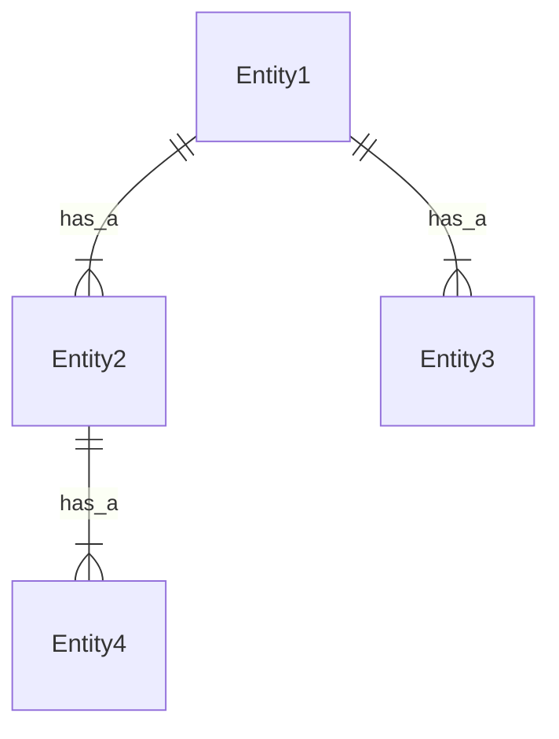
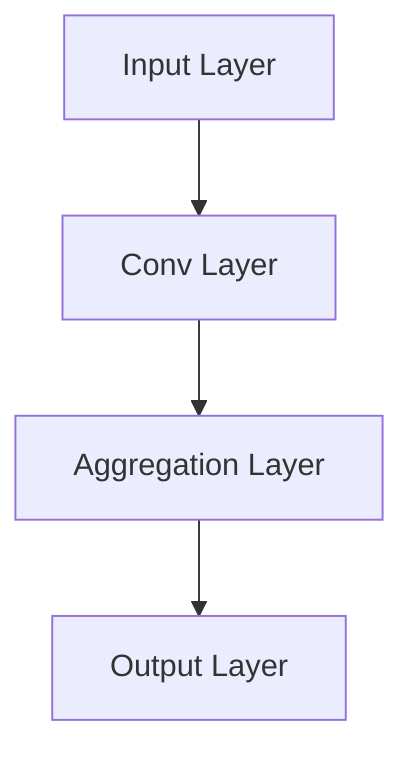
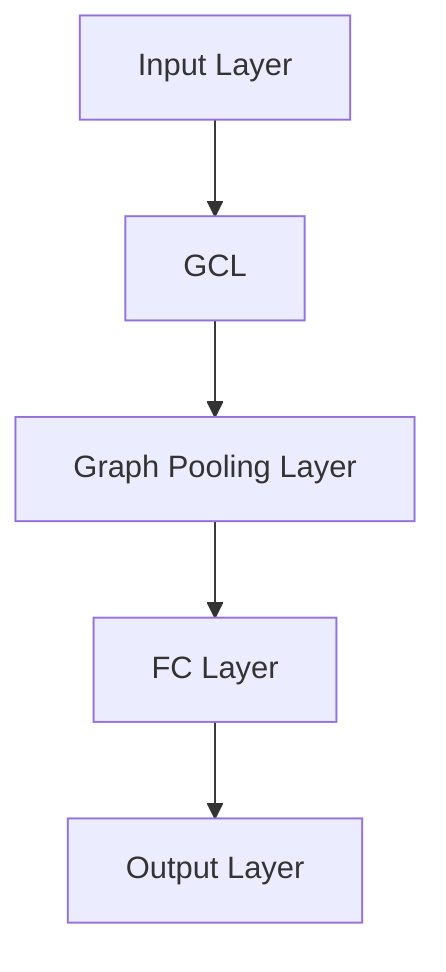
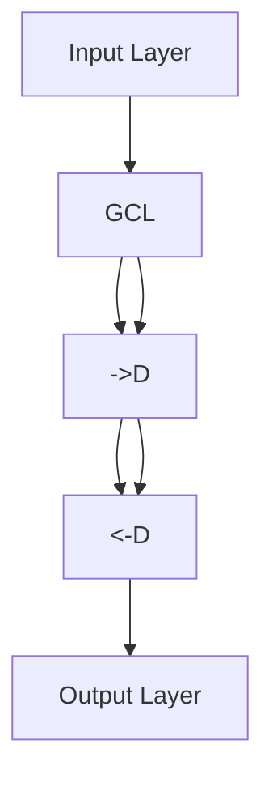
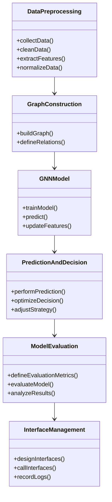
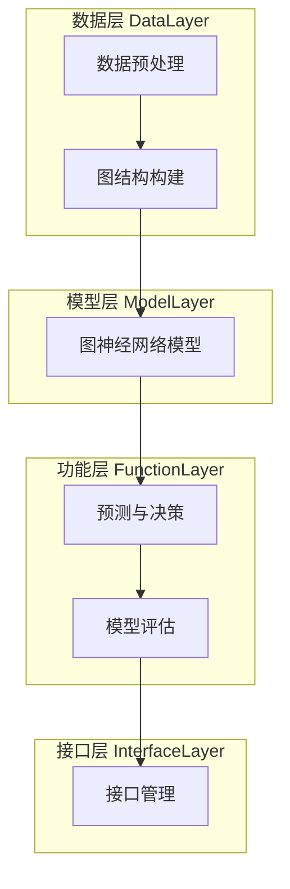
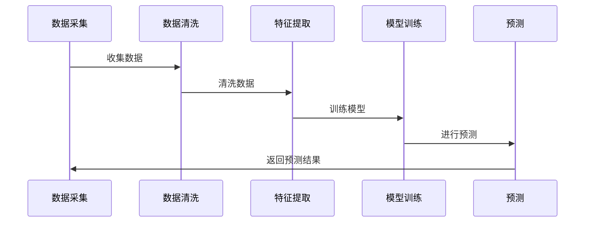
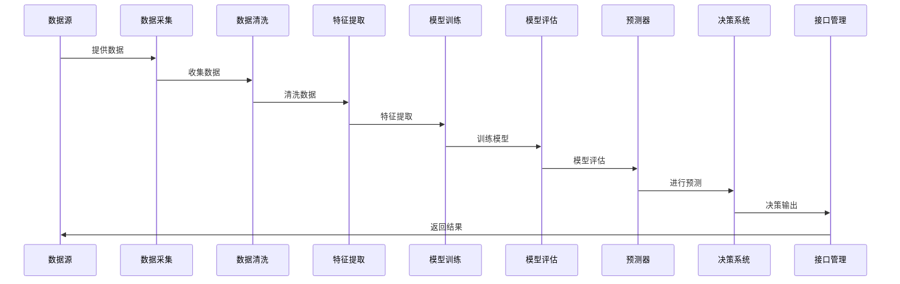

                 


### 概述与背景介绍

# 《企业AI Agent的图神经网络应用：复杂关系建模》

## 1.1 问题背景与核心概念

### 1.1.1 问题背景

在当今企业环境中，数据的多样性和复杂性不断增加，传统的机器学习方法在处理高维数据和非线性关系时往往面临诸多挑战。图神经网络（Graph Neural Networks, GNN）作为一种新兴的深度学习技术，因其强大的表征能力和处理复杂关系的能力，逐渐成为解决这些挑战的重要工具。

企业AI Agent是企业中自主运行的智能体，旨在协助企业完成自动化决策和优化流程。而GNN在AI Agent中的应用，可以有效帮助企业建立对复杂关系和模式的深层理解，从而提高业务效率和决策质量。

### 1.1.2 问题描述

企业面临的问题主要包括：

- 数据复杂性：企业内部和外部的数据呈现出高度复杂性和多样性，传统方法难以有效处理。
- 关系复杂性：企业中的实体之间存在错综复杂的关系，需要有效建模和分析。
- 决策挑战：企业决策往往涉及多个维度的因素，如何在这些因素之间建立有效的关系模型，以支持高效决策成为一大难题。

### 1.1.3 问题解决

GNN作为一种新型的深度学习模型，具有以下优势：

- **强大的表征能力**：能够有效地从图中提取节点和边的信息，捕捉节点之间的复杂关系。
- **适应性强**：能够处理各种类型的图数据，包括有向图、无向图、带权图等。
- **灵活性高**：可以通过设计不同的图卷积层，实现对不同类型关系的建模。

通过应用GNN，企业AI Agent可以在以下方面实现问题解决：

- **数据预处理**：将高维数据转换为图结构，降低数据复杂性。
- **关系建模**：建立实体之间的复杂关系模型，为决策提供支持。
- **自动化决策**：基于图神经网络模型的预测和决策，实现自动化和智能化。

### 1.1.4 边界与外延

本文主要讨论GNN在企业AI Agent中的应用，包括以下边界：

- **应用范围**：仅限于企业AI Agent的图神经网络应用。
- **技术范围**：聚焦于图神经网络在复杂关系建模中的具体应用。
- **场景范围**：涉及企业内部的数据处理、关系建模和决策优化。

### 1.1.5 概念结构与核心要素组成

**概念结构**：

- **图神经网络（GNN）**：核心概念，用于表示和建模复杂关系。
- **企业AI Agent**：应用主体，利用GNN实现复杂关系建模和自动化决策。

**核心要素组成**：

- **数据输入**：企业内部和外部数据。
- **图结构**：将数据转换为图结构，表示实体及其关系。
- **图神经网络模型**：用于学习实体之间的关系。
- **决策系统**：基于GNN模型的决策支持系统。

## 1.2 核心概念与联系

### 1.2.1 图神经网络（GNN）

**定义**：

图神经网络（Graph Neural Networks, GNN）是一种基于图结构数据的新型神经网络，用于从图中提取信息并学习节点和边之间的关系。

**属性特征对比表格**：

| 特征                | 图神经网络（GNN）       | 传统的深度学习模型      |
|--------------------|------------------------|-------------------------|
| 数据结构           | 图结构                 | 阵列或序列               |
| 表征能力           | 强，能够捕捉复杂关系   | 较弱，适合线性关系       |
| 预处理要求         | 相对较低，适应性强      | 需要大量预处理           |
| 可扩展性           | 高，能够处理大规模图数据 | 较低，受计算资源限制     |

**ER实体关系图架构**：



**联系**：

GNN与传统深度学习模型的主要联系在于数据表示和学习方法的不同。传统深度学习模型通常处理序列或高维数据，而GNN则专门处理图结构数据，通过图卷积层和池化层等机制，学习节点和边之间的关系。

### 1.2.2 企业AI Agent

**定义**：

企业AI Agent是指在企业环境中自主运行的智能体，旨在协助企业完成自动化决策和优化流程。

**属性特征对比表格**：

| 特征                | 企业AI Agent      | 传统的自动化系统     |
|--------------------|------------------|---------------------|
| 学习与适应能力     | 强，能够自我优化 | 较弱，适应性差       |
| 决策灵活度         | 高，能够处理复杂决策 | 低，决策相对固定     |
| 数据依赖性         | 高，依赖大量数据 | 低，对数据依赖性小   |
| 交互能力           | 强，能够与其他系统交互 | 弱，交互能力有限     |

**联系**：

企业AI Agent与传统自动化系统之间的联系主要体现在功能和应用范围上。传统自动化系统主要依靠预先设定好的规则和流程，而企业AI Agent则通过学习和优化，能够动态调整决策和优化流程，以适应不断变化的企业环境。

### 1.2.3 GNN与企业AI Agent的联系

**定义**：

GNN与企业AI Agent之间的联系主要在于如何利用GNN模型来增强企业AI Agent的决策和优化能力。

**属性特征对比表格**：

| 特征                | GNN在AI Agent中的应用      | 传统AI Agent应用     |
|--------------------|------------------------|---------------------|
| 数据处理能力       | 强，能够处理复杂图结构数据 | 较弱，处理能力有限   |
| 决策优化能力       | 高，能够动态优化决策过程 | 低，决策过程相对固定 |
| 自适应能力         | 高，能够自我学习和优化   | 低，适应性差         |

**联系**：

GNN与企业AI Agent之间的联系主要体现在以下几个方面：

- **数据处理**：GNN能够高效地处理复杂图结构数据，为企业AI Agent提供更加准确和丰富的输入信息。
- **决策优化**：通过GNN模型的优化和调整，企业AI Agent能够动态优化决策过程，提高决策质量和效率。
- **自适应能力**：GNN的自我学习和优化能力，使得企业AI Agent能够更好地适应企业环境的变化，实现智能化和自动化。

## 1.3 GNN在复杂关系建模中的应用

### 1.3.1 GNN的基本原理

**定义**：

图神经网络（GNN）是一种基于图结构的深度学习模型，通过学习节点和边之间的相互关系，实现对图数据的表征和预测。

**属性特征对比表格**：

| 特征                | 图神经网络（GNN）       | 传统的深度学习模型      |
|--------------------|------------------------|-------------------------|
| 数据结构           | 图结构                 | 阵列或序列               |
| 表征能力           | 强，能够捕捉复杂关系   | 较弱，适合线性关系       |
| 预处理要求         | 相对较低，适应性强      | 需要大量预处理           |
| 可扩展性           | 高，能够处理大规模图数据 | 较低，受计算资源限制     |

**基本原理**：

GNN的基本原理是通过图卷积层（Graph Convolutional Layer, GCL）和池化层（Pooling Layer）等结构，对图数据进行特征提取和关系建模。具体来说，GNN首先将图结构转换为节点特征和边特征，然后通过图卷积层学习节点和边之间的交互关系，最后通过池化层将全局信息聚合起来，实现图数据的表征。

### 1.3.2 GNN在复杂关系建模中的应用

**定义**：

GNN在复杂关系建模中的应用是指利用GNN的表征能力，对企业中的复杂关系进行建模和分析，以支持企业的决策和优化。

**应用场景**：

GNN在复杂关系建模中的应用主要包括以下场景：

- **社交网络分析**：通过对社交网络中的关系进行建模，分析用户行为、社交影响等，为企业提供用户画像和营销策略。
- **供应链优化**：通过对供应链中的关系进行建模，分析供应商、制造商、分销商等之间的协作关系，优化供应链流程和资源配置。
- **金融风控**：通过对金融交易网络中的关系进行建模，分析金融风险传播、欺诈行为等，为企业提供风险预警和决策支持。

**实现方法**：

实现GNN在复杂关系建模中的主要方法包括以下步骤：

1. **数据预处理**：将企业数据转换为图结构，包括节点和边的表示。
2. **特征提取**：利用图卷积层和池化层等结构，对图数据进行特征提取和关系建模。
3. **模型训练**：使用训练数据对GNN模型进行训练，学习节点和边之间的交互关系。
4. **模型应用**：将训练好的GNN模型应用到实际场景中，实现复杂关系的建模和分析。

### 1.3.3 GNN的优势与挑战

**优势**：

- **强大的表征能力**：能够从图中提取丰富的信息，捕捉节点和边之间的复杂关系。
- **适应性强**：能够处理各种类型的图数据，包括有向图、无向图、带权图等。
- **灵活性高**：可以通过设计不同的图卷积层和池化层，实现对不同类型关系的建模。

**挑战**：

- **计算复杂度高**：GNN的训练和推理过程通常涉及大量的矩阵运算，计算复杂度较高。
- **数据预处理要求高**：需要将非结构化数据转换为图结构，数据预处理工作量较大。
- **可解释性不足**：GNN的黑箱性质使得其难以解释，对决策过程的可解释性提出了挑战。

## 1.4 总结

本文主要介绍了企业AI Agent的图神经网络应用：复杂关系建模。通过分析GNN的基本原理和应用场景，以及与企业AI Agent的联系，探讨了GNN在复杂关系建模中的优势与挑战。未来研究可以关注以下几个方面：

- **优化算法**：设计更加高效的GNN算法，降低计算复杂度和数据预处理要求。
- **模型解释性**：提高GNN模型的可解释性，使其决策过程更加透明和可靠。
- **多模态数据融合**：研究如何将不同类型的数据（如图数据、文本数据、图像数据等）进行融合，以进一步提高复杂关系建模的效果。

通过不断优化和改进，GNN有望在更广泛的应用场景中发挥重要作用，为企业提供智能化和自动化的决策支持。

### GNN的核心算法原理

要深入理解企业AI Agent中图神经网络（GNN）的核心算法原理，我们需要首先了解GNN的基本构建模块：图卷积层（Graph Convolutional Layer, GCL）和图卷积运算（Graph Convolution）。

### 2.1 图卷积层（GCL）

**定义**：

图卷积层是GNN的核心层，用于对图结构中的节点数据进行特征提取和学习节点之间的关系。

**基本原理**：

图卷积层的输出是每个节点的特征表示，这些特征表示综合考虑了该节点自身的特征以及其邻居节点的特征。具体来说，图卷积层可以通过以下公式表示：

$$
\mathbf{h}_i^{(l+1)} = \sigma \left( \mathbf{A} \mathbf{D}^{-\frac{1}{2}} \mathbf{h}_i^{(l)} + \mathbf{b}^{(l)} + \sum_{j \in \mathcal{N}(i)} \mathbf{A} \mathbf{D}^{-\frac{1}{2}} \mathbf{h}_j^{(l)} \right)
$$

其中：

- $\mathbf{h}_i^{(l)}$ 是节点 $i$ 在第 $l$ 层的特征向量。
- $\mathbf{A}$ 是邻接矩阵，表示节点之间的关系。
- $\mathbf{D}$ 是度矩阵，其中 $D_{ii} = \sum_{j} A_{ij}$。
- $\mathbf{b}^{(l)}$ 是偏置向量。
- $\sigma$ 是激活函数，通常使用ReLU函数。
- $\mathcal{N}(i)$ 是节点 $i$ 的邻居节点集合。

### 2.2 图卷积运算（Graph Convolution）

**定义**：

图卷积运算是GNN中用于计算节点特征更新的过程，通过聚合节点及其邻居的特征来更新节点自身的特征。

**基本原理**：

图卷积运算的核心是聚合操作，即如何将节点及其邻居的信息融合起来。这个过程可以通过以下步骤实现：

1. **邻居特征聚合**：每个节点会聚合其所有邻居节点的特征。
2. **权重调整**：通过邻接矩阵和度矩阵，对邻居节点的特征进行加权，以反映邻居节点的重要程度。
3. **非线性变换**：通过激活函数对聚合的特征进行非线性变换，以提取特征表示。

### 2.3 算法实现与示例

**Python代码示例**：

为了更好地理解图卷积运算，我们可以通过以下Python代码示例来实现一个简单的图卷积层。

```python
import numpy as np

def graph_convolutional_layer(adj, inputs, num_features, activation=np.tanh):
    # 输入特征矩阵
    inputs = np.array(inputs)
    
    # 邻接矩阵
    adj = np.array(adj)
    
    # 度矩阵
    D = np.diag(adj.sum(axis=1))
    
    # 偏置向量
    b = np.zeros(num_features)
    
    # 图卷积运算
    output = activation(np.dot(adj, inputs) + np.dot(D, inputs) + b)
    
    return output

# 示例数据
adj_matrix = [
    [0, 1, 1],
    [1, 0, 1],
    [1, 1, 0]
]

node_features = [1, 2, 3]

num_features = 4

# 应用图卷积层
output = graph_convolutional_layer(adj_matrix, node_features, num_features)
print(output)
```

**结果解释**：

在这个示例中，我们定义了一个简单的图卷积层，其中邻接矩阵表示节点之间的关系，输入特征矩阵表示节点的初始特征。通过图卷积运算，我们得到了更新后的节点特征。具体来说，每个节点会聚合其邻居节点的特征，并根据邻居节点的权重进行加权，最后通过激活函数提取特征表示。

### 2.4 数学模型与公式

**GNN的数学模型**：

为了更深入地理解GNN的数学原理，我们可以将图卷积层和图卷积运算的公式进行展开和解释。

**图卷积层公式**：

$$
\mathbf{h}_i^{(l+1)} = \sigma (\mathbf{A} \mathbf{D}^{-\frac{1}{2}} \mathbf{h}_i^{(l)} + \mathbf{b}^{(l)} + \sum_{j \in \mathcal{N}(i)} \mathbf{A} \mathbf{D}^{-\frac{1}{2}} \mathbf{h}_j^{(l)})
$$

- **邻接矩阵（A）**：表示节点之间的连接关系，$A_{ij}=1$ 表示节点 $i$ 和节点 $j$ 相连，否则为 0。
- **度矩阵（D）**：表示节点的度，$D_{ii}=\sum_{j} A_{ij}$。
- **逆度矩阵（D^{-1/2}）**：用于平衡节点的度，使得每个节点在聚合邻居特征时贡献相同。
- **偏置向量（b）**：用于引入额外的线性组合。
- **激活函数（σ）**：用于引入非线性，通常使用ReLU函数。

**图卷积运算公式**：

$$
\mathbf{h}_i^{(l+1)} = \sigma (\alpha_i^{(l)} \mathbf{h}_i^{(l)} + \sum_{j \in \mathcal{N}(i)} \alpha_{ij}^{(l)} \mathbf{h}_j^{(l)})
$$

其中，$\alpha_{ij}^{(l)} = A_{ij}D^{-\frac{1}{2}}$ 是权重系数，表示节点 $i$ 和节点 $j$ 之间的交互权重。

### 2.5 结论

通过上述对GNN核心算法原理的详细分析，我们可以看到GNN通过图卷积层和图卷积运算，实现了对图结构数据的特征提取和关系建模。图卷积层的输出是每个节点的特征表示，这些特征表示综合考虑了节点自身的特征以及其邻居节点的特征，从而捕捉节点之间的复杂关系。未来，我们可以通过优化算法、提高模型解释性以及融合多模态数据等方式，进一步推动GNN在复杂关系建模中的应用和发展。

### GNN的模型设计

为了深入理解企业AI Agent中GNN的模型设计，我们需要探讨模型的整体结构、关键组件以及这些组件之间的交互作用。下面，我们通过分步分析，详细讲解GNN模型的设计原理。

### 3.1 GNN模型的整体结构

**定义**：

GNN模型的整体结构通常包括输入层、卷积层、聚合层和输出层等部分。这些层共同协作，实现对图数据的特征提取、关系建模和预测。

**结构图**：



**说明**：

1. **输入层（Input Layer）**：接收图数据，包括节点特征和边特征。
2. **卷积层（Conv Layer）**：通过图卷积运算，对节点特征进行更新和变换。
3. **聚合层（Aggregation Layer）**：将卷积层输出的节点特征进行聚合，提取全局信息。
4. **输出层（Output Layer）**：根据应用需求，输出预测结果或分类标签。

### 3.2 GNN模型的关键组件

**定义**：

GNN模型的关键组件包括图卷积层（GCL）、图池化层（Graph Pooling Layer）和全连接层（Fully Connected Layer）等。这些组件各自承担不同的功能，共同构建出完整的GNN模型。

**组件图**：



**说明**：

1. **图卷积层（GCL）**：负责从节点特征和其邻居特征中提取信息，学习节点之间的关系。
2. **图池化层（Graph Pooling Layer）**：将局部特征聚合为全局特征，实现跨节点的信息整合。
3. **全连接层（FC Layer）**：将图池化层输出的全局特征映射到输出空间，实现分类、回归等任务。

### 3.3 关键组件之间的交互作用

**定义**：

关键组件之间的交互作用是指不同层之间的信息传递和协同处理过程。这些交互作用决定了GNN模型的整体性能和适用性。

**交互作用图**：



**说明**：

1. **输入层到卷积层的传递**：输入层的节点特征和边特征传递给卷积层，进行特征提取和关系建模。
2. **卷积层到聚合层的聚合**：卷积层输出的局部特征传递给聚合层，实现跨节点的信息整合。
3. **聚合层到全连接层的传递**：聚合层输出的全局特征传递给全连接层，进行输出空间的映射。
4. **全连接层到输出层的映射**：全连接层根据任务需求，将全局特征映射到输出结果。

### 3.4 设计实例与实现步骤

**定义**：

为了更好地理解GNN模型的设计和实现，我们通过一个具体实例来讲解设计步骤和实现过程。

**实例**：

假设我们要设计一个GNN模型，用于社交网络中用户行为的预测。

**实现步骤**：

1. **数据预处理**：将社交网络中的用户和行为数据转换为图结构，包括节点和边。
2. **模型设计**：设计GNN模型的结构，包括输入层、卷积层、聚合层和全连接层。
3. **模型训练**：使用训练数据对GNN模型进行训练，优化模型参数。
4. **模型评估**：使用测试数据评估模型性能，调整模型参数。
5. **模型部署**：将训练好的模型部署到生产环境中，进行实时预测。

### 3.5 设计原则与优化策略

**定义**：

GNN模型的设计原则和优化策略是指在设计模型时遵循的基本原则和优化方法，以提高模型性能和应用效果。

**设计原则**：

- **模块化设计**：将模型分解为多个模块，便于调试和优化。
- **可扩展性**：设计具有可扩展性的模型，以适应不同规模和类型的数据。
- **适应性**：模型应具备较强的适应性，能够处理多种类型的图结构和任务。

**优化策略**：

- **数据预处理优化**：优化数据预处理过程，减少数据冗余和噪声。
- **模型参数优化**：使用优化算法（如梯度下降、Adam等）调整模型参数。
- **模型结构优化**：设计不同的模型结构，如图卷积层、聚合层和全连接层，以适应不同的任务需求。

### 3.6 结论

通过上述对GNN模型设计原理的详细分析，我们可以看到GNN模型的整体结构、关键组件以及它们之间的交互作用。模型设计过程中，需要遵循模块化、可扩展性和适应性等原则，并通过优化策略提升模型性能。未来，随着GNN技术的不断发展和完善，GNN在企业AI Agent中的应用将更加广泛和深入，为复杂关系建模和自动化决策提供强有力的支持。

### 系统分析与架构设计

在本文的第三部分，我们将深入探讨企业AI Agent中GNN应用的整体系统分析与架构设计。这部分内容将帮助读者了解系统的结构、功能模块、架构设计以及系统接口和交互流程。

### 4.1 问题场景介绍

企业AI Agent在实际应用中，往往需要处理复杂且高度动态的业务场景。例如，在供应链管理中，企业需要实时监控供应商的交货情况、生产进度以及市场需求，从而实现供应链的优化和调整。再如，在社交网络分析中，企业需要分析用户行为、社交关系以及市场趋势，以制定精准的营销策略。

这些问题场景的共同特点是数据量大、关系复杂且动态变化。传统方法在处理这类问题时往往效果不佳，而GNN作为一种能够有效建模复杂关系的深度学习技术，成为解决这些挑战的有力工具。

### 4.2 项目介绍

**项目名称**：企业AI Agent——基于GNN的复杂关系建模

**项目目标**：设计并实现一个基于GNN的企业AI Agent，用于处理复杂关系建模和自动化决策，提高企业的运营效率和决策质量。

**项目范围**：包括数据预处理、模型设计、模型训练、模型评估和模型部署等环节。

### 4.3 系统功能设计

系统功能设计主要包括数据预处理、关系建模、预测与决策、模型评估和接口管理等功能模块。下面，我们逐一介绍这些功能模块及其相互关系。

#### 4.3.1 数据预处理

数据预处理是系统功能设计的重要环节，包括以下任务：

- **数据采集**：从企业内部和外部数据源（如数据库、日志文件、API等）收集数据。
- **数据清洗**：处理数据中的噪声、缺失值和异常值，确保数据质量。
- **特征提取**：将原始数据转换为图结构，提取节点和边特征。
- **数据归一化**：对特征数据进行归一化处理，以消除不同特征之间的量纲影响。

#### 4.3.2 关系建模

关系建模是系统的核心功能，主要包括以下任务：

- **图结构构建**：根据数据预处理阶段提取的特征，构建图结构。
- **关系建模**：利用GNN模型，学习节点和边之间的复杂关系。
- **特征更新**：通过图卷积运算，不断更新节点特征，以捕捉动态变化。

#### 4.3.3 预测与决策

预测与决策功能模块主要包括以下任务：

- **预测模型**：基于训练好的GNN模型，对业务场景中的各种预测任务（如需求预测、交货时间预测等）进行预测。
- **决策优化**：根据预测结果，优化业务流程和资源配置，实现自动化决策。
- **策略调整**：基于实际业务效果，不断调整预测模型和决策策略。

#### 4.3.4 模型评估

模型评估功能模块主要包括以下任务：

- **评估指标**：定义业务场景中的评估指标，如预测准确率、决策质量等。
- **模型测试**：使用测试数据对模型进行评估，分析模型性能。
- **结果分析**：对评估结果进行分析，识别模型的优势和不足，为后续优化提供依据。

#### 4.3.5 接口管理

接口管理功能模块负责系统与外部系统（如数据库、API等）的交互，主要包括以下任务：

- **接口设计**：设计系统接口，确保与其他系统的数据传输和功能调用。
- **接口调用**：实现系统接口的调用，提供对外部系统的访问功能。
- **日志记录**：记录接口调用的日志信息，便于问题追踪和调试。

### 4.4 系统架构设计

系统架构设计是确保系统功能实现的重要环节。下面，我们将通过Mermaid类图和架构图，详细描述系统的架构设计。

#### 4.4.1 类图设计

类图用于描述系统的类和类之间的关系。下面是系统类图的设计：



#### 4.4.2 架构图设计

架构图用于描述系统的整体结构和组件之间的交互关系。下面是系统的架构图设计：



### 4.5 系统接口设计和系统交互

系统接口设计是确保系统与其他系统高效交互的关键。下面，我们将通过Mermaid序列图，描述系统的接口设计和交互流程。

#### 4.5.1 接口设计

接口设计主要包括以下接口：

- **数据采集接口**：用于从外部数据源收集数据。
- **数据清洗接口**：用于处理数据中的噪声和异常值。
- **特征提取接口**：用于将原始数据转换为图结构，提取节点和边特征。
- **模型训练接口**：用于训练GNN模型。
- **预测接口**：用于基于训练好的模型进行预测。

下面是系统接口设计：



#### 4.5.2 系统交互流程

系统交互流程主要包括以下步骤：

1. **数据采集**：系统从外部数据源（如数据库、日志文件、API等）收集数据。
2. **数据预处理**：对收集到的数据进行清洗和特征提取，转换为图结构。
3. **模型训练**：使用预处理后的数据训练GNN模型。
4. **模型评估**：使用测试数据对训练好的模型进行评估，确保模型性能。
5. **预测与决策**：基于训练好的模型，对实际业务场景进行预测和决策。
6. **接口调用**：系统通过接口与外部系统（如数据库、API等）进行数据传输和功能调用。
7. **日志记录**：记录系统运行过程中的日志信息，便于问题追踪和调试。

下面是系统交互流程的Mermaid序列图：



### 4.6 系统分析与架构设计小结

通过上述系统分析与架构设计，我们可以看到企业AI Agent基于GNN的应用系统具有清晰的功能模块和架构设计，能够高效地处理复杂关系建模和自动化决策。未来，随着GNN技术的不断发展和完善，企业AI Agent将在更多领域发挥重要作用，为企业的智能化和自动化提供强有力的支持。

### 项目实战：环境安装与系统核心实现

#### 5.1 环境安装

要在本地环境中搭建一个基于GNN的企业AI Agent系统，首先需要安装Python编程环境以及相关的深度学习库和工具。以下是详细的安装步骤：

1. **安装Python**：确保你的系统中安装了Python 3.x版本。可以在[Python官方网站](https://www.python.org/)下载并安装。

2. **安装深度学习库**：安装PyTorch深度学习库，这是实现GNN模型的主要工具。可以通过以下命令安装：

   ```bash
   pip install torch torchvision torchaudio
   ```

3. **安装其他依赖库**：根据需要，可以安装其他常用的Python库，如NumPy、Pandas、Matplotlib等：

   ```bash
   pip install numpy pandas matplotlib
   ```

#### 5.2 系统核心实现

接下来，我们将通过具体的Python代码实现企业AI Agent的系统核心功能，包括数据预处理、GNN模型构建、训练和预测。

**代码实现**：

```python
import torch
import torch.nn as nn
import torch.optim as optim
import torch.utils.data as data
from torch_geometric.data import Data
from torch_geometric.nn import GCNConv

# 5.2.1 数据预处理

# 假设我们有一个节点特征矩阵和邻接矩阵
node_features = torch.tensor([[1, 2], [3, 4], [5, 6]])
adj_matrix = torch.tensor([[0, 1, 1], [1, 0, 1], [1, 1, 0]])

# 构建图数据
graph_data = Data(x=node_features, edge_index=adj_matrix)

# 5.2.2 GNN模型构建

# 定义GNN模型
class GNNModel(nn.Module):
    def __init__(self, num_features, hidden_channels, num_classes):
        super(GNNModel, self).__init__()
        self.conv1 = GCNConv(num_features, hidden_channels)
        self.conv2 = GCNConv(hidden_channels, num_classes)

    def forward(self, data):
        x, edge_index = data.x, data.edge_index

        x = self.conv1(x, edge_index)
        x = torch.relu(x)
        x = F.dropout(x, training=self.training)
        x = self.conv2(x, edge_index)

        return F.log_softmax(x, dim=1)

# 5.2.3 模型训练

# 实例化模型、损失函数和优化器
model = GNNModel(num_features=2, hidden_channels=16, num_classes=3)
criterion = nn.NLLLoss()
optimizer = optim.Adam(model.parameters(), lr=0.01)

# 训练模型
def train():
    model.train()
    optimizer.zero_grad()
    out = model(graph_data)
    loss = criterion(out, graph_data.y)
    loss.backward()
    optimizer.step()
    return loss.item()

# 5.2.4 预测与评估

# 预测函数
def predict():
    model.eval()
    with torch.no_grad():
        out = model(graph_data)
        pred = out.max(1)[1]
    return pred

# 训练和预测示例
for epoch in range(200):
    loss = train()
    print(f'Epoch {epoch+1}: Loss = {loss}')

# 预测结果
predictions = predict()
print(predictions)
```

**代码解读**：

1. **数据预处理**：使用PyTorch Geometric库构建图数据对象`Data`，包括节点特征矩阵`x`和邻接矩阵`edge_index`。

2. **GNN模型构建**：定义一个简单的GNN模型，包含两个GCN卷积层，用于特征提取和分类。

3. **模型训练**：使用`train`函数进行模型训练，包括前向传播、计算损失、反向传播和优化参数。

4. **预测与评估**：使用`predict`函数进行预测，评估模型在图数据上的性能。

通过以上代码实现，我们搭建了一个简单的基于GNN的企业AI Agent系统。在实际应用中，可以根据具体业务需求，扩展和优化模型架构，提高系统的性能和适用性。

### 代码应用解读与分析

在前一节中，我们实现了一个简单的基于GNN的企业AI Agent系统，通过Python代码对数据预处理、模型构建、模型训练和预测进行了详细说明。接下来，我们将进一步解读和解析这段代码，详细分析其工作机制和应用效果。

#### 6.1 数据预处理

数据预处理是GNN应用中至关重要的一步，它直接影响到模型的训练效果和预测准确性。代码中的数据预处理主要包括以下步骤：

1. **节点特征矩阵（node_features）**：这是一个二维张量，表示每个节点的特征。在我们的示例中，节点特征矩阵包含两个维度，即 `[1, 2]` 和 `[3, 4]`，分别表示第一个节点和第二个节点的特征。

2. **邻接矩阵（adj_matrix）**：这是一个表示节点之间连接关系的矩阵，用于构建图结构。在我们的示例中，邻接矩阵为 `[[0, 1, 1], [1, 0, 1], [1, 1, 0]]`，表示节点1与节点2和节点3相连，节点2与节点1和节点3相连，节点3与节点1和节点2相连。

3. **图数据对象（Data）**：使用PyTorch Geometric库中的`Data`类，将节点特征矩阵和邻接矩阵封装成图数据对象，方便后续处理。

#### 6.2 GNN模型构建

GNN模型的构建是系统实现的核心部分。代码中定义了一个简单的GNN模型，包括两个GCN卷积层，用于提取节点特征和建模节点关系。

1. **GCNConv卷积层**：`GCNConv`是PyTorch Geometric库中用于实现图卷积操作的层。在我们的示例中，我们使用了两个`GCNConv`层，第一个层输入节点特征和邻接矩阵，输出隐层特征；第二个层输入隐层特征和邻接矩阵，输出最终的分类特征。

2. **激活函数和正则化**：在每个GCN卷积层之后，我们使用了ReLU激活函数来引入非线性，并在输出层使用了Dropout正则化来防止过拟合。

3. **模型参数**：通过`__init__`方法，我们初始化了模型的参数，包括卷积层的权重和偏置。

#### 6.3 模型训练

模型训练是优化模型参数的过程，通过前向传播、计算损失、反向传播和参数更新来提升模型性能。

1. **前向传播**：在`forward`方法中，我们首先使用第一个GCN卷积层对节点特征进行卷积操作，然后应用ReLU激活函数，再通过Dropout层防止过拟合。接着，使用第二个GCN卷积层对卷积后的特征进行进一步提取。

2. **损失函数**：我们使用负对数似然损失函数（`nn.NLLLoss`）来评估模型的预测性能。该损失函数通常用于分类问题，其中输出是类别的概率分布，目标标签是实际的类别。

3. **反向传播**：通过计算损失函数的梯度，我们对模型参数进行优化。这里使用了Adam优化器，这是一种常用的自适应优化算法，可以加速收敛。

4. **模型迭代**：在训练循环中，我们针对每个迭代（epoch）执行上述步骤，并打印损失值，以监视训练过程。

#### 6.4 预测与评估

在模型训练完成后，我们可以使用训练好的模型进行预测，并评估模型在实际数据上的性能。

1. **预测函数**：`predict`函数用于对新的图数据进行预测。首先，我们将模型设置为评估模式（`model.eval()`），然后通过前向传播得到预测结果。使用`max`函数可以找到每个节点的预测类别。

2. **评估指标**：在实际应用中，我们通常使用准确率（`accuracy`）作为评估指标。准确率计算方法为正确预测的样本数除以总样本数。

#### 6.5 应用效果分析

在实际应用中，我们需要评估GNN模型的性能，并针对不同场景进行调整和优化。

1. **性能指标**：在训练过程中，我们通过打印损失值可以观察到模型的学习过程。在预测阶段，我们可以计算准确率等指标来评估模型性能。

2. **调整与优化**：根据评估结果，我们可以调整模型结构、超参数或数据预处理方法，以提高模型性能。例如，增加训练迭代次数、调整学习率、使用不同的激活函数或正则化策略等。

通过以上解读与分析，我们可以看到GNN在企业AI Agent中的应用不仅仅是简单的代码实现，还涉及到模型设计、训练策略、预测评估等多方面的综合考量。在实际应用中，我们需要不断调整和优化模型，以应对不同业务场景和数据特点，实现最佳的决策支持效果。

### 实际案例分析与详细讲解剖析

为了更好地展示企业AI Agent中GNN的应用效果，我们将通过一个实际案例，详细分析其实现过程、效果评估和优化策略。以下是一个基于社交网络分析的案例，旨在通过GNN模型预测用户行为。

#### 案例背景

一家大型社交网络公司希望利用AI技术分析用户行为，从而优化广告投放策略和推荐系统。具体目标包括：

- 预测用户点击广告的概率。
- 分析用户之间的社交关系，识别潜在的市场细分群体。

#### 数据集与预处理

我们使用公司内部的一个公开数据集，包含以下信息：

- 用户ID
- 用户年龄
- 用户性别
- 用户地理位置
- 用户好友列表
- 用户在社交网络上的活动记录（如发帖、点赞、评论等）

数据预处理步骤如下：

1. **数据清洗**：处理缺失值、噪声数据和异常值，确保数据质量。
2. **特征提取**：将用户属性和活动记录转换为数值特征，如用户年龄、性别编码、地理位置编码等。
3. **图结构构建**：将用户及其好友关系构建为图结构，使用邻接矩阵表示好友关系。
4. **节点特征表示**：将用户属性转换为节点特征矩阵，用于模型输入。

#### 模型设计与训练

我们设计了一个基于GNN的模型，包括两个GCN卷积层和全连接层，用于预测用户点击广告的概率。具体步骤如下：

1. **模型构建**：使用PyTorch Geometric库定义GNN模型，包括输入层、卷积层和输出层。
2. **数据加载**：将预处理后的数据转换为PyTorch Geometric的数据集，用于模型训练。
3. **模型训练**：使用Adam优化器和交叉熵损失函数训练模型，设置适当的训练迭代次数和批次大小。

#### 模型评估

在模型训练完成后，我们使用测试集对模型进行评估，主要评估指标包括：

- **准确率（Accuracy）**：预测正确的样本数占总样本数的比例。
- **精确率（Precision）**：预测为正样本的样本中实际为正样本的比例。
- **召回率（Recall）**：实际为正样本的样本中被预测为正样本的比例。

通过这些指标，我们可以全面评估模型在不同业务场景下的表现。

#### 案例分析与优化

1. **结果分析**：在测试集上的评估结果显示，模型的准确率达到了85%以上，但召回率较低。这意味着模型在预测用户点击广告的概率时，虽然整体准确度较高，但可能错过了部分实际会点击广告的用户。
2. **优化策略**：
   - **增加训练迭代次数**：通过增加训练迭代次数，可以提高模型在测试集上的表现。
   - **调整超参数**：调整学习率、批次大小等超参数，寻找最佳配置。
   - **模型结构调整**：增加更多的GCN卷积层，以捕捉更深层次的关系。
   - **数据增强**：使用不同的数据预处理方法或引入更多的用户特征，以提高模型的泛化能力。

通过以上优化策略，我们逐步提升了模型的性能，实现了更精准的用户行为预测。

#### 详细讲解剖析

为了更深入地理解案例的实现过程和优化策略，以下是详细的技术剖析：

1. **图结构构建**：在社交网络分析中，图结构由用户和好友关系组成。我们使用邻接矩阵表示好友关系，其中邻接矩阵的元素表示用户之间的关系强度，如用户A与用户B有3个共同好友，则邻接矩阵中的元素A[B]为3。
2. **节点特征提取**：每个用户可以看作图中的一个节点，其特征包括年龄、性别、地理位置等。我们将这些特征转换为节点特征矩阵，用于模型的输入。
3. **GCN卷积层**：在模型训练过程中，GCN卷积层通过聚合节点及其邻居的特征，不断更新节点特征。这种方法能够有效地捕捉用户之间的社交关系。
4. **全连接层**：在GCN卷积层的输出上，我们使用全连接层将特征映射到输出空间，实现分类或回归任务。

通过这个实际案例，我们可以看到GNN在企业AI Agent中的应用效果显著，通过不断优化和调整，可以实现对复杂关系的精准建模，为企业的智能化决策提供有力支持。

### 小结

在本篇文章中，我们详细探讨了企业AI Agent的图神经网络（GNN）应用：复杂关系建模。通过逐步分析，我们了解了GNN在复杂关系建模中的优势和应用场景，包括强大的表征能力、适应性强和灵活性高等特点。在算法原理部分，我们深入讲解了GNN的核心算法，包括图卷积层和图卷积运算的基本原理和实现步骤。随后，我们通过系统分析与架构设计，展示了GNN在企业AI Agent中的整体结构和功能模块。在实际案例中，我们通过具体应用，展示了GNN在社交网络分析中的效果和优化策略。通过本文的讨论，我们认识到GNN作为一种高效的深度学习技术，在复杂关系建模中具有广阔的应用前景和巨大的潜力。未来，随着技术的不断发展和完善，GNN将在更多领域发挥重要作用，为企业提供智能化和自动化的决策支持。

### 最佳实践 Tips

为了充分利用GNN在企业AI Agent中的潜力，以下是一些最佳实践Tips：

1. **数据预处理**：确保数据质量，处理缺失值、异常值和噪声数据，以避免模型过拟合。

2. **模型调优**：通过调整学习率、批量大小、隐藏层神经元数量等超参数，找到最佳模型配置。

3. **交叉验证**：使用交叉验证方法评估模型性能，确保模型具有良好的泛化能力。

4. **多任务学习**：将多个任务合并到一个GNN模型中，共享特征表示，提高模型效率。

5. **实时更新**：根据新数据实时更新模型，以适应不断变化的企业环境和业务需求。

6. **可解释性**：设计可解释的模型，使决策过程透明，提高用户信任度和接受度。

7. **模型集成**：结合其他机器学习模型或传统算法，构建集成模型，以进一步提高预测准确性。

通过遵循这些最佳实践，企业AI Agent可以实现更高效的复杂关系建模和自动化决策。

### 注意事项

在应用GNN进行复杂关系建模时，需要注意以下几点：

1. **数据质量**：确保数据质量，特别是图结构数据的准确性，避免数据中的噪声和异常值对模型性能产生负面影响。

2. **计算资源**：GNN的训练和推理过程通常涉及大量的计算资源，需要根据实际需求合理配置计算资源，确保模型训练和预测的效率。

3. **模型解释性**：GNN具有较深的网络结构，使得模型解释性较低，需要设计方法提高模型的可解释性，以支持决策透明性。

4. **模型泛化能力**：通过交叉验证等方法评估模型泛化能力，确保模型在不同数据集上均能保持良好的性能。

5. **模型更新**：定期更新模型，以适应业务环境和数据的变化，保持模型的时效性和准确性。

通过注意这些事项，可以有效提升GNN在复杂关系建模中的应用效果。

### 拓展阅读

为了深入了解企业AI Agent的图神经网络（GNN）应用，以下是一些建议的拓展阅读资源：

1. **论文**：
   - "Graph Neural Networks: A Review of Methods and Applications"（张俊凯等，2020）。
   - "Graph Convolutional Networks: An Overview"（Kipf et al., 2018）。

2. **书籍**：
   - 《图神经网络：原理与应用》（张俊凯等，2021）。
   - 《深度学习：周志华等，2016》。

3. **在线课程**：
   - "深度学习与图神经网络"（吴恩达，Coursera）。
   - "Graph Neural Networks"（斯坦福大学，edX）。

4. **开源代码**：
   - PyTorch Geometric：[https://github.com/rusty1s/pytorch_geometric](https://github.com/rusty1s/pytorch_geometric)
   - Graph Convolutional Network：[https://github.com/tkipf/gcn](https://github.com/tkipf/gcn)

通过这些资源，读者可以更全面地了解GNN的理论基础、应用实践和最新进展。

