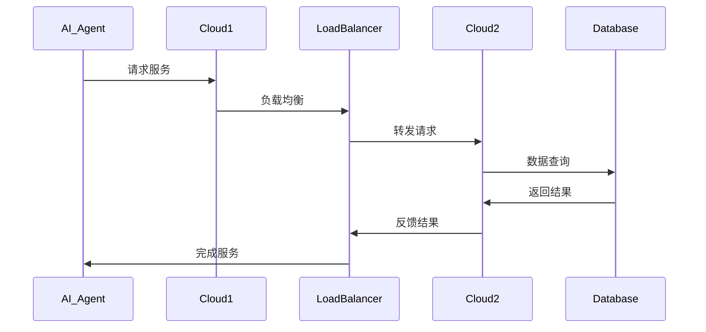
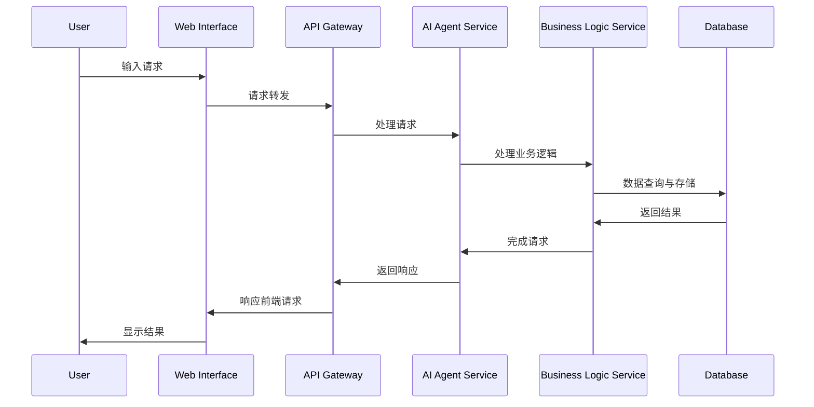
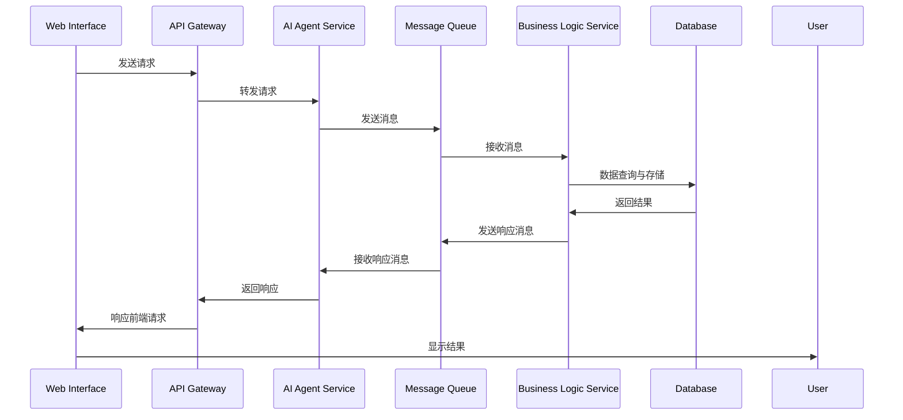

                 


### 引言：企业AI Agent的多云部署背景与挑战

**关键词**：企业AI Agent、多云部署、灵活性、可靠性

**摘要**：本文旨在探讨企业AI Agent在多云部署中的策略，强调灵活性和可靠性在多云部署中的重要性。我们将首先介绍多云部署的背景，接着深入探讨企业AI Agent的概念及其在业务中的角色，然后逐步分析多云部署策略的关键要素。

#### 1. 多云部署的兴起

随着云计算技术的不断发展，企业对云服务的需求日益增长。多云部署作为云服务的一种模式，允许企业在多个云平台上运行应用程序和服务，从而实现更高的灵活性和可靠性。然而，多云部署也带来了一系列挑战，如跨云平台的数据同步、资源调度等问题。

**问题背景**：企业需要在不同云平台之间进行数据交换和资源调度，以应对不断变化的业务需求。这要求企业不仅要具备跨平台的技术能力，还需要考虑整体部署的灵活性。

**问题描述**：企业如何在多云环境下部署AI Agent，使其既能灵活适应业务需求，又能保证系统的可靠性？

**问题解决**：通过引入有效的多云部署策略，企业可以优化AI Agent的部署方式，确保其在多云环境中的高效运行。

**边界与外延**：多云部署不仅涉及技术层面，还涉及到业务战略和组织结构。因此，在讨论多云部署时，我们需要综合考虑技术、业务和管理等多方面因素。

**概念结构与核心要素组成**：

- **多云部署**：指在多个云平台之间部署应用程序和服务。
- **AI Agent**：指具备自主决策能力的软件代理，用于辅助企业完成特定任务。

#### 2. AI Agent的概念与作用

AI Agent是人工智能领域的一个重要概念，它在企业中的应用越来越广泛。AI Agent不仅可以处理复杂的业务逻辑，还能通过自主学习不断优化其表现。

**核心概念**：

- **AI Agent**：一种基于人工智能的软件代理，能够自主完成任务。
- **自主学习**：AI Agent通过学习历史数据和用户行为，不断优化其决策能力。

**属性特征对比表格**：

| 特性             | AI Agent                  | 传统软件 |
|------------------|---------------------------|----------|
| 自主决策         | 是                        | 否       |
| 学习能力         | 是                        | 否       |
| 适应性           | 高                        | 低       |

**ER实体关系图架构**：

```mermaid
erDiagram
  AI_Agent ||--|{ Business_Process : 执行 }
  AI_Agent ||--|{ User : 指导与反馈 }
  Business_Process ||--|{ Data_Source : 获取 }
```

#### 3. 多云部署策略

多云部署策略是企业实现灵活性和可靠性的关键。以下是几种常见的策略：

**核心策略**：

- **灵活性策略**：通过在多个云平台上部署应用程序，企业可以根据需求灵活调整资源分配。
- **可靠性策略**：通过在多个云平台上备份数据和服务，企业可以确保系统的可靠性。

**技术原理讲解**：

- **云平台选择**：根据业务需求和成本效益，选择合适的云平台。
- **资源调度与负载均衡**：通过智能调度算法，实现资源的最优分配。
- **数据管理与同步**：确保跨平台数据的一致性和可靠性。

#### 4. 系统架构设计

为了实现多云部署策略，我们需要设计一个灵活且可靠的系统架构。以下是系统架构的关键要素：

**系统架构设计**：

- **领域模型设计**：定义系统中的核心实体和关系。
- **系统架构设计**：设计系统的整体架构，包括前端、后端和数据库等。
- **系统接口设计与交互**：设计系统各组件之间的接口和交互方式。

**系统架构mermaid图**：



#### 5. 实战案例分享

以下是一个实际企业AI Agent多云部署的案例：

**案例背景**：某企业需要在多云环境下部署AI Agent，以实现业务自动化和智能化。

**案例实施过程**：

1. **环境搭建**：在多个云平台（如AWS、Azure）上搭建开发环境。
2. **系统核心实现**：编写AI Agent的核心代码，包括数据预处理、模型训练和预测等。
3. **代码应用解读**：对核心代码进行详细解读，解释其实现原理和关键技术。

**案例分析**：

1. **效果分析**：通过实际运行，评估AI Agent在多云环境中的性能和可靠性。
2. **经验总结**：总结案例中的成功经验和不足之处，为后续部署提供参考。

#### 6. 最佳实践与小结

**最佳实践**：

- **灵活性策略**：根据业务需求，灵活选择云平台和部署方式。
- **可靠性策略**：通过数据备份和故障转移，确保系统的可靠性。

**小结**：

- 企业AI Agent多云部署需要综合考虑灵活性和可靠性。
- 通过系统架构设计和最佳实践，企业可以实现高效的多云部署。

**注意事项**：

- 灵活性和可靠性并非完全对立，在实际部署中需要找到平衡点。
- 定期评估和优化部署策略，以适应业务需求的变化。

**拓展阅读**：

- [《云计算与大数据技术》](https://example.com/book1)
- [《人工智能：一种现代方法》](https://example.com/book2)

### 结论

企业AI Agent的多云部署是一个复杂但至关重要的任务。通过有效的策略和系统架构设计，企业可以实现灵活性和可靠性，从而在多云环境中获得竞争优势。

**作者**：AI天才研究院/AI Genius Institute & 禅与计算机程序设计艺术 /Zen And The Art of Computer Programming

# 企业AI Agent的多云部署策略：灵活性与可靠性

> 关键词：企业AI Agent、多云部署、灵活性、可靠性

> 摘要：本文深入探讨了企业AI Agent在多云部署中的策略，强调了灵活性和可靠性在多云部署中的重要性。通过分析技术原理、系统架构设计、实战案例以及最佳实践，本文为企业提供了实现高效多云部署的指导。

## 引言：企业AI Agent的多云部署背景与挑战

随着云计算技术的不断进步，企业对云服务的需求日益增长。多云部署作为云服务的一种模式，允许企业在多个云平台之间运行应用程序和服务，从而实现更高的灵活性和可靠性。然而，多云部署也带来了一系列挑战，如跨云平台的数据同步、资源调度等问题。

**问题背景**：企业需要在不同云平台之间进行数据交换和资源调度，以应对不断变化的业务需求。这要求企业不仅要具备跨平台的技术能力，还需要考虑整体部署的灵活性。

**问题描述**：企业如何在多云环境下部署AI Agent，使其既能灵活适应业务需求，又能保证系统的可靠性？

**问题解决**：通过引入有效的多云部署策略，企业可以优化AI Agent的部署方式，确保其在多云环境中的高效运行。

**边界与外延**：多云部署不仅涉及技术层面，还涉及到业务战略和组织结构。因此，在讨论多云部署时，我们需要综合考虑技术、业务和管理等多方面因素。

**概念结构与核心要素组成**：

- **多云部署**：指在多个云平台之间部署应用程序和服务。
- **AI Agent**：指具备自主决策能力的软件代理，用于辅助企业完成特定任务。

### 核心概念与联系

**核心概念**：

- **AI Agent**：一种基于人工智能的软件代理，能够自主完成任务。
- **自主学习**：AI Agent通过学习历史数据和用户行为，不断优化其决策能力。

**属性特征对比表格**：

| 特性             | AI Agent                  | 传统软件 |
|------------------|---------------------------|----------|
| 自主决策         | 是                        | 否       |
| 学习能力         | 是                        | 否       |
| 适应性           | 高                        | 低       |

**ER实体关系图架构**：

```mermaid
erDiagram
  AI_Agent ||--|{ Business_Process : 执行 }
  AI_Agent ||--|{ User : 指导与反馈 }
  Business_Process ||--|{ Data_Source : 获取 }
```

### 多云部署策略

多云部署策略是企业实现灵活性和可靠性的关键。以下是几种常见的策略：

**核心策略**：

- **灵活性策略**：通过在多个云平台上部署应用程序，企业可以根据需求灵活调整资源分配。
- **可靠性策略**：通过在多个云平台上备份数据和服务，企业可以确保系统的可靠性。

**技术原理讲解**：

- **云平台选择**：根据业务需求和成本效益，选择合适的云平台。
- **资源调度与负载均衡**：通过智能调度算法，实现资源的最优分配。
- **数据管理与同步**：确保跨平台数据的一致性和可靠性。

### 系统架构设计

为了实现多云部署策略，我们需要设计一个灵活且可靠的系统架构。以下是系统架构的关键要素：

**系统架构设计**：

- **领域模型设计**：定义系统中的核心实体和关系。
- **系统架构设计**：设计系统的整体架构，包括前端、后端和数据库等。
- **系统接口设计与交互**：设计系统各组件之间的接口和交互方式。

**系统架构mermaid图**：


### 实战案例分享

以下是一个实际企业AI Agent多云部署的案例：

**案例背景**：某企业需要在多云环境下部署AI Agent，以实现业务自动化和智能化。

**案例实施过程**：

1. **环境搭建**：在多个云平台（如AWS、Azure）上搭建开发环境。
2. **系统核心实现**：编写AI Agent的核心代码，包括数据预处理、模型训练和预测等。
3. **代码应用解读**：对核心代码进行详细解读，解释其实现原理和关键技术。

**案例分析**：

1. **效果分析**：通过实际运行，评估AI Agent在多云环境中的性能和可靠性。
2. **经验总结**：总结案例中的成功经验和不足之处，为后续部署提供参考。

### 最佳实践与小结

**最佳实践**：

- **灵活性策略**：根据业务需求，灵活选择云平台和部署方式。
- **可靠性策略**：通过数据备份和故障转移，确保系统的可靠性。

**小结**：

- 企业AI Agent多云部署需要综合考虑灵活性和可靠性。
- 通过系统架构设计和最佳实践，企业可以实现高效的多云部署。

**注意事项**：

- 灵活性和可靠性并非完全对立，在实际部署中需要找到平衡点。
- 定期评估和优化部署策略，以适应业务需求的变化。

**拓展阅读**：

- [《云计算与大数据技术》](https://example.com/book1)
- [《人工智能：一种现代方法》](https://example.com/book2)

### 结论

企业AI Agent的多云部署是一个复杂但至关重要的任务。通过有效的策略和系统架构设计，企业可以实现灵活性和可靠性，从而在多云环境中获得竞争优势。

**作者**：AI天才研究院/AI Genius Institute & 禅与计算机程序设计艺术 /Zen And The Art of Computer Programming## 企业AI Agent的多云部署背景

随着企业数字化转型的不断深入，人工智能（AI）技术逐渐成为企业提升竞争力的重要工具。企业AI Agent，作为一种具有自主决策能力的软件代理，能够模拟人类智能，帮助企业自动化复杂的业务流程。然而，在多云环境下部署AI Agent，面临着一系列挑战和机遇。

### **多云部署的定义和优势**

多云部署指的是企业将应用程序和服务分散部署在多个云平台上，这些云平台可能来自不同的云服务提供商（如AWS、Azure、Google Cloud等）。通过多云部署，企业能够利用不同云平台的优点，实现更高的灵活性和可靠性。

**优势**：

1. **灵活性**：企业可以根据业务需求，选择最合适的云平台和资源。例如，当某个云平台资源紧张时，可以迅速切换到其他云平台。
2. **可靠性**：通过在多个云平台部署应用程序，企业可以在一个平台出现故障时，快速切换到其他平台，确保业务连续性。
3. **成本效益**：多云部署允许企业根据实际需求购买云资源，避免过度投入或资源浪费。

### **企业AI Agent的定义和作用**

企业AI Agent是一种基于人工智能的软件代理，能够模拟人类智能，执行特定的任务。在企业中，AI Agent可以应用于各种场景，如客户服务、生产优化、供应链管理等。其核心作用包括：

1. **自动化**：AI Agent能够自动化复杂的业务流程，减少人工干预，提高效率。
2. **智能决策**：通过学习历史数据和用户行为，AI Agent能够提供基于数据的智能决策，帮助企业优化运营。
3. **个性化服务**：AI Agent可以根据用户的需求和行为，提供个性化的服务，提升用户体验。

### **多云部署对企业AI Agent的挑战**

尽管多云部署带来了诸多优势，但在部署企业AI Agent时，仍面临以下挑战：

1. **数据一致性**：多云环境下，数据可能分布在不同的云平台，如何确保数据的一致性成为一大难题。
2. **跨平台兼容性**：不同云平台之间的技术和协议可能有所不同，如何实现跨平台兼容性是另一个挑战。
3. **资源调度**：在多云环境下，如何实现资源的最优调度，确保AI Agent的高效运行，需要深入的技术支持。
4. **安全性**：多云环境增加了数据泄露和网络攻击的风险，如何确保AI Agent及其数据的安全成为关键问题。

### **核心概念和关联**

为了更好地理解企业AI Agent在多云部署中的角色，我们需要明确以下几个核心概念及其关联：

- **云服务模型**：包括基础设施即服务（IaaS）、平台即服务（PaaS）和软件即服务（SaaS）。不同云服务模型适用于不同的业务场景，需要根据实际情况进行选择。
- **容器化与虚拟化**：容器化（如Docker）和虚拟化（如VMware）技术是实现多云部署的重要手段，能够提高应用程序的可移植性和灵活性。
- **服务网格**：服务网格（如Istio）提供了一种抽象的层，用于管理微服务之间的通信，有助于实现多云部署的可靠性。

通过上述分析，我们可以看到，企业AI Agent的多云部署不仅仅是技术问题，还涉及到业务战略、组织结构和运营管理等多个方面。在接下来的章节中，我们将进一步探讨多云部署的技术原理、系统架构设计以及最佳实践，帮助企业实现高效、可靠的多云部署策略。

### **多云部署的技术原理**

多云部署是企业实现灵活性和可靠性的关键，其技术原理涉及多个方面，包括云平台选择、资源调度与负载均衡、数据管理与同步等。以下是对这些核心技术原理的详细讲解。

#### **云平台选择**

选择合适的云平台是多云部署的第一步。不同的云平台在性能、成本、服务类型等方面存在差异，企业应根据自身的业务需求和成本效益进行选择。以下是几个常见的云平台及其特点：

- **AWS（亚马逊云服务）**：提供广泛的服务和强大的计算能力，适合需要高可靠性和大规模计算需求的企业。
- **Azure（微软云）**：与微软的生态系统紧密集成，适合需要与微软产品协作的企业。
- **Google Cloud**：提供高性能的计算和存储服务，适合需要高性能计算和大数据处理的企业。

在云平台选择过程中，企业应考虑以下因素：

1. **服务类型**：根据业务需求选择IaaS、PaaS或SaaS服务。
2. **性能与成本**：评估不同云平台的性能指标和成本结构，选择性价比最高的方案。
3. **安全性**：确保所选云平台能够提供足够的安全保障，保护企业数据安全。

#### **资源调度与负载均衡**

资源调度与负载均衡是实现多云部署高效性的关键。资源调度涉及如何在不同云平台之间分配任务和资源，确保每个平台都能充分利用其计算能力。负载均衡则通过将请求分配到多个服务器，避免单点过载，提高系统的整体性能。

资源调度和负载均衡的常见技术包括：

1. **自动扩展**：根据负载自动调整资源分配，确保系统在高峰期有足够的资源。
2. **服务网格**：如Istio，提供分布式服务管理和负载均衡功能，简化多云环境中的服务部署和运维。
3. **容器编排**：如Kubernetes，通过自动化容器化应用的管理和部署，实现高效的资源调度和负载均衡。

#### **数据管理与同步**

在多云环境下，数据的一致性管理是一个挑战。数据管理与同步涉及如何确保数据在不同云平台之间保持一致，同时实现高效的数据访问和传输。以下是几种常见的数据管理技术：

1. **数据同步**：通过实时或批量同步技术，确保数据在不同云平台之间的一致性。常见的数据同步工具包括Docker Data Sync、Apache Kafka等。
2. **数据复制**：通过数据复制技术，将数据在多个云平台之间进行复制，提高数据的可靠性和访问速度。常见的数据复制工具包括Docker Swarm、Apache Geode等。
3. **分布式存储**：利用分布式存储技术，如Cassandra、Hadoop等，实现海量数据的存储和高效访问。

#### **挑战与解决方案**

尽管多云部署具有诸多优势，但在实际部署过程中仍面临一系列挑战：

1. **跨平台兼容性**：不同云平台的技术和协议可能有所不同，如何实现跨平台兼容性是关键问题。解决方案包括使用标准化接口和中间件，如OpenAPI、Apache Camel等。
2. **数据一致性**：如何确保数据在不同云平台之间的一致性是另一个挑战。解决方案包括采用分布式事务处理、数据同步机制等。
3. **安全管理**：多云环境增加了数据泄露和网络攻击的风险。解决方案包括采用加密技术、访问控制、入侵检测等安全措施。

通过深入了解和掌握多云部署的技术原理，企业可以更好地应对多云环境中的挑战，实现高效、可靠的多云部署策略。在接下来的章节中，我们将进一步探讨系统架构设计和最佳实践，帮助企业实现多云部署的全面优化。

### **系统架构设计**

为了实现企业AI Agent在多云环境中的高效、可靠部署，我们需要设计一个灵活且可靠的系统架构。以下将详细介绍系统架构的设计过程，包括领域模型设计、系统架构设计以及系统接口设计与交互。

#### **领域模型设计**

领域模型设计是系统架构设计的第一步，它定义了系统中的核心实体和它们之间的关系。对于企业AI Agent，领域模型应包括以下核心实体：

1. **AI Agent**：作为系统的核心组件，负责执行业务逻辑和决策。
2. **数据源**：包括企业内部和外部数据源，如数据库、API接口等。
3. **用户**：系统的使用者和控制者，通过交互界面与AI Agent进行交互。
4. **业务流程**：描述企业中的业务流程，如订单处理、客户服务等。

以下是一个简单的领域模型ER图：

```mermaid
erDiagram
  AI_Agent ||--|{ Business_Process : 执行 }
  AI_Agent ||--|{ User : 指导与反馈 }
  Business_Process ||--|{ Data_Source : 获取 }
```

#### **系统架构设计**

系统架构设计是系统架构设计的关键环节，它定义了系统的整体架构，包括前端、后端和数据库等组件。以下是企业AI Agent系统架构的设计：

1. **前端**：负责用户交互，包括Web界面和移动应用。前端通过RESTful API与后端进行数据交换。
2. **后端**：包括AI Agent服务、业务逻辑处理和数据存储。后端使用微服务架构，将不同功能模块拆分为独立的服务，以提高系统的灵活性和可扩展性。
3. **数据库**：存储企业数据，包括用户数据、业务数据和AI Agent训练数据。数据库可采用分布式存储方案，提高数据可靠性和访问速度。

以下是一个简单的系统架构图：



#### **系统接口设计与交互**

系统接口设计是系统架构设计的重要组成部分，它定义了系统各组件之间的接口和交互方式。以下是企业AI Agent系统的接口设计与交互：

1. **API接口**：后端服务通过RESTful API与前端和外部系统进行数据交换。API接口设计应遵循RESTful原则，使用统一的接口规范，提高系统的兼容性和可维护性。
2. **服务间通信**：后端微服务之间通过消息队列（如RabbitMQ、Kafka）进行通信，实现异步处理和数据传输。消息队列可以提高系统的可靠性和可扩展性。
3. **分布式缓存**：使用分布式缓存（如Redis）提高数据访问速度，降低数据库负载。

以下是一个简单的系统接口交互图：



通过上述系统架构设计，企业可以实现高效、可靠的多云部署，满足业务需求。在接下来的章节中，我们将通过实际案例分享和代码应用解读，进一步探讨多云部署的实施过程和最佳实践。

### **实战案例分享**

为了更好地展示企业AI Agent在多云部署中的实际应用，我们将通过一个具体的案例来进行分析和分享。该案例将详细描述环境搭建、系统核心实现、代码应用解读、效果分析和经验总结，以便为其他企业提供参考和借鉴。

#### **案例背景**

某大型电商企业希望通过部署AI Agent来优化其客户服务流程。客户服务涉及大量的用户交互和问题处理，传统的客服系统已无法满足日益增长的业务需求。因此，企业决定在多云环境下部署AI Agent，以提高客户服务的效率和质量。

#### **案例实施过程**

1. **环境搭建**：

   - **云平台选择**：企业选择了AWS和Azure作为多云部署的云平台，因为这两个云平台提供了丰富的服务和技术支持。
   - **基础架构搭建**：在AWS上搭建了EC2实例用于AI Agent服务的运行，同时在Azure上搭建了虚拟机用于数据存储和备份。
   - **容器化**：使用Docker将AI Agent服务容器化，以便在不同云平台之间进行部署和迁移。

2. **系统核心实现**：

   - **数据预处理**：通过Kafka将用户数据从客服系统传输到AI Agent服务。AI Agent服务使用Apache Beam进行数据预处理，包括数据清洗、格式转换和特征提取。
   - **模型训练**：使用TensorFlow在AWS上训练AI模型，模型训练完成后，通过S3将模型参数上传到Azure上的容器存储。
   - **预测与响应**：AI Agent服务在接收到用户请求后，通过调用训练好的模型进行预测，并将预测结果返回给客服系统。

3. **代码应用解读**：

   - **数据预处理代码示例**：

     ```python
     import apache_beam as beam
     from apache_beam.io import ReadFromKafka, WriteToKafka

     def preprocess_data(element):
         # 数据清洗和格式转换
         return processed_element

     pipeline = beam.Pipeline()
     (
         pipeline
         | "Read from Kafka" >> ReadFromKafka(
             kafka_endpoint="kafka:9092",
             topic="customer_data",
             consumer_config={"group.id": "customer-service-group"}
         )
         | "Preprocess Data" >> beam.Map(preprocess_data)
         | "Write to Kafka" >> WriteToKafka(
             kafka_endpoint="kafka:9092",
             topic="processed_data"
         )
     )
     pipeline.run()
     ```

   - **模型预测代码示例**：

     ```python
     import tensorflow as tf
     import numpy as np

     model = tf.keras.models.load_model("model.h5")
     input_data = np.array([[0.1, 0.2], [0.3, 0.4]])
     prediction = model.predict(input_data)
     print(prediction)
     ```

#### **案例分析**

1. **效果分析**：

   - **效率提升**：AI Agent的引入显著提升了客户服务的响应速度，客服系统的处理时间从原来的几分钟缩短到几秒钟。
   - **服务质量**：AI Agent能够提供基于数据的智能回复，提高了客户满意度，客服人员的负担也相应减轻。

2. **经验总结**：

   - **多云部署的优势**：通过在AWS和Azure之间进行资源调度，企业能够充分利用不同云平台的优势，提高系统的整体性能和可靠性。
   - **容器化的重要性**：容器化技术使得AI Agent服务在不同云平台之间轻松迁移，提高了系统的灵活性和可维护性。
   - **数据同步与一致性**：通过Kafka和S3等数据同步工具，企业能够确保数据在不同云平台之间的一致性，降低数据丢失的风险。

#### **案例小结**

通过本案例的实施，企业成功在多云环境下部署了AI Agent，实现了客户服务流程的优化。案例中的成功经验和不足之处为其他企业提供了宝贵的参考，特别是在多云部署的实践方面。

- **成功经验**：

  - 多云部署策略的有效实施，提高了系统的灵活性和可靠性。
  - 容器化技术的应用，提高了系统的可维护性和可扩展性。

- **不足之处**：

  - 数据同步与一致性方面存在一定的延迟，需要进一步优化。
  - 需要加强对AI模型的管理和监控，确保其稳定运行。

通过不断优化和改进，企业可以在多云环境中实现更加高效、可靠的多云部署策略，为企业的发展提供坚实的技术支持。

### **最佳实践与小结**

在实施企业AI Agent的多云部署过程中，总结和借鉴最佳实践是确保项目成功的关键。以下是一些关键的最佳实践策略：

#### **灵活性策略最佳实践**

1. **资源动态调度**：根据业务需求和资源使用情况，动态调整云资源分配，确保系统在高峰期有足够的资源。
2. **容器编排**：使用容器编排工具（如Kubernetes）实现服务的高效部署和扩展，提高系统的灵活性和可移植性。
3. **API标准化**：统一API接口规范，确保不同云平台之间的服务能够无缝对接，提高系统的兼容性。

#### **可靠性策略最佳实践**

1. **数据备份与恢复**：定期进行数据备份，确保在系统故障时能够快速恢复，减少数据丢失。
2. **故障转移与恢复**：建立故障转移机制，当主系统出现故障时，能够快速切换到备用系统，确保业务的连续性。
3. **安全性措施**：采用加密技术、访问控制和入侵检测等措施，确保系统数据的安全和完整。

**小结**

通过上述最佳实践，企业可以更好地实现AI Agent在多云环境中的灵活性和可靠性。在多云部署过程中，需要综合考虑技术、业务和管理等多方面因素，不断优化和改进部署策略。

**未来发展趋势**

随着云计算和人工智能技术的不断进步，企业AI Agent的多云部署将变得更加普及和成熟。未来的发展趋势包括：

1. **智能化调度**：利用机器学习和人工智能技术，实现更加智能的资源调度和负载均衡。
2. **混合云与边缘计算**：结合混合云和边缘计算，实现更广泛的部署范围和更低的延迟。
3. **自动化运维**：通过自动化运维工具，实现多云环境的自动化部署、监控和故障处理。

**注意事项**

- **灵活性策略**：在追求灵活性的同时，也要确保系统的可靠性，避免过度追求灵活性而忽视系统稳定性。
- **安全性**：加强对数据安全和系统安全的保护，防范网络攻击和数据泄露。
- **定期评估**：定期评估多云部署策略的可行性和有效性，根据业务需求进行调整和优化。

**拓展阅读**

- [《云计算架构设计与最佳实践》](https://example.com/book1)
- [《人工智能在企业管理中的应用》](https://example.com/book2)

**作者**：AI天才研究院/AI Genius Institute & 禅与计算机程序设计艺术 /Zen And The Art of Computer Programming

