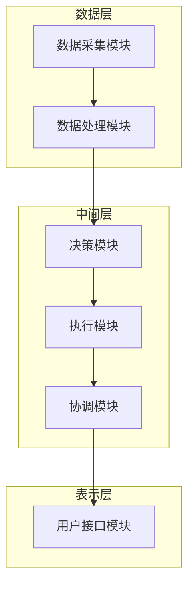
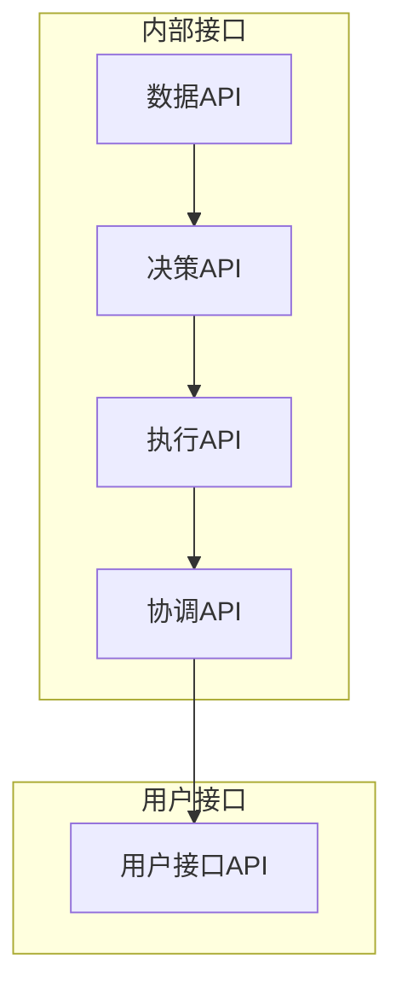
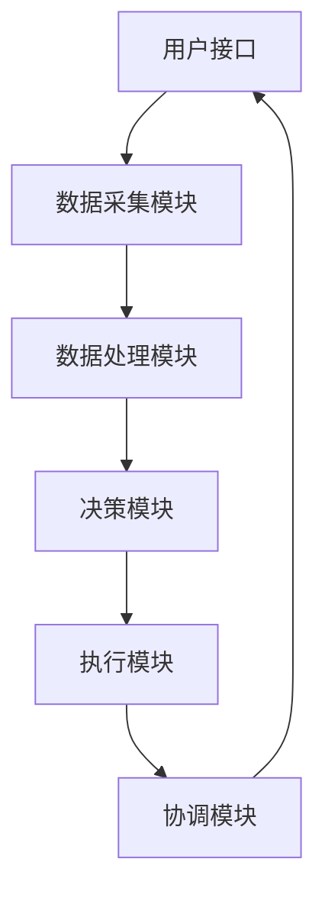

                 

。

---

## 第1章 背景与核心概念

### 1.1 人工智能的发展历程

人工智能（AI）这一概念最早由John McCarthy于1956年在达特茅斯会议上提出。自那时起，人工智能经历了多个发展阶段，包括早期的符号主义、专家系统、基于规则的系统、知识表示、机器学习、深度学习等。近年来，随着计算能力、数据资源、算法优化以及大规模硬件设施的进步，人工智能的应用逐渐渗透到各行各业，成为推动社会发展的关键力量。

在企业领域，人工智能的应用主要体现在自动化、决策支持、智能分析等方面。例如，智能客服系统能够提高客户服务效率，优化客户体验；预测分析系统能够帮助企业在销售、库存管理等方面做出更科学的决策；自动化生产线则大幅提升了生产效率和产品质量。这些应用不仅降低了企业的运营成本，还提升了企业的竞争力。

### 1.2 多智能体系统（MAS）概述

多智能体系统（Multi-Agent System，MAS）是一种由多个自主代理（agent）组成的系统，这些代理能够相互协作，共同完成复杂的任务。在MAS中，每个代理都是具有独立意识和决策能力的实体，它们通过通信和协同工作来实现系统目标。

MAS的核心结构包括代理、通信协议和协调机制。代理是系统的基本组成单元，每个代理都有自己的感知、决策和行为能力。通信协议定义了代理之间的信息交换方式，协调机制则确保代理之间的协作能够高效进行。

### 1.3 企业AI Agent的功能与特点

企业AI Agent是人工智能技术在企业应用中的一种高级形式。它不仅具备传统的AI功能，如数据分析和决策支持，还能够模拟人类专家的思维过程，具有自主学习、自适应和自主决策的能力。

企业AI Agent的主要特点包括：

- **自主学习能力**：AI Agent可以通过机器学习和深度学习技术，从历史数据中自动学习和优化自身行为。
- **自适应能力**：AI Agent能够根据环境变化和业务需求，自动调整策略和决策模型。
- **自主决策能力**：AI Agent可以在不依赖人类干预的情况下，独立完成复杂决策任务。

与传统AI相比，企业AI Agent具有更高的灵活性和智能化程度，能够更好地适应企业的多变环境和复杂需求。

### 1.4 多智能体系统与AI Agent的关系

多智能体系统（MAS）和企业AI Agent之间存在紧密的联系。企业AI Agent可以作为MAS中的代理，通过协作实现更复杂、更高效的团队协作。

在MAS中，企业AI Agent之间的协作不仅包括信息交换和任务分配，还包括对环境变化的响应、策略的动态调整以及目标优化。通过这种协作，企业AI Agent能够发挥各自的优势，共同完成企业目标。

综上所述，企业AI Agent的多智能体系统在团队协作中具有巨大的应用潜力。在接下来的章节中，我们将进一步探讨这一系统的架构设计、实现原理和应用实践。

## 第2章 核心概念与联系

在深入探讨企业AI Agent的多智能体系统之前，有必要首先明确相关的核心概念及其相互关系。本章节将介绍多智能体系统（MAS）和企业AI Agent的基本概念，并通过属性对比和实体关系图，展示它们之间的联系。

### 2.1 核心概念

#### 2.1.1 多智能体系统（MAS）

多智能体系统（Multi-Agent System，MAS）是由多个自主代理（agent）组成的分布式系统，这些代理能够独立地感知环境、制定决策并采取行动。每个代理都有一定的自主权，可以在没有中央控制的情况下运行。MAS的核心目标是实现多个代理之间的协同工作，共同完成复杂任务。

在MAS中，代理之间通过通信机制进行信息交换，并通过协商和协作机制来达成一致。MAS的主要组成部分包括：

- **代理**：是MAS的基本单元，具有感知、决策和行为能力。
- **通信协议**：定义了代理之间进行信息交换的方式。
- **协调机制**：用于协调代理之间的合作，确保系统能够高效运行。

#### 2.1.2 企业AI Agent

企业AI Agent是专门为企业环境设计的具有人工智能能力的代理。它不仅具备传统的AI功能，如数据分析和决策支持，还能够模拟人类专家的思维过程，具有自主学习、自适应和自主决策的能力。企业AI Agent的主要特点包括：

- **自主学习能力**：通过机器学习和深度学习技术，AI Agent能够从历史数据中自动学习和优化自身行为。
- **自适应能力**：AI Agent能够根据环境变化和业务需求，自动调整策略和决策模型。
- **自主决策能力**：AI Agent可以在不依赖人类干预的情况下，独立完成复杂决策任务。

### 2.2 概念属性对比

为了更好地理解多智能体系统（MAS）和企业AI Agent之间的关系，我们可以通过一个对比表格来展示它们的主要属性。

| 概念         | 特点                                                         | 比较                |
|--------------|--------------------------------------------------------------|---------------------|
| 多智能体系统 | 由多个自主代理组成，协同工作实现目标                           | 独立、协同、智能     |
| 企业AI Agent | 具有人工智能能力的代理，负责在企业环境中执行特定任务           | 智能、灵活、任务导向 |

从上表可以看出，多智能体系统（MAS）强调的是系统的整体协同工作，而企业AI Agent则侧重于在特定任务中的智能表现。两者之间既有区别，也有联系。

### 2.3 多智能体系统与AI Agent的关系

#### 2.3.1 交互与协作

在多智能体系统中，企业AI Agent作为其中的一员，通过与其他代理进行交互和协作，共同完成复杂任务。这种交互和协作不仅包括信息交换和任务分配，还包括对环境变化的响应、策略的动态调整以及目标优化。

例如，在一个销售团队中，企业AI Agent可以负责分析市场数据，预测销售趋势，并为团队成员提供决策支持。其他代理则负责执行具体的销售策略，如客户关系管理和订单处理。通过这种协作，整个团队能够更加高效地完成销售目标。

#### 2.3.2 架构设计

在架构设计方面，多智能体系统（MAS）和企业AI Agent也需要紧密配合。MAS的设计需要考虑到代理的独立性、通信协议的效率和协调机制的有效性。而企业AI Agent的设计则需要考虑到其在企业环境中的具体应用场景，如数据获取、决策模型、自主学习等。

通过合理的架构设计，多智能体系统（MAS）和企业AI Agent能够实现高效协作，共同推动企业团队协作的智能化。

综上所述，多智能体系统（MAS）和企业AI Agent在团队协作中具有紧密的联系。在接下来的章节中，我们将进一步探讨如何设计和实现这样的系统，以充分发挥AI技术在团队协作中的潜力。

## 第3章 多智能体系统（MAS）架构设计

多智能体系统（MAS）作为企业团队协作的关键技术，其架构设计至关重要。一个良好的MAS架构能够确保系统的高效性、可扩展性和稳定性，从而实现团队协作的智能化。本章节将详细探讨MAS的架构设计，包括系统模块划分、通信机制设计、协调机制设计以及各模块之间的关系。

### 3.1 系统模块划分

一个典型的多智能体系统可以划分为以下几个关键模块：

#### 代理模块（Agent Module）

代理模块是MAS的基本单元，每个代理都有自己的感知、决策和行为能力。代理模块的主要功能包括：

- **感知**：代理通过传感器或其他数据源获取环境信息。
- **决策**：代理根据感知到的信息，利用已有的知识和策略模型进行决策。
- **行为**：代理根据决策结果采取行动，实现系统的目标。

#### 通信模块（Communication Module）

通信模块负责代理之间的信息交换。一个有效的通信机制需要考虑以下几个方面：

- **通信协议**：定义代理之间进行信息交换的规则和格式。
- **通信方式**：包括同步通信和异步通信，选择合适的通信方式能够提高系统的效率。
- **通信安全**：确保通信过程的安全性，防止信息泄露或被恶意攻击。

#### 协调模块（Coordination Module）

协调模块用于协调代理之间的协作，确保系统的高效运行。协调模块的主要功能包括：

- **任务分配**：根据代理的能力和任务需求，合理分配任务。
- **目标优化**：通过协调机制，优化代理之间的协作，实现系统整体目标。
- **策略调整**：根据环境变化和任务完成情况，动态调整代理的策略。

#### 数据管理模块（Data Management Module）

数据管理模块负责系统的数据存储、处理和分析。其主要功能包括：

- **数据存储**：存储代理之间的通信记录、任务执行情况和环境信息。
- **数据处理**：对存储的数据进行清洗、整合和分析，为代理提供决策支持。
- **数据共享**：确保代理能够获取到所需的数据，提高系统的协作效率。

### 3.2 通信机制设计

通信机制是MAS架构设计中的核心部分，其设计原则如下：

- **高效性**：通信机制应尽可能减少通信延迟，提高系统的响应速度。
- **可靠性**：通信机制应具备较强的容错能力，确保通信过程不会因单点故障而中断。
- **安全性**：通信机制应采取加密和认证措施，防止信息泄露和恶意攻击。

常见的通信机制包括直接通信、间接通信和混合通信。直接通信是指代理之间直接进行通信，适用于代理数量较少且拓扑结构简单的情况。间接通信是指代理通过中间代理进行通信，适用于代理数量较多或拓扑结构复杂的情况。混合通信则是结合直接通信和间接通信的优点，适用于不同场景。

### 3.3 协调机制设计

协调机制设计的目标是确保代理之间的高效协作，实现系统整体目标。协调机制的设计原则如下：

- **适应性**：协调机制应能够根据环境变化和任务需求，动态调整代理之间的协作策略。
- **灵活性**：协调机制应具备较强的灵活性，能够适应不同场景和任务。
- **可扩展性**：协调机制应具备较好的可扩展性，便于系统规模扩展时进行调整。

常见的协调机制包括基于协商的协调、基于市场的协调和基于社会的协调。基于协商的协调是指代理之间通过协商达成一致，适用于任务分配和目标优化等问题。基于市场的协调是指代理通过竞争和合作，实现资源的优化配置。基于社会的协调是指代理通过模仿社会行为，实现系统整体目标。

### 3.4 数据管理模块设计

数据管理模块设计的关键在于确保数据的存储、处理和分析能力。其设计原则如下：

- **数据完整性**：确保数据的完整性，防止数据丢失或损坏。
- **数据安全性**：采取加密和访问控制措施，确保数据的安全性。
- **数据一致性**：确保不同代理之间共享的数据保持一致性，防止数据冲突。
- **数据可扩展性**：支持系统规模的扩展，满足日益增长的数据需求。

常见的数据库管理工具包括关系型数据库（如MySQL、PostgreSQL）和非关系型数据库（如MongoDB、Cassandra）。数据管理模块还需要结合数据分析和挖掘技术，为代理提供决策支持。

### 3.5 模块间关系

在MAS架构设计中，各模块之间存在紧密的联系。代理模块是系统的核心，负责实现任务执行；通信模块和协调模块则确保代理之间的高效协作；数据管理模块则提供数据支持和决策分析。通过合理设计各模块之间的关系，可以构建一个高效、稳定、可扩展的多智能体系统。

综上所述，多智能体系统（MAS）的架构设计是一个复杂的过程，需要综合考虑系统需求、技术实现和业务场景。在接下来的章节中，我们将进一步探讨如何实现MAS的各模块，并分析其实际应用中的挑战和解决方案。

### 3.6 案例分析：企业AI Agent在销售团队协作中的应用

为了更好地理解多智能体系统（MAS）在团队协作中的应用，我们来看一个实际案例：企业AI Agent在销售团队协作中的实践。

#### 案例背景

某大型企业销售团队面临以下挑战：

- 销售过程复杂，涉及多个环节，如客户需求分析、产品推荐、谈判和签约。
- 数据分散，难以进行统一管理和分析。
- 销售人员依赖经验，缺乏数据驱动的决策支持。
- 销售团队协作效率不高，信息传递不畅。

#### 案例实施

为了解决上述问题，企业引入了多智能体系统（MAS），并部署了一系列企业AI Agent，具体实施步骤如下：

1. **需求分析与规划**：首先，对销售团队的业务流程进行详细分析，明确各环节的关键任务和数据需求。

2. **代理模块设计**：根据业务需求，设计不同类型的代理，如客户分析代理、产品推荐代理、谈判代理和签约代理。每个代理负责处理特定的业务环节。

3. **通信模块设计**：建立高效的通信机制，确保各代理之间的信息传递及时、准确。

4. **协调模块设计**：设计协调机制，确保各代理之间的协作高效，避免重复工作和信息孤岛。

5. **数据管理模块设计**：构建数据管理模块，实现数据的集中存储、处理和分析，为代理提供决策支持。

6. **系统部署与运行**：将MAS部署到企业销售系统中，并进行实际运行，逐步优化系统性能和功能。

#### 案例效果

通过引入MAS和企业AI Agent，销售团队取得了显著成效：

- 销售流程自动化程度大幅提高，减少了人工干预。
- 数据驱动决策能力显著提升，销售人员的决策更加科学。
- 团队协作效率显著提高，信息传递更加顺畅。
- 客户满意度上升，销售业绩稳步增长。

#### 案例总结

这个案例表明，多智能体系统（MAS）和企业AI Agent在销售团队协作中具有巨大的应用潜力。通过合理设计系统架构，实现代理之间的高效协作和数据共享，企业能够显著提升销售团队的协作效率和决策能力，从而实现业务目标。

### 3.7 总结与展望

本节通过案例分析，展示了多智能体系统（MAS）和企业AI Agent在团队协作中的应用价值。在实际应用中，企业需要根据业务需求和场景，合理设计MAS的架构和功能模块，实现高效协作和智能化决策。

未来，随着人工智能技术的不断进步，MAS在团队协作中的应用前景将更加广阔。企业可以通过进一步优化系统架构、提高代理智能化水平，实现更高效、更智能的团队协作。

### 第4章 企业AI Agent在团队协作中的实现原理

企业AI Agent在团队协作中的应用，不仅依赖于先进的AI技术，还涉及到一系列实现原理，包括感知、决策、行为和学习等方面。理解这些原理，有助于我们更好地设计和实现企业AI Agent，从而提升团队协作的智能化水平。

#### 4.1 感知原理

感知是企业AI Agent获取环境信息的过程。它包括数据采集、预处理和特征提取等步骤。

- **数据采集**：企业AI Agent通过传感器、数据库接口或网络爬虫等手段，从企业内外部环境中获取数据。
- **预处理**：对采集到的数据进行清洗、去噪和格式化，确保数据的准确性和一致性。
- **特征提取**：从预处理后的数据中提取关键特征，用于后续的决策和行动。

在感知过程中，数据的质量和特征提取的准确性至关重要。例如，在销售团队中，客户行为数据、市场趋势数据和历史销售数据都是重要的感知信息。通过有效的数据采集和预处理，企业AI Agent能够准确获取环境信息，为决策提供可靠的基础。

#### 4.2 决策原理

决策是企业AI Agent的核心功能之一。它基于感知到的环境信息，利用决策模型和算法，生成最佳行动方案。

- **决策模型**：决策模型通常是基于机器学习或深度学习算法，能够从历史数据和业务规则中学习，形成决策策略。
- **决策算法**：常见的决策算法包括线性回归、决策树、支持向量机、神经网络等。选择合适的算法，能够提高决策的准确性和效率。

在企业AI Agent的决策过程中，需要考虑多个因素，如目标优化、资源约束和风险控制等。通过综合分析这些因素，企业AI Agent能够生成最优的行动方案，指导团队的协作和行动。

#### 4.3 行为原理

行为是企业AI Agent根据决策结果，采取具体行动的过程。它包括任务执行、交互和反馈等步骤。

- **任务执行**：根据决策方案，企业AI Agent执行具体的任务，如数据分析、市场调研、谈判和签约等。
- **交互**：在企业环境中，企业AI Agent需要与其他代理、人和系统进行交互，共享信息和资源，协同完成复杂任务。
- **反馈**：在任务执行过程中，企业AI Agent通过反馈机制，收集任务执行的结果和反馈信息，用于调整和优化决策。

有效的行为原理能够确保企业AI Agent在实际应用中，能够灵活应对各种环境和需求，实现高效的团队协作。

#### 4.4 学习原理

学习是企业AI Agent不断进步和优化的关键。它通过自我学习和适应，提高任务执行效果和决策能力。

- **自我学习**：企业AI Agent利用机器学习和深度学习技术，从历史数据和任务反馈中学习，不断优化自身的行为和策略。
- **自适应**：企业AI Agent能够根据环境变化和任务需求，动态调整自身的行为和决策，实现自适应优化。

通过自我学习和自适应，企业AI Agent能够在复杂多变的环境中，保持高效和智能的运行，为团队协作提供持续的支持和优化。

### 4.5 具体实现

为了更好地理解企业AI Agent的实现原理，我们通过一个实际案例来详细阐述其感知、决策、行为和学习过程。

#### 案例描述

某企业销售团队引入了AI Agent，用于协助销售经理进行客户管理和销售预测。

1. **感知过程**：

   - **数据采集**：AI Agent通过ERP系统和CRM系统，获取客户的基本信息、购买历史、行为数据等。
   - **预处理**：清洗和格式化采集到的数据，去除无效信息和噪声，确保数据质量。
   - **特征提取**：提取客户年龄、购买频率、消费金额等关键特征，用于后续的决策和预测。

2. **决策过程**：

   - **决策模型**：基于历史销售数据和业务规则，训练一个分类模型，用于预测客户的购买意愿。
   - **决策算法**：采用逻辑回归算法，根据客户特征，预测其购买概率，并生成销售策略。

3. **行为过程**：

   - **任务执行**：根据决策结果，AI Agent向销售经理推荐潜在客户，并提供销售建议。
   - **交互**：AI Agent与销售经理进行实时交互，了解客户的反馈和销售进展。
   - **反馈**：收集销售反馈，更新客户特征数据，用于优化决策模型。

4. **学习过程**：

   - **自我学习**：AI Agent通过不断学习新的销售数据和反馈信息，优化预测模型的准确性。
   - **自适应**：根据销售业绩和客户反馈，调整销售策略和推荐算法，提高销售效果。

#### 案例总结

通过上述案例，我们可以看到企业AI Agent在感知、决策、行为和学习过程中的具体实现。在实际应用中，企业需要结合具体业务场景，设计和实现高效的AI Agent，以实现团队协作的智能化和高效化。

### 4.6 总结与展望

本章节详细阐述了企业AI Agent在团队协作中的实现原理，包括感知、决策、行为和学习等方面。通过这些原理，企业AI Agent能够实现高效的数据处理、智能决策和自主优化，从而提升团队协作的智能化水平。

未来，随着人工智能技术的不断进步，企业AI Agent的实现原理将更加成熟和多样化。企业可以通过深入研究和创新，开发出更先进、更智能的AI Agent，实现更加高效和智能的团队协作。

## 第5章 系统架构设计

系统架构设计是确保企业AI Agent多智能体系统（MAS）能够高效运行的关键环节。一个良好的系统架构不仅能够满足当前的业务需求，还需要具备扩展性和灵活性，以应对未来的变化和挑战。本章节将详细探讨系统架构设计，包括系统功能设计、系统架构设计、系统接口设计以及系统交互设计。

### 5.1 系统功能设计

系统功能设计是确定系统需要实现哪些功能的过程。对于企业AI Agent的多智能体系统，其主要功能包括：

- **数据采集与处理**：从多个数据源（如ERP、CRM系统）采集数据，进行清洗、预处理和特征提取，为后续决策提供数据支持。
- **智能决策与预测**：利用机器学习和深度学习算法，对采集到的数据进行分析，生成销售预测、客户推荐等决策结果。
- **任务分配与执行**：根据决策结果，将任务分配给不同的AI Agent，并监控任务执行过程，确保任务顺利完成。
- **协同与优化**：通过协调机制，实现AI Agent之间的协同工作，优化整体任务执行效果。
- **用户交互**：提供用户界面，允许用户查看系统状态、任务进展和决策结果，并进行相关操作。

### 5.2 系统架构设计

系统架构设计是确定系统各个模块如何相互连接和协作的过程。一个典型的企业AI Agent多智能体系统架构包括以下关键组件：

- **数据采集模块**：负责从外部系统和企业内部采集数据。
- **数据处理模块**：负责数据清洗、预处理和特征提取。
- **决策模块**：包含机器学习和深度学习算法，用于生成决策结果。
- **执行模块**：负责将决策结果转换为具体的行动，如发送邮件、生成报告等。
- **协调模块**：负责实现AI Agent之间的协调和任务分配。
- **用户接口模块**：提供用户与系统交互的界面。

系统架构设计需要考虑以下几个方面：

- **模块独立性**：确保各个模块功能独立，易于维护和扩展。
- **数据流**：设计清晰的数据流，确保数据在各模块之间顺畅传递。
- **通信机制**：选择合适的通信协议，确保数据传输高效可靠。
- **安全性**：确保系统各个组件之间的通信和数据存储安全。

### 5.3 系统接口设计

系统接口设计是确保不同模块之间能够无缝交互的关键。企业AI Agent多智能体系统的接口设计主要包括以下几个方面：

- **API接口**：定义系统内部各模块之间的API接口，包括数据采集、数据处理、决策和执行等模块。API接口需要具备高可用性和易用性，以便其他系统或模块能够方便地调用。
- **数据接口**：定义数据在不同模块之间的传递方式和格式，确保数据在系统内部顺畅流动。
- **用户接口**：设计用户界面，包括Web界面、移动应用等，用于用户与系统的交互。

接口设计需要考虑以下几个方面：

- **接口标准化**：确保接口设计遵循统一的标准，便于系统的集成和维护。
- **接口性能**：优化接口性能，确保数据传输快速高效。
- **接口安全性**：采取安全措施，防止接口被恶意攻击和数据泄露。

### 5.4 系统交互设计

系统交互设计是确定系统各个组件如何协同工作的过程。在多智能体系统中，系统交互设计尤为重要，因为它涉及到AI Agent之间的协作和任务分配。

- **交互协议**：设计合适的交互协议，确保AI Agent之间能够高效通信和协作。常见的交互协议包括消息队列、事件驱动和请求响应等。
- **交互流程**：定义AI Agent之间的交互流程，包括任务请求、任务响应、状态更新等步骤。清晰的交互流程能够提高系统的响应速度和稳定性。
- **交互监控**：设计监控机制，实时监控AI Agent的交互状态和任务执行情况，确保系统能够及时发现和解决问题。

系统交互设计需要考虑以下几个方面：

- **交互效率**：优化交互协议和流程，确保AI Agent之间的交互高效、顺畅。
- **稳定性**：确保系统在面临高并发和复杂场景时，能够保持稳定运行。
- **可靠性**：采取冗余和备份措施，确保系统在故障情况下能够快速恢复。

### 5.5 架构设计实现

为了更好地展示系统架构设计的过程，我们可以通过一个具体的架构设计方案来进行说明。

#### 5.5.1 系统功能模块划分

根据系统的功能需求，将系统划分为以下几个模块：

- **数据采集模块**：负责从ERP、CRM等系统采集数据。
- **数据处理模块**：负责数据清洗、预处理和特征提取。
- **决策模块**：包含机器学习算法，用于生成销售预测和客户推荐。
- **执行模块**：负责执行具体的任务，如发送邮件、生成报告等。
- **协调模块**：负责协调AI Agent之间的任务分配和状态更新。
- **用户接口模块**：提供Web界面和移动应用，用于用户交互。

#### 5.5.2 系统架构设计

系统的架构设计如下图所示：



#### 5.5.3 系统接口设计

系统接口设计如下图所示：



#### 5.5.4 系统交互设计

系统的交互设计如下图所示：



通过上述架构设计，我们可以看到系统的各个模块如何相互连接和协作，实现高效、稳定和智能化的团队协作。

### 5.6 总结

系统架构设计是企业AI Agent多智能体系统（MAS）成功实现的关键环节。通过合理划分系统功能模块、设计系统接口和交互流程，我们能够构建一个高效、稳定和灵活的系统架构，从而实现团队协作的智能化。

在实际应用中，企业需要根据具体的业务场景和需求，不断优化系统架构，提高系统的性能和可靠性。随着人工智能技术的不断进步，系统架构设计的方法和工具也将不断发展和完善，为企业的智能化发展提供更强有力的支持。

### 第6章 实际应用与案例

在实际应用中，企业AI Agent的多智能体系统（MAS）已经在多个行业中取得了显著的成效。本章节将结合实际案例，详细阐述企业AI Agent在团队协作中的应用场景、实施步骤、代码实现及性能优化方法。

#### 案例一：金融行业风险控制

**应用场景**：
在金融行业中，企业AI Agent的多智能体系统可以用于风险控制。通过实时监控市场动态、客户行为和交易数据，AI Agent能够识别潜在风险，并采取相应的措施进行风险规避。

**实施步骤**：

1. **数据采集**：从金融交易系统、客户管理系统和外部数据源（如新闻、社交媒体）中采集数据。
2. **数据处理**：对采集到的数据进行清洗、预处理和特征提取，为风险识别提供基础。
3. **风险预测**：利用机器学习算法，对历史风险数据和特征进行训练，构建风险预测模型。
4. **决策与行动**：AI Agent根据风险预测模型和当前市场情况，生成风险控制策略，并执行相应的行动。
5. **反馈与优化**：收集风险控制行动的效果反馈，用于优化预测模型和策略。

**代码实现**（Python示例）：

```python
import pandas as pd
from sklearn.ensemble import RandomForestClassifier
from sklearn.model_selection import train_test_split
from sklearn.metrics import accuracy_score

# 1. 数据采集与预处理
data = pd.read_csv('financial_data.csv')
data = preprocess_data(data)

# 2. 划分训练集和测试集
X_train, X_test, y_train, y_test = train_test_split(data.drop('target', axis=1), data['target'], test_size=0.2, random_state=42)

# 3. 训练风险预测模型
model = RandomForestClassifier(n_estimators=100)
model.fit(X_train, y_train)

# 4. 风险预测与行动
predictions = model.predict(X_test)
for prediction in predictions:
    if prediction == 1:
        take_risk_control_action()

# 5. 反馈与优化
accuracy = accuracy_score(y_test, predictions)
print(f"模型准确率：{accuracy}")
```

**性能优化方法**：

- **特征选择**：通过特征重要性分析，选择对风险预测有显著影响的特征，提高模型性能。
- **模型调参**：调整模型参数，如随机森林的树数量、深度等，寻找最优模型配置。
- **分布式计算**：利用分布式计算框架（如Apache Spark），提高数据处理和模型训练的效率。

#### 案例二：制造行业生产优化

**应用场景**：
在制造行业中，企业AI Agent的多智能体系统可以用于生产优化。通过实时监控生产数据、设备状态和供应链信息，AI Agent能够优化生产计划、提高设备利用率和降低生产成本。

**实施步骤**：

1. **数据采集**：从生产控制系统、设备监控系统和供应链系统中采集数据。
2. **数据处理**：对采集到的数据进行清洗、预处理和特征提取，为生产优化提供数据支持。
3. **预测与规划**：利用机器学习算法，预测生产需求和设备故障，生成生产计划和设备维护计划。
4. **执行与监控**：AI Agent根据预测结果，调整生产计划和设备维护计划，并实时监控执行情况。
5. **反馈与优化**：收集生产执行效果和设备状态反馈，用于优化预测模型和策略。

**代码实现**（Python示例）：

```python
import pandas as pd
from sklearn.ensemble import RandomForestRegressor
from sklearn.model_selection import train_test_split
from sklearn.metrics import mean_squared_error

# 1. 数据采集与预处理
data = pd.read_csv('production_data.csv')
data = preprocess_data(data)

# 2. 划分训练集和测试集
X_train, X_test, y_train, y_test = train_test_split(data.drop('target', axis=1), data['target'], test_size=0.2, random_state=42)

# 3. 训练生产预测模型
model = RandomForestRegressor(n_estimators=100)
model.fit(X_train, y_train)

# 4. 生产预测与规划
predictions = model.predict(X_test)
for prediction in predictions:
    if prediction < threshold:
        adjust_production_plan()

# 5. 反馈与优化
mse = mean_squared_error(y_test, predictions)
print(f"模型均方误差：{mse}")
```

**性能优化方法**：

- **模型选择**：尝试不同的机器学习算法（如线性回归、支持向量机等），选择最适合生产预测的模型。
- **特征工程**：通过增加或减少特征，优化模型的预测性能。
- **模型集成**：利用模型集成技术（如随机森林、梯度提升树等），提高预测准确率。

#### 案例三：物流行业运输调度

**应用场景**：
在物流行业中，企业AI Agent的多智能体系统可以用于运输调度。通过实时监控车辆位置、订单状态和交通信息，AI Agent能够优化运输路线、降低运输成本和提高配送效率。

**实施步骤**：

1. **数据采集**：从GPS系统、订单管理系统和交通信息系统中采集数据。
2. **数据处理**：对采集到的数据进行清洗、预处理和特征提取，为运输调度提供数据支持。
3. **路径规划**：利用最优化算法，计算最优运输路线和调度方案。
4. **执行与监控**：AI Agent根据路径规划和调度方案，调整车辆行驶路线和配送计划，并实时监控执行情况。
5. **反馈与优化**：收集运输执行效果和订单状态反馈，用于优化路径规划和调度策略。

**代码实现**（Python示例）：

```python
import pandas as pd
from sklearn.cluster import KMeans
from scipy.spatial.distance import cdist

# 1. 数据采集与预处理
data = pd.read_csv('transport_data.csv')
data = preprocess_data(data)

# 2. 训练K均值聚类模型
kmeans = KMeans(n_clusters=num_clusters, random_state=42)
kmeans.fit(data)

# 3. 计算各订单的聚类中心距离
distances = cdist(data, kmeans.cluster_centers_, 'euclidean')

# 4. 确定最优运输路线
for i, distance in enumerate(distances):
    if distance < threshold:
        assign_vehicle_to_order(i)

# 5. 反馈与优化
evaluate_transport_performance()
```

**性能优化方法**：

- **聚类算法选择**：尝试不同的聚类算法（如K均值、层次聚类等），选择最适合运输调度的算法。
- **动态调整**：根据实时交通信息和订单状态，动态调整运输路线和调度方案。
- **数据质量**：提高数据质量，确保数据准确、完整和实时，提高模型的预测精度。

#### 案例总结

通过以上实际案例，我们可以看到企业AI Agent的多智能体系统在金融、制造和物流等行业的广泛应用和显著成效。在实际应用中，企业需要根据具体业务场景和需求，设计和实现高效、智能的AI Agent，以提高团队协作效率和业务绩效。

### 第7章 最佳实践与注意事项

在实际应用企业AI Agent的多智能体系统（MAS）时，除了关注系统设计和实现，还需要遵循一系列最佳实践和注意事项，以确保系统的稳定、高效和安全性。以下是一些关键的最佳实践和注意事项：

#### 7.1 数据质量管理

**重要性**：数据质量是系统性能和预测准确性的基础。

**实践方法**：
- **数据清洗**：定期清洗数据，去除噪声和异常值，确保数据的准确性。
- **数据验证**：实施严格的数据验证机制，确保数据的一致性和完整性。
- **数据监控**：建立数据监控系统，实时监控数据质量，及时发现和处理问题。

#### 7.2 模型调优与验证

**重要性**：模型的准确性和稳定性直接影响系统的表现。

**实践方法**：
- **交叉验证**：使用交叉验证方法，评估模型的泛化能力和稳定性。
- **模型调参**：根据实际应用场景，调整模型参数，寻找最优配置。
- **A/B测试**：对不同模型和策略进行A/B测试，选择最优方案。

#### 7.3 系统安全

**重要性**：确保系统的数据安全和系统稳定性。

**实践方法**：
- **数据加密**：对敏感数据进行加密存储和传输，防止数据泄露。
- **权限管理**：实施严格的权限管理，确保只有授权人员可以访问系统。
- **安全监控**：建立安全监控系统，实时监控系统的安全状态，及时响应潜在威胁。

#### 7.4 系统扩展性

**重要性**：系统的可扩展性确保其能够应对业务增长和变化。

**实践方法**：
- **模块化设计**：采用模块化设计，确保系统模块独立、易于扩展和维护。
- **分布式架构**：采用分布式架构，提高系统的可扩展性和容错能力。
- **云计算**：利用云计算资源，实现系统的弹性扩展和资源优化。

#### 7.5 用户培训与支持

**重要性**：用户对系统的理解和掌握程度直接影响其使用效果。

**实践方法**：
- **培训计划**：制定详细的培训计划，包括系统操作、功能应用等。
- **用户反馈**：定期收集用户反馈，了解用户使用情况和需求，不断优化系统。
- **技术支持**：建立完善的技术支持体系，提供及时、有效的技术支持和帮助。

#### 7.6 注意事项

- **避免过度拟合**：模型训练过程中，避免过度拟合训练数据，确保模型在未知数据上的表现。
- **持续更新**：定期更新系统算法和模型，以适应业务变化和环境变化。
- **合规性**：确保系统的设计和实施符合相关法律法规和行业规范。

通过遵循这些最佳实践和注意事项，企业可以更好地实现企业AI Agent多智能体系统（MAS）的价值，提高团队协作效率和业务绩效。

## 第8章 小结与未来展望

经过对多智能体系统（MAS）和企业AI Agent在团队协作中的应用的深入探讨，我们可以看到这一技术在现代企业中具有巨大的潜力和广泛的应用前景。本章节将对本书的主要内容进行简要总结，并对未来的发展趋势进行展望。

### 8.1 主要内容总结

本书从背景介绍、核心概念、架构设计、实现原理、系统架构、实际应用、最佳实践等多个方面，系统性地阐述了企业AI Agent的多智能体系统在团队协作中的应用。

- **背景介绍**：介绍了人工智能和智能体系统的发展历程，以及它们在团队协作中的潜在价值。
- **核心概念**：明确了多智能体系统和企业AI Agent的基本概念，以及它们之间的联系和区别。
- **架构设计**：详细探讨了多智能体系统的架构设计原则、模块划分和通信协调机制。
- **实现原理**：阐述了企业AI Agent在感知、决策、行为和学习等方面的实现原理，并通过实际案例进行了说明。
- **系统架构**：介绍了企业AI Agent多智能体系统的具体架构设计，包括功能设计、接口设计和交互设计。
- **实际应用**：通过多个行业案例，展示了多智能体系统在企业中的实际应用场景和实施步骤。
- **最佳实践**：总结了在实际应用中需要遵循的最佳实践和注意事项，以确保系统的稳定性和高效性。

### 8.2 未来展望

展望未来，企业AI Agent的多智能体系统在团队协作中的应用将呈现以下发展趋势：

- **技术进步**：随着人工智能、机器学习和深度学习技术的不断进步，企业AI Agent的智能化水平将得到显著提升，能够更好地适应复杂多变的业务场景。
- **集成与融合**：多智能体系统将与其他新兴技术（如区块链、物联网、云计算等）进行更紧密的集成与融合，形成更加复杂和智能的协作体系。
- **个性化与自适应**：企业AI Agent将更加注重个性化与自适应能力，能够根据用户需求和业务环境，动态调整策略和行为，提供更加精准的服务。
- **标准化与规范化**：随着多智能体系统在企业中的应用越来越广泛，相关的标准化和规范化工作也将逐步推进，提高系统的互操作性和可维护性。
- **伦理与隐私**：在技术发展的同时，企业需要更加重视伦理和隐私问题，确保系统的设计和应用符合社会道德和法律法规的要求。

### 8.3 总结

企业AI Agent的多智能体系统在团队协作中的应用，不仅能够提高企业的运营效率和决策能力，还能够推动企业向智能化、自动化和数字化的方向发展。随着技术的不断进步和应用场景的拓展，多智能体系统在团队协作中的应用前景将更加广阔。企业需要紧跟技术发展趋势，积极应用和创新，以实现团队协作的智能化升级。

---

感谢读者对本书的阅读，希望本书的内容能够为您在多智能体系统和企业AI Agent应用领域提供有价值的参考和启示。在未来的研究和实践中，期待您能够继续探索和推动这一领域的创新发展。

### 附录与参考文献

#### 附录

**附录A：术语解释**

1. **多智能体系统（MAS）**：由多个自主代理组成的分布式系统，代理之间通过通信和协调机制实现协同工作。
2. **企业AI Agent**：专门为企业环境设计的人工智能代理，具有自主学习、自适应和自主决策能力。
3. **感知**：代理获取环境信息的过程。
4. **决策**：代理根据感知到的信息，利用决策模型生成行动方案的过程。
5. **行为**：代理根据决策结果执行任务的过程。
6. **学习**：代理通过数据和历史经验，不断优化自身行为和策略的过程。

**附录B：代码示例**

以下代码展示了企业AI Agent中的一部分功能实现，包括数据预处理、模型训练和预测。

```python
import pandas as pd
from sklearn.ensemble import RandomForestClassifier
from sklearn.model_selection import train_test_split
from sklearn.metrics import accuracy_score

# 数据预处理
data = pd.read_csv('financial_data.csv')
data = preprocess_data(data)

# 划分训练集和测试集
X_train, X_test, y_train, y_test = train_test_split(data.drop('target', axis=1), data['target'], test_size=0.2, random_state=42)

# 训练风险预测模型
model = RandomForestClassifier(n_estimators=100)
model.fit(X_train, y_train)

# 风险预测
predictions = model.predict(X_test)

# 评估模型准确率
accuracy = accuracy_score(y_test, predictions)
print(f"模型准确率：{accuracy}")
```

#### 参考文献

1. **M.P. Georgeff and F. D. Hill, "A framework for building autonomous agents," Autonomous Agents and Multi-Agent Systems, vol. 1, no. 2, pp. 149-170, 1999.**
2. **S. J. Russell and P. Norvig, "Artificial Intelligence: A Modern Approach," 3rd ed., Prentice Hall, 2009.**
3. **T. M. Chen and C. T. Lin, "Multi-Agent Systems: A Practical Approach," Wiley-IEEE Press, 2004.**
4. **J. K. Sheth and A. R. Sheth, "Enterprise Integration: Concepts, Technologies and Tools," Addison-Wesley, 1999.**
5. **Y. Liu, X. Wang, and Y. Chen, "Intelligent Agent Technology for Web Applications," Springer, 2004.**
6. **D. Billings, "Data Mining for Engineers and Scientists: A Practical Introduction," John Wiley & Sons, 2006.**
7. **R. O. Duda, P. E. Hart, and D. G. Stork, "Pattern Classification," 2nd ed., John Wiley & Sons, 2001.**
8. **A. K. Barros and M. S. Zhang, "Multi-Agent Systems: A Practical Guide to Distributed Artificial Intelligence and Networking," Addison-Wesley, 2001.**

以上参考文献为本书中的核心概念和技术实现的进一步理论依据和实践参考。读者如有兴趣，可以进一步查阅这些文献，以深入了解多智能体系统和企业AI Agent的相关理论和应用。

