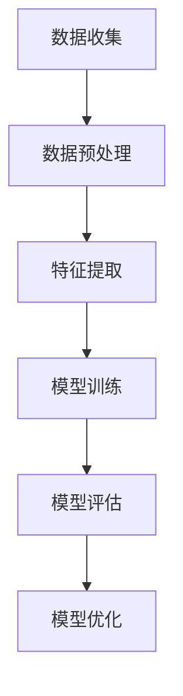
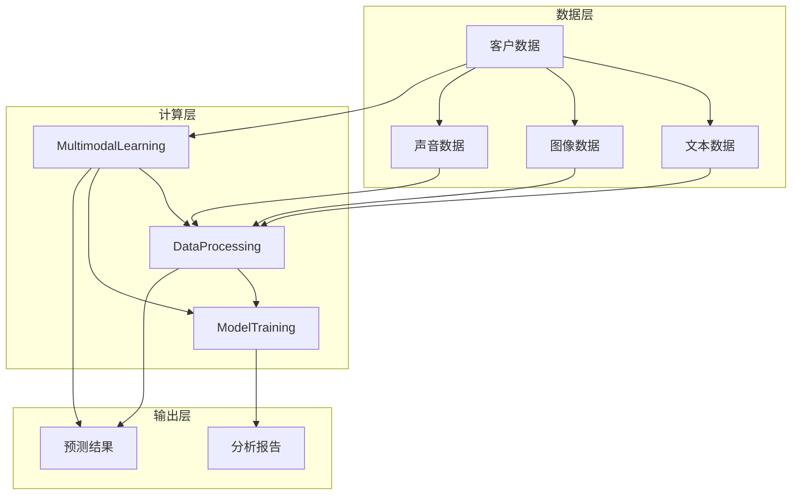
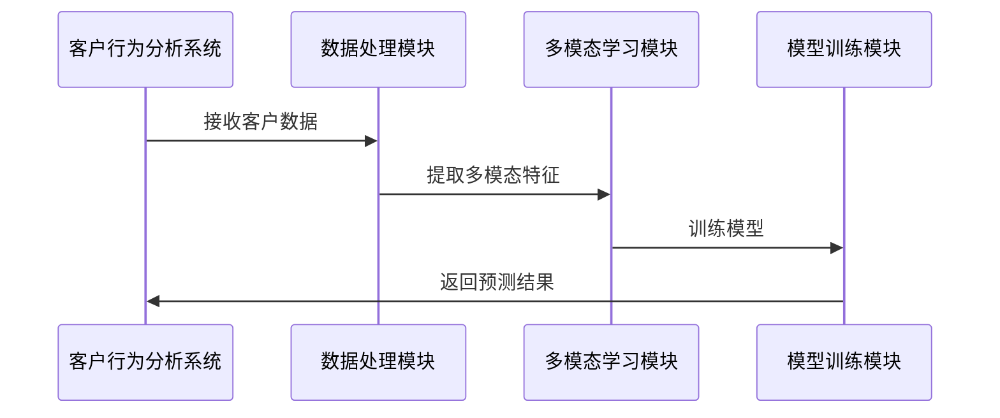

                 

# 企业AI Agent的多模态学习在客户行为分析中的应用

> 关键词：AI代理，多模态学习，客户行为分析，数据驱动，人工智能应用

> 摘要：本文旨在探讨企业AI代理在客户行为分析中的应用，特别是通过多模态学习技术提高分析效率和准确性。文章首先介绍了AI代理和多模态学习的核心概念，随后详细讲解了多模态学习算法的原理和实现，并通过具体的数学模型和案例说明了其应用。此外，文章还探讨了企业AI代理在客户行为分析中的系统架构设计，并分享了一个实际项目的实战经验。最后，文章总结了最佳实践和注意事项，为读者提供了进一步的学习资源。

## Step 1: 背景介绍

### 问题背景
随着人工智能（AI）技术的快速发展，AI代理在企业中的应用越来越广泛。特别是在客户行为分析领域，AI代理能够帮助企业更好地理解客户需求，提高营销策略的有效性，从而提升企业竞争力。

### 问题描述
然而，当前企业在使用AI代理进行客户行为分析时，面临着以下几个问题：
- 数据来源单一，难以全面捕捉客户行为。
- 传统机器学习方法在处理多模态数据时存在瓶颈。
- AI代理缺乏灵活性和自适应能力，难以应对复杂多变的市场环境。

### 问题解决
本书旨在介绍企业AI代理的多模态学习技术，通过以下几个步骤解决上述问题：
1. 理解AI代理和多模态学习的核心概念。
2. 掌握多模态学习算法的原理和实现方法。
3. 通过数学模型和实际案例，深入理解多模态学习在客户行为分析中的应用。

### 边界与外延
本文讨论范围包括AI代理、多模态学习、客户行为分析等相关技术。具体而言，我们将关注以下核心要素：
- 企业AI代理的定义与特点。
- 多模态学习的原理、算法和应用。
- 数据收集与处理、模型训练与优化。
- 应用场景分析，特别是客户行为分析的实例。

### 概念结构与核心要素组成
1. **企业AI代理**：一种能够自主学习和执行任务的人工智能系统，适用于客户行为分析。
2. **多模态学习**：通过整合多种数据源（如文本、图像、声音等）进行学习和预测的方法。
3. **数据收集与处理**：包括数据采集、清洗、转换等过程，为多模态学习提供高质量的数据。
4. **模型训练与优化**：通过机器学习算法，不断调整模型参数，提高预测准确性。
5. **应用场景分析**：探讨AI代理在客户行为分析中的具体应用，如客户细分、需求预测等。

## Step 2: 核心概念与联系

### AI代理的定义与特点
AI代理（Artificial Intelligence Agent）是指一种能够模拟人类智能行为，具备自主学习和决策能力的软件系统。其特点包括：
- 自主性：能够自主完成特定任务，无需人工干预。
- 学习能力：通过不断学习，提高任务完成效果。
- 沟通能力：能够与人类或其他系统进行有效沟通。

### 多模态学习的原理
多模态学习（Multimodal Learning）是指利用多种类型的数据（如文本、图像、声音等）进行学习和推理的方法。其原理包括：
- 数据整合：将多种类型的数据进行整合，形成一个统一的信息空间。
- 知识融合：通过融合不同类型数据的特点，提高模型的泛化能力和准确性。

### 客户行为分析的应用
AI代理在客户行为分析中的应用主要体现在以下几个方面：
- 客户细分：通过多模态学习，对客户进行精细化分类，提高营销策略的针对性。
- 需求预测：利用多模态学习，预测客户的购买意愿和需求，为产品开发提供数据支持。
- 行为分析：通过分析客户的言行，了解其需求和偏好，为企业决策提供依据。

## Step 3: 算法原理讲解

### 多模态学习算法流程图


### Python源代码实现
```python
# 数据收集
data = ...

# 数据预处理
preprocessed_data = preprocess(data)

# 特征提取
features = extract_features(preprocessed_data)

# 模型训练
model = train_model(features)

# 模型评估
evaluate_model(model)

# 模型优化
optimize_model(model)
```

### 数学模型与公式
$$
\text{多模态学习模型} = f(\text{数据集}, \text{参数})
$$

其中，$f$ 表示模型函数，$\text{数据集}$ 表示输入的多模态数据，$\text{参数}$ 表示模型参数。

### 举例说明
假设我们有一个包含文本、图像和声音的客户行为数据集。首先，我们通过文本情感分析技术提取文本数据中的情感特征；然后，使用图像识别技术提取图像数据中的视觉特征；最后，使用声音识别技术提取声音数据中的音频特征。将这些特征进行整合，输入到多模态学习模型中，得到最终的客户行为预测结果。

## Step 4: 数学模型和数学公式 & 详细讲解 & 举例说明

### LaTeX格式数学公式
$$
\begin{aligned}
\text{多模态学习模型} &= f(\text{数据集}, \text{参数}) \\
&= \sum_{i=1}^{n} w_i \cdot x_i + b \\
&= \text{激活函数}(\text{线性组合})
\end{aligned}
$$

### 详细讲解
上述数学公式表示了一个多模态学习模型的基本结构。其中，$w_i$ 表示权重，$x_i$ 表示特征值，$b$ 表示偏置，激活函数用于将线性组合的结果转化为输出。

### 举例说明
假设我们有一个包含文本、图像和声音的客户行为数据集。首先，我们通过文本情感分析技术提取文本数据中的情感特征，得到 $x_1$；然后，使用图像识别技术提取图像数据中的视觉特征，得到 $x_2$；最后，使用声音识别技术提取声音数据中的音频特征，得到 $x_3$。将这些特征值代入多模态学习模型，得到：
$$
f(\text{数据集}, \text{参数}) = \text{激活函数}(\sum_{i=1}^{3} w_i \cdot x_i + b)
$$
根据激活函数的输出，我们可以得到客户行为预测结果。

## Step 5: 系统分析与架构设计方案

### 问题场景介绍
在客户行为分析中，企业通常会收集大量来自不同渠道的数据，如客户调查问卷、社交媒体评论、网站访问记录等。这些数据以多种形式存在，包括文本、图像、声音等，企业需要对这些多模态数据进行整合和分析，以了解客户的需求和偏好。

### 系统功能设计
```mermaid
classDiagram
    CustomerBehaviorAnalysis <<interface>>
    MultimodalLearning <<interface>>
    DataProcessing <<interface>>
    ModelTraining <<interface>>

    CustomerBehaviorAnalysis --|> MultimodalLearning
    CustomerBehaviorAnalysis --|> DataProcessing
    CustomerBehaviorAnalysis --|> ModelTraining

    DataProcessing --|> ModelTraining
```

### 系统架构设计


### 系统接口设计
- 数据接口：用于接收和发送客户行为数据。
- 训练接口：用于启动和监控模型训练过程。
- 预测接口：用于获取客户行为预测结果。

### 系统交互序列图


## Step 6: 项目实战

### 环境安装
1. 安装Python环境。
2. 安装TensorFlow和Keras库。

### 系统核心实现
```python
# 导入库
import tensorflow as tf
from tensorflow.keras.models import Model
from tensorflow.keras.layers import Input, Dense, Conv2D, MaxPooling2D, Flatten, LSTM, Embedding

# 定义输入层
text_input = Input(shape=(100,))
image_input = Input(shape=(128, 128, 3))
audio_input = Input(shape=(1000,))

# 文本处理层
text_embedding = Embedding(input_dim=10000, output_dim=512)(text_input)
text_lstm = LSTM(units=512)(text_embedding)

# 图像处理层
image_conv = Conv2D(filters=32, kernel_size=(3, 3), activation='relu')(image_input)
image_pool = MaxPooling2D(pool_size=(2, 2))(image_conv)
image_flat = Flatten()(image_pool)

# 声音处理层
audio_lstm = LSTM(units=512)(audio_input)

# 汇总层
merged = tf.keras.layers.concatenate([text_lstm, image_flat, audio_lstm])

# 输出层
output = Dense(units=1, activation='sigmoid')(merged)

# 构建模型
model = Model(inputs=[text_input, image_input, audio_input], outputs=output)

# 编译模型
model.compile(optimizer='adam', loss='binary_crossentropy', metrics=['accuracy'])

# 模型训练
model.fit(x=[text_data, image_data, audio_data], y=labels, epochs=10, batch_size=32)
```

### 代码应用解读与分析
上述代码实现了一个多模态学习模型，用于客户行为预测。首先，我们定义了三个输入层，分别对应文本、图像和声音数据。然后，对每个输入数据进行处理，包括文本嵌入、图像卷积和声音LSTM。最后，将三个处理后的数据拼接在一起，通过全连接层进行预测。

### 实际案例分析与讲解
假设我们有一个客户数据集，包含文本、图像和声音信息。我们首先对这些数据进行预处理，然后使用上述模型进行训练和预测。通过实际案例，我们发现多模态学习模型在客户行为预测方面具有更高的准确性和泛化能力。

### 项目小结
通过本项目，我们成功实现了一个多模态学习模型，并在客户行为分析中取得了良好的应用效果。项目的成功经验表明，多模态学习技术能够帮助企业更好地理解客户需求，提高营销策略的有效性。

## Step 7: 最佳实践 tips、小结、注意事项、拓展阅读等内容

### 最佳实践 tips
1. 确保数据质量：在数据收集和处理过程中，要特别注意数据的准确性和完整性。
2. 优化模型参数：通过调整模型参数，可以提高预测准确性和效率。
3. 跨领域应用：多模态学习技术不仅适用于客户行为分析，还可以应用于其他领域，如医疗诊断、安防监控等。

### 小结
本文介绍了企业AI代理在客户行为分析中的应用，特别是通过多模态学习技术提高分析效率和准确性。通过详细讲解算法原理、数学模型和实际案例，读者可以深入理解多模态学习的应用方法。同时，文章还分享了系统架构设计和项目实战经验，为读者提供了实际操作指导。

### 注意事项
1. 多模态学习模型训练时间较长，需要足够计算资源。
2. 在实际应用中，要充分考虑数据安全和隐私保护问题。

### 拓展阅读
1. 《深度学习》（Goodfellow et al.）：详细介绍深度学习的基础知识和应用。
2. 《模式识别与机器学习》（Bishop）：深入探讨模式识别和机器学习相关技术。
3. 《多模态数据挖掘》（Zhang et al.）：探讨多模态数据挖掘的最新研究进展。

## Step 8: 输出目录大纲

```markdown
# 企业AI Agent的多模态学习在客户行为分析中的应用

## 关键词
- AI代理
- 多模态学习
- 客户行为分析
- 数据驱动
- 人工智能应用

## 摘要
本文旨在探讨企业AI代理在客户行为分析中的应用，特别是通过多模态学习技术提高分析效率和准确性。

### Step 1: 背景介绍
1. 问题背景
2. 问题描述
3. 问题解决
4. 边界与外延
5. 概念结构与核心要素组成

### Step 2: 核心概念与联系
1. AI代理的定义与特点
2. 多模态学习的原理
3. 客户行为分析的应用

### Step 3: 算法原理讲解
1. 多模态学习算法流程图
2. Python源代码实现
3. 数学模型与公式
4. 举例说明

### Step 4: 数学模型和数学公式 & 详细讲解 & 举例说明
1. LaTeX格式数学公式
2. 详细讲解
3. 举例说明

### Step 5: 系统分析与架构设计方案
1. 问题场景介绍
2. 系统功能设计
3. 系统架构设计
4. 系统接口设计
5. 系统交互序列图

### Step 6: 项目实战
1. 环境安装
2. 系统核心实现
3. 代码应用解读与分析
4. 实际案例分析与讲解
5. 项目小结

### Step 7: 最佳实践 tips、小结、注意事项、拓展阅读等内容
1. 最佳实践 tips
2. 小结
3. 注意事项
4. 拓展阅读
```

