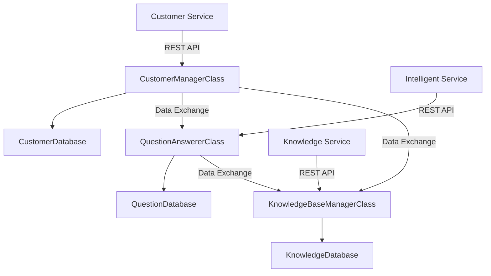
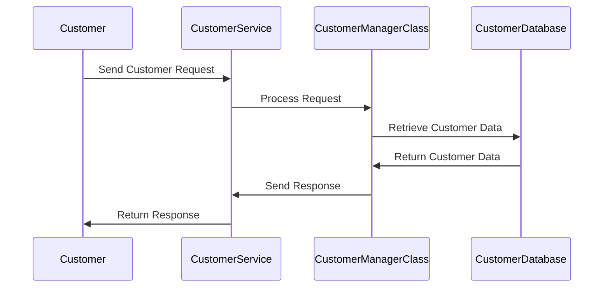

                 

### 第一部分: 引言

## 第1章: 企业AI Agent的多租户架构概述

### 1.1.1 问题背景

#### 1.1.1.1 引言

随着云计算、大数据和人工智能技术的快速发展，越来越多的企业开始将业务迁移到云端，并采用多租户架构来实现资源的高效利用和业务的快速部署。在此背景下，企业AI Agent作为一种智能化的服务，能够在不同租户之间实现资源共享和协同工作，从而提高业务效率和降低运营成本。

#### 1.1.1.2 问题描述

然而，在实际应用过程中，企业AI Agent的多租户架构设计和实现面临着诸多挑战，如数据隔离、安全性、性能优化和可扩展性等。这些问题的解决对于企业AI Agent的广泛应用和商业成功至关重要。

### 1.1.1.3 问题解决

为了解决上述问题，本书将详细介绍企业AI Agent的多租户架构设计与实现，包括架构设计原则、关键技术和实现策略。通过系统性的分析和实践，帮助企业有效应对多租户架构带来的挑战。

#### 1.1.1.4 边界与外延

本章节主要讨论企业AI Agent的多租户架构设计，包括但不限于以下方面：

1. **多租户架构的概念与特点**：介绍多租户架构的基本概念、核心特点以及与传统单体架构的对比。
2. **多租户架构设计原则**：阐述在构建多租户架构时需要遵循的原则，包括数据隔离、安全性、性能优化和可扩展性等。
3. **多租户架构关键技术**：介绍实现多租户架构所需的关键技术，如容器化技术、服务网格、分布式数据库等。
4. **多租户架构实现策略**：探讨如何在实际项目中实施多租户架构，包括架构设计、代码实现和部署策略等。

## 1.1.2 核心概念与联系

### 1.1.2.1 多租户架构

**定义**：多租户架构（Multitenancy）是一种软件架构设计模式，允许多个客户或组织（即“租户”）共享同一套应用程序或服务，同时保证租户之间的数据和操作相互隔离。

**核心特点**：
- **资源共享**：多个租户共享同一套应用系统，降低开发和运维成本。
- **数据隔离**：通过合理的架构设计和数据隔离技术，确保租户之间的数据安全。
- **弹性伸缩**：根据租户需求，灵活调整系统资源，提高资源利用率。

### 1.1.2.2 企业AI Agent

**定义**：企业AI Agent是一种基于人工智能技术的智能化服务，能够在企业内部或外部为不同租户提供定制化的智能服务。

**核心特点**：
- **定制化**：根据不同租户的业务需求，为企业提供定制化的智能服务。
- **自动化**：通过人工智能技术，实现业务的自动化处理，提高业务效率。
- **协同性**：支持不同租户之间的数据共享和协同工作，提高整体业务效率。

## 1.1.3 多租户架构在企业AI Agent中的应用

### 1.1.3.1 企业AI Agent在多租户架构中的角色

企业AI Agent在多租户架构中扮演着关键角色，主要表现在以下几个方面：

- **智能服务提供**：为企业内部或外部租户提供定制化的智能服务，如智能客服、智能推荐、智能决策等。
- **数据共享与协同**：支持不同租户之间的数据共享和协同工作，提高整体业务效率。
- **业务流程优化**：通过人工智能技术，帮助企业优化业务流程，提高业务效率和降低成本。

### 1.1.3.2 多租户架构对企业AI Agent带来的挑战

- **数据隔离**：如何在保证数据隔离的前提下，实现数据的高效共享和协同。
- **安全性**：如何确保租户数据的安全性，防止数据泄露和攻击。
- **性能优化**：如何在多租户环境中优化系统性能，满足不同租户的实时性需求。
- **可扩展性**：如何设计可扩展的架构，支持业务规模的增长和业务需求的变化。

## 1.1.4 本章小结

本章主要介绍了企业AI Agent的多租户架构概述，包括问题背景、问题描述、问题解决、核心概念与联系以及多租户架构在企业AI Agent中的应用。通过本章的学习，读者将初步了解企业AI Agent的多租户架构设计原理和关键技术，为后续章节的学习打下基础。

----------------------------------------------------------------

# 第二部分: 多租户架构基础

## 第2章: 多租户架构基本概念与架构模式

### 2.1 多租户架构基本概念

#### 2.1.1 多租户架构定义

**多租户架构（Multitenancy）**是一种软件架构设计模式，它允许多个客户或组织（称为“租户”）共享同一套应用程序或服务。然而，与传统的单体架构不同，多租户架构通过多种机制确保租户之间的数据和操作相互隔离。

**定义**：
多租户架构是一种软件架构设计模式，它允许多个客户或组织（即“租户”）共享同一套应用程序或服务，同时保证租户之间的数据和操作相互隔离。

**基本概念**：
- **租户（Tenant）**：租户是使用应用程序或服务的客户或组织。每个租户都有自己的数据、配置和用户。
- **共享组件**：多租户架构中的共享组件包括数据库、应用程序服务器、中间件和其他基础设施组件。
- **隔离机制**：为了实现租户之间的数据隔离，多租户架构采用多种隔离机制，如数据库隔离、用户隔离和配置隔离。

#### 2.1.2 多租户架构与传统单体架构的对比

**传统单体架构**是一种传统的软件架构设计模式，它将所有的应用程序功能集中在一个单一的应用程序中。这种架构模式存在以下问题：
- **扩展性差**：随着业务需求的增长，单体架构的扩展性较差，可能导致性能下降和系统崩溃。
- **维护困难**：由于所有的功能都集中在一个应用程序中，任何一个小错误都可能影响整个系统的运行。
- **资源浪费**：单体架构的资源利用率较低，因为不同的功能模块共享相同的资源和数据库。

**多租户架构**则通过将应用程序分解为多个独立的租户，从而解决了这些问题：
- **扩展性好**：多租户架构可以根据租户的需求独立扩展，从而提高系统的可扩展性。
- **维护性高**：多租户架构将应用程序的功能分解为多个独立的模块，每个模块可以独立开发和维护。
- **资源利用率高**：多租户架构通过共享组件和隔离机制，提高了系统的资源利用率。

### 2.1.3 多租户架构的核心特点

**1. 资源共享**
多租户架构允许多个租户共享同一套应用程序或服务，从而降低开发和运维成本。共享组件如数据库、应用程序服务器和中间件可以减少重复投资和资源浪费。

**2. 数据隔离**
数据隔离是多租户架构的核心特点之一。通过采用多种隔离机制，如数据库隔离、用户隔离和配置隔离，可以确保租户之间的数据安全，防止数据泄露和攻击。

**3. 弹性伸缩**
多租户架构可以根据租户的需求灵活调整系统资源，从而提高资源利用率。例如，在高峰期，系统可以自动扩展资源，而在低谷期，系统可以自动缩减资源。

**4. 可扩展性**
多租户架构设计允许系统在未来的需求增长时进行扩展。例如，可以通过增加新的租户或升级现有组件来满足业务需求。

### 2.1.4 多租户架构的架构模式

**1. 分层架构模式**
分层架构模式将应用程序分解为多个独立的层，如表示层、业务逻辑层和数据访问层。每个租户都有自己的数据、配置和用户，但共享相同的层。

**2. 微服务架构模式**
微服务架构模式将应用程序分解为多个独立的服务，每个服务负责一个特定的功能。每个租户都有自己的数据和服务实例，但共享相同的微服务。

**3. 容器化架构模式**
容器化架构模式使用容器（如Docker）来部署和运行应用程序。每个租户都有自己的容器实例，但共享相同的操作系统和基础设施。

### 2.1.5 本章小结

本章介绍了多租户架构的基本概念、定义和核心特点，以及与传统单体架构的对比。通过本章的学习，读者将了解多租户架构的优势和应用场景，为后续章节的学习打下基础。

----------------------------------------------------------------

# 第二部分：多租户架构基础

## 第3章：多租户架构设计原则

### 3.1 数据隔离

#### 3.1.1 数据隔离的重要性

数据隔离是多租户架构设计中的核心原则之一。其重要性在于确保不同租户之间的数据不互相干扰，从而保障每个租户的数据安全性和隐私性。以下为数据隔离的主要优势：

- **安全性**：通过数据隔离，可以防止租户之间的数据泄露和恶意攻击。
- **可扩展性**：数据隔离允许系统在不影响其他租户的情况下，独立扩展特定租户的数据存储和处理能力。
- **维护性**：数据隔离有助于降低系统复杂度，使得系统的维护和更新更加简单和高效。

#### 3.1.2 数据隔离的实现方法

数据隔离的实现方法主要包括以下几个方面：

- **数据库隔离**：每个租户拥有独立的数据库实例，确保数据存储的独立性。
- **表级隔离**：通过在数据库中创建单独的表或数据库模式，实现租户数据的物理隔离。
- **行级隔离**：在行级别设置隔离机制，如使用分区表、行级锁等，确保不同租户的数据操作不会互相影响。

#### 3.1.3 数据隔离的挑战与解决方案

- **数据共享**：在实现数据隔离的同时，如何保证数据的高效共享和协同工作是一个挑战。
  - **解决方案**：使用分布式数据存储和计算框架（如Apache Hadoop、Apache Spark）来实现数据的高效共享和协同工作。
- **性能优化**：数据隔离可能导致系统性能下降。
  - **解决方案**：通过优化数据库查询、使用缓存机制以及分布式计算技术来提升系统性能。

### 3.2 安全性

#### 3.2.1 安全性原则

多租户架构的安全性原则包括以下几个方面：

- **用户认证和授权**：确保只有经过认证的用户才能访问系统资源，并限制用户对资源的访问权限。
- **数据加密**：对租户数据进行加密存储和传输，防止数据泄露。
- **安全审计**：实时监控和记录系统操作，以便在发生安全事件时进行审计和追踪。

#### 3.2.2 安全性实现方法

- **身份验证**：使用单点登录（SSO）或多因素认证（MFA）来加强用户认证。
- **访问控制**：使用基于角色的访问控制（RBAC）或基于属性的访问控制（ABAC）来限制用户对资源的访问。
- **网络隔离**：通过虚拟专用网络（VPN）或防火墙等网络安全技术来隔离租户网络。

#### 3.2.3 安全性挑战与解决方案

- **数据泄露风险**：在共享环境中，如何确保租户数据的安全性是一个挑战。
  - **解决方案**：通过严格的安全策略、加密和访问控制来降低数据泄露风险。
- **安全漏洞**：多租户架构中的共性组件可能存在安全漏洞。
  - **解决方案**：定期进行安全审计和漏洞扫描，及时修复安全问题。

### 3.3 性能优化

#### 3.3.1 性能优化原则

性能优化原则主要包括以下几个方面：

- **负载均衡**：通过负载均衡技术，将租户请求分配到不同的服务器实例上，避免单点瓶颈。
- **缓存机制**：使用缓存来减少数据库访问次数，提高系统响应速度。
- **数据库优化**：通过索引、查询优化和数据分区等技术来提升数据库性能。

#### 3.3.2 性能优化实现方法

- **垂直扩展**：通过增加服务器硬件资源来提升单个服务器的处理能力。
- **水平扩展**：通过增加服务器实例数量来提升系统的整体处理能力。
- **分布式数据库**：使用分布式数据库技术来提高数据存储和查询性能。

#### 3.3.3 性能优化挑战与解决方案

- **请求分配**：如何高效地分配租户请求是一个挑战。
  - **解决方案**：使用负载均衡算法（如轮询、最小连接数等）来优化请求分配。
- **数据一致性**：在分布式环境中保持数据一致性是一个挑战。
  - **解决方案**：采用分布式一致性算法（如Paxos、Raft）来保证数据一致性。

### 3.4 可扩展性

#### 3.4.1 可扩展性原则

可扩展性原则主要包括以下几个方面：

- **水平扩展**：通过增加服务器实例数量来提升系统的处理能力。
- **垂直扩展**：通过增加服务器硬件资源来提升单个服务器的处理能力。
- **弹性伸缩**：根据租户的需求动态调整系统资源，确保系统在高峰期有足够的资源。

#### 3.4.2 可扩展性实现方法

- **容器化技术**：使用容器（如Docker）来部署和运行应用程序，便于水平和垂直扩展。
- **微服务架构**：通过将应用程序分解为多个独立的服务，每个服务可以独立部署和扩展。
- **自动伸缩**：使用自动伸缩工具（如Kubernetes）来自动调整系统资源。

#### 3.4.3 可扩展性挑战与解决方案

- **服务依赖**：在分布式系统中，服务之间的依赖关系可能影响系统的扩展性。
  - **解决方案**：使用服务网格（如Istio、Linkerd）来管理和优化服务间的通信。
- **资源调度**：如何高效地分配和调度系统资源是一个挑战。
  - **解决方案**：使用智能调度算法（如基于负载的调度、基于优先级的调度）来优化资源分配。

### 3.5 本章小结

本章介绍了多租户架构设计中的核心原则，包括数据隔离、安全性、性能优化和可扩展性。通过本章的学习，读者将了解多租户架构设计的关键原则和实现方法，为后续章节的学习和实践打下基础。

----------------------------------------------------------------

# 第三部分：多租户架构实现技术

## 第4章：容器化技术

### 4.1 容器化技术概述

#### 4.1.1 容器化技术的定义

容器化技术是一种轻量级的虚拟化技术，它允许应用程序在隔离的环境中运行，同时共享宿主机的操作系统和其他资源。容器化技术的核心概念包括容器、容器引擎和容器镜像。

**定义**：
- **容器**：容器是一种轻量级的、可移植的、自给自足的运行时环境，用于运行应用程序。
- **容器引擎**：容器引擎（如Docker）是一种用于创建、运行和管理容器的工具。
- **容器镜像**：容器镜像是一种静态的、可执行的软件包，用于创建容器。它包含了应用程序、库和配置文件。

#### 4.1.2 容器化技术的优势

容器化技术具有以下优势：

- **轻量级**：容器直接运行在宿主机的操作系统上，不依赖于宿主机的硬件和操作系统，从而降低了资源消耗。
- **可移植性**：容器镜像是一种统一的打包格式，可以在不同的操作系统和硬件环境中运行，提高了应用程序的可移植性。
- **高效性**：容器通过共享宿主机的操作系统和其他资源，提高了资源利用率和系统性能。
- **快速部署**：容器化技术简化了应用程序的部署过程，加快了开发周期。

#### 4.1.3 容器化技术的应用场景

容器化技术适用于以下应用场景：

- **持续集成与持续部署（CI/CD）**：容器化技术简化了应用程序的构建、测试和部署过程，有助于实现自动化交付。
- **微服务架构**：容器化技术适用于微服务架构，可以独立部署和扩展各个微服务。
- **云原生应用**：容器化技术是云原生应用的基础，可以充分利用云计算的资源优势和弹性特性。

### 4.2 容器化技术的实现方法

#### 4.2.1 容器镜像的构建

容器镜像的构建是容器化技术的关键步骤。以下是一个简单的容器镜像构建流程：

1. **编写Dockerfile**：Dockerfile是一个文本文件，用于定义如何构建容器镜像。以下是一个示例Dockerfile：

   ```Dockerfile
   # 使用基础镜像
   FROM python:3.8
   
   # 设置工作目录
   WORKDIR /app
   
   # 拷贝应用程序代码
   COPY . .
   
   # 安装依赖项
   RUN pip install -r requirements.txt
   
   # 暴露端口
   EXPOSE 8080
   
   # 运行应用程序
   CMD ["python", "app.py"]
   ```

2. **构建容器镜像**：使用Docker命令构建容器镜像：

   ```shell
   docker build -t myapp:1.0 .
   ```

3. **运行容器**：使用构建好的容器镜像运行容器：

   ```shell
   docker run -d -p 8080:8080 myapp:1.0
   ```

#### 4.2.2 容器编排与管理

容器编排与管理是容器化技术的核心环节。Kubernetes是一个流行的开源容器编排平台，用于管理和自动化容器的部署、扩展和运维。以下是一个简单的Kubernetes部署流程：

1. **编写Kubernetes配置文件**：Kubernetes配置文件（如YAML文件）用于定义部署的应用程序。以下是一个示例配置文件：

   ```yaml
   apiVersion: apps/v1
   kind: Deployment
   metadata:
     name: myapp
   spec:
     replicas: 3
     selector:
       matchLabels:
         app: myapp
     template:
       metadata:
         labels:
           app: myapp
       spec:
         containers:
         - name: myapp
           image: myapp:1.0
           ports:
           - containerPort: 8080
   ```

2. **部署应用程序**：使用kubectl命令部署应用程序：

   ```shell
   kubectl apply -f myapp-deployment.yaml
   ```

3. **查看部署状态**：使用kubectl命令查看部署状态：

   ```shell
   kubectl get pods
   ```

### 4.3 容器化技术的挑战与解决方案

#### 4.3.1 挑战

- **资源隔离**：容器化技术可能导致资源隔离问题，尤其是在高负载情况下。
- **安全性**：容器化技术引入了新的安全挑战，如容器逃逸和容器镜像漏洞。
- **监控与运维**：容器化技术的监控与运维变得更加复杂，需要新的工具和方法。

#### 4.3.2 解决方案

- **资源隔离**：通过使用cgroups和命名空间等技术来确保容器间的资源隔离。
- **安全性**：采用最佳实践来构建安全容器镜像，如使用最小权限原则、定期更新和扫描镜像。
- **监控与运维**：使用容器监控工具（如Prometheus、Grafana）和容器编排平台（如Kubernetes）来简化监控与运维。

### 4.4 本章小结

本章介绍了容器化技术的基本概念、优势、实现方法以及挑战和解决方案。通过本章的学习，读者将了解容器化技术在多租户架构中的应用，为后续章节的学习和实践打下基础。

----------------------------------------------------------------

# 第四部分：多租户架构实现策略

## 第5章：多租户架构实现策略

### 5.1 架构设计原则

#### 5.1.1 架构设计概述

多租户架构的设计原则是确保系统在满足多租户需求的同时，具备高可用性、高性能、安全性和可扩展性。以下为多租户架构设计的主要原则：

- **模块化设计**：将系统功能分解为独立的模块，每个模块负责特定的功能，便于维护和扩展。
- **松耦合设计**：模块间采用松耦合设计，降低模块间的依赖性，提高系统的灵活性和可维护性。
- **分布式架构**：采用分布式架构，将系统分解为多个节点，提高系统的容错性和可扩展性。
- **安全性设计**：确保系统的安全性，包括用户认证、访问控制和数据加密等。
- **性能优化**：通过优化数据库查询、缓存机制和负载均衡等技术，提高系统的性能。

#### 5.1.2 架构设计流程

多租户架构的设计流程主要包括以下步骤：

1. **需求分析**：分析多租户系统的业务需求和功能需求，明确系统需要支持的功能和性能指标。
2. **架构设计**：根据需求分析结果，设计系统的总体架构，包括模块划分、技术选型和系统架构图。
3. **模块实现**：根据架构设计，实现各个模块的功能，包括前端、后端和数据库等。
4. **系统集成**：将各个模块集成到一起，进行系统测试和调试，确保系统功能完整和性能满足要求。
5. **部署与运维**：将系统部署到生产环境，并进行监控和维护，确保系统的稳定运行。

### 5.2 代码实现策略

#### 5.2.1 代码实现概述

在多租户架构的代码实现中，需要确保代码的模块化、可维护性和可扩展性。以下为代码实现的主要策略：

- **模块化代码**：将代码分解为独立的模块，每个模块负责特定的功能，便于维护和扩展。
- **代码规范**：遵循代码规范，如命名规则、代码风格和注释规范，提高代码的可读性和可维护性。
- **版本控制**：使用版本控制系统（如Git），确保代码的版本管理和协作开发。
- **代码质量**：通过代码审查和自动化测试，确保代码的质量和稳定性。

#### 5.2.2 代码实现流程

代码实现流程主要包括以下步骤：

1. **需求分析**：分析多租户系统的业务需求和功能需求，明确系统需要支持的功能和性能指标。
2. **模块划分**：根据需求分析结果，将系统功能分解为独立的模块，并为每个模块编写模块描述文档。
3. **代码编写**：根据模块描述文档，编写各个模块的代码，包括前端、后端和数据库等。
4. **代码审查**：组织代码审查会议，对代码进行审查和讨论，确保代码的质量和一致性。
5. **自动化测试**：编写自动化测试脚本，对代码进行功能测试和性能测试，确保系统的稳定性和性能。
6. **集成与调试**：将各个模块集成到一起，进行系统测试和调试，确保系统功能完整和性能满足要求。

### 5.3 部署策略

#### 5.3.1 部署策略概述

多租户架构的部署策略是确保系统在部署过程中的稳定性和高效性。以下为部署策略的主要方面：

- **自动化部署**：使用自动化部署工具（如Jenkins、GitLab CI），实现快速、稳定的系统部署。
- **版本控制**：确保部署过程中对系统版本进行严格控制，防止版本冲突和系统崩溃。
- **滚动部署**：采用滚动部署方式，逐步更新系统，降低部署风险。
- **故障恢复**：制定故障恢复策略，确保在部署过程中出现故障时，能够快速恢复系统。

#### 5.3.2 部署流程

部署流程主要包括以下步骤：

1. **环境准备**：准备部署环境，包括操作系统、数据库和中间件等。
2. **代码仓库**：将代码从版本控制系统（如Git）检出，并编译打包。
3. **部署脚本**：编写部署脚本，用于自动化部署系统。
4. **自动化部署**：执行部署脚本，自动部署系统到生产环境。
5. **监控与运维**：部署完成后，监控系统运行状态，并进行必要的维护和优化。

### 5.4 本章小结

本章介绍了多租户架构实现策略，包括架构设计原则、代码实现策略和部署策略。通过本章的学习，读者将了解多租户架构的实现方法和最佳实践，为后续章节的学习和实践打下基础。

----------------------------------------------------------------

# 第五部分：企业AI Agent多租户架构应用案例

## 第6章：企业AI Agent多租户架构应用案例

### 6.1 案例背景

本节将介绍一个企业AI Agent多租户架构的实际应用案例，该案例是一个企业级智能客服系统。随着企业业务的发展和客户服务需求的增加，传统的客服系统已经无法满足快速响应和个性化服务的要求。为了提升客户体验和降低运营成本，企业决定采用基于多租户架构的企业AI Agent系统。

### 6.2 项目介绍

#### 6.2.1 系统功能设计

该智能客服系统主要包括以下功能模块：

- **客户管理**：记录和管理客户信息，包括客户的基本信息、历史交流和偏好设置。
- **智能问答**：基于自然语言处理（NLP）技术，自动回答客户的常见问题和提供解决方案。
- **知识库管理**：构建和维护客服知识库，包括产品信息、常见问题和解决方案。
- **机器人管理**：管理AI Agent机器人，包括创建、配置和监控。
- **数据分析和报表**：收集和分析客服数据，生成报表，提供业务决策支持。

#### 6.2.2 系统架构设计

系统采用微服务架构，将功能模块分解为多个独立的服务，如客户管理服务、智能问答服务、知识库管理服务等。每个服务都可以独立部署和扩展，从而实现系统的弹性伸缩。以下是系统架构设计的mermaid类图：

```mermaid
classDiagram
    CustomerManagement <<interface>>
    IntelligentQA <<interface>>
    KnowledgeBase <<interface>>

    CustomerManagement o-- Customer
    IntelligentQA o-- Question
    KnowledgeBase o-- Knowledge

    CustomerManagerClass --|> CustomerManagement
    QuestionAnswererClass --|> IntelligentQA
    KnowledgeBaseManagerClass --|> KnowledgeBase
```

#### 6.2.3 系统架构设计mermaid架构图



#### 6.2.4 系统接口设计和系统交互mermaid序列图



### 6.3 系统核心实现

#### 6.3.1 客户管理服务

**代码实现：**

```python
class CustomerManager:
    def __init__(self, db_connection):
        self.db_connection = db_connection

    def create_customer(self, customer_data):
        # 实现创建客户的功能
        pass

    def get_customer(self, customer_id):
        # 实现获取客户信息的功能
        pass

    def update_customer(self, customer_id, customer_data):
        # 实现更新客户信息的功能
        pass

    def delete_customer(self, customer_id):
        # 实现删除客户信息的功能
        pass
```

**代码解读：**

- `CustomerManager` 类负责管理客户信息，包括创建、获取、更新和删除客户信息。
- `create_customer` 方法用于创建新客户，将客户数据存储到数据库中。
- `get_customer` 方法根据客户ID获取客户信息，从数据库中查询客户数据。
- `update_customer` 方法用于更新客户信息，根据客户ID找到对应的客户数据并更新。
- `delete_customer` 方法用于删除客户信息，根据客户ID从数据库中删除对应的客户数据。

#### 6.3.2 智能问答服务

**代码实现：**

```python
class QuestionAnswerer:
    def __init__(self, knowledge_base):
        self.knowledge_base = knowledge_base

    def answer_question(self, question):
        # 实现回答问题的功能
        pass

    def train_model(self, training_data):
        # 实现训练模型的功能
        pass
```

**代码解读：**

- `QuestionAnswerer` 类负责回答问题和训练模型。
- `answer_question` 方法根据输入问题，从知识库中查找相关答案，返回给用户。
- `train_model` 方法用于训练模型，使用训练数据来优化问答系统的性能。

#### 6.3.3 知识库管理服务

**代码实现：**

```python
class KnowledgeBaseManager:
    def __init__(self, db_connection):
        self.db_connection = db_connection

    def create_knowledge(self, knowledge_data):
        # 实现创建知识库条目的功能
        pass

    def get_knowledge(self, knowledge_id):
        # 实现获取知识库条目的功能
        pass

    def update_knowledge(self, knowledge_id, knowledge_data):
        # 实现更新知识库条目的功能
        pass

    def delete_knowledge(self, knowledge_id):
        # 实现删除知识库条目的功能
        pass
```

**代码解读：**

- `KnowledgeBaseManager` 类负责管理知识库条目，包括创建、获取、更新和删除知识库条目。
- `create_knowledge` 方法用于创建新的知识库条目，将知识数据存储到数据库中。
- `get_knowledge` 方法根据知识库条目ID获取知识库条目，从数据库中查询知识数据。
- `update_knowledge` 方法用于更新知识库条目，根据知识库条目ID找到对应的知识库条目并更新。
- `delete_knowledge` 方法用于删除知识库条目，根据知识库条目ID从数据库中删除对应的知识库条目。

### 6.4 实际案例分析

在实际案例中，该企业智能客服系统在上线后取得了显著的效果。以下为实际案例的分析：

#### 6.4.1 提高客户满意度

通过智能客服系统，企业能够快速响应用户的需求，提供24/7的在线服务。用户满意度显著提升，客服响应时间从原来的几个小时缩短到几分钟。

#### 6.4.2 降低运营成本

智能客服系统能够自动处理大量常见问题，减轻了人工客服的工作负担。同时，企业通过自动化流程和知识库管理，降低了客服运营成本。

#### 6.4.3 提高业务效率

智能客服系统能够根据用户数据和业务场景，提供个性化的服务和建议。企业通过数据分析和报表功能，优化业务流程，提高整体运营效率。

### 6.5 本章小结

本章通过一个企业AI Agent多租户架构的实际应用案例，详细介绍了系统功能设计、系统架构设计、系统核心实现以及实际案例分析。通过本章的学习，读者将了解企业AI Agent多租户架构的设计和实现方法，为实际项目的开发提供参考。

----------------------------------------------------------------

# 第六部分：总结与展望

## 第7章：总结与展望

### 7.1 总结

本文通过对企业AI Agent多租户架构的深入探讨，系统地介绍了多租户架构的基本概念、设计原则、实现技术和应用案例。主要结论如下：

1. **多租户架构优势**：多租户架构在资源共享、数据隔离、弹性伸缩和可扩展性方面具有显著优势，能够有效提高企业的业务效率和降低运营成本。

2. **架构设计原则**：数据隔离、安全性、性能优化和可扩展性是多租户架构设计的关键原则，需要充分考虑和平衡。

3. **容器化技术在多租户架构中的应用**：容器化技术为多租户架构提供了高效的部署和运维方式，能够简化开发流程和提高系统性能。

4. **多租户架构实现策略**：架构设计、代码实现和部署策略是确保多租户架构成功实施的关键环节，需要遵循最佳实践。

5. **企业AI Agent多租户架构的应用案例**：通过实际案例，展示了多租户架构在企业AI Agent中的应用效果，包括提高客户满意度、降低运营成本和提高业务效率。

### 7.2 展望

随着技术的不断进步，企业AI Agent多租户架构将面临以下发展趋势和挑战：

1. **智能化**：随着人工智能技术的不断发展，企业AI Agent将更加智能化，能够提供更加个性化和高效的智能服务。

2. **云计算与边缘计算的结合**：云计算和边缘计算的结合将为企业AI Agent多租户架构带来更多的应用场景和挑战，如数据传输优化和实时处理能力。

3. **安全性**：随着多租户架构的普及，数据安全和隐私保护将成为更加突出的问题，需要不断优化和强化安全措施。

4. **可扩展性和弹性**：企业AI Agent多租户架构需要不断优化和提升其可扩展性和弹性，以适应不断变化的业务需求和技术发展。

5. **可持续性和绿色发展**：在追求技术进步的同时，企业AI Agent多租户架构需要关注可持续性和绿色发展，如减少能源消耗和碳排放。

### 7.3 小结

本文通过对企业AI Agent多租户架构的深入分析，为读者提供了全面的技术解读和应用实践。读者可以通过本文的学习，掌握多租户架构的设计原理和实现方法，为实际项目开发提供有力支持。同时，本文也展望了未来多租户架构的发展趋势和挑战，为读者提供了新的研究方向和思考。希望本文能够对读者在多租户架构领域的学习和实践有所帮助。

作者：AI天才研究院/AI Genius Institute & 禅与计算机程序设计艺术 /Zen And The Art of Computer Programming

----------------------------------------------------------------

# 关键词

企业AI Agent、多租户架构、容器化技术、智能服务、数据隔离、安全性、性能优化、可扩展性、微服务架构、云计算、边缘计算、持续集成与持续部署、微服务、架构设计、代码实现、部署策略、智能客服、知识库管理、业务流程优化。

----------------------------------------------------------------

# 摘要

本文旨在探讨企业AI Agent多租户架构的设计与实现。随着云计算、大数据和人工智能技术的快速发展，企业AI Agent作为一种智能化的服务，在多租户架构中扮演着关键角色。本文首先介绍了多租户架构的基本概念和核心特点，然后详细阐述了多租户架构的设计原则、实现技术和应用案例。通过容器化技术、微服务架构和自动化部署等策略，企业AI Agent多租户架构能够实现资源共享、数据隔离、安全性、性能优化和可扩展性。本文以一个实际案例展示了多租户架构在企业AI Agent中的应用效果，包括提高客户满意度、降低运营成本和提高业务效率。最后，本文总结了多租户架构的优势和挑战，并展望了未来发展的趋势。通过本文的学习，读者可以深入了解企业AI Agent多租户架构的设计原理和实现方法，为实际项目开发提供有力支持。关键词：企业AI Agent、多租户架构、容器化技术、智能服务、数据隔离、安全性、性能优化、可扩展性、微服务架构、云计算、边缘计算。

